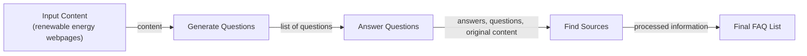
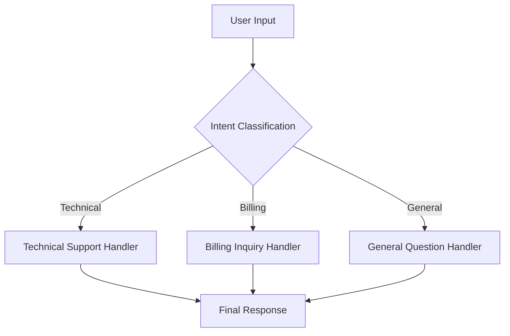
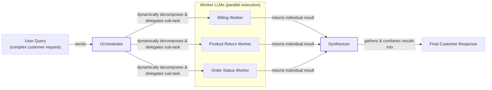

# Lesson 5: Basic AI Workflow Patterns

In the last four lessons, we built our foundation in AI Engineering. We mapped the agent landscape, distinguished between rigid workflows and autonomous agents, and explored the arts of context engineering and structured outputs. Now, we move from individual components to building systems. The real power of LLMs in production comes not from a single, perfect prompt, but from orchestrating multiple calls into a reliable, modular workflow.

On a recent project, we learned this the hard way. We were building a system to generate market analysis reports. Our first attempt was a single, massive prompt that asked the model to research competitors, analyze financial data, summarize findings, and generate a formatted report. The result was a slow, expensive, and unreliable mess. When it failed, we had no idea why. It was a black box.

This lesson covers the fundamental patterns that solve this problem: sequential chaining, parallel execution, conditional routing, and the orchestrator-worker pattern. We will explain why decomposing tasks is more effective than monolithic prompts and show you how to code these patterns from scratch using Google Gemini. By the end, you will have the building blocks to construct sophisticated and reliable AI applications.

## The Challenge with Complex Single LLM Calls

When you first start building with LLMs, the temptation is to create a single, all-encompassing "mega-prompt." You give the model a long list of instructions, hoping it will figure out all the intermediate steps and deliver a perfect final output. This approach rarely works in production.

A single, complex prompt creates a black box. When the output is wrong, you have no way of knowing which of your 15 instructions the model failed to follow. Was it a misinterpretation? A logical error? A hallucination? Debugging becomes a nightmare of endless prompt tweaking [[36]](https://www.decodingai.com/p/stop-building-ai-agents-use-these). This lack of modularity also makes the system difficult to maintain. If you want to improve one part of the task, you risk breaking another, as even small changes can have unpredictable effects on the model's behavior.

This sensitivity is a well-documented issue. Research has shown that even minimal adjustments to a prompt’s format, like reordering examples or changing the wording, can cause accuracy to swing wildly [[1]](https://www.mdpi.com/2079-9292/13/23/4712). This makes monolithic prompts brittle and difficult to reproduce consistently, which is a major problem for production systems that demand reliability.

Furthermore, complex prompts are vulnerable to several well-documented failure modes. The most famous is the "lost-in-the-middle" problem. Research from Stanford and UC Berkeley confirmed that LLMs pay the most attention to the beginning and end of their context window, often ignoring important information buried in the middle [[2]](https://dev.to/thousand_miles_ai/the-lost-in-the-middle-problem-why-llms-ignore-the-middle-of-your-context-window-3al2). This happens due to architectural quirks like causal attention masking, where early tokens get more cumulative attention, and positional encoding decay, which weakens the signal from distant tokens. As your prompt grows, you create more "middle" for information to get lost in.

Overstuffing the context window also has practical consequences. Exceeding the model's token limit will cause an error, forcing you to truncate the input and lose potentially valuable information. Even if you stay within the limit, a large context increases token consumption, which raises both cost and latency. An empirical study comparing single-task prompts against complex multi-task prompts found no universal rule, but showed that performance is highly dependent on the model's architecture. For some models, simpler prompts notably outperformed complex ones [[1]](https://www.mdpi.com/2079-9292/13/23/4712). In essence, a monolithic prompt forces the model to juggle too many cognitive tasks at once, leading to unreliable and often incorrect results.

To see this in practice, let's try to generate a Frequently Asked Questions (FAQ) page from a few documents about renewable energy in a single LLM call.

1.  First, we set up our environment by initializing the Gemini client and defining our model. We will use `gemini-2.5-flash` for its balance of speed and cost.
    ```python
    import asyncio
    from enum import Enum
    import random
    import time
    
    from pydantic import BaseModel, Field
    from google import genai
    from google.genai import types
    
    from lessons.utils import env, pretty_print
    
    env.load(required_env_vars=["GOOGLE_API_KEY"])
    
    client = genai.Client()
    
    MODEL_ID = "gemini-2.5-flash"
    ```
2.  We define our source content. These are three mock webpages on solar, wind, and energy storage.
    ```python
    webpage_1 = {
        "title": "The Benefits of Solar Energy",
        "content": """
        Solar energy is a renewable powerhouse, offering numerous environmental and economic benefits.
        By converting sunlight into electricity through photovoltaic (PV) panels, it reduces reliance on fossil fuels,
        thereby cutting down greenhouse gas emissions. Homeowners who install solar panels can significantly
        lower their monthly electricity bills, and in some cases, sell excess power back to the grid.
        While the initial installation cost can be high, government incentives and long-term savings make
        it a financially viable option for many. Solar power is also a key component in achieving energy
        independence for nations worldwide.
        """,
    }
    
    webpage_2 = {
        "title": "Understanding Wind Turbines",
        "content": """
        Wind turbines are towering structures that capture kinetic energy from the wind and convert it into
        electrical power. They are a critical part of the global shift towards sustainable energy.
        Turbines can be installed both onshore and offshore, with offshore wind farms generally producing more
        consistent power due to stronger, more reliable winds. The main challenge for wind energy is its
        intermittency—it only generates power when the wind blows. This necessitates the use of energy
        storage solutions, like large-scale batteries, to ensure a steady supply of electricity.
        """,
    }
    
    webpage_3 = {
        "title": "Energy Storage Solutions",
        "content": """
        Effective energy storage is the key to unlocking the full potential of renewable sources like solar
        and wind. Because these sources are intermittent, storing excess energy when it's plentiful and
        releasing it when it's needed is crucial for a stable power grid. The most common form of
        large-scale storage is pumped-hydro storage, but battery technologies, particularly lithium-ion,
        are rapidly becoming more affordable and widespread. These batteries can be used in homes, businesses,
        and at the utility scale to balance energy supply and demand, making our energy system more
        resilient and reliable.
        """,
    }
    
    all_sources = [webpage_1, webpage_2, webpage_3]
    
    combined_content = "\n\n".join(
        [f"Source Title: {source['title']}\nContent: {source['content']}" for source in all_sources]
    )
    ```
3.  Now, we create a complex prompt that asks the LLM to generate questions, find answers, and cite sources all at once.
    ```python
    class FAQ(BaseModel):
        """A FAQ is a question and answer pair, with a list of sources used to answer the question."""
        question: str = Field(description="The question to be answered")
        answer: str = Field(description="The answer to the question")
        sources: list[str] = Field(description="The sources used to answer the question")
    
    class FAQList(BaseModel):
        """A list of FAQs"""
        faqs: list[FAQ] = Field(description="A list of FAQs")
    
    n_questions = 10
    prompt_complex = f"""
    Based on the provided content from three webpages, generate a list of exactly {n_questions} frequently asked questions (FAQs).
    For each question, provide a concise answer derived ONLY from the text.
    After each answer, you MUST include a list of the 'Source Title's that were used to formulate that answer.
    
    <provided_content>
    {combined_content}
    </provided_content>
    """.strip()
    
    config = types.GenerateContentConfig(
        response_mime_type="application/json",
        response_schema=FAQList
    )
    response_complex = client.models.generate_content(
        model=MODEL_ID,
        contents=prompt_complex,
        config=config
    )
    result_complex = response_complex.parsed
    ```
    It outputs:
    ```text
    {
      "question": "What is solar energy and how does it work?",
      "answer": "Solar energy is a renewable powerhouse that converts sunlight into electricity through photovoltaic (PV) panels.",
      "sources": [
        "The Benefits of Solar Energy"
      ]
    }
    ...
    {
      "question": "Why is energy storage essential for renewable energy sources like solar and wind?",
      "answer": "Effective energy storage is key to unlocking the full potential of renewable sources because it allows storing excess energy when plentiful and releasing it when needed, which is essential for a stable power grid.",
      "sources": [
        "Energy Storage Solutions",
        "Understanding Wind Turbines"
      ]
    }
    ...
    ```
While the output might seem acceptable at first glance, this approach is fragile. For example, the model might correctly identify that an answer comes from two sources, but it often misses these connections. The more complex the instructions, the higher the chance of subtle inaccuracies. This is why we need a more modular approach.

## The Power of Modularity: Why Chain LLM Calls?

Instead of a single, complex prompt, we can break the task into a sequence of simpler, more focused steps. This technique, known as prompt chaining, connects multiple LLM calls where the output of one step becomes the input for the next [[41]](https://medium.com/@fabiolalli/a-practical-guide-to-prompt-engineering-techniques-and-their-use-cases-5f8574e2cd9a). It is a divide-and-conquer strategy that brings the principles of software engineering. Modularity, testability, and separation of concerns are now part of LLM development.

The benefits are immediate and substantial.

**Improved modularity** is the most significant advantage. Each LLM call in the chain handles a single, well-defined sub-task. This makes the system easier to test, version, and reuse. You can develop and validate each step in isolation, ensuring it performs its specific function reliably before integrating it into the larger workflow [[36]](https://www.decodingai.com/p/stop-building-ai-agents-use-these).

This modularity leads to **enhanced accuracy**. Simpler, targeted prompts reduce the cognitive load on the LLM. Instead of trying to generate questions, answers, and citations simultaneously, the model can focus on one thing at a time. This nearly always results in higher-quality outputs for each step, which compound to a better final result. For instance, AppFolio, a property management AI company, boosted their text-to-data accuracy from 40% to 80% by using a dynamic few-shot prompting chain managed with LangGraph [[20]](https://www.zenml.io/blog/llmops-in-production-457-case-studies-of-what-actually-works).

**Easier debugging** is another key benefit. When a chained workflow fails, you can inspect the input and output of each step to pinpoint exactly where the error occurred. In a monolithic system, you are left guessing. With a chain, you have a clear trace of the data flow, which is very helpful for identifying and fixing issues. Observability tools like LangSmith are designed for this, giving teams at companies like Acxiom visibility into complex multi-agent interactions to optimize token usage and debug workflows [[21]](https://www.zenml.io/blog/llmops-in-production-287-more-case-studies-of-what-actually-works).

Chaining also provides **increased flexibility**. You can swap out or optimize individual components without affecting the rest of the system. For example, you might use a fast, cheap model like Gemini Flash for a simple classification step and a more powerful model like Gemini Pro for a complex generation step, optimizing for both cost and performance [[36]](https://www.decodingai.com/p/stop-building-ai-agents-use-these).

However, chaining is not without its downsides. It introduces latency, as you have to wait for multiple sequential API calls to complete. It can also increase costs due to the overhead of multiple prompts. A more subtle issue is that some instructions lose their meaning when split. A task that requires holistic understanding might perform worse when decomposed.

The most critical risk is **information loss** between steps. As context is passed from one call to the next, important details from early steps can be diluted or forgotten entirely [[22]](https://futureagi.substack.com/p/how-tool-chaining-fails-in-production). Mitigating this requires careful design, such as using structured state objects to pass data and summarizing intermediate results. You also have to manage the "glue code" that connects the steps, which adds engineering overhead. Frameworks like LangGraph can help manage this complexity, but they also add a layer of abstraction.

## Building a Sequential Workflow: FAQ Generation Pipeline

Let's refactor our FAQ generation task into a three-step sequential workflow: Generate Questions, Answer Questions, and Find Sources. This "assembly line" approach ensures each step is focused and produces a reliable output for the next stage. It transforms our black box into a transparent, debuggable pipeline.

By breaking down the problem, we gain control over each part of the process. This allows us to fine-tune prompts, validate intermediate outputs, and isolate failures. This modularity is the foundation of building robust LLM applications.

Image 1: A flowchart illustrating the sequential FAQ generation pipeline.


1.  First, we create a function dedicated to generating questions. The prompt is simple and direct. It asks for one thing: a list of relevant questions. We use a Pydantic model, `QuestionList`, to ensure the output is a structured list of strings. This is a practical application of the structured outputs concept from Lesson 4.
    ```python
    class QuestionList(BaseModel):
        """A list of questions"""
        questions: list[str] = Field(description="A list of questions")
    
    prompt_generate_questions = """
    Based on the content below, generate a list of {n_questions} relevant and distinct questions that a user might have.
    
    <provided_content>
    {combined_content}
    </provided_content>
    """.strip()
    
    def generate_questions(content: str, n_questions: int = 10) -> list[str]:
        """
        Generate a list of questions based on the provided content.
    
        Args:
            content: The combined content from all sources
    
        Returns:
            list: A list of generated questions
        """
        config = types.GenerateContentConfig(
            response_mime_type="application/json",
            response_schema=QuestionList
        )
        response_questions = client.models.generate_content(
            model=MODEL_ID,
            contents=prompt_generate_questions.format(n_questions=n_questions, combined_content=content),
            config=config
        )
    
        return response_questions.parsed.questions
    
    questions = generate_questions(combined_content, n_questions=10)
    ```
    It outputs:
    ```text
    What are the primary environmental and economic benefits of solar energy?
    How do homeowners financially benefit from installing solar panels?
    What is the main process by which wind turbines generate electricity?
    ...
    ```
2.  Next, we define a function to answer a single question. This prompt is tightly focused. Given the context and a question, it must provide a concise answer. This isolation prevents the model from getting distracted by other tasks.
    ```python
    prompt_answer_question = """
    Using ONLY the provided content below, answer the following question.
    The answer should be concise and directly address the question.
    
    <question>
    {question}
    </question>
    
    <provided_content>
    {combined_content}
    </provided_content>
    """.strip()
    
    def answer_question(question: str, content: str) -> str:
        """
        Generate an answer for a specific question using only the provided content.
    
        Args:
            question: The question to answer
            content: The combined content from all sources
    
        Returns:
            str: The generated answer
        """
        answer_response = client.models.generate_content(
            model=MODEL_ID,
            contents=prompt_answer_question.format(question=question, combined_content=content),
        )
        return answer_response.text
    
    test_question = questions[0]
    test_answer = answer_question(test_question, combined_content)
    ```
    It outputs:
    ```text
    The primary environmental benefit of solar energy is cutting down greenhouse gas emissions by reducing reliance on fossil fuels. Economically, it allows homeowners to significantly lower their monthly electricity bills and potentially sell excess power back to the grid.
    ```
3.  Finally, we create a function to find the sources for a given answer. This step adds traceability by linking each answer back to the original content, which is essential for building trust and allowing for verification.
    ```python
    class SourceList(BaseModel):
        """A list of source titles that were used to answer the question"""
        sources: list[str] = Field(description="A list of source titles that were used to answer the question")
    
    prompt_find_sources = """
    You will be given a question and an answer that was generated from a set of documents.
    Your task is to identify which of the original documents were used to create the answer.
    
    <question>
    {question}
    </question>
    
    <answer>
    {answer}
    </answer>
    
    <provided_content>
    {combined_content}
    </provided_content>
    """.strip()
    
    def find_sources(question: str, answer: str, content: str) -> list[str]:
        """
        Identify which sources were used to generate an answer.
    
        Args:
            question: The original question
            answer: The generated answer
            content: The combined content from all sources
    
        Returns:
            list: A list of source titles that were used
        """
        config = types.GenerateContentConfig(
            response_mime_type="application/json",
            response_schema=SourceList
        )
        sources_response = client.models.generate_content(
            model=MODEL_ID,
            contents=prompt_find_sources.format(question=question, answer=answer, combined_content=content),
            config=config
        )
        return sources_response.parsed.sources
    
    test_sources = find_sources(test_question, test_answer, combined_content)
    ```
    It outputs:
    ```text
    ['The Benefits of Solar Energy']
    ```
4.  Now, we combine these functions into a complete sequential workflow. The `sequential_workflow` function orchestrates the entire process. It first calls `generate_questions` to get the list of questions. Then, it iterates through each question, calling `answer_question` and `find_sources` in sequence. The results are assembled into our final list of `FAQ` objects.
    ```python
    def sequential_workflow(content, n_questions=10) -> list[FAQ]:
        """
        Execute the complete sequential workflow for FAQ generation.
    
        Args:
            content: The combined content from all sources
    
        Returns:
            list: A list of FAQs with questions, answers, and sources
        """
        questions = generate_questions(content, n_questions)
    
        final_faqs = []
        for question in questions:
            answer = answer_question(question, content)
            sources = find_sources(question, answer, content)
    
            faq = FAQ(
                question=question,
                answer=answer,
                sources=sources
            )
            final_faqs.append(faq)
    
        return final_faqs
    
    start_time = time.monotonic()
    sequential_faqs = sequential_workflow(combined_content, n_questions=4)
    end_time = time.monotonic()
    print(f"Sequential processing completed in {end_time - start_time:.2f} seconds")
    ```
    It outputs:
    ```text
    Sequential processing completed in 22.20 seconds
    ...
    {
      "question": "Why is energy storage essential for renewable energy sources like solar and wind, and what are the common types of large-scale storage solutions?",
      "answer": "Energy storage is essential for renewable sources like solar and wind because these sources are intermittent, meaning they only generate power when conditions are favorable (e.g., when the sun shines or the wind blows). Storing excess energy when it's plentiful and releasing it when needed is crucial for ensuring a stable and steady supply of electricity and unlocking their full potential for a stable power grid.\n\nCommon types of large-scale storage solutions include pumped-hydro storage and battery technologies, particularly lithium-ion.",
      "sources": [
        "Understanding Wind Turbines",
        "Energy Storage Solutions"
      ]
    }
    ...
    ```
This sequential process is robust and easy to debug, but it is also slow. Each step for each question runs one after another. In our test with four questions, it took over 20 seconds. If we were generating 20 FAQs, we would be waiting for several minutes. This latency is unacceptable for many real-time applications.

## Optimizing Sequential Workflows With Parallel Processing

The bottleneck in our sequential workflow is that we process each question one by one. However, the tasks for each question. Answering it and finding its sources. Are independent of the others. This makes them perfect candidates for parallelization. By running these I/O-bound tasks concurrently, we can notably reduce the total execution time.

We can implement this using Python's `asyncio` library, which is designed for handling concurrent I/O operations like API calls [[27]](https://medium.com/@sizanmahmud08/python-concurrency-showdown-asyncio-vs-threading-vs-multiprocessing-which-should-you-choose-in-31205161899a). The `google-genai` SDK provides an asynchronous client (`client.aio`) that integrates seamlessly with this pattern. For comparison, you could also use `concurrent.futures.ThreadPoolExecutor`, which provides a higher-level interface for threading but with slightly more overhead than `asyncio`'s coroutines [[28]](https://testdriven.io/blog/python-concurrency-parallelism/). We chose `asyncio` for its performance benefits in high-concurrency I/O scenarios.

A critical consideration in production is managing API rate limits. When you fire off many parallel requests, you can easily exceed the requests-per-minute (RPM) or tokens-per-minute (TPM) limits imposed by providers like Google or OpenAI [[9]](https://tianpan.co/blog/2026-03-11-llm-api-resilience-production). A naive implementation will result in `429` errors and failed requests. This is a real-world failure mode that can bring down your application.

To mitigate this, production-grade systems require robust error handling. One common strategy is **exponential backoff with jitter**. Instead of retrying immediately, the client waits for a progressively longer period between retries, with a random element (jitter) to prevent all clients from retrying at the same time [[9]](https://tianpan.co/blog/2026-03-11-llm-api-resilience-production). Another approach is to implement a **client-side request queue** or a **token bucket algorithm**. This smooths out bursty traffic by queuing requests and sending them at a controlled rate, ensuring you stay within your API limits. For now, we will keep it simple and demonstrate the speed benefits of parallelization.

1.  We start by creating `async` versions of our `answer_question` and `find_sources` functions. These use `await client.aio.models.generate_content` to make non-blocking API calls.
    ```python
    async def answer_question_async(question: str, content: str) -> str:
        """
        Async version of answer_question function.
        """
        prompt = prompt_answer_question.format(question=question, combined_content=content)
        response = await client.aio.models.generate_content(
            model=MODEL_ID,
            contents=prompt
        )
        return response.text
    
    async def find_sources_async(question: str, answer: str, content: str) -> list[str]:
        """
        Async version of find_sources function.
        """
        prompt = prompt_find_sources.format(question=question, answer=answer, combined_content=content)
        config = types.GenerateContentConfig(
            response_mime_type="application/json",
            response_schema=SourceList
        )
        response = await client.aio.models.generate_content(
            model=MODEL_ID,
            contents=prompt,
            config=config
        )
        return response.parsed.sources
    ```
2.  Next, we create a `process_question_parallel` function that generates the answer and finds the sources for a single question.
    ```python
    async def process_question_parallel(question: str, content: str) -> FAQ:
        """
        Process a single question by generating answer and finding sources in parallel.
        """
        answer = await answer_question_async(question, content)
        sources = await find_sources_async(question, answer, content)
        return FAQ(
            question=question,
            answer=answer,
            sources=sources
        )
    ```
3.  Finally, our `parallel_workflow` function first generates the questions synchronously (since this is a single API call) and then uses `asyncio.gather` to execute `process_question_parallel` for all questions concurrently.
    ```python
    async def parallel_workflow(content: str, n_questions: int = 10) -> list[FAQ]:
        """
        Execute the complete parallel workflow for FAQ generation.
    
        Args:
            content: The combined content from all sources
    
        Returns:
            list: A list of FAQs with questions, answers, and sources
        """
        questions = generate_questions(content, n_questions)
    
        tasks = [process_question_parallel(question, content) for question in questions]
        parallel_faqs = await asyncio.gather(*tasks)
    
        return parallel_faqs
    
    start_time = time.monotonic()
    parallel_faqs = await parallel_workflow(combined_content, n_questions=4)
    end_time = time.monotonic()
    print(f"Parallel processing completed in {end_time - start_time:.2f} seconds")
    ```
    It outputs:
    ```text
    Parallel processing completed in 8.98 seconds
    ...
    {
      "question": "How do wind turbines generate electricity, and what are the main challenges associated with wind power?",
      "answer": "Wind turbines generate electricity by capturing kinetic energy from the wind and converting it into electrical power. The main challenge associated with wind power is its intermittency, as it only generates power when the wind blows.",
      "sources": [
        "Understanding Wind Turbines"
      ]
    }
    ...
    ```
The results speak for themselves. The parallel workflow completed in just under 9 seconds, compared to over 22 seconds for the sequential version. This is a substantial performance improvement, especially as the number of questions scales. While sequential processing offers predictability and easier debugging, the speed gains from parallelization are often essential for production applications where latency matters.

## Introducing Dynamic Behavior: Routing and Conditional Logic

So far, our workflows have been deterministic. Every input follows the same fixed path. But real-world applications often require dynamic behavior. You need to handle different types of input in different ways. A system that can adapt its process based on the query is more powerful and efficient.

Routing uses conditional logic to direct a workflow down different paths based on the input or an intermediate state. It is a powerful pattern for building adaptable systems that can respond to a variety of user needs. A common implementation uses an initial LLM call as a classifier to determine the user's intent, and then routes the query to a specialized handler. This is another application of the "divide-and-conquer" principle. Instead of creating a single, complex prompt that tries to handle every possible user query, you create multiple, specialized prompts, each optimized for a specific task [[36]](https://www.decodingai.com/p/stop-building-ai-agents-use-these).

This pattern is necessary when fixed workflows fail. For example, a content moderation system might route text with potential hate speech to a specialized analysis chain, while routing benign text to a simple approval step. Prompt engineering for this classification step is important. You need a clear taxonomy of intents and high-quality examples to prevent misclassification, which could send a query down the wrong path. The trade-off is between the maintainability of multiple specialized prompts versus the complexity of a single, highly-optimized prompt that tries to handle all cases. For diverse inputs, routing is almost always the more robust and scalable solution.

This pattern is fundamental to many production systems, including Amazon's multi-LLM routing for customer support, which uses a combination of semantic and classifier-based routing to direct queries [[15]](https://aws.amazon.com/blogs/machine-learning/multi-llm-routing-strategies-for-generative-ai-applications-on-aws/).

## Building a Basic Routing Workflow

Let's build a simple routing system for a customer service bot. The system will first classify the user's intent and then pass the query to one of three specialized handlers: Technical Support, Billing Inquiry, or General Question. This ensures that each query is handled by the logic best suited for it.

Designing the classification step is the most important part. You need a clear, precise, and comprehensive taxonomy of intents. For our example, the intents are distinct, but in a real-world system, you might have overlapping categories. Providing high-quality, representative examples for each intent, especially for edge cases, is key to training a reliable classifier. Some advanced systems even use a two-stage architecture, where a first model retrieves candidate intents and a second, more powerful LLM makes the final selection to improve precision [[11]](https://www.emergentmind.com/topics/llm-based-prompt-routing).

Image 2: A flowchart illustrating a basic routing workflow for customer service.


1.  First, we define an `IntentEnum` and a Pydantic model `UserIntent` to structure our classification output. The classification prompt asks the LLM to categorize the user's query into one of the predefined intents. This creates a formal contract for the classifier's output.
    ```python
    class IntentEnum(str, Enum):
        """
        Defines the allowed values for the 'intent' field.
        Inheriting from 'str' ensures that the values are treated as strings.
        """
        TECHNICAL_SUPPORT = "Technical Support"
        BILLING_INQUIRY = "Billing Inquiry"
        GENERAL_QUESTION = "General Question"
    
    class UserIntent(BaseModel):
        """
        Defines the expected response schema for the intent classification.
        """
        intent: IntentEnum = Field(description="The intent of the user's query")
    
    prompt_classification = """
    Classify the user's query into one of the following categories.
    
    <categories>
    {categories}
    </categories>
    
    <user_query>
    {user_query}
    </user_query>
    """.strip()
    
    
    def classify_intent(user_query: str) -> IntentEnum:
        """Uses an LLM to classify a user query."""
        prompt = prompt_classification.format(
            user_query=user_query,
            categories=[intent.value for intent in IntentEnum]
        )
        config = types.GenerateContentConfig(
            response_mime_type="application/json",
            response_schema=UserIntent
        )
        response = client.models.generate_content(
            model=MODEL_ID,
            contents=prompt,
            config=config
        )
        return response.parsed.intent
    
    
    query_1 = "My internet connection is not working."
    query_2 = "I think there is a mistake on my last invoice."
    query_3 = "What are your opening hours?"
    
    intent_1 = classify_intent(query_1)
    intent_2 = classify_intent(query_2)
    intent_3 = classify_intent(query_3)
    ```
    It outputs:
    ```text
    Intent 1: IntentEnum.TECHNICAL_SUPPORT
    Intent 2: IntentEnum.BILLING_INQUIRY
    Intent 3: IntentEnum.GENERAL_QUESTION
    ```
2.  Next, we define a specialized prompt for each intent. The technical support prompt asks for troubleshooting details, the billing prompt asks for an account number, and the general prompt gives a polite refusal. Each prompt is tailored to its specific context.
    ```python
    prompt_technical_support = """
    You are a helpful technical support agent.
    
    Here's the user's query:
    <user_query>
    {user_query}
    </user_query>
    
    Provide a helpful first response, asking for more details like what troubleshooting steps they have already tried.
    """.strip()
    
    prompt_billing_inquiry = """
    You are a helpful billing support agent.
    
    Here's the user's query:
    <user_query>
    {user_query}
    </user_query>
    
    Acknowledge their concern and inform them that you will need to look up their account, asking for their account number.
    """.strip()
    
    prompt_general_question = """
    You are a general assistant.
    
    Here's the user's query:
    <user_query>
    {user_query}
    </user_query>
    
    Apologize that you are not sure how to help.
    """.strip()
    ```
3.  The `handle_query` function acts as our router. It takes the user's query and the classified intent, selects the appropriate prompt, and generates a response. A default or catch-all route is included to handle cases where the intent is not recognized, which is a best practice for robust systems.
    ```python
    def handle_query(user_query: str, intent: str) -> str:
        """Routes a query to the correct handler based on its classified intent."""
        if intent == IntentEnum.TECHNICAL_SUPPORT:
            prompt = prompt_technical_support.format(user_query=user_query)
        elif intent == IntentEnum.BILLING_INQUIRY:
            prompt = prompt_billing_inquiry.format(user_query=user_query)
        elif intent == IntentEnum.GENERAL_QUESTION:
            prompt = prompt_general_question.format(user_query=user_query)
        else:
            prompt = prompt_general_question.format(user_query=user_query)
        response = client.models.generate_content(
            model=MODEL_ID,
            contents=prompt
        )
        return response.text
    
    
    response_1 = handle_query(query_1, intent_1)
    response_2 = handle_query(query_2, intent_2)
    response_3 = handle_query(query_3, intent_3)
    ```
    It outputs:
    ```text
    Response 1: Hello there! I'm sorry to hear you're having trouble with your internet connection... Have you already tried any troubleshooting steps yourself?
    Response 2: I'm sorry to hear you think there might be a mistake on your last invoice. I can definitely help you look into that! To access your account and investigate the charges, could you please provide your account number?
    Response 3: I apologize, but I'm not sure how to help with that. As an AI, I don't have a physical location or opening hours.
    ```
This simple routing workflow demonstrates how to build more intelligent and specialized AI systems. By classifying intent upfront, we ensure that each query is handled by the most appropriate logic, leading to better user experiences and more efficient processing.

## Orchestrator-Worker Pattern: Dynamic Task Decomposition

The patterns we have discussed so far are powerful, but they rely on predefined paths. The orchestrator-worker pattern takes this a step further by introducing dynamic task decomposition. In this workflow, a central "orchestrator" LLM analyzes a complex query and breaks it down into a series of sub-tasks at runtime.

These sub-tasks are then delegated to specialized "worker" LLMs or tools, which can execute in parallel [[17]](https://mlpills.substack.com/p/diy-17-orchestrator-worker-llm-agent). Finally, a "synthesizer" LLM gathers the results from the workers and combines them into a single, coherent response.

This pattern is exceptionally well-suited for complex, unpredictable tasks where the necessary steps cannot be known in advance [[16]](https://agents.kour.me/orchestrator-worker/). Examples include generating a research report, which might involve web searches, data analysis, and text generation, or handling a multi-part customer request. The key difference from simple parallelization is this flexibility. Sub-tasks are not predefined; they are determined by the orchestrator based on the specific input.

However, this pattern introduces new challenges. The orchestrator can become a bottleneck if it is slow or inefficient. To mitigate this, you can use asynchronous task delegation or cache results for common sub-tasks. Incomplete decomposition is another risk. If the orchestrator misses a necessary sub-task, the final output will be incomplete. You can address this with careful prompt engineering that encourages the orchestrator to be thorough.

Reconciling conflicting outputs from different workers is also a major challenge. One worker might return a "shipped" status while another says "processing." The synthesizer needs a strategy to handle these conflicts, such as a voting mechanism or a human-in-the-loop for verification [[34]](https://www.socure.com/tech-blog/build-advanced-customer-support-llm-multi-agent-workflow). Ensuring clear boundaries between workers with consistent input/output schemas (using Pydantic, as we learned in Lesson 4) is essential for reliable communication. Finally, the synthesizer itself must be prompted to combine diverse, structured outputs into a cohesive message while maintaining a consistent tone.

Let's build an orchestrator-worker system to handle our complex customer query example.

Image 3: A flowchart depicting the orchestrator-worker pattern for dynamic task decomposition.


1.  We start by defining the orchestrator. Its prompt instructs it to break down a user query into a list of structured `Task` objects. Each task has a `query_type` and the necessary parameters, such as `invoice_number` or `order_id`.
    ```python
    class QueryTypeEnum(str, Enum):
        """The type of query to be handled."""
        BILLING_INQUIRY = "BillingInquiry"
        PRODUCT_RETURN = "ProductReturn"
        STATUS_UPDATE = "StatusUpdate"
    
    class Task(BaseModel):
        """A task to be performed."""
        query_type: QueryTypeEnum = Field(description="The type of query to be handled.")
        invoice_number: str | None = Field(description="The invoice number to be used for the billing inquiry.", default=None)
        product_name: str | None = Field(description="The name of the product to be returned.", default=None)
        reason_for_return: str | None = Field(description="The reason for returning the product.", default=None)
        order_id: str | None = Field(description="The order ID to be used for the status update.", default=None)
    
    class TaskList(BaseModel):
        """A list of tasks to be performed."""
        tasks: list[Task] = Field(description="A list of tasks to be performed.")
    
    prompt_orchestrator = f"""
    You are a master orchestrator. Your job is to break down a complex user query into a list of sub-tasks.
    Each sub-task must have a "query_type" and its necessary parameters.
    
    The possible "query_type" values and their required parameters are:
    1. "{QueryTypeEnum.BILLING_INQUIRY.value}": Requires "invoice_number".
    2. "{QueryTypeEnum.PRODUCT_RETURN.value}": Requires "product_name" and "reason_for_return".
    3. "{QueryTypeEnum.STATUS_UPDATE.value}": Requires "order_id".
    
    Here's the user's query.
    
    <user_query>
    {{query}}
    </user_query>
    """.strip()
    
    
    def orchestrator(query: str) -> list[Task]:
        """Breaks down a complex query into a list of tasks."""
        prompt = prompt_orchestrator.format(query=query)
        config = types.GenerateContentConfig(
            response_mime_type="application/json",
            response_schema=TaskList
        )
        response = client.models.generate_content(
            model=MODEL_ID,
            contents=prompt,
            config=config
        )
        return response.parsed.tasks
    ```
2.  Next, we define our workers. Each worker is a Python function that handles a specific task type. For example, `handle_billing_worker` extracts the user's concern about an invoice and simulates opening an investigation. The workers for product returns and status updates simulate generating an RMA and fetching order details, respectively.
    ```python
    def handle_billing_worker(invoice_number: str, original_user_query: str) -> BillingTask:
        # ... implementation ...
    
    def handle_return_worker(product_name: str, reason_for_return: str) -> ReturnTask:
        # ... implementation ...
    
    def handle_status_worker(order_id: str) -> StatusTask:
        # ... implementation ...
    ```
3.  The synthesizer's job is to take the structured outputs from all the workers and compose a single, user-friendly response. Its prompt instructs it to combine the different pieces of information into a cohesive email.
    ```python
    prompt_synthesizer = """
    You are a master communicator. Combine several distinct pieces of information from our support team into a single, well-formatted, and friendly email to a customer.
    
    Here are the points to include, based on the actions taken for their query:
    <points>
    {formatted_results}
    </points>
    
    Combine these points into one cohesive response.
    Start with a friendly greeting (e.g., "Dear Customer," or "Hi there,") and end with a polite closing (e.g., "Sincerely," or "Best regards,").
    Ensure the tone is helpful and professional.
    """.strip()
    
    
    def synthesizer(results: list[Task]) -> str:
        """Combines structured results from workers into a single user-facing message."""
        # ... implementation ...
    ```
4.  Finally, we tie everything together in the `process_user_query` function. This function orchestrates the entire flow: it calls the orchestrator, dispatches tasks to the appropriate workers, and sends the results to the synthesizer.
    ```python
    complex_customer_query = """
    Hi, I'm writing to you because I have a question about invoice #INV-7890. It seems higher than I expected.
    Also, I would like to return the 'SuperWidget 5000' I bought because it's not compatible with my system.
    Finally, can you give me an update on my order #A-12345?
    """.strip()
    
    def process_user_query(user_query):
        """Processes a query using the Orchestrator-Worker-Synthesizer pattern."""
    
        pretty_print.wrapped(
            text=user_query,
            title="User query"
        )
    
        # 1. Run orchestrator
        tasks_list = orchestrator(user_query)
        # ...
    
        # 2. Run workers
        worker_results = []
        # ...
    
        # 3. Run synthesizer
        if worker_results:
            final_user_message = synthesizer(worker_results)
            # ...
    
    process_user_query(complex_customer_query)
    ```
    The orchestrator correctly deconstructs the query into three tasks:
    ```text
    Deconstructed task 1: { "query_type": "BillingInquiry", "invoice_number": "INV-7890", ... }
    Deconstructed task 2: { "query_type": "ProductReturn", "product_name": "SuperWidget 5000", ... }
    Deconstructed task 3: { "query_type": "StatusUpdate", "order_id": "A-12345", ... }
    ```
    Each worker processes its task and returns a structured result:
    ```text
    Worker result 1: { "query_type": "BillingInquiry", "invoice_number": "INV-7890", "user_concern": "The invoice seems higher than expected.", ... }
    Worker result 2: { "query_type": "ProductReturn", "product_name": "SuperWidget 5000", "rma_number": "RMA-12345", ... }
    Worker result 3: { "query_type": "StatusUpdate", "order_id": "A-12345", "current_status": "Shipped", ... }
    ```
    And the synthesizer combines these into a final, helpful response:
    ```text
    Final synthesized response:
    
    Hi there,
    
    Thank you for reaching out. Here's an update on your requests:
    
    Regarding your BillingInquiry:
      - Invoice Number: INV-7890
      - Your Stated Concern: "The invoice seems higher than expected."
      - Our Action: An investigation (Case ID: INV_CASE_4567) has been opened regarding your concern.
      - Expected Resolution: We will get back to you within 2 business days.
    
    Regarding your ProductReturn:
      - Product: SuperWidget 5000
      - Reason for Return: "it's not compatible with my system"
      - Return Authorization (RMA): RMA-67890
      - Instructions: Please pack the 'SuperWidget 5000' securely...
    
    Regarding your StatusUpdate:
      - Order ID: A-12345
      - Current Status: Shipped
      - Carrier: SuperFast Shipping
      - Tracking Number: SF123456
      - Delivery Estimate: Tomorrow
    
    If you have any other questions, please let us know.
    
    Best regards,
    The Support Team
    ```
This example shows the power of the orchestrator-worker pattern. It can handle complex, multi-part queries with a level of flexibility that would be impossible with a fixed workflow, demonstrating a key step towards building more advanced and autonomous AI systems.

## Conclusion

In this lesson, we have moved from single LLM calls to building structured, multi-step workflows. We have seen how breaking down complex problems into smaller, manageable parts is fundamental to creating reliable, maintainable, and scalable AI applications. Whether through sequential chaining, parallel processing, dynamic routing, or the orchestrator-worker pattern. These patterns are not just theoretical concepts; they are the bread and butter of production AI engineering.

These workflows are the essential building blocks you will use in more advanced systems. In our next lesson, we will give our workflows the ability to interact with the outside world by introducing agent tools and function calling. This will allow our systems to not just process information, but to take action, opening up a whole new range of possibilities.

## References

- [1] [Comparative Analysis of Prompt Strategies for Large Language Models: Single-Task vs. Multitask Prompts](https://www.mdpi.com/2079-9292/13/23/4712)
- [2] [The "Lost in the Middle" Problem — Why LLMs Ignore the Middle of Your Context Window](https://dev.to/thousand_miles_ai/the-lost-in-the-middle-problem-why-llms-ignore-the-middle-of-your-context-window-3al2)
- [3] [FLARE framework analyzes GPT-4 Turbo 'Inconclusive' classifications](https://aclanthology.org/2025.ommm-1.4.pdf)
- [4] [ZeMPE benchmark evaluates 13 LLMs](https://aclanthology.org/2025.gem-1.14.pdf)
- [5] [Underspecification analysis: prompts with more requirements drop accuracy](https://arxiv.org/html/2505.13360v1)
- [6] [Challenges with rate limiting and handling API responses in high volume requests](https://discuss.ai.google.dev/t/challenges-with-rate-limiting-and-handling-api-responses-in-high-volume-requests/61903)
- [7] [429 on Vertex AI API - how to send 5-20 parallel gemini api requests without hitting rate limits](https://stackoverflow.com/questions/79924021/429-on-vertex-ai-api-how-to-send-5-20-parallel-gemini-api-requests-without-hitt)
- [8] [LLM API Resilience in Production: Rate Limits, Failover, and the Hidden Costs of Naive Retry Logic](https://tianpan.co/blog/2026-03-11-llm-api-resilience-production)
- [9] [LLM-Based Prompt Routing](https://www.emergentmind.com/topics/llm-based-prompt-routing)
- [10] [Universal Model Routing for dynamic LLM pools](https://arxiv.org/html/2502.08773v1)
- [11] [Multi-LLM routing strategies for generative AI applications on AWS](https://aws.amazon.com/blogs/machine-learning/multi-llm-routing-strategies-for-generative-ai-applications-on-aws/)
- [12] [The Orchestrator-Worker Pattern](https://agents.kour.me/orchestrator-worker/)
- [13] [DIY #17 Orchestrator-Worker LLM Agent Pattern](https://mlpills.substack.com/p/diy-17-orchestrator-worker-llm-agent)
- [14] [Building a Self-Healing AI Orchestrator with Reflexion Patterns](https://online.stevens.edu/blog/building-self-healing-ai-orchestrator-reflexion-patterns/)
- [15] [Claude Cookbook: Orchestrator-Workers Pattern](https://platform.claude.com/cookbook/patterns-agents-orchestrator-workers)
- [16] [LLMOps in Production: 457 Case Studies of What Actually Works](https://www.zenml.io/blog/llmops-in-production-457-case-studies-of-what-actually-works)
- [17] [LLMOps in Production: 287 More Case Studies of What Actually Works](https://www.zenml.io/blog/llmops-in-production-287-more-case-studies-of-what-actually-works)
- [18] [How Tool Chaining Fails in Production LLM Agents and How to Fix It](https://futureagi.substack.com/p/how-tool-chaining-fails-in-production)
- [19] [ChainRAG: A progressive retrieval framework](https://aclanthology.org/2025.acl-long.1089.pdf)
- [20] [Keeping AI agents grounded: context engineering strategies that prevent context rot](https://milvus.io/blog/keeping-ai-agents-grounded-context-engineering-strategies-that-prevent-context-rot-using-milvus.md)
- [21] [Context Isolation Through Subagent Architectures](https://www.morphllm.com/context-rot)
- [22] [Concurrency Patterns in Python](https://santhalakshminarayana.github.io/blog/concurrency-patterns-python)
- [23] [Python Concurrency Showdown: Asyncio vs. Threading vs. Multiprocessing](https://medium.com/@sizanmahmud08/python-concurrency-showdown-asyncio-vs-threading-vs-multiprocessing-which-should-you-choose-in-31205161899a)
- [24] [Parallelism, Concurrency, and AsyncIO in Python by Example](https://testdriven.io/blog/python-concurrency-parallelism/)
- [25] [Concurrency and Parallelism in Python: Threads, Multiprocessing, and Async Programming](https://dev.to/nkpydev/concurrency-and-parallelism-in-python-threads-multiprocessing-and-async-programming-64d)
- [26] [Concurrency in async/await and Threading](https://blog.jetbrains.com/pycharm/2025/06/concurrency-in-async-await-and-threading/)
- [27] [Build an Advanced Customer Support LLM with a Multi-Agent Workflow](https://www.socure.com/tech-blog/build-advanced-customer-support-llm-multi-agent-workflow)
- [28] [AI Agent Orchestration Patterns](https://productschool.com/blog/artificial-intelligence/ai-agent-orchestration-patterns)
- [29] [Stop Building AI Agents. Use These Workflow Patterns Instead](https://www.decodingai.com/p/stop-building-ai-agents-use-these)
- [30] [Choosing the Right Orchestration Pattern for Multi-Agent Systems](https://www.kore.ai/blog/choosing-the-right-orchestration-pattern-for-multi-agent-systems)
- [31] [Five proven prompt engineering techniques](https://www.lennysnewsletter.com/p/five-proven-prompt-engineering-techniques)
- [32] [A Practical Guide to Prompt Engineering Techniques and Their Use Cases](https://medium.com/@fabiolalli/a-practical-guide-to-prompt-engineering-techniques-and-their-use-cases-5f8574e2cd9a)
- [33] [10 Prompt Engineering Techniques for Super-Simple Explanation](https://www.scrum.org/resources/blog/10-prompt-engineering-techniques-super-simple-explanation)
- [34] [Prompt Engineering Techniques](https://www.k2view.com/blog/prompt-engineering-techniques/)
- [35] [Orchestrating Multi-Step LLM Chains: Best Practices](https://deepchecks.com/orchestrating-multi-step-llm-chains-best-practices/)
- [36] [LLM Workflow Patterns](https://mlpills.substack.com/p/issue-110-llm-workflow-patterns)
- [37] [Compounding Error Effect in Large Language Models: A Growing Challenge](https://wand.ai/blog/compounding-error-effect-in-large-language-models-a-growing-challenge)
- [38] [SPRINT: Interleaved planning and parallel execution in reasoning models](https://scalingintelligence.stanford.edu/pubs/sprint.pdf)
- [39] [Developer’s guide to multi-agent patterns in ADK](https://developers.googleblog.com/developers-guide-to-multi-agent-patterns-in-adk/)
- [40] [Agentic AI Design Patterns](https://www.linkedin.com/posts/chiragsubramanian_agentic-ai-design-patterns-my-practical-activity-7416830806939230208-nRFc)
- [41] [Building Effective Agents](https://www.anthropic.com/engineering/building-effective-agents)
- [42] [AI Prompt Orchestration: Techniques and Tools You Need](https://www.scoutos.com/blog/ai-prompt-orchestration-techniques-and-tools-you-need)
- [43] [Design Pattern: Prompt Chaining - Building Reliable LLM Workflows](https://datalearningscience.com/p/design-pattern-prompt-chaining-building)
- [44] [Prompt Chaining: A Guide to Building Complex LLM Workflows](https://blog.udemy.com/prompt-chaining/)
- [45] [Agentic Design Patterns: Prompt Chaining](https://agentic-design.ai/patterns/prompt-chaining)
- [Basic Multi-LLM Workflows](https://github.com/hugobowne/building-with-ai/blob/main/notebooks/01-agentic-continuum.ipynb)
- [Building Effective Agents - Anthropic](https://www.anthropic.com/engineering/building-effective-agents)
- [Chain Prompts - Anthropic](https://docs.anthropic.com/en/docs/build-with-claude/prompt-engineering/chain-prompts)
- [Claude 4 Best Practices](https://docs.anthropic.com/en/docs/build-with-claude/prompt-engineering/claude-4-best-practices)
- [LangGraph Workflows](https://langchain-ai.github.io/langgraphjs/tutorials/workflows)
- [Notebook code for the lesson](https://github.com/towardsai/course-ai-agents/blob/dev/lessons/05_workflow_patterns/notebook.ipynb)
- [Prompt Chaining Guide](https://www.promptingguide.ai/techniques/prompt_chaining)