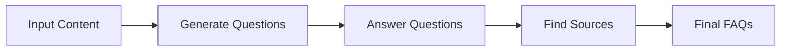
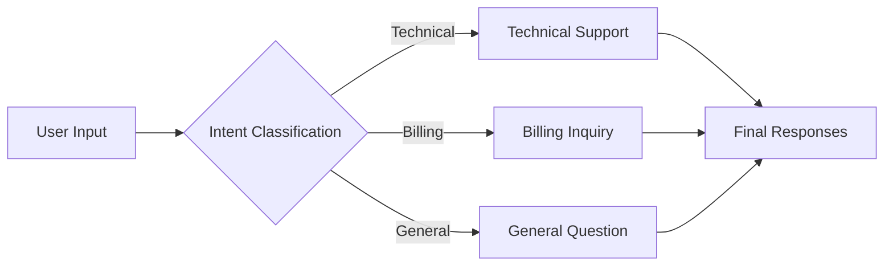
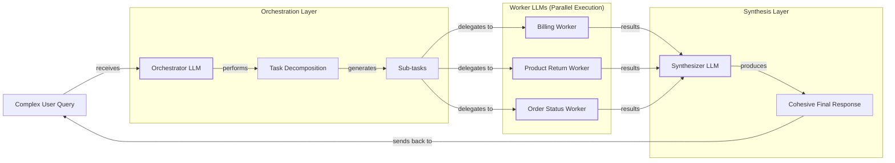

# Lesson 5: Basic Workflow Patterns

In the last four lessons, we've built our foundation. We’ve mapped the AI engineering landscape, distinguished between rule-based workflows and autonomous agents, and covered the essentials of context engineering and structured outputs. You now understand how to get the right information *into* an LLM and how to get reliable data *out* of it.

But in the real world, complex problems are rarely solved with a single LLM call. Trying to stuff too many instructions into one prompt is a classic mistake that keeps projects in "PoC purgatory." The prompt becomes a tangled, monolithic beast that's impossible to debug and fails inconsistently. The solution is to think like an engineer: break the problem down.

This lesson introduces the fundamental building blocks for creating robust, multi-step LLM applications. We will move beyond single prompts and learn how to construct workflows by composing multiple LLM calls. We will cover four essential patterns:
- **Sequential Chaining**: Executing tasks in a step-by-step sequence.
- **Parallelization**: Running independent tasks concurrently to save time.
- **Routing**: Using conditional logic to direct tasks down different paths.
- **Orchestrator-Worker**: Dynamically decomposing complex tasks for specialized handlers.

Mastering these patterns is the first major step toward building sophisticated AI systems that are modular, reliable, and ready for production.

## The Challenge with Complex Single LLM Calls

Before we build better workflows, let's dissect the problem with the monolithic approach. Why does a single, large prompt often fail for complex tasks? The issues are both practical and architectural.

A monolithic prompt is a black box. When it fails, you have no visibility into which instruction or piece of context caused the error. Debugging becomes a frustrating game of trial and error. This lack of modularity also makes the system brittle; you cannot update one part of the logic without risking unintended consequences elsewhere.

Furthermore, these long prompts are susceptible to the "lost-in-the-middle" problem. Research from Stanford and UC Berkeley has shown that LLMs exhibit a U-shaped performance curve when processing long contexts [[1]](https://dev.to/thousand_miles_ai/the-lost-in-the-middle-problem-why-llms-ignore-the-middle-of-your-context-window-3al2). They pay close attention to information at the beginning and end of the prompt but tend to ignore what is in the middle. This is not a bug in a specific model but a structural bias rooted in how attention mechanisms work, caused by factors like Causal Attention Masking and Positional Encoding Decay [[1]](https://dev.to/thousand_miles_ai/the-lost-in-the-middle-problem-why-llms-ignore-the-middle-of-your-context-window-3al2).

Overstuffing the context window also creates practical problems. Every model has a finite context limit. Exceeding it means your input will be truncated, silently dropping potentially critical information before the model even sees it. This leads to incomplete or incorrect outputs without any explicit error, making it a difficult bug to track down.

Monolithic prompts are also highly sensitive to minor changes. Research has shown that slight variations in wording, the order of examples, or even formatting can drastically alter the output and increase error rates. One study using the FLARE framework found that adding few-shot examples to a complex prompt caused a 38-fold increase in errors, primarily due to parsing failures where the model was overwhelmed by the examples [[2]](https://aclanthology.org/2025.ommm-1.4.pdf). This makes achieving reproducible results a significant challenge.

Packing too many requirements into one call also increases the failure rate. One study found that model accuracy can drop from 98.7% for a single requirement to 85% for 19 requirements, as the model struggles to follow conflicting or complex instructions [[3]](https://arxiv.org/html/2505.13360v1). Empirical studies have also shown that the effectiveness of a complex, multi-task prompt is highly dependent on the specific model, with performance varying unpredictably and making reliability a major challenge [[4]](https://www.mdpi.com/2079-9292/13/23/4712). This often leads to higher token consumption and less reliable outputs.

Let's see this in practice with an example. We will try to generate a Frequently Asked Questions (FAQ) page from a few documents about renewable energy, asking the model to generate questions, find answers, and cite sources all in one go.

### Setup

First, we set up our environment by initializing the Gemini client and defining our model. We will use `gemini-2.5-flash` for these examples, as it is fast and cost-effective.

1.  We begin by setting up our environment. This involves importing the necessary libraries and initializing the Gemini client.
    ```python
    import asyncio
    from enum import Enum
    import random
    import time
    
    from pydantic import BaseModel, Field
    from google import genai
    from google.genai import types
    
    from lessons.utils import env, pretty_print
    
    env.load(required_env_vars=["GOOGLE_API_KEY"])
    
    client = genai.Client()
    
    MODEL_ID = "gemini-2.5-flash"
    ```

2.  Next, we define our mock source documents about renewable energy.
    ```python
    webpage_1 = {
        "title": "The Benefits of Solar Energy",
        "content": """
        Solar energy is a renewable powerhouse, offering numerous environmental and economic benefits.
        By converting sunlight into electricity through photovoltaic (PV) panels, it reduces reliance on fossil fuels,
        thereby cutting down greenhouse gas emissions. Homeowners who install solar panels can significantly
        lower their monthly electricity bills, and in some cases, sell excess power back to the grid.
        While the initial installation cost can be high, government incentives and long-term savings make
        it a financially viable option for many. Solar power is also a key component in achieving energy
        independence for nations worldwide.
        """,
    }
    
    webpage_2 = {
        "title": "Understanding Wind Turbines",
        "content": """
        Wind turbines are towering structures that capture kinetic energy from the wind and convert it into
        electrical power. They are a critical part of the global shift towards sustainable energy.
        Turbines can be installed both onshore and offshore, with offshore wind farms generally producing more
        consistent power due to stronger, more reliable winds. The main challenge for wind energy is its
        intermittency—it only generates power when the wind blows. This necessitates the use of energy
        storage solutions, like large-scale batteries, to ensure a steady supply of electricity.
        """,
    }
    
    webpage_3 = {
        "title": "Energy Storage Solutions",
        "content": """
        Effective energy storage is the key to unlocking the full potential of renewable sources like solar
        and wind. Because these sources are intermittent, storing excess energy when it's plentiful and
        releasing it when it's needed is crucial for a stable power grid. The most common form of
        large-scale storage is pumped-hydro storage, but battery technologies, particularly lithium-ion,
        are rapidly becoming more affordable and widespread. These batteries can be used in homes, businesses,
        and at the utility scale to balance energy supply and demand, making our energy system more
        resilient and reliable.
        """,
    }
    
    all_sources = [webpage_1, webpage_2, webpage_3]
    
    combined_content = "\n\n".join(
        [f"Source Title: {source['title']}\nContent: {source['content']}" for source in all_sources]
    )
    ```

3.  Now, we define our Pydantic models for structured output and craft the complex, all-in-one prompt.
    ```python
    class FAQ(BaseModel):
        """A FAQ is a question and answer pair, with a list of sources used to answer the question."""
        question: str = Field(description="The question to be answered")
        answer: str = Field(description="The answer to the question")
        sources: list[str] = Field(description="The sources used to answer the question")
    
    class FAQList(BaseModel):
        """A list of FAQs"""
        faqs: list[FAQ] = Field(description="A list of FAQs")
    
    n_questions = 10
    prompt_complex = f"""
    Based on the provided content from three webpages, generate a list of exactly {n_questions} frequently asked questions (FAQs).
    For each question, provide a concise answer derived ONLY from the text.
    After each answer, you MUST include a list of the 'Source Title's that were used to formulate that answer.
    
    <provided_content>
    {combined_content}
    </provided_content>
    """.strip()
    ```

4.  Finally, we call the model and inspect the result.
    ```python
    config = types.GenerateContentConfig(
        response_mime_type="application/json",
        response_schema=FAQList
    )
    response_complex = client.models.generate_content(
        model=MODEL_ID,
        contents=prompt_complex,
        config=config
    )
    result_complex = response_complex.parsed
    ```
    It outputs:
    ```json
    {
      "question": "Why is energy storage crucial for renewable energy sources like solar and wind?",
      "answer": "Effective energy storage is key to unlocking the full potential of renewable sources because it allows storing excess energy when plentiful and releasing it when needed, which is crucial for a stable power grid.",
      "sources": [
        "Energy Storage Solutions",
        "Understanding Wind Turbines"
      ]
    }
    ```

While the output might look acceptable at first glance, this approach is fragile. For instance, the model might correctly identify one source but miss others that contributed to the answer. As we add more instructions or documents, the likelihood of such subtle failures increases, making the system unreliable in production.

## The Power of Modularity: Why Chain LLM Calls?

The engineering solution to complex, unreliable systems is modularity. Instead of one monolithic prompt, we can break the task into a series of smaller, focused steps. This is prompt chaining: connecting multiple LLM calls in a sequence, where the output of one step becomes the input for the next. It is a "divide and conquer" strategy for LLM workflows. This approach aligns with human problem-solving, where we break down complex problems into a sequence of logical steps [[5]](https://invisibletech.ai/blog/how-to-teach-chain-of-thought-reasoning-to-your-llm).

This approach should not be confused with Chain-of-Thought (CoT) prompting, where the goal is to elicit a reasoning process from the model *within a single prompt* [[6]](https://yourgpt.ai/blog/general/prompt-chaining-vs-chain-of-thoughts). Prompt chaining, in contrast, sequences multiple distinct prompts to break down a task.

This modular approach offers several key advantages.

First, it improves accuracy and reliability. Simpler, more targeted prompts reduce the cognitive load on the LLM, leading to better performance on each sub-task. Each prompt in the chain can be optimized for a specific subtask, which generally yields better results than trying to accomplish everything at once [[7]](https://cobusgreyling.substack.com/p/comparing-llm-agents-to-chains-differences). For example, asking a model to *only* generate questions is a much easier task than asking it to generate questions, answer them, and find sources simultaneously.

Second, it makes the system far easier to debug and maintain. When a failure occurs, you can pinpoint exactly which step in the chain is responsible. This visibility is essential for production systems. It allows for clear quality control and verification at each step, making it possible to isolate and fix issues without affecting the entire workflow [[8]](https://www.ibm.com/think/topics/chain-of-thoughts). This modularity also means you can create unit tests for each individual prompt, ensuring each component works as expected before integrating it into the larger system.

Third, modularity provides flexibility. You can swap, update, or optimize individual components of the chain without rebuilding the entire system. This also allows for cost and performance optimization. You can use a cheap, fast model for simple steps like classification and reserve a more powerful, expensive model for complex generation tasks.

However, chaining is not without its trade-offs. The most significant is the risk of information loss between steps, a form of context decay. If an early step summarizes a document, crucial details might be lost before a later step can use them. This is a common failure mode in production, where an agent might forget a user constraint from step 1 by the time it reaches step 5 [[9]](https://futureagi.substack.com/p/how-tool-chaining-fails-in-production). Mitigating this requires careful prompt design for intermediate steps and robust state management to pass essential information forward.

Another consideration is increased latency and cost, as multiple API calls are inherently slower and more expensive than a single call. Finally, there is the added engineering overhead of managing the "glue code" that connects the steps. Frameworks like LangGraph can help manage stateful, branching workflows, but they add a layer of abstraction that needs to be understood and maintained [[9]](https://futureagi.substack.com/p/how-tool-chaining-fails-in-production). Despite these challenges, for any complex task, the gains in reliability and maintainability from a modular approach almost always outweigh the downsides.

## Building a Sequential Workflow: FAQ Generation Pipeline

Let's refactor our FAQ generation task into a clean, three-step sequential workflow. This "assembly line" approach ensures each stage has a single responsibility, making the entire process more robust and transparent. This strategy of decomposing a complex task into a series of sub-goals is a proven technique for improving coherence and allowing for refinement at each step [[10]](https://medium.com/@fabiolalli/a-practical-guide-to-prompt-engineering-techniques-and-their-use-cases-5f8574e2cd9a).

The three steps are:
1.  **Generate Questions**: The first LLM call will read the source documents and generate a list of relevant questions.
2.  **Answer Questions**: For each question, a second LLM call will generate a concise answer based on the documents.
3.  **Find Sources**: For each question-and-answer pair, a third LLM call will identify the specific source titles used.

Image 1: A flowchart illustrating the sequential FAQ generation pipeline.


This structure allows us to inspect and validate the output at each stage, a critical capability for debugging and quality control.

### Step 1: Generate Questions

We start by creating a function that focuses only on generating questions. The prompt is simple and direct, asking for a list of questions based on the provided content. This isolates the task of question ideation from the more constrained tasks of answering and sourcing.

1.  We define a Pydantic model for the expected output and a focused prompt for question generation. The prompt clearly states the desired number of questions and provides the content within XML tags for better parsing by the model.
    ```python
    class QuestionList(BaseModel):
        """A list of questions"""
        questions: list[str] = Field(description="A list of questions")
    
    prompt_generate_questions = """
    Based on the content below, generate a list of {n_questions} relevant and distinct questions that a user might have.
    
    <provided_content>
    {combined_content}
    </provided_content>
    """.strip()
    ```

2.  The `generate_questions` function sends this prompt to the Gemini API. We configure the API call to expect a JSON response that conforms to our `QuestionList` Pydantic model. This ensures the output is a clean, usable list of strings.
    ```python
    def generate_questions(content: str, n_questions: int = 10) -> list[str]:
        """
        Generate a list of questions based on the provided content.
    
        Args:
            content: The combined content from all sources
    
        Returns:
            list: A list of generated questions
        """
        config = types.GenerateContentConfig(
            response_mime_type="application/json",
            response_schema=QuestionList
        )
        response_questions = client.models.generate_content(
            model=MODEL_ID,
            contents=prompt_generate_questions.format(n_questions=n_questions, combined_content=content),
            config=config
        )
    
        return response_questions.parsed.questions
    ```

3.  We can test this function to see the list of generated questions. The output is a simple list, which is exactly what we need for the next step in our chain.
    ```python
    questions = generate_questions(combined_content, n_questions=10)
    ```
    It outputs:
    ```text
    What are the primary environmental and economic benefits of solar energy?
    ```

### Step 2: Answer Each Question

Next, we create a function to answer a single question. This prompt instructs the model to use *only* the provided content and to keep the answer concise. This step is crucial for grounding the model's responses in factual information and preventing it from hallucinating answers.

1.  The prompt for answering a question is highly constrained. By explicitly stating "Using ONLY the provided content," we instruct the model to act as a reading comprehension engine rather than a general knowledge one.
    ```python
    prompt_answer_question = """
    Using ONLY the provided content below, answer the following question.
    The answer should be concise and directly address the question.
    
    <question>
    {question}
    </question>
    
    <provided_content>
    {combined_content}
    </provided_content>
    """.strip()
    ```

2.  The `answer_question` function takes a question and the content, returning the model's generated answer as a plain text string. Since this step is about content generation, we do not need a structured JSON output.
    ```python
    def answer_question(question: str, content: str) -> str:
        """
        Generate an answer for a specific question using only the provided content.
    
        Args:
            question: The question to answer
            content: The combined content from all sources
    
        Returns:
            str: The generated answer
        """
        answer_response = client.models.generate_content(
            model=MODEL_ID,
            contents=prompt_answer_question.format(question=question, combined_content=content),
        )
        return answer_response.text
    ```

3.  Testing with the first question from our list gives us a focused answer that directly addresses the user's query based on the provided text.
    ```python
    test_question = questions[0]
    test_answer = answer_question(test_question, combined_content)
    ```
    It outputs:
    ```text
    The primary environmental benefit of solar energy is cutting down greenhouse gas emissions by reducing reliance on fossil fuels. Economically, it allows homeowners to significantly lower their monthly electricity bills and potentially sell excess power back to the grid.
    ```

### Step 3: Find the Sources

Finally, we create a function to perform the citation step. This function receives a question and its generated answer, and its sole job is to identify which of the original documents were used. This separation ensures that the sourcing logic is independent and can be evaluated on its own.

1.  We define another Pydantic model for the source list and the corresponding prompt. The prompt provides the model with all the necessary context: the question, the answer, and the original documents.
    ```python
    class SourceList(BaseModel):
        """A list of source titles that were used to answer the question"""
        sources: list[str] = Field(description="A list of source titles that were used to answer the question")
    
    prompt_find_sources = """
    You will be given a question and an answer that was generated from a set of documents.
    Your task is to identify which of the original documents were used to create the answer.
    
    <question>
    {question}
    </question>
    
    <answer>
    {answer}
    </answer>
    
    <provided_content>
    {combined_content}
    </provided_content>
    """.strip()
    ```

2.  The `find_sources` function calls the model, again expecting a structured JSON output that conforms to the `SourceList` schema.
    ```python
    def find_sources(question: str, answer: str, content: str) -> list[str]:
        """
        Identify which sources were used to generate an answer.
    
        Args:
            question: The original question
            answer: The generated answer
            content: The combined content from all sources
    
        Returns:
            list: A list of source titles that were used
        """
        config = types.GenerateContentConfig(
            response_mime_type="application/json",
            response_schema=SourceList
        )
        sources_response = client.models.generate_content(
            model=MODEL_ID,
            contents=prompt_find_sources.format(question=question, answer=answer, combined_content=content),
            config=config
        )
        return sources_response.parsed.sources
    ```

3.  Running this for our test question and answer correctly identifies the source, completing the final step of our chain for a single item.
    ```python
    test_sources = find_sources(test_question, test_answer, combined_content)
    ```
    It outputs:
    ```text
    ['The Benefits of Solar Energy']
    ```

### Executing the Full Sequential Workflow

Now, we assemble these functions into a single pipeline. The `sequential_workflow` function first generates all questions, then iterates through them one by one, calling the `answer_question` and `find_sources` functions for each. This methodical process ensures that each FAQ is fully constructed before moving to the next.

1.  The complete workflow function orchestrates the three steps in sequence. It acts as the "glue code," managing the flow of data from one step to the next and assembling the final `FAQ` objects.
    ```python
    def sequential_workflow(content, n_questions=10) -> list[FAQ]:
        """
        Execute the complete sequential workflow for FAQ generation.
    
        Args:
            content: The combined content from all sources
    
        Returns:
            list: A list of FAQs with questions, answers, and sources
        """
        # Generate questions
        questions = generate_questions(content, n_questions)
    
        # Answer and find sources for each question sequentially
        final_faqs = []
        for question in questions:
            # Generate an answer for the current question
            answer = answer_question(question, content)
    
            # Identify the sources for the generated answer
            sources = find_sources(question, answer, content)
    
            faq = FAQ(
                question=question,
                answer=answer,
                sources=sources
            )
            final_faqs.append(faq)
    
        return final_faqs
    ```

2.  We execute the workflow and measure its duration to establish a baseline for performance.
    ```python
    start_time = time.monotonic()
    sequential_faqs = sequential_workflow(combined_content, n_questions=4)
    end_time = time.monotonic()
    print(f"Sequential processing completed in {end_time - start_time:.2f} seconds")
    ```
    It outputs:
    ```text
    Sequential processing completed in 22.20 seconds
    ```

The final result is a list of well-structured FAQ objects. By breaking the task into a chain, we have created a system that is more reliable, easier to debug, and whose logic is transparent at every step. However, it took over 20 seconds to process just four questions. Next, we will see how to speed this up.

## Optimizing Sequential Workflows With Parallel Processing

Our sequential workflow is reliable but slow. The bottleneck is processing each question one after another. Since answering and sourcing for one question does not depend on another, we can execute these steps in parallel to significantly reduce the total processing time.

Parallelization is a powerful pattern for any workflow with independent subtasks. Instead of a single-file line, think of it as opening multiple checkout lanes at a grocery store. Each lane (or worker) processes a customer (or task) simultaneously, which improves throughput.

However, running many API calls concurrently introduces a new challenge: rate limiting. API providers like Google impose limits on requests per minute (RPM) and tokens per minute (TPM) to prevent abuse and ensure service stability. A naive parallel implementation can easily hit these limits, causing API calls to fail. Production-grade systems must handle this gracefully. A standard strategy is **exponential backoff with full jitter**, which retries failed requests with increasing, randomized delays to avoid overwhelming the server [[11]](https://tianpan.co/blog/2026-03-11-llm-api-resilience-production). The sleep time is calculated as `random_between(0, min(cap, base * 2^attempt))`, which spreads out retry attempts and prevents a "thundering herd" of synchronized clients.

In production environments, this requires a robust infrastructure layer. A common approach is to use a **client-side request queue** (e.g., using Redis or Kafka) to smooth out bursty traffic and enforce both RPM and TPM limits at the application layer. This prevents the system from ever sending more requests than the provider allows. For more complex scenarios, a **circuit breaker** pattern can be implemented. This mechanism monitors the failure rate and, if it exceeds a threshold, "trips" to immediately fail new requests without calling the API, giving the downstream service time to recover [[11]](https://tianpan.co/blog/2026-03-11-llm-api-resilience-production).

Modern LLM systems are often built on cloud-native stacks that emphasize scalability and resilience. Containerization technologies like Docker package model dependencies, while orchestration frameworks such as Kubernetes provide auto-scaling, fault tolerance, and automated management of parallel workers, ensuring that the system can handle high throughput without violating rate limits [[12]](https://arxiv.org/html/2604.17227v1).

For our example, we will use Python's `asyncio` library to run our tasks concurrently. This is ideal for I/O-bound operations like API calls, as it allows the program to work on other tasks while waiting for network responses, rather than blocking.

### Implementing Parallel Processing

1.  First, we need asynchronous versions of our `answer_question` and `find_sources` functions. The `google-genai` library provides an `aio` (asynchronous I/O) client for this purpose. The logic remains the same, but the function calls are now `await`-ed.
    ```python
    async def answer_question_async(question: str, content: str) -> str:
        """
        Async version of answer_question function.
        """
        prompt = prompt_answer_question.format(question=question, combined_content=content)
        response = await client.aio.models.generate_content(
            model=MODEL_ID,
            contents=prompt
        )
        return response.text
    
    async def find_sources_async(question: str, answer: str, content: str) -> list[str]:
        """
        Async version of find_sources function.
        """
        prompt = prompt_find_sources.format(question=question, answer=answer, combined_content=content)
        config = types.GenerateContentConfig(
            response_mime_type="application/json",
            response_schema=SourceList
        )
        response = await client.aio.models.generate_content(
            model=MODEL_ID,
            contents=prompt,
            config=config
        )
        return response.parsed.sources
    ```

2.  Next, we create a function `process_question_parallel` that handles a single question. It calls our two new async functions to generate the answer and find the sources.
    ```python
    async def process_question_parallel(question: str, content: str) -> FAQ:
        """
        Process a single question by generating answer and finding sources in parallel.
        """
        answer = await answer_question_async(question, content)
        sources = await find_sources_async(question, answer, content)
        return FAQ(
            question=question,
            answer=answer,
            sources=sources
        )
    ```

3.  Finally, we define our `parallel_workflow`. It starts by generating questions synchronously, as before. Then, it creates a list of tasks—one `process_question_parallel` call for each question—and uses `asyncio.gather` to run them all concurrently.
    ```python
    async def parallel_workflow(content: str, n_questions: int = 10) -> list[FAQ]:
        """
        Execute the complete parallel workflow for FAQ generation.
    
        Args:
            content: The combined content from all sources
    
        Returns:
            list: A list of FAQs with questions, answers, and sources
        """
        # Generate questions (this step remains synchronous)
        questions = generate_questions(content, n_questions)
    
        # Process all questions in parallel
        tasks = [process_question_parallel(question, content) for question in questions]
        parallel_faqs = await asyncio.gather(*tasks)
    
        return parallel_faqs
    ```

4.  Executing this new workflow reveals a significant speed-up.
    ```python
    start_time = time.monotonic()
    parallel_faqs = await parallel_workflow(combined_content, n_questions=4)
    end_time = time.monotonic()
    print(f"Parallel processing completed in {end_time - start_time:.2f} seconds")
    ```
    It outputs:
    ```text
    Parallel processing completed in 8.98 seconds
    ```

By running the answer and source-finding steps in parallel, we cut the execution time from 22 seconds to just 9. This highlights the performance gains possible by identifying and parallelizing independent tasks within a larger workflow. While it adds complexity, for any application where latency matters, this optimization is essential.

## Introducing Dynamic Behavior: Routing and Conditional Logic

So far, our workflows have been linear. Every input follows the same path, whether sequential or parallel. But many real-world applications require dynamic behavior. We need a way to direct tasks down different paths based on the input. Routing provides a solution.

Routing uses conditional logic to create branches in a workflow. A common and powerful way to implement this is to use an LLM as a classifier. In the first step of the workflow, an LLM analyzes the input and assigns it to a predefined category. The workflow then uses this category to "route" the input to a specialized prompt or handler designed for that specific case.

This is another application of the "divide and conquer" principle. Instead of trying to create one massive, complex prompt that can handle every possible input variation, we create multiple, smaller, specialized prompts. This approach draws parallels to microservices architecture in traditional software engineering, where systems are built from loosely coupled, single-responsibility services. Applying this to LLM workflows, each routed path acts as a specialized service with a clearly defined boundary, improving maintainability and clarity [[13]](https://wjaets.com/sites/default/files/fulltext_pdf/WJAETS-2025-1078.pdf).

Fixed workflows fail in scenarios with diverse inputs. For example, a customer support bot must handle billing questions, technical issues, and general inquiries differently. A single prompt would struggle to perform well across all these categories. Routing allows us to build specialized handlers for each, improving both accuracy and user experience. Prompt engineering for the classification step is key. Using few-shot examples that cover common queries and edge cases can significantly improve the router's accuracy. It is also crucial to include a default or "fallback" route for queries that do not fit any category, preventing the system from failing silently [[14]](https://www.decodingai.com/p/stop-building-ai-agents-use-these).

This makes the system more modular, easier to maintain, and often more accurate, as each prompt can be fine-tuned for its specific task. For example, a customer support system can route queries to handlers for technical support, billing, or general questions, ensuring the user gets the most relevant response.

## Building a Basic Routing Workflow

Let's build a simple routing workflow for a customer service bot. The goal is to classify an incoming user query into one of three intents—`Technical Support`, `Billing Inquiry`, or `General Question`—and then pass it to a specialized handler.

Image 2: A flowchart illustrating a basic routing workflow for customer service.


This two-stage architecture—classify then handle—is a robust pattern for building dynamic and context-aware applications.

### Designing the Classifier

A reliable router depends on a high-quality classifier. The first step is to define a clear and comprehensive taxonomy of intents. These categories should be mutually exclusive to avoid ambiguity. For our example, the intents are simple, but in a production system, this taxonomy might include dozens of specific categories.

Once the taxonomy is defined, the next step is to engineer the classification prompt. Providing high-quality, representative examples for each intent is crucial, especially for edge cases. For instance, a query like "My bill is wrong and my service is down" has dual intent. Few-shot examples can teach the model how to prioritize or handle such cases.

For even higher precision, a two-stage classification architecture can be effective. An initial, lightweight model (like a fine-tuned transformer or an embedding-based semantic router) can retrieve a set of candidate intents. Then, a more powerful LLM can make the final selection from this narrowed-down list. This hybrid approach can improve accuracy while managing costs [[15]](https://www.emergentmind.com/topics/llm-based-prompt-routing), [[16]](https://www.getmaxim.ai/articles/top-5-llm-routing-techniques/).

### Step 1: Intent Classification

First, we need a classifier. We will define our intents using a Python `Enum` and a Pydantic model to ensure the LLM's output is structured and valid.

1.  We define our `IntentEnum` and `UserIntent` Pydantic model, along with the classification prompt.
    ```python
    class IntentEnum(str, Enum):
        """
        Defines the allowed values for the 'intent' field.
        Inheriting from 'str' ensures that the values are treated as strings.
        """
        TECHNICAL_SUPPORT = "Technical Support"
        BILLING_INQUIRY = "Billing Inquiry"
        GENERAL_QUESTION = "General Question"
    
    class UserIntent(BaseModel):
        """
        Defines the expected response schema for the intent classification.
        """
        intent: IntentEnum = Field(description="The intent of the user's query")
    
    prompt_classification = """
    Classify the user's query into one of the following categories.
    
    <categories>
    {categories}
    </categories>
    
    <user_query>
    {user_query}
    </user_query>
    """.strip()
    ```

2.  The `classify_intent` function takes a user query, sends it to the model with the schema, and returns the classified intent.
    ```python
    def classify_intent(user_query: str) -> IntentEnum:
        """Uses an LLM to classify a user query."""
        prompt = prompt_classification.format(
            user_query=user_query,
            categories=[intent.value for intent in IntentEnum]
        )
        config = types.GenerateContentConfig(
            response_mime_type="application/json",
            response_schema=UserIntent
        )
        response = client.models.generate_content(
            model=MODEL_ID,
            contents=prompt,
            config=config
        )
        return response.parsed.intent
    ```

3.  Let's test it with a few different queries.
    ```python
    query_1 = "My internet connection is not working."
    query_2 = "I think there is a mistake on my last invoice."
    query_3 = "What are your opening hours?"
    
    intent_1 = classify_intent(query_1)
    ```
    It outputs:
    ```text
    IntentEnum.TECHNICAL_SUPPORT
    ```

### Step 2: Specialized Handlers and Routing

Now that we have a classifier, we define a specialized prompt for each intent. The `Technical Support` prompt will ask for troubleshooting details, the `Billing Inquiry` prompt will ask for an account number, and the `General Question` prompt will be a fallback for unhandled cases.

1.  We define three distinct prompts, each tailored to a specific user intent.
    ```python
    prompt_technical_support = """
    You are a helpful technical support agent.
    
    Here's the user's query:
    <user_query>
    {user_query}
    </user_query>
    
    Provide a helpful first response, asking for more details like what troubleshooting steps they have already tried.
    """.strip()
    
    prompt_billing_inquiry = """
    You are a helpful billing support agent.
    
    Here's the user's query:
    <user_query>
    {user_query}
    </user_query>
    
    Acknowledge their concern and inform them that you will need to look up their account, asking for their account number.
    """.strip()
    
    prompt_general_question = """
    You are a general assistant.
    
    Here's the user's query:
    <user_query>
    {user_query}
    </user_query>
    
    Apologize that you are not sure how to help.
    """.strip()
    ```

2.  The `handle_query` function acts as our router. It takes the query and the classified intent, and then executes the appropriate prompt. A simple `if/elif/else` structure works for this example, but for a production system with many routes, a dictionary mapping intents to handler functions would be more scalable and maintainable.
    ```python
    def handle_query(user_query: str, intent: str) -> str:
        """Routes a query to the correct handler based on its classified intent."""
        if intent == IntentEnum.TECHNICAL_SUPPORT:
            prompt = prompt_technical_support.format(user_query=user_query)
        elif intent == IntentEnum.BILLING_INQUIRY:
            prompt = prompt_billing_inquiry.format(user_query=user_query)
        elif intent == IntentEnum.GENERAL_QUESTION:
            prompt = prompt_general_question.format(user_query=user_query)
        else:
            prompt = prompt_general_question.format(user_query=user_query)
        response = client.models.generate_content(
            model=MODEL_ID,
            contents=prompt
        )
        return response.text
    ```

3.  Running our test queries through the full workflow demonstrates the dynamic routing in action.
    ```python
    response_1 = handle_query(query_1, intent_1)
    ```
    It outputs:
    ```text
    Hello there! I'm sorry to hear you're having trouble with your internet connection. That can definitely be frustrating.
    
    To help me understand what's going on and assist you best, could you please provide a few more details?
    
    1.  **What exactly are you experiencing?** For example, are you not seeing your Wi-Fi network, is your Wi-Fi connected but no websites are loading, or are there any specific error messages?
    2.  **What device are you trying to connect with?** (e.g., a laptop, phone, desktop PC)
    3.  **Have you already tried any troubleshooting steps yourself?** For instance, have you tried:
        *   Restarting your computer or device?
        *   Restarting your Wi-Fi router and modem (unplugging them for 30 seconds and plugging them back in)?
        *   Checking if other devices can connect to the internet?
    
    Once I have a bit more information, I'll be happy to guide you through some potential solutions.
    ```

This routing pattern allows us to build much more sophisticated and context-aware applications. By separating concerns, we can develop, test, and optimize each path independently, leading to a more robust and maintainable system.

## Orchestrator-Worker Pattern: Dynamic Task Decomposition

The patterns we have explored so far—chaining, parallelization, and routing—are powerful, but they operate on pre-defined paths. The workflow's structure is fixed. The orchestrator-worker pattern takes this a step further by introducing dynamic task decomposition. Here, a central "orchestrator" LLM analyzes a complex query and breaks it down into a series of smaller, executable sub-tasks *at runtime*. These sub-tasks are then delegated to specialized "worker" components.

This pattern is ideal for unpredictable tasks where the necessary steps cannot be known in advance. For example, a request to "plan a trip to Paris" could involve booking flights, finding hotels, and creating an itinerary—sub-tasks that a fixed workflow would struggle to handle dynamically. The key advantage over simple parallelization is its flexibility; the orchestrator determines the plan based on the specific input, rather than following a hard-coded script [[17]](https://platform.claude.com/cookbook/patterns-agents-orchestrator-workers).

Our implementation will have three main stages:
1.  **Orchestrator**: An LLM that receives the user query and outputs a structured list of tasks to be performed.
2.  **Workers**: A set of functions, each designed to handle a specific task type (e.g., billing, returns, status updates).
3.  **Synthesizer**: A final LLM call that takes the structured results from all workers and combines them into a single, cohesive, human-readable response.

Image 3: A flowchart illustrating the orchestrator-worker pattern with an Orchestrator LLM, parallel Worker LLMs, and a Synthesizer LLM.


Let's build a system to handle a complex customer service query that involves multiple, distinct issues.

### Production Challenges with the Orchestrator-Worker Pattern

Despite its power, this pattern introduces significant reliability challenges. The overall system's reliability is a product of its components, which means errors compound. If a single agent has 95% reliability, a chain of five such agents will only have 77% reliability (0.95^5), and ten agents will drop to 60% [[18]](https://www.mindstudio.ai/blog/multi-agent-orchestration-patterns/). This compounding problem, along with challenges like conflicting worker outputs and coordination breakdowns, is why many multi-agent systems fail in production.

A major failure mode is **conflicting worker outputs**. When multiple agents work in parallel, they can produce contradictory results with no mechanism to resolve the disagreement. For example, in a customer support system, a routing agent might assign a ticket to Tier 2 while a response agent simultaneously marks it as resolved. This creates a corrupted state that breaks the workflow [[19]](https://www.getmaxim.ai/articles/multi-agent-system-reliability-failure-patterns-root-causes-and-production-validation-strategies/). Without a central authority to track task completion and handle these conflicts, the system becomes unreliable [[20]](https://qat.com/orchestration-pattern-ai/).

Another challenge is the **synthesizer**. Its job is to combine potentially diverse, incomplete, or conflicting outputs from multiple workers into a single, coherent response. This is a difficult task that requires careful prompt engineering. The synthesizer must be able to identify the most relevant information, reconcile contradictions, and format the final output in a user-friendly way, all while maintaining a consistent tone [[21]](https://mlpills.substack.com/p/diy-17-orchestrator-worker-llm-agent), [[22]](https://www.socure.com/tech-blog/build-advanced-customer-support-llm-multi-agent-workflow).

### Implementation

1.  First, we define the Pydantic models for our tasks. This schema will guide the orchestrator LLM, telling it what sub-tasks are available and what parameters each requires.
    ```python
    class QueryTypeEnum(str, Enum):
        """The type of query to be handled."""
        BILLING_INQUIRY = "BillingInquiry"
        PRODUCT_RETURN = "ProductReturn"
        STATUS_UPDATE = "StatusUpdate"
    
    class Task(BaseModel):
        """A task to be performed."""
        query_type: QueryTypeEnum = Field(description="The type of query to be handled.")
        invoice_number: str | None = Field(description="The invoice number to be used for the billing inquiry.", default=None)
        product_name: str | None = Field(description="The name of the product to be returned.", default=None)
        reason_for_return: str | None = Field(description="The reason for returning the product.", default=None)
        order_id: str | None = Field(description="The order ID to be used for the status update.", default=None)
    
    class TaskList(BaseModel):
        """A list of tasks to be performed."""
        tasks: list[Task] = Field(description="A list of tasks to be performed.")
    ```

2.  The `orchestrator` function takes the user's query and uses an LLM to break it down into a list of `Task` objects.
    ```python
    prompt_orchestrator = f"""
    You are a master orchestrator. Your job is to break down a complex user query into a list of sub-tasks.
    Each sub-task must have a "query_type" and its necessary parameters.
    
    The possible "query_type" values and their required parameters are:
    1. "{QueryTypeEnum.BILLING_INQUIRY.value}": Requires "invoice_number".
    2. "{QueryTypeEnum.PRODUCT_RETURN.value}": Requires "product_name" and "reason_for_return".
    3. "{QueryTypeEnum.STATUS_UPDATE.value}": Requires "order_id".
    
    Here's the user's query.
    
    <user_query>
    {{query}}
    </user_query>
    """.strip()
    
    
    def orchestrator(query: str) -> list[Task]:
        """Breaks down a complex query into a list of tasks."""
        prompt = prompt_orchestrator.format(query=query)
        config = types.GenerateContentConfig(
            response_mime_type="application/json",
            response_schema=TaskList
        )
        response = client.models.generate_content(
            model=MODEL_ID,
            contents=prompt,
            config=config
        )
        return response.parsed.tasks
    ```

3.  We then implement our worker functions. For this example, these functions will simulate backend actions (like opening an investigation or generating an RMA) and return structured data.
    ```python
    # BillingTask, ReturnTask, and StatusTask Pydantic models are defined here...
    # The handle_billing_worker, handle_return_worker, and handle_status_worker functions are also defined...
    # For brevity, we are omitting the full code which is available in the notebook.
    ```

4.  The `synthesizer` function takes the list of structured results from the workers and uses a final LLM call to generate a friendly, consolidated email to the customer.
    ```python
    prompt_synthesizer = """
    You are a master communicator. Combine several distinct pieces of information from our support team into a single, well-formatted, and friendly email to a customer.
    
    Here are the points to include, based on the actions taken for their query:
    <points>
    {formatted_results}
    </points>
    
    Combine these points into one cohesive response.
    Start with a friendly greeting (e.g., "Dear Customer," or "Hi there,") and end with a polite closing (e.g., "Sincerely," or "Best regards,").
    Ensure the tone is helpful and professional.
    """.strip()
    
    
    def synthesizer(results: list[Task]) -> str:
        # ... function implementation to format results and call the LLM ...
        # For brevity, we are omitting the full code which is available in the notebook.
        pass
    ```

5.  Finally, the `process_user_query` function ties everything together. It calls the orchestrator, dispatches tasks to the appropriate workers based on `query_type`, collects the results, and passes them to the synthesizer.
    ```python
    def process_user_query(user_query):
        """Processes a query using the Orchestrator-Worker-Synthesizer pattern."""
        # 1. Run orchestrator
        tasks_list = orchestrator(user_query)
        
        # 2. Run workers
        worker_results = []
        if tasks_list:
            for task in tasks_list:
                if task.query_type == QueryTypeEnum.BILLING_INQUIRY:
                    worker_results.append(handle_billing_worker(task.invoice_number, user_query))
                # ... other worker dispatch logic ...
    
        # 3. Run synthesizer
        if worker_results:
            final_user_message = synthesizer(worker_results)
            pretty_print.wrapped(
                text=final_user_message,
                title="Final synthesized response",
                header_color=pretty_print.Color.GREEN
            )
    ```

6.  Let's test the full pipeline with a complex query.
    ```python
    complex_customer_query = """
    Hi, I'm writing to you because I have a question about invoice #INV-7890. It seems higher than I expected.
    Also, I would like to return the 'SuperWidget 5000' I bought because it's not compatible with my system.
    Finally, can you give me an update on my order #A-12345?
    """.strip()
    
    process_user_query(complex_customer_query)
    ```
    The orchestrator first deconstructs the query into three distinct tasks:
    ```json
    {
      "query_type": "BillingInquiry",
      "invoice_number": "INV-7890",
      "product_name": null,
      "reason_for_return": null,
      "order_id": null
    }
    {
      "query_type": "ProductReturn",
      "invoice_number": null,
      "product_name": "SuperWidget 5000",
      "reason_for_return": "it's not compatible with my system",
      "order_id": null
    }
    {
      "query_type": "StatusUpdate",
      "invoice_number": null,
      "product_name": null,
      "reason_for_return": null,
      "order_id": "A-12345"
    }
    ```
    Each worker then processes its assigned task, and the synthesizer combines their outputs into a final, helpful response:
    ```text
    Hi there,
    
    Thank you for reaching out. I've looked into your requests and here's a summary of the actions we've taken:
    
    Regarding your BillingInquiry:
      - Invoice Number: INV-7890
      - Your Stated Concern: "It seems higher than I expected."
      - Our Action: An investigation (Case ID: INV_CASE_2723) has been opened regarding your concern.
      - Expected Resolution: We will get back to you within 2 business days.
    
    Regarding your ProductReturn:
      - Product: SuperWidget 5000
      - Reason for Return: "it's not compatible with my system"
      - Return Authorization (RMA): RMA-69324
      - Instructions: Please pack the 'SuperWidget 5000' securely in its original packaging if possible. Include all accessories and manuals. Write the RMA number (RMA-69324) clearly on the outside of the package. Ship to: Returns Department, 123 Automation Lane, Tech City, TC 98765.
    
    Regarding your StatusUpdate:
      - Order ID: A-12345
      - Current Status: Delivered
      - Carrier: Local Courier
      - Tracking Number: LC35955
      - Delivery Estimate: Delivered yesterday
    
    If you have any other questions, please let me know.
    
    Sincerely,
    Your Support Team
    ```

This pattern provides a scalable and maintainable architecture for handling complex, multi-part user requests, forming a solid foundation for building advanced agentic systems.

## Conclusion

In this lesson, we moved from simple, monolithic prompts to structured, modular AI workflows. We have learned four fundamental patterns that form the bedrock of reliable LLM applications: sequential chaining for ordered tasks, parallelization for speed, routing for conditional logic, and the orchestrator-worker pattern for dynamic task decomposition.

By breaking down complex problems into smaller, manageable steps, you gain control, improve accuracy, and make your systems easier to debug and maintain. These patterns are not just theoretical concepts; they are the practical techniques used in production to build everything from sophisticated customer service bots to automated content generation pipelines. They represent the shift from prompt engineering to true AI engineering—thinking in systems, not just prompts.

These workflow ingredients are the building blocks you will use throughout the rest of this course. In the upcoming lessons, we will build upon this foundation. We will learn how to give our workflows the ability to take action with tools (Lesson 6), how to implement reasoning and planning loops (Lesson 7), and how to equip our agents with memory (Lesson 9). Mastering these basic patterns is your first step toward architecting powerful and predictable AI systems that work in the real world.

## References

- [1] The "Lost in the Middle" Problem — Why LLMs Ignore the Middle of Your Context Window. (2026, May 26). DEV Community. [https://dev.to/thousand_miles_ai/the-lost-in-the-middle-problem-why-llms-ignore-the-middle-of-your-context-window-3al2](https://dev.to/thousand_miles_ai/the-lost-in-the-middle-problem-why-llms-ignore-the-middle-of-your-context-window-3al2)
- [2] FLARE: A Framework for Analyzing and Mitigating LLM Errors in Misinformation Classification. (2025). ACL Anthology. [https://aclanthology.org/2025.ommm-1.4.pdf](https://aclanthology.org/2025.ommm-1.4.pdf)
- [3] Underspecification in Instruction-Following. (2025, May 22). arXiv. [https://arxiv.org/html/2505.13360v1](https://arxiv.org/html/2505.13360v1)
- [4] Gozzi, M., & Di Maio, F. (2024). Comparative Analysis of Prompt Strategies for Large Language Models: Single-Task vs. Multitask Prompts. Electronics, 13(23), 4712. [https://www.mdpi.com/2079-9292/13/23/4712](https://www.mdpi.com/2079-9292/13/23/4712)
- [5] How to Teach Chain-of-Thought Reasoning to Your LLM. (2024, May 1). Invisible Technologies. [https://invisibletech.ai/blog/how-to-teach-chain-of-thought-reasoning-to-your-llm](https://invisibletech.ai/blog/how-to-teach-chain-of-thought-reasoning-to-your-llm)
- [6] Prompt Chaining vs. Chain of Thoughts. (n.d.). yourGPT. [https://yourgpt.ai/blog/general/prompt-chaining-vs-chain-of-thoughts](https://yourgpt.ai/blog/general/prompt-chaining-vs-chain-of-thoughts)
- [7] Comparing LLM Agents to Chains: Differences and Use Cases. (2024, May 10). Cobus Greyling. [https://cobusgreyling.substack.com/p/comparing-llm-agents-to-chains-differences](https://cobusgreyling.substack.com/p/comparing-llm-agents-to-chains-differences)
- [8] Chain of Thoughts. (2024, April 25). IBM. [https://www.ibm.com/think/topics/chain-of-thoughts](https://www.ibm.com/think/topics/chain-of-thoughts)
- [9] How Tool Chaining Fails in Production LLM Agents and How to Fix It. (2026, February 12). FutureAGI. [https://futureagi.substack.com/p/how-tool-chaining-fails-in-production](https://futureagi.substack.com/p/how-tool-chaining-fails-in-production)
- [10] A Practical Guide to Prompt Engineering Techniques and their Use Cases. (2024, March 14). Medium. [https://medium.com/@fabiolalli/a-practical-guide-to-prompt-engineering-techniques-and-their-use-cases-5f8574e2cd9a](https://medium.com/@fabiolalli/a-practical-guide-to-prompt-engineering-techniques-and-their-use-cases-5f8574e2cd9a)
- [11] LLM API Resilience in Production: Rate Limits, Failover, and the Hidden Costs of Naive Retry Logic. (2026, March 11). Tian Pan. [https://tianpan.co/blog/2026-03-11-llm-api-resilience-production](https://tianpan.co/blog/2026-03-11-llm-api-resilience-production)
- [12] Li, G., Jin, M., Zhang, B., Xu, Y., Zhang, W., Wang, Y., Qian, Y., Liu, Y., Zhang, Y., & Zhao, Z. (2026). A Survey of Large Language Model (LLM) Serving. arXiv. [https://arxiv.org/html/2604.17227v1](https://arxiv.org/html/2604.17227v1)
- [13] Zormpas, K., & Anagnostopoulos, I. (2025). Integrating Large Language Models with Microservices in Logistics: Design Patterns and Architectural Considerations. World Journal of Advanced Engineering and Technology, 14(1). [https://wjaets.com/sites/default/files/fulltext_pdf/WJAETS-2025-1078.pdf](https://wjaets.com/sites/default/files/fulltext_pdf/WJAETS-2025-1078.pdf)
- [14] Stop Building AI Agents. Use These LLM Workflows Instead. (2024, July 1). Decoding AI. [https://www.decodingai.com/p/stop-building-ai-agents-use-these](https://www.decodingai.com/p/stop-building-ai-agents-use-these)
- [15] LLM-Based Prompt Routing. (n.d.). Emergent Mind. [https://www.emergentmind.com/topics/llm-based-prompt-routing](https://www.emergentmind.com/topics/llm-based-prompt-routing)
- [16] Top 5 LLM Routing Techniques. (2024, May 30). Maxim. [https://www.getmaxim.ai/articles/top-5-llm-routing-techniques/](https://www.getmaxim.ai/articles/top-5-llm-routing-techniques/)
- [17] Orchestrator-Workers Workflow. (n.d.). Anthropic. [https://platform.claude.com/cookbook/patterns-agents-orchestrator-workers](https://platform.claude.com/cookbook/patterns-agents-orchestrator-workers)
- [18] A Guide to Multi-Agent Orchestration Patterns. (2024, June 26). MindStudio. [https://www.mindstudio.ai/blog/multi-agent-orchestration-patterns/](https://www.mindstudio.ai/blog/multi-agent-orchestration-patterns/)
- [19] Multi-Agent System Reliability: Failure Patterns, Root Causes, and Production Validation Strategies. (2024, June 18). Maxim. [https://www.getmaxim.ai/articles/multi-agent-system-reliability-failure-patterns-root-causes-and-production-validation-strategies/](https://www.getmaxim.ai/articles/multi-agent-system-reliability-failure-patterns-root-causes-and-production-validation-strategies/)
- [20] The Orchestration Pattern in AI. (2024, June 10). QAT. [https://qat.com/orchestration-pattern-ai/](https://qat.com/orchestration-pattern-ai/)
- [21] DIY #17 Orchestrator-Worker LLM Agent. (2024, May 15). ML Pills. [https://mlpills.substack.com/p/diy-17-orchestrator-worker-llm-agent](https://mlpills.substack.com/p/diy-17-orchestrator-worker-llm-agent)
- [22] Build Advanced Customer Support with a Multi-Agent LLM Workflow. (2024, May 29). Socure. [https://www.socure.com/tech-blog/build-advanced-customer-support-llm-multi-agent-workflow](https://www.socure.com/tech-blog/build-advanced-customer-support-llm-multi-agent-workflow)
</article>