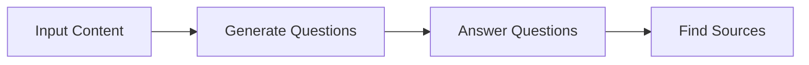
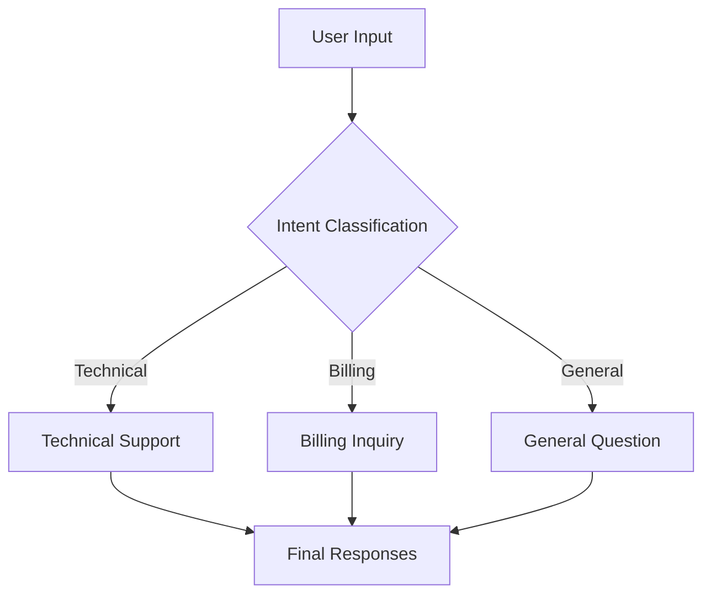
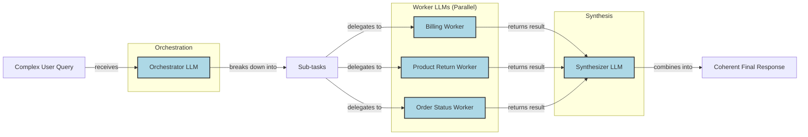

# Lesson 5: Basic Workflow Ingredients

In the last lesson, we covered structured outputs, the essential technique for getting reliable, machine-readable data out of an LLM. We learned how to bridge the gap between the probabilistic world of LLMs and the deterministic code of our applications. Now that we can control the outputs, it’s time to control the flow.

This lesson explores the fundamental patterns for building multi-step LLM workflows: chaining, parallelization, routing, and orchestration. We will explain why breaking down complex tasks is more effective than using a single, monolithic prompt. Through practical examples using the Google Gemini library, you will learn to build a sequential FAQ generation pipeline and a dynamic routing workflow for customer service.

Mastering these patterns is an essential step for any AI engineer. They provide modularity, improve accuracy, and allow for more controlled and adaptable systems, forming the building blocks for both simple workflows and the advanced AI agents we will build later in this course.

## The Challenge with Complex Single LLM Calls

You have likely been there. You have a complex task, so you write a complex prompt, stuffing every instruction, constraint, and example into a single LLM call. You hit "run," cross your fingers, and hope for the best. Sometimes it works. Often, it fails in subtle, frustrating ways. This approach, while tempting, is a recipe for building brittle and unreliable AI systems.

A single, large prompt for a multi-step task creates a black box that is difficult to debug. When the output is wrong, you are left guessing which of your ten instructions the model ignored. There is no modularity, making it nearly impossible to update or improve one piece of logic without risking another. This lack of modularity directly impacts maintainability; a small change to one part of the prompt can have unintended consequences on another, turning iterative improvement into a high-risk guessing game.

This tendency is known as the "lost-in-the-middle" problem. Research from Stanford and UC Berkeley found that LLMs show a U-shaped performance curve, paying most attention to the beginning and end of their context while information in the middle gets overlooked [[1]]. This is not a bug in a specific model but a structural bias. It stems from architectural factors like causal attention masking, where early tokens get more cumulative attention, and positional encoding decay, which weakens signals from distant tokens [[1]]. Bigger context windows do not solve this; they just create a larger "middle" for information to get lost in.

Furthermore, complex prompts are sensitive to minor changes. A slight rephrasing can cause the model to produce a completely different output, making results hard to reproduce. As the number of requirements in a prompt increases, instruction-following accuracy drops. One study showed `gpt-4o`'s accuracy falling from 98.7% with one requirement to 85% with 19 requirements [[2]]. This unreliability is compounded in few-shot scenarios, where providing multiple examples in a single prompt can overwhelm the model and lead to parsing failures, increasing the error rate by up to 38 times compared to a simpler zero-shot approach [[3]]. Even minor formatting changes in a multi-problem prompt can cause accuracy to drop by as much as 32% [[4]].

Let's see this in action. We will build a simple FAQ generator from a few mock webpages on renewable energy.

1.  First, we set up our environment by initializing the Gemini client. We will use `gemini-2.5-flash` for these examples, as it is fast and cost-effective.
    ```python
    import os
    import json
    from google import genai
    from google.genai import types
    from pydantic import BaseModel, Field
    
    # Load API key from environment
    # Make sure to set your GOOGLE_API_KEY in your environment
    genai.configure(api_key=os.environ["GOOGLE_API_KEY"])
    
    client = genai.Client()
    MODEL_ID = "gemini-2.5-flash"
    ```
2.  Next, we define our source content.
    ```python
    webpage_1 = {
        "title": "The Benefits of Solar Energy",
        "content": """
        Solar energy is a renewable powerhouse, offering numerous environmental and economic benefits.
        By converting sunlight into electricity through photovoltaic (PV) panels, it reduces reliance on fossil fuels,
        thereby cutting down greenhouse gas emissions. Homeowners who install solar panels can significantly
        lower their monthly electricity bills, and in some cases, sell excess power back to the grid.
        While the initial installation cost can be high, government incentives and long-term savings make
        it a financially viable option for many. Solar power is also a key component in achieving energy
        independence for nations worldwide.
        """,
    }
    
    webpage_2 = {
        "title": "Understanding Wind Turbines",
        "content": """
        Wind turbines are towering structures that capture kinetic energy from the wind and convert it into
        electrical power. They are a critical part of the global shift towards sustainable energy.
        Turbines can be installed both onshore and offshore, with offshore wind farms generally producing more
        consistent power due to stronger, more reliable winds. The main challenge for wind energy is its
        intermittency. It only generates power when the wind blows. This necessitates the use of energy
        storage solutions, like large-scale batteries, to ensure a steady supply of electricity.
        """,
    }
    
    webpage_3 = {
        "title": "Energy Storage Solutions",
        "content": """
        Effective energy storage is the key to unlocking the full potential of renewable sources like solar
        and wind. Because these sources are intermittent, storing excess energy when it's plentiful and
        releasing it when it's needed is crucial for a stable power grid. The most common form of
        large-scale storage is pumped-hydro storage, but battery technologies, particularly lithium-ion,
        are rapidly becoming more affordable and widespread. These batteries can be used in homes, businesses,
        and at the utility scale to balance energy supply and demand, making our energy system more
        resilient and reliable.
        """,
    }
    
    all_sources = [webpage_1, webpage_2, webpage_3]
    
    combined_content = "\n\n".join(
        [f"Source Title: {source['title']}\nContent: {source['content']}" for source in all_sources]
    )
    ```
3.  Now, we write a single, complex prompt that asks the LLM to generate questions, find answers, and cite sources all at once. We will use Pydantic models to define the structured output we expect, a technique we covered in Lesson 4.
    ```python
    class FAQ(BaseModel):
        """A FAQ is a question and answer pair, with a list of sources used to answer the question."""
        question: str = Field(description="The question to be answered")
        answer: str = Field(description="The answer to the question")
        sources: list[str] = Field(description="The sources used to answer the question")
    
    class FAQList(BaseModel):
        """A list of FAQs"""
        faqs: list[FAQ] = Field(description="A list of FAQs")
    
    n_questions = 10
    prompt_complex = f"""
    Based on the provided content from three webpages, generate a list of exactly {n_questions} frequently asked questions (FAQs).
    For each question, provide a concise answer derived ONLY from the text.
    After each answer, you MUST include a list of the 'Source Title's that were used to formulate that answer.
    
    <provided_content>
    {combined_content}
    </provided_content>
    """.strip()
    
    config = types.GenerateContentConfig(
        response_mime_type="application/json",
        response_schema=FAQList
    )
    response_complex = client.models.generate_content(
        model=MODEL_ID,
        contents=prompt_complex,
        config=config
    )
    result_complex = response_complex.parsed
    ```
    It outputs:
    ```json
    {
      "question": "Why is energy storage crucial for renewable energy sources like solar and wind?",
      "answer": "Effective energy storage is key to unlocking the full potential of renewable sources because it allows storing excess energy when plentiful and releasing it when needed, which is crucial for a stable power grid.",
      "sources": [
        "Energy Storage Solutions",
        "Understanding Wind Turbines"
      ]
    }
    ```
While this output looks reasonable, the more complex the instructions, the higher the chance of inaccuracies. For example, the model might correctly synthesize an answer from multiple sources but only cite one, or it might fail to generate the exact number of questions requested. This unreliability makes it difficult to build production systems on top of such monolithic prompts.

## The Power of Modularity: Why Chain LLM Calls?

The solution to the unreliability of complex prompts is modularity. Instead of asking an LLM to do everything at once, we can break the problem down into a series of smaller, more manageable sub-tasks. This "divide-and-conquer" approach is known as prompt chaining, where the output of one LLM call becomes the input for the next. This creates a workflow of sequential steps, much like an assembly line.

This modular approach offers several key benefits for building robust AI systems.

First, it improves modularity and makes debugging much easier. Each LLM call in the chain focuses on a single, well-defined task. This boosts the transparency and controllability of the application; if a step fails, you can isolate the problem to a specific prompt and its corresponding output [[5]]. This is a substantial improvement over a monolithic prompt where the entire process is a black box. For example, Acxiom, a data-driven marketing company, used LangSmith to gain visibility into their multi-agent interactions, allowing them to debug complex workflows and optimize token usage effectively [[6]]. This modularity aligns naturally with software engineering best practices like clear component responsibilities and iterative refinement [[7]]. It also simplifies testing, as each component can be unit-tested in isolation before being integrated into the larger workflow.

Second, it enhances accuracy. Simpler, more targeted prompts reduce the cognitive load on the LLM, leading to more reliable and higher-quality outputs [[8]]. Instead of trying to follow a long list of instructions, the model can dedicate its full attention to one specific goal at a time. This reduces the chances of it ignoring constraints or generating incomplete results.

Third, it increases flexibility. With a modular chain, you can swap, update, or optimize individual components without affecting the rest of the system. You can even use different models for different steps. For instance, you could use a fast, cost-effective model like Google's Gemini Flash for a simple classification task, and a more powerful model like Gemini Pro for a complex generation task. This allows you to balance performance, cost, and latency based on the specific requirements of each step [[8]].

However, prompt chaining is not without its trade-offs. One of the main downsides is the potential for information loss between steps [[9]]. If an early step in the chain produces a summary, for example, important details might be omitted, and this loss will propagate to all subsequent steps. To mitigate this, it is essential to use structured state objects (like Pydantic models) to pass data between calls and ensure that important information is preserved. Keeping chains short also limits opportunities for context degradation and error propagation. Ideally, chains should be under five or six sequential calls [[9]].

Another consideration is increased latency and cost. Multiple API calls will naturally take longer and cost more than a single call. Finally, connecting the different steps requires "glue code," which adds engineering overhead. Despite these challenges, the gains in reliability, debuggability, and maintainability often make chaining the superior approach for complex tasks.

## Building a Sequential Workflow: FAQ Generation Pipeline

Let's put theory into practice by refactoring our FAQ generation task into a sequential workflow. We will break the single, complex prompt into a three-step chain:

1.  **Generate Questions**: The first LLM call will read the source content and generate a list of relevant questions.
2.  **Answer Questions**: For each generated question, a second LLM call will formulate an answer based on the content.
3.  **Find Sources**: For each question-answer pair, a third LLM call will identify the original source titles.


Image 1: A sequential workflow for FAQ generation.

This structure makes each step focused and easier to manage. Each function has a single responsibility, making the overall system more transparent and maintainable. This pattern is widely used in production. For example, AppFolio, a property management software company, uses LangGraph to manage complex workflows in their AI copilot, achieving an 80% performance in text-to-data tasks by breaking them down into sequential steps [[6]].

1.  First, we create a function to generate a list of questions. The prompt is simple and direct, asking only for a list of questions based on the provided text. This focus helps ensure the model returns exactly what we need for the next step. We define a `QuestionList` Pydantic model to enforce the output structure, ensuring we get a list of strings.
    ```python
    class QuestionList(BaseModel):
        """A list of questions"""
        questions: list[str] = Field(description="A list of questions")
    
    prompt_generate_questions = """
    Based on the content below, generate a list of {n_questions} relevant and distinct questions that a user might have.
    
    <provided_content>
    {combined_content}
    </provided_content>
    """.strip()
    
    def generate_questions(content: str, n_questions: int = 10) -> list[str]:
        """
        Generate a list of questions based on the provided content.
        """
        config = types.GenerateContentConfig(
            response_mime_type="application/json",
            response_schema=QuestionList
        )
        response_questions = client.models.generate_content(
            model=MODEL_ID,
            contents=prompt_generate_questions.format(n_questions=n_questions, combined_content=content),
            config=config
        )
    
        return response_questions.parsed.questions
    ```
    When we test it, we get a clean list of questions:
    ```text
    ['What are the primary environmental and economic benefits of solar energy?', 'How do homeowners financially benefit from installing solar panels?', 'What is the main process by which wind turbines generate electricity?', 'What is the primary challenge of wind energy, and how is it addressed?']
    ```
2.  Next, we write a function to answer a single question. This prompt is instructed to use *only* the provided content, which helps ground the model and reduce hallucinations. By separating this from question generation, we ensure the answering process is not influenced by the generation logic. The function takes a question and the source content, and returns a string answer.
    ```python
    prompt_answer_question = """
    Using ONLY the provided content below, answer the following question.
    The answer should be concise and directly address the question.
    
    <question>
    {question}
    </question>
    
    <provided_content>
    {combined_content}
    </provided_content>
    """.strip()
    
    def answer_question(question: str, content: str) -> str:
        """
        Generate an answer for a specific question using only the provided content.
        """
        answer_response = client.models.generate_content(
            model=MODEL_ID,
            contents=prompt_answer_question.format(question=question, combined_content=content),
        )
        return answer_response.text
    ```
    Testing this with our first question gives a focused answer:
    ```text
    The primary environmental benefit of solar energy is cutting down greenhouse gas emissions by reducing reliance on fossil fuels. Economically, it allows homeowners to significantly lower their monthly electricity bills and potentially sell excess power back to the grid.
    ```
3.  Finally, we create a function to identify the sources for a given question and answer. This step is important for traceability and allows users to verify the information. It runs after the answer is generated, using both the question and the answer as context to ensure accuracy. The `SourceList` Pydantic model ensures the output is a list of source titles.
    ```python
    class SourceList(BaseModel):
        """A list of source titles that were used to answer the question"""
        sources: list[str] = Field(description="A list of source titles that were used to answer the question")
    
    prompt_find_sources = """
    You will be given a question and an answer that was generated from a set of documents.
    Your task is to identify which of the original documents were used to create the answer.
    
    <question>
    {question}
    </question>
    
    <answer>
    {answer}
    </answer>
    
    <provided_content>
    {combined_content}
    </provided_content>
    """.strip()
    
    def find_sources(question: str, answer: str, content: str) -> list[str]:
        """
        Identify which sources were used to generate an answer.
        """
        config = types.GenerateContentConfig(
            response_mime_type="application/json",
            response_schema=SourceList
        )
        sources_response = client.models.generate_content(
            model=MODEL_ID,
            contents=prompt_find_sources.format(question=question, answer=answer, combined_content=content),
            config=config
        )
        return sources_response.parsed.sources
    ```
    The output correctly identifies the source:
    ```text
    ['The Benefits of Solar Energy']
    ```
4.  Now, we combine these functions into a single sequential workflow. We first generate all the questions, then loop through each one to generate an answer and find its sources. This orchestration logic, or "glue code," is what connects our modular components into a functioning pipeline.
    ```python
    import time
    
    def sequential_workflow(content, n_questions=10) -> list[FAQ]:
        """
        Execute the complete sequential workflow for FAQ generation.
        """
        # Generate questions
        questions = generate_questions(content, n_questions)
    
        # Answer and find sources for each question sequentially
        final_faqs = []
        for question in questions:
            # Generate an answer for the current question
            answer = answer_question(question, content)
    
            # Identify the sources for the generated answer
            sources = find_sources(question, answer, content)
    
            faq = FAQ(
                question=question,
                answer=answer,
                sources=sources
            )
            final_faqs.append(faq)
    
        return final_faqs
    
    start_time = time.monotonic()
    sequential_faqs = sequential_workflow(combined_content, n_questions=4)
    end_time = time.monotonic()
    print(f"Sequential processing completed in {end_time - start_time:.2f} seconds")
    ```
    This process took about **22.20 seconds** to complete for four questions. The final output is a list of structured `FAQ` objects, each containing a question, a grounded answer, and a list of sources. This is far more reliable and easier to work with than the single block of text from our initial complex prompt.

## Optimizing Sequential Workflows With Parallel Processing

Our sequential workflow is reliable, but it is slow. Each step for each question runs one after another. Since the processing for each question is independent, we can substantially speed things up by running these tasks in parallel. This is especially effective because LLM API calls are I/O-bound, not CPU-bound, meaning a single process can manage dozens of concurrent requests without much computational overhead [[10]]. By sending off multiple requests at once instead of waiting for each one to complete, we mitigate the "straggler effect," where the total latency is dictated by the single slowest task [[11]].

For I/O-bound tasks in Python, `asyncio` is the production standard. It uses an event loop to manage many concurrent operations within a single thread, avoiding the overhead of creating and managing multiple OS threads that you would get with the `threading` library. This makes it highly efficient for tasks like making thousands of API calls simultaneously [[12]].

To implement this, we will use Python's `asyncio` library, which is ideal for managing concurrent I/O operations.

1.  First, we need to create asynchronous versions of our `answer_question` and `find_sources` functions. The `google-genai` library provides an async client (`client.aio`) for this purpose. These `async` functions are non-blocking, meaning the program can continue to run other code while waiting for the API response.
    ```python
    import asyncio
    
    async def answer_question_async(question: str, content: str) -> str:
        """
        Async version of answer_question function.
        """
        prompt = prompt_answer_question.format(question=question, combined_content=content)
        response = await client.aio.models.generate_content(
            model=MODEL_ID,
            contents=prompt
        )
        return response.text
    
    async def find_sources_async(question: str, answer: str, content: str) -> list[str]:
        """
        Async version of find_sources function.
        """
        prompt = prompt_find_sources.format(question=question, answer=answer, combined_content=content)
        config = types.GenerateContentConfig(
            response_mime_type="application/json",
            response_schema=SourceList
        )
        response = await client.aio.models.generate_content(
            model=MODEL_ID,
            contents=prompt,
            config=config
        )
        return response.parsed.sources
    ```
2.  Next, we will create a function that processes a single question by running its sub-tasks in parallel. In our case, after generating an answer, we can immediately start finding the sources.
    ```python
    async def process_question_parallel(question: str, content: str) -> FAQ:
        """
        Process a single question by generating answer and finding sources in parallel.
        """
        answer = await answer_question_async(question, content)
        sources = await find_sources_async(question, answer, content)
        return FAQ(
            question=question,
            answer=answer,
            sources=sources
        )
    ```
3.  Finally, we wrap this in a main `parallel_workflow` function. It first generates the questions synchronously (as this is a single API call) and then uses `asyncio.gather` to execute `process_question_parallel` for all questions concurrently. `asyncio.gather` collects all the individual asynchronous tasks and runs them at the same time, waiting for all to complete before returning the results.
    ```python
    async def parallel_workflow(content: str, n_questions: int = 10) -> list[FAQ]:
        """
        Execute the complete parallel workflow for FAQ generation.
        """
        # Generate questions (this step remains synchronous)
        questions = generate_questions(content, n_questions)
    
        # Process all questions in parallel
        tasks = [process_question_parallel(question, content) for question in questions]
        parallel_faqs = await asyncio.gather(*tasks)
    
        return parallel_faqs
    
    start_time = time.monotonic()
    parallel_faqs = await parallel_workflow(combined_content, n_questions=4)
    end_time = time.monotonic()
    print(f"Parallel processing completed in {end_time - start_time:.2f} seconds")
    ```
    The parallel workflow completed in just **8.98 seconds**, a noticeable improvement over the 22.20 seconds of the sequential approach. This demonstrates the power of parallelization in reducing latency for workflows with independent subtasks.

While parallel processing offers a substantial speedup, it is important to be mindful of API rate limits. Sending too many requests simultaneously can lead to `429 (rate limit)` errors. In a production system, you would need to implement strategies like exponential backoff with full jitter to manage your request rate and handle failures gracefully [[13]]. This involves waiting a random amount of time between retries to avoid a "thundering herd" of synchronized requests. It is also a good practice to implement a retry budget, for example, ensuring total retries do not exceed 10% of total requests, to prevent a single degraded endpoint from causing a system-wide failure [[13]]. This type of workflow automation is part of a broader trend where LLMs are transforming fields like Robotic Process Automation (RPA), evolving them from rigid scripts into intelligent systems that can orchestrate complex, parallel tasks [[14]].

## Introducing Dynamic Behavior: Routing and Conditional Logic

So far, our workflows have been deterministic. Every input goes through the same sequence of steps, whether sequential or parallel. However, real-world applications often require dynamic behavior. Not all inputs should be treated the same way. A customer asking for technical support needs a different response than one with a billing question. Routing addresses this need.

Routing, or conditional logic, allows us to build workflows that can make decisions. It uses a classifier, often an LLM itself, to analyze an input and direct it down a specific path. This is another application of the "divide-and-conquer" principle. Instead of creating a single, massive prompt that tries to handle every possible scenario, we create specialized prompts for each case and use a router to choose the correct one.

This approach keeps each prompt focused on a single responsibility, which, as we have seen, improves reliability and performance [[8]]. It is much easier to optimize a prompt for a specific task like "handle billing inquiry" than to create a general-purpose prompt that can handle anything.

The core of a routing workflow is the classification step. An LLM is given the user's input and a set of possible categories or intents. Its job is to select the most appropriate category. Based on this decision, the workflow then branches, executing a different set of steps for each path. This is the essence of the Coordinator/Dispatcher pattern, where a central agent analyzes user intent and routes the request to a specialist [[15]]. However, this introduces new failure modes. A 2026 study of systems built with LangGraph found that this type of orchestration can introduce routing failures, decision ambiguity, and template conflicts, leading to failure rates between 9% and 24% [[16]]. These errors are a structural consequence of using a probabilistic model for deterministic branching. Mitigations include careful prompt engineering for the classifier, using few-shot examples to guide its decisions, and implementing robust default or fallback routes for when classification is uncertain.

## Building a Basic Routing Workflow

Let's build a simple routing system for a customer service chatbot. The system will classify a user's query into one of three intents: `Technical Support`, `Billing Inquiry`, or `General Question`. Based on the intent, it will route the query to a specialized handler that generates an appropriate first response.


Image 2: A routing workflow for customer service, showing intent classification and conditional branching to specialized handlers.

This two-stage architecture, where one LLM call classifies intent and a second generates the response, is a common pattern for improving precision. The classification step requires a clear and comprehensive taxonomy of intents, with high-quality examples for each, especially for edge cases. For example, an e-commerce chatbot might define intents like "Order Status," "Product Information," and "Returns," each with a distinct handler logic [[17]].

1.  First, we define our intents using a Python `Enum` and a Pydantic model to structure the classifier's output. This ensures the LLM's response will be one of our predefined categories.
    ```python
    from enum import Enum
    
    class IntentEnum(str, Enum):
        TECHNICAL_SUPPORT = "Technical Support"
        BILLING_INQUIRY = "Billing Inquiry"
        GENERAL_QUESTION = "General Question"
    
    class UserIntent(BaseModel):
        intent: IntentEnum = Field(description="The intent of the user's query")
    ```
2.  Next, we create the `classify_intent` function. It takes a user query, inserts it into a prompt along with the possible categories, and asks the LLM to make a classification. The prompt is engineered to be a zero-shot classifier, relying on the model's general understanding to categorize the query.
    ```python
    prompt_classification = """
    Classify the user's query into one of the following categories.
    
    <categories>
    {categories}
    </categories>
    
    <user_query>
    {user_query}
    </user_query>
    """.strip()
    
    def classify_intent(user_query: str) -> IntentEnum:
        """Uses an LLM to classify a user query."""
        prompt = prompt_classification.format(
            user_query=user_query,
            categories=[intent.value for intent in IntentEnum]
        )
        config = types.GenerateContentConfig(
            response_mime_type="application/json",
            response_schema=UserIntent
        )
        response = client.models.generate_content(
            model=MODEL_ID,
            contents=prompt,
            config=config
        )
        return response.parsed.intent
    ```
3.  With our classifier ready, we define specialized prompts for each intent. Each prompt gives the LLM a specific persona and instructions for how to respond. This separation of concerns is key to the routing pattern's effectiveness.
    ```python
    prompt_technical_support = """
    You are a helpful technical support agent. Provide a helpful first response, asking for more details like what troubleshooting steps they have already tried.
    
    Here's the user's query: <user_query>{user_query}</user_query>
    """.strip()
    
    prompt_billing_inquiry = """
    You are a helpful billing support agent. Acknowledge their concern and inform them that you will need to look up their account, asking for their account number.
    
    Here's the user's query: <user_query>{user_query}</user_query>
    """.strip()
    
    prompt_general_question = """
    You are a general assistant. Apologize that you are not sure how to help.
    
    Here's the user's query: <user_query>{user_query}</user_query>
    """.strip()
    ```
4.  Finally, the `handle_query` function acts as our router. It takes the user's query and the classified intent, and then uses a simple `if/elif/else` block to select the correct prompt and generate the final response. A default or catch-all route is included to handle cases where the intent is unclear.
    ```python
    def handle_query(user_query: str, intent: str) -> str:
        """Routes a query to the correct handler based on its classified intent."""
        if intent == IntentEnum.TECHNICAL_SUPPORT:
            prompt = prompt_technical_support.format(user_query=user_query)
        elif intent == IntentEnum.BILLING_INQUIRY:
            prompt = prompt_billing_inquiry.format(user_query=user_query)
        else:
            prompt = prompt_general_question.format(user_query=user_query)
            
        response = client.models.generate_content(
            model=MODEL_ID,
            contents=prompt
        )
        return response.text
    ```
5.  Let's test it with a few queries.
    ```python
    query_1 = "My internet connection is not working."
    intent_1 = classify_intent(query_1)
    response_1 = handle_query(query_1, intent_1)
    ```
    For the query "My internet connection is not working," the system correctly classifies the intent as `Technical Support` and generates a helpful response asking for more details.
    ```text
    Hello there! I'm sorry to hear you're having trouble with your internet connection. To help me understand what's going on, could you please provide a few more details? For instance, have you already tried restarting your router?
    ```
    This simple `if/else` router is effective, but production systems often require more sophistication. For example, Google's Agent Development Kit (ADK) implements the Coordinator/Dispatcher pattern where a parent agent uses LLM-driven delegation to route requests to specialist sub-agents based on their descriptions [[15]]. This allows for more dynamic and scalable routing than hardcoded logic. Similarly, routing gateways like LiteLLM's support composable strategies like load balancing, prioritized fallbacks, and conditional routing based on request metadata, providing much finer-grained control [[18]].

## Orchestrator-Worker Pattern: Dynamic Task Decomposition

Routing works well when you have a set of pre-defined paths. But what happens when a task is so complex that you cannot predict the necessary steps in advance? Consider a customer query like, "I have a question about my bill, I also want to return a product, and can you check my order status?" A simple router is not enough. The orchestrator-worker pattern is designed for this scenario.

In this pattern, a central "orchestrator" LLM acts like a project manager on a manufacturing assembly line. It analyzes a complex query, breaks it down into distinct subtasks, and delegates each to a specialized "worker"—which can be another LLM call or a traditional software tool [[19]]. This pattern is already in production; Wells Fargo uses it to help bankers navigate internal procedures, and Salesforce implements it in their Atlas Reasoning Engine [[20]]. Once the workers have completed their tasks, a final "synthesizer" LLM combines their individual outputs into a single, coherent response.


Image 3: A flowchart illustrating the orchestrator-worker pattern with an Orchestrator LLM, parallel Worker LLMs, and a Synthesizer LLM.

The key advantage of this pattern is its flexibility. Unlike simple parallelization where the tasks are fixed, the orchestrator determines the subtasks at runtime based on the specific input [[21]]. This makes it ideal for handling unpredictable, multifaceted queries that require diverse expertise [[22]].

However, this pattern introduces its own challenges. The orchestrator can become a bottleneck if it is too slow. The task decomposition might be poor, with subtasks that are too broad or not serializable, leading to incoherent results [[23]]. Coordination can also fail in subtle ways. For instance, if each agent has its own uncoordinated retry policy, a single API failure can trigger a "loop-of-loops" that results in dozens of unnecessary LLM calls. Another common issue is "ownership ambiguity," where multiple workers try to address the same part of a query, leading to duplicate or conflicting outputs [[24]]. Ensuring clear boundaries and consistent data schemas is important for the system to function reliably.

Let's build a system that can handle our complex customer query.

1.  First, we define the `Orchestrator`. Its job is to parse the user query and output a list of structured tasks. We use Pydantic models to define the schema for these tasks, providing the LLM with a clear contract for its output. The prompt explicitly lists the possible `query_type` values and their required parameters.
    ```python
    import random
    
    class QueryTypeEnum(str, Enum):
        """The type of query to be handled."""
        BILLING_INQUIRY = "BillingInquiry"
        PRODUCT_RETURN = "ProductReturn"
        STATUS_UPDATE = "StatusUpdate"
    
    class Task(BaseModel):
        """A task to be performed."""
        query_type: QueryTypeEnum = Field(description="The type of query to be handled.")
        invoice_number: str | None = Field(description="The invoice number to be used for the billing inquiry.", default=None)
        product_name: str | None = Field(description="The name of the product to be returned.", default=None)
        reason_for_return: str | None = Field(description="The reason for returning the product.", default=None)
        order_id: str | None = Field(description="The order ID to be used for the status update.", default=None)
    
    class TaskList(BaseModel):
        """A list of tasks to be performed."""
        tasks: list[Task] = Field(description="A list of tasks to be performed.")
    
    prompt_orchestrator = f"""
    You are a master orchestrator. Your job is to break down a complex user query into a list of sub-tasks.
    Each sub-task must have a "query_type" and its necessary parameters.
    
    The possible "query_type" values and their required parameters are:
    1. "{QueryTypeEnum.BILLING_INQUIRY.value}": Requires "invoice_number".
    2. "{QueryTypeEnum.PRODUCT_RETURN.value}": Requires "product_name" and "reason_for_return".
    3. "{QueryTypeEnum.STATUS_UPDATE.value}": Requires "order_id".
    
    Here's the user's query.
    
    <user_query>
    {{query}}
    </user_query>
    """.strip()
    
    
    def orchestrator(query: str) -> list[Task]:
        """Breaks down a complex query into a list of tasks."""
        prompt = prompt_orchestrator.format(query=query)
        config = types.GenerateContentConfig(
            response_mime_type="application/json",
            response_schema=TaskList
        )
        response = client.models.generate_content(
            model=MODEL_ID,
            contents=prompt,
            config=config
        )
        return response.parsed.tasks
    ```
2.  Next, we define our `Workers`. Each worker is a function that handles a specific task type. In a real application, these workers would interact with backend systems, databases, or external APIs. Here, we will simulate these actions. For example, the `handle_billing_worker` uses an LLM to extract the user's specific concern from the original query and then simulates opening an investigation, returning a structured `BillingTask` object.
    ```python
    class BillingTask(BaseModel):
        """A billing inquiry task to be performed."""
        query_type: QueryTypeEnum = Field(description="The type of task to be performed.", default=QueryTypeEnum.BILLING_INQUIRY)
        invoice_number: str = Field(description="The invoice number to be used for the billing inquiry.")
        user_concern: str = Field(description="The concern or question the user has voiced about the invoice.")
        action_taken: str = Field(description="The action taken to address the user's concern.")
        resolution_eta: str = Field(description="The estimated time to resolve the concern.")
    
    prompt_billing_worker_extractor = """
    You are a specialized assistant. A user has a query regarding invoice '{invoice_number}'.
    From the full user query provided below, extract the specific concern or question the user has voiced about this particular invoice.
    Respond with ONLY the extracted concern/question. If no specific concern is mentioned beyond a general inquiry about the invoice, state 'General inquiry regarding the invoice'.
    
    Here's the user's query:
    <user_query>
    {original_user_query}
    </user_query>
    
    Extracted concern about invoice {invoice_number}:
    """.strip()
    
    
    def handle_billing_worker(invoice_number: str, original_user_query: str) -> BillingTask:
        """
        Handles a billing inquiry.
        """
        extraction_prompt = prompt_billing_worker_extractor.format(
            invoice_number=invoice_number, original_user_query=original_user_query
        )
        response = client.models.generate_content(model=MODEL_ID, contents=extraction_prompt)
        extracted_concern = response.text
    
        investigation_id = f"INV_CASE_{random.randint(1000, 9999)}"
        eta_days = 2
    
        task = BillingTask(
            invoice_number=invoice_number,
            user_concern=extracted_concern,
            action_taken=f"An investigation (Case ID: {investigation_id}) has been opened regarding your concern.",
            resolution_eta=f"{eta_days} business days",
        )
    
        return task
    
    class ReturnTask(BaseModel):
        """A task to handle a product return request."""
        query_type: QueryTypeEnum = Field(description="The type of task to be performed.", default=QueryTypeEnum.PRODUCT_RETURN)
        product_name: str = Field(description="The name of the product to be returned.")
        reason_for_return: str = Field(description="The reason for returning the product.")
        rma_number: str = Field(description="The RMA number for the return.")
        shipping_instructions: str = Field(description="The shipping instructions for the return.")
    
    
    def handle_return_worker(product_name: str, reason_for_return: str) -> ReturnTask:
        """
        Handles a product return request.
        """
        rma_number = f"RMA-{random.randint(10000, 99999)}"
        shipping_instructions = (
            "Please pack the '{product_name}' securely in its original packaging if possible. "
            "Include all accessories and manuals. Write the RMA number ({rma_number}) clearly on the outside of the package. "
            "Ship to: Returns Department, 123 Automation Lane, Tech City, TC 98765."
        ).format(product_name=product_name, rma_number=rma_number)
    
        task = ReturnTask(
            product_name=product_name,
            reason_for_return=reason_for_return,
            rma_number=rma_number,
            shipping_instructions=shipping_instructions,
        )
    
        return task
    
    class StatusTask(BaseModel):
        """A task to handle an order status update request."""
        query_type: QueryTypeEnum = Field(description="The type of task to be performed.", default=QueryTypeEnum.STATUS_UPDATE)
        order_id: str = Field(description="The order ID to be used for the status update.")
        current_status: str = Field(description="The current status of the order.")
        carrier: str = Field(description="The carrier of the order.")
        tracking_number: str = Field(description="The tracking number of the order.")
        expected_delivery: str = Field(description="The expected delivery date of the order.")
    
    def handle_status_worker(order_id: str) -> StatusTask:
        """
        Handles an order status update request.
        """
        possible_statuses = [
            {"status": "Shipped", "carrier": "SuperFast Shipping", "tracking": f"SF{random.randint(100000, 999999)}", "delivery_estimate": "Tomorrow"},
        ]
        status_details = random.choice(possible_statuses)
    
        task = StatusTask(
            order_id=order_id,
            current_status=status_details["status"],
            carrier=status_details["carrier"],
            tracking_number=status_details["tracking"],
            expected_delivery=status_details["delivery_estimate"],
        )
    
        return task
    ```
3.  After the workers run, the `Synthesizer` takes their structured outputs and combines them into a single, user-friendly response. The prompt for the synthesizer must be carefully designed to handle diverse, structured inputs and combine them into a cohesive message that maintains a consistent tone.
    ```python
    prompt_synthesizer = """
    You are a master communicator. Combine several distinct pieces of information from our support team into a single, well-formatted, and friendly email to a customer.
    
    Here are the points to include, based on the actions taken for their query:
    <points>
    {formatted_results}
    </points>
    
    Combine these points into one cohesive response.
    Start with a friendly greeting (e.g., "Dear Customer," or "Hi there,") and end with a polite closing (e.g., "Sincerely," or "Best regards,").
    Ensure the tone is helpful and professional.
    """.strip()
    
    
    def synthesizer(results: list) -> str:
        """Combines structured results from workers into a single user-facing message."""
        bullet_points = []
        for res in results:
            point = f"Regarding your {res.query_type}:\n"
            if res.query_type == QueryTypeEnum.BILLING_INQUIRY:
                res: BillingTask = res
                point += f"  - Invoice Number: {res.invoice_number}\n"
                point += f'  - Your Stated Concern: "{res.user_concern}"\n'
                point += f"  - Our Action: {res.action_taken}\n"
                point += f"  - Expected Resolution: We will get back to you within {res.resolution_eta}."
            elif res.query_type == QueryTypeEnum.PRODUCT_RETURN:
                res: ReturnTask = res
                point += f"  - Product: {res.product_name}\n"
                point += f'  - Reason for Return: "{res.reason_for_return}"\n'
                point += f"  - Return Authorization (RMA): {res.rma_number}\n"
                point += f"  - Instructions: {res.shipping_instructions}"
            elif res.query_type == QueryTypeEnum.STATUS_UPDATE:
                res: StatusTask = res
                point += f"  - Order ID: {res.order_id}\n"
                point += f"  - Current Status: {res.current_status}\n"
                if res.carrier != "N/A":
                    point += f"  - Carrier: {res.carrier}\n"
                if res.tracking_number != "N/A":
                    point += f"  - Tracking Number: {res.tracking_number}\n"
                point += f"  - Delivery Estimate: {res.expected_delivery}"
            bullet_points.append(point)
    
        formatted_results = "\n\n".join(bullet_points)
        prompt = prompt_synthesizer.format(formatted_results=formatted_results)
        response = client.models.generate_content(model=MODEL_ID, contents=prompt)
        return response.text
    ```
4.  Finally, we tie everything together in a main processing function. Let's test it with our complex query.
    ```python
    def process_user_query(user_query):
        # 1. Run orchestrator
        tasks_list = orchestrator(user_query)
        
        # 2. Run workers
        worker_results = []
        if tasks_list:
            for task in tasks_list:
                if task.query_type == QueryTypeEnum.BILLING_INQUIRY:
                    worker_results.append(handle_billing_worker(task.invoice_number, user_query))
                elif task.query_type == QueryTypeEnum.PRODUCT_RETURN:
                    worker_results.append(handle_return_worker(task.product_name, task.reason_for_return))
                elif task.query_type == QueryTypeEnum.STATUS_UPDATE:
                    worker_results.append(handle_status_worker(task.order_id))
        
        # 3. Run synthesizer
        if worker_results:
            final_user_message = synthesizer(worker_results)
            print(final_user_message)

    complex_customer_query = """
    Hi, I'm writing to you because I have a question about invoice #INV-7890. It seems higher than I expected.
    Also, I would like to return the 'SuperWidget 5000' I bought because it's not compatible with my system.
    Finally, can you give me an update on my order #A-12345?
    """.strip()
    
    process_user_query(complex_customer_query)
    ```
    The orchestrator correctly breaks the query into three distinct tasks.
    ```json
    {
      "query_type": "BillingInquiry",
      "invoice_number": "INV-7890"
    }
    {
      "query_type": "ProductReturn",
      "product_name": "SuperWidget 5000",
      "reason_for_return": "not compatible with my system"
    }
    {
      "query_type": "StatusUpdate",
      "order_id": "A-12345"
    }
    ```
    Each worker processes its task and returns a structured result. The synthesizer then combines these results into a single, clear response for the customer.
    ```text
    Dear Customer,
    
    Thank you for reaching out. Here is an update on your requests:
    
    Regarding your BillingInquiry:
      - Invoice Number: INV-7890
      - Your Stated Concern: "It seems higher than I expected."
      - Our Action: An investigation (Case ID: INV_CASE_5681) has been opened regarding your concern.
      - Expected Resolution: We will get back to you within 2 business days.
    
    Regarding your ProductReturn:
      - Product: SuperWidget 5000
      - Reason for Return: "not compatible with my system"
      - Return Authorization (RMA): RMA-62985
      - Instructions: Please pack the 'SuperWidget 5000' securely...
    
    Regarding your StatusUpdate:
      - Order ID: A-12345
      - Current Status: Shipped
      - Carrier: SuperFast Shipping
      - Tracking Number: SF259833
      - Delivery Estimate: Tomorrow
    
    If you have any other questions, please let us know.
    
    Best regards,
    Support Team
    ```
This pattern demonstrates how to build sophisticated, multi-talented AI systems by composing specialized components, a core principle of modern AI engineering. To combat the non-deterministic nature of these systems, some architectures are re-introducing Finite State Machines (FSMs) as guardrails. An FSM can enforce a strict sequence of states (e.g., Researching → Drafting → Verification), preventing the LLM from violating a required process [[25]].

## Conclusion

We have journeyed from the pitfalls of single, monolithic prompts to the power of modular, dynamic workflows. By breaking down complex problems into smaller, manageable steps, we can build AI systems that are more reliable, debuggable, and flexible. We have seen how sequential chaining provides structure, how parallelization adds speed, and how routing and orchestration introduce dynamic decision-making.

These patterns—chaining, parallelization, routing, and orchestration—are not just theoretical concepts; they are the fundamental ingredients you will use to cook up almost any production-grade LLM application. They are the bridge from simple prototypes to robust systems that can handle the complexity of the real world.

In our next lesson, we will give these workflows "hands." We will explore how to equip our systems with tools and function calling, allowing them to interact with external APIs and take action in the digital world. This will be our next major step on the path from building simple workflows to creating true AI agents.

## References

- [1] https://dev.to/thousand_miles_ai/the-lost-in-the-middle-problem-why-llms-ignore-the-middle-of-your-context-window-3al2
- [2] https://arxiv.org/html/2505.13360v1
- [3] https://aclanthology.org/2025.ommm-1.4.pdf
- [4] https://aclanthology.org/2025.gem-1.14.pdf
- [5] https://www.promptingguide.ai/techniques/prompt_chaining
- [6] https://www.zenml.io/blog/llmops-in-production-457-case-studies-of-what-actually-works
- [7] https://www.getmaxim.ai/articles/prompt-chaining-for-ai-engineers-a-practical-guide-to-improving-llm-output-quality/
- [8] https://www.decodingai.com/p/stop-building-ai-agents-use-these
- [9] https://futureagi.substack.com/p/how-tool-chaining-fails-in-production
- [10] https://online.stevens.edu/blog/building-self-healing-ai-orchestrator-reflexion-patterns/
- [11] https://www.ideals.illinois.edu/items/139597/bitstreams/450749/data.pdf
- [12] https://medium.com/@sizanmahmud08/python-concurrency-showdown-asyncio-vs-threading-vs-multiprocessing-which-should-you-choose-in-31205161899a
- [13] https://tianpan.co/blog/2026-03-11-llm-api-resilience-production
- [14] https://bitrock.it/blog/technology/the-evolution-of-robotic-process-automation-with-llm-and-agentic-ai.html
- [15] https://developers.googleblog.com/developers-guide-to-multi-agent-patterns-in-adk/
- [16] https://arxiv.org/html/2604.27891v1
- [17] https://www.vellum.ai/blog/how-to-build-intent-detection-for-your-chatbot
- [18] https://www.truefoundry.com/routing
- [19] https://mlpills.substack.com/p/diy-17-orchestrator-worker-llm-agent
- [20] https://beam.ai/agentic-insights/multi-agent-orchestration-patterns-production
- [21] https://platform.claude.com/cookbook/patterns-agents-orchestrator-workers
- [22] https://agents.kour.me/orchestrator-worker/
- [23] https://orq.ai/blog/why-do-multi-agent-llm-systems-fail
- [24] https://dev.to/gabrielanhaia/the-5-failure-modes-of-multi-agent-systems-nobody-warns-you-about-2fml
- [25] https://online.stevens.edu/blog/building-self-healing-ai-orchestrator-reflexion-patterns/