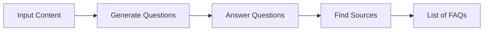
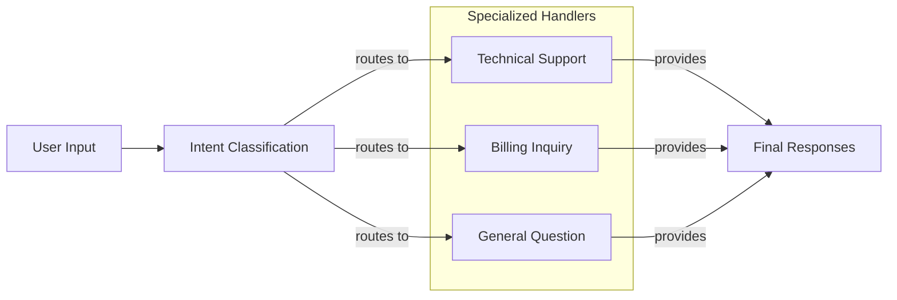
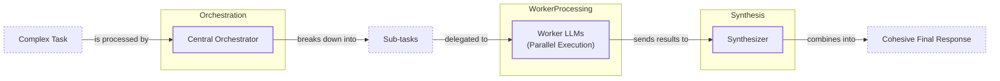

# Lesson 5: Basic Workflow Patterns

In our previous lessons, we laid the groundwork for AI Engineering. We explored the agent landscape, distinguished between rule-based LLM workflows and autonomous AI agents, and covered context engineering—the art of feeding the right information to an LLM. Now, we will tackle a fundamental challenge: getting structured and reliable information *out* of an LLM.

When you start building AI applications, the first impulse is often to write a single, massive prompt that does everything. We learned this the hard way on an early project. We tried to build a system that could analyze a document, extract key entities, summarize the content, and format it into a report, all in one go. The result was a mess. The LLM would frequently miss steps, hallucinate details, or produce outputs in a completely wrong format. It was brittle, unpredictable, and impossible to debug.

This experience taught us a critical lesson: complex tasks require modular solutions. Instead of relying on one giant LLM call, we need to break the problem down into smaller, manageable steps. This is the core idea behind AI workflows. In this lesson, we will explore the fundamental patterns for building them: chaining, parallelization, routing, and the orchestrator-worker pattern. Mastering these techniques is your first major step toward building sophisticated and reliable LLM applications that actually work in production.

## The Challenge with Complex Single LLM Calls

A single, complex prompt that tries to handle a multi-step task is often a recipe for failure. While it might seem efficient to ask an LLM to do everything at once, this monolithic approach introduces several problems that make systems unreliable and difficult to maintain.

First, debugging becomes a nightmare. When a single large prompt fails, it’s hard to pinpoint exactly where things went wrong. Was the model confused by a specific instruction? Did it misinterpret a piece of the input? Without clear intermediate steps, you are left guessing. In contrast, a modular workflow lets you inspect the input and output of each stage, making it much easier to isolate and fix errors [[11], [15]]. For example, Acxiom, a data company, faced challenges debugging complex multi-agent workflows. They gained visibility and optimized their system only after implementing observability tools like LangSmith to trace interactions step-by-step [[11], [12]].

Second, monolithic prompts lack modularity, which is a core principle of good software engineering. If you want to update one part of the logic, you have to rewrite and re-test the entire prompt. This makes the system rigid and slow to evolve. A modular design, on the other hand, allows you to swap, update, or optimize individual components without affecting the rest of the system [[15]].

A well-documented issue with long, complex prompts is the "lost in the middle" problem. Research from Stanford and UC Berkeley found that LLMs pay the most attention to information at the beginning and end of their context window, often ignoring details buried in the middle [[1]]. This creates a U-shaped performance curve where accuracy drops significantly for information located in the middle of a long prompt. This happens due to architectural reasons like causal attention masking, where early tokens get more cumulative attention, and positional encoding decay, which weakens the signal for tokens far from the beginning or end [[1]]. Bigger context windows do not solve this; they just create a larger "middle" for information to get lost in.

Finally, trying to do too much in one call can lead to higher token consumption and less reliable outputs. The complexity of juggling multiple instructions can confuse the model, causing it to miss steps or generate incomplete results. This mirrors the failure dynamics of multi-agent systems, where if each component in a five-step chain has 85% accuracy, the total system accuracy plummets to just 44% due to compounding errors [[21]]. Let's see this in action with a practical example.

### Practical Example: The Monolithic FAQ Generator

We will start with a common task: generating a list of Frequently Asked Questions (FAQs) from a set of documents. We will use the Google Gemini API throughout this lesson.

1.  First, we set up our environment. This involves loading our API key and initializing the Gemini client. We will use the `gemini-2.5-flash` model, which is fast and cost-effective for these examples.
    ```python
    import asyncio
    import random
    import time
    from enum import Enum
    
    from google import genai
    from google.genai import types
    from pydantic import BaseModel, Field
    
    from lessons.utils import env, pretty_print
    
    # Load the GOOGLE_API_KEY from the .env file
    env.load(required_env_vars=["GOOGLE_API_KEY"])
    
    # Initialize the Gemini Client
    client = genai.Client()
    
    MODEL_ID = "gemini-2.5-flash"
    ```
2.  Next, we define three mock webpages about renewable energy that will serve as our source content.
    ```python
    webpage_1 = {
        "title": "The Benefits of Solar Energy",
        "content": "Solar energy is a renewable powerhouse, offering numerous environmental and economic benefits...",
    }
    webpage_2 = {
        "title": "Understanding Wind Turbines",
        "content": "Wind turbines are towering structures that capture kinetic energy from the wind and convert it into electrical power...",
    }
    webpage_3 = {
        "title": "Energy Storage Solutions",
        "content": "Effective energy storage is the key to unlocking the full potential of renewable sources like solar and wind...",
    }
    
    all_sources = [webpage_1, webpage_2, webpage_3]
    
    combined_content = "\n\n".join(
        [f"Source Title: {source['title']}\nContent: {source['content']}" for source in all_sources]
    )
    ```
3.  Now, we create a single, complex prompt that asks the model to generate questions, find answers, and cite sources all at once. We also define Pydantic models to tell the Gemini API what JSON structure we expect, a technique we covered in Lesson 4.
    ```python
    # Pydantic classes for structured outputs
    class FAQ(BaseModel):
        """A FAQ is a question and answer pair, with a list of sources used to answer the question."""
        question: str = Field(description="The question to be answered")
        answer: str = Field(description="The answer to the question")
        sources: list[str] = Field(description="The sources used to answer the question")
    
    class FAQList(BaseModel):
        """A list of FAQs"""
        faqs: list[FAQ] = Field(description="A list of FAQs")
    
    # This prompt tries to do everything at once.
    n_questions = 10
    prompt_complex = f"""
    Based on the provided content from three webpages, generate a list of exactly {n_questions} frequently asked questions (FAQs).
    For each question, provide a concise answer derived ONLY from the text.
    After each answer, you MUST include a list of the 'Source Title's that were used to formulate that answer.
    
    <provided_content>
    {combined_content}
    </provided_content>
    """.strip()
    
    # Generate FAQs
    config = types.GenerateContentConfig(
        response_mime_type="application/json",
        response_schema=FAQList
    )
    response_complex = client.models.generate_content(
        model=MODEL_ID,
        contents=prompt_complex,
        config=config
    )
    result_complex = response_complex.parsed
    ```
    It outputs:
    ```text
     {
        "question": "What is solar energy and how does it work?",
        "answer": "Solar energy is a renewable powerhouse that converts sunlight into electricity through photovoltaic (PV) panels.",
        "sources": [
          "The Benefits of Solar Energy"
        ]
      }
    ...
     {
        "question": "Why is energy storage crucial for renewable energy sources like solar and wind?",
        "answer": "Effective energy storage is key to unlocking the full potential of renewable sources because it allows storing excess energy when plentiful and releasing it when needed, which is crucial for a stable power grid.",
        "sources": [
          "Energy Storage Solutions",
          "Understanding Wind Turbines"
        ]
      }
    ```
While the output seems reasonable, this approach is fragile. A 2024 study comparing single-task and multitask prompts found that performance is highly model-dependent, with no universal rule favoring one over the other [[20]]. For some models, simpler, single-task prompts performed better, while for others, multitask prompts were superior. This unpredictability makes monolithic prompts a risky choice for production systems. For instance, the answer to the last question in our output is derived from two sources, but the model often misses these multi-source connections in a single pass.

## The Power of Modularity: Why Chain LLM Calls?

To build more reliable systems, we can break down complex tasks into a sequence of smaller, focused LLM calls. This technique, known as prompt chaining, connects multiple steps together, where the output of one becomes the input for the next [[15], [16]]. It is a classic "divide and conquer" strategy applied to AI engineering.

The benefits of this modular approach are significant.

**Improved Modularity:** Each LLM call in a chain is a self-contained component with a specific job. This makes the system easier to test, version, and maintain. You can even reuse components across different workflows. This mirrors best practices in traditional software engineering and is crucial for building scalable AI applications [[15]].

**Enhanced Accuracy:** Simpler, targeted prompts reduce the cognitive load on the LLM. Instead of juggling multiple instructions, the model can focus on a single, well-defined task. This generally leads to more accurate and reliable outputs. A 2024-2025 study found that chained prompts can achieve 15.6% better accuracy than monolithic prompts [[19]]. This is also supported by research showing that prompts with less syntactic complexity allow models to retrieve information more consistently [[20]].

**Easier Debugging:** When a workflow fails, a modular chain allows you to pinpoint the exact step that caused the issue. You can inspect the inputs and outputs of each component to understand where things went wrong. This is far more effective than trying to decipher the failure of a single, complex prompt [[15], [17]].

**Increased Flexibility:** A chained workflow allows you to optimize each step independently. You can swap out prompts, change models, or add new logic without rebuilding the entire system. For example, you might use a fast, inexpensive model like Claude Haiku for a simple classification step and a more powerful model like GPT-4o for a complex generation task, optimizing both cost and performance [[6], [15]].

However, prompt chaining is not without its trade-offs. The most obvious downside is increased latency and cost, as you are making multiple API calls instead of one [[16]]. Each call adds to the total execution time. Another risk is information loss between steps. This is known as compounding error, where even a small error in an early step can corrupt the entire workflow [[22]]. Formal analysis proves this is a mathematical certainty: for any component error rate above zero, the reliability of a sequential chain declines exponentially with its length, a concept known as relay degradation [[21]]. Mitigating this requires careful prompt design and validation at each boundary to ensure context is preserved.

Despite these challenges, the gains in reliability and maintainability often outweigh the costs, making prompt chaining a foundational pattern for production-grade AI systems.

## Building a Sequential Workflow: FAQ Generation Pipeline

Let's refactor our FAQ generation example into a three-step sequential workflow:
1.  **Generate Questions:** The first LLM call will generate a list of questions based on the source content.
2.  **Answer Questions:** For each question, a second LLM call will generate an answer.
3.  **Find Sources:** For each question-answer pair, a third LLM call will identify the sources used.


Image 1: A sequential FAQ generation pipeline showing the flow from input content to a list of FAQs.

This modular approach gives us more control and makes the process easier to debug.

1.  First, we create a function to generate a list of questions. This prompt is focused solely on question generation.
    ```python
    class QuestionList(BaseModel):
        """A list of questions"""
        questions: list[str] = Field(description="A list of questions")
    
    prompt_generate_questions = """
    Based on the content below, generate a list of {n_questions} relevant and distinct questions that a user might have.
    
    <provided_content>
    {combined_content}
    </provided_content>
    """.strip()
    
    def generate_questions(content: str, n_questions: int = 10) -> list[str]:
        """Generate a list of questions based on the provided content."""
        config = types.GenerateContentConfig(
            response_mime_type="application/json",
            response_schema=QuestionList
        )
        response_questions = client.models.generate_content(
            model=MODEL_ID,
            contents=prompt_generate_questions.format(n_questions=n_questions, combined_content=content),
            config=config
        )
        return response_questions.parsed.questions
    
    # Test the function
    questions = generate_questions(combined_content, n_questions=10)
    ```
    It outputs a list of questions like:
    ```text
    What are the primary environmental and economic benefits of solar energy?
    How do homeowners financially benefit from installing solar panels?
    ...
    ```
2.  Next, a function to answer a given question using the provided content. This prompt focuses only on generating a concise answer.
    ```python
    prompt_answer_question = """
    Using ONLY the provided content below, answer the following question.
    The answer should be concise and directly address the question.
    
    <question>
    {question}
    </question>
    
    <provided_content>
    {combined_content}
    </provided_content>
    """.strip()
    
    def answer_question(question: str, content: str) -> str:
        """Generate an answer for a specific question."""
        answer_response = client.models.generate_content(
            model=MODEL_ID,
            contents=prompt_answer_question.format(question=question, combined_content=content),
        )
        return answer_response.text
    ```
3.  Then, a function to identify the sources for a given question and answer.
    ```python
    class SourceList(BaseModel):
        """A list of source titles that were used to answer the question"""
        sources: list[str] = Field(description="A list of source titles that were used to answer the question")
    
    prompt_find_sources = """
    You will be given a question and an answer that was generated from a set of documents.
    Your task is to identify which of the original documents were used to create the answer.
    
    <question>
    {question}
    </question>
    
    <answer>
    {answer}
    </answer>
    
    <provided_content>
    {combined_content}
    </provided_content>
    """.strip()
    
    def find_sources(question: str, answer: str, content: str) -> list[str]:
        """Identify which sources were used to generate an answer."""
        config = types.GenerateContentConfig(
            response_mime_type="application/json",
            response_schema=SourceList
        )
        sources_response = client.models.generate_content(
            model=MODEL_ID,
            contents=prompt_find_sources.format(question=question, answer=answer, combined_content=content),
            config=config
        )
        return sources_response.parsed.sources
    ```
4.  Finally, we combine these functions into a sequential workflow. We first generate all questions, then loop through each one to generate an answer and find its sources.
    ```python
    def sequential_workflow(content, n_questions=10) -> list[FAQ]:
        """Execute the complete sequential workflow for FAQ generation."""
        # Generate questions
        questions = generate_questions(content, n_questions)
    
        # Answer and find sources for each question sequentially
        final_faqs = []
        for question in questions:
            # Generate an answer for the current question
            answer = answer_question(question, content)
    
            # Identify the sources for the generated answer
            sources = find_sources(question, answer, content)
    
            faq = FAQ(
                question=question,
                answer=answer,
                sources=sources
            )
            final_faqs.append(faq)
    
        return final_faqs
    
    # Execute the sequential workflow
    start_time = time.monotonic()
    sequential_faqs = sequential_workflow(combined_content, n_questions=4)
    end_time = time.monotonic()
    print(f"Sequential processing completed in {end_time - start_time:.2f} seconds")
    ```
    It outputs:
    ```text
    Sequential processing completed in 22.20 seconds
    
     {
        "question": "What are the primary financial benefits of installing solar panels for homeowners, and are there any initial costs to consider?",
        "answer": "The primary financial benefits of installing solar panels for homeowners are significantly lowered monthly electricity bills and, in some cases, the ability to sell excess power back to the grid. The initial installation cost can be high.",
        "sources": [
          "The Benefits of Solar Energy"
        ]
      }
    ...
    ```
This sequential process took over 20 seconds for just four questions. While it is more reliable, it is also slow. Each step must wait for the previous one to complete, creating a bottleneck. This brings us to our next pattern: parallelization.

## Optimizing Sequential Workflows With Parallel Processing

The sequential workflow is reliable but slow because it processes each question one by one. However, the tasks for each question (answering and finding sources) are independent of each other. This makes them perfect candidates for parallelization, where we can run multiple LLM calls concurrently to significantly reduce the total processing time [[15]].

The main trade-off is moving from a predictable, easy-to-debug sequence to a more complex system that requires handling concurrent operations and potential errors across multiple threads [[17]]. Another critical real-world constraint is API rate limiting. When you send many requests in parallel, you can easily exceed the limits set by your LLM provider (e.g., requests per minute). Production systems need to manage this with strategies like exponential backoff with jitter, client-side request queuing, or using a token bucket algorithm to smooth out bursts of traffic [[4], [2], [3]].

Let's implement a parallel version of our FAQ workflow using Python's `asyncio` library, which is ideal for I/O-bound tasks like making API calls [[14]].

1.  First, we create asynchronous versions of our `answer_question` and `find_sources` functions. These functions use `await` to make non-blocking API calls to the Gemini client.
    ```python
    async def answer_question_async(question: str, content: str) -> str:
        """Async version of answer_question function."""
        prompt = prompt_answer_question.format(question=question, combined_content=content)
        response = await client.aio.models.generate_content(
            model=MODEL_ID,
            contents=prompt
        )
        return response.text
    
    async def find_sources_async(question: str, answer: str, content: str) -> list[str]:
        """Async version of find_sources function."""
        prompt = prompt_find_sources.format(question=question, answer=answer, combined_content=content)
        config = types.GenerateContentConfig(
            response_mime_type="application/json",
            response_schema=SourceList
        )
        response = await client.aio.models.generate_content(
            model=MODEL_ID,
            contents=prompt,
            config=config
        )
        return response.parsed.sources
    ```
2.  Next, we define a function `process_question_parallel` that takes a single question and generates its answer and sources. Although the function itself is async, inside it we call `answer_question_async` and `find_sources_async` sequentially. This is because finding the sources depends on having the answer. The parallelization will happen when we process *multiple questions* at the same time.
    ```python
    async def process_question_parallel(question: str, content: str) -> FAQ:
        """Process a single question by generating an answer and then finding sources."""
        answer = await answer_question_async(question, content)
        sources = await find_sources_async(question, answer, content)
        return FAQ(
            question=question,
            answer=answer,
            sources=sources
        )
    ```
3.  Finally, we create the `parallel_workflow`. This function first generates all the questions synchronously. Then, it creates a list of asynchronous tasks—one for each question—and uses `asyncio.gather` to run them all concurrently.
    ```python
    async def parallel_workflow(content: str, n_questions: int = 10) -> list[FAQ]:
        """Execute the complete parallel workflow for FAQ generation."""
        # Generate questions (this step remains synchronous)
        questions = generate_questions(content, n_questions)
    
        # Process all questions in parallel
        tasks = [process_question_parallel(question, content) for question in questions]
        parallel_faqs = await asyncio.gather(*tasks)
    
        return parallel_faqs
    
    # Execute the parallel workflow and measure the time
    start_time = time.monotonic()
    # In a Jupyter Notebook, you can `await` top-level async functions directly
    parallel_faqs = await parallel_workflow(combined_content, n_questions=4)
    end_time = time.monotonic()
    print(f"Parallel processing completed in {end_time - start_time:.2f} seconds")
    ```
    It outputs:
    ```text
    Parallel processing completed in 8.98 seconds
    
     {
        "question": "What are the primary environmental and economic benefits of using solar energy?",
        "answer": "The primary environmental benefit of solar energy is cutting down greenhouse gas emissions by reducing reliance on fossil fuels.\n\nThe primary economic benefits include significantly lower monthly electricity bills, the ability to sell excess power back to the grid, long-term savings, and contributing to energy independence for nations.",
        "sources": [
          "The Benefits of Solar Energy"
        ]
      }
    ...
    ```
By running the tasks in parallel, we reduced the execution time from over 22 seconds to under 9 seconds—a more than 2x speedup. For a larger number of questions, the improvement would be even more dramatic. This demonstrates the power of parallelization for optimizing workflows with independent subtasks.

## Introducing Dynamic Behavior: Routing and Conditional Logic

So far, our workflows have been static. A sequential chain follows a fixed path, and a parallel workflow executes a set of predefined tasks. But what if our application needs to make decisions? What if different inputs require different processing steps? This is where routing comes in.

Routing introduces conditional logic into our workflows, allowing them to dynamically adapt based on the input or an intermediate state [[15]]. Instead of a single, fixed path, the workflow can branch, directing the input to a specialized handler best suited for the job. This is another application of the "divide and conquer" principle: by creating specialized prompts for different scenarios, we avoid creating a single, complex prompt that tries to handle everything, which often leads to degraded performance [[15]]. This approach is grounded in cognitive load theory, which suggests that by removing irrelevant information and focusing the task—what researchers call the Coherence Principle—we reduce the extraneous mental effort required, leading to better performance [[23]].

A common pattern is to use an LLM call as the classifier or dispatcher. The LLM analyzes the input, determines its intent or category, and that classification dictates which branch of the workflow to execute. This is particularly useful in applications like customer support, where queries can range from simple technical questions to complex billing disputes [[5]]. Trying to handle all these cases with one prompt would be inefficient and unreliable. Instead, we can classify the intent and route the query to a dedicated handler with a tailored prompt and access to specific tools.

## Building a Basic Routing Workflow

Let's build a simple routing workflow for a customer service system. The goal is to classify an incoming user query into one of three intents—`Technical Support`, `Billing Inquiry`, or `General Question`—and then route it to a specialized prompt that generates an appropriate first response.


Image 2: A routing workflow for customer service, showing user input, intent classification, specialized handlers, and final responses.

This two-stage architecture—classify then handle—improves precision and makes the system more maintainable [[5], [7]].

1.  First, we define our intents using a Python `Enum` and a Pydantic model to ensure the LLM's classification output is structured and valid.
    ```python
    class IntentEnum(str, Enum):
        """Defines the allowed values for the 'intent' field."""
        TECHNICAL_SUPPORT = "Technical Support"
        BILLING_INQUIRY = "Billing Inquiry"
        GENERAL_QUESTION = "General Question"
    
    class UserIntent(BaseModel):
        """Defines the expected response schema for the intent classification."""
        intent: IntentEnum = Field(description="The intent of the user's query")
    
    prompt_classification = """
    Classify the user's query into one of the following categories.
    
    <categories>
    {categories}
    </categories>
    
    <user_query>
    {user_query}
    </user_query>
    """.strip()
    
    def classify_intent(user_query: str) -> IntentEnum:
        """Uses an LLM to classify a user query."""
        prompt = prompt_classification.format(
            user_query=user_query,
            categories=[intent.value for intent in IntentEnum]
        )
        config = types.GenerateContentConfig(
            response_mime_type="application/json",
            response_schema=UserIntent
        )
        response = client.models.generate_content(
            model=MODEL_ID,
            contents=prompt,
            config=config
        )
        return response.parsed.intent
    ```
2.  Next, we define specialized prompts for each intent. Each prompt gives the LLM a specific role (e.g., "helpful technical support agent") and guides it to generate a tailored response. We also include a default handler for robustness.
    ```python
    prompt_technical_support = """
    You are a helpful technical support agent.
    Provide a helpful first response, asking for more details like what troubleshooting steps they have already tried.
    ...
    <user_query>{user_query}</user_query>
    """.strip()
    
    prompt_billing_inquiry = """
    You are a helpful billing support agent.
    Acknowledge their concern and inform them that you will need to look up their account, asking for their account number.
    ...
    <user_query>{user_query}</user_query>
    """.strip()
    
    prompt_general_question = """
    You are a general assistant.
    Apologize that you are not sure how to help.
    ...
    <user_query>{user_query}</user_query>
    """.strip()
    ```
3.  The `handle_query` function orchestrates the routing. It takes the user query and the classified intent, then selects the appropriate prompt to generate the final response.
    ```python
    def handle_query(user_query: str, intent: str) -> str:
        """Routes a query to the correct handler based on its classified intent."""
        if intent == IntentEnum.TECHNICAL_SUPPORT:
            prompt = prompt_technical_support.format(user_query=user_query)
        elif intent == IntentEnum.BILLING_INQUIRY:
            prompt = prompt_billing_inquiry.format(user_query=user_query)
        else: # Default/fallback route
            prompt = prompt_general_question.format(user_query=user_query)
            
        response = client.models.generate_content(
            model=MODEL_ID,
            contents=prompt
        )
        return response.text
    ```
4.  Let's test the complete workflow with a few different queries.
    ```python
    # Define queries
    query_1 = "My internet connection is not working."
    query_2 = "I think there is a mistake on my last invoice."
    query_3 = "What are your opening hours?"
    
    # Classify intent for each query
    intent_1 = classify_intent(query_1)
    intent_2 = classify_intent(query_2)
    intent_3 = classify_intent(query_3)
    
    # Handle each query based on its intent
    response_1 = handle_query(query_1, intent_1)
    response_2 = handle_query(query_2, intent_2)
    response_3 = handle_query(query_3, intent_3)
    ```
    For the query "My internet connection is not working," the system correctly classifies the intent as `TECHNICAL_SUPPORT` and generates a helpful response:
    ```text
    Hello there! I'm sorry to hear you're having trouble with your internet connection. That can definitely be frustrating.
    
    To help me understand what's going on and assist you best, could you please provide a few more details?
    ...
    ```
This routing pattern allows us to build a more intelligent and maintainable system. Each component has a single responsibility, making it easy to test, improve, and extend.

## Orchestrator-Worker Pattern: Dynamic Task Decomposition

As tasks become more complex, even simple routing may not be enough. Consider a customer query that involves multiple, distinct issues: "I have a question about my invoice, I want to return a product, and can I get an update on my other order?" A static routing system would struggle here. This is where the orchestrator-worker pattern comes in.

In this workflow, a central "orchestrator" LLM analyzes a complex task and dynamically decomposes it into smaller, independent subtasks. It then delegates each subtask to a specialized "worker" LLM (or a programmatic function) designed for that specific job. Finally, a "synthesizer" LLM can combine the results from the workers into a single, cohesive response [[9], [15]].

This pattern is ideal for unpredictable tasks where the necessary steps cannot be determined in advance [[8], [9], [10]]. The key advantage over simple parallelization is its flexibility; the orchestrator determines the subtasks at runtime based on the specific input [[10]].


Image 3: A flowchart illustrating the orchestrator-worker pattern.

However, this pattern introduces its own challenges. Production traces show that 79% of failures in such systems are structural—caused by ambiguous specifications, poor coordination between workers, or verification failures—not by the LLM's core capabilities [[21]]. The orchestrator can become a bottleneck, and it might fail to decompose the task correctly. Additionally, synthesizing conflicting outputs from workers requires careful handling; this can involve schema alignment for structured data or similarity metrics for text [[17], [24]]. Proven reliability patterns from distributed systems, such as checkpointing for durable execution, circuit breakers for provider outages, and the Saga pattern for managing external transactions, are essential for making these systems robust in production [[21], [25]].

Let's build a customer service system using this pattern to handle a query with multiple requests.

1.  First, we define the `orchestrator`. Its job is to analyze the user's query and break it down into a list of structured tasks using Pydantic models. This creates a clear plan of action.
    ```python
    class QueryTypeEnum(str, Enum):
        BILLING_INQUIRY = "BillingInquiry"
        PRODUCT_RETURN = "ProductReturn"
        STATUS_UPDATE = "StatusUpdate"
    
    class Task(BaseModel):
        query_type: QueryTypeEnum
        invoice_number: str | None = None
        product_name: str | None = None
        reason_for_return: str | None = None
        order_id: str | None = None
    
    class TaskList(BaseModel):
        tasks: list[Task]
    
    prompt_orchestrator = f"""
    You are a master orchestrator. Your job is to break down a complex user query into a list of sub-tasks.
    Each sub-task must have a "query_type" and its necessary parameters.
    
    The possible "query_type" values and their required parameters are:
    1. "{QueryTypeEnum.BILLING_INQUIRY.value}": Requires "invoice_number".
    2. "{QueryTypeEnum.PRODUCT_RETURN.value}": Requires "product_name" and "reason_for_return".
    3. "{QueryTypeEnum.STATUS_UPDATE.value}": Requires "order_id".
    
    <user_query>{{query}}</user_query>
    """.strip()
    
    def orchestrator(query: str) -> list[Task]:
        """Breaks down a complex query into a list of tasks."""
        prompt = prompt_orchestrator.format(query=query)
        config = types.GenerateContentConfig(
            response_mime_type="application/json",
            response_schema=TaskList
        )
        response = client.models.generate_content(
            model=MODEL_ID,
            contents=prompt,
            config=config
        )
        return response.parsed.tasks
    ```
2.  Next, we define our `workers`. These are simple Python functions that simulate handling each subtask, such as investigating a billing issue, processing a return, or fetching an order status. In a real system, these would interact with databases or external APIs.
    ```python
    # Worker for billing inquiries
    def handle_billing_worker(invoice_number: str, original_user_query: str) -> dict:
        # ... uses an LLM to extract the specific concern ...
        # ... simulates opening an investigation ...
        return billing_task_details
    
    # Worker for product returns
    def handle_return_worker(product_name: str, reason_for_return: str) -> dict:
        # ... simulates generating an RMA number ...
        return return_task_details
    
    # Worker for order status updates
    def handle_status_worker(order_id: str) -> dict:
        # ... simulates fetching order status from a backend ...
        return status_task_details
    ```
3.  The `synthesizer` is an LLM call that takes the structured outputs from all the workers and crafts a single, user-friendly response. This ensures the final message is coherent and professional.
    ```python
    prompt_synthesizer = """
    You are a master communicator. Combine several distinct pieces of information from our support team into a single, well-formatted, and friendly email to a customer.
    
    Here are the points to include:
    <points>
    {formatted_results}
    </points>
    
    Combine these points into one cohesive response.
    """.strip()
    
    def synthesizer(results: list) -> str:
        """Combines structured results from workers into a single user-facing message."""
        # ... formats results into bullet points ...
        prompt = prompt_synthesizer.format(formatted_results=formatted_results)
        response = client.models.generate_content(model=MODEL_ID, contents=prompt)
        return response.text
    ```
4.  Finally, we tie everything together in a main pipeline function. Let's test it with a complex query.
    ```python
    complex_customer_query = """
    Hi, I'm writing to you because I have a question about invoice #INV-7890. It seems higher than I expected.
    Also, I would like to return the 'SuperWidget 5000' I bought because it's not compatible with my system.
    Finally, can you give me an update on my order #A-12345?
    """.strip()
    
    def process_user_query(user_query):
        # 1. Run orchestrator
        tasks_list = orchestrator(user_query)
        
        # 2. Run workers in parallel (can be implemented with asyncio)
        worker_results = []
        for task in tasks_list:
            if task.query_type == QueryTypeEnum.BILLING_INQUIRY:
                worker_results.append(handle_billing_worker(task.invoice_number, user_query))
            # ... other workers ...
    
        # 3. Run synthesizer
        final_user_message = synthesizer(worker_results)
        pretty_print.wrapped(
            text=final_user_message,
            title="Final synthesized response",
            header_color=pretty_print.Color.GREEN
        )
    
    process_user_query(complex_customer_query)
    ```
    The orchestrator first deconstructs the query into three distinct tasks:
    ```text
    Deconstructed task 1: { "query_type": "BillingInquiry", "invoice_number": "INV-7890", ... }
    Deconstructed task 2: { "query_type": "ProductReturn", "product_name": "SuperWidget 5000", ... }
    Deconstructed task 3: { "query_type": "StatusUpdate", "order_id": "A-12345", ... }
    ```
    The workers process these tasks, and the synthesizer combines their outputs into a final, comprehensive response to the customer:
    ```text
    Final synthesized response:
    Dear Customer,
    
    Thank you for reaching out to us. Here's an update on your requests:
    
    Regarding your BillingInquiry:
      - Invoice Number: INV-7890
      - Your Stated Concern: "It seems higher than I expected."
      - Our Action: An investigation (Case ID: INV_CASE_...) has been opened regarding your concern.
      - Expected Resolution: We will get back to you within 2 business days.
    
    Regarding your ProductReturn:
      - Product: SuperWidget 5000
      - Reason for Return: "it's not compatible with my system"
      - Return Authorization (RMA): RMA-...
      - Instructions: Please pack the 'SuperWidget 5000' securely...
    
    Regarding your StatusUpdate:
      - Order ID: A-12345
      - Current Status: Shipped
      - Carrier: SuperFast Shipping
      - Tracking Number: SF...
      - Delivery Estimate: Tomorrow
    
    We appreciate your patience and will follow up on the billing inquiry as soon as our investigation is complete.
    
    Best regards,
    The Support Team
    ```
This pattern provides a powerful and scalable way to handle complex, multi-part queries, forming the backbone of many advanced AI agent architectures.

## Conclusion

In this lesson, we moved from the pitfalls of monolithic prompts to the power of modular AI workflows. We have seen how breaking down complex tasks into smaller, manageable steps using patterns like chaining, parallelization, routing, and orchestration leads to more reliable, maintainable, and scalable AI systems. These are not just theoretical concepts; they are the practical building blocks used in production systems to solve real-world problems.

You have learned how to implement a sequential workflow to ensure consistency, optimize it with parallel processing for speed, and introduce dynamic behavior with routing. We also explored the orchestrator-worker pattern, a flexible approach for handling unpredictable, multi-step tasks. These patterns solve a vast majority of production challenges by giving you more control over the LLM's behavior [[15]].

Now that you understand how to structure the flow of logic in an AI application, we are ready for the next step. In Lesson 6, we will learn how to give our workflows the ability to interact with the outside world by using Tools and Function Calling, turning them into systems that can not only reason but also act.

## References

- [1] Liu, N. F., Lin, K., Hewitt, J., Paranjape, A., Bevilacqua, M., Petroni, F., & Liang, P. (2023). Lost in the Middle: How Language Models Use Long Contexts. *arXiv preprint arXiv:2307.03172*. https://dev.to/thousand_miles_ai/the-lost-in-the-middle-problem-why-llms-ignore-the-middle-of-your-context-window-3al2
- [2] Challenges with rate limiting and handling API responses in high volume requests. (2024). *Google AI Platform Community*. https://discuss.ai.google.dev/t/challenges-with-rate-limiting-and-handling-api-responses-in-high-volume-requests/61903
- [3] 429 on Vertex AI API - how to send 5-20 parallel gemini api requests without hitting rate limit? (2024). *Stack Overflow*. https://stackoverflow.com/questions/79924021/429-on-vertex-ai-api-how-to-send-5-20-parallel-gemini-api-requests-without-hitt
- [4] Pan, T. (2026). LLM API Resilience in Production: Rate Limits, Failover, and the Hidden Costs of Naive Retry Logic. *Tian Pan's Blog*. https://tianpan.co/blog/2026-03-11-llm-api-resilience-production
- [5] Vellum. (n.d.). How to build intent detection for your chatbot. *Vellum AI Blog*. https://www.vellum.ai/blog/how-to-build-intent-detection-for-your-chatbot
- [6] Maxim AI. (n.d.). Top 5 LLM Routing Techniques. *Maxim AI Blog*. https://www.getmaxim.ai/articles/top-5-llm-routing-techniques/
- [7] AWS Machine Learning Blog. (n.d.). Multi-LLM routing strategies for generative AI applications on AWS. *Amazon Web Services*. https://aws.amazon.com/blogs/machine-learning/multi-llm-routing-strategies-for-generative-ai-applications-on-aws/
- [8] Kour, G. (n.d.). Orchestrator-Worker. *Agents by Kour*. https://agents.kour.me/orchestrator-worker/
- [9] ML Pills. (n.d.). DIY #17: Orchestrator-Worker LLM Agent. *ML Pills Substack*. https://mlpills.substack.com/p/diy-17-orchestrator-worker-llm-agent
- [10] Anthropic. (n.d.). Cookbook: Patterns for Agents - Orchestrator-Workers. *Anthropic*. https://platform.claude.com/cookbook/patterns-agents-orchestrator-workers
- [11] Strick van Linschoten, A. (2025). LLMOps in Production: 457 Case Studies of What Actually Works. *ZenML Blog*. https://www.zenml.io/blog/llmops-in-production-457-case-studies-of-what-actually-works
- [12] ZenML. (n.d.). LLMOps in Production: 287 More Case Studies of What Actually Works. *ZenML Blog*. https://www.zenml.io/blog/llmops-in-production-287-more-case-studies-of-what-actually-works
- [13] Future AGI. (n.d.). How Tool Chaining Fails in Production LLM Agents and How to Fix It. *Future AGI Substack*. https://futureagi.substack.com/p/how-tool-chaining-fails-in-production
- [14] Mahmud, S. (2024). Python Concurrency Showdown: Asyncio vs. Threading vs. Multiprocessing. *Medium*. https://medium.com/@sizanmahmud08/python-concurrency-showdown-asyncio-vs-threading-vs-multiprocessing-which-should-you-choose-in-31205161899a
- [15] Iusztin, P. (n.d.). Stop Building AI Agents. Use These 3 Design Patterns Instead. *Decoding AI*. https://www.decodingai.com/p/stop-building-ai-agents-use-these
- [16] Lalli, F. (2024). A Practical Guide to Prompt Engineering Techniques and Their Use Cases. *Medium*. https://medium.com/@fabiolalli/a-practical-guide-to-prompt-engineering-techniques-and-their-use-cases-5f8574e2cd9a
- [17] ML Pills. (n.d.). Issue #110: LLM Workflow Patterns. *ML Pills Substack*. https://mlpills.substack.com/p/issue-110-llm-workflow-patterns
- [18] wand.ai. (n.d.). Compounding Error Effect in Large Language Models: A Growing Challenge. *Wand.ai Blog*. https://wand.ai/blog/compounding-error-effect-in-large-language-models-a-growing-challenge
- [19] Agentic Design. (n.d.). Prompt Chaining. *Agentic Design Patterns*. https://agentic-design.ai/patterns/prompt-chaining
- [20] Gozzi, M., & Di Maio, F. (2024). Comparative Analysis of Prompt Strategies for Large Language Models: Single-Task vs. Multitask Prompts. *Electronics*, 13(23), 4712. https://www.mdpi.com/2079-9292/13/23/4712
- [21] Zartis Team. (2026). Multi-Agent System Failure Modes in Production: The Distributed Systems Problem. *Zartis Blog*. https://www.zartis.com/multi-agent-system-failure-modes-in-production-the-distributed-systems-problem/
- [22] Tunguz, T. (n.d.). The Compounding Error Problem Of LLMs. *tomatunguz.com*. https://tomtunguz.com/compounding-error-llms/
- [23] Lemon Learning. (n.d.). Cognitive Load Theory: Types and Principles for Reduction. *Lemon Learning Blog*. https://lemonlearning.com/blog/cognitive-load-theory-types-and-principles-for-reduction
- [24] Serban, P. (n.d.). Multi-Agent Orchestration: 5 Design Patterns for Enterprise Scaling. *paulserban.eu*. https://paulserban.eu/blog/post/multi-agent-orchestration-5-design-patterns-for-enterprise-scaling/
- [25] OneUptime. (2026). The Microservices Orchestration Pattern Explained. *OneUptime Blog*. https://oneuptime.com/blog/post/2026-01-30-microservices-orchestration-pattern/view