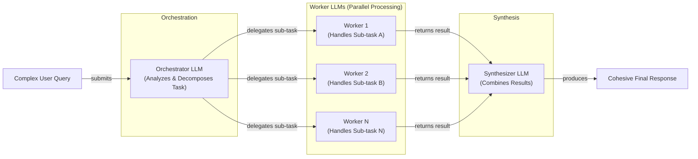

# Lesson 5: Basic AI Workflow Patterns

In the previous lessons, we’ve covered the fundamentals of AI Engineering. We explored the agent landscape, distinguished between rule-based workflows and autonomous agents, and delved into context engineering. We also learned how to get reliable, structured data *out* of an LLM. Now, we will combine these ideas to build our first multi-step AI systems.

On a recent project, our first attempt at building a complex system involved a single, massive prompt. It was supposed to do everything: analyze a document, extract key points, summarize sections, and generate a report. The results were a mess. The LLM would get confused, miss steps, or ignore constraints. It was a classic case of trying to make one person do the job of an entire team. This experience taught us a critical lesson: in AI engineering, as in traditional software, modularity is key.

This lesson is about breaking down that monolithic prompt. We will explore the foundational patterns for building robust LLM workflows: chaining, parallelization, routing, and the orchestrator-worker model. You will learn why a "divide and conquer" strategy is almost always better than a single, complex LLM call. We will build a sequential pipeline for FAQ generation and a dynamic routing system for customer service, all from scratch using Google Gemini.

By the end of this lesson, you will understand how to:
- Code sequential workflows by breaking tasks into steps for better consistency.
- Implement parallel workflows to run independent tasks for higher speed.
- Build routing workflows to classify user intent and direct them to specialized handlers.
- Use the orchestrator-worker pattern to dynamically decompose complex queries.

## The Challenge with Complex Single LLM Calls

When you first start building with LLMs, it’s tempting to put all your instructions into one big prompt. The thinking is, "The model is smart, it can handle it." While this might work for simple demos, it quickly falls apart in production when faced with complex, multi-step tasks. Relying on a single, monolithic LLM call introduces several engineering challenges that make your system unreliable and hard to maintain.

First, debugging becomes a nightmare. If the final output is wrong, where did the failure occur? Was it a misinterpretation of the initial instruction, a failure to follow a specific constraint, or an issue with one of the intermediate reasoning steps? A single prompt gives you a single black box, making it nearly impossible to pinpoint the exact source of an error.

Second, these systems lack modularity. You cannot test, update, or optimize one part of the logic without rewriting the entire prompt and potentially breaking everything else. This makes iterative development slow and risky.

A well-documented issue with long, complex prompts is the "lost in the-middle" problem. Research from Stanford and UC Berkeley found that LLMs pay the most attention to information at the beginning and end of their context window, often ignoring crucial details buried in the middle [[2]](https://dev.to/thousand_miles_ai/the-lost-in-the-middle-problem-why-llms-ignore-the-middle-of-your-context-window-3al2). Stuffing too much information and too many instructions into a single call increases the chance that the model will simply overlook a key requirement.

Finally, a single complex prompt can be inefficient. It might consume more tokens than a series of targeted calls and often leads to less reliable outputs because the cognitive load on the model is too high. A study comparing single-task and multitask prompts found that while some models can handle complexity, many perform better on focused, single-task prompts, highlighting that there is no one-size-fits-all rule [[1]](https://www.mdpi.com/2079-9292/13/23/4712).

Let's see this in practice. We will start by setting up our Gemini client and defining our model.

1.  First, we'll set up our Python environment and initialize the Gemini client. We will use `gemini-2.5-flash`, which is fast and cost-effective for these examples.

    ```python
    import asyncio
    from enum import Enum
    import random
    import time
    
    from pydantic import BaseModel, Field
    from google import genai
    from google.genai import types
    
    from lessons.utils import env
    
    env.load(required_env_vars=["GOOGLE_API_KEY"])
    
    client = genai.Client()
    
    MODEL_ID = "gemini-2.5-flash"
    ```

    It outputs:

    ```text
    Trying to load environment variables from /path/to/your/project/.env
    Environment variables loaded successfully.
    Both GOOGLE_API_KEY and GEMINI_API_KEY are set. Using GOOGLE_API_KEY.
    ```

2.  Next, we will create three mock webpages about renewable energy that will serve as our source content.

    ```python
    webpage_1 = {
        "title": "The Benefits of Solar Energy",
        "content": """
        Solar energy is a renewable powerhouse...
        """,
    }
    
    webpage_2 = {
        "title": "Understanding Wind Turbines",
        "content": """
        Wind turbines are towering structures that capture kinetic energy...
        """,
    }
    
    webpage_3 = {
        "title": "Energy Storage Solutions",
        "content": """
        Effective energy storage is the key to unlocking the full potential...
        """,
    }
    
    all_sources = [webpage_1, webpage_2, webpage_3]
    
    # We'll combine the content for the LLM to process
    combined_content = "\n\n".join(
        [f"Source Title: {source['title']}\nContent: {source['content']}" for source in all_sources]
    )
    ```

3.  Now, let's create a complex prompt that asks the LLM to generate questions, find answers, and cite sources all in one go. We will use Pydantic models, which we covered in Lesson 4, to structure the output.

    ```python
    # This prompt tries to do everything at once: generate questions, find answers,
    # and cite sources. This complexity can often confuse the model.
    n_questions = 10
    prompt_complex = f"""
    Based on the provided content from three webpages, generate a list of exactly {n_questions} frequently asked questions (FAQs).
    For each question, provide a concise answer derived ONLY from the text.
    After each answer, you MUST include a list of the 'Source Title's that were used to formulate that answer.
    
    <provided_content>
    {combined_content}
    </provided_content>
    """.strip()
    
    # Pydantic classes for structured outputs
    class FAQ(BaseModel):
        """A FAQ is a question and answer pair, with a list of sources used to answer the question."""
        question: str = Field(description="The question to be answered")
        answer: str = Field(description="The answer to the question")
        sources: list[str] = Field(description="The sources used to answer the question")
    
    class FAQList(BaseModel):
        """A list of FAQs"""
        faqs: list[FAQ] = Field(description="A list of FAQs")
    
    # Generate FAQs
    config = types.GenerateContentConfig(
        response_mime_type="application/json",
        response_schema=FAQList
    )
    response_complex = client.models.generate_content(
        model=MODEL_ID,
        contents=prompt_complex,
        config=config
    )
    result_complex = response_complex.parsed
    ```

    It outputs:

    ```json
    {
      "question": "What is solar energy and how does it work?",
      "answer": "Solar energy is a renewable powerhouse that converts sunlight into electricity through photovoltaic (PV) panels.",
      "sources": [
        "The Benefits of Solar Energy"
      ]
    }
    ...
    {
      "question": "Why is energy storage crucial for renewable energy sources like solar and wind?",
      "answer": "Effective energy storage is key to unlocking the full potential of renewable sources because it allows storing excess energy when plentiful and releasing it when needed, which is crucial for a stable power grid.",
      "sources": [
        "Energy Storage Solutions",
        "Understanding Wind Turbines"
      ]
    }
    ```

While this output looks acceptable, the more complex the instructions, the higher the chance of inconsistencies. For example, the model might fail to cite all relevant sources or generate a question that cannot be answered from the text. This unreliability makes it difficult to build a production-ready system. A better approach is to break the problem down into smaller, more manageable steps.

## The Power of Modularity: Why Chain LLM Calls?

Instead of a single, complex prompt, we can use prompt chaining: a sequence of simpler, focused LLM calls where the output of one step becomes the input for the next. This "divide and conquer" strategy is a cornerstone of building reliable AI workflows and mirrors how we, as humans, tackle complex problems by breaking them into smaller tasks [[18]](https://www.promptingguide.ai/techniques/prompt_chaining).

This modular approach brings several engineering benefits. First, it improves accuracy and reliability. A simpler, more targeted prompt reduces the cognitive load on the LLM, leading to more consistent and correct outputs for each sub-task.

Second, it makes your system far easier to debug and maintain. When a failure occurs, you can isolate the exact step in the chain that caused the problem. This modularity allows you to test, version, and improve individual components without impacting the rest of the workflow. For example, AppFolio, a property management AI company, used LangGraph to manage complex workflows and achieved a significant performance boost in text-to-data functionality, from 40% to 80% accuracy, by being able to isolate and optimize specific steps [[17]](https://www.zenml.io/blog/llmops-in-production-457-case-studies-of-what-actually-works).

Third, it offers greater flexibility. You can swap out components, experiment with different models for different steps, or add new logic without re-engineering the entire system. For instance, you could use a fast, cost-effective model like Gemini Flash for a simple classification task and a more powerful model like Gemini Pro for a complex generation task within the same workflow.

However, chaining is not without its trade-offs. The most obvious is increased latency and cost, as you are making multiple API calls instead of one. Each additional call adds to the total execution time.

Another significant challenge is the risk of information loss between steps. In a long chain, critical context from early steps can be diluted or pushed out of the context window by intermediate results [[19]](https://futureagi.substack.com/p/how-tool-chaining-fails-in-production). If one step in the chain produces an incorrect or partial result, that error can propagate and compound, leading to a cascading failure. To mitigate this, it is essential to use structured state objects to pass data, keep chains short, and validate inputs and outputs at every boundary.

Despite these challenges, the control and reliability gained from modular workflows make them a superior choice for most production use cases. Now that we understand the theory, let's refactor our FAQ generation task into a sequential workflow.

## Building a Sequential Workflow: FAQ Generation Pipeline

Let's break down our FAQ generation task into a three-step sequential pipeline:
1.  **Generate Questions**: Create a list of questions based on the source content.
2.  **Answer Questions**: For each question, generate a concise answer.
3.  **Find Sources**: For each answer, identify the source documents used.

This approach ensures each step is focused and produces a reliable, traceable output.

Image 1: A flowchart illustrating the sequential FAQ generation pipeline.
```mermaid
flowchart LR
    "Input Content" --> "Generate Questions"
    "Generate Questions" --> "Answer Questions"
    "Answer Questions" --> "Find Sources"
    "Find Sources" --> "FAQ List Output"
```

1.  First, we create a function dedicated to generating questions. This function takes the combined content and a number of questions as input and returns a list of strings.

    ```python
    class QuestionList(BaseModel):
        """A list of questions"""
        questions: list[str] = Field(description="A list of questions")
    
    prompt_generate_questions = """
    Based on the content below, generate a list of {n_questions} relevant and distinct questions that a user might have.
    
    <provided_content>
    {combined_content}
    </provided_content>
    """.strip()
    
    def generate_questions(content: str, n_questions: int = 10) -> list[str]:
        """
        Generate a list of questions based on the provided content.
        """
        config = types.GenerateContentConfig(
            response_mime_type="application/json",
            response_schema=QuestionList
        )
        response_questions = client.models.generate_content(
            model=MODEL_ID,
            contents=prompt_generate_questions.format(n_questions=n_questions, combined_content=content),
            config=config
        )
    
        return response_questions.parsed.questions
    
    # Test the question generation function
    questions = generate_questions(combined_content, n_questions=10)
    ```

    It outputs:

    ```text
    What are the primary environmental and economic benefits of solar energy?
    How do homeowners financially benefit from installing solar panels?
    ...
    ```

2.  Next, we define a function to answer a single question. This prompt explicitly instructs the model to use *only* the provided content, which helps ground the response and reduce hallucinations.

    ```python
    prompt_answer_question = """
    Using ONLY the provided content below, answer the following question.
    The answer should be concise and directly address the question.
    
    <question>
    {question}
    </question>
    
    <provided_content>
    {combined_content}
    </provided_content>
    """.strip()
    
    def answer_question(question: str, content: str) -> str:
        """
        Generate an answer for a specific question using only the provided content.
        """
        answer_response = client.models.generate_content(
            model=MODEL_ID,
            contents=prompt_answer_question.format(question=question, combined_content=content),
        )
        return answer_response.text
    
    # Test the answer generation function
    test_question = questions[0]
    test_answer = answer_question(test_question, combined_content)
    ```

    For the question, "What are the primary environmental and economic benefits of solar energy?", it outputs:

    ```text
    The primary environmental benefit of solar energy is cutting down greenhouse gas emissions by reducing reliance on fossil fuels. Economically, it allows homeowners to significantly lower their monthly electricity bills and potentially sell excess power back to the grid.
    ```

3.  Finally, we create a function to identify which sources were used for a given question-answer pair. This step adds traceability to our system.

    ```python
    class SourceList(BaseModel):
        """A list of source titles that were used to answer the question"""
        sources: list[str] = Field(description="A list of source titles that were used to answer the question")
    
    prompt_find_sources = """
    You will be given a question and an answer that was generated from a set of documents.
    Your task is to identify which of the original documents were used to create the answer.
    
    <question>
    {question}
    </question>
    
    <answer>
    {answer}
    </answer>
    
    <provided_content>
    {combined_content}
    </provided_content>
    """.strip()
    
    def find_sources(question: str, answer: str, content: str) -> list[str]:
        """
        Identify which sources were used to generate an answer.
        """
        config = types.GenerateContentConfig(
            response_mime_type="application/json",
            response_schema=SourceList
        )
        sources_response = client.models.generate_content(
            model=MODEL_ID,
            contents=prompt_find_sources.format(question=question, answer=answer, combined_content=content),
            config=config
        )
        return sources_response.parsed.sources
    
    # Test the source finding function
    test_sources = find_sources(test_question, test_answer, combined_content)
    ```

    It correctly identifies the source:

    ```text
    The Benefits of Solar Energy
    ```

4.  Now, we combine these functions into a complete sequential workflow. We iterate through each generated question, answering it and finding its sources one by one.

    ```python
    def sequential_workflow(content, n_questions=10) -> list[FAQ]:
        """
        Execute the complete sequential workflow for FAQ generation.
        """
        # Generate questions
        questions = generate_questions(content, n_questions)
    
        # Answer and find sources for each question sequentially
        final_faqs = []
        for question in questions:
            # Generate an answer for the current question
            answer = answer_question(question, content)
    
            # Identify the sources for the generated answer
            sources = find_sources(question, answer, content)
    
            faq = FAQ(
                question=question,
                answer=answer,
                sources=sources
            )
            final_faqs.append(faq)
    
        return final_faqs
    
    # Execute the sequential workflow (measure time for comparison)
    start_time = time.monotonic()
    sequential_faqs = sequential_workflow(combined_content, n_questions=4)
    end_time = time.monotonic()
    print(f"Sequential processing completed in {end_time - start_time:.2f} seconds")
    ```

    It outputs:

    ```text
    Sequential processing completed in 22.20 seconds
    ```

The final result is a structured list of FAQs, each with a question, a grounded answer, and a clear list of sources. This modular pipeline is more reliable and easier to debug than our initial monolithic approach. However, processing four questions took over 20 seconds. This latency is acceptable for some applications but too slow for many real-time use cases. The sequential approach is reliable but slow. Let's see how to speed it up.

## Optimizing Sequential Workflows With Parallel Processing

While the sequential workflow improves reliability, its latency can be a bottleneck. Since the processing for each question (answering and finding sources) is independent of the others, we can run these tasks in parallel. This can dramatically reduce the total execution time, especially when dealing with a large number of items.

We will use Python's `asyncio` library to run the `answer_question` and `find_sources` calls concurrently for all questions.

1.  First, we need asynchronous versions of our `answer_question` and `find_sources` functions. The `google-genai` library provides an async client (`client.aio`) that we can use.

    ```python
    async def answer_question_async(question: str, content: str) -> str:
        """
        Async version of answer_question function.
        """
        prompt = prompt_answer_question.format(question=question, combined_content=content)
        response = await client.aio.models.generate_content(
            model=MODEL_ID,
            contents=prompt
        )
        return response.text
    
    async def find_sources_async(question: str, answer: str, content: str) -> list[str]:
        """
        Async version of find_sources function.
        """
        prompt = prompt_find_sources.format(question=question, answer=answer, combined_content=content)
        config = types.GenerateContentConfig(
            response_mime_type="application/json",
            response_schema=SourceList
        )
        response = await client.aio.models.generate_content(
            model=MODEL_ID,
            contents=prompt,
            config=config
        )
        return response.parsed.sources
    ```

2.  Next, we create a function that processes a single question by running its sub-tasks in parallel.

    ```python
    async def process_question_parallel(question: str, content: str) -> FAQ:
        """
        Process a single question by generating answer and finding sources in parallel.
        """
        answer = await answer_question_async(question, content)
        sources = await find_sources_async(question, answer, content)
        return FAQ(
            question=question,
            answer=answer,
            sources=sources
        )
    ```

3.  Finally, we build the main parallel workflow. It first generates the questions synchronously and then uses `asyncio.gather` to execute the processing for all questions concurrently.

    ```python
    async def parallel_workflow(content: str, n_questions: int = 10) -> list[FAQ]:
        """
        Execute the complete parallel workflow for FAQ generation.
        """
        # Generate questions (this step remains synchronous)
        questions = generate_questions(content, n_questions)
    
        # Process all questions in parallel
        tasks = [process_question_parallel(question, content) for question in questions]
        parallel_faqs = await asyncio.gather(*tasks)
    
        return parallel_faqs
    
    # Execute the parallel workflow (measure time for comparison)
    start_time = time.monotonic()
    parallel_faqs = await parallel_workflow(combined_content, n_questions=4)
    end_time = time.monotonic()
    print(f"Parallel processing completed in {end_time - start_time:.2f} seconds")
    ```

    It outputs:

    ```text
    Parallel processing completed in 8.98 seconds
    ```

By running the tasks in parallel, we reduced the total processing time from 22.20 seconds to just 8.98 seconds—a significant improvement. This demonstrates the power of parallelization for I/O-bound tasks like making API calls. For I/O-bound tasks, `asyncio` is often faster than multithreading because it avoids the overhead of managing OS threads [[22]](https://testdriven.io/blog/python-concurrency-parallelism/).

However, a critical real-world consideration is API rate limiting. Most API providers, including Google Gemini, limit the number of requests per minute (RPM) and tokens per minute (TPM) you can make [[21]](https://tianpan.co/blog/2026-03-11-llm-api-resilience-production). Firing off many parallel requests can quickly exhaust these limits, causing your calls to fail. Production-grade systems need to manage this with strategies like token-bucket algorithms, client-side queueing, and exponential backoff with jitter to handle retries gracefully [[21]](https://tianpan.co/blog/2026-03-11-llm-api-resilience-production).

We've improved speed, but our workflow is still static; it follows the same path every time. Let's add dynamic behavior to make our system more intelligent.

## Introducing Dynamic Behavior: Routing and Conditional Logic

So far, our workflows have been linear. But what if you need to handle different types of inputs in different ways? A customer service bot, for example, needs to distinguish between a billing question and a technical support issue. This is where routing comes in.

Routing uses conditional logic to direct a workflow down different paths based on the input or an intermediate state. It’s another application of the "divide and conquer" principle. Instead of creating one massive, complicated prompt that tries to handle every possible scenario, you create multiple smaller, specialized prompts. An initial LLM call acts as a classifier or "dispatcher," analyzing the input and deciding which specialized prompt is the right tool for the job [[16]](https://developers.googleblog.com/developers-guide-to-multi-agent-patterns-in-adk/).

This approach has several advantages. It keeps your prompts focused and optimized for a single task, which generally improves accuracy. It makes the system more maintainable, as you can update the logic for one path without affecting others. It also provides a natural way to handle escalations or fallbacks; if no specific route matches, you can direct the query to a default handler or a human agent.

The key to a robust routing system is a clear, precise, and comprehensive taxonomy of intents. You need to define your categories carefully and provide high-quality examples for each, especially for edge cases, to ensure the classification step is accurate. Now, let's build a simple routing system for a customer service use case.

## Building a Basic Routing Workflow

We will build a simple customer service router that classifies a user's query and directs it to one of three specialized handlers: Technical Support, Billing Inquiry, or General Question.

Image 2: A flowchart illustrating a customer service intent classification routing workflow.
```mermaid
flowchart LR
  A["User Input"] --> B["Intent Classification"]

  B -->|Classified as "Technical"| C["Technical Support Handler"]
  B -->|Classified as "Billing"| D["Billing Inquiry Handler"]
  B -->|Classified as "General"| E["General Question Handler"]

  C --> F["Final Responses"]
  D --> F
  E --> F
```

1.  First, we define the possible intents using a Pydantic model and a Python `Enum`. This creates a clear schema for our classifier.

    ```python
    class IntentEnum(str, Enum):
        """
        Defines the allowed values for the 'intent' field.
        """
        TECHNICAL_SUPPORT = "Technical Support"
        BILLING_INQUIRY = "Billing Inquiry"
        GENERAL_QUESTION = "General Question"
    
    class UserIntent(BaseModel):
        """
        Defines the expected response schema for the intent classification.
        """
        intent: IntentEnum = Field(description="The intent of the user's query")
    
    prompt_classification = """
    Classify the user's query into one of the following categories.
    
    <categories>
    {categories}
    </categories>
    
    <user_query>
    {user_query}
    </user_query>
    """.strip()
    ```

2.  Next, we create the `classify_intent` function. It uses the Gemini API's structured output feature, which we covered in Lesson 4, to ensure the response conforms to our `UserIntent` schema.

    ```python
    def classify_intent(user_query: str) -> IntentEnum:
        """Uses an LLM to classify a user query."""
        prompt = prompt_classification.format(
            user_query=user_query,
            categories=[intent.value for intent in IntentEnum]
        )
        config = types.GenerateContentConfig(
            response_mime_type="application/json",
            response_schema=UserIntent
        )
        response = client.models.generate_content(
            model=MODEL_ID,
            contents=prompt,
            config=config
        )
        return response.parsed.intent
    
    
    query_1 = "My internet connection is not working."
    query_2 = "I think there is a mistake on my last invoice."
    query_3 = "What are your opening hours?"
    
    intent_1 = classify_intent(query_1)
    intent_2 = classify_intent(query_2)
    intent_3 = classify_intent(query_3)
    ```

    The classifier correctly identifies the intents:

    ```text
    Query 1: Technical Support
    Query 2: Billing Inquiry
    Query 3: General Question
    ```

3.  Now, we define our specialized handlers. Each one is a simple prompt tailored to a specific intent.

    ```python
    prompt_technical_support = """
    You are a helpful technical support agent...
    """.strip()
    
    prompt_billing_inquiry = """
    You are a helpful billing support agent...
    """.strip()
    
    prompt_general_question = """
    You are a general assistant...
    """.strip()
    ```

4.  Finally, we create the `handle_query` function, which acts as our router. It takes the user's query and the classified intent, and then calls the appropriate handler.

    ```python
    def handle_query(user_query: str, intent: str) -> str:
        """Routes a query to the correct handler based on its classified intent."""
        if intent == IntentEnum.TECHNICAL_SUPPORT:
            prompt = prompt_technical_support.format(user_query=user_query)
        elif intent == IntentEnum.BILLING_INQUIRY:
            prompt = prompt_billing_inquiry.format(user_query=user_query)
        else: # Also handles GENERAL_QUESTION and any other case
            prompt = prompt_general_question.format(user_query=user_query)
        
        response = client.models.generate_content(
            model=MODEL_ID,
            contents=prompt
        )
        return response.text
    
    
    response_1 = handle_query(query_1, intent_1)
    response_2 = handle_query(query_2, intent_2)
    response_3 = handle_query(query_3, intent_3)
    ```

    For the query "My internet connection is not working," the system correctly routes it to the technical support handler, which responds:

    ```text
    Hello there! I'm sorry to hear you're having trouble with your internet connection... To help me understand what's going on... could you please provide a few more details? ... Have you already tried any troubleshooting steps yourself?
    ```

This simple routing workflow is far more robust and maintainable than a single, monolithic prompt. Routing is great for pre-defined paths, but what if the sub-tasks themselves are unpredictable and need to be determined on the fly? For that, we need a more dynamic pattern.

## Orchestrator-Worker Pattern: Dynamic Task Decomposition

The orchestrator-worker pattern is a more advanced workflow where a central "orchestrator" LLM dynamically breaks down a complex task into smaller sub-tasks and delegates them to specialized "worker" LLMs or tools [[20]](https://www.anthropic.com/engineering/building-effective-agents), [[15]](https://github.com/hugobowne/building-with-ai/blob/main/notebooks/01-agentic-continuum.ipynb). The orchestrator then synthesizes the results from the workers into a final, cohesive response.

This pattern is ideal for complex problems where the required steps cannot be known in advance. Unlike simple parallelization with pre-defined tasks, the orchestrator's key strength is its flexibility; it determines the sub-tasks at runtime based on the specific input [[15]](https://github.com/hugobowne/building-with-ai/blob/main/notebooks/01-agentic-continuum.ipynb). This allows the system to adapt to a wide range of unpredictable queries.

Image 3: A flowchart illustrating the orchestrator-worker pattern, from initial query to final response, including parallel worker processing.


Let's build an orchestrator-worker system to handle a complex customer service query that involves multiple, distinct actions.

1.  We start by defining the orchestrator. Its job is to analyze a user query and break it down into a list of structured tasks. We will use Pydantic to define the schema for these tasks.

    ```python
    class QueryTypeEnum(str, Enum):
        """The type of query to be handled."""
        BILLING_INQUIRY = "BillingInquiry"
        PRODUCT_RETURN = "ProductReturn"
        STATUS_UPDATE = "StatusUpdate"
    
    class Task(BaseModel):
        """A task to be performed."""
        query_type: QueryTypeEnum = Field(description="The type of query to be handled.")
        invoice_number: str | None = Field(description="The invoice number...", default=None)
        product_name: str | None = Field(description="The name of the product...", default=None)
        reason_for_return: str | None = Field(description="The reason for returning...", default=None)
        order_id: str | None = Field(description="The order ID...", default=None)
    
    class TaskList(BaseModel):
        """A list of tasks to be performed."""
        tasks: list[Task] = Field(description="A list of tasks to be performed.")
    
    prompt_orchestrator = f"""
    You are a master orchestrator. Your job is to break down a complex user query into a list of sub-tasks...
    """.strip()
    
    
    def orchestrator(query: str) -> list[Task]:
        """Breaks down a complex query into a list of tasks."""
        prompt = prompt_orchestrator.format(query=query)
        config = types.GenerateContentConfig(
            response_mime_type="application/json",
            response_schema=TaskList
        )
        response = client.models.generate_content(
            model=MODEL_ID,
            contents=prompt,
            config=config
        )
        return response.parsed.tasks
    ```

2.  Next, we implement our specialized workers. Each worker is a function that handles a specific `query_type`. In a real-world application, these workers would interact with backend systems, databases, or external APIs. Here, we will simulate those actions.

    ```python
    # Billing Worker
    def handle_billing_worker(invoice_number: str, original_user_query: str) -> BillingTask:
        # ... simulates opening an investigation
        return task
    
    # Product Return Worker
    def handle_return_worker(product_name: str, reason_for_return: str) -> ReturnTask:
        # ... simulates generating an RMA number
        return task
    
    # Order Status Worker
    def handle_status_worker(order_id: str) -> StatusTask:
        # ... simulates fetching order status
        return task
    ```

3.  After the workers have executed, we need a "synthesizer" to combine their structured outputs into a single, user-friendly response.

    ```python
    prompt_synthesizer = """
    You are a master communicator. Combine several distinct pieces of information...
    """.strip()
    
    
    def synthesizer(results: list[Task]) -> str:
        """Combines structured results from workers into a single user-facing message."""
        # ... formats results into bullet points
        formatted_results = "\n\n".join(bullet_points)
        prompt = prompt_synthesizer.format(formatted_results=formatted_results)
        response = client.models.generate_content(model=MODEL_ID, contents=prompt)
        return response.text
    ```

4.  Now, let's test the complete pipeline with a complex query that requires all three workers.

    ```python
    def process_user_query(user_query):
        """Processes a query using the Orchestrator-Worker-Synthesizer pattern."""
        
        # 1. Run orchestrator
        tasks_list = orchestrator(user_query)
        
        # 2. Run workers
        worker_results = []
        if tasks_list:
            for task in tasks_list:
                if task.query_type == QueryTypeEnum.BILLING_INQUIRY:
                    # ... call billing worker
                elif task.query_type == QueryTypeEnum.PRODUCT_RETURN:
                    # ... call return worker
                elif task.query_type == QueryTypeEnum.STATUS_UPDATE:
                    # ... call status worker
        
        # 3. Run synthesizer
        if worker_results:
            final_user_message = synthesizer(worker_results)
            # ... print final message
    
    # Test with customer query
    complex_customer_query = """
    Hi, I'm writing to you because I have a question about invoice #INV-7890. It seems higher than I expected.
    Also, I would like to return the 'SuperWidget 5000' I bought because it's not compatible with my system.
    Finally, can you give me an update on my order #A-12345?
    """.strip()
    
    process_user_query(complex_customer_query)
    ```

First, the orchestrator correctly decomposes the query into three distinct tasks: a billing inquiry, a product return, and a status update. Then, each worker executes its simulated action and returns a structured result. Finally, the synthesizer combines these results into a clear and helpful email to the customer.

The final synthesized response looks like this:

```text
Hi there,

I've looked into your requests and here's a summary of the actions taken:

Regarding your BillingInquiry:
  - Invoice Number: INV-7890
  - Your Stated Concern: "It seems higher than I expected."
  - Our Action: An investigation (Case ID: INV_CASE_5691) has been opened regarding your concern.
  - Expected Resolution: We will get back to you within 2 business days.

Regarding your ProductReturn:
  - Product: SuperWidget 5000
  - Reason for Return: "it's not compatible with my system"
  - Return Authorization (RMA): RMA-68407
  - Instructions: Please pack the 'SuperWidget 5000' securely...

Regarding your StatusUpdate:
  - Order ID: A-12345
  - Current Status: Shipped
  - Carrier: SuperFast Shipping
  - Tracking Number: SF252998
  - Delivery Estimate: Tomorrow

If you have any other questions, please let me know.

Best regards,
Your Support Team
```

This pattern, while more complex to implement, provides incredible flexibility and power. However, it also introduces challenges, such as the orchestrator becoming a bottleneck or workers producing conflicting outputs. We will explore advanced strategies for managing these issues in future lessons.

## Conclusion

In this lesson, we moved beyond single, monolithic prompts and explored the fundamental patterns for building modular and reliable AI workflows. We learned that breaking down complex tasks into smaller, focused steps is crucial for improving accuracy, simplifying debugging, and making our systems more maintainable.

We started with sequential prompt chaining, building a three-step pipeline to generate a structured FAQ from source documents. Then, we optimized this workflow using parallel processing with `asyncio`, significantly reducing latency. We then introduced dynamic behavior with routing, creating a customer service system that intelligently directs queries to specialized handlers. Finally, we explored the orchestrator-worker pattern, a powerful approach for dynamically decomposing unpredictable tasks.

These patterns—chaining, parallelization, routing, and orchestration—are not just theoretical concepts; they are the essential building blocks you will use to construct nearly any production-grade LLM application. Mastering them is the first major step from being a prompt engineer to becoming an AI engineer. In our next lesson, we will build on this foundation and learn how to give our workflows the ability to interact with the outside world through tools and function calling.

## References

- [1] Gozzi, M., & Di Maio, F. (2024). Comparative Analysis of Prompt Strategies for Large Language Models: Single-Task vs. Multitask Prompts. *Electronics*, *13*(23), 4712. [https://www.mdpi.com/2079-9292/13/23/4712](https://www.mdpi.com/2079-9292/13/23/4712)
- [2] Thousand Miles AI. (2023). The "Lost in the Middle" Problem — Why LLMs Ignore the Middle of Your Context Window. *DEV Community*. [https://dev.to/thousand_miles_ai/the-lost-in-the-middle-problem-why-llms-ignore-the-middle-of-your-context-window-3al2](https://dev.to/thousand_miles_ai/the-lost-in-the-middle-problem-why-llms-ignore-the-middle-of-your-context-window-3al2)
- [3] FLARE framework analyzes GPT-4 Turbo 'Inconclusive' classifications. (2025). *aclanthology.org*. [https://aclanthology.org/2025.ommm-1.4.pdf](https://aclanthology.org/2025.ommm-1.4.pdf)
- [4] ZeMPE benchmark evaluates 13 LLMs on multi-problem prompts. (2025). *aclanthology.org*. [https://aclanthology.org/2025.gem-1.14.pdf](https://aclanthology.org/2025.gem-1.14.pdf)
- [5] Underspecification analysis of prompt requirements. (2025). *arxiv.org*. [https://arxiv.org/html/2505.13360v1](https://arxiv.org/html/2505.13360v1)
- [6] Google Gemini API rate limiting challenges. (2024). *discuss.ai.google.dev*. [https://discuss.ai.google.dev/t/challenges-with-rate-limiting-and-handling-api-responses-in-high-volume-requests/61903](https://discuss.ai.google.dev/t/challenges-with-rate-limiting-and-handling-api-responses-in-high-volume-requests/61903)
- [7] Vertex AI API 429 error handling for parallel Gemini requests. (2024). *stackoverflow.com*. [https://stackoverflow.com/questions/79924021/429-on-vertex-ai-api-how-to-send-5-20-parallel-gemini-api-requests-without-hitt](https://stackoverflow.com/questions/79924021/429-on-vertex-ai-api-how-to-send-5-20-parallel-gemini-api-requests-without-hitt)
- [8] LLM-Based Prompt Routing patterns. (2024). *emergentmind.com*. [https://www.emergentmind.com/topics/llm-based-prompt-routing](https://www.emergentmind.com/topics/llm-based-prompt-routing)
- [9] Universal Model Routing for dynamic LLM pools. (2025). *arxiv.org*. [https://arxiv.org/html/2502.08773v1](https://arxiv.org/html/2502.08773v1)
- [10] Multi-LLM routing strategies on AWS for generative AI. (2024). *aws.amazon.com*. [https://aws.amazon.com/blogs/machine-learning/multi-llm-routing-strategies-for-generative-ai-applications-on-aws/](https://aws.amazon.com/blogs/machine-learning/multi-llm-routing-strategies-for-generative-ai-applications-on-aws/)
- [11] The Orchestrator-Worker pattern for dynamic task decomposition. (2024). *agents.kour.me*. [https://agents.kour.me/orchestrator-worker/](https://agents.kour.me/orchestrator-worker/)
- [12] DIY Orchestrator-Worker LLM Agent. (2024). *mlpills.substack.com*. [https://mlpills.substack.com/p/diy-17-orchestrator-worker-llm-agent](https://mlpills.substack.com/p/diy-17-orchestrator-worker-llm-agent)
- [13] Building a self-healing AI orchestrator with Reflexion patterns. (2024). *online.stevens.edu*. [https://online.stevens.edu/blog/building-self-healing-ai-orchestrator-reflexion-patterns/](https://online.stevens.edu/blog/building-self-healing-ai-orchestrator-reflexion-patterns/)
- [14] Orchestrator-Workers pattern for unpredictable subtasks. (2024). *platform.claude.com*. [https://platform.claude.com/cookbook/patterns-agents-orchestrator-workers](https://platform.claude.com/cookbook/patterns-agents-orchestrator-workers)
- [15] Bowne, H. (2024). Basic Multi-LLM Workflows. *GitHub*. [https://github.com/hugobowne/building-with-ai/blob/main/notebooks/01-agentic-continuum.ipynb](https://github.com/hugobowne/building-with-ai/blob/main/notebooks/01-agentic-continuum.ipynb)
- [16] Saboo, S. (2025). Developer’s guide to multi-agent patterns in ADK. *Google for Developers*. [https://developers.googleblog.com/developers-guide-to-multi-agent-patterns-in-adk/](https://developers.googleblog.com/developers-guide-to-multi-agent-patterns-in-adk/)
- [17] Strick van Linschoten, A. (2025). LLMOps in Production: 457 Case Studies of What Actually Works. *ZenML Blog*. [https://www.zenml.io/blog/llmops-in-production-457-case-studies-of-what-actually-works](https://www.zenml.io/blog/llmops-in-production-457-case-studies-of-what-actually-works)
- [18] Saravia, E. (2024). Prompt Chaining Guide. *Prompting Guide*. [https://www.promptingguide.ai/techniques/prompt_chaining](https://www.promptingguide.ai/techniques/prompt_chaining)
- [19] Future AGI. (2026). How Tool Chaining Fails in Production LLM Agents and How to Fix It. *FutureAGI Substack*. [https://futureagi.substack.com/p/how-tool-chaining-fails-in-production](https://futureagi.substack.com/p/how-tool-chaining-fails-in-production)
- [20] Anthropic. (2024). Building effective agents. [https://www.anthropic.com/engineering/building-effective-agents](https://www.anthropic.com/engineering/building-effective-agents)
- [21] Pan, T. (2026). LLM API Resilience in Production: Rate Limits, Failover, and the Hidden Costs of Naive Retry Logic. *Tian Pan's Blog*. [https://tianpan.co/blog/2026-03-11-llm-api-resilience-production](https://tianpan.co/blog/2026-03-11-llm-api-resilience-production)
- [22] TestDriven.io. (2023). Parallelism, Concurrency, and asyncio in Python. [https://testdriven.io/blog/python-concurrency-parallelism/](https://testdriven.io/blog/python-concurrency-parallelism/)
- [23] Anthropic. (2024). Chain Prompts. [https://docs.anthropic.com/en/docs/build-with-claude/prompt-engineering/chain-prompts](https://docs.anthropic.com/en/docs/build-with-claude/prompt-engineering/chain-prompts)
- [24] LangChain. (2024). LangGraph Workflows. [https://langchain-ai.github.io/langgraphjs/tutorials/workflows](https://langchain-ai.github.io/langgraphjs/tutorials/workflows)
- [25] Anthropic. (2024). Claude 4 Best Practices. [https://docs.anthropic.com/en/docs/build-with-claude/prompt-engineering/claude-4-best-practices](https://docs.anthropic.com/en/docs/build-with-claude/prompt-engineering/claude-4-best-practices)
- [26] Towards AI. (2024). AI Agents Course - Lesson 5 Notebook. *GitHub*. [https://github.com/towardsai/course-ai-agents/blob/dev/lessons/05_workflow_patterns/notebook.ipynb](https://github.com/towardsai/course-ai-agents/blob/dev/lessons/05_workflow_patterns/notebook.ipynb)