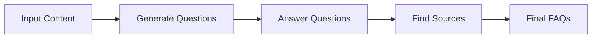
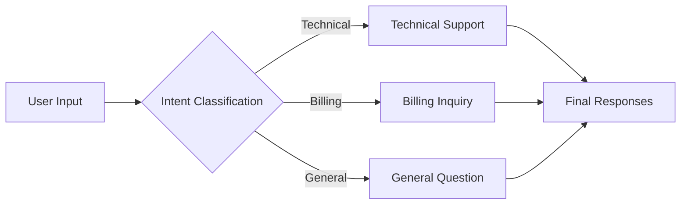
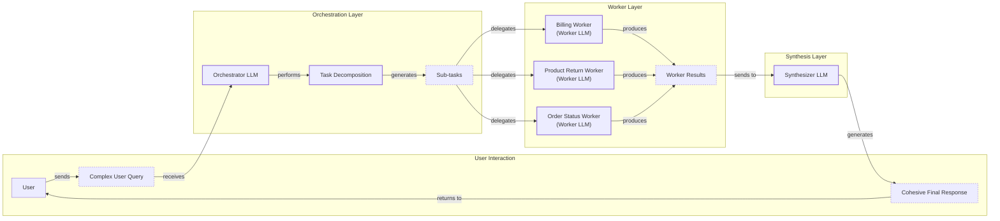

# Lesson 5: Basic Workflow Ingredients

In our previous lessons, we laid the groundwork for AI Engineering. We explored the AI agent landscape, the difference between rule-based LLM workflows and autonomous agents, context engineering, and structured outputs. Now, we will build on that foundation by exploring the fundamental patterns for creating multi-step LLM workflows: chaining, parallelization, routing, and orchestration.

These patterns are the basic ingredients for building almost any AI application. Just as a chef combines simple ingredients to create a complex dish, an AI Engineer combines these workflow patterns to build sophisticated and reliable systems. We will move from theory to practice, showing you how to implement each pattern from scratch using the Google Gemini API. By the end, you will understand how to break down complex problems into manageable, modular, and efficient workflows—a core skill for shipping production-grade AI.

## The Challenge with Complex Single LLM Calls

When you first start building with LLMs, the temptation is to solve complex, multi-step problems with a single, massive prompt. You write detailed instructions, provide all the context, and ask the model to do everything at once. While this can work for simple demos, it quickly breaks down in production.

This monolithic approach suffers from several issues:
*   **Difficult Debugging:** When a single, large prompt fails, it is hard to pinpoint the exact cause. The model's reasoning is a black box, and you are left guessing which part of the instruction it misunderstood [[36]](https://www.decodingai.com/p/stop-building-ai-agents-use-these). For example, Acxiom struggled to debug complex audience segmentation workflows until they used tracing tools like LangSmith to break down agent interactions step-by-step [[21]](https://www.zenml.io/blog/llmops-in-production-287-more-case-studies-of-what-actually-works).
*   **Lack of Modularity:** A single prompt is a single unit. You cannot easily update or improve one part of the logic without rewriting the entire prompt. This makes the system brittle and hard to maintain over time [[35]](https://productschool.com/blog/artificial-intelligence/ai-agent-orchestration-patterns).
*   **The "Lost in the Middle" Problem:** Research has consistently shown that LLMs pay the most attention to the beginning and end of their context window. Important information placed in the middle is often ignored, leading to lower accuracy [[2]](https://dev.to/thousand_miles_ai/the-lost-in-the-middle-problem-why-llms-ignore-the-middle-of-your-context-window-3al2). This U-shaped performance curve persists even in models with very large context windows.
*   **Cognitive Overload and Misinterpretation:** Complex prompts with multiple constraints increase the risk of the model misinterpreting instructions. Simpler prompts with less syntactic complexity allow models to process requests more consistently, as they reduce the cognitive load required to understand the task [[1]](https://www.mdpi.com/2079-9292/13/23/4712).
*   **Lower Reliability:** As prompt complexity increases, the model's ability to follow every instruction degrades. A 2025 study found that for prompts with 19 distinct requirements, GPT-4o's accuracy dropped to 85%, down from 98.7% with a single requirement [[5]](https://arxiv.org/html/2505.13360v1). This makes monolithic prompts less reliable for business-critical applications.

To see this in action, let's try to build a system that generates a Frequently Asked Questions (FAQ) page from a set of documents about renewable energy.

<aside>
💡

You can find the code of this lesson in the notebook of Lesson 4, in the GitHub repository of the course.

</aside>

1.  First, we set up our environment by initializing the Gemini client and defining our model. We will use `gemini-2.5-flash`, which is fast and cost-effective.
    ```python
    import asyncio
    from enum import Enum
    import random
    import time
    
    from pydantic import BaseModel, Field
    from google import genai
    from google.genai import types
    
    from lessons.utils import env
    
    env.load(required_env_vars=["GOOGLE_API_KEY"])
    
    client = genai.Client()
    
    MODEL_ID = "gemini-2.5-flash"
    ```
    It outputs:
    ```text
    Trying to load environment variables from /Users/fabio/Desktop/course-ai-agents/.env
    Environment variables loaded successfully.
    Both GOOGLE_API_KEY and GEMINI_API_KEY are set. Using GOOGLE_API_KEY.
    ```
2.  Next, we define our source documents.
    ```python
    webpage_1 = {
        "title": "The Benefits of Solar Energy",
        "content": """
        Solar energy is a renewable powerhouse...
        """,
    }
    
    webpage_2 = {
        "title": "Understanding Wind Turbines",
        "content": """
        Wind turbines are towering structures...
        """,
    }
    
    webpage_3 = {
        "title": "Energy Storage Solutions",
        "content": """
        Effective energy storage is the key...
        """,
    }
    
    all_sources = [webpage_1, webpage_2, webpage_3]
    
    combined_content = "\n\n".join(
        [f"Source Title: {source['title']}\nContent: {source['content']}" for source in all_sources]
    )
    ```
3.  Now, let's create a complex prompt that asks the model to generate questions, find answers, and cite sources all in one go.
    ```python
    class FAQ(BaseModel):
        """A FAQ is a question and answer pair, with a list of sources used to answer the question."""
        question: str = Field(description="The question to be answered")
        answer: str = Field(description="The answer to the question")
        sources: list[str] = Field(description="The sources used to answer the question")
    
    class FAQList(BaseModel):
        """A list of FAQs"""
        faqs: list[FAQ] = Field(description="A list of FAQs")
    
    n_questions = 10
    prompt_complex = f"""
    Based on the provided content from three webpages, generate a list of exactly {n_questions} frequently asked questions (FAQs).
    For each question, provide a concise answer derived ONLY from the text.
    After each answer, you MUST include a list of the 'Source Title's that were used to formulate that answer.
    
    <provided_content>
    {combined_content}
    </provided_content>
    """.strip()
    
    config = types.GenerateContentConfig(
        response_mime_type="application/json",
        response_schema=FAQList
    )
    response_complex = client.models.generate_content(
        model=MODEL_ID,
        contents=prompt_complex,
        config=config
    )
    result_complex = response_complex.parsed
    ```
    It outputs:
    ```text
      {
        "question": "Why is energy storage crucial for renewable energy sources like solar and wind?",
        "answer": "Effective energy storage is key to unlocking the full potential of renewable sources because it allows storing excess energy when plentiful and releasing it when needed, which is crucial for a stable power grid.",
        "sources": [
          "Energy Storage Solutions",
          "Understanding Wind Turbines"
        ]
      }
    ```
While the output might look acceptable, this approach can be fragile. However, it's important to note that this is not a universal rule. Recent research suggests that the performance of single versus multi-task prompts is highly dependent on the model's architecture, with some models performing better on complex, all-in-one instructions [[1]](https://www.mdpi.com/2079-9292/13/23/4712). Still, for many models, performance degrades as complexity increases. For instance, the model might cite only one source when an answer is derived from multiple, making the output less reliable. A more consistently robust approach is to break the problem down.

## The Power of Modularity: Why Chain LLM Calls?

Instead of a single, complex prompt, we can use prompt chaining: a sequence of simpler, focused LLM calls where the output of one step becomes the input for the next. This "divide-and-conquer" strategy is a core principle of software engineering, and it applies just as well to building with LLMs [[41]](https://medium.com/@fabiolalli/a-practical-guide-to-prompt-engineering-techniques-and-their-use-cases-5f8574e2cd9a), [[42]](https://www.scrum.org/resources/blog/10-prompt-engineering-techniques-super-simple-explanation).

Chaining offers several powerful advantages:
*   **Improved Modularity:** Each LLM call in the chain focuses on a single, well-defined sub-task. This makes the system easier to test, version, and maintain. For instance, AppFolio, a property management software company, uses LangGraph to manage complex workflows in their AI copilot, allowing them to build and debug individual components of a larger task [[20]](https://www.zenml.io/blog/llmops-in-production-457-case-studies-of-what-actually-works).
*   **Enhanced Accuracy:** Simpler, targeted prompts reduce the cognitive load on the LLM. This mirrors how humans approach complex problems, breaking them into a sequence of logical steps. By guiding the model through a similar step-by-step process, we align its 'thinking' with a more structured, human-like reasoning path, which improves accuracy on multi-step tasks [[61]](https://invisibletech.ai/blog/how-to-teach-chain-of-thought-reasoning-to-your-llm). Instead of trying to juggle multiple instructions at once, the model can dedicate its full attention to a single goal, which generally leads to more accurate and reliable outputs [[60]](https://agentic-design.ai/patterns/prompt-chaining).
*   **Easier Debugging:** When a chained workflow fails, you can isolate the problem to a specific step. By examining the inputs and outputs of each link in the chain, you can quickly identify where things went wrong, rather than trying to debug a monolithic prompt.
*   **Increased Flexibility and Optimization:** A modular chain allows you to swap components in and out. You can experiment with different prompts, or even different models, for each step. This is a common optimization strategy: use a fast, cheap model (like Gemini Flash or Claude Haiku) for simple tasks like classification, and a more powerful, expensive model (like Gemini Pro or Claude Opus) for complex reasoning or generation [[36]](https://www.decodingai.com/p/stop-building-ai-agents-use-these).

However, chaining is not without its trade-offs. The primary downside is the potential for information loss between steps, a problem known as context decay [[22]](https://futureagi.substack.com/p/how-tool-chaining-fails-in-production). If an early step summarizes a document, crucial details might be lost before they reach a later step. To mitigate this, it is important to pass structured state objects between steps and be deliberate about what information is carried forward. Additionally, the assumption that breaking down tasks is always superior is not universally true. Some models, like LLama 3.1 8B, have demonstrated superior performance with multitask prompts in certain contexts, suggesting their architecture is well-suited to handling integrated instructions [[1]](https://www.mdpi.com/2079-9292/13/23/4712). Finally, multiple API calls can increase latency and cost, and managing the "glue code" that connects the steps adds engineering overhead.

Despite these challenges, the benefits of modularity, reliability, and debuggability make chaining a fundamental pattern for production AI systems.

## Building a Sequential Workflow: FAQ Generation Pipeline

Let's refactor our FAQ generation example into a three-step sequential workflow:
1.  **Generate Questions:** The first LLM call will read the source documents and generate a list of potential questions.
2.  **Answer Questions:** For each question, a second LLM call will generate a concise answer based on the documents.
3.  **Find Sources:** For each question-and-answer pair, a third LLM call will identify the specific source titles used.

This approach breaks the complex task into a clear, manageable assembly line.

Image 1: A flowchart illustrating the sequential FAQ generation pipeline.


1.  First, we create a function to generate a list of questions from the content. This LLM call is focused on a single task: brainstorming relevant questions.
    ```python
    class QuestionList(BaseModel):
        """A list of questions"""
        questions: list[str] = Field(description="A list of questions")
    
    prompt_generate_questions = """
    Based on the content below, generate a list of {n_questions} relevant and distinct questions that a user might have.
    
    <provided_content>
    {combined_content}
    </provided_content>
    """.strip()
    
    def generate_questions(content: str, n_questions: int = 10) -> list[str]:
        """
        Generate a list of questions based on the provided content.
        """
        config = types.GenerateContentConfig(
            response_mime_type="application/json",
            response_schema=QuestionList
        )
        response_questions = client.models.generate_content(
            model=MODEL_ID,
            contents=prompt_generate_questions.format(n_questions=n_questions, combined_content=content),
            config=config
        )
    
        return response_questions.parsed.questions
    
    questions = generate_questions(combined_content, n_questions=10)
    ```
    It outputs:
    ```text
    What are the primary environmental and economic benefits of solar energy?
    How do homeowners financially benefit from installing solar panels?
    ...
    ```
2.  Next, we define a function that takes a single question and generates an answer, with a prompt that strictly instructs it to use only the provided content.
    ```python
    prompt_answer_question = """
    Using ONLY the provided content below, answer the following question.
    The answer should be concise and directly address the question.
    
    <question>
    {question}
    </question>
    
    <provided_content>
    {combined_content}
    </provided_content>
    """.strip()
    
    def answer_question(question: str, content: str) -> str:
        """
        Generate an answer for a specific question using only the provided content.
        """
        answer_response = client.models.generate_content(
            model=MODEL_ID,
            contents=prompt_answer_question.format(question=question, combined_content=content),
        )
        return answer_response.text
    ```
3.  Our third function takes a question and its generated answer and identifies the sources. This isolates the task of citation, making it more accurate.
    ```python
    class SourceList(BaseModel):
        """A list of source titles that were used to answer the question"""
        sources: list[str] = Field(description="A list of source titles that were used to answer the question")
    
    prompt_find_sources = """
    You will be given a question and an answer that was generated from a set of documents.
    Your task is to identify which of the original documents were used to create the answer.
    
    <question>
    {question}
    </question>
    
    <answer>
    {answer}
    </answer>
    
    <provided_content>
    {combined_content}
    </provided_content>
    """.strip()
    
    def find_sources(question: str, answer: str, content: str) -> list[str]:
        """
        Identify which sources were used to generate an answer.
        """
        config = types.GenerateContentConfig(
            response_mime_type="application/json",
            response_schema=SourceList
        )
        sources_response = client.models.generate_content(
            model=MODEL_ID,
            contents=prompt_find_sources.format(question=question, answer=answer, combined_content=content),
            config=config
        )
        return sources_response.parsed.sources
    ```
4.  Finally, we combine these functions into a single sequential workflow. We first generate all the questions, then loop through them, generating an answer and finding the sources for each one.
    ```python
    def sequential_workflow(content, n_questions=10) -> list[FAQ]:
        """
        Execute the complete sequential workflow for FAQ generation.
        """
        questions = generate_questions(content, n_questions)
    
        final_faqs = []
        for question in questions:
            answer = answer_question(question, content)
            sources = find_sources(question, answer, content)
            faq = FAQ(
                question=question,
                answer=answer,
                sources=sources
            )
            final_faqs.append(faq)
    
        return final_faqs
    
    start_time = time.monotonic()
    sequential_faqs = sequential_workflow(combined_content, n_questions=4)
    end_time = time.monotonic()
    print(f"Sequential processing completed in {end_time - start_time:.2f} seconds")
    ```
    It outputs:
    ```text
    Sequential processing completed in 22.20 seconds
    
      {
        "question": "What are the main differences between onshore and offshore wind farms, and what is the biggest challenge associated with wind energy generation?",
        "answer": "Offshore wind farms generally produce more consistent power than onshore wind farms due to stronger, more reliable winds. The biggest challenge associated with wind energy generation is its intermittency, as it only generates power when the wind blows.",
        "sources": [
          "Understanding Wind Turbines"
        ]
      }
    ```
This sequential workflow is more robust and easier to debug than our initial monolithic prompt. However, processing four questions took over 20 seconds. Each step for each question runs one after another. Since answering each question is an independent task, we can significantly speed this up with parallelization.

## Optimizing Sequential Workflows With Parallel Processing

Our sequential workflow is inefficient because it waits for the answer and source-finding steps for one question to complete before starting the next. These tasks are independent; the answer to "What is solar energy?" does not depend on the answer to "What are wind turbines?". We can execute these tasks concurrently to reduce the total processing time.

This is a classic I/O-bound problem. The bottleneck is not our computer's CPU; it is the time we spend waiting for the Gemini API to respond over the network. Python's `asyncio` library is perfectly suited for this, allowing us to manage thousands of concurrent network requests efficiently from a single thread [[26]](https://santhalakshminarayana.github.io/blog/concurrency-patterns-python), [[27]](https://medium.com/@sizanmahmud08/python-concurrency-showdown-asyncio-vs-threading-vs-multiprocessing-which-should-you-choose-in-31205161899a).

1.  First, we create asynchronous versions of our `answer_question` and `find_sources` functions using `async def` and `await`. The `google-genai` library provides an async client (`client.aio`) for this purpose.
    ```python
    async def answer_question_async(question: str, content: str) -> str:
        """
        Async version of answer_question function.
        """
        prompt = prompt_answer_question.format(question=question, combined_content=content)
        response = await client.aio.models.generate_content(
            model=MODEL_ID,
            contents=prompt
        )
        return response.text
    
    async def find_sources_async(question: str, answer: str, content: str) -> list[str]:
        """
        Async version of find_sources function.
        """
        prompt = prompt_find_sources.format(question=question, answer=answer, combined_content=content)
        config = types.GenerateContentConfig(
            response_mime_type="application/json",
            response_schema=SourceList
        )
        response = await client.aio.models.generate_content(
            model=MODEL_ID,
            contents=prompt,
            config=config
        )
        return response.parsed.sources
    ```
2.  Next, we create a function that processes a single question by running the `answer_question_async` and `find_sources_async` calls. Note that we are still running these two steps sequentially for a single question, as finding the sources depends on the answer.
    ```python
    async def process_question_parallel(question: str, content: str) -> FAQ:
        """
        Process a single question by generating answer and finding sources in parallel.
        """
        answer = await answer_question_async(question, content)
        sources = await find_sources_async(question, answer, content)
        return FAQ(
            question=question,
            answer=answer,
            sources=sources
        )
    ```
3.  Finally, we modify our main workflow to run `process_question_parallel` for all questions concurrently using `asyncio.gather()`. This function collects all our async tasks and runs them at the same time.
    ```python
    async def parallel_workflow(content: str, n_questions: int = 10) -> list[FAQ]:
        """
        Execute the complete parallel workflow for FAQ generation.
        """
        # Generate questions (this step remains synchronous)
        questions = generate_questions(content, n_questions)
    
        # Process all questions in parallel
        tasks = [process_question_parallel(question, content) for question in questions]
        parallel_faqs = await asyncio.gather(*tasks)
    
        return parallel_faqs
    
    start_time = time.monotonic()
    parallel_faqs = await parallel_workflow(combined_content, n_questions=4)
    end_time = time.monotonic()
    print(f"Parallel processing completed in {end_time - start_time:.2f} seconds")
    ```
    It outputs:
    ```text
    Parallel processing completed in 8.98 seconds
    
      {
        "question": "What are the primary environmental and economic benefits of using solar energy?",
        "answer": "The primary environmental benefit of solar energy is cutting down greenhouse gas emissions by reducing reliance on fossil fuels.\n\nThe primary economic benefits include significantly lower monthly electricity bills, the ability to sell excess power back to the grid, long-term savings, and contributing to energy independence for nations.",
        "sources": [
          "The Benefits of Solar Energy"
        ]
      }
    ```
By running the tasks in parallel, we cut the execution time from 22 seconds to just 9 seconds—a more than 2x speedup.

However, making many parallel calls comes with a risk: hitting API rate limits. Most API providers limit both Requests Per Minute (RPM) and Tokens Per Minute (TPM). In production, you must implement strategies like exponential backoff with jitter to handle `429 (Too Many Requests)` errors gracefully. This involves waiting a short, random amount of time before retrying a failed request, preventing a "thundering herd" of clients from all retrying at once [[9]](https://tianpan.co/blog/2026-03-11-llm-api-resilience-production). At a larger scale, these concerns are often managed by cloud-native infrastructure. Orchestration frameworks like Kubernetes provide auto-scaling and fault tolerance, while specialized model serving frameworks can handle request routing, caching, and rate limit management automatically, allowing you to build resilient, scalable LLM services [[62]](https://arxiv.org/html/2604.17227v1).

## Introducing Dynamic Behavior: Routing and Conditional Logic

Sequential and parallel workflows are powerful, but they are fixed. Every input goes through the same set of steps. In many real-world applications, you need dynamic behavior—the ability to choose a different path based on the input. This is where routing comes in.

Routing uses conditional logic to direct an input to a specialized handler. A common pattern is to use an initial LLM call as a classifier or dispatcher. This first LLM analyzes the user's intent and decides which subsequent prompt, tool, or workflow is best suited to handle the request [[49]](https://developers.googleblog.com/developers-guide-to-multi-agent-patterns-in-adk/), [[51]](https://www.decodingai.com/p/stop-building-ai-agents-use-these).

This follows the same "divide-and-conquer" principle. Instead of writing a single, complex prompt that tries to handle every possible user intent, you create multiple, specialized prompts, each optimized for a specific task. For example, a customer support system might route a query about a billing issue to a "Billing Specialist" prompt, while a technical problem goes to a "Tech Support" prompt [[12]](https://www.vellum.ai/blog/how-to-build-intent-detection-for-your-chatbot). This approach mirrors the single responsibility principle from microservices architecture. Each specialized prompt acts like an independent service with a clearly defined purpose, making the entire system more maintainable and easier to scale. By defining clear service boundaries around business capabilities—a concept from Domain-Driven Design—you prevent tight coupling between different functionalities and create a more robust workflow [[63]](https://wjaets.com/sites/default/files/fulltext_pdf/WJAETS-2025-1078.pdf), [[64]](https://konghq.com/blog/learning-center/what-are-microservices). This separation of concerns makes the system more accurate, maintainable, and easier to optimize.

## Building a Basic Routing Workflow

Let's build a simple routing system for a customer service chatbot. The system will first classify a user's query into one of three intents—`Technical Support`, `Billing Inquiry`, or `General Question`—and then route it to a specialized handler to generate an appropriate first response.

Image 2: A flowchart illustrating a basic routing workflow for customer service.


1.  First, we define our intents using a Python `Enum` and a Pydantic model to structure the classifier's output. We then create a `classify_intent` function that asks the LLM to categorize the user's query.
    ```python
    class IntentEnum(str, Enum):
        """
        Defines the allowed values for the 'intent' field.
        """
        TECHNICAL_SUPPORT = "Technical Support"
        BILLING_INQUIRY = "Billing Inquiry"
        GENERAL_QUESTION = "General Question"
    
    class UserIntent(BaseModel):
        """
        Defines the expected response schema for the intent classification.
        """
        intent: IntentEnum = Field(description="The intent of the user's query")
    
    prompt_classification = """
    Classify the user's query into one of the following categories.
    
    <categories>
    {categories}
    </categories>
    
    <user_query>
    {user_query}
    </user_query>
    """.strip()
    
    def classify_intent(user_query: str) -> IntentEnum:
        """Uses an LLM to classify a user query."""
        prompt = prompt_classification.format(
            user_query=user_query,
            categories=[intent.value for intent in IntentEnum]
        )
        config = types.GenerateContentConfig(
            response_mime_type="application/json",
            response_schema=UserIntent
        )
        response = client.models.generate_content(
            model=MODEL_ID,
            contents=prompt,
            config=config
        )
        return response.parsed.intent
    
    query_1 = "My internet connection is not working."
    intent_1 = classify_intent(query_1)
    ```
    It outputs:
    ```text
    IntentEnum.TECHNICAL_SUPPORT
    ```
2.  Next, we define three specialized prompts, one for each intent.
    ```python
    prompt_technical_support = """
    You are a helpful technical support agent.
    ...
    Provide a helpful first response, asking for more details...
    """.strip()
    
    prompt_billing_inquiry = """
    You are a helpful billing support agent.
    ...
    Acknowledge their concern and inform them that you will need to look up their account...
    """.strip()
    
    prompt_general_question = """
    You are a general assistant.
    ...
    Apologize that you are not sure how to help.
    """.strip()
    ```
3.  Finally, we create a `handle_query` function that acts as our router. It takes the user's query and the classified intent, then uses a simple `if/elif/else` block to select and execute the appropriate prompt.
    ```python
    def handle_query(user_query: str, intent: str) -> str:
        """Routes a query to the correct handler based on its classified intent."""
        if intent == IntentEnum.TECHNICAL_SUPPORT:
            prompt = prompt_technical_support.format(user_query=user_query)
        elif intent == IntentEnum.BILLING_INQUIRY:
            prompt = prompt_billing_inquiry.format(user_query=user_query)
        else:
            prompt = prompt_general_question.format(user_query=user_query)
        
        response = client.models.generate_content(
            model=MODEL_ID,
            contents=prompt
        )
        return response.text
    
    response_1 = handle_query(query_1, intent_1)
    ```
    It outputs:
    ```text
    Hello there! I'm sorry to hear you're having trouble with your internet connection. That can definitely be frustrating.
    
    To help me understand what's going on and assist you best, could you please provide a few more details?
    ...
    ```
This simple routing pattern allows us to build more sophisticated and reliable conversational systems by ensuring that each query is handled by a specialized and optimized prompt.

## Orchestrator-Worker Pattern: Dynamic Task Decomposition

Chaining, parallelization, and routing are powerful, but they operate on pre-defined paths. What if the task is so complex that you cannot predict the necessary sub-tasks in advance? This is where the orchestrator-worker pattern comes in.

In this pattern, a central "orchestrator" LLM analyzes a complex query and dynamically breaks it down into a series of smaller, executable sub-tasks. These sub-tasks are then delegated to specialized "worker" functions or other LLMs. Finally, a "synthesizer" LLM takes the results from all the workers and combines them into a single, coherent response [[32]](https://mlpills.substack.com/p/diy-17-orchestrator-worker-llm-agent).

The key difference from simple parallelization is its flexibility. The sub-tasks are not pre-defined; they are determined at runtime by the orchestrator based on the specific input [[19]](https://platform.claude.com/cookbook/patterns-agents-orchestrator-workers). This makes the pattern ideal for unpredictable tasks that require diverse expertise, such as answering a multi-part customer query that touches on billing, returns, and order status all at once [[16]](https://agents.kour.me/orchestrator-worker/).

However, this pattern introduces significant coordination challenges. A primary failure mode occurs when workers produce conflicting outputs. For example, in a customer support system, one agent might mark a ticket as resolved while another tries to escalate it, leading to a corrupted state [[65]](https://www.getmaxim.ai/articles/multi-agent-system-reliability-failure-patterns-root-causes-and-production-validation-strategies/). Without a central mechanism to resolve these disagreements, the system can deadlock or produce unreliable results. These coordination breakdowns are a common reason multi-agent systems fail in production [[66]](https://galileo.ai/blog/multi-agent-ai-failures-prevention).

Image 3: A flowchart illustrating the orchestrator-worker pattern with an Orchestrator LLM, Worker LLMs, and a Synthesizer LLM.


Let's implement this pattern to handle a complex customer query.

1.  First, we define the orchestrator. Its job is to parse a user query and output a structured list of tasks for the workers.
    ```python
    class QueryTypeEnum(str, Enum):
        BILLING_INQUIRY = "BillingInquiry"
        PRODUCT_RETURN = "ProductReturn"
        STATUS_UPDATE = "StatusUpdate"
    
    class Task(BaseModel):
        query_type: QueryTypeEnum
        invoice_number: str | None = None
        product_name: str | None = None
        reason_for_return: str | None = None
        order_id: str | None = None
    
    class TaskList(BaseModel):
        tasks: list[Task]
    
    def orchestrator(query: str) -> list[Task]:
        """Breaks down a complex query into a list of tasks."""
        # ... prompt definition ...
        prompt = prompt_orchestrator.format(query=query)
        config = types.GenerateContentConfig(response_mime_type="application/json", response_schema=TaskList)
        response = client.models.generate_content(model=MODEL_ID, contents=prompt, config=config)
        return response.parsed.tasks
    ```
2.  Next, we define our specialized workers. Each worker is a function that handles one type of task (billing, returns, or status updates). In a real application, these workers might call external APIs or databases. Here, we will simulate that behavior.
    ```python
    def handle_billing_worker(invoice_number: str, original_user_query: str) -> BillingTask:
        # ... uses an LLM to extract the specific concern ...
        # ... simulates opening an investigation and returns a structured response ...
        return task
    
    def handle_return_worker(product_name: str, reason_for_return: str) -> ReturnTask:
        # ... simulates generating an RMA number and returns a structured response ...
        return task
    
    def handle_status_worker(order_id: str) -> StatusTask:
        # ... simulates fetching order status and returns a structured response ...
        return task
    ```
3.  The synthesizer is an LLM call that takes the structured outputs from all the workers and composes a single, user-friendly message.
    ```python
    def synthesizer(results: list[Task]) -> str:
        """Combines structured results from workers into a single user-facing message."""
        # ... formats worker results into bullet points ...
        formatted_results = "\n\n".join(bullet_points)
        prompt = prompt_synthesizer.format(formatted_results=formatted_results)
        response = client.models.generate_content(model=MODEL_ID, contents=prompt)
        return response.text
    ```
4.  Now, let's test the full pipeline with a complex query.
    ```python
    complex_customer_query = """
    Hi, I'm writing to you because I have a question about invoice #INV-7890. It seems higher than I expected.
    Also, I would like to return the 'SuperWidget 5000' I bought because it's not compatible with my system.
    Finally, can you give me an update on my order #A-12345?
    """.strip()
    
    def process_user_query(user_query):
        # 1. Run orchestrator
        tasks_list = orchestrator(user_query)
        
        # 2. Run workers
        worker_results = []
        for task in tasks_list:
            if task.query_type == QueryTypeEnum.BILLING_INQUIRY:
                worker_results.append(handle_billing_worker(task.invoice_number, user_query))
            # ... dispatch other workers ...
    
        # 3. Run synthesizer
        final_user_message = synthesizer(worker_results)
        print(final_user_message)
    
    process_user_query(complex_customer_query)
    ```
    It outputs:
    ```text
    Dear Customer,
    
    Thank you for reaching out. Here's a summary of the actions we've taken regarding your requests:
    
    Regarding your BillingInquiry:
      - Invoice Number: INV-7890
      - Your Stated Concern: "It seems higher than I expected."
      - Our Action: An investigation (Case ID: INV_CASE_5329) has been opened regarding your concern.
      - Expected Resolution: We will get back to you within 2 business days.
    
    Regarding your ProductReturn:
      - Product: SuperWidget 5000
      - Reason for Return: "it's not compatible with my system"
      - Return Authorization (RMA): RMA-64900
      - Instructions: Please pack the 'SuperWidget 5000' securely in its original packaging if possible. Include all accessories and manuals. Write the RMA number (RMA-64900) clearly on the outside of the package. Ship to: Returns Department, 123 Automation Lane, Tech City, TC 98765.
    
    Regarding your StatusUpdate:
      - Order ID: A-12345
      - Current Status: Shipped
      - Carrier: SuperFast Shipping
      - Tracking Number: SF269600
      - Delivery Estimate: Tomorrow
    
    We appreciate your patience and will be in touch soon regarding your billing inquiry.
    
    Best regards,
    The Support Team
    ```
The orchestrator successfully deconstructed the complex query into three distinct sub-tasks, dispatched them to the correct workers, and the synthesizer assembled their structured outputs into a single, comprehensive response. This pattern provides a scalable and maintainable way to build AI systems that can handle complex, multi-faceted problems.

## Conclusion

In this lesson, we have explored four fundamental patterns for building multi-step LLM applications. We started by understanding the limitations of monolithic prompts and embraced the power of modularity through **prompt chaining**. We saw how to break down a complex task into a reliable, sequential workflow. Then, we optimized that workflow using **parallelization** to significantly reduce latency for independent tasks.

We then introduced dynamic behavior with **routing**, using an LLM to classify user intent and direct requests to specialized handlers. Finally, we tackled unpredictable, complex tasks with the **orchestrator-worker** pattern, where a central LLM dynamically decomposes problems and delegates sub-tasks.

These patterns—chaining, parallelization, routing, and orchestration—are not just theoretical concepts; they are the practical building blocks you will use every day as an AI Engineer. They provide the control, reliability, and modularity needed to move from simple prototypes to production-ready systems. In our next lesson, we will build on this foundation by giving our workflows the ability to interact with the outside world through tools and function calling.

## References

- [1] [Empirical Study on the Comparison between Single-Task and Multi-Task Prompts for Open-Weight LLMs](https://www.mdpi.com/2079-9292/13/23/4712)
- [2] [The "Lost in the Middle" Problem — Why LLMs Ignore the Middle of Your Context Window](https://dev.to/thousand_miles_ai/the-lost-in-the-middle-problem-why-llms-ignore-the-middle-of-your-context-window-3al2)
- [3] [Parsing and Semantic-Error Analysis of In-Context Learning for Manipulation-Degree Classification of Misinformation](https://aclanthology.org/2025.ommm-1.4.pdf)
- [4] [ZeMPE: A Benchmark for Zero-Shot Multi-Problem Prompting Evaluation](https://aclanthology.org/2025.gem-1.14.pdf)
- [5] [Understanding and Mitigating Underspecification in Language Model Driven Applications](https://arxiv.org/html/2505.13360v1)
- [9] [LLM API Resilience in Production: Rate Limits, Failover, and the Hidden Costs of Naive Retry Logic](https://tianpan.co/blog/2026-03-11-llm-api-resilience-production)
- [11] [LLM-Based Prompt Routing](https://www.emergentmind.com/topics/llm-based-prompt-routing)
- [12] [How to Build Intent Detection for your Chatbot](https://www.vellum.ai/blog/how-to-build-intent-detection-for-your-chatbot)
- [16] [Orchestrator-Worker](https://agents.kour.me/orchestrator-worker/)
- [17] [DIY #17: Orchestrator-Worker LLM Agent Pattern](https://mlpills.substack.com/p/diy-17-orchestrator-worker-llm-agent)
- [19] [Orchestrator-Workers Workflow](https://platform.claude.com/cookbook/patterns-agents-orchestrator-workers)
- [20] [LLMOps in Production: 457 Case Studies of What Actually Works](https://www.zenml.io/blog/llmops-in-production-457-case-studies-of-what-actually-works)
- [21] [LLMOps in Production: 287 More Case Studies of What Actually Works](https://www.zenml.io/blog/llmops-in-production-287-more-case-studies-of-what-actually-works)
- [22] [How Tool Chaining Fails in Production LLM Agents and How to Fix It](https://futureagi.substack.com/p/how-tool-chaining-fails-in-production)
- [26] [Concurrency Patterns in Python](https://santhalakshminarayana.github.io/blog/concurrency-patterns-python)
- [27] [Python Concurrency Showdown: Asyncio vs. Threading vs. Multiprocessing](https://medium.com/@sizanmahmud08/python-concurrency-showdown-asyncio-vs-threading-vs-multiprocessing-which-should-you-choose-in-31205161899a)
- [32] [DIY #17: Orchestrator-Worker LLM Agent Pattern](https://mlpills.substack.com/p/diy-17-orchestrator-worker-llm-agent)
- [35] [AI Agent Orchestration: 8 Patterns to Build Your Next-Gen AI Product](https://productschool.com/blog/artificial-intelligence/ai-agent-orchestration-patterns)
- [36] [Stop Building AI Agents. Use These 6 Patterns Instead.](https://www.decodingai.com/p/stop-building-ai-agents-use-these)
- [40] [Five proven prompt engineering techniques](https://www.lennysnewsletter.com/p/five-proven-prompt-engineering-techniques)
- [41] [A Practical Guide to Prompt Engineering Techniques and their Use Cases](https://medium.com/@fabiolalli/a-practical-guide-to-prompt-engineering-techniques-and-their-use-cases-5f8574e2cd9a)
- [42] [10 Prompt Engineering Techniques (Super-Simple Explanation)](https://www.scrum.org/resources/blog/10-prompt-engineering-techniques-super-simple-explanation)
- [49] [Developer’s guide to multi-agent patterns in ADK](https://developers.googleblog.com/developers-guide-to-multi-agent-patterns-in-adk/)
- [51] [Stop Building AI Agents. Use These 6 Patterns Instead.](https://www.decodingai.com/p/stop-building-ai-agents-use-these)
- [56] [Stop Building AI Agents. Use These 6 Patterns Instead.](https://www.decodingai.com/p/stop-building-ai-agents-use-these)
- [60] [Prompt Chaining](https://agentic-design.ai/patterns/prompt-chaining)
- [61] [How to teach chain-of-thought reasoning to your LLM](https://invisibletech.ai/blog/how-to-teach-chain-of-thought-reasoning-to-your-llm)
- [62] [Scalable, Flexible, and-Efficient LLM Services](https://arxiv.org/html/2604.17227v1)
- [63] [An Architectural Framework for Integrating Large Language Models into Microservices-Based Logistics Systems](https://wjaets.com/sites/default/files/fulltext_pdf/WJAETS-2025-1078.pdf)
- [64] [What Are Microservices?](https://konghq.com/blog/learning-center/what-are-microservices)
- [65] [Multi-Agent System Reliability: Failure Patterns, Root Causes, and Production Validation Strategies](https://www.getmaxim.ai/articles/multi-agent-system-reliability-failure-patterns-root-causes-and-production-validation-strategies/)
- [66] [How to Prevent Multi-Agent AI Failures](https://galileo.ai/blog/multi-agent-ai-failures-prevention)