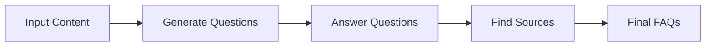
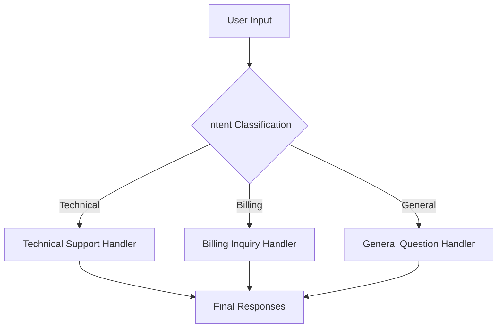
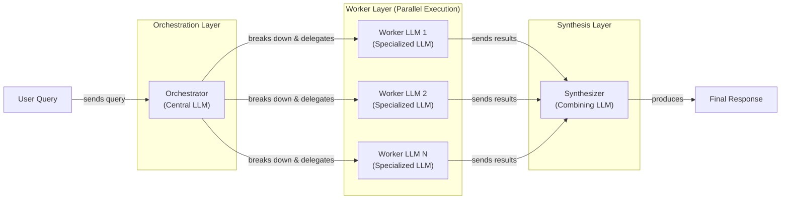

# Stop Building Monolithic LLM Calls. Use Workflow Patterns Instead.

In our previous lessons, we laid the groundwork for AI Engineering. We explored the agent landscape, differentiated between workflows and agents, managed context, and enforced structured outputs. Now, we shift our focus from the *input* to the *process*. How do we orchestrate LLM calls to solve problems that are too complex for a single prompt?

Many engineers new to AI start by building massive, all-in-one prompts. They try to make a single LLM call do everything: analyze data, generate content, check for errors, and format the output. This approach feels intuitive at first but quickly leads to a reliability crisis. The monolithic prompt becomes a black box that is impossible to debug, maintain, or scale. When it fails, you have no idea which of the twenty instructions the model ignored.

This is the engineering equivalent of writing an entire application in a single function. It works for "Hello, World!" but falls apart in production. To build robust AI systems, we need to think like software engineers and embrace modularity.

This lesson introduces the foundational patterns for building multi-LLM systems. We will explore how to break down complex tasks into manageable workflows using chaining, parallelization, routing, and orchestration. You will learn to move beyond single, fragile prompts and start architecting AI applications that are reliable, debuggable, and ready for production. We will cover why this modular approach is superior, how to implement it step-by-step with Google Gemini, and when to use each pattern.

## The Challenge with Complex Single LLM Calls

Attempting to solve a complex, multi-step problem with a single, large LLM call is a common anti-pattern. While it might work for a simple demo, it creates a system that is brittle and difficult to manage in production. This approach suffers from several fundamental challenges that undermine reliability and maintainability.

First, debugging becomes nearly impossible. When a monolithic prompt fails, you are left guessing which part of the instruction the model misinterpreted. There are no intermediate outputs to inspect, no way to isolate the point of failure. It is a black box, and your only option is to tweak the prompt and hope for a better result. This trial-and-error cycle is inefficient and unsustainable. For example, a study analyzing GPT-4 Turbo found that few-shot prompts with multiple examples caused a 52.9% error rate. Over 70% of those errors were simple parsing failures because the examples overwhelmed the model's ability to follow output instructions [[1]].

Second, this design lacks modularity, a cornerstone of good software engineering. You cannot update, test, or optimize one part of the logic without rewriting the entire prompt. This makes the system difficult to maintain and improve over time. If you want to swap in a different model for just one part of the task, you are out of luck. This rigidity means that as your application evolves, the monolithic prompt becomes an unmanageable tangle of competing instructions.

A significant issue with long, complex prompts is the "lost in the middle" problem. Research from Stanford and UC Berkeley has shown that LLMs exhibit a U-shaped performance curve when processing long contexts. They pay the most attention to information at the beginning and the end of the prompt, while details in the middle are often ignored or forgotten. This is not a flaw in a specific model but a structural bias in the transformer architecture itself, stemming from causal attention masking and positional encoding decay [[2]]. The bigger your context window, the larger the "middle" becomes, and the more likely the model is to miss critical information.

Overstuffing the context window also leads to practical problems. Even if a model supports a massive context, exceeding its physical limit will cause truncation, where the model silently ignores part of your input. This can lead to incomplete or incorrect responses without any explicit error. Furthermore, a single large prompt can sometimes consume more tokens than a series of smaller, focused ones, especially if the model generates lengthy reasoning steps to handle the combined complexity.

Finally, monolithic prompts are often less reliable and more sensitive to minor changes. A slight variation in the input or a small tweak to the prompt can lead to drastically different outputs. Research has shown that as the number of requirements in a single prompt increases, model accuracy drops significantly. For GPT-4o, accuracy fell from 98.7% with one requirement to 85% with nineteen [[3]]. This lack of reproducibility makes it difficult to build predictable systems.

### A Practical Example

Let's look at a practical example. We will use Google's Gemini library to generate a Frequently Asked Questions (FAQ) page from a few documents about renewable energy.

1.  First, we set up our environment by importing the necessary libraries, loading our API key, and initializing the Gemini client. We will use the `gemini-2.5-flash` model, which is fast and cost-effective for these examples.
    ```python
    import asyncio
    from enum import Enum
    import random
    import time
    
    from pydantic import BaseModel, Field
    from google import genai
    from google.genai import types
    
    from lessons.utils import env
    
    env.load(required_env_vars=["GOOGLE_API_KEY"])
    
    client = genai.Client()
    
    MODEL_ID = "gemini-2.5-flash"
    ```
2.  Next, we define our source content: three mock webpages about solar energy, wind turbines, and energy storage.
    ```python
    webpage_1 = {
        "title": "The Benefits of Solar Energy",
        "content": """...""",
    }
    webpage_2 = {
        "title": "Understanding Wind Turbines",
        "content": """...""",
    }
    webpage_3 = {
        "title": "Energy Storage Solutions",
        "content": """...""",
    }
    all_sources = [webpage_1, webpage_2, webpage_3]
    combined_content = "\n\n".join(
        [f"Source Title: {source['title']}\nContent: {source['content']}" for source in all_sources]
    )
    ```
3.  Now, we will write a single, complex prompt that asks the model to generate questions, find answers, and cite sources all at once. We will also define a Pydantic schema to get a structured JSON output, a technique we covered in Lesson 4.
    ```python
    n_questions = 10
    prompt_complex = f"""
    Based on the provided content from three webpages, generate a list of exactly {n_questions} frequently asked questions (FAQs).
    For each question, provide a concise answer derived ONLY from the text.
    After each answer, you MUST include a list of the 'Source Title's that were used to formulate that answer.
    
    <provided_content>
    {combined_content}
    </provided_content>
    """.strip()
    
    class FAQ(BaseModel):
        question: str = Field(description="The question to be answered")
        answer: str = Field(description="The answer to the question")
        sources: list[str] = Field(description="The sources used to answer the question")
    
    class FAQList(BaseModel):
        faqs: list[FAQ] = Field(description="A list of FAQs")
    
    config = types.GenerateContentConfig(
        response_mime_type="application/json",
        response_schema=FAQList
    )
    response_complex = client.models.generate_content(
        model=MODEL_ID,
        contents=prompt_complex,
        config=config
    )
    result_complex = response_complex.parsed
    ```
    It outputs:
    ```json
    {
      "question": "What is solar energy and how does it work?",
      "answer": "Solar energy is a renewable powerhouse that converts sunlight into electricity through photovoltaic (PV) panels.",
      "sources": [
        "The Benefits of Solar Energy"
      ]
    }
    ...
    {
      "question": "Why is energy storage crucial for renewable energy sources like solar and wind?",
      "answer": "Effective energy storage is key to unlocking the full potential of renewable sources because it allows storing excess energy when plentiful and releasing it when needed, which is crucial for a stable power grid.",
      "sources": [
        "Energy Storage Solutions",
        "Understanding Wind Turbines"
      ]
    }
    ```
While the output might seem acceptable, this approach is fragile. For instance, the model might correctly identify that an answer comes from two sources, but it might also miss multi-source answers or hallucinate a source entirely. As the number of instructions and the complexity of the task increase, the probability of failure grows. This is why we need a more structured, modular approach.

## The Power of Modularity: Why Chain LLM Calls?

The solution to the monolithic prompt problem is prompt chaining. This is a simple yet powerful technique where you break a complex task into a sequence of smaller, focused sub-tasks. Each sub-task is handled by a separate LLM call, and the output of one step becomes the input for the next. It is the "divide and conquer" principle applied to AI engineering [[4]]. This approach is part of a family of decomposition strategies, including "least-to-most" prompting, that have been shown to improve performance on complex reasoning tasks [[5]].

This modular approach brings several benefits that are essential for building production-grade systems.

First, it improves modularity. Each LLM call in the chain is a self-contained component with a single responsibility. This makes the system easier to understand, test, and maintain. You can work on each part in isolation, just like you would with functions in a traditional software application [[6]]. AppFolio, a property management software company, demonstrated this by using LangGraph to manage a complex AI copilot. This modular approach allowed them to boost performance on a text-to-data task from 40% to 80% accuracy by enabling targeted improvements like dynamic few-shot prompting [[7]].

Second, it enhances accuracy. Simpler, more targeted prompts reduce the cognitive load on the LLM. Instead of trying to follow a dozen instructions at once, the model can focus on a single, well-defined task. This leads to more reliable and higher-quality outputs [[8]]. A common application is question-answering over a large document, where one prompt extracts relevant quotes and a second prompt uses those quotes to formulate a final answer, improving both accuracy and traceability [[9]].

Third, it makes debugging much easier. If the final output is incorrect, you can inspect the output of each step in the chain to pinpoint exactly where things went wrong. This transparency is critical for diagnosing and fixing issues, a task that is nearly impossible with a single black-box prompt [[6]].

Fourth, it offers greater flexibility. You can easily swap, update, or optimize individual components of the chain without affecting the rest of the system. This also allows for strategic optimization. You could use a fast, inexpensive model like Gemini Flash for a simple classification step and a more powerful but slower model like Gemini Pro for a complex generation step, optimizing for both cost and performance [[6]].

However, prompt chaining is not without its trade-offs. One primary concern is information loss. As data is passed from one step to the next, critical context can be diluted or lost, especially in long chains. For example, a summarization step might inadvertently remove a key detail that a subsequent translation step needs. Mitigating this requires careful prompt design and robust state management to carry essential information forward. Using structured state objects (like Pydantic models) instead of raw text and summarizing intermediate results can help preserve critical context [[10]].

Another downside is increased latency and cost. Each additional LLM call adds to the total execution time and token count. There is also more engineering overhead in managing the "glue code" that connects the steps and handles their inputs and outputs. Frameworks like LangGraph can help manage this complexity by providing explicit state management across nodes, but this still requires a more thoughtful engineering approach than a single API call [[10]].

Despite these challenges, the benefits of reliability, debuggability, and maintainability almost always outweigh the drawbacks for any non-trivial application. Starting with a modular workflow is a best practice that will save you from a world of production headaches.

## Building a Sequential Workflow: FAQ Generation Pipeline

Let's refactor our complex FAQ generation task into a clean, sequential workflow. Instead of one monolithic prompt, we will create a three-step chain:
1.  **Generate Questions:** The first LLM call will read the source content and generate a list of relevant questions.
2.  **Answer Questions:** For each question, a second LLM call will generate a concise answer based on the source content.
3.  **Find Sources:** For each question-and-answer pair, a third LLM call will identify the specific source titles used.

This approach breaks the problem down into logical, manageable parts, making the system more robust and easier to debug.


Image 1: A flowchart illustrating the sequential FAQ generation pipeline.

Here is how we implement this chain, step-by-step.

### Step 1: Generate Questions

First, we create a function to generate a list of questions. This prompt focuses only on question generation, making the task clear and specific for the LLM. We use a Pydantic model, `QuestionList`, to ensure the output is a well-structured list of strings. This is a practical application of the structured output techniques we covered in Lesson 4. By isolating this step, we can easily test and refine the quality of the questions without worrying about the answer or source generation logic. This modularity also allows us to potentially reuse this question-generation component in other parts of our application.
```python
class QuestionList(BaseModel):
    """A list of questions"""
    questions: list[str] = Field(description="A list of questions")

prompt_generate_questions = """
Based on the content below, generate a list of {n_questions} relevant and distinct questions that a user might have.

<provided_content>
{combined_content}
</provided_content>
""".strip()

def generate_questions(content: str, n_questions: int = 10) -> list[str]:
    """
    Generate a list of questions based on the provided content.

    Args:
        content: The combined content from all sources

    Returns:
        list: A list of generated questions
    """
    config = types.GenerateContentConfig(
        response_mime_type="application/json",
        response_schema=QuestionList
    )
    response_questions = client.models.generate_content(
        model=MODEL_ID,
        contents=prompt_generate_questions.format(n_questions=n_questions, combined_content=content),
        config=config
    )

    return response_questions.parsed.questions
```
When we test this function with our combined content, it returns a clean list of questions, just as we specified.
```python
questions = generate_questions(combined_content, n_questions=10)
```
It outputs:
```text
- What are the primary environmental and economic benefits of solar energy?
- How do homeowners financially benefit from installing solar panels?
- What is the main process by which wind turbines generate electricity?
- What is the primary challenge of wind energy, and how is it addressed?
...
```

### Step 2: Answer Questions

Next, we define a function to answer a single question. This prompt instructs the model to use *only* the provided content and to keep the answer concise. This focus helps prevent hallucinations and keeps the output grounded in the source material. Unlike the previous step, this function returns a simple string, as we do not need a complex structure for the answer itself. This separation of concerns is crucial. If we find that the answers are not accurate enough, we can iterate on this specific prompt or even swap in a more powerful model for this step alone, without touching the question or source generation logic.
```python
prompt_answer_question = """
Using ONLY the provided content below, answer the following question.
The answer should be concise and directly address the question.

<question>
{question}
</question>

<provided_content>
{combined_content}
</provided_content>
""".strip()

def answer_question(question: str, content: str) -> str:
    """
    Generate an answer for a specific question using only the provided content.

    Args:
        question: The question to answer
        content: The combined content from all sources

    Returns:
        str: The generated answer
    """
    answer_response = client.models.generate_content(
        model=MODEL_ID,
        contents=prompt_answer_question.format(question=question, combined_content=content),
    )
    return answer_response.text
```

### Step 3: Find Sources

The third step is to identify the sources for each answer. This function takes a question and its generated answer and asks the LLM to list the source titles from the original content that were used. Again, we use a Pydantic model, `SourceList`, to ensure the output is a reliable list of strings. This step adds a layer of traceability and verifiability to our system. By explicitly asking the model to cite its sources, we can build user trust and provide a mechanism for fact-checking. If the model consistently fails to cite the correct sources, we know exactly which part of our pipeline needs improvement.
```python
class SourceList(BaseModel):
    """A list of source titles that were used to answer the question"""
    sources: list[str] = Field(description="A list of source titles that were used to answer the question")

prompt_find_sources = """
You will be given a question and an answer that was generated from a set of documents.
Your task is to identify which of the original documents were used to create the answer.

<question>
{question}
</question>

<answer>
{answer}
</answer>

<provided_content>
{combined_content}
</provided_content>
""".strip()

def find_sources(question: str, answer: str, content: str) -> list[str]:
    """
    Identify which sources were used to generate an answer.

    Args:
        question: The original question
        answer: The generated answer
        content: The combined content from all sources

    Returns:
        list: A list of source titles that were used
    """
    config = types.GenerateContentConfig(
        response_mime_type="application/json",
        response_schema=SourceList
    )
    sources_response = client.models.generate_content(
        model=MODEL_ID,
        contents=prompt_find_sources.format(question=question, answer=answer, combined_content=content),
        config=config
    )
    return sources_response.parsed.sources
```

### Putting It All Together: The Sequential Workflow

Finally, we combine these functions into a single sequential workflow. We first generate all the questions, then loop through each question to generate its answer and find its sources. The results are collected into a list of our final `FAQ` Pydantic objects. This orchestration logic, while simple, is the "glue" that holds our modular components together. In a production system, this is where you would add logging, error handling, and other operational logic.
```python
def sequential_workflow(content, n_questions=10) -> list[FAQ]:
    """
    Execute the complete sequential workflow for FAQ generation.

    Args:
        content: The combined content from all sources

    Returns:
        list: A list of FAQs with questions, answers, and sources
    """
    # Generate questions
    questions = generate_questions(content, n_questions)

    # Answer and find sources for each question sequentially
    final_faqs = []
    for question in questions:
        # Generate an answer for the current question
        answer = answer_question(question, content)

        # Identify the sources for the generated answer
        sources = find_sources(question, answer, content)

        faq = FAQ(
            question=question,
            answer=answer,
            sources=sources
        )
        final_faqs.append(faq)

    return final_faqs

# Execute the sequential workflow (measure time for comparison)
start_time = time.monotonic()
sequential_faqs = sequential_workflow(combined_content, n_questions=4)
end_time = time.monotonic()
print(f"Sequential processing completed in {end_time - start_time:.2f} seconds")
```
It outputs:
```text
Sequential processing completed in 22.20 seconds
```
The final result is a list of structured `FAQ` objects, each containing a question, a grounded answer, and a list of verified sources. This modular pipeline is far more reliable and debuggable than our initial monolithic prompt. However, running each step sequentially for every question is slow. The entire process took over 20 seconds for just four questions. We can do better.

## Optimizing Sequential Workflows With Parallel Processing

Our sequential workflow is reliable, but it is slow. The `for` loop processes each question one by one. It waits for two LLM calls (one for the answer, one for the sources) to complete before starting the next. Since the processing for each question is independent of the others, this is a perfect opportunity for parallelization. By running these independent tasks concurrently, we can significantly reduce the total execution time.

We will use Python's `asyncio` library to perform these operations asynchronously. This is ideal for I/O-bound tasks like making API calls to an LLM. It allows the program to work on other tasks while waiting for network responses, rather than blocking execution. For network requests, `asyncio` consistently outperforms `threading` because it avoids the overhead of managing operating system threads and the limitations of Python's Global Interpreter Lock (GIL) [[11]].

### Implementing the Parallel Workflow

1.  First, we create `async` versions of our `answer_question` and `find_sources` functions. These use `await client.aio.models.generate_content`, the asynchronous method provided by the Gemini client. This change is minimal but crucial for enabling non-blocking I/O.
    ```python
    async def answer_question_async(question: str, content: str) -> str:
        """
        Async version of answer_question function.
        """
        prompt = prompt_answer_question.format(question=question, combined_content=content)
        response = await client.aio.models.generate_content(
            model=MODEL_ID,
            contents=prompt
        )
        return response.text
    
    async def find_sources_async(question: str, answer: str, content: str) -> list[str]:
        """
        Async version of find_sources function.
        """
        prompt = prompt_find_sources.format(question=question, answer=answer, combined_content=content)
        config = types.GenerateContentConfig(
            response_mime_type="application/json",
            response_schema=SourceList
        )
        response = await client.aio.models.generate_content(
            model=MODEL_ID,
            contents=prompt,
            config=config
        )
        return response.parsed.sources
    ```
2.  Next, we create a new function, `process_question_parallel`. This function will generate the answer and find the sources for a single question. Although the function still awaits the answer before finding the sources, we will run this function in parallel for *multiple* questions.
    ```python
    async def process_question_parallel(question: str, content: str) -> FAQ:
        """
        Process a single question by generating answer and finding sources in parallel.
        """
        answer = await answer_question_async(question, content)
        sources = await find_sources_async(question, answer, content)
        return FAQ(
            question=question,
            answer=answer,
            sources=sources
        )
    ```
3.  Finally, we update our main workflow function. After generating the initial list of questions (which remains a synchronous step), we create a list of `asyncio` tasks. One for each question. `asyncio.gather(*tasks)` runs all these tasks concurrently and waits for them to complete.
    ```python
    async def parallel_workflow(content: str, n_questions: int = 10) -> list[FAQ]:
        """
        Execute the complete parallel workflow for FAQ generation.
        """
        # Generate questions (this step remains synchronous)
        questions = generate_questions(content, n_questions)
    
        # Process all questions in parallel
        tasks = [process_question_parallel(question, content) for question in questions]
        parallel_faqs = await asyncio.gather(*tasks)
    
        return parallel_faqs
    ```

### Execution and Performance Gains

Now, let's execute the parallel workflow and compare the performance.
```python
# Execute the parallel workflow (measure time for comparison)
start_time = time.monotonic()
parallel_faqs = await parallel_workflow(combined_content, n_questions=4)
end_time = time.monotonic()
print(f"Parallel processing completed in {end_time - start_time:.2f} seconds")
```
It outputs:
```text
Parallel processing completed in 8.98 seconds
```
The result is a dramatic speed-up. The parallel workflow completed in just under 9 seconds, compared to 22 seconds for the sequential version. This demonstrates the power of parallelization for optimizing I/O-bound workflows. This pattern is conceptually similar to MapReduce, where the "map" step processes each question independently and a "reduce" step (like gathering results) combines them. This architecture helps mitigate the "straggler effect," where one unusually slow task can delay the entire batch, a common problem in parallel execution [[12]]. The SPRINT framework, for example, showed that dynamically identifying and parallelizing sub-tasks can improve accuracy and reduce sequential processing by up to 39% [[13]].

### Production Considerations: Rate Limits and Resilience

There is a critical real-world consideration: API rate limits. When you run many calls in parallel, you can easily exceed the requests-per-minute (RPM) or tokens-per-minute (TPM) limits imposed by the API provider, which will result in `429` errors [[14]]. Production systems must manage this with robust resilience patterns. A best practice is to implement exponential backoff with full jitter. This prevents a "thundering herd" of synchronized retries by randomizing the delay: `sleep = random_between(0, min(cap, base * 2^attempt))` [[14]]. Additionally, a retry budget (e.g., total retries should not exceed 10% of total requests) can prevent a degraded endpoint from causing a cascading failure [[14]]. Wrapping each parallel step in a try-catch block with logging is also crucial for debugging, as it helps isolate which specific sub-task failed [[15]].

## Introducing Dynamic Behavior: Routing and Conditional Logic

So far, our workflows have been linear. Whether sequential or parallel, they follow a fixed path of execution. However, many real-world applications require dynamic behavior. You need to handle different types of input in different ways. This is where routing comes in.

Routing, or conditional logic, is a pattern that directs a workflow down different paths based on the input or an intermediate state. It allows you to create specialized handlers for different scenarios instead of trying to build a single, one-size-fits-all prompt. This is another application of the "divide and conquer" principle, ensuring that each component in your system has a single, focused responsibility.

This pattern mirrors the event-driven architecture common in microservices. In that paradigm, an event producer emits a message without knowing which service will handle it. A central router or message bus then directs the event to the appropriate consumer based on its content or type. Similarly, our routing workflow uses an initial classification step as a dispatcher to send the input to the correct specialized handler [[16]].

A common way to implement routing is to use an LLM as a classification step. The first LLM call analyzes the user's input to determine its intent, and the system then uses that classification to route the request to the appropriate downstream logic. For example, a customer support system might classify an incoming query as "Technical Support," "Billing Inquiry," or "General Question" and then pass it to a specialized agent or prompt chain designed to handle that specific type of request. Amazon Bedrock's Intelligent Prompt Routing uses this pattern to optimize for cost and quality, directing simple queries to cheaper models and complex ones to more powerful models [[17]].

This approach is far more robust than trying to create a single super-prompt that can handle every possible query. By separating the classification logic from the task-specific logic, you create a system that is more modular, maintainable, and easier to optimize. You can fine-tune the prompt for billing questions without worrying about how it might affect the performance on technical support questions.

## Building a Basic Routing Workflow

Let's build a simple routing workflow for a customer service application. The goal is to classify an incoming user query and route it to one of three specialized handlers: technical support, billing, or a general catch-all. This creates a clear, maintainable system where each handler has a single responsibility.


Image 2: A flowchart illustrating a basic routing workflow for customer service.

### Step 1: Intent Classification

First, we define the possible intents using a Python `Enum` and a Pydantic model to structure the classifier's output. This ensures our classification step returns a predictable and valid intent. Creating a clear and comprehensive taxonomy of intents is a critical design step. It is also important to include a fallback or "Other" category to handle queries that do not fit neatly into the defined categories [[18]].
```python
class IntentEnum(str, Enum):
    """
    Defines the allowed values for the 'intent' field.
    """
    TECHNICAL_SUPPORT = "Technical Support"
    BILLING_INQUIRY = "Billing Inquiry"
    GENERAL_QUESTION = "General Question"

class UserIntent(BaseModel):
    """
    Defines the expected response schema for the intent classification.
    """
    intent: IntentEnum = Field(description="The intent of the user's query")
```
Next, we create the `classify_intent` function. It takes a user query, inserts it into a prompt that asks the LLM to categorize it, and uses the `UserIntent` schema to get a structured response. For more robust classification, you can include few-shot examples in the prompt to guide the model, especially for ambiguous or edge-case queries [[18]].
```python
prompt_classification = """
Classify the user's query into one of the following categories.

<categories>
{categories}
</categories>

<user_query>
{user_query}
</user_query>
""".strip()


def classify_intent(user_query: str) -> IntentEnum:
    """Uses an LLM to classify a user query."""
    prompt = prompt_classification.format(
        user_query=user_query,
        categories=[intent.value for intent in IntentEnum]
    )
    config = types.GenerateContentConfig(
        response_mime_type="application/json",
        response_schema=UserIntent
    )
    response = client.models.generate_content(
        model=MODEL_ID,
        contents=prompt,
        config=config
    )
    return response.parsed.intent
```
When we test this with a few sample queries, the model correctly classifies each one:
- `"My internet connection is not working."` → `TECHNICAL_SUPPORT`
- `"I think there is a mistake on my last invoice."` → `BILLING_INQUIRY`
- `"What are your opening hours?"` → `GENERAL_QUESTION`

### Step 2: Defining Specialized Handlers

Now we define our specialized handlers. Each handler has a unique prompt tailored to its specific task. The technical support prompt asks for troubleshooting details, the billing prompt asks for an account number, and the general prompt apologizes for not being able to help. This separation ensures that each prompt can be optimized independently.
```python
prompt_technical_support = """
You are a helpful technical support agent.

Here's the user's query:
<user_query>
{user_query}
</user_query>

Provide a helpful first response, asking for more details like what troubleshooting steps they have already tried.
""".strip()

prompt_billing_inquiry = """
You are a helpful billing support agent.

Here's the user's query:
<user_query>
{user_query}
</user_query>

Acknowledge their concern and inform them that you will need to look up their account, asking for their account number.
""".strip()

prompt_general_question = """
You are a general assistant.

Here's the user's query:
<user_query>
{user_query}
</user_query>

Apologize that you are not sure how to help.
""".strip()
```

### Step 3: Routing the Query

Finally, the `handle_query` function acts as our router. It takes the user query and the classified intent, then uses a simple `if/elif/else` block to select the correct prompt and generate a response.
```python
def handle_query(user_query: str, intent: str) -> str:
    """Routes a query to the correct handler based on its classified intent."""
    if intent == IntentEnum.TECHNICAL_SUPPORT:
        prompt = prompt_technical_support.format(user_query=user_query)
    elif intent == IntentEnum.BILLING_INQUIRY:
        prompt = prompt_billing_inquiry.format(user_query=user_query)
    else:
        prompt = prompt_general_question.format(user_query=user_query)
    
    response = client.models.generate_content(
        model=MODEL_ID,
        contents=prompt
    )
    return response.text
```
This two-stage architecture—classify then handle—is a robust pattern for building dynamic and maintainable AI applications. It ensures that each part of your system is specialized and optimized for its specific job.

### Framework-Based Alternatives

While building this logic from scratch with the Gemini library gives you maximum control, many frameworks offer higher-level abstractions for routing. For example, Google's Agent Development Kit (ADK) implements this as the **Coordinator/Dispatcher Pattern**. A parent `CoordinatorAgent` is given a list of specialist sub-agents, and it uses their descriptions to route the user's request automatically.

Here is what that might look like in pseudocode, adapted from the ADK documentation [[19]]:
```python
# This is a conceptual example, not runnable code
billing_specialist = LlmAgent(
    name='BillingSpecialist',
    description='Handles billing inquiries and invoices.'
)

tech_support = LlmAgent(
    name='TechSupportSpecialist',
    description='Troubleshoots technical issues.'
)

# The coordinator's instruction tells it how to route
coordinator = LlmAgent(
    name='CoordinatorAgent',
    instruction='Analyze user intent. Route billing issues to BillingSpecialist and bugs to TechSupportSpecialist.',
    sub_agents=[billing_specialist, tech_support]
)
```
In this case, the framework's `AutoFlow` mechanism handles the routing based on the LLM's decision, abstracting away the `if/elif/else` logic. Frameworks like LangGraph or CrewAI offer similar abstractions. The trade-off is control versus convenience. Our from-scratch approach is transparent and fully customizable, while a framework-based approach can accelerate development by providing pre-built components for common patterns.

## Orchestrator-Worker Pattern: Dynamic Task Decomposition

The patterns we have discussed so far—chaining, parallelization, and routing—are powerful, but they rely on predefined workflows. You, the engineer, decide the sequence of steps or the possible routes. The orchestrator-worker pattern takes this a step further by introducing dynamic task decomposition. In this model, a central "orchestrator" LLM analyzes a complex query and breaks it down into smaller, executable sub-tasks at runtime. These sub-tasks are then delegated to specialized "worker" components, which can be other LLMs or tools [[20]].


Image 3: A flowchart illustrating the orchestrator-worker pattern with a user query, orchestrator, parallel worker LLMs, a synthesizer, and a final response.

The key difference from simple parallelization is this flexibility. The sub-tasks are not hardcoded; they are determined by the orchestrator based on the specific user input. This makes the pattern well-suited for complex, unpredictable queries where the necessary steps cannot be known in advance, such as multi-modal content generation or open-ended research tasks [[21]]. This approach also enables cost and performance optimization. A powerful orchestrator can delegate tasks to cheaper, specialized worker models, potentially reducing costs by 40-60%. Parallel execution of independent tasks can yield speed improvements of 5 to 20 times over sequential processing [[22], [23]]. For instance, Wells Fargo used this pattern to reduce query times for its bankers from 10 minutes to 30 seconds [[22]].

After the workers complete their tasks (often in parallel), their individual outputs are passed to a final "synthesizer" LLM. The synthesizer's job is to integrate the structured results from the workers into a single, coherent, and user-friendly response [[24]].

Let's build a customer support system using this pattern. A user might submit a single query that contains multiple, distinct requests.

### The Orchestrator: Deconstructing the Query

The **Orchestrator** will parse the user's query and break it down into a list of structured tasks. The prompt provides the orchestrator with a schema of possible tasks (`BillingInquiry`, `ProductReturn`, `StatusUpdate`) and their required parameters.
```python
class QueryTypeEnum(str, Enum):
    BILLING_INQUIRY = "BillingInquiry"
    PRODUCT_RETURN = "ProductReturn"
    STATUS_UPDATE = "StatusUpdate"

class Task(BaseModel):
    query_type: QueryTypeEnum
    invoice_number: str | None = None
    product_name: str | None = None
    reason_for_return: str | None = None
    order_id: str | None = None

class TaskList(BaseModel):
    tasks: list[Task]

prompt_orchestrator = f"""
You are a master orchestrator. Your job is to break down a complex user query into a list of sub-tasks.
Each sub-task must have a "query_type" and its necessary parameters.

The possible "query_type" values and their required parameters are:
1. "{QueryTypeEnum.BILLING_INQUIRY.value}": Requires "invoice_number".
2. "{QueryTypeEnum.PRODUCT_RETURN.value}": Requires "product_name" and "reason_for_return".
3. "{QueryTypeEnum.STATUS_UPDATE.value}": Requires "order_id".

Here's the user's query.

<user_query>
{{query}}
</user_query>
""".strip()

def orchestrator(query: str) -> list[Task]:
    """Breaks down a complex query into a list of tasks."""
    prompt = prompt_orchestrator.format(query=query)
    config = types.GenerateContentConfig(
        response_mime_type="application/json",
        response_schema=TaskList
    )
    response = client.models.generate_content(
        model=MODEL_ID,
        contents=prompt,
        config=config
    )
    return response.parsed.tasks
```

### The Workers: Executing Sub-Tasks

We then define our specialized **Workers**. Each worker is a Python function that handles one type of task. For this example, they simulate backend actions, like opening an investigation for a billing issue, generating a return authorization, or fetching an order status. They return structured data using Pydantic models.
```python
def handle_billing_worker(invoice_number: str, original_user_query: str) -> BillingTask:
    # ... simulates opening an investigation
    return billing_task

def handle_return_worker(product_name: str, reason_for_return: str) -> ReturnTask:
    # ... simulates generating an RMA
    return return_task

def handle_status_worker(order_id: str) -> StatusTask:
    # ... simulates fetching order status
    return status_task
```

### The Synthesizer: Assembling the Final Response

The **Synthesizer** is another LLM-powered function. It takes the structured outputs from all the workers, formats them into a clear summary, and then uses a prompt to generate a single, cohesive email to the customer. Ensuring the synthesizer can handle diverse or even conflicting outputs is a key challenge. One production strategy is to use an "Answer Evaluation" node that scores worker outputs on metrics like accuracy and relevance, selecting the best one or merging them intelligently [[25]].
```python
prompt_synthesizer = """
You are a master communicator. Combine several distinct pieces of information from our support team into a single, well-formatted, and friendly email to a customer.

Here are the points to include, based on the actions taken for their query:
<points>
{formatted_results}
</points>

Combine these points into one cohesive response.
Start with a friendly greeting (e.g., "Dear Customer," or "Hi there,") and end with a polite closing (e.g., "Sincerely," or "Best regards,").
Ensure the tone is helpful and professional.
""".strip()

def synthesizer(results: list[Task]) -> str:
    """Combines structured results from workers into a single user-facing message."""
    # ... formats worker results into bullet points
    prompt = prompt_synthesizer.format(formatted_results=formatted_results)
    response = client.models.generate_content(model=MODEL_ID, contents=prompt)
    return response.text
```

### The Complete Workflow in Action

Finally, we tie it all together in a main processing function. Let's test it with a complex query:
```python
complex_customer_query = """
Hi, I'm writing to you because I have a question about invoice #INV-7890. It seems higher than I expected.
Also, I would like to return the 'SuperWidget 5000' I bought because it's not compatible with my system.
Finally, can you give me an update on my order #A-12345?
""".strip()

process_user_query(complex_customer_query)
```
The orchestrator first deconstructs the query into three distinct tasks. Then, the appropriate workers are dispatched to handle each task, producing structured results. Finally, the synthesizer combines these results into one helpful response for the user.

This pattern, while powerful, introduces significant engineering challenges. The orchestrator can become a bottleneck, and its decomposition is a critical failure point. Vague subtasks can cause "ownership ambiguity" where workers tackle the same job, or result in incompatible outputs like one producing YAML when another expects JSON [[26], [27]]. A real-world failure occurred in a financial assistant where a recursive loop between agents led to a runaway cost of $47,000 per week. A simple circuit breaker based on conversation turn count could have prevented this [[14]]. To mitigate these risks, production systems often add deterministic guardrails, like Finite State Machines (FSMs), to enforce a strict sequence of operations (e.g., Research → Draft → Verify) that the LLMs cannot violate [[23]].

## Conclusion

We have moved from the chaos of monolithic prompts to the structured world of AI workflows. By breaking down complex problems into smaller, manageable steps, we build systems that are more reliable, debuggable, and maintainable. We started with sequential prompt chaining, the fundamental building block for any multi-step task. Then, we accelerated our workflow with parallel processing, learning how to handle independent tasks concurrently while being mindful of real-world constraints like API rate limits.

We then introduced dynamic behavior with routing, using an LLM to classify intent and direct traffic to specialized handlers. Finally, we explored the orchestrator-worker pattern, a sophisticated approach where an LLM dynamically decomposes complex queries and delegates sub-tasks at runtime. These patterns are not just theoretical concepts; they are the bread and butter of production AI engineering. They provide the control and predictability needed to move from a cool demo to a reliable product.

In our next lesson, we will build on these foundations by giving our workflows the ability to interact with the outside world. We will dive into agent tools and function calling, unlocking the power for our AI systems to take action.

## References
- [1] FLARE: A Framework for Large-scale Analysis of Rule-Following Errors in Large Language Models (https://aclanthology.org/2025.ommm-1.4.pdf)
- [2] The "Lost in the Middle" Problem — Why LLMs Ignore the Middle of Your Context Window (https://dev.to/thousand_miles_ai/the-lost-in-the-middle-problem-why-llms-ignore-the-middle-of-your-context-window-3al2)
- [3] Underspecification in Instruction-Following: A Study of Long-Context LLM Performance (https://arxiv.org/html/2505.13360v1)
- [4] A Practical Guide to Prompt Engineering Techniques and their Use Cases (https://medium.com/@fabiolalli/a-practical-guide-to-prompt-engineering-techniques-and-their-use-cases-5f8574e2cd9a)
- [5] Prompt Chaining for AI Engineers: A Practical Guide to Improving LLM Output Quality (https://www.getmaxim.ai/articles/prompt-chaining-for-ai-engineers-a-practical-guide-to-improving-llm-output-quality/)
- [6] Stop Building AI Agents. Use These 5 LLM Workflows Instead. (https://www.decodingai.com/p/stop-building-ai-agents-use-these)
- [7] LLMOps in Production: 457 Case Studies of What Actually Works (https://www.zenml.io/blog/llmops-in-production-457-case-studies-of-what-actually-works)
- [8] Issue 110: 5 Foundational LLM Workflow Patterns (https://mlpills.substack.com/p/issue-110-llm-workflow-patterns)
- [9] Prompt Chaining (https://www.promptingguide.ai/techniques/prompt_chaining)
- [10] How Tool Chaining Fails in Production LLM Agents and How to Fix It (https://futureagi.substack.com/p/how-tool-chaining-fails-in-production)
- [11] Python Concurrency Showdown: Asyncio vs. Threading vs. Multiprocessing (https://medium.com/@sizanmahmud08/python-concurrency-showdown-asyncio-vs-threading-vs-multiprocessing-which-should-you-choose-in-31205161899a)
- [12] SkyAPI: A Structure-aware API Routing Framework for Real-time LLM-based Multi-agent Systems (https://www.ideals.illinois.edu/items/139597/bitstreams/450749/data.pdf)
- [13] SPRINT: A Framework for Interleaved Planning and Parallel Execution in Language Models (https://scalingintelligence.stanford.edu/pubs/sprint.pdf)
- [14] LLM API Resilience in Production: Rate Limits, Failover, and the Hidden Costs of Naive Retry Logic (https://tianpan.co/blog/2026-03-11-llm-api-resilience-production)
- [15] Orchestrating multi-step LLM chains: Best practices (https://deepchecks.com/orchestrating-multi-step-llm-chains-best-practices/)
- [16] Event-Driven Microservices Patterns and Use Cases (https://medium.com/@nemagan/event-driven-microservices-patterns-and-use-cases-1de0d9473fa1)
- [17] Multi-LLM routing strategies for generative AI applications on AWS (https://aws.amazon.com/blogs/machine-learning/multi-llm-routing-strategies-for-generative-ai-applications-on-aws/)
- [18] A Beginner's Guide to LLM Intent Classification for Chatbots (https://www.vellum.ai/blog/how-to-build-intent-detection-for-your-chatbot)
- [19] Developer’s guide to multi-agent patterns in ADK (https://developers.googleblog.com/developers-guide-to-multi-agent-patterns-in-adk/)
- [20] DIY #17: Orchestrator-Worker LLM Agent (https://mlpills.substack.com/p/diy-17-orchestrator-worker-llm-agent)
- [21] Orchestrator-Workers Workflow (https://platform.claude.com/cookbook/patterns-agents-orchestrator-workers)
- [22] Multi-Agent Orchestration Patterns for Production (https://beam.ai/agentic-insights/multi-agent-orchestration-patterns-production)
- [23] Building a Self-Healing AI Orchestrator with Reflexion Patterns (https://online.stevens.edu/blog/building-self-healing-ai-orchestrator-reflexion-patterns/)
- [24] DIY #17: Orchestrator-Worker LLM Agent (https://mlpills.substack.com/p/diy-17-orchestrator-worker-llm-agent)
- [25] Build an Advanced Customer Support LLM with a Multi-Agent Workflow (https://www.socure.com/tech-blog/build-advanced-customer-support-llm-multi-agent-workflow)
- [26] The 5 Failure Modes of Multi-Agent Systems Nobody Warns You About (https://dev.to/gabrielanhaia/the-5-failure-modes-of-multi-agent-systems-nobody-warns-you-about-2fml)
- [27] Why Do Multi-Agent LLM Systems Fail? (https://orq.ai/blog/why-do-multi-agent-llm-systems-fail)