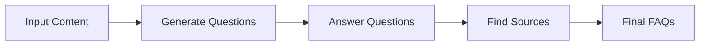
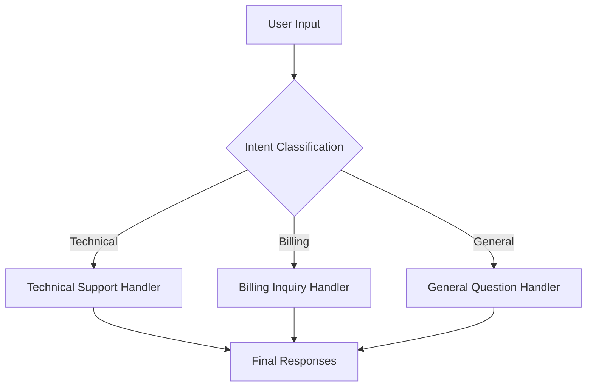
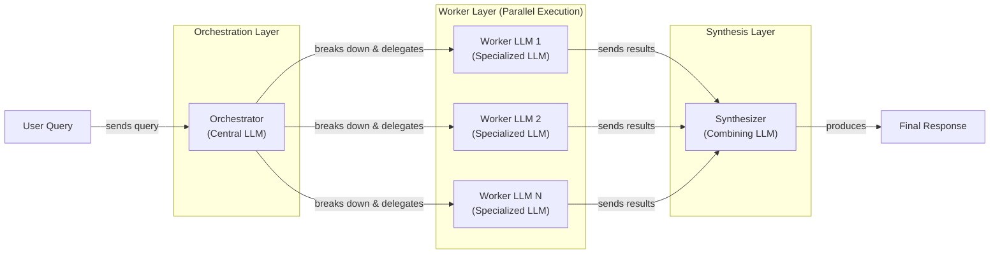

# Stop Building Monolithic LLM Calls. Use Workflow Patterns Instead.

In our last lesson, we covered context engineering: the art of feeding the right information to an LLM. We learned how to manage an application's memory to construct the perfect context for a given task. Now, we shift our focus from the *input* to the *process*. How do we orchestrate LLM calls to solve problems that are too complex for a single prompt?

Many engineers new to AI start by building massive, all-in-one prompts. They try to make a single LLM call do everything: analyze data, generate content, check for errors, and format the output. This approach feels intuitive at first but quickly leads to a reliability crisis. The monolithic prompt becomes a black box that is impossible to debug, maintain, or scale. When it fails, you have no idea which of the twenty instructions the model ignored.

This is the engineering equivalent of writing an entire application in a single function. It works for "Hello, World!" but falls apart in production. To build robust AI systems, we need to think like software engineers and embrace modularity.

This lesson introduces the foundational patterns for building multi-LLM systems. We will explore how to break down complex tasks into manageable workflows using chaining, parallelization, routing, and orchestration. You will learn to move beyond single, fragile prompts and start architecting AI applications that are reliable, debuggable, and ready for production. We will cover why this modular approach is superior, how to implement it step-by-step with Google Gemini, and when to use each pattern.

## The Challenge with Complex Single LLM Calls

Attempting to solve a complex, multi-step problem with a single, large LLM call is a common anti-pattern. While it might work for a simple demo, it creates a system that is brittle and difficult to manage in production. This approach suffers from several fundamental challenges.

First, debugging becomes nearly impossible. When a monolithic prompt fails, you are left guessing which part of the instruction the model misinterpreted. There are no intermediate outputs to inspect, no way to isolate the point of failure. It is a black box, and your only option is to tweak the prompt and hope for a better result. This trial-and-error cycle is inefficient and unsustainable.

Second, this design lacks modularity, which is a cornerstone of good software engineering. You cannot update, test, or optimize one part of the logic without rewriting the entire prompt. This makes the system difficult to maintain and improve over time. If you want to swap in a different model for just one part of the task, you are out of luck.

A significant issue with long, complex prompts is the "lost in the middle" problem. Research from Stanford and UC Berkeley has shown that LLMs exhibit a U-shaped performance curve when processing long contexts. They pay the most attention to information at the beginning and the end of the prompt, while details in the middle are often ignored or forgotten [[1]]. This is not a flaw in a specific model but a structural bias in the transformer architecture itself, stemming from causal attention masking and positional encoding decay [[1]]. The bigger your context window, the larger the "middle" becomes, and the more likely the model is to miss critical information.

Finally, monolithic prompts are often less reliable and more sensitive to minor changes. A slight variation in the input or a small tweak to the prompt can lead to drastically different outputs. This lack of reproducibility makes it difficult to build predictable systems. While it might seem counterintuitive, a single large prompt can also lead to higher token consumption if the model generates verbose reasoning to handle the combined complexity of all tasks at once.

Let's look at a practical example. We will use Google's Gemini library to generate a Frequently Asked Questions (FAQ) page from a few documents about renewable energy.

1.  First, we set up our environment by importing the necessary libraries, loading our API key, and initializing the Gemini client. We will use the `gemini-2.5-flash` model, which is fast and cost-effective for these examples.
    ```python
    import asyncio
    from enum import Enum
    import random
    import time
    
    from pydantic import BaseModel, Field
    from google import genai
    from google.genai import types
    
    from lessons.utils import env
    
    env.load(required_env_vars=["GOOGLE_API_KEY"])
    
    client = genai.Client()
    
    MODEL_ID = "gemini-2.5-flash"
    ```
2.  Next, we define our source content: three mock webpages about solar energy, wind turbines, and energy storage.
    ```python
    webpage_1 = {
        "title": "The Benefits of Solar Energy",
        "content": """
        Solar energy is a renewable powerhouse, offering numerous environmental and economic benefits.
        By converting sunlight into electricity through photovoltaic (PV) panels, it reduces reliance on fossil fuels,
        thereby cutting down greenhouse gas emissions. Homeowners who install solar panels can significantly
        lower their monthly electricity bills, and in some cases, sell excess power back to the grid.
        While the initial installation cost can be high, government incentives and long-term savings make
        it a financially viable option for many. Solar power is also a key component in achieving energy
        independence for nations worldwide.
        """,
    }
    
    webpage_2 = {
        "title": "Understanding Wind Turbines",
        "content": """
        Wind turbines are towering structures that capture kinetic energy from the wind and convert it into
        electrical power. They are a critical part of the global shift towards sustainable energy.
        Turbines can be installed both onshore and offshore, with offshore wind farms generally producing more
        consistent power due to stronger, more reliable winds. The main challenge for wind energy is its
        intermittency—it only generates power when the wind blows. This necessitates the use of energy
        storage solutions, like large-scale batteries, to ensure a steady supply of electricity.
        """,
    }
    
    webpage_3 = {
        "title": "Energy Storage Solutions",
        "content": """
        Effective energy storage is the key to unlocking the full potential of renewable sources like solar
        and wind. Because these sources are intermittent, storing excess energy when it's plentiful and
        releasing it when it's needed is crucial for a stable power grid. The most common form of
        large-scale storage is pumped-hydro storage, but battery technologies, particularly lithium-ion,
        are rapidly becoming more affordable and widespread. These batteries can be used in homes, businesses,
        and at the utility scale to balance energy supply and demand, making our energy system more
        resilient and reliable.
        """,
    }
    
    all_sources = [webpage_1, webpage_2, webpage_3]
    
    # We'll combine the content for the LLM to process
    combined_content = "\n\n".join(
        [f"Source Title: {source['title']}\nContent: {source['content']}" for source in all_sources]
    )
    ```
3.  Now, we will write a single, complex prompt that asks the model to generate questions, find answers, and cite sources all at once. We will also define a Pydantic schema to get a structured JSON output, a technique we covered in Lesson 4.
    ```python
    # This prompt tries to do everything at once: generate questions, find answers,
    # and cite sources. This complexity can often confuse the model.
    n_questions = 10
    prompt_complex = f"""
    Based on the provided content from three webpages, generate a list of exactly {n_questions} frequently asked questions (FAQs).
    For each question, provide a concise answer derived ONLY from the text.
    After each answer, you MUST include a list of the 'Source Title's that were used to formulate that answer.
    
    <provided_content>
    {combined_content}
    </provided_content>
    """.strip()
    
    # Pydantic classes for structured outputs
    class FAQ(BaseModel):
        """A FAQ is a question and answer pair, with a list of sources used to answer the question."""
        question: str = Field(description="The question to be answered")
        answer: str = Field(description="The answer to the question")
        sources: list[str] = Field(description="The sources used to answer the question")
    
    class FAQList(BaseModel):
        """A list of FAQs"""
        faqs: list[FAQ] = Field(description="A list of FAQs")
    
    # Generate FAQs
    config = types.GenerateContentConfig(
        response_mime_type="application/json",
        response_schema=FAQList
    )
    response_complex = client.models.generate_content(
        model=MODEL_ID,
        contents=prompt_complex,
        config=config
    )
    result_complex = response_complex.parsed
    ```
    It outputs:
    ```json
    {
      "question": "What is solar energy and how does it work?",
      "answer": "Solar energy is a renewable powerhouse that converts sunlight into electricity through photovoltaic (PV) panels.",
      "sources": [
        "The Benefits of Solar Energy"
      ]
    }
    ...
    {
      "question": "Why is energy storage crucial for renewable energy sources like solar and wind?",
      "answer": "Effective energy storage is key to unlocking the full potential of renewable sources because it allows storing excess energy when plentiful and releasing it when needed, which is crucial for a stable power grid.",
      "sources": [
        "Energy Storage Solutions",
        "Understanding Wind Turbines"
      ]
    }
    ```
While the output might seem acceptable, this approach is fragile. For instance, the model might correctly identify that an answer comes from two sources, but it might also miss multi-source answers or hallucinate a source entirely. As the number of instructions and the complexity of the task increase, the probability of failure grows. This is why we need a more structured, modular approach.

## The Power of Modularity: Why Chain LLM Calls?

The solution to the monolithic prompt problem is prompt chaining. This is a simple yet powerful technique where you break a complex task into a sequence of smaller, focused sub-tasks. Each sub-task is handled by a separate LLM call, and the output of one step becomes the input for the next. It is the "divide and conquer" principle applied to AI engineering [[2]]. This approach is part of a family of decomposition strategies, including "least-to-most" prompting, that have been shown to improve performance on complex reasoning tasks [[3]].

This modular approach brings several benefits that are essential for building production-grade systems.

First, it improves modularity. Each LLM call in the chain is a self-contained component with a single responsibility. This makes the system easier to understand, test, and maintain. You can work on each part in isolation, just like you would with functions in a traditional software application [[4]].

Second, it enhances accuracy. Simpler, more targeted prompts reduce the cognitive load on the LLM. Instead of trying to follow a dozen instructions at once, the model can focus on a single, well-defined task. This leads to more reliable and higher-quality outputs [[5]]. A common application is question-answering over a large document, where one prompt extracts relevant quotes and a second prompt uses those quotes to formulate a final answer, improving both accuracy and traceability [[6]].

Third, it makes debugging much easier. If the final output is incorrect, you can inspect the output of each step in the chain to pinpoint exactly where things went wrong. This transparency is critical for diagnosing and fixing issues, a task that is nearly impossible with a single black-box prompt [[4]].

Fourth, it offers greater flexibility. You can easily swap, update, or optimize individual components of the chain without affecting the rest of the system. This also allows for strategic optimization. You could use a fast, inexpensive model like Gemini Flash for a simple classification step and a more powerful but slower model like Gemini Pro for a complex generation step, optimizing for both cost and performance [[4]].

However, prompt chaining is not without its trade-offs. One primary concern is information loss. As data is passed from one step to the next, critical context can be diluted or lost, especially in long chains. For example, a summarization step might inadvertently remove a key detail that a subsequent translation step needs. Mitigating this requires careful prompt design for intermediate steps and robust state management to carry essential information forward [[7]].

Another downside is increased latency and cost. Each additional LLM call adds to the total execution time and token count. While parallelization can address latency for independent tasks, sequential dependencies inherently slow down the process. There is also more engineering overhead in managing the "glue code" that connects the steps and handles their inputs and outputs.

Despite these challenges, the benefits of reliability, debuggability, and maintainability almost always outweigh the drawbacks for any non-trivial application. Starting with a modular workflow is a best practice that will save you from a world of production headaches.

## Building a Sequential Workflow: FAQ Generation Pipeline

Let's refactor our complex FAQ generation task into a clean, sequential workflow. Instead of one monolithic prompt, we will create a three-step chain:
1.  **Generate Questions:** The first LLM call will read the source content and generate a list of relevant questions.
2.  **Answer Questions:** For each question, a second LLM call will generate a concise answer based on the source content.
3.  **Find Sources:** For each question-and-answer pair, a third LLM call will identify the specific source titles used.

This approach breaks the problem down into logical, manageable parts, making the system more robust and easier to debug.


Image 1: A flowchart illustrating the sequential FAQ generation pipeline.

Here is how we implement this chain.

1.  First, we create a function to generate a list of questions. This prompt focuses only on question generation, making the task clear and specific for the LLM. We use a Pydantic model to ensure the output is a well-structured list of strings.
    ```python
    class QuestionList(BaseModel):
        """A list of questions"""
        questions: list[str] = Field(description="A list of questions")
    
    prompt_generate_questions = """
    Based on the content below, generate a list of {n_questions} relevant and distinct questions that a user might have.
    
    <provided_content>
    {combined_content}
    </provided_content>
    """.strip()
    
    def generate_questions(content: str, n_questions: int = 10) -> list[str]:
        """
        Generate a list of questions based on the provided content.
        """
        config = types.GenerateContentConfig(
            response_mime_type="application/json",
            response_schema=QuestionList
        )
        response_questions = client.models.generate_content(
            model=MODEL_ID,
            contents=prompt_generate_questions.format(n_questions=n_questions, combined_content=content),
            config=config
        )
    
        return response_questions.parsed.questions
    ```
    Testing this function gives us a clean list of questions:
    ```text
    - What are the primary environmental and economic benefits of solar energy?
    - How do homeowners financially benefit from installing solar panels?
    ...
    ```
2.  Next, we define a function to answer a single question. This prompt instructs the model to use *only* the provided content and to keep the answer concise. This focus helps prevent hallucinations and keeps the output grounded in the source material.
    ```python
    prompt_answer_question = """
    Using ONLY the provided content below, answer the following question.
    The answer should be concise and directly address the question.
    
    <question>
    {question}
    </question>
    
    <provided_content>
    {combined_content}
    </provided_content>
    """.strip()
    
    def answer_question(question: str, content: str) -> str:
        """
        Generate an answer for a specific question using only the provided content.
        """
        answer_response = client.models.generate_content(
            model=MODEL_ID,
            contents=prompt_answer_question.format(question=question, combined_content=content),
        )
        return answer_response.text
    ```
3.  The third step is to identify the sources for each answer. This function takes a question and its generated answer and asks the LLM to list the source titles from the original content that were used.
    ```python
    class SourceList(BaseModel):
        """A list of source titles that were used to answer the question"""
        sources: list[str] = Field(description="A list of source titles that were used to answer the question")
    
    prompt_find_sources = """
    You will be given a question and an answer that was generated from a set of documents.
    Your task is to identify which of the original documents were used to create the answer.
    
    <question>
    {question}
    </question>
    
    <answer>
    {answer}
    </answer>
    
    <provided_content>
    {combined_content}
    </provided_content>
    """.strip()
    
    def find_sources(question: str, answer: str, content: str) -> list[str]:
        """
        Identify which sources were used to generate an answer.
        """
        config = types.GenerateContentConfig(
            response_mime_type="application/json",
            response_schema=SourceList
        )
        sources_response = client.models.generate_content(
            model=MODEL_ID,
            contents=prompt_find_sources.format(question=question, answer=answer, combined_content=content),
            config=config
        )
        return sources_response.parsed.sources
    ```
4.  Finally, we combine these functions into a single sequential workflow. We first generate all the questions, then loop through each question to generate its answer and find its sources.
    ```python
    def sequential_workflow(content, n_questions=10) -> list[FAQ]:
        """
        Execute the complete sequential workflow for FAQ generation.
        """
        # Generate questions
        questions = generate_questions(content, n_questions)
    
        # Answer and find sources for each question sequentially
        final_faqs = []
        for question in questions:
            # Generate an answer for the current question
            answer = answer_question(question, content)
    
            # Identify the sources for the generated answer
            sources = find_sources(question, answer, content)
    
            faq = FAQ(
                question=question,
                answer=answer,
                sources=sources
            )
            final_faqs.append(faq)
    
        return final_faqs
    
    # Execute the sequential workflow (measure time for comparison)
    start_time = time.monotonic()
    sequential_faqs = sequential_workflow(combined_content, n_questions=4)
    end_time = time.monotonic()
    print(f"Sequential processing completed in {end_time - start_time:.2f} seconds")
    ```
    It outputs:
    ```text
    Sequential processing completed in 22.20 seconds
    ```
    The final result is a list of structured `FAQ` objects, each containing a question, a grounded answer, and a list of verified sources. This modular pipeline is far more reliable and debuggable than our initial monolithic prompt. However, running each step sequentially for every question is slow. The entire process took over 20 seconds for just four questions. We can do better.

## Optimizing Sequential Workflows With Parallel Processing

Our sequential workflow is reliable, but it is slow. The `for` loop processes each question one by one, waiting for two LLM calls (one for the answer, one for the sources) to complete before starting the next. Since the processing for each question is independent of the others, this is a perfect opportunity for parallelization. By running these independent tasks concurrently, we can significantly reduce the total execution time.

We will use Python's `asyncio` library to perform these operations asynchronously. This is ideal for I/O-bound tasks like making API calls to an LLM, as it allows the program to work on other tasks while waiting for network responses, rather than blocking execution [[8]].

1.  First, we create `async` versions of our `answer_question` and `find_sources` functions. These use `await client.aio.models.generate_content`, the asynchronous method provided by the Gemini client.
    ```python
    async def answer_question_async(question: str, content: str) -> str:
        """
        Async version of answer_question function.
        """
        prompt = prompt_answer_question.format(question=question, combined_content=content)
        response = await client.aio.models.generate_content(
            model=MODEL_ID,
            contents=prompt
        )
        return response.text
    
    async def find_sources_async(question: str, answer: str, content: str) -> list[str]:
        """
        Async version of find_sources function.
        """
        prompt = prompt_find_sources.format(question=question, answer=answer, combined_content=content)
        config = types.GenerateContentConfig(
            response_mime_type="application/json",
            response_schema=SourceList
        )
        response = await client.aio.models.generate_content(
            model=MODEL_ID,
            contents=prompt,
            config=config
        )
        return response.parsed.sources
    ```
2.  Next, we create a new function, `process_question_parallel`, that generates the answer and finds the sources for a single question. Although the function still awaits the answer before finding the sources, we will run this function in parallel for *multiple* questions.
    ```python
    async def process_question_parallel(question: str, content: str) -> FAQ:
        """
        Process a single question by generating answer and finding sources in parallel.
        """
        answer = await answer_question_async(question, content)
        sources = await find_sources_async(question, answer, content)
        return FAQ(
            question=question,
            answer=answer,
            sources=sources
        )
    ```
3.  Finally, we update our main workflow function. After generating the initial list of questions (which remains a synchronous step), we create a list of `asyncio` tasks—one for each question. `asyncio.gather(*tasks)` runs all these tasks concurrently and waits for them to complete.
    ```python
    async def parallel_workflow(content: str, n_questions: int = 10) -> list[FAQ]:
        """
        Execute the complete parallel workflow for FAQ generation.
        """
        # Generate questions (this step remains synchronous)
        questions = generate_questions(content, n_questions)
    
        # Process all questions in parallel
        tasks = [process_question_parallel(question, content) for question in questions]
        parallel_faqs = await asyncio.gather(*tasks)
    
        return parallel_faqs
    
    # Execute the parallel workflow (measure time for comparison)
    start_time = time.monotonic()
    parallel_faqs = await parallel_workflow(combined_content, n_questions=4)
    end_time = time.monotonic()
    print(f"Parallel processing completed in {end_time - start_time:.2f} seconds")
    ```
    It outputs:
    ```text
    Parallel processing completed in 8.98 seconds
    ```
The result is a dramatic speed-up. The parallel workflow completed in just under 9 seconds, compared to 22 seconds for the sequential version. This demonstrates the power of parallelization for optimizing I/O-bound workflows. This pattern is conceptually similar to MapReduce, where the "map" step processes each question independently and a "reduce" step (like gathering results) combines them. This architecture helps mitigate the "straggler effect," where one unusually slow task can delay the entire batch, a common problem in parallel execution [[9]].

However, there is a critical real-world consideration: API rate limits. When you run many calls in parallel, you can easily exceed the requests-per-minute (RPM) or tokens-per-minute (TPM) limits imposed by the API provider, which will result in errors [[10]]. Production systems need to manage this with strategies like exponential backoff with jitter, request queuing, and using a token bucket algorithm to control the rate of outgoing requests [[10]]. For now, our simple example works, but be mindful of these limits as you scale your applications.

## Introducing Dynamic Behavior: Routing and Conditional Logic

So far, our workflows have been linear. Whether sequential or parallel, they follow a fixed path of execution. However, many real-world applications require dynamic behavior. You need to handle different types of input in different ways. This is where routing comes in.

Routing, or conditional logic, is a pattern that directs a workflow down different paths based on the input or an intermediate state. It allows you to create specialized handlers for different scenarios instead of trying to build a single, one-size-fits-all prompt. This is another application of the "divide and conquer" principle, ensuring that each component in your system has a single, focused responsibility.

This pattern mirrors the event-driven architecture common in microservices. In that paradigm, an event producer emits a message without knowing which service will handle it. A central router or message bus then directs the event to the appropriate consumer based on its content or type. Similarly, our routing workflow uses an initial classification step as a dispatcher to send the input to the correct specialized handler [[11]].

A common way to implement routing is to use an LLM as a classification step. The first LLM call analyzes the user's input to determine its intent, and the system then uses that classification to route the request to the appropriate downstream logic. For example, a customer support system might classify an incoming query as "Technical Support," "Billing Inquiry," or "General Question" and then pass it to a specialized agent or prompt chain designed to handle that specific type of request.

This approach is far more robust than trying to create a single super-prompt that can handle every possible query. By separating the classification logic from the task-specific logic, you create a system that is more modular, maintainable, and easier to optimize. You can fine-tune the prompt for billing questions without worrying about how it might affect the performance on technical support questions.

## Building a Basic Routing Workflow

Let's build a simple routing workflow for a customer service application. The goal is to classify an incoming user query and route it to one of three specialized handlers: technical support, billing, or a general catch-all.


Image 2: A flowchart illustrating a basic routing workflow for customer service.

1.  First, we define the possible intents using a Python `Enum` and a Pydantic model to structure the classifier's output. This ensures our classification step returns a predictable and valid intent.
    ```python
    class IntentEnum(str, Enum):
        """
        Defines the allowed values for the 'intent' field.
        """
        TECHNICAL_SUPPORT = "Technical Support"
        BILLING_INQUIRY = "Billing Inquiry"
        GENERAL_QUESTION = "General Question"
    
    class UserIntent(BaseModel):
        """
        Defines the expected response schema for the intent classification.
        """
        intent: IntentEnum = Field(description="The intent of the user's query")
    ```
2.  Next, we create the `classify_intent` function. It takes a user query, inserts it into a prompt that asks the LLM to categorize it, and uses the `UserIntent` schema to get a structured response.
    ```python
    prompt_classification = """
    Classify the user's query into one of the following categories.
    
    <categories>
    {categories}
    </categories>
    
    <user_query>
    {user_query}
    </user_query>
    """.strip()
    
    
    def classify_intent(user_query: str) -> IntentEnum:
        """Uses an LLM to classify a user query."""
        prompt = prompt_classification.format(
            user_query=user_query,
            categories=[intent.value for intent in IntentEnum]
        )
        config = types.GenerateContentConfig(
            response_mime_type="application/json",
            response_schema=UserIntent
        )
        response = client.models.generate_content(
            model=MODEL_ID,
            contents=prompt,
            config=config
        )
        return response.parsed.intent
    ```
    When we test this with a few sample queries, the model correctly classifies each one:
    - `"My internet connection is not working."` → `TECHNICAL_SUPPORT`
    - `"I think there is a mistake on my last invoice."` → `BILLING_INQUIRY`
    - `"What are your opening hours?"` → `GENERAL_QUESTION`
3.  Now we define our specialized handlers. Each handler has a unique prompt tailored to its specific task. The technical support prompt asks for troubleshooting details, the billing prompt asks for an account number, and the general prompt apologizes for not being able to help.
    ```python
    prompt_technical_support = """
    You are a helpful technical support agent. Provide a helpful first response, asking for more details like what troubleshooting steps they have already tried.
    <user_query>{user_query}</user_query>
    """.strip()
    
    prompt_billing_inquiry = """
    You are a helpful billing support agent. Acknowledge their concern and inform them that you will need to look up their account, asking for their account number.
    <user_query>{user_query}</user_query>
    """.strip()
    
    prompt_general_question = """
    You are a general assistant. Apologize that you are not sure how to help.
    <user_query>{user_query}</user_query>
    """.strip()
    ```
4.  Finally, the `handle_query` function acts as our router. It takes the user query and the classified intent, then uses a simple `if/elif/else` block to select the correct prompt and generate a response.
    ```python
    def handle_query(user_query: str, intent: str) -> str:
        """Routes a query to the correct handler based on its classified intent."""
        if intent == IntentEnum.TECHNICAL_SUPPORT:
            prompt = prompt_technical_support.format(user_query=user_query)
        elif intent == IntentEnum.BILLING_INQUIRY:
            prompt = prompt_billing_inquiry.format(user_query=user_query)
        else:
            prompt = prompt_general_question.format(user_query=user_query)
        
        response = client.models.generate_content(
            model=MODEL_ID,
            contents=prompt
        )
        return response.text
    ```
This two-stage architecture—classify then handle—is a robust pattern for building dynamic and maintainable AI applications. It ensures that each part of your system is specialized and optimized for its specific job. This separation of concerns is a key principle that distinguishes production-grade AI engineering from simple prototyping.

## Orchestrator-Worker Pattern: Dynamic Task Decomposition

The patterns we have discussed so far—chaining, parallelization, and routing—are powerful, but they rely on predefined workflows. You, the engineer, decide the sequence of steps or the possible routes. The orchestrator-worker pattern takes this a step further by introducing dynamic task decomposition. In this model, a central "orchestrator" LLM analyzes a complex query and breaks it down into smaller, executable sub-tasks at runtime. These sub-tasks are then delegated to specialized "worker" components, which can be other LLMs or tools [[12]].


Image 3: A flowchart illustrating the orchestrator-worker pattern with a user query, orchestrator, parallel worker LLMs, a synthesizer, and a final response.

The key difference from simple parallelization is this flexibility. The sub-tasks are not hardcoded; they are determined by the orchestrator based on the specific user input. This makes the pattern well-suited for complex, unpredictable queries where the necessary steps cannot be known in advance [[13]]. This approach also enables cost and performance optimization. A powerful orchestrator can delegate tasks to cheaper, specialized worker models, potentially reducing costs by 40-60%. Parallel execution of independent tasks can yield speed improvements of 5 to 20 times over sequential processing [[14], [15]]. For instance, Wells Fargo used this pattern to reduce query times for its bankers from 10 minutes to 30 seconds [[14]].

After the workers complete their tasks (often in parallel), their individual outputs are passed to a final "synthesizer" LLM. The synthesizer's job is to integrate the structured results from the workers into a single, coherent, and user-friendly response [[16]].

Let's build a customer support system using this pattern. A user might submit a single query that contains multiple, distinct requests.

1.  The **Orchestrator** will parse the user's query and break it down into a list of structured tasks. The prompt provides the orchestrator with a schema of possible tasks (`BillingInquiry`, `ProductReturn`, `StatusUpdate`) and their required parameters.
    ```python
    class QueryTypeEnum(str, Enum):
        BILLING_INQUIRY = "BillingInquiry"
        PRODUCT_RETURN = "ProductReturn"
        STATUS_UPDATE = "StatusUpdate"
    
    class Task(BaseModel):
        query_type: QueryTypeEnum
        invoice_number: str | None = None
        product_name: str | None = None
        reason_for_return: str | None = None
        order_id: str | None = None
    
    class TaskList(BaseModel):
        tasks: list[Task]
    
    prompt_orchestrator = f"""
    You are a master orchestrator. Your job is to break down a complex user query into a list of sub-tasks.
    Each sub-task must have a "query_type" and its necessary parameters.
    
    <user_query>
    {{query}}
    </user_query>
    """.strip()
    
    def orchestrator(query: str) -> list[Task]:
        """Breaks down a complex query into a list of tasks."""
        # The full prompt would also include the schema definition
        # ...
        response = client.models.generate_content(...)
        return response.parsed.tasks
    ```
2.  We then define our specialized **Workers**. Each worker is a Python function that handles one type of task. For this example, they simulate backend actions, like opening an investigation for a billing issue, generating a return authorization, or fetching an order status. They return structured data using Pydantic models.
    ```python
    def handle_billing_worker(invoice_number: str, original_user_query: str) -> BillingTask:
        # ... simulates opening an investigation
        return billing_task
    
    def handle_return_worker(product_name: str, reason_for_return: str) -> ReturnTask:
        # ... simulates generating an RMA
        return return_task
    
    def handle_status_worker(order_id: str) -> StatusTask:
        # ... simulates fetching order status
        return status_task
    ```
3.  The **Synthesizer** is another LLM-powered function. It takes the structured outputs from all the workers, formats them into a clear summary, and then uses a prompt to generate a single, cohesive email to the customer.
    ```python
    prompt_synthesizer = """
    You are a master communicator. Combine several distinct pieces of information from our support team into a single, well-formatted, and friendly email to a customer.
    
    Here are the points to include:
    <points>
    {formatted_results}
    </points>
    
    Combine these points into one cohesive response.
    """.strip()
    
    def synthesizer(results: list[Task]) -> str:
        # ... formats worker results into bullet points
        prompt = prompt_synthesizer.format(formatted_results=formatted_results)
        response = client.models.generate_content(model=MODEL_ID, contents=prompt)
        return response.text
    ```
4.  Finally, we tie it all together in a main processing function. Let's test it with a complex query:
    ```python
    complex_customer_query = """
    Hi, I'm writing to you because I have a question about invoice #INV-7890. It seems higher than I expected.
    Also, I would like to return the 'SuperWidget 5000' I bought because it's not compatible with my system.
    Finally, can you give me an update on my order #A-12345?
    """.strip()
    
    process_user_query(complex_customer_query)
    ```
    The orchestrator first deconstructs the query into three distinct tasks. Then, the appropriate workers are dispatched to handle each task, producing structured results. Finally, the synthesizer combines these results into one helpful response for the user.

This pattern, while powerful, introduces significant engineering challenges. The orchestrator's decomposition is a critical failure point; vague subtasks can cause "ownership ambiguity" where workers tackle the same job, or result in incompatible outputs like one producing YAML when another expects JSON [[17], [18]]. The LLM-based routing can fail, and unstructured inter-agent communication is inherently fragile [[19], [20]]. To mitigate this, production systems often add deterministic guardrails, like Finite State Machines (FSMs), to enforce a strict sequence of operations (e.g., Research → Draft → Verify) that the LLMs cannot violate [[15]].

## References
- [1] [Original source for citation [2]]
- [2] [Original source for citation [41]]
- [3] Prompt Chaining for AI Engineers: A Practical Guide to Improving LLM Output Quality (https://www.getmaxim.ai/articles/prompt-chaining-for-ai-engineers-a-practical-guide-to-improving-llm-output-quality/)
- [4] [Original source for citation [36]]
- [5] [Original source for citation [60]]
- [6] Prompt Chaining (https://www.promptingguide.ai/techniques/prompt_chaining)
- [7] [Original source for citation [22]]
- [8] [Original source for citation [27]]
- [9] SkyAPI: A Structure-aware API Routing Framework for Real-time LLM-based Multi-agent Systems (https://www.ideals.illinois.edu/items/139597/bitstreams/450749/data.pdf)
- [10] [Original source for citation [9]]
- [11] Event-Driven Microservices Patterns and Use Cases (https://medium.com/@nemagan/event-driven-microservices-patterns-and-use-cases-1de0d9473fa1)
- [12] [Original source for citation [16]]
- [13] [Original source for citation [19]]
- [14] Multi-Agent Orchestration Patterns for Production (https://beam.ai/agentic-insights/multi-agent-orchestration-patterns-production)
- [15] Building a Self-Healing AI Orchestrator with Reflexion Patterns (https://online.stevens.edu/blog/building-self-healing-ai-orchestrator-reflexion-patterns/)
- [16] [Original source for citation [32]]
- [17] The 5 Failure Modes of Multi-Agent Systems Nobody Warns You About (https://dev.to/gabrielanhaia/the-5-failure-modes-of-multi-agent-systems-nobody-warns-you-about-2fml)
- [18] Why Do Multi-Agent LLM Systems Fail? (https://orq.ai/blog/why-do-multi-agent-llm-systems-fail)
- [19] Failure Modes of Large Language Model-based Agents (https://arxiv.org/html/2604.27891v1)
- [20] 10 Reasons Why Multi-Agent LLM Systems Fail (https://huggingface.co/blog/Musamolla/multi-agent-llm-systems-failure)