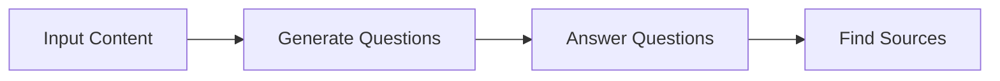
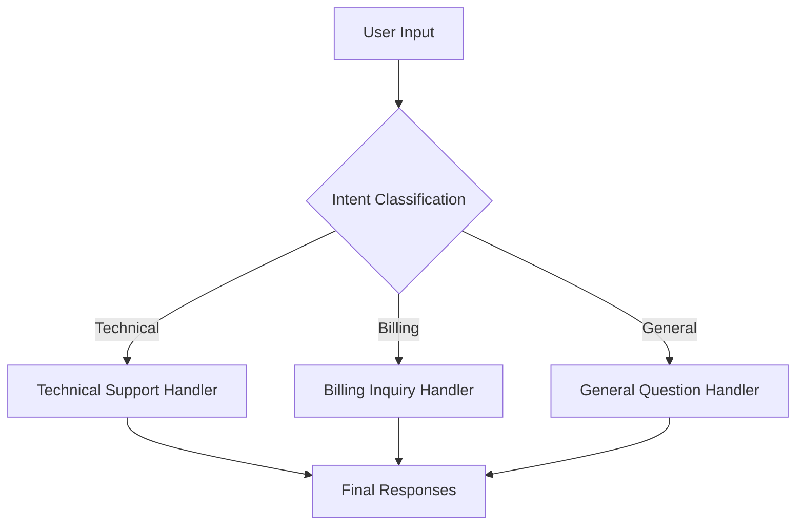
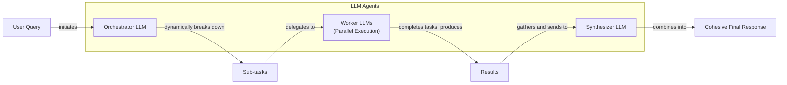

# Lesson 5: The Basic Ingredients of LLM Workflows

In our previous lessons, we laid the groundwork for AI Engineering. We explored the agent landscape, differentiated between LLM workflows and AI agents, and covered context engineering. We also learned how to get reliable, structured data *out* of an LLM. Now, we will combine these ideas to build our first multi-step AI systems.

This lesson explores the fundamental patterns for building robust LLM workflows: chaining, parallelization, routing, and the orchestrator-worker model. These techniques are the building blocks you will use to construct nearly any AI application, from simple content generators to complex, dynamic agents. Mastering them is a crucial step in moving from single-prompt prototypes to production-ready systems that are reliable, modular, and easy to debug.

We will start by looking at why trying to do too much in a single prompt creates an unreliable system. Then, we will break down each workflow pattern, explaining its benefits, trade-offs, and ideal use cases. Along the way, we will build practical examples using Google’s Gemini API, including a sequential FAQ generator and a dynamic customer support router.

## The Challenge with Complex Single LLM Calls

When you first start building with LLMs, it is tempting to solve complex problems with a single, massive prompt. You write a long list of instructions, provide all the context you can gather, and hope for the best. While this can work for simple demos, it quickly falls apart in production. Relying on one monolithic prompt creates a system that is brittle, difficult to debug, and unreliable.

Several core problems emerge with this approach:

First, debugging becomes nearly impossible. When a single, complex prompt fails, it is extremely difficult to pinpoint the exact cause. Did the model misunderstand one of the 20 instructions? Did it fail to parse a specific part of the input? A study analyzing GPT-4 Turbo found that few-shot prompts with multiple examples caused a 52.9% error rate, with over 70% of those errors being simple parsing failures due to the model being overwhelmed by examples without clear structural guidance [[1]](https://aclanthology.org/2025.ommm-1.4.pdf). With a monolithic prompt, you get a single, failed output, leaving you to guess what went wrong. This makes iterative improvement slow and frustrating.

Second, you lose modularity. A single prompt that handles everything is a black box. You cannot easily swap out one part of the logic, test a specific step in isolation, or reuse components across different workflows. This lack of modularity makes the system hard to maintain and scale. If you want to change how the system generates a summary, you risk breaking how it extracts keywords, as both are tangled in the same prompt [[2]](https://www.decodingai.com/p/stop-building-ai-agents-use-these).

Third, you run into the "lost in the middle" problem. A 2023 paper from Stanford and UC Berkeley demonstrated that LLMs exhibit a U-shaped performance curve when processing long contexts. They pay the most attention to information at the very beginning and very end of the context window, while information buried in the middle is often ignored or under-weighted [[3]](https://dev.to/thousand_miles_ai/the-lost-in-the-middle-problem-why-llms-ignore-the-middle-of-your-context-window-3al2). This happens due to architectural factors like causal attention masking, where early tokens get more cumulative attention, and positional encoding decay, which weakens attention to distant tokens. When you stuff too much context and too many instructions into a single prompt, you increase the chance that the model will miss a critical detail, leading to inaccurate or incomplete results.

Finally, complex prompts can be inefficient and unreliable. Research shows that as the number of requirements in a single prompt increases, model accuracy drops. For example, one study found that GPT-4o's accuracy fell from 98.7% with one requirement to 85% with 19 requirements [[4]](https://arxiv.org/html/2505.13360v1). While multi-task prompts can sometimes reduce API calls and save tokens, they often fail when the required output format changes or when dealing with mixed data sources, leading to higher error rates compared to simpler, single-problem prompts [[5]](https://aclanthology.org/2025.gem-1.14.pdf).

To see this in practice, let’s start with a hands-on example. We will try to generate a Frequently Asked Questions (FAQ) list from a few documents about renewable energy using a single, complex prompt.

### Setup

First, we will set up our environment by initializing the Gemini client and defining our model ID. We will use `gemini-1.5-flash`, which is fast and cost-effective for these examples.

1.  We begin by setting up our environment. This involves initializing the Gemini client from the `google-genai` Python package.
    ```python
    import asyncio
    from enum import Enum
    import random
    import time
    
    from pydantic import BaseModel, Field
    from google import genai
    from google.genai import types
    
    from lessons.utils import env
    from lessons.utils import pretty_print
    
    env.load(required_env_vars=["GOOGLE_API_KEY"])
    
    client = genai.Client()
    
    MODEL_ID = "gemini-1.5-flash"
    ```
    It outputs:
    ```text
    Trying to load environment variables from /path/to/your/project/.env
    Environment variables loaded successfully.
    Both GOOGLE_API_KEY and GEMINI_API_KEY are set. Using GOOGLE_API_KEY.
    ```

2.  Next, we will create mock webpage content that will serve as our knowledge base.
    ```python
    webpage_1 = {
        "title": "The Benefits of Solar Energy",
        "content": """
        Solar energy is a renewable powerhouse, offering numerous environmental and economic benefits.
        By converting sunlight into electricity through photovoltaic (PV) panels, it reduces reliance on fossil fuels,
        thereby cutting down greenhouse gas emissions. Homeowners who install solar panels can significantly
        lower their monthly electricity bills, and in some cases, sell excess power back to the grid.
        While the initial installation cost can be high, government incentives and long-term savings make
        it a financially viable option for many. Solar power is also a key component in achieving energy
        independence for nations worldwide.
        """,
    }
    
    webpage_2 = {
        "title": "Understanding Wind Turbines",
        "content": """
        Wind turbines are towering structures that capture kinetic energy from the wind and convert it into
        electrical power. They are a critical part of the global shift towards sustainable energy.
        Turbines can be installed both onshore and offshore, with offshore wind farms generally producing more
        consistent power due to stronger, more reliable winds. The main challenge for wind energy is its
        intermittency—it only generates power when the wind blows. This necessitates the use of energy
        storage solutions, like large-scale batteries, to ensure a steady supply of electricity.
        """,
    }
    
    webpage_3 = {
        "title": "Energy Storage Solutions",
        "content": """
        Effective energy storage is the key to unlocking the full potential of renewable sources like solar
        and wind. Because these sources are intermittent, storing excess energy when it's plentiful and
        releasing it when it's needed is crucial for a stable power grid. The most common form of
        large-scale storage is pumped-hydro storage, but battery technologies, particularly lithium-ion,
        are rapidly becoming more affordable and widespread. These batteries can be used in homes, businesses,
        and at the utility scale to balance energy supply and demand, making our energy system more
        resilient and reliable.
        """,
    }
    
    all_sources = [webpage_1, webpage_2, webpage_3]
    
    # We'll combine the content for the LLM to process
    combined_content = "\n\n".join(
        [f"Source Title: {source['title']}\nContent: {source['content']}" for source in all_sources]
    )
    ```

3.  Now, we will write a single, complex prompt that asks the model to generate questions, find answers, and cite sources all at once. We will use Pydantic models to define the structured output we expect, a technique we covered in Lesson 4.
    ```python
    # This prompt tries to do everything at once: generate questions, find answers,
    # and cite sources. This complexity can often confuse the model.
    n_questions = 10
    prompt_complex = f"""
    Based on the provided content from three webpages, generate a list of exactly {n_questions} frequently asked questions (FAQs).
    For each question, provide a concise answer derived ONLY from the text.
    After each answer, you MUST include a list of the 'Source Title's that were used to formulate that answer.
    
    <provided_content>
    {combined_content}
    </provided_content>
    """.strip()
    
    # Pydantic classes for structured outputs
    class FAQ(BaseModel):
        """A FAQ is a question and answer pair, with a list of sources used to answer the question."""
        question: str = Field(description="The question to be answered")
        answer: str = Field(description="The answer to the question")
        sources: list[str] = Field(description="The sources used to answer the question")
    
    class FAQList(BaseModel):
        """A list of FAQs"""
        faqs: list[FAQ] = Field(description="A list of FAQs")
    
    # Generate FAQs
    config = types.GenerateContentConfig(
        response_mime_type="application/json",
        response_schema=FAQList
    )
    response_complex = client.models.generate_content(
        model=MODEL_ID,
        contents=prompt_complex,
        config=config
    )
    result_complex = response_complex.parsed
    
    pretty_print.wrapped(
        text=[faq.model_dump_json(indent=2) for faq in result_complex.faqs[:1]],
        title="Complex prompt result (might be inconsistent)"
    )
    ```
    It outputs:
    ```text
    -------------------------- Complex prompt result (might be inconsistent) -------------------------- 
    
    {
      "question": "What is solar energy and how does it work?",
      "answer": "Solar energy is a renewable powerhouse that converts sunlight into electricity through photovoltaic (PV) panels.",
      "sources": [
        "The Benefits of Solar Energy"
      ]
    }
    
    ---------------------------------------------------------------------------------------------------- 
    ```

While the output looks reasonable at first glance, this approach is fragile. If we increased the number of questions, added more source documents, or made the instructions more complex, the model's performance would likely degrade. For instance, it might struggle to correctly attribute answers to multiple sources or fail to generate the exact number of questions requested. This unreliability makes it unsuitable for production systems.

## The Power of Modularity: Why Chain LLM Calls?

The solution to the fragility of monolithic prompts is modularity. Instead of asking an LLM to do everything at once, we break the problem down into smaller, more manageable steps. This is the core idea behind prompt chaining: connecting multiple LLM calls sequentially, where the output of one step becomes the input for the next. This "divide and conquer" strategy is a fundamental pattern in software engineering, and it is just as powerful in AI engineering [[6]](https://www.promptingguide.ai/techniques/prompt_chaining). In many ways, building an LLM workflow is analogous to designing a modern data pipeline. In traditional Extract, Transform, Load (ETL) systems, complex data processing is broken into discrete, testable, and reusable stages. Similarly, prompt chaining allows us to treat each LLM call as a modular transformation step, an approach that brings mature engineering discipline to AI development [[7]](https://www.cloverdx.com/blog/using-llms-in-etl-pipelines-production-scale-best-practices).

Chaining offers several key advantages over single-call approaches:

*   **Improved Modularity:** Each LLM call in a chain focuses on a single, well-defined subtask. This makes the system easier to build, test, and maintain. You can develop and refine each step independently, just like you would with functions in a traditional software program [[2]](https://www.decodingai.com/p/stop-building-ai-agents-use-these).
*   **Enhanced Accuracy:** Simple, targeted prompts are less ambiguous for an LLM to interpret. By reducing the "cognitive load" on the model at each step, you significantly increase the reliability and accuracy of the output. This concept is borrowed directly from cognitive science, where Cognitive Load Theory explains that humans (and by analogy, LLMs) learn and perform complex tasks more effectively when information is presented in smaller, coherent chunks that don't overwhelm working memory [[8]](https://lemonlearning.com/blog/cognitive-load-theory-types-and-principles-for-reduction). The model is less likely to get confused or miss a crucial instruction when the task is focused [[9]](https://www.mdpi.com/2079-9292/13/23/4712).
*   **Easier Debugging:** When a chained workflow fails, you can inspect the input and output of each step to pinpoint exactly where the error occurred. This transparency is impossible with a single monolithic prompt. For example, Acxiom, a data company, faced challenges debugging a complex multi-agent system for audience segmentation. By implementing an observability tool like LangSmith, they gained visibility into each step, allowing them to optimize token usage and effectively scale their system [[10]](https://www.zenml.io/blog/llmops-in-production-457-case-studies-of-what-actually-works).
*   **Increased Flexibility:** A modular design allows you to swap, update, or optimize individual components without rewriting the entire system. For example, you could use a fast, cheap model for a simple classification step and a more powerful, expensive model for a complex generation step, optimizing for both cost and performance [[2]](https://www.decodingai.com/p/stop-building-ai-agents-use-these). This principle of decomposition is so effective that it forms the basis of more advanced prompting techniques like Tree-of-Thoughts, which explores multiple reasoning paths, and Least-to-Most prompting, which solves complex problems by breaking them into a sequence of simpler sub-problems [[11]](https://galileo.ai/blog/chain-of-thought-prompting-techniques).

However, chaining is not without its trade-offs. The most obvious downside is increased latency and cost, as you are making multiple API calls instead of one. Each call adds network overhead, and the total token count can be higher.

Another significant challenge is the compounding effect of errors. Research has shown that sequential relay architectures suffer from exponentially declining reliability as the chain gets longer; for any agent with an error rate above zero, a sufficiently long chain will fail more often than it succeeds [[12]](https://www.zartis.com/multi-agent-system-failure-modes-in-production-the-distributed-systems-problem/). An error in an early step does not just get passed along; it corrupts the context for all subsequent steps, leading to a cascade of failures [[13]](https://tomtunguz.com/compounding-error-llms/). Mitigating this requires careful prompt design and, in production systems, implementing validation checks between steps to catch and correct errors before they propagate [[14]](https://futureagi.substack.com/p/how-tool-chaining-fails-in-production).

## Building a Sequential Workflow: FAQ Generation Pipeline

Let's put theory into practice by refactoring our FAQ generation task into a sequential workflow. We will break the problem into a three-step chain:

1.  **Generate Questions:** The first LLM call will read the source content and generate a list of potential questions.
2.  **Answer Questions:** For each question, a second LLM call will generate a concise answer based on the content.
3.  **Find Sources:** For each question-answer pair, a third LLM call will identify the original source titles.

This modular approach makes the process more robust and easier to debug. Each step is a focused, single-responsibility function, which is a core principle of good software design. This decomposition allows us to treat each LLM call as a predictable transformation, making the entire workflow more transparent and maintainable [[6]](https://www.promptingguide.ai/techniques/prompt_chaining), [[15]](https://medium.com/@fabiolalli/a-practical-guide-to-prompt-engineering-techniques-and-their-use-cases-5f8574e2cd9a).


Image 1: A flowchart illustrating the sequential FAQ generation pipeline.

Here is how we implement it step-by-step. By breaking down the code, we can see how each function contributes to the final, more reliable output.

1.  First, we define a function to generate a list of questions. This prompt focuses only on creating relevant questions, nothing else. We use a Pydantic model, `QuestionList`, to ensure the output is a well-formed list of strings. This is our first link in the chain.
    ```python
    class QuestionList(BaseModel):
        """A list of questions"""
        questions: list[str] = Field(description="A list of questions")
    
    prompt_generate_questions = """
    Based on the content below, generate a list of {n_questions} relevant and distinct questions that a user might have.
    
    <provided_content>
    {combined_content}
    </provided_content>
    """.strip()
    
    def generate_questions(content: str, n_questions: int = 10) -> list[str]:
        """
        Generate a list of questions based on the provided content.
    
        Args:
            content: The combined content from all sources
    
        Returns:
            list: A list of generated questions
        """
        config = types.GenerateContentConfig(
            response_mime_type="application/json",
            response_schema=QuestionList
        )
        response_questions = client.models.generate_content(
            model=MODEL_ID,
            contents=prompt_generate_questions.format(n_questions=n_questions, combined_content=content),
            config=config
        )
    
        return response_questions.parsed.questions
    
    # Test the question generation function
    questions = generate_questions(combined_content, n_questions=10)
    
    pretty_print.wrapped(
        questions[:2],
        title="Questions",
        header_color=pretty_print.Color.YELLOW
    )
    ```
    It outputs:
    ```text
    -------------------------------------------- Questions -------------------------------------------- 
    
    What are the primary environmental and economic benefits of solar energy?
    
    ---------------------------------------------------------------------------------------------------- 
    
    How do homeowners financially benefit from installing solar panels?
    
    ---------------------------------------------------------------------------------------------------- 
    ```

2.  Next, we create a function to answer a single question. This prompt is tightly focused: given the context and a question, produce an answer. This function represents the second step in our chain, taking a single question from the previous step's output as its input.
    ```python
    prompt_answer_question = """
    Using ONLY the provided content below, answer the following question.
    The answer should be concise and directly address the question.
    
    <question>
    {question}
    </question>
    
    <provided_content>
    {combined_content}
    </provided_content>
    """.strip()
    
    def answer_question(question: str, content: str) -> str:
        """
        Generate an answer for a specific question using only the provided content.
    
        Args:
            question: The question to answer
            content: The combined content from all sources
    
        Returns:
            str: The generated answer
        """
        answer_response = client.models.generate_content(
            model=MODEL_ID,
            contents=prompt_answer_question.format(question=question, combined_content=content),
        )
        return answer_response.text
    
    # Test the answer generation function
    test_question = questions[0]
    test_answer = answer_question(test_question, combined_content)
    pretty_print.wrapped(test_question, title="Question", header_color=pretty_print.Color.YELLOW)
    pretty_print.wrapped(test_answer, title="Answer", header_color=pretty_print.Color.GREEN)
    ```
    It outputs:
    ```text
    --------------------------------------------- Question --------------------------------------------- 
    
    What are the primary environmental and economic benefits of solar energy?
    
    ---------------------------------------------------------------------------------------------------- 
    
    ---------------------------------------------- Answer ---------------------------------------------- 
    
    The primary environmental benefit of solar energy is cutting down greenhouse gas emissions by reducing reliance on fossil fuels. Economically, it allows homeowners to significantly lower their monthly electricity bills and potentially sell excess power back to the grid.
    
    ---------------------------------------------------------------------------------------------------- 
    ```

3.  Finally, we define a function to find the sources for a given question and answer. This step ensures our final output is traceable and grounded in the provided documents. It takes the outputs from the previous two steps (question and answer) to produce its own structured output.
    ```python
    class SourceList(BaseModel):
        """A list of source titles that were used to answer the question"""
        sources: list[str] = Field(description="A list of source titles that were used to answer the question")
    
    prompt_find_sources = """
    You will be given a question and an answer that was generated from a set of documents.
    Your task is to identify which of the original documents were used to create the answer.
    
    <question>
    {question}
    </question>
    
    <answer>
    {answer}
    </answer>
    
    <provided_content>
    {combined_content}
    </provided_content>
    """.strip()
    
    def find_sources(question: str, answer: str, content: str) -> list[str]:
        """
        Identify which sources were used to generate an answer.
    
        Args:
            question: The original question
            answer: The generated answer
            content: The combined content from all sources
    
        Returns:
            list: A list of source titles that were used
        """
        config = types.GenerateContentConfig(
            response_mime_type="application/json",
            response_schema=SourceList
        )
        sources_response = client.models.generate_content(
            model=MODEL_ID,
            contents=prompt_find_sources.format(question=question, answer=answer, combined_content=content),
            config=config
        )
        return sources_response.parsed.sources
    
    # Test the source finding function
    test_sources = find_sources(test_question, test_answer, combined_content)
    pretty_print.wrapped(test_sources, title="Sources", header_color=pretty_print.Color.CYAN)
    ```
    It outputs:
    ```text
    --------------------------------------------- Sources --------------------------------------------- 
    
    The Benefits of Solar Energy
    
    ---------------------------------------------------------------------------------------------------- 
    ```

4.  Now, we combine these functions into a single sequential workflow. The `sequential_workflow` function orchestrates the entire process. It first calls `generate_questions` once. Then, it iterates through each generated question, calling `answer_question` and `find_sources` in a loop. This structure clearly demonstrates the "chain" in action.
    ```python
    def sequential_workflow(content, n_questions=10) -> list[FAQ]:
        """
        Execute the complete sequential workflow for FAQ generation.
    
        Args:
            content: The combined content from all sources
    
        Returns:
            list: A list of FAQs with questions, answers, and sources
        """
        # Generate questions
        questions = generate_questions(content, n_questions)
    
        # Answer and find sources for each question sequentially
        final_faqs = []
        for question in questions:
            # Generate an answer for the current question
            answer = answer_question(question, content)
    
            # Identify the sources for the generated answer
            sources = find_sources(question, answer, content)
    
            faq = FAQ(
                question=question,
                answer=answer,
                sources=sources
            )
            final_faqs.append(faq)
    
        return final_faqs
    
    # Execute the sequential workflow (measure time for comparison)
    start_time = time.monotonic()
    sequential_faqs = sequential_workflow(combined_content, n_questions=4)
    end_time = time.monotonic()
    print(f"Sequential processing completed in {end_time - start_time:.2f} seconds")
    
    # Display the final result
    pretty_print.wrapped(
        [faq.model_dump_json(indent=2) for faq in sequential_faqs[:1]],
        title="Sequential FAQ List"
    )
    ```
    It outputs:
    ```text
    Sequential processing completed in 22.20 seconds
    
    --------------------------------------- Sequential FAQ List --------------------------------------- 
    
    {
      "question": "What are the primary financial benefits of installing solar panels for homeowners, and are there any initial costs to consider?",
      "answer": "The primary financial benefits of installing solar panels for homeowners are significantly lowered monthly electricity bills and, in some cases, the ability to sell excess power back to the grid. The initial installation cost can be high.",
      "sources": [
        "The Benefits of Solar Energy"
      ]
    }
    
    ---------------------------------------------------------------------------------------------------- 
    ```

This approach is far more robust. If a single step fails, we know exactly which one. If the answers are poor, we can focus on improving the `answer_question` prompt without touching the other components. This modularity is the key to building reliable and maintainable AI systems. However, running all these steps in a sequence for every question is slow.

## Optimizing Sequential Workflows With Parallel Processing

Our sequential workflow is reliable, but it is not fast. It processes each question one at a time, making two LLM calls (one to answer, one to find sources) for every single question. If we need to generate 20 FAQs, that is 41 separate LLM calls executed in a sequence (1 for questions + 20 * 2 for answers/sources). The total processing time is the sum of all these individual calls, which can be significant.

We can dramatically speed this up by identifying which tasks are independent and can be run in parallel. In our FAQ example, the processing for each question (answering and source-finding) is independent of the others. We do not need to finish answering Question 1 before we start on Question 2. This is a perfect opportunity for parallelization.

By running these independent tasks concurrently, we can reduce the total processing time from the sum of all task durations to the duration of the longest single task. This is a massive performance gain, especially for batch processing large numbers of items.

To implement this, we will use Python’s `asyncio` library to make asynchronous API calls. LLM API calls are I/O-bound tasks; the program spends most of its time waiting for a response from a remote server. `asyncio` is perfectly suited for this, as it allows the program to start other I/O operations while waiting, rather than blocking and doing nothing. This cooperative multitasking is managed by an event loop, which efficiently juggles thousands of concurrent connections in a single thread, avoiding the overhead of traditional multi-threading [[16]](https://santhalakshminarayana.github.io/blog/concurrency-patterns-python), [[17]](https://medium.com/@sizanmahmud08/python-concurrency-showdown-asyncio-vs-threading-vs-multiprocessing-which-should-you-choose-in-31205161899a).

For libraries that do not support `asyncio`, Python's `concurrent.futures.ThreadPoolExecutor` provides an alternative. It uses a pool of OS-level threads to run blocking I/O calls concurrently. While effective, it has higher memory and context-switching overhead compared to `asyncio`, making it less scalable for a very high number of concurrent tasks [[18]](https://testdriven.io/blog/python-concurrency-parallelism/).

1.  First, we create `async` versions of our `answer_question` and `find_sources` functions. These will allow us to send multiple requests to the Gemini API without waiting for each one to complete before starting the next.
    ```python
    async def answer_question_async(question: str, content: str) -> str:
        """
        Async version of answer_question function.
        """
        prompt = prompt_answer_question.format(question=question, combined_content=content)
        response = await client.aio.models.generate_content(
            model=MODEL_ID,
            contents=prompt
        )
        return response.text
    
    async def find_sources_async(question: str, answer: str, content: str) -> list[str]:
        """
        Async version of find_sources function.
        """
        prompt = prompt_find_sources.format(question=question, answer=answer, combined_content=content)
        config = types.GenerateContentConfig(
            response_mime_type="application/json",
            response_schema=SourceList
        )
        response = await client.aio.models.generate_content(
            model=MODEL_ID,
            contents=prompt,
            config=config
        )
        return response.parsed.sources
    ```

2.  Next, we create a function that processes a single question by running its two sub-steps (answering and source-finding) sequentially but will be called in parallel for multiple questions.
    ```python
    async def process_question_parallel(question: str, content: str) -> FAQ:
        """
        Process a single question by generating answer and finding sources in parallel.
        """
        answer = await answer_question_async(question, content)
        sources = await find_sources_async(question, answer, content)
        return FAQ(
            question=question,
            answer=answer,
            sources=sources
        )
    ```

3.  Finally, we create our main parallel workflow. It first generates the questions synchronously (since we need the list of questions before we can process them). Then, it uses `asyncio.gather` to execute `process_question_parallel` for all questions concurrently.
    ```python
    async def parallel_workflow(content: str, n_questions: int = 10) -> list[FAQ]:
        """
        Execute the complete parallel workflow for FAQ generation.
    
        Args:
            content: The combined content from all sources
    
        Returns:
            list: A list of FAQs with questions, answers, and sources
        """
        # Generate questions (this step remains synchronous)
        questions = generate_questions(content, n_questions)
    
        # Process all questions in parallel
        tasks = [process_question_parallel(question, content) for question in questions]
        parallel_faqs = await asyncio.gather(*tasks)
    
        return parallel_faqs
    
    # Execute the parallel workflow (measure time for comparison)
    start_time = time.monotonic()
    parallel_faqs = await parallel_workflow(combined_content, n_questions=4)
    end_time = time.monotonic()
    print(f"Parallel processing completed in {end_time - start_time:.2f} seconds")
    
    # Display the final result
    pretty_print.wrapped(
        text=[faq.model_dump_json(indent=2) for faq in parallel_faqs[:1]],
        title="Generated FAQ List (Parallel)"
    )
    ```
    It outputs:
    ```text
    Parallel processing completed in 8.98 seconds
    
    ---------------------------------- Generated FAQ List (Parallel) ---------------------------------- 
    
    {
      "question": "What are the primary environmental and economic benefits of using solar energy?",
      "answer": "The primary environmental benefit of solar energy is cutting down greenhouse gas emissions by reducing reliance on fossil fuels.\n\nThe primary economic benefits include significantly lower monthly electricity bills, the ability to sell excess power back to the grid, long-term savings, and contributing to energy independence for nations.",
      "sources": [
        "The Benefits of Solar Energy"
      ]
    }
    
    ---------------------------------------------------------------------------------------------------- 
    ```

By running the tasks in parallel, we reduced the execution time from over 22 seconds to just under 9 seconds—a significant improvement.

A critical consideration for parallel processing is API rate limits. This is a classic challenge in distributed systems, and we can borrow battle-tested solutions from microservices architecture. In production, you must implement a robust reliability layer that includes [[19]](https://tianpan.co/blog/2026-03-11-llm-api-resilience-production):
*   **Timeouts:** Set a reasonable timeout (e.g., 30-60 seconds) for each LLM call to prevent a single stalled request from blocking the entire workflow.
*   **Retries with Exponential Backoff:** When a call fails (e.g., a 429 or 500 error), do not retry immediately. Wait for a short period and increase the delay exponentially with each subsequent failure (e.g., 1s, 2s, 4s), adding a random "jitter" to avoid a thundering herd of synchronized retries.
*   **Idempotency:** Ensure that retried operations do not cause duplicate side effects. Use unique keys to make requests idempotent, so if a request is processed twice, the outcome remains the same.
*   **Circuit Breakers:** To prevent overwhelming a struggling downstream service, a circuit breaker can "trip" after a certain number of consecutive failures, temporarily redirecting traffic or failing fast until the service recovers.

## Introducing Dynamic Behavior: Routing and Conditional Logic

So far, our workflows have been fixed and linear. Every input goes through the same sequence of steps. But what if you need to handle different types of inputs in different ways? This is where routing comes in.

Routing introduces conditional logic into your workflow. It allows you to classify an input and direct it down a specialized path, each with its own tailored prompts and logic. Instead of a single, one-size-fits-all pipeline, you create a branching system where each branch is optimized for a specific task. This is another application of the "divide and conquer" principle. The need for dynamic workflows is not new. It mirrors the evolution of Business Process Management (BPM) systems, which moved from rigid, predefined factory-floor processes to flexible, software-driven workflows that could span departments and adapt to changing needs [[20]](https://www.emakin.com/blog/the-history-and-evolution-of-business-process-management-bpm).

In modern data engineering, this pattern is seen in ETL pipelines that route different types of data to specialized transformation logic based on their schema or content [[7]](https://www.cloverdx.com/blog/using-llms-in-etl-pipelines-production-scale-best-practices). An LLM-based router acts as the intelligent dispatcher in such a system. A classic use case is a customer support system. A query about a billing issue requires a completely different response and set of actions than a technical support question. Trying to handle both with a single, massive prompt would lead to confusion and poor performance. A routing workflow solves this elegantly: an initial LLM call classifies the user's intent, and the system then routes the query to a specialized handler for that intent [[21]](https://www.vellum.ai/blog/how-to-build-intent-detection-for-your-chatbot).

This is a two-stage architecture: first classify, then process. It is a powerful pattern for building dynamic and context-aware applications. The LLM acts as an intelligent dispatcher, ensuring that each request is handled by the most appropriate component of your system.

## Building a Basic Routing Workflow

Let's build a simple routing workflow for a customer service chatbot. The system will first classify the user's intent and then pass the query to a specialized handler. This approach ensures that each type of query receives a tailored response from a prompt that is optimized for that specific task. Building a clear and comprehensive taxonomy of intents is the first critical step. For this to be effective, you need high-quality, representative examples for each intent, especially for edge cases that might be ambiguous [[21]](https://www.vellum.ai/blog/how-to-build-intent-detection-for-your-chatbot).


Image 2: A flowchart illustrating a routing workflow for a customer service system.

1.  First, we define the possible intents and create a function that uses the LLM to classify a user's query into one of these categories. The prompt provides the model with the list of categories and the user's query, asking it to make a classification.
    ```python
    class IntentEnum(str, Enum):
        """
        Defines the allowed values for the 'intent' field.
        Inheriting from 'str' ensures that the values are treated as strings.
        """
        TECHNICAL_SUPPORT = "Technical Support"
        BILLING_INQUIRY = "Billing Inquiry"
        GENERAL_QUESTION = "General Question"
    
    class UserIntent(BaseModel):
        """
        Defines the expected response schema for the intent classification.
        """
        intent: IntentEnum = Field(description="The intent of the user's query")
    
    prompt_classification = """
    Classify the user's query into one of the following categories.
    
    <categories>
    {categories}
    </categories>
    
    <user_query>
    {user_query}
    </user_query>
    """.strip()
    
    
    def classify_intent(user_query: str) -> IntentEnum:
        """Uses an LLM to classify a user query."""
        prompt = prompt_classification.format(
            user_query=user_query,
            categories=[intent.value for intent in IntentEnum]
        )
        config = types.GenerateContentConfig(
            response_mime_type="application/json",
            response_schema=UserIntent
        )
        response = client.models.generate_content(
            model=MODEL_ID,
            contents=prompt,
            config=config
        )
        return response.parsed.intent
    
    
    query_1 = "My internet connection is not working."
    intent_1 = classify_intent(query_1)
    pretty_print.wrapped(
        text=intent_1,
        title=f"Intent",
        header_color=pretty_print.Color.MAGENTA
    )
    ```
    It outputs:
    ```text
    ---------------------------------------------- Intent ---------------------------------------------- 
    
    IntentEnum.TECHNICAL_SUPPORT
    
    ---------------------------------------------------------------------------------------------------- 
    ```

2.  Next, we define specialized prompts for each intent. Each prompt gives the LLM a specific role (e.g., "technical support agent") and guides it to provide an appropriate response. This separation of concerns is what makes routing so powerful; each prompt can be optimized independently without affecting the others.
    ```python
    prompt_technical_support = """
    You are a helpful technical support agent.
    
    Here's the user's query:
    <user_query>
    {user_query}
    </user_query>
    
    Provide a helpful first response, asking for more details like what troubleshooting steps they have already tried.
    """.strip()
    
    prompt_billing_inquiry = """
    You are a helpful billing support agent.
    
    Here's the user's query:
    <user_query>
    {user_query}
    </user_query>
    
    Acknowledge their concern and inform them that you will need to look up their account, asking for their account number.
    """.strip()
    
    prompt_general_question = """
    You are a general assistant.
    
    Here's the user's query:
    <user_query>
    {user_query}
    </user_query>
    
    Apologize that you are not sure how to help.
    """.strip()
    ```

3.  Finally, we create a `handle_query` function that acts as our router. It takes the user's query and the classified intent, then calls the appropriate handler to generate the final response. A crucial part of a production-ready router is a default or fallback route to gracefully handle cases where the intent is unclear or does not fit any predefined category [[2]](https://www.decodingai.com/p/stop-building-ai-agents-use-these).
    ```python
    def handle_query(user_query: str, intent: str) -> str:
        """Routes a query to the correct handler based on its classified intent."""
        if intent == IntentEnum.TECHNICAL_SUPPORT:
            prompt = prompt_technical_support.format(user_query=user_query)
        elif intent == IntentEnum.BILLING_INQUIRY:
            prompt = prompt_billing_inquiry.format(user_query=user_query)
        elif intent == IntentEnum.GENERAL_QUESTION:
            prompt = prompt_general_question.format(user_query=user_query)
        else:
            prompt = prompt_general_question.format(user_query=user_query)
        response = client.models.generate_content(
            model=MODEL_ID,
            contents=prompt
        )
        return response.text
    
    
    response_1 = handle_query(query_1, intent_1)
    pretty_print.wrapped(
        text=response_1,
        title=f"Response",
        header_color=pretty_print.Color.GREEN
    )
    ```
    It outputs:
    ```text
    --------------------------------------------- Response --------------------------------------------- 
    
    Hello! I'm sorry to hear you're having trouble with your internet connection. I can definitely help you with that.
    
    To get a better understanding of the issue, could you please tell me a bit more about what's happening? For example:
    
    *   Have you already tried restarting your modem and router?
    *   Are other devices in your home also unable to connect to the internet?
    *   Are you seeing any specific error messages on your device?
    
    Any details you can provide will help me troubleshoot the problem more effectively.
    
    ---------------------------------------------------------------------------------------------------- 
    ```

This routing pattern allows you to build much more sophisticated and reliable systems. You can add as many specialized handlers as you need, and even nest routing logic for more complex decision-making, all while keeping each component simple and focused.

## Orchestrator-Worker Pattern: Dynamic Task Decomposition

The final and most advanced pattern we will cover is the orchestrator-worker model. This pattern is essential for handling complex, unpredictable tasks where the necessary steps cannot be determined in advance. It combines the principles of chaining, routing, and parallelization into a flexible and dynamic system [[22]](https://www.anthropic.com/engineering/building-effective-agents).

In this workflow, a central "orchestrator" LLM analyzes a high-level goal and dynamically breaks it down into a series of smaller, executable subtasks. These subtasks are then delegated to specialized "worker" LLMs (or other tools), which can often execute in parallel. Finally, a "synthesizer" LLM gathers the results from the workers and combines them into a single, cohesive response [[23]](https://mlpills.substack.com/p/diy-17-orchestrator-worker-llm-agent).


Image 3: A flowchart illustrating the orchestrator-worker pattern with LLMs.

The key difference between this and simple parallelization is its flexibility. The subtasks are not predefined; they are determined at runtime by the orchestrator based on the specific input. This makes the pattern incredibly powerful for open-ended problems like planning a trip, conducting research, or writing code, where the number and nature of steps can vary wildly [[24]](https://agents.kour.me/orchestrator-worker/).

### The Perils of Production: Failure Modes and Reliability Patterns

While powerful, the orchestrator-worker pattern introduces complexities familiar to anyone who has built distributed systems. When the workflow fails, it is often not the LLM's core capability that is to blame, but the architecture itself. In fact, analysis of over 1,600 production traces found that 79% of multi-agent failures are structural, stemming from issues like ambiguous specifications, poor coordination, or verification breakdowns [[12]](https://www.zartis.com/multi-agent-system-failure-modes-in-production-the-distributed-systems-problem/).

Common failure modes include:
*   **Specification Failures:** The orchestrator creates ambiguous subtasks, leading workers to interpret the same instruction differently.
*   **Context Loss:** A worker receives insufficient context about what prior workers did, forcing it to make faulty assumptions.
*   **Incorrect Verification:** A "reviewer" worker validates a wrong output because it has the same flawed context as the worker that produced it, a phenomenon known as consensus inertia.
*   **Conflicting Outputs:** Two workers produce contradictory results (e.g., different answers to the same sub-question), and the synthesizer has no clear logic for how to reconcile them [[25]](https://zencoder.ai/blog/multi-agent-orchestration-patterns).

To build reliable orchestrator-worker systems, we must adopt patterns from microservices engineering [[19]](https://tianpan.co/blog/2026-03-11-llm-api-resilience-production):
*   **Durable Execution:** Use checkpointing to save the state of the workflow at each step. This ensures that if the system crashes, it can resume from the last successful step instead of starting over.
*   **The Saga Pattern:** For tasks with external side effects (e.g., making a booking, sending an email), the Saga pattern ensures that if a later step fails, compensating actions are executed to roll back the earlier steps (e.g., cancel the booking).
*   **Self-Healing Loops:** More advanced systems incorporate a "critic" agent that evaluates a worker's output. If the output fails a check (e.g., code does not compile, a citation is invalid), a self-reflection step is triggered to diagnose the error and retry, a pattern known as Reflexion [[26]](https://online.stevens.edu/blog/building-self-healing-ai-orchestrator-reflexion-patterns/).

Let's build an example for a customer support system that can handle complex queries involving multiple, distinct actions.

1.  First, we define the orchestrator. Its job is to parse a user's query and decompose it into a structured list of tasks, each with a specific `query_type` and the necessary parameters.
    ```python
    class QueryTypeEnum(str, Enum):
        """The type of query to be handled."""
        BILLING_INQUIRY = "BillingInquiry"
        PRODUCT_RETURN = "ProductReturn"
        STATUS_UPDATE = "StatusUpdate"
    
    class Task(BaseModel):
        """A task to be performed."""
        query_type: QueryTypeEnum = Field(description="The type of query to be handled.")
        invoice_number: str | None = Field(description="The invoice number to be used for the billing inquiry.", default=None)
        product_name: str | None = Field(description="The name of the product to be returned.", default=None)
        reason_for_return: str | None = Field(description="The reason for returning the product.", default=None)
        order_id: str | None = Field(description="The order ID to be used for the status update.", default=None)
    
    class TaskList(BaseModel):
        """A list of tasks to be performed."""
        tasks: list[Task] = Field(description="A list of tasks to be performed.")
    
    prompt_orchestrator = f"""
    You are a master orchestrator. Your job is to break down a complex user query into a list of sub-tasks.
    Each sub-task must have a "query_type" and its necessary parameters.
    
    The possible "query_type" values and their required parameters are:
    1. "{QueryTypeEnum.BILLING_INQUIRY.value}": Requires "invoice_number".
    2. "{QueryTypeEnum.PRODUCT_RETURN.value}": Requires "product_name" and "reason_for_return".
    3. "{QueryTypeEnum.STATUS_UPDATE.value}": Requires "order_id".
    
    Here's the user's query.
    
    <user_query>
    {{query}}
    </user_query>
    """.strip()
    
    
    def orchestrator(query: str) -> list[Task]:
        """Breaks down a complex query into a list of tasks."""
        prompt = prompt_orchestrator.format(query=query)
        config = types.GenerateContentConfig(
            response_mime_type="application/json",
            response_schema=TaskList
        )
        response = client.models.generate_content(
            model=MODEL_ID,
            contents=prompt,
            config=config
        )
        return response.parsed.tasks
    ```

2.  Next, we define our specialized workers. Each worker is a simple Python function that simulates handling a specific task, like processing a billing inquiry, a product return, or an order status update. In a real application, these workers would interact with databases, APIs, or other backend systems.
    ```python
    # Billing Worker
    class BillingTask(BaseModel):
        query_type: QueryTypeEnum = Field(default=QueryTypeEnum.BILLING_INQUIRY)
        invoice_number: str
        user_concern: str
        action_taken: str
        resolution_eta: str
    
    def handle_billing_worker(invoice_number: str, original_user_query: str) -> BillingTask:
        # ... (Implementation details omitted for brevity)
        investigation_id = f"INV_CASE_{random.randint(1000, 9999)}"
        return BillingTask(
            invoice_number=invoice_number, user_concern="...",
            action_taken=f"An investigation (Case ID: {investigation_id}) has been opened.",
            resolution_eta="2 business days"
        )
    
    # Return Worker
    class ReturnTask(BaseModel):
        query_type: QueryTypeEnum = Field(default=QueryTypeEnum.PRODUCT_RETURN)
        product_name: str
        reason_for_return: str
        rma_number: str
        shipping_instructions: str
    
    def handle_return_worker(product_name: str, reason_for_return: str) -> ReturnTask:
        # ... (Implementation details omitted for brevity)
        rma_number = f"RMA-{random.randint(10000, 99999)}"
        return ReturnTask(
            product_name=product_name, reason_for_return=reason_for_return,
            rma_number=rma_number, shipping_instructions="Please pack the item securely..."
        )
    
    # Status Worker
    class StatusTask(BaseModel):
        query_type: QueryTypeEnum = Field(default=QueryTypeEnum.STATUS_UPDATE)
        order_id: str
        current_status: str
        carrier: str
        tracking_number: str
        expected_delivery: str
    
    def handle_status_worker(order_id: str) -> StatusTask:
        # ... (Implementation details omitted for brevity)
        status_details = {"status": "Shipped", "carrier": "SuperFast Shipping", "tracking": "SF123456", "delivery_estimate": "Tomorrow"}
        return StatusTask(
            order_id=order_id, current_status=status_details["status"],
            carrier=status_details["carrier"], tracking_number=status_details["tracking"],
            expected_delivery=status_details["delivery_estimate"]
        )
    ```

3.  Then, we create the synthesizer. This LLM call takes the structured outputs from all the workers and crafts a single, user-friendly response.
    ```python
    prompt_synthesizer = """
    You are a master communicator. Combine several distinct pieces of information from our support team into a single, well-formatted, and friendly email to a customer.
    
    Here are the points to include, based on the actions taken for their query:
    <points>
    {formatted_results}
    </points>
    
    Combine these points into one cohesive response.
    Start with a friendly greeting (e.g., "Dear Customer," or "Hi there,") and end with a polite closing (e.g., "Sincerely," or "Best regards,").
    Ensure the tone is helpful and professional.
    """.strip()
    
    
    def synthesizer(results: list) -> str:
        """Combines structured results from workers into a single user-facing message."""
        # ... (Formatting logic omitted for brevity)
        bullet_points = []
        for res in results:
            if res.query_type == QueryTypeEnum.BILLING_INQUIRY:
                point = f"Regarding your billing inquiry for invoice {res.invoice_number}..."
            # ... and so on for other types
            bullet_points.append(point)
        
        formatted_results = "\n\n".join(bullet_points)
        prompt = prompt_synthesizer.format(formatted_results=formatted_results)
        response = client.models.generate_content(model=MODEL_ID, contents=prompt)
        return response.text
    ```

4.  Finally, we tie it all together in a main pipeline function. This function takes a user query, runs the orchestrator, dispatches tasks to the appropriate workers (which could be run in parallel), and then uses the synthesizer to generate the final response.
    ```python
    def process_user_query(user_query):
        """Processes a query using the Orchestrator-Worker-Synthesizer pattern."""
    
        pretty_print.wrapped(
            text=user_query,
            title="User query"
        )
    
        # 1. Run orchestrator
        tasks_list = orchestrator(user_query)
        # ... (Error handling omitted)
    
        # 2. Run workers
        worker_results = []
        if tasks_list:
            for task in tasks_list:
                if task.query_type == QueryTypeEnum.BILLING_INQUIRY:
                    worker_results.append(handle_billing_worker(task.invoice_number, user_query))
                elif task.query_type == QueryTypeEnum.PRODUCT_RETURN:
                    worker_results.append(handle_return_worker(task.product_name, task.reason_for_return))
                elif task.query_type == QueryTypeEnum.STATUS_UPDATE:
                    worker_results.append(handle_status_worker(task.order_id))
    
        # 3. Run synthesizer
        if worker_results:
            final_user_message = synthesizer(worker_results)
            pretty_print.wrapped(
                text=final_user_message,
                title="Final synthesized response",
                header_color=pretty_print.Color.GREEN
            )
    
    complex_customer_query = """
    Hi, I'm writing to you because I have a question about invoice #INV-7890. It seems higher than I expected.
    Also, I would like to return the 'SuperWidget 5000' I bought because it's not compatible with my system.
    Finally, can you give me an update on my order #A-12345?
    """.strip()
    
    process_user_query(complex_customer_query)
    ```
    It outputs:
    ```text
    --------------------------------------------- User query --------------------------------------------- 
    
    Hi, I'm writing to you because I have a question about invoice #INV-7890. It seems higher than I expected.
    Also, I would like to return the 'SuperWidget 5000' I bought because it's not compatible with my system.
    Finally, can you give me an update on my order #A-12345?
    
    ---------------------------------------------------------------------------------------------------- 
    
    -------------------------------------- Final synthesized response -------------------------------------- 
    
    Dear Customer,
    
    Thank you for reaching out to us. Here's an update on your recent requests:
    
    Regarding your billing inquiry for invoice INV-7890: We understand you have a concern about the amount. We have opened an investigation (Case ID: INV_CASE_...) to look into this for you. We will get back to you within 2 business days.
    
    Regarding your product return for 'SuperWidget 5000': We've processed your return request. Your Return Authorization (RMA) number is RMA-.... Please pack the item securely and follow the shipping instructions.
    
    Regarding your status update for order A-12345: Your order has been Shipped via SuperFast Shipping. The tracking number is SF.... You can expect delivery Tomorrow.
    
    We appreciate your patience and will be in touch shortly regarding your billing inquiry.
    
    Best regards,
    
    The Support Team
    
    ---------------------------------------------------------------------------------------------------- 
    ```

This pattern provides a powerful and scalable architecture for building complex, agent-like systems that can reason, plan, and execute multi-step tasks in a dynamic environment.

## Conclusion

In this lesson, we have moved beyond single, monolithic prompts and explored the fundamental workflow patterns that underpin reliable AI applications. We have seen how breaking down complex tasks into smaller, focused steps is the key to building systems that are modular, debuggable, and accurate.

We started with **prompt chaining**, a sequential pattern that improves reliability by assigning a single responsibility to each LLM call. We then optimized this with **parallelization**, showing how to drastically reduce latency by running independent tasks concurrently. We introduced dynamic behavior with **routing**, using an LLM to classify inputs and direct them to specialized handlers. Finally, we combined these concepts into the powerful **orchestrator-worker** pattern, a flexible architecture for dynamically decomposing and executing complex, unpredictable tasks.

These patterns—chaining, parallelization, routing, and orchestration—are not just theoretical concepts; they are the practical building blocks you will use every day as an AI Engineer. They solve over 95% of the problems you will face in production, providing a solid foundation for everything from simple content pipelines to sophisticated, multi-agent systems [[2]](https://www.decodingai.com/p/stop-building-ai-agents-use-these).

In our next lesson, we will build on this foundation by giving our workflows the ability to interact with the outside world. We will dive into agent tools and function calling, learning how to empower an LLM to take action, from searching the web to interacting with APIs.

## References

- [1] FLARE: A Framework for Large-Language-Model-Assisted Response Evaluation. (2025). *aclanthology.org*. [https://aclanthology.org/2025.ommm-1.4.pdf](https://aclanthology.org/2025.ommm-1.4.pdf)
- [2] Iusztin, P. (2024). Stop Building AI Agents. Use These LLM Workflows Instead. *decodingai.com*. [https://www.decodingai.com/p/stop-building-ai-agents-use-these](https://www.decodingai.com/p/stop-building-ai-agents-use-these)
- [3] The "Lost in the Middle" Problem — Why LLMs Ignore the Middle of Your Context Window. (2024). *dev.to*. [https://dev.to/thousand_miles_ai/the-lost-in-the-middle-problem-why-llms-ignore-the-middle-of-your-context-window-3al2](https://dev.to/thousand_miles_ai/the-lost-in-the-middle-problem-why-llms-ignore-the-middle-of-your-context-window-3al2)
- [4] Underspecification in Instruction-Following: A Study of Long-Context LLMs. (2025). *arxiv.org*. [https://arxiv.org/html/2505.13360v1](https://arxiv.org/html/2505.13360v1)
- [5] Zero-Shot Multi-Problem Prompting of Large Language Models. (2025). *aclanthology.org*. [https://aclanthology.org/2025.gem-1.14.pdf](https://aclanthology.org/2025.gem-1.14.pdf)
- [6] Prompt Chaining Guide. (n.d.). *Prompting Guide*. [https://www.promptingguide.ai/techniques/prompt_chaining](https://www.promptingguide.ai/techniques/prompt_chaining)
- [7] Using LLMs in ETL pipelines: Production-scale best practices. (2024). *cloverdx.com*. [https://www.cloverdx.com/blog/using-llms-in-etl-pipelines-production-scale-best-practices](https://www.cloverdx.com/blog/using-llms-in-etl-pipelines-production-scale-best-practices)
- [8] Cognitive Load Theory: Definition, Types and Principles for Reduction. (n.d.). *lemonlearning.com*. [https://lemonlearning.com/blog/cognitive-load-theory-types-and-principles-for-reduction](https://lemonlearning.com/blog/cognitive-load-theory-types-and-principles-for-reduction)
- [9] Gozzi, M., & Di Maio, F. (2024). *Comparative Analysis of Prompt Strategies for Large Language Models: Single-Task vs. Multitask Prompts*. Electronics, 13(23), 4712. [https://www.mdpi.com/2079-9292/13/23/4712](https://www.mdpi.com/2079-9292/13/23/4712)
- [10] LLMOps in Production: 457 Case Studies of What Actually Works. (2025). *zenml.io*. [https://www.zenml.io/blog/llmops-in-production-457-case-studies-of-what-actually-works](https://www.zenml.io/blog/llmops-in-production-457-case-studies-of-what-actually-works)
- [11] 8 Chain-of-Thought Techniques To Fix AI Reasoning Failures. (n.d.). *galileo.ai*. [https://galileo.ai/blog/chain-of-thought-prompting-techniques](https://galileo.ai/blog/chain-of-thought-prompting-techniques)
- [12] Multi-Agent System Failure Modes in Production: The Distributed Systems Problem. (2026). *zartis.com*. [https://www.zartis.com/multi-agent-system-failure-modes-in-production-the-distributed-systems-problem/](https://www.zartis.com/multi-agent-system-failure-modes-in-production-the-distributed-systems-problem/)
- [13] The Compounding Error Problem of Large Language Models. (n.d.). *tomtunguz.com*. [https://tomtunguz.com/compounding-error-llms/](https://tomtunguz.com/compounding-error-llms/)
- [14] How Tool Chaining Fails in Production LLM Agents and How to Fix It. (2026). *futureagi.substack.com*. [https://futureagi.substack.com/p/how-tool-chaining-fails-in-production](https://futureagi.substack.com/p/how-tool-chaining-fails-in-production)
- [15] A Practical Guide to Prompt Engineering Techniques and their Use Cases. (2024). *medium.com*. [https://medium.com/@fabiolalli/a-practical-guide-to-prompt-engineering-techniques-and-their-use-cases-5f8574e2cd9a](https://medium.com/@fabiolalli/a-practical-guide-to-prompt-engineering-techniques-and-their-use-cases-5f8574e2cd9a)
- [16] Concurrency Patterns in Python. (n.d.). *santhalakshminarayana.github.io*. [https://santhalakshminarayana.github.io/blog/concurrency-patterns-python](https://santhalakshminarayana.github.io/blog/concurrency-patterns-python)
- [17] Python Concurrency Showdown: Asyncio vs. Threading vs. Multiprocessing. (2024). *Medium*. [https://medium.com/@sizanmahmud08/python-concurrency-showdown-asyncio-vs-threading-vs-multiprocessing-which-should-you-choose-in-31205161899a](https://medium.com/@sizanmahmud08/python-concurrency-showdown-asyncio-vs-threading-vs-multiprocessing-which-should-you-choose-in-31205161899a)
- [18] Python Concurrency and Parallelism. (2023). *testdriven.io*. [https://testdriven.io/blog/python-concurrency-parallelism/](https://testdriven.io/blog/python-concurrency-parallelism/)
- [19] LLM API Resilience in Production: Rate Limits, Failover, and the Hidden Costs of Naive Retry Logic. (2026). *tianpan.co*. [https://tianpan.co/blog/2026-03-11-llm-api-resilience-production](https://tianpan.co/blog/2026-03-11-llm-api-resilience-production)
- [20] The History and Evolution of Business Process Management (BPM). (n.d.). *emakin.com*. [https://www.emakin.com/blog/the-history-and-evolution-of-business-process-management-bpm](https://www.emakin.com/blog/the-history-and-evolution-of-business-process-management-bpm)
- [21] A Beginner's Guide to LLM Intent Classification for Chatbots. (2024). *vellum.ai*. [https://www.vellum.ai/blog/how-to-build-intent-detection-for-your-chatbot](https://www.vellum.ai/blog/how-to-build-intent-detection-for-your-chatbot)
- [22] Building effective agents. (2024). *Anthropic*. [https://www.anthropic.com/engineering/building-effective-agents](https://www.anthropic.com/engineering/building-effective-agents)
- [23] DIY #17 Orchestrator-Worker LLM Agent. (2024). *mlpills.substack.com*. [https://mlpills.substack.com/p/diy-17-orchestrator-worker-llm-agent](https://mlpills.substack.com/p/diy-17-orchestrator-worker-llm-agent)
- [24] Orchestrator-Worker. (n.d.). *agents.kour.me*. [https://agents.kour.me/orchestrator-worker/](https://agents.kour.me/orchestrator-worker/)
- [25] Multi-Agent Orchestration Patterns. (n.d.). *zencoder.ai*. [https://zencoder.ai/blog/multi-agent-orchestration-patterns](https://zencoder.ai/blog/multi-agent-orchestration-patterns)
- [26] Building self-healing AI with orchestrator and reflexion patterns. (n.d.). *Stevens Institute of Technology*. [https://online.stevens.edu/blog/building-self-healing-ai-orchestrator-reflexion-patterns/](https://online.stevens.edu/blog/building-self-healing-ai-orchestrator-reflexion-patterns/)
- [27] AI Agents Course Notebook. (n.d.). *GitHub*. [https://github.com/towardsai/course-ai-agents/blob/dev/lessons/05_workflow_patterns/notebook.ipynb](https://github.com/towardsai/course-ai-agents/blob/dev/lessons/05_workflow_patterns/notebook.ipynb)
</article>