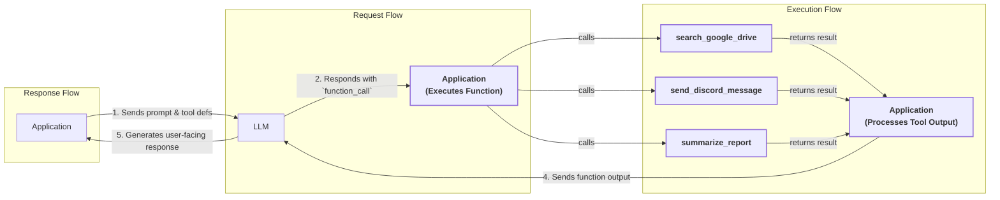
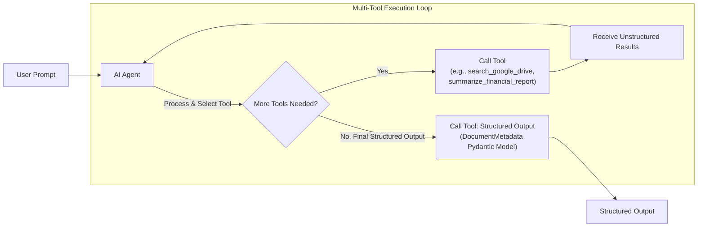
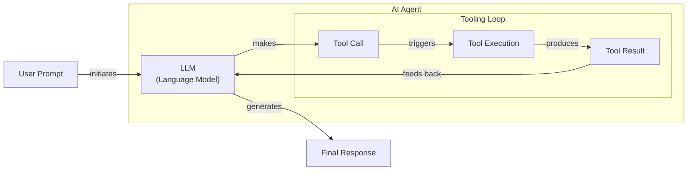

# Lesson 6: Agent Tools & Function Calling

In the previous lessons, we built a solid foundation in AI Engineering. We mapped the agent landscape, distinguished between rule-based workflows and autonomous agents, and explored context engineering and structured outputs. We now have a system that can understand instructions and return predictable, machine-readable data. But a critical piece is missing: the ability to act. Without it, our systems are knowledgeable but passive observers, unable to interact with or change the world around them.

This lesson introduces tools, the components that give an LLM the ability to interact with the world. For an AI Engineer, tools are what transform an LLM from a simple text generator into an agent that can take action. Understanding how an agent works with these tools is not just a technical detail; it is a fundamental skill required to build, improve, and debug modern AI applications. We will open this black box, starting from the ground up to see how these systems work under the hood.

## Understanding why agents need tools

LLMs have a fundamental limitation: they are sophisticated pattern matchers and text generators. They are trained on vast, static datasets and store all their knowledge within their weights. This means they cannot, by themselves, interact with the external world. They cannot check today’s weather, access a private database, or send an email. They are, in essence, brains in a jar. Tools are the solution to this problem.

Think of the LLM as the brain of an agent. Tools are its hands and senses, allowing it to perceive and act in the world beyond its textual interface. They are the bridge between the LLM's internal reasoning and the external environment. By giving an LLM access to tools, we transform it into an AI agent that can execute specific instructions and affect its surroundings.

Image 1: A high-level overview of how an LLM uses a tool to answer a user's question. (Source: [Function Calling Guide: Google DeepMind Gemini 2.0 Flash](https://www.philschmid.de/gemini-function-calling))

Modern AI agents are powered by a diverse range of tools that extend their capabilities far beyond simple text generation. Some of the most common categories include:

*   **Real-time information access:** Tools can call external APIs to get live data, such as today's weather, the latest news, or current stock prices [[19]](https://lnu.diva-portal.org/smash/get/diva2:1801354/FULLTEXT01.pdf). This overcomes the static knowledge cutoff of the LLM's training data.
*   **Data retrieval:** They can connect to and query external databases, data warehouses, or data lakes to fetch specific, often private, information [[16]](https://arxiv.org/html/2507.08034v1). This is essential for enterprise applications that need to work with proprietary data.
*   **Long-term memory:** Tools can access an agent's long-term memory, allowing it to recall information from past conversations or sessions that lie beyond its immediate context window [[12]](https://www.ruh.ai/blogs/how-vector-databases-are-rewiring-the-tech-industry). This enables personalization and continuity.
*   **Code execution:** An agent can use a tool like a Python interpreter to perform precise calculations, manipulate data, or even generate visualizations. This offloads tasks that LLMs are notoriously bad at, like arithmetic, to a deterministic environment [[18]](https://medium.com/@anicomanesh/how-llm-reasoning-powers-the-agentic-ai-revolution-cbefd10ebf3f).

Now that we understand why tools are essential, the best way to see how they work is to build the mechanism from the ground up.

## Implementing tool calls from scratch

The best way to understand how tools work is to build the mechanism yourself. In this section, we will implement tool calling from scratch. You will learn how a tool is defined, what its schema looks like, and how an LLM uses this information to decide which function to call and with what arguments.

Our goal is to provide the LLM with a list of available tools and let it decide which one to use to fulfill a user's request. The high-level process, often called function calling, involves five key steps:

1.  **Application:** You send the LLM a prompt that includes a list of available tools and their definitions.
2.  **LLM:** The model analyzes the prompt and, if it decides a tool is needed, responds with a `function_call` request specifying the tool's name and the arguments to use.
3.  **Application:** Your code receives this request, parses it, and executes the specified function with the provided arguments.
4.  **Application:** You then send the output from the function execution back to the LLM.
5.  **LLM:** The model uses the tool's output to generate a final, user-facing response.



Image 2: A flowchart illustrating the 5-step tool calling process with request-execute-respond flow highlighted and example tool calls.

Now, let's build this. We will implement a simple workflow where an agent can search for a document on Google Drive and send a summary of it to a Discord channel.

<aside>
💡

You can find all the code for this lesson in the accompanying [Jupyter Notebook on GitHub](https://github.com/towardsai/course-ai-agents/blob/dev/lessons/06_tools/notebook.ipynb).

</aside>

1.  First, we set up our environment by importing the necessary libraries and initializing the Gemini client. We will use the `gemini-2.5-flash` model and a sample financial document to mock the content of a file.
    ```python
    import json
    from typing import Any
    
    from google import genai
    from google.genai import types
    from pydantic import BaseModel, Field
    
    from lessons.utils import env
    
    env.load(required_env_vars=["GOOGLE_API_KEY"])
    
    client = genai.Client()
    
    MODEL_ID = "gemini-2.5-flash"
    
    DOCUMENT = """
    # Q3 2023 Financial Performance Analysis
    
    The Q3 earnings report shows a 20% increase in revenue and a 15% growth in user engagement, 
    beating market expectations. These impressive results reflect our successful product strategy 
    and strong market positioning.
    
    Our core business segments demonstrated remarkable resilience, with digital services leading 
    the growth at 25% year-over-year. The expansion into new markets has proven particularly 
    successful, contributing to 30% of the total revenue increase.
    
    Customer acquisition costs decreased by 10% while retention rates improved to 92%, 
    marking our best performance to date. These metrics, combined with our healthy cash flow 
    position, provide a strong foundation for continued growth into Q4 and beyond.
    """
    ```

2.  Next, we define three mock Python functions to simulate our tools. To keep the focus on the tool-calling mechanism, these functions return hardcoded data instead of making real API calls. The function signature and docstring are essential, as they provide the information the LLM needs to understand what the tool does.
    ```python
    def search_google_drive(query: str) -> dict:
        """
        Searches for a file on Google Drive and returns its content or a summary.
    
        Args:
            query (str): The search query to find the file, e.g., 'Q3 earnings report'.
    
        Returns:
            dict: A dictionary representing the search results, including file names and summaries.
        """
        return {
            "files": [
                {
                    "name": "Q3_Earnings_Report_2024.pdf",
                    "id": "file12345",
                    "content": DOCUMENT,
                }
            ]
        }
    ```
    ```python
    def send_discord_message(channel_id: str, message: str) -> dict:
        """
        Sends a message to a specific Discord channel.
    
        Args:
            channel_id (str): The ID of the channel to send the message to, e.g., '#finance'.
            message (str): The content of the message to send.
    
        Returns:
            dict: A dictionary confirming the action, e.g., {"status": "success"}.
        """
        return {
            "status": "success",
            "status_code": 200,
            "channel": channel_id,
            "message_preview": f"{message[:50]}...",
        }
    ```
    ```python
    def summarize_financial_report(text: str) -> str:
        """
        Summarizes a financial report.
    
        Args:
            text (str): The text to summarize.
    
        Returns:
            str: The summary of the text.
        """
        return "The Q3 2023 earnings report shows strong performance across all metrics with 20% revenue growth, 15% user engagement increase, 25% digital services growth, and improved retention rates of 92%."
    ```

3.  To make these functions available to the LLM, we must define a schema for each one. The schema, typically described in JSON, tells the model what the tool does (`description`), what parameters it needs, their types, and which are required. This schema is the industry standard for APIs like OpenAI and Gemini.
    ```python
    search_google_drive_schema = {
        "name": "search_google_drive",
        "description": "Searches for a file on Google Drive and returns its content or a summary.",
        "parameters": {
            "type": "object",
            "properties": {
                "query": {
                    "type": "string",
                    "description": "The search query to find the file, e.g., 'Q3 earnings report'.",
                }
            },
            "required": ["query"],
        },
    }
    ```
    ```python
    send_discord_message_schema = {
        "name": "send_discord_message",
        "description": "Sends a message to a specific Discord channel.",
        "parameters": {
            "type": "object",
            "properties": {
                "channel_id": {
                    "type": "string",
                    "description": "The ID of the channel to send the message to, e.g., '#finance'.",
                },
                "message": {
                    "type": "string",
                    "description": "The content of the message to send.",
                },
            },
            "required": ["channel_id", "message"],
        },
    }
    ```
    ```python
    summarize_financial_report_schema = {
        "name": "summarize_financial_report",
        "description": "Summarizes a financial report.",
        "parameters": {
            "type": "object",
            "properties": {
                "text": {
                    "type": "string",
                    "description": "The text to summarize.",
                },
            },
            "required": ["text"],
        },
    }
    ```

4.  We then create a tool registry to map tool names to their corresponding functions (handlers) and schemas. This makes it easy to look up and execute the correct function based on the LLM's request.
    ```python
    TOOLS = {
        "search_google_drive": {
            "handler": search_google_drive,
            "declaration": search_google_drive_schema,
        },
        "send_discord_message": {
            "handler": send_discord_message,
            "declaration": send_discord_message_schema,
        },
        "summarize_financial_report": {
            "handler": summarize_financial_report,
            "declaration": summarize_financial_report_schema,
        },
    }
    TOOLS_BY_NAME = {tool_name: tool["handler"] for tool_name, tool in TOOLS.items()}
    TOOLS_SCHEMA = [tool["declaration"] for tool in TOOLS.values()]
    ```

5.  The `TOOLS_BY_NAME` mapping gives us a simple way to look up a function by its name.
    It outputs:
    ```text
    Tool name: search_google_drive
    Tool handler: <function search_google_drive at 0x104c7df80>
    ---------------------------------------------------------------------------
    Tool name: send_discord_message
    Tool handler: <function send_discord_message at 0x104c7de40>
    ---------------------------------------------------------------------------
    Tool name: summarize_financial_report
    Tool handler: <function summarize_financial_report at 0x1274f5c60>
    ---------------------------------------------------------------------------
    ```

6.  The `TOOLS_SCHEMA` list contains the JSON schema for each tool, which we will pass to the LLM. This is the contract that tells the model what it can do.
    It outputs:
    ```json
    {
      "name": "search_google_drive",
      "description": "Searches for a file on Google Drive and returns its content or a summary.",
      "parameters": {
        "type": "object",
        "properties": {
          "query": {
            "type": "string",
            "description": "The search query to find the file, e.g., 'Q3 earnings report'."
          }
        },
        "required": [
          "query"
        ]
      }
    }
    ```

7.  Now, we craft a system prompt to instruct the LLM on how to use these tools. This prompt is the control panel for our agent. It includes guidelines on when to use tools, how to select them, and the exact format for a tool call. The available tools are injected between the `<tool_definitions>` tags.
    ```python
    TOOL_CALLING_SYSTEM_PROMPT = """
    You are a helpful AI assistant with access to tools that enable you to take actions and retrieve information to better 
    assist users.
    
    ## Tool Usage Guidelines
    
    **When to use tools:**
    - When you need information that is not in your training data
    - When you need to perform actions in external systems and environments
    - When you need real-time, dynamic, or user-specific data
    - When computational operations are required
    
    **Tool selection:**
    - Choose the most appropriate tool based on the user's specific request
    - If multiple tools could work, select the one that most directly addresses the need
    - Consider the order of operations for multi-step tasks
    
    **Parameter requirements:**
    - Provide all required parameters with accurate values
    - Use the parameter descriptions to understand expected formats and constraints
    - Ensure data types match the tool's requirements (strings, numbers, booleans, arrays)
    
    ## Tool Call Format
    
    When you need to use a tool, output ONLY the tool call in this exact format:
    
    <tool_call>
    {{"name": "tool_name", "args": {{"param1": "value1", "param2": "value2"}}}}
    </tool_call>
    
    **Critical formatting rules:**
    - Use double quotes for all JSON strings
    - Ensure the JSON is valid and properly escaped
    - Include ALL required parameters
    - Use correct data types as specified in the tool definition
    - Do not include any additional text or explanation in the tool call
    
    ## Response Behavior
    
    - If no tools are needed, respond directly to the user with helpful information
    - If tools are needed, make the tool call first, then provide context about what you're doing
    - After receiving tool results, provide a clear, user-friendly explanation of the outcome
    - If a tool call fails, explain the issue and suggest alternatives when possible
    
    ## Available Tools
    
    <tool_definitions>
    {tools}
    </tool_definitions>
    
    Remember: Your goal is to be maximally helpful to the user. Use tools when they add value, but don't use them unnecessarily. Always prioritize accuracy and user experience.
    """
    ```

8.  The LLM's decision-making process for tool use is guided by two key elements: the tool descriptions and the system prompt. Based on the `description` field in the tool schema, the LLM decides if a tool is appropriate for the user's query. This is why writing clear, articulate, and distinct tool descriptions is one of the most important aspects of building reliable agents [[41]](https://mbrenndoerfer.com/writing/function-calling-llm-structured-tools). For example, describing two tools as `Tool used to search documents` and `Tool used to search files` would likely confuse the model. More explicit descriptions like `Tool used to search documents on Google Drive` and `Tool used to search files on the local disk` provide the clarity needed for accurate tool selection.

    This becomes even more important as you scale to dozens or even hundreds of tools for a single agent. Clear system prompts that explicitly state the desired action, like `search documents on Google Drive`, further reduce ambiguity. Once a tool is selected, the LLM generates the function name and arguments as a structured output, like JSON. This capability is not magic; models are specifically instruction fine-tuned to interpret tool schemas and generate these structured tool calls [[23]](https://tetrate.io/learn/ai/llm-output-parsing-structured-generation).

9.  Let's test it. We send a user prompt along with our system prompt to the model.
    ```python
    USER_PROMPT = """
    Can you help me find the latest quarterly report and share key insights with the team?
    """
    
    messages = [TOOL_CALLING_SYSTEM_PROMPT.format(tools=str(TOOLS_SCHEMA)), USER_PROMPT]
    
    response = client.models.generate_content(
        model=MODEL_ID,
        contents=messages,
    )
    ```

10. The LLM correctly identifies the `search_google_drive` tool and generates the required arguments.
    It outputs:
    ```text
    <tool_call>
    {"name": "search_google_drive", "args": {"query": "latest quarterly report"}}
    </tool_call>
    ```

11. Let's try a more complex query that requires multiple steps.
    ```python
    USER_PROMPT = """
    Please find the Q3 earnings report on Google Drive and send a summary of it to 
    the #finance channel on Discord.
    """
    
    messages = [TOOL_CALLING_SYSTEM_PROMPT.format(tools=str(TOOLS_SCHEMA)), USER_PROMPT]
    
    response = client.models.generate_content(
        model=MODEL_ID,
        contents=messages,
    )
    ```

12. The model correctly identifies that the first step is to search for the document.
    It outputs:
    ```text
    <tool_call>
    {"name": "search_google_drive", "args": {"query": "Q3 earnings report"}}
    </tool_call>
    ```

13. Now we need to parse this response and execute the tool. First, we extract the JSON string from the Markdown block.
    ```python
    def extract_tool_call(response_text: str) -> str:
        """
        Extracts the tool call from the response text.
        """
        return response_text.split("```tool_call")[1].split("```")[0].strip()
    
    
    tool_call_str = extract_tool_call(response.text)
    ```
    It outputs:
    ```text
    '{"name": "search_google_drive", "args": {"query": "Q3 earnings report"}}'
    ```

14. We parse the string into a Python dictionary.
    ```python
    tool_call = json.loads(tool_call_str)
    ```
    It outputs:
    ```text
    {'name': 'search_google_drive', 'args': {'query': 'Q3 earnings report'}}
    ```

15. Next, we retrieve the actual Python function (the handler) from our `TOOLS_BY_NAME` registry.
    ```python
    tool_handler = TOOLS_BY_NAME[tool_call["name"]]
    ```

16. The `tool_handler` is a direct reference to our `search_google_drive` function.
    It outputs:
    ```text
    <function __main__.search_google_drive(query: str) -> dict>
    ```

17. Now we can execute the function using the arguments provided by the LLM.
    ```python
    tool_result = tool_handler(**tool_call["args"])
    ```

18. The function returns the mocked document content.
    It outputs:
    ```json
    {
      "files": [
        {
          "name": "Q3_Earnings_Report_2024.pdf",
          "id": "file12345",
          "content": "\n# Q3 2023 Financial Performance Analysis\n\nThe Q3 earnings report shows a 20% increase in revenue and a 15% growth in user engagement, \nbeating market expectations. These impressive results reflect our successful product strategy \nand strong market positioning.\n\nOur core business segments demonstrated remarkable resilience, with digital services leading \nthe growth at 25% year-over-year. The expansion into new markets has proven particularly \nsuccessful, contributing to 30% of the total revenue increase.\n\nCustomer acquisition costs decreased by 10% while retention rates improved to 92%, \nmarking our best performance to date. These metrics, combined with our healthy cash flow \nposition, provide a strong foundation for continued growth into Q4 and beyond.\n"
        }
      ]
    }
    ```

19. We can wrap these steps into a single helper function, `call_tool`, to streamline the process. This function encapsulates the logic of parsing the LLM's response, finding the correct tool, and executing it.
    ```python
    def call_tool(response_text: str, tools_by_name: dict) -> Any:
        """
        Call a tool based on the response from the LLM.
        """
    
        tool_call_str = extract_tool_call(response_text)
        tool_call = json.loads(tool_call_str)
        tool_name = tool_call["name"]
        tool_args = tool_call["args"]
        tool = tools_by_name[tool_name]
    
        return tool(**tool_args)
    ```

20. Using this function, we can execute the tool call from the LLM's response in one line. The output is identical to our manual execution, demonstrating that our helper function works as expected.
    ```python
    call_tool(response.text, tools_by_name=TOOLS_BY_NAME)
    ```

21. After executing a tool, the final step is to send the result back to the LLM. This allows the model to interpret the information and either generate a final response for the user or decide on the next action to take. This feedback loop is what makes an agent truly interactive.
    ```python
    response = client.models.generate_content(
        model=MODEL_ID,
        contents=f"Interpret the tool result: {json.dumps(tool_result, indent=2)}",
    )
    ```

22. The LLM now has the context from the tool and can provide a comprehensive summary, completing the user's original request.
    It outputs:
    ```text
    The tool result provides the content of a file named `Q3_Earnings_Report_2024.pdf`.
    
    This document is a **Q3 2023 Financial Performance Analysis** and details exceptionally strong results, significantly beating market expectations.
    
    **Key highlights from the report include:**
    
    *   **Revenue Growth:** A 20% increase in revenue.
    *   **User Engagement:** 15% growth in user engagement.
    *   **Core Business Performance:** Digital services led growth at 25% year-over-year.
    *   **Market Expansion Success:** New markets contributed 30% of the total revenue increase.
    *   **Efficiency & Retention:**
        *   Customer acquisition costs decreased by 10%.
        *   Retention rates improved to 92%, marking the best performance to date.
    *   **Financial Health:** The company maintains a healthy cash flow position.
    
    The report attributes these impressive results to a successful product strategy and strong market positioning, indicating a robust foundation for continued growth into Q4 and beyond.
    ```

This from-scratch implementation reveals the core mechanics of tool calling. However, as you can see, it involves a lot of manual work. Next, we will see how to automate the most tedious part: schema generation.

## Implementing a small tool calling framework from scratch

Manually defining a JSON schema for every function is tedious and error-prone. Production frameworks like LangGraph and protocols like MCP (Model Context Protocol), which we will cover in Part 2 of the course, solve this by using a `@tool` decorator that automatically generates schemas from Python function signatures and docstrings.

Let's build a simplified version of this decorator. Our goal is to automatically create a tool registry, just like we did manually, but in a way that is more scalable and adheres to the Don't Repeat Yourself (DRY) principle. This gives us a single, standardized place to manage our tools, making our code cleaner and easier to maintain.

1.  First, we define a wrapper class, `ToolFunction`, which will hold both the callable function and its auto-generated schema. This class acts as a container, bundling the function's logic with its metadata.
    ```python
    from inspect import Parameter, signature
    from typing import Any, Callable, Dict, Optional
    
    
    class ToolFunction:
        def __init__(self, func: Callable, schema: Dict[str, Any]) -> None:
            self.func = func
            self.schema = schema
            self.__name__ = func.__name__
            self.__doc__ = func.__doc__
    
        def __call__(self, *args: Any, **kwargs: Any) -> Any:
            return self.func(*args, **kwargs)
    ```

2.  Next, we define the `@tool` decorator itself. In Python, a decorator is a function that takes another function as input and extends its behavior without explicitly modifying it. Our decorator will inspect the signature of the function it wraps, extract parameter names, and use the function's name and docstring to build the schema automatically. This process is similar to how production libraries like the OpenAI Agents SDK use Python's `inspect` module and `pydantic` to dynamically create tool schemas from function definitions [[26]](https://openai.github.io/openai-agents-python/tools/).
    ```python
    def tool(description: Optional[str] = None) -> Callable[[Callable], ToolFunction]:
        """
        A decorator that creates a tool schema from a function.
    
        Args:
            description: Optional override for the function's docstring
    
        Returns:
            A decorator function that wraps the original function and adds a schema
        """
    
        def decorator(func: Callable) -> ToolFunction:
            # Get function signature
            sig = signature(func)
    
            # Create parameters schema
            properties = {}
            required = []
    
            for param_name, param in sig.parameters.items():
                # Skip self for methods
                if param_name == "self":
                    continue
    
                param_schema = {
                    "type": "string",  # Default to string, can be enhanced with type hints
                    "description": f"The {param_name} parameter",  # Default description
                }
    
                # Add to required if parameter has no default value
                if param.default == Parameter.empty:
                    required.append(param_name)
    
                properties[param_name] = param_schema
    
            # Create the tool schema
            schema = {
                "name": func.__name__,
                "description": description or func.__doc__ or f"Executes the {func.__name__} function.",
                "parameters": {
                    "type": "object",
                    "properties": properties,
                    "required": required,
                },
            }
    
            return ToolFunction(func, schema)
    
        return decorator
    ```

3.  Now, we can redefine our tools using this new decorator. The code is much cleaner and less repetitive, as the schema generation is handled for us. This approach centralizes the logic for schema creation, making the system more maintainable and scalable. If we need to change how schemas are generated, we only need to update the decorator, not every tool definition.
    ```python
    @tool()
    def search_google_drive_example(query: str) -> dict:
        """Search for files in Google Drive."""
        return {"files": ["Q3 earnings report"]}
    
    
    @tool()
    def send_discord_message_example(channel_id: str, message: str) -> dict:
        """Send a message to a Discord channel."""
        return {"message": "Message sent successfully"}
    
    
    @tool()
    def summarize_financial_report_example(text: str) -> str:
        """Summarize the contents of a financial report."""
        return "Financial report summarized successfully"
    ```

4.  We collect the decorated functions and build our `tools_by_name` and `tools_schema` mappings, just as before. The process is the same, but the source of the schema is now the decorated function object itself.
    ```python
    tools = [
        search_google_drive_example,
        send_discord_message_example,
        summarize_financial_report_example,
    ]
    tools_by_name = {tool.schema["name"]: tool.func for tool in tools}
    tools_schema = [tool.schema for tool in tools]
    ```

5.  The decorator wraps our original function in a `ToolFunction` object.
    It outputs:
    ```text
    __main__.ToolFunction
    ```

6.  This object contains the auto-generated schema, which is identical to the one we created manually, and a reference to the original function handler.
    It outputs:
    ```json
    {
      "name": "search_google_drive_example",
      "description": "Search for files in Google Drive.",
      "parameters": {
        "type": "object",
        "properties": {
          "query": {
            "type": "string",
            "description": "The query parameter"
          }
        },
        "required": [
          "query"
        ]
      }
    }
    ```
    It also outputs:
    ```text
    <function __main__.search_google_drive_example(query: str) -> dict>
    ```

7.  Let's test it with the same multi-step prompt. The LLM receives the same schema information as before, so its behavior should be consistent.
    ```python
    USER_PROMPT = """
    Please find the Q3 earnings report on Google Drive and send a summary of it to 
    the #finance channel on Discord.
    """
    
    messages = [TOOL_CALLING_SYSTEM_PROMPT.format(tools=str(tools_schema)), USER_PROMPT]
    
    response = client.models.generate_content(
        model=MODEL_ID,
        contents=messages,
    )
    ```
    It outputs:
    ```text
    <tool_call>
    {"name": "search_google_drive_example", "args": {"query": "Q3 earnings report"}}
    </tool_call>
    ```

8.  We use our `call_tool` function to execute the response, and it works perfectly.
    ```python
    call_tool(response.text, tools_by_name=tools_by_name)
    ```
    It outputs:
    ```json
    {
      "files": [
        "Q3 earnings report"
      ]
    }
    ```

Voilà! We have built a small, reusable tool-calling framework. This implementation is conceptually similar to what frameworks like LangChain do under the hood to simplify tool creation and management [[29]](https://docs.langchain.com/oss/python/langchain/tools). While our decorator is basic, production frameworks offer more advanced features like parsing detailed argument descriptions from docstrings and supporting complex type hints.

## Implementing production-level tool calls with Gemini

While building a framework from scratch is a great learning exercise, for production systems, it is best to leverage the native tool-calling capabilities of your chosen LLM provider. These APIs are optimized for their specific models, making them more robust, efficient, and easier to maintain. You offload the complexity of prompt engineering for tool use to the provider, who has fine-tuned their models for this exact task.

Let's see how to achieve the same result using the Gemini API's `GenerateContentConfig`.

1.  Instead of a custom system prompt, we define a `config` object and pass our tool schemas directly to it. We also set the `mode` to `"ANY"` to force the model to call a tool instead of generating a text response. This gives us more control over the model's behavior.
    ```python
    tools = [
        types.Tool(
            function_declarations=[
                types.FunctionDeclaration(**search_google_drive_schema),
                types.FunctionDeclaration(**send_discord_message_schema),
            ]
        )
    ]
    config = types.GenerateContentConfig(
        tools=tools,
        # Force the model to call 'any' function, instead of chatting.
        tool_config=types.ToolConfig(function_calling_config=types.FunctionCallingConfig(mode="ANY")),
    )
    ```

2.  With this configuration, our prompt becomes much simpler. We no longer need to manually instruct the model on how to use tools, as the API handles that internally. This makes our code cleaner and less prone to prompt-related errors.
    ```python
    USER_PROMPT = """
    Please find the Q3 earnings report on Google Drive and send a summary of it to 
    the #finance channel on Discord.
    """
    response = client.models.generate_content(
        model=MODEL_ID,
        contents=USER_PROMPT,
        config=config,
    )
    ```

3.  The response contains a `function_call` object that is already parsed for us, saving us the step of manual JSON extraction.
    It outputs:
    ```text
    FunctionCall(id=None, args={'query': 'Q3 earnings report'}, name='search_google_drive')
    ```

4.  To simplify this even further, the `google-genai` SDK can automatically generate the schema from a Python function’s signature, type hints, and docstring. We can pass our functions directly to the `GenerateContentConfig` object, eliminating the need to define schemas manually or use a custom decorator.
    ```python
    from google.genai import types 
    config = types.GenerateContentConfig(
        tools=[search_google_drive, send_discord_message]
    )
    ```

5.  The `function_call` object returned by the Gemini API contains the tool name and a dictionary of arguments, ready for execution.
    ```python
    response_message_part = response.candidates[0].content.parts[0]
    function_call = response_message_part.function_call
    ```
    It outputs:
    ```text
    FunctionCall(id=None, args={'query': 'Q3 earnings report'}, name='search_google_drive')
    ```
    And the arguments are:
    ```text
    {'query': 'Q3 earnings report'}
    ```

6.  We can now create a simplified `call_tool` function that works directly with Gemini's `FunctionCall` object.
    ```python
    def call_tool(function_call) -> Any:
        tool_name = function_call.name
        tool_args = {key: value for key, value in function_call.args.items()}
    
        tool_handler = TOOLS_BY_NAME[tool_name]
    
        return tool_handler(**tool_args)
    ```

7.  Executing the tool is now a single, clean function call.
    ```python
    tool_result = call_tool(function_call)
    ```
    It outputs:
    ```json
    {
      "files": [
        {
          "name": "Q3_Earnings_Report_2024.pdf",
          "id": "file12345",
          "content": "\n# Q3 2023 Financial Performance Analysis\n\nThe Q3 earnings report shows a 20% increase in revenue and a 15% growth in user engagement, \nbeating market expectations. These impressive results reflect our successful product strategy \nand strong market positioning.\n\nOur core business segments demonstrated remarkable resilience, with digital services leading \nthe growth at 25% year-over-year. The expansion into new markets has proven particularly \nsuccessful, contributing to 30% of the total revenue increase.\n\nCustomer acquisition costs decreased by 10% while retention rates improved to 92%, \nmarking our best performance to date. These metrics, combined with our healthy cash flow \nposition, provide a strong foundation for continued growth into Q4 and beyond.\n"
        }
      ]
    }
    ```
    By leveraging the native SDK, we reduced dozens of lines of code to just a few, creating a more robust and maintainable system.

This approach is not unique to Gemini. Other popular APIs from providers like OpenAI and Anthropic follow a similar logic, with only minor differences in their interfaces [[47]](https://myengineeringpath.dev/tools/gemini-guide/). For instance, OpenAI's API uses a `tools` parameter in the `chat.completions.create` method, where you pass a list of function schemas. The model's response then includes a `tool_calls` object if it decides to use a tool. While the object names and structures vary slightly, the core concept of providing schemas and handling tool call responses is the same across platforms, making the skills you've learned here easily transferable.

## Using Pydantic models as tools for on-demand structured outputs

We can combine what we learned in this lesson with the structured output techniques from Lesson 4. An effective pattern in agentic systems is to treat a Pydantic model as a tool. This allows an agent to take several intermediate steps, processing unstructured text that is easy for an LLM to reason about, and then dynamically decide when to call a final "tool" that generates a structured, validated output.

This pattern is ideal for scenarios where you need a final, machine-readable result after a series of actions or analysis steps. For example, an agent might first search for information, then summarize it, and finally, use a Pydantic tool to structure the summary into a clean report format that can be saved to a database or displayed in a UI. This approach is common in multi-agent systems where structured data is passed between agents for communication [[6]](https://pydantic.dev/docs/ai/guides/multi-agent-applications/).



Image 3: A flowchart illustrating an AI agent's multi-tool loop, including intermediate tool calls and a final structured output tool call using a Pydantic model.

Let's see how to implement this.

1.  First, we define our `DocumentMetadata` Pydantic model, just as we did in Lesson 4. This model will serve as the schema for our final, structured output.
    ```python
    class DocumentMetadata(BaseModel):
        """A class to hold structured metadata for a document."""
    
        summary: str = Field(description="A concise, 1-2 sentence summary of the document.")
        tags: list[str] = Field(description="A list of 3-5 high-level tags relevant to the document.")
        keywords: list[str] = Field(description="A list of specific keywords or concepts mentioned.")
        quarter: str = Field(description="The quarter of the financial year described in the document (e.g., Q3 2023).")
        growth_rate: str = Field(description="The growth rate of the company described in the document (e.g., 10%).")
    ```

2.  We then create a tool declaration for a function named `extract_metadata`. Instead of defining the parameters manually, we use `DocumentMetadata.model_json_schema()` to generate the parameter schema directly from our Pydantic model. This connects our Pydantic definition directly to the tool the LLM will use.
    ```python
    # The Pydantic class 'DocumentMetadata' is now our 'tool'
    extraction_tool = types.Tool(
        function_declarations=[
            types.FunctionDeclaration(
                name="extract_metadata",
                description="Extracts structured metadata from a financial document.",
                parameters=DocumentMetadata.model_json_schema(),
            )
        ]
    )
    config = types.GenerateContentConfig(
        tools=[extraction_tool],
        tool_config=types.ToolConfig(function_calling_config=types.FunctionCallingConfig(mode="ANY")),
    )
    ```

3.  We prompt the model to analyze the document and extract the metadata.
    ```python
    prompt = f"""
    Please analyze the following document and extract its metadata.
    
    Document:
    --- 
    {DOCUMENT}
    --- 
    """
    
    response = client.models.generate_content(model=MODEL_ID, contents=prompt, config=config)
    ```

4.  The model responds with a call to our `extract_metadata` function, and the `args` field contains the structured data, perfectly matching our Pydantic model's schema.
    It outputs:
    ```text
    Function Name: `extract_metadata
    Function Arguments: `{
        "growth_rate": "20%",
        "summary": "The Q3 2023 earnings report shows a 20% increase in revenue and 15% growth in user engagement, driven by successful product strategy and market expansion. This performance provides a strong foundation for continued growth.",
        "quarter": "Q3 2023",
        "keywords": [
            "Revenue",
            "User Engagement",
            "Market Expansion",
            "Customer Acquisition",
            "Retention Rates",
            "Digital Services",
            "Cash Flow"
        ],
        "tags": [
            "Financials",
            "Earnings",
            "Growth",
            "Business Strategy",
            "Market Analysis"
        ]
    }`
    ```

5.  Finally, we can validate this data by instantiating our `DocumentMetadata` model with the arguments from the function call.
    ```python
    response_message_part = response.candidates[0].content.parts[0]
    
    if hasattr(response_message_part, "function_call"):
        function_call = response_message_part.function_call
    
        try:
            document_metadata = DocumentMetadata(**function_call.args)
            print("Validation successful!")
        except Exception as e:
            print(f"Validation failed: {e}")
    ```
    It outputs:
    ```text
    Validation successful!
    ```

This pattern gives you the flexibility of multi-step reasoning with the reliability of structured, validated outputs, and is a common technique in production-grade agentic systems.

## The downsides of running tools in a loop

So far, we have focused on single-turn interactions where the agent calls one tool. However, the true value of agents comes from their ability to perform complex, multi-step tasks by chaining multiple tools together. This allows the LLM to decide which tool to use at each step based on the output of the previous ones. This is the final piece of the puzzle we need to build a real AI agent.



Image 4: A flowchart illustrating a sequential tool calling loop in an AI agent.

This loop gives the agent flexibility and adaptability, allowing it to handle tasks that require a sequence of dependent actions. Let's implement a loop that allows our agent to find a report on Google Drive, summarize it, and then post the summary to Discord.

1.  First, we configure our tools, making all three available to the model.
    ```python
    tools = [
        types.Tool(
            function_declarations=[
                types.FunctionDeclaration(**search_google_drive_schema),
                types.FunctionDeclaration(**send_discord_message_schema),
                types.FunctionDeclaration(**summarize_financial_report_schema),
            ]
        )
    ]
    config = types.GenerateContentConfig(
        tools=tools,
        tool_config=types.ToolConfig(function_calling_config=types.FunctionCallingConfig(mode="ANY")),
    )
    ```

2.  Our user prompt describes the entire multi-step task.
    ```python
    USER_PROMPT = """
    Please find the Q3 earnings report on Google Drive and send a summary of it to 
    the #finance channel on Discord.
    """
    ```

3.  We initialize our message history and make the first call to the LLM.
    ```python
    messages = [USER_PROMPT]
    
    response = client.models.generate_content(
        model=MODEL_ID,
        contents=messages,
        config=config,
    )
    ```

4.  The model correctly identifies the first step: searching Google Drive.
    It outputs:
    ```text
    Function Name: `search_google_drive
    Function Arguments: `{
      "query": "Q3 earnings report"
    }`
    ```

5.  Now, we create a loop that continues as long as the model requests tool calls. Inside the loop, we execute the tool, append the result to our message history, and send the updated history back to the model for the next step.
    ```python
    messages.append(response.candidates[0].content)
    
    max_iterations = 3
    while hasattr(response.candidates[0].content.parts[0], "function_call") and max_iterations > 0:
        response_message_part = response.candidates[0].content.parts[0]
        tool_result = call_tool(response_message_part.function_call)
    
        function_response_part = types.Part.from_function_response(
            name=response_message_part.function_call.name,
            response={"result": tool_result},
        )
        messages.append(function_response_part)
    
        response = client.models.generate_content(
            model=MODEL_ID,
            contents=messages,
            config=config,
        )
        messages.append(response.candidates[0].content)
        max_iterations -= 1
    ```
    The loop proceeds as follows:
    - **Iteration 1:** Calls `search_google_drive` and gets the document.
    - **Iteration 2:** Calls `summarize_financial_report` with the document content.
    - **Iteration 3:** Calls `send_discord_message` with the summary.

This sequential loop is a step up, but it has major drawbacks. The agent moves directly from one action to the next without an explicit step to "think" or reason about the results of the previous action. This can lead to several problems:
*   **Lack of Intermediate Interpretation:** The model does not get a chance to interpret the output of a tool before deciding on the next step. It cannot evaluate whether the first action was successful or if the plan needs to change. There is no feedback loop within the reasoning process [[10]](https://blogs.oracle.com/developers/what-is-the-ai-agent-loop-the-core-architecture-behind-autonomous-ai-systems).
*   **Inability to Recover from Failure:** If a tool call fails or returns an unexpected result, the loop has no built-in mechanism to revise its strategy. The agent might continue with a flawed plan, leading to incorrect final results or getting stuck completely [[10]](https://blogs.oracle.com/developers/what-is-the-ai-agent-loop-the-core-architecture-behind-autonomous-ai-systems). A real-world example of this comes from Anthropic's work on the SWE-bench benchmark, which involves fixing real GitHub issues. They found that an agent could easily fail if it made incorrect assumptions about the file system, such as using a relative path after changing directories. A simple loop would get stuck. Their solution was to redesign the tool to always require absolute filepaths, a mitigation that makes the tool's behavior more predictable and prevents a common class of errors [[31]](https://www.anthropic.com/research/building-effective-agents).
*   **Inefficient Planning:** The agent cannot plan ahead or consider multiple approaches. It simply follows a linear path, which can be inefficient and may cause it to get stuck in loops without a clear termination condition, burning tokens and producing no answer [[9]](https://myengineeringpath.dev/genai-engineer/agentic-patterns/).

To further optimize tool calling, we can also run independent tools in parallel. For instance, if a user asks for both financial news and current stock prices, an agent could call a news API and a stock API simultaneously, reducing overall latency.

These limitations are what led to the development of more sophisticated agentic patterns like **ReAct (Reason + Act)**. ReAct introduces an explicit reasoning step between actions, allowing the agent to think about its observations, adjust its plan, and handle errors more effectively. We will explore the theory behind ReAct in Lesson 7 and implement it from scratch in Lesson 8.

## Popular tools used within the industry

Now that we have a solid understanding of how tools work, let's ground this knowledge in the real world by looking at some of the most popular tool categories used in production AI systems.

### Knowledge & Memory Access
These tools connect the agent to external knowledge sources, allowing it to retrieve information that goes beyond its training data. This is a core component of most RAG systems.
*   **Vector & Document Stores:** The most common pattern involves querying vector databases (like Qdrant or Pinecone) to perform semantic searches. The agent embeds the user's query and retrieves the most similar text chunks from a large corpus of documents.
*   **Graph Databases:** For knowledge stored in graphs, tools can traverse relationships to find connected information. For example, a Neo4j context provider can use a Cypher query to search a graph and return structured data (like related products or risk factors) alongside text chunks, providing richer context than vector search alone [[11]](https://neo4j.com/blog/agentic-ai/connected-context-and-persistent-memory-neo4j-providers-for-the-microsoft-agent-framework/).
*   **Text-to-SQL:** A well-established pattern where the agent uses a tool to convert natural language queries into SQL. This allows it to interact with traditional relational databases, effectively democratizing data access for non-technical users who can now "talk" to their databases [[13]](https://promethium.ai/guides/text-to-sql-basics-benefits/).

These tools are closely related to the concepts of memory and RAG, which we will cover in detail in Lesson 9 (Memory) and Lesson 10 (RAG).

### Web Search & Browsing
These tools give agents access to the live internet, overcoming the static nature of their training data.
*   **Search Engine APIs:** Agents can use APIs from Google, Bing, or Brave to perform web searches and get up-to-date information. Instead of literally browsing, the agent calls an API that returns structured JSON results, including snippets, links, and metadata [[17]](https://mantraideas.com/llm-web-search/). This is a common feature in modern chatbots and research agents.
*   **Web Scraping:** For deeper analysis, tools can fetch and parse the full HTML content of web pages, allowing the agent to extract specific information that a search API might not provide. This requires careful handling of website terms of service and potential HTML structure changes.

### Code Execution
Code execution tools allow agents to perform computations and data manipulation tasks that are difficult or impossible for an LLM to do on its own.
*   **Python Interpreter:** A sandboxed Python environment is one of the most effective tools an agent can have. It enables the agent to perform precise mathematical calculations, run statistical analyses, manipulate dataframes with libraries like Pandas, and even generate visualizations with Matplotlib [[18]](https://medium.com/@anicomanesh/how-llm-reasoning-powers-the-agentic-ai-revolution-cbefd10ebf3f). Security is a major consideration here; the execution environment must be isolated to prevent malicious code from affecting the host system. While Python is the most common, this pattern can be adapted for other languages like JavaScript.

### Other Popular Tools
*   **External APIs:** Agents in enterprise settings frequently interact with a wide range of external APIs for tasks like managing calendars (Google Calendar), sending emails (Gmail), or updating project management boards (Jira) [[19]](https://lnu.diva-portal.org/smash/get/diva2:1801354/FULLTEXT01.pdf). For critical actions, it is a best practice to implement a human-in-the-loop confirmation step before execution.
*   **File System Operations:** Productivity-focused agents often need tools to read and write files, list directories, and interact with the user's local operating system, enabling tasks like code generation or document editing.

## Conclusion

Tool calling is a foundational skill in AI engineering. It is what elevates an LLM from a passive text generator to an active agent capable of interacting with its environment. By mastering how to define, implement, and orchestrate tools, you gain the ability to build, monitor, and debug truly effective AI applications that can solve real-world problems.

In this lesson, we have gone from the ground up, implementing tool calling from scratch to understand its core mechanics before leveraging the native APIs like Gemini. But our journey does not stop here. The limitations of simple tool loops point us toward more advanced patterns. In the next lesson, we will explore the theory behind planning and the ReAct framework. Later in the course, we will dive deeper into memory, RAG, and multimodal processing, all of which rely on the tool-use principles we have covered today.

## References

- [1] Large language models for data extraction from unstructured and semi-structured electronic health records: a multiple model performance evaluation. [https://pmc.ncbi.nlm.nih.gov/articles/PMC11751965/](https://pmc.ncbi.nlm.nih.gov/articles/PMC11751965/)
- [2] Evaluation of LLM-based Strategies for the Extraction of Food Product Information from Online Shops. [https://arxiv.org/html/2506.21585v1](https://arxiv.org/html/2506.21585v1)
- [3] Type Safety in Python: Pydantic vs. Data Classes vs. Annotations vs. TypedDicts. [https://www.speakeasy.com/blog/pydantic-vs-dataclasses](https://www.speakeasy.com/blog/pydantic-vs-dataclasses)
- [4] Validators approach in Python - Pydantic vs. Dataclasses. [https://codetain.com/blog/validators-approach-in-python-pydantic-vs-dataclasses/](https://codetain.com/blog/validators-approach-in-python-pydantic-vs-dataclasses/)
- [5] Automating Knowledge Graphs with LLM Outputs. [https://www.prompts.ai/en/blog-details/automating-knowledge-graphs-with-llm-outputs](https://www.prompts.ai/en/blog-details/automating-knowledge-graphs-with-llm-outputs)
- [6] Structured Outputs: everything you should know. [https://humanloop.com/blog/structured-outputs](https://humanloop.com/blog/structured-outputs)
- [7] Structured Outputs in vLLM: Guiding AI Responses. [https://developers.redhat.com/articles/2025/06/03/structured-outputs-vllm-guiding-ai-responses](https://developers.redhat.com/articles/2025/06/03/structured-outputs-vllm-guiding-ai-responses)
- [8] Best practices for prompt engineering with the OpenAI API. [https://help.openai.com/en/articles/6654000-best-practices-for-prompt-engineering-with-the-openai-api](https://help.openai.com/en/articles/6654000-best-practices-for-prompt-engineering-with-the-openai-api)
- [9] Agentic Design Patterns — Visual Architecture Guide. [https://myengineeringpath.dev/genai-engineer/agentic-patterns/](https://myengineeringpath.dev/genai-engineer/agentic-patterns/)
- [10] What is the AI agent loop? The core architecture behind autonomous AI systems. [https://blogs.oracle.com/developers/what-is-the-ai-agent-loop-the-core-architecture-behind-autonomous-ai-systems](https://blogs.oracle.com/developers/what-is-the-ai-agent-loop-the-core-architecture-behind-autonomous-ai-systems)
- [11] Connected Context and Persistent Memory: Neo4j Providers for the Microsoft Agent Framework. [https://neo4j.com/blog/agentic-ai/connected-context-and-persistent-memory-neo4j-providers-for-the-microsoft-agent-framework/](https://neo4j.com/blog/agentic-ai/connected-context-and-persistent-memory-neo4j-providers-for-the-microsoft-agent-framework/)
- [12] How Vector Databases Are Rewiring the Tech Industry. [https://www.ruh.ai/blogs/how-vector-databases-are-rewiring-the-tech-industry](https://www.ruh.ai/blogs/how-vector-databases-are-rewiring-the-tech-industry)
- [13] Text-to-SQL: The Basics, Benefits, and Modern Approaches. [https://promethium.ai/guides/text-to-sql-basics-benefits/](https://promethium.ai/guides/text-to-sql-basics-benefits/)
- [14] When should I use function calling, structured outputs or JSON mode? [https://www.vellum.ai/blog/when-should-i-use-function-calling-structured-outputs-or-json-mode](https://www.vellum.ai/blog/when-should-i-use-function-calling-structured-outputs-or-json-mode)
- [15] Structured Output in vertexAI BatchPredictionJob. [https://www.googlecloudcommunity.com/gc/AI-ML/Structured-Output-in-vertexAI-BatchPredictionJob/m-p/866640](https://www.googlecloudcommunity.com/gc/AI-ML/Structured-Output-in-vertexAI-BatchPredictionJob/m-p/866640)
- [16] Integrating External Tools with Large Language Models (LLM) to Improve Accuracy. [https://arxiv.org/html/2507.08034v1](https://arxiv.org/html/2507.08034v1)
- [17] How LLMs Use Web Search to Answer Your Questions. [https://mantraideas.com/llm-web-search/](https://mantraideas.com/llm-web-search/)
- [18] How LLM Reasoning Powers the Agentic AI Revolution. [https://medium.com/@anicomanesh/how-llm-reasoning-powers-the-agentic-ai-revolution-cbefd10ebf3f](https://medium.com/@anicomanesh/how-llm-reasoning-powers-the-agentic-ai-revolution-cbefd10ebf3f)
- [19] Extending Large Language Models with External Tools. [https://lnu.diva-portal.org/smash/get/diva2:1801354/FULLTEXT01.pdf](https://lnu.diva-portal.org/smash/get/diva2:1801354/FULLTEXT01.pdf)
- [20] LLM Engineering: Part I. [https://medium.com/@yugalnandurkar5/llm-engineering-part-i-fa48d4307d26](https://medium.com/@yugalnandurkar5/llm-engineering-part-i-fa48d4307d26)
- [21] Prompting best practices for tool use / function calling. [https://community.openai.com/t/prompting-best-practices-for-tool-use-function-calling/1123036](https://community.openai.com/t/prompting-best-practices-for-tool-use-function-calling/1123036)
- [22] Building Production-Ready LLM Applications: Bulletproof LLM Tool Calling with Advanced JSON. [https://medium.com/@hariomshahu101/building-production-ready-llm-applications-bulletproof-llm-tool-calling-with-advanced-json-b95ce8889f4e](https://medium.com/@hariomshahu101/building-production-ready-llm-applications-bulletproof-llm-tool-calling-with-advanced-json-b95ce8889f4e)
- [23] LLM Output Parsing and Structured Generation. [https://tetrate.io/learn/ai/llm-output-parsing-structured-generation](https://tetrate.io/learn/ai/llm-output-parsing-structured-generation)
- [24] Building AI Agents from scratch - Part 1: Tool use. [https://www.newsletter.swirlai.com/p/building-ai-agents-from-scratch-part](https://www.newsletter.swirlai.com/p/building-ai-agents-from-scratch-part)
- [25] Function Calling: How to Integrate Large Language Models with External Tools. [https://mbrenndoerfer.com/writing/function-calling-llm-structured-tools](https://mbrenndoerfer.com/writing/function-calling-llm-structured-tools)
- [26] Tools. [https://openai.github.io/openai-agents-python/tools/](https://openai.github.io/openai-agents-python/tools/)
- [27] Tool Calling Agent From Scratch. [https://www.youtube.com/watch?v=ApoDzZP8_ck](https://www.youtube.com/watch?v=ApoDzZP8_ck)
- [28] Tools. [https://pydantic.dev/docs/ai/tools-toolsets/tools/](https://pydantic.dev/docs/ai/tools-toolsets/tools/)
- [29] Tools. [https://docs.langchain.com/oss/python/langchain/tools](https://docs.langchain.com/oss/python/langchain/tools)
- [30] langchain_core.tools.convert.tool. [https://reference.langchain.com/python/langchain-core/tools/convert/tool](https://reference.langchain.com/python/langchain-core/tools/convert/tool)
- [31] Building effective agents. [https://www.anthropic.com/research/building-effective-agents](https://www.anthropic.com/research/building-effective-agents)
- [32] Building effective agents. [https://www.anthropic.com/research/building-effective-agents](https://www.anthropic.com/research/building-effective-agents)
- [33] Best Practices to Build LLM Tools in 2025. [https://techinfotech.tech.blog/2025/06/09/best-practices-to-build-llm-tools-in-2025/](https://techinfotech.tech.blog/2025/06/09/best-practices-to-build-llm-tools-in-2025/)
- [34] Anthropic vs OpenAI. [https://www.lilbigthings.com/post/anthropic-vs-openai](https://www.lilbigthings.com/post/anthropic-vs-openai)
- [35] OpenAI API vs Anthropic API - Comparison. [https://is4.ai/blog/our-blog-1/openai-api-vs-anthropic-api-comparison-117](https://is4.ai/blog/our-blog-1/openai-api-vs-anthropic-api-comparison-117)
- [36] Function calling with the Gemini API. [https://ai.google.dev/gemini-api/docs/function-calling](https://ai.google.dev/gemini-api/docs/function-calling)
- [37] Function calling with OpenAI's API. [https://platform.openai.com/docs/guides/function-calling](https://platform.openai.com/docs/guides/function-calling)
- [38] OpenAI Responses API vs Chat Completions vs Anthropic Messages API. [https://portkey.ai/blog/open-ai-responses-api-vs-chat-completions-vs-anthropic-anthropic-messages-api](https://portkey.ai/blog/open-ai-responses-api-vs-chat-completions-vs-anthropic-anthropic-messages-api)
- [39] Tool Descriptions Are Critical: Making Better LLM Tools Research Capability. [https://pub.towardsai.net/tool-descriptions-are-critical-making-better-llm-tools-research-capability-b315851471e7](https://pub.towardsai.net/tool-descriptions-are-critical-making-better-llm-tools-research-capability-b315851471e7)
- [40] Tool Input and Output Schema Design. [https://apxml.com/courses/building-advanced-llm-agent-tools/chapter-1-llm-agent-tooling-foundations/tool-input-output-schemas](https://apxml.com/courses/building-advanced-llm-agent-tools/chapter-1-llm-agent-tooling-foundations/tool-input-output-schemas)
- [41] Function Calling: How to Integrate Large Language Models with External Tools. [https://mbrenndoerfer.com/writing/function-calling-llm-structured-tools](https://mbrenndoerfer.com/writing/function-calling-llm-structured-tools)
- [42] Underlying Factors Behind Inconsistency in LLM Responses with Multi-Tool Calling. [https://medium.com/@abhaychougule0907/underlying-factors-behind-inconsistency-in-llm-responses-with-multi-tool-calling-628ce7b4de76](https://medium.com/@abhaychougule0907/underlying-factors-behind-inconsistency-in-llm-responses-with-multi-tool-calling-628ce7b4de76)
- [43] Efficient Tool Use with Chain-of-Abstraction Reasoning. [https://arxiv.org/html/2505.18135v2](https://arxiv.org/html/2505.18135v2)
- [44] Tool Calling From Scratch To Production. [https://www.decodingai.com/p/tool-calling-from-scratch-to-production](https://www.decodingai.com/p/tool-calling-from-scratch-to-production)
- [45] Overview of Common LLM APIs. [https://apxml.com/courses/prompt-engineering-llm-application-development/chapter-4-interacting-with-llm-apis/overview-common-llm-apis](https://apxml.com/courses/prompt-engineering-llm-application-development/chapter-4-interacting-with-llm-apis/overview-common-llm-apis)
- [46] LLM Providers & Gen AI Platforms Compared. [https://www.getorchestra.io/guides/llm-providers-gen-ai-platforms-compared](https://www.getorchestra.io/guides/llm-providers-gen-ai-platforms-compared)
- [47] Gemini Guide. [https://myengineeringpath.dev/tools/gemini-guide/](https://myengineeringpath.dev/tools/gemini-guide/)
- [48] LLM API Differences That Break Your Code: Anthropic vs OpenAI vs Google. [https://futuresearch.ai/blog/llm-provider-quirks/](https://futuresearch.ai/blog/llm-provider-quirks/)