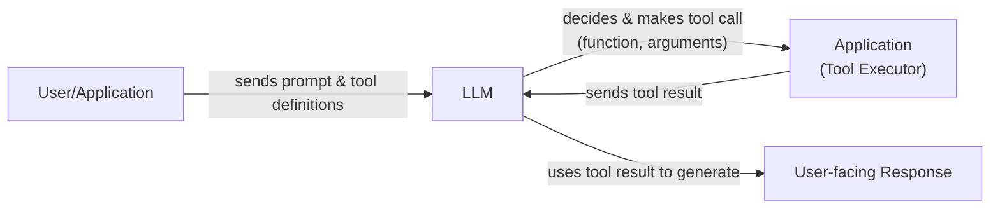
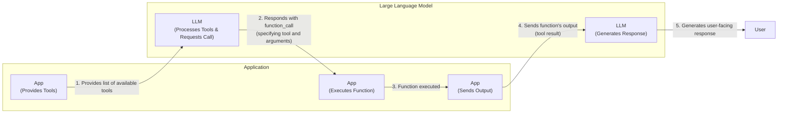
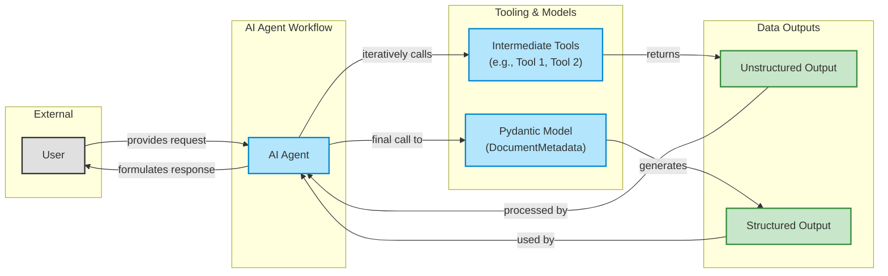
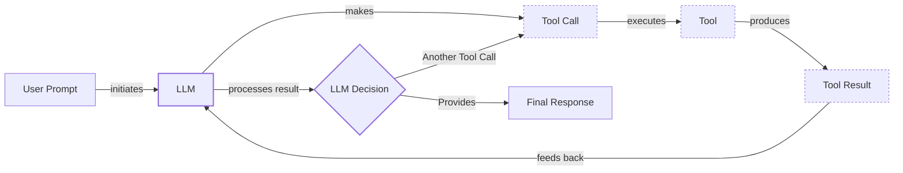

# Lesson 6: Agent Tools & Function Calling

In the last few lessons, we have built a solid foundation in AI Engineering. We started by exploring the agent landscape, learned the difference between rule-based LLM workflows and autonomous agents, and covered context engineering and structured outputs. Now, we are ready to give our agents "hands and senses" to interact with the world.

This lesson explores **Tools**, also known as **Function Calling**, one of the most critical building blocks of any AI Agent. For an AI Engineer, tools are what transform an LLM from a simple text generator into an agent that can take action in the external world. Understanding how an agent works with tools is essential for building, improving, and debugging modern AI applications. We will open this black box by implementing tool calling from scratch before showing you how to build production-ready solutions with modern APIs.

## Understanding Why Agents Need Tools

LLMs have a fundamental limitation: they are powerful pattern matchers and text generators, but they cannot perform actions or access real-time information on their own. Their knowledge is frozen at the time of training. This is where tools come in. They act as a bridge between the LLM's internal reasoning and the external world, allowing it to interact with the environment and execute specific instructions.

Think of the LLM as the brain of an operation. The tools are its "hands and senses," allowing it to perceive and act in the world beyond its textual interface. With tools, an LLM evolves into an AI agent.



Image 1: A high-level flowchart illustrating how LLM tools work, from user prompt to final response.

Modern AI agents use a wide array of tools to enhance their capabilities. Some popular examples include:

-   **Accessing real-time information:** Using APIs to get today's weather, the latest news, or stock prices [[19]].
-   **Interacting with databases:** Querying a PostgreSQL database, a Snowflake data warehouse, or an S3 data lake to retrieve specific information [[11]].
-   **Using long-term memory:** Accessing external memory stores to recall information from past interactions, a topic we will cover in Lesson 9.
-   **Executing code:** Running Python or JavaScript code to perform precise calculations, manipulate data, or create visualizations [[16]].

## Implementing Tool Calls from Scratch

The best way to understand how tools work is to build them from the ground up. In this section, we will implement a simple tool-calling mechanism to see how an LLM decides which tool to use, how it generates the correct parameters, and how we execute the corresponding function.

The process involves a five-step loop between your application and the LLM:

1.  **You:** Send the LLM a prompt that includes a list of available tools and their definitions.
2.  **LLM:** Responds with a `function_call` request, specifying the tool to use and the arguments to pass.
3.  **You:** Execute the requested function in your application code.
4.  **You:** Send the function's output back to the LLM as a tool result.
5.  **LLM:** Uses the tool's output to generate a final, user-facing response.



Image 2: A flowchart illustrating the 5-step request-execute-respond flow of calling a tool between an Application and a Large Language Model.

Let's implement this flow. We will create a simple agent that can search for documents and send summaries to a Discord channel.

<aside>
💡

You can find the code for this lesson in the accompanying [Jupyter Notebook](https://github.com/towardsai/course-ai-agents/blob/dev/lessons/06_tools/notebook.ipynb) in the course repository.

</aside>

1.  First, we set up our environment by initializing the Gemini client. We will use the `gemini-2.5-flash` model, which is fast and cost-effective. We also define a sample `DOCUMENT` to mock the content of a file we might find.

    ```python
    import json
    from typing import Any
    
    from google import genai
    from google.genai import types
    from pydantic import BaseModel, Field
    
    from lessons.utils import env
    
    env.load(required_env_vars=["GOOGLE_API_KEY"])
    
    client = genai.Client()
    
    MODEL_ID = "gemini-2.5-flash"
    
    DOCUMENT = """
    # Q3 2023 Financial Performance Analysis
    
    The Q3 earnings report shows a 20% increase in revenue and a 15% growth in user engagement, 
    beating market expectations. These impressive results reflect our successful product strategy 
    and strong market positioning.
    
    Our core business segments demonstrated remarkable resilience, with digital services leading 
    the growth at 25% year-over-year. The expansion into new markets has proven particularly 
    successful, contributing to 30% of the total revenue increase.
    
    Customer acquisition costs decreased by 10% while retention rates improved to 92%, 
    marking our best performance to date. These metrics, combined with our healthy cash flow 
    position, provide a strong foundation for continued growth into Q4 and beyond.
    """
    ```

2.  Next, we define three mock Python functions that will serve as our tools: `search_google_drive`, `send_discord_message`, and `summarize_financial_report`. To keep things simple, these functions return hardcoded data instead of interacting with real APIs.

    ```python
    def search_google_drive(query: str) -> dict:
        """
        Searches for a file on Google Drive and returns its content or a summary.
    
        Args:
            query (str): The search query to find the file, e.g., 'Q3 earnings report'.
    
        Returns:
            dict: A dictionary representing the search results, including file names and summaries.
        """
        return {
            "files": [
                {
                    "name": "Q3_Earnings_Report_2024.pdf",
                    "id": "file12345",
                    "content": DOCUMENT,
                }
            ]
        }
    ```

    ```python
    def send_discord_message(channel_id: str, message: str) -> dict:
        """
        Sends a message to a specific Discord channel.
    
        Args:
            channel_id (str): The ID of the channel to send the message to, e.g., '#finance'.
            message (str): The content of the message to send.
    
        Returns:
            dict: A dictionary confirming the action, e.g., {"status": "success"}.
        """
        return {
            "status": "success",
            "status_code": 200,
            "channel": channel_id,
            "message_preview": f"{message[:50]}...",
        }
    ```

    ```python
    def summarize_financial_report(text: str) -> str:
        """
        Summarizes a financial report.
    
        Args:
            text (str): The text to summarize.
    
        Returns:
            str: The summary of the text.
        """
        return "The Q3 2023 earnings report shows strong performance across all metrics with 20% revenue growth, 15% user engagement increase, 25% digital services growth, and improved retention rates of 92%."
    ```

3.  For the LLM to use these functions, we must provide it with a schema for each tool. The schema, typically defined in JSON, tells the model the tool's name, what it does (`description`), and what parameters it requires. This is the industry standard for modern LLM providers like OpenAI and Gemini [[35]].

    ```python
    search_google_drive_schema = {
        "name": "search_google_drive",
        "description": "Searches for a file on Google Drive and returns its content or a summary.",
        "parameters": {
            "type": "object",
            "properties": {
                "query": {
                    "type": "string",
                    "description": "The search query to find the file, e.g., 'Q3 earnings report'.",
                }
            },
            "required": ["query"],
        },
    }
    
    send_discord_message_schema = {
        "name": "send_discord_message",
        "description": "Sends a message to a specific Discord channel.",
        "parameters": {
            "type": "object",
            "properties": {
                "channel_id": {
                    "type": "string",
                    "description": "The ID of the channel to send the message to, e.g., '#finance'.",
                },
                "message": {
                    "type": "string",
                    "description": "The content of the message to send.",
                },
            },
            "required": ["channel_id", "message"],
        },
    }
    
    summarize_financial_report_schema = {
        "name": "summarize_financial_report",
        "description": "Summarizes a financial report.",
        "parameters": {
            "type": "object",
            "properties": {
                "text": {
                    "type": "string",
                    "description": "The text to summarize.",
                },
            },
            "required": ["text"],
        },
    }
    ```

4.  We then create a tool registry to map tool names to their corresponding functions (`handler`) and schemas (`declaration`).

    ```python
    TOOLS = {
        "search_google_drive": {
            "handler": search_google_drive,
            "declaration": search_google_drive_schema,
        },
        "send_discord_message": {
            "handler": send_discord_message,
            "declaration": send_discord_message_schema,
        },
        "summarize_financial_report": {
            "handler": summarize_financial_report,
            "declaration": summarize_financial_report_schema,
        },
    }
    TOOLS_BY_NAME = {tool_name: tool["handler"] for tool_name, tool in TOOLS.items()}
    TOOLS_SCHEMA = [tool["declaration"] for tool in TOOLS.values()]
    ```

    The `TOOLS_BY_NAME` mapping gives us easy access to our tool functions:

    ```text
    Tool name: search_google_drive
    Tool handler: <function search_google_drive at 0x104c7df80>
    ---------------------------------------------------------------------------
    Tool name: send_discord_message
    Tool handler: <function send_discord_message at 0x104c7de40>
    ---------------------------------------------------------------------------
    Tool name: summarize_financial_report
    Tool handler: <function summarize_financial_report at 0x1274f5c60>
    ---------------------------------------------------------------------------
    ```

    And `TOOLS_SCHEMA` holds the definitions we will pass to the LLM. Here is the schema for `search_google_drive`:

    ```json
    {
      "name": "search_google_drive",
      "description": "Searches for a file on Google Drive and returns its content or a summary.",
      "parameters": {
        "type": "object",
        "properties": {
          "query": {
            "type": "string",
            "description": "The search query to find the file, e.g., 'Q3 earnings report'."
          }
        },
        "required": [
          "query"
        ]
      }
    }
    ```

5.  Next, we create a system prompt to instruct the LLM on how to use these tools. This prompt includes guidelines on when to use tools, the exact format for a tool call, and the list of available tools.

    ```python
    TOOL_CALLING_SYSTEM_PROMPT = """
    You are a helpful AI assistant with access to tools that enable you to take actions and retrieve information to better 
    assist users.
    
    ## Tool Usage Guidelines
    
    **When to use tools:**
    - When you need information that is not in your training data
    - When you need to perform actions in external systems and environments
    - When you need real-time, dynamic, or user-specific data
    - When computational operations are required
    
    **Tool selection:**
    - Choose the most appropriate tool based on the user's specific request
    - If multiple tools could work, select the one that most directly addresses the need
    - Consider the order of operations for multi-step tasks
    
    **Parameter requirements:**
    - Provide all required parameters with accurate values
    - Use the parameter descriptions to understand expected formats and constraints
    - Ensure data types match the tool's requirements (strings, numbers, booleans, arrays)
    
    ## Tool Call Format
    
    When you need to use a tool, output ONLY the tool call in this exact format:
    
    ```tool_call
    {{"name": "tool_name", "args": {{"param1": "value1", "param2": "value2"}}}}
    ```
    
    **Critical formatting rules:**
    - Use double quotes for all JSON strings
    - Ensure the JSON is valid and properly escaped
    - Include ALL required parameters
    - Use correct data types as specified in the tool definition
    - Do not include any additional text or explanation in the tool call
    
    ## Response Behavior
    
    - If no tools are needed, respond directly to the user with helpful information
    - If tools are needed, make the tool call first, then provide context about what you're doing
    - After receiving tool results, provide a clear, user-friendly explanation of the outcome
    - If a tool call fails, explain the issue and suggest alternatives when possible
    
    ## Available Tools
    
    <tool_definitions>
    {tools}
    </tool_definitions>
    
    Remember: Your goal is to be maximally helpful to the user. Use tools when they add value, but don't use them unnecessarily. Always prioritize accuracy and user experience.
    """
    ```

    Based on the `description` field in the tool schema, the LLM *decides* whether a tool is appropriate for the user's query. This is why clear and articulate tool descriptions are so important. If you have multiple tools, their descriptions must be mutually distinguishing to avoid confusion. For example, `Tool to search documents on Google Drive` is much better than a generic `Tool to search documents` [[31]], [[61]]. This becomes crucial when scaling to dozens of tools per agent.

    Recent research frames this challenge in information-theoretic terms, suggesting that ambiguity in prompts or tool descriptions is often a "missing concept" problem. When a description is vague, the LLM lacks the necessary concepts in its latent space to resolve the ambiguity, leading to incorrect tool selection. This has been observed as a major factor for performance degradation in real-world benchmarks like Gorilla, which tests ML-oriented API calls [[41]].

    The design of tool descriptions can also be informed by concepts from human-computer interaction (HCI). Agents have different "affordances" than traditional software; they perceive possible actions based on the descriptions we provide. When writing descriptions, it helps to think of explaining the tool to a new human team member. Make implicit context explicit, such as special query formats or the definitions of niche terms, to bridge the gap between the agent's understanding and the tool's function [[51]].

    Once a tool is selected, the LLM *generates* the function name and arguments as a structured JSON output. This capability is not magic; models are specifically instruction-fine-tuned to interpret these schemas and produce valid tool calls.

6.  Let's test it. We send a user prompt along with our system prompt to the model.

    ```python
    USER_PROMPT = """
    Can you help me find the latest quarterly report and share key insights with the team?
    """
    
    messages = [TOOL_CALLING_SYSTEM_PROMPT.format(tools=str(TOOLS_SCHEMA)), USER_PROMPT]
    
    response = client.models.generate_content(
        model=MODEL_ID,
        contents=messages,
    )
    ```

    The LLM correctly identifies the `search_google_drive` tool and generates the required arguments:

    ```text
    ```tool_call
    {"name": "search_google_drive", "args": {"query": "latest quarterly report"}}
    ```
    ```

    Here is another example:

    ```python
    USER_PROMPT = """
    Please find the Q3 earnings report on Google Drive and send a summary of it to 
    the #finance channel on Discord.
    """
    
    messages = [TOOL_CALLING_SYSTEM_PROMPT.format(tools=str(TOOLS_SCHEMA)), USER_PROMPT]
    
    response = client.models.generate_content(
        model=MODEL_ID,
        contents=messages,
    )
    ```

    It outputs:

    ```text
    ```tool_call
    {"name": "search_google_drive", "args": {"query": "Q3 earnings report"}}
    ```
    ```

7.  Now, we need to parse this response and execute the tool. First, we extract the JSON string from the Markdown block.

    ```python
    def extract_tool_call(response_text: str) -> str:
        """
        Extracts the tool call from the response text.
        """
        return response_text.split("```tool_call")[1].split("```")[0].strip()
    
    
    tool_call_str = extract_tool_call(response.text)
    ```

    This gives us a clean JSON string: `{"name": "search_google_drive", "args": {"query": "Q3 earnings report"}}`.

8.  We parse the string into a Python dictionary.

    ```python
    tool_call = json.loads(tool_call_str)
    ```

    It outputs:

    ```json
    {'name': 'search_google_drive', 'args': {'query': 'Q3 earnings report'}}
    ```

9.  Next, we retrieve the correct function (the "handler") from our `TOOLS_BY_NAME` registry and call it with the arguments provided by the LLM.

    ```python
    tool_handler = TOOLS_BY_NAME[tool_call["name"]]
    tool_result = tool_handler(**tool_call["args"])
    ```

    The `tool_result` contains the mocked content of our financial document.

10. We can wrap this logic in a single `call_tool` function.

    ```python
    def call_tool(response_text: str, tools_by_name: dict) -> Any:
        """
        Call a tool based on the response from the LLM.
        """
    
        tool_call_str = extract_tool_call(response_text)
        tool_call = json.loads(tool_call_str)
        tool_name = tool_call["name"]
        tool_args = tool_call["args"]
        tool = tools_by_name[tool_name]
    
        return tool(**tool_args)
    ```

    Calling this function gives us the same result as before.

11. Finally, the tool's output is sent back to the LLM. The model uses this new information to either generate a final response for the user or decide on the next action.

    ```python
    response = client.models.generate_content(
        model=MODEL_ID,
        contents=f"Interpret the tool result: {json.dumps(tool_result, indent=2)}",
    )
    ```

    The LLM provides a helpful summary based on the document content it received from the tool. That's the essence of tool calling.

## Implementing a Small Tool Calling Framework from Scratch

Manually defining JSON schemas for every function is repetitive and error-prone. Production frameworks like LangGraph and protocols like MCP (Model Context Protocol) solve this by using a `@tool` decorator that automatically generates schemas from function signatures and docstrings. This approach follows the Don't Repeat Yourself (DRY) principle by creating a single source of truth for both the function's implementation and its schema [[26]], [[27]].

As you scale to dozens of tools, another important design pattern is **namespacing**. Grouping related tools under common prefixes (e.g., `gdrive_search`, `discord_send_message`) helps delineate functionality and reduces the chance of the agent getting confused between tools with overlapping purposes. In production systems at companies like Anthropic, this practice has been shown to have a non-trivial impact on agent performance, helping them select the right tools at the right time [[51]].

Let's build a simple version of this framework.

1.  First, we define a `ToolFunction` class to wrap our decorated functions and their schemas. We also create a `tool` decorator that inspects a function's signature and docstring to build the schema automatically.

    ```python
    from inspect import Parameter, signature
    from typing import Any, Callable, Dict, Optional
    
    
    class ToolFunction:
        def __init__(self, func: Callable, schema: Dict[str, Any]) -> None:
            self.func = func
            self.schema = schema
            self.__name__ = func.__name__
            self.__doc__ = func.__doc__
    
        def __call__(self, *args: Any, **kwargs: Any) -> Any:
            return self.func(*args, **kwargs)
    
    
    def tool(description: Optional[str] = None) -> Callable[[Callable], ToolFunction]:
        """
        A decorator that creates a tool schema from a function.
    
        Args:
            description: Optional override for the function's docstring
    
        Returns:
            A decorator function that wraps the original function and adds a schema
        """
    
        def decorator(func: Callable) -> ToolFunction:
            # Get function signature
            sig = signature(func)
    
            # Create parameters schema
            properties = {}
            required = []
    
            for param_name, param in sig.parameters.items():
                # Skip self for methods
                if param_name == "self":
                    continue
    
                param_schema = {
                    "type": "string",  # Default to string, can be enhanced with type hints
                    "description": f"The {param_name} parameter",  # Default description
                }
    
                # Add to required if parameter has no default value
                if param.default == Parameter.empty:
                    required.append(param_name)
    
                properties[param_name] = param_schema
    
            # Create the tool schema
            schema = {
                "name": func.__name__,
                "description": description or func.__doc__ or f"Executes the {func.__name__} function.",
                "parameters": {
                    "type": "object",
                    "properties": properties,
                    "required": required,
                },
            }
    
            return ToolFunction(func, schema)
    
        return decorator
    ```

2.  Now, we can redefine our tools using the new decorator. The code is much cleaner as the schema is generated automatically.

    ```python
    @tool()
    def search_google_drive_example(query: str) -> dict:
        """Search for files in Google Drive."""
        return {"files": ["Q3 earnings report"]}
    
    
    @tool()
    def send_discord_message_example(channel_id: str, message: str) -> dict:
        """Send a message to a Discord channel."""
        return {"message": "Message sent successfully"}
    
    
    @tool()
    def summarize_financial_report_example(text: str) -> str:
        """Summarize the contents of a financial report."""
        return "Financial report summarized successfully"
    ```

3.  The decorated function is now a `ToolFunction` object. It holds the schema and the original function handler.

    The schema for `search_google_drive_example` is identical to the one we defined manually:

    ```json
    {
      "name": "search_google_drive_example",
      "description": "Search for files in Google Drive.",
      "parameters": {
        "type": "object",
        "properties": {
          "query": {
            "type": "string",
            "description": "The query parameter"
          }
        },
        "required": [
          "query"
        ]
      }
    }
    ```

    And we can still access the underlying function via the `.func` attribute.

4.  We create our tool registries and call the LLM as before.

    ```python
    tools = [
        search_google_drive_example,
        send_discord_message_example,
        summarize_financial_report_example,
    ]
    tools_by_name = {tool.schema["name"]: tool.func for tool in tools}
    tools_schema = [tool.schema for tool in tools]
    
    USER_PROMPT = """
    Please find the Q3 earnings report on Google Drive and send a summary of it to 
    the #finance channel on Discord.
    """
    
    messages = [TOOL_CALLING_SYSTEM_PROMPT.format(tools=str(tools_schema)), USER_PROMPT]
    
    response = client.models.generate_content(
        model=MODEL_ID,
        contents=messages,
    )
    ```

    The model responds with a tool call, which we execute using our `call_tool` function. Voilà! We have built a small, reusable tool-calling framework.

## Implementing Production-Level Tool Calls with Gemini

While building from scratch is a great learning exercise, production systems should leverage the native tool-calling features of modern LLM APIs. Providers like Google, OpenAI, and Anthropic have optimized their models for this task, offering more robust, efficient, and maintainable solutions [[64]].

Let's refactor our implementation to use Gemini's native API. Instead of manually crafting a system prompt, we pass our tool schemas directly to the `GenerateContentConfig` object.

1.  We define the `tools` and `config` objects for the Gemini API. We set the `mode` to `"ANY"` to force the model to call a tool instead of generating a text response.

    ```python
    tools = [
        types.Tool(
            function_declarations=[
                types.FunctionDeclaration(**search_google_drive_schema),
                types.FunctionDeclaration(**send_discord_message_schema),
            ]
        )
    ]
    config = types.GenerateContentConfig(
        tools=tools,
        tool_config=types.ToolConfig(function_calling_config=types.FunctionCallingConfig(mode="ANY")),
    )
    ```

2.  We can now call the model with just the user prompt. The API handles injecting the tool definitions and instructions behind the scenes. This is more robust because the provider ensures the prompt is optimized for each specific model.

    ```python
    USER_PROMPT = """
    Please find the Q3 earnings report on Google Drive and send a summary of it to 
    the #finance channel on Discord.
    """
    response = client.models.generate_content(
        model=MODEL_ID,
        contents=USER_PROMPT,
        config=config,
    )
    ```

3.  The response contains a `function_call` object with the tool name and arguments.

    ```python
    response_message_part = response.candidates[0].content.parts[0]
    function_call = response_message_part.function_call
    ```

    It outputs:

    ```
    FunctionCall(id=None, args={'query': 'Q3 earnings report'}, name='search_google_drive')
    ```

4.  We can simplify this even further. The `google-genai` Python SDK can automatically generate the schema from a Python function’s signature, type hints, and docstring, just like our custom decorator. We can pass our functions directly to the `GenerateContentConfig` object.

    ```python
    # This feature is not explicitly in the notebook but is standard SDK practice
    from google.genai import types
    config = types.GenerateContentConfig(
        tools=[search_google_drive, send_discord_message]
    )
    ```

5.  We create a simplified `call_tool` function to execute the native `FunctionCall` object.

    ```python
    def call_tool(function_call) -> Any:
        tool_name = function_call.name
        tool_args = {key: value for key, value in function_call.args.items()}
    
        tool_handler = TOOLS_BY_NAME[tool_name]
    
        return tool_handler(**tool_args)
    
    
    tool_result = call_tool(function_call)
    ```

By leveraging the native SDK, we reduced dozens of lines of manual prompting and schema definition to just a few lines of configuration. This approach is not unique to Gemini; other popular APIs from providers like OpenAI and Anthropic follow a similar logic, making these concepts easily transferable [[67]].

## Using Pydantic Models as Tools for On-Demand Structured Outputs

Connecting this lesson with what we learned about structured outputs in Lesson 4, we can use a Pydantic model *as a tool*. This is a powerful pattern for agentic workflows where you might perform several intermediate steps that produce unstructured text (which is easy for an LLM to reason about) but require a final, validated, structured output for downstream processing [[5]].

This approach combines the flexibility of tool-based reasoning with the reliability of Pydantic's data validation. The agent can call various informational tools in a loop and then, when it has gathered enough context, call the Pydantic "tool" to structure its final answer.



Image 3: A flowchart illustrating an AI agent's workflow where it calls multiple tools in a loop, processing unstructured outputs before generating structured output via a Pydantic model and formulating a final response.

Let's see how to implement this.

1.  First, we define our `DocumentMetadata` Pydantic model, just as we did in Lesson 4.

    ```python
    class DocumentMetadata(BaseModel):
        """A class to hold structured metadata for a document."""
    
        summary: str = Field(description="A concise, 1-2 sentence summary of the document.")
        tags: list[str] = Field(description="A list of 3-5 high-level tags relevant to the document.")
        keywords: list[str] = Field(description="A list of specific keywords or concepts mentioned.")
        quarter: str = Field(description="The quarter of the financial year described in the document (e.g., Q3 2023).")
        growth_rate: str = Field(description="The growth rate of the company described in the document (e.g., 10%).")
    ```

2.  We then create a tool declaration named `extract_metadata`. Instead of defining parameters manually, we pass the Pydantic model's JSON schema directly using `DocumentMetadata.model_json_schema()`.

    ```python
    extraction_tool = types.Tool(
        function_declarations=[
            types.FunctionDeclaration(
                name="extract_metadata",
                description="Extracts structured metadata from a financial document.",
                parameters=DocumentMetadata.model_json_schema(),
            )
        ]
    )
    config = types.GenerateContentConfig(
        tools=[extraction_tool],
        tool_config=types.ToolConfig(function_calling_config=types.FunctionCallingConfig(mode="ANY")),
    )
    ```

3.  We prompt the model to analyze our document.

    ```python
    prompt = f"""
    Please analyze the following document and extract its metadata.
    
    Document:
    --- 
    {DOCUMENT}
    --- 
    """
    
    response = client.models.generate_content(model=MODEL_ID, contents=prompt, config=config)
    ```

4.  The model responds with a `function_call` to our `extract_metadata` tool, with the arguments populated according to the Pydantic schema. We can then validate these arguments to create a `DocumentMetadata` object.

    ```python
    response_message_part = response.candidates[0].content.parts[0]
    
    if hasattr(response_message_part, "function_call"):
        function_call = response_message_part.function_call
    
        try:
            document_metadata = DocumentMetadata(**function_call.args)
            print("Validation successful!")
        except Exception as e:
            print(f"Validation failed: {e}")
    ```

    The output confirms that the data was successfully validated and parsed into our Pydantic model, creating a reliable, type-safe object for use in the rest of our application.

## The Downsides of Running Tools in a Loop

So far, we have focused on single-turn interactions. The next logical step is to build agents that can perform multi-step tasks by calling tools in a loop. This allows the agent to chain actions, using the output of one tool to inform the input of the next. This is the final piece of the puzzle we need to build a real AI agent.



Image 4: A flowchart illustrating a generic tool calling loop.

This looping capability gives agents flexibility and adaptability. However, a simple sequential loop has significant limitations.

Let's implement a multi-step task: find a report on Google Drive, summarize it, and send the summary to Discord.

1.  We configure the model with all three of our tools.

    ```python
    tools = [
        types.Tool(
            function_declarations=[
                types.FunctionDeclaration(**search_google_drive_schema),
                types.FunctionDeclaration(**send_discord_message_schema),
                types.FunctionDeclaration(**summarize_financial_report_schema),
            ]
        )
    ]
    config = types.GenerateContentConfig(
        tools=tools,
        tool_config=types.ToolConfig(function_calling_config=types.FunctionCallingConfig(mode="ANY")),
    )
    ```

2.  We give the agent a multi-step prompt and initialize a message history.

    ```python
    USER_PROMPT = """
    Please find the Q3 earnings report on Google Drive and send a summary of it to 
    the #finance channel on Discord.
    """
    
    messages = [USER_PROMPT]
    ```

3.  We run a `while` loop. In each iteration, the agent calls a tool, we execute it, and we add both the tool call and its result to the message history before the next LLM call.

    ```python
    # Initial LLM call
    response = client.models.generate_content(
        model=MODEL_ID,
        contents=messages,
        config=config,
    )
    response_message_part = response.candidates[0].content.parts[0]
    messages.append(response.candidates[0].content)
    
    # Loop until the model stops requesting function calls
    max_iterations = 3
    while hasattr(response_message_part, "function_call") and max_iterations > 0:
        tool_result = call_tool(response_message_part.function_call)
    
        function_response_part = types.Part.from_function_response(
            name=response_message_part.function_call.name,
            response={"result": tool_result},
        )
        messages.append(function_response_part)
    
        # Ask the LLM to continue with the next step
        response = client.models.generate_content(
            model=MODEL_ID,
            contents=messages,
            config=config,
        )
    
        response_message_part = response.candidates[0].content.parts[0]
        messages.append(response.candidates[0].content)
        max_iterations -= 1
    ```

The agent successfully executes the sequence: `search_google_drive`, then `summarize_financial_report`, and finally `send_discord_message`.

However, this simple loop has major flaws [[9]]. It provides no opportunity for the LLM to *reason* about a tool's output before deciding on the next action. This can lead to documented failure modes observed in agentic systems. For instance, agents can suffer from "iteration anomalies," where flawed reasoning leads to getting stuck in repetitive, non-progressive loops without any self-correction [[45]]. They might also misinterpret feedback from a tool, leading to "reproduction output misreading," or suffer from "context pollution" as the message history gets filled with irrelevant tool outputs, degrading coherence over long tasks [[45]], [[46]]. For tasks where tools are independent, they could be run in parallel to reduce latency, but this loop doesn't support that [[34]].

These limitations motivated the development of more sophisticated agentic patterns like **ReAct** (Reason + Act), which explicitly interleaves reasoning steps with tool calls. We will explore the theory behind ReAct in Lesson 7 and implement it from scratch in Lesson 8.

## Popular Tools Used Within the Industry

To ground this lesson in the real world, let's explore some of the most common categories of tools that power production AI agents.

When building for production, it is tempting to create a tool for every available API endpoint. However, more tools do not always lead to better outcomes. Effective tool design involves creating a few thoughtful tools that target high-impact workflows, rather than a large number of low-level wrappers. Often, the best tools consolidate multiple discrete operations. For example, instead of separate `list_users`, `list_events`, and `create_event` tools, a single `schedule_event` tool that finds availability and schedules the meeting is more "ergonomic" for an agent, as it mirrors how a human would approach the task [[51]].

### Knowledge & Memory Access

These tools connect agents to external knowledge sources, overcoming the limitations of their training data. This includes querying vector databases for semantic search, document stores for raw text retrieval, or graph databases like Neo4j to understand relationships between data points [[11]]. A popular pattern in this category is text-to-SQL, where the LLM generates SQL queries to interact with traditional relational databases, effectively giving the agent access to structured business data [[13]]. These tools are fundamental to memory and Retrieval-Augmented Generation (RAG), which we will cover in Lessons 9 and 10.

### Web Search & Browsing

This category includes tools that interface with search engine APIs like Google Search or Brave Search, as well as web scraping tools that can fetch and parse content directly from web pages [[16]]. These are essential for any agent that needs access to real-time, public information, making them a staple in chatbots and research assistants.

### Code Execution

Tools that provide a code interpreter, typically a sandboxed Python environment, allow an agent to write and execute code. This is invaluable for tasks requiring precise calculations, data manipulation, statistical analysis, or creating data visualizations [[18]]. While Python is the most common, this pattern can be adapted for other languages like JavaScript.

### Other Popular Tools

Beyond data and code, agents use tools to interact with a vast ecosystem of external APIs. This includes productivity tools for managing calendars, sending emails, or creating tasks in project management software. Other tools allow for file system operations like reading and writing local files. These integrations are common in enterprise AI applications and productivity assistants that need to interact with a user's digital environment [[19]].

## Conclusion

Tool calling is a foundational skill for any AI Engineer. It is what elevates an LLM from a passive text generator to an active agent capable of interacting with the world. By understanding the mechanics of how tools are defined, selected, and executed, you gain the ability to build, monitor, and debug powerful AI applications.

We have seen how to implement tool calling from scratch, how to use decorators to build a simple framework, and how to leverage the native capabilities of modern APIs like Gemini for production-grade systems. We also touched on the limitations of simple tool loops, which sets the stage for our next topic. In Lesson 7, we will dive into the theory behind planning and reasoning with patterns like ReAct, which allow agents to think more deliberately about how and when to use their tools.

## References

- [5] Pydantic. (n.d.). Output. Pydantic AI Docs. [https://pydantic.dev/docs/ai/core-concepts/output/](https://pydantic.dev/docs/ai/core-concepts/output/)
- [9] myengineeringpath.dev. (n.d.). Agentic Design Patterns — Visual Architecture Guide. [https://myengineeringpath.dev/genai-engineer/agentic-patterns/](https://myengineeringpath.dev/genai-engineer/agentic-patterns/)
- [11] Knight, R., & Bittencourt, G. (2026, April 16). Connected Context and Persistent Memory: Neo4j Providers for the Microsoft Agent Framework. Neo4j. [https://neo4j.com/blog/agentic-ai/connected-context-and-persistent-memory-neo4j-providers-for-the-microsoft-agent-framework/](https://neo4j.com/blog/agentic-ai/connected-context-and-persistent-memory-neo4j-providers-for-the-microsoft-agent-framework/)
- [13] Promethium. (n.d.). Text-to-SQL: The Basics, Benefits, and How It Works. [https://promethium.ai/guides/text-to-sql-basics-benefits/](https://promethium.ai/guides/text-to-sql-basics-benefits/)
- [16] Gao, Y., et al. (2024). Efficient Tool Use with Chain-of-Abstraction Reasoning. arXiv. [https://arxiv.org/html/2507.08034v1](https://arxiv.org/html/2507.08034v1)
- [18] Manesh, A. (2024, May 22). How LLM Reasoning Powers the Agentic AI Revolution. Medium. [https://medium.com/@anicomanesh/how-llm-reasoning-powers-the-agentic-ai-revolution-cbefd10ebf3f](https://medium.com/@anicomanesh/how-llm-reasoning-powers-the-agentic-ai-revolution-cbefd10ebf3f)
- [19] Linu, D. (2023). The Power of APIs in Large Language Models. LNU. [https://lnu.diva-portal.org/smash/get/diva2:1801354/FULLTEXT01.pdf](https://lnu.diva-portal.org/smash/get/diva2:1801354/FULLTEXT01.pdf)
- [26] OpenAI. (n.d.). Tools. OpenAI Agents SDK. [https://openai.github.io/openai-agents-python/tools/](https://openai.github.io/openai-agents-python/tools/)
- [27] Strands. (n.d.). Custom Tools. Strands Agents. [https://strandsagents.com/docs/user-guide/concepts/tools/custom-tools/](https://strandsagents.com/docs/user-guide/concepts/tools/custom-tools/)
- [31] Composio. (n.d.). How to Build Tools for AI Agents: A Field Guide. [https://composio.dev/blog/how-to-build-tools-for-ai-agents-a-field-guide](https://composio.dev/blog/how-to-build-tools-for-ai-agents-a-field-guide)
- [34] Lardinois, F. (2024, May 14). Anthropic vs. OpenAI: A Comparison. Lil' Big Things. [https://www.lilbigthings.com/post/anthropic-vs-openai](https://www.lilbigthings.com/post/anthropic-vs-openai)
- [35] is4.ai. (n.d.). OpenAI API vs. Anthropic API Comparison. [https://is4.ai/blog/our-blog-1/openai-api-vs-anthropic-api-comparison-117](https://is4.ai/blog/our-blog-1/openai-api-vs-anthropic-api-comparison-117)
- [41] Hu, Z., et al. (2025). Ambiguity in LLMs is a concept missing problem. arXiv. [https://arxiv.org/html/2505.11679v2](https://arxiv.org/html/2505.11679v2)
- [45] Li, Z., et al. (2025). Can Your Agent Solve This? An Empirical Study on the Failures of Automated Issue Solving. arXiv. [https://arxiv.org/html/2509.13941v1](https://arxiv.org/html/2509.13941v1)
- [46] Kamiwaza. (n.d.). How do LLMs fail in agentic scenarios? Kamiwaza AI Docs. [https://docs.kamiwaza.ai/assets/files/How_do_LLMs_fail_in_agentic_scenarios-eff27cdb81518717588e1fcdee00aec4.pdf](https://docs.kamiwaza.ai/assets/files/How_do_LLMs_fail_in_agentic_scenarios-eff27cdb81518717588e1fcdee00aec4.pdf)
- [51] Aizawa, K. (2025). Writing effective tools for agents — with agents. Anthropic. [https://www.anthropic.com/engineering/writing-tools-for-agents](https://www.anthropic.com/engineering/writing-tools-for-agents)
- [61] Brenndoerfer, M. (n.d.). Function Calling & Structured Tools for LLMs. [https://mbrenndoerfer.com/writing/function-calling-llm-structured-tools](https://mbrenndoerfer.com/writing/function-calling-llm-structured-tools)
- [64] Iusztin, P. (2024). Tool Calling: From Scratch to Production. Decoding AI. [https://www.decodingai.com/p/tool-calling-from-scratch-to-production](https://www.decodingai.com/p/tool-calling-from-scratch-to-production)
- [67] myengineeringpath.dev. (n.d.). Google Gemini Guide. [https://myengineeringpath.dev/tools/gemini-guide/](https://myengineeringpath.dev/tools/gemini-guide/)