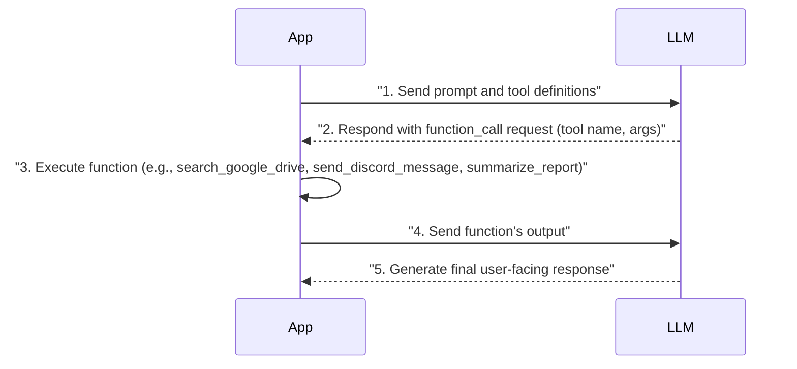
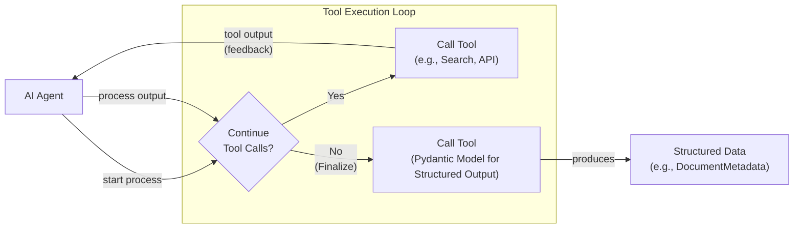
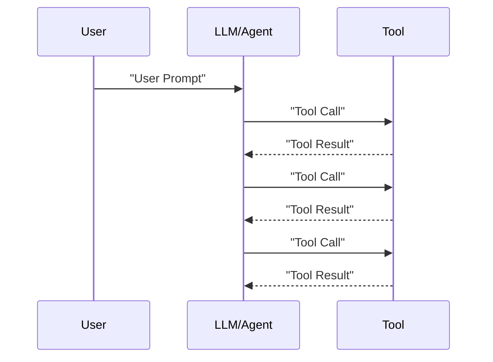

# Lesson 6: Agent Tools & Function Calling

In the last few lessons, we have built a solid foundation in AI Engineering. We started by exploring the agent landscape, distinguished between rule-based LLM workflows and autonomous agents, and delved into context engineering. We also learned how to get reliable, structured outputs from LLMs. Now, we will give our LLMs the ability to interact with the world.

This lesson is about tools, also known as function calling. Tools are what transform an LLM from a simple text generator into an agent that can take action. They are the "hands and senses" of an AI, allowing it to retrieve information, interact with software, and affect its environment. Understanding how an agent uses tools is one of an AI engineer's most critical skills. It is the key to building, debugging, and monitoring robust AI applications.

We will start by explaining why agents need tools and then build a tool-calling system from scratch to see how it works under the hood. We will then show you how to implement the same logic using Gemini's native API for production-ready systems. We will also cover advanced patterns like using Pydantic models for on-demand structured data, running tools in loops, and finally, we will discuss the limitations that lead to more advanced agentic patterns.

## Understanding Why Agents Need Tools

LLMs have a fundamental limitation: they are pattern matchers and text generators. They are trained on vast datasets and can produce human-like text, but they cannot perform actions or access real-time information on their own. An LLM is like a brain in a jar. It can think, but it cannot interact with the world. This is where tools come in.

Tools are the bridge between an LLM's internal reasoning and the external world. You can think of the LLM as the agent's brain, while tools are its "hands and senses." They allow the agent to perceive and act in the world beyond its textual interface. With tools, an LLM becomes an AI agent capable of executing specific instructions and interacting with its environment [[1]](https://www.youtube.com/watch?v=h8gMhXYAv1k).

This capability unlocks a wide range of applications. Modern AI agents use tools to:
- Access real-time information through APIs (e.g., today's weather, latest news).
- Interact with external databases or other storage solutions (e.g., PostgreSQL, Snowflake, S3).
- Access the agent's long-term memory to remember information beyond their context window.
- Execute code (e.g., Python, JavaScript) for precise calculations or data manipulation.

Essentially, any function your application can perform can be exposed to an LLM as a tool, expanding its capabilities [[2]](https://www.deeplearning.ai/the-batch/agentic-design-patterns-part-3-tool-use/). The model doesn't execute the code itself; instead, it generates a structured request, like a JSON object, that specifies which function to call and with what arguments. Your application then receives this request, runs the corresponding code, and sends the result back to the model. This loop allows the LLM to leverage external functionalities to fulfill user requests that would otherwise be impossible.

## Implementing Tool Calls from Scratch

The best way to understand how tools work is to implement them from scratch. We will build a simple system where we provide an LLM with a list of available tools and let it decide which one to use and what arguments to pass. This will give you a clear picture of how the LLM discovers available tools, decides which one to call, and generates the necessary parameters.

The process of calling a tool involves a five-step-flow between our application and the LLM [[3]](https://platform.openai.com/docs/guides/function-calling):

1.  **You:** Send the LLM a prompt and a list of available tools with their definitions.
2.  **LLM:** Responds with a `function_call` request, specifying the tool name and the arguments.
3.  **You:** Execute the requested function in your code.
4.  **You:** Send the function's output back to the LLM.
5.  **LLM:** Uses the tool's output to generate a final, user-facing response.

This request-execute-respond cycle is the core of tool use, as illustrated in Image 1.



Image 1: A sequence diagram illustrating the 5-step request-execute-respond flow of calling a tool from scratch.

Let's implement this flow. We will create a simple agent that can search for a financial report on Google Drive and send a summary to a Discord channel.

<aside>
💡

You can find all the code for this lesson in the accompanying [Jupyter Notebook](https://github.com/towardsai/course-ai-agents/blob/dev/lessons/06_tools/notebook.ipynb).

</aside>

1.  First, we set up our environment by initializing the Gemini client and defining our model and a mock document. We will use `gemini-2.5-flash`, which is fast, cost-effective, and supports tool use.

    ```python
    import json
    from typing import Any

    from google import genai
    from google.genai import types
    from pydantic import BaseModel, Field

    from lessons.utils import env, pretty_print

    env.load(required_env_vars=["GOOGLE_API_KEY"])

    client = genai.Client()
    MODEL_ID = "gemini-2.5-flash"

    DOCUMENT = """
    # Q3 2023 Financial Performance Analysis

    The Q3 earnings report shows a 20% increase in revenue and a 15% growth in user engagement, 
    beating market expectations. These impressive results reflect our successful product strategy 
    and strong market positioning.

    Our core business segments demonstrated remarkable resilience, with digital services leading 
    the growth at 25% year-over-year. The expansion into new markets has proven particularly 
    successful, contributing to 30% of the total revenue increase.

    Customer acquisition costs decreased by 10% while retention rates improved to 92%, 
    marking our best performance to date. These metrics, combined with our healthy cash flow 
    position, provide a strong foundation for continued growth into Q4 and beyond.
    """
    ```

2.  Next, we define three mock functions to simulate our tools. The function signatures and docstrings are important, as the LLM uses them to understand what each tool does.

    ```python
    def search_google_drive(query: str) -> dict:
        """
        Searches for a file on Google Drive and returns its content or a summary.

        Args:
            query (str): The search query to find the file, e.g., 'Q3 earnings report'.

        Returns:
            dict: A dictionary representing the search results, including file names and summaries.
        """
        return {
            "files": [
                {
                    "name": "Q3_Earnings_Report_2024.pdf",
                    "id": "file12345",
                    "content": DOCUMENT,
                }
            ]
        }
    ```

    ```python
    def send_discord_message(channel_id: str, message: str) -> dict:
        """
        Sends a message to a specific Discord channel.

        Args:
            channel_id (str): The ID of the channel to send the message to, e.g., '#finance'.
            message (str): The content of the message to send.

        Returns:
            dict: A dictionary confirming the action, e.g., {"status": "success"}.
        """
        return {
            "status": "success",
            "status_code": 200,
            "channel": channel_id,
            "message_preview": f"{message[:50]}...",
        }
    ```

    ```python
    def summarize_financial_report(text: str) -> str:
        """
        Summarizes a financial report.

        Args:
            text (str): The text to summarize.

        Returns:
            str: The summary of the text.
        """
        return "The Q3 2023 earnings report shows strong performance across all metrics with 20% revenue growth, 15% user engagement increase, 25% digital services growth, and improved retention rates of 92%."
    ```

3.  We then define a JSON schema for each tool. This schema tells the LLM what the tool does (`description`), what parameters it accepts (`parameters`), their types, and which are required. This format is an industry standard used by major providers like OpenAI and Google [[3]](https://platform.openai.com/docs/guides/function-calling), [[4]](https://ai.google.dev/gemini-api/docs/function-calling).

    ```python
    search_google_drive_schema = {
        "name": "search_google_drive",
        "description": "Searches for a file on Google Drive and returns its content or a summary.",
        "parameters": {
            "type": "object",
            "properties": {
                "query": {
                    "type": "string",
                    "description": "The search query to find the file, e.g., 'Q3 earnings report'.",
                }
            },
            "required": ["query"],
        },
    }
    ```

    ```python
    send_discord_message_schema = {
        "name": "send_discord_message",
        "description": "Sends a message to a specific Discord channel.",
        "parameters": {
            "type": "object",
            "properties": {
                "channel_id": {
                    "type": "string",
                    "description": "The ID of the channel to send the message to, e.g., '#finance'.",
                },
                "message": {
                    "type": "string",
                    "description": "The content of the message to send.",
                },
            },
            "required": ["channel_id", "message"],
        },
    }
    ```

    ```python
    summarize_financial_report_schema = {
        "name": "summarize_financial_report",
        "description": "Summarizes a financial report.",
        "parameters": {
            "type": "object",
            "properties": {
                "text": {
                    "type": "string",
                    "description": "The text to summarize.",
                },
            },
            "required": ["text"],
        },
    }
    ```

4.  We create a tool registry to map tool names to their handlers and schemas.

    ```python
    TOOLS = {
        "search_google_drive": {
            "handler": search_google_drive,
            "declaration": search_google_drive_schema,
        },
        "send_discord_message": {
            "handler": send_discord_message,
            "declaration": send_discord_message_schema,
        },
        "summarize_financial_report": {
            "handler": summarize_financial_report,
            "declaration": summarize_financial_report_schema,
        },
    }
    TOOLS_BY_NAME = {tool_name: tool["handler"] for tool_name, tool in TOOLS.items()}
    TOOLS_SCHEMA = [tool["declaration"] for tool in TOOLS.values()]
    ```

5.  The `TOOLS_BY_NAME` mapping looks like this:

    ```text
    Tool name: search_google_drive
    Tool handler: <function search_google_drive at 0x104c7df80>
    ---------------------------------------------------------------------------
    Tool name: send_discord_message
    Tool handler: <function send_discord_message at 0x104c7de40>
    ---------------------------------------------------------------------------
    Tool name: summarize_financial_report
    Tool handler: <function summarize_financial_report at 0x1274f5c60>
    ---------------------------------------------------------------------------
    ```

6.  Here is an example schema from `TOOLS_SCHEMA` for our `search_google_drive` tool:

    ```text
    {
      "name": "search_google_drive",
      "description": "Searches for a file on Google Drive and returns its content or a summary.",
      "parameters": {
        "type": "object",
        "properties": {
          "query": {
            "type": "string",
            "description": "The search query to find the file, e.g., 'Q3 earnings report'."
          }
        },
        "required": [
          "query"
        ]
      }
    }
    ```

7.  Now, we create a system prompt to instruct the LLM on how to use these tools. This prompt includes guidelines, the expected output format, and the list of available tool schemas.

    ```python
    TOOL_CALLING_SYSTEM_PROMPT = """
    You are a helpful AI assistant with access to tools that enable you to take actions and retrieve information to better 
    assist users.

    ## Tool Usage Guidelines

    **When to use tools:**
    - When you need information that is not in your training data
    - When you need to perform actions in external systems and environments
    - When you need real-time, dynamic, or user-specific data
    - When computational operations are required

    ## Tool selection:**
    - Choose the most appropriate tool based on the user's specific request
    - If multiple tools could work, select the one that most directly addresses the need
    - Consider the order of operations for multi-step tasks

    ## Parameter requirements:**
    - Provide all required parameters with accurate values
    - Use the parameter descriptions to understand expected formats and constraints
    - Ensure data types match the tool's requirements (strings, numbers, booleans, arrays)

    ## Tool Call Format

    When you need to use a tool, output ONLY the tool call in this exact format:

    <tool_call>
    {{"name": "tool_name", "args": {{"param1": "value1", "param2": "value2"}}}}
    </tool_call>

    **Critical formatting rules:**
    - Use double quotes for all JSON strings
    - Ensure the JSON is valid and properly escaped
    - Include ALL required parameters
    - Use correct data types as specified in the tool definition
    - Do not include any additional text or explanation in the tool call

    ## Response Behavior

    - If no tools are needed, respond directly to the user with helpful information
    - If tools are needed, make the tool call first, then provide context about what you're doing
    - After receiving tool results, provide a clear, user-friendly explanation of the outcome
    - If a tool call fails, explain the issue and suggest alternatives when possible

    ## Available Tools

    <tool_definitions>
    {tools}
    </tool_definitions>

    Remember: Your goal is to be maximally helpful to the user. Use tools when they add value, but don't use them unnecessarily. Always prioritize accuracy and user experience.
    """
    ```

8.  The LLM's decision-making process for tool calling relies heavily on the quality of the information you provide. Based on the `description` field in the tool schema, the LLM *decides* if a tool is appropriate for the user's query [[5]](https://www.anthropic.com/research/building-effective-agents). This is why clear and articulate tool descriptions are essential for building successful AI agents. When multiple tools are available, their descriptions must be distinct to avoid confusion. For instance, two tools described as `Tool used to search documents` and `Tool used to search files` would likely confuse the LLM. It is better to be explicit: `Tool used to search documents on Google Drive` and `Tool used to search files on the disk`.

    This becomes even more important as you scale to dozens or even hundreds of tools. By providing clear tool descriptions and explicit system prompts (e.g., `search documents on Google Drive` instead of just `search documents`), you guide the agent to make the correct choice. Once a tool is selected, the LLM *generates* the function name and arguments as a structured output, like JSON. This entire process is possible because modern LLMs are specifically instruction-tuned to interpret tool schemas and produce valid tool calls [[6]](https://mbrenndoerfer.com/writing/function-calling-llm-structured-tools).

9.  Let's test it. We send a user prompt along with our system prompt to the model.

    ```python
    USER_PROMPT = """
    Can you help me find the latest quarterly report and share key insights with the team?
    """

    messages = [TOOL_CALLING_SYSTEM_PROMPT.format(tools=str(TOOLS_SCHEMA)), USER_PROMPT]

    response = client.models.generate_content(
        model=MODEL_ID,
        contents=messages,
    )
    ```

10. The LLM correctly identifies the `search_google_drive` tool and generates the required arguments.

    ```text
    <tool_call>
    {"name": "search_google_drive", "args": {"query": "latest quarterly report"}}
    </tool_call>
    ```

11. Let's try a more complex query that requires multiple steps.

    ```python
    USER_PROMPT = """
    Please find the Q3 earnings report on Google Drive and send a summary of it to 
    the #finance channel on Discord.
    """

    messages = [TOOL_CALLING_SYSTEM_PROMPT.format(tools=str(TOOLS_SCHEMA)), USER_PROMPT]

    response = client.models.generate_content(
        model=MODEL_ID,
        contents=messages,
    )
    ```

12. The model correctly identifies the first step: searching for the report.

    ```text
    <tool_call>
    {"name": "search_google_drive", "args": {"query": "Q3 earnings report"}}
    </tool_call>
    ```

13. Now, let's parse the LLM's response. We start by extracting the JSON string.

    ```python
    def extract_tool_call(response_text: str) -> str:
        """
        Extracts the tool call from the response text.
        """
        return response_text.split("<tool_call>")[1].split("</tool_call>")[0].strip()

    tool_call_str = extract_tool_call(response.text)
    ```

14. We then parse the string into a Python dictionary.

    ```python
    tool_call = json.loads(tool_call_str)
    ```

15. Next, we retrieve the correct function handler from our `TOOLS_BY_NAME` registry.

    ```python
    tool_handler = TOOLS_BY_NAME[tool_call["name"]]
    ```

16. The `tool_handler` is a direct reference to our Python function.

    ```text
    <function __main__.search_google_drive(query: str) -> dict>
    ```

17. We can now execute the tool by calling the function with the arguments provided by the LLM.

    ```python
    tool_result = tool_handler(**tool_call["args"])
    ```

18. The tool returns the content of the financial report.

    ```text
    {
      "files": [
        {
          "name": "Q3_Earnings_Report_2024.pdf",
          "id": "file12345",
          "content": "\n# Q3 2023 Financial Performance Analysis\n\nThe Q3 earnings report shows a 20% increase in revenue and a 15% growth in user engagement, \nbeating market expectations..."
        }
      ]
    }
    ```

19. We can wrap these steps into a single `call_tool` function for convenience.

    ```python
    def call_tool(response_text: str, tools_by_name: dict) -> Any:
        """
        Call a tool based on the response from the LLM.
        """
        tool_call_str = extract_tool_call(response_text)
        tool_call = json.loads(tool_call_str)
        tool_name = tool_call["name"]
        tool_args = tool_call["args"]
        tool = tools_by_name[tool_name]

        return tool(**tool_args)
    ```

20. Using this function gives us the same result as before.

    ```python
    call_tool(response.text, tools_by_name=TOOLS_BY_NAME)
    ```

21. The final step in the cycle is to send the tool's output back to the LLM. This allows the model to interpret the result and decide on the next action or formulate a final response for the user.

    ```python
    response = client.models.generate_content(
        model=MODEL_ID,
        contents=f"Interpret the tool result: {json.dumps(tool_result, indent=2)}",
    )
    ```

22. The LLM provides a user-friendly summary of the tool's output.

    ```text
    The tool result provides the content of a file named `Q3_Earnings_Report_2024.pdf`.

    This document is a **Q3 2023 Financial Performance Analysis** and details exceptionally strong results, significantly beating market expectations.

    **Key highlights from the report include:**

    *   **Revenue Growth:** A 20% increase in revenue.
    *   **User Engagement:** 15% growth in user engagement.
    *   **Core Business Performance:** Digital services led growth at 25% year-over-year.
    *   **Market Expansion Success:** New markets contributed 30% of the total revenue increase.
    *   **Efficiency & Retention:**
        *   Customer acquisition costs decreased by 10%.
        *   Retention rates improved to 92%, marking the best performance to date.
    *   **Financial Health:** The company maintains a healthy cash flow position.

    The report attributes these impressive results to a successful product strategy and strong market positioning, indicating a robust foundation for continued growth into Q4 and beyond.
    ```

This covers the basic concept of tool calling. By implementing it from scratch, you can see exactly how an LLM interacts with external functions to perform actions.

## Implementing a Small Tool Calling Framework from Scratch

Manually defining JSON schemas for every tool is tedious and error-prone. Modern AI agent frameworks like LangGraph and protocols like MCP (Model Context Protocol) solve this by using a `@tool` decorator to automatically generate and register schemas from Python functions [[7]](https://www.newsletter.swirlai.com/p/building-ai-agents-from-scratch-part).

Let's build a simple version of this framework. Our goal is to create a `@tool` decorator that inspects a function's signature and docstring to generate its schema automatically. This approach follows the Don't Repeat Yourself (DRY) principle by creating a single source of truth for both the function's implementation and its definition for the LLM [[8]](https://openai.github.io/openai-agents-python/tools/), [[9]](https://docs.langchain.com/oss/python/langchain/tools). This makes the code more maintainable and less prone to inconsistencies between the function and its schema.

1.  First, we define a `ToolFunction` class to wrap our decorated functions and hold their schemas. This class will act as a container, holding both the callable function and its machine-readable schema.

    ```python
    from inspect import Parameter, signature
    from typing import Any, Callable, Dict, Optional

    class ToolFunction:
        def __init__(self, func: Callable, schema: Dict[str, Any]) -> None:
            self.func = func
            self.schema = schema
            self.__name__ = func.__name__
            self.__doc__ = func.__doc__

        def __call__(self, *args: Any, **kwargs: Any) -> Any:
            return self.func(*args, **kwargs)
    ```

2.  Next, we define the `tool` decorator. It inspects the function's signature to build the `parameters` schema, using the function name and docstring for the `name` and `description`. This process, known as introspection, allows our framework to dynamically understand the structure of any function it decorates.

    ```python
    def tool(description: Optional[str] = None) -> Callable[[Callable], ToolFunction]:
        """
        A decorator that creates a tool schema from a function.

        Args:
            description: Optional override for the function's docstring

        Returns:
            A decorator function that wraps the original function and adds a schema
        """
        def decorator(func: Callable) -> ToolFunction:
            sig = signature(func)
            properties = {}
            required = []

            for param_name, param in sig.parameters.items():
                if param_name == "self":
                    continue

                param_schema = {
                    "type": "string",
                    "description": f"The {param_name} parameter",
                }

                if param.default == Parameter.empty:
                    required.append(param_name)

                properties[param_name] = param_schema

            schema = {
                "name": func.__name__,
                "description": description or func.__doc__ or f"Executes the {func.__name__} function.",
                "parameters": {
                    "type": "object",
                    "properties": properties,
                    "required": required,
                },
            }
            return ToolFunction(func, schema)
        return decorator
    ```

3.  Now, we can redefine our tools using the new decorator. The code is much cleaner without the manual schema definitions.

    ```python
    @tool()
    def search_google_drive_example(query: str) -> dict:
        """Search for files in Google Drive."""
        return {"files": ["Q3 earnings report"]}

    @tool()
    def send_discord_message_example(channel_id: str, message: str) -> dict:
        """Send a message to a Discord channel."""
        return {"message": "Message sent successfully"}

    @tool()
    def summarize_financial_report_example(text: str) -> str:
        """Summarize the contents of a financial report."""
        return "Financial report summarized successfully"
    ```

4.  We gather the decorated functions into a list.

    ```python
    tools = [
        search_google_drive_example,
        send_discord_message_example,
        summarize_financial_report_example,
    ]
    ```

5.  Each decorated function is now a `ToolFunction` object. Let's inspect the first one. Its type is `ToolFunction`, and it contains both the generated `schema` and the original function handler.

    ```text
    Type: <class '__main__.ToolFunction'>
    Schema: {
        "name": "search_google_drive_example",
        "description": "Search for files in Google Drive.",
        "parameters": {
            "type": "object",
            "properties": {
                "query": {
                    "type": "string",
                    "description": "The query parameter"
                }
            },
            "required": ["query"]
        }
    }
    Handler: <function search_google_drive_example at 0x...>
    ```

6.  We create our `tools_by_name` and `tools_schema` mappings as before.

    ```python
    tools_by_name = {tool.schema["name"]: tool.func for tool in tools}
    tools_schema = [tool.schema for tool in tools]
    ```

7.  Let's test our new framework with the same multi-step prompt.

    ```python
    USER_PROMPT = """
    Please find the Q3 earnings report on Google Drive and send a summary of it to 
    the #finance channel on Discord.
    """
    messages = [TOOL_CALLING_SYSTEM_PROMPT.format(tools=str(tools_schema)), USER_PROMPT]
    response = client.models.generate_content(
        model=MODEL_ID,
        contents=messages,
    )
    ```

8.  The LLM responds with the first tool call as expected.

    ```text
    <tool_call>
    {"name": "search_google_drive_example", "args": {"query": "Q3 earnings report"}}
    </tool_call>
    ```

9.  We execute it using our `call_tool` function from the previous section.

    ```python
    call_tool(response.text, tools_by_name=tools_by_name)
    ```

    It outputs:

    ```text
    {'files': ['Q3 earnings report']}
    ```

Voilà! We have built a small, reusable tool-calling framework. This implementation is conceptually similar to how frameworks like LangGraph manage tools, demonstrating the power of decorators for automating schema generation.

## Implementing Production-Level Tool Calls with Gemini

While building from scratch provides great insight, in production, you will almost always use the native tool-calling features of an API like Gemini or OpenAI. These APIs are optimized for their specific models and handle the underlying prompt engineering for you, resulting in more robust and maintainable code [[4]](https://ai.google.dev/gemini-api/docs/function-calling). By abstracting away the complexities of prompt construction, these native integrations allow you to focus on your application's core logic rather than the mechanics of tool definition.

Let's refactor our example to use Gemini's native tool-calling capabilities.

1.  Instead of a large system prompt, we define a `GenerateContentConfig` object and pass our tool schemas to it. We also set the `mode` to `"ANY"` to force the model to call a tool. This tells the Gemini API that a tool call is expected, and it will handle the necessary prompting internally.

    ```python
    tools = [
        types.Tool(
            function_declarations=[
                types.FunctionDeclaration(**search_google_drive_schema),
                types.FunctionDeclaration(**send_discord_message_schema),
            ]
        )
    ]
    config = types.GenerateContentConfig(
        tools=tools,
        tool_config=types.ToolConfig(function_calling_config=types.FunctionCallingConfig(mode="ANY")),
    )
    ```

2.  We can now call the model with just the user prompt. The Gemini API handles the rest. This is more robust because the provider optimizes the tool-calling instructions for each specific model, a task that would be a significant burden to manage manually, especially with open-source models.

    ```python
    USER_PROMPT = """
    Please find the Q3 earnings report on Google Drive and send a summary of it to 
    the #finance channel on Discord.
    """
    response = client.models.generate_content(
        model=MODEL_ID,
        contents=USER_PROMPT,
        config=config,
    )
    ```

3.  The response contains a `FunctionCall` object, which is a structured representation of the tool call.

    ```text
    FunctionCall(id=None, args={'query': 'Q3 earnings report'}, name='search_google_drive')
    ```

4.  To simplify this even further, the `google-genai` Python SDK can automatically generate schemas from your Python functions, just like our custom decorator [[10]](https://www.philschmid.de/gemini-function-calling). We can pass the functions directly to the `GenerateContentConfig`.

    ```python
    config = types.GenerateContentConfig(tools=[search_google_drive, send_discord_message])
    ```

5.  The `function_call` object returned by the API contains the tool `name` and `args`. We can use the name to look up the handler in our `TOOLS_BY_NAME` registry and execute it.

    ```python
    response_message_part = response.candidates[0].content.parts[0]
    function_call = response_message_part.function_call
    tool_handler = TOOLS_BY_NAME[function_call.name]
    tool_handler(**function_call.args)
    ```

    It outputs:

    ```text
    {'files': [{'name': 'Q3_Earnings_Report_2024.pdf', 'id': 'file12345', 'content': '...'}]}
    ```

6.  We can simplify the execution with a new `call_tool` function tailored for Gemini's `FunctionCall` object.

    ```python
    def call_tool(function_call) -> Any:
        tool_name = function_call.name
        tool_args = {key: value for key, value in function_call.args.items()}
        tool_handler = TOOLS_BY_NAME[tool_name]
        return tool_handler(**tool_args)
    
    tool_result = call_tool(function_call)
    ```

By leveraging the native SDK, we reduced dozens of lines of code to just a few, creating a more robust and maintainable system. Other popular APIs from OpenAI and Anthropic follow a similar logic, making these concepts easily transferable to your API of choice [[11]](https://www.getorchestra.io/guides/llm-providers-gen-ai-platforms-compared), [[12]](https://myengineeringpath.dev/tools/gemini-guide/). For high-volume enterprise applications, this also allows for fine-tuning the cost-performance trade-off by selecting the right model for the job, such as using faster, cheaper models like Gemini Flash Lite for simple routing or extraction tasks, and reserving more powerful models for complex reasoning steps [[19]](https://www.mindstudio.ai/blog/what-is-gemini-3-1-flash-lite/), [[20]](https://www.mindstudio.ai/blog/gpt-5-4-vs-gemini-3-1-pro-agentic-workflows/).

## Using Pydantic Models as Tools for On-Demand Structured Outputs

As we saw in Lesson 4, Pydantic is a powerful tool for ensuring structured outputs. We can combine this with function calling to create a pattern where a Pydantic model itself acts as a tool. This is particularly useful in agentic workflows where you might perform several intermediate steps and then, at the very end, need to output data in a specific, validated format.

This pattern allows an agent to decide dynamically when to produce a structured output. For example, an agent might first search for information and summarize it before finally calling a "Pydantic tool" to format the results for a downstream application. This approach is elegant because it separates the intermediate, often unstructured, reasoning steps from the final, structured output, ensuring the final data is clean, validated, and ready for machine consumption [[13]](https://pydantic.dev/docs/ai/core-concepts/output/).



Image 2: A flowchart illustrating an AI agent calling multiple tools in a loop, with a final step for structured outputs using a Pydantic model.

Let's see how to implement this.

1.  First, we define our `DocumentMetadata` Pydantic model, just as we did in Lesson 4.

    ```python
    class DocumentMetadata(BaseModel):
        """A class to hold structured metadata for a document."""
        summary: str = Field(description="A concise, 1-2 sentence summary of the document.")
        tags: list[str] = Field(description="A list of 3-5 high-level tags relevant to the document.")
        keywords: list[str] = Field(description="A list of specific keywords or concepts mentioned.")
        quarter: str = Field(description="The quarter of the financial year described in the document (e.g., Q3 2023).")
        growth_rate: str = Field(description="The growth rate of the company described in the document (e.g., 10%).")
    ```

2.  We then create a tool declaration where the `parameters` are defined by the Pydantic model's JSON schema. This effectively tells the LLM that it can "call" our Pydantic model as a function [[13]](https://pydantic.dev/docs/ai/core-concepts/output/).

    ```python
    extraction_tool = types.Tool(
        function_declarations=[
            types.FunctionDeclaration(
                name="extract_metadata",
                description="Extracts structured metadata from a financial document.",
                parameters=DocumentMetadata.model_json_schema(),
            )
        ]
    )
    config = types.GenerateContentConfig(
        tools=[extraction_tool],
        tool_config=types.ToolConfig(function_calling_config=types.FunctionCallingConfig(mode="ANY")),
    )
    ```

3.  We prompt the model to analyze the document and extract the metadata.

    ```python
    prompt = f"""
    Please analyze the following document and extract its metadata.

    Document:
    --- 
    {DOCUMENT}
    --- 
    """
    response = client.models.generate_content(model=MODEL_ID, contents=prompt, config=config)
    ```

4.  The LLM responds with a `function_call` to our `extract_metadata` tool, with the arguments populated according to our Pydantic schema.

    ```text
    Function Name: `extract_metadata
    Function Arguments: `{
        "growth_rate": "20%",
        "summary": "The Q3 2023 earnings report shows a 20% increase in revenue and 15% growth in user engagement, driven by successful product strategy and market expansion. This performance provides a strong foundation for continued growth.",
        "quarter": "Q3 2023",
        "keywords": [
          "Revenue",
          "User Engagement",
          "Market Expansion",
          "Customer Acquisition",
          "Retention Rates",
          "Digital Services",
          "Cash Flow"
        ],
        "tags": [
          "Financials",
          "Earnings",
          "Growth",
          "Business Strategy",
          "Market Analysis"
        ]
    }`
    ```

5.  Finally, we can validate the arguments and instantiate our Pydantic model directly.

    ```python
    function_call = response.candidates[0].content.parts[0].function_call
    try:
        document_metadata = DocumentMetadata(**function_call.args)
        print("Validation successful!")
    except Exception as e:
        print(f"Validation failed: {e}")
    ```

This pattern of using Pydantic models as tools is a clean and robust way to ensure that the final output of an agentic workflow is structured, validated, and ready for use in your application.

## The Downsides of Running Tools in a Loop

So far, we have focused on single-turn interactions where the agent calls one tool. To build a true AI agent, we need to allow it to perform multi-step tasks by running tools in a loop. This enables the agent to chain multiple actions, using the output of one tool to inform the input of the next. This approach offers flexibility and adaptability, allowing the agent to handle complex tasks that require sequential steps.



Image 3: A sequence diagram illustrating a generic tool calling loop.

Let's implement a loop where our agent first finds a report, then summarizes it, and finally sends the summary to Discord.

1.  First, we configure our model with all three available tools.

    ```python
    tools = [
        types.Tool(
            function_declarations=[
                types.FunctionDeclaration(**search_google_drive_schema),
                types.FunctionDeclaration(**send_discord_message_schema),
                types.FunctionDeclaration(**summarize_financial_report_schema),
            ]
        )
    ]
    config = types.GenerateContentConfig(
        tools=tools,
        tool_config=types.ToolConfig(function_calling_config=types.FunctionCallingConfig(mode="ANY")),
    )
    ```

2.  We define a multi-step user prompt.

    ```python
    USER_PROMPT = """
    Please find the Q3 earnings report on Google Drive and send a summary of it to 
    the #finance channel on Discord.
    """
    messages = [USER_PROMPT]
    ```

3.  We start the process by sending the initial prompt to the LLM.

    ```python
    response = client.models.generate_content(
        model=MODEL_ID,
        contents=messages,
        config=config,
    )
    response_message_part = response.candidates[0].content.parts[0]
    messages.append(response.candidates[0].content)
    ```

    The model correctly identifies the first action: `search_google_drive`.

4.  Now, we enter a loop. At each iteration, we execute the requested tool, append the result to our message history, and send it back to the LLM to decide the next step.

    ```python
    max_iterations = 3
    while hasattr(response_message_part, "function_call") and max_iterations > 0:
        tool_result = call_tool(response_message_part.function_call)

        function_response_part = types.Part.from_function_response(
            name=response_message_part.function_call.name,
            response={"result": tool_result},
        )
        messages.append(function_response_part)

        response = client.models.generate_content(
            model=MODEL_ID,
            contents=messages,
            config=config,
        )
        response_message_part = response.candidates[0].content.parts[0]
        messages.append(response.candidates[0].content)
        max_iterations -= 1
    ```

5.  The agent successfully executes the sequence: `search_google_drive`, then `summarize_financial_report`, and finally `send_discord_message`.

    ```text
    Function Call: `search_google_drive`
    Tool Result: {'files': [{'name': 'Q3_Earnings_Report_2024.pdf', ...}]}
    Function Call: `summarize_financial_report`
    Tool Result: 'The Q3 2023 earnings report shows strong performance...'
    Function Call: `send_discord_message`
    Tool Result: {'status': 'success', ...}
    ```

However, this simple loop has significant limitations [[14]](https://myengineeringpath.dev/genai-engineer/agentic-patterns/), [[15]](https://blogs.oracle.com/developers/what-is-the-ai-agent-loop-the-core-architecture-behind-autonomous-ai-systems). First, the agent has no intermediate reasoning. It does not pause to "think" about the output of a tool before deciding on the next action. It immediately proceeds to the next tool call, which can lead to errors if the previous step failed or returned unexpected results. Second, this approach has limited planning capabilities. The agent cannot plan ahead or consider alternative strategies. It follows a linear path, which is inefficient for complex problems. This can lead to **intent drift**, where a sequence of locally correct steps causes the agent to deviate from the user's original goal, sometimes with destructive consequences [[21]](https://arxiv.org/html/2603.11619v1). Finally, without a clear termination condition or a mechanism to detect a lack of progress, the agent can get stuck in an infinite loop, repeatedly calling the same tools without reaching a final answer.

A simple optimization for this pattern is to allow for parallel tool calls. If the agent needs to perform multiple independent actions, such as fetching financial news and stock prices simultaneously, they can be executed in parallel to reduce latency, a critical factor in high-volume agentic workflows [[20]](https://www.mindstudio.ai/blog/gpt-5-4-vs-gemini-3-1-pro-agentic-workflows/).

These limitations have driven the development of more sophisticated agentic patterns. One such pattern is the **iterative refinement loop**, where an agent generates code, executes it, observes the feedback (like a test failure), and then generates an improved version, repeating until the task is complete [[22]](https://mbrenndoerfer.com/writing/code-execution-sandboxed-feedback-iterative-refinement-safety). The most prominent of these patterns is **ReAct** (Reasoning and Acting), which explicitly interleaves steps of reasoning (`Thought`) with actions (`Action`). This allows the agent to think about what it has learned and plan its next move more deliberately. We will explore the theory behind ReAct in Lesson 7 and implement it from scratch in Lesson 8.

## Popular Tools Used Within the Industry

Now that we have covered the mechanics of tool use, let's look at some of the most common categories of tools used in production AI systems.

### Knowledge & Memory Access

These tools connect an agent to external knowledge sources, allowing it to retrieve information that is not in its training data. This is a core component of most RAG systems. Examples include:

-   **Vector Databases:** Tools that query vector databases like Pinecone or Qdrant to find semantically similar documents or data chunks. This is fundamental for RAG, which we will cover in Lesson 10.
-   **Graph Databases:** Tools that query graph databases like Neo4j to traverse relationships and retrieve structured, connected data. This allows agents to answer complex questions that require understanding relationships between entities [[16]](https://neo4j.com/blog/agentic-ai/connected-context-and-persistent-memory-neo4j-providers-for-the-microsoft-agent-framework/).
-   **Text-to-SQL:** These tools translate natural language into SQL queries, enabling agents to interact with traditional relational databases. This "text-to-SQL" pattern democratizes data access, allowing non-technical users to query complex databases [[17]](https://promethium.ai/guides/text-to-sql-basics-benefits/). We will discuss memory in more detail in Lesson 9.

### Web Search & Browsing

These tools give agents access to the live internet, overcoming the static nature of their training data.

-   **Search Engine APIs:** Tools that integrate with APIs from Google, Bing, or Brave to perform web searches and retrieve up-to-date information.
-   **Web Scraping:** Tools that fetch and parse the content of web pages, allowing agents to extract specific data from websites. These are common in research agents and chatbots that need to provide current information. However, they also introduce a significant security risk: **indirect prompt injection**, where a malicious website embeds hidden instructions that can hijack the agent's behavior when its content is ingested [[23]](https://www.redfoxsec.com/blog/prompt-injection-in-production-real-world-case-studies-from-llm-deployments).

### Code Execution

Code execution tools allow agents to write and run code, typically in a sandboxed environment to ensure safety.

-   **Python Interpreter:** This is one of the most powerful tools. It enables an agent to perform complex calculations, manipulate data with libraries like Pandas, and even create visualizations with Matplotlib. This offloads computational tasks from the LLM, which is not designed for precise arithmetic [[18]](https://arxiv.org/html/2507.08034v1). While Python is the most common, interpreters for other languages like JavaScript are also used. Safe execution is critical; production systems use sandboxing technologies like Docker containers or WebAssembly (Wasm) to isolate the code and enforce strict resource limits (CPU, memory) to prevent denial-of-service attacks [[22]](https://mbrenndoerfer.com/writing/code-execution-sandboxed-feedback-iterative-refinement-safety). Even with sandboxing, vulnerabilities like prompt injection can lead to arbitrary code execution, making output validation and least-privilege tool design essential defenses [[24]](https://www.invicti.com/blog/web-security/owasp-top-10-risks-llm-security-2025).

### Multimodal & Vision Tools

The capabilities of agents are expanding beyond text. Multimodal tools allow agents to process and act on different data types:

-   **Vision Tools:** Agents equipped with vision-language models can interpret images, videos, and diagrams. For example, an agent could "watch" a video feed of a factory floor and trigger an alert tool when it detects a product defect, or convert a UI wireframe directly into code [[25]](https://dev.to/getstreamhq/best-visual-ai-agents-in-2026-real-time-multimodal-tools-44g6). This reshapes tool calling from a purely text-based interaction to one grounded in visual understanding.

### Other Popular Tools

-   **External APIs:** Many agents integrate with third-party APIs to perform actions in other systems, such as sending emails, creating calendar events, or updating tasks in a project management tool. This is a common pattern in enterprise AI applications.
-   **File System Operations:** Tools that allow an agent to read and write files or list directories on a local file system are essential for productivity applications that need to interact with a user's OS.
-   **Scientific Discovery:** In specialized domains, agents use tools to automate complex scientific workflows. For example, agents like ChemCrow can plan chemical syntheses by calling expert chemistry tools and databases, accelerating research and discovery [[26]](https://medium.com/@khayyam.h/ai-agents-for-scientific-workflow-automation-from-hypothesis-to-experiment-c1ab5043dc00).

## Conclusion

Tool calling is a foundational skill for any AI engineer. It is what elevates an LLM from a passive text generator to an active agent that can interact with its environment. In this lesson, we have opened the black box, building a tool-calling system from the ground up to understand how an agent decides what to do, generates the right parameters, and executes actions. Mastering this process is essential for building, monitoring, and debugging reliable AI applications.

Now that we have seen both the power and the limitations of simple tool loops, we are ready to explore more advanced reasoning patterns. The tendency of simple loops to act without thinking leads directly to the need for more deliberate planning. In Lesson 7, we will dive into the theory behind ReAct, a pattern that explicitly separates reasoning from acting, laying the groundwork for building more intelligent and reliable agents.

## References

- [1] https://www.youtube.com/watch?v=h8gMhXYAv1k
- [2] https://www.deeplearning.ai/the-batch/agentic-design-patterns-part-3-tool-use/
- [3] https://platform.openai.com/docs/guides/function-calling
- [4] https://ai.google.dev/gemini-api/docs/function-calling
- [5] https://www.anthropic.com/research/building-effective-agents
- [6] https://mbrenndoerfer.com/writing/function-calling-llm-structured-tools
- [7] https://www.newsletter.swirlai.com/p/building-ai-agents-from-scratch-part
- [8] https://openai.github.io/openai-agents-python/tools/
- [9] https://docs.langchain.com/oss/python/langchain/tools
- [10] https://www.philschmid.de/gemini-function-calling
- [11] https://www.getorchestra.io/guides/llm-providers-gen-ai-platforms-compared
- [12] https://myengineeringpath.dev/tools/gemini-guide/
- [13] https://pydantic.dev/docs/ai/core-concepts/output/
- [14] https://myengineeringpath.dev/genai-engineer/agentic-patterns/
- [15] https://blogs.oracle.com/developers/what-is-the-ai-agent-loop-the-core-architecture-behind-autonomous-ai-systems
- [16] https://neo4j.com/blog/agentic-ai/connected-context-and-persistent-memory-neo4j-providers-for-the-microsoft-agent-framework/
- [17] https://promethium.ai/guides/text-to-sql-basics-benefits/
- [18] https://arxiv.org/html/2507.08034v1
- [19] https://www.mindstudio.ai/blog/what-is-gemini-3-1-flash-lite/
- [20] https://www.mindstudio.ai/blog/gpt-5-4-vs-gemini-3-1-pro-agentic-workflows/
- [21] https://arxiv.org/html/2603.11619v1
- [22] https://mbrenndoerfer.com/writing/code-execution-sandboxed-feedback-iterative-refinement-safety
- [23] https://www.redfoxsec.com/blog/prompt-injection-in-production-real-world-case-studies-from-llm-deployments
- [24] https://www.invicti.com/blog/web-security/owasp-top-10-risks-llm-security-2025/
- [25] https://dev.to/getstreamhq/best-visual-ai-agents-in-2026-real-time-multimodal-tools-44g6
- [26] https://medium.com/@khayyam.h/ai-agents-for-scientific-workflow-automation-from-hypothesis-to-experiment-c1ab5043dc00