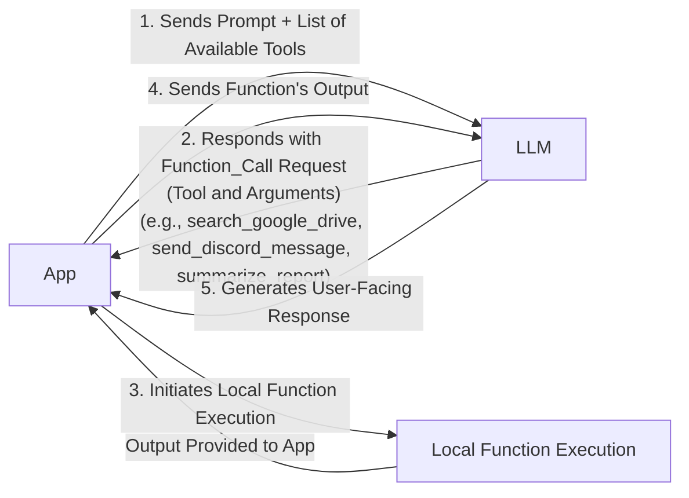
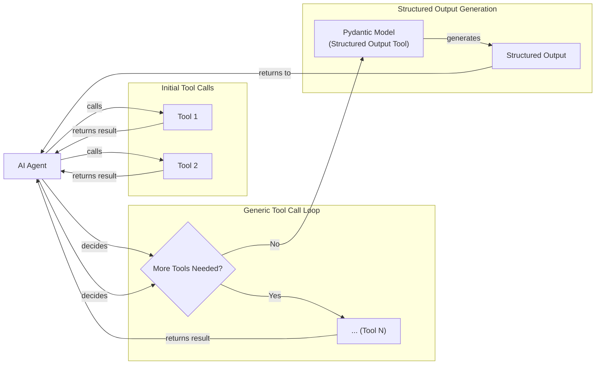
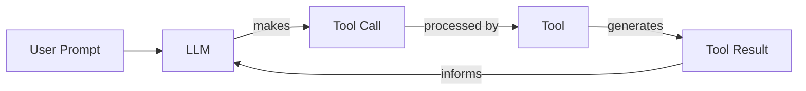

# Lesson 6: Agent Tools & Function Calling

In the previous lessons, we built a foundation in AI Engineering. We explored the landscape of AI agents, distinguished between rule-based workflows and autonomous agents, and covered the essentials of context engineering and structured outputs. We have learned how to orchestrate information flowing *into* an LLM and how to get reliable data *out* of it.

Now, we will give our LLM the ability to take action. Tools, also known as function calling, are what transform an LLM from a simple text generator into an agent that can interact with the external world. Understanding how an agent works with tools is critical for any AI Engineer who wants to build, improve, and debug production-grade AI applications. In this lesson, we will open the black box, implementing tool calling from scratch before moving to production-ready techniques with modern APIs.

## Understanding why agents need tools

LLMs have a fundamental limitation: they are powerful pattern matchers and text generators, but they cannot perform actions or interact with the external world on their own. Their knowledge is frozen at the time of their training and is stored entirely within their weights. To overcome this, they need some additional engineering. This is where tools come in.

Think of the LLM as the brain of an agent. Tools are its "hands and senses," allowing it to perceive and act in the world beyond its pre-trained knowledge. This analogy is grounded in the idea that tools enable LLMs to surpass their inherent limitations, much like how physical tools allowed our ancestors to perform tasks beyond the capabilities of their bodies, such as making precise calculations or acting in novel situations [[84]](https://thegradient.pub/grounding-large-language-models-in-a-cognitive-foundation/). They are the bridge between the LLM's internal reasoning and the external environment. With tools, an LLM becomes an AI agent that can execute specific instructions and interact with other systems.

Image 1: An AI agent's core components, with the LLM interacting with Planning, Memory, and Tools.

This capability unlocks a wide range of applications. Some of the most common tools that power modern AI agents include:

-   **Accessing real-time information** through APIs, like checking today's weather or fetching the latest news.
-   **Interacting with external databases** and storage solutions, such as querying a PostgreSQL database or a Snowflake data warehouse.
-   **Accessing the agent's long-term memory** to recall information beyond the current context window.
-   **Executing code** in languages like Python or JavaScript to perform precise calculations, manipulate data, or create visualizations.

By giving an LLM access to these tools, we move beyond simple text generation and start building systems that can solve real-world problems.

## Implementing tool calls from scratch

The best way to understand how tools work is to implement them from scratch. Our goal is to provide the LLM with a list of available functions and let it decide which one to use and with what arguments to fulfill a user's request.

The process of calling a tool involves a five-step dialogue between our application and the LLM.



Image 2: A flowchart illustrating the 5-step process of tool calling between an App and an LLM.

Let's build a simple example where we mock searching for a document on Google Drive and sending its summary to a Discord channel.

<aside>
💡

You can find the code for this lesson in the accompanying [Jupyter Notebook on GitHub](https://github.com/towardsai/course-ai-agents/blob/dev/lessons/06_tools/notebook.ipynb).

</aside>

1.  First, we set up our environment by initializing the Gemini client and defining our model and a mock document. We will use `gemini-2.5-flash`, which is fast and cost-effective.
    ```python
    import json
    from typing import Any

    from google import genai
    from google.genai import types
    from pydantic import BaseModel, Field

    from lessons.utils import env, pretty_print

    env.load(required_env_vars=["GOOGLE_API_KEY"])

    client = genai.Client()
    MODEL_ID = "gemini-2.5-flash"

    DOCUMENT = """
    # Q3 2023 Financial Performance Analysis

    The Q3 earnings report shows a 20% increase in revenue and a 15% growth in user engagement, 
    beating market expectations. These impressive results reflect our successful product strategy 
    and strong market positioning...
    """
    ```

2.  Next, we define three mock Python functions that will serve as our tools. The function signature and docstrings are crucial, as the LLM uses them to understand what each tool does.
    ```python
    def search_google_drive(query: str) -> dict:
        """
        Searches for a file on Google Drive and returns its content or a summary.
        """
        return {
            "files": [
                {
                    "name": "Q3_Earnings_Report_2024.pdf",
                    "content": DOCUMENT,
                }
            ]
        }
    ```
    ```python
    def send_discord_message(channel_id: str, message: str) -> dict:
        """
        Sends a message to a specific Discord channel.
        """
        return {
            "status": "success",
            "channel": channel_id,
        }
    ```
    ```python
    def summarize_financial_report(text: str) -> str:
        """
        Summarizes a financial report.
        """
        return "The Q3 2023 earnings report shows strong performance with 20% revenue growth..."
    ```

3.  For the LLM to use these functions, we must describe them in a format it understands. We create a JSON schema for each tool, which is an industry standard used by providers like OpenAI and Google [[14]](https://ai.google.dev/gemini-api/docs/function-calling), [[17]](https://platform.openai.com/docs/guides/function-calling). This schema tells the LLM the tool's name, what it does (`description`), and what inputs it needs (`parameters`).
    ```python
    search_google_drive_schema = {
        "name": "search_google_drive",
        "description": "Searches for a file on Google Drive and returns its content or a summary.",
        "parameters": {
            "type": "object",
            "properties": {
                "query": {
                    "type": "string",
                    "description": "The search query to find the file, e.g., 'Q3 earnings report'.",
                }
            },
            "required": ["query"],
        },
    }
    ```

4.  We then aggregate our tools and their schemas into registries for easy access.
    ```python
    TOOLS = {
        "search_google_drive": {
            "handler": search_google_drive,
            "declaration": search_google_drive_schema,
        },
        "send_discord_message": {
            "handler": send_discord_message,
            "declaration": send_discord_message_schema,
        },
        "summarize_financial_report": {
            "handler": summarize_financial_report,
            "declaration": summarize_financial_report_schema,
        },
    }
    TOOLS_BY_NAME = {tool_name: tool["handler"] for tool_name, tool in TOOLS.items()}
    TOOLS_SCHEMA = [tool["declaration"] for tool in TOOLS.values()]
    ```
    The `TOOLS_BY_NAME` mapping holds our Python functions, and `TOOLS_SCHEMA` holds the JSON descriptions we will pass to the LLM.

5.  We create a system prompt that instructs the LLM on how to behave. It includes guidelines on when to use tools, the exact format for a tool call, and the list of available tools wrapped in `<tool_definitions>` tags.
    ```python
    TOOL_CALLING_SYSTEM_PROMPT = """
    You are a helpful AI assistant with access to tools...

    ## Tool Call Format
    When you need to use a tool, output ONLY the tool call in this exact format:
    ```tool_call
    {{"name": "tool_name", "args": {{"param1": "value1", "param2": "value2"}}}}
    ```
    ...
    ## Available Tools
    <tool_definitions>
    {tools}
    </tool_definitions>
    ...
    """
    ```

6.  Now, let's see how this works. The LLM's decision-making process for tool use involves two key steps. First, it *decides* which tool is appropriate based on the `description` field in the schema. This is why clear, articulate, and distinct tool descriptions are critical. Ambiguous descriptions like "search documents" and "search files" would confuse the model. Instead, explicit descriptions like "search documents on Google Drive" and "search files on the local disk" provide the clarity needed for accurate tool selection. This becomes vital when an agent has access to 50-100 tools [[75]](https://mbrenndoerfer.com/writing/function-calling-llm-structured-tools), [[78]](https://medium.com/@abhaychougule0907/underlying-factors-behind-inconsistency-in-llm-responses-with-multi-tool-calling-628ce7b4de76).

    The challenge is that tool descriptions compete with the user's message for the model's limited attention budget. In one real-world case study, an agent with 53 tools began to hallucinate tool names and use the wrong functions simply because the cognitive load was too high [[85]](https://dev.to/breeze_nik/scaling-an-ai-agent-to-53-tools-without-making-it-dumber-4d4). The solution was **tool scoping**: a middleware layer that filters the tool list shown to the LLM based on the current context, ensuring it only ever has to choose from the 6 to 18 tools relevant at that moment. This pattern is now common, with platforms like GitHub offering dynamic toolsets that an agent can enable on demand [[85]](https://dev.to/breeze_nik/scaling-an-ai-agent-to-53-tools-without-making-it-dumber-4d4).

    Second, after selecting a tool, the LLM *generates* the function name and arguments as a structured output, like JSON. This capability is not magic; models are specifically trained for this via supervised fine-tuning on specialized datasets. These datasets contain conversation traces where the model learns to predict the next token in a schema-conforming JSON object, effectively teaching it both the format and the judgment of when to call a tool [[86]](https://mbrenndoerfer.com/writing/function-calling-llm-structured-tools).

7.  Let's test it. We send a user prompt along with our system prompt to the model.
    ```python
    USER_PROMPT = """
    Please find the Q3 earnings report on Google Drive and send a summary of it to 
    the #finance channel on Discord.
    """

    messages = [TOOL_CALLING_SYSTEM_PROMPT.format(tools=str(TOOLS_SCHEMA)), USER_PROMPT]

    response = client.models.generate_content(
        model=MODEL_ID,
        contents=messages,
    )
    ```
    The LLM correctly identifies the `search_google_drive` tool and generates the required arguments. It outputs:
    ```text
    ```tool_call
    {"name": "search_google_drive", "args": {"query": "Q3 earnings report"}}
    ```
    ```

8.  Now, we parse the LLM's response and execute the function in our code. We start by extracting the JSON string.
    ```python
    def extract_tool_call(response_text: str) -> str:
        return response_text.split("```tool_call")[1].split("```")[0].strip()

    tool_call_str = extract_tool_call(response.text)
    tool_call = json.loads(tool_call_str)
    ```

9.  Next, we retrieve the corresponding Python function from our `TOOLS_BY_NAME` registry and call it with the arguments provided by the LLM.
    ```python
    tool_handler = TOOLS_BY_NAME[tool_call["name"]]
    tool_result = tool_handler(**tool_call["args"])
    ```
    It outputs:
    ```json
    {
      "files": [
        {
          "name": "Q3_Earnings_Report_2024.pdf",
          "id": "file12345",
          "content": "\n# Q3 2023 Financial Performance Analysis\n\nThe Q3 earnings report shows a 20% increase in revenue and a 15% growth in user engagement, \nbeating market expectations..."
        }
      ]
    }
    ```

10. We can encapsulate this logic in a helper function for convenience.
    ```python
    def call_tool(response_text: str, tools_by_name: dict) -> Any:
        tool_call_str = extract_tool_call(response_text)
        tool_call = json.loads(tool_call_str)
        tool_name = tool_call["name"]
        tool_args = tool_call["args"]
        tool = tools_by_name[tool_name]
        return tool(**tool_args)
    ```

11. The final step is to send this tool result back to the LLM. This allows the model to interpret the information and either formulate a final response to the user or decide on the next action to take.
    ```python
    response = client.models.generate_content(
        model=MODEL_ID,
        contents=f"Interpret the tool result: {json.dumps(tool_result, indent=2)}",
    )
    ```
    It outputs:
    ```text
    The tool result provides the content of a file named `Q3_Earnings_Report_2024.pdf`.

    This document is a **Q3 2023 Financial Performance Analysis** and details exceptionally strong results, significantly beating market expectations.

    **Key highlights from the report include:**
    *   **Revenue Growth:** A 20% increase in revenue.
    *   **User Engagement:** 15% growth in user engagement...
    ```

This from-scratch implementation reveals the core mechanics of tool calling. However, it requires a lot of manual setup.

## Implementing a small tool calling framework from scratch

Manually defining a JSON schema for every function is tedious and violates the Don't Repeat Yourself (DRY) principle. Production frameworks like LangGraph and protocols like MCP (Model Context Protocol) solve this with a `@tool` decorator that automatically generates and registers schemas from Python functions [[29]](https://docs.langchain.com/oss/python/langchain/tools), [[3]](https://ai.google.dev/gemini-api/docs/function-calling). The goal of a standard like MCP is to serve as a universal interface for AI-to-tool interactions, much like how the Language Server Protocol (LSP) created a shared language for code editors and development tools [[87]](https://a16z.com/a-deep-dive-into-mcp-and-the-future-of-ai-tooling/).

Let's build our own simple decorator to streamline our from-scratch implementation. The goal is to automatically extract the schema from a function's signature and docstring. This approach also follows good software engineering principles, borrowing from fields like robotics, where it is common to abstract away low-level tool implementation details to allow the agent to focus on high-level reasoning and planning [[88]](https://www2.eecs.berkeley.edu/Pubs/TechRpts/2025/EECS-2025-59.pdf).

1.  First, we define a `ToolFunction` class to wrap our decorated functions and hold their schemas.
    ```python
    from inspect import Parameter, signature
    from typing import Any, Callable, Dict, Optional

    class ToolFunction:
        def __init__(self, func: Callable, schema: Dict[str, Any]) -> None:
            self.func = func
            self.schema = schema
            self.__name__ = func.__name__
            self.__doc__ = func.__doc__

        def __call__(self, *args: Any, **kwargs: Any) -> Any:
            return self.func(*args, **kwargs)
    ```

2.  Next, we create the `@tool` decorator. It inspects the function's signature to determine its parameters and uses the docstring as the tool's description.
    ```python
    def tool(description: Optional[str] = None) -> Callable[[Callable], ToolFunction]:
        """A decorator that creates a tool schema from a function."""
        def decorator(func: Callable) -> ToolFunction:
            sig = signature(func)
            properties = {}
            required = []
            for param_name, param in sig.parameters.items():
                if param.default == Parameter.empty:
                    required.append(param_name)
                properties[param_name] = {
                    "type": "string",  # Simplified for example
                    "description": f"The {param_name} parameter",
                }
            schema = {
                "name": func.__name__,
                "description": description or func.__doc__,
                "parameters": {
                    "type": "object",
                    "properties": properties,
                    "required": required,
                },
            }
            return ToolFunction(func, schema)
        return decorator
    ```

3.  Now, we can redefine our tools by simply applying the decorator. The schema is generated automatically.
    ```python
    @tool()
    def search_google_drive_example(query: str) -> dict:
        """Search for files in Google Drive."""
        return {"files": ["Q3 earnings report"]}

    @tool()
    def send_discord_message_example(channel_id: str, message: str) -> dict:
        """Send a message to a Discord channel."""
        return {"message": "Message sent successfully"}

    @tool()
    def summarize_financial_report_example(text: str) -> str:
        """Summarize the contents of a financial report."""
        return "Financial report summarized successfully"

    tools = [
        search_google_drive_example,
        send_discord_message_example,
        summarize_financial_report_example,
    ]
    tools_by_name = {tool.schema["name"]: tool.func for tool in tools}
    tools_schema = [tool.schema for tool in tools]
    ```

4.  The decorated function is now a `ToolFunction` object. We can inspect its generated schema and access the original function via the `.func` attribute. The schema is identical to the one we defined manually.
    ```python
    type(search_google_drive_example)
    ```
    It outputs:
    ```text
    __main__.ToolFunction
    ```
    The schema looks like this:
    ```json
    {
      "name": "search_google_drive_example",
      "description": "Search for files in Google Drive.",
      "parameters": {
        "type": "object",
        "properties": {
          "query": {
            "type": "string",
            "description": "The query parameter"
          }
        },
        "required": [
          "query"
        ]
      }
    }
    ```

5.  We can now use this new setup with our existing LLM calling logic. The process remains the same, but our tool definition is much cleaner and more maintainable.
    ```python
    USER_PROMPT = """
    Please find the Q3 earnings report on Google Drive and send a summary of it to 
    the #finance channel on Discord.
    """
    messages = [TOOL_CALLING_SYSTEM_PROMPT.format(tools=str(tools_schema)), USER_PROMPT]
    response = client.models.generate_content(
        model=MODEL_ID,
        contents=messages,
    )
    ```
    It outputs:
    ```text
    ```tool_call
    {"name": "search_google_drive_example", "args": {"query": "Q3 earnings report"}}
    ```
    ```
    And calling the tool:
    ```python
    call_tool(response.text, tools_by_name=tools_by_name)
    ```
    It outputs:
    ```json
    {
      "files": [
        "Q3 earnings report"
      ]
    }
    ```

Voilà! We have built a small, reusable tool-calling framework. This implementation is conceptually similar to what frameworks like LangGraph do under the scenes to simplify tool creation.

## Implementing production-level tool calls with Gemini

While building from scratch is a great learning exercise, production systems should leverage the native tool-calling capabilities of modern LLM APIs. Providers like Google, OpenAI, and Anthropic have optimized their models for function calling, making their native integrations more robust, efficient, and easier to maintain [[80]](https://www.decodingai.com/p/tool-calling-from-scratch-to-production), [[81]](https://apxml.com/courses/prompt-engineering-llm-application-development/chapter-4-interacting-with-llm-apis/overview-common-llm-apis).

Let's refactor our example to use Gemini's native API.

1.  Instead of a lengthy system prompt, we provide our tool schemas to Gemini's `GenerateContentConfig`. We also set the `mode` to `"ANY"` to force the model to call a function.
    ```python
    from google.genai import types

    tools = [
        types.Tool(
            function_declarations=[
                types.FunctionDeclaration(**search_google_drive_schema),
                types.FunctionDeclaration(**send_discord_message_schema),
            ]
        )
    ]
    config = types.GenerateContentConfig(
        tools=tools,
        tool_config=types.ToolConfig(function_calling_config=types.FunctionCallingConfig(mode="ANY")),
    )
    ```

2.  With the configuration handled by the API, our prompt becomes much simpler. We can pass the user's request directly, as the Gemini API injects the necessary instructions for tool use.
    ```python
    response = client.models.generate_content(
        model=MODEL_ID,
        contents=USER_PROMPT,
        config=config,
    )
    ```

3.  The response contains a `FunctionCall` object, which is a structured representation of the tool call, rather than a raw string.
    ```python
    function_call = response.candidates[0].content.parts[0].function_call
    ```
    It outputs:
    ```
    FunctionCall(id=None, args={'query': 'Q3 earnings report'}, name='search_google_drive')
    ```

4.  We create a new `call_tool` function to work with this native object.
    ```python
    def call_tool(function_call) -> any:
        tool_name = function_call.name
        tool_args = {key: value for key, value in function_call.args.items()}
        tool_handler = TOOLS_BY_NAME[tool_name]
        return tool_handler(**tool_args)

    tool_result = call_tool(function_call)
    ```
    It outputs:
    ```json
    {
      "files": [
        {
          "name": "Q3_Earnings_Report_2024.pdf",
          "id": "file12345",
          "content": "\n# Q3 2023 Financial Performance Analysis\n\nThe Q3 earnings report shows a 20% increase in revenue and a 15% growth in user engagement, \nbeating market expectations..."
        }
      ]
    }
    ```

By leveraging the native SDK, we reduced dozens of lines of code to just a few, creating a more robust and maintainable system. Other popular APIs from OpenAI and Anthropic follow a similar logic, making these concepts easily transferable [[83]](https://myengineeringpath.dev/tools/gemini-guide/).

## Using Pydantic models as tools for on-demand structured outputs

In Lesson 4, we saw how to generate structured outputs. A powerful pattern in agentic systems is to treat a Pydantic model *as a tool*. This allows an agent to perform several intermediate steps using unstructured tool outputs, which are easy for an LLM to interpret, and then dynamically decide when to generate a final, structured answer for downstream processing [[5]](https://pydantic.dev/docs/ai/core-concepts/output/), [[6]](https://pydantic.dev/docs/ai/guides/multi-agent-applications/).

This creates a clean separation: the agent uses simple tools for its reasoning loop and calls a special "structured output" tool only when it has gathered all the necessary information.



Image 3: A flowchart illustrating an AI agent that calls multiple tools in a loop, where only the last one is a tool call for structured outputs.

Let's see how to implement this.

1.  First, we define our `DocumentMetadata` Pydantic model, just as we did in Lesson 4.
    ```python
    class DocumentMetadata(BaseModel):
        """A class to hold structured metadata for a document."""
        summary: str = Field(description="A concise, 1-2 sentence summary of the document.")
        tags: list[str] = Field(description="A list of 3-5 high-level tags relevant to the document.")
        # ... other fields
    ```

2.  We then create a tool declaration where the `parameters` are derived directly from the Pydantic model's JSON schema.
    ```python
    extraction_tool = types.Tool(
        function_declarations=[
            types.FunctionDeclaration(
                name="extract_metadata",
                description="Extracts structured metadata from a financial document.",
                parameters=DocumentMetadata.model_json_schema(),
            )
        ]
    )
    config = types.GenerateContentConfig(
        tools=[extraction_tool],
        tool_config=types.ToolConfig(function_calling_config=types.FunctionCallingConfig(mode="ANY")),
    )
    ```

3.  Now, we can prompt the model to analyze a document and use our new tool to extract the metadata.
    ```python
    prompt = f"""
    Please analyze the following document and extract its metadata.

    Document:
    --- 
    {DOCUMENT}
    --- 
    """

    response = client.models.generate_content(model=MODEL_ID, contents=prompt, config=config)
    function_call = response.candidates[0].content.parts[0].function_call
    ```
    The model returns a `function_call` for `extract_metadata` with arguments that match our Pydantic schema.

4.  Finally, we can validate the arguments and instantiate our `DocumentMetadata` object.
    ```python
    document_metadata = DocumentMetadata(**function_call.args)
    ```

This pattern gives us the best of both worlds: the flexibility of an agent that can reason through multiple steps and the reliability of structured, validated outputs when it matters most.

## The downsides of running tools in a loop

So far, we have focused on single tool calls. The next logical step is to build an agent that can chain multiple tools together, running them in a loop to solve more complex, multi-step tasks. In this setup, the LLM decides which tool to use at each step based on the output of the previous ones.



Image 4: A flowchart illustrating a sequential tool calling loop.

This approach offers flexibility and allows the agent to adapt its strategy as it gathers more information. Let's implement a loop where an agent finds a report, summarizes it, and then sends the summary to Discord.

1.  First, we configure our model with all three tools available.
    ```python
    tools = [
        types.Tool(
            function_declarations=[
                types.FunctionDeclaration(**search_google_drive_schema),
                types.FunctionDeclaration(**send_discord_message_schema),
                types.FunctionDeclaration(**summarize_financial_report_schema),
            ]
        )
    ]
    config = types.GenerateContentConfig(
        tools=tools,
        tool_config=types.ToolConfig(function_calling_config=types.FunctionCallingConfig(mode="ANY")),
    )
    ```

2.  We provide a multi-step prompt and initialize our message history.
    ```python
    USER_PROMPT = """
    Please find the Q3 earnings report on Google Drive and send a summary of it to 
    the #finance channel on Discord.
    """
    messages = [USER_PROMPT]
    ```

3.  We run the agent in a loop. In each iteration, we call the LLM, execute the requested tool, append the result to the history, and repeat until the model stops requesting tool calls.
    ```python
    # Initial LLM call
    response = client.models.generate_content(
        model=MODEL_ID, contents=messages, config=config
    )
    response_message_part = response.candidates[0].content.parts[0]
    messages.append(response.candidates[0].content)

    max_iterations = 3
    while hasattr(response_message_part, "function_call") and max_iterations > 0:
        # Execute the tool call
        tool_result = call_tool(response_message_part.function_call)

        # Send the result back to the model
        function_response_part = types.Part.from_function_response(
            name=response_message_part.function_call.name,
            response={"result": tool_result},
        )
        messages.append(function_response_part)

        # Ask the LLM for the next step
        response = client.models.generate_content(
            model=MODEL_ID, contents=messages, config=config
        )
        response_message_part = response.candidates[0].content.parts[0]
        messages.append(response.candidates[0].content)
        max_iterations -= 1
    ```
    The agent successfully executes the chain: `search_google_drive` → `summarize_financial_report` → `send_discord_message`.

However, this simple loop has significant limitations [[9]](https://myengineeringpath.dev/genai-engineer/agentic-patterns/). It assumes a tool should be called at every step and provides no opportunity for the model to reason about the output before deciding on the next action. The agent immediately moves to the next function call without pausing to think about what it has learned or whether it should change its strategy. This can lead to inefficient tool usage or getting stuck in infinite loops.

A quick note on optimization: if tools are independent, they can be run in parallel to reduce latency. For example, an agent could fetch financial news and stock prices simultaneously. More advanced systems manage this dynamically, allowing the agent to activate and deactivate entire sets of tools as needed. For instance, GitHub's MCP server includes meta-tools like `list_available_toolsets` and `enable_toolset` that let the agent navigate the tool landscape itself [[85]](https://dev.to/breeze_nik/scaling-an-ai-agent-to-53-tools-without-making-it-dumber-4d4).

The limitations of this naive looping pattern pushed the industry to develop more sophisticated agentic design patterns. The most foundational of these is **ReAct (Reason and Act)**, which explicitly interleaves reasoning steps with tool calls. This allows the agent to think through problems more deliberately, which we will explore in detail in Lessons 7 and 8.

## Popular tools used within the industry

To ground these concepts in the real world, let's look at some of the most popular tool categories used across the industry. These examples illustrate the vast potential of tool-using agents.

### 1. Knowledge & Memory Access

These tools connect agents to external knowledge sources, overcoming the limitations of their static training data. This includes querying vector databases for semantic search, document stores for raw text, or graph databases to understand relationships between entities. A powerful variation is text-to-SQL, where an agent constructs and executes SQL queries on traditional databases to answer natural language questions [[13]](https://promethium.ai/guides/text-to-sql-basics-benefits/). These capabilities are foundational to memory and Retrieval-Augmented Generation (RAG), which we will cover in Lessons 9 and 10.

### 2. Web Search & Browsing

Omnipresent in modern chatbots and research agents, these tools give agents access to the live internet. They typically interface with search engine APIs like Google Search or Brave Search to retrieve up-to-date information. More advanced versions include web scraping tools that can fetch and parse the content of web pages, allowing the agent to "read" articles, documentation, or product reviews. This approach has known failure modes; one study found that general-purpose AIs scraping retail sites had accuracy between 0% and 75%, with data quality degrading silently at scale [[89]](https://tendem.ai/blog/why-pure-ai-scraping-fails). Ethical implementations also require respecting `robots.txt` files and rate-limiting requests to avoid overwhelming servers [[90]](https://cimentadaj.github.io/dataharvesting/ethical-issues.html).

### 3. Code Execution

A code interpreter tool, typically a sandboxed Python environment, allows an agent to write and execute code. This is invaluable for tasks requiring precise computation, data manipulation, or visualization [[18]](https://medium.com/@anicomanesh/how-llm-reasoning-powers-the-agentic-ai-revolution-cbefd10ebf3f). For example, an agent could write a Python script to calculate statistics from a dataset, sort a list, or generate a chart. Deploying this at enterprise scale requires careful sandboxing. Production systems often use a hierarchy of isolation technologies, from standard containers (fast but insecure) to gVisor (balanced) to Firecracker microVMs, which offer strong hardware-level isolation with optimized cold starts under 150ms [[91]](https://www.softwareseni.com/ai-agents-in-production-the-sandboxing-problem-no-one-has-solved/). While Python is most common, this pattern can be adapted for other languages like JavaScript.

### 4. Other Popular Tools

The possibilities for tools are nearly endless and are often tailored to specific domains.
- **External API Integrations:** In enterprise AI, agents frequently interact with business systems via APIs for calendars, email, or project management tools like Slack and Notion. This allows them to automate workflows like scheduling meetings or creating tasks [[19]](https://lnu.diva-portal.org/smash/get/diva2:1801354/FULLTEXT01.pdf). In high-stakes domains like finance, this includes **tool-call gatekeepers** that enforce hard constraints (e.g., maximum trade sizes) and a **human-in-the-loop** layer for final approval before execution [[92]](https://rpc.cfainstitute.org/research/the-automation-ahead-content-series/agentic-ai-for-finance).
- **File System Operations:** Productivity-focused agents often need to interact with the local operating system to read and write files or list directories, enabling them to help with tasks like organizing documents or managing projects.

## Conclusion

Tool calling is a foundational skill in AI Engineering. It is what elevates an LLM from a passive text generator to an active agent capable of interacting with its environment. By mastering how to define, call, and orchestrate tools, you can build applications that access real-time data, automate complex workflows, and solve problems that are far beyond the reach of a standalone model.

We have seen how to implement tools from scratch, leverage the power of modern APIs, and chain them together to tackle multi-step tasks. We also recognized the limitations of simple loops, which sets the stage for our next topic. In Lesson 7, we will dive into the theory behind planning and the ReAct pattern, a more sophisticated approach that allows agents to reason about their actions and build more robust strategies.

## References

- [1] Ntinopoulos, V., Biefer, H. R. C., Tudorache, I., Papadopoulos, N., Odavic, D., Risteski, P., Haeussler, A., & Dzemali, O. (2025). Large language models for data extraction from unstructured and semi-structured electronic health records: a multiple model performance evaluation. BMJ Health & Care Informatics, 32(1), e101139. [https://pmc.ncbi.nlm.nih.gov/articles/PMC11751965/](https://pmc.ncbi.nlm.nih.gov/articles/PMC11751965/)
- [2] Evaluation of LLM-based Strategies for the Extraction of Food Product Information from Online Shops. (n.d.). arXiv. [https://arxiv.org/html/2506.21585v1](https://arxiv.org/html/2506.21585v1)
- [3] Function calling with the Gemini API. (n.d.). Google AI for Developers. [https://ai.google.dev/gemini-api/docs/function-calling](https://ai.google.dev/gemini-api/docs/function-calling)
- [5] Output. (n.d.). Pydantic. [https://pydantic.dev/docs/ai/core-concepts/output/](https://pydantic.dev/docs/ai/core-concepts/output/)
- [6] Multi-Agent Applications. (n.d.). Pydantic. [https://pydantic.dev/docs/ai/guides/multi-agent-applications/](https://pydantic.dev/docs/ai/guides/multi-agent-applications/)
- [9] Agentic Design Patterns — Visual Architecture Guide. (n.d.). My Engineering Path. [https://myengineeringpath.dev/genai-engineer/agentic-patterns/](https://myengineeringpath.dev/genai-engineer/agentic-patterns/)
- [13] Text-to-SQL: The Basics, Benefits, and How It Works. (n.d.). Promethium. [https://promethium.ai/guides/text-to-sql-basics-benefits/](https://promethium.ai/guides/text-to-sql-basics-benefits/)
- [14] Function calling with the Gemini API. (n.d.). Google AI for Developers. [https://ai.google.dev/gemini-api/docs/function-calling](https://ai.google.dev/gemini-api/docs/function-calling)
- [17] Function calling with OpenAI's API. (n.d.). OpenAI. [https://platform.openai.com/docs/guides/function-calling](https://platform.openai.com/docs/guides/function-calling)
- [18] How LLM Reasoning Powers the Agentic AI Revolution. (2024, May 15). Medium. [https://medium.com/@anicomanesh/how-llm-reasoning-powers-the-agentic-ai-revolution-cbefd10ebf3f](https://medium.com/@anicomanesh/how-llm-reasoning-powers-the-agentic-ai-revolution-cbefd10ebf3f)
- [19] The Power of APIs in Extending LLM Capabilities. (n.d.). DIVA. [https://lnu.diva-portal.org/smash/get/diva2:1801354/FULLTEXT01.pdf](https://lnu.diva-portal.org/smash/get/diva2:1801354/FULLTEXT01.pdf)
- [29] Tools. (n.d.). LangChain. [https://docs.langchain.com/oss/python/langchain/tools](https://docs.langchain.com/oss/python/langchain/tools)
- [75] Function Calling, LLMs, and Structured Tools. (n.d.). mbrenndoerfer.com. [https://mbrenndoerfer.com/writing/function-calling-llm-structured-tools](https://mbrenndoerfer.com/writing/function-calling-llm-structured-tools)
- [78] Underlying Factors Behind Inconsistency in LLM Responses with Multi-Tool Calling. (2024, May 27). Medium. [https://medium.com/@abhaychougule0907/underlying-factors-behind-inconsistency-in-llm-responses-with-multi-tool-calling-628ce7b4de76](https://medium.com/@abhaychougule0907/underlying-factors-behind-inconsistency-in-llm-responses-with-multi-tool-calling-628ce7b4de76)
- [80] Tool Calling: From Scratch to Production. (n.d.). Decoding AI. [https://www.decodingai.com/p/tool-calling-from-scratch-to-production](https://www.decodingai.com/p/tool-calling-from-scratch-to-production)
- [81] Overview of Common LLM APIs (OpenAI, Anthropic, etc.). (n.d.). APXML. [https://apxml.com/courses/prompt-engineering-llm-application-development/chapter-4-interacting-with-llm-apis/overview-common-llm-apis](https://apxml.com/courses/prompt-engineering-llm-application-development/chapter-4-interacting-with-llm-apis/overview-common-llm-apis)
- [83] Google Gemini Guide. (n.d.). My Engineering Path. [https://myengineeringpath.dev/tools/gemini-guide/](https://myengineeringpath.dev/tools/gemini-guide/)
- [84] Grounding Large Language Models in a Cognitive Foundation. (n.d.). The Gradient. [https://thegradient.pub/grounding-large-language-models-in-a-cognitive-foundation/](https://thegradient.pub/grounding-large-language-models-in-a-cognitive-foundation/)
- [85] Scaling an AI agent to 53 tools without making it dumber. (n.d.). DEV Community. [https://dev.to/breeze_nik/scaling-an-ai-agent-to-53-tools-without-making-it-dumber-4d4](https://dev.to/breeze_nik/scaling-an-ai-agent-to-53-tools-without-making-it-dumber-4d4)
- [86] Function Calling, LLMs, and Structured Tools. (n.d.). mbrenndoerfer.com. [https://mbrenndoerfer.com/writing/function-calling-llm-structured-tools](https://mbrenndoerfer.com/writing/function-calling-llm-structured-tools)
- [87] A Deep Dive Into MCP and the Future of AI Tooling. (n.d.). Andreessen Horowitz. [https://a16z.com/a-deep-dive-into-mcp-and-the-future-of-ai-tooling/](https://a16z.com/a-deep-dive-into-mcp-and-the-future-of-ai-tooling/)
- [88] Towards General-Purpose Robots: A Multi-View and Multi-Modal Approach for Object-Centric Manipulation. (n.d.). EECS at UC Berkeley. [https://www2.eecs.berkeley.edu/Pubs/TechRpts/2025/EECS-2025-59.pdf](https://www2.eecs.berkeley.edu/Pubs/TechRpts/2025/EECS-2025-59.pdf)
- [89] Why Pure AI Scraping Fails & How to Fix It. (n.d.). Tendem. [https://tendem.ai/blog/why-pure-ai-scraping-fails](https://tendem.ai/blog/why-pure-ai-scraping-fails)
- [90] Ethical Issues in Web Scraping and Data Harvesting. (n.d.). Cimentada. [https://cimentadaj.github.io/dataharvesting/ethical-issues.html](https://cimentadaj.github.io/dataharvesting/ethical-issues.html)
- [91] AI Agents in Production: The Sandboxing Problem No One Has Solved. (n.d.). SoftwareSeni. [https://www.softwareseni.com/ai-agents-in-production-the-sandboxing-problem-no-one-has-solved/](https://www.softwareseni.com/ai-agents-in-production-the-sandboxing-problem-no-one-has-solved/)
- [92] Agentic AI for Finance. (n.d.). CFA Institute. [https://rpc.cfainstitute.org/research/the-automation-ahead-content-series/agentic-ai-for-finance](https://rpc.cfainstitute.org/research/the-automation-ahead-content-series/agentic-ai-for-finance)