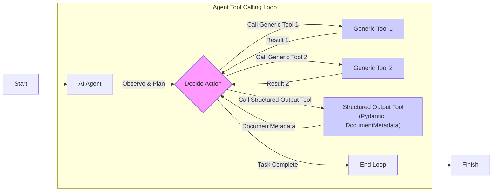
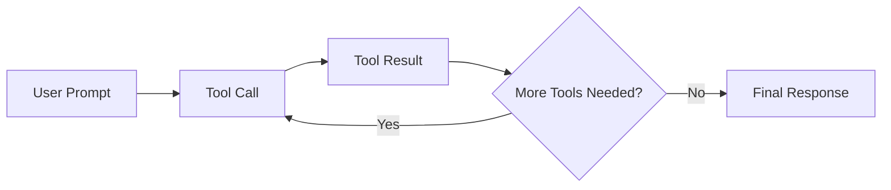

# Lesson 6: Agent Tools & Function Calling

In the previous lessons, we built a solid foundation in AI Engineering. We mapped the agent landscape, distinguished between LLM workflows and AI agents, mastered context engineering, and learned to enforce structured outputs. Now, we will give our AI systems the ability to act.

This lesson explores agent tools, also known as function calling. This is the mechanism that allows an LLM to interact with the outside world. By giving an agent tools, we transform it from a simple text generator into a system that can access real-time data, execute code, and interact with other applications. Understanding how this works is not just valuable; it is essential for any engineer looking to build, debug, and ship production-ready AI agents. We will open the black box of tool use, starting from the ground up.

## Understanding Why Agents Need Tools

LLMs have a fundamental limitation: they are sophisticated pattern matchers and text generators. They operate on the vast knowledge encoded in their weights, but they cannot, by themselves, interact with the external world. They cannot check the current weather, browse a website, or query a database. This is where tools come in.

Think of the LLM as the brain of an agent. Tools are its hands and senses, allowing it to perceive and act in the world beyond its pre-trained knowledge. They are the bridge between the LLM's internal reasoning and the external environment. With tools, an LLM evolves into an AI agent capable of executing complex, real-world tasks.

This capability unlocks a wide range of applications that power modern AI agents, such as:
-   Accessing real-time information through APIs for weather updates or news.
-   Interacting with external databases like PostgreSQL or data warehouses like Snowflake.
-   Retrieving information from long-term memory to recall past conversations.
-   Executing Python or JavaScript code for calculations and data manipulation.

## Implementing tool calls from scratch

The best way to understand how tools work is to build them from scratch. We will start by implementing a simple tool-calling framework to see how an LLM decides which tool to use, generates the correct parameters, and executes a function.

The process of calling a tool involves a five-step dialogue between our application and the LLM.

```mermaid
flowchart LR
  %% Main Actors
  Application["Application"]
  LLM["LLM"]
  User["User"]

  %% Flow
  Application -- "1. Provides available tools" --> LLM
  LLM -- "2. Responds with function_call<br/>(e.g., search_google_drive,<br/>send_discord_message, summarize_report)" --> Application
  Application -- "3. Executes requested function" --> "Tool Execution"
  "Tool Execution" -- "Function Output" --> Application
  Application -- "4. Sends function output" --> LLM
  LLM -- "5. Generates user-facing response" --> User

  %% Visual grouping
  classDef actor stroke-width:2px
  class Application,LLM,User actor
  classDef internal_process stroke-dasharray:3,3
  class "Tool Execution" internal_process
```
Image 1: A flowchart illustrating the 5-step request-execute-respond flow of calling a tool between an Application and an LLM.

Our goal is to give the LLM a list of available tools and let it choose the right one to fulfill a user's request. To demonstrate this, we will build an example that simulates searching for a document on Google Drive and sending a summary to a Discord channel.

<aside>
💡

You can find all the code for this lesson in the accompanying [Jupyter Notebook on GitHub](https://github.com/towardsai/course-ai-agents/blob/dev/lessons/06_tools/notebook.ipynb).

</aside>

1.  First, we set up our environment by initializing the Gemini client. We will use the `gemini-2.5-flash` model, which is fast, cost-effective, and supports tool use. We also define a sample financial document to mock the content of a file.
    ```python
    import json
    from typing import Any
    
    from google import genai
    from google.genai import types
    from pydantic import BaseModel, Field
    
    from lessons.utils import env, pretty_print
    
    env.load(required_env_vars=["GOOGLE_API_KEY"])
    
    client = genai.Client()
    
    MODEL_ID = "gemini-2.5-flash"
    
    DOCUMENT = """
    # Q3 2023 Financial Performance Analysis
    
    The Q3 earnings report shows a 20% increase in revenue and a 15% growth in user engagement, 
    beating market expectations. These impressive results reflect our successful product strategy 
    and strong market positioning.
    
    Our core business segments demonstrated remarkable resilience, with digital services leading 
    the growth at 25% year-over-year. The expansion into new markets has proven particularly 
    successful, contributing to 30% of the total revenue increase.
    
    Customer acquisition costs decreased by 10% while retention rates improved to 92%, 
    marking our best performance to date. These metrics, combined with our healthy cash flow 
    position, provide a strong foundation for continued growth into Q4 and beyond.
    """
    ```

2.  Next, we define three mock functions to simulate our tools. The function signature and docstrings are critical, as the LLM uses them to understand what each tool does.
    ```python
    def search_google_drive(query: str) -> dict:
        """
        Searches for a file on Google Drive and returns its content or a summary.
    
        Args:
            query (str): The search query to find the file, e.g., 'Q3 earnings report'.
    
        Returns:
            dict: A dictionary representing the search results, including file names and summaries.
        """
        return {
            "files": [
                {
                    "name": "Q3_Earnings_Report_2024.pdf",
                    "id": "file12345",
                    "content": DOCUMENT,
                }
            ]
        }
    ```
    ```python
    def send_discord_message(channel_id: str, message: str) -> dict:
        """
        Sends a message to a specific Discord channel.
    
        Args:
            channel_id (str): The ID of the channel to send the message to, e.g., '#finance'.
            message (str): The content of the message to send.
    
        Returns:
            dict: A dictionary confirming the action, e.g., {"status": "success"}.
        """
        return {
            "status": "success",
            "status_code": 200,
            "channel": channel_id,
            "message_preview": f"{message[:50]}...",
        }
    ```
    ```python
    def summarize_financial_report(text: str) -> str:
        """
        Summarizes a financial report.
    
        Args:
            text (str): The text to summarize.
    
        Returns:
            str: The summary of the text.
        """
        return "The Q3 2023 earnings report shows strong performance across all metrics with 20% revenue growth, 15% user engagement increase, 25% digital services growth, and improved retention rates of 92%."
    ```

3.  For each function, we define a schema in JSON format. This schema tells the LLM what the tool does (via `description`) and how to call it (via `parameters`). This schema definition is an industry standard used by major providers like OpenAI and Google [[1]](https://ai.google.dev/gemini-api/docs/function-calling), [[2]](https://platform.openai.com/docs/guides/function-calling).
    ```python
    search_google_drive_schema = {
        "name": "search_google_drive",
        "description": "Searches for a file on Google Drive and returns its content or a summary.",
        "parameters": {
            "type": "object",
            "properties": {
                "query": {
                    "type": "string",
                    "description": "The search query to find the file, e.g., 'Q3 earnings report'.",
                }
            },
            "required": ["query"],
        },
    }
    ```
    ```python
    send_discord_message_schema = {
        "name": "send_discord_message",
        "description": "Sends a message to a specific Discord channel.",
        "parameters": {
            "type": "object",
            "properties": {
                "channel_id": {
                    "type": "string",
                    "description": "The ID of the channel to send the message to, e.g., '#finance'.",
                },
                "message": {
                    "type": "string",
                    "description": "The content of the message to send.",
                },
            },
            "required": ["channel_id", "message"],
        },
    }
    ```
    ```python
    summarize_financial_report_schema = {
        "name": "summarize_financial_report",
        "description": "Summarizes a financial report.",
        "parameters": {
            "type": "object",
            "properties": {
                "text": {
                    "type": "string",
                    "description": "The text to summarize.",
                },
            },
            "required": ["text"],
        },
    }
    ```

4.  We then create a tool registry to map tool names to their handlers and schemas.
    ```python
    TOOLS = {
        "search_google_drive": {
            "handler": search_google_drive,
            "declaration": search_google_drive_schema,
        },
        "send_discord_message": {
            "handler": send_discord_message,
            "declaration": send_discord_message_schema,
        },
        "summarize_financial_report": {
            "handler": summarize_financial_report,
            "declaration": summarize_financial_report_schema,
        },
    }
    TOOLS_BY_NAME = {tool_name: tool["handler"] for tool_name, tool in TOOLS.items()}
    TOOLS_SCHEMA = [tool["declaration"] for tool in TOOLS.values()]
    ```

5.  The `TOOLS_BY_NAME` mapping looks like this.
    ```python
    print(TOOLS_BY_NAME)
    ```
    It outputs:
    ```text
    {'search_google_drive': <function search_google_drive at 0x104c7df80>, 'send_discord_message': <function send_discord_message at 0x104c7de40>, 'summarize_financial_report': <function summarize_financial_report at 0x1274f5c60>}
    ```

6.  Here is an example schema from `TOOLS_SCHEMA`.
    ```python
    pretty_print.wrapped(json.dumps(TOOLS_SCHEMA[0], indent=2), title="`search_google_drive` Tool Schema")
    ```
    It outputs:
    ```text
       [93m-------------------------------- `search_google_drive` Tool Schema -------------------------------- [0m
    
        {
    
        "name": "search_google_drive",
    
        "description": "Searches for a file on Google Drive and returns its content or a summary.",
    
        "parameters": {
    
          "type": "object",
    
          "properties": {
    
            "query": {
    
              "type": "string",
    
              "description": "The search query to find the file, e.g., 'Q3 earnings report'."
    
            }
    
          },
    
          "required": [
    
            "query"
    
          ]
    
        }
    
      }
    
       [93m---------------------------------------------------------------------------------------------------- [0m
    ```

7.  Now, we craft a system prompt to instruct the LLM on how to use these tools. This prompt includes usage guidelines, the expected tool call format, and the list of available tools enclosed in `<tool_definitions>` tags.
    ```python
    TOOL_CALLING_SYSTEM_PROMPT = """
    You are a helpful AI assistant with access to tools that enable you to take actions and retrieve information to better 
    assist users.
    
    ## Tool Usage Guidelines
    
    **When to use tools:**
    - When you need information that is not in your training data
    - When you need to perform actions in external systems and environments
    - When you need real-time, dynamic, or user-specific data
    - When computational operations are required
    
    **Tool selection:**
    - Choose the most appropriate tool based on the user's specific request
    - If multiple tools could work, select the one that most directly addresses the need
    - Consider the order of operations for multi-step tasks
    
    **Parameter requirements:**
    - Provide all required parameters with accurate values
    - Use the parameter descriptions to understand expected formats and constraints
    - Ensure data types match the tool's requirements (strings, numbers, booleans, arrays)
    
    ## Tool Call Format
    
    When you need to use a tool, output ONLY the tool call in this exact format:
    
    ```tool_call
    {{"name": "tool_name", "args": {{"param1": "value1", "param2": "value2"}}}}
    ```
    
    **Critical formatting rules:**
    - Use double quotes for all JSON strings
    - Ensure the JSON is valid and properly escaped
    - Include ALL required parameters
    - Use correct data types as specified in the tool definition
    - Do not include any additional text or explanation in the tool call
    
    ## Response Behavior
    
    - If no tools are needed, respond directly to the user with helpful information
    - If tools are needed, make the tool call first, then provide context about what you're doing
    - After receiving tool results, provide a clear, user-friendly explanation of the outcome
    - If a tool call fails, explain the issue and suggest alternatives when possible
    
    ## Available Tools
    
    <tool_definitions>
    {tools}
    </tool_definitions>
    
    Remember: Your goal is to be maximally helpful to the user. Use tools when they add value, but don't use them unnecessarily. Always prioritize accuracy and user experience.
    """
    ```

8.  The LLM's decision-making process for tool selection relies heavily on the `description` field in the tool schema. Writing clear, articulate, and mutually distinguishing descriptions is therefore essential for building successful AI agents. For instance, generic descriptions like "search documents" and "search files" would confuse an LLM. More explicit descriptions like "search documents on Google Drive" and "search files on the local disk" provide the necessary clarity for the model to make the correct choice [[3]](https://www.anthropic.com/research/building-effective-agents), [[4]](https://mbrenndoerfer.com/writing/function-calling-llm-structured-tools). This becomes even more important as you scale to dozens or even hundreds of tools per agent. Once a tool is selected, the LLM generates the function name and arguments as a structured output, a capability it acquires through instruction fine-tuning.

9.  Let's test it. We send a user prompt along with our system prompt to the model.
    ```python
    USER_PROMPT = """
    Can you help me find the latest quarterly report and share key insights with the team?
    """
    
    messages = [TOOL_CALLING_SYSTEM_PROMPT.format(tools=str(TOOLS_SCHEMA)), USER_PROMPT]
    
    response = client.models.generate_content(
        model=MODEL_ID,
        contents=messages,
    )
    
    pretty_print.wrapped(response.text, title="LLM Tool Call Response")
    ```
    It outputs:
    ```text
       [93m-------------------------------------- LLM Tool Call Response -------------------------------------- [0m
    
        ```tool_call
    
      {"name": "search_google_drive", "args": {"query": "latest quarterly report"}}
    
      ```
    
       [93m---------------------------------------------------------------------------------------------------- [0m
    ```

10. The LLM correctly identifies the `search_google_drive` tool and generates the required arguments.

11. Let's try another prompt that requires multiple steps.
    ```python
    USER_PROMPT = """
    Please find the Q3 earnings report on Google Drive and send a summary of it to 
    the #finance channel on Discord.
    """
    
    messages = [TOOL_CALLING_SYSTEM_PROMPT.format(tools=str(TOOLS_SCHEMA)), USER_PROMPT]
    
    response = client.models.generate_content(
        model=MODEL_ID,
        contents=messages,
    )
    ```

12. The model correctly identifies the first step: searching for the report.
    ```python
    pretty_print.wrapped(response.text, title="LLM Tool Call Response")
    ```
    It outputs:
    ```text
       [93m-------------------------------------- LLM Tool Call Response -------------------------------------- [0m
    
        ```tool_call
    
      {"name": "search_google_drive", "args": {"query": "Q3 earnings report"}}
    
      ```
    
       [93m---------------------------------------------------------------------------------------------------- [0m
    ```

13. Now, we need to parse this response and execute the function. We start by extracting the JSON string from the Markdown block.
    ```python
    def extract_tool_call(response_text: str) -> str:
        """
        Extracts the tool call from the response text.
        """
        return response_text.split("```tool_call")[1].split("```")[0].strip()
    
    
    tool_call_str = extract_tool_call(response.text)
    ```

14. We then parse the string into a Python dictionary.
    ```python
    tool_call = json.loads(tool_call_str)
    ```

15. Next, we retrieve the correct function handler from our `TOOLS_BY_NAME` registry.
    ```python
    tool_handler = TOOLS_BY_NAME[tool_call["name"]]
    ```

16. The `tool_handler` is a direct reference to our Python function.
    ```python
    print(tool_handler)
    ```
    It outputs:
    ```text
    <function search_google_drive at 0x104c7df80>
    ```

17. We can now call this function with the arguments provided by the LLM.
    ```python
    tool_result = tool_handler(**tool_call["args"])
    ```

18. The tool returns the mocked document content.
    ```python
    pretty_print.wrapped(tool_result, indent=2, title="LLM Tool Call Response")
    ```
    It outputs:
    ```text
       [93m-------------------------------------- LLM Tool Call Response -------------------------------------- [0m
    
        {
    
        "files": [
    
          {
    
            "name": "Q3_Earnings_Report_2024.pdf",
    
            "id": "file12345",
    
            "content": "\n# Q3 2023 Financial Performance Analysis\n\nThe Q3 earnings report shows a 20% increase in revenue and a 15% growth in user engagement, \nbeating market expectations. These impressive results reflect our successful product strategy \nand strong market positioning.\n\nOur core business segments demonstrated remarkable resilience, with digital services leading \nthe growth at 25% year-over-year. The expansion into new markets has proven particularly \nsuccessful, contributing to 30% of the total revenue increase.\n\nCustomer acquisition costs decreased by 10% while retention rates improved to 92%, \nmarking our best performance to date. These metrics, combined with our healthy cash flow \nposition, provide a strong foundation for continued growth into Q4 and beyond.\n"
    
          }
    
        ]
    
      }
    
       [93m---------------------------------------------------------------------------------------------------- [0m
    ```

19. We can wrap these steps into a single `call_tool` function for convenience.
    ```python
    def call_tool(response_text: str, tools_by_name: dict) -> Any:
        """
        Call a tool based on the response from the LLM.
        """
    
        tool_call_str = extract_tool_call(response_text)
        tool_call = json.loads(tool_call_str)
        tool_name = tool_call["name"]
        tool_args = tool_call["args"]
        tool = tools_by_name[tool_name]
    
        return tool(**tool_args)
    ```

20. Using this function gives us the same result as before.
    ```python
    pretty_print.wrapped(
        json.dumps(call_tool(response.text, tools_by_name=TOOLS_BY_NAME), indent=2), title="LLM Tool Call Response"
    )
    ```
    It outputs:
    ```text
       [93m-------------------------------------- LLM Tool Call Response -------------------------------------- [0m
    
        {
    
        "files": [
    
          {
    
            "name": "Q3_Earnings_Report_2024.pdf",
    
            "id": "file12345",
    
            "content": "\n# Q3 2023 Financial Performance Analysis\n\nThe Q3 earnings report shows a 20% increase in revenue and a 15% growth in user engagement, \nbeating market expectations. These impressive results reflect our successful product strategy \nand strong market positioning.\n\nOur core business segments demonstrated remarkable resilience, with digital services leading \nthe growth at 25% year-over-year. The expansion into new markets has proven particularly \nsuccessful, contributing to 30% of the total revenue increase.\n\nCustomer acquisition costs decreased by 10% while retention rates improved to 92%, \nmarking our best performance to date. These metrics, combined with our healthy cash flow \nposition, provide a strong foundation for continued growth into Q4 and beyond.\n"
    
          }
    
        ]
    
      }
    
       [93m---------------------------------------------------------------------------------------------------- [0m
    ```

21. The final step is to send the tool's result back to the LLM, which can then use this information to formulate a final response or decide on the next action.
    ```python
    response = client.models.generate_content(
        model=MODEL_ID,
        contents=f"Interpret the tool result: {json.dumps(tool_result, indent=2)}",
    )
    ```

22. The LLM provides a helpful summary based on the document content retrieved by the tool.
    ```python
    pretty_print.wrapped(response.text, title="LLM Tool Call Response")
    ```
    It outputs:
    ```text
       [93m-------------------------------------- LLM Tool Call Response -------------------------------------- [0m
    
        The tool result provides the content of a file named `Q3_Earnings_Report_2024.pdf`.
    
      
    
      This document is a **Q3 2023 Financial Performance Analysis** and details exceptionally strong results, significantly beating market expectations.
    
      
    
      **Key highlights from the report include:**
    
      
    
      *   **Revenue Growth:** A 20% increase in revenue.
    
      *   **User Engagement:** 15% growth in user engagement.
    
      *   **Core Business Performance:** Digital services led growth at 25% year-over-year.
    
      *   **Market Expansion Success:** New markets contributed 30% of the total revenue increase.
    
      *   **Efficiency & Retention:**
    
          *   Customer acquisition costs decreased by 10%.
    
          *   Retention rates improved to 92%, marking the best performance to date.
    
      *   **Financial Health:** The company maintains a healthy cash flow position.
    
      
    
      The report attributes these impressive results to a successful product strategy and strong market positioning, indicating a robust foundation for continued growth into Q4 and beyond.
    
       [93m---------------------------------------------------------------------------------------------------- [0m
    ```
This covers the fundamental concept of tool calling. We have successfully built a simple but functional tool-calling mechanism from the ground up.

## Implementing a small tool calling framework from scratch

Manually defining a JSON schema for every function is tedious and error-prone. Production frameworks like LangGraph automate this process using a `@tool` decorator. This decorator inspects a function's signature and docstring to automatically generate the required schema.

This approach follows the Don't Repeat Yourself (DRY) principle by creating a single source of truth for the tool's implementation and its schema [[5]](https://openai.github.io/openai-agents-python/tools/), [[6]](https://pydantic.dev/docs/ai/tools-toolsets/tools/). Let's build our own simple framework to see how this works.

1.  First, we define a `ToolFunction` class to wrap our decorated functions and store their schemas.
    ```python
    from inspect import Parameter, signature
    from typing import Any, Callable, Dict, Optional
    
    
    class ToolFunction:
        def __init__(self, func: Callable, schema: Dict[str, Any]) -> None:
            self.func = func
            self.schema = schema
            self.__name__ = func.__name__
            self.__doc__ = func.__doc__
    
        def __call__(self, *args: Any, **kwargs: Any) -> Any:
            return self.func(*args, **kwargs)
    ```

2.  Next, we create the `@tool` decorator. It inspects the function's signature to build the `parameters` schema, extracting parameter names and whether they are required. The function's name and docstring are used for the tool's `name` and `description`.
    ```python
    def tool(description: Optional[str] = None) -> Callable[[Callable], ToolFunction]:
        """
        A decorator that creates a tool schema from a function.
    
        Args:
            description: Optional override for the function's docstring
    
        Returns:
            A decorator function that wraps the original function and adds a schema
        """
    
        def decorator(func: Callable) -> ToolFunction:
            # Get function signature
            sig = signature(func)
    
            # Create parameters schema
            properties = {}
            required = []
    
            for param_name, param in sig.parameters.items():
                # Skip self for methods
                if param_name == "self":
                    continue
    
                param_schema = {
                    "type": "string",  # Default to string, can be enhanced with type hints
                    "description": f"The {param_name} parameter",  # Default description
                }
    
                # Add to required if parameter has no default value
                if param.default == Parameter.empty:
                    required.append(param_name)
    
                properties[param_name] = param_schema
    
            # Create the tool schema
            schema = {
                "name": func.__name__,
                "description": description or func.__doc__ or f"Executes the {func.__name__} function.",
                "parameters": {
                    "type": "object",
                    "properties": properties,
                    "required": required,
                },
            }
    
            return ToolFunction(func, schema)
    
        return decorator
    ```

3.  We can now redefine our tools using this decorator, which is much cleaner.
    ```python
    @tool()
    def search_google_drive_example(query: str) -> dict:
        """Search for files in Google Drive."""
        return {"files": ["Q3 earnings report"]}
    
    
    @tool()
    def send_discord_message_example(channel_id: str, message: str) -> dict:
        """Send a message to a Discord channel."""
        return {"message": "Message sent successfully"}
    
    
    @tool()
    def summarize_financial_report_example(text: str) -> str:
        """Summarize the contents of a financial report."""
        return "Financial report summarized successfully"
    ```

4.  We gather the decorated functions into a list and create our mappings.
    ```python
    tools = [
        search_google_drive_example,
        send_discord_message_example,
        summarize_financial_report_example,
    ]
    tools_by_name = {tool.schema["name"]: tool.func for tool in tools}
    tools_schema = [tool.schema for tool in tools]
    ```

5.  The decorated function is now a `ToolFunction` object.
    ```python
    type(search_google_drive_example)
    ```
    It outputs:
    ```text
    __main__.ToolFunction
    ```

6.  This object contains the auto-generated schema, which is identical to the one we defined manually. It also holds a reference to the original function handler.
    ```python
    pretty_print.wrapped(json.dumps(search_google_drive_example.schema, indent=2), title="Search Google Drive Example")
    print(search_google_drive_example.func)
    ```
    It outputs:
    ```text
       [93m----------------------------------- Search Google Drive Example ----------------------------------- [0m
    
        {
    
        "name": "search_google_drive_example",
    
        "description": "Search for files in Google Drive.",
    
        "parameters": {
    
          "type": "object",
    
          "properties": {
    
            "query": {
    
              "type": "string",
    
              "description": "The query parameter"
    
            }
    
          },
    
          "required": [
    
            "query"
    
          ]
    
        }
    
      }
    
       [93m---------------------------------------------------------------------------------------------------- [0m
    <function search_google_drive_example at 0x1274f5d50>
    ```

7.  Let's test our new framework with the same multi-step prompt.
    ```python
    USER_PROMPT = """
    Please find the Q3 earnings report on Google Drive and send a summary of it to 
    the #finance channel on Discord.
    """
    
    messages = [TOOL_CALLING_SYSTEM_PROMPT.format(tools=str(tools_schema)), USER_PROMPT]
    
    response = client.models.generate_content(
        model=MODEL_ID,
        contents=messages,
    )
    ```

8.  The LLM responds with the correct tool call, just as before.
    ```python
    pretty_print.wrapped(response.text, title="LLM Tool Call Response")
    ```
    It outputs:
    ```text
       [93m-------------------------------------- LLM Tool Call Response -------------------------------------- [0m
    
        ```tool_call
    
      {"name": "search_google_drive_example", "args": {"query": "Q3 earnings report"}}
    
      ```
    
       [93m---------------------------------------------------------------------------------------------------- [0m
    ```

9.  Executing the tool call with our `call_tool` function works seamlessly.
    ```python
    pretty_print.wrapped(
        json.dumps(call_tool(response.text, tools_by_name=tools_by_name), indent=2), title="LLM Tool Call Response"
    )
    ```
    It outputs:
    ```text
       [93m-------------------------------------- LLM Tool Call Response -------------------------------------- [0m
    
        {
    
        "files": [
    
          "Q3 earnings report"
    
        ]
    
      }
    
       [93m---------------------------------------------------------------------------------------------------- [0m
    ```
Voilà! We have built a small, clean, and reusable tool-calling framework.

## Implementing production-level tool calls with Gemini

While building from scratch provides great insight, production systems should leverage the native tool-calling capabilities of modern LLM APIs like Gemini. Instead of manually engineering a system prompt, we can pass our tool schemas directly to the API via a configuration object. This approach is more robust because the provider optimizes the underlying prompts for each specific model.

1.  We define a `GenerateContentConfig` object and pass our tool schemas to it. We also set the `mode` to `"ANY"` to force the model to call a function.
    ```python
    tools = [
        types.Tool(
            function_declarations=[
                types.FunctionDeclaration(**search_google_drive_schema),
                types.FunctionDeclaration(**send_discord_message_schema),
            ]
        )
    ]
    config = types.GenerateContentConfig(
        tools=tools,
        tool_config=types.ToolConfig(function_calling_config=types.FunctionCallingConfig(mode="ANY")),
    )
    ```

2.  We can now call the model with just the user prompt, as the tool instructions are handled by the `config` object.
    ```python
    response = client.models.generate_content(
        model=MODEL_ID,
        contents=USER_PROMPT,
        config=config,
    )
    ```

3.  The response contains a `function_call` object with the tool name and arguments.
    ```python
    response_message_part = response.candidates[0].content.parts[0]
    function_call = response_message_part.function_call
    ```
    It outputs:
    ```text
    FunctionCall(id=None, args={'query': 'Q3 earnings report'}, name='search_google_drive')
    ```

4.  To simplify this even further, the `google-genai` SDK can automatically generate the schema from a Python function's signature, type hints, and docstring. We can pass our functions directly to the `GenerateContentConfig` object, eliminating the need to define schemas manually or use a decorator.
    ```python
    from google.genai import types 
    
    config = types.GenerateContentConfig(
        tools=[search_google_drive, send_discord_message]
    )
    ```

5.  We can create a simplified `call_tool` function to execute the `FunctionCall` object from Gemini.
    ```python
    def call_tool(function_call: types.FunctionCall) -> Any:
        tool_name = function_call.name
        tool_args = {key: value for key, value in function_call.args.items()}
        tool_handler = TOOLS_BY_NAME[tool_name]
        return tool_handler(**tool_args)
    ```

6.  Calling this function with the response from the LLM executes the tool as expected.
    ```python
    tool_result = call_tool(function_call)
    ```
    It outputs:
    ```text
    {'files': [{'name': 'Q3_Earnings_Report_2024.pdf', 'id': 'file12345', 'content': '...'}]}
    ```

By leveraging the native SDK, we reduced dozens of lines of code to just a few, creating a more robust and maintainable system. Other popular APIs from OpenAI and Anthropic follow a similar logic, making these concepts easily transferable [[1]](https://ai.google.dev/gemini-api/docs/function-calling), [[2]](https://platform.openai.com/docs/guides/function-calling).

## Using Pydantic models as tools for on-demand structured outputs

In Lesson 4, we learned how to get structured outputs from an LLM. A powerful pattern in agentic systems is to treat a Pydantic model as a tool. This allows an agent to perform several intermediate steps that may produce unstructured text, and then, when it's ready, call a final "tool" to format its findings into a structured, validated Pydantic object.

This gives you the flexibility of free-form reasoning during intermediate steps while ensuring the final output is machine-readable and adheres to a strict schema for downstream processing.


Image 2: A flowchart illustrating an AI agent that takes calls multiple tools in a loop, including a structured output tool.

Let's see how to implement this.

1.  First, we define our `DocumentMetadata` Pydantic model, just as we did in Lesson 4.
    ```python
    class DocumentMetadata(BaseModel):
        """A class to hold structured metadata for a document."""
    
        summary: str = Field(description="A concise, 1-2 sentence summary of the document.")
        tags: list[str] = Field(description="A list of 3-5 high-level tags relevant to the document.")
        keywords: list[str] = Field(description="A list of specific keywords or concepts mentioned.")
        quarter: str = Field(description="The quarter of the financial year described in the document (e.g., Q3 2023).")
        growth_rate: str = Field(description="The growth rate of the company described in the document (e.g., 10%).")
    ```

2.  Next, we create a tool definition where the `parameters` are derived from our Pydantic model's JSON schema using `DocumentMetadata.model_json_schema()`. This tells the LLM how to structure the arguments for this "tool."
    ```python
    extraction_tool = types.Tool(
        function_declarations=[
            types.FunctionDeclaration(
                name="extract_metadata",
                description="Extracts structured metadata from a financial document.",
                parameters=DocumentMetadata.model_json_schema(),
            )
        ]
    )
    config = types.GenerateContentConfig(
        tools=[extraction_tool],
        tool_config=types.ToolConfig(function_calling_config=types.FunctionCallingConfig(mode="ANY")),
    )
    ```

3.  We prompt the model to analyze the document and extract the metadata.
    ```python
    prompt = f"""
    Please analyze the following document and extract its metadata.
    
    Document:
    --- 
    {DOCUMENT}
    --- 
    """
    
    response = client.models.generate_content(model=MODEL_ID, contents=prompt, config=config)
    response_message_part = response.candidates[0].content.parts[0]
    ```

4.  The model responds with a `function_call` to our `extract_metadata` tool, with the arguments perfectly structured according to our Pydantic schema. We can then validate these arguments and instantiate our `DocumentMetadata` object, ensuring the data is clean and correct.
    ```python
    if hasattr(response_message_part, "function_call"):
        function_call = response_message_part.function_call
        pretty_print.function_call(function_call, title="Function Call")
    
        try:
            document_metadata = DocumentMetadata(**function_call.args)
            pretty_print.wrapped(document_metadata.model_dump_json(indent=2), title="Pydantic Validated Object")
        except Exception as e:
            pretty_print.wrapped(f"Validation failed: {e}", title="Validation Error")
    ```
    It outputs:
    ```text
       [93m------------------------------------------ Function Call ------------------------------------------ [0m
    
         [38;5;208mFunction Name: [0m `extract_metadata
    
         [38;5;208mFunction Arguments: [0m `{
    
        "growth_rate": "20%",
    
        "summary": "The Q3 2023 earnings report shows a 20% increase in revenue and 15% growth in user engagement, driven by successful product strategy and market expansion. This performance provides a strong foundation for continued growth.",
    
        "quarter": "Q3 2023",
    
        "keywords": [
    
          "Revenue",
    
          "User Engagement",
    
          "Market Expansion",
    
          "Customer Acquisition",
    
          "Retention Rates",
    
          "Digital Services",
    
          "Cash Flow"
    
        ],
    
        "tags": [
    
          "Financials",
    
          "Earnings",
    
          "Growth",
    
          "Business Strategy",
    
          "Market Analysis"
    
        ]
    
      }`
    
       [93m---------------------------------------------------------------------------------------------------- [0m
    
       [93m------------------------------------ Pydantic Validated Object ------------------------------------ [0m
    
        {
    
        "summary": "The Q3 2023 earnings report shows a 20% increase in revenue and 15% growth in user engagement, driven by successful product strategy and market expansion. This performance provides a strong foundation for continued growth.",
    
        "tags": [
    
          "Financials",
    
          "Earnings",
    
          "Growth",
    
          "Business Strategy",
    
          "Market Analysis"
    
        ],
    
        "keywords": [
    
          "Revenue",
    
          "User Engagement",
    
          "Market Expansion",
    
          "Customer Acquisition",
    
          "Retention Rates",
    
          "Digital Services",
    
          "Cash Flow"
    
        ],
    
        "quarter": "Q3 2023",
    
        "growth_rate": "20%"
    
      }
    
       [93m---------------------------------------------------------------------------------------------------- [0m
    ```
This pattern is a cornerstone of building reliable agents that need to produce structured data as part of a larger, multi-step task.

## The downsides of running tools in a loop

So far, we have focused on single-turn interactions. A natural next step is to chain multiple tool calls together in a loop, allowing the agent to tackle complex, multi-step tasks. For example, finding a report, summarizing it, and then sending the summary to a channel. This is the final piece of the puzzle needed to build a true AI agent.


Image 3: A flowchart illustrating a sequential tool calling loop with a decision point.

This approach offers flexibility and adaptability. The agent can dynamically decide which tool to use at each step based on the output of the previous one. Let's implement this.

1.  We configure our model with all three of our mock tools.
    ```python
    tools = [
        types.Tool(
            function_declarations=[
                types.FunctionDeclaration(**search_google_drive_schema),
                types.FunctionDeclaration(**send_discord_message_schema),
                types.FunctionDeclaration(**summarize_financial_report_schema),
            ]
        )
    ]
    config = types.GenerateContentConfig(
        tools=tools,
        tool_config=types.ToolConfig(function_calling_config=types.FunctionCallingConfig(mode="ANY")),
    )
    ```

2.  Our user prompt requires a sequence of actions.
    ```python
    USER_PROMPT = """
    Please find the Q3 earnings report on Google Drive and send a summary of it to 
    the #finance channel on Discord.
    """
    
    messages = [USER_PROMPT]
    ```

3.  We initiate the first call to the LLM.
    ```python
    response = client.models.generate_content(
        model=MODEL_ID,
        contents=messages,
        config=config,
    )
    response_message_part = response.candidates[0].content.parts[0]
    messages.append(response.candidates[0].content)
    ```

4.  We then enter a loop. As long as the model requests a function call, we execute it, append the result to our message history, and call the model again.
    ```python
    max_iterations = 3
    while hasattr(response_message_part, "function_call") and max_iterations > 0:
        tool_result = call_tool(response_message_part.function_call)
    
        function_response_part = types.Part.from_function_response(
            name=response_message_part.function_call.name,
            response={"result": tool_result},
        )
        messages.append(function_response_part)
    
        response = client.models.generate_content(
            model=MODEL_ID,
            contents=messages,
            config=config,
        )
    
        response_message_part = response.candidates[0].content.parts[0]
        messages.append(response.candidates[0].content)
    
        max_iterations -= 1
    ```

5.  The agent successfully executes the entire chain: `search_google_drive`, then `summarize_financial_report`, and finally `send_discord_message`.
    ```text
       [93m------------------------------------------ Function Call ------------------------------------------ [0m
    
         [38;5;208mFunction Name: [0m `search_google_drive
    
       [93m---------------------------------------------------------------------------------------------------- [0m
    
       [93m------------------------------------------- Tool Result ------------------------------------------- [0m
    
        { ... "content": "..." ... }
    
       [93m---------------------------------------------------------------------------------------------------- [0m
    
       [93m------------------------------------------ Function Call ------------------------------------------ [0m
    
         [38;5;208mFunction Name: [0m `summarize_financial_report
    
       [93m---------------------------------------------------------------------------------------------------- [0m
    
       [93m------------------------------------------- Tool Result ------------------------------------------- [0m
    
        The Q3 2023 earnings report shows strong performance...
    
       [93m---------------------------------------------------------------------------------------------------- [0m
    
       [93m------------------------------------------ Function Call ------------------------------------------ [0m
    
         [38;5;208mFunction Name: [0m `send_discord_message
    
       [93m---------------------------------------------------------------------------------------------------- [0m
    ```

While powerful, this simple loop has significant limitations [[7]](https://myengineeringpath.dev/genai-engineer/agentic-patterns/), [[8]](https://blogs.oracle.com/developers/what-is-the-ai-agent-loop-the-core-architecture-behind-autonomous-ai-systems). It does not allow the LLM to pause and interpret the output of a tool before deciding on the next action. The agent moves directly from one function call to the next without an intermediate reasoning step. This can lead to inefficient tool usage, an inability to recover from errors, and getting stuck in loops. Furthermore, it assumes a sequential workflow. If tool calls are independent (like fetching financial news and stock prices simultaneously), this loop introduces unnecessary latency. Running them in parallel would be far more efficient.

These downsides are what motivated the development of more advanced agentic patterns like **ReAct (Reasoning and Acting)**. ReAct introduces an explicit "thought" step between actions, allowing the agent to reason about what it has learned and plan its next move more intelligently. We will dive deep into this pattern in Lessons 7 and 8.

## Popular tools used within the industry

To ground this lesson in the real world, let's look at some of the most common categories of tools that AI engineers build into their agents.

### Knowledge & Memory Access

These tools connect an agent to external knowledge sources, allowing it to retrieve information beyond its training data. This is a cornerstone of RAG systems. Common implementations include tools for querying vector databases, document stores, or graph databases like Neo4j to find relevant context [[9]](https://neo4j.com/blog/agentic-ai/connected-context-and-persistent-memory-neo4j-providers-for-the-microsoft-agent-framework/). A more advanced pattern is text-to-SQL, where the agent is given a tool that can construct and execute SQL queries against traditional databases, effectively democratizing data access [[10]](https://promethium.ai/guides/text-to-sql-basics-benefits/). We will explore these concepts in detail in Lesson 9 (Memory) and Lesson 10 (RAG).

### Web Search & Browsing

This is one of the most familiar tool categories. These tools allow an agent to access up-to-date information from the internet. Implementations typically involve interfacing with search engine APIs (Google Search, Bing, Brave) or using web scraping tools to fetch and parse content directly from web pages [[11]](https://mantraideas.com/llm-web-search/). Research agents and modern chatbots heavily rely on these tools to provide current and comprehensive answers.

### Code Execution

A code interpreter tool gives an agent the ability to write and execute code, usually in a sandboxed environment for security. A Python interpreter is invaluable for tasks requiring precise calculations, data manipulation, or statistical analysis—areas where LLMs can struggle [[12]](https://arxiv.org/html/2507.08034v1). For example, an agent can write and run a Python script to generate a data visualization or perform a complex financial calculation, overcoming the inherent limitations of pattern matching.

### Other Popular Tools

The possibilities for tools are nearly endless, but a few other categories are particularly common in enterprise and productivity applications:
*   **External API Integration:** Tools that connect to third-party APIs for services like calendars, email, or project management systems are omnipresent in enterprise AI [[13]](https://arxiv.org/html/2507.08034v1).
*   **File System Operations:** Agents designed for productivity often need tools to read and write local files, enabling them to help with tasks like organizing documents or modifying code.

## Conclusion

Tool calling is the core mechanism that elevates an LLM from a text generator to an active agent. By understanding how to define, call, and orchestrate tools—from scratch and with production-grade APIs—you gain the fundamental skill needed to build, monitor, and debug capable AI applications. You have learned how an agent selects tools, generates parameters, and chains actions to complete complex tasks.

But simply giving an agent hands and senses is not enough. An effective agent must also be able to think. In our next lesson, we will explore planning and reasoning. We will introduce the ReAct pattern, which teaches an agent to reason about its actions, interpret its observations, and plan its next steps, moving us closer to building truly intelligent systems.

## References

- [1] Function calling with the Gemini API. (n.d.). Google AI for Developers. [https://ai.google.dev/gemini-api/docs/function-calling](https://ai.google.dev/gemini-api/docs/function-calling)
- [2] Function calling with OpenAI's API. (n.d.). OpenAI Platform. [https://platform.openai.com/docs/guides/function-calling](https://platform.openai.com/docs/guides/function-calling)
- [3] Building effective agents. (2024, December 19). Anthropic. [https://www.anthropic.com/research/building-effective-agents](https://www.anthropic.com/research/building-effective-agents)
- [4] Brenndoerfer, M. (n.d.). Function Calling & Structured Tools for LLMs. [https://mbrenndoerfer.com/writing/function-calling-llm-structured-tools](https://mbrenndoerfer.com/writing/function-calling-llm-structured-tools)
- [5] Tools. (n.d.). OpenAI Agents SDK. [https://openai.github.io/openai-agents-python/tools/](https://openai.github.io/openai-agents-python/tools/)
- [6] Tools. (n.d.). Pydantic. [https://pydantic.dev/docs/ai/tools-toolsets/tools/](https://pydantic.dev/docs/ai/tools-toolsets/tools/)
- [7] Agentic Design Patterns — Visual Architecture Guide. (n.d.). My Engineering Path. [https://myengineeringpath.dev/genai-engineer/agentic-patterns/](https://myengineeringpath.dev/genai-engineer/agentic-patterns/)
- [8] What is the AI Agent Loop? The Core Architecture Behind Autonomous AI Systems. (2025, May 22). Oracle Blogs. [https://blogs.oracle.com/developers/what-is-the-ai-agent-loop-the-core-architecture-behind-autonomous-ai-systems](https://blogs.oracle.com/developers/what-is-the-ai-agent-loop-the-core-architecture-behind-autonomous-ai-systems)
- [9] Knight, R., & Bittencourt, G. (2026, April 16). Connected Context and Persistent Memory: Neo4j Providers for the Microsoft Agent Framework. Neo4j Blog. [https://neo4j.com/blog/agentic-ai/connected-context-and-persistent-memory-neo4j-providers-for-the-microsoft-agent-framework/](https://neo4j.com/blog/agentic-ai/connected-context-and-persistent-memory-neo4j-providers-for-the-microsoft-agent-framework/)
- [10] Text-to-SQL: The Basics, Benefits, and How It Works. (n.d.). Promethium. [https://promethium.ai/guides/text-to-sql-basics-benefits/](https://promethium.ai/guides/text-to-sql-basics-benefits/)
- [11] How LLMs Use Web Search to Answer Your Questions. (2025, July 17). Mantra Ideas. [https://mantraideas.com/llm-web-search/](https://mantraideas.com/llm-web-search/)
- [12] Niketan, N., & Batatia, H. (2025). Integrating External Tools with Large Language Models (LLM) to Improve Accuracy. arXiv. [https://arxiv.org/html/2507.08034v1](https://arxiv.org/html/2507.08034v1)
- [13] Niketan, N., & Batatia, H. (2025). Integrating External Tools with Large Language Models (LLM) to Improve Accuracy. arXiv. [https://arxiv.org/html/2507.08034v1](https://arxiv.org/html/2507.08034v1)