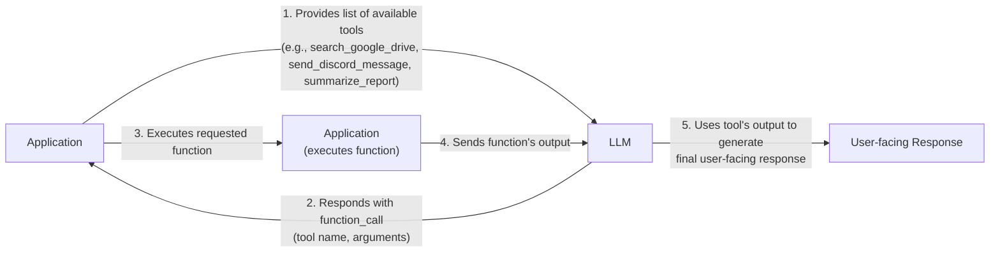
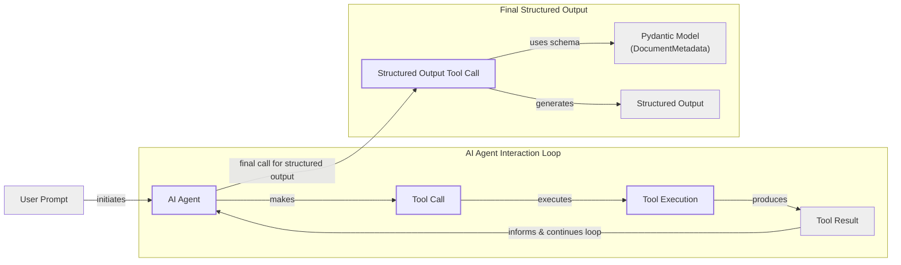
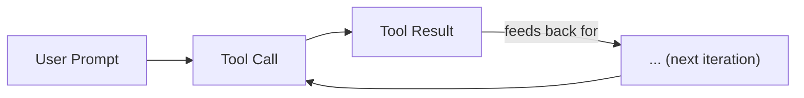

# Lesson 6: Agent Tools & Function Calling

## Introduction

In the previous lessons, we built a solid foundation in AI Engineering. We explored the agent landscape, distinguished between rule-based LLM workflows and autonomous agents, practiced context engineering to manage information flow, and learned how to get reliable, structured outputs from LLMs. Now, we will give our agents the ability to interact with the world.

This lesson is about tools, also known as function calling. Tools are what transform an LLM from a simple text generator into an agent that can take action. For an AI Engineer, understanding how an agent works with tools is one of the most critical skills for building, debugging, and monitoring production-ready AI applications. We will open the black box to see how an agent decides which tool to call, how it generates the correct parameters, and how the entire process works from scratch to production.

## Understanding Why Agents Need Tools

LLMs have a fundamental limitation: they are sophisticated pattern matchers and text generators. They operate on the vast knowledge encoded in their weights but cannot, by themselves, interact with the external world. They are a "brain" without "hands and senses." This limitation is addressed by tools, which act as the bridge between an LLM's internal reasoning and the outside world.

This gap between intent and action is what Human-Computer Interaction (HCI) researchers call an "execution gulf." A text-only interface lacks the clear "affordances"—like buttons or menus—that guide users in traditional software. Tool schemas bridge this gulf by providing the LLM with a structured, explicit description of what actions are possible, making them discoverable and usable [[23]](https://arxiv.org/html/2309.14459v1). By giving an LLM access to tools, we transform it into an AI agent that can perceive and act on its environment.

This capability unlocks a wide range of applications. Here are a few examples of popular tools that power modern AI agents:
-   **Accessing real-time information** through APIs, such as getting today's weather or the latest news [[19]](https://lnu.diva-portal.org/smash/get/diva2:1801354/FULLTEXT01.pdf). This overcomes the static nature of an LLM's training data.
-   **Interacting with external databases** or other storage solutions, like querying a PostgreSQL database, a Snowflake data warehouse, or an S3 data lake.
-   **Accessing an agent's long-term memory** to recall information beyond its context window, enabling continuity across conversations.
-   **Executing code** in a sandboxed environment, such as running Python scripts for complex calculations or data analysis, which enhances the LLM's ability to solve complex tasks [[10]](https://arxiv.org/html/2507.08034v1).
-   **Performing precise calculations** that go beyond the LLM's training data, like basic math, sorting, or filtering.

By integrating these external capabilities, agents can overcome the static nature of their training data and perform dynamic, real-world tasks. Now that we understand why tools are essential, let's get our hands dirty and build the entire mechanism from scratch.

## Implementing Tool Calls from Scratch

The best way to understand how tools work is to build the mechanism from scratch. Our goal is to provide an LLM with a list of available tools and let it decide which one to use, generating the correct arguments needed to call the function.

### The Tool-Calling Flow

The high-level process involves five steps:
1.  **Application:** You send the LLM a prompt and a list of available tools, described via a schema.
2.  **LLM:** The model analyzes the prompt and responds with a `function_call` request, specifying the tool's name and the arguments it needs.
3.  **Application:** Your code parses this request and executes the corresponding function with the provided arguments.
4.  **Application:** You send the function's output back to the LLM as additional context.
5.  **LLM:** The model uses the tool's output to generate a final, user-facing response.

This request-execute-respond flow is the foundation of all tool-using agents.


Image 1: A flowchart illustrating the 5-step process of calling a tool, highlighting the request-execute-respond flow.

Let's implement a simple example where we mock searching for a document on Google Drive and sending its summary to a Discord channel.

<aside>
💡

You can find all the code for this lesson in the accompanying notebook in our course's GitHub repository.

</aside>

### Setup and Tool Definition

First, we set up our environment by initializing the Gemini client and defining our model and a sample document to work with. We will use `gemini-2.5-flash`, which is fast and cost-effective for our examples.

```python
import json
from typing import Any

from google import genai
from google.genai import types
from pydantic import BaseModel, Field

from lessons.utils import env, pretty_print

env.load(required_env_vars=["GOOGLE_API_KEY"])

client = genai.Client()

MODEL_ID = "gemini-2.5-flash"

DOCUMENT = """
# Q3 2023 Financial Performance Analysis

The Q3 earnings report shows a 20% increase in revenue and a 15% growth in user engagement, 
beating market expectations. These impressive results reflect our successful product strategy 
and strong market positioning.

Our core business segments demonstrated remarkable resilience, with digital services leading 
the growth at 25% year-over-year. The expansion into new markets has proven particularly 
successful, contributing to 30% of the total revenue increase.

Customer acquisition costs decreased by 10% while retention rates improved to 92%, 
marking our best performance to date. These metrics, combined with our healthy cash flow 
position, provide a strong foundation for continued growth into Q4 and beyond.
"""
```

Next, we define three mock functions to simulate our tools. The function signatures and docstrings are crucial, as the LLM will use this information to understand what each tool does.

```python
def search_google_drive(query: str) -> dict:
    """
    Searches for a file on Google Drive and returns its content or a summary.

    Args:
        query (str): The search query to find the file, e.g., 'Q3 earnings report'.

    Returns:
        dict: A dictionary representing the search results, including file names and summaries.
    """
    return {
        "files": [
            {
                "name": "Q3_Earnings_Report_2024.pdf",
                "id": "file12345",
                "content": DOCUMENT,
            }
        ]
    }
```

```python
def send_discord_message(channel_id: str, message: str) -> dict:
    """
    Sends a message to a specific Discord channel.

    Args:
        channel_id (str): The ID of the channel to send the message to, e.g., '#finance'.
        message (str): The content of the message to send.

    Returns:
        dict: A dictionary confirming the action, e.g., {"status": "success"}.
    """
    return {
        "status": "success",
        "status_code": 200,
        "channel": channel_id,
        "message_preview": f"{message[:50]}...",
    }
```

```python
def summarize_financial_report(text: str) -> str:
    """
    Summarizes a financial report.

    Args:
        text (str): The text to summarize.

    Returns:
        str: The summary of the text.
    """
    return "The Q3 2023 earnings report shows strong performance across all metrics with 20% revenue growth, 15% user engagement increase, 25% digital services growth, and improved retention rates of 92%."
```

### Defining Tool Schemas

We then define a JSON schema for each tool. This schema tells the LLM the tool's name, what it does (`description`), and what arguments it expects (`parameters`). This is the industry standard for modern LLM providers like OpenAI and Gemini [[1]](https://platform.openai.com/docs/guides/function-calling), [[2]](https://ai.google.dev/gemini-api/docs/function-calling).

```python
search_google_drive_schema = {
    "name": "search_google_drive",
    "description": "Searches for a file on Google Drive and returns its content or a summary.",
    "parameters": {
        "type": "object",
        "properties": {
            "query": {
                "type": "string",
                "description": "The search query to find the file, e.g., 'Q3 earnings report'.",
            }
        },
        "required": ["query"],
    },
}

send_discord_message_schema = {
    "name": "send_discord_message",
    "description": "Sends a message to a specific Discord channel.",
    "parameters": {
        "type": "object",
        "properties": {
            "channel_id": {
                "type": "string",
                "description": "The ID of the channel to send the message to, e.g., '#finance'.",
            },
            "message": {
                "type": "string",
                "description": "The content of the message to send.",
            },
        },
        "required": ["channel_id", "message"],
    },
}

summarize_financial_report_schema = {
    "name": "summarize_financial_report",
    "description": "Summarizes a financial report.",
    "parameters": {
        "type": "object",
        "properties": {
            "text": {
                "type": "string",
                "description": "The text to summarize.",
            },
        },
        "required": ["text"],
    },
}
```

### Creating a Tool Registry

We create a tool registry to map tool names to their handlers (the Python functions) and schemas.

```python
TOOLS = {
    "search_google_drive": {
        "handler": search_google_drive,
        "declaration": search_google_drive_schema,
    },
    "send_discord_message": {
        "handler": send_discord_message,
        "declaration": send_discord_message_schema,
    },
    "summarize_financial_report": {
        "handler": summarize_financial_report,
        "declaration": summarize_financial_report_schema,
    },
}
TOOLS_BY_NAME = {tool_name: tool["handler"] for tool_name, tool in TOOLS.items()}
TOOLS_SCHEMA = [tool["declaration"] for tool in TOOLS.values()]
```

The `TOOLS_BY_NAME` mapping looks like this:

```text
Tool name: search_google_drive
Tool handler: <function search_google_drive at 0x104c7df80>
---------------------------------------------------------------------------
Tool name: send_discord_message
Tool handler: <function send_discord_message at 0x104c7de40>
---------------------------------------------------------------------------
Tool name: summarize_financial_report
Tool handler: <function summarize_financial_report at 0x1274f5c60>
---------------------------------------------------------------------------
```

And here is an example schema from `TOOLS_SCHEMA`:

```text
{
    "name": "search_google_drive",
    "description": "Searches for a file on Google Drive and returns its content or a summary.",
    "parameters": {
      "type": "object",
      "properties": {
        "query": {
          "type": "string",
          "description": "The search query to find the file, e.g., 'Q3 earnings report'."
        }
      },
      "required": [
        "query"
      ]
    }
}
```

### Crafting the System Prompt

Now, we need a system prompt to instruct the LLM on how to use these tools. This prompt defines guidelines, the expected output format, and provides the list of available tool schemas.

```python
TOOL_CALLING_SYSTEM_PROMPT = """
You are a helpful AI assistant with access to tools that enable you to take actions and retrieve information to better 
assist users.

## Tool Usage Guidelines

**When to use tools:**
- When you need information that is not in your training data
- When you need to perform actions in external systems and environments
- When you need real-time, dynamic, or user-specific data
- When computational operations are required

**Tool selection:**
- Choose the most appropriate tool based on the user's specific request
- If multiple tools could work, select the one that most directly addresses the need
- Consider the order of operations for multi-step tasks

**Parameter requirements:**
- Provide all required parameters with accurate values
- Use the parameter descriptions to understand expected formats and constraints
- Ensure data types match the tool's requirements (strings, numbers, booleans, arrays)

## Tool Call Format

When you need to use a tool, output ONLY the tool call in this exact format:

<tool_call>
{{"name": "tool_name", "args": {{"param1": "value1", "param2": "value2"}}}}
</tool_call>

**Critical formatting rules:**
- Use double quotes for all JSON strings
- Ensure the JSON is valid and properly escaped
- Include ALL required parameters
- Use correct data types as specified in the tool definition
- Do not include any additional text or explanation in the tool call

## Response Behavior

- If no tools are needed, respond directly to the user with helpful information
- If tools are needed, make the tool call first, then provide context about what you're doing
- After receiving tool results, provide a clear, user-friendly explanation of the outcome
- If a tool call fails, explain the issue and suggest alternatives when possible

## Available Tools

<tool_definitions>
{tools}
</tool_definitions>

Remember: Your goal is to be maximally helpful to the user. Use tools when they add value, but don't use them unnecessarily. Always prioritize accuracy and user experience.
"""
```

Based on the `description` field in the tool schema, the LLM decides if a tool is appropriate for the user's query. This is why clear and distinct tool descriptions are critical. Vague descriptions like "Tool to search documents" and "Tool to search files" would confuse the model. Instead, be explicit: "Tool to search documents on Google Drive" and "Tool to search files on the local disk." This clarity becomes even more important as you scale to dozens or even hundreds of tools per agent. We will dig more into scaling methods in parts 2 and 3 of the course.

Another disambiguation method is to be explicit in your user prompts. Instead of saying "search documents," guide the agent by specifying where to search, such as "search documents on Google Drive." By defining clear tool descriptions and system prompts, you ensure the agent can make the necessary matches and call the right tools. The LLM is specially tuned through instruction fine-tuning to interpret these schemas and generate the appropriate tool calls as structured JSON.

### Making the First Tool Call

Let's test it. We send a user prompt along with our system prompt to the model.

```python
USER_PROMPT = """
Can you help me find the latest quarterly report and share key insights with the team?
"""

messages = [TOOL_CALLING_SYSTEM_PROMPT.format(tools=str(TOOLS_SCHEMA)), USER_PROMPT]

response = client.models.generate_content(
    model=MODEL_ID,
    contents=messages,
)
```

The LLM correctly identifies the `search_google_drive` tool and generates the required arguments:

```text
<tool_call>
{"name": "search_google_drive", "args": {"query": "latest quarterly report"}}
</tool_call>
```

With a more complex prompt, the model still correctly identifies the first step.

```python
USER_PROMPT = """
Please find the Q3 earnings report on Google Drive and send a summary of it to 
the #finance channel on Discord.
"""

messages = [TOOL_CALLING_SYSTEM_PROMPT.format(tools=str(TOOLS_SCHEMA)), USER_PROMPT]

response = client.models.generate_content(
    model=MODEL_ID,
    contents=messages,
)
```

It outputs:

```text
<tool_call>
{"name": "search_google_drive", "args": {"query": "Q3 earnings report"}}
</tool_call>
```

### Parsing and Executing the Tool Call

Now we need to parse the LLM's response and execute the tool. We start by extracting the JSON string.

```python
def extract_tool_call(response_text: str) -> str:
    """
    Extracts the tool call from the response text.
    """
    return response_text.split("<tool_call>")[1].split("</tool_call>")[0].strip()


tool_call_str = extract_tool_call(response.text)
```

This gives us a string: `{"name": "search_google_drive", "args": {"query": "Q3 earnings report"}}`. We parse it into a Python dictionary.

```python
tool_call = json.loads(tool_call_str)
```

Next, we retrieve the correct function (handler) from our `TOOLS_BY_NAME` registry and call it with the arguments provided by the LLM.

```python
tool_handler = TOOLS_BY_NAME[tool_call["name"]]
# tool_handler is <function __main__.search_google_drive(query: str) -> dict>

tool_result = tool_handler(**tool_call["args"])
```

The tool returns the mocked document content:

```text
{
    "files": [
      {
        "name": "Q3_Earnings_Report_2024.pdf",
        "id": "file12345",
        "content": "\n# Q3 2023 Financial Performance Analysis\n\nThe Q3 earnings report shows a 20% increase in revenue and a 15% growth in user engagement, \nbeating market expectations..."
      }
    ]
}
```

We can wrap this logic in a helper function, `call_tool`, to streamline the process.

```python
def call_tool(response_text: str, tools_by_name: dict) -> Any:
    """
    Call a tool based on the response from the LLM.
    """

    tool_call_str = extract_tool_call(response_text)
    tool_call = json.loads(tool_call_str)
    tool_name = tool_call["name"]
    tool_args = tool_call["args"]
    tool = tools_by_name[tool_name]

    return tool(**tool_args)
```

### Interpreting the Tool Result

Finally, we send the tool's result back to the LLM so it can interpret the information and formulate a final response or decide on the next step.

```python
response = client.models.generate_content(
    model=MODEL_ID,
    contents=f"Interpret the tool result: {json.dumps(tool_result, indent=2)}",
)
```

The LLM provides a helpful summary based on the document content it received:

```text
The tool result provides the content of a file named `Q3_Earnings_Report_2024.pdf`.

This document is a **Q3 2023 Financial Performance Analysis** and details exceptionally strong results, significantly beating market expectations.

**Key highlights from the report include:**
*   **Revenue Growth:** A 20% increase in revenue.
*   **User Engagement:** 15% growth in user engagement.
...
```

That is the basic concept of tool calling. We have successfully implemented it from scratch, giving us a clear view of the underlying mechanics.

## Implementing a Small Tool Calling Framework

Manually defining JSON schemas for every function is tedious and error-prone. Production frameworks like LangGraph and protocols like MCP (Model-Context-Protocol) solve this by using a `@tool` decorator to automatically generate and register schemas from Python functions. This approach respects the "Don't Repeat Yourself" (DRY) principle by creating a single source of truth from the function's signature and docstring. This automation is not just a convenience; it is a core practice for building scalable and maintainable agentic systems.

Let's build our own simple framework using this pattern. By abstracting away the schema generation, we can focus more on the logic of our tools and less on the boilerplate.

### The `@tool` Decorator

We will create a `@tool` decorator that inspects a function's signature and docstring to generate the JSON schema automatically. This allows us to define tools more cleanly and maintainably. The decorator will wrap our Python functions in a `ToolFunction` class, which will store both the original function and its generated schema. This makes our tools self-describing.

1.  First, we define a `ToolFunction` class to wrap our decorated functions and their schemas. This class will hold both the callable function and its generated schema.

    ```python
    from inspect import Parameter, signature
    from typing import Any, Callable, Dict, Optional
    
    
    class ToolFunction:
        def __init__(self, func: Callable, schema: Dict[str, Any]) -> None:
            self.func = func
            self.schema = schema
            self.__name__ = func.__name__
            self.__doc__ = func.__doc__
    
        def __call__(self, *args: Any, **kwargs: Any) -> Any:
            return self.func(*args, **kwargs)
    ```

2.  Next, we create the `@tool` decorator itself. It uses Python's built-in `inspect` module to read the function's signature, including parameter names and default values. It then constructs the `properties` and `required` fields for the JSON schema. The tool's `description` is taken from the function's docstring. This process automates the schema creation we performed manually in the previous section.

    ```python
    def tool(description: Optional[str] = None) -> Callable[[Callable], ToolFunction]:
        """
        A decorator that creates a tool schema from a function.
        """
    
        def decorator(func: Callable) -> ToolFunction:
            sig = signature(func)
            properties = {}
            required = []
    
            for param_name, param in sig.parameters.items():
                if param_name == "self":
                    continue
    
                param_schema = {
                    "type": "string",
                    "description": f"The {param_name} parameter",
                }
    
                if param.default == Parameter.empty:
                    required.append(param_name)
    
                properties[param_name] = param_schema
    
            schema = {
                "name": func.__name__,
                "description": description or func.__doc__ or f"Executes the {func.__name__} function.",
                "parameters": {
                    "type": "object",
                    "properties": properties,
                    "required": required,
                },
            }
    
            return ToolFunction(func, schema)
    
        return decorator
    ```

### Using the Framework

Now, we can redefine our tools by simply applying the decorator. The schema is generated automatically from the function's docstring and type hints.

1.  We decorate our functions and create the tool registry.

    ```python
    @tool()
    def search_google_drive_example(query: str) -> dict:
        """Search for files in Google Drive."""
        return {"files": ["Q3 earnings report"]}
    
    
    @tool()
    def send_discord_message_example(channel_id: str, message: str) -> dict:
        """Send a message to a Discord channel."""
        return {"message": "Message sent successfully"}
    
    
    @tool()
    def summarize_financial_report_example(text: str) -> str:
        """Summarize the contents of a financial report."""
        return "Financial report summarized successfully"
    
    
    tools = [
        search_google_drive_example,
        send_discord_message_example,
        summarize_financial_report_example,
    ]
    tools_by_name = {tool.schema["name"]: tool.func for tool in tools}
    tools_schema = [tool.schema for tool in tools]
    ```

2.  The decorated function is now a `ToolFunction` object. We can inspect its generated schema, which is identical to the one we created manually. The type is now `__main__.ToolFunction`, and we can access the schema via `search_google_drive_example.schema`:

    ```text
    {
      "name": "search_google_drive_example",
      "description": "Search for files in Google Drive.",
      "parameters": {
        "type": "object",
        "properties": {
          "query": {
            "type": "string",
            "description": "The query parameter"
          }
        },
        "required": [
          "query"
        ]
      }
    }
    ```

    The original function is accessible via `search_google_drive_example.func`.

3.  Let's run the same user prompt as before. The LLM's behavior is the same, as it receives the same schema.

    ```python
    USER_PROMPT = """
    Please find the Q3 earnings report on Google Drive and send a summary of it to 
    the #finance channel on Discord.
    """
    
    messages = [TOOL_CALLING_SYSTEM_PROMPT.format(tools=str(tools_schema)), USER_PROMPT]
    
    response = client.models.generate_content(
        model=MODEL_ID,
        contents=messages,
    )
    ```

    The model returns the expected tool call:

    ```text
    <tool_call>
    {"name": "search_google_drive_example", "args": {"query": "Q3 earnings report"}}
    </tool_call>
    ```

    And executing it with our `call_tool` function works just as before.

    ```python
    call_tool(response.text, tools_by_name=tools_by_name)
    ```

    It outputs:

    ```text
    {'files': ['Q3 earnings report']}
    ```

Voilà! We have built a small, reusable tool-calling framework. This implementation is very similar to what frameworks like LangChain and the OpenAI Agents SDK do under the hood to simplify tool definition [[18]](https://docs.langchain.com/oss/python/langchain/tools), [[15]](https://openai.github.io/openai-agents-python/tools/).

## Implementing Production-Level Tool Calls with Gemini

While implementing tool calling from scratch provides great insight, in production we typically leverage the native features of LLM APIs like Gemini or OpenAI. These APIs handle the complex prompt engineering internally, ensuring the instructions are optimized for their specific models. This approach is simpler, more robust, and more efficient.

Let's refactor our example to use Gemini's native tool-calling capabilities.

### Using Native Tool Schemas

Instead of manually creating a system prompt, we can pass our tool schemas directly to the Gemini API through a `GenerateContentConfig` object. This object allows us to configure various aspects of the content generation process, including the tools the model can use.

1.  First, we define the configuration, passing our tool schemas. We also set the `mode` to `"ANY"` to force the model to call a tool instead of generating a text response.

    ```python
    tools = [
        types.Tool(
            function_declarations=[
                types.FunctionDeclaration(**search_google_drive_schema),
                types.FunctionDeclaration(**send_discord_message_schema),
            ]
        )
    ]
    config = types.GenerateContentConfig(
        tools=tools,
        tool_config=types.ToolConfig(function_calling_config=types.FunctionCallingConfig(mode="ANY")),
    )
    ```

2.  With this configuration, we no longer need our lengthy `TOOL_CALLING_SYSTEM_PROMPT`. We can send the user prompt directly to the model, and Gemini handles the rest.

    ```python
    response = client.models.generate_content(
        model=MODEL_ID,
        contents=USER_PROMPT,
        config=config,
    )
    ```

3.  The response contains a `function_call` object that is easy to parse and use.

    ```python
    response_message_part = response.candidates[0].content.parts[0]
    function_call = response_message_part.function_call
    ```

    The `function_call` object looks like this: `FunctionCall(id=None, args={'query': 'Q3 earnings report'}, name='search_google_drive')`.

### Automatic Schema Generation

To simplify even further, the `google-genai` Python SDK can automatically generate the schema from a Python function's signature, type hints, and docstring, just like our custom decorator. We can pass our functions directly to the `GenerateContentConfig` [[20]](https://www.philschmid.de/gemini-function-calling).

1.  We create a new `config` object by passing the Python functions directly.

    ```python
    config = types.GenerateContentConfig(
        tools=[search_google_drive, send_discord_message],
        tool_config=types.ToolConfig(function_calling_config=types.FunctionCallingConfig(mode="ANY")),
    )
    ```

2.  We can now create a simplified `call_tool` function to execute the native Gemini `function_call` object.

    ```python
    def call_tool(function_call) -> Any:
        tool_name = function_call.name
        tool_args = {key: value for key, value in function_call.args.items()}
        tool_handler = TOOLS_BY_NAME[tool_name]
        return tool_handler(**tool_args)
    
    tool_result = call_tool(function_call)
    ```

By leveraging the native SDK, we reduced dozens of lines of code for schema definition and system prompting to just a few, creating a more robust and maintainable system. All popular LLM provider APIs, including OpenAI and Anthropic, follow a similar logic, making these concepts easily transferable to your API of choice [[1]](https://platform.openai.com/docs/guides/function-calling), [[2]](https://ai.google.dev/gemini-api/docs/function-calling).

### Production Library Comparison: Gemini vs. OpenAI

While the core concepts are similar, different providers have minor differences in their API interfaces. For instance, OpenAI's API uses a `tools` list and a `tool_choice` parameter, and the response contains a `tool_calls` object [[1]](https://platform.openai.com/docs/guides/function-calling). In contrast, Gemini uses a `GenerateContentConfig` object and returns a `function_call` in the response parts [[2]](https://ai.google.dev/gemini-api/docs/function-calling).

Here is a quick comparison for a simple tool call:

**Gemini:**
```python
config = types.GenerateContentConfig(tools=[my_function])
response = client.models.generate_content(model="gemini-2.5-flash", contents=prompt, config=config)
tool_call = response.candidates[0].content.parts[0].function_call
```

**OpenAI:**
```python
tools = [{"type": "function", "function": my_function_schema}]
response = client.chat.completions.create(model="gpt-4o-mini", messages=messages, tools=tools)
tool_call = response.choices[0].message.tool_calls[0]
```

Despite these syntactic differences, the underlying workflow remains the same: define tools with schemas, let the model decide when to call them, execute the function, and return the result. This conceptual consistency makes it straightforward to adapt your skills across different platforms.

## Using Pydantic Models as Tools for On-Demand Structured Outputs

Connecting this lesson with what we learned about structured outputs in Lesson 4, we can use a Pydantic model as a tool. This is a powerful pattern for agentic workflows where you might need to perform several intermediate steps before generating a final, validated, structured output. The agent can use various tools for reasoning and data gathering, and when it is ready to produce the final answer, it "calls" the Pydantic model tool to ensure the output conforms to a specific schema.

This approach combines the flexibility of an agent that can decide *when* to produce a structured output with the reliability of Pydantic's validation. It is particularly useful in multi-step tasks where intermediate results can be free-form text (easier for an LLM to process), but the final output must be machine-readable for downstream systems.


Image 2: A diagram illustrating an AI agent interacting with multiple tools in a loop, culminating in a structured output tool call using a Pydantic model.

Let's see how to implement this.

### Defining the Pydantic Tool

We start by defining our `DocumentMetadata` Pydantic model, just as we did in Lesson 4.

```python
class DocumentMetadata(BaseModel):
    """A class to hold structured metadata for a document."""

    summary: str = Field(description="A concise, 1-2 sentence summary of the document.")
    tags: list[str] = Field(description="A list of 3-5 high-level tags relevant to the document.")
    keywords: list[str] = Field(description="A list of specific keywords or concepts mentioned.")
    quarter: str = Field(description="The quarter of the financial year described in the document (e.g., Q3 2023).")
    growth_rate: str = Field(description="The growth rate of the company described in the document (e.g., 10%).")
```

### Configuring the Tool Call

Next, we create a tool declaration for our Pydantic model. We use `DocumentMetadata.model_json_schema()` to provide the parameters, effectively telling the LLM to fill out this Pydantic object.

```python
extraction_tool = types.Tool(
    function_declarations=[
        types.FunctionDeclaration(
            name="extract_metadata",
            description="Extracts structured metadata from a financial document.",
            parameters=DocumentMetadata.model_json_schema(),
        )
    ]
)
config = types.GenerateContentConfig(
    tools=[extraction_tool],
    tool_config=types.ToolConfig(function_calling_config=types.FunctionCallingConfig(mode="ANY")),
)
```

### Executing the Extraction

We then prompt the model to analyze our document and extract the metadata.

```python
prompt = f"""
Please analyze the following document and extract its metadata.

Document:
--- 
{DOCUMENT}
--- 
"""

response = client.models.generate_content(model=MODEL_ID, contents=prompt, config=config)
response_message_part = response.candidates[0].content.parts[0]
```

The model responds with a function call to `extract_metadata`, and its arguments are the structured data we requested.

```text
Function Name: `extract_metadata
Function Arguments: `{
    "growth_rate": "20%",
    "summary": "The Q3 2023 earnings report shows a 20% increase in revenue and 15% growth in user engagement, driven by successful product strategy and market expansion. This performance provides a strong foundation for continued growth.",
    "quarter": "Q3 2023",
    "keywords": [
      "Revenue",
      "User Engagement",
      ...
    ],
    "tags": [
      "Financials",
      "Earnings",
      ...
    ]
}`
```

We can then validate this data by instantiating our Pydantic model, ensuring the output is both structured and correct.

```python
if hasattr(response_message_part, "function_call"):
    function_call = response_message_part.function_call
    try:
        document_metadata = DocumentMetadata(**function_call.args)
        print("Validation successful!")
    except Exception as e:
        print(f"Validation failed: {e}")
```

This pattern is extremely common in AI agents that require structured data as their final output, combining the flexibility of multi-step reasoning with the reliability of validated schemas.

## The Downsides of Running Tools in a Loop

So far, we have focused on single-turn interactions. The next logical step is to chain multiple tools together, allowing an agent to perform complex, multi-step tasks. In this setup, the LLM decides which tool to call at each step based on the output of the previous one. This is the final piece of the puzzle needed to build a true AI agent.

This iterative process gives the agent flexibility and adaptability. It can break down a complex request like "find the Q3 report and send a summary to the finance channel" into a sequence of actions: search, summarize, and send.


Image 3: A flowchart illustrating a continuous tool calling loop, starting with a user prompt and iteratively calling tools based on previous results.

Let's implement this loop.

### Implementing the Loop

First, we configure our model with all three of our tools: `search_google_drive`, `send_discord_message`, and `summarize_financial_report`.

```python
tools = [
    types.Tool(
        function_declarations=[
            types.FunctionDeclaration(**search_google_drive_schema),
            types.FunctionDeclaration(**send_discord_message_schema),
            types.FunctionDeclaration(**summarize_financial_report_schema),
        ]
    )
]
config = types.GenerateContentConfig(
    tools=tools,
    tool_config=types.ToolConfig(function_calling_config=types.FunctionCallingConfig(mode="ANY")),
)
```

We start with the same user prompt as before and create a list to hold the conversation history.

```python
USER_PROMPT = """
Please find the Q3 earnings report on Google Drive and send a summary of it to 
the #finance channel on Discord.
"""

messages = [USER_PROMPT]
```

We initiate the loop by sending the first message to the model. We'll loop until the model stops requesting tool calls or we hit a maximum number of iterations.

```python
response = client.models.generate_content(
    model=MODEL_ID,
    contents=messages,
    config=config,
)
response_message_part = response.candidates[0].content.parts[0]
messages.append(response.candidates[0].content)

max_iterations = 3
while hasattr(response_message_part, "function_call") and max_iterations > 0:
    # Call the tool requested by the model
    tool_result = call_tool(response_message_part.function_call)

    # Add the tool result to the message history
    function_response_part = types.Part.from_function_response(
        name=response_message_part.function_call.name,
        response={"result": tool_result},
    )
    messages.append(function_response_part)

    # Send the updated history to the model for the next step
    response = client.models.generate_content(
        model=MODEL_ID,
        contents=messages,
        config=config,
    )

    response_message_part = response.candidates[0].content.parts[0]
    messages.append(response.candidates[0].content)
    max_iterations -= 1
```

The agent successfully chains the tools. It first calls `search_google_drive`, then `summarize_financial_report` on the result, and finally `send_discord_message` with the summary.

### Limitations of Simple Loops

However, this simple loop has significant limitations. It assumes the agent should call a tool at every step and doesn't give the model a chance to *reason* about the results before acting again. The agent moves directly to the next function call without pausing to think about what it has learned or whether its strategy needs to change. This can lead to inefficient tool usage or getting stuck in loops.

In production systems, this lack of reasoning can manifest as "iteration anomalies." While specific company post-mortems on this topic are rare, the failure pattern is well-documented in research and widely acknowledged by practitioners. For example, a customer support agent might get stuck in a loop silently calling a knowledge base tool that repeatedly returns an error, never converging on an answer and eventually timing out or hallucinating a response [[22]](https://myengineeringpath.dev/genai-engineer/agentic-patterns/). This happens because the agent over-relies on shallow heuristics, like keyword fixation from a previous step, and lacks the self-correction capability to break out of the loop when it stops making progress [[26]](https://arxiv.org/html/2509.13941v1).

For example, if the search tool failed, a more intelligent agent might try a different query or notify the user. Our current loop would likely fail or continue making incorrect calls. To further optimize, when tools are independent, they can be run in parallel to reduce latency, such as fetching financial news and stock prices simultaneously.

These limitations are what led the industry to develop more sophisticated patterns like **ReAct (Reason + Act)**. ReAct introduces an explicit "thought" step, allowing the agent to reason about its observations before deciding on the next action. We will explore this powerful pattern in detail in Lessons 7 and 8.

## Popular Tools Used Within the Industry

To ground these concepts in the real world, let's look at some popular tool categories used across the industry.

### Knowledge & Memory Access
These tools connect agents to external knowledge sources, allowing them to retrieve information beyond their training data. This includes querying vector databases for semantic search, document stores for raw files, or graph databases for structured relationships. For example, a Neo4j knowledge graph can store connections between unstructured text and structured entities, allowing an agent to retrieve not just a relevant text chunk but also related products, risk factors, and company data in a single, graph-traversing query [[9]](https://neo4j.com/blog/agentic-ai/connected-context-and-persistent-memory-neo4j-providers-for-the-microsoft-agent-framework/).

A popular advanced pattern is text-to-SQL, where an agent constructs SQL queries to interact with traditional databases based on natural language prompts, democratizing data access for non-technical users [[13]](https://promethium.ai/guides/text-to-sql-basics-benefits/). When designing these tools, it's a best practice to return human-readable names or summaries instead of raw identifiers like UUIDs, as this provides more meaningful context for the agent's next reasoning step [[25]](https://www.anthropic.com/engineering/writing-tools-for-agents). These capabilities are fundamental to what is known as Retrieval-Augmented Generation, where an LLM's response is augmented with retrieved information. We will cover memory and this retrieval pattern in detail in Lessons 9 and 10.

### Web Search & Browsing
These are some of the most common tools, enabling agents to access up-to-date information from the internet. They typically interface with search engine APIs like Google Search, Bing, or Brave. More advanced versions include web scraping tools that can fetch and parse content directly from web pages, which is essential for research agents and chatbots that need to provide current information [[10]](https://arxiv.org/html/2507.08034v1). A key design principle is to create a few high-impact tools for specific workflows (e.g., `search_news_for_stock_ticker`) rather than just wrapping every low-level API endpoint [[25]](https://www.anthropic.com/engineering/writing-tools-for-agents). This focused approach helps the agent make better decisions by reducing the number of choices it has to consider.

### Code Execution
A code execution tool, most commonly a sandboxed Python interpreter, allows an agent to write and run code. This is invaluable for a wide range of tasks, including mathematical calculations, data manipulation, and statistical analysis [[10]](https://arxiv.org/html/2507.08034v1). While Python is the most popular, this pattern is also adapted for other languages like JavaScript. Executing LLM-generated code comes with security risks, which is why sandboxing is a critical component of this tool's architecture. To manage context usage, these tools should also implement features like pagination or truncation and provide helpful, actionable error messages to guide the agent if a call fails, rather than returning an opaque traceback [[25]](https://www.anthropic.com/engineering/writing-tools-for-agents).

### Other Popular Tools
Many enterprise AI applications rely on tools that interact with external APIs for services like calendars, email, and project management [[19]](https://lnu.diva-portal.org/smash/get/diva2:1801354/FULLTEXT01.pdf). For productivity apps, tools that perform file system operations—like reading and writing files or listing directories—are also common. In scenarios where actions have significant consequences, such as booking a flight or deleting a file, a human-in-the-loop tool is often implemented to require user confirmation before execution.

## Conclusion

Tool calling is a foundational skill for any AI Engineer. It is what elevates an LLM from a passive text generator to an active agent capable of interacting with its environment. By understanding how to define, call, and chain tools—from manual implementations to native API integrations—you gain the ability to build, monitor, and debug truly powerful AI applications.

This lesson has given our agents "hands and senses." Now, it is time to teach them how to "think." In our next lesson, we will explore the theory behind planning and reasoning, introducing the ReAct pattern that allows agents to deliberate on their actions and make more intelligent decisions. We will also continue to build on these concepts as we dive into memory, RAG, and multimodal processing—where tools themselves are evolving to handle images, audio, and video—in future lessons [[27]](https://www.getmaxim.ai/articles/exploring-the-future-of-ai-agents-trends-and-innovations-in-ai-agent-development/).

## References

- [1] [Function calling with OpenAI's API](https://platform.openai.com/docs/guides/function-calling)
- [2] [Function calling with the Gemini API](https://ai.google.dev/gemini-api/docs/function-calling)
- [3] [Tool Calling Agent From Scratch](https://www.youtube.com/watch?v=ApoDzZP8_ck)
- [4] [Efficient Tool Use with Chain-of-Abstraction Reasoning](https://arxiv.org/pdf/2401.17464v3)
- [5] [Building AI Agents from scratch - Part 1: Tool use](https://www.newsletter.swirlai.com/p/building-ai-agents-from-scratch-part)
- [6] [What is Tool Calling? Connecting LLMs to Your Data](https://www.youtube.com/watch?v=h8gMhXYAv1k)
- [7] [ReAct vs Plan-and-Execute: A Practical Comparison of LLM Agent Patterns](https://dev.to/jamesli/react-vs-plan-and-execute-a-practical-comparison-of-llm-agent-patterns-4gh9)
- [8] [Agentic Design Patterns Part 3, Tool Use](https://www.deeplearning.ai/the-batch/agentic-design-patterns-part-3-tool-use/)
- [9] [Connected Context and Persistent Memory: Neo4j Providers for the Microsoft Agent Framework](https://neo4j.com/blog/agentic-ai/connected-context-and-persistent-memory-neo4j-providers-for-the-microsoft-agent-framework/)
- [10] [Tool-Augmented-LLMs](https://arxiv.org/html/2507.08034v1)
- [11] [Prompting best practices for tool use/function calling](https://community.openai.com/t/prompting-best-practices-for-tool-use-function-calling/1123036)
- [12] [Building Production-Ready LLM Applications: Bulletproof LLM Tool Calling with Advanced JSON](https://medium.com/@hariomshahu101/building-production-ready-llm-applications-bulletproof-llm-tool-calling-with-advanced-json-b95ce8889f4e)
- [13] [Text-to-SQL: The Basics, Benefits, and How It Works](https://promethium.ai/guides/text-to-sql-basics-benefits/)
- [14] [Function Calling, Structured Tools, and the State of LLM-Powered Agents](https://mbrenndoerfer.com/writing/function-calling-llm-structured-tools)
- [15] [Tools - openai-agents](https://openai.github.io/openai-agents-python/tools/)
- [16] [How LLM Reasoning Powers the Agentic AI Revolution](https://medium.com/@anicomanesh/how-llm-reasoning-powers-the-agentic-ai-revolution-cbefd10ebf3f)
- [17] [Tools - pydantic-ai](https://pydantic.dev/docs/ai/tools-toolsets/tools/)
- [18] [Tools - LangChain](https://docs.langchain.com/oss/python/langchain/tools)
- [19] [Extending Large Language Models with APIs](https://lnu.diva-portal.org/smash/get/diva2:1801354/FULLTEXT01.pdf)
- [20] [Function Calling Guide: Google DeepMind Gemini 2.0 Flash](https://www.philschmid.de/gemini-function-calling)
- [21] [Output - Pydantic AI](https://pydantic.dev/docs/ai/core-concepts/output/)
- [22] [Agentic Design Patterns — Visual Architecture Guide](https://myengineeringpath.dev/genai-engineer/agentic-patterns/)
- [23] [Mind the Gap: A Study of Human-AI Collaboration in Programming](https://arxiv.org/html/2309.14459v1)
- [24] [Ambiguity in LLMs is a concept missing problem](https://arxiv.org/html/2505.11679v2)
- [25] [Writing effective tools for agents — with agents](https://www.anthropic.com/engineering/writing-tools-for-agents)
- [26] [An Empirical Study of Failures in Agentic Issue Solving Tools](https://arxiv.org/html/2509.13941v1)
- [27] [Exploring the Future of AI Agents: Trends and Innovations in AI Agent Development](https://www.getmaxim.ai/articles/exploring-the-future-of-ai-agents-trends-and-innovations-in-ai-agent-development/)