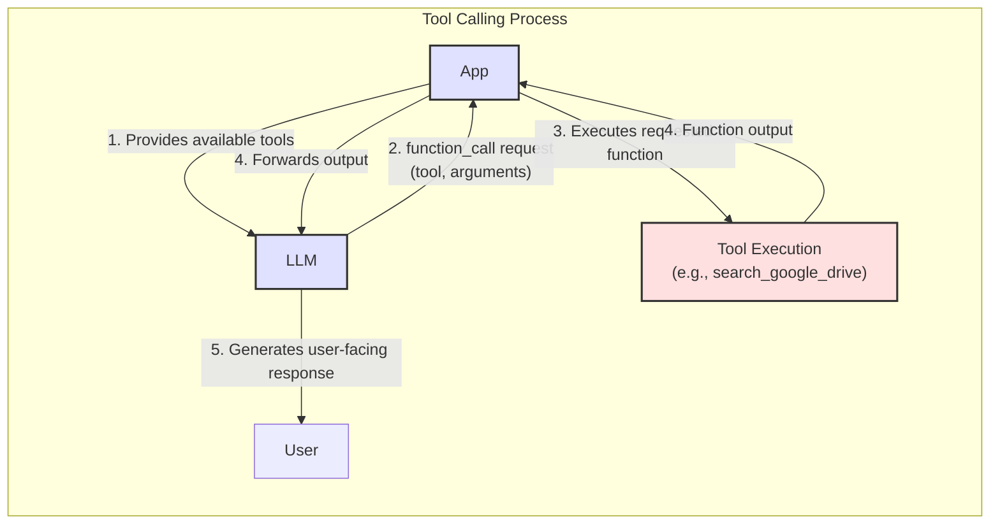
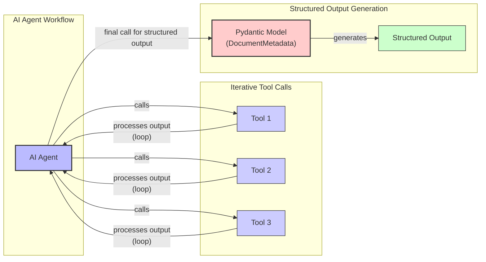
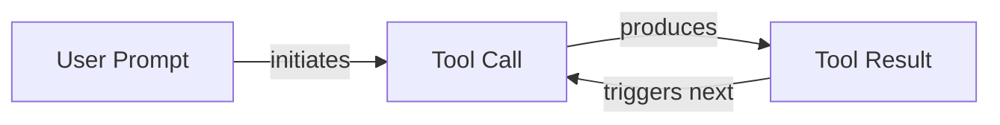

# Lesson 6: Agent Tools & Function Calling

In the previous lessons, we built a solid foundation in AI Engineering. We mapped the agent landscape, distinguished between rule-based workflows and autonomous agents, and mastered context engineering and structured outputs. Now, it is time to give our agents the ability to act.

This lesson explores tool use, the mechanism that transforms an LLM from a passive text generator into an agent that can interact with the external world. For an AI Engineer, tools are a foundational building block. Understanding how an agent decides which tool to use, generates the correct parameters, and interprets the results is not just a technical detail. It is the key to building, debugging, and monitoring effective AI applications. We will open this black box by implementing tool calling from scratch before moving on to production-grade techniques with modern APIs.

## Understanding Why Agents Need Tools

LLMs have a fundamental limitation: they are sophisticated pattern matchers and text generators, but they cannot perform actions or access real-time information on their own. They are brains in a vat, disconnected from the outside world. Tools solve this problem. If the LLM is the brain, tools are its "hands and senses," allowing it to perceive and act in the world beyond its training data.

The concept of tool use itself has evolved. Early systems used rigid workflows or simple plugins with predefined triggers. The modern agentic approach is more dynamic; the LLM itself decides when to call tools, can chain multiple tools together in complex sequences, and can even backtrack or reflect on a tool's output before proceeding. This shift from fixed orchestration to intelligent, model-driven action is what defines modern agentic systems [[37]](https://medium.com/@20011002nimeth/from-workflows-to-agents-the-evolution-of-llm-orchestration-7c7b8eb2eea5).

Tools are the bridge between an LLM's internal reasoning and the external environment. By equipping an LLM with tools, we transform it into an AI agent capable of executing tasks. This allows it to:

-   Access real-time information through APIs, like checking today's weather or fetching the latest news. This overcomes the "knowledge cutoff" problem, where an LLM's information is only as current as its last training date [[18]](https://lnu.diva-portal.org/smash/get/diva2:1801354/FULLTEXT01.pdf).
-   Interact with external databases and storage, from traditional SQL databases to vector stores. This enables agents to query private, domain-specific data that was not part of their training [[11]](https://neo4j.com/blog/agentic-ai/connected-context-and-persistent-memory-neo4j-providers-for-the-microsoft-agent-framework/), [[13]](https://promethium.ai/guides/text-to-sql-basics-benefits/).
-   Access its own long-term memory to recall information beyond its immediate context window, enabling personalized and stateful conversations [[12]](https://www.ruh.ai/blogs/how-vector-databases-are-rewiring-the-tech-industry).
-   Execute code in languages like Python to perform precise calculations, manipulate data, or create visualizations. This offloads tasks that LLMs are notoriously bad at, such as arithmetic, to a deterministic environment [[17]](https://medium.com/@anicomanesh/how-llm-reasoning-powers-the-agentic-ai-revolution-cbefd10ebf3f).

At a high level, the process is straightforward. Your application provides the LLM with a list of available tools. The LLM then decides which tool to call and with what arguments to fulfill a user's request. Your application executes the tool and sends the result back to the LLM, which uses that information to formulate a final response or decide on the next action.

## Implementing tool calls from scratch

The best way to understand how tools work is to build them from the ground up. In this section, we will implement a simple tool-calling mechanism from scratch. You will learn how to define a tool, create its schema, and guide an LLM to call it with the correct arguments. Our goal is to provide the LLM with a list of tools and let it decide which one to use to accomplish a task.

The process involves five main steps:

1.  **App:** We provide the LLM with a list of available tools in the system prompt.
2.  **LLM:** It analyzes the user's request and responds with a `function_call`, specifying the tool name and arguments.
3.  **App:** Our code parses this response and executes the requested function.
4.  **App:** We send the function's output back to the LLM as additional context.
5.  **LLM:** It uses the tool's output to generate a final, user-facing response.



Image 1: A flowchart illustrating the 5-step request-execute-respond flow of calling a tool, highlighting the interaction between the App and LLM, and the execution of the tools.

Now, let's implement a simple example where we mock searching for a document on Google Drive and sending its summary to a Discord channel.

<aside>
💡

You can find the code for this lesson in the accompanying [GitHub repository](https://github.com/towardsai/course-ai-agents/blob/dev/lessons/06_tools/notebook.ipynb) [[1]](https://github.com/towardsai/course-ai-agents/blob/dev/lessons/06_tools/notebook.ipynb).

</aside>

1.  We start by setting up our environment, initializing the Gemini client, and defining some constants. We will use `gemini-2.5-flash` for its speed and cost-effectiveness. The `DOCUMENT` constant will serve as a mock PDF for our example.
    ```python
    import json
    from typing import Any

    from google import genai
    from google.genai import types
    from pydantic import BaseModel, Field

    from lessons.utils import env, pretty_print

    env.load(required_env_vars=["GOOGLE_API_KEY"])

    client = genai.Client()
    MODEL_ID = "gemini-2.5-flash"

    DOCUMENT = """
    # Q3 2023 Financial Performance Analysis

    The Q3 earnings report shows a 20% increase in revenue and a 15% growth in user engagement, 
    beating market expectations. These impressive results reflect our successful product strategy 
    and strong market positioning.

    Our core business segments demonstrated remarkable resilience, with digital services leading 
    the growth at 25% year-over-year. The expansion into new markets has proven particularly 
    successful, contributing to 30% of the total revenue increase.

    Customer acquisition costs decreased by 10% while retention rates improved to 92%, 
    marking our best performance to date. These metrics, combined with our healthy cash flow 
    position, provide a strong foundation for continued growth into Q4 and beyond.
    """
    ```

2.  Next, we define three mock functions to simulate our tools. To keep the code simple and focus on the tool implementation, all the tools are mocked. The function signatures and docstrings are what the LLM will use to understand each tool's purpose.
    ```python
    def search_google_drive(query: str) -> dict:
        """
        Searches for a file on Google Drive and returns its content or a summary.

        Args:
            query (str): The search query to find the file, e.g., 'Q3 earnings report'.

        Returns:
            dict: A dictionary representing the search results, including file names and summaries.
        """

        # In a real scenario, this would interact with the Google Drive API.
        # Here, we mock the response for demonstration.
        return {
            "files": [
                {
                    "name": "Q3_Earnings_Report_2024.pdf",
                    "id": "file12345",
                    "content": DOCUMENT,
                }
            ]
        }
    ```
    ```python
    def send_discord_message(channel_id: str, message: str) -> dict:
        """
        Sends a message to a specific Discord channel.

        Args:
            channel_id (str): The ID of the channel to send the message to, e.g., '#finance'.
            message (str): The content of the message to send.

        Returns:
            dict: A dictionary confirming the action, e.g., {"status": "success"}.
        """

        # Mocking a successful API call to Discord.
        return {
            "status": "success",
            "status_code": 200,
            "channel": channel_id,
            "message_preview": f"{message[:50]}...",
        }
    ```
    ```python
    def summarize_financial_report(text: str) -> str:
        """
        Summarizes a financial report.

        Args:
            text (str): The text to summarize.

        Returns:
            str: The summary of the text.
        """

        return "The Q3 2023 earnings report shows strong performance across all metrics \
    with 20% revenue growth, 15% user engagement increase, 25% digital services growth, and \
    improved retention rates of 92%."
    ```

3.  For the LLM to use these functions, we must describe them in a format it understands. We define a JSON schema for each tool, which details its name, description, and parameters. This schema acts as a contract, telling the LLM what the tool does (based on the description) and what information it needs to run (based on the parameters) [[20]](https://tetrate.io/learn/ai/llm-output-parsing-structured-generation), [[3]](https://ai.google.dev/gemini-api/docs/function-calling). This is the industry standard for APIs like OpenAI and Gemini.
    ```python
    search_google_drive_schema = {
        "name": "search_google_drive",
        "description": "Searches for a file on Google Drive and returns its content or a summary.",
        "parameters": {
            "type": "object",
            "properties": {
                "query": {
                    "type": "string",
                    "description": "The search query to find the file, e.g., 'Q3 earnings report'.",
                }
            },
            "required": ["query"],
        },
    }
    ```
    ```python
    send_discord_message_schema = {
        "name": "send_discord_message",
        "description": "Sends a message to a specific Discord channel.",
        "parameters": {
            "type": "object",
            "properties": {
                "channel_id": {
                    "type": "string",
                    "description": "The ID of the channel to send the message to, e.g., '#finance'.",
                },
                "message": {
                    "type": "string",
                    "description": "The content of the message to send.",
                },
            },
            "required": ["channel_id", "message"],
        },
    }
    ```
    ```python
    summarize_financial_report_schema = {
        "name": "summarize_financial_report",
        "description": "Summarizes a financial report.",
        "parameters": {
            "type": "object",
            "properties": {
                "text": {
                    "type": "string",
                    "description": "The text to summarize.",
                },
            },
            "required": ["text"],
        },
    }
    ```

4.  We then create a tool registry to manage our tools and schemas. This centralizes our tool definitions, making them easier to manage and pass to the LLM.
    ```python
    TOOLS = {
        "search_google_drive": {
            "handler": search_google_drive,
            "declaration": search_google_drive_schema,
        },
        "send_discord_message": {
            "handler": send_discord_message,
            "declaration": send_discord_message_schema,
        },
        "summarize_financial_report": {
            "handler": summarize_financial_report,
            "declaration": summarize_financial_report_schema,
        },
    }
    TOOLS_BY_NAME = {tool_name: tool["handler"] for tool_name, tool in TOOLS.items()}
    TOOLS_SCHEMA = [tool["declaration"] for tool in TOOLS.values()]
    ```

5.  The `TOOLS_BY_NAME` mapping gives us easy access to the function handlers.
    It outputs:
    ```text
    Tool name: search_google_drive
    Tool handler: <function search_google_drive at 0x104c7df80>
    ---------------------------------------------------------------------------
    Tool name: send_discord_message
    Tool handler: <function send_discord_message at 0x104c7de40>
    ---------------------------------------------------------------------------
    Tool name: summarize_financial_report
    Tool handler: <function summarize_financial_report at 0x1274f5c60>
    ---------------------------------------------------------------------------
    ```

6.  And `TOOLS_SCHEMA` contains the list of schemas we will pass to the LLM. Here is the schema for our `search_google_drive` tool.
    It outputs:
    ```json
    {
      "name": "search_google_drive",
      "description": "Searches for a file on Google Drive and returns its content or a summary.",
      "parameters": {
        "type": "object",
        "properties": {
          "query": {
            "type": "string",
            "description": "The search query to find the file, e.g., 'Q3 earnings report'."
          }
        },
        "required": [
          "query"
        ]
      }
    }
    ```

7.  Now, we need a system prompt to instruct the LLM on how to use these tools. This prompt is critical; it defines the rules of engagement. It includes guidelines on when to use tools, the exact format for a tool call, how to behave after a tool is called, and a list of all available tools enclosed in XML tags.
    ```python
    TOOL_CALLING_SYSTEM_PROMPT = """
    You are a helpful AI assistant with access to tools that enable you to take actions and retrieve information to better 
    assist users.

    ## Tool Usage Guidelines

    **When to use tools:**
    - When you need information that is not in your training data
    - When you need to perform actions in external systems and environments
    - When you need real-time, dynamic, or user-specific data
    - When computational operations are required

    **Tool selection:**
    - Choose the most appropriate tool based on the user's specific request
    - If multiple tools could work, select the one that most directly addresses the need
    - Consider the order of operations for multi-step tasks

    **Parameter requirements:**
    - Provide all required parameters with accurate values
    - Use the parameter descriptions to understand expected formats and constraints
    - Ensure data types match the tool's requirements (strings, numbers, booleans, arrays)

    ## Tool Call Format

    When you need to use a tool, output ONLY the tool call in this exact format:

    <tool_call>
    {{"name": "tool_name", "args": {{"param1": "value1", "param2": "value2"}}}}
    </tool_call>

    **Critical formatting rules:**
    - Use double quotes for all JSON strings
    - Ensure the JSON is valid and properly escaped
    - Include ALL required parameters
    - Use correct data types as specified in the tool definition
    - Do not include any additional text or explanation in the tool call

    ## Response Behavior

    - If no tools are needed, respond directly to the user with helpful information
    - If tools are needed, make the tool call first, then provide context about what you're doing
    - After receiving tool results, provide a clear, user-friendly explanation of the outcome
    - If a tool call fails, explain the issue and suggest alternatives when possible

    ## Available Tools

    <tool_definitions>
    {tools}
    </tool_definitions>

    Remember: Your goal is to be maximally helpful to the user. Use tools when they add value, but don't use them unnecessarily. Always prioritize accuracy and user experience.
    """
    ```

8.  The LLM's decision-making process happens in two stages. First, it uses the `description` field in the tool schema to *decide* which tool, if any, is appropriate for the user's query. This is why clear and distinguishing tool descriptions are so important. Vague descriptions like "search documents" and "search files" will confuse the model. Explicit descriptions like "search documents on Google Drive" and "search files on the local disk" provide the clarity it needs. The descriptions you write are not just for human readers; they are the primary signal the model uses to decide whether and how to invoke the tool [[22]](https://mbrenndoerfer.com/writing/function-calling-llm-structured-tools). In fact, everything about the tools—their descriptions, parameters, and even the success or error messages they return—is a form of prompt engineering [[38]](https://pub.towardsai.net/tool-descriptions-are-critical-making-better-llm-tools-research-capability-b315851471e7).

9.  This becomes even more critical as you scale to dozens or even hundreds of tools per agent. Research shows that tool selection accuracy can drop from nearly 100% with a single tool to around 65% with 50 tools [[22]](https://mbrenndoerfer.com/writing/function-calling-llm-structured-tools). Being explicit in your system prompts also helps. Instead of asking the agent to "search documents," guide it by saying "search documents on Google Drive." By defining clear tool descriptions and system prompts, you ensure the agent can make the necessary matches and call the right tools.

10. Second, once a tool is selected, the model *generates* the function name and arguments as a structured JSON object. This capability is not magic; it is the result of extensive instruction fine-tuning, where models are specifically trained to interpret schema definitions and produce valid tool calls [[20]](https://tetrate.io/learn/ai/llm-output-parsing-structured-generation).

11. Let's test it. We send a user prompt along with our system prompt to the model.
    ```python
    USER_PROMPT = """
    Can you help me find the latest quarterly report and share key insights with the team?
    """

    messages = [TOOL_CALLING_SYSTEM_PROMPT.format(tools=str(TOOLS_SCHEMA)), USER_PROMPT]

    response = client.models.generate_content(
        model=MODEL_ID,
        contents=messages,
    )
    ```
    The LLM correctly identifies the `search_google_drive` tool and generates the required arguments.
    It outputs:
    ```text
    <tool_call>
    {"name": "search_google_drive", "args": {"query": "latest quarterly report"}}
    </tool_call>
    ```

12. Here is another example with a more complex, multi-step request.
    ```python
    USER_PROMPT = """
    Please find the Q3 earnings report on Google Drive and send a summary of it to 
    the #finance channel on Discord.
    """

    messages = [TOOL_CALLING_SYSTEM_PROMPT.format(tools=str(TOOLS_SCHEMA)), USER_PROMPT]

    response = client.models.generate_content(
        model=MODEL_ID,
        contents=messages,
    )
    ```
    The model correctly determines that the first step is to search for the report.
    It outputs:
    ```text
    <tool_call>
    {"name": "search_google_drive", "args": {"query": "Q3 earnings report"}}
    </tool_call>
    ```

13. Now we need to parse the LLM's response and execute the tool. We start by extracting the JSON string from the response.
    ```python
    def extract_tool_call(response_text: str) -> str:
        """
        Extracts the tool call from the response text.
        """
        return response_text.split("<tool_call>")[1].split("</tool_call>")[0].strip()


    tool_call_str = extract_tool_call(response.text)
    ```
    It outputs:
    ```text
    '{"name": "search_google_drive", "args": {"query": "Q3 earnings report"}}'
    ```

14. We parse the string into a Python dictionary.
    ```python
    tool_call = json.loads(tool_call_str)
    ```
    It outputs:
    ```json
    {'name': 'search_google_drive', 'args': {'query': 'Q3 earnings report'}}
    ```

15. Next, we retrieve the correct function handler from our `TOOLS_BY_NAME` dictionary.
    ```python
    tool_handler = TOOLS_BY_NAME[tool_call["name"]]
    ```
    It outputs:
    ```text
    <function search_google_drive at 0x104c7df80>
    ```

16. Finally, we call the function with the arguments generated by the LLM.
    ```python
    tool_result = tool_handler(**tool_call["args"])
    ```
    It outputs:
    ```json
    {
      "files": [
        {
          "name": "Q3_Earnings_Report_2024.pdf",
          "id": "file12345",
          "content": "\n# Q3 2023 Financial Performance Analysis\n\nThe Q3 earnings report shows a 20% increase in revenue and a 15% growth in user engagement, \nbeating market expectations. These impressive results reflect our successful product strategy \nand strong market positioning.\n\nOur core business segments demonstrated remarkable resilience, with digital services leading \nthe growth at 25% year-over-year. The expansion into new markets has proven particularly \nsuccessful, contributing to 30% of the total revenue increase.\n\nCustomer acquisition costs decreased by 10% while retention rates improved to 92%, \nmarking our best performance to date. These metrics, combined with our healthy cash flow \nposition, provide a strong foundation for continued growth into Q4 and beyond.\n"
        }
      ]
    }
    ```

17. We can wrap these steps into a single `call_tool` function for convenience.
    ```python
    def call_tool(response_text: str, tools_by_name: dict) -> Any:
        """
        Call a tool based on the response from the LLM.
        """

        tool_call_str = extract_tool_call(response_text)
        tool_call = json.loads(tool_call_str)
        tool_name = tool_call["name"]
        tool_args = tool_call["args"]
        tool = tools_by_name[tool_name]

        return tool(**tool_args)
    ```

18. Using our new function gives us the same result.
    ```python
    call_tool(response.text, tools_by_name=TOOLS_BY_NAME)
    ```
    It outputs:
    ```json
    {
      "files": [
        {
          "name": "Q3_Earnings_Report_2024.pdf",
          "id": "file12345",
          "content": "\n# Q3 2023 Financial Performance Analysis\n\nThe Q3 earnings report shows a 20% increase in revenue and a 15% growth in user engagement, \nbeating market expectations. These impressive results reflect our successful product strategy \nand strong market positioning.\n\nOur core business segments demonstrated remarkable resilience, with digital services leading \nthe growth at 25% year-over-year. The expansion into new markets has proven particularly \nsuccessful, contributing to 30% of the total revenue increase.\n\nCustomer acquisition costs decreased by 10% while retention rates improved to 92%, \nmarking our best performance to date. These metrics, combined with our healthy cash flow \nposition, provide a strong foundation for continued growth into Q4 and beyond.\n"
        }
      ]
    }
    ```

19. The final step is to send the tool's output back to the LLM. This allows the model to interpret the result and either generate a final response for the user or decide on the next action.
    ```python
    response = client.models.generate_content(
        model=MODEL_ID,
        contents=f"Interpret the tool result: {json.dumps(tool_result, indent=2)}",
    )
    ```
    It outputs:
    ```text
    The tool result provides the content of a file named `Q3_Earnings_Report_2024.pdf`.

    This document is a **Q3 2023 Financial Performance Analysis** and details exceptionally strong results, significantly beating market expectations.

    **Key highlights from the report include:**

    *   **Revenue Growth:** A 20% increase in revenue.
    *   **User Engagement:** 15% growth in user engagement.
    *   **Core Business Performance:** Digital services led growth at 25% year-over-year.
    *   **Market Expansion Success:** New markets contributed 30% of the total revenue increase.
    *   **Efficiency & Retention:**
        *   Customer acquisition costs decreased by 10%.
        *   Retention rates improved to 92%, marking the best performance to date.
    *   **Financial Health:** The company maintains a healthy cash flow position.

    The report attributes these impressive results to a successful product strategy and strong market positioning, indicating a robust foundation for continued growth into Q4 and beyond.
    ```
This covers the fundamental concepts of tool calling. We have successfully implemented a complete tool-use cycle from scratch.

## Implementing a small tool calling framework from scratch

Manually defining a JSON schema for every function is tedious and error-prone. Production frameworks simplify this by using a `@tool` decorator to automatically generate and register schemas from Python functions [[23]](https://pydantic.dev/docs/ai/tools-toolsets/tools/), [[24]](https://docs.langchain.com/oss/python/langchain/tools).

Let's build our own simple framework to demonstrate this pattern. The goal is to decorate a function with `@tool` and have its schema generated automatically from its signature and docstring. This approach follows the Don't Repeat Yourself (DRY) principle by creating a single source of truth for both the tool's implementation and its definition [[25]](https://openai.github.io/openai-agents-python/tools/).

In Python, a decorator is a function that takes another function as an argument and returns a new function, usually extending or modifying the original function's behavior without permanently altering its code. In our case, the `@tool` decorator will wrap our Python functions, inspect their properties like name, docstring, and parameters, and attach a generated schema to them. This allows us to define a tool once and have its schema available for the LLM automatically. The `inspect` module in Python's standard library is the key here, as it allows us to programmatically access information about live Python objects, including functions, their parameters, and their type hints.

Now, let's refactor our previous implementation to use a `@tool` decorator.

1.  First, we define a `ToolFunction` class to wrap our decorated functions and store their schemas. This class will hold both the executable function and its machine-readable schema.
    ```python
    from inspect import Parameter, signature
    from typing import Any, Callable, Dict, Optional


    class ToolFunction:
        def __init__(self, func: Callable, schema: Dict[str, Any]) -> None:
            self.func = func
            self.schema = schema
            self.__name__ = func.__name__
            self.__doc__ = func.__doc__

        def __call__(self, *args: Any, **kwargs: Any) -> Any:
            return self.func(*args, **kwargs)
    ```

2.  Next, we create the `@tool` decorator. It uses `inspect.signature` to get the function's parameters and builds the JSON schema dynamically. It extracts the function name, uses the docstring for the description, and iterates through the parameters to define the `properties` and `required` fields of the schema. This process of introspection allows our framework to be dynamic and less prone to manual errors.
    ```python
    def tool(description: Optional[str] = None) -> Callable[[Callable], ToolFunction]:
        """
        A decorator that creates a tool schema from a function.

        Args:
            description: Optional override for the function's docstring

        Returns:
            A decorator function that wraps the original function and adds a schema
        """

        def decorator(func: Callable) -> ToolFunction:
            # Get function signature
            sig = signature(func)

            # Create parameters schema
            properties = {}
            required = []

            for param_name, param in sig.parameters.items():
                # Skip self for methods
                if param_name == "self":
                    continue

                param_schema = {
                    "type": "string",  # Default to string, can be enhanced with type hints
                    "description": f"The {param_name} parameter",  # Default description
                }

                # Add to required if parameter has no default value
                if param.default == Parameter.empty:
                    required.append(param_name)

                properties[param_name] = param_schema

            # Create the tool schema
            schema = {
                "name": func.__name__,
                "description": description or func.__doc__ or f"Executes the {func.__name__} function.",
                "parameters": {
                    "type": "object",
                    "properties": properties,
                    "required": required,
                },
            }

            return ToolFunction(func, schema)

        return decorator
    ```

3.  Now, we can redefine our tools using the new decorator. The code is much cleaner and more maintainable, as the schema is generated implicitly.
    ```python
    @tool()
    def search_google_drive_example(query: str) -> dict:
        """Search for files in Google Drive."""
        return {"files": ["Q3 earnings report"]}


    @tool()
    def send_discord_message_example(channel_id: str, message: str) -> dict:
        """Send a message to a Discord channel."""
        return {"message": "Message sent successfully"}


    @tool()
    def summarize_financial_report_example(text: str) -> str:
        """Summarize the contents of a financial report."""
        return "Financial report summarized successfully"


    tools = [
        search_google_drive_example,
        send_discord_message_example,
        summarize_financial_report_example,
    ]
    ```

4.  The decorated function is now a `ToolFunction` object.
    It outputs:
    ```text
    <class '__main__.ToolFunction'>
    ```
    It contains the auto-generated schema, which is identical to the one we defined manually.
    It outputs:
    ```json
    {
      "name": "search_google_drive_example",
      "description": "Search for files in Google Drive.",
      "parameters": {
        "type": "object",
        "properties": {
          "query": {
            "type": "string",
            "description": "The query parameter"
          }
        },
        "required": [
          "query"
        ]
      }
    }
    ```
    It also holds a reference to the original function handler.
    It outputs:
    ```text
    <function search_google_drive_example at 0x12753a840>
    ```

5.  We build our tool mappings as before.
    ```python
    tools_by_name = {tool.schema["name"]: tool.func for tool in tools}
    tools_schema = [tool.schema for tool in tools]
    ```

6.  Let's run the full flow. The LLM call and tool execution work exactly as in our manual implementation.
    ```python
    USER_PROMPT = """
    Please find the Q3 earnings report on Google Drive and send a summary of it to 
    the #finance channel on Discord.
    """

    messages = [TOOL_CALLING_SYSTEM_PROMPT.format(tools=str(tools_schema)), USER_PROMPT]

    response = client.models.generate_content(
        model=MODEL_ID,
        contents=messages,
    )
    ```
    It outputs:
    ```text
    <tool_call>
    {"name": "search_google_drive_example", "args": {"query": "Q3 earnings report"}}
    </tool_call>
    ```

7.  We call the tool and get the result.
    ```python
    call_tool(response.text, tools_by_name=tools_by_name)
    ```
    It outputs:
    ```json
    {
      "files": [
        "Q3 earnings report"
      ]
    }
    ```
Voilà! We have built our own small tool-calling framework. This implementation is similar to what you will find in production frameworks, which we will explore in future lessons.

## Implementing production-level tool calls with Gemini

While building from scratch provides a great understanding of the underlying mechanics, in production, it is more robust to use the native tool-calling features of modern LLM APIs like Gemini or OpenAI. These APIs are optimized for their specific models and handle the complex prompt engineering for you, resulting in more reliable and efficient tool calls [[26]](https://www.decodingai.com/p/tool-calling-from-scratch-to-production). By offloading schema management and prompt formatting to the provider, you can write cleaner code and trust that the API is using the most effective method for its models.

Let's see how to achieve the same result using Gemini's native capabilities.

1.  Instead of crafting a large system prompt, we define our tools in a `GenerateContentConfig` object. We can still pass the schemas we defined earlier. This object tells the Gemini API which tools are available for the call.
    ```python
    tools = [
        types.Tool(
            function_declarations=[
                types.FunctionDeclaration(**search_google_drive_schema),
                types.FunctionDeclaration(**send_discord_message_schema),
            ]
        )
    ]
    config = types.GenerateContentConfig(
        tools=tools,
        # Force the model to call 'any' function, instead of chatting.
        tool_config=types.ToolConfig(function_calling_config=types.FunctionCallingConfig(mode="ANY")),
    )
    ```

2.  Now, we can call the model with just the user prompt. The Gemini API handles the rest, ensuring the model is correctly instructed on how to use the tools. This is far more robust than manual prompting because the provider optimizes the process for each specific model.
    ```python
    USER_PROMPT = """
    Please find the Q3 earnings report on Google Drive and send a summary of it to 
    the #finance channel on Discord.
    """
    response = client.models.generate_content(
        model=MODEL_ID,
        contents=USER_PROMPT,
        config=config,
    )
    ```

3.  The response contains a `FunctionCall` object, which is a structured Python object that is easier to work with than a raw JSON string.
    ```python
    response_message_part = response.candidates[0].content.parts[0]
    function_call = response_message_part.function_call
    ```
    It outputs:
    ```text
    FunctionCall(id=None, args={'query': 'Q3 earnings report'}, name='search_google_drive')
    ```

4.  To simplify things even further, the `google-genai` SDK can automatically generate the schema from a Python function’s signature, type hints, and docstring. We can pass our functions directly to the `GenerateContentConfig` object, just like we did with our decorator.
    ```python
    from google.genai import types 
    config = types.GenerateContentConfig( 
        tools=[search_google_drive, send_discord_message] 
    )
    ```

5.  This also brings up an important production trade-off. For high-volume applications where cost and latency are primary concerns, you can adopt a hybrid architecture. Use faster, cheaper models like Gemini Flash Lite for simple tool-calling steps (like routing or simple data extraction) and reserve more powerful models like Gemini Pro for the complex reasoning steps that truly require them. This model routing strategy can greatly reduce operational costs at scale [[27]](https://www.mindstudio.ai/blog/gpt-5-4-vs-gemini-3-1-pro-agentic-workflows/), [[28]](https://www.mindstudio.ai/blog/what-is-gemini-3-1-flash-lite/).

6.  We can then create a simplified `call_tool` function to execute the call, adapted for the `FunctionCall` object.
    ```python
    def call_tool(function_call) -> any:
        tool_name = function_call.name
        tool_args = {key: value for key, value in function_call.args.items()}
        tool_handler = TOOLS_BY_NAME[tool_name]
        return tool_handler(**tool_args)

    tool_result = call_tool(function_call)
    ```
    It outputs:
    ```json
    {
      "files": [
        {
          "name": "Q3_Earnings_Report_2024.pdf",
          "id": "file12345",
          "content": "\n# Q3 2023 Financial Performance Analysis\n\nThe Q3 earnings report shows a 20% increase in revenue and a 15% growth in user engagement, \nbeating market expectations. These impressive results reflect our successful product strategy \nand strong market positioning.\n\nOur core business segments demonstrated remarkable resilience, with digital services leading \nthe growth at 25% year-over-year. The expansion into new markets has proven particularly \nsuccessful, contributing to 30% of the total revenue increase.\n\nCustomer acquisition costs decreased by 10% while retention rates improved to 92%, \nmarking our best performance to date. These metrics, combined with our healthy cash flow \nposition, provide a strong foundation for continued growth into Q4 and beyond.\n"
        }
      ]
    }
    ```
By using the native SDK, we reduced dozens of lines of code to just a few, creating a more robust and maintainable system. Other popular APIs from OpenAI and Anthropic follow a similar logic, making these concepts easily transferable [[29]](https://myengineeringpath.dev/tools/gemini-guide/), [[30]](https://is4.ai/blog/our-blog-1/openai-api-vs-anthropic-api-comparison-117). For instance, the OpenAI Python SDK uses a `tools` parameter in its `chat.completions.create` method, where you pass a list of function schemas. The response then contains a `tool_calls` object, which you parse and execute in a similar loop.

Here is a quick example of how you would achieve a similar result with OpenAI's API:
```python
from openai import OpenAI
import json

client = OpenAI()

# 1. Define tools using OpenAI's schema format
tools = [
    {
        "type": "function",
        "function": {
            "name": "search_google_drive",
            "description": "Searches for a file on Google Drive.",
            "parameters": {
                "type": "object",
                "properties": {"query": {"type": "string"}},
                "required": ["query"],
            },
        },
    }
]

messages = [{"role": "user", "content": "Find the Q3 earnings report on Google Drive."}]

# 2. Call the model with the tools
response = client.chat.completions.create(
    model="gpt-4o",
    messages=messages,
    tools=tools,
)

# 3. Execute the tool call
tool_call = response.choices[0].message.tool_calls[0]
if tool_call.function.name == "search_google_drive":
    args = json.loads(tool_call.function.arguments)
    result = search_google_drive(**args)
    # ... then send result back to the model
```
While the syntax differs slightly, the core pattern remains the same: define tools, let the model decide, execute the call, and return the result.

## Using Pydantic models as tools for on-demand structured outputs

Connecting this lesson with what we learned in Lesson 4, we can use a Pydantic model as a tool to generate structured outputs on demand. This is a powerful pattern for agentic systems where you might perform several intermediate steps using unstructured text (which is easy for an LLM to interpret) and then decide dynamically when to generate a final, validated output in a structured format [[5]](https://pydantic.dev/docs/ai/core-concepts/output/).

This approach is particularly useful in multi-step agent loops. The agent can call various tools to gather information or perform actions, and once it has all the necessary data, it calls the Pydantic "tool" to structure the final result. This ensures the output is clean, validated, and ready for downstream processing in your Python application, bridging the gap between the agent's reasoning process and the deterministic needs of your software. This pattern is especially powerful because it combines the flexibility of tool use with the reliability of structured data validation. You get the best of both worlds: an agent that can dynamically choose its actions and a final output that you can trust.



Image 2: A flowchart illustrating an AI agent calling multiple tools in a loop, where only the last tool call is for structured outputs using a Pydantic model.

Let's see how to implement this.

1.  First, we define our `DocumentMetadata` Pydantic model, just as we did in Lesson 4. This class serves as the schema for our final, structured output.
    ```python
    class DocumentMetadata(BaseModel):
        """A class to hold structured metadata for a document."""

        summary: str = Field(description="A concise, 1-2 sentence summary of the document.")
        tags: list[str] = Field(description="A list of 3-5 high-level tags relevant to the document.")
        keywords: list[str] = Field(description="A list of specific keywords or concepts mentioned.")
        quarter: str = Field(description="The quarter of the financial year described in the document (e.g., Q3 2023).")
        growth_rate: str = Field(description="The growth rate of the company described in the document (e.g., 10%).")
    ```

2.  We then define a tool where the `parameters` are derived from the Pydantic model's JSON schema. This tells the LLM to generate arguments that conform to our `DocumentMetadata` model.
    ```python
    # The Pydantic class 'DocumentMetadata' is now our 'tool'
    extraction_tool = types.Tool(
        function_declarations=[
            types.FunctionDeclaration(
                name="extract_metadata",
                description="Extracts structured metadata from a financial document.",
                parameters=DocumentMetadata.model_json_schema(),
            )
        ]
    )
    config = types.GenerateContentConfig(
        tools=[extraction_tool],
        tool_config=types.ToolConfig(function_calling_config=types.FunctionCallingConfig(mode="ANY")),
    )
    ```

3.  We prompt the model to analyze the document and call our new `extract_metadata` tool.
    ```python
    prompt = f"""
    Please analyze the following document and extract its metadata.

    Document:
    --- 
    {DOCUMENT}
    --- 
    """

    response = client.models.generate_content(model=MODEL_ID, contents=prompt, config=config)
    response_message_part = response.candidates[0].content.parts[0]

    if hasattr(response_message_part, "function_call"):
        function_call = response_message_part.function_call
    ```
    The model responds with a call to our `extract_metadata` tool, providing the extracted data as arguments.
    It outputs:
    ```json
    Function Name: `extract_metadata
    Function Arguments: `{
        "growth_rate": "20%",
        "summary": "The Q3 2023 earnings report shows a 20% increase in revenue and 15% growth in user engagement, driven by successful product strategy and market expansion. This performance provides a strong foundation for continued growth.",
        "quarter": "Q3 2023",
        "keywords": [
            "Revenue",
            "User Engagement",
            "Market Expansion",
            "Customer Acquisition",
            "Retention Rates",
            "Digital Services",
            "Cash Flow"
        ],
        "tags": [
            "Financials",
            "Earnings",
            "Growth",
            "Business Strategy",
            "Market Analysis"
        ]
    }`
    ```

4.  Finally, we can validate the arguments and instantiate our Pydantic model, ensuring the data is correct and well-structured.
    ```python
    try:
        document_metadata = DocumentMetadata(**function_call.args)
        print("Validation successful!")
    except Exception as e:
        print(f"Validation failed: {e}")
    ```
    It outputs:
    ```text
    Validation successful!
    ```
This pattern is a clean and reliable way to ensure your agent produces validated, structured data when the task is complete.

## The downsides of running tools in a loop

So far, we have focused on single-turn tool calls. However, many real-world tasks require multiple steps. A natural progression is to run tools in a loop, allowing an agent to chain multiple actions together. The agent can use the output from one tool to decide on the next, giving it the flexibility to handle complex, multi-step problems.



Image 3: A flowchart illustrating a sequential tool calling loop.

Let's implement a loop where we ask the agent to find a report on Google Drive, summarize it, and then send the summary to Discord.

1.  We configure the model with all three of our tools.
    ```python
    tools = [
        types.Tool(
            function_declarations=[
                types.FunctionDeclaration(**search_google_drive_schema),
                types.FunctionDeclaration(**send_discord_message_schema),
                types.FunctionDeclaration(**summarize_financial_report_schema),
            ]
        )
    ]
    config = types.GenerateContentConfig(
        tools=tools,
        tool_config=types.ToolConfig(function_calling_config=types.FunctionCallingConfig(mode="ANY")),
    )
    ```

2.  We define the multi-step user request.
    ```python
    USER_PROMPT = """
    Please find the Q3 earnings report on Google Drive and send a summary of it to 
    the #finance channel on Discord.
    """

    messages = [USER_PROMPT]
    ```

3.  We initiate the first call to the LLM.
    ```python
    response = client.models.generate_content(
        model=MODEL_ID,
        contents=messages,
        config=config,
    )
    response_message_part = response.candidates[0].content.parts[0]
    messages.append(response.candidates[0].content)
    ```
    The model correctly identifies the first step: searching for the report.
    It outputs:
    ```text
    Function Name: `search_google_drive
    Function Arguments: `{
        "query": "Q3 earnings report"
    }`
    ```

4.  Now, we enter a loop. At each step, we execute the requested tool, append the result to our message history, and send it back to the model to decide on the next action.
    ```python
    # Loop until the model stops requesting function calls or we reach the max number of iterations
    max_iterations = 3
    while hasattr(response_message_part, "function_call") and max_iterations > 0:
        tool_result = call_tool(response_message_part.function_call)

        # Add the tool result to the messages creating the following structure:
        # - user prompt
        # - tool call
        # - tool result
        # - tool call
        # - tool result
        # ...
        function_response_part = types.Part.from_function_response(
            name=response_message_part.function_call.name,
            response={"result": tool_result},
        )
        messages.append(function_response_part)

        # Ask the LLM to continue with the next step (which may involve calling another tool)
        response = client.models.generate_content(
            model=MODEL_ID,
            contents=messages,
            config=config,
        )

        response_message_part = response.candidates[0].content.parts[0]
        messages.append(response.candidates[0].content)

        max_iterations -= 1
    ```
    The agent proceeds step-by-step:
    - **Tool Result 1 (`search_google_drive`):** Returns the document content.
    - **Next Function Call:** `summarize_financial_report`.
    - **Tool Result 2 (`summarize_financial_report`):** Returns the summary.
    - **Next Function Call:** `send_discord_message`.
    - **Tool Result 3 (`send_discord_message`):** Confirms the message was sent.

While powerful, this simple loop has significant limitations. The agent acts immediately on each tool's output without pausing to reason about what it has learned or whether its strategy needs to change. This can lead to inefficient tool use, errors, or getting stuck in loops [[9]](https://myengineeringpath.dev/genai-engineer/agentic-patterns/). The model cannot plan ahead or consider alternative approaches. Without a termination condition, an agent might loop indefinitely, burning tokens without ever converging on an answer. Furthermore, if a tool fails silently and returns an error, the agent might continue its loop, unaware that its data is invalid, and produce a confident-sounding but incorrect final answer [[9]](https://myengineeringpath.dev/genai-engineer/agentic-patterns/).

This iterative refinement process is not guaranteed to converge. Common failure modes include **cycling**, where the model oscillates between two different broken implementations, and **regression**, where a fix for one bug introduces a new one that breaks a previously working part of the task. Detecting these patterns is key to avoiding wasted computation in long-running agent loops [[31]](https://mbrenndoerfer.com/writing/code-execution-sandboxed-feedback-iterative-refinement-safety).

<aside>
💡

For tasks where tools are independent, we can run them in parallel to reduce latency. For example, if a user asks for both financial news and current stock prices, an agent could call a news API and a stock API simultaneously. This is a key optimization for high-volume agentic workflows where tool calls do not depend on each other [[27]](https://www.mindstudio.ai/blog/gpt-5-4-vs-gemini-3-1-pro-agentic-workflows/).

</aside>

These limitations motivated the development of more sophisticated agentic patterns like **ReAct** (Reasoning and Acting). ReAct explicitly interleaves reasoning steps (`Thought`) with actions (`Action`), allowing the agent to think about its plan, execute a step, observe the outcome, and then adjust its plan accordingly. We will dive deep into ReAct in Lessons 7 and 8.

## Popular tools used within the industry

To ground these concepts in the real world, let's look at some of the most common tool categories used in production AI systems.

1.  **Knowledge & Memory Access:** These tools connect agents to external knowledge sources. This includes querying vector databases for RAG using semantic similarity, or using text-to-SQL to interact with traditional databases. For example, a business analyst could ask, "What were our top five products last quarter in North America?" and a text-to-SQL tool would translate this into a SQL query, execute it, and return the results [[13]](https://promethium.ai/guides/text-to-sql-basics-benefits/). Graph databases like Neo4j can also be used to traverse complex relationships, allowing an agent to find not just a piece of information but also its connections to other entities [[11]](https://neo4j.com/blog/agentic-ai/connected-context-and-persistent-memory-neo4j-providers-for-the-microsoft-agent-framework/). These tools are the foundation of an agent's memory, a topic we will explore in detail in Lessons 9 and 10.
2.  **Web Search & Browsing:** Tools that interface with search APIs (Google, Bing, Brave) or scrape web content are essential for agents that need access to up-to-the-minute information [[15]](https://arxiv.org/html/2507.08034v1). Integration patterns often involve a simple API call to a search engine, but web scraping tools require more care. It is important to handle ethical considerations, such as respecting a website's `robots.txt` file, managing request rates to avoid overwhelming servers, and being transparent about data collection. Research agents and conversational chatbots heavily rely on these to answer questions about current events or retrieve information not present in their training data.
3.  **Code Execution:** A Python interpreter, running in a secure sandboxed environment, is an incredibly powerful tool. However, executing LLM-generated code is inherently risky. Production systems use multiple layers of defense, including running code inside isolated containers (e.g., Docker) or lightweight micro-VMs (e.g., Firecracker) and enforcing strict resource limits on CPU time and memory to prevent denial-of-service attacks [[31]](https://mbrenndoerfer.com/writing/code-execution-sandboxed-feedback-iterative-refinement-safety). A common failure mode is a sandbox escape, where malicious code finds a vulnerability to break out of its isolated environment. A key mitigation strategy, borrowed from robotics, is to limit the agent to a predefined and verified library of functions, preventing it from generating arbitrary and potentially harmful code [[32]](https://www.nature.com/articles/s41598-025-17015-z). This allows an agent to perform precise calculations, manipulate data with libraries like Pandas, and even generate data visualizations, overcoming the inherent limitations of LLMs with mathematical and logical reasoning [[17]](https://medium.com/@anicomanesh/how-llm-reasoning-powers-the-agentic-ai-revolution-cbefd10ebf3f).
4.  **External APIs & File Systems:** For enterprise and productivity applications, tools that interact with other software are critical. This includes sending emails, creating calendar events, or reading and writing files. A major security risk here is the agent's supply chain; third-party plugins or tools can be malicious, introducing vulnerabilities like credential leakage [[33]](https://arxiv.org/html/2603.11619v1). Another major threat is indirect prompt injection, where data retrieved from an external source (like a webpage or document) contains hidden instructions that hijack the agent's tools, causing it to take unauthorized actions like exfiltrating data [[34]](https://www.redfoxsec.com/blog/prompt-injection-in-production-real-world-case-studies-from-llm-deployments). To mitigate these risks, it is essential to implement human-in-the-loop checkpoints before executing critical or irreversible actions, requiring user confirmation before the agent can modify databases or send external communications.
5.  **Multimodal Tools:** The frontier of agent capabilities is expanding beyond text. Agents are now being equipped with multimodal tools that can process and interpret visual information. For example, a vision tool can analyze an image of a product defect from a video feed and trigger an action in a manufacturing system, or convert a flowchart diagram directly into executable code [[35]](https://dev.to/getstreamhq/best-visual-ai-agents-in-2026-real-time-multimodal-tools-44g6).

These tools are also enabling new frontiers in scientific discovery. Agents like ChemCrow are being used in chemistry to plan complex molecular syntheses, and others are automating laboratory experiments, demonstrating how tool-augmented LLMs can accelerate research [[36]](https://medium.com/@khayyam.h/ai-agents-for-scientific-workflow-automation-from-hypothesis-to-experiment-c1ab5043dc00).

## Conclusion

Tool calling is a foundational skill for any AI engineer. It is what elevates an LLM from a text-generation model to an active agent that can interact with its environment. By understanding the mechanics from scratch and using the power of modern APIs, you can build robust, capable, and reliable AI applications.

The limitations of simple tool loops highlight the need for more advanced reasoning capabilities. In our next lesson, we will explore the theory behind planning and the ReAct pattern, which gives agents the ability to think before they act. This will set the stage for building even more intelligent and autonomous systems that can tackle complex, multi-step problems with greater reliability. We will also continue our journey by exploring agent memory and advanced Retrieval-Augmented Generation techniques in future lessons.

## References

- [1] https://github.com/towardsai/course-ai-agents/blob/dev/lessons/06_tools/notebook.ipynb
- [2] https://www.youtube.com/watch?v=ApoDzZP8_ck
- [3] https://ai.google.dev/gemini-api/docs/function-calling
- [4] https://platform.openai.com/docs/guides/function-calling
- [5] https://pydantic.dev/docs/ai/core-concepts/output/
- [6] https://www.newsletter.swirlai.com/p/building-ai-agents-from-scratch-part
- [7] https://arxiv.org/pdf/2401.17464v3
- [8] https://www.youtube.com/watch?v=h8gMhXYAv1k
- [9] https://myengineeringpath.dev/genai-engineer/agentic-patterns/
- [10] https://blogs.oracle.com/developers/what-is-the-ai-agent-loop-the-core-architecture-behind-autonomous-ai-systems
- [11] https://neo4j.com/blog/agentic-ai/connected-context-and-persistent-memory-neo4j-providers-for-the-microsoft-agent-framework/
- [12] https://www.ruh.ai/blogs/how-vector-databases-are-rewiring-the-tech-industry
- [13] https://promethium.ai/guides/text-to-sql-basics-benefits/
- [14] https://www.instaclustr.com/education/vector-database/top-10-open-source-vector-databases/
- [15] https://arxiv.org/html/2507.08034v1
- [16] https://www.deeplearning.ai/the-batch/agentic-design-patterns-part-3-tool-use/
- [17] https://medium.com/@anicomanesh/how-llm-reasoning-powers-the-agentic-ai-revolution-cbefd10ebf3f
- [18] https://lnu.diva-portal.org/smash/get/diva2:1801354/FULLTEXT01.pdf
- [19] https://medium.com/@yugalnandurkar5/llm-engineering-part-i-fa48d4307d26
- [20] https://tetrate.io/learn/ai/llm-output-parsing-structured-generation
- [21] https://www.anthropic.com/research/building-effective-agents
- [22] https://mbrenndoerfer.com/writing/function-calling-llm-structured-tools
- [23] https://pydantic.dev/docs/ai/tools-toolsets/tools/
- [24] https://docs.langchain.com/oss/python/langchain/tools
- [25] https://openai.github.io/openai-agents-python/tools/
- [26] https://www.decodingai.com/p/tool-calling-from-scratch-to-production
- [27] https://www.mindstudio.ai/blog/gpt-5-4-vs-gemini-3-1-pro-agentic-workflows/
- [28] https://www.mindstudio.ai/blog/what-is-gemini-3-1-flash-lite/
- [29] https://myengineeringpath.dev/tools/gemini-guide/
- [30] https://is4.ai/blog/our-blog-1/openai-api-vs-anthropic-api-comparison-117
- [31] https://mbrenndoerfer.com/writing/code-execution-sandboxed-feedback-iterative-refinement-safety
- [32] https://www.nature.com/articles/s41598-025-17015-z
- [33] https://arxiv.org/html/2603.11619v1
- [34] https://www.redfoxsec.com/blog/prompt-injection-in-production-real-world-case-studies-from-llm-deployments
- [35] https://dev.to/getstreamhq/best-visual-ai-agents-in-2026-real-time-multimodal-tools-44g6
- [36] https://medium.com/@khayyam.h/ai-agents-for-scientific-workflow-automation-from-hypothesis-to-experiment-c1ab5043dc00
- [37] https://medium.com/@20011002nimeth/from-workflows-to-agents-the-evolution-of-llm-orchestration-7c7b8eb2eea5
- [38] https://pub.towardsai.net/tool-descriptions-are-critical-making-better-llm-tools-research-capability-b315851471e7