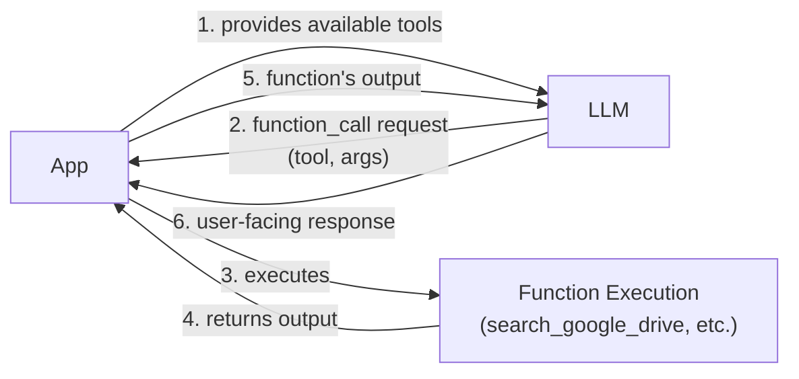
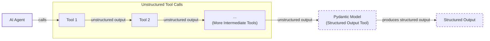
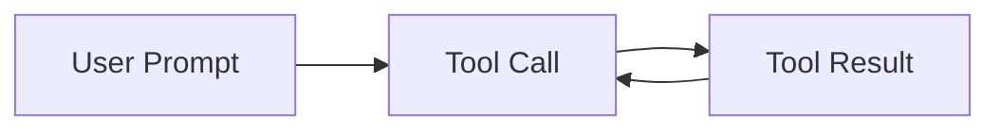

# Lesson 6: Agent Tools & Function Calling

In our previous lessons, we built a solid foundation in AI Engineering. We mapped the agent landscape, distinguished between rule-based LLM workflows and autonomous agents, and mastered context engineering and structured outputs. We have learned how to orchestrate information flow *to* an LLM and ensure reliable data comes *out* of it. Now, we will take the next logical step: giving our LLMs the ability to act.

This lesson is about tools, the mechanism that transforms an LLM from a passive text generator into an agent that can interact with the external world. Understanding how tools work under the hood is one of the most critical skills for an AI engineer. It is the key to building, debugging, and monitoring robust AI applications that can do more than just talk; they can *do*. We will start by implementing tool calling from scratch to build a deep intuition, then move on to production-grade techniques using modern APIs.

## Understanding Why Agents Need Tools

LLMs have a fundamental limitation: they are, at their core, sophisticated pattern matchers and text generators. They are trained on vast amounts of text and can produce human-like responses, but they cannot, by themselves, interact with the external world. They do not have access to real-time information, cannot perform precise calculations, and cannot take actions in other software systems. This is where tools come in.

Think of the LLM as the brain of an operation. It can reason, plan, and understand language. But a brain needs hands and senses to perceive and act upon the world. Tools are the LLM's "hands and senses." They are the bridge between the model's internal reasoning and the external environment. By giving an LLM access to tools, we transform it into an AI agent that can execute specific instructions and interact with the world beyond its training data.

This capability unlocks a wide range of applications. Some of the most common tools that power modern AI agents include:

*   **Accessing real-time information:** Using APIs to get today's weather, the latest news, or stock prices.
*   **Interacting with data stores:** Querying external databases like PostgreSQL, data warehouses like Snowflake, or data lakes on S3.
*   **Accessing memory:** Retrieving information from the agent's long-term memory to recall facts beyond its immediate context window.
*   **Executing code:** Running Python or JavaScript to perform precise calculations, manipulate data, or create visualizations.

## Implementing Tool Calls from Scratch

The best way to understand how tools work is to build them from the ground up. In this section, we will implement a simple tool-calling mechanism from scratch. Our goal is to provide an LLM with a list of available functions and let it decide which one to use—and with what arguments—to fulfill a user's request.

The high-level process of calling a tool involves a five-step dance between our application and the LLM:

1.  **App:** We send the LLM a prompt that includes a list of available tools and their descriptions.
2.  **LLM:** The model analyzes the user's request and, if it decides a tool is needed, responds with a `function_call` request, specifying the tool's name and the arguments to use.
3.  **App:** Our application receives this request and executes the corresponding function in our code.
4.  **App:** We then send the output from that function back to the LLM.
5.  **LLM:** The model uses the tool's output to generate a final, user-facing response.

This flow is illustrated in the diagram below.



Image 1: A flowchart illustrating the 5-step request-execute-respond flow of calling a tool between an App and an LLM.

Now, let's dig into the code. We will implement a simple example where we mock searching for a document on Google Drive and sending a summary of it to a Discord channel.

<aside>
💡

You can find all the code for this lesson in the accompanying [Jupyter Notebook on GitHub](https://github.com/towardsai/course-ai-agents/blob/dev/lessons/06_tools/notebook.ipynb).

</aside>

1.  First, we set up our environment by initializing the Gemini client and defining some constants. We will use the `gemini-2.5-flash` model, which is fast and cost-effective. The `DOCUMENT` constant will serve as our mock file content.
    ```python
    import json
    from typing import Any
    
    from google import genai
    from google.genai import types
    from pydantic import BaseModel, Field
    
    from lessons.utils import env, pretty_print
    
    env.load(required_env_vars=["GOOGLE_API_KEY"])
    
    client = genai.Client()
    
    MODEL_ID = "gemini-2.5-flash"
    
    DOCUMENT = """
    # Q3 2023 Financial Performance Analysis
    
    The Q3 earnings report shows a 20% increase in revenue and a 15% growth in user engagement, 
    beating market expectations. These impressive results reflect our successful product strategy 
    and strong market positioning.
    
    Our core business segments demonstrated remarkable resilience, with digital services leading 
    the growth at 25% year-over-year. The expansion into new markets has proven particularly 
    successful, contributing to 30% of the total revenue increase.
    
    Customer acquisition costs decreased by 10% while retention rates improved to 92%, 
    marking our best performance to date. These metrics, combined with our healthy cash flow 
    position, provide a strong foundation for continued growth into Q4 and beyond.
    """
    ```
2.  Next, we define our mock tools as simple Python functions. To keep the focus on the tool-calling mechanism, these functions return hardcoded data instead of making real API calls.
    ```python
    def search_google_drive(query: str) -> dict:
        """
        Searches for a file on Google Drive and returns its content or a summary.
    
        Args:
            query (str): The search query to find the file, e.g., 'Q3 earnings report'.
    
        Returns:
            dict: A dictionary representing the search results, including file names and summaries.
        """
        return {
            "files": [
                {
                    "name": "Q3_Earnings_Report_2024.pdf",
                    "id": "file12345",
                    "content": DOCUMENT,
                }
            ]
        }
    ```
    ```python
    def send_discord_message(channel_id: str, message: str) -> dict:
        """
        Sends a message to a specific Discord channel.
    
        Args:
            channel_id (str): The ID of the channel to send the message to, e.g., '#finance'.
            message (str): The content of the message to send.
    
        Returns:
            dict: A dictionary confirming the action, e.g., {"status": "success"}.
        """
        return {
            "status": "success",
            "status_code": 200,
            "channel": channel_id,
            "message_preview": f"{message[:50]}...",
        }
    ```
    ```python
    def summarize_financial_report(text: str) -> str:
        """
        Summarizes a financial report.
    
        Args:
            text (str): The text to summarize.
    
        Returns:
            str: The summary of the text.
        """
        return "The Q3 2023 earnings report shows strong performance across all metrics with 20% revenue growth, 15% user engagement increase, 25% digital services growth, and improved retention rates of 92%."
    ```
3.  For the LLM to understand our tools, we must provide a schema for each one. This schema, typically defined in JSON, tells the model the tool's name, what it does (the `description`), and what parameters it requires. This is the industry standard for modern LLM providers like OpenAI and Gemini.
    ```python
    search_google_drive_schema = {
        "name": "search_google_drive",
        "description": "Searches for a file on Google Drive and returns its content or a summary.",
        "parameters": {
            "type": "object",
            "properties": {
                "query": {
                    "type": "string",
                    "description": "The search query to find the file, e.g., 'Q3 earnings report'.",
                }
            },
            "required": ["query"],
        },
    }
    ```
    ```python
    send_discord_message_schema = {
        "name": "send_discord_message",
        "description": "Sends a message to a specific Discord channel.",
        "parameters": {
            "type": "object",
            "properties": {
                "channel_id": {
                    "type": "string",
                    "description": "The ID of the channel to send the message to, e.g., '#finance'.",
                },
                "message": {
                    "type": "string",
                    "description": "The content of the message to send.",
                },
            },
            "required": ["channel_id", "message"],
        },
    }
    ```
    ```python
    summarize_financial_report_schema = {
        "name": "summarize_financial_report",
        "description": "Summarizes a financial report.",
        "parameters": {
            "type": "object",
            "properties": {
                "text": {
                    "type": "string",
                    "description": "The text to summarize.",
                },
            },
            "required": ["text"],
        },
    }
    ```
4.  We then create a tool registry to map tool names to their corresponding functions and schemas. This makes it easy to look up and execute the correct tool later.
    ```python
    TOOLS = {
        "search_google_drive": {
            "handler": search_google_drive,
            "declaration": search_google_drive_schema,
        },
        "send_discord_message": {
            "handler": send_discord_message,
            "declaration": send_discord_message_schema,
        },
        "summarize_financial_report": {
            "handler": summarize_financial_report,
            "declaration": summarize_financial_report_schema,
        },
    }
    TOOLS_BY_NAME = {tool_name: tool["handler"] for tool_name, tool in TOOLS.items()}
    TOOLS_SCHEMA = [tool["declaration"] for tool in TOOLS.values()]
    ```
5.  The `TOOLS_BY_NAME` mapping gives us a quick way to access the callable Python function for each tool.
    It outputs:
    ```text
    Tool name: search_google_drive
    Tool handler: <function search_google_drive at 0x104c7df80>
    ---------------------------------------------------------------------------
    Tool name: send_discord_message
    Tool handler: <function send_discord_message at 0x104c7de40>
    ---------------------------------------------------------------------------
    Tool name: summarize_financial_report
    Tool handler: <function summarize_financial_report at 0x1274f5c60>
    ---------------------------------------------------------------------------
    ```
6.  The `TOOLS_SCHEMA` list contains the JSON schemas that we will pass to the LLM.
    It outputs:
    ```text
     [93m-------------------------------- `search_google_drive` Tool Schema -------------------------------- [0m
     {
     "name": "search_google_drive",
     "description": "Searches for a file on Google Drive and returns its content or a summary.",
     "parameters": {
       "type": "object",
       "properties": {
         "query": {
           "type": "string",
           "description": "The search query to find the file, e.g., 'Q3 earnings report'."
         }
       },
       "required": [
         "query"
       ]
     }
    }
     [93m---------------------------------------------------------------------------------------------------- [0m
    ```
7.  Now, we need a system prompt to instruct the LLM on how to use these tools. This prompt explains when to use tools, how to select them, and critically, the exact format for requesting a tool call.
    ```python
    TOOL_CALLING_SYSTEM_PROMPT = """
    You are a helpful AI assistant with access to tools that enable you to take actions and retrieve information to better 
    assist users.
    
    ## Tool Usage Guidelines
    
    **When to use tools:**
    - When you need information that is not in your training data
    - When you need to perform actions in external systems and environments
    - When you need real-time, dynamic, or user-specific data
    - When computational operations are required
    
    **Tool selection:**
    - Choose the most appropriate tool based on the user's specific request
    - If multiple tools could work, select the one that most directly addresses the need
    - Consider the order of operations for multi-step tasks
    
    **Parameter requirements:**
    - Provide all required parameters with accurate values
    - Use the parameter descriptions to understand expected formats and constraints
    - Ensure data types match the tool's requirements (strings, numbers, booleans, arrays)
    
    ## Tool Call Format
    
    When you need to use a tool, output ONLY the tool call in this exact format:
    
    ```tool_call
    {{"name": "tool_name", "args": {{"param1": "value1", "param2": "value2"}}}}
    ```
    
    **Critical formatting rules:**
    - Use double quotes for all JSON strings
    - Ensure the JSON is valid and properly escaped
    - Include ALL required parameters
    - Use correct data types as specified in the tool definition
    - Do not include any additional text or explanation in the tool call
    
    ## Response Behavior
    
    - If no tools are needed, respond directly to the user with helpful information
    - If tools are needed, make the tool call first, then provide context about what you're doing
    - After receiving tool results, provide a clear, user-friendly explanation of the outcome
    - If a tool call fails, explain the issue and suggest alternatives when possible
    
    ## Available Tools
    
    <tool_definitions>
    {tools}
    </tool_definitions>
    
    Remember: Your goal is to be maximally helpful to the user. Use tools when they add value, but don't use them unnecessarily. Always prioritize accuracy and user experience.
    """
    ```

Based on the `description` field in the tool schema, the LLM *decides* if a tool is appropriate to fulfill the user's query. This is why writing clear, articulate, and mutually distinguishing tool descriptions is critical for building successful AI agents [[31]](https://composio.dev/blog/how-to-build-tools-for-ai-agents-a-field-guide), [[32]](https://www.anthropic.com/research/building-effective-agents). For example, having two tools with generic descriptions like `search documents` and `search files` would likely confuse the LLM. Instead, you should be explicit: `search documents on Google Drive` and `search files on the local disk`. This clarity becomes even more crucial as you scale to dozens or even hundreds of tools per agent. In practice, large toolsets degrade performance not because the model is bad at choosing, but because the tool descriptions compete with the user's query for the model's limited attention. A common pattern to solve this is **tool scoping**, where a middleware layer dynamically filters the tools shown to the LLM based on the current context of the conversation. This prevents the model from being overwhelmed and significantly improves tool selection accuracy [[52]](https://dev.to/breeze_nik/scaling-an-ai-agent-to-53-tools-without-making-it-dumber-4d4).

Once a tool is selected, the LLM *generates* the function name and arguments as a structured output, like JSON. This capability is not magic; models are specifically instruction-fine-tuned to interpret these schema inputs and produce valid tool call outputs. This is typically achieved through supervised fine-tuning on specialized datasets of conversation traces. The model learns to predict the next token in a structured, schema-conforming JSON format, treating it as a different target distribution from the human language it was pre-trained on [[53]](https://mbrenndoerfer.com/writing/function-calling-llm-structured-tools). Fine-tuning teaches the model not just the format, but also the judgment of when and how to invoke tools correctly.

8.  Let's test it. We send a user prompt along with our system prompt to the model.
    ```python
    USER_PROMPT = """
    Can you help me find the latest quarterly report and share key insights with the team?
    """
    
    messages = [TOOL_CALLING_SYSTEM_PROMPT.format(tools=str(TOOLS_SCHEMA)), USER_PROMPT]
    
    response = client.models.generate_content(
        model=MODEL_ID,
        contents=messages,
    )
    ```
9.  The LLM correctly identifies the `search_google_drive` tool and generates the required arguments.
    It outputs:
    ```text
     [93m-------------------------------------- LLM Tool Call Response -------------------------------------- [0m
     ```tool_call
    {"name": "search_google_drive", "args": {"query": "latest quarterly report"}}
    ```
     [93m---------------------------------------------------------------------------------------------------- [0m
    ```
10. Here is another example with a more complex, multi-step request.
    ```python
    USER_PROMPT = """
    Please find the Q3 earnings report on Google Drive and send a summary of it to 
    the #finance channel on Discord.
    """
    
    messages = [TOOL_CALLING_SYSTEM_PROMPT.format(tools=str(TOOLS_SCHEMA)), USER_PROMPT]
    
    response = client.models.generate_content(
        model=MODEL_ID,
        contents=messages,
    )
    ```
11. The model correctly determines that the first step is to search for the file.
    It outputs:
    ```text
     [93m-------------------------------------- LLM Tool Call Response -------------------------------------- [0m
     ```tool_call
    {"name": "search_google_drive", "args": {"query": "Q3 earnings report"}}
    ```
     [93m---------------------------------------------------------------------------------------------------- [0m
    ```
12. Now, we need to parse the LLM's response and execute the tool. First, we extract the JSON string from the response.
    ```python
    def extract_tool_call(response_text: str) -> str:
        """
        Extracts the tool call from the response text.
        """
        return response_text.split("```tool_call")[1].split("```")[0].strip()
    
    tool_call_str = extract_tool_call(response.text)
    ```
13. Then, we parse the string into a Python dictionary.
    ```python
    tool_call = json.loads(tool_call_str)
    ```
14. We use our `TOOLS_BY_NAME` mapping to retrieve the correct Python function to execute.
    ```python
    tool_handler = TOOLS_BY_NAME[tool_call["name"]]
    ```
15. The `tool_handler` is a direct reference to our `search_google_drive` function.
    It outputs:
    ```text
    <function __main__.search_google_drive(query: str) -> dict>
    ```
16. Finally, we call the function using the arguments generated by the LLM.
    ```python
    tool_result = tool_handler(**tool_call["args"])
    ```
17. The tool returns the mocked file content.
    It outputs:
    ```text
     [93m-------------------------------------- LLM Tool Call Response -------------------------------------- [0m
     {
     "files": [
       {
         "name": "Q3_Earnings_Report_2024.pdf",
         "id": "file12345",
         "content": "\n# Q3 2023 Financial Performance Analysis\n\nThe Q3 earnings report shows a 20% increase in revenue and a 15% growth in user engagement, \nbeating market expectations. These impressive results reflect our successful product strategy \nand strong market positioning.\n\nOur core business segments demonstrated remarkable resilience, with digital services leading \nthe growth at 25% year-over-year. The expansion into new markets has proven particularly \nsuccessful, contributing to 30% of the total revenue increase.\n\nCustomer acquisition costs decreased by 10% while retention rates improved to 92%, \nmarking our best performance to date. These metrics, combined with our healthy cash flow \nposition, provide a strong foundation for continued growth into Q4 and beyond.\n"
       }
     ]
    }
     [93m---------------------------------------------------------------------------------------------------- [0m
    ```
18. We can wrap this logic in a helper function to make it reusable.
    ```python
    def call_tool(response_text: str, tools_by_name: dict) -> Any:
        """
        Call a tool based on the response from the LLM.
        """
    
        tool_call_str = extract_tool_call(response_text)
        tool_call = json.loads(tool_call_str)
        tool_name = tool_call["name"]
        tool_args = tool_call["args"]
        tool = tools_by_name[tool_name]
    
        return tool(**tool_args)
    ```
19. Using this function simplifies the process to a single call.
    ```python
    pretty_print.wrapped(
        json.dumps(call_tool(response.text, tools_by_name=TOOLS_BY_NAME), indent=2), title="LLM Tool Call Response"
    )
    ```
20. The output is the same as before.
    It outputs:
    ```text
     [93m-------------------------------------- LLM Tool Call Response -------------------------------------- [0m
     {
     "files": [
       {
         "name": "Q3_Earnings_Report_2024.pdf",
         "id": "file12345",
         "content": "\n# Q3 2023 Financial Performance Analysis\n\nThe Q3 earnings report shows a 20% increase in revenue and a 15% growth in user engagement, \nbeating market expectations. These impressive results reflect our successful product strategy \nand strong market positioning.\n\nOur core business segments demonstrated remarkable resilience, with digital services leading \nthe growth at 25% year-over-year. The expansion into new markets has proven particularly \nsuccessful, contributing to 30% of the total revenue increase.\n\nCustomer acquisition costs decreased by 10% while retention rates improved to 92%, \nmarking our best performance to date. These metrics, combined with our healthy cash flow \nposition, provide a strong foundation for continued growth into Q4 and beyond.\n"
       }
     ]
    }
     [93m---------------------------------------------------------------------------------------------------- [0m
    ```
21. The final step is to send this result back to the LLM so it can interpret the information and either generate a final answer or decide on the next action.
    ```python
    response = client.models.generate_content(
        model=MODEL_ID,
        contents=f"Interpret the tool result: {json.dumps(tool_result, indent=2)}",
    )
    ```
22. The LLM provides a natural language summary of the tool's output.
    It outputs:
    ```text
     [93m-------------------------------------- LLM Tool Call Response -------------------------------------- [0m
     The tool result provides the content of a file named `Q3_Earnings_Report_2024.pdf`.
    
    This document is a **Q3 2023 Financial Performance Analysis** and details exceptionally strong results, significantly beating market expectations.
    
    **Key highlights from the report include:**
    
    *   **Revenue Growth:** A 20% increase in revenue.
    *   **User Engagement:** 15% growth in user engagement.
    *   **Core Business Performance:** Digital services led growth at 25% year-over-year.
    *   **Market Expansion Success:** New markets contributed 30% of the total revenue increase.
    *   **Efficiency & Retention:**
        *   Customer acquisition costs decreased by 10%.
        *   Retention rates improved to 92%, marking the best performance to date.
    *   **Financial Health:** The company maintains a healthy cash flow position.
    
    The report attributes these impressive results to a successful product strategy and strong market positioning, indicating a robust foundation for continued growth into Q4 and beyond.
     [93m---------------------------------------------------------------------------------------------------- [0m
    ```

That is the basic concept of tool calling. We have successfully implemented a complete function-calling loop from scratch, giving us a deep understanding of the mechanics involved.

## Implementing a Small Tool Calling Framework from Scratch

Manually defining a JSON schema for every function is tedious and violates the Don't Repeat Yourself (DRY) principle. This practice of abstracting away implementation details mirrors lessons from robotics, where hiding the low-level mechanics of a tool allows an embodied agent to focus on high-level reasoning and planning [[54]](https://www2.eecs.berkeley.edu/Pubs/TechRpts/2025/EECS-2025-59.pdf). Production frameworks like LangGraph and protocols like MCP (Model Context Protocol) solve this by using a `@tool` decorator that automatically inspects a function's signature and docstring to generate its schema. Just as APIs created a shared language for software on the internet, standards like MCP aim to become the unifying interface for AI-to-tool interactions, which is currently a fragmented landscape [[55]](https://a16z.com/a-deep-dive-into-mcp-and-the-future-of-ai-tooling/).

Let's build our own simple framework by creating a `@tool` decorator. This will centralize our schema generation logic and make our code much cleaner and more maintainable. Our goal is to decorate a Python function and have its schema automatically computed and added to a central tool registry.

1.  First, we define a wrapper class, `ToolFunction`, to hold both the callable function and its generated schema.
    ```python
    from inspect import Parameter, signature
    from typing import Any, Callable, Dict, Optional
    
    
    class ToolFunction:
        def __init__(self, func: Callable, schema: Dict[str, Any]) -> None:
            self.func = func
            self.schema = schema
            self.__name__ = func.__name__
            self.__doc__ = func.__doc__
    
        def __call__(self, *args: Any, **kwargs: Any) -> Any:
            return self.func(*args, **kwargs)
    ```
2.  Next, we define the `tool` decorator. This function takes another function as input, inspects its signature (`__name__`, `__doc__`, parameters), and constructs the JSON schema automatically. It then returns a `ToolFunction` instance.
    ```python
    def tool(description: Optional[str] = None) -> Callable[[Callable], ToolFunction]:
        """
        A decorator that creates a tool schema from a function.
    
        Args:
            description: Optional override for the function's docstring
    
        Returns:
            A decorator function that wraps the original function and adds a schema
        """
    
        def decorator(func: Callable) -> ToolFunction:
            # Get function signature
            sig = signature(func)
    
            # Create parameters schema
            properties = {}
            required = []
    
            for param_name, param in sig.parameters.items():
                # Skip self for methods
                if param_name == "self":
                    continue
    
                param_schema = {
                    "type": "string",  # Default to string, can be enhanced with type hints
                    "description": f"The {param_name} parameter",  # Default description
                }
    
                # Add to required if parameter has no default value
                if param.default == Parameter.empty:
                    required.append(param_name)
    
                properties[param_name] = param_schema
    
            # Create the tool schema
            schema = {
                "name": func.__name__,
                "description": description or func.__doc__ or f"Executes the {func.__name__} function.",
                "parameters": {
                    "type": "object",
                    "properties": properties,
                    "required": required,
                },
            }
    
            return ToolFunction(func, schema)
    
        return decorator
    ```
3.  Now, we can redefine our tools by simply applying the `@tool` decorator to our functions.
    ```python
    @tool()
    def search_google_drive_example(query: str) -> dict:
        """Search for files in Google Drive."""
        return {"files": ["Q3 earnings report"]}
    
    
    @tool()
    def send_discord_message_example(channel_id: str, message: str) -> dict:
        """Send a message to a Discord channel."""
        return {"message": "Message sent successfully"}
    
    
    @tool()
def summarize_financial_report_example(text: str) -> str:
        """Summarize the contents of a financial report."""
        return "Financial report summarized successfully"
    ```
4.  We collect the decorated functions into a list and create our mappings, just as before.
    ```python
    tools = [
        search_google_drive_example,
        send_discord_message_example,
        summarize_financial_report_example,
    ]
    tools_by_name = {tool.schema["name"]: tool.func for tool in tools}
    tools_schema = [tool.schema for tool in tools]
    ```
5.  After decoration, our function is now a `ToolFunction` object.
    It outputs:
    ```text
    __main__.ToolFunction
    ```
6.  This object contains the auto-generated schema, which is identical to the one we created manually, and a reference to the original function handler.
    It outputs:
    ```text
     [93m----------------------------------- Search Google Drive Example ----------------------------------- [0m
     {
     "name": "search_google_drive_example",
     "description": "Search for files in Google Drive.",
     "parameters": {
       "type": "object",
       "properties": {
         "query": {
           "type": "string",
           "description": "The query parameter"
         }
       },
       "required": [
         "query"
       ]
     }
    }
     [93m---------------------------------------------------------------------------------------------------- [0m
    ```
7.  Let's run the same multi-step prompt with our new framework.
    ```python
    USER_PROMPT = """
    Please find the Q3 earnings report on Google Drive and send a summary of it to 
    the #finance channel on Discord.
    """
    
    messages = [TOOL_CALLING_SYSTEM_PROMPT.format(tools=str(tools_schema)), USER_PROMPT]
    
    response = client.models.generate_content(
        model=MODEL_ID,
        contents=messages,
    )
    ```
8.  The LLM responds with the correct tool call, just as before.
    It outputs:
    ```text
     [93m-------------------------------------- LLM Tool Call Response -------------------------------------- [0m
     ```tool_call
    {"name": "search_google_drive_example", "args": {"query": "Q3 earnings report"}}
    ```
     [93m---------------------------------------------------------------------------------------------------- [0m
    ```
9.  And when we execute it using our `call_tool` function, it works perfectly.
    ```python
    pretty_print.wrapped(
        json.dumps(call_tool(response.text, tools_by_name=tools_by_name), indent=2), title="LLM Tool Call Response"
    )
    ```
    It outputs:
    ```text
     [93m-------------------------------------- LLM Tool Call Response -------------------------------------- [0m
     {
     "files": [
       "Q3 earnings report"
     ]
    }
     [93m---------------------------------------------------------------------------------------------------- [0m
    ```
Voilà! We have our own little tool-calling framework. This implementation is very similar to what libraries like LangChain do under the hood, giving you a solid grasp of production-level concepts.

## Implementing Production-Level Tool Calls with Gemini

While building from scratch provides deep insight, in production, we typically leverage the native tool-calling capabilities of APIs like Gemini or OpenAI. This approach is more robust because the provider optimizes the underlying prompts and logic for their specific models.

Let's refactor our example to use Gemini's native `GenerateContentConfig`.

1.  First, we define a `tools` object using the `types.Tool` and `types.FunctionDeclaration` classes from the `google-genai` SDK. We also create a `config` object that forces the model to call a function instead of generating a free-form text response.
    ```python
    tools = [
        types.Tool(
            function_declarations=[
                types.FunctionDeclaration(**search_google_drive_schema),
                types.FunctionDeclaration(**send_discord_message_schema),
            ]
        )
    ]
    config = types.GenerateContentConfig(
        tools=tools,
        # Force the model to call 'any' function, instead of chatting.
        tool_config=types.ToolConfig(function_calling_config=types.FunctionCallingConfig(mode="ANY")),
    )
    ```
2.  With this configuration, we can completely remove our lengthy `TOOL_CALLING_SYSTEM_PROMPT`. We simply pass the user's prompt and the `config` object to the model.
    ```python
    pretty_print.wrapped(USER_PROMPT, title="User Prompt")
    response = client.models.generate_content(
        model=MODEL_ID,
        contents=USER_PROMPT,
        config=config,
    )
    ```
3.  The model returns a `FunctionCall` object directly, which we can inspect.
    It outputs:
    ```text
    FunctionCall(id=None, args={'query': 'Q3 earnings report'}, name='search_google_drive')
    ```
4.  To simplify even further, the `google-genai` SDK can automatically generate the schema from a Python function's signature, type hints, and docstring. This means we can pass our functions directly to the `GenerateContentConfig` object, eliminating the need for our `@tool` decorator or manual schema definitions.
    ```python
    def call_tool(function_call) -> Any:
        tool_name = function_call.name
        tool_args = {key: value for key, value in function_call.args.items()}
    
        tool_handler = TOOLS_BY_NAME[tool_name]
    
        return tool_handler(**tool_args)
    ```
5.  We call our simplified `call_tool` function with the response from the LLM.
    ```python
    tool_result = call_tool(response.candidates[0].content.parts[0].function_call)
    ```
6.  The result is the same, but our implementation is now much cleaner and more robust.
    It outputs:
    ```text
     [93m------------------------------------------- Tool Result ------------------------------------------- [0m
     {
     "files": [
       {
         "name": "Q3_Earnings_Report_2024.pdf",
         "id": "file12345",
         "content": "\n# Q3 2023 Financial Performance Analysis\n\nThe Q3 earnings report shows a 20% increase in revenue and a 15% growth in user engagement, \nbeating market expectations. These impressive results reflect our successful product strategy \nand strong market positioning.\n\nOur core business segments demonstrated remarkable resilience, with digital services leading \nthe growth at 25% year-over-year. The expansion into new markets has proven particularly \nsuccessful, contributing to 30% of the total revenue increase.\n\nCustomer acquisition costs decreased by 10% while retention rates improved to 92%, \nmarking our best performance to date. These metrics, combined with our healthy cash flow \nposition, provide a strong foundation for continued growth into Q4 and beyond.\n"
       }
     ]
    }
     [93m---------------------------------------------------------------------------------------------------- [0m
    ```

By leveraging the native SDK, we reduced dozens of lines of code to just a few, creating a more maintainable system. Other popular APIs from providers like OpenAI and Anthropic follow a similar logic, making these concepts easily transferable to your API of choice [[81]](https://apxml.com/courses/prompt-engineering-llm-application-development/chapter-4-interacting-with-llm-apis/overview-common-llm-apis).

## Using Pydantic Models as Tools for On-Demand Structured Outputs

Connecting this lesson with what we learned about structured outputs in Lesson 4, we can use a Pydantic model *as a tool*. This is an elegant and powerful pattern for agentic workflows where you might perform several intermediate steps that produce unstructured text (which is easy for an LLM to interpret) but require a final, structured output for downstream processing in your application code.

This pattern allows you to dynamically decide when to extract structured data, combining the flexibility of free-form reasoning with the reliability of Pydantic validation.



Image 2: A flowchart illustrating an AI agent calling multiple tools in a loop, where only the last one is a tool call for structured outputs.

Let's see how to implement this.

1.  We start by defining our `DocumentMetadata` Pydantic model, just as we did in Lesson 4.
    ```python
    class DocumentMetadata(BaseModel):
        """A class to hold structured metadata for a document."""
    
        summary: str = Field(description="A concise, 1-2 sentence summary of the document.")
        tags: list[str] = Field(description="A list of 3-5 high-level tags relevant to the document.")
        keywords: list[str] = Field(description="A list of specific keywords or concepts mentioned.")
        quarter: str = Field(description="The quarter of the financial year described in the document (e.g., Q3 2023).")
        growth_rate: str = Field(description="The growth rate of the company described in the document (e.g., 10%).")
    ```
2.  Next, we create a tool declaration for our Pydantic model. We use the `model_json_schema()` method to provide the schema as the function's parameters.
    ```python
    extraction_tool = types.Tool(
        function_declarations=[
            types.FunctionDeclaration(
                name="extract_metadata",
                description="Extracts structured metadata from a financial document.",
                parameters=DocumentMetadata.model_json_schema(),
            )
        ]
    )
    ```
3.  We configure the model to use this tool.
    ```python
    config = types.GenerateContentConfig(
        tools=[extraction_tool],
        tool_config=types.ToolConfig(function_calling_config=types.FunctionCallingConfig(mode="ANY")),
    )
    ```
4.  We then prompt the model to analyze the document and extract the metadata.
    ```python
    prompt = f"""
    Please analyze the following document and extract its metadata.
    
    Document:
    --- 
    {DOCUMENT}
    --- 
    """
    
    response = client.models.generate_content(model=MODEL_ID, contents=prompt, config=config)
    ```
5.  The LLM responds with a `function_call`, providing the extracted data as arguments.
    It outputs:
    ```text
     [93m------------------------------------------ Function Call ------------------------------------------ [0m
      [38;5;208mFunction Name: [0m `extract_metadata
      [38;5;208mFunction Arguments: [0m `{
     "growth_rate": "20%",
     "summary": "The Q3 2023 earnings report shows a 20% increase in revenue and 15% growth in user engagement, driven by successful product strategy and market expansion. This performance provides a strong foundation for continued growth.",
     "quarter": "Q3 2023",
     "keywords": [
       "Revenue",
       "User Engagement",
       "Market Expansion",
       "Customer Acquisition",
       "Retention Rates",
       "Digital Services",
       "Cash Flow"
     ],
     "tags": [
       "Financials",
       "Earnings",
       "Growth",
       "Business Strategy",
       "Market Analysis"
     ]
    }`
     [93m---------------------------------------------------------------------------------------------------- [0m
    ```
6.  Finally, we can validate this data by instantiating our `DocumentMetadata` model with the arguments from the function call.
    ```python
    response_message_part = response.candidates[0].content.parts[0]
    
    if hasattr(response_message_part, "function_call"):
        function_call = response_message_part.function_call
    
        try:
            document_metadata = DocumentMetadata(**function_call.args)
            pretty_print.wrapped(document_metadata.model_dump_json(indent=2), title="Pydantic Validated Object")
        except Exception as e:
            pretty_print.wrapped(f"Validation failed: {e}", title="Validation Error")
    ```
    It outputs:
    ```text
     [93m------------------------------------ Pydantic Validated Object ------------------------------------ [0m
     {
     "summary": "The Q3 2023 earnings report shows a 20% increase in revenue and 15% growth in user engagement, driven by successful product strategy and market expansion. This performance provides a strong foundation for continued growth.",
     "tags": [
       "Financials",
       "Earnings",
       "Growth",
       "Business Strategy",
       "Market Analysis"
     ],
     "keywords": [
       "Revenue",
       "User Engagement",
       "Market Expansion",
       "Customer Acquisition",
       "Retention Rates",
       "Digital Services",
       "Cash Flow"
     ],
     "quarter": "Q3 2023",
     "growth_rate": "20%"
    }
     [93m---------------------------------------------------------------------------------------------------- [0m
    ```

This pattern is a cornerstone of building reliable AI agents that need to produce structured data as part of a larger, more complex workflow.

## The Downsides of Running Tools in a Loop

So far, we have focused on single-turn interactions where the agent calls one tool. The natural next step is to enable multi-step tasks by allowing the LLM to run tools in a loop. This lets the agent chain multiple actions together, using the output of one tool to inform the input of the next. This is the final piece of the puzzle needed to build a true AI agent.



Image 3: A flowchart illustrating a sequential tool calling loop.

This approach offers flexibility and allows agents to handle complex tasks that require multiple steps. Let's see it in action.

1.  We configure our model with all three of our mock tools.
    ```python
    tools = [
        types.Tool(
            function_declarations=[
                types.FunctionDeclaration(**search_google_drive_schema),
                types.FunctionDeclaration(**send_discord_message_schema),
                types.FunctionDeclaration(**summarize_financial_report_schema),
            ]
        )
    ]
    config = types.GenerateContentConfig(
        tools=tools,
        tool_config=types.ToolConfig(function_calling_config=types.FunctionCallingConfig(mode="ANY")),
    )
    ```
2.  We give the agent a multi-step task: find a report, summarize it, and send the summary to Discord.
    ```python
    USER_PROMPT = """
    Please find the Q3 earnings report on Google Drive and send a summary of it to 
    the #finance channel on Discord.
    """
    messages = [USER_PROMPT]
    ```
3.  We make the first call to the LLM.
    ```python
    response = client.models.generate_content(
        model=MODEL_ID,
        contents=messages,
        config=config,
    )
    ```
4.  As expected, the model's first action is to search for the file.
    It outputs:
    ```text
     [93m------------------------------------------ Function Call ------------------------------------------ [0m
      [38;5;208mFunction Name: [0m `search_google_drive
      [38;5;208mFunction Arguments: [0m `{
     "query": "Q3 earnings report"
    }`
     [93m---------------------------------------------------------------------------------------------------- [0m
    ```
5.  Now, we implement a loop that continues as long as the model requests function calls. In each iteration, we execute the tool, add the result to our message history, and call the model again to determine the next step.
    ```python
    response_message_part = response.candidates[0].content.parts[0]
    messages.append(response.candidates[0].content)
    
    max_iterations = 3
    while hasattr(response_message_part, "function_call") and max_iterations > 0:
        tool_result = call_tool(response_message_part.function_call)
        pretty_print.wrapped(tool_result, title="Tool Result", indent=2)
    
        function_response_part = types.Part.from_function_response(
            name=response_message_part.function_call.name,
            response={"result": tool_result},
        )
        messages.append(function_response_part)
    
        response = client.models.generate_content(
            model=MODEL_ID,
            contents=messages,
            config=config,
        )
    
        response_message_part = response.candidates[0].content.parts[0]
        pretty_print.function_call(response_message_part.function_call, only_name=True, title="Function Call")
    
        messages.append(response.candidates[0].content)
    
        max_iterations -= 1
    ```
6.  The agent successfully executes the entire chain: it searches for the document, summarizes the content, and then sends the message to Discord.
    It outputs:
    ```text
     [93m------------------------------------------- Tool Result ------------------------------------------- [0m
     {
     "files": [
       {
         "name": "Q3_Earnings_Report_2024.pdf",
         "id": "file12345",
         "content": "\n# Q3 2023 Financial Performance Analysis\n\nThe Q3 earnings report shows a 20% increase in revenue and a 15% growth in user engagement, \nbeating market expectations. These impressive results reflect our successful product strategy \nand strong market positioning.\n\nOur core business segments demonstrated remarkable resilience, with digital services leading \nthe growth at 25% year-over-year. The expansion into new markets has proven particularly \nsuccessful, contributing to 30% of the total revenue increase.\n\nCustomer acquisition costs decreased by 10% while retention rates improved to 92%, \nmarking our best performance to date. These metrics, combined with our healthy cash flow \nposition, provide a strong foundation for continued growth into Q4 and beyond.\n"
       }
     ]
    }
     [93m---------------------------------------------------------------------------------------------------- [0m
     [93m------------------------------------------ Function Call ------------------------------------------ [0m
      [38;5;208mFunction Name: [0m `summarize_financial_report
     [93m---------------------------------------------------------------------------------------------------- [0m
     [93m------------------------------------------- Tool Result ------------------------------------------- [0m
     The Q3 2023 earnings report shows strong performance across all metrics with 20% revenue growth, 15% user engagement increase, 25% digital services growth, and improved retention rates of 92%.
     [93m---------------------------------------------------------------------------------------------------- [0m
     [93m------------------------------------------ Function Call ------------------------------------------ [0m
      [38;5;208mFunction Name: [0m `send_discord_message
     [93m---------------------------------------------------------------------------------------------------- [0m
    ```

However, this simple looping approach has significant limitations. First, it does not allow the LLM to interpret the output of each tool before deciding on the next action. It blindly executes the next function call without pausing to think about what it has learned or whether its strategy should change. This lack of intermediate reasoning can lead to inefficient tool usage, error propagation, and an inability to recover from failures [[9]](https://myengineeringpath.dev/genai-engineer/agentic-patterns/), [[10]](https://blogs.oracle.com/developers/what-is-the-ai-agent-loop-the-core-architecture-behind-autonomous-ai-systems). The agent can easily get stuck in a loop, repeatedly calling the same tool without making progress.

As a side note, this sequential loop is also inefficient. When tools are independent of each other—for example, fetching financial news and stock prices simultaneously—they could be run in parallel to reduce latency. Our simple loop does not account for this.

These limitations are what drove the development of more sophisticated agentic patterns like **ReAct** (Reasoning and Acting). ReAct explicitly interleaves reasoning steps with tool calls, allowing the agent to think through problems more deliberately. We will explore the theory behind ReAct in Lesson 7 and implement it from scratch in Lesson 8.

## Popular Tools Used Within the Industry

To ground what we have learned in the real world, let's explore some of the most common categories of tools used in production AI systems today.

### Knowledge & Memory Access

These tools connect the agent to external knowledge sources, overcoming the limitations of the model's training data. This includes querying vector databases for semantic search, document stores for raw text retrieval, or graph databases for interconnected data [[11]](https://neo4j.com/blog/agentic-ai/connected-context-and-persistent-memory-neo4j-providers-for-the-microsoft-agent-framework/), [[12]](https://www.ruh.ai/blogs/how-vector-databases-are-rewiring-the-tech-industry). A powerful pattern in this category is **text-to-SQL**, where the LLM generates SQL queries to interact with traditional relational databases, effectively giving the agent access to structured business data [[13]](https://promethium.ai/guides/text-to-sql-basics-benefits/). These tools are fundamental for long-term memory and RAG systems, which we will cover in Lessons 9 and 10.

### Web Search & Browsing

This is one of the most common tool categories, enabling agents to access up-to-the-minute information from the internet. These tools typically interface with search engine APIs like Google Search, Bing, or Brave Search to retrieve a list of relevant web pages [[17]](https://mantraideas.com/llm-web-search/). They are often paired with web scraping tools that can then fetch and parse the content from those pages, providing the agent with fresh, external knowledge. However, this process faces reliability and ethical challenges. One study found AI-powered scraping accuracy varied from 0% to 75% on identical tasks, highlighting data quality issues at scale [[56]](https://tendem.ai/blog/why-pure-ai-scraping-fails). Ethical best practices include respecting a website's `robots.txt` file and rate-limiting requests to avoid overwhelming servers [[57]](https://cimentadaj.github.io/dataharvesting/ethical-issues.html). This capability is essential for research agents, chatbots, and any application that needs to answer questions about current events.

### Code Execution

Giving an agent the ability to write and execute code is a powerful way to extend its capabilities beyond language processing. A Python interpreter, running in a secure, sandboxed environment, is a common tool that allows an agent to perform precise mathematical calculations, manipulate data with libraries like Pandas, and even generate data visualizations [[16]](https://arxiv.org/html/2507.08034v1). The choice of sandboxing technology is critical. While fast, standard containers pose security risks by sharing the host kernel. Stronger isolation comes from technologies like Google's gVisor or microVMs like Firecracker, which have higher latency but provide hardware-level isolation. Production platforms like E2B and Modal manage these trade-offs, achieving cold starts as low as 150ms [[58]](https://www.softwareseni.com/ai-agents-in-production-the-sandboxing-problem-no-one-has-solved/). While Python is the most popular choice, this pattern can be adapted for other languages like JavaScript. This tool is invaluable for data analysis, scientific reasoning, and any task that requires computational logic. For example, the Athena Framework demonstrated that integrating computational tools can boost mathematical reasoning accuracy from 67% to 83% and scientific reasoning from 79% to 88% [[16]](https://arxiv.org/html/2507.08034v1).

### Other Popular Tools

Beyond these core categories, agents can be equipped with a vast array of tools to interact with other systems. This includes:
*   **External APIs:** Tools that connect to calendars, email services, or project management platforms like Notion and Slack are common in enterprise AI applications [[19]](https://lnu.diva-portal.org/smash/get/diva2:1801354/FULLTEXT01.pdf). In high-stakes domains like finance, agents use tools to execute trades or rebalance portfolios. These systems require "tool-call gatekeepers" that enforce hard constraints, such as maximum trade sizes, and often include a human-in-the-loop layer for final approval before execution [[59]](https://rpc.cfainstitute.org/research/the-automation-ahead-content-series/agentic-ai-for-finance).
*   **File System Operations:** Tools for reading and writing local files or listing directories are essential for productivity apps that need to interact with a user's operating system [[20]](https://medium.com/@yugalnandurkar5/llm-engineering-part-i-fa48d4307d26).

## Conclusion

Tool calling is the core of what makes an AI agent an "agent." It is the mechanism that allows an LLM to move beyond generating text and start taking action in the world. Mastering how to define, implement, and orchestrate tools is arguably the most important skill for building, monitoring, and debugging modern AI applications.

In this lesson, we have built this skill from the ground up. We started with the fundamentals, implementing tool calling from scratch, and progressed to production-grade patterns using native APIs and Pydantic. We have also seen the limitations of simple approaches, which sets the stage for our next topic. In Lesson 7, we will dive into the theory behind planning and the ReAct pattern, a more sophisticated way for agents to reason about their actions.

## References

- [1] Ntinopoulos, V., Biefer, H. R. C., Tudorache, I., Papadopoulos, N., Odavic, D., Risteski, P., Haeussler, A., & Dzemali, O. (2025). Large language models for data extraction from unstructured and semi-structured electronic health records: a multiple model performance evaluation. BMJ Health & Care Informatics, 32(1), e101139. [https://pmc.ncbi.nlm.nih.gov/articles/PMC11751965/](https://pmc.ncbi.nlm.nih.gov/articles/PMC11751965/)
- [2] Evaluation of LLM-based Strategies for the Extraction of Food Product Information from Online Shops. (n.d.). arXiv. [https://arxiv.org/html/2506.21585v1](https://arxiv.org/html/2506.21585v1)
- [3] Team, S. (2024, August 29). Type Safety in Python: Pydantic vs. Data Classes vs. Annotations vs. TypedDicts | Speakeasy. Speakeasy. [https://www.speakeasy.com/blog/pydantic-vs-dataclasses](https://www.speakeasy.com/blog/pydantic-vs-dataclasses)
- [4] Validators approach in Python - Pydantic vs. Dataclasses. (n.d.). Codetain - End-to-end Software Development. [https://codetain.com/blog/validators-approach-in-python-pydantic-vs-dataclasses/](https://codetain.com/blog/validators-approach-in-python-pydantic-vs-dataclasses/)
- [5] Automating Knowledge Graphs with LLM Outputs. (n.d.). Prompts.ai. [https://www.prompts.ai/en/blog-details/automating-knowledge-graphs-with-llm-outputs](https://www.prompts.ai/en/blog-details/automating-knowledge-graphs-with-llm-outputs)
- [6] Kelly, C. (2025, February 13). Structured Outputs: everything you should know. Humanloop: LLM Evals Platform for Enterprises. [https://humanloop.com/blog/structured-outputs](https://humanloop.com/blog/structured-outputs)
- [7] Structured Outputs in vLLM: Guiding AI Responses. (n.d.). Red Hat Developer. [https://developers.redhat.com/articles/2025/06/03/structured-outputs-vllm-guiding-ai-responses](https://developers.redhat.com/articles/2025/06/03/structured-outputs-vllm-guiding-ai-responses)
- [8] Best practices for prompt engineering with the OpenAI API. (n.d.). OpenAI Help Center. [https://help.openai.com/en/articles/6654000-best-practices-for-prompt-engineering-with-the-openai-api](https://help.openai.com/en/articles/6654000-best-practices-for-prompt-engineering-with-the-openai-api)
- [9] Agentic Design Patterns — Visual Architecture Guide. (n.d.). My Engineering Path. [https://myengineeringpath.dev/genai-engineer/agentic-patterns/](https://myengineeringpath.dev/genai-engineer/agentic-patterns/)
- [10] What is the AI Agent Loop? The Core Architecture Behind Autonomous AI Systems. (n.d.). Oracle for Developers. [https://blogs.oracle.com/developers/what-is-the-ai-agent-loop-the-core-architecture-behind-autonomous-ai-systems](https://blogs.oracle.com/developers/what-is-the-ai-agent-loop-the-core-architecture-behind-autonomous-ai-systems)
- [11] Agentic AI: Giving LLMs access to persistent memory and context. (n.d.). Neo4j. [https://neo4j.com/blog/agentic-ai/connected-context-and-persistent-memory-neo4j-providers-for-the-microsoft-agent-framework/](https://neo4j.com/blog/agentic-ai/connected-context-and-persistent-memory-neo4j-providers-for-the-microsoft-agent-framework/)
- [12] How Vector Databases Are Rewiring the Tech Industry. (n.d.). Ruh.ai. [https://www.ruh.ai/blogs/how-vector-databases-are-rewiring-the-tech-industry](https://www.ruh.ai/blogs/how-vector-databases-are-rewiring-the-tech-industry)
- [13] Text to SQL: The Basics, Benefits, and Top Tools. (n.d.). Promethium. [https://promethium.ai/guides/text-to-sql-basics-benefits/](https://promethium.ai/guides/text-to-sql-basics-benefits/)
- [14] Sharma, A. (2024, October 10). When should I use function calling, structured outputs or JSON mode? Vellum AI Blog. [https://www.vellum.ai/blog/when-should-i-use-function-calling-structured-outputs-or-json-mode](https://www.vellum.ai/blog/when-should-i-use-function-calling-structured-outputs-or-json-mode)
- [15] Structured Output in vertexAI BatchPredictionJob. (n.d.). Google Cloud Community. [https://www.googlecloudcommunity.com/gc/AI-ML/Structured-Output-in-vertexAI-BatchPredictionJob/m-p/866640](https://www.googlecloudcommunity.com/gc/AI-ML/Structured-Output-in-vertexAI-BatchPredictionJob/m-p/866640)
- [16] Niketan, N., & Batatia, H. (2025). Integrating External Tools with Large Language Models (LLM) to Improve Accuracy. arXiv. [https://arxiv.org/html/2507.08034v1](https://arxiv.org/html/2507.08034v1)
- [17] The ultimate guide to LLM web search. (n.d.). Mantra Ideas. [https://mantraideas.com/llm-web-search/](https://mantraideas.com/llm-web-search/)
- [18] How LLM Reasoning Powers the Agentic AI Revolution. (n.d.). Medium. [https://medium.com/@anicomanesh/how-llm-reasoning-powers-the-agentic-ai-revolution-cbefd10ebf3f](https://medium.com/@anicomanesh/how-llm-reasoning-powers-the-agentic-ai-revolution-cbefd10ebf3f)
- [19] A study of LLMs’ capability to use external APIs. (n.d.). DiVA. [https://lnu.diva-portal.org/smash/get/diva2:1801354/FULLTEXT01.pdf](https://lnu.diva-portal.org/smash/get/diva2:1801354/FULLTEXT01.pdf)
- [20] LLM Engineering — Part I. (n.d.). Medium. [https://medium.com/@yugalnandurkar5/llm-engineering-part-i-fa48d4307d26](https://medium.com/@yugalnandurkar5/llm-engineering-part-i-fa48d4307d26)
- [21] Prompting Best Practices for Tool Use/Function Calling. (n.d.). OpenAI Community. [https://community.openai.com/t/prompting-best-practices-for-tool-use-function-calling/1123036](https://community.openai.com/t/prompting-best-practices-for-tool-use-function-calling/1123036)
- [22] Building Production-Ready LLM Applications: Bulletproof LLM Tool Calling with Advanced JSON. (n.d.). Medium. [https://medium.com/@hariomshahu101/building-production-ready-llm-applications-bulletproof-llm-tool-calling-with-advanced-json-b95ce8889f4e](https://medium.com/@hariomshahu101/building-production-ready-llm-applications-bulletproof-llm-tool-calling-with-advanced-json-b95ce8889f4e)
- [23] LLM Output Parsing and Structured Generation. (n.d.). Tetrate. [https://tetrate.io/learn/ai/llm-output-parsing-structured-generation](https://tetrate.io/learn/ai/llm-output-parsing-structured-generation)
- [24] Efficient Tool Use with Chain-of-Abstraction Reasoning. (2024). arXiv. [https://arxiv.org/pdf/2401.17464v3](https://arxiv.org/pdf/2401.17464v3)
- [25] Function Calling: How LLMs Can Use Structured Tools. (n.d.). mbrenndoerfer.com. [https://mbrenndoerfer.com/writing/function-calling-llm-structured-tools](https://mbrenndoerfer.com/writing/function-calling-llm-structured-tools)
- [26] Tools. (n.d.). OpenAI Agents. [https://openai.github.io/openai-agents-python/tools/](https://openai.github.io/openai-agents-python/tools/)
- [27] Custom Tools. (n.d.). Strands. [https://strandsagents.com/docs/user-guide/concepts/tools/custom-tools/](https://strandsagents.com/docs/user-guide/concepts/tools/custom-tools/)
- [28] Tools. (n.d.). Pydantic. [https://pydantic.dev/docs/ai/tools-toolsets/tools/](https://pydantic.dev/docs/ai/tools-toolsets/tools/)
- [29] Tools. (n.d.). LangChain. [https://docs.langchain.com/oss/python/langchain/tools](https://docs.langchain.com/oss/python/langchain/tools)
- [30] tool. (n.d.). LangChain. [https://reference.langchain.com/python/langchain-core/tools/convert/tool](https://reference.langchain.com/python/langchain-core/tools/convert/tool)
- [31] How to Build Tools for AI Agents: A Field Guide. (n.d.). Composio. [https://composio.dev/blog/how-to-build-tools-for-ai-agents-a-field-guide](https://composio.dev/blog/how-to-build-tools-for-ai-agents-a-field-guide)
- [32] Building Effective Agents. (n.d.). Anthropic. [https://www.anthropic.com/research/building-effective-agents](https://www.anthropic.com/research/building-effective-agents)
- [33] Output. (n.d.). Pydantic. [https://pydantic.dev/docs/ai/core-concepts/output/](https://pydantic.dev/docs/ai/core-concepts/output/)
- [34] Function Calling Guide: Google DeepMind Gemini 2.0 Flash. (n.d.). Phil Schmid's Blog. [https://www.philschmid.de/gemini-function-calling](https://www.philschmid.de/gemini-function-calling)
- [35] Function calling with the Gemini API. (n.d.). Google AI for Developers. [https://ai.google.dev/gemini-api/docs/function-calling](https://ai.google.dev/gemini-api/docs/function-calling)
- [36] Building AI Agents from scratch - Part 1: Tool use. (n.d.). Swirl AI. [https://www.newsletter.swirlai.com/p/building-ai-agents-from-scratch-part](https://www.newsletter.swirlai.com/p/building-ai-agents-from-scratch-part)
- [37] Function calling with OpenAI's API. (n.d.). OpenAI Platform. [https://platform.openai.com/docs/guides/function-calling](https://platform.openai.com/docs/guides/function-calling)
- [38] What is Tool Calling? Connecting LLMs to Your Data [Video]. (n.d.). YouTube. [https://www.youtube.com/watch?v=h8gMhXYAv1k](https://www.youtube.com/watch?v=h8gMhXYAv1k)
- [39] ReAct vs Plan-and-Execute: A Practical Comparison of LLM Agent Patterns. (n.d.). DEV Community. [https://dev.to/jamesli/react-vs-plan-and-execute-a-practical-comparison-of-llm-agent-patterns-4gh9](https://dev.to/jamesli/react-vs-plan-and-execute-a-practical-comparison-of-llm-agent-patterns-4gh9)
- [40] Agentic Design Patterns Part 3, Tool Use. (n.d.). DeepLearning.AI. [https://www.deeplearning.ai/the-batch/agentic-design-patterns-part-3-tool-use/](https://www.deeplearning.ai/the-batch/agentic-design-patterns-part-3-tool-use/)
- [41] Notebook from towardsai/course-ai-agents. (n.d.). GitHub. [https://github.com/towardsai/course-ai-agents/blob/dev/lessons/06_tools/notebook.ipynb](https://github.com/towardsai/course-ai-agents/blob/dev/lessons/06_tools/notebook.ipynb)
- [42] Tool Calling Agent From Scratch [Video]. (n.d.). YouTube. [https://www.youtube.com/watch?v=ApoDzZP8_ck](https://www.youtube.com/watch?v=ApoDzZP8_ck)
- [43] Tool descriptions are critical: Making better LLM tools research capability. (n.d.). Towards AI. [https://pub.towardsai.net/tool-descriptions-are-critical-making-better-llm-tools-research-capability-b315851471e7](https://pub.towardsai.net/tool-descriptions-are-critical-making-better-llm-tools-research-capability-b315851471e7)
- [44] Tool Input and Output Schema Design. (n.d.). APXML. [https://apxml.com/courses/building-advanced-llm-agent-tools/chapter-1-llm-agent-tooling-foundations/tool-input-output-schemas](https://apxml.com/courses/building-advanced-llm-agent-tools/chapter-1-llm-agent-tooling-foundations/tool-input-output-schemas)
- [45] Underlying factors behind inconsistency in LLM responses with multi-tool calling. (n.d.). Medium. [https://medium.com/@abhaychougule0907/underlying-factors-behind-inconsistency-in-llm-responses-with-multi-tool-calling-628ce7b4de76](https://medium.com/@abhaychougule0907/underlying-factors-behind-inconsistency-in-llm-responses-with-multi-tool-calling-628ce7b4de76)
- [46] How Editing Tool Descriptions Affects LLM Tool Usage. (2025). arXiv. [https://arxiv.org/html/2505.18135v2](https://arxiv.org/html/2505.18135v2)
- [47] Tool Calling from Scratch to Production. (n.d.). Decoding AI. [https://www.decodingai.com/p/tool-calling-from-scratch-to-production](https://www.decodingai.com/p/tool-calling-from-scratch-to-production)
- [48] Overview of Common LLM APIs (OpenAI, Anthropic, etc.). (n.d.). APXML. [https://apxml.com/courses/prompt-engineering-llm-application-development/chapter-4-interacting-with-llm-apis/overview-common-llm-apis](https://apxml.com/courses/prompt-engineering-llm-application-development/chapter-4-interacting-with-llm-apis/overview-common-llm-apis)
- [49] LLM Providers & Gen AI Platforms Compared. (n.d.). Orchestra. [https://www.getorchestra.io/guides/llm-providers-gen-ai-platforms-compared](https://www.getorchestra.io/guides/llm-providers-gen-ai-platforms-compared)
- [50] Google Gemini Guide. (n.d.). My Engineering Path. [https://myengineeringpath.dev/tools/gemini-guide/](https://myengineeringpath.dev/tools/gemini-guide/)
- [51] LLM API Differences That Break Your Code: Anthropic vs OpenAI vs Google. (n.d.). FutureSearch. [https://futuresearch.ai/blog/llm-provider-quirks/](https://futuresearch.ai/blog/llm-provider-quirks/)
- [52] Scaling an AI agent to 53 tools without making it dumber. (n.d.). DEV Community. [https://dev.to/breeze_nik/scaling-an-ai-agent-to-53-tools-without-making-it-dumber-4d4](https://dev.to/breeze_nik/scaling-an-ai-agent-to-53-tools-without-making-it-dumber-4d4)
- [53] Function Calling: How LLMs Can Use Structured Tools. (n.d.). mbrenndoerfer.com. [https://mbrenndoerfer.com/writing/function-calling-llm-structured-tools](https://mbrenndoerfer.com/writing/function-calling-llm-structured-tools)
- [54] Robotics embodiment lessons for LLM agent tool interfaces. (2025). EECS at UC Berkeley. [https://www2.eecs.berkeley.edu/Pubs/TechRpts/2025/EECS-2025-59.pdf](https://www2.eecs.berkeley.edu/Pubs/TechRpts/2025/EECS-2025-59.pdf)
- [55] A Deep Dive Into MCP and the Future of AI Tooling. (n.d.). Andreessen Horowitz. [https://a16z.com/a-deep-dive-into-mcp-and-the-future-of-ai-tooling/](https://a16z.com/a-deep-dive-into-mcp-and-the-future-of-ai-tooling/)
- [56] Why Pure AI Scraping Fails for Production Data. (n.d.). Tendem.ai. [https://tendem.ai/blog/why-pure-ai-scraping-fails](https://tendem.ai/blog/why-pure-ai-scraping-fails)
- [57] Ethical Issues in Web Scraping. (n.d.). cimentadaj.github.io. [https://cimentadaj.github.io/dataharvesting/ethical-issues.html](https://cimentadaj.github.io/dataharvesting/ethical-issues.html)
- [58] AI Agents in Production: The Sandboxing Problem No One Has Solved. (n.d.). SoftwareSeni. [https://www.softwareseni.com/ai-agents-in-production-the-sandboxing-problem-no-one-has-solved/](https://www.softwareseni.com/ai-agents-in-production-the-sandboxing-problem-no-one-has-solved/)
- [59] Agentic AI for Finance. (n.d.). CFA Institute. [https://rpc.cfainstitute.org/research/the-automation-ahead-content-series/agentic-ai-for-finance](https://rpc.cfainstitute.org/research/the-automation-ahead-content-series/agentic-ai-for-finance)