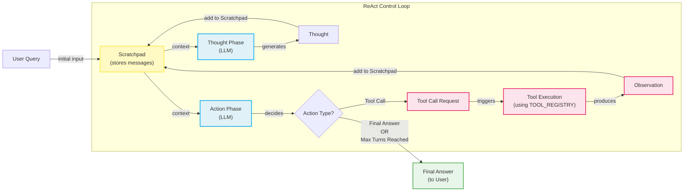

# Lesson 8: Building a ReAct Agent From Scratch

In our last lesson, we explored the theoretical foundations of agentic reasoning, focusing on patterns like ReAct. We learned that ReAct agents solve complex tasks by interleaving thought, action, and observation. While theory is a great starting point, nothing builds engineering intuition like getting your hands dirty. Abstract flowcharts are one thing; a running Python script is another.

Many AI frameworks promise to make agent development easy, but they often hide the core logic behind layers of abstraction. This can be frustrating when you need to debug a failing agent or customize its behavior for a production use case. When you do not understand the fundamental loop, you are flying blind.

This lesson is 100% practical. We will build a minimal, end-to-end ReAct agent from scratch using only Python and the Gemini API. By implementing the full Thought → Action → Observation cycle yourself, you will gain a concrete mental model of how these systems operate. We will define a tool, generate thoughts, select actions, execute them, and orchestrate the entire process in a control loop. This hands-on experience is what separates prototyping from building production-ready AI.

## Setup and Environment

Our first step is to set up a clean Python environment to ensure our code runs smoothly and our outputs match the expected traces. This involves loading API keys, importing the necessary libraries, and initializing the Gemini client.

1.  We begin by loading our environment variables. The `lessons.utils.env.load()` helper function securely loads API keys from a `.env` file, a standard practice for managing credentials in production applications. This modular approach keeps sensitive information out of your source code and makes it easy to manage different environments (development, staging, production) without code changes.
    
    ```python
    from lessons.utils import env
    
    env.load(required_env_vars=["GOOGLE_API_KEY"])
    ```
    
    It outputs:
    
    ```text
    Both GOOGLE_API_KEY and GEMINI_API_KEY are set. Using GOOGLE_API_KEY.
    ```
    
2.  Next, we import the key packages for our agent. We will use `google-genai` to interact with the Gemini API. For data modeling, we use `pydantic` and `enum`. Pydantic is essential for creating structured data models that enforce type hints at runtime. In agent development, where you are constantly parsing data from LLMs, this provides a critical layer of validation. It ensures that if the model returns data in an unexpected format, your application fails fast with a clear error rather than continuing with corrupted state. `Enum` allows us to define a fixed set of symbolic names for message roles (e.g., `USER`, `THOUGHT`), which makes the code more readable and less prone to errors from "magic strings."
    
    Finally, our custom `pretty_print` utility is designed for observability. When building agents, tracing the internal monologue—the sequence of thoughts, actions, and observations—is crucial for debugging. This utility provides a clean, color-coded output that makes it easy to follow the agent's reasoning.
    
    ```python
    from enum import Enum
    from pydantic import BaseModel, Field
    from typing import List
    
    from google import genai
    from google.genai import types
    
    from lessons.utils import pretty_print
    ```
    
3.  We initialize the Gemini client, which will be our interface to the language model.
    
    ```python
    client = genai.Client()
    ```
    
4.  Finally, we define the model we will use. For this lesson, we will use `gemini-2.5-flash`, which is fast and cost-effective, making it ideal for the simple, iterative tasks our agent will perform.
    
    ```python
    MODEL_ID = "gemini-2.5-flash"
    ```
    
With the client and model configured, we can now define the external capabilities our agent will use.

## Tool Layer: Mock Search Implementation

To enable our agent to act, we need to give it tools. For this lesson, we will create a simple mock search tool. This approach allows us to focus purely on the ReAct mechanics without worrying about external API keys, network latency, or unpredictable responses. It simplifies the learning process and makes our agent's behavior deterministic, which is perfect for testing.

Our mock `search` function simulates a real search engine. It takes a query and returns a predefined string based on keywords in that query. If the query does not match any of our predefined conditions, it returns a "not found" message. This fallback behavior is important for testing how the agent handles situations where a tool fails to provide useful information.

```python
def search(query: str) -> str:
    """Search for information about a specific topic or query.

    Args:
        query (str): The search query or topic to look up.
    """
    query_lower = query.lower()

    # Predefined responses for demonstration
    if all(word in query_lower for word in ["capital", "france"]):
        return "Paris is the capital of France and is known for the Eiffel Tower."
    elif "react" in query_lower:
        return "The ReAct framework enables LLMs to solve complex tasks by interleaving thought generation, action execution, and observation processing."

    # Generic response for unhandled queries
    return f"Information about '{query}' was not found."
```

Notice the docstring. It clearly describes what the function does and what its arguments are. When we use function calling later, the Gemini API will use this docstring as the description for the tool, guiding the LLM on when and how to use it. Clear, descriptive docstrings are a cornerstone of building reliable tool-using agents.

In a production system, you would replace this mock function with calls to real external APIs. For example, to integrate a real web search, you could use LangChain's `TavilySearchResults` tool, which wraps the Tavily Search API. The implementation would look something like this [[17]](https://atalupadhyay.wordpress.com/2025/11/25/building-a-real-time-web-searching-ai-agent-with-langchain-and-google-gemini/):

```python
# Production example using Tavily Search API
from langchain_community.tools.tavily_search import TavilySearchResults

# Assumes TAVILY_API_KEY is set as an environment variable
tavily_tool = TavilySearchResults(max_results=3)

def production_search(query: str) -> str:
    """Search for information about a specific topic or query using a real search engine."""
    try:
        results = tavily_tool.invoke({"query": query})
        # Format results into a string for the agent
        return "\n".join([str(r) for r in results])
    except Exception as e:
        # Return a clear error message for the agent to reason about
        return f"Error during search: {str(e)}"

```

This production-ready function maintains the same signature (`(query: str) -> str`) as our mock tool, allowing for a seamless swap. It also includes essential production considerations: API key management (loading from environment variables), and robust error handling with a `try/except` block that returns an informative error message as an observation for the agent [[4]](https://medium.com/google-cloud/building-react-agents-from-scratch-a-hands-on-guide-using-gemini-ffe4621d90ae). You would also need to consider rate limiting to avoid exceeding API quotas, which can be implemented using libraries like `ratelimiter`.

To manage our tools, we create a `TOOL_REGISTRY`. This dictionary maps the string name of a tool to the actual Python function. This simple pattern allows our agent to plan with symbolic names like `"search"`, while our code can safely look up and execute the corresponding function.

```python
TOOL_REGISTRY = {
    search.__name__: search,
}
```

Now that our agent has a tool, it needs a way to reason about when to use it. This brings us to the "Thought" phase.

## Thought Phase: Prompt Construction and Generation

The "Thought" phase is where the agent analyzes the current situation and plans its next move. We guide this process with a carefully constructed prompt that tells the model to think about the next best step. This phase is crucial because the quality of the thought directly influences the effectiveness of the subsequent action.

1.  First, we need to inform the model about the tools it has available. We create a helper function, `build_tools_xml_description`, that generates a minimal XML description of our tools using their names and docstrings. Using XML tags like `<tools>` and `<tool>` provides a clear, structured format that helps the model distinguish instructions from context [[2]](https://ai.google.dev/gemini-api/docs/prompting-strategies). This is a robust prompt engineering technique that improves reliability by making the prompt structure explicit to the model. It reduces ambiguity and helps the LLM parse the available capabilities correctly.
    
    ```python
    def build_tools_xml_description(tools: dict[str, callable]) -> str:
        """Build a minimal XML description of tools using only their docstrings."""
        lines = []
        for tool_name, fn in tools.items():
            doc = (fn.__doc__ or "").strip()
            lines.append(f"\t<tool name=\"{tool_name}\">")
            if doc:
                lines.append(f"\t\t<description>")
                for line in doc.split("\n"):
                    lines.append(f"\t\t\t{line}")
                lines.append(f"\t\t</description>")
            lines.append("\t</tool>")
        return "\n".join(lines)
    
    tools_xml = build_tools_xml_description(TOOL_REGISTRY)
    ```
    
2.  Next, we define the prompt template for the thought generation step. This template is the agent's internal instruction manual for each reasoning step. It instructs the agent to decide on its next action based on the available tools and the conversation history so far. The `{conversation}` placeholder will be dynamically filled with the agent's scratchpad content, which serves as its working memory. The instruction to "Avoid repeating the same strategies" encourages the agent to explore different approaches if it gets stuck, a simple but effective way to improve its problem-solving ability.
    
    ```python
    PROMPT_TEMPLATE_THOUGHT = f"""
    You are deciding the next best step for reaching the user goal. You have some tools available to you.
    
    Available tools:
    <tools>
    {tools_xml}
    </tools>
    
    Conversation so far:
    <conversation>
    {{conversation}}
    </conversation>
    
    State your next thought about what to do next as one short paragraph focused on the next action you intend to take and why.
    Avoid repeating the same strategies that didn't work previously. Prefer different approaches.
    """.strip()
    ```
    
3.  Let's inspect the fully constructed prompt to see exactly what the model will receive. This is a critical debugging step when building agents; you should always know the exact input being sent to the LLM.
    
    ```python
    print(PROMPT_TEMPLATE_THOUGHT)
    ```
    
    It outputs:
    
    ```text
    You are deciding the next best step for reaching the user goal. You have some tools available to you.
    
    Available tools:
    <tools>
    	<tool name="search">
    		<description>
    			Search for information about a specific topic or query.
    			
    			Args:
    			    query (str): The search query or topic to look up.
    		</description>
    	</tool>
    </tools>
    
    Conversation so far:
    <conversation>
    {conversation}
    </conversation>
    
    State your next thought about what to do next as one short paragraph focused on the next action you intend to take and why.
    Avoid repeating the same strategies that didn't work previously. Prefer different approaches.
    ```
    
    The output shows the clear structure: the agent's role, the tool description neatly wrapped in XML, and the placeholder for the ongoing conversation. This structured approach is what makes the agent's reasoning process predictable and debuggable.
    
4.  Finally, we implement the `generate_thought` function. It takes the current conversation history, formats the prompt, calls the Gemini API, and returns the model's generated thought as a clean string. This function encapsulates the core reasoning step of our agent.
    
    ```python
    def generate_thought(conversation: str, tool_registry: dict[str, callable]) -> str:
        """Generate a thought as plain text (no structured output)."""
        tools_xml = build_tools_xml_description(tool_registry)
        prompt = PROMPT_TEMPLATE_THOUGHT.format(conversation=conversation, tools_xml=tools_xml)
    
        response = client.models.generate_content(
            model=MODEL_ID,
            contents=prompt
        )
        return response.text.strip()
    ```
    
With a coherent thought generated, the agent now has a plan. The next step is to translate that plan into a concrete, executable action.

## Action Phase: Function Calling and Parsing

The "Action" phase is where the agent decides whether to call a tool or provide a final answer to the user. Instead of manually parsing text for tool names and arguments, we will leverage Gemini's native function calling capability. This is a more robust and reliable approach, as the model returns a structured object when it decides to use a tool [[1]](https://arxiv.org/pdf/2210.03629). This avoids the brittleness of regex-based parsing, which can easily break if the model's output format changes slightly.

1.  We start by defining two prompt templates. The first, `PROMPT_TEMPLATE_ACTION`, is the default prompt that asks the model to choose between a tool call and a final answer. The second, `PROMPT_TEMPLATE_ACTION_FORCED`, is a special-purpose prompt we will use to force the agent to conclude when it reaches its maximum number of turns. This is a critical pattern for preventing infinite loops and managing costs in production agents.
    
    ```python
    PROMPT_TEMPLATE_ACTION = """
    You are selecting the best next action to reach the user goal.
    
    Conversation so far:
    <conversation>
    {conversation}
    </conversation>
    
    Respond either with a tool call (with arguments) or a final answer if you can confidently conclude.
    """.strip()
    
    # Dedicated prompt used when we must force a final answer
    PROMPT_TEMPLATE_ACTION_FORCED = """
    You must now provide a final answer to the user.
    
    Conversation so far:
    <conversation>
    {conversation}
    </conversation>
    
    Provide a concise final answer that best addresses the user's goal.
    """.strip()
    ```
    
2.  Next, we define Pydantic models to represent the two possible outcomes of the action phase: a `ToolCallRequest` or a `FinalAnswer`. This ensures that the agent's decisions are always well-structured and validated, creating a clear contract between the LLM's output and our Python code.
    
    ```python
    class ToolCallRequest(BaseModel):
        """A request to call a tool with its name and arguments."""
        tool_name: str = Field(description="The name of the tool to call.")
        arguments: dict = Field(description="The arguments to pass to the tool.")
    
    
    class FinalAnswer(BaseModel):
        """A final answer to present to the user when no further action is needed."""
        text: str = Field(description="The final answer text to present to the user.")
    ```
    
3.  Now we implement the `generate_action` function. This is the core of our action phase.
    
    Unlike the `generate_thought` function, we do not manually insert tool descriptions into the prompt. Instead, we pass the Python tool functions directly to the `tools` parameter in the `GenerateContentConfig`. The Gemini SDK automatically inspects these functions, extracts their names, docstrings, and parameter types, and passes this information to the model in the optimal format for function calling [[9]](https://ai.google.dev/gemini-api/docs/function-calling). This separation of concerns keeps our prompts clean and makes tool management much easier.
    
    The function also handles the `force_final` flag. If `True`, it uses the dedicated "forced" prompt and does not provide any tools to the model, compelling it to generate a text-based final answer. Otherwise, it makes a standard call with the tools enabled. The response is then parsed: if the model returns a `function_call` object, we package it as a `ToolCallRequest`; if it returns plain text, we treat it as a `FinalAnswer`.
    
    In a production setting, if tool execution fails, you would implement more advanced error handling. For transient issues like network timeouts, a retry mechanism with exponential backoff is a standard pattern. You could implement this with a decorator like `@retry(tries=3, delay=2, backoff=2)`. For more persistent failures, a circuit breaker pattern (e.g., using the `pybreaker` library) can prevent the agent from repeatedly calling a failing service. The error message returned as an observation should be structured to inform the agent that the tool is temporarily unavailable, allowing it to adapt its strategy, perhaps by trying a different tool [[16]](https://genmind.ch/posts/Building-ReAct-Agents-with-Microsoft-Agent-Framework-From-Theory-to-Production/).
    
    ```python
    def generate_action(conversation: str, tool_registry: dict[str, callable] | None = None, force_final: bool = False) -> (ToolCallRequest | FinalAnswer):
        """Generate an action by passing tools to the LLM and parsing function calls or final text.
    
        When force_final is True or no tools are provided, the model is instructed to produce a final answer and tool calls are disabled.
        """
        # Use a dedicated prompt when forcing a final answer or no tools are provided
        if force_final or not tool_registry:
            prompt = PROMPT_TEMPLATE_ACTION_FORCED.format(conversation=conversation)
            response = client.models.generate_content(
                model=MODEL_ID,
                contents=prompt
            )
            return FinalAnswer(text=response.text.strip())
    
        # Default action prompt
        prompt = PROMPT_TEMPLATE_ACTION.format(conversation=conversation)
    
        # Provide the available tools to the model; disable auto-calling so we can parse and run ourselves
        tools = list(tool_registry.values())
        config = types.GenerateContentConfig(
            tools=tools,
            automatic_function_calling={"disable": True}
        )
        response = client.models.generate_content(
            model=MODEL_ID,
            contents=prompt,
            config=config
        )
    
        # Extract the function call from the response (if present)
        candidate = response.candidates[0]
        parts = candidate.content.parts
        if parts and getattr(parts[0], "function_call", None):
            name = parts[0].function_call.name
            args = dict(parts[0].function_call.args) if parts[0].function_call.args is not None else {}
            return ToolCallRequest(tool_name=name, arguments=args)
        
        # Otherwise, it's a final answer
        final_answer = "".join(part.text for part in candidate.content.parts)
        return FinalAnswer(text=final_answer.strip())
    ```
    
With the thought and action phases defined, we have all the building blocks. It is time to assemble them into a complete control loop.

## Control Loop: Messages, Scratchpad, and Orchestration

The control loop is the engine that drives the ReAct agent, orchestrating the Thought → Action → Observation cycle. It manages the conversation history, calls the thought and action phases, executes tools, and processes the results. This orchestration is what transforms a series of LLM calls into a stateful, goal-oriented process.

1.  To manage the conversation history, we first define a structured message system. The `MessageRole` enum categorizes each entry in the conversation, such as a `USER` query, an internal `THOUGHT`, a `TOOL_REQUEST`, an `OBSERVATION` from a tool, or a `FINAL_ANSWER`. The `Message` Pydantic model ensures every entry has a role and content. This structured approach is essential for both debugging and for providing clear, organized context to the LLM. Without it, the conversation history would be a simple string, making it difficult for the model to distinguish between its own thoughts and external observations.
    
    ```python
    class MessageRole(str, Enum):
        """Enumeration for the different roles a message can have."""
        USER = "user"
        THOUGHT = "thought"
        TOOL_REQUEST = "tool request"
        OBSERVATION = "observation"
        FINAL_ANSWER = "final answer"
    
    
    class Message(BaseModel):
        """A message with a role and content, used for all message types."""
        role: MessageRole = Field(description="The role of the message in the ReAct loop.")
        content: str = Field(description="The textual content of the message.")
    
        def __str__(self) -> str:
            """Provides a user-friendly string representation of the message."""
            return f"{self.role.value.capitalize()}: {self.content}"
    ```
    
2.  We also create a helper function, `pretty_print_message`, to render each message in a color-coded format. This will make it easy to follow the agent's internal state as it runs. Good observability is not a luxury; for complex, multi-turn agents, it is a necessity for effective development and debugging.
    
    ```python
    def pretty_print_message(message: Message, turn: int, max_turns: int, header_color: str = pretty_print.Color.YELLOW, is_forced_final_answer: bool = False) -> None:
        if not is_forced_final_answer:
            title = f"{message.role.value.capitalize()} (Turn {turn}/{max_turns}):"
        else:
            title = f"{message.role.value.capitalize()} (Forced):"
    
        pretty_print.wrapped(
            text=message.content,
            title=title,
            header_color=header_color,
        )
    ```
    
3.  The `Scratchpad` class acts as the agent's short-term working memory. It holds a list of `Message` objects and provides an `append` method that both stores a new message and (optionally) prints it using our pretty-printing utility. At each turn, the entire content of the scratchpad is serialized into a string and passed to the LLM, providing the full context for its next decision. This growing context is what allows the agent to maintain state and learn from its previous actions within a single task.
    
    ```python
    class Scratchpad:
        """Container for ReAct messages with optional pretty-print on append."""
    
        def __init__(self, max_turns: int) -> None:
            self.messages: List[Message] = []
            self.max_turns: int = max_turns
            self.current_turn: int = 1
    
        def set_turn(self, turn: int) -> None:
            self.current_turn = turn
    
        def append(self, message: Message, verbose: bool = False, is_forced_final_answer: bool = False) -> None:
            self.messages.append(message)
            if verbose:
                role_to_color = {
                    MessageRole.USER: pretty_print.Color.RESET,
                    MessageRole.THOUGHT: pretty_print.Color.ORANGE,
                    MessageRole.TOOL_REQUEST: pretty_print.Color.GREEN,
                    MessageRole.OBSERVATION: pretty_print.Color.YELLOW,
                    MessageRole.FINAL_ANSWER: pretty_print.Color.CYAN,
                }
                header_color = role_to_color.get(message.role, pretty_print.Color.YELLOW)
                pretty_print_message(
                    message=message,
                    turn=self.current_turn,
                    max_turns=self.max_turns,
                    header_color=header_color,
                    is_forced_final_answer=is_forced_final_answer,
                )
    
        def to_string(self) -> str:
            return "\n".join(str(m) for m in self.messages)
    ```
    
4.  Finally, we implement the main control loop, `react_agent_loop`. This function orchestrates the entire process. While our implementation uses a simple `for` loop, production frameworks like LangGraph model this as a state machine or graph [[14]](https://ai.google.dev/gemini-api/docs/langgraph-example). In LangGraph, each phase (thought, action) would be a `node`, and the decision of what to do next (call a tool or finish) would be a conditional `edge`. This graph-based model provides more flexibility for complex agents with branching logic, but our simple loop is perfect for understanding the core ReAct flow.
    
    The loop:
    
    - It initializes the `Scratchpad` and adds the initial user question.
    - It iterates for a maximum number of turns (`max_turns`).
    - In each turn, it first calls `generate_thought` to get the agent's plan.
    - It then calls `generate_action`. If the result is a `FinalAnswer`, the loop terminates and returns the answer.
    - If the result is a `ToolCallRequest`, it looks up the tool in our `TOOL_REGISTRY` and executes it. The tool's output is captured as an `Observation` and added to the scratchpad. The loop then continues to the next turn.
    - If a tool fails, the `try/except` block catches the exception and formats it as an observation. This allows the agent to reason about the failure in its next thought phase.
    - If the loop reaches `max_turns` without producing a final answer, it calls `generate_action` one last time with `force_final=True` to ensure a graceful exit. This is a crucial safety mechanism to prevent runaway costs and infinite loops [[11]](https://www.neradot.com/post/building-a-python-react-agent-class-a-step-by-step-guide).
    
    ```python
    def react_agent_loop(initial_question: str, tool_registry: dict[str, callable], max_turns: int = 5, verbose: bool = False) -> str:
        """
        Implements the main ReAct (Thought -> Action -> Observation) control loop.
        Uses a unified message class for the scratchpad.
        """
        scratchpad = Scratchpad(max_turns=max_turns)
    
        # Add the user's question to the scratchpad
        user_message = Message(role=MessageRole.USER, content=initial_question)
        scratchpad.append(user_message, verbose=verbose)
    
        for turn in range(1, max_turns + 1):
            scratchpad.set_turn(turn)
    
            # Generate a thought based on the current scratchpad
            thought_content = generate_thought(
                scratchpad.to_string(),
                tool_registry,
            )
            thought_message = Message(role=MessageRole.THOUGHT, content=thought_content)
            scratchpad.append(thought_message, verbose=verbose)
    
            # Generate an action based on the current scratchpad
            action_result = generate_action(
                scratchpad.to_string(),
                tool_registry=tool_registry,
            )
    
            # If the model produced a final answer, return it
            if isinstance(action_result, FinalAnswer):
                final_answer = action_result.text
                final_message = Message(role=MessageRole.FINAL_ANSWER, content=final_answer)
                scratchpad.append(final_message, verbose=verbose)
                return final_answer
    
            # Otherwise, it is a tool request
            if isinstance(action_result, ToolCallRequest):
                action_name = action_result.tool_name
                action_params = action_result.arguments
    
                # Add the action to the scratchpad
                params_str = ", ".join([f"{k}='{v}'" for k, v in action_params.items()])
                action_content = f"{action_name}({params_str})"
                action_message = Message(role=MessageRole.TOOL_REQUEST, content=action_content)
                scratchpad.append(action_message, verbose=verbose)
    
                # Run the action and get the observation
                observation_content = ""
                tool_function = tool_registry[action_name]
                try:
                    observation_content = tool_function(**action_params)
                except Exception as e:
                    observation_content = f"Error executing tool '{action_name}': {e}"
    
                # Add the observation to the scratchpad
                observation_message = Message(role=MessageRole.OBSERVATION, content=observation_content)
                scratchpad.append(observation_message, verbose=verbose)
    
            # Check if the maximum number of turns has been reached. If so, force the action selector to produce a final answer
            if turn == max_turns:
                forced_action = generate_action(
                    scratchpad.to_string(),
                    force_final=True,
                )
                if isinstance(forced_action, FinalAnswer):
                    final_answer = forced_action.text
                else:
                    final_answer = "Unable to produce a final answer within the allotted turns."
                final_message = Message(role=MessageRole.FINAL_ANSWER, content=final_answer)
                scratchpad.append(final_message, verbose=verbose, is_forced_final_answer=True)
                return final_answer
    ```
    
The diagram below illustrates the complete control flow we have just implemented. It shows how the user query initiates the cycle, which then moves between the scratchpad, the thought and action phases driven by the LLM, and tool execution, until a final answer is produced.


Image 1: A flowchart illustrating the ReAct control loop, detailing the turn-based Thought-Action-Observation cycle.

Now that our agent is fully assembled, let's test it.

## Tests and Traces: Success and Graceful Fallback

To validate our ReAct agent, we will run it with two test cases. The first is a straightforward question that our mock tool can answer, demonstrating a successful run. The second is a query our tool cannot handle, which will test the agent's fallback behavior and forced termination. By analyzing the `verbose` traces, we can see the agent's step-by-step reasoning.

### Success Trace

First, let's ask a question our mock `search` tool is designed to answer: "What is the capital of France?". We will limit the agent to two turns.

```python
# A straightforward question requiring a search.
question = "What is the capital of France?"
final_answer = react_agent_loop(question, TOOL_REGISTRY, max_turns=2, verbose=True)
```

The agent successfully finds the answer in the first turn and confirms it in the second. Let's break down the trace:

-   **Turn 1:**
    -   **User:** The initial question is logged.
    -   **Thought:** The agent correctly identifies that it needs to search for the capital of France.
    -   **Tool Request:** It generates a `search` call with the query `'capital of France'`.
    -   **Observation:** The mock tool returns the predefined answer: "Paris is the capital of France..."
-   **Turn 2:**
    -   **Thought:** The agent observes that it has found the answer in the previous step and decides to formulate the final response.
    -   **Final Answer:** It provides the clean, final answer: "Paris is the capital of France."

This trace confirms that our core loop works as expected. The agent correctly uses its tool, processes the observation, and concludes when it has enough information.

### Graceful Fallback Trace

Now, let's test a query that our mock tool does not know how to answer: "What is the capital of Italy?". This will force the agent to adapt its strategy and eventually hit the `max_turns` limit.

```python
# An unsupported query for the mock tool.
question = "What is the capital of Italy?"
final_answer = react_agent_loop(question, TOOL_REGISTRY, max_turns=2, verbose=True)
```

This trace demonstrates the agent's resilience and graceful failure:

-   **Turn 1:**
    -   **Thought:** The agent decides to search for "the capital of Italy."
    -   **Tool Request:** It calls `search(query='capital of Italy')`.
    -   **Observation:** The tool returns the fallback message: "Information about 'capital of Italy' was not found."
-   **Turn 2:**
    -   **Thought:** Observing the failure, the agent adapts. It hypothesizes that a broader search might yield better results and decides to search for just "Italy." This change in strategy is a key feature of the ReAct pattern.
    -   **Tool Request:** It calls `search(query='Italy')`.
    -   **Observation:** This also fails, returning "Information about 'Italy' was not found."
-   **Forced Termination:**
    -   **Final Answer (Forced):** Because the agent has reached `max_turns=2`, the control loop invokes `generate_action` with `force_final=True`. The model, unable to use any tools, synthesizes a final response based on the history of failed attempts: "I'm sorry, but I couldn't find information about the capital of Italy."

This test validates our agent's error handling and termination logic. It does not get stuck in a loop but instead tries a new approach and exits cleanly when it cannot succeed.

### Designing a Comprehensive Test Suite

While these simple traces are useful for debugging, a production-ready agent requires a more comprehensive test suite. This goes beyond simple success and failure cases and draws parallels with testing methodologies in traditional software engineering [[15]](https://arxiv.org/pdf/2504.19678).

-   **Unit Tests:** Each tool should have its own unit tests to verify its correctness in isolation. For our `production_search` example, we would mock the `TavilySearchResults` API call to test how our function handles both successful responses and API errors without making actual network requests.
-   **Integration Tests:** These tests would verify the connections between our components. For instance, we could test that the `generate_action` function correctly parses a `function_call` object and that the `react_agent_loop` correctly routes it to the `TOOL_REGISTRY`.
-   **End-to-End (E2E) Tests:** These are similar to the traces we just ran. You provide a query and assert that the final answer is correct. For agents, this often involves creating a "golden dataset" of questions and expected outcomes.
-   **Adversarial and Edge Case Testing:** This is where agent testing diverges from traditional software. You need to design prompts that test the agent's robustness. What if the user provides ambiguous or misleading information? What if they try to "jailbreak" the agent by asking it to ignore its instructions? Benchmarks like Agent-SafetyBench are emerging to formalize this type of evaluation.
-   **Performance Benchmarking:** Beyond correctness, you need to measure performance. This includes latency (how long does the agent take to respond?), cost (how many tokens does it consume per task?), and tool usage efficiency. For complex tasks, benchmarks like SWE-Lancer evaluate agents on real-world software engineering tasks, measuring not just success but also the quality of the solution [[3]](https://arxiv.org/pdf/2504.19678).

By adopting a multi-layered testing strategy, you can build confidence in your agent's reliability and prepare it for the unpredictability of real-world use.

## Conclusion

In this lesson, we moved from theory to practice by building a complete, albeit minimal, ReAct agent from scratch. We implemented every component of the Thought-Action-Observation loop: defining a tool, generating thoughts with prompt engineering, selecting actions with function calling, and orchestrating the cycle with a stateful control loop. By analyzing the execution traces, we saw firsthand how the agent reasons, acts, and adapts.

This hands-on approach demystifies what happens inside agentic frameworks. Even if you use a library like LangGraph in production, which offers pre-built ReAct agents, this foundational understanding is essential for effective debugging, customization, and optimization [[10]](https://www.decodingai.com/p/building-production-react-agents). Building from the ground up provides the mental model needed to ship reliable AI agents.

The simple `Scratchpad` we built is a basic form of agent memory. In our next lesson, we will dive deeper into more advanced memory structures, exploring how agents can retain knowledge across conversations and tasks to become truly intelligent assistants.

## References

- [1] Yao, S., Zhao, J., Yu, D., Du, N., Shafran, I., Narasimhan, K., & Cao, Y. (2023). *ReAct: Synergizing Reasoning and Acting in Language Models*. arXiv. https://arxiv.org/pdf/2210.03629
- [2] Google AI for Developers. (n.d.). *Prompt design strategies*. https://ai.google.dev/gemini-api/docs/prompting-strategies
- [3] Ferrag, M. A., Tihanyi, N., & Debbah, M. (2025). *From LLM Reasoning to Autonomous AI Agents: A Comprehensive Review*. arXiv. https://arxiv.org/pdf/2504.19678
- [4] Shankar, A. (2024). *Building ReAct Agents from Scratch using Gemini*. Medium. https://medium.com/google-cloud/building-react-agents-from-scratch-a-hands-on-guide-using-gemini-ffe4621d90ae
- [5] IBM. (n.d.). *ReAct Agent*. IBM Think. https://www.ibm.com/think/topics/react-agent
- [6] Stryker, C. (n.d.). *AI Agent Planning*. IBM Think. https://www.ibm.com/think/topics/ai-agent-planning
- [7] Anthropic. (2024). *Building effective agents*. https://www.anthropic.com/engineering/building-effective-agents
- [8] Downie, A., & Finio, M. (n.d.). *AI Agent Orchestration*. IBM Think. https://www.ibm.com/think/topics/ai-agent-orchestration
- [9] Google AI for Developers. (n.d.). *Gemini Function Calling Documentation*. https://ai.google.dev/gemini-api/docs/function-calling
- [10] Iusztin, P. (2025). *Building Production ReAct Agents From Scratch Is Simple*. Decoding AI. https://www.decodingai.com/p/building-production-react-agents
- [11] Pasternak, R. (n.d.). *Building a Python React Agent Class: A Step-by-Step Guide*. Neradot. https://www.neradot.com/post/building-a-python-react-agent-class-a-step-by-step-guide
- [12] Lu, Y., Liu, S., & Dong, L. (2025). *OrchDAG: Complex Tool Orchestration in Multi-Turn Interactions with Plan DAGs*. arXiv. https://arxiv.org/html/2510.24663v1
- [13] Schmid, P. (n.d.). *ReAct agent from scratch with Gemini 2.5 and LangGraph*. https://www.philschmid.de/langgraph-gemini-2-5-react-agent
- [14] Google AI for Developers. (n.d.). *ReAct agent from scratch with Gemini 2.5 and LangGraph*. https://ai.google.dev/gemini-api/docs/langgraph-example
- [15] Yehudai, N., et al. (2024). *From LLM Reasoning to Autonomous AI Agents: A Comprehensive Review*. arXiv. https://arxiv.org/pdf/2504.19678
- [16] GenMind. (n.d.). *Building ReAct Agents with Microsoft Agent Framework: From Theory to Production*. https://genmind.ch/posts/Building-ReAct-Agents-with-Microsoft-Agent-Framework-From-Theory-to-Production/
- [17] Upadhyay, A. (2025). *Building a real-time web searching AI agent with LangChain and Google Gemini*. https://atalupadhyay.wordpress.com/2025/11/25/building-a-real-time-web-searching-ai-agent-with-langchain-and-google-gemini/