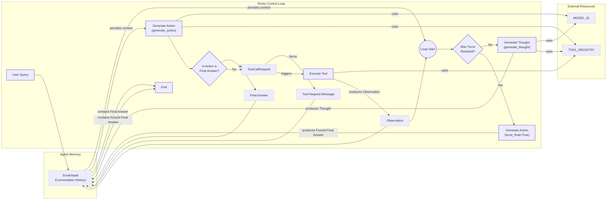

# Building ReAct Agents From Scratch: A Step-by-Step Guide

In our last lesson, we covered the theory behind agentic planning and reasoning, focusing on the ReAct framework. We saw how agents can break down complex problems by cycling through a loop of Thought, Action, and Observation. But theory only gets you so far. To truly understand how these systems work, you have to build one.

This lesson is 100% practical. We will build a minimal ReAct agent from scratch using only Python and the Gemini API. By implementing the full loop yourself—defining tools, generating thoughts, calling functions, and managing the conversation—you will gain a concrete mental model that no framework documentation can provide. This hands-on experience is essential for debugging, extending, and confidently shipping agents in production.

We will walk through the implementation step-by-step, following the code from this lesson's notebook. By the end, you will have a working agent and a deep understanding of the mechanics that power modern AI systems.

**Here's our roadmap:**

1.  **Setup and Environment:** Prepare our Python environment for the build.
2.  **Tool Layer:** Implement a mock search tool for the agent to use.
3.  **Thought Phase:** Construct the prompt to make the agent reason about its next step.
4.  **Action Phase:** Use Gemini’s function calling to translate thought into action.
5.  **Control Loop:** Orchestrate the full Thought-Action-Observation cycle.
6.  **Tests and Traces:** Validate our agent and analyze its behavior.

## Setup and Environment

Before we start building, we need to set up our Python environment. The goal is to ensure the notebook runs seamlessly and that the outputs you see match the expected traces. A clean, well-organized setup is the first step toward a maintainable agent project.

1.  First, we load our environment variables. We use a custom utility to manage API keys, which is a good practice for keeping secrets out of your code.
    ```python
    from lessons.utils import env
    
    env.load(required_env_vars=["GOOGLE_API_KEY"])
    ```

2.  Next, we import the necessary libraries. We will use `google-genai` to interact with the Gemini API, `pydantic` for creating structured data models, and `enum` to define a fixed set of message roles.
    ```python
    from enum import Enum
    from typing import Union, Callable, Any
    
    from google import genai
    from pydantic import BaseModel, Field
    
    from lessons.utils import pretty_print
    ```
    Using Pydantic is a key practice in AI engineering. It allows us to define a clear schema for our data with standard Python type hints. This ensures that when our agent passes information between its components, the data is validated and predictable. As we covered in Lesson 4, this creates a reliable contract between the LLM and our application code. Similarly, `Enum` helps us define a controlled vocabulary for message roles, which prevents typos and makes the agent's internal state easier to track.

3.  We initialize the Gemini client. If both `GOOGLE_API_KEY` and `GEMINI_API_KEY` are set, the client will prioritize one, and you may see a warning. This is expected behavior.
    ```python
    client = genai.Client()
    ```

4.  Finally, we define the model we will use. For this exercise, `gemini-2.5-flash` is a great choice because it is fast, cost-effective, and supports the function calling features we need.
    ```python
    MODEL_ID = "gemini-2.5-flash"
    ```
    The custom utilities like `env.load` and `pretty_print` are part of our course's toolkit. They are simple wrappers that promote modularity and reusability, allowing us to focus on the agent's logic rather than boilerplate code.

With the client and model in place, we can now define an external capability—a tool—that our agent can use to interact with its environment.

## Tool Layer: Mock Search Implementation

To make our agent useful, we need to give it tools. As we discussed in Lesson 6, tools are functions that allow an agent to perform actions, like searching the web or querying a database. For this lesson, we will implement a simple mock search tool.

We use a mock tool instead of a real API for a few important reasons. First, it simplifies the learning process by letting us focus purely on the ReAct mechanics without worrying about external dependencies or API keys. Second, it provides predictable, consistent responses, which is essential for testing and debugging our agent's logic.

Our mock search tool is a Python function that simulates a search engine. It takes a query and returns a hardcoded response for specific inputs.

1.  We start by defining the `search` function. The docstring is critical here. As we will see later, modern LLMs use the function's name, docstring, and parameter definitions to understand what the tool does and how to use it.
    ```python
    def search(query: str) -> str:
        """
        Searches for information on a given query and returns the most relevant result.
    
        Args:
            query: The search query.
    
        Returns:
            A string containing the search result.
        """
        if query == "capital of France":
            return "Paris is the capital of France and is known for the Eiffel Tower."
        elif query == "Eiffel Tower":
            return "The Eiffel Tower is a wrought-iron lattice tower on the Champ de Mars in Paris, France."
        else:
            return f"Information about '{query}' was not found."
    ```
    The function handles two specific queries: "capital of France" and "Eiffel Tower." For any other query, it returns a "not found" message. This fallback behavior is important because it allows us to test how our agent reacts to tool failures or incomplete information.

2.  To make the tool available to our agent, we store it in a `TOOL_REGISTRY`. This dictionary maps the tool's name to its function object, which we will use later to execute tool calls.
    ```python
    TOOL_REGISTRY = {"search": search}
    ```

In a production system, you would replace this mock function with a real API call. For example, instead of the `if/elif` block, you might use the Google Custom Search API or a vector database to retrieve information from an internal knowledge base. This would involve managing API keys, handling network errors with retries, and parsing the API response into a clean string for the agent. The modular design we are using makes this swap straightforward: you would only need to change the body of the `search` function while keeping its signature and registration the same.

With a tool defined, the agent now needs a way to "think" about when and how to use it. This brings us to the Thought phase.

## Thought Phase: Prompt Construction and Generation

The first step in the ReAct loop is "Thought." This is where the agent analyzes the user's query and its conversation history to form a plan. The plan is a natural language string that outlines the agent's reasoning and its intended next step.

To generate a thought, we need to provide the LLM with the right context. This includes the tools available to it and the history of the conversation so far.

1.  First, we create a helper function to format our tool definitions into an XML structure. XML tags are a great way to clearly separate different pieces of information in the prompt, making it easier for the model to understand the context.
    ```python
    def build_tools_xml_description(tool_registry: dict[str, callable]) -> str:
        """Builds an XML description of the available tools."""
        xml = "<tools>\n"
        for tool_name, tool_func in tool_registry.items():
            xml += f"<tool name=\"{tool_name}\">\n"
            xml += f"<docstring>{tool_func.__doc__}</docstring>\n"
            xml += "</tool>\n"
        xml += "</tools>"
        return xml
    
    
    tools_xml_description = build_tools_xml_description(TOOL_REGISTRY)
    ```

2.  Next, we define the prompt template for generating a thought. This template instructs the model to act as a helpful assistant, provides the XML description of the tools, and includes a placeholder for the ongoing conversation. The model's task is to generate a single, concise thought based on this context.
    ```python
    PROMPT_TEMPLATE_THOUGHT = """
    You are a helpful assistant that has access to the following tools:
    {tools_xml_description}
    
    The following is the conversation history.
    <conversation>
    {conversation}
    </conversation>
    
    Based on the conversation, what is your next thought?
    Your thoughts should be short, concise, and explain your reasoning for the next action.
    
    Respond with a single thought.
    """
    ```
    Printing this template with our tool registry shows the full context the LLM will receive.
    ```text
    You are a helpful assistant that has access to the following tools:
    <tools>
    <tool name="search">
    <docstring>
            Searches for information on a given query and returns the most relevant result.
    
            Args:
                query: The search query.
    
            Returns:
                A string containing the search result.
            
    </docstring>
    </tool>
    </tools>
    
    The following is the conversation history.
    <conversation>
    {conversation}
    </conversation>
    
    Based on the conversation, what is your next thought?
    Your thoughts should be short, concise, and explain your reasoning for the next action.
    
    Respond with a single thought.
    ```
    This prompt clearly defines the agent's role, its capabilities (the `search` tool), and its objective (generate a thought). This two-prompt approach, separating thought from action generation, is one way to implement the ReAct loop. An alternative, common in early frameworks like LangChain, is to use a single, more complex prompt that instructs the model to produce a specific text format, such as `Thought: ... Action: ... Action Input: ...`. While effective, that approach relies on careful text parsing, whereas our method leverages Gemini's native function calling for the action step, which we will build next. [[11]](https://www.ibm.com/think/topics/react-agent)

3.  Finally, we create the `generate_thought` function. It takes the current conversation and tool registry, formats the prompt, calls the Gemini API, and returns the model's response as a clean string.
    ```python
    def generate_thought(conversation: str, tool_registry: dict[str, callable]) -> str:
        """Generates a thought based on the conversation and available tools."""
        tools_xml_description = build_tools_xml_description(tool_registry)
        prompt = PROMPT_TEMPLATE_THOUGHT.format(
            tools_xml_description=tools_xml_description, conversation=conversation
        )
        response = client.models.generate_content(model=MODEL_ID, contents=prompt)
        return response.text.strip()
    ```
    When calling the model, parameters like `temperature` control the randomness of the output. While developers often lower temperature to 0 for deterministic, factual tasks, Google’s documentation warns that for Gemini models, this can sometimes degrade performance on complex reasoning. For ReAct agents, relying on the default (like 1.0) or a moderately high temperature can encourage more diverse and creative problem-solving strategies in the thought phase. [[12]](https://stevekinney.com/writing/prompt-engineering-frontier-llms)

A coherent thought sets the stage for the next phase. With a plan in mind, the agent must now decide whether to call a tool to gather more information or conclude the task with a final answer.

## Action Phase: Function Calling and Parsing

The "Action" phase translates the agent's thought into a concrete step. This can be either a call to an external tool or the delivery of a final answer to the user. We will use Gemini's native function calling capability, which is a robust and efficient way to handle tool use.

Instead of manually crafting a prompt that asks the model to output a JSON object with a tool name and arguments, we can pass the Python function definitions directly to the Gemini API. The model will then automatically decide when to call a function and generate a structured `function_call` object containing the function name and its arguments. This separation of concerns is powerful: the system prompt can focus on high-level strategic guidance, while the API handles the technical details of tool integration.

1.  We start by defining the system prompt for the action phase. This prompt is simpler than the one for the thought phase because it does not need to include detailed tool descriptions. It instructs the agent to analyze the conversation and decide on the next action.
    ```python
    PROMPT_TEMPLATE_ACTION = """
    You are a helpful assistant.
    Analyze the conversation and decide on the next action.
    Your actions can be either calling a tool or providing a final answer.
    When you have enough information, provide a final answer.
    
    The following is the conversation history.
    <conversation>
    {conversation}
    </conversation>
    
    What is your next action?
    """
    ```

2.  Next, we define constants for our action types. Using constants instead of raw strings makes the code cleaner and less prone to typos.
    ```python
    ACTION_FINISH = "finish"
    ACTION_UNKNOWN = "unknown"
    ```

3.  We also need a Pydantic model to represent a tool call request. This ensures that whenever our agent decides to call a tool, the request is well-structured and contains all the necessary information.
    ```python
    class ToolCallRequest(BaseModel):
        """A request to call a tool."""
    
        name: str = Field(description="The name of the tool to call.")
        args: dict[str, Any] = Field(description="The arguments to pass to the tool.")
    ```

4.  The core of this phase is the `generate_action` function. It takes the conversation history and the tool registry, configures the Gemini client with the available tools, and calls the model.
    ```python
    from google.genai import types
    
    
    def generate_action(
        conversation: str, tool_registry: dict[str, callable]
    ) -> Union[ToolCallRequest, str, None]:
        """Generates an action based on the conversation and available tools."""
        prompt = PROMPT_TEMPLATE_ACTION.format(conversation=conversation)
        tools = types.Tool(function_declarations=list(tool_registry.values()))
    
        response = client.models.generate_content(
            model=MODEL_ID, contents=prompt, tools=[tools]
        )
    
        if not response.candidates:
            return None
    
        first_candidate = response.candidates[0]
        first_part = first_candidate.content.parts[0]
    
        if hasattr(first_part, "function_call"):
            function_call = first_part.function_call
            return ToolCallRequest(name=function_call.name, args=dict(function_call.args))
        elif hasattr(first_part, "text") and first_part.text:
            return ACTION_FINISH
        else:
            return ACTION_UNKNOWN
    ```
    This function's parsing logic is key. It inspects the model's response to determine the action type:
    -   If the response contains a `function_call` object, it parses it into our `ToolCallRequest` model.
    -   If the response contains plain text, it signifies that the agent has enough information and is ready to provide a final answer, so we return `ACTION_FINISH`.
    -   If the response is empty or in an unexpected format, we return `ACTION_UNKNOWN` to handle the error gracefully.

Our manual parsing logic works for this simple case, but in production, you would use a library to handle this more robustly. For example, the Vercel AI SDK provides a `generateText` function that integrates tool definitions, execution, and even multi-step calls. Instead of manually checking `hasattr(first_part, "function_call")`, you would get a structured result with clear `toolCalls` and `text` properties, which simplifies the code and reduces boilerplate. [[13]](https://ai-sdk.dev/docs/ai-sdk-core/tools-and-tool-calling)

This pattern can be extended with more advanced error recovery. A production-grade agent might not just return a generic `unknown` action. Instead, it could feed the error message back to the model in the next turn as an observation. This allows the model to "see" its own mistake (e.g., calling a tool with invalid arguments) and attempt to self-correct by generating a new, valid tool call. This feedback loop for repairing tool calls is a key pattern for building more resilient agents. [[13]](https://ai-sdk.dev/docs/ai-sdk-core/tools-and-tool-calling)

This approach provides a robust way to manage the agent's actions. It leverages the power of Gemini's native function calling while maintaining a clear and structured decision-making process. Now that we have the `think` and `act` components, we need a control loop to orchestrate them in the classic ReAct cycle.

## ReAct Control Loop: Messages, Scratchpad, Orchestration

We now have all the individual components: a tool, a thought generator, and an action generator. The final step is to orchestrate them in a control loop that implements the full Thought-Action-Observation cycle. This loop will manage the agent's internal state, or "scratchpad," which keeps track of the entire interaction history.

This control loop acts as an orchestrator. In agentic systems, this is a common architectural pattern where a central component (our loop) directs the flow of work, calls other components (our thought/action generators and tools), and synthesizes the results. Anthropic identifies this as an "orchestrator-workers" pattern, which is well-suited for complex tasks where the exact steps cannot be predicted in advance. [[14]](https://www.anthropic.com/engineering/building-effective-agents)

1.  To structure the scratchpad, we first define an `Enum` for message roles and a Pydantic `BaseModel` for messages. This ensures every entry in our conversation history is typed and structured, which is crucial for both debugging and for the LLM to correctly interpret the context.
    ```python
    class MessageRole(Enum):
        """The role of a message."""
    
        USER = "user"
        THOUGHT = "thought"
        TOOL_REQUEST = "tool_request"
        OBSERVATION = "observation"
        FINAL_ANSWER = "final_answer"
    
    
    class Message(BaseModel):
        """A message in the conversation."""
    
        role: MessageRole
        content: str
    ```

2.  We create a couple of helper functions. `format_scratchpad_as_string` converts our list of `Message` objects into a single string that we can pass to the LLM prompts. `pretty_print_message` helps us visualize the agent's turn-by-turn execution in a readable format.
    ```python
    def format_scratchpad_as_string(scratchpad: list[Message]) -> str:
        """Formats the scratchpad as a string."""
        if not scratchpad:
            return ""
    
        formatted_string = ""
        for message in scratchpad:
            formatted_string += f"<message role='{message.role.value}'>\n"
            formatted_string += f"<content>\n{message.content}\n</content>\n"
            formatted_string += "</message>\n"
    
        return formatted_string
    ```
    As the scratchpad grows with each turn, it can eventually exceed the model's context window limit, a critical issue for long-running agents. In production, this "context-window pressure" is managed with compression techniques. These can range from simple methods like stripping out less important messages to more advanced strategies like summarizing early parts of the conversation. This ensures the agent retains key context without overflowing the model's memory. [[15]](https://www.sitepoint.com/optimizing-token-usage-context-compression-techniques/)

3.  The main control loop is implemented in the `react_agent_loop` function. This function orchestrates the entire ReAct process.
    ```python
    def react_agent_loop(
        user_query: str,
        tool_registry: dict[str, callable],
        max_turns: int = 5,
        verbose: bool = False,
    ) -> list[Message]:
        """The main ReAct agent loop."""
        scratchpad = [Message(role=MessageRole.USER, content=user_query)]
    
        for i in range(max_turns):
            if verbose:
                print(f"React Agent Loop: Turn {i+1}/{max_turns}")
    
            # 1. Generate a thought
            conversation = format_scratchpad_as_string(scratchpad)
            thought = generate_thought(conversation, tool_registry)
            thought_message = Message(role=MessageRole.THOUGHT, content=thought)
            scratchpad.append(thought_message)
            if verbose:
                pretty_print_message(thought_message)
    
            # 2. Generate an action
            conversation = format_scratchpad_as_string(scratchpad)
            action = generate_action(conversation, tool_registry)
    
            if action == ACTION_FINISH:
                # We are done, so we force the thought to be a final answer
                scratchpad.append(
                    Message(role=MessageRole.FINAL_ANSWER, content=thought)
                )
                break
            elif isinstance(action, ToolCallRequest):
                # 3. Execute the tool and get an observation
                tool_request_message = Message(
                    role=MessageRole.TOOL_REQUEST,
                    content=action.model_dump_json(indent=2),
                )
                scratchpad.append(tool_request_message)
                if verbose:
                    pretty_print_message(tool_request_message)
    
                if action.name in tool_registry:
                    tool_func = tool_registry[action.name]
                    try:
                        observation = tool_func(**action.args)
                    except Exception as e:
                        observation = f"Error executing tool {action.name}: {e}"
                else:
                    observation = f"Tool '{action.name}' not found. Available tools: {list(tool_registry.keys())}"
    
                observation_message = Message(
                    role=MessageRole.OBSERVATION, content=str(observation)
                )
                scratchpad.append(observation_message)
                if verbose:
                    pretty_print_message(observation_message)
            else:
                # Handle unknown action
                unknown_action_message = Message(
                    role=MessageRole.OBSERVATION, content="Unknown action."
                )
                scratchpad.append(unknown_action_message)
                if verbose:
                    pretty_print_message(unknown_action_message)
    
        # If the loop finishes without a final answer, force one
        if scratchpad[-1].role != MessageRole.FINAL_ANSWER:
            scratchpad.append(
                Message(
                    role=MessageRole.FINAL_ANSWER,
                    content="I'm sorry, but I couldn't find an answer.",
                )
            )
    
        return scratchpad
    ```
    Here is a breakdown of the loop's logic:
    -   It initializes a `scratchpad` with the user's query.
    -   It iterates for a maximum number of turns (`max_turns`). This is a crucial safety mechanism to prevent infinite loops and control costs. High API latency can cause agents to get stuck in a "runaway agent loop," burning through budget without making progress. Capping the number of turns turns this failure mode into a controlled, predictable error. [[16]](https://blog.logrocket.com/5-reasons-ai-app-fails-production/)
    -   In each turn, it first calls `generate_thought` to reason about the current state.
    -   Then, it calls `generate_action` to decide the next step.
    -   If the action is `ACTION_FINISH`, the loop terminates.
    -   If the action is a `ToolCallRequest`, it executes the corresponding tool from the `TOOL_REGISTRY`. It includes `try-except` blocks to handle potential errors during tool execution, adding the error message as an observation. This allows the agent to reason about failures in its next thought phase, a pattern known as self-correction. [[13]](https://ai-sdk.dev/docs/ai-sdk-core/tools-and-tool-calling)
    -   The result of the tool call (the "Observation") is added to the scratchpad.
    -   The loop continues, feeding the updated scratchpad into the next thought generation.
    -   If the loop reaches `max_turns` without a final answer, it forces a concluding message. This ensures the agent always terminates gracefully.

This end-to-end loop brings all our components together into a functioning ReAct agent. The flowchart below illustrates this entire process, from receiving a user query to executing tools and finally producing an answer.


Image 1: Flowchart illustrating the end-to-end ReAct (Reasoning and Acting) control loop.

With the full loop implemented, it is time to test it and see how it performs in both success and failure scenarios.

## Tests and Traces: Success and Graceful Fallback

The final step is to validate our agent. By running it with different queries and analyzing the traces, we can verify that the Thought-Action-Observation loop, tool integration, and termination logic all work as expected. For now, we will focus on two key scenarios: a successful factual query and a query designed to test the agent's fallback behavior. A comprehensive test suite for a production agent would also include edge cases, adversarial prompts, and performance benchmarks, including tests for how the agent behaves under high API latency, which can cause timeouts or infinite loops. [[17]](https://discuss.ai.google.dev/t/gemini-api-latency-issues/105310)

First, let's test a simple factual question that our mock `search` tool can answer: *"What is the capital of France?"* We will limit the agent to two turns.

1.  We call our main loop with the query.
    ```python
    final_scratchpad = react_agent_loop(
        user_query="What is the capital of France?",
        tool_registry=TOOL_REGISTRY,
        max_turns=2,
        verbose=True,
    )
    ```
    The `verbose=True` flag will print each step of the agent's process. The trace shows the agent working perfectly:
    -   **Thought (Turn 1/2):** The agent correctly reasons that it needs to use the search tool to find the capital of France.
    -   **Tool Request (Turn 1/2):** It generates a `ToolCallRequest` for the `search` tool with the argument `query='capital of France'`.
    -   **Observation (Turn 1/2):** The loop executes the tool, which returns the mock response: "Paris is the capital of France and is known for the Eiffel Tower."
    -   **Thought (Turn 2/2):** With the information from the observation, the agent concludes that it has found the answer and is ready to communicate it.
    -   **Final Answer (Turn 2/2):** The agent's final thought becomes the final answer, and the loop terminates successfully.

This successful run confirms that our agent can correctly identify the need for a tool, execute it, process the observation, and provide a final answer, all within the defined turn limit.

Next, let's test a query that our mock tool cannot handle: *"What is the capital of Italy?"* This will test the agent's ability to handle tool "failures" and its forced termination logic.

1.  We run the loop again with the new query.
    ```python
    final_scratchpad = react_agent_loop(
        user_query="What is the capital of Italy?",
        tool_registry=TOOL_REGISTRY,
        max_turns=2,
        verbose=True,
    )
    ```
    The trace for this run demonstrates the agent's graceful fallback behavior:
    -   **Thought & Tool Request (Turn 1/2):** The agent decides to search for "capital of Italy."
    -   **Observation (Turn 1/2):** The mock tool returns: "Information about 'capital of Italy' was not found."
    -   **Thought (Turn 2/2):** Observing the failure, the agent adapts its strategy. It decides to try a broader search for just "Italy," hoping to find the information indirectly. This change in strategy is a key feature of the ReAct pattern.
    -   **Tool Request & Observation (Turn 2/2):** The second search also fails.
    -   **Final Answer (Forced):** Because the agent has reached the `max_turns` limit of 2, the loop forces a final answer: "I'm sorry, but I couldn't find an answer."

This test validates several important aspects of our implementation. The agent can reason about tool failures and adapt its strategy. The `max_turns` limit acts as a critical safety net, ensuring the agent terminates gracefully instead of getting stuck in a loop of failed attempts. This observation aligns with the findings in the original ReAct paper. The authors noted that while Chain-of-Thought (CoT) reasoning is prone to factual hallucination, ReAct's primary failure mode is "non-informative search," where a tool fails to return useful information, derailing the subsequent reasoning steps. Our test confirms this exact behavior and validates that our loop can gracefully handle this common ReAct failure pattern. [[1]](https://arxiv.org/pdf/2210.03629) These tests confirm our end-to-end loop is working and provide a solid foundation for extending the agent with more advanced tools and behaviors in future lessons.

## Conclusion

By building a ReAct agent from the ground up, we have moved from theory to practice. We have seen how a simple control loop, combined with structured prompts and native function calling, can orchestrate the full Thought-Action-Observation cycle. This hands-on process demystifies the "magic" behind AI agents and gives you a concrete mental model for how they reason, act, and learn from their environment.

The ReAct paradigm was a pivotal innovation that now forms the basis for modern agentic frameworks like LangChain, LlamaIndex, and CrewAI. [[18]](https://www.techtarget.com/searchenterpriseai/tip/How-ReAct-agents-can-transform-the-enterprise) These tools abstract the control loop we built into higher-level concepts. For example, LangGraph models agents as a graph of `Nodes` (like our `generate_thought` or `call_tool` functions) connected by `Edges` that direct the flow based on a shared `State` (our `scratchpad`). [[9]](https://www.philschmid.de/langgraph-gemini-2-5-react-agent) Even if you use a framework, this foundational understanding is invaluable. It equips you to debug complex issues, customize agent behavior, and make informed architectural decisions. You now have the core skills to extend this simple agent with more sophisticated tools, memory systems, and planning strategies, which we will explore in our upcoming lessons on Agent Memory and RAG.

## References

-   [1] Yao, S., Zhao, J., Yu, D., Du, N., Shafran, I., Narasimhan, K., & Cao, Y. (2023). *ReAct: Synergizing Reasoning and Acting in Language Models*. arXiv. https://arxiv.org/pdf/2210.03629
-   [2] *ReAct agent from scratch with Gemini 2.5 and LangGraph*. (n.d.). Google AI for Developers. https://ai.google.dev/gemini-api/docs/langgraph-example
-   [3] Neradot. (2024, November 5). *Building a Python ReAct Agent Class: A Step-by-Step Guide*. Neradot. https://www.neradot.com/post/building-a-python-react-agent-class-a-step-by-step-guide
-   [4] Daily Dose of DS. (2024, June 10). *AI Agents Crash Course - Part 10: ReAct Framework with Implementation*. Daily Dose of DS. https://www.dailydoseofds.com/ai-agents-crash-course-part-10-with-implementation/
-   [5] Brownlee, J. (2024, July 1). *Building ReAct Agents with LangGraph: A Beginner’s Guide*. Machine Learning Mastery. https://machinelearningmastery.com/building-react-agents-with-langgraph-a-beginners-guide/
-   [6] Shankar, A. (2024, July 15). *Building ReAct Agents from Scratch using Gemini*. Medium. https://medium.com/google-cloud/building-react-agents-from-scratch-a-hands-on-guide-using-gemini-ffe4621d90ae
-   [7] *Function calling*. (n.d.). Google AI for Developers. https://ai.google.dev/gemini-api/docs/function-calling
-   [8] Iusztin, P. (2025, November 18). *Building Production ReAct Agents From Scratch Is Simple*. Decoding AI. https://www.decodingai.com/p/building-production-react-agents
-   [9] Schmid, P. (2024, July 10). *Building a ReAct agent from scratch with Gemini 2.5 Pro and LangGraph*. Philipp Schmid. https://www.philschmid.de/langgraph-gemini-2-5-react-agent
-   [10] Ferrag, M. A., Tihanyi, N., & Debbah, M. (2025). *From LLM Reasoning to Autonomous AI Agents: A Comprehensive Review*. arXiv. https://arxiv.org/pdf/2504.19678
-   [11] *ReAct Agent*. (n.d.). IBM. https://www.ibm.com/think/topics/react-agent
-   [12] Kinney, S. (n.d.). *Prompt Engineering for Frontier LLMs*. Steve Kinney. https://stevekinney.com/writing/prompt-engineering-frontier-llms
-   [13] *Tool Calling*. (n.d.). Vercel AI SDK. https://ai-sdk.dev/docs/ai-sdk-core/tools-and-tool-calling
-   [14] *Building effective agents*. (2024, December 19). Anthropic. https://www.anthropic.com/engineering/building-effective-agents
-   [15] *Optimizing Token Usage with Context Compression Techniques*. (n.d.). SitePoint. https://www.sitepoint.com/optimizing-token-usage-context-compression-techniques/
-   [16] *5 reasons your AI app will fail in production*. (n.d.). LogRocket Blog. https://blog.logrocket.com/5-reasons-ai-app-fails-production/
-   [17] *Gemini API Latency Issues*. (n.d.). Google AI for Developers Community. https://discuss.ai.google.dev/t/gemini-api-latency-issues/105310
-   [18] *How ReAct agents can transform the enterprise*. (n.d.). TechTarget. https://www.techtarget.com/searchenterpriseai/tip/How-ReAct-agents-can-transform-the-enterprise