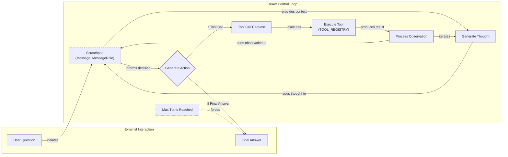

# Lesson 8: Building a ReAct Agent From Scratch

In our last lesson, we explored the theory behind agentic reasoning, focusing on frameworks like ReAct that allow LLMs to plan and execute tasks. Theory is a great starting point, but as engineers, we learn best by building. This lesson is 100% practical. We are moving from theory to implementation by building a minimal ReAct agent from scratch using only Python and the Gemini API.

Many AI frameworks can help you build agents, but they often hide the core mechanics behind layers of abstraction. While useful for rapid prototyping, this can become a problem when you need to debug, customize, or optimize for production. Understanding what happens under the hood is what separates a good AI engineer from a great one.

We will follow the code from the associated notebook step-by-step to construct the full Thought → Action → Observation loop. You will learn how to define a tool, generate thoughts, select actions using function calling, execute those actions, and process the resulting observations. By the end, you will have a concrete mental model of how these systems work, giving you the confidence to build and extend your own agents.

In this lesson, we will cover setting up the environment, implementing a mock tool, constructing the thought and action phases, building the main control loop, and finally, testing our agent to analyze its behavior.

## Setup and Environment

Our first step is to set up the Python environment. This ensures our code runs smoothly and that the outputs we generate match the expected agent traces. We will follow the notebook provided with this lesson, so make sure you have it open.

1.  We begin by loading the necessary environment variables, specifically our `GOOGLE_API_KEY`, using a custom utility function. The design rationale for a utility like `env.load` is to separate configuration from application code, a best practice in software engineering. It allows you to manage sensitive keys and settings in a `.env` file, which can be kept out of version control, making your application more secure and portable.
    ```python
    from lessons.utils import env

    env.load(required_env_vars=["GOOGLE_API_KEY"])
    ```
    It outputs:
    ```text
    Trying to load environment variables from /path/to/your/project/.env
    Environment variables loaded successfully.
    ```
2.  Next, we import the key packages we will use throughout the implementation.
    ```python
    from enum import Enum
    from pydantic import BaseModel, Field
    from typing import List

    from google import genai
    from google.genai import types

    from lessons.utils import pretty_print
    ```
    We use `pydantic` to define structured data models. As we saw in Lesson 4, this is essential for creating a reliable contract between the LLM and our application code. Pydantic provides runtime data validation and type enforcement, which means that if an LLM returns data in an unexpected format, your application will raise a clear `ValidationError` immediately instead of failing unpredictably later. This "fail-fast" approach is a cornerstone of robust software. Pydantic's `Field` allows for rich metadata, including descriptions, which can be programmatically accessed to generate documentation or even more descriptive prompts for the LLM.

    Similarly, we use Python's `Enum` to define a constrained set of roles for our agent's messages (`USER`, `THOUGHT`, etc.). This prevents the use of "magic strings," a common source of bugs where a simple typo in a string literal (`"tool_request"` vs. `"tool request"`) can cause silent failures. Using an `Enum` ensures that roles are always consistent and valid. The `pretty_print` utility is another small but important piece of our toolkit, designed to improve the observability and debuggability of our agent by rendering its internal monologue in a clean, color-coded format, which is critical when tracing complex, multi-turn interactions.

3.  With our imports in place, we initialize the Gemini client.
    ```python
    client = genai.Client()
    ```
    You might see a message indicating which API key is being used:
    ```text
    Both GOOGLE_API_KEY and GEMINI_API_KEY are set. Using GOOGLE_API_KEY.
    ```
4.  Finally, we define the model we will use. For this exercise, `gemini-2.5-flash` is a great choice as it is fast and cost-effective, perfect for the iterative development we will be doing.
    ```python
    MODEL_ID = "gemini-2.5-flash"
    ```
With our client and model configured, we can now define the external capabilities our agent will use to interact with its environment.

## Tool Layer: Mock Search Implementation

An agent's power comes from its ability to use tools to interact with the world. For this lesson, we will implement a simple mock search tool. We are using a mock tool instead of a real API for a few important reasons: it allows us to focus purely on the ReAct mechanics without worrying about external dependencies, it eliminates the need for additional API keys, and it gives us predictable responses, which is essential for testing and debugging our agent's logic.

Our mock `search` function is a simple Python function that returns predefined strings based on the query. It includes a docstring that clearly describes its purpose and arguments. This documentation is not just for us; the LLM will use it to understand what the tool does and how to use it.

```python
def search(query: str) -> str:
    """Search for information about a specific topic or query.

    Args:
        query (str): The search query or topic to look up.
    """
    query_lower = query.lower()

    # Predefined responses for demonstration
    if all(word in query_lower for word in ["capital", "france"]):
        return "Paris is the capital of France and is known for the Eiffel Tower."
    elif "react" in query_lower:
        return "The ReAct (Reasoning and Acting) framework enables LLMs to solve complex tasks by interleaving thought generation, action execution, and observation processing."

    # Generic response for unhandled queries
    return f"Information about '{query}' was not found."
```

In a production system, you would replace this mock function with a call to a real external API. The modular design of our agent makes this swap straightforward. For example, to integrate a real Google Search, you might use a library like `requests` to call the SERP API. This involves several production considerations that the mock tool abstracts away.

First, **API key management** is essential. In a production environment, hardcoding keys is a major security risk. Keys should be loaded from environment variables or, for greater security, managed through a dedicated service like AWS Secrets Manager or Google Secret Manager. This decouples credentials from the application code and allows for centralized rotation and access control.

Second, you must handle **API rate limiting**. Most public APIs enforce limits on the number of requests you can make in a given time period. A production-grade tool must handle `429 Too Many Requests` errors gracefully. A common strategy is to implement an exponential backoff-and-retry mechanism, where the tool waits for progressively longer intervals before retrying a failed request. This prevents overwhelming the API and ensures your agent can recover from temporary throttling.

Finally, **error handling** becomes more complex. A real API call can fail in many ways: network timeouts, DNS issues, authentication failures (`401 Unauthorized` or `403 Forbidden`), or server-side errors (`5xx`). Your tool function must be a resilient wrapper that catches these exceptions and translates them into a clear, informative error message. This message becomes the `Observation` for the agent, allowing it to reason about the failure. For instance, if an API returns a `404 Not Found`, the agent might decide to try a different search query, whereas a persistent `503 Service Unavailable` might prompt it to switch to a backup tool [[7]](https://medium.com/google-cloud/building-react-agents-from-scratch-a-hands-on-guide-using-gemini-ffe4621d90ae).

Here is a more robust example of what a production-grade `google_search` tool might look like, incorporating these considerations:

```python
import os
import requests
import time

def google_search(query: str, retries: int = 3, backoff_factor: float = 0.5) -> str:
    """Performs a Google search using the SERP API with retries and error handling."""
    api_key = os.getenv("SERP_API_KEY")
    if not api_key:
        return "Error: SERP_API_KEY is not set."

    url = "https://serpapi.com/search"
    params = {"q": query, "api_key": api_key}

    for attempt in range(retries):
        try:
            response = requests.get(url, params=params, timeout=10)
            
            if response.status_code == 429: # Rate limit
                wait_time = backoff_factor * (2 ** attempt)
                time.sleep(wait_time)
                continue

            response.raise_for_status()  # Raises HTTPError for 4xx/5xx
            data = response.json()

            if "organic_results" in data and data["organic_results"]:
                return data["organic_results"][0]["snippet"]
            else:
                return f"No search results found for '{query}'."

        except requests.exceptions.RequestException as e:
            if attempt == retries - 1:
                return f"Error: API call failed after {retries} attempts: {e}"
            time.sleep(backoff_factor * (2 ** attempt))
    
    return f"Error: API call failed after {retries} retries."
```

To make our tools accessible to the agent, we create a `TOOL_REGISTRY`. This dictionary maps the tool's name to the actual Python function. This allows the agent to reason about tools using their symbolic names (like `"search"`), while our code can safely and efficiently execute the corresponding function.

```python
TOOL_REGISTRY = {
    search.__name__: search,
}
```

Now that our agent has a tool, it needs a "brain" to decide when and how to use it. This brings us to the Thought phase.

## Thought Phase: Prompt Construction and Generation

The first step in the ReAct loop is "Thought." This is where the agent analyzes the user's query and the conversation history to form a plan. The output of this phase is a short, natural language string that outlines the agent's reasoning and intended next action. The quality of this thought is heavily influenced by the prompt we provide to the LLM.

The core idea behind the ReAct framework is to make the LLM's reasoning process explicit [[13]](https://arxiv.org/pdf/2210.03629). By instructing the model to "think out loud," we create a transparent trace of its decision-making. This not only improves the model's performance on complex tasks but also makes the agent's behavior more interpretable and debuggable. Our thought-generation prompt is designed to elicit this internal monologue.

1.  To guide the LLM in generating a thought, we construct a prompt template. A key part of this template is providing the model with a description of the tools it has available. We create a helper function, `build_tools_xml_description`, to convert our `TOOL_REGISTRY` into a minimal XML format. This function takes the docstring from each tool and wraps it in `<tool>` tags. Using XML tags is a common and effective prompt engineering technique. It creates clear, hierarchical delimiters that help the model distinguish between different types of information, such as instructions, tool definitions, and conversation history. This structured format reduces ambiguity and leads to more reliable and predictable outputs, as the model can easily parse the boundaries of each context block [[35]](https://ai.google.dev/gemini-api/docs/prompting-strategies).
    ```python
    def build_tools_xml_description(tools: dict[str, callable]) -> str:
        """Build a minimal XML description of tools using only their docstrings."""
        lines = []
        for tool_name, fn in tools.items():
            doc = (fn.__doc__ or "").strip()
            lines.append(f"\t<tool name=\"{tool_name}\">")
            if doc:
                lines.append(f"\t\t<description>")
                for line in doc.split("\n"):
                    lines.append(f"\t\t\t{line}")
                lines.append(f"\t\t</description>")
            lines.append("\t</tool>")
        return "\n".join(lines)

    tools_xml = build_tools_xml_description(TOOL_REGISTRY)

    PROMPT_TEMPLATE_THOUGHT = f"""
    You are deciding the next best step for reaching the user goal. You have some tools available to you.

    Available tools:
    <tools>
    {tools_xml}
    </tools>

    Conversation so far:
    <conversation>
    {{conversation}}
    </conversation>

    State your next thought about what to do next as one short paragraph focused on the next action you intend to take and why.
    Avoid repeating the same strategies that didn't work previously. Prefer different approaches.
    """.strip()
    ```

2.  Let's inspect the full prompt template to see what the model will receive.
    ```python
    print(PROMPT_TEMPLATE_THOUGHT)
    ```
    It outputs:
    ```text
    You are deciding the next best step for reaching the user goal. You have some tools available to you.

    Available tools:
    <tools>
        <tool name="search">
            <description>
                Search for information about a specific topic or query.

                Args:
                    query (str): The search query or topic to look up.
            </description>
        </tool>
    </tools>

    Conversation so far:
    <conversation>
    {conversation}
    </conversation>

    State your next thought about what to do next as one short paragraph focused on the next action you intend to take and why.
    Avoid repeating the same strategies that didn't work previously. Prefer different approaches.
    ```
    The prompt clearly defines the agent's role, lists the available tools with their descriptions, provides a placeholder for the conversation history, and instructs the model on how to formulate its thought. The `{conversation}` placeholder is where our scratchpad content will be injected, providing the agent with its short-term memory of the interaction so far. The instruction to "Avoid repeating the same strategies" is a subtle but important piece of guidance. It encourages the agent to explore different approaches if it gets stuck, preventing it from falling into simple repetitive loops.

3.  Finally, we implement the `generate_thought` function. This function is a straightforward wrapper that performs three steps: it assembles the full prompt by injecting the current conversation and tool descriptions into the template, it calls the Gemini model to generate the next thought, and it returns the model's response as a clean string. This function encapsulates the "reasoning" part of the ReAct cycle.
    ```python
    def generate_thought(conversation: str, tool_registry: dict[str, callable]) -> str:
        """Generate a thought as plain text (no structured output)."""
        tools_xml = build_tools_xml_description(tool_registry)
        prompt = PROMPT_TEMPLATE_THOUGHT.format(conversation=conversation, tools_xml=tools_xml)

        response = client.models.generate_content(
            model=MODEL_ID,
            contents=prompt
        )
        return response.text.strip()
    ```
A thought is just a plan. The agent now needs to translate that plan into a concrete action, which could involve using a tool or providing a final answer to the user.

## Action Phase: Function Calling and Parsing

The "Action" phase is where the agent decides what to do based on its thought process. It can either call a tool to gather more information or, if it has enough context, generate a final answer. We will use Gemini's native function calling capabilities to implement this. This approach is cleaner and more reliable than manually parsing text, as the model returns a structured object when it decides to use a tool.

### System Prompt Strategy

The prompts for the action phase are intentionally high-level. Unlike the thought phase, we do not embed detailed tool descriptions directly into the prompt. Instead, the prompt focuses on the strategic decision: should the agent use a tool or provide a final answer? This separation of concerns is a key design pattern. The prompt guides the agent's *what* (the goal), while the API configuration for function calling handles the *how* (the available tools).

This strategy keeps the system prompt clean and focused on the core task of reasoning. It also makes the system more modular. We can add, remove, or modify tools without having to rewrite the main prompt. The model is instructed to leverage external information when needed, but the specifics of which tools are available and how to call them are managed by the API configuration, not the prompt text itself.

1.  First, we define two prompt templates. `PROMPT_TEMPLATE_ACTION` is the default prompt that asks the model to choose between a tool call and a final answer. `PROMPT_TEMPLATE_ACTION_FORCED` is a special-purpose prompt we will use to ensure the agent provides a concluding response when it reaches its turn limit.
    ```python
    PROMPT_TEMPLATE_ACTION = """
    You are selecting the best next action to reach the user goal.

    Conversation so far:
    <conversation>
    {conversation}
    </conversation>

    Respond either with a tool call (with arguments) or a final answer if you can confidently conclude.
    """.strip()

    # Dedicated prompt used when we must force a final answer
    PROMPT_TEMPLATE_ACTION_FORCED = """
    You must now provide a final answer to the user.

    Conversation so far:
    <conversation>
    {conversation}
    </conversation>

    Provide a concise final answer that best addresses the user's goal.
    """.strip()
    ```

2.  To handle the two possible outcomes (a tool call or a final answer), we define two Pydantic models. `ToolCallRequest` captures the name and arguments for a tool, while `FinalAnswer` holds the text of the concluding response.
    ```python
    class ToolCallRequest(BaseModel):
        """A request to call a tool with its name and arguments."""
        tool_name: str = Field(description="The name of the tool to call.")
        arguments: dict = Field(description="The arguments to pass to the tool.")


    class FinalAnswer(BaseModel):
        """A final answer to present to the user when no further action is needed."""
        text: str = Field(description="The final answer text to present to the user.")
    ```

3.  Now we implement the `generate_action` function. This is the core of the action phase.
    ```python
    def generate_action(conversation: str, tool_registry: dict[str, callable] | None = None, force_final: bool = False) -> (ToolCallRequest | FinalAnswer):
        """Generate an action by passing tools to the LLM and parsing function calls or final text.

        When force_final is True or no tools are provided, the model is instructed to produce a final answer and tool calls are disabled.
        """
        # Use a dedicated prompt when forcing a final answer or no tools are provided
        if force_final or not tool_registry:
            prompt = PROMPT_TEMPLATE_ACTION_FORCED.format(conversation=conversation)
            response = client.models.generate_content(
                model=MODEL_ID,
                contents=prompt
            )
            return FinalAnswer(text=response.text.strip())

        # Default action prompt
        prompt = PROMPT_TEMPLATE_ACTION.format(conversation=conversation)

        # Provide the available tools to the model; disable auto-calling so we can parse and run ourselves
        tools = list(tool_registry.values())
        config = types.GenerateContentConfig(
            tools=tools,
            automatic_function_calling={"disable": True}
        )
        response = client.models.generate_content(
            model=MODEL_ID,
            contents=prompt,
            config=config
        )

        # Extract the function call from the response (if present)
        candidate = response.candidates[0]
        parts = candidate.content.parts
        if parts and getattr(parts[0], "function_call", None):
            name = parts[0].function_call.name
            args = dict(parts[0].function_call.args) if parts[0].function_call.args is not None else {}
            return ToolCallRequest(tool_name=name, arguments=args)
        
        # Otherwise, it's a final answer
        final_answer = "".join(part.text for part in candidate.content.parts)
        return FinalAnswer(text=final_answer.strip())
    ```
    We pass the Python tool functions directly to the `tools` parameter in `GenerateContentConfig`. The Gemini client automatically converts these functions into a schema the model can understand, handling their names, docstrings (as descriptions), and parameters [[20]](https://ai.google.dev/gemini-api/docs/function-calling). We also set `automatic_function_calling={"disable": True}` because we want to control the execution of the tool ourselves, which is a key part of the ReAct loop.

    The `force_final` flag is an important mechanism for graceful termination. In a loop, we need a way to prevent infinite cycles or excessive tool use. This flag lets us instruct the model to stop reasoning and provide the best possible answer with the information it has.

    In a production scenario, this is where you need to build robust error handling. The simple `try...except` block in our control loop is just a starting point. Real-world tools, especially those calling external APIs, are notoriously flaky. They can time out, return partial or incomplete data, or fail entirely [[1]](https://dev.to/wassimchegham/why-your-ai-agent-demo-falls-apart-in-production-1320), [[2]](https://builder.aws.com/content/3BOny05LArVv7BVN8PU3duOPM86/why-ai-agents-fail-3-failure-modes-that-cost-you-tokens-and-time).

    Furthermore, the model itself can be a source of errors. Models like Gemini have been observed to sometimes hallucinate tool outputs, ignore valid data returned by a tool, or get stuck in a loop where the same tool is called repeatedly without making progress [[3]](https://adam.holter.com/gemini-tool-calling-problems-why-it-feels-nervous-in-agents/). One of the most insidious failures is when the model hallucinates a tool that does not exist. A naive global retry mechanism might waste its entire budget attempting to call a fictional tool, leaving no retries for a genuine network failure later on [[4]](https://towardsdatascience.com/your-react-agent-is-wasting-90-of-its-retries-heres-how-to-stop-it/).

    To handle this, production systems adopt patterns from traditional software engineering. Instead of simple retries, you might use a **circuit breaker**. This pattern monitors a failing service and, after a certain number of failures, "trips" to stop all calls to it for a period, preventing cascading failures and allowing the service to recover. This is often combined with per-tool retry budgets to isolate failures and prevent one faulty tool from bringing down the entire agent [[5]](https://www.statsig.com/perspectives/building-fault-tolerant-systems-with-circuit-breakers). Here is a comparison of a simple retry decorator versus a basic circuit breaker in Python.

    ```python
    # Simple Retry (less robust)
    def retry(max_attempts=3):
        def decorator(func):
            def wrapper(*args, **kwargs):
                for attempt in range(max_attempts):
                    try:
                        return func(*args, **kwargs)
                    except Exception as e:
                        print(f"Attempt {attempt + 1} failed: {e}")
                return "Tool failed after multiple retries."
            return wrapper
        return decorator

    @retry(max_attempts=3)
    def flaky_api_call(query: str):
        # ... API call logic that might fail
        pass

    # Basic Circuit Breaker (more robust)
    import time

    class CircuitBreaker:
        def __init__(self, failure_threshold=3, recovery_timeout=30):
            self.failure_threshold = failure_threshold
            self.recovery_timeout = recovery_timeout
            self.failures = 0
            self.state = "CLOSED"
            self.last_failure_time = None

        def __call__(self, func):
            def wrapper(*args, **kwargs):
                if self.state == "OPEN":
                    if time.time() - self.last_failure_time > self.recovery_timeout:
                        self.state = "HALF_OPEN"
                    else:
                        return "Circuit is open. Tool is unavailable."

                try:
                    result = func(*args, **kwargs)
                    self.failures = 0
                    self.state = "CLOSED"
                    return result
                except Exception as e:
                    self.failures += 1
                    if self.failures >= self.failure_threshold:
                        self.state = "OPEN"
                        self.last_failure_time = time.time()
                    return f"Tool execution failed: {e}"
            return wrapper

    breaker = CircuitBreaker()

    @breaker
    def production_api_call(query: str):
        # ... API call logic
        pass
    ```

    We now have the core components: a way to think and a way to decide on an action. The final piece is the control loop that orchestrates this cycle.

## Control Loop: Messages, Scratchpad, Orchestration

The control loop is the engine of our ReAct agent. It orchestrates the Thought → Action → Observation cycle, manages the conversation history, and ensures the agent makes progress toward its goal. We will build this loop around a structured messaging system and a "scratchpad" that serves as the agent's short-term memory.

### Message Structure Foundation

At the heart of our control loop is a structured messaging system. This is not just a minor implementation detail; it is foundational to how the agent maintains state and reasons over time.

1.  First, we define the data structures for our messages. `MessageRole` is an `Enum` that categorizes each turn in the conversation, such as a user query, an internal thought, or a tool's observation. The `Message` class is a Pydantic model that holds the content and role for each message. This structured approach is essential for tracking the agent's state and providing clear context to the LLM. By defining these roles, we create a formal log of the agent's entire process, which is invaluable for debugging and understanding its behavior.
    ```python
    class MessageRole(str, Enum):
        """Enumeration for the different roles a message can have."""
        USER = "user"
        THOUGHT = "thought"
        TOOL_REQUEST = "tool request"
        OBSERVATION = "observation"
        FINAL_ANSWER = "final answer"


    class Message(BaseModel):
        """A message with a role and content, used for all message types."""
        role: MessageRole = Field(description="The role of the message in the ReAct loop.")
        content: str = Field(description="The textual content of the message.")

        def __str__(self) -> str:
            """Provides a user-friendly string representation of the message."""
            return f"{self.role.value.capitalize()}: {self.content}"
    ```

2.  To make the agent's internal process easy to follow, we create a helper function to print messages with color-coded headers. This will be invaluable for debugging and understanding the agent's behavior.
    ```python
    def pretty_print_message(message: Message, turn: int, max_turns: int, header_color: str = pretty_print.Color.YELLOW, is_forced_final_answer: bool = False) -> None:
        if not is_forced_final_answer:
            title = f"{message.role.value.capitalize()} (Turn {turn}/{max_turns}):"
        else:
            title = f"{message.role.value.capitalize()} (Forced):"

        pretty_print.wrapped(
            text=message.content,
            title=title,
            header_color=header_color,
        )
    ```

3.  The `Scratchpad` class is our agent's working memory. It stores a list of `Message` objects and provides a method to append new messages, optionally printing them for verbosity. At each turn, we will convert the contents of the scratchpad into a single string to feed into the LLM's context. This accumulating approach is simple and effective for short tasks, but it has a hidden performance cost. With each turn, the context sent to the model grows linearly, increasing token costs and latency.

    A theoretical benchmark shows that after just 10 iterations, this method can process over 60% more tokens than a more optimized approach. For long-running agents, this can lead to context window overflow and crashes. A common production optimization is to use an "ephemeral" scratchpad that only keeps the most recent reasoning step, overwriting previous thoughts to keep the context size constant [[6]](https://azguards.com/ai-engineering/the-memory-leak-in-the-loop-optimizing-custom-state-reducers-in-langgraph/).
    ```python
    class Scratchpad:
        """Container for ReAct messages with optional pretty-print on append."""

        def __init__(self, max_turns: int) -> None:
            self.messages: List[Message] = []
            self.max_turns: int = max_turns
            self.current_turn: int = 1

        def set_turn(self, turn: int) -> None:
            self.current_turn = turn

        def append(self, message: Message, verbose: bool = False, is_forced_final_answer: bool = False) -> None:
            self.messages.append(message)
            if verbose:
                role_to_color = {
                    MessageRole.USER: pretty_print.Color.RESET,
                    MessageRole.THOUGHT: pretty_print.Color.ORANGE,
                    MessageRole.TOOL_REQUEST: pretty_print.Color.GREEN,
                    MessageRole.OBSERVATION: pretty_print.Color.YELLOW,
                    MessageRole.FINAL_ANSWER: pretty_print.Color.CYAN,
                }
                header_color = role_to_color.get(message.role, pretty_print.Color.YELLOW)
                pretty_print_message(
                    message=message,
                    turn=self.current_turn,
                    max_turns=self.max_turns,
                    header_color=header_color,
                    is_forced_final_answer=is_forced_final_answer,
                )

        def to_string(self) -> str:
            return "\n".join(str(m) for m in self.messages)
    ```

### Control Loop Architecture

Now, we assemble the complete `react_agent_loop` function. This function implements the full ReAct cycle, orchestrating the flow between thought, action, and observation.

The loop is structured as a `for` loop that iterates up to a `max_turns` limit. This limit is a critical safety mechanism in production to prevent infinite loops and control costs. The loop starts with the initial user question, which is added to the scratchpad.

In each turn, the agent performs the following sequence:
1.  **Generate Thought:** It calls `generate_thought`, passing the entire history from the scratchpad. The resulting thought is appended back to the scratchpad.
2.  **Generate Action:** It calls `generate_action`, again using the full scratchpad history. This function returns either a `FinalAnswer` or a `ToolCallRequest`.
3.  **Process Action:**
    *   If it is a `FinalAnswer`, the loop terminates, and the answer is returned. This is the primary success condition.
    *   If it is a `ToolCallRequest`, the loop proceeds to the observation phase.
4.  **Process Observation:** The requested tool is looked up in the `TOOL_REGISTRY` and executed. The result of the tool call (or an error message if it fails) is formatted as an `OBSERVATION` message and appended to the scratchpad. The loop then continues to the next turn.
5.  **Forced Termination:** If the loop completes all its turns without reaching a `FinalAnswer`, it calls `generate_action` one last time with `force_final=True`. This instructs the model to summarize its findings and provide the best possible answer, ensuring the agent always concludes gracefully.

```python
def react_agent_loop(initial_question: str, tool_registry: dict[str, callable], max_turns: int = 5, verbose: bool = False) -> str:
    """
    Implements the main ReAct (Thought -> Action -> Observation) control loop.
    Uses a unified message class for the scratchpad.
    """
    scratchpad = Scratchpad(max_turns=max_turns)

    # Add the user's question to the scratchpad
    user_message = Message(role=MessageRole.USER, content=initial_question)
    scratchpad.append(user_message, verbose=verbose)

    for turn in range(1, max_turns + 1):
        scratchpad.set_turn(turn)

        # Generate a thought based on the current scratchpad
        thought_content = generate_thought(
            scratchpad.to_string(),
            tool_registry,
        )
        thought_message = Message(role=MessageRole.THOUGHT, content=thought_content)
        scratchpad.append(thought_message, verbose=verbose)

        # Generate an action based on the current scratchpad
        action_result = generate_action(
            scratchpad.to_string(),
            tool_registry=tool_registry,
        )

        # If the model produced a final answer, return it
        if isinstance(action_result, FinalAnswer):
            final_answer = action_result.text
            final_message = Message(role=MessageRole.FINAL_ANSWER, content=final_answer)
            scratchpad.append(final_message, verbose=verbose)
            return final_answer

        # Otherwise, it is a tool request
        if isinstance(action_result, ToolCallRequest):
            action_name = action_result.tool_name
            action_params = action_result.arguments

            # Add the action to the scratchpad
            params_str = ", ".join([f"{k}='{v}'" for k, v in action_params.items()])
            action_content = f"{action_name}({params_str})"
            action_message = Message(role=MessageRole.TOOL_REQUEST, content=action_content)
            scratchpad.append(action_message, verbose=verbose)

            # Run the action and get the observation
            observation_content = ""
            tool_function = tool_registry.get(action_name)
            if tool_function:
                try:
                    observation_content = str(tool_function(**action_params))
                except Exception as e:
                    observation_content = f"Error executing tool '{action_name}': {e}"
            else:
                observation_content = f"Error: Tool '{action_name}' not found. Available tools: {list(tool_registry.keys())}"


            # Add the observation to the scratchpad
            observation_message = Message(role=MessageRole.OBSERVATION, content=observation_content)
            scratchpad.append(observation_message, verbose=verbose)

        # Check if the maximum number of turns has been reached. If so, force the action selector to produce a final answer
        if turn == max_turns:
            forced_action = generate_action(
                scratchpad.to_string(),
                force_final=True,
            )
            if isinstance(forced_action, FinalAnswer):
                final_answer = forced_action.text
            else:
                final_answer = "Unable to produce a final answer within the allotted turns."
            final_message = Message(role=MessageRole.FINAL_ANSWER, content=final_answer)
            scratchpad.append(final_message, verbose=verbose, is_forced_final_answer=True)
            return final_answer
```

A crucial part of this loop is the integrated observation processing. When a tool is executed, the `try...except` block ensures that any failure is caught. The resulting error message is then added to the scratchpad as an `Observation`. This is a powerful feedback mechanism. The agent literally "observes" its own errors. In the next turn, this error message becomes part of the context for generating a new thought, allowing the agent to reason about what went wrong and potentially try a different approach. We have also improved the observation processing by adding a check to see if the requested tool exists and handling `KeyError` gracefully, providing the agent with feedback about available tools.

The following diagram illustrates this control flow.


Image 1: A flowchart illustrating the ReAct control loop with its iterative Thought, Action, and Observation cycle, including the role of the Scratchpad and termination conditions.

With the full loop implemented, let's test it to see how it performs on different queries and analyze its execution traces.

## Tests and Traces: Success and Graceful Fallback

Now we will validate our end-to-end ReAct agent. We will run two tests: one with a simple factual question that our mock tool can answer, and another with a query it cannot handle. Analyzing the traces will show us if the agent is reasoning, acting, and observing as expected.

### Successful Execution Trace

First, let's ask a question that our mock `search` tool is designed to answer. We will set `max_turns=2` and `verbose=True` to see the detailed trace.

1.  We run the agent loop with our question.
    ```python
    # A straightforward question requiring a search.
    question = "What is the capital of France?"
    final_answer = react_agent_loop(question, TOOL_REGISTRY, max_turns=2, verbose=True)
    ```
    It outputs:
    ```text
    User (Turn 1/2):
    What is the capital of France?

    Thought (Turn 1/2):
    The user is asking for the capital of France. I can use the search tool to find this information.

    Tool request (Turn 1/2):
    search(query='capital of France')

    Observation (Turn 1/2):
    Paris is the capital of France and is known for the Eiffel Tower.

    Thought (Turn 2/2):
    I have found the answer to the user's question. The capital of France is Paris. I can now provide the final answer.

    Final answer (Turn 2/2):
    Paris is the capital of France.
    ```
    The trace clearly shows the ReAct cycle in action. The agent correctly identifies the need for a search, calls the tool with the right query, processes the observation, and then formulates a final answer. The loop terminates successfully within the turn limit. This successful trace confirms that our core logic is working: the action phase correctly produces a `ToolCallRequest`, and the control loop executes the tool, captures the observation, and concludes appropriately.

### Graceful Fallback Trace

Next, let's test the agent's ability to handle a query for which our mock tool has no information. This will test its fallback behavior and the forced termination logic.

1.  We run the loop with a new question.
    ```python
    # An unknown/unsupported query for the mock tool.
    question = "What is the capital of Italy?"
    final_answer = react_agent_loop(question, TOOL_REGISTRY, max_turns=2, verbose=True)
    ```
    It outputs:
    ```text
    User (Turn 1/2):
    What is the capital of Italy?

    Thought (Turn 1/2):
    The user is asking for the capital of Italy. I will use the search tool to find this information.

    Tool request (Turn 1/2):
    search(query='capital of Italy')

    Observation (Turn 1/2):
    Information about 'capital of Italy' was not found.

    Thought (Turn 2/2):
    The initial search for "capital of Italy" failed. I will try a broader search for just "Italy" to see if I can find the capital that way.

    Tool request (Turn 2/2):
    search(query='Italy')

    Observation (Turn 2/2):
    Information about 'Italy' was not found.

    Final answer (Forced):
    I am unable to find information about the capital of Italy using the available tools.
    ```
    This trace demonstrates the agent's resilience. After the first tool call fails, it does not give up. In the second turn, it forms a new thought and attempts a broader search. When that also fails and it reaches the `max_turns` limit, the loop triggers the forced final answer, providing a helpful, honest response to the user. This is an essential feature for production agents, as it prevents them from getting stuck in loops or returning unhelpful silence.

    In a real-world scenario like the one detailed by Google Cloud, an agent trying to identify the most common ingredient in national dishes of top GDP countries went through 16 iterations. It adaptively switched from Google to Wikipedia, broadened its search from "national dish" to "popular dishes," and synthesized themes when a single answer was not available, demonstrating graceful adaptation without failure [[7]](https://medium.com/google-cloud/building-react-agents-from-scratch-a-hands-on-guide-using-gemini-ffe4621d90ae).

### Designing a Comprehensive Test Suite

To make agents truly robust, testing must go beyond these simple success and failure cases. Drawing from traditional software engineering, we can design a comprehensive test suite that covers unit, integration, and end-to-end testing.

*   **Unit Tests** would focus on individual components, primarily the tools. For our `search` tool, we would write tests to verify it handles known queries correctly, returns the proper fallback message for unknown queries, and gracefully handles edge cases like empty strings or special characters.
*   **Integration Tests** would validate the interaction between the LLM and the tools. We could create a suite of prompts and assert that the `generate_action` function returns the expected `ToolCallRequest` for each. This ensures the model correctly understands when and how to use its tools.
*   **End-to-End (E2E) Tests** would run the entire `react_agent_loop` on a curated dataset of questions. We would measure the final success rate, average number of turns, and token consumption. This gives us a holistic view of the agent's performance on realistic tasks.

Beyond functional testing, we must also test for security and resilience using **adversarial testing**. This involves crafting inputs designed to trick or break the agent. For example, an adversarial prompt might try to make the agent misuse a tool or reveal sensitive information from its system prompt.

A more advanced form of this is **Adversarial Environmental Injection (AEI)**, where the tools themselves are compromised. This is known as the "Truman Show Problem," where an agent is deceived by a fake environment. These attacks fall into two categories:
1.  **The Illusion (Breadth Attacks):** The tool returns poisoned or false information. For example, our `search` tool could be modified to return "Berlin is the capital of France." A robust agent should ideally detect this contradiction with its internal knowledge or through cross-verification with other tools.
2.  **The Maze (Depth Attacks):** The environment contains structural traps, like phantom web pages that link to each other in an infinite loop. An agent navigating such a graph could get stuck, wasting its entire turn budget.

Research shows that even frontier models are highly vulnerable to these attacks, with trap entry rates up to 96% and nearly half of their turn budgets wasted in navigational loops [[8]](https://arxiv.org/html/2604.18874v1). A production-ready agent requires a test suite that includes these adversarial scenarios to ensure it is not only functional but also secure and resilient against manipulation.

## Conclusion

By building a ReAct agent from the ground up, we have demystified the Thought-Action-Observation cycle. We have seen how a simple control loop, combined with structured messages and a scratchpad for memory, can orchestrate a powerful reasoning process. This hands-on implementation provides a concrete mental model that is essential for any AI engineer.

The from-scratch loop we built is the "hello world" of agentic systems. For production, you would likely use a framework like LangGraph, which formalizes these loops as graphs. LangGraph provides more control for complex, stateful workflows that require guarantees, like an e-commerce support agent that must verify a user before issuing a refund [[9]](https://www.abstractalgorithms.dev/langgraph-react-agent-pattern), [[10]](https://www.amitavroy.com/articles/2025-06-29-LangGraph-vs-ReAct-When-Should-You-Use-Which-for-Your-Next-AI-Agent).

Even so, the ReAct pattern has limitations. It is inherently sequential, making it inefficient for tasks that require parallel tool calls, and its verbosity can quickly exhaust the context window [[11]](https://www.reddit.com/r/AI_Agents/comments/1sczdh8/are_we_building_ai_agents_wrong_react_is_becoming/). Achieving reliable performance often requires large models; studies suggest you need at least a 14B parameter model to achieve over 65% reliability on multi-step tasks [[12]](https://pooya.blog/blog/ai-agents-frameworks-local-llm-2026/).

Even if you use a framework like LangGraph or CrewAI in production, understanding these fundamental building blocks is what will allow you to debug effectively, customize behavior, and build truly robust and reliable AI systems. You now have a solid foundation for extending this simple agent with more sophisticated tools, memory systems, and reasoning patterns.

This article is part of our AI Agents course. In the upcoming lessons, we will build upon what we have learned here. Next, in Lesson 9, we will dive into the different types of agent memory, and in Lesson 10, we will do a deep dive into Retrieval-Augmented Generation (RAG).

## References

- [1] https://dev.to/wassimchegham/why-your-ai-agent-demo-falls-apart-in-production-1320
- [2] https://builder.aws.com/content/3BOny05LArVv7BVN8PU3duOPM86/why-ai-agents-fail-3-failure-modes-that-cost-you-tokens-and-time
- [3] https://adam.holter.com/gemini-tool-calling-problems-why-it-feels-nervous-in-agents/
- [4] https://towardsdatascience.com/your-react-agent-is-wasting-90-of-its-retries-heres-how-to-stop-it/
- [5] https://www.statsig.com/perspectives/building-fault-tolerant-systems-with-circuit-breakers
- [6] https://azguards.com/ai-engineering/the-memory-leak-in-the-loop-optimizing-custom-state-reducers-in-langgraph/
- [7] https://medium.com/google-cloud/building-react-agents-from-scratch-a-hands-on-guide-using-gemini-ffe4621d90ae
- [8] https://arxiv.org/html/2604.18874v1
- [9] https://www.abstractalgorithms.dev/langgraph-react-agent-pattern
- [10] https://www.amitavroy.com/articles/2025-06-29-LangGraph-vs-ReAct-When-Should-You-Use-Which-for-Your-Next-AI-Agent
- [11] https://www.reddit.com/r/AI_Agents/comments/1sczdh8/are_we_building_ai_agents_wrong_react_is_becoming/
- [12] https://pooya.blog/blog/ai-agents-frameworks-local-llm-2026/
- [13] https://arxiv.org/pdf/2210.03629
- [14] https://www.ibm.com/think/topics/react-agent
- [15] https://www.ibm.com/think/topics/ai-agent-planning
- [16] https://www.anthropic.com/engineering/building-effective-agents
- [17] https://ai.google.dev/gemini-api/docs/langgraph-example
- [18] https://arxiv.org/pdf/2504.19678
- [19] https://www.ibm.com/think/topics/ai-agent-orchestration
- [20] https://ai.google.dev/gemini-api/docs/function-calling
- [35] https://ai.google.dev/gemini-api/docs/prompting-strategies

</article>