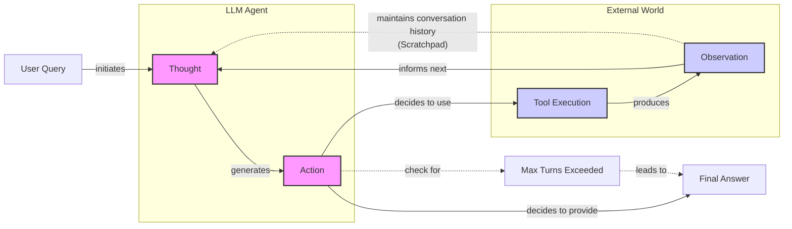

# Lesson 8: Building a ReAct Agent From Scratch

In our last lesson, we explored the theory behind agentic planning and reasoning, focusing on frameworks like ReAct. We learned that the Reasoning and Acting (ReAct) framework empowers an LLM to solve complex tasks by interleaving thought generation, action execution, and observation processing [[1]](https://arxiv.org/pdf/2210.03629). Abstract theory is a good start, but as engineers, the real understanding comes from building. This lesson is 100% practical. We are moving from theory to implementation.

We will build a minimal ReAct agent from the ground up using only Python and the Gemini API. You will implement the full Thought → Action → Observation loop end-to-end. By the end, you will have a concrete mental model of how these reasoning agents work under the hood. This practical knowledge is essential for building, debugging, and customizing agents for production.

This lesson will walk you through setting up a Python environment with Gemini, implementing a mock tool, generating a "thought" to guide the agent's next step, using function calling to select and execute an "action," building the main control loop to orchestrate the agent's turn-based execution, and testing the agent to see how it handles success and failure.

## Setup and Environment

Our first step is to set up a clean Python environment to ensure our code runs smoothly and our outputs match the expected traces. This foundation will support all the components we build throughout this lesson. A well-organized setup is not just about making a script run; it is about building a maintainable and scalable project.

The design rationale for using custom utilities like `lessons.utils.env.load` and `lessons.utils.pretty_print` is rooted in modularity and reusability. Instead of scattering `os.getenv()` calls and `print()` statements throughout the codebase, we centralize these functions. `env.load` provides a single, reliable way to manage environment variables, making configuration consistent across different parts of the application and easier to debug. Similarly, `pretty_print` gives us a standardized, color-coded format for tracing the agent's behavior. For complex agentic systems, clear and readable logs are not a luxury; they are essential for debugging the intricate flow of thoughts, actions, and observations.

1. We begin by loading our `GOOGLE_API_KEY` from the environment. Our custom `env.load` utility from `lessons.utils` ensures that all necessary keys are present before we proceed.
    ```python
    from lessons.utils import env
    
    env.load(required_env_vars=["GOOGLE_API_KEY"])
    ```
    It outputs:
    ```text
    Trying to load environment variables from /.../.env
    Environment variables loaded successfully.
    ```
2. Next, we import the necessary packages. We will use `google-genai` to interact with the Gemini API. For data modeling, we will rely on `pydantic` and `enum`. As we discussed in Lesson 4 on Structured Outputs, Pydantic is essential for creating validated data structures. It enforces a contract between our code and the LLM's output, preventing bad data from causing errors downstream [[11]](https://www.neradot.com/post/building-a-python-react-agent-class-a-step-by-step-guide). For example, if the model returns a string where an integer is expected, Pydantic raises a `ValidationError` immediately, which is a "fail-fast" behavior critical for robust systems.
    
    We also use `Enum` to define a fixed set of message roles. This makes our state machine more robust by preventing simple string typos (e.g., `"tool_request"` vs. `"tool request"`) from breaking the agent's logic.
    ```python
    from enum import Enum
    from pydantic import BaseModel, Field
    from typing import List
    
    from google import genai
    from google.genai import types
    
    from lessons.utils import pretty_print
    ```
3. With our imports in place, we initialize the Gemini client. The client automatically detects and uses the API key we loaded earlier.
    ```python
    client = genai.Client()
    ```
    It outputs:
    ```text
    Both GOOGLE_API_KEY and GEMINI_API_KEY are set. Using GOOGLE_API_KEY.
    ```
4. Finally, we define the model we will use. For this lesson, we will use `gemini-2.5-flash`, which is fast and cost-effective, making it ideal for the simple, iterative tasks our agent will perform [[5]](https://ai.google.dev/gemini-api/docs/langgraph-example).
    ```python
    MODEL_ID = "gemini-2.5-flash"
    ```
With the client and model configured, we are ready to define the external capabilities our agent can use.

## Tool Layer: Mock Search Implementation

Before our agent can act, it needs tools. In this section, we will implement a simple mock search tool. We use a mock tool instead of a real API for a few key reasons: it simplifies our focus to the ReAct mechanics, removes the need for external API keys, and provides predictable responses, which is a massive help when testing and debugging [[13]](https://medium.com/google-cloud/building-react-agents-from-scratch-a-hands-on-guide-using-gemini-ffe4621d90ae). This approach allows us to isolate the agent's reasoning logic from the complexities of network requests and external service failures.

1. Our mock `search` function simulates an external knowledge source. It takes a string query and returns a predefined response if the query matches a known topic. If the query is not recognized, it returns a fallback message. The function signature and docstring are important; as we saw in Lesson 6, modern LLM APIs use this information to understand what the tool does and what arguments it expects [[9]](https://ai.google.dev/gemini-api/docs/function-calling). The docstring effectively becomes the API documentation for the LLM, so clarity and detail are key.
    ```python
    def search(query: str) -> str:
        """Search for information about a specific topic or query.
    
        Args:
            query (str): The search query or topic to look up.
        """
        query_lower = query.lower()
    
        # Predefined responses for demonstration
        if all(word in query_lower for word in ["capital", "france"]):
            return "Paris is the capital of France and is known for the Eiffel Tower."
        elif "react" in query_lower:
            return "The ReAct (Reasoning and Acting) framework enables LLMs to solve complex tasks by interleaving thought generation, action execution, and observation processing."
    
        # Generic response for unhandled queries
        return f"Information about '{query}' was not found."
    ```
2. To manage our tools, we use a `TOOL_REGISTRY`. This dictionary maps the tool's name to its callable function. This simple pattern is powerful because it decouples the agent's planning (which uses the tool's name) from the execution (which calls the actual Python function). This abstraction is a common pattern in agentic frameworks and makes the system more modular and easier to extend.
    ```python
    TOOL_REGISTRY = {
        search.__name__: search,
    }
    ```
This design makes it easy to swap our mock tool with a real one in a production environment. This modularity is a key principle for building maintainable AI systems.

### From Mock to Production

In a real-world application, you would replace the mock `search` function with one that calls an actual external API. For example, you could use a library like `requests` to query the Google Search API or a domain-specific knowledge base [[7]](https://medium.com/google-cloud/building-react-agents-from-scratch-a-hands-on-guide-using-gemini-ffe4621d90ae). The key is to preserve the function signature (`query: str -> str`) and update the docstring to reflect the new capability.

Here is how you might implement a tool for a real-time web search using LangChain's `DuckDuckGoSearchRun` [[15]](https://atalupadhyay.wordpress.com/2025/11/25/building-a-real-time-web-searching-ai-agent-with-langchain-and-google-gemini/). The `@tool` decorator from LangChain simplifies the process of making a function available to an agent by automatically generating the necessary schema from the function's signature and docstring.

```python
from langchain.tools import tool
from langchain_community.tools import DuckDuckGoSearchRun

@tool
def web_search(query: str) -> str:
    """Searches the web using DuckDuckGo for up-to-date information."""
    search = DuckDuckGoSearchRun()
    return search.run(query)
```

When moving to production, you must also consider API key management, rate limiting, and error handling. API keys should be loaded securely from environment variables, never hardcoded. Your tool's implementation should include `try-except` blocks to gracefully handle network issues or API errors, returning an informative message to the agent. For example, if an API is temporarily unavailable, the tool could return `"Error: The search service is currently unavailable. Please try again later."`. This observation allows the agent to reason about the failure and potentially retry or choose an alternative tool [[20]](https://latenode.com/blog/ai-frameworks-technical-infrastructure/langchain-setup-tools-agents-memory/langchain-react-agent-complete-implementation-guide-working-examples-2025).

Now that our agent has a tool, let's implement the first phase of the ReAct cycle: thought.

## Thought Phase: Prompt Construction and Generation

The "Thought" phase is where the agent reasons about its task and decides what to do next. We guide this process with a carefully constructed prompt that gives the LLM all the context it needs: the available tools, the conversation history, and the user's goal. The quality of this prompt directly impacts the agent's ability to reason effectively.

A well-structured prompt acts as a set of clear instructions for the model. Using delimiters like XML tags (`<tools>`, `<conversation>`) is a powerful technique to help the model distinguish between different parts of the input, such as instructions, context, and user queries [[13]](https://ai.google.dev/gemini-api/docs/prompting-strategies). This separation prevents the model from confusing context with instructions and improves the reliability of its reasoning. In production systems, like those described by Anthropic, prompt engineering for tools is given as much attention as the main system prompt, with a focus on clarity, examples, and defining clear boundaries between tools [[4]](https://www.anthropic.com/engineering/building-effective-agents). Our prompt also explicitly instructs the agent to "Avoid repeating the same strategies that didn't work previously," a simple but effective way to encourage more robust, adaptive behavior and prevent it from getting stuck in repetitive failure loops.

1. To inform the model about its capabilities, we create an XML description of the available tools. The `build_tools_xml_description` function iterates through our `TOOL_REGISTRY` and formats each tool's name and docstring into an XML block. This makes the tool's purpose and usage explicit to the LLM.
    ```python
    def build_tools_xml_description(tools: dict[str, callable]) -> str:
        """Build a minimal XML description of tools using only their docstrings."""
        lines = []
        for tool_name, fn in tools.items():
            doc = (fn.__doc__ or "").strip()
            lines.append(f"\t<tool name=\"{tool_name}\">")
            if doc:
                lines.append(f"\t\t<description>")
                for line in doc.split("\n"):
                    lines.append(f"\t\t\t{line}")
                lines.append(f"\t\t</description>")
            lines.append("\t</tool>")
        return "\n".join(lines)
    
    tools_xml = build_tools_xml_description(TOOL_REGISTRY)
    
    PROMPT_TEMPLATE_THOUGHT = f"""
    You are deciding the next best step for reaching the user goal. You have some tools available to you.
    
    Available tools:
    <tools>
    {tools_xml}
    </tools>
    
    Conversation so far:
    <conversation>
    {{conversation}}
    </conversation>
    
    State your next thought about what to do next as one short paragraph focused on the next action you intend to take and why.
    Avoid repeating the same strategies that didn't work previously. Prefer different approaches.
    """.strip()
    ```
2. Let's inspect the complete prompt template to see what the model receives.
    ```python
    print(PROMPT_TEMPLATE_THOUGHT)
    ```
    It outputs:
    ```text
    You are deciding the next best step for reaching the user goal. You have some tools available to you.
    
    Available tools:
    <tools>
        <tool name="search">
            <description>
                Search for information about a specific topic or query.
                
                Args:
                    query (str): The search query or topic to look up.
            </description>
        </tool>
    </tools>
    
    Conversation so far:
    <conversation>
    {conversation}
    </conversation>
    
    State your next thought about what to do next as one short paragraph focused on the next action you intend to take and why.
    Avoid repeating the same strategies that didn't work previously. Prefer different approaches.
    ```
    The output shows the tool description neatly wrapped in XML tags, along with a placeholder for the ongoing conversation.
3. The `generate_thought` function orchestrates this. It takes the current conversation history, constructs the full prompt, and calls the Gemini model. It then returns the model's textual response, which represents the agent's thought.
    ```python
    def generate_thought(conversation: str, tool_registry: dict[str, callable]) -> str:
        """Generate a thought as plain text (no structured output)."""
        tools_xml = build_tools_xml_description(tool_registry)
        prompt = PROMPT_TEMPLATE_THOUGHT.format(conversation=conversation, tools_xml=tools_xml)
    
        response = client.models.generate_content(
            model=MODEL_ID,
            contents=prompt
        )
        return response.text.strip()
    ```
With a coherent thought generated, the agent must now translate it into a concrete action. This could be a tool call or, if the task is complete, a final answer to the user.

## Action Phase: Function Calling and Parsing

The "Action" phase is where the agent commits to a specific step. It decides whether to use a tool to gather more information or to provide a final answer because it is confident it has solved the task. We will use Gemini's native function calling capabilities to implement this [[9]](https://ai.google.dev/gemini-api/docs/function-calling).

A key design choice here is the separation of concerns. In the "Thought" phase, we included tool descriptions directly in the prompt to help the LLM reason. In the "Action" phase, we leverage Gemini’s `tools` parameter. The API automatically handles the integration of tool docstrings and signatures into the model's context, which keeps our action prompt clean and focused on strategic decision-making [[9]](https://ai.google.dev/gemini-api/docs/function-calling). This is a more robust and scalable approach than manually inserting tool schemas into the prompt, as it reduces prompt length and relies on the provider's optimized format. We also set `automatic_function_calling={"disable": True}`. This gives us manual control to inspect the model's intended action before execution, which is the entire point of this from-scratch implementation. It allows us to log the tool request and then execute it, completing the ReAct loop explicitly.

1. We start with two prompt templates. `PROMPT_TEMPLATE_ACTION` is the default, asking the model to choose between a tool call and a final answer. `PROMPT_TEMPLATE_ACTION_FORCED` is a special-purpose prompt we use to guarantee a final answer, which is a crucial pattern for preventing infinite loops and ensuring the agent can terminate gracefully.
    ```python
    PROMPT_TEMPLATE_ACTION = """
    You are selecting the best next action to reach the user goal.
    
    Conversation so far:
    <conversation>
    {conversation}
    </conversation>
    
    Respond either with a tool call (with arguments) or a final answer if you can confidently conclude.
    """.strip()
    
    # Dedicated prompt used when we must force a final answer
    PROMPT_TEMPLATE_ACTION_FORCED = """
    You must now provide a final answer to the user.
    
    Conversation so far:
    <conversation>
    {conversation}
    </conversation>
    
    Provide a concise final answer that best addresses the user's goal.
    """.strip()
    ```
2. To handle the model's output, we define two Pydantic models, `ToolCallRequest` and `FinalAnswer`. These structured classes, which we covered in Lesson 4, ensure that we can reliably parse the model's decision and handle the two possible outcomes: calling a tool or finishing the task.
    ```python
    class ToolCallRequest(BaseModel):
        """A request to call a tool with its name and arguments."""
        tool_name: str = Field(description="The name of the tool to call.")
        arguments: dict = Field(description="The arguments to pass to the tool.")
    
    
    class FinalAnswer(BaseModel):
        """A final answer to present to the user when no further action is needed."""
        text: str = Field(description="The final answer text to present to the user.")
    ```
3. The `generate_action` function brings it all together. It first checks if a final answer is being forced. If so, it uses the simpler, dedicated prompt and returns a `FinalAnswer`. Otherwise, it constructs a request with the default prompt and the list of available tools. The `config` object tells the Gemini API about the tools and disables automatic execution. The function then inspects the `response` from the model. If a `function_call` is present in the response parts, it extracts the name and arguments and returns a `ToolCallRequest`. If not, it assumes the model has provided a text-based final answer and returns a `FinalAnswer` object.
    ```python
    def generate_action(conversation: str, tool_registry: dict[str, callable] | None = None, force_final: bool = False) -> (ToolCallRequest | FinalAnswer):
        """Generate an action by passing tools to the LLM and parsing function calls or final text.
    
        When force_final is True or no tools are provided, the model is instructed to produce a final answer and tool calls are disabled.
        """
        # Use a dedicated prompt when forcing a final answer or no tools are provided
        if force_final or not tool_registry:
            prompt = PROMPT_TEMPLATE_ACTION_FORCED.format(conversation=conversation)
            response = client.models.generate_content(
                model=MODEL_ID,
                contents=prompt
            )
            return FinalAnswer(text=response.text.strip())
    
        # Default action prompt
        prompt = PROMPT_TEMPLATE_ACTION.format(conversation=conversation)
    
        # Provide the available tools to the model; disable auto-calling so we can parse and run ourselves
        tools = list(tool_registry.values())
        config = types.GenerateContentConfig(
            tools=tools,
            automatic_function_calling={"disable": True}
        )
        response = client.models.generate_content(
            model=MODEL_ID,
            contents=prompt,
            config=config
        )
    
        # Extract the function call from the response (if present)
        candidate = response.candidates[0]
        parts = candidate.content.parts
        if parts and getattr(parts[0], "function_call", None):
            name = parts[0].function_call.name
            args = dict(parts[0].function_call.args) if parts[0].function_call.args is not None else {}
            return ToolCallRequest(tool_name=name, arguments=args)
        
        # Otherwise, it's a final answer
        final_answer = "".join(part.text for part in candidate.content.parts)
        return FinalAnswer(text=final_answer.strip())
    ```

### Production-Grade Error Handling

In a production system, tool execution can fail for many reasons: network timeouts, invalid API inputs, or service outages. A simple `try-except` block is a good start, but robust agents require more advanced strategies [[21]](https://genmind.ch/posts/Building-ReAct-Agents-with-Microsoft-Agent-Framework-From-Theory-to-Production/).

One common pattern is to implement a **retry mechanism** for transient errors. For example, if a network request fails, you could automatically retry the call a few times with an exponential backoff. Libraries like `tenacity` in Python make this easy to implement with decorators.

Another powerful pattern is the **circuit breaker**. If a tool fails repeatedly, the circuit breaker "trips" and stops further calls to that tool for a period of time. This prevents the agent from getting stuck in a loop of failed API calls and overwhelming a struggling service.

When a tool fails permanently, it is important to return a clear, user-facing error message. Instead of a cryptic stack trace, the `observe` function should return something like, `"The weather service is currently down. I can't retrieve the forecast right now."` This allows the agent to reason about the failure in its next thought phase and inform the user or try a different approach.

Now that we have implemented the "Thought" and "Action" phases, it is time to orchestrate them within a control loop.

## Control Loop: Messages, Scratchpad, Orchestration

The control loop is the engine of our ReAct agent. It orchestrates the Thought → Action → Observation cycle, manages the conversation history, and ensures the agent makes steady progress toward its goal. At the heart of this loop is the "scratchpad," a log of all interactions that serves as the agent's short-term memory [[11]](https://www.neradot.com/post/building-a-python-react-agent-class-a-step-by-step-guide). This concept is central to many agentic frameworks, including LangGraph, which models agent execution as a stateful graph where the state (our scratchpad) is passed between nodes [[10]](https://www.decodingai.com/p/building-production-react-agents).

Image 1: A flowchart illustrating the ReAct control loop, showing the iterative flow between the user, the LLM (Thought and Action phases), external tools, and observations, with implicit representation of the scratchpad and loop termination conditions.


Our implementation will mirror this stateful, cyclical process. We will build a system that logs every step, makes decisions based on the complete history, and gracefully handles termination.

1. We start by defining the data structures for our scratchpad. The `MessageRole` enum categorizes each entry, while the `Message` Pydantic model provides a consistent structure for all interactions, whether from the user, the agent's internal thoughts, or a tool's output. This structured approach is fundamental to building a reliable agent, as it ensures that every piece of information in the agent's memory is well-defined and predictable.
    ```python
    class MessageRole(str, Enum):
        """Enumeration for the different roles a message can have."""
        USER = "user"
        THOUGHT = "thought"
        TOOL_REQUEST = "tool request"
        OBSERVATION = "observation"
        FINAL_ANSWER = "final answer"
    
    
    class Message(BaseModel):
        """A message with a role and content, used for all message types."""
        role: MessageRole = Field(description="The role of the message in the ReAct loop.")
        content: str = Field(description="The textual content of the message.")
    
        def __str__(self) -> str:
            """Provides a user-friendly string representation of the message."""
            return f"{self.role.value.capitalize()}: {self.content}"
    ```
2. We add a helper function, `pretty_print_message`, to render each message in a color-coded format. This makes the agent's trace easy to follow and debug, which is essential when analyzing complex interactions. Visualizing the flow of information helps in quickly identifying where the agent's reasoning might be going astray or if a tool is returning unexpected results.
    ```python
    def pretty_print_message(message: Message, turn: int, max_turns: int, header_color: str = pretty_print.Color.YELLOW, is_forced_final_answer: bool = False) -> None:
        if not is_forced_final_answer:
            title = f"{message.role.value.capitalize()} (Turn {turn}/{max_turns}):"
        else:
            title = f"{message.role.value.capitalize()} (Forced):"
    
        pretty_print.wrapped(
            text=message.content,
            title=title,
            header_color=header_color,
        )
    ```
3. The `Scratchpad` class manages the list of messages. Its `append` method not only adds a new message to the history but also optionally prints it, giving us a real-time view of the agent's state. The `to_string` method serializes the entire history into a single string, which is then passed to the LLM in the next turn. This ensures the model has the full context of the conversation when making its next decision.
    ```python
    class Scratchpad:
        """Container for ReAct messages with optional pretty-print on append."""
    
        def __init__(self, max_turns: int) -> None:
            self.messages: List[Message] = []
            self.max_turns: int = max_turns
            self.current_turn: int = 1
    
        def set_turn(self, turn: int) -> None:
            self.current_turn = turn
    
        def append(self, message: Message, verbose: bool = False, is_forced_final_answer: bool = False) -> None:
            self.messages.append(message)
            if verbose:
                role_to_color = {
                    MessageRole.USER: pretty_print.Color.RESET,
                    MessageRole.THOUGHT: pretty_print.Color.ORANGE,
                    MessageRole.TOOL_REQUEST: pretty_print.Color.GREEN,
                    MessageRole.OBSERVATION: pretty_print.Color.YELLOW,
                    MessageRole.FINAL_ANSWER: pretty_print.Color.CYAN,
                }
                header_color = role_to_color.get(message.role, pretty_print.Color.YELLOW)
                pretty_print_message(
                    message=message,
                    turn=self.current_turn,
                    max_turns=self.max_turns,
                    header_color=header_color,
                    is_forced_final_answer=is_forced_final_answer,
                )
    
        def to_string(self) -> str:
            return "\n".join(str(m) for m in self.messages)
    ```
4. Finally, the `react_agent_loop` function implements the core logic. It initializes the scratchpad with the user's question and then enters a loop for a maximum number of turns. In each turn:
    - It generates a **thought** based on the entire history in the scratchpad.
    - It generates an **action**, again using the full history.
    - If the action is a `FinalAnswer`, the loop terminates, and the answer is returned.
    - If the action is a `ToolCallRequest`, it looks up the tool in the `tool_registry`, executes it, and captures the output as an **observation**. This observation is then added to the scratchpad, closing the loop and providing new information for the next turn's thought process.
    
    If the loop reaches `max_turns` without a final answer, it calls `generate_action` one last time with `force_final=True`. This ensures the agent always provides a response and does not get stuck in an endless cycle. This is a critical safety net to prevent run-away agents, a real production concern [[7]](https://medium.com/google-cloud/building-react-agents-from-scratch-a-hands-on-guide-using-gemini-ffe4621d90ae).
    ```python
    def react_agent_loop(initial_question: str, tool_registry: dict[str, callable], max_turns: int = 5, verbose: bool = False) -> str:
        """
        Implements the main ReAct (Thought -> Action -> Observation) control loop.
        Uses a unified message class for the scratchpad.
        """
        scratchpad = Scratchpad(max_turns=max_turns)
    
        # Add the user's question to the scratchpad
        user_message = Message(role=MessageRole.USER, content=initial_question)
        scratchpad.append(user_message, verbose=verbose)
    
        for turn in range(1, max_turns + 1):
            scratchpad.set_turn(turn)
    
            # Generate a thought based on the current scratchpad
            thought_content = generate_thought(
                scratchpad.to_string(),
                tool_registry,
            )
            thought_message = Message(role=MessageRole.THOUGHT, content=thought_content)
            scratchpad.append(thought_message, verbose=verbose)
    
            # Generate an action based on the current scratchpad
            action_result = generate_action(
                scratchpad.to_string(),
                tool_registry=tool_registry,
            )
    
            # If the model produced a final answer, return it
            if isinstance(action_result, FinalAnswer):
                final_answer = action_result.text
                final_message = Message(role=MessageRole.FINAL_ANSWER, content=final_answer)
                scratchpad.append(final_message, verbose=verbose)
                return final_answer
    
            # Otherwise, it is a tool request
            if isinstance(action_result, ToolCallRequest):
                action_name = action_result.tool_name
                action_params = action_result.arguments
    
                # Add the action to the scratchpad
                params_str = ", ".join([f"{k}='{v}'" for k, v in action_params.items()])
                action_content = f"{action_name}({params_str})"
                action_message = Message(role=MessageRole.TOOL_REQUEST, content=action_content)
                scratchpad.append(action_message, verbose=verbose)
    
                # Run the action and get the observation
                observation_content = ""
                tool_function = tool_registry[action_name]
                try:
                    observation_content = tool_function(**action_params)
                except Exception as e:
                    observation_content = f"Error executing tool '{action_name}': {e}"
    
                # Add the observation to the scratchpad
                observation_message = Message(role=MessageRole.OBSERVATION, content=observation_content)
                scratchpad.append(observation_message, verbose=verbose)
    
            # Check if the maximum number of turns has been reached. If so, force the action selector to produce a final answer
            if turn == max_turns:
                forced_action = generate_action(
                    scratchpad.to_string(),
                    force_final=True,
                )
                if isinstance(forced_action, FinalAnswer):
                    final_answer = forced_action.text
                else:
                    final_answer = "Unable to produce a final answer within the allotted turns."
                final_message = Message(role=MessageRole.FINAL_ANSWER, content=final_answer)
                scratchpad.append(final_message, verbose=verbose, is_forced_final_answer=True)
                return final_answer
    ```
With the complete loop implemented, we can now test our agent and analyze its behavior.

## Tests and Traces: Success and Graceful Fallback

To validate our ReAct agent, we will run it through two test cases. The first is a straightforward factual question that our mock tool can answer. The second is a query about a topic our tool does not know, which will test the agent's fallback behavior and forced termination logic. Analyzing the traces will give us a clear picture of the agent's reasoning process [[7]](https://medium.com/google-cloud/building-react-agents-from-scratch-a-hands-on-guide-using-gemini-ffe4621d90ae). This step-by-step analysis is not just for debugging; it is a form of interpretability, allowing us to trust the agent's outputs because we can see *how* it arrived at them.

1. First, let's ask a question our mock `search` tool is designed to handle: "What is the capital of France?". We set `max_turns=2` and `verbose=True` to see the detailed trace.
    ```python
    # A straightforward question requiring a search.
    question = "What is the capital of France?"
    final_answer = react_agent_loop(question, TOOL_REGISTRY, max_turns=2, verbose=True)
    ```
    It outputs:
    ```text
    User (Turn 1/2):
    What is the capital of France?
    
    Thought (Turn 1/2):
    The user is asking for the capital of France. I can use the search tool to find this information.
    
    Tool request (Turn 1/2):
    search(query='capital of France')
    
    Observation (Turn 1/2):
    Paris is the capital of France and is known for the Eiffel Tower.
    
    Thought (Turn 2/2):
    The search tool returned the answer that Paris is the capital of France. I can now provide the final answer.
    
    Final answer (Turn 2/2):
    Paris is the capital of France.
    ```
    The trace clearly shows the ReAct cycle in action. The **Thought** shows the agent's plan. The **Tool request** shows it correctly selecting the `search` tool. The **Observation** confirms the tool returned the necessary fact. Finally, the agent synthesizes this information in its second **Thought** and delivers the **Final answer**. The process is logical, transparent, and successful.
2. Now, let's test a query our mock tool cannot answer: "What is the capital of Italy?". This will force the agent to adapt its strategy and eventually hit the turn limit.
    ```python
    # An unknown query to test the fallback and forced final answer
    question = "What is the capital of Italy?"
    final_answer = react_agent_loop(question, TOOL_REGISTRY, max_turns=2, verbose=True)
    ```
    It outputs:
    ```text
    User (Turn 1/2):
    What is the capital of Italy?
    
    Thought (Turn 1/2):
    The user is asking for the capital of Italy. I will use the search tool to find this information.
    
    Tool request (Turn 1/2):
    search(query='capital of Italy')
    
    Observation (Turn 1/2):
    Information about 'capital of Italy' was not found.
    
    Thought (Turn 2/2):
    The previous search for 'capital of Italy' returned no information. I will try a broader search for just 'Italy' to see if I can find any relevant information that might lead to the capital.
    
    Tool request (Turn 2/2):
    search(query='Italy')
    
    Observation (Turn 2/2):
    Information about 'Italy' was not found.
    
    Final answer (Forced):
    I'm sorry, but I couldn't find information about the capital of Italy.
    ```
    This trace demonstrates the agent's resilience. After the first search fails, the agent's next thought is to try a broader query—a simple but effective recovery strategy. When that also fails and it reaches the `max_turns` limit, the control loop correctly triggers the forced final answer path, providing a polite and honest response to the user. This graceful fallback is a key feature of a robust agent. A real-world failure was observed in a Wikipedia research agent when asked to research a non-notable person; the `fetch_wikipedia_content` tool correctly returned "No Wikipedia articles found," and the agent gracefully concluded it could not fulfill the request instead of hallucinating an answer [[10]](https://www.decodingai.com/p/building-production-react-agents).

### Beyond Simple Tests: A Software Engineering Approach

While these simple traces are useful, building production-ready agents requires a more rigorous testing methodology, similar to traditional software engineering. A comprehensive test suite should include:
- **Unit Tests:** Each tool should be tested in isolation to ensure it behaves as expected. For our `search` tool, we would write tests to verify it returns the correct mock response for "capital of France" and the fallback message for unknown queries. This ensures the building blocks of our agent are reliable.
- **Integration Tests:** These tests validate the interaction between components. Our `react_agent_loop` tests are a form of integration testing, as they verify that the thought, action, and observation phases work together correctly. You might also write specific tests for the `generate_action` function to ensure it correctly parses different types of model outputs.
- **End-to-End (E2E) Evaluation:** For complex agents, you need to evaluate performance on a benchmark of representative tasks. For example, the SWE-Bench benchmark is used to evaluate coding agents on their ability to solve real-world GitHub issues. This involves running the agent on a set of problems and measuring its success rate, providing a quantitative measure of its real-world effectiveness.
- **Adversarial Testing:** This involves crafting prompts designed to confuse or mislead the agent. For example, you could ask a question with a false premise ("What is the capital of the moon?") to see if the agent correctly identifies the issue or blindly attempts to search for an answer. This helps uncover edge cases and improve the agent's robustness against unexpected user inputs.

By adopting these established testing practices, you can build confidence in your agent's reliability and ensure it performs as expected in the wild.

These tests confirm our end-to-end implementation and provide a solid foundation for building more complex agents in future lessons.

## Conclusion

We have successfully built a ReAct agent from scratch, moving from individual components to a fully orchestrated control loop. By implementing the Thought-Action-Observation cycle ourselves, we have demystified what happens inside agentic frameworks. You now have a concrete mental model of how an agent reasons, uses tools, and learns from its environment.

Even if you use a framework like LangGraph in production, this foundational understanding is what will allow you to debug, customize, and extend your agents with confidence. This practical knowledge is essential for shipping production-grade AI.

Remember that this article is part of a longer series on AI Agents Foundations. In our next lesson, we will dive into memory, exploring how agents can remember information across conversations to build more personalized and context-aware experiences.

## References

- [1] [ReAct: Synergizing Reasoning and Acting in Language Models](https://arxiv.org/pdf/2210.03629)
- [2] [ReAct Agent - IBM](https://www.ibm.com/think/topics/react-agent)
- [3] [AI Agent Planning - IBM](https://www.ibm.com/think/topics/ai-agent-planning)
- [4] [Building effective agents - Anthropic](https://www.anthropic.com/engineering/building-effective-agents)
- [5] [ReAct agent from scratch with Gemini 2.5 and LangGraph](https://ai.google.dev/gemini-api/docs/langgraph-example)
- [6] [From LLM Reasoning to Autonomous AI Agents: A Comprehensive Review](https://arxiv.org/pdf/2504.19678)
- [7] [Building ReAct Agents from Scratch using Gemini - Medium](https://medium.com/google-cloud/building-react-agents-from-scratch-a-hands-on-guide-using-gemini-ffe4621d90ae)
- [8] [AI Agent Orchestration - IBM](https://www.ibm.com/think/topics/ai-agent-orchestration)
- [9] [Function calling - Google AI for Developers](https://ai.google.dev/gemini-api/docs/function-calling)
- [10] [Building Production ReAct Agents From Scratch Is Simple - Decoding AI](https://www.decodingai.com/p/building-production-react-agents)
- [11] [Building a Python React Agent Class: A Step-by-Step Guide - Neradot](https://www.neradot.com/post/building-a-python-react-agent-class-a-step-by-step-guide)
- [12] [OrchDAG: Complex Tool Orchestration in Multi-Turn Interactions with Plan DAGs - arXiv](https://arxiv.org/html/2510.24663v1)
- [13] [Prompt design strategies - Google AI for Developers](https://ai.google.dev/gemini-api/docs/prompting-strategies)
- [14] [ReAct agent from scratch with Gemini 2.5 and LangGraph - philschmid.de](https://www.philschmid.de/langgraph-gemini-2-5-react-agent)
- [15] [Building a real-time web searching AI agent with LangChain and Google Gemini](https://atalupadhyay.wordpress.com/2025/11/25/building-a-real-time-web-searching-ai-agent-with-langchain-and-google-gemini/)
- [16] [AI Agents Crash Course - Part 10: ReAct Framework with Implementation - Daily Dose of DS](https://www.dailydoseofds.com/ai-agents-crash-course-part-10-with-implementation/)
- [17] [Building ReAct Agents with LangGraph: A Beginner’s Guide - Machine Learning Mastery](https://machinelearningmastery.com/building-react-agents-with-langgraph-a-beginners-guide/)
- [18] [ReAct: A simple agent for conversational Python - Peter Roelants](https://peterroelants.github.io/posts/react-openai-function-calling/)
- [19] [Implement ReAct Agentic Pattern From Scratch - Daily Dose of DS](https://blog.dailydoseofds.com/p/implement-react-agentic-pattern-from)
- [20] [LangChain ReAct Agent: Complete Implementation Guide with Working Examples (2025) - LateNode](https://latenode.com/blog/ai-frameworks-technical-infrastructure/langchain-setup-tools-agents-memory/langchain-react-agent-complete-implementation-guide-working-examples-2025)
- [21] [Building ReAct Agents with Microsoft Agent Framework: From Theory to Production](https://genmind.ch/posts/Building-ReAct-Agents-with-Microsoft-Agent-Framework-From-Theory-to-Production/)
- [22] [Using Gemini with OpenAI Agents SDK - OpenAI Community](https://community.openai.com/t/using-gemini-with-openai-agents-sdk/1307262)
- [23] [Build an AI coding agent with Python and Gemini - freeCodeCamp.org](https://www.freecodecamp.org/news/build-an-ai-coding-agent-with-python-and-gemini/)
- [24] [Beyond the Prompt: Engineering the Thought-Action-Observation Loop - Towards AI](https://pub.towardsai.net/beyond-the-prompt-engineering-the-thought-action-observation-loop-2e1fd99114d2)
- [25] [AI Agents IV: AI Agents through the Thought-Action-Observation (TAO) Cycle - Stackademic](https://blog.stackademic.com/ai-agents-iv-ai-agents-through-the-thought-action-observation-tao-cycle-3dfe2eb76629)
- [26] [Agent steps and structure - Hugging Face](https://huggingface.co/learn/agents-course/unit1/agent-steps-and-structure)
- [27] [Real-world agent examples with Gemini 3 - Google for Developers Blog](https://developers.googleblog.com/real-world-agent-examples-with-gemini-3/)
- [28] [Converting a ReAct prompt to use function calling - OpenAI Community](https://community.openai.com/t/converting-a-react-prompt-to-use-function-calling/264914)
- [29] [DataCamp Chapter 2 PDF](https://projector-video-pdf-converter.datacamp.com/42942/chapter2.pdf)
- [30] [Thinking with Gemini API - Google AI for Developers](https://ai.google.dev/gemini-api/docs/thinking)
- [31] [OrchDAG: Complex Tool Orchestration in Multi-Turn Interactions with Plan DAGs - Amazon Science](https://www.amazon.science/publications/orchdag-complex-tool-orchestration-in-multi-turn-interactions-with-plan-dags)