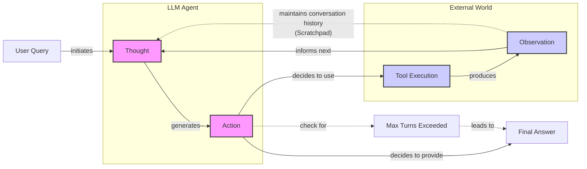

# Lesson 8: Building a ReAct Agent From Scratch

In our last lesson, we explored the theory behind agentic planning and reasoning, focusing on frameworks like ReAct. We learned that ReAct empowers an LLM to solve complex tasks by interleaving thought generation, action execution, and observation processing. Abstract theory is a good start, but as engineers, the real understanding comes from building. This lesson is 100% practical. We are moving from theory to implementation.

We will build a minimal ReAct agent from the ground up using only Python and the Gemini API. You will implement the full Thought → Action → Observation loop end-to-end. By the end, you will have a concrete mental model of how these reasoning agents work under the hood. This hands-on experience is what gives you the confidence to extend, debug, and customize agents for production.

This lesson will walk you through:
- Setting up a Python environment with Gemini.
- Implementing a mock tool and a registry for tool management.
- Generating a "thought" to guide the agent's next step.
- Using function calling to select and execute an "action".
- Building the main control loop to orchestrate the agent's turn-based execution.
- Testing the agent to see how it handles success and failure.

## Setup and Environment

Our first step is to set up a clean Python environment to ensure our code runs smoothly and our outputs match the expected traces. This foundation will support all the components we build throughout this lesson.

1. We begin by loading our `GOOGLE_API_KEY` from the environment. Our custom `env.load` utility from `lessons.utils` ensures that all necessary keys are present before we proceed.
    ```python
    from lessons.utils import env
    
    env.load(required_env_vars=["GOOGLE_API_KEY"])
    ```
    It outputs:
    ```text
    Trying to load environment variables from /.../.env
    Environment variables loaded successfully.
    ```
2. Next, we import the necessary packages. We will use `google-genai` to interact with the Gemini API. For data modeling, we will rely on `pydantic` and `enum`. As we discussed in Lesson 4 on Structured Outputs, Pydantic is essential for creating validated data structures. It enforces a contract between our code and the LLM's output, preventing bad data from causing errors downstream. We also use `Enum` to define a fixed set of message roles, which makes our code more readable and less prone to typos.
    ```python
    from enum import Enum
    from pydantic import BaseModel, Field
    from typing import List
    
    from google import genai
    from google.genai import types
    
    from lessons.utils import pretty_print
    ```
3. With our imports in place, we initialize the Gemini client. The client automatically detects and uses the API key we loaded earlier.
    ```python
    client = genai.Client()
    ```
    It outputs:
    ```text
    Both GOOGLE_API_KEY and GEMINI_API_KEY are set. Using GOOGLE_API_KEY.
    ```
4. Finally, we define the model we will use. For this lesson, we will use `gemini-2.5-flash`, which is fast and cost-effective, making it ideal for the simple, iterative tasks our agent will perform.
    ```python
    MODEL_ID = "gemini-2.5-flash"
    ```
With the client and model configured, we are ready to define the external capabilities our agent can use.

## Tool Layer: Mock Search Implementation

Before our agent can act, it needs tools. In this section, we will implement a simple mock search tool. We use a mock tool instead of a real API for a few key reasons: it simplifies our focus to the ReAct mechanics, removes the need for external API keys, and provides predictable responses, which is a massive help when testing and debugging.

1. Our mock `search` function simulates an external knowledge source. It takes a string query and returns a predefined response if the query matches a known topic. If the query is not recognized, it returns a fallback message. The function signature and docstring are important; as we saw in Lesson 6, modern LLM APIs use this information to understand what the tool does and what arguments it expects.
    ```python
    def search(query: str) -> str:
        """Search for information about a specific topic or query.
    
        Args:
            query (str): The search query or topic to look up.
        """
        query_lower = query.lower()
    
        # Predefined responses for demonstration
        if all(word in query_lower for word in ["capital", "france"]):
            return "Paris is the capital of France and is known for the Eiffel Tower."
        elif "react" in query_lower:
            return "The ReAct (Reasoning and Acting) framework enables LLMs to solve complex tasks by interleaving thought generation, action execution, and observation processing."
    
        # Generic response for unhandled queries
        return f"Information about '{query}' was not found."
    ```
2. To manage our tools, we use a `TOOL_REGISTRY`. This dictionary maps the tool's name to its callable function. This simple pattern is powerful because it decouples the agent's planning (which uses the tool's name) from the execution (which calls the actual Python function).
    ```python
    TOOL_REGISTRY = {
        search.__name__: search,
    }
    ```
This design makes it easy to swap our mock tool with a real one in a production environment. For example, to use the Google Search API, you would create a new function that calls the API and then update the `TOOL_REGISTRY` to point to it. The rest of the agent's logic would remain unchanged because it only interacts with the tool's name and its standardized signature (`query: str -> str`). This modularity is a key principle for building maintainable AI systems.

Now that our agent has a tool, let's implement the first phase of the ReAct cycle: thought.

## Thought Phase: Prompt Construction and Generation

The "Thought" phase is where the agent reasons about its task and decides what to do next. We guide this process with a carefully constructed prompt that gives the LLM all the context it needs: the available tools, the conversation history, and the user's goal.

1. To inform the model about its capabilities, we create an XML description of the available tools. The `build_tools_xml_description` function iterates through our `TOOL_REGISTRY` and formats each tool's name and docstring into an XML block. As we learned in Lesson 3 on Context Engineering, using structured formats like XML helps the LLM distinguish between different types of information in the prompt.
    ```python
    def build_tools_xml_description(tools: dict[str, callable]) -> str:
        """Build a minimal XML description of tools using only their docstrings."""
        lines = []
        for tool_name, fn in tools.items():
            doc = (fn.__doc__ or "").strip()
            lines.append(f"\t<tool name=\"{tool_name}\">")
            if doc:
                lines.append(f"\t\t<description>")
                for line in doc.split("\n"):
                    lines.append(f"\t\t\t{line}")
                lines.append(f"\t\t</description>")
            lines.append("\t</tool>")
        return "\n".join(lines)
    
    tools_xml = build_tools_xml_description(TOOL_REGISTRY)
    
    PROMPT_TEMPLATE_THOUGHT = f"""
    You are deciding the next best step for reaching the user goal. You have some tools available to you.
    
    Available tools:
    <tools>
    {tools_xml}
    </tools>
    
    Conversation so far:
    <conversation>
    {{conversation}}
    </conversation>
    
    State your next thought about what to do next as one short paragraph focused on the next action you intend to take and why.
    Avoid repeating the same strategies that didn't work previously. Prefer different approaches.
    """.strip()
    ```
2. Let's inspect the complete prompt template to see what the model receives.
    ```python
    print(PROMPT_TEMPLATE_THOUGHT)
    ```
    It outputs:
    ```text
    You are deciding the next best step for reaching the user goal. You have some tools available to you.
    
    Available tools:
    <tools>
        <tool name="search">
            <description>
                Search for information about a specific topic or query.
                
                Args:
                    query (str): The search query or topic to look up.
            </description>
        </tool>
    </tools>
    
    Conversation so far:
    <conversation>
    {conversation}
    </conversation>
    
    State your next thought about what to do next as one short paragraph focused on the next action you intend to take and why.
    Avoid repeating the same strategies that didn't work previously. Prefer different approaches.
    ```
    The output shows the tool description neatly wrapped in XML tags, along with a placeholder for the ongoing conversation.
3. The `generate_thought` function orchestrates this. It takes the current conversation history, constructs the full prompt, and calls the Gemini model. It then returns the model's textual response, which represents the agent's thought.
    ```python
    def generate_thought(conversation: str, tool_registry: dict[str, callable]) -> str:
        """Generate a thought as plain text (no structured output)."""
        tools_xml = build_tools_xml_description(tool_registry)
        prompt = PROMPT_TEMPLATE_THOUGHT.format(conversation=conversation, tools_xml=tools_xml)
    
        response = client.models.generate_content(
            model=MODEL_ID,
            contents=prompt
        )
        return response.text.strip()
    ```
With a coherent thought generated, the agent must now translate it into a concrete action. This could be a tool call or, if the task is complete, a final answer to the user.

## Action Phase: Function Calling and Parsing

The "Action" phase is where the agent commits to a specific step. It decides whether to use a tool to gather more information or to provide a final answer because it is confident it has solved the task. We will use Gemini's native function calling capabilities to implement this.

A key design choice here is the separation of concerns. In the "Thought" phase, we included tool descriptions directly in the prompt to help the LLM reason. In the "Action" phase, we leverage Gemini’s `tools` parameter. The API automatically handles the integration of tool docstrings and signatures into the model's context, which keeps our action prompt clean and focused on strategic decision-making.

1. We start with two prompt templates. `PROMPT_TEMPLATE_ACTION` is the default, asking the model to choose between a tool call and a final answer. `PROMPT_TEMPLATE_ACTION_FORCED` is a special-purpose prompt we use to guarantee a final answer, which is a crucial pattern for preventing infinite loops.
    ```python
    PROMPT_TEMPLATE_ACTION = """
    You are selecting the best next action to reach the user goal.
    
    Conversation so far:
    <conversation>
    {conversation}
    </conversation>
    
    Respond either with a tool call (with arguments) or a final answer if you can confidently conclude.
    """.strip()
    
    # Dedicated prompt used when we must force a final answer
    PROMPT_TEMPLATE_ACTION_FORCED = """
    You must now provide a final answer to the user.
    
    Conversation so far:
    <conversation>
    {conversation}
    </conversation>
    
    Provide a concise final answer that best addresses the user's goal.
    """.strip()
    ```
2. To handle the model's output, we define two Pydantic models, `ToolCallRequest` and `FinalAnswer`. These structured classes, which we covered in Lesson 4, ensure that we can reliably parse the model's decision.
    ```python
    class ToolCallRequest(BaseModel):
        """A request to call a tool with its name and arguments."""
        tool_name: str = Field(description="The name of the tool to call.")
        arguments: dict = Field(description="The arguments to pass to the tool.")
    
    
    class FinalAnswer(BaseModel):
        """A final answer to present to the user when no further action is needed."""
        text: str = Field(description="The final answer text to present to the user.")
    ```
3. The `generate_action` function brings it all together. If `force_final` is `True`, it uses the specialized prompt to get a final answer. Otherwise, it sends the default prompt along with the tool definitions to Gemini. It then parses the response: if the model returns a `function_call`, it's parsed into a `ToolCallRequest`; otherwise, the text response is wrapped in a `FinalAnswer`.
    ```python
    def generate_action(conversation: str, tool_registry: dict[str, callable] | None = None, force_final: bool = False) -> (ToolCallRequest | FinalAnswer):
        """Generate an action by passing tools to the LLM and parsing function calls or final text.
    
        When force_final is True or no tools are provided, the model is instructed to produce a final answer and tool calls are disabled.
        """
        # Use a dedicated prompt when forcing a final answer or no tools are provided
        if force_final or not tool_registry:
            prompt = PROMPT_TEMPLATE_ACTION_FORCED.format(conversation=conversation)
            response = client.models.generate_content(
                model=MODEL_ID,
                contents=prompt
            )
            return FinalAnswer(text=response.text.strip())
    
        # Default action prompt
        prompt = PROMPT_TEMPLATE_ACTION.format(conversation=conversation)
    
        # Provide the available tools to the model; disable auto-calling so we can parse and run ourselves
        tools = list(tool_registry.values())
        config = types.GenerateContentConfig(
            tools=tools,
            automatic_function_calling={"disable": True}
        )
        response = client.models.generate_content(
            model=MODEL_ID,
            contents=prompt,
            config=config
        )
    
        # Extract the function call from the response (if present)
        candidate = response.candidates[0]
        parts = candidate.content.parts
        if parts and getattr(parts[0], "function_call", None):
            name = parts[0].function_call.name
            args = dict(parts[0].function_call.args) if parts[0].function_call.args is not None else {}
            return ToolCallRequest(tool_name=name, arguments=args)
        
        # Otherwise, it's a final answer
        final_answer = "".join(part.text for part in candidate.content.parts)
        return FinalAnswer(text=final_answer.strip())
    ```
Now that we have implemented the "Thought" and "Action" phases, it is time to orchestrate them within a control loop.

## Control Loop: Messages, Scratchpad, Orchestration

The control loop is the engine of our ReAct agent. It orchestrates the Thought → Action → Observation cycle, manages the conversation history, and ensures the agent makes steady progress toward its goal. At the heart of this loop is the "scratchpad," a log of all interactions that serves as the agent's short-term memory.

Image 1: A flowchart illustrating the ReAct control loop, showing the iterative flow between the user, the LLM (Thought and Action phases), external tools, and observations, with implicit representation of the scratchpad and loop termination conditions.


1. We start by defining the data structures for our scratchpad. The `MessageRole` enum categorizes each entry, while the `Message` Pydantic model provides a consistent structure for all interactions, whether from the user, the agent's internal thoughts, or a tool's output.
    ```python
    class MessageRole(str, Enum):
        """Enumeration for the different roles a message can have."""
        USER = "user"
        THOUGHT = "thought"
        TOOL_REQUEST = "tool request"
        OBSERVATION = "observation"
        FINAL_ANSWER = "final answer"
    
    
    class Message(BaseModel):
        """A message with a role and content, used for all message types."""
        role: MessageRole = Field(description="The role of the message in the ReAct loop.")
        content: str = Field(description="The textual content of the message.")
    
        def __str__(self) -> str:
            """Provides a user-friendly string representation of the message."""
            return f"{self.role.value.capitalize()}: {self.content}"
    ```
2. We add a helper function, `pretty_print_message`, to render each message in a color-coded format. This makes the agent's trace easy to follow and debug, which is invaluable when analyzing complex interactions.
    ```python
    def pretty_print_message(message: Message, turn: int, max_turns: int, header_color: str = pretty_print.Color.YELLOW, is_forced_final_answer: bool = False) -> None:
        if not is_forced_final_answer:
            title = f"{message.role.value.capitalize()} (Turn {turn}/{max_turns}):"
        else:
            title = f"{message.role.value.capitalize()} (Forced):"
    
        pretty_print.wrapped(
            text=message.content,
            title=title,
            header_color=header_color,
        )
    ```
3. The `Scratchpad` class manages the list of messages. Its `append` method not only adds a new message to the history but also optionally prints it, giving us a real-time view of the agent's state.
    ```python
    class Scratchpad:
        """Container for ReAct messages with optional pretty-print on append."""
    
        def __init__(self, max_turns: int) -> None:
            self.messages: List[Message] = []
            self.max_turns: int = max_turns
            self.current_turn: int = 1
    
        def set_turn(self, turn: int) -> None:
            self.current_turn = turn
    
        def append(self, message: Message, verbose: bool = False, is_forced_final_answer: bool = False) -> None:
            self.messages.append(message)
            if verbose:
                role_to_color = {
                    MessageRole.USER: pretty_print.Color.RESET,
                    MessageRole.THOUGHT: pretty_print.Color.ORANGE,
                    MessageRole.TOOL_REQUEST: pretty_print.Color.GREEN,
                    MessageRole.OBSERVATION: pretty_print.Color.YELLOW,
                    MessageRole.FINAL_ANSWER: pretty_print.Color.CYAN,
                }
                header_color = role_to_color.get(message.role, pretty_print.Color.YELLOW)
                pretty_print_message(
                    message=message,
                    turn=self.current_turn,
                    max_turns=self.max_turns,
                    header_color=header_color,
                    is_forced_final_answer=is_forced_final_answer,
                )
    
        def to_string(self) -> str:
            return "\n".join(str(m) for m in self.messages)
    ```
4. Finally, the `react_agent_loop` function implements the core logic. It initializes the scratchpad with the user's question and then enters a loop for a maximum number of turns. In each turn:
    - It generates a **thought**.
    - It generates an **action**.
    - If the action is a `FinalAnswer`, the loop terminates.
    - If the action is a `ToolCallRequest`, it executes the tool, captures the output as an **observation**, and adds it to the scratchpad.
    
    If the loop reaches `max_turns` without a final answer, it calls `generate_action` one last time with `force_final=True`. This ensures the agent always provides a response and does not get stuck in an endless cycle.
    ```python
    def react_agent_loop(initial_question: str, tool_registry: dict[str, callable], max_turns: int = 5, verbose: bool = False) -> str:
        """
        Implements the main ReAct (Thought -> Action -> Observation) control loop.
        Uses a unified message class for the scratchpad.
        """
        scratchpad = Scratchpad(max_turns=max_turns)
    
        # Add the user's question to the scratchpad
        user_message = Message(role=MessageRole.USER, content=initial_question)
        scratchpad.append(user_message, verbose=verbose)
    
        for turn in range(1, max_turns + 1):
            scratchpad.set_turn(turn)
    
            # Generate a thought based on the current scratchpad
            thought_content = generate_thought(
                scratchpad.to_string(),
                tool_registry,
            )
            thought_message = Message(role=MessageRole.THOUGHT, content=thought_content)
            scratchpad.append(thought_message, verbose=verbose)
    
            # Generate an action based on the current scratchpad
            action_result = generate_action(
                scratchpad.to_string(),
                tool_registry=tool_registry,
            )
    
            # If the model produced a final answer, return it
            if isinstance(action_result, FinalAnswer):
                final_answer = action_result.text
                final_message = Message(role=MessageRole.FINAL_ANSWER, content=final_answer)
                scratchpad.append(final_message, verbose=verbose)
                return final_answer
    
            # Otherwise, it is a tool request
            if isinstance(action_result, ToolCallRequest):
                action_name = action_result.tool_name
                action_params = action_result.arguments
    
                # Add the action to the scratchpad
                params_str = ", ".join([f"{k}='{v}'" for k, v in action_params.items()])
                action_content = f"{action_name}({params_str})"
                action_message = Message(role=MessageRole.TOOL_REQUEST, content=action_content)
                scratchpad.append(action_message, verbose=verbose)
    
                # Run the action and get the observation
                observation_content = ""
                tool_function = tool_registry[action_name]
                try:
                    observation_content = tool_function(**action_params)
                except Exception as e:
                    observation_content = f"Error executing tool '{action_name}': {e}"
    
                # Add the observation to the scratchpad
                observation_message = Message(role=MessageRole.OBSERVATION, content=observation_content)
                scratchpad.append(observation_message, verbose=verbose)
    
            # Check if the maximum number of turns has been reached. If so, force the action selector to produce a final answer
            if turn == max_turns:
                forced_action = generate_action(
                    scratchpad.to_string(),
                    force_final=True,
                )
                if isinstance(forced_action, FinalAnswer):
                    final_answer = forced_action.text
                else:
                    final_answer = "Unable to produce a final answer within the allotted turns."
                final_message = Message(role=MessageRole.FINAL_ANSWER, content=final_answer)
                scratchpad.append(final_message, verbose=verbose, is_forced_final_answer=True)
                return final_answer
    ```
With the complete loop implemented, we can now test our agent and analyze its behavior.

## Tests and Traces: Success and Graceful Fallback

To validate our ReAct agent, we will run it through two test cases. The first is a straightforward factual question that our mock tool can answer. The second is a query about a topic our tool does not know, which will test the agent's fallback behavior and forced termination logic. Analyzing the traces will give us a clear picture of the agent's reasoning process.

1. First, let's ask a question our mock `search` tool is designed to handle: "What is the capital of France?". We set `max_turns=2` and `verbose=True` to see the detailed trace.
    ```python
    # A straightforward question requiring a search.
    question = "What is the capital of France?"
    final_answer = react_agent_loop(question, TOOL_REGISTRY, max_turns=2, verbose=True)
    ```
    It outputs:
    ```text
    User (Turn 1/2):
    What is the capital of France?
    
    Thought (Turn 1/2):
    The user is asking for the capital of France. I can use the search tool to find this information.
    
    Tool request (Turn 1/2):
    search(query='capital of France')
    
    Observation (Turn 1/2):
    Paris is the capital of France and is known for the Eiffel Tower.
    
    Thought (Turn 2/2):
    The search tool returned the answer that Paris is the capital of France. I can now provide the final answer.
    
    Final answer (Turn 2/2):
    Paris is the capital of France.
    ```
    The trace clearly shows the ReAct cycle in action. The agent correctly identifies the need for a search, calls the tool with the right query, processes the observation, and provides the final answer, all within the turn limit.
2. Now, let's test a query our mock tool cannot answer: "What is the capital of Italy?". This will force the agent to adapt its strategy and eventually hit the turn limit.
    ```python
    # An unknown query to test the fallback and forced final answer
    question = "What is the capital of Italy?"
    final_answer = react_agent_loop(question, TOOL_REGISTRY, max_turns=2, verbose=True)
    ```
    It outputs:
    ```text
    User (Turn 1/2):
    What is the capital of Italy?
    
    Thought (Turn 1/2):
    The user is asking for the capital of Italy. I will use the search tool to find this information.
    
    Tool request (Turn 1/2):
    search(query='capital of Italy')
    
    Observation (Turn 1/2):
    Information about 'capital of Italy' was not found.
    
    Thought (Turn 2/2):
    The previous search for 'capital of Italy' returned no information. I will try a broader search for just 'Italy' to see if I can find any relevant information that might lead to the capital.
    
    Tool request (Turn 2/2):
    search(query='Italy')
    
    Observation (Turn 2/2):
    Information about 'Italy' was not found.
    
    Final answer (Forced):
    I'm sorry, but I couldn't find information about the capital of Italy.
    ```
    This trace demonstrates the agent's resilience. After the first search fails, the agent's next thought is to try a broader query. When that also fails and it reaches the `max_turns` limit, the control loop correctly triggers the forced final answer path, providing a polite and honest response to the user. This graceful fallback is a key feature of a robust agent. Designing comprehensive tests that cover edge cases and adversarial prompts is just as important for AI agents as it is in traditional software engineering.

These tests confirm our end-to-end implementation and provide a solid foundation for building more complex agents in future lessons.

## Conclusion

We have successfully built a ReAct agent from scratch, moving from individual components to a fully orchestrated control loop. By implementing the Thought-Action-Observation cycle ourselves, we have demystified what happens inside agentic frameworks. You now have a concrete mental model of how an agent reasons, uses tools, and learns from its environment.

Even if you use a framework like LangGraph in production, this foundational understanding is what will allow you to debug, customize, and extend your agents with confidence. This hands-on approach is the difference between building prototypes and shipping production-grade AI.

Remember that this article is part of a longer series on AI Agents Foundations. In our next lesson, we will dive into memory, exploring how agents can remember information across conversations to build more personalized and context-aware experiences.

## References

- [1] Yao, S., Zhao, J., Yu, D., Du, N., Shafran, I., Narasimhan, K., & Cao, Y. (2023). ReAct: Synergizing Reasoning and Acting in Language Models. [https://arxiv.org/pdf/2210.03629](https://arxiv.org/pdf/2210.03629)
- [2] ReAct Agent. (n.d.). IBM. [https://www.ibm.com/think/topics/react-agent](https://www.ibm.com/think/topics/react-agent)
- [3] AI Agent Planning. (n.d.). IBM. [https://www.ibm.com/think/topics/ai-agent-planning](https://www.ibm.com/think/topics/ai-agent-planning)
- [4] Building effective agents. (2024, December 19). Anthropic. [https://www.anthropic.com/engineering/building-effective-agents](https://www.anthropic.com/engineering/building-effective-agents)
- [5] ReAct agent from scratch with Gemini 2.5 and LangGraph. (n.d.). Google AI for Developers. [https://ai.google.dev/gemini-api/docs/langgraph-example](https://ai.google.dev/gemini-api/docs/langgraph-example)
- [6] Ferrag, M. A., Tihanyi, N., & Debbah, M. (2025). From LLM Reasoning to Autonomous AI Agents: A Comprehensive Review. arXiv. [https://arxiv.org/pdf/2504.19678](https://arxiv.org/pdf/2504.19678)
- [7] Shankar, A. (2024, July 15). Building ReAct Agents from Scratch using Gemini. Medium. [https://medium.com/google-cloud/building-react-agents-from-scratch-a-hands-on-guide-using-gemini-ffe4621d90ae](https://medium.com/google-cloud/building-react-agents-from-scratch-a-hands-on-guide-using-gemini-ffe4621d90ae)
- [8] AI Agent Orchestration. (n.d.). IBM. [https://www.ibm.com/think/topics/ai-agent-orchestration](https://www.ibm.com/think/topics/ai-agent-orchestration)
- [9] Function calling. (n.d.). Google AI for Developers. [https://ai.google.dev/gemini-api/docs/function-calling](https://ai.google.dev/gemini-api/docs/function-calling)
- [10] Iusztin, P. (2025, November 18). Building Production ReAct Agents From Scratch Is Simple. Decoding AI. [https://www.decodingai.com/p/building-production-react-agents](https://www.decodingai.com/p/building-production-react-agents)
- [11] Pasternak, R. (n.d.). Building a Python React Agent Class: A Step-by-Step Guide. Neradot. [https://www.neradot.com/post/building-a-python-react-agent-class-a-step-by-step-guide](https://www.neradot.com/post/building-a-python-react-agent-class-a-step-by-step-guide)
- [12] Lu, Y., Liu, S., & Dong, L. (2025). OrchDAG: Complex Tool Orchestration in Multi-Turn Interactions with Plan DAGs. arXiv. [https://arxiv.org/html/2510.24663v1](https://arxiv.org/html/2510.24663v1)
- [13] Prompt design strategies. (n.d.). Google AI for Developers. [https://ai.google.dev/gemini-api/docs/prompting-strategies](https://ai.google.dev/gemini-api/docs/prompting-strategies)
- [14] Schmid, P. (n.d.). ReAct agent from scratch with Gemini 2.5 and LangGraph. [https://www.philschmid.de/langgraph-gemini-2-5-react-agent](https://www.philschmid.de/langgraph-gemini-2-5-react-agent)
- [15] Building a real-time web searching AI agent with LangChain and Google Gemini. (2025, November 25). [https://atalupadhyay.wordpress.com/2025/11/25/building-a-real-time-web-searching-ai-agent-with-langchain-and-google-gemini/](https://atalupadhyay.wordpress.com/2025/11/25/building-a-real-time-web-searching-ai-agent-with-langchain-and-google-gemini/)
- [16] AI Agents Crash Course - Part 10: ReAct Framework with Implementation. (2024, June 10). Daily Dose of DS. [https://www.dailydoseofds.com/ai-agents-crash-course-part-10-with-implementation/](https://www.dailydoseofds.com/ai-agents-crash-course-part-10-with-implementation/)
- [17] Building ReAct Agents with LangGraph: A Beginner’s Guide. (2024, July 1). Machine Learning Mastery. [https://machinelearningmastery.com/building-react-agents-with-langgraph-a-beginners-guide/](https://machinelearningmastery.com/building-react-agents-with-langgraph-a-beginners-guide/)
- [18] ReAct: A simple agent for conversational Python. (2023, April 16). Peter Roelants. [https://peterroelants.github.io/posts/react-openai-function-calling/](https://peterroelants.github.io/posts/react-openai-function-calling/)
- [19] Implement ReAct Agentic Pattern From Scratch. (n.d.). Daily Dose of DS. [https://blog.dailydoseofds.com/p/implement-react-agentic-pattern-from](https://blog.dailydoseofds.com/p/implement-react-agentic-pattern-from)
- [20] LangChain ReAct Agent: Complete Implementation Guide with Working Examples (2025). (2024, August 15). LateNode. [https://latenode.com/blog/ai-frameworks-technical-infrastructure/langchain-setup-tools-agents-memory/langchain-react-agent-complete-implementation-guide-working-examples-2025](https://latenode.com/blog/ai-frameworks-technical-infrastructure/langchain-setup-tools-agents-memory/langchain-react-agent-complete-implementation-guide-working-examples-2025)
- [21] Building ReAct Agents with Microsoft Agent Framework: From Theory to Production. (n.d.). [https://genmind.ch/posts/Building-ReAct-Agents-with-Microsoft-Agent-Framework-From-Theory-to-Production/](https://genmind.ch/posts/Building-ReAct-Agents-with-Microsoft-Agent-Framework-From-Theory-to-Production/)
- [22] Using Gemini with OpenAI Agents SDK. (n.d.). OpenAI Community. [https://community.openai.com/t/using-gemini-with-openai-agents-sdk/1307262](https://community.openai.com/t/using-gemini-with-openai-agents-sdk/1307262)
- [23] Build an AI coding agent with Python and Gemini. (n.d.). freeCodeCamp.org. [https://www.freecodecamp.org/news/build-an-ai-coding-agent-with-python-and-gemini/](https://www.freecodecamp.org/news/build-an-ai-coding-agent-with-python-and-gemini/)
- [24] Beyond the Prompt: Engineering the Thought-Action-Observation Loop. (n.d.). Towards AI. [https://pub.towardsai.net/beyond-the-prompt-engineering-the-thought-action-observation-loop-2e1fd99114d2](https://pub.towardsai.net/beyond-the-prompt-engineering-the-thought-action-observation-loop-2e1fd99114d2)
- [25] AI Agents IV: AI Agents through the Thought-Action-Observation (TAO) Cycle. (n.d.). Stackademic. [https://blog.stackademic.com/ai-agents-iv-ai-agents-through-the-thought-action-observation-tao-cycle-3dfe2eb76629](https://blog.stackademic.com/ai-agents-iv-ai-agents-through-the-thought-action-observation-tao-cycle-3dfe2eb76629)
- [26] Agent steps and structure. (n.d.). Hugging Face. [https://huggingface.co/learn/agents-course/unit1/agent-steps-and-structure](https://huggingface.co/learn/agents-course/unit1/agent-steps-and-structure)
- [27] Real-world agent examples with Gemini 3. (n.d.). Google for Developers Blog. [https://developers.googleblog.com/real-world-agent-examples-with-gemini-3/](https://developers.googleblog.com/real-world-agent-examples-with-gemini-3/)
- [28] Converting a ReAct prompt to use function calling. (n.d.). OpenAI Community. [https://community.openai.com/t/converting-a-react-prompt-to-use-function-calling/264914](https://community.openai.com/t/converting-a-react-prompt-to-use-function-calling/264914)
- [29] (n.d.). [https://projector-video-pdf-converter.datacamp.com/42942/chapter2.pdf](https://projector-video-pdf-converter.datacamp.com/42942/chapter2.pdf)
- [30] (n.d.). Google AI for Developers. [https://ai.google.dev/gemini-api/docs/thinking](https://ai.google.dev/gemini-api/docs/thinking)
- [31] OrchDAG: Complex Tool Orchestration in Multi-Turn Interactions with Plan DAGs. (n.d.). Amazon Science. [https://www.amazon.science/publications/orchdag-complex-tool-orchestration-in-multi-turn-interactions-with-plan-dags](https://www.amazon.science/publications/orchdag-complex-tool-orchestration-in-multi-turn-interactions-with-plan-dags)