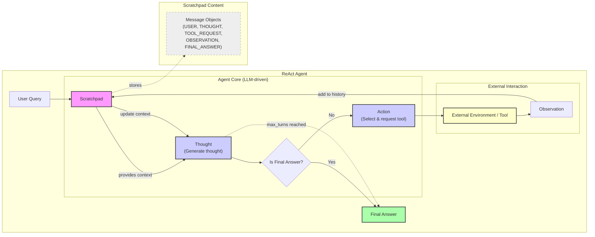

# Lesson 8: Building a ReAct Agent From Scratch

In our last lesson, we explored the theoretical foundations of LLM reasoning, focusing on frameworks like ReAct. You learned how agents can break down complex problems by alternating between "thinking" (reasoning) and "acting" (using tools). But theory only takes you so far. The real challenge, and the real learning, happens when you go from a flowchart on a slide to functional Python code.

When we started building our first agents, we reached for high-level frameworks, thinking they would simplify the process. Instead, we found ourselves fighting abstractions. Simple logic that should have been a five-minute `if-else` statement turned into hours of debugging a complex graph structure. It was frustrating because we couldn't see how the core ReAct loop was actually working.

The breakthrough came when we decided to build it ourselves, from the ground up. By implementing the full Thought → Action → Observation cycle, we gained a concrete mental model that no documentation could provide. This hands-on approach provides the confidence to debug, customize, and extend your agents. This step-by-step process is not just a teaching tool; it reflects a core design principle of ReAct. The framework was intentionally designed to produce an interpretable reasoning process where humans can inspect each step, making it easier to control and debug agent behavior [[1]](https://arxiv.org/pdf/2210.03629).

This lesson is 100% practical. We will walk you through building a minimal ReAct agent end-to-end, following the code in the accompanying notebook. You will implement each component yourself: defining a mock tool, generating thoughts, selecting actions with function calling, and orchestrating it all in a control loop. By the end, you will not just understand ReAct; you will have built it.

## Setup and Environment

Before we can build our agent, we need to set up a clean and predictable environment. This ensures that your code runs smoothly and that the outputs you see match the traces we will analyze later. Our setup is minimal, relying on a few key libraries that are staples in AI engineering.

1.  We start by loading our Google API key from a `.env` file using a custom utility function. This is a standard practice to keep secrets out of your code.
    
    ```python
    from lessons.utils import env
    
    env.load(required_env_vars=["GOOGLE_API_KEY"])
    ```
    
    It outputs:
    
    ```text
    Trying to load environment variables from /path/to/your/project/.env
    Environment variables loaded successfully.
    ```
    
2.  Next, we import the necessary packages.
    
    ```python
    from enum import Enum
    from pydantic import BaseModel, Field
    from typing import List
    
    from google import genai
    from google.genai import types
    
    from lessons.utils import pretty_print
    ```
    
3.  We initialize the Gemini client, which is our interface to the language model.
    
    ```python
    client = genai.Client()
    ```
    
    It outputs:
    
    ```text
    Both GOOGLE_API_KEY and GEMINI_API_KEY are set. Using GOOGLE_API_KEY.
    ```
    
4.  Finally, we define the model we will use. For this lesson, we will use `gemini-2.5-flash`, a model that is both fast and cost-effective, making it ideal for development and iteration.
    
    ```python
    MODEL_ID = "gemini-2.5-flash"
    ```
    

Let's briefly touch on the "why" behind these imports. As we covered in Lesson 4, `pydantic` is essential for creating structured, validated data models. For agents, this is not just a convenience; it is a necessity for reliability. It creates a formal contract for the data that flows through your system, ensuring that the LLM's output is predictable and safe to use in your application code.

We use Python's `Enum` to define a fixed set of roles for our messages (like `USER` or `THOUGHT`). This makes the code more readable and prevents errors from simple typos. Instead of passing raw strings like `"user"` or `"thought"`, we use `MessageRole.USER`, which provides autocompletion in IDEs and allows for static analysis to catch mistakes before they happen.

Finally, our custom utilities like `env.load` and `pretty_print` are small but important pieces of a modular design. They handle specific tasks like configuration and output formatting, keeping our main agent logic clean and focused. This separation of concerns is a core software engineering principle that becomes even more important when building complex, multi-component AI systems.

With our environment configured, we can now define an external capability for our agent. This brings us to the "Act" in ReAct: the tools.

## Tool Layer: Mock Search Implementation

An agent's power comes from its ability to interact with the world through tools. For this lesson, we will implement a mock search tool. Instead of making real API calls to a service like Google Search, our tool will return predefined, predictable responses.

Why start with a mock tool? It is a common practice that helps isolate the system you are building. It allows us to focus entirely on the ReAct mechanics—the thought, action, and observation loop—without worrying about external dependencies like API keys, network latency, or rate limits [[7]](https://medium.com/google-cloud/building-react-agents-from-scratch-a-hands-on-guide-using-gemini-ffe4621d90ae). This makes our agent easier to test and debug.

1.  Our `search` tool is a simple Python function. Its docstring is critical, as it serves as the description the LLM will see when deciding which tool to use. A clear, descriptive docstring is one of the most important parts of tool design [[4]](https://www.anthropic.com/engineering/building-effective-agents).
    
    ```python
    def search(query: str) -> str:
        """Search for information about a specific topic or query.
    
        Args:
            query (str): The search query or topic to look up.
        """
        query_lower = query.lower()
    
        # Predefined responses for demonstration
        if all(word in query_lower for word in ["capital", "france"]):
            return "Paris is the capital of France and is known for the Eiffel Tower."
        elif "react" in query_lower:
            return "The ReAct (Reasoning and Acting) framework enables LLMs to solve complex tasks by interleaving thought generation, action execution, and observation processing."
    
        # Generic response for unhandled queries
        return f"Information about '{query}' was not found."
    ```
    
    The function checks for keywords in the query and returns a hardcoded string. If no keywords match, it returns a "not found" message, which simulates a failed search. This fallback behavior is important for testing how our agent handles situations where a tool does not provide the needed information.
    
2.  To manage our tools, we use a `TOOL_REGISTRY`. This dictionary maps the string name of a tool to the actual callable Python function.
    
    ```python
    TOOL_REGISTRY = {
        search.__name__: search,
    }
    ```
    
    This registry is a simple but effective security and control mechanism. The LLM can only suggest the *name* of a tool to call; our code is responsible for looking up that name in the registry and executing the corresponding function. This prevents the model from executing arbitrary code and ensures that only registered, trusted tools are used.
    

In a production system, you would replace this mock function with a real API call. For example, you could use the `requests` library to query a search API like Google's Custom Search API [[7]](https://medium.com/google-cloud/building-react-agents-from-scratch-a-hands-on-guide-using-gemini-ffe4621d90ae) or a vector database for internal knowledge retrieval. Here is a concrete example comparing our mock tool with a production-ready implementation using the `requests` library to call the Serper API for Google Search results [[12]](https://genmind.ch/posts/Building-ReAct-Agents-with-Microsoft-Agent-Framework-From-Theory-to-Production/).

```python
import os
import json
import requests

# Production-grade search tool
def google_search_api(query: str) -> str:
    """
    Search the web for current information using Serper API.
    Handles API keys, timeouts, and formats results for the LLM.
    """
    api_key = os.getenv("SERPER_API_KEY")
    if not api_key:
        return "ERROR: SERPER_API_KEY environment variable not set."

    url = "https://google.serper.dev/search"
    payload = json.dumps({"q": query})
    headers = {'X-API-KEY': api_key, 'Content-Type': 'application/json'}

    try:
        response = requests.post(url, headers=headers, data=payload, timeout=10)
        response.raise_for_status()  # Raise an exception for bad status codes
        results = response.json().get('organic', [])
        
        # Format for LLM consumption
        snippets = [f"Title: {item.get('title', '')}, Snippet: {item.get('snippet', '')}" for item in results[:5]]
        return "\n".join(snippets)

    except requests.Timeout:
        return f"ERROR: Search timed out for query: {query}"
    except requests.RequestException as e:
        return f"ERROR: Search failed: {str(e)}"

```

This production version adds several important features: it securely loads an API key, sets a timeout to prevent the agent from hanging, handles potential network errors gracefully, and formats the complex JSON response from the API into a clean string of snippets for the LLM to consume. The agent's core logic would not need to change to use this new tool; you would simply update the `TOOL_REGISTRY`. This modularity is a key principle of good AI engineering.

Now that our agent has a tool, it needs a way to reason about when and how to use it. This brings us to the "Reason" part of ReAct: the thought phase.

## Thought Phase: Prompt Construction and Generation

The "Thought" phase is where the agent plans its next move. It analyzes the user's goal and the conversation history to generate an internal monologue—a piece of reasoning that guides its subsequent action. Our goal here is to produce a short, purposeful thought that clearly states the next intended step. This is a direct application of the chain-of-thought prompting we discussed in Lesson 7, where we encourage the model to "think out loud" to improve its reasoning process [[1]](https://arxiv.org/pdf/2210.03629).

1.  To guide the LLM, we construct a prompt that includes all the necessary context. A key part of this is telling the model what tools are available. We create a helper function, `build_tools_xml_description`, to generate a structured description of our tools.
    
    ```python
    def build_tools_xml_description(tools: dict[str, callable]) -> str:
        """Build a minimal XML description of tools using only their docstrings."""
        lines = []
        for tool_name, fn in tools.items():
            doc = (fn.__doc__ or "").strip()
            lines.append(f"\t<tool name=\"{tool_name}\">")
            if doc:
                lines.append(f"\t\t<description>")
                for line in doc.split("\n"):
                    lines.append(f"\t\t\t{line}")
                lines.append(f"\t\t</description>")
            lines.append("\t</tool>")
        return "\n".join(lines)
    
    tools_xml = build_tools_xml_description(TOOL_REGISTRY)
    
    PROMPT_TEMPLATE_THOUGHT = f"""
    You are deciding the next best step for reaching the user goal. You have some tools available to you.
    
    Available tools:
    <tools>
    {tools_xml}
    </tools>
    
    Conversation so far:
    <conversation>
    {{conversation}}
    </conversation>
    
    State your next thought about what to do next as one short paragraph focused on the next action you intend to take and why.
    Avoid repeating the same strategies that didn't work previously. Prefer different approaches.
    """.strip()
    ```
    
    Using XML tags like `<tools>` and `<conversation>` is a robust prompt engineering technique. It creates clear boundaries in the prompt, helping the model distinguish between instructions, available tools, and the conversation history. This structured approach is particularly effective for models like Gemini, as it helps them parse complex inputs with multiple distinct components [[13]](https://ai.google.dev/gemini-api/docs/prompting-strategies). This is a form of context engineering, as we discussed in Lesson 3, where we carefully structure the information we provide to the model.
    
2.  Let's inspect the final prompt template to see what the model will receive.
    
    ```python
    print(PROMPT_TEMPLATE_THOUGHT)
    ```
    
    It outputs:
    
    ```text
    You are deciding the next best step for reaching the user goal. You have some tools available to you.
    
    Available tools:
    <tools>
    	<tool name="search">
    		<description>
    			Search for information about a specific topic or query.
    			
    			Args:
    			    query (str): The search query or topic to look up.
    		</description>
    	</tool>
    </tools>
    
    Conversation so far:
    <conversation>
    {conversation}
    </conversation>
    
    State your next thought about what to do next as one short paragraph focused on the next action you intend to take and why.
    Avoid repeating the same strategies that didn't work previously. Prefer different approaches.
    ```
    
    The output shows that the docstring from our `search` function has been inserted into the `<description>` tag. This is how the model learns what the tool does. The quality of this description directly impacts the agent's ability to choose the right tool for the right job.
    
3.  Finally, we implement the `generate_thought` function. It takes the current conversation history, formats the prompt template, and calls the Gemini API. The function simply returns the model's raw text response, which represents the agent's thought.
    
    ```python
    def generate_thought(conversation: str, tool_registry: dict[str, callable]) -> str:
        """Generate a thought as plain text (no structured output)."""
        tools_xml = build_tools_xml_description(tool_registry)
        prompt = PROMPT_TEMPLATE_THOUGHT.format(conversation=conversation, tools_xml=tools_xml)
    
        response = client.models.generate_content(
            model=MODEL_ID,
            contents=prompt
        )
        return response.text.strip()
    ```
    

This thought provides a high-level plan. The next step is to translate this plan into a concrete, executable action. This could be a call to one of our tools or, if the agent has enough information, a final answer to the user.

## Action Phase: Function Calling and Parsing

The "Action" phase is where the agent commits to a specific step. Based on the conversation history and its most recent thought, it must decide whether to use a tool or to provide a final answer. We will implement this using Gemini's native function calling capabilities, which we first introduced in Lesson 6.

A key design choice here is to separate the prompt for the action phase from the tool's technical details. The prompt focuses on the high-level decision: *should I use a tool or answer now?* We do not need to include the tool's signature or description in the prompt text itself. Instead, we pass the Python tool functions directly to the Gemini API through its `tools` configuration. The SDK automatically inspects the function's signature and docstring, converting them into a format the model understands [[9]](https://ai.google.dev/gemini-api/docs/function-calling). This separation keeps our prompts clean and makes our tool management more modular.

1.  We define two prompt templates. The first is for a standard action-selection turn. The second is a specialized prompt used to force the agent to generate a final answer, which is a crucial mechanism for ensuring the agent terminates.
    
    ```python
    PROMPT_TEMPLATE_ACTION = """
    You are selecting the best next action to reach the user goal.
    
    Conversation so far:
    <conversation>
    {conversation}
    </conversation>
    
    Respond either with a tool call (with arguments) or a final answer if you can confidently conclude.
    """.strip()
    
    # Dedicated prompt used when we must force a final answer
    PROMPT_TEMPLATE_ACTION_FORCED = """
    You must now provide a final answer to the user.
    
    Conversation so far:
    <conversation>
    {conversation}
    </conversation>
    
    Provide a concise final answer that best addresses the user's goal.
    """.strip()
    ```
    
2.  We define Pydantic models to represent the two possible outcomes of the action phase: a `ToolCallRequest` or a `FinalAnswer`. This use of structured outputs, which we covered in Lesson 4, ensures the model's decision is returned in a predictable and parsable format.
    
    ```python
    class ToolCallRequest(BaseModel):
        """A request to call a tool with its name and arguments."""
        tool_name: str = Field(description="The name of the tool to call.")
        arguments: dict = Field(description="The arguments to pass to the tool.")
    
    
    class FinalAnswer(BaseModel):
        """A final answer to present to the user when no further action is needed."""
        text: str = Field(description="The final answer text to present to the user.")
    ```
    
3.  The `generate_action` function orchestrates this phase. It selects the appropriate prompt, configures the Gemini client with the available tools, and calls the model.
    
    ```python
    def generate_action(conversation: str, tool_registry: dict[str, callable] | None = None, force_final: bool = False) -> (ToolCallRequest | FinalAnswer):
        """Generate an action by passing tools to the LLM and parsing function calls or final text.
    
        When force_final is True or no tools are provided, the model is instructed to produce a final answer and tool calls are disabled.
        """
        # Use a dedicated prompt when forcing a final answer or no tools are provided
        if force_final or not tool_registry:
            prompt = PROMPT_TEMPLATE_ACTION_FORCED.format(conversation=conversation)
            response = client.models.generate_content(
                model=MODEL_ID,
                contents=prompt
            )
            return FinalAnswer(text=response.text.strip())
    
        # Default action prompt
        prompt = PROMPT_TEMPLATE_ACTION.format(conversation=conversation)
    
        # Provide the available tools to the model; disable auto-calling so we can parse and run ourselves
        tools = list(tool_registry.values())
        config = types.GenerateContentConfig(
            tools=tools,
            automatic_function_calling={"disable": True}
        )
        response = client.models.generate_content(
            model=MODEL_ID,
            contents=prompt,
            config=config
        )
    
        # Extract the function call from the response (if present)
        candidate = response.candidates[0]
        parts = candidate.content.parts
        if parts and getattr(parts[0], "function_call", None):
            name = parts[0].function_call.name
            args = dict(parts[0].function_call.args) if parts[0].function_call.args is not None else {}
            return ToolCallRequest(tool_name=name, arguments=args)
        
        # Otherwise, it's a final answer
        final_answer = "".join(part.text for part in candidate.content.parts)
        return FinalAnswer(text=final_answer.strip())
    ```
    
    An important detail is the `automatic_function_calling={"disable": True}` configuration. We explicitly disable this feature because we want to manually control the tool execution loop. This allows us to inspect the model's requested action and the tool's output at each step, which is the whole point of this hands-on lesson. In a production application where you do not need this level of introspection, you could let the SDK handle this automatically.
    
    The `force_final` flag is a vital feature for production-ready agents. It provides a mechanism to gracefully terminate the agent's loop, for example, when it reaches a predefined iteration limit. This prevents infinite loops and ensures the user always receives a response.
    
    In a production environment, tool execution can fail for many reasons, such as a network error or an invalid API key. A robust implementation of the `act` phase would include comprehensive error handling. For instance, you might implement a retry mechanism with exponential backoff for transient network issues or a circuit breaker pattern to stop calling a service that is consistently failing [[12]](https://genmind.ch/posts/Building-ReAct-Agents-with-Microsoft-Agent-Framework-From-Theory-to-Production/). The error message from a failed tool call would then become the "Observation," allowing the agent to reason about the failure and decide on an alternative strategy.
    
    We now have all the individual components: a tool, a thought generator, and an action selector. The final step is to orchestrate them into a cohesive control loop.

## Control Loop: Messages, Scratchpad, and Orchestration

The control loop is the heart of the ReAct agent. It orchestrates the Thought → Action → Observation cycle, managing the flow of information and making decisions at each turn. We will implement this loop using a "scratchpad" to maintain the history of the interaction. The scratchpad acts as the agent's short-term memory, recording every step of the process. This approach is fundamental to how ReAct agents maintain context and learn from their interactions within a single session [[2]](https://www.ibm.com/think/topics/react-agent).

1.  First, we define the structure of the messages that will populate our scratchpad. We use an `Enum` for the message roles and a Pydantic `BaseModel` for the message itself. This ensures that every entry in our scratchpad is structured and type-safe.
    
    ```python
    class MessageRole(str, Enum):
        """Enumeration for the different roles a message can have."""
        USER = "user"
        THOUGHT = "thought"
        TOOL_REQUEST = "tool request"
        OBSERVATION = "observation"
        FINAL_ANSWER = "final answer"
    
    
    class Message(BaseModel):
        """A message with a role and content, used for all message types."""
        role: MessageRole = Field(description="The role of the message in the ReAct loop.")
        content: str = Field(description="The textual content of the message.")
    
        def __str__(self) -> str:
            """Provides a user-friendly string representation of the message."""
            return f"{self.role.value.capitalize()}: {self.content}"
    ```
    
2.  To make debugging easier, we create a helper function to print each message in a formatted way. Visualizing the agent's internal state at each step is invaluable for understanding its behavior.
    
    ```python
    def pretty_print_message(message: Message, turn: int, max_turns: int, header_color: str = pretty_print.Color.YELLOW, is_forced_final_answer: bool = False) -> None:
        if not is_forced_final_answer:
            title = f"{message.role.value.capitalize()} (Turn {turn}/{max_turns}):"
        else:
            title = f"{message.role.value.capitalize()} (Forced):"
    
        pretty_print.wrapped(
            text=message.content,
            title=title,
            header_color=header_color,
        )
    ```
    
3.  The `Scratchpad` class manages the list of messages. It has an `append` method to add new messages and a `to_string` method to serialize the entire history into a single string. This string is what we will pass to the LLM as context in each turn.
    
    ```python
    class Scratchpad:
        """Container for ReAct messages with optional pretty-print on append."""
    
        def __init__(self, max_turns: int) -> None:
            self.messages: List[Message] = []
            self.max_turns: int = max_turns
            self.current_turn: int = 1
    
        def set_turn(self, turn: int) -> None:
            self.current_turn = turn
    
        def append(self, message: Message, verbose: bool = False, is_forced_final_answer: bool = False) -> None:
            self.messages.append(message)
            if verbose:
                role_to_color = {
                    MessageRole.USER: pretty_print.Color.RESET,
                    MessageRole.THOUGHT: pretty_print.Color.ORANGE,
                    MessageRole.TOOL_REQUEST: pretty_print.Color.GREEN,
                    MessageRole.OBSERVATION: pretty_print.Color.YELLOW,
                    MessageRole.FINAL_ANSWER: pretty_print.Color.CYAN,
                }
                header_color = role_to_color.get(message.role, pretty_print.Color.YELLOW)
                pretty_print_message(
                    message=message,
                    turn=self.current_turn,
                    max_turns=self.max_turns,
                    header_color=header_color,
                    is_forced_final_answer=is_forced_final_answer,
                )
    
        def to_string(self) -> str:
            return "\n".join(str(m) for m in self.messages)
    ```
    
4.  Now we can implement the main `react_agent_loop`. This function ties everything together. It starts by initializing the `Scratchpad` and adding the initial user query. The core of the function is a `for` loop that iterates up to `max_turns`.
    
    Inside the loop, the agent first generates a `THOUGHT` based on the entire conversation history stored in the scratchpad. This thought is appended to the scratchpad, enriching the context for the next step.
    
    Next, the agent calls `generate_action`. This is the decision point. The function returns either a `FinalAnswer` or a `ToolCallRequest`. If it is a final answer, we append it to the scratchpad and exit the loop, returning the answer to the user.
    
    If it is a tool request, we log the request, execute the corresponding tool function from our `TOOL_REGISTRY`, and capture the result. This result, whether successful data or an error message, becomes the `OBSERVATION`. We append this observation to the scratchpad, and the loop continues to the next turn.
    
    Finally, if the loop completes all its turns without reaching a final answer, we make one last call to `generate_action` with the `force_final=True` flag. This ensures the agent provides a concluding response, preventing it from stopping abruptly.
    
    ```python
    def react_agent_loop(initial_question: str, tool_registry: dict[str, callable], max_turns: int = 5, verbose: bool = False) -> str:
        """
        Implements the main ReAct (Thought -> Action -> Observation) control loop.
        Uses a unified message class for the scratchpad.
        """
        scratchpad = Scratchpad(max_turns=max_turns)
    
        # Add the user's question to the scratchpad
        user_message = Message(role=MessageRole.USER, content=initial_question)
        scratchpad.append(user_message, verbose=verbose)
    
        for turn in range(1, max_turns + 1):
            scratchpad.set_turn(turn)
    
            # Generate a thought based on the current scratchpad
            thought_content = generate_thought(
                scratchpad.to_string(),
                tool_registry,
            )
            thought_message = Message(role=MessageRole.THOUGHT, content=thought_content)
            scratchpad.append(thought_message, verbose=verbose)
    
            # Generate an action based on the current scratchpad
            action_result = generate_action(
                scratchpad.to_string(),
                tool_registry=tool_registry,
            )
    
            # If the model produced a final answer, return it
            if isinstance(action_result, FinalAnswer):
                final_answer = action_result.text
                final_message = Message(role=MessageRole.FINAL_ANSWER, content=final_answer)
                scratchpad.append(final_message, verbose=verbose)
                return final_answer
    
            # Otherwise, it is a tool request
            if isinstance(action_result, ToolCallRequest):
                action_name = action_result.tool_name
                action_params = action_result.arguments
    
                # Add the action to the scratchpad
                params_str = ", ".join([f"{k}='{v}'" for k, v in action_params.items()])
                action_content = f"{action_name}({params_str})"
                action_message = Message(role=MessageRole.TOOL_REQUEST, content=action_content)
                scratchpad.append(action_message, verbose=verbose)
    
                # Run the action and get the observation
                observation_content = ""
                tool_function = tool_registry[action_name]
                try:
                    observation_content = tool_function(**action_params)
                except Exception as e:
                    observation_content = f"Error executing tool '{action_name}': {e}"
    
                # Add the observation to the scratchpad
                observation_message = Message(role=MessageRole.OBSERVATION, content=observation_content)
                scratchpad.append(observation_message, verbose=verbose)
    
            # Check if the maximum number of turns has been reached. If so, force the action selector to produce a final answer
            if turn == max_turns:
                forced_action = generate_action(
                    scratchpad.to_string(),
                    force_final=True,
                )
                if isinstance(forced_action, FinalAnswer):
                    final_answer = forced_action.text
                else:
                    final_answer = "Unable to produce a final answer within the allotted turns."
                final_message = Message(role=MessageRole.FINAL_ANSWER, content=final_answer)
                scratchpad.append(final_message, verbose=verbose, is_forced_final_answer=True)
                return final_answer
    ```
    
    The `try...except` block for tool execution is a simple but important form of error handling. If the tool fails, the error message becomes the observation, allowing the agent to potentially recover. This sequential dependency between LLM inference and tool execution is not just a logical constraint; it creates a fundamental performance bottleneck. Agentic workflows naturally interleave GPU-bound LLM calls with CPU- or I/O-bound tool execution, which leads to significant GPU idle time [[15]](https://arxiv.org/html/2506.04301v1).
    
    While the single-threaded loop we have built is great for learning, a production system would need to overcome this. The solution is concurrent execution, where idle GPU cycles from one request's tool call are used for another request's LLM inference. This can dramatically improve overall system throughput—in some cases by over 25x—at the cost of a higher average latency for any single request [[15]](https://arxiv.org/html/2506.04301v1).
    

The following diagram illustrates the control flow we have just built. It shows the iterative cycle where the agent processes a user query, generates thoughts, selects and executes actions via tools, and uses observations to refine its strategy until it reaches a final answer or a termination condition.



Image 1: A flowchart illustrating the ReAct (Reasoning and Acting) control loop, showing the iterative Thought, Action, and Observation cycle, the role of the Scratchpad with various Message types, and termination conditions.

With the complete loop implemented, it is time to test our agent and see how it behaves in practice.

## Tests and Traces: Success and Graceful Fallback

The final step is to validate our agent. We will run it with two different queries: one designed to succeed and one designed to test its fallback behavior. By analyzing the printed traces, we can confirm that each component—the thought process, tool integration, observation handling, and loop termination—works as expected.

### Success Case

First, let's ask a straightforward factual question that our mock `search` tool can answer. We will set `max_turns=2` and `verbose=True` to see the detailed trace.

1.  We run the agent loop with the question "What is the capital of France?".
    
    ```python
    # A straightforward question requiring a search.
    question = "What is the capital of France?"
    final_answer = react_agent_loop(question, TOOL_REGISTRY, max_turns=2, verbose=True)
    ```
    
    The trace shows the agent's step-by-step process:
    
    *   **User (Turn 1/2):** The initial question is added to the scratchpad.
    *   **Thought (Turn 1/2):** The agent reasons that it needs to find the capital of France and should use the `search` tool.
    *   **Tool request (Turn 1/2):** It generates a request to call `search(query='capital of France')`.
    *   **Observation (Turn 1/2):** The mock tool executes and returns "Paris is the capital of France and is known for the Eiffel Tower.". This result is added to the scratchpad.
    *   **Thought (Turn 2/2):** With the new observation, the agent now knows the answer and its thought is to formulate the final response.
    *   **Final answer (Turn 2/2):** The agent extracts the core information and provides the concise answer: "Paris is the capital of France.".
    
    This trace confirms that the agent correctly identifies the need for a tool, executes it, processes the observation, and concludes with a final answer, all within the specified turn limit.
    

### Graceful Fallback Case

Now, let's test a query that our mock tool cannot handle. This will test the agent's ability to adapt and terminate gracefully when it cannot find the information it needs.

1.  We ask, "What is the capital of Italy?", knowing our mock tool has no predefined answer for this.
    
    ```python
    # An unsupported query for the mock tool.
    question = "What is the capital of Italy?"
    final_answer = react_agent_loop(question, TOOL_REGISTRY, max_turns=2, verbose=True)
    ```
    
    The trace reveals a different path:
    
    *   **Turn 1:** The agent follows the same initial steps: it thinks it should search and calls `search(query='capital of Italy')`.
    *   **Observation (Turn 1/2):** The tool returns the fallback message: "Information about 'capital of Italy' was not found.".
    *   **Thought (Turn 2/2):** Seeing the failure, the agent adapts. Its new thought is to try a broader query, hoping to find related information.
    *   **Tool request (Turn 2/2):** It calls `search(query='Italy')`.
    *   **Observation (Turn 2/2):** This also fails, returning "Information about 'Italy' was not found.".
    *   **Final answer (Forced):** The agent has now reached its `max_turns` limit of 2. The control loop triggers the forced final answer mechanism. The agent generates a polite response acknowledging its failure: "I'm sorry, but I couldn't find information about the capital of Italy.".
    
    This example demonstrates the agent's resilience. It does not crash on failure; instead, it uses the failure observation to try a new strategy. When that also fails and it runs out of turns, the forced-termination logic ensures it provides a clean and useful response to the user. This variability in execution paths highlights another key challenge in production: agentic systems have highly unpredictable, heavy-tailed latency distributions.
    
    The number of turns can differ dramatically from one query to the next, making performance guarantees difficult. While increasing the `max_turns` budget might seem like an easy way to improve accuracy on hard problems, research shows it leads to diminishing returns. Accuracy tends to saturate while tail latency continues to grow, as a few difficult queries consume the entire budget without necessarily succeeding [[15]](https://arxiv.org/html/2506.04301v1). Tuning this limit is a critical trade-off between capability and cost-efficiency.
    

In a real-world scenario, such as Bank of America's Erica assistant, if a tool like a fraud detection API were to fail, the agent would receive an error as its observation. Its next thought might be to retry the API call. If retries fail, its programming would guide it to escalate the issue, perhaps by notifying a human support agent to intervene [[12]](https://genmind.ch/posts/Building-ReAct-Agents-with-Microsoft-Agent-Framework-From-Theory-to-Production/).

These simple tests are just the beginning. A production-grade agent would require a comprehensive test suite. This involves creating unit tests for each tool to ensure they handle various inputs and edge cases correctly. Integration tests are then needed to verify that the full ReAct loop functions as expected, especially how the agent reasons about different observations, including errors. Finally, end-to-end tests with a diverse set of user queries, including adversarial prompts designed to confuse the agent, are essential for validating the agent's overall robustness and performance against real-world complexity.

## Conclusion

In this lesson, we have moved from theory to practice, building a complete, functional ReAct agent from scratch. By implementing each component of the Thought-Action-Observation loop, you have gained a first-hand understanding of how these systems operate under the hood. We defined a tool, constructed prompts to generate reasoning, used function calling to select actions, and orchestrated the entire process within a stateful control loop.

This hands-on experience demystifies what can often feel like a black box when using high-level agentic frameworks. Even if you ultimately use a library like LangGraph for its production-ready features, knowing how to build the core logic yourself is a core skill for any AI Engineer. It equips you to debug, customize, and innovate with confidence.

The agent we built today is minimal, but it is a solid foundation. In our upcoming lessons, we will build upon these concepts. We will explore how to give agents a persistent memory to learn from past interactions in Lesson 9 and dive deep into Retrieval-Augmented Generation (RAG) to connect them to vast knowledge bases in Lesson 10.

## References

- [1] Yao, S., Zhao, J., Yu, D., Du, N., Shafran, I., Narasimhan, K., & Cao, Y. (2023). *ReAct: Synergizing Reasoning and Acting in Language Models*. https://arxiv.org/pdf/2210.03629
- [2] *ReAct Agent*. (n.d.). IBM. https://www.ibm.com/think/topics/react-agent
- [3] Stryker, C. (n.d.). *AI agent planning*. IBM. https://www.ibm.com/think/topics/ai-agent-planning
- [4] S., E., & Zhang, B. (2024). *Building effective agents*. Anthropic. https://www.anthropic.com/engineering/building-effective-agents
- [5] *ReAct agent from scratch with Gemini 2.5 and LangGraph*. (n.d.). Google AI for Developers. https://ai.google.dev/gemini-api/docs/langgraph-example
- [6] Ferrag, M. A., Tihanyi, N., & Debbah, M. (2024). *From LLM Reasoning to Autonomous AI Agents: A Comprehensive Review*. arXiv. https://arxiv.org/pdf/2504.19678
- [7] Shankar, A. (2024). *Building ReAct Agents from Scratch using Gemini*. Medium. https://medium.com/google-cloud/building-react-agents-from-scratch-a-hands-on-guide-using-gemini-ffe4621d90ae
- [8] Downie, A., & Finio, M. (n.d.). *AI Agent Orchestration*. IBM. https://www.ibm.com/think/topics/ai-agent-orchestration
- [9] *Function calling*. (n.d.). Google AI for Developers. https://ai.google.dev/gemini-api/docs/function-calling
- [10] Iusztin, P. (2024). *Building Production ReAct Agents From Scratch Is Simple*. Decoding AI. https://www.decodingai.com/p/building-production-react-agents
- [11] *Building a Python React Agent Class: A Step-by-Step Guide*. (2024). Neradot. https://www.neradot.com/post/building-a-python-react-agent-class-a-step-by-step-guide
- [12] Santopaolo, G. (n.d.). *Building ReAct Agents with Microsoft Agent Framework: From Theory to Production*. GenMind. https://genmind.ch/posts/Building-ReAct-Agents-with-Microsoft-Agent-Framework-From-Theory-to-Production/
- [13] *Prompt design strategies*. (n.d.). Google AI for Developers. https://ai.google.dev/gemini-api/docs/prompting-strategies
- [14] Schmid, P. (n.d.). *ReAct agent from scratch with Gemini 2.5 and LangGraph*. https://www.philschmid.de/langgraph-gemini-2-5-react-agent
- [15] Kim, J., Shin, B., Chung, J., & Rhu, M. (2024). *The Cost of Dynamic Reasoning: Demystifying AI Agents and Test-Time Scaling from an AI Infrastructure Perspective*. arXiv. https://arxiv.org/html/2506.04301v1