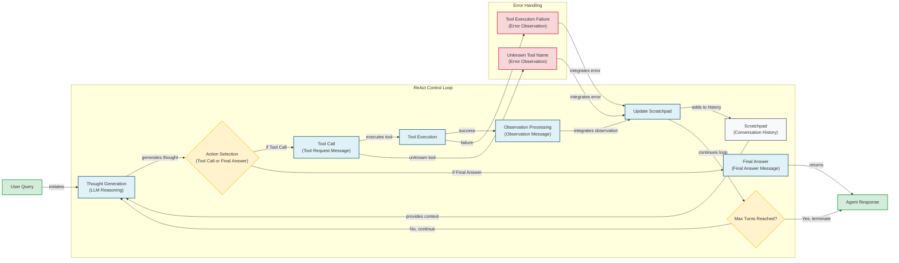

# Lesson 8: Building a ReAct Agent From Scratch

In our previous lessons, we’ve covered the theoretical foundations of AI agents. We’ve explored the ReAct pattern, which combines reasoning and acting, and discussed how modern LLMs use planning to tackle complex tasks. While theory is essential, the real learning happens when you build things yourself. This lesson is 100% practical.

We will build a minimal ReAct agent from scratch using only Python and the Gemini API. By implementing the full Thought → Action → Observation loop, you will gain a concrete mental model of how these systems work. Understanding these fundamentals will give you the confidence to debug, extend, and customize agents for your own applications.

Let's get started.

## Setup and Environment

Before we write any agent logic, we need to set up our Python environment. This ensures our code runs smoothly and that our outputs match the expected traces. This process involves loading API keys, importing necessary libraries, and initializing the Gemini client. A well-configured environment is the first step toward building a reproducible and reliable agent.

1.  First, we load our `GOOGLE_API_KEY` from an environment file. This practice keeps sensitive credentials separate from our application code, which is a security best practice. We use a simple utility for this, but you can use any method you prefer.
    ```python
    from lessons.utils import env
    
    env.load(required_env_vars=["GOOGLE_API_KEY"])
    ```
2.  Next, we import the required packages. We will use `google-genai` for interacting with the Gemini API, `pydantic` for creating structured data models that ensure type safety, and Python’s `typing` and `enum` modules for defining clear data contracts.
    ```python
    from enum import Enum
    from pydantic import BaseModel, Field
    from typing import List
    
    from google import genai
    from google.genai import types
    
    from lessons.utils import pretty_print
    ```
3.  With our key loaded, we initialize the Gemini client, which is our gateway to the model's capabilities.
    ```python
    client = genai.Client()
    ```
    It outputs:
    ```text
    Both GOOGLE_API_KEY and GEMINI_API_KEY are set. Using GOOGLE_API_KEY.
    ```
4.  Finally, we define the model we will use. For this lesson, `gemini-2.5-flash` is a great choice as it offers a strong balance of speed, cost-effectiveness, and reasoning capabilities, making it ideal for the iterative development and testing of our agent.
    ```python
    MODEL_ID = "gemini-2.5-flash"
    ```
With the client and model in place, we can now define the external tools our agent will use.

## Tool Layer: Mock Search Implementation

An agent’s power comes from its ability to interact with the outside world through tools [[1]](https://arxiv.org/pdf/2210.03629). For this lesson, we will create a simple mock `search` tool instead of integrating a real API. This design philosophy is intentional and offers several educational benefits. It simplifies our code by removing external dependencies like API keys and network requests, which allows us to focus purely on the agent's internal logic. Furthermore, it provides predictable, deterministic responses, which is essential for reliably testing and debugging the ReAct loop.

1.  Our mock tool is a simple Python function that returns predefined string responses based on the query. The function signature and docstring are critical; they serve as the documentation that the LLM uses to understand what the tool does, what arguments it expects, and when to use it.
    ```python
    def search(query: str) -> str:
        """Search for information about a specific topic or query.
    
        Args:
            query (str): The search query or topic to look up.
        """
        query_lower = query.lower()
    
        # Predefined responses for demonstration
        if all(word in query_lower for word in ["capital", "france"]):
            return "Paris is the capital of France and is known for the Eiffel Tower."
        elif "react" in query_lower:
            return "The ReAct framework enables LLMs to solve complex tasks by interleaving thought generation, action execution, and observation processing."
    
        # Generic response for unhandled queries
        return f"Information about '{query}' was not found."
    ```
2.  We also create a `TOOL_REGISTRY` to map the tool's name to its function. This dictionary acts as a dispatcher, allowing our control loop to dynamically look up and execute the correct function based on the LLM's output.
    ```python
    TOOL_REGISTRY = {
        search.__name__: search,
    }
    ```
In a production system, you would replace this mock function with calls to real services like Google Search or a domain-specific knowledge base, but the integration pattern remains the same. Now that our agent has a tool, let's implement the "Thought" phase to let it reason about when to use it.

## Thought Phase: Prompt Construction and Generation

The first step in the ReAct cycle is "Thought." This is the agent's internal monologue, where it reasons about the user's query and plans its next action [[2]](https://www.ibm.com/think/topics/react-agent). We generate this thought by prompting the LLM with the current conversation history and a description of the available tools. The quality of this prompt directly influences the agent's ability to reason effectively.

1.  To inform the LLM about the tools it can use, we create a helper function that generates a minimal XML description from our `TOOL_REGISTRY`. Using XML tags like `<tool>` and `<description>` provides a clear, structured format that helps the model distinguish between different tools and understand their capabilities. This structured approach is more robust than simply listing tool names in plain text.
    ```python
    def build_tools_xml_description(tools: dict[str, callable]) -> str:
        """Build a minimal XML description of tools using only their docstrings."""
        lines = []
        for tool_name, fn in tools.items():
            doc = (fn.__doc__ or "").strip()
            lines.append(f"\t<tool name=\"{tool_name}\">")
            if doc:
                lines.append(f"\t\t<description>")
                for line in doc.split("\n"):
                    lines.append(f"\t\t\t{line}")
                lines.append(f"\t\t</description>")
            lines.append("\t</tool>")
        return "\n".join(lines)
    ```
2.  We then define our prompt template. It instructs the agent to analyze the conversation and available tools, and then state its next thought as a short paragraph. The `{conversation}` placeholder will be dynamically filled with the dialogue history, providing the necessary context for the model's reasoning process.
    ```python
    tools_xml = build_tools_xml_description(TOOL_REGISTRY)
    
    PROMPT_TEMPLATE_THOUGHT = f"""
    You are deciding the next best step for reaching the user goal. You have some tools available to you.
    
    Available tools:
    <tools>
    {tools_xml}
    </tools>
    
    Conversation so far:
    <conversation>
    {{conversation}}
    </conversation>
    
    State your next thought about what to do next as one short paragraph focused on the next action you intend to take and why.
    Avoid repeating the same strategies that didn't work previously. Prefer different approaches.
    """.strip()
    ```
3.  Finally, the `generate_thought` function acts as the agent's reasoning engine. It takes the current conversation, formats the complete prompt with the tool descriptions, and calls the Gemini API. The model's text response is the agent's internal thought, which will guide the subsequent action phase.
    ```python
    def generate_thought(conversation: str, tool_registry: dict[str, callable]) -> str:
        """Generate a thought as plain text (no structured output)."""
        tools_xml = build_tools_xml_description(tool_registry)
        prompt = PROMPT_TEMPLATE_THOUGHT.format(conversation=conversation, tools_xml=tools_xml)
    
        response = client.models.generate_content(
            model=MODEL_ID,
            contents=prompt
        )
        return response.text.strip()
    ```
With a coherent thought generated, the agent must now decide whether to call a tool or conclude with a final answer. This brings us to the "Action" phase.

## Action Phase: Function Calling and Parsing

The "Action" phase is where the agent translates its thought into a concrete step: either calling a tool or providing a final answer. Instead of manually crafting prompts to generate tool-specific JSON, we will leverage Gemini's native function calling capabilities. This is a more robust and efficient approach, as the model is specifically trained to generate structured tool calls when provided with function definitions [[3]](https://ai.google.dev/gemini-api/docs/function-calling).

Our system prompt for this phase focuses on high-level decision-making. We do not need to include detailed tool signatures in the prompt because Gemini handles this automatically. When we pass Python functions to the `tools` configuration, the API extracts their names, docstrings (as descriptions), and parameter type hints. This separation of concerns allows us to write cleaner, more strategic prompts while letting the API manage the technical details of tool integration.

1.  We start by defining two Pydantic models to represent the possible outcomes: a `ToolCallRequest` for when the agent decides to use a tool, and a `FinalAnswer` for when it has enough information to respond to the user.
    ```python
    class ToolCallRequest(BaseModel):
        """A request to call a tool with its name and arguments."""
        tool_name: str = Field(description="The name of the tool to call.")
        arguments: dict = Field(description="The arguments to pass to the tool.")
    
    
    class FinalAnswer(BaseModel):
        """A final answer to present to the user when no further action is needed."""
        text: str = Field(description="The final answer text to present to the user.")
    ```
2.  Our `generate_action` function orchestrates this step. It takes the conversation history and the tool registry as input. It then configures and calls the Gemini model, passing the actual tool functions in the `tools` parameter. We set `automatic_function_calling` to `disable` so we can parse the response and execute the tool ourselves, maintaining full control.
    ```python
    def generate_action(conversation: str, tool_registry: dict[str, callable] | None = None, force_final: bool = False) -> (ToolCallRequest | FinalAnswer):
        """Generate an action by passing tools to the LLM and parsing function calls or final text.
    
        When force_final is True or no tools are provided, the model is instructed to produce a final answer and tool calls are disabled.
        """
        # Use a dedicated prompt when forcing a final answer or no tools are provided
        if force_final or not tool_registry:
            prompt = PROMPT_TEMPLATE_ACTION_FORCED.format(conversation=conversation)
            response = client.models.generate_content(
                model=MODEL_ID,
                contents=prompt
            )
            return FinalAnswer(text=response.text.strip())
    
        # Default action prompt
        prompt = PROMPT_TEMPLATE_ACTION.format(conversation=conversation)
    
        # Provide the available tools to the model; disable auto-calling so we can parse and run ourselves
        tools = list(tool_registry.values())
        config = types.GenerateContentConfig(
            tools=tools,
            automatic_function_calling={"disable": True}
        )
        response = client.models.generate_content(
            model=MODEL_ID,
            contents=prompt,
            config=config
        )
    
        # Extract the function call from the response (if present)
        candidate = response.candidates[0]
        parts = candidate.content.parts
        if parts and getattr(parts[0], "function_call", None):
            name = parts[0].function_call.name
            args = dict(parts[0].function_call.args) if parts[0].function_call.args is not None else {}
            return ToolCallRequest(tool_name=name, arguments=args)
        
        # Otherwise, it's a final answer
        final_answer = "".join(part.text for part in candidate.content.parts)
        return FinalAnswer(text=final_answer.strip())
    ```
    The parsing logic checks if the model's response contains a `function_call` object. If so, it extracts the tool name and arguments and returns a `ToolCallRequest`. Otherwise, it assumes the model has generated a text response and returns a `FinalAnswer`. This provides a basic level of error handling. The `force_final` flag is a crucial feature for ensuring the agent can terminate gracefully, which we will see in the control loop.

## Control Loop: Messages, Scratchpad, and Orchestration

The control loop is the engine of our ReAct agent. It orchestrates the Thought → Action → Observation cycle, manages the conversation history, and handles tool execution. We will build this loop around a structured message system and a "scratchpad" that serves as the agent's short-term memory. This architecture ensures that each step of the agent's process is explicit, traceable, and fed back into its reasoning process.


Image 1: A flowchart illustrating the ReAct control loop, showing the iterative Thought, Action, and Observation cycle, including error handling and termination conditions.

1.  First, we define data structures to manage the conversation. `MessageRole` is an `Enum` that categorizes each part of the dialogue (`USER`, `THOUGHT`, `TOOL_REQUEST`, `OBSERVATION`, `FINAL_ANSWER`). The `Message` class, built with Pydantic, ensures that every entry in our conversation history is a well-structured object with a defined role and content.
    ```python
    class MessageRole(str, Enum):
        """Enumeration for the different roles a message can have."""
        USER = "user"
        THOUGHT = "thought"
        TOOL_REQUEST = "tool request"
        OBSERVATION = "observation"
        FINAL_ANSWER = "final answer"
    
    
    class Message(BaseModel):
        """A message with a role and content, used for all message types."""
        role: MessageRole = Field(description="The role of the message in the ReAct loop.")
        content: str = Field(description="The textual content of the message.")
    
        def __str__(self) -> str:
            """Provides a user-friendly string representation of the message."""
            return f"{self.role.value.capitalize()}: {self.content}"
    ```
2.  The `Scratchpad` class manages a list of these `Message` objects. It provides a simple way to append new turns and serialize the entire history into a single string, which is then passed as context to the LLM in the next reasoning step.
    ```python
    class Scratchpad:
        """Container for ReAct messages with optional pretty-print on append."""
    
        def __init__(self, max_turns: int) -> None:
            self.messages: List[Message] = []
            self.max_turns: int = max_turns
            self.current_turn: int = 1
    
        def set_turn(self, turn: int) -> None:
            self.current_turn = turn
    
        def append(self, message: Message, verbose: bool = False, is_forced_final_answer: bool = False) -> None:
            self.messages.append(message)
            if verbose:
                # ... (pretty printing logic)
    
        def to_string(self) -> str:
            return "\n".join(str(m) for m in self.messages)
    ```
3.  The `react_agent_loop` function brings everything together. It initializes a `Scratchpad`, adds the initial user query, and then iterates up to a maximum number of turns. In each turn, it generates a thought, generates an action, and then processes the result.
    ```python
    def react_agent_loop(initial_question: str, tool_registry: dict[str, callable], max_turns: int = 5, verbose: bool = False) -> str:
        """
        Implements the main ReAct (Thought -> Action -> Observation) control loop.
        Uses a unified message class for the scratchpad.
        """
        scratchpad = Scratchpad(max_turns=max_turns)
    
        # Add the user's question to the scratchpad
        user_message = Message(role=MessageRole.USER, content=initial_question)
        scratchpad.append(user_message, verbose=verbose)
    
        for turn in range(1, max_turns + 1):
            scratchpad.set_turn(turn)
    
            # Generate a thought based on the current scratchpad
            thought_content = generate_thought(
                scratchpad.to_string(),
                tool_registry,
            )
            thought_message = Message(role=MessageRole.THOUGHT, content=thought_content)
            scratchpad.append(thought_message, verbose=verbose)
    
            # Generate an action based on the current scratchpad
            action_result = generate_action(
                scratchpad.to_string(),
                tool_registry=tool_registry,
            )
    
            # If the model produced a final answer, return it
            if isinstance(action_result, FinalAnswer):
                final_answer = action_result.text
                final_message = Message(role=MessageRole.FINAL_ANSWER, content=final_answer)
                scratchpad.append(final_message, verbose=verbose)
                return final_answer
    
            # Otherwise, it is a tool request
            if isinstance(action_result, ToolCallRequest):
                action_name = action_result.tool_name
                action_params = action_result.arguments
    
                # Add the action to the scratchpad
                params_str = ", ".join([f"{k}='{v}'" for k, v in action_params.items()])
                action_content = f"{action_name}({params_str})"
                action_message = Message(role=MessageRole.TOOL_REQUEST, content=action_content)
                scratchpad.append(action_message, verbose=verbose)
    
                # Run the action and get the observation
                observation_content = ""
                tool_function = tool_registry[action_name]
                try:
                    observation_content = tool_function(**action_params)
                except Exception as e:
                    observation_content = f"Error executing tool '{action_name}': {e}"
    
                # Add the observation to the scratchpad
                observation_message = Message(role=MessageRole.OBSERVATION, content=observation_content)
                scratchpad.append(observation_message, verbose=verbose)
    
            # Check if the maximum number of turns has been reached. If so, force the action selector to produce a final answer
            if turn == max_turns:
                forced_action = generate_action(
                    scratchpad.to_string(),
                    force_final=True,
                )
                if isinstance(forced_action, FinalAnswer):
                    final_answer = forced_action.text
                else:
                    final_answer = "Unable to produce a final answer within the allotted turns."
                final_message = Message(role=MessageRole.FINAL_ANSWER, content=final_answer)
                scratchpad.append(final_message, verbose=verbose, is_forced_final_answer=True)
                return final_answer
    ```
    If the action is a `FinalAnswer`, the loop terminates. If it is a `ToolCallRequest`, the loop finds the corresponding function in the `TOOL_REGISTRY` and executes it inside a `try...except` block. This integrated observation processing is key for resilience. If the tool runs successfully, its output is recorded as an `OBSERVATION` message. If it fails, the exception is caught, and the error message becomes the observation. This allows the agent to reason about the failure in its next thought phase. The loop also includes a timeout to prevent infinite cycles by forcing a final answer after `max_turns`.

## Tests and Traces: Success and Graceful Fallback

To validate our agent, we will run two tests and analyze their traces. The first is a simple factual question to demonstrate a successful run, and the second is a query our mock tool cannot handle, which will test the agent's graceful fallback and termination behavior.

First, we ask a question our mock `search` tool can answer: *"What is the capital of France?"* This test validates the agent's ability to follow the complete ReAct cycle successfully.
```python
# A straightforward question requiring a search.
question = "What is the capital of France?"
final_answer = react_agent_loop(question, TOOL_REGISTRY, max_turns=2, verbose=True)
```
The trace for this query clearly shows the agent's step-by-step process. In the first turn, the `Thought` message reveals the agent's plan: "I need to find the capital of France. The search tool is appropriate for this." This is followed by a `Tool request` message showing the exact call: `search(query='capital of France')`. The subsequent `Observation` message contains the tool's successful response: "Paris is the capital of France...". In the second turn, the agent's `Thought` reflects that it now has the answer, leading it to generate a `Final answer` of "Paris is the capital of France." This confirms our core loop and tool integration work as expected.

Next, we test the fallback behavior with a query our tool does not support: *"What is the capital of Italy?"* This scenario is designed to test the agent's resilience and its ability to handle failure.
```python
# An unsupported query for the mock tool.
question = "What is the capital of Italy?"
final_answer = react_agent_loop(question, TOOL_REGISTRY, max_turns=2, verbose=True)
```
The trace here demonstrates a different path. The initial `Thought` and `Tool request` are similar to the first test. However, the `Observation` message now contains the fallback response: "Information about 'capital of Italy' was not found." In the second turn, the agent's `Thought` shows it adapting its strategy: "The initial search failed. I will try a broader search for just 'Italy' to see if I can find related information." This leads to another `Tool request`, which also results in a "not found" `Observation`. Since the `max_turns` limit of 2 is reached, the loop triggers the forced final answer logic. The final trace message is a `Final answer (Forced)`, where the agent gracefully concludes, "I'm sorry, but I couldn't find information about the capital of Italy." This demonstrates robust error handling and controlled loop termination.

## Conclusion

In this lesson, we have built a complete, albeit minimal, ReAct agent from scratch. By implementing each component of the Thought-Action-Observation cycle, you have gained a practical understanding of the core mechanics that power modern AI agents. We have seen how to define tools, generate thoughts, use function calling to select actions, and orchestrate the entire process within a control loop.

This hands-on approach provides a solid foundation. While frameworks can abstract away this complexity, knowing what happens under the hood is essential for debugging, customization, and building robust, production-ready systems. The principles we have covered here are the building blocks for more advanced agentic architectures.

In our next lesson, we will build on this foundation by exploring how to give agents memory, allowing them to retain knowledge across conversations and tasks.

## References

- [1] Yao, S., Zhao, J., Yu, D., Du, N., Shafran, I., Narasimhan, K., & Cao, Y. (2022). ReAct: Synergizing Reasoning and Acting in Language Models. arXiv. https://arxiv.org/pdf/2210.03629
- [2] ReAct Agent - IBM. (n.d.). IBM. https://www.ibm.com/think/topics/react-agent
- [3] Function calling. (n.d.). Google AI for Developers. https://ai.google.dev/gemini-api/docs/function-calling