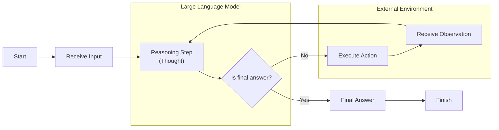

# Lesson 8: Building a ReAct Agent From Scratch

In our previous lessons, we have covered the building blocks of AI Engineering. We started with the agent landscape, learned to distinguish between workflows and agents, and explored context engineering, structured outputs, and tools. In Lesson 7, we dove into the theory behind the ReAct framework, which synergizes reasoning and acting. Theory is a great start, but there is no substitute for building.

This lesson is 100% practical. You will build a minimal ReAct agent from scratch using only Python and the Gemini API. By implementing the full Thought → Action → Observation loop yourself, you will gain a concrete mental model of how these systems operate. This hands-on approach clarifies the mechanics behind agentic frameworks and gives you the confidence to build, debug, and extend your own agents.

We will walk through the entire process step-by-step:
- Setting up the environment.
- Defining a simple mock tool.
- Implementing the Thought, Action, and Observation phases.
- Orchestrating the cycle with a control loop.
- Testing our agent's success and fallback behaviors.

Let's get building.

## Setup and Environment

First, we need to set up our Python environment to ensure the code runs smoothly. This involves loading our API key, importing the necessary libraries, and initializing the Gemini client. A correct setup is the foundation for reproducible results, ensuring that your outputs will match the expected traces we will analyze later.

1.  We start by loading our `GOOGLE_API_KEY` from the environment. Our utility function handles this, making sure the key is available for the Gemini client. Securely managing API keys through environment variables is a standard practice that prevents sensitive credentials from being hardcoded into your application.
    ```python
    from lessons.utils import env

    env.load(required_env_vars=["GOOGLE_API_KEY"])
    ```
    It outputs:
    ```text
    Trying to load environment variables from ...
    Environment variables loaded successfully.
    ```
2.  Next, we import the required packages. We will use `google-genai` for interacting with the Gemini API, `pydantic` for creating structured data models, and standard Python libraries like `enum` and `typing` for type safety.
    ```python
    from enum import Enum
    from pydantic import BaseModel, Field
    from typing import List

    from google import genai
    from google.genai import types

    from lessons.utils import pretty_print
    ```
3.  We initialize the Gemini client, which serves as our gateway to the model. The client will automatically detect and use our API key from the environment variables we just loaded.
    ```python
    client = genai.Client()
    ```
    It outputs:
    ```text
    Both GOOGLE_API_KEY and GEMINI_API_KEY are set. Using GOOGLE_API_KEY.
    ```
4.  Finally, we define the model we will use. For this lesson, we will use `gemini-2.5-flash`. It is a fast and cost-effective model, making it an excellent choice for development, prototyping, and learning exercises where rapid iteration is more important than maximum reasoning power.
    ```python
    MODEL_ID = "gemini-2.5-flash"
    ```
With the client and model in place, we can now define the external capabilities our agent will use.

## Tool Layer: Mock Search Implementation

As we learned in Lesson 6, tools are functions that allow an agent to interact with the outside world. For this lesson, we will create a simple mock `search` tool instead of integrating with a real API. This design choice is intentional and serves a clear educational purpose.

Using a mock tool allows us to isolate our focus on the core ReAct mechanics without the added complexity of managing external dependencies, network requests, or API keys. It also provides predictable, consistent responses, which is essential for reliably testing and debugging our agent's logic. This modular approach means you can develop the agent's reasoning capabilities first and then swap in a real-world API, like Google Search or a private knowledge base, with minimal changes to the agent itself.

Our mock `search` function is straightforward. It takes a string query and returns a hardcoded response if the query matches a predefined pattern. If the query is not recognized, it returns a generic "not found" message. This simulates how a real tool might behave, including both successful and unsuccessful outcomes.

1.  Here is the implementation of our mock tool. The docstring is especially important; it provides the description the LLM will use to understand the tool's purpose and how to call it.
    ```python
    def search(query: str) -> str:
        """Search for information about a specific topic or query.

        Args:
            query (str): The search query or topic to look up.
        """
        query_lower = query.lower()

        # Predefined responses for demonstration
        if all(word in query_lower for word in ["capital", "france"]):
            return "Paris is the capital of France and is known for the Eiffel Tower."
        elif "react" in query_lower:
            return "The ReAct (Reasoning and Acting) framework enables LLMs to solve complex tasks by interleaving thought generation, action execution, and observation processing."

        # Generic response for unhandled queries
        return f"Information about '{query}' was not found."
    ```
2.  We also create a `TOOL_REGISTRY` to map the tool's name to the actual Python function. This allows our agent to plan with symbolic names like `"search"` and lets our code safely execute the correct function based on the LLM's decision.
    ```python
    TOOL_REGISTRY = {
        search.__name__: search,
    }
    ```

## Thought Phase: Prompt Construction and Generation

The first step in the ReAct cycle is "Thought." This is the agent's internal monologue, where it reasons about the user's query and the conversation history to decide what to do next. We generate this thought by prompting the LLM with a carefully crafted template that provides context and instructions.

The prompt gives the model the available tools, the conversation so far, and clear instructions to state its reasoning. We use XML tags like `<tools>` and `<conversation>` to structure the context, a practice we discussed in Lesson 3 on Context Engineering. This helps the model clearly distinguish between different types of information. This use of XML is a deliberate design choice. According to Google's own documentation, providing a clear structure with tags helps Gemini models distinguish between instructions, context, and tasks. This creates unambiguous boundaries that improve instruction following and reasoning [[10]](https://ai.google.dev/gemini-api/docs/prompting-strategies)[[11]](https://www.linkedin.com/posts/hemantkchitale_tim-warner-suggests-using-xml-to-structure-activity-7412500662871220224-NQSB). The template acts as a blueprint for the agent's thinking process, guiding it to produce a short, purposeful paragraph focused on its next intended action.

1.  First, we define a function to build an XML description of the available tools from their docstrings and a prompt template that incorporates this information.
    ```python
    def build_tools_xml_description(tools: dict[str, callable]) -> str:
        """Build a minimal XML description of tools using only their docstrings."""
        lines = []
        for tool_name, fn in tools.items():
            doc = (fn.__doc__ or "").strip()
            lines.append(f"\t<tool name=\"{tool_name}\">")
            if doc:
                lines.append(f"\t\t<description>")
                for line in doc.split("\n"):
                    lines.append(f"\t\t\t{line}")
                lines.append(f"\t\t</description>")
            lines.append("\t</tool>")
        return "\n".join(lines)

    tools_xml = build_tools_xml_description(TOOL_REGISTRY)

    PROMPT_TEMPLATE_THOUGHT = f"""
    You are deciding the next best step for reaching the user goal. You have some tools available to you.

    Available tools:
    <tools>
    {tools_xml}
    </tools>

    Conversation so far:
    <conversation>
    {{conversation}}
    </conversation>

    State your next thought about what to do next as one short paragraph focused on the next action you intend to take and why.
    Avoid repeating the same strategies that didn't work previously. Prefer different approaches.
    """.strip()
    ```
2.  Let's inspect the final prompt template. The `{conversation}` placeholder will be filled dynamically with the dialogue history at each turn.
    ```python
    print(PROMPT_TEMPLATE_THOUGHT)
    ```
    It outputs:
    ```text
    You are deciding the next best step for reaching the user goal. You have some tools available to you.

    Available tools:
    <tools>
        <tool name="search">
            <description>
                Search for information about a specific topic or query.

                Args:
                    query (str): The search query or topic to look up.
            </description>
        </tool>
    </tools>

    Conversation so far:
    <conversation>
    {conversation}
    </conversation>

    State your next thought about what to do next as one short paragraph focused on the next action you intend to take and why.
    Avoid repeating the same strategies that didn't work previously. Prefer different approaches.
    ```
3.  The `generate_thought` function encapsulates the logic for this phase. It takes the current conversation, formats the prompt with the necessary context, and calls the Gemini model to produce the reasoning step as plain text.
    ```python
    def generate_thought(conversation: str, tool_registry: dict[str, callable]) -> str:
        """Generate a thought as plain text (no structured output)."""
        tools_xml = build_tools_xml_description(tool_registry)
        prompt = PROMPT_TEMPLATE_THOUGHT.format(conversation=conversation, tools_xml=tools_xml)

        response = client.models.generate_content(
            model=MODEL_ID,
            contents=prompt
        )
        return response.text.strip()
    ```
With a coherent thought generated, the agent must now decide whether to call a tool or conclude with a final answer.

## Action Phase: Function Calling and Parsing

After the "Thought" phase, the agent moves to the "Action" phase. Here, it decides whether to use a tool to gather more information or to provide a final answer. We will use Gemini's native function calling capabilities, which we covered in Lesson 6, to handle this decision. This approach separates concerns effectively: our prompt focuses on high-level strategy, while the API configuration handles the technical tool definitions.

### System Prompt Strategy

The prompt for the action phase is intentionally high-level. It instructs the model to select the "best next action" based on the conversation history, but it does not include technical details about the tools. This strategic focus allows the LLM to concentrate on reasoning about the user's goal rather than getting bogged down in implementation specifics. The prompt guides the model to decide between calling a tool or providing a final answer, which is the core decision at this stage.

### Automatic Tool Integration

Instead of manually including tool signatures in our prompt, we pass the Python tool functions directly to the Gemini client's `tools` configuration. The client automatically extracts the function name, docstring (as the description), and parameters from the function's signature. This keeps our action prompt clean and focused on strategic guidance, letting the API handle the technical details of tool integration.

### Function Calling Implementation

1.  We define two prompt templates. The first is for general action selection, and the second is a specialized prompt used to force a final answer when the agent reaches its turn limit.
    ```python
    PROMPT_TEMPLATE_ACTION = """
    You are selecting the best next action to reach the user goal.

    Conversation so far:
    <conversation>
    {conversation}
    </conversation>

    Respond either with a tool call (with arguments) or a final answer if you can confidently conclude.
    """.strip()

    # Dedicated prompt used when we must force a final answer
    PROMPT_TEMPLATE_ACTION_FORCED = """
    You must now provide a final answer to the user.

    Conversation so far:
    <conversation>
    {conversation}
    </conversation

    Provide a concise final answer that best addresses the user's goal.
    """.strip()
    ```
2.  We define Pydantic models to represent a `ToolCallRequest` and a `FinalAnswer`. This use of structured outputs, which we discussed in Lesson 4, makes the model's response predictable and easy to parse.
    ```python
    class ToolCallRequest(BaseModel):
        """A request to call a tool with its name and arguments."""
        tool_name: str = Field(description="The name of the tool to call.")
        arguments: dict = Field(description="The arguments to pass to the tool.")


    class FinalAnswer(BaseModel):
        """A final answer to present to the user when no further action is needed."""
        text: str = Field(description="The final answer text to present to the user.")
    ```
3.  The `generate_action` function orchestrates this phase. It sends the conversation history to Gemini along with the available tools. The `force_final` flag allows us to instruct the model to conclude, which is useful for preventing infinite loops.
    ```python
    def generate_action(conversation: str, tool_registry: dict[str, callable] | None = None, force_final: bool = False) -> (ToolCallRequest | FinalAnswer):
        """Generate an action by passing tools to the LLM and parsing function calls or final text.

        When force_final is True or no tools are provided, the model is instructed to produce a final answer and tool calls are disabled.
        """
        # Use a dedicated prompt when forcing a final answer or no tools are provided
        if force_final or not tool_registry:
            prompt = PROMPT_TEMPLATE_ACTION_FORCED.format(conversation=conversation)
            response = client.models.generate_content(
                model=MODEL_ID,
                contents=prompt
            )
            return FinalAnswer(text=response.text.strip())

        # Default action prompt
        prompt = PROMPT_TEMPLATE_ACTION.format(conversation=conversation)

        # Provide the available tools to the model; disable auto-calling so we can parse and run ourselves
        tools = list(tool_registry.values())
        config = types.GenerateContentConfig(
            tools=tools,
            automatic_function_calling={"disable": True}
        )
        response = client.models.generate_content(
            model=MODEL_ID,
            contents=prompt,
            config=config
        )
    ```

### Response Parsing and Error Handling

The model's response will be either a structured function call or a final text answer, which our code must then parse and act upon. The parsing logic checks for a `function_call` attribute on the response parts. If found, it constructs a `ToolCallRequest`. Otherwise, it assumes a `FinalAnswer`. This handles the dual return format cleanly.

A robust implementation must also handle cases where the model returns a malformed response or calls an unknown tool. In our control loop, we will wrap tool execution in a `try-except` block. This allows us to catch errors, such as a `KeyError` if the tool name is not in our registry, and report the failure back to the agent as an observation. The agent can then use this feedback to self-correct in the next turn.

```python
    # Extract the function call from the response (if present)
    candidate = response.candidates[0]
    parts = candidate.content.parts
    if parts and getattr(parts[0], "function_call", None):
        name = parts[0].function_call.name
        args = dict(parts[0].function_call.args) if parts[0].function_call.args is not None else {}
        return ToolCallRequest(tool_name=name, arguments=args)
    
    # Otherwise, it's a final answer
    final_answer = "".join(part.text for part in candidate.content.parts)
    return FinalAnswer(text=final_answer.strip())
```

## Control Loop: Messages, Scratchpad, and Orchestration

Now we will build the control loop that orchestrates the Thought → Action → Observation cycle. This loop is the engine of our agent, managing the conversation history, executing tool calls, and processing observations to guide the agent's reasoning from one turn to the next.

### Message Structure Foundation

At the core of our loop is a "scratchpad," which is a log of all interactions. We will use a structured message system to keep this scratchpad organized. Each entry will have a role (`USER`, `THOUGHT`, `TOOL_REQUEST`, `OBSERVATION`, or `FINAL_ANSWER`) and content. This structure provides a clear, traceable history of the agent's process, serving as its short-term working memory. This scratchpad is the agent's working memory, a concept directly paralleling human cognition. Just as people hold intermediate thoughts and results in mind while solving a multi-step problem, the scratchpad holds the chain of thoughts, actions, and observations for the agent to reason over. It is the only memory the model directly "sees" during a single turn [[12]](https://atlan.com/know/types-of-ai-agent-memory/)[[13]](https://dev.to/sreeni5018/the-5-types-of-ai-agent-memory-every-developer-needs-to-know-part-1-52fn).

1.  First, we define our message structure using an `Enum` for roles and a Pydantic `BaseModel` for the message itself. This ensures every piece of information in our scratchpad is consistently formatted.
    ```python
    class MessageRole(str, Enum):
        """Enumeration for the different roles a message can have."""
        USER = "user"
        THOUGHT = "thought"
        TOOL_REQUEST = "tool request"
        OBSERVATION = "observation"
        FINAL_ANSWER = "final answer"


    class Message(BaseModel):
        """A message with a role and content, used for all message types."""
        role: MessageRole = Field(description="The role of the message in the ReAct loop.")
        content: str = Field(description="The textual content of the message.")

        def __str__(self) -> str:
            """Provides a user-friendly string representation of the message."""
            return f"{self.role.value.capitalize()}: {self.content}"
    ```
2.  We also create a helper function to pretty-print messages with color-coding for each role. This will make the agent's trace much easier to read and debug.
    ```python
    def pretty_print_message(message: Message, turn: int, max_turns: int, header_color: str = pretty_print.Color.YELLOW, is_forced_final_answer: bool = False) -> None:
        if not is_forced_final_answer:
            title = f"{message.role.value.capitalize()} (Turn {turn}/{max_turns}):"
        else:
            title = f"{message.role.value.capitalize()} (Forced):"

        pretty_print.wrapped(
            text=message.content,
            title=title,
            header_color=header_color,
        )
    ```
3.  The `Scratchpad` class manages our list of messages. It provides a simple interface to append new messages and a method to convert the entire history into a single string, which we will feed into the LLM prompt at each turn.
    ```python
    class Scratchpad:
        """Container for ReAct messages with optional pretty-print on append."""

        def __init__(self, max_turns: int) -> None:
            self.messages: List[Message] = []
            self.max_turns: int = max_turns
            self.current_turn: int = 1

        def set_turn(self, turn: int) -> None:
            self.current_turn = turn

        def append(self, message: Message, verbose: bool = False, is_forced_final_answer: bool = False) -> None:
            self.messages.append(message)
            if verbose:
                role_to_color = {
                    MessageRole.USER: pretty_print.Color.RESET,
                    MessageRole.THOUGHT: pretty_print.Color.ORANGE,
                    MessageRole.TOOL_REQUEST: pretty_print.Color.GREEN,
                    MessageRole.OBSERVATION: pretty_print.Color.YELLOW,
                    MessageRole.FINAL_ANSWER: pretty_print.Color.CYAN,
                }
                header_color = role_to_color.get(message.role, pretty_print.Color.YELLOW)
                pretty_print_message(
                    message=message,
                    turn=self.current_turn,
                    max_turns=self.max_turns,
                    header_color=header_color,
                    is_forced_final_answer=is_forced_final_answer,
                )

        def to_string(self) -> str:
            return "\n".join(str(m) for m in self.messages)
    ```

### Control Loop Architecture and Observation Processing

Finally, we implement the `react_agent_loop` function. This is the heart of our agent. It takes an initial question and iterates through the ReAct cycle for a maximum number of turns. In each turn, it generates a thought, then an action. If the action is a `FinalAnswer`, the loop terminates. If it is a `ToolCallRequest`, the loop executes the tool, captures the output as an "Observation," and continues to the next turn. The `try-except` block ensures that if the agent calls an unknown tool or an error occurs during execution, the failure is caught and recorded as an observation. This allows the agent to reason about the error in its next thought. If the maximum number of turns is reached, it forces a final answer. This `max_turns` parameter is a critical safeguard to prevent infinite loops and ensure the agent terminates gracefully when it gets stuck [[14]](https://stevekinney.com/writing/agent-loops).

```python
def react_agent_loop(initial_question: str, tool_registry: dict[str, callable], max_turns: int = 5, verbose: bool = False) -> str:
    """
    Implements the main ReAct (Thought -> Action -> Observation) control loop.
    Uses a unified message class for the scratchpad.
    """
    scratchpad = Scratchpad(max_turns=max_turns)

    # Add the user's question to the scratchpad
    user_message = Message(role=MessageRole.USER, content=initial_question)
    scratchpad.append(user_message, verbose=verbose)

    for turn in range(1, max_turns + 1):
        scratchpad.set_turn(turn)

        # Generate a thought based on the current scratchpad
        thought_content = generate_thought(
            scratchpad.to_string(),
            tool_registry,
        )
        thought_message = Message(role=MessageRole.THOUGHT, content=thought_content)
        scratchpad.append(thought_message, verbose=verbose)

        # Generate an action based on the current scratchpad
        action_result = generate_action(
            scratchpad.to_string(),
            tool_registry=tool_registry,
        )

        # If the model produced a final answer, return it
        if isinstance(action_result, FinalAnswer):
            final_answer = action_result.text
            final_message = Message(role=MessageRole.FINAL_ANSWER, content=final_answer)
            scratchpad.append(final_message, verbose=verbose)
            return final_answer

        # Otherwise, it is a tool request
        if isinstance(action_result, ToolCallRequest):
            action_name = action_result.tool_name
            action_params = action_result.arguments

            # Add the action to the scratchpad
            params_str = ", ".join([f"{k}='{v}'" for k, v in action_params.items()])
            action_content = f"{action_name}({params_str})"
            action_message = Message(role=MessageRole.TOOL_REQUEST, content=action_content)
            scratchpad.append(action_message, verbose=verbose)

            # Run the action and get the observation
            observation_content = ""
            try:
                tool_function = tool_registry[action_name]
                observation_content = tool_function(**action_params)
            except Exception as e:
                observation_content = f"Error executing tool '{action_name}': {e}"

            # Add the observation to the scratchpad
            observation_message = Message(role=MessageRole.OBSERVATION, content=observation_content)
            scratchpad.append(observation_message, verbose=verbose)

        # Check if the maximum number of turns has been reached. If so, force the action selector to produce a final answer
        if turn == max_turns:
            forced_action = generate_action(
                scratchpad.to_string(),
                force_final=True,
            )
            if isinstance(forced_action, FinalAnswer):
                final_answer = forced_action.text
            else:
                final_answer = "Unable to produce a final answer within the allotted turns."
            final_message = Message(role=MessageRole.FINAL_ANSWER, content=final_answer)
            scratchpad.append(final_message, verbose=verbose, is_forced_final_answer=True)
            return final_answer
```


Image 1: A flowchart illustrating the ReAct control loop with iterative Thought, Action, and Observation phases, delineated by Large Language Model and External Environment components.

This control loop, visualized in Image 1, brings together all the pieces we have built. It provides a clear and extensible structure for creating a reasoning agent that can think, act, observe, and adapt.

## Tests and Traces: Success and Graceful Fallback

With our agent fully implemented, it is time to test it. We will run two scenarios to validate its behavior: a straightforward factual question where the tool should succeed, and a query about information our mock tool does not have, which should trigger a graceful fallback. Analyzing the traces from these tests will confirm that our ReAct loop, tool integration, and termination logic work as expected.

### Success Case

First, let's ask a question that our mock `search` tool is designed to answer: "What is the capital of France?". We will set `max_turns=2` and `verbose=True` to see the step-by-step trace. This test validates the entire end-to-end flow.

1.  We call our agent loop with the question.
    ```python
    question = "What is the capital of France?"
    final_answer = react_agent_loop(question, TOOL_REGISTRY, max_turns=2, verbose=True)
    ```
    It outputs:
    ```text
    User (Turn 1/2): What is the capital of France?
    Thought (Turn 1/2): The user is asking for the capital of France. I can use the search tool to find this information.
    Tool request (Turn 1/2): search(query='capital of France')
    Observation (Turn 1/2): Paris is the capital of France and is known for the Eiffel Tower.
    Thought (Turn 2/2): I have found the answer using the search tool. The capital of France is Paris. I can now provide the final answer.
    Final answer (Turn 2/2): Paris is the capital of France.
    ```
The trace shows the agent behaving exactly as we want. In Turn 1, the `generate_action` function correctly produces a `ToolCallRequest` with the name `search` and argument `capital of France`. The control loop then executes the tool, captures the observation, and appends it to the scratchpad. In Turn 2, the agent analyzes the observation, concludes it has enough information, and formulates a final answer. The process is transparent, logical, and efficient, concluding well within the two-turn budget.

### Graceful Fallback Case

Now, let's test a query our mock tool cannot answer: "What is the capital of Italy?". This will test the agent's ability to handle a "not found" observation, adapt its strategy, and trigger the forced termination logic when it exhausts its attempts. This demonstrates the agent's resilience in the face of tool failures.

1.  We run the loop with the new question.
    ```python
    question = "What is the capital of Italy?"
    final_answer = react_agent_loop(question, TOOL_REGISTRY, max_turns=2, verbose=True)
    ```
    It outputs:
    ```text
    User (Turn 1/2): What is the capital of Italy?
    Thought (Turn 1/2): The user is asking for the capital of Italy. I can use the search tool to find this information.
    Tool request (Turn 1/2): search(query='capital of Italy')
    Observation (Turn 1/2): Information about 'capital of Italy' was not found.
    Thought (Turn 2/2): The previous search for 'capital of Italy' failed. I will try a broader search for just 'Italy' to see if I can find any relevant information that might lead me to the capital.
    Tool request (Turn 2/2): search(query='Italy')
    Observation (Turn 2/2): Information about 'Italy' was not found.
    Final answer (Forced): I'm sorry, but I was unable to find the capital of Italy using the available tools.
    ```
This trace demonstrates the agent's ability to self-correct. After the first tool call fails in Turn 1, its next thought in Turn 2 reflects a change in strategy: it decides to try a broader query. This adaptation is a key feature of the ReAct pattern. When the second attempt also fails and the agent reaches the `max_turns` limit, the forced final answer path is triggered. The agent then generates a polite and honest response acknowledging its inability to find the information. These tests confirm our from-scratch ReAct agent is working correctly and can handle both success and failure gracefully.

## Conclusion

In this lesson, we moved from theory to practice and built a complete, minimal ReAct agent from the ground up. By implementing each component—the tool, the thought and action phases, and the orchestrating control loop—we have clarified how these reasoning systems operate. You now have a tangible mental model of the Thought-Action-Observation cycle.

This hands-on experience is a key step in your development as an AI Engineer. While simple, this agent contains the core patterns you will use to build far more sophisticated systems. In our upcoming lessons, we will build upon this foundation. We will explore how to equip agents with long-term memory in Lesson 9 and integrate advanced Retrieval-Augmented Generation (RAG) in Lesson 10, transforming our simple agent into a powerful, knowledge-driven assistant.

## References

- [1] Yao, S., Zhao, J., Yu, D., Du, N., Shafran, I., Narasimhan, K., & Cao, Y. (2022). *ReAct: Synergizing Reasoning and Acting in Language Models*. arXiv. https://arxiv.org/pdf/2210.03629
- [2] Bergmann, D. (n.d.). *ReAct Agent*. IBM. https://www.ibm.com/think/topics/react-agent
- [3] Stryker, C. (n.d.). *AI Agent Planning*. IBM. https://www.ibm.com/think/topics/ai-agent-planning
- [4] Anthropic. (2024). *Building effective agents*. https://www.anthropic.com/engineering/building-effective-agents
- [5] Google. (n.d.). *ReAct agent from scratch with Gemini 2.5 and LangGraph*. Google AI for Developers. https://ai.google.dev/gemini-api/docs/langgraph-example
- [6] Ferrag, M. A., Tihanyi, N., & Debbah, M. (2025). *From LLM Reasoning to Autonomous AI Agents: A Comprehensive Review*. arXiv. https://arxiv.org/pdf/2504.19678
- [7] Shankar, A. (2024, June 10). *Building ReAct Agents from Scratch using Gemini*. Medium. https://medium.com/google-cloud/building-react-agents-from-scratch-a-hands-on-guide-using-gemini-ffe4621d90ae
- [8] Downie, A., & Finio, M. (n.d.). *AI Agent Orchestration*. IBM. https://www.ibm.com/think/topics/ai-agent-orchestration
- [9] Google. (n.d.). *Gemini Function Calling Documentation*. Google AI for Developers. https://ai.google.dev/gemini-api/docs/function-calling
- [10] Google. (n.d.). *Prompt design strategies*. Google AI for Developers. https://ai.google.dev/gemini-api/docs/prompting-strategies
- [11] Chitale, H. (2024). *LinkedIn Post on XML for Prompts*. LinkedIn. https://www.linkedin.com/posts/hemantkchitale_tim-warner-suggests-using-xml-to-structure-activity-7412500662871220224-NQSB
- [12] Atlan. (n.d.). *Types of AI Agent Memory*. https://atlan.com/know/types-of-ai-agent-memory/
- [13] Sreenivas, S. (2024). *The 5 Types of AI Agent Memory Every Developer Needs to Know*. DEV Community. https://dev.to/sreeni5018/the-5-types-of-ai-agent-memory-every-developer-needs-to-know-part-1-52fn
- [14] Kinney, S. (n.d.). *Agent Loops*. https://stevekinney.com/writing/agent-loops
</article>