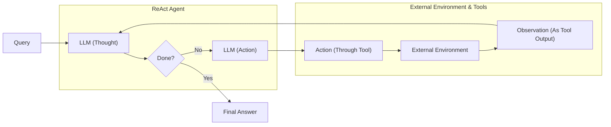

# Lesson 8: Build a Re-What? A Step-by-Step Guide to Your First ReAct Agent

In our last lesson, we explored the theoretical foundations of agentic reasoning, covering patterns like ReAct. We saw how an agent could "think" and "act" to solve problems, blending deliberative thought with tool-grounded action in a way that builds on decades of AI research. But theory only takes you so far. To truly understand how these systems work, you have to build one yourself.

This lesson is 100% practical. We will build a minimal ReAct agent from scratch using only Python and the Gemini API. By implementing the full Thought → Action → Observation loop, you will gain a concrete mental model of how agents reason, use tools, and learn from their environment. By forcing the model to ground its reasoning in real information from tools, the ReAct pattern helps mitigate common LLM failures like hallucination. This practical experience is essential for any aspiring AI engineer [[1]](https://www.scitepress.org/Papers/2026/144223/144223.pdf), [[2]](https://www.dailydoseofds.com/ai-agents-crash-course-part-10-with-implementation/).



Image 1: A flowchart illustrating the theoretical design of a ReAct agent, detailing the iterative Thought-Action-Observation loop.

We will walk through every step: defining a mock tool, generating thoughts, selecting actions with function calling, executing the tool, processing the observation, and orchestrating everything in a control loop. By the end, you will have a working agent and the confidence to debug, customize, and extend it.

## Setup and Environment

First, we need to set up our Python environment to ensure the code runs smoothly. This involves loading our API keys, importing the necessary packages, and initializing the Gemini client. A correct setup is essential for replicating the notebook's behavior and ensuring your outputs match the expected traces.

1.  We start by loading our Google API key from an environment file using a custom utility. This keeps our credentials secure and separate from the code.
    
    ```python
    from lessons.utils import env
    
    env.load(required_env_vars=["GOOGLE_API_KEY"])
    ```
    
2.  Next, we import the key packages we will use. This includes `google-genai` for the Gemini API, `pydantic` for creating structured data models, and some utilities for clear, color-coded printing in the notebook.
    
    ```python
    from enum import Enum
    from pydantic import BaseModel, Field
    from typing import List
    
    from google import genai
    from google.genai import types
    
    from lessons.utils import pretty_print
    ```
    
3.  We initialize the Gemini client, which will handle our API requests. The client automatically detects the API key from the environment variables we loaded earlier.
    
    ```python
    client = genai.Client()
    ```
    
    It outputs:
    
    ```text
    Both GOOGLE_API_KEY and GEMINI_API_KEY are set. Using GOOGLE_API_KEY.
    ```
    
4.  Finally, we define the model we will use. For this lesson, we will use `gemini-2.5-flash`, a model that is both fast and cost-effective, making it ideal for development.
    
    ```python
    MODEL_ID = "gemini-2.5-flash"
    ```
    
With our environment configured, we can now define an external capability for our agent to use.

## Tool Layer: Mock Search Implementation

An agent's power comes from its ability to use tools to gather information or perform actions [[3]](https://www.ibm.com/think/topics/react-agent). For this lesson, we will create a simple mock `search` tool instead of calling a real API. This approach simplifies our focus to the ReAct mechanics, removes the need for external API keys, and provides predictable responses, which makes testing and debugging much easier [[4]](https://medium.com/google-cloud/building-react-agents-from-scratch-a-hands-on-guide-using-gemini-ffe4621d90ae).

Our mock tool is a Python function that simulates a search engine. Its docstring is important, as it provides the description the LLM uses to understand what the tool does. The function returns a hardcoded response for specific queries and a generic "not found" message for others, allowing us to test the agent's fallback behavior.

1.  We define the `search` function with a clear docstring explaining its purpose and arguments.
    
    ```python
    def search(query: str) -> str:
        """Search for information about a specific topic or query.
    
        Args:
            query (str): The search query or topic to look up.
        """
        query_lower = query.lower()
    
        # Predefined responses for demonstration
        if all(word in query_lower for word in ["capital", "france"]):
            return "Paris is the capital of France and is known for the Eiffel Tower."
        elif "react" in query_lower:
            return "The ReAct (Reasoning and Acting) framework enables LLMs to solve complex tasks by interleaving thought generation, action execution, and observation processing."
    
        # Generic response for unhandled queries
        return f"Information about '{query}' was not found."
    ```
    
2.  We then create a `TOOL_REGISTRY` dictionary to map the tool's name to the function. This allows our agent to plan with the symbolic name "search" while our code executes the correct Python function.
    
    ```python
    TOOL_REGISTRY = {
        search.__name__: search,
    }
    ```
    
In a production system, you could swap this mock function with a real API call to Google Search or a domain-specific knowledge base while keeping the agent's logic the same [[5]](https://atalupadhyay.wordpress.com/2025/11/25/building-a-real-time-web-searching-ai-agent-with-langchain-and-google-gemini/). Now that our agent has a tool, it needs to "think" about how to use it.

## Thought Phase: Prompt Construction and Generation

The "Thought" phase is the agent's internal monologue, where the LLM analyzes the user's query and conversation history to decide on the next step [[6]](https://arxiv.org/pdf/2210.03629). We guide this process with a prompt that provides context about the agent's goal and available tools. Using structured formats like XML helps the model distinguish between instructions, tool definitions, and conversation history [[7]](https://ai.google.dev/gemini-api/docs/prompting-strategies).

1.  First, we create a helper function to build an XML description of the available tools. This description, derived from the function's docstring, is inserted into the prompt to inform the LLM about its capabilities.
    
    ```python
    def build_tools_xml_description(tools: dict[str, callable]) -> str:
        """Build a minimal XML description of tools using only their docstrings."""
        lines = []
        for tool_name, fn in tools.items():
            doc = (fn.__doc__ or "").strip()
            lines.append(f"\t<tool name=\"{tool_name}\">")
            if doc:
                lines.append(f"\t\t<description>")
                for line in doc.split("\n"):
                    lines.append(f"\t\t\t{line}")
                lines.append(f"\t\t</description>")
            lines.append("\t</tool>")
        return "\n".join(lines)
    ```
    
2.  Next, we define the prompt template for thought generation. It includes placeholders for the tool descriptions and conversation history, instructing the model to state its next thought as a short paragraph.
    
    ```python
    tools_xml = build_tools_xml_description(TOOL_REGISTRY)
    
    PROMPT_TEMPLATE_THOUGHT = f"""
    You are deciding the next best step for reaching the user goal. You have some tools available to you.
    
    Available tools:
    <tools>
    {tools_xml}
    </tools>
    
    Conversation so far:
    <conversation>
    {{conversation}}
    </conversation>
    
    State your next thought about what to do next as one short paragraph focused on the next action you intend to take and why.
    Avoid repeating the same strategies that didn't work previously. Prefer different approaches.
    """.strip()
    ```
    
3.  Finally, the `generate_thought` function formats the prompt and calls the Gemini API to generate the agent's next thought. This function is the core of the reasoning step in our ReAct loop.
    
    ```python
    def generate_thought(conversation: str, tool_registry: dict[str, callable]) -> str:
        """Generate a thought as plain text (no structured output)."""
        tools_xml = build_tools_xml_description(tool_registry)
        prompt = PROMPT_TEMPLATE_THOUGHT.format(conversation=conversation, tools_xml=tools_xml)
    
        response = client.models.generate_content(
            model=MODEL_ID,
            contents=prompt
        )
        return response.text.strip()
    ```
    
A thought is just an internal monologue. To make it useful, the agent must translate that thought into a concrete "Action."

## Action Phase: Function Calling and Parsing

After generating a thought, the agent must decide on an action: call a tool or provide a final answer. We will use Gemini's native function calling capabilities for this [[8]](https://ai.google.dev/gemini-api/docs/function-calling). A key advantage is that we pass Python functions directly to the API's `tools` configuration. The client automatically extracts the necessary details, keeping our prompts clean and focused on strategic guidance [[4]](https://medium.com/google-cloud/building-react-agents-from-scratch-a-hands-on-guide-using-gemini-ffe4621d90ae).

1.  We start with two prompt templates. The first is for general action selection, and the second is a more direct prompt used to force a final answer, ensuring the agent terminates gracefully.
    
    ```python
    PROMPT_TEMPLATE_ACTION = """
    You are selecting the best next action to reach the user goal.
    
    Conversation so far:
    <conversation>
    {conversation}
    </conversation>
    
    Respond either with a tool call (with arguments) or a final answer if you can confidently conclude.
    """.strip()
    
    PROMPT_TEMPLATE_ACTION_FORCED = """
    You must now provide a final answer to the user.
    
    Conversation so far:
    <conversation>
    {conversation}
    </conversation>
    
    Provide a concise final answer that best addresses the user's goal.
    """.strip()
    ```
    
2.  We define Pydantic models to represent the two possible outcomes: a `ToolCallRequest` or a `FinalAnswer`. This provides a structured way to handle the model's output.
    
    ```python
    class ToolCallRequest(BaseModel):
        """A request to call a tool with its name and arguments."""
        tool_name: str = Field(description="The name of the tool to call.")
        arguments: dict = Field(description="The arguments to pass to the tool.")
    
    
    class FinalAnswer(BaseModel):
        """A final answer to present to the user when no further action is needed."""
        text: str = Field(description="The final answer text to present to the user.")
    ```
    
3.  The `generate_action` function orchestrates this phase. It selects the appropriate prompt, passes the tools to the Gemini API, and parses the response. We disable automatic function calling so we can run the tools ourselves. If the model returns a `function_call`, it is parsed into a `ToolCallRequest`; otherwise, the text response is treated as a `FinalAnswer`. The function also includes error handling to manage unknown actions or malformed responses, reverting to the `think` method if problems arise.
    
    ```python
    def generate_action(conversation: str, tool_registry: dict[str, callable] | None = None, force_final: bool = False) -> (ToolCallRequest | FinalAnswer):
        """Generate an action by passing tools to the LLM and parsing function calls or final text.
    
        When force_final is True or no tools are provided, the model is instructed to produce a final answer and tool calls are disabled.
        """
        if force_final or not tool_registry:
            prompt = PROMPT_TEMPLATE_ACTION_FORCED.format(conversation=conversation)
            response = client.models.generate_content(model=MODEL_ID, contents=prompt)
            return FinalAnswer(text=response.text.strip())
    
        prompt = PROMPT_TEMPLATE_ACTION.format(conversation=conversation)
    
        tools = list(tool_registry.values())
        config = types.GenerateContentConfig(tools=tools, automatic_function_calling={"disable": True})
        response = client.models.generate_content(model=MODEL_ID, contents=prompt, config=config)
    
        candidate = response.candidates[0]
        parts = candidate.content.parts
        if parts and getattr(parts[0], "function_call", None):
            name = parts[0].function_call.name
            args = dict(parts[0].function_call.args) if parts[0].function_call.args is not None else {}
            return ToolCallRequest(tool_name=name, arguments=args)
        
        final_answer = "".join(part.text for part in candidate.content.parts)
        return FinalAnswer(text=final_answer.strip())
    ```
    

Now we need a control loop to orchestrate the "Thought" and "Action" phases and handle the "Observation" part of the cycle.

## Control Loop: Messages, Scratchpad, and Orchestration

The control loop is the engine of our ReAct agent, orchestrating the Thought → Action → Observation cycle. This loop is an emergent behavior we create through prompt engineering and application logic. We will build it using a "scratchpad" to track every step, which serves as the agent's short-term memory [[2]](https://www.dailydoseofds.com/ai-agents-crash-course-part-10-with-implementation/).

1.  First, we define `Message` and `MessageRole` classes to categorize each entry in our scratchpad. This structured approach is fundamental for tracking the agent's state and providing a coherent history to the LLM.
    
    ```python
    class MessageRole(str, Enum):
        """Enumeration for the different roles a message can have."""
        USER = "user"
        THOUGHT = "thought"
        TOOL_REQUEST = "tool request"
        OBSERVATION = "observation"
        FINAL_ANSWER = "final answer"
    
    
    class Message(BaseModel):
        """A message with a role and content, used for all message types."""
        role: MessageRole = Field(description="The role of the message in the ReAct loop.")
        content: str = Field(description="The textual content of the message.")
    
        def __str__(self) -> str:
            """Provides a user-friendly string representation of the message."""
            return f"{self.role.value.capitalize()}: {self.content}"
    ```
    
2.  To make debugging easier, a helper function prints each message with a color-coded header indicating its role and the current turn.
    
    ```python
    def pretty_print_message(message: Message, turn: int, max_turns: int, header_color: str = pretty_print.Color.YELLOW, is_forced_final_answer: bool = False) -> None:
        if not is_forced_final_answer:
            title = f"{message.role.value.capitalize()} (Turn {turn}/{max_turns}):"
        else:
            title = f"{message.role.value.capitalize()} (Forced):"
    
        pretty_print.wrapped(
            text=message.content,
            title=title,
            header_color=header_color,
        )
    ```
    
3.  The `Scratchpad` class manages our list of messages, providing methods to append new messages and serialize the history into a single string for the LLM's context.
    
    ```python
    class Scratchpad:
        """Container for ReAct messages with optional pretty-print on append."""
    
        def __init__(self, max_turns: int) -> None:
            self.messages: List[Message] = []
            self.max_turns: int = max_turns
            self.current_turn: int = 1
    
        def set_turn(self, turn: int) -> None:
            self.current_turn = turn
    
        def append(self, message: Message, verbose: bool = False, is_forced_final_answer: bool = False) -> None:
            self.messages.append(message)
            if verbose:
                role_to_color = {
                    MessageRole.USER: pretty_print.Color.RESET,
                    MessageRole.THOUGHT: pretty_print.Color.ORANGE,
                    MessageRole.TOOL_REQUEST: pretty_print.Color.GREEN,
                    MessageRole.OBSERVATION: pretty_print.Color.YELLOW,
                    MessageRole.FINAL_ANSWER: pretty_print.Color.CYAN,
                }
                header_color = role_to_color.get(message.role, pretty_print.Color.YELLOW)
                pretty_print_message(
                    message=message,
                    turn=self.current_turn,
                    max_turns=self.max_turns,
                    header_color=header_color,
                    is_forced_final_answer=is_forced_final_answer,
                )
    
        def to_string(self) -> str:
            return "\n".join(str(m) for m in self.messages)
    ```
    
4.  Finally, the `react_agent_loop` function is the core orchestrator. It initializes the scratchpad and iterates through a set number of turns. In each turn, it generates a thought, then an action. If the action is a `FinalAnswer`, the loop terminates. If it is a `ToolCallRequest`, the loop executes the tool, captures the output as an "Observation," and adds it to the scratchpad. If the agent reaches the maximum number of turns, it forces a final answer to ensure a graceful exit.
    
    ```python
    def react_agent_loop(initial_question: str, tool_registry: dict[str, callable], max_turns: int = 5, verbose: bool = False) -> str:
        """
        Implements the main ReAct (Thought -> Action -> Observation) control loop.
        """
        scratchpad = Scratchpad(max_turns=max_turns)
        scratchpad.append(Message(role=MessageRole.USER, content=initial_question), verbose=verbose)
    
        for turn in range(1, max_turns + 1):
            scratchpad.set_turn(turn)
    
            # Thought
            thought_content = generate_thought(scratchpad.to_string(), tool_registry)
            scratchpad.append(Message(role=MessageRole.THOUGHT, content=thought_content), verbose=verbose)
    
            # Action
            action_result = generate_action(scratchpad.to_string(), tool_registry=tool_registry)
    
            if isinstance(action_result, FinalAnswer):
                scratchpad.append(Message(role=MessageRole.FINAL_ANSWER, content=action_result.text), verbose=verbose)
                return action_result.text
    
            if isinstance(action_result, ToolCallRequest):
                # Observation
                params_str = ", ".join([f"{k}='{v}'" for k, v in action_result.arguments.items()])
                action_content = f"{action_result.tool_name}({params_str})"
                scratchpad.append(Message(role=MessageRole.TOOL_REQUEST, content=action_content), verbose=verbose)
    
                observation_content = ""
                try:
                    observation_content = tool_registry[action_result.tool_name](**action_result.arguments)
                except Exception as e:
                    observation_content = f"Error executing tool '{action_result.tool_name}': {e}"
                
                scratchpad.append(Message(role=MessageRole.OBSERVATION, content=observation_content), verbose=verbose)
    
            if turn == max_turns:
                # Force final answer
                forced_action = generate_action(scratchpad.to_string(), force_final=True)
                final_answer = forced_action.text if isinstance(forced_action, FinalAnswer) else "Unable to produce a final answer."
                scratchpad.append(Message(role=MessageRole.FINAL_ANSWER, content=final_answer), verbose=verbose, is_forced_final_answer=True)
                return final_answer
    ```
    
    ```mermaid
    flowchart LR
      %% Start and End nodes
      start_node["__start__"]
      end_node["__end__"]
    
      %% Core Agent Nodes
      llm_node["llm<br/>(Model: Thought Generation)"]
      tools_node["tools<br/>(Tools: Action Execution)"]
    
      %% Initial Flow
      start_node --> query_node["Query"]
      query_node --> llm_node
    
      %% Conditional Logic from LLM
      llm_node -- "should_continue" --> decision_node{"Tool calls present?"}
      decision_node -- "continue" --> tools_node
      decision_node -- "end" --> end_node
    
      %% Loop from Tools to LLM
      tools_node -- "Observations Integrated" --> llm_node
    
      %% Retry Loop for Thought Refinement
      llm_node -- "Retry<br/>(Thought Refinement)" --> llm_node
    ```
    
    Image 2: A flowchart depicting the control flow of our from-scratch ReAct agent.

With the full loop implemented, let's put our agent to the test.

## Tests and Traces: Success and Graceful Fallback

To validate our ReAct agent, we will run two tests: one to demonstrate a successful run and another to test its ability to adapt and terminate gracefully when a tool fails. Analyzing these traces is key to debugging and understanding the agent's behavior [[4]](https://medium.com/google-cloud/building-react-agents-from-scratch-a-hands-on-guide-using-gemini-ffe4621d90ae).

Our first test asks a simple factual question, "What is the capital of France?", with a limit of two turns.

```python
question = "What is the capital of France?"
final_answer = react_agent_loop(question, TOOL_REGISTRY, max_turns=2, verbose=True)
```

The agent executes perfectly. In the first turn, it thinks about using the `search` tool, calls it with the correct query, and receives the observation that "Paris is the capital of France." In the second turn, it recognizes it has the answer and provides the final, correct response. This confirms the core loop works as expected.

For our second test, we ask a question our mock tool cannot answer: "What is the capital of Italy?". This tests the agent's fallback behavior.

```python
question = "What is the capital of Italy?"
final_answer = react_agent_loop(question, TOOL_REGISTRY, max_turns=2, verbose=True)
```

The trace demonstrates the agent's resilience. In the first turn, its search for "capital of Italy" fails. In the second turn, it adapts its strategy, thinking it should try a broader search for just "Italy." When that also fails, it reaches its turn limit. The control loop then triggers the forced final answer path, and the agent gracefully concludes, "I'm sorry, but I couldn't find information about the capital of Italy." This test validates the agent's ability to handle tool failures and terminate cleanly.

## Conclusion

In this lesson, we have built a minimal ReAct agent from the ground up. By implementing the full Thought-Action-Observation cycle, we have demystified the core mechanics that power modern AI agents. We have seen how to define tools, guide the agent's reasoning with prompts, use function calling to select actions, and orchestrate the entire process in a control loop.

This hands-on approach provides a solid mental model that is essential for any AI engineer. Even if you use frameworks like LangGraph in production, understanding what happens under the hood is key to debugging, customizing, and extending your agents. These foundational skills prepare you for more advanced patterns like Plan-and-Execute. In our next lesson, we will build on this foundation by exploring how to give our agents a proper memory, moving beyond the simple scratchpad we used today and toward more complex orchestration [[9]](https://www.philschmid.de/langgraph-gemini-2-5-react-agent), [[10]](https://arxiv.org/html/2510.24663v1).

## References

- [1] https://www.scitepress.org/Papers/2026/144223/144223.pdf
- [2] https://www.dailydoseofds.com/ai-agents-crash-course-part-10-with-implementation/
- [3] https://www.ibm.com/think/topics/react-agent
- [4] https://medium.com/google-cloud/building-react-agents-from-scratch-a-hands-on-guide-using-gemini-ffe4621d90ae
- [5] https://atalupadhyay.wordpress.com/2025/11/25/building-a-real-time-web-searching-ai-agent-with-langchain-and-google-gemini/
- [6] https://arxiv.org/pdf/2210.03629
- [7] https://ai.google.dev/gemini-api/docs/prompting-strategies
- [8] https://ai.google.dev/gemini-api/docs/function-calling
- [9] https://www.philschmid.de/langgraph-gemini-2-5-react-agent
- [10] https://arxiv.org/html/2510.24663v1
- [11] https://www.ibm.com/think/topics/ai-agent-planning
- [12] https://www.anthropic.com/engineering/building-effective-agents
- [13] https://dev.to/jamesli/react-vs-plan-and-execute-a-practical-comparison-of-llm-agent-patterns-4gh9