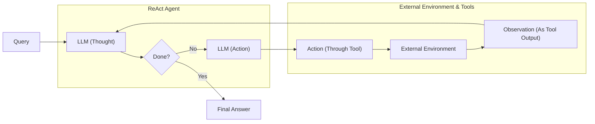

# Lesson 8: Build a Re-What? A Step-by-Step Guide to Your First ReAct Agent

In our last lesson, we explored the theoretical foundations of agentic reasoning, covering patterns like ReAct. We saw how an agent could "think" and "act" to solve problems, blending deliberative thought with tool-grounded action in a way that builds on decades of AI research [[1]](https://www.scitepress.org/Papers/2026/144223/144223.pdf). But theory only takes you so far. To truly understand how these systems work, you have to build one yourself.

This lesson is 100% practical. We will build a minimal ReAct agent from scratch using only Python and the Gemini API. By implementing the full Thought → Action → Observation loop, you will gain a concrete mental model of how agents reason, use tools, and learn from their environment. By forcing the model to ground its reasoning in real information from tools, the ReAct pattern helps mitigate common LLM failures like hallucination [[2]](https://www.dailydoseofds.com/ai-agents-crash-course-part-10-with-implementation/). This practical experience is invaluable for any aspiring AI engineer.



Image 1: A flowchart illustrating the theoretical design of a ReAct agent, detailing the iterative Thought-Action-Observation loop.

We will walk through every step: defining a mock tool, generating thoughts, selecting actions with function calling, executing the tool, processing the observation, and orchestrating everything in a control loop. By the end, you will have a working agent and the confidence to debug, customize, and extend it.

## Setup and Environment

First, we need to set up our Python environment to ensure the code runs smoothly. This involves loading our API keys, importing the necessary packages, and initializing the Gemini client. A correct setup is essential for replicating the notebook's behavior and ensuring your outputs match the expected traces.

1.  We start by loading our Google API key from an environment file using a custom utility. This keeps our credentials secure and separate from the code.
    
    ```python
    from lessons.utils import env
    
    env.load(required_env_vars=["GOOGLE_API_KEY"])
    ```
    
2.  Next, we import the key packages we will use. This includes `google-genai` for the Gemini API, `pydantic` for creating structured data models, and some utilities for clear, color-coded printing in the notebook.
    
    ```python
    from enum import Enum
    from pydantic import BaseModel, Field
    from typing import List
    
    from google import genai
    from google.genai import types
    
    from lessons.utils import pretty_print
    ```
    
3.  We initialize the Gemini client, which will handle our API requests. The client automatically detects the API key from the environment variables we loaded earlier.
    
    ```python
    client = genai.Client()
    ```
    
    It outputs:
    
    ```text
    Both GOOGLE_API_KEY and GEMINI_API_KEY are set. Using GOOGLE_API_KEY.
    ```
    
4.  Finally, we define the model we will use. For this lesson, we will use `gemini-2.5-flash`, a model that is both fast and cost-effective, making it ideal for development and for our simple agent.
    
    ```python
    MODEL_ID = "gemini-2.5-flash"
    ```
    
With our environment configured, the first thing our agent needs is a way to interact with the world. Let's give it a tool.

## Tool Layer: Mock Search Implementation

An agent's power comes from its ability to use tools to gather information or perform actions [[3]](https://www.ibm.com/think/topics/react-agent). In this lesson, we will create a simple mock `search` tool instead of calling a real API. This approach offers several advantages for learning: it simplifies our focus to the ReAct mechanics, removes the need for external API keys, and provides predictable, consistent responses, which makes testing and debugging much easier [[4]](https://medium.com/google-cloud/building-react-agents-from-scratch-a-hands-on-guide-using-gemini-ffe4621d90ae).

Our mock tool is a Python function that simulates a search engine. It takes a query and returns a hardcoded response if the query matches a predefined pattern. The function's docstring is especially important, as it provides the description the LLM will use to understand what the tool does and when to use it. If no pattern matches, it returns a generic "not found" message, allowing us to test the agent's fallback behavior.

1.  We define the `search` function with a clear docstring explaining its purpose and arguments.
    
    ```python
    def search(query: str) -> str:
        """Search for information about a specific topic or query.
    
        Args:
            query (str): The search query or topic to look up.
        """
        query_lower = query.lower()
    
        # Predefined responses for demonstration
        if all(word in query_lower for word in ["capital", "france"]):
            return "Paris is the capital of France and is known for the Eiffel Tower."
        elif "react" in query_lower:
            return "The ReAct (Reasoning and Acting) framework enables LLMs to solve complex tasks by interleaving thought generation, action execution, and observation processing."
    
        # Generic response for unhandled queries
        return f"Information about '{query}' was not found."
    ```
    
2.  We then create a `TOOL_REGISTRY`. This dictionary maps the tool's name to the actual function. This allows our agent to plan with the symbolic name "search" while our code can look up and execute the correct Python function.
    
    ```python
    TOOL_REGISTRY = {
        search.__name__: search,
    }
    ```
    
In a production system, you could easily swap this mock function with a real API call to Google Search or a domain-specific knowledge base while keeping the agent's logic the same [[5]](https://atalupadhyay.wordpress.com/2025/11/25/building-a-real-time-web-searching-ai-agent-with-langchain-and-google-gemini/).

Now that our agent has a tool, it needs a way to "think" about when and how to use it. This brings us to the "Thought" phase of the ReAct cycle.

## Thought Phase: Prompt Construction and Generation

The "Thought" phase is the agent's internal monologue, where the LLM analyzes the user's query and the conversation history to decide on the best next step [[6]](https://arxiv.org/pdf/2210.03629). To guide this process, we construct a prompt that gives the model context about its goal and the tools at its disposal. Using structured formats like XML within the prompt helps the model distinguish between different types of information, such as instructions, tool definitions, and conversation history [[7]](https://ai.google.dev/gemini-api/docs/prompting-strategies).

1.  We create a helper function to build an XML description of the available tools from our `TOOL_REGISTRY`. This description, derived from the function's docstring, is inserted into the prompt to let the LLM know what tools it can use and what they do.
    
    ```python
    def build_tools_xml_description(tools: dict[str, callable]) -> str:
        """Build a minimal XML description of tools using only their docstrings."""
        lines = []
        for tool_name, fn in tools.items():
            doc = (fn.__doc__ or "").strip()
            lines.append(f"\t<tool name=\"{tool_name}\">")
            if doc:
                lines.append(f"\t\t<description>")
                for line in doc.split("\n"):
                    lines.append(f"\t\t\t{line}")
                lines.append(f"\t\t</description>")
            lines.append("\t</tool>")
        return "\n".join(lines)
    ```
    
2.  Next, we define the prompt template for the thought generation step. It includes placeholders for the tool descriptions and the conversation history. The instructions ask the model to state its next thought as a short paragraph, focusing on its intended action and reasoning.
    
    ```python
    tools_xml = build_tools_xml_description(TOOL_REGISTRY)
    
    PROMPT_TEMPLATE_THOUGHT = f"""
    You are deciding the next best step for reaching the user goal. You have some tools available to you.
    
    Available tools:
    <tools>
    {tools_xml}
    </tools>
    
    Conversation so far:
    <conversation>
    {{conversation}}
    </conversation>
    
    State your next thought about what to do next as one short paragraph focused on the next action you intend to take and why.
    Avoid repeating the same strategies that didn't work previously. Prefer different approaches.
    """.strip()
    ```
    
    The resulting prompt provides clear context to the LLM. It shows the available `search` tool with its description, wrapped in XML tags, and a placeholder for the ongoing conversation.
    
3.  Finally, we implement the `generate_thought` function. It takes the current conversation, formats the prompt with the tool descriptions, and calls the Gemini API to generate the agent's next thought. This function is the core of the reasoning step in our ReAct loop.
    
    ```python
    def generate_thought(conversation: str, tool_registry: dict[str, callable]) -> str:
        """Generate a thought as plain text (no structured output)."""
        tools_xml = build_tools_xml_description(tool_registry)
        prompt = PROMPT_TEMPLATE_THOUGHT.format(conversation=conversation, tools_xml=tools_xml)
    
        response = client.models.generate_content(
            model=MODEL_ID,
            contents=prompt
        )
        return response.text.strip()
    ```
    

A thought is just an internal monologue. To make it useful, the agent must translate that thought into a concrete "Action", which is our next step.

## Action Phase: Function Calling and Parsing

After generating a thought, the agent must decide on an action. This could be calling a tool to gather more information or, if it has enough context, providing a final answer to the user. We will use Gemini's native function calling capabilities to handle this decision-making process [[8]](https://ai.google.dev/gemini-api/docs/function-calling).

A key advantage of this approach is that we do not need to include detailed tool signatures in our system prompt. Instead, we pass the Python functions directly to the `tools` configuration of the Gemini API. The client automatically extracts the function name, docstring (as the description), and parameters from the function signature. This separation keeps our prompts clean and focused on strategic guidance rather than technical specifications, allowing for easier tool management [[4]](https://medium.com/google-cloud/building-react-agents-from-scratch-a-hands-on-guide-using-gemini-ffe4621d90ae).

1.  We start with two prompt templates. The first is for general action selection, guiding the model to choose between a tool call or a final answer. The second is a more direct prompt used to force a final answer, which is useful for ensuring the agent terminates gracefully after a set number of turns.
    
    ```python
    PROMPT_TEMPLATE_ACTION = """
    You are selecting the best next action to reach the user goal.
    
    Conversation so far:
    <conversation>
    {conversation}
    </conversation>
    
    Respond either with a tool call (with arguments) or a final answer if you can confidently conclude.
    """.strip()
    
    # Dedicated prompt used when we must force a final answer
    PROMPT_TEMPLATE_ACTION_FORCED = """
    You must now provide a final answer to the user.
    
    Conversation so far:
    <conversation>
    {conversation}
    </conversation>
    
    Provide a concise final answer that best addresses the user's goal.
    """.strip()
    ```
    
2.  We define Pydantic models to represent the two possible outcomes of the action phase: a `ToolCallRequest` or a `FinalAnswer`. This provides a structured and predictable way to handle the model's output.
    
    ```python
    class ToolCallRequest(BaseModel):
        """A request to call a tool with its name and arguments."""
        tool_name: str = Field(description="The name of the tool to call.")
        arguments: dict = Field(description="The arguments to pass to the tool.")
    
    
    class FinalAnswer(BaseModel):
        """A final answer to present to the user when no further action is needed."""
        text: str = Field(description="The final answer text to present to the user.")
    ```
    
3.  The `generate_action` function orchestrates this phase. It selects the appropriate prompt, passes the available tools to the Gemini API, and parses the response. We set `automatic_function_calling={"disable": True}` to ensure we can parse and run the tool calls ourselves. If the model returns a `function_call`, it is parsed into a `ToolCallRequest`. Otherwise, the text response is treated as a `FinalAnswer`.
    
    ```python
    def generate_action(conversation: str, tool_registry: dict[str, callable] | None = None, force_final: bool = False) -> (ToolCallRequest | FinalAnswer):
        """Generate an action by passing tools to the LLM and parsing function calls or final text.
    
        When force_final is True or no tools are provided, the model is instructed to produce a final answer and tool calls are disabled.
        """
        # Use a dedicated prompt when forcing a final answer or no tools are provided
        if force_final or not tool_registry:
            prompt = PROMPT_TEMPLATE_ACTION_FORCED.format(conversation=conversation)
            response = client.models.generate_content(
                model=MODEL_ID,
                contents=prompt
            )
            return FinalAnswer(text=response.text.strip())
    
        # Default action prompt
        prompt = PROMPT_TEMPLATE_ACTION.format(conversation=conversation)
    
        # Provide the available tools to the model; disable auto-calling so we can parse and run ourselves
        tools = list(tool_registry.values())
        config = types.GenerateContentConfig(
            tools=tools,
            automatic_function_calling={"disable": True}
        )
        response = client.models.generate_content(
            model=MODEL_ID,
            contents=prompt,
            config=config
        )
    
        # Extract the function call from the response (if present)
        candidate = response.candidates[0]
        parts = candidate.content.parts
        if parts and getattr(parts[0], "function_call", None):
            name = parts[0].function_call.name
            args = dict(parts[0].function_call.args) if parts[0].function_call.args is not None else {}
            return ToolCallRequest(tool_name=name, arguments=args)
        
        # Otherwise, it's a final answer
        final_answer = "".join(part.text for part in candidate.content.parts)
        return FinalAnswer(text=final_answer.strip())
    ```
    

We now have the "Thought" and "Action" phases. Next, we need a control loop to orchestrate them and handle the "Observation" part of the cycle.

## Control Loop: Messages, Scratchpad, and Orchestration

The control loop is the engine of our ReAct agent. It orchestrates the Thought → Action → Observation cycle. Crucially, this loop is not a native LLM feature but an emergent behavior we create through prompt engineering and application logic [[2]](https://www.dailydoseofds.com/ai-agents-crash-course-part-10-with-implementation/). We will build this loop using a "scratchpad" to keep track of every step, which serves as the agent's short-term memory for the current task.

First, we need a unified structure for all interactions. We will define `Message` and `MessageRole` classes to categorize each entry in our scratchpad, whether it is a user query, an internal thought, a tool request, the resulting observation, or the final answer. This structured approach is fundamental for tracking the agent's state and providing a coherent history to the LLM for subsequent reasoning steps.

1.  We define an `Enum` for the message roles and a Pydantic `Message` model to hold the content. This ensures every piece of information in our scratchpad is clearly labeled and structured.
    
    ```python
    class MessageRole(str, Enum):
        """Enumeration for the different roles a message can have."""
        USER = "user"
        THOUGHT = "thought"
        TOOL_REQUEST = "tool request"
        OBSERVATION = "observation"
        FINAL_ANSWER = "final answer"
    
    
    class Message(BaseModel):
        """A message with a role and content, used for all message types."""
        role: MessageRole = Field(description="The role of the message in the ReAct loop.")
        content: str = Field(description="The textual content of the message.")
    
        def __str__(self) -> str:
            """Provides a user-friendly string representation of the message."""
            return f"{self.role.value.capitalize()}: {self.content}"
    ```
    
2.  To make debugging easier, we create a helper function to print each message with a color-coded header indicating its role and the current turn. This makes the agent's trace much easier to follow.
    
    ```python
    def pretty_print_message(message: Message, turn: int, max_turns: int, header_color: str = pretty_print.Color.YELLOW, is_forced_final_answer: bool = False) -> None:
        if not is_forced_final_answer:
            title = f"{message.role.value.capitalize()} (Turn {turn}/{max_turns}):"
        else:
            title = f"{message.role.value.capitalize()} (Forced):"
    
        pretty_print.wrapped(
            text=message.content,
            title=title,
            header_color=header_color,
        )
    ```
    
3.  The `Scratchpad` class will manage our list of messages. It provides an `append` method to add new messages and a `to_string` method to serialize the entire history into a single string for the LLM's context.
    
    ```python
    class Scratchpad:
        """Container for ReAct messages with optional pretty-print on append."""
    
        def __init__(self, max_turns: int) -> None:
            self.messages: List[Message] = []
            self.max_turns: int = max_turns
            self.current_turn: int = 1
    
        def set_turn(self, turn: int) -> None:
            self.current_turn = turn
    
        def append(self, message: Message, verbose: bool = False, is_forced_final_answer: bool = False) -> None:
            self.messages.append(message)
            if verbose:
                role_to_color = {
                    MessageRole.USER: pretty_print.Color.RESET,
                    MessageRole.THOUGHT: pretty_print.Color.ORANGE,
                    MessageRole.TOOL_REQUEST: pretty_print.Color.GREEN,
                    MessageRole.OBSERVATION: pretty_print.Color.YELLOW,
                    MessageRole.FINAL_ANSWER: pretty_print.Color.CYAN,
                }
                header_color = role_to_color.get(message.role, pretty_print.Color.YELLOW)
                pretty_print_message(
                    message=message,
                    turn=self.current_turn,
                    max_turns=self.max_turns,
                    header_color=header_color,
                    is_forced_final_answer=is_forced_final_answer,
                )
    
        def to_string(self) -> str:
            return "\n".join(str(m) for m in self.messages)
    ```
    
4.  Finally, we implement the `react_agent_loop` function. This is the core orchestrator. It initializes the scratchpad with the user's question and then iterates through a set number of turns. In each turn, it generates a thought, then an action.
    
    If the action is a `FinalAnswer`, the loop terminates. If it is a `ToolCallRequest`, the loop executes the tool, captures the output as an "Observation," and adds it to the scratchpad before starting the next turn. This observation processing is integrated directly into the loop, allowing the agent to learn from the tool's feedback. If the agent reaches the maximum number of turns, it calls `generate_action` one last time with `force_final=True` to ensure a graceful exit.
    
    ```python
    def react_agent_loop(initial_question: str, tool_registry: dict[str, callable], max_turns: int = 5, verbose: bool = False) -> str:
        """
        Implements the main ReAct (Thought -> Action -> Observation) control loop.
        Uses a unified message class for the scratchpad.
        """
        scratchpad = Scratchpad(max_turns=max_turns)
    
        # Add the user's question to the scratchpad
        user_message = Message(role=MessageRole.USER, content=initial_question)
        scratchpad.append(user_message, verbose=verbose)
    
        for turn in range(1, max_turns + 1):
            scratchpad.set_turn(turn)
    
            # Generate a thought
            thought_content = generate_thought(scratchpad.to_string(), tool_registry)
            thought_message = Message(role=MessageRole.THOUGHT, content=thought_content)
            scratchpad.append(thought_message, verbose=verbose)
    
            # Generate an action
            action_result = generate_action(scratchpad.to_string(), tool_registry=tool_registry)
    
            # If it's a final answer, stop
            if isinstance(action_result, FinalAnswer):
                final_message = Message(role=MessageRole.FINAL_ANSWER, content=action_result.text)
                scratchpad.append(final_message, verbose=verbose)
                return action_result.text
    
            # If it's a tool request, execute it and add the observation
            if isinstance(action_result, ToolCallRequest):
                params_str = ", ".join([f"{k}='{v}'" for k, v in action_result.arguments.items()])
                action_content = f"{action_result.tool_name}({params_str})"
                action_message = Message(role=MessageRole.TOOL_REQUEST, content=action_content)
                scratchpad.append(action_message, verbose=verbose)
    
                # Execute the tool and handle errors
                observation_content = ""
                tool_function = tool_registry.get(action_result.tool_name)
                try:
                    observation_content = tool_function(**action_result.arguments)
                except Exception as e:
                    observation_content = f"Error executing tool '{action_result.tool_name}': {e}"
    
                observation_message = Message(role=MessageRole.OBSERVATION, content=observation_content)
                scratchpad.append(observation_message, verbose=verbose)
    
            # Force a final answer if max turns are reached
            if turn == max_turns:
                forced_action = generate_action(scratchpad.to_string(), force_final=True)
                final_answer = forced_action.text if isinstance(forced_action, FinalAnswer) else "Unable to produce a final answer within the allotted turns."
                final_message = Message(role=MessageRole.FINAL_ANSWER, content=final_answer)
                scratchpad.append(final_message, verbose=verbose, is_forced_final_answer=True)
                return final_answer
    ```
    
    ```mermaid
    flowchart LR
      %% Start and End nodes
      start_node["__start__"]
      end_node["__end__"]
    
      %% Core Agent Nodes
      llm_node["llm<br/>(Model: Thought Generation)"]
      tools_node["tools<br/>(Tools: Action Execution)"]
    
      %% Initial Flow
      start_node --> query_node["Query"]
      query_node --> llm_node
    
      %% Conditional Logic from LLM
      llm_node -- "should_continue" --> decision_node{"Tool calls present?"}
      decision_node -- "continue" --> tools_node
      decision_node -- "end" --> end_node
    
      %% Loop from Tools to LLM
      tools_node -- "Observations Integrated" --> llm_node
    
      %% Retry Loop for Thought Refinement
      llm_node -- "Retry<br/>(Thought Refinement)" --> llm_node
    ```
    
    Image 2: A flowchart depicting the implementation of a ReAct agent using LangGraph.

With the full loop implemented, let's put our agent to the test and see how it performs on a couple of queries.

## Tests and Traces: Success and Graceful Fallback

To validate our ReAct agent, we will run two tests. The first is a straightforward factual question to demonstrate a successful run. The second uses a query our mock tool cannot handle, testing the agent's ability to adapt and terminate gracefully. Analyzing these traces is key to debugging and understanding the agent's behavior [[4]](https://medium.com/google-cloud/building-react-agents-from-scratch-a-hands-on-guide-using-gemini-ffe4621d90ae).

Our first test asks, "What is the capital of France?". We will limit the agent to two turns.

```python
question = "What is the capital of France?"
final_answer = react_agent_loop(question, TOOL_REGISTRY, max_turns=2, verbose=True)
```

The agent's trace shows a perfect execution:
*   **Thought (Turn 1/2):** It correctly identifies the need to use the `search` tool for a factual lookup.
*   **Tool Request (Turn 1/2):** It calls `search(query='capital of France')`.
*   **Observation (Turn 1/2):** Our mock tool returns, "Paris is the capital of France and is known for the Eiffel Tower."
*   **Thought (Turn 2/2):** The agent recognizes that it has found the answer and can now communicate it.
*   **Final Answer (Turn 2/2):** It concludes with the correct answer, "Paris is the capital of France."

This trace confirms that the core loop works as expected: the agent can reason, select a tool, process the observation, and provide a final answer, all within its turn budget.

For our second test, we ask a question our mock tool is not programmed to answer: "What is the capital of Italy?". This will test the agent's ability to handle tool failures and adapt its strategy.

```python
question = "What is the capital of Italy?"
final_answer = react_agent_loop(question, TOOL_REGISTRY, max_turns=2, verbose=True)
```

The trace demonstrates the agent's fallback behavior:
*   **Thought & Tool Request (Turn 1/2):** The agent attempts to search for "capital of Italy."
*   **Observation (Turn 1/2):** The tool returns, "Information about 'capital of Italy' was not found."
*   **Thought (Turn 2/2):** Realizing the first attempt failed, the agent adopts a broader strategy and decides to search for just "Italy," hoping to find relevant information.
*   **Tool Request & Observation (Turn 2/2):** This also fails, returning another "not found" message.
*   **Final Answer (Forced):** Having reached the maximum number of turns without a solution, the control loop triggers the forced final answer path. The agent gracefully admits, "I'm sorry, but I couldn't find information about the capital of Italy."

This test validates the agent's resilience. It can adapt its strategy when a tool fails and terminates cleanly when it exhausts its attempts, avoiding an infinite loop. These tests confirm the end-to-end loop works as designed and provide a baseline for extending the agent with richer tools and behaviors.

## Conclusion

In this lesson, we have built a minimal ReAct agent from the ground up. By implementing the full Thought-Action-Observation cycle, we have demystified the core mechanics that power modern AI agents. We have seen how to define tools, guide the agent's reasoning with prompts, use function calling to select actions, and orchestrate the entire process in a control loop.

This hands-on approach provides a solid mental model that is essential for any AI engineer. Even if you use frameworks like LangGraph in production, understanding what happens under the hood is key to debugging, customizing, and extending your agents [[9]](https://www.philschmid.de/langgraph-gemini-2-5-react-agent). These foundational skills are what will allow you to build robust and reliable AI systems, and they prepare you for more advanced patterns like Plan-and-Execute [[12]](https://dev.to/jamesli/react-vs-plan-and-execute-a-practical-comparison-of-llm-agent-patterns-4gh9). In our next lesson, we will build on this foundation by exploring how to give our agents a proper memory, moving beyond the simple scratchpad we used today and toward more complex orchestration [[13]](https://arxiv.org/html/2510.24663v1).

## References

- [1] https://www.scitepress.org/Papers/2026/144223/144223.pdf
- [2] https://www.dailydoseofds.com/ai-agents-crash-course-part-10-with-implementation/
- [3] https://www.ibm.com/think/topics/react-agent
- [4] https://medium.com/google-cloud/building-react-agents-from-scratch-a-hands-on-guide-using-gemini-ffe4621d90ae
- [5] https://atalupadhyay.wordpress.com/2025/11/25/building-a-real-time-web-searching-ai-agent-with-langchain-and-google-gemini/
- [6] https://arxiv.org/pdf/2210.03629
- [7] https://ai.google.dev/gemini-api/docs/prompting-strategies
- [8] https://ai.google.dev/gemini-api/docs/function-calling
- [9] https://www.philschmid.de/langgraph-gemini-2-5-react-agent
- [10] https://www.ibm.com/think/topics/ai-agent-planning
- [11] https://www.anthropic.com/engineering/building-effective-agents
- [12] https://dev.to/jamesli/react-vs-plan-and-execute-a-practical-comparison-of-llm-agent-patterns-4gh9
- [13] https://arxiv.org/html/2510.24663v1
- [14] https://ai.google.dev/gemini-api/docs/langgraph-example
- [15] https://arxiv.org/pdf/2504.19678
- [16] https://www.ibm.com/think/topics/ai-agent-orchestration
</article>