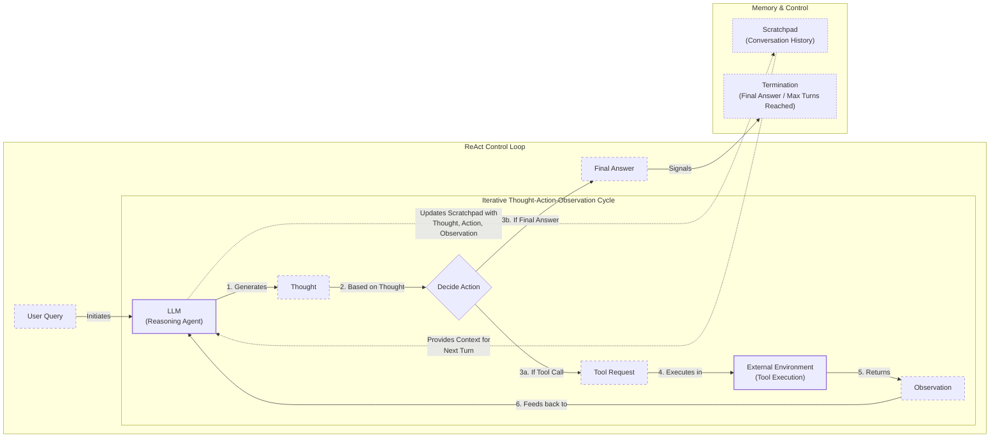

# Building a ReAct Agent From Scratch

In our last lesson, we covered the theory behind the ReAct pattern, learning how agents break down complex problems by cycling through a loop of Thought, Action, and Observation. Theory is essential, but as engineers, our goal is to build. This lesson is 100% practical: we are moving from the whiteboard to the code editor.

We will build a minimal ReAct agent from scratch using only Python and the Gemini API. You will implement the full loop: defining a mock tool, generating thoughts, selecting actions with function calling, executing the tool, and processing observations within a control loop. This hands-on approach will give you a concrete mental model of how these systems work. With a working agent in hand, you will have the foundation to debug, extend, and customize agents with confidence.

Here is what we will cover:
*   Setting up the environment and Gemini client.
*   Implementing a mock search tool for predictable testing.
*   Generating the "Thought" with a prompt template.
*   Using Gemini's function calling to decide on an "Action".
*   Building the control loop to orchestrate the cycle.
*   Testing our agent with success and failure cases.

## Setup and Environment

Before we build the agent, we need to set up our Python environment. The goal is to ensure the code runs seamlessly and that the outputs you see match the expected traces from our examples. This setup is straightforward and involves just a few steps.

1.  First, we load our environment variables. We will use a helper utility to load the `GOOGLE_API_KEY` needed to authenticate with the Gemini API.
    ```python
    from lessons.utils import env
    
    env.load(required_env_vars=["GOOGLE_API_KEY"])
    ```

2.  Next, we import the necessary libraries. We will use `google-genai` for interacting with the Gemini model, `pydantic` for data structures, and some utilities for printing outputs clearly.
    ```python
    import google.generativeai as genai
    from pydantic import BaseModel
    from enum import Enum
    from typing import List, Dict, Any
    from lessons.utils.pretty_print import pretty_print_conversation
    ```

3.  We initialize the Gemini client. If you have both a `GOOGLE_API_KEY` and a `GEMINI_API_KEY` set, the client may print a message indicating which one it is using.
    ```python
    client = genai.Client()
    ```

4.  Finally, we define the model we will use. For this lesson, `gemini-2.5-flash` is a great choice because it is fast, cost-effective, and supports all the features we need, like function calling.
    ```python
    MODEL_ID = "gemini-2.5-flash"
    ```
With the client and model ready, we can now define an external capability for our agent to use.

## Tool Layer: Mock Search Implementation

Our agent needs tools to interact with the world. Instead of calling a real API, we will implement a mock search tool. This approach has several benefits for learning: it simplifies our focus to the ReAct mechanics, removes external dependencies, and provides predictable responses, which is essential for testing.

The design philosophy is simple: create a Python function that simulates an external tool. The function’s docstring is critical, as modern LLMs use it to understand what the tool does and when to use it. This is a key principle of tool design: treat your tools as an "agent-computer interface" (ACI). Just as a human needs a well-designed user interface, an agent needs clear, well-documented tools to perform reliably [[1]](https://www.anthropic.com/engineering/building-effective-agents). This modular approach also makes the system extensible. In a production system, you could easily replace this mock `search` function with a real API call to Google Search, Wikipedia, or a domain-specific knowledge base, all while keeping the agent's reasoning logic the same [[2]](https://medium.com/google-cloud/building-react-agents-from-scratch-a-hands-on-guide-using-gemini-ffe4621d90ae).

1.  We implement a `search` function that takes a query string. It contains a dictionary of hardcoded responses for specific queries.
    ```python
    def search(query: str) -> str:
        """
        A mock search tool that returns predefined results for specific queries.
        """
        # A mock search engine with predefined responses
        mock_responses = {
            "capital of France": "Paris is the capital of France and is known for the Eiffel Tower.",
        }
    
        # Return the response if the query is in our mock database, otherwise return a 'not found' message.
        return mock_responses.get(query, f"Information about '{query}' was not found.")
    ```

2.  To make our tool system extensible, we create a registry. This dictionary maps the tool's name to its handler function. This pattern makes it easy to add more tools later without changing the agent's core logic.
    ```python
    TOOL_REGISTRY = {
        "search": search,
    }
    ```

## Thought Phase: Prompt Construction and Generation

The first step in the ReAct cycle is "Thought." This is the agent's internal monologue, where it reasons about the user's query and decides on a plan [[3]](https://www.ibm.com/think/topics/react-agent). We generate this thought by prompting the LLM with the conversation history and a list of available tools.

1.  We start by creating a helper function to format our tool descriptions into an XML block. This structured format helps the model clearly distinguish tools from other parts of the prompt [[4]](https://ai.google.dev/gemini-api/docs/prompting-strategies). Using explicit structures like XML tags is a recommended practice because it improves model adherence and makes the thought generation process more reliable. It creates clear boundaries between instructions, context, and data, reducing ambiguity and guiding the LLM to produce more predictable outputs.
    ```python
    def build_tools_xml_description(tool_registry: Dict[str, Any]) -> str:
        """
        Builds an XML string describing the available tools from a tool registry.
        """
        xml = "<tools>\n"
        for tool_name, tool_handler in tool_registry.items():
            xml += f"<tool name=\"{tool_name}\">\n"
            xml += f"<description>{tool_handler.__doc__}</description>\n"
            xml += "</tool>\n"
        xml += "</tools>"
        return xml
    
    
    tools_xml = build_tools_xml_description(TOOL_REGISTRY)
    ```

2.  Next, we define the prompt template for the thought-generation phase. It instructs the agent to analyze the conversation and available tools, then produce a single, concise thought about the next step. The `{conversation}` placeholder will be filled with the current interaction history.
    ```python
    PROMPT_TEMPLATE_THOUGHT = """
    You are a helpful assistant. Your goal is to assist the user with their question.
    You have access to the following tools:
    {tools_xml}
    
    The following is the conversation history.
    <conversation>
    {conversation}
    </conversation>
    
    Your task is to generate a single, concise thought about what to do next.
    Do not generate a tool call or a final answer. Just a thought.
    """
    ```
    Inspecting this prompt reveals the XML block with our `search` tool's description and the conversation placeholder.

3.  Finally, we create the `generate_thought` function. It formats the prompt with the current conversation and tool registry, calls the Gemini model, and returns the generated text.
    ```python
    def generate_thought(conversation: List[Dict[str, str]], tool_registry: Dict[str, Any]) -> str:
        """
        Generates a thought from the model based on the conversation history and available tools.
        """
        tools_xml = build_tools_xml_description(tool_registry)
        prompt = PROMPT_TEMPLATE_THOUGHT.format(
            conversation=conversation,
            tools_xml=tools_xml
        )
    
        response = client.models.generate_content(
            model=MODEL_ID,
            contents=prompt
        )
    
        return response.text.strip()
    ```
With a coherent thought generated, the agent must decide whether to call a tool to gather more information or conclude with a final answer.

## Action Phase: Function Calling and Parsing

The "Action" phase is where the agent decides what to do based on its thought. We will use Gemini's native function calling capability for this. This feature allows the model to signal its intent to use a tool and provide the necessary arguments, all in a structured format.

A key advantage of this approach is the separation of concerns. The system prompt for the action phase can focus on high-level strategic guidance because Gemini handles the technical tool details automatically. This is a significant improvement over first-generation ReAct agents that relied on parsing text-based actions, a process prone to errors and hallucinations. Modern function calling provides a more reliable and efficient way to execute tools [[5]](https://www.philschmid.de/langgraph-gemini-2-5-react-agent). When we provide Python functions to the `tools` configuration, their docstrings and type-hinted signatures are automatically converted into a schema the model can understand [[6]](https://ai.google.dev/gemini-api/docs/function-calling). This keeps our prompts clean and makes tool management much easier.

1.  We define a system prompt that instructs the agent to choose between calling a tool or providing a final answer.
    ```python
    PROMPT_TEMPLATE_ACTION = """
    You are a helpful assistant. Your goal is to assist the user with their question.
    The following is the conversation history.
    
    <conversation>
    {conversation}
    </conversation>
    
    Your task is to either call a tool to gather more information or provide a final answer.
    """
    ```

2.  We define an `Action` Pydantic model to represent the output of this phase. It will either contain a tool call request or a final answer. We also define a special constant, `ACTION_FINISH`, to signal completion.
    ```python
    class ToolCallRequest(BaseModel):
        name: str
        args: Dict[str, Any]
    
    
    class Action(BaseModel):
        tool_call_request: ToolCallRequest = None
        final_answer: str = None
    
    
    ACTION_FINISH = "finish"
    ```

3.  The `generate_action` function orchestrates this step. It formats the prompt, configures the Gemini client with our `search` tool, and calls the model. After getting the response, it parses the output. If the response contains a `function_call`, we extract its name and arguments into our `Action` model. If it is a plain text response, we treat it as the final answer. This logic handles the two possible outcomes of the action phase.
    ```python
    def generate_action(conversation: List[Dict[str, str]], tool_registry: Dict[str, Any]) -> Action:
        """
        Generates an action from the model based on the conversation history and available tools.
        """
        prompt = PROMPT_TEMPLATE_ACTION.format(conversation=conversation)
    
        response = client.models.generate_content(
            model=MODEL_ID,
            contents=prompt,
            tools=list(tool_registry.values())
        )
        
        message = response.candidates[0].content
        
        if hasattr(message.parts[0], "function_call"):
            function_call = message.parts[0].function_call
            tool_call_request = ToolCallRequest(
                name=function_call.name,
                args=dict(function_call.args)
            )
            return Action(tool_call_request=tool_call_request)
        elif message.parts[0].text:
            return Action(final_answer=message.parts[0].text)
        else:
            raise ValueError("Unknown action")
    ```

## Control Loop: Messages, Scratchpad, and Orchestration

Now we combine the "Thought" and "Action" phases into a control loop that orchestrates the entire ReAct cycle. This loop manages the conversation history, executes tools, processes observations, and continues until the task is complete or a turn limit is reached.

The foundation of our control loop is a structured message system. We define different message roles (`user`, `thought`, `tool_request`, `observation`, `final_answer`) to clearly track each step of the agent's process. This history, often called a "scratchpad," is crucial for providing context to the LLM in subsequent turns [[7]](https://www.decodingai.com/p/building-production-react-agents). This cycle is analogous to how humans solve problems: we think, act, observe the result, and then incorporate that feedback into our next thought [[8]](https://www.dailydoseofds.com/ai-agents-crash-course-part-10-with-implementation/). In a broader sense, this loop is a form of AI planning, where the agent assesses its current state and determines a sequence of actions to reach its goal [[9]](https://www.ibm.com/think/topics/ai-agent-planning).

Image 1: A flowchart illustrating the ReAct (Reasoning and Acting) control loop, showing the iterative Thought → Action → Observation cycle, including message roles, scratchpad, and termination conditions.


1.  First, we define our message structure using an `Enum` for roles and a `Pydantic` model for the message itself. This structured format enables clear tracking of the ReAct cycle.
    ```python
    class MessageRole(str, Enum):
        USER = "user"
        THOUGHT = "thought"
        TOOL_REQUEST = "tool_request"
        OBSERVATION = "observation"
        FINAL_ANSWER = "final_answer"
    
    
    class Message(BaseModel):
        role: MessageRole
        content: str
    ```

2.  The `react_agent_loop` function is the core of our agent. It takes an initial query, a tool registry, and a maximum number of turns. It initializes the scratchpad with the user's query and then enters a loop that runs for a set number of turns. Inside the loop, the agent first generates a thought and adds it to the scratchpad. Then, it generates an action.
    ```python
    def react_agent_loop(query: str, tool_registry: Dict[str, Any], max_turns: int = 5, verbose: bool = False):
        scratchpad = [Message(role=MessageRole.USER, content=query)]
    
        for i in range(max_turns):
            if verbose:
                print(f"React Agent Loop: Turn {i + 1}/{max_turns}")
                pretty_print_conversation(scratchpad)
            
            thought = generate_thought(
                conversation=[message.model_dump() for message in scratchpad],
                tool_registry=tool_registry
            )
            scratchpad.append(Message(role=MessageRole.THOUGHT, content=thought))
    
            action = generate_action(
                conversation=[message.model_dump() for message in scratchpad],
                tool_registry=tool_registry
            )
    
            if action.final_answer:
                scratchpad.append(Message(role=MessageRole.FINAL_ANSWER, content=action.final_answer))
                return scratchpad
            elif action.tool_call_request:
                scratchpad.append(Message(role=MessageRole.TOOL_REQUEST, content=action.tool_call_request.model_dump_json()))
                
                if action.tool_call_request.name in tool_registry:
                    tool_handler = tool_registry[action.tool_call_request.name]
                    try:
                        observation = tool_handler(**action.tool_call_request.args)
                    except Exception as e:
                        observation = f"Error executing tool {action.tool_call_request.name}: {e}"
                else:
                    observation = f"Tool {action.tool_call_request.name} not found."
                    
                scratchpad.append(Message(role=MessageRole.OBSERVATION, content=str(observation)))
    
        scratchpad.append(Message(role=MessageRole.FINAL_ANSWER, content="I'm sorry, but I couldn't find the answer."))
        return scratchpad
    ```
    If the action is a `final_answer`, the loop terminates and returns the result. If it is a `tool_call_request`, the agent executes the tool. The tool's output, whether a successful result or an error, is captured as an "Observation" and added to the scratchpad. This feedback is critical for the agent's next reasoning step [[10]](https://pub.towardsai.net/beyond-the-prompt-engineering-the-thought-action-observation-loop-2e1fd99114d2). If the loop reaches its maximum number of turns without producing a final answer, it forces a conclusion. This completes our ReAct agent implementation.

## Tests and Traces

To validate our agent, we will run it on two test cases: a simple factual query that should succeed and an unsupported query that should demonstrate graceful fallback. Analyzing the printed traces will confirm that the loop, tool integration, and termination logic are all working as designed.

First, we test a simple factual question: "What is the capital of France?"

1.  We call our loop with the query.
    ```python
    query = "What is the capital of France?"
    final_conversation = react_agent_loop(query=query, tool_registry=TOOL_REGISTRY, max_turns=2, verbose=True)
    ```

2.  The output trace shows the agent correctly reasons that it needs to search for the capital of France, calls the `search` tool, and uses the observation ("Paris is the capital...") to formulate the final answer in the next turn. This confirms the agent can successfully complete a task within the turn limit.

Next, we test an unsupported query: "What is the capital of Italy?" Our mock tool does not have a predefined answer for this, so we expect the agent to try, fail, and adapt its strategy before terminating.

1.  We run the loop with the new query.
    ```python
    query = "What is the capital of Italy?"
    final_conversation = react_agent_loop(query=query, tool_registry=TOOL_REGISTRY, max_turns=2, verbose=True)
    ```

2.  The trace reveals the agent's fallback behavior. After the first `search` call fails, the agent observes the "not found" message. In the second turn, it reasons about the failure and adopts a broader strategy, trying to search for just "Italy". When that also fails, the agent reaches its turn limit and provides a forced final answer, admitting it could not find the information. This test validates the agent's resilience and its ability to terminate gracefully when it cannot find an answer [[2]](https://medium.com/google-cloud/building-react-agents-from-scratch-a-hands-on-guide-using-gemini-ffe4621d90ae).

## Conclusion

In this lesson, we moved from theory to practice by building a complete, if minimal, ReAct agent from scratch. We implemented every part of the Thought-Action-Observation cycle: defining a tool, generating thoughts, using function calling to decide on actions, and orchestrating it all within a control loop that manages a scratchpad. This hands-on exercise provides a concrete mental model for how these autonomous systems operate under the hood.

Even if you end up using a framework like LangGraph in production, understanding these fundamental mechanics is a core skill for any AI Engineer. Such frameworks model agents as graphs, where nodes represent logic (like calling a model or a tool) and edges determine the next step, allowing for flexible and reliable control flow [[11]](https://ai.google.dev/gemini-api/docs/langgraph-example). You now have a baseline for extending agents with more sophisticated tools, memory systems, and reasoning patterns. In our next lessons, we will build on this foundation as we dive into agent memory and advanced Retrieval-Augmented Generation techniques.

## References

- [1] Building effective agents. (2024, December 19). Anthropic. https://www.anthropic.com/engineering/building-effective-agents
- [2] Shankar, A. (2024, May 21). Building ReAct Agents from Scratch using Gemini. Medium. https://medium.com/google-cloud/building-react-agents-from-scratch-a-hands-on-guide-using-gemini-ffe4621d90ae
- [3] ReAct Agent. (n.d.). IBM. https://www.ibm.com/think/topics/react-agent
- [4] Prompt design strategies. (n.d.). Google for Developers. https://ai.google.dev/gemini-api/docs/prompting-strategies
- [5] Schmid, P. (2024, May 22). ReAct agent from scratch with Gemini 2.5 and LangGraph. Phil Schmid. https://www.philschmid.de/langgraph-gemini-2-5-react-agent
- [6] Function calling. (n.d.). Google AI for Developers. https://ai.google.dev/gemini-api/docs/function-calling
- [7] Iusztin, P. (2024, August 26). Building Production ReAct Agents From Scratch Is Simple. Decoding AI. https://www.decodingai.com/p/building-production-react-agents
- [8] Implementing ReAct Agentic Pattern From Scratch. (n.d.). Daily Dose of DS. https://www.dailydoseofds.com/ai-agents-crash-course-part-10-with-implementation/
- [9] AI Agent Planning. (n.d.). IBM. https://www.ibm.com/think/topics/ai-agent-planning
- [10] Beyond the Prompt: Engineering the Thought-Action-Observation Loop. (2024, August 28). Towards AI. https://pub.towardsai.net/beyond-the-prompt-engineering-the-thought-action-observation-loop-2e1fd99114d2
- [11] ReAct agent from scratch with Gemini 2.5 and LangGraph. (n.d.). Google AI for Developers. https://ai.google.dev/gemini-api/docs/langgraph-example
</article>