# Building a ReAct Agent From Scratch

In our previous lesson, we explored the theory behind AI agent planning and reasoning, focusing on frameworks like ReAct. We learned that ReAct, short for "Reasoning and Acting," enables an LLM to solve complex tasks by interleaving thought generation, action execution, and observation processing. Abstract theory is a good start, but as engineers, we learn best by building.

This lesson is 100% practical. We will build a minimal ReAct agent from scratch using only Python and the Gemini API, following the code from our course notebook. By implementing the full Thought → Action → Observation cycle yourself, you will gain a concrete mental model of how these systems work. This hands-on experience is what separates production-grade AI from mere prototypes.

We will walk through setting up the environment, defining a mock tool, generating thoughts, selecting actions with function calling, and orchestrating the entire process in a control loop. Let's get started.

## Setup and Environment

First, we need to set up our Python environment to ensure our code runs smoothly and reproduces the expected behavior. This involves loading our API keys, importing the necessary libraries, and initializing the Gemini client.

1.  We start by loading our Google API key. Our course provides a small utility in `lessons.utils.env` to handle this.
    ```python
    from lessons.utils import env
    
    env.load(required_env_vars=["GOOGLE_API_KEY"])
    ```
    It outputs:
    ```text
    Both GOOGLE_API_KEY and GEMINI_API_KEY are set. Using GOOGLE_API_KEY.
    ```
2.  Next, we import the core packages we will use throughout the implementation, including Google's `genai` for the LLM, `pydantic` for data structures, and some standard Python libraries.
    ```python
    from enum import Enum
    from pydantic import BaseModel, Field
    from typing import List
    
    from google import genai
    from google.genai import types
    
    from lessons.utils import pretty_print
    ```
3.  We initialize the Gemini client and define the model we will use. We will use `gemini-2.5-flash`, which is fast and cost-effective for our simple example.
    ```python
    client = genai.Client()
    MODEL_ID = "gemini-2.5-flash"
    ```

With the client and model in place, we can now define an external capability for our agent to use.

## Tool Layer: Mock Search Implementation

As we learned in Lesson 6, tools give an agent the ability to take action and interact with the outside world. For this exercise, we will create a simple mock search tool instead of integrating a real API. This approach simplifies the learning process by removing external dependencies and API key requirements, allowing us to focus purely on the ReAct mechanics. It also provides predictable responses, which is ideal for testing and debugging.

Our mock `search` function is a simple Python function with a clear signature and a docstring that explains its purpose and arguments. This documentation is critical, as the LLM will use it to understand what the tool does and how to call it. The function returns predefined answers for specific queries and a generic "not found" message for anything else, simulating a real-world tool's fallback behavior.

1.  We define the `search` function.
    ```python
    def search(query: str) -> str:
        """Search for information about a specific topic or query.
    
        Args:
            query (str): The search query or topic to look up.
        """
        query_lower = query.lower()
    
        # Predefined responses for demonstration
        if all(word in query_lower for word in ["capital", "france"]):
            return "Paris is the capital of France and is known for the Eiffel Tower."
        elif "react" in query_lower:
            return "The ReAct (Reasoning and Acting) framework enables LLMs to solve complex tasks by interleaving thought generation, action execution, and observation processing."
    
        # Generic response for unhandled queries
        return f"Information about '{query}' was not found."
    ```
2.  We also create a `TOOL_REGISTRY` to map the tool's name to its function. This allows our agent to call the correct Python function based on the name provided by the LLM.
    ```python
    TOOL_REGISTRY = {
        search.__name__: search,
    }
    ```

In a production system, you could easily swap this mock function with a real API call to Google Search or a domain-specific knowledge base while keeping the function signature and docstring consistent. With a tool defined, the agent now needs to be able to *think* about when and how to use it.

## Thought Phase: Prompt Construction and Generation

The first step in the ReAct cycle is "Thought." This is the agent's internal monologue, where it reasons about the user's query and the available tools to decide on a plan. We generate this thought by prompting the LLM with the current conversation history and a description of the tools it can use.

1.  To let the model know which tools are available, we create a helper function that converts our `TOOL_REGISTRY` into a simple XML description. This format helps the LLM clearly distinguish the tools from other parts of the prompt [[9]](https://aws.amazon.com/blogs/machine-learning/structured-data-response-with-amazon-bedrock-prompt-engineering-and-tool-use/).
    ```python
    def build_tools_xml_description(tools: dict[str, callable]) -> str:
        """Build a minimal XML description of tools using only their docstrings."""
        lines = []
        for tool_name, fn in tools.items():
            doc = (fn.__doc__ or "").strip()
            lines.append(f"\t<tool name=\"{tool_name}\">")
            if doc:
                lines.append(f"\t\t<description>")
                for line in doc.split("\n"):
                    lines.append(f"\t\t\t{line}")
                lines.append(f"\t\t</description>")
            lines.append("\t</tool>")
        return "\n".join(lines)
    ```
2.  We then define a prompt template that instructs the model to state its next thought. The template includes placeholders for the tool descriptions and the conversation history.
    ```python
    tools_xml = build_tools_xml_description(TOOL_REGISTRY)
    
    PROMPT_TEMPLATE_THOUGHT = f"""
    You are deciding the next best step for reaching the user goal. You have some tools available to you.
    
    Available tools:
    <tools>
    {tools_xml}
    </tools>
    
    Conversation so far:
    <conversation>
    {{conversation}}
    </conversation>
    
    State your next thought about what to do next as one short paragraph focused on the next action you intend to take and why.
    Avoid repeating the same strategies that didn't work previously. Prefer different approaches.
    """.strip()
    ```
    The full prompt looks like this:
    ```text
    You are deciding the next best step for reaching the user goal. You have some tools available to you.
    
    Available tools:
    <tools>
    	<tool name="search">
    		<description>
    			Search for information about a specific topic or query.
    			
    			Args:
    			    query (str): The search query or topic to look up.
    		</description>
    	</tool>
    </tools>
    
    Conversation so far:
    <conversation>
    {conversation}
    </conversation>
    
    State your next thought about what to do next as one short paragraph focused on the next action you intend to take and why.
    Avoid repeating the same strategies that didn't work previously. Prefer different approaches.
    ```
3.  Finally, we implement the `generate_thought` function. It takes the current conversation, formats the prompt with the tool descriptions, and calls the Gemini model to produce the agent's next thought.
    ```python
    def generate_thought(conversation: str, tool_registry: dict[str, callable]) -> str:
        """Generate a thought as plain text (no structured output)."""
        tools_xml = build_tools_xml_description(tool_registry)
        prompt = PROMPT_TEMPLATE_THOUGHT.format(conversation=conversation, tools_xml=tools_xml)
    
        response = client.models.generate_content(
            model=MODEL_ID,
            contents=prompt
        )
        return response.text.strip()
    ```

A thought is just a plan. The next step is to translate that plan into a concrete action.

## Action Phase: Function Calling and Parsing

After generating a thought, the agent must decide on an "Action." This could be calling a tool to gather more information or, if it has enough context, providing a final answer to the user. We will use Gemini's native function calling capability to handle this decision-making process.

A key advantage of using a modern API like Gemini is that we do not need to include detailed tool signatures in our system prompt. Instead, we pass the Python tool functions directly to the model's configuration. The API automatically extracts the function's name, docstring (as its description), and parameter information from the function signature [[10]](https://ai.google.dev/gemini-api/docs/function-calling). This separation keeps our prompts clean and focused on strategic guidance rather than technical details.

1.  We define two Pydantic models, `ToolCallRequest` and `FinalAnswer`, to represent the two possible outcomes of the action phase.
    ```python
    class ToolCallRequest(BaseModel):
        """A request to call a tool with its name and arguments."""
        tool_name: str = Field(description="The name of the tool to call.")
        arguments: dict = Field(description="The arguments to pass to the tool.")
    
    
    class FinalAnswer(BaseModel):
        """A final answer to present to the user when no further action is needed."""
        text: str = Field(description="The final answer text to present to the user.")
    ```
2.  We create two prompt templates. The main one instructs the model to choose between a tool call and a final answer. A second, more direct prompt, `PROMPT_TEMPLATE_ACTION_FORCED`, is used to force a final answer when the agent reaches its turn limit.
    ```python
    PROMPT_TEMPLATE_ACTION = """
    You are selecting the best next action to reach the user goal.
    
    Conversation so far:
    <conversation>
    {conversation}
    </conversation>
    
    Respond either with a tool call (with arguments) or a final answer if you can confidently conclude.
    """.strip()
    
    # Dedicated prompt used when we must force a final answer
    PROMPT_TEMPLATE_ACTION_FORCED = """
    You must now provide a final answer to the user.
    
    Conversation so far:
    <conversation>
    {conversation}
    </conversation>
    
    Provide a concise final answer that best addresses the user's goal.
    """.strip()
    ```
3.  The `generate_action` function orchestrates this phase. It sends the appropriate prompt and the available tools to Gemini. The model's response will either be a `function_call` object, which we parse into our `ToolCallRequest` model, or a plain text response, which we treat as a `FinalAnswer`.
    ```python
    def generate_action(conversation: str, tool_registry: dict[str, callable] | None = None, force_final: bool = False) -> (ToolCallRequest | FinalAnswer):
        """Generate an action by passing tools to the LLM and parsing function calls or final text.
    
        When force_final is True or no tools are provided, the model is instructed to produce a final answer and tool calls are disabled.
        """
        # Use a dedicated prompt when forcing a final answer or no tools are provided
        if force_final or not tool_registry:
            prompt = PROMPT_TEMPLATE_ACTION_FORCED.format(conversation=conversation)
            response = client.models.generate_content(
                model=MODEL_ID,
                contents=prompt
            )
            return FinalAnswer(text=response.text.strip())
    
        # Default action prompt
        prompt = PROMPT_TEMPLATE_ACTION.format(conversation=conversation)
    
        # Provide the available tools to the model; disable auto-calling so we can parse and run ourselves
        tools = list(tool_registry.values())
        config = types.GenerateContentConfig(
            tools=tools,
            automatic_function_calling={"disable": True}
        )
        response = client.models.generate_content(
            model=MODEL_ID,
            contents=prompt,
            config=config
        )
    
        # Extract the function call from the response (if present)
        candidate = response.candidates[0]
        parts = candidate.content.parts
        if parts and getattr(parts[0], "function_call", None):
            name = parts[0].function_call.name
            args = dict(parts[0].function_call.args) if parts[0].function_call.args is not None else {}
            return ToolCallRequest(tool_name=name, arguments=args)
        
        # Otherwise, it's a final answer
        final_answer = "".join(part.text for part in candidate.content.parts)
        return FinalAnswer(text=final_answer.strip())
    ```

We have the individual components for thinking and acting. Now we need to orchestrate them in a continuous loop.

## Control Loop: Messages, Scratchpad, and Orchestration

The control loop is the engine that drives the ReAct agent, orchestrating the Thought → Action → Observation cycle. It manages the conversation history, executes tool calls, and feeds the results back to the agent for the next round of reasoning. We will build this loop around a central "scratchpad" that tracks every step of the agent's process.

1.  First, we define a structured way to represent each step in the conversation. The `MessageRole` enum categorizes each message as a user input, an internal thought, a tool request, an observation from a tool, or a final answer. The `Message` class encapsulates this, providing a consistent format for our history.
    ```python
    class MessageRole(str, Enum):
        """Enumeration for the different roles a message can have."""
        USER = "user"
        THOUGHT = "thought"
        TOOL_REQUEST = "tool request"
        OBSERVATION = "observation"
        FINAL_ANSWER = "final answer"
    
    
    class Message(BaseModel):
        """A message with a role and content, used for all message types."""
        role: MessageRole = Field(description="The role of the message in the ReAct loop.")
        content: str = Field(description="The textual content of the message.")
    
        def __str__(self) -> str:
            """Provides a user-friendly string representation of the message."""
            return f"{self.role.value.capitalize()}: {self.content}"
    ```
2.  A `Scratchpad` class manages a list of these `Message` objects. It appends new messages as the agent progresses and can serialize the entire history into a string for the LLM's context. This scratchpad serves as the agent's short-term memory.
    ```python
    class Scratchpad:
        """Container for ReAct messages with optional pretty-print on append."""
    
        def __init__(self, max_turns: int) -> None:
            self.messages: List[Message] = []
            self.max_turns: int = max_turns
            self.current_turn: int = 1
    
        def set_turn(self, turn: int) -> None:
            self.current_turn = turn
    
        def append(self, message: Message, verbose: bool = False, is_forced_final_answer: bool = False) -> None:
            self.messages.append(message)
            if verbose:
                # Pretty-printing logic omitted for brevity
                pass
    
        def to_string(self) -> str:
            return "\n".join(str(m) for m in self.messages)
    ```
3.  The `react_agent_loop` function brings everything together. It initializes the scratchpad with the user's question and then enters a loop for a predefined number of turns. In each turn, it generates a thought, then an action. If the action is a `FinalAnswer`, the loop terminates. If it is a `ToolCallRequest`, the loop executes the corresponding tool, captures the output as an "Observation," adds it to the scratchpad, and continues to the next turn. This cycle repeats until the task is complete or the maximum number of turns is reached, at which point it forces a final answer.
    ```python
    def react_agent_loop(initial_question: str, tool_registry: dict[str, callable], max_turns: int = 5, verbose: bool = False) -> str:
        """
        Implements the main ReAct (Thought -> Action -> Observation) control loop.
        Uses a unified message class for the scratchpad.
        """
        scratchpad = Scratchpad(max_turns=max_turns)
    
        # Add the user's question to the scratchpad
        user_message = Message(role=MessageRole.USER, content=initial_question)
        scratchpad.append(user_message, verbose=verbose)
    
        for turn in range(1, max_turns + 1):
            scratchpad.set_turn(turn)
    
            # Generate a thought based on the current scratchpad
            thought_content = generate_thought(
                scratchpad.to_string(),
                tool_registry,
            )
            thought_message = Message(role=MessageRole.THOUGHT, content=thought_content)
            scratchpad.append(thought_message, verbose=verbose)
    
            # Generate an action based on the current scratchpad
            action_result = generate_action(
                scratchpad.to_string(),
                tool_registry=tool_registry,
            )
    
            # If the model produced a final answer, return it
            if isinstance(action_result, FinalAnswer):
                final_answer = action_result.text
                final_message = Message(role=MessageRole.FINAL_ANSWER, content=final_answer)
                scratchpad.append(final_message, verbose=verbose)
                return final_answer
    
            # Otherwise, it is a tool request
            if isinstance(action_result, ToolCallRequest):
                action_name = action_result.tool_name
                action_params = action_result.arguments
    
                # Add the action to the scratchpad
                params_str = ", ".join([f"{k}='{v}'" for k, v in action_params.items()])
                action_content = f"{action_name}({params_str})"
                action_message = Message(role=MessageRole.TOOL_REQUEST, content=action_content)
                scratchpad.append(action_message, verbose=verbose)
    
                # Run the action and get the observation
                observation_content = ""
                tool_function = tool_registry[action_name]
                try:
                    observation_content = tool_function(**action_params)
                except Exception as e:
                    observation_content = f"Error executing tool '{action_name}': {e}"
    
                # Add the observation to the scratchpad
                observation_message = Message(role=MessageRole.OBSERVATION, content=observation_content)
                scratchpad.append(observation_message, verbose=verbose)
    
            # Check if the maximum number of turns has been reached. If so, force the action selector to produce a final answer
            if turn == max_turns:
                forced_action = generate_action(
                    scratchpad.to_string(),
                    force_final=True,
                )
                if isinstance(forced_action, FinalAnswer):
                    final_answer = forced_action.text
                else:
                    final_answer = "Unable to produce a final answer within the allotted turns."
                final_message = Message(role=MessageRole.FINAL_ANSWER, content=final_answer)
                scratchpad.append(final_message, verbose=verbose, is_forced_final_answer=True)
                return final_answer
    ```

Image 1 illustrates this entire flow, showing how user input kicks off a cycle of thought, action, and observation, with the scratchpad at the center of it all.

```mermaid
flowchart LR
  %% Start of the ReAct Agent Loop
  subgraph "ReAct Agent Loop (react_agent_loop function)"
    A["User Question"] --> B["Thought<br/>(LLM generates thought)"]
    B --> C{"Decision: Final Answer?"}
    C -- "No" --> D["Action<br/>(Tool Request)"]
    D --> E["Tool Execution"]
    E --> F["Observation<br/>(Tool Output)"]
    F --> B
    C -- "Yes" --> G["Final Answer"]

    E -- "Tool Failure / Unknown Tool" --> H["Error Handling"]
    H --> B
    H --> G

    subgraph "Loop Termination Check"
      I{"Max Turns Reached?"}
      I -- "Yes" --> G
      I -- "No" -.-> B
    end
  end

  %% Scratchpad as a central element
  subgraph "Scratchpad & Memory"
    J["Scratchpad<br/>(Stores Message objects: USER, THOUGHT, TOOL_REQUEST, OBSERVATION, FINAL_ANSWER)"]
  end

  %% Information flow to/from Scratchpad
  A -. "adds MessageRole.USER" .-> J
  B -. "adds MessageRole.THOUGHT" .-> J
  D -. "adds MessageRole.TOOL_REQUEST" .-> J
  F -. "adds MessageRole.OBSERVATION" .-> J
  G -. "adds MessageRole.FINAL_ANSWER" .-> J
  J -. "provides history" .-> B
  J -. "provides history" .-> D
  J -. "provides history" .-> H

  %% Class Definitions for visual styling
  classDef process stroke-width:2px
  classDef decision stroke-width:2px
  classDef memory stroke-dasharray:3,3
  classDef termination stroke-width:2px

  class B,D,E,F process
  class C,I decision
  class J memory
  class G,H termination
```
Image 1: A flowchart illustrating the ReAct control loop, emphasizing the iterative Thought → Action → Observation cycle, the role of the Scratchpad, and loop termination conditions.

With the full loop implemented, let's test it to see how it performs in both successful and failure scenarios.

## Tests and Traces: Success and Graceful Fallback

To validate our ReAct agent, we will run two test cases. The first is a simple factual question to demonstrate a successful execution path. The second is a query that our mock tool cannot answer, demonstrating the agent's ability to handle failure gracefully and terminate correctly.

Our first test asks, "What is the capital of France?". We set `max_turns=2`.
```python
# A straightforward question requiring a search.
question = "What is the capital of France?"
final_answer = react_agent_loop(question, TOOL_REGISTRY, max_turns=2, verbose=True)
```
The agent’s trace shows a clear, logical progression. In the first turn, it thinks about using the `search` tool, makes the tool request `search(query='capital of France')`, and receives the observation "Paris is the capital of France...". In the second turn, it recognizes it has the answer and provides the final, correct response: "Paris is the capital of France." This confirms that the core loop, tool execution, and final answer generation are working as expected.

Our second test uses a query our mock tool is not programmed to handle: "What is the capital of Italy?".
```python
# An unsupported question to test fallback behavior.
question = "What is the capital of Italy?"
final_answer = react_agent_loop(question, TOOL_REGISTRY, max_turns=2, verbose=True)
```
In this case, the agent again tries the `search` tool but receives the observation "Information about 'capital of Italy' was not found." In the second turn, it demonstrates adaptive reasoning by trying a broader strategy: searching for just "Italy". When this also fails, the agent reaches the `max_turns` limit. The control loop then triggers the forced final answer mechanism, and the agent concludes gracefully: "I'm sorry, but I couldn't find information about the capital of Italy." This test validates the agent's resilience and its ability to terminate cleanly when it cannot find an answer.

Image 2 illustrates these two distinct execution paths.

```mermaid
flowchart LR
  %% Test Case 1: Successful Execution
  subgraph "Test Case 1: Successful Execution"
    TC1_Start["User Query:<br/>'What is the capital of France?'"]
    TC1_Thought1["Thought:<br/>Use `search` tool for a factual lookup"]
    TC1_ToolReq1["Tool request:<br/>`search(query='capital of France')`"]
    TC1_Obs1["Observation:<br/>'Paris is the capital of France and is known for the Eiffel Tower.'"]
    TC1_Thought2["Thought:<br/>Summarize"]
    TC1_FinalAnswer["Final answer:<br/>'Paris is the capital of France.'"]

    TC1_Start -- "initiates" --> TC1_Thought1
    TC1_Thought1 -- "executes" --> TC1_ToolReq1
    TC1_ToolReq1 -- "returns" --> TC1_Obs1
    TC1_Obs1 -- "leads to" --> TC1_Thought2
    TC1_Thought2 -- "provides" --> TC1_FinalAnswer
  end

  %% Test Case 2: Graceful Fallback
  subgraph "Test Case 2: Graceful Fallback"
    TC2_Start["User Query:<br/>'What is the capital of Italy?'"]
    TC2_Thought1["Thought:<br/>Initial search strategy"]
    TC2_ToolReq1["Tool request:<br/>`search(query='capital of Italy')`"]
    TC2_Obs1["Observation:<br/>'Information about 'capital of Italy' was not found.'"]
    TC2_Thought2["Thought:<br/>Adopt broader strategy"]
    TC2_ToolReq2["Tool request:<br/>`search(query='Italy')`"]
    TC2_Obs2["Observation:<br/>'Information about 'Italy' was not found.'"]
    TC2_FinalAnswer["Final answer (Forced):<br/>'I'm sorry, but I couldn't find information about the capital of Italy.'"]

    TC2_Start -- "initiates" --> TC2_Thought1
    TC2_Thought1 -- "executes" --> TC2_ToolReq1
    TC2_ToolReq1 -- "returns" --> TC2_Obs1
    TC2_Obs1 -- "triggers" --> TC2_Thought2
    TC2_Thought2 -- "re-executes" --> TC2_ToolReq2
    TC2_ToolReq2 -- "returns" --> TC2_Obs2
    TC2_Obs2 -- "concludes with" --> TC2_FinalAnswer
  end
```


Image 2: A flowchart illustrating two distinct test cases for the ReAct agent: a successful execution and a graceful fallback.

These tests confirm our agent behaves as expected, providing a solid foundation for adding more complex tools and reasoning patterns in future lessons.

## Conclusion

In this lesson, we moved from theory to practice by building a minimal but fully functional ReAct agent from scratch. We implemented the complete Thought-Action-Observation cycle, from defining a tool and generating thoughts to orchestrating the flow within a control loop. This hands-on exercise provides a clear mental model of how reasoning agents operate under the hood.

This foundation is essential for any AI engineer. Understanding these core mechanics allows you to debug, customize, and extend agentic systems with confidence. In our upcoming lessons, we will build upon this foundation to explore more advanced topics, including how agents use different types of memory to retain knowledge (Lesson 9) and how they leverage advanced Retrieval-Augmented Generation (RAG) techniques to access vast information stores (Lesson 10).

## References

- [1] Yao, S., Zhao, J., Yu, D., Du, N., Shafran, I., Narasimhan, K., & Cao, Y. (2022). ReAct: Synergizing Reasoning and Acting in Language Models. arXiv. https://arxiv.org/pdf/2210.03629
- [2] ReAct Agent. (n.d.). IBM. https://www.ibm.com/think/topics/react-agent
- [3] AI agent planning. (n.d.). IBM. https://www.ibm.com/think/topics/ai-agent-planning
- [4] Building effective agents. (2024, December 19). Anthropic. https://www.anthropic.com/engineering/building-effective-agents
- [5] ReAct agent from scratch with Gemini 2.5 and LangGraph. (n.d.). Google AI for Developers. https://ai.google.dev/gemini-api/docs/langgraph-example
- [6] Ferrag, M. A., Tihanyi, N., & Debbah, M. (2025). From LLM Reasoning to Autonomous AI Agents: A Comprehensive Review. arXiv. https://arxiv.org/pdf/2504.19678
- [7] Shankar, A. (2024, June 25). Building ReAct Agents from Scratch using Gemini. Medium. https://medium.com/google-cloud/building-react-agents-from-scratch-a-hands-on-guide-using-gemini-ffe4621d90ae
- [8] AI Agent Orchestration. (n.d.). IBM. https://www.ibm.com/think/topics/ai-agent-orchestration
- [9] Structured data response with Amazon Bedrock: Prompt Engineering and Tool Use. (2025, June 26). Amazon Web Services. https://aws.amazon.com/blogs/machine-learning/structured-data-response-with-amazon-bedrock-prompt-engineering-and-tool-use/
- [10] Function calling. (n.d.). Google AI for Developers. https://ai.google.dev/gemini-api/docs/function-calling