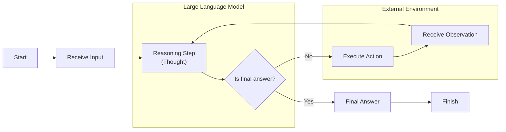

# Lesson 8: Building a ReAct Agent from Scratch

In our last lesson, we explored the theory behind AI agent reasoning, focusing on frameworks like Reasoning and Acting (ReAct) that enable models to think and act [[2]](https://arxiv.org/pdf/2210.03629). Theory is essential, but there is no substitute for building. True understanding comes from getting your hands dirty and seeing how these abstract concepts translate into working code.

This lesson is 100% practical. We will build a minimal ReAct agent from the ground up using only Python and the Gemini API. You will implement the complete Thought → Action → Observation loop, from defining a mock tool to orchestrating the entire turn-based cycle. By constructing this system yourself, you will gain a concrete mental model of how agents function, which is an essential skill for debugging, customizing, and extending them with confidence.

We will walk through setting up the environment, defining a tool, implementing the thought and action phases, building the control loop, and finally, testing our agent’s ability to handle both successful queries and graceful fallbacks.

## Setup and Environment

First, we need to set up our Python environment to ensure the code runs smoothly and our outputs match the expected traces. This involves loading our API key, importing the necessary packages, and initializing the Gemini client. For this lesson, we will follow the code from the associated notebook [[1]](https://github.com/towardsai/course-ai-agents/blob/dev/lessons/08_react_practice/notebook.ipynb).

1.  We start by loading our Google API key. Our course provides a utility function, `env.load`, that securely loads credentials from a local `.env` file. This is a best practice for managing sensitive keys, as it keeps them out of your source code and makes your application more portable.
    ```python
    from lessons.utils import env
    
    env.load(required_env_vars=["GOOGLE_API_KEY"])
    ```
    It outputs:
    ```text
    Trying to load environment variables from ...
    Environment variables loaded successfully.
    ```
2.  Next, we import the key packages. `google-genai` is Google's official Python SDK for the Gemini API. We also import `pydantic` for data modeling, which we will use to define structured data classes for our agent's actions, a concept we covered in Lesson 4.
    ```python
    from enum import Enum
    from pydantic import BaseModel, Field
    from typing import List
    
    from google import genai
    from google.genai import types
    
    from lessons.utils import pretty_print
    ```
3.  We initialize the Gemini client, which will automatically detect and use the API key we loaded earlier.
    ```python
    client = genai.Client()
    ```
    It outputs:
    ```text
    Both GOOGLE_API_KEY and GEMINI_API_KEY are set. Using GOOGLE_API_KEY.
    ```
4.  Finally, we define the model we will use. We will use `gemini-2.5-flash`, a model optimized for speed and cost-effectiveness, making it a great choice for development and learning exercises like this one.
    ```python
    MODEL_ID = "gemini-2.5-flash"
    ```
With the client and model in place, we can now define an external capability for our agent to use.

## Tool Layer: Mock Search Implementation

As we learned in Lesson 6, tools give an agent the ability to interact with the outside world. For this exercise, we will create a simple mock `search` tool instead of integrating a real API. This approach is educationally valuable because it provides a controlled environment, allowing us to isolate and understand the agent's reasoning loop without the noise of network latency or inconsistent API responses [[3]](https://medium.com/google-cloud/building-react-agents-from-scratch-a-hands-on-guide-using-gemini-ffe4621d90ae). It simplifies our focus to the core ReAct mechanics and makes our tests predictable and repeatable.

Our mock tool is a simple Python function. The docstring is especially important, as it provides the description the LLM will use to understand what the tool does and how to use it. The function simulates a search by returning predefined answers for specific queries and a generic "not found" message for anything else. This fallback behavior is useful for testing how the agent handles failed actions.

```python
def search(query: str) -> str:
    """Search for information about a specific topic or query.

    Args:
        query (str): The search query or topic to look up.
    """
    query_lower = query.lower()

    # Predefined responses for demonstration
    if all(word in query_lower for word in ["capital", "france"]):
        return "Paris is the capital of France and is known for the Eiffel Tower."
    elif "react" in query_lower:
        return "The ReAct (Reasoning and Acting) framework enables LLMs to solve complex tasks by interleaving thought generation, action execution, and observation processing."

    # Generic response for unhandled queries
    return f"Information about '{query}' was not found."
```
We also create a `TOOL_REGISTRY` to map the tool's name to its function. This allows the agent to safely call the correct Python function based on the name provided by the LLM.

```python
TOOL_REGISTRY = {
    search.__name__: search,
}
```
In a production system, you could easily swap this mock function with a call to a real Google Search or Wikipedia API while preserving the function signature and docstring [[4]](https://medium.com/google-cloud/building-react-agents-from-scratch-a-hands-on-guide-using-gemini-ffe4621d90ae). This modularity is a core principle of good agent design. With a tool defined, let's build the agent's reasoning component: the "Thought" phase.

## Thought Phase: Prompt Construction and Generation

The first step in the ReAct loop is "Thought," where the agent generates an internal monologue to decide its next move. This is driven by a carefully crafted prompt that provides the agent with its goal, the tools at its disposal, and the conversation history. This step is pure reasoning; the agent is only forming a plan, not yet committing to a specific action.

1.  We create a function, `build_tools_xml_description`, to convert our tool's docstring into a simple XML format. Using a structured format like XML is a key prompting strategy for models like Gemini. Official documentation notes that tags help the model distinguish between instructions, context, and tasks, which supports better reasoning [[5]](https://ai.google.dev/gemini-api/docs/prompting-strategies). This creates unambiguous boundaries for the model, improving prompt clarity and ensuring the agent can effectively interpret the tools at its disposal [[6]](https://www.linkedin.com/posts/hemantkchitale_tim-warner-suggests-using-xml-to-structure-activity-7412500662871220224-NQSB). We then insert this XML into our `PROMPT_TEMPLATE_THOUGHT`. The template also includes a placeholder for the conversation history, which allows the agent to consider past interactions when planning its next step.
    ```python
    def build_tools_xml_description(tools: dict[str, callable]) -> str:
        """Build a minimal XML description of tools using only their docstrings."""
        lines = []
        for tool_name, fn in tools.items():
            doc = (fn.__doc__ or "").strip()
            lines.append(f"\t<tool name=\"{tool_name}\">")
            if doc:
                lines.append(f"\t\t<description>")
                for line in doc.split("\n"):
                    lines.append(f"\t\t\t{line}")
                lines.append(f"\t\t</description>")
            lines.append("\t</tool>")
        return "\n".join(lines)
    
    tools_xml = build_tools_xml_description(TOOL_REGISTRY)
    
    PROMPT_TEMPLATE_THOUGHT = f"""
    You are deciding the next best step for reaching the user goal. You have some tools available to you.
    
    Available tools:
    <tools>
    {tools_xml}
    </tools>
    
    Conversation so far:
    <conversation>
    {{conversation}}
    </conversation>
    
    State your next thought about what to do next as one short paragraph focused on the next action you intend to take and why.
    Avoid repeating the same strategies that didn't work previously. Prefer different approaches.
    """.strip()
    ```
2.  Inspecting the full prompt reveals how the tool description and conversation history are structured as context for the LLM.
    ```python
    print(PROMPT_TEMPLATE_THOUGHT)
    ```
    It outputs:
    ```text
    You are deciding the next best step for reaching the user goal. You have some tools available to you.

    Available tools:
    <tools>
        <tool name="search">
            <description>
                Search for information about a specific topic or query.
                
                Args:
                    query (str): The search query or topic to look up.
            </description>
        </tool>
    </tools>
    
    Conversation so far:
    <conversation>
    {conversation}
    </conversation>
    
    State your next thought about what to do next as one short paragraph focused on the next action you intend to take and why.
    Avoid repeating the same strategies that didn't work previously. Prefer different approaches.
    ```
3.  The `generate_thought` function serves as the agent's "inner voice." It formats the prompt with the current conversation history and calls the Gemini model to produce the agent's next thought. This function is the core of the reasoning phase, translating the agent's accumulated context into a strategic, human-readable plan for the next action.
    ```python
    def generate_thought(conversation: str, tool_registry: dict[str, callable]) -> str:
        """Generate a thought as plain text (no structured output)."""
        tools_xml = build_tools_xml_description(tool_registry)
        prompt = PROMPT_TEMPLATE_THOUGHT.format(conversation=conversation, tools_xml=tools_xml)
    
        response = client.models.generate_content(
            model=MODEL_ID,
            contents=prompt
        )
        return response.text.strip()
    ```
A thought is just a plan. The next step is to turn that plan into a concrete "Action."

## Action Phase: Function Calling and Parsing

After thinking, the agent must decide on an "Action." This could be calling a tool or, if it has enough information, providing a final answer. We will use Gemini's native function calling capabilities to handle this decision [[7]](https://ai.google.dev/gemini-api/docs/function-calling).

### System Prompt Strategy

Our prompt for the action phase is intentionally simple. It focuses on the high-level goal: select the best next action. Unlike the thought prompt, it does not need to include detailed tool descriptions. This is because we will leverage Gemini's native tool integration.

### Automatic Tool Integration

A key advantage of modern LLM APIs is their ability to handle tool information automatically. Instead of manually formatting tool signatures into the prompt, we pass the Python tool functions directly to the `tools` parameter in the `generate_content` call. The Gemini client automatically parses these functions, extracts their name, docstring (as the description), and parameters, and makes this information available to the model. This separation of concerns keeps our prompt clean and focused on strategic guidance, making tool management much easier.

### Function Calling Implementation and Response Parsing

1.  We define two prompt templates. The main one, `PROMPT_TEMPLATE_ACTION`, instructs the model to choose between a tool call and a final answer. The second, `PROMPT_TEMPLATE_ACTION_FORCED`, is a fallback used to ensure the agent provides a concluding response when it reaches its turn limit.
    ```python
    PROMPT_TEMPLATE_ACTION = """
    You are selecting the best next action to reach the user goal.
    
    Conversation so far:
    <conversation>
    {conversation}
    </conversation>
    
    Respond either with a tool call (with arguments) or a final answer if you can confidently conclude.
    """.strip()
    
    PROMPT_TEMPLATE_ACTION_FORCED = """
    You must now provide a final answer to the user.
    
    Conversation so far:
    <conversation>
    {conversation}
    </conversation>
    
    Provide a concise final answer that best addresses the user's goal.
    """.strip()
    ```
2.  We also define Pydantic models to represent the two possible outcomes: a `ToolCallRequest` or a `FinalAnswer`. This use of structured outputs, which we covered in Lesson 4, ensures the model's response is predictable and easy to parse.
    ```python
    class ToolCallRequest(BaseModel):
        """A request to call a tool with its name and arguments."""
        tool_name: str = Field(description="The name of the tool to call.")
        arguments: dict = Field(description="The arguments to pass to the tool.")
    
    
    class FinalAnswer(BaseModel):
        """A final answer to present to the user when no further action is needed."""
        text: str = Field(description="The final answer text to present to the user.")
    ```
3.  The `generate_action` function orchestrates this phase. It selects the appropriate prompt, passes the available tools to the Gemini API, and parses the response. The parsing logic checks if the model's response contains a `function_call` object. If it does, we extract the name and arguments and return a `ToolCallRequest`. If not, we treat the plain text response as a `FinalAnswer`.
    ```python
    def generate_action(conversation: str, tool_registry: dict[str, callable] | None = None, force_final: bool = False) -> (ToolCallRequest | FinalAnswer):
        """Generate an action by passing tools to the LLM and parsing function calls or final text.
    
        When force_final is True or no tools are provided, the model is instructed to produce a final answer and tool calls are disabled.
        """
        if force_final or not tool_registry:
            prompt = PROMPT_TEMPLATE_ACTION_FORCED.format(conversation=conversation)
            response = client.models.generate_content(
                model=MODEL_ID,
                contents=prompt
            )
            return FinalAnswer(text=response.text.strip())
    
        prompt = PROMPT_TEMPLATE_ACTION.format(conversation=conversation)
    
        tools = list(tool_registry.values())
        config = types.GenerateContentConfig(
            tools=tools,
            automatic_function_calling={"disable": True}
        )
        response = client.models.generate_content(
            model=MODEL_ID,
            contents=prompt,
            config=config
        )
    
        candidate = response.candidates[0]
        parts = candidate.content.parts
        if parts and getattr(parts[0], "function_call", None):
            name = parts[0].function_call.name
            args = dict(parts[0].function_call.args) if parts[0].function_call.args is not None else {}
            return ToolCallRequest(tool_name=name, arguments=args)
        
        final_answer = "".join(part.text for part in candidate.content.parts)
        return FinalAnswer(text=final_answer.strip())
    ```
### Error Handling
The `force_final` flag provides a simple but effective error-handling mechanism. It acts as a safeguard, allowing us to gracefully terminate the agent's loop if it reaches a maximum number of iterations. This prevents infinite loops and ensures the user always receives a concluding response, even if the agent cannot fully solve the task.

Now that we have implemented the Thought and Action phases, we can combine them into a functioning control loop.

## Control Loop: Messages, Scratchpad, and Orchestration

The control loop is the engine that drives the ReAct agent. It orchestrates the iterative Thought → Action → Observation cycle, managing the conversation history, executing actions, and processing feedback to allow the agent to reason step-by-step.


Image 1: A flowchart illustrating the ReAct control loop with iterative Thought, Action, and Observation phases, delineated by Large Language Model and External Environment components.

### Message Structure and Scratchpad

1.  To manage the conversation state, we first define a structured message system. The `MessageRole` enum categorizes each part of the interaction (e.g., `USER`, `THOUGHT`, `TOOL_REQUEST`), and the `Message` Pydantic model ensures each entry has a consistent format. This structure is fundamental for tracking the agent's process clearly.
    ```python
    class MessageRole(str, Enum):
        """Enumeration for the different roles a message can have."""
        USER = "user"
        THOUGHT = "thought"
        TOOL_REQUEST = "tool request"
        OBSERVATION = "observation"
        FINAL_ANSWER = "final answer"
    
    
    class Message(BaseModel):
        """A message with a role and content, used for all message types."""
        role: MessageRole = Field(description="The role of the message in the ReAct loop.")
        content: str = Field(description="The textual content of the message.")
    
        def __str__(self) -> str:
            """Provides a user-friendly string representation of the message."""
            return f"{self.role.value.capitalize()}: {self.content}"
    ```
2.  Next, we create a `Scratchpad` class to act as the agent's short-term memory. It stores a list of `Message` objects, tracks the current turn, and includes a helper method to pretty-print the agent's trace, making it easy to follow the reasoning process.

    This concept of a scratchpad is a direct parallel to the idea of working memory in human cognition. It functions as the agent's mental workspace, a temporary place to hold intermediate results, observations, and its own internal thoughts across multiple steps of a task [[8]](https://dev.to/sreeni5018/the-5-types-of-ai-agent-memory-every-developer-needs-to-know-part-1-52fn). Without this working memory, the agent would lose track of its progress. The scratchpad is what makes complex, multi-step reasoning and coherent dialogue feasible for the agent [[9]](https://cobusgreyling.substack.com/p/three-types-of-ai-agent-memory).
    ```python
    class Scratchpad:
        """Container for ReAct messages with optional pretty-print on append."""
    
        def __init__(self, max_turns: int) -> None:
            self.messages: List[Message] = []
            self.max_turns: int = max_turns
            self.current_turn: int = 1
    
        def set_turn(self, turn: int) -> None:
            self.current_turn = turn
    
        def append(self, message: Message, verbose: bool = False, is_forced_final_answer: bool = False) -> None:
            self.messages.append(message)
            if verbose:
                # Pretty printing logic is omitted for brevity
                ...
    
        def to_string(self) -> str:
            return "\n".join(str(m) for m in self.messages)
    ```
### Control Loop Architecture and Observation Processing
3.  The `react_agent_loop` function brings everything together. It initializes the scratchpad with the user's question and then enters a loop that runs for a maximum number of turns. In each turn, it generates a thought, decides on an action, and processes the result.
    -   First, the scratchpad is initialized and the initial user question is added.
    -   The `for` loop iterates up to `max_turns`. Inside, the agent generates a `thought` based on the entire conversation history.
    -   Next, it generates an `action`. If the model returns a `FinalAnswer`, the loop terminates and returns the answer.
    -   If it's a `ToolCallRequest`, the loop looks up the tool in the `TOOL_REGISTRY` and executes it. The tool's output is captured as an `Observation` and appended to the scratchpad. This feedback is critical for the next reasoning cycle. The `try...except` block ensures that if a tool fails, the error is captured as an observation, allowing the agent to reason about the failure in the next turn.
    -   Finally, if the loop reaches its `max_turns` limit, it calls `generate_action` one last time with `force_final=True`. This is a crucial safeguard against infinite loops, ensuring the agent always terminates with a concluding response [[10]](https://stevekinney.com/writing/agent-loops).
    ```python
    def react_agent_loop(initial_question: str, tool_registry: dict[str, callable], max_turns: int = 5, verbose: bool = False) -> str:
        """
        Implements the main ReAct (Thought -> Action -> Observation) control loop.
        """
        scratchpad = Scratchpad(max_turns=max_turns)
    
        user_message = Message(role=MessageRole.USER, content=initial_question)
        scratchpad.append(user_message, verbose=verbose)
    
        for turn in range(1, max_turns + 1):
            scratchpad.set_turn(turn)
    
            # Generate a thought
            thought_content = generate_thought(scratchpad.to_string(), tool_registry)
            thought_message = Message(role=MessageRole.THOUGHT, content=thought_content)
            scratchpad.append(thought_message, verbose=verbose)
    
            # Generate an action
            action_result = generate_action(scratchpad.to_string(), tool_registry=tool_registry)
    
            # Handle final answer
            if isinstance(action_result, FinalAnswer):
                final_answer = action_result.text
                final_message = Message(role=MessageRole.FINAL_ANSWER, content=final_answer)
                scratchpad.append(final_message, verbose=verbose)
                return final_answer
    
            # Handle tool request
            if isinstance(action_result, ToolCallRequest):
                action_name = action_result.tool_name
                action_params = action_result.arguments
                
                params_str = ", ".join([f"{k}='{v}'" for k, v in action_params.items()])
                action_content = f"{action_name}({params_str})"
                action_message = Message(role=MessageRole.TOOL_REQUEST, content=action_content)
                scratchpad.append(action_message, verbose=verbose)
    
                # Execute tool and get observation
                observation_content = ""
                tool_function = tool_registry[action_name]
                try:
                    observation_content = tool_function(**action_params)
                except Exception as e:
                    observation_content = f"Error executing tool '{action_name}': {e}"
    
                observation_message = Message(role=MessageRole.OBSERVATION, content=observation_content)
                scratchpad.append(observation_message, verbose=verbose)
    
            # Force final answer at max turns
            if turn == max_turns:
                forced_action = generate_action(scratchpad.to_string(), force_final=True)
                final_answer = forced_action.text if isinstance(forced_action, FinalAnswer) else "Unable to produce a final answer."
                final_message = Message(role=MessageRole.FINAL_ANSWER, content=final_answer)
                scratchpad.append(final_message, verbose=verbose, is_forced_final_answer=True)
                return final_answer
    ```
The control loop is now fully implemented. Let's test it to see our agent in action.

## Tests and Traces: Success and Graceful Fallback

With the complete ReAct loop implemented, we can now test its behavior. We will run two scenarios: a straightforward factual question to verify the success path and an unsupported query to check the agent's graceful fallback mechanism.

First, we will ask a question our mock `search` tool can answer: `"What is the capital of France?"` We set `max_turns=2` and `verbose=True` to observe the agent's reasoning trace.

```python
question = "What is the capital of France?"
final_answer = react_agent_loop(question, TOOL_REGISTRY, max_turns=2, verbose=True)
```
The output trace shows the agent working as expected. It correctly identifies the need for a search, executes the `search` tool with the right query, processes the observation, and provides the final answer in the second turn. This confirms the agent can successfully use a tool and conclude its task within the allotted turns.

Next, we will test the fallback behavior with a query our mock tool cannot answer: `"What is the capital of Italy?"`

```python
question = "What is the capital of Italy?"
final_answer = react_agent_loop(question, TOOL_REGISTRY, max_turns=2, verbose=True)
```
The trace for this query demonstrates graceful failure and adaptation. After the first search for "capital of Italy" fails, the agent's next thought is to try a broader query for just "Italy." When that also fails, it reaches the `max_turns` limit. The loop then correctly triggers the forced final answer mechanism, and the agent concludes with a helpful message admitting it could not find the information. This validates that the agent can adapt its strategy and that the `max_turns` limit ensures a clean termination.

## Conclusion

In this lesson, we moved from theory to practice by building a minimal but fully functional ReAct agent from scratch. We implemented each component of the Thought-Action-Observation loop, from defining a simple tool to orchestrating the entire cycle with a control loop. By doing so, you have gained a hands-on understanding of how an agent reasons, acts, and learns from its environment.

This practical understanding is essential for building more advanced agents. You now have a concrete mental model that will help you debug, customize, and extend more complex agentic systems with confidence. In our upcoming lessons, we will build upon this foundation by exploring how to give agents persistent memory (Lesson 9) and enhance their knowledge with advanced Retrieval-Augmented Generation techniques (Lesson 10).

## References
- [1] [Notebook code for the lesson](https://github.com/towardsai/course-ai-agents/blob/dev/lessons/08_react_practice/notebook.ipynb)
- [2] [ReAct: Synergizing Reasoning and Acting in Language Models](https://arxiv.org/pdf/2210.03629)
- [3] [Building ReAct Agents from Scratch using Gemini - Medium](https://medium.com/google-cloud/building-react-agents-from-scratch-a-hands-on-guide-using-gemini-ffe4621d90ae)
- [4] [Building ReAct Agents from Scratch using Gemini - Medium](https://medium.com/google-cloud/building-react-agents-from-scratch-a-hands-on-guide-using-gemini-ffe4621d90ae)
- [5] [Prompt design strategies](https://ai.google.dev/gemini-api/docs/prompting-strategies)
- [6] [LinkedIn post on XML for prompts](https://www.linkedin.com/posts/hemantkchitale_tim-warner-suggests-using-xml-to-structure-activity-7412500662871220224-NQSB)
- [7] [Gemini Function Calling Documentation](https://ai.google.dev/gemini-api/docs/function-calling)
- [8] [The 5 Types of AI Agent Memory](https://dev.to/sreeni5018/the-5-types-of-ai-agent-memory-every-developer-needs-to-know-part-1-52fn)
- [9] [Three Types of AI Agent Memory](https://cobusgreyling.substack.com/p/three-types-of-ai-agent-memory)
- [10] [Agent Loops](https://stevekinney.com/writing/agent-loops)
- [11] [ReAct Agent - IBM](https://www.ibm.com/think/topics/react-agent)
- [12] [AI Agent Planning - IBM](https://www.ibm.com/think/topics/ai-agent-planning)
- [13] [Building effective agents - Anthropic](https://www.anthropic.com/engineering/building-effective-agents)
- [14] [ReAct agent from scratch with Gemini 2.5 and LangGraph](https://ai.google.dev/gemini-api/docs/langgraph-example)
- [15] [From LLM Reasoning to Autonomous AI Agents - ArXiv](https://arxiv.org/pdf/2504.19678)
- [16] [AI Agent Orchestration - IBM](https://www.ibm.com/think/topics/ai-agent-orchestration)
</article>