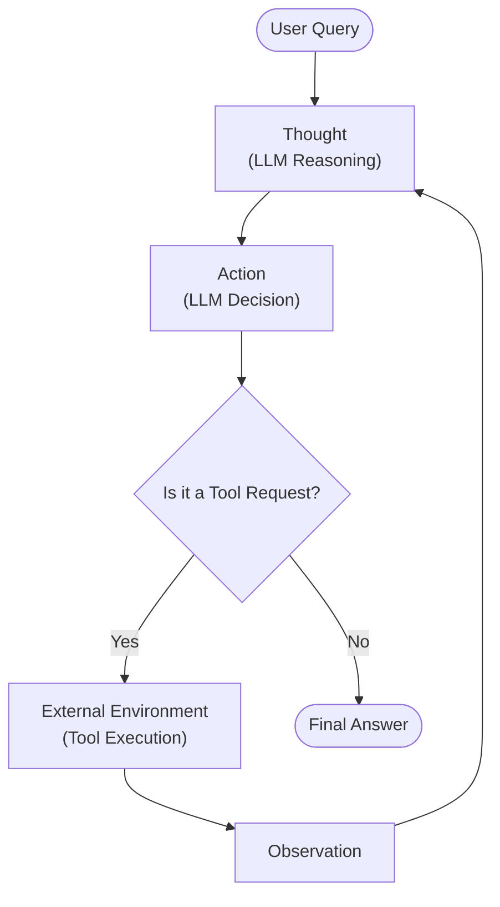

In our last lesson, we explored the theory behind LLM reasoning, focusing on frameworks like ReAct that enable agents to think, act, and observe. We saw how these patterns allow an LLM to break down complex problems and interact with external tools by grounding its reasoning in verifiable observations, which helps reduce hallucination and improves transparency [[1]](https://www.dailydoseofds.com/ai-agents-crash-course-part-10-with-implementation/). But theory only takes you so far. To truly understand how these systems work, you have to build one.

This lesson is 100% hands-on. We are moving from the "what" to the "how" by implementing a minimal ReAct agent from scratch using only Python and the Gemini API. You will build the complete Thought → Action → Observation cycle: define a mock tool, generate thoughts, select actions with function calling, execute the tool, and process observations within a turn-based control loop.

This exercise provides a concrete mental model of how reasoning agents operate under the hood. By building the core mechanics yourself, you will be able to debug, customize, and extend agentic systems. In this lesson, we will cover setting up the environment, defining a tool, and implementing the thought, action, and control loop phases, complete with tests to verify our agent's behavior.

## Setup and Environment

Our first step is to set up a clean Python environment to ensure the code runs smoothly and our outputs match the expected results. This project uses the `google-genai` package to interact with the Gemini API, along with Pydantic for data modeling. A proper setup is the foundation for any reproducible AI application.

1.  We start by loading our `GOOGLE_API_KEY` from an environment file. We use a simple utility function for this, which we will reuse throughout the course. This practice keeps sensitive keys out of our source code.
    
    ```python
    from lessons.utils import env
    
    env.load(required_env_vars=["GOOGLE_API_KEY"])
    ```
    
    It outputs:
    
    ```text
    Trying to load environment variables from /path/to/your/project/.env
    Environment variables loaded successfully.
    ```
    
2.  Next, we import the necessary packages. This includes `google.genai` for the API client, `pydantic` for creating structured data models, and standard Python libraries like `enum` and `typing` for type hinting.
    
    ```python
    import json
    from enum import Enum
    from pydantic import BaseModel, Field
    from typing import List
    
    from google import genai
    from google.genai import types
    
    from lessons.utils import pretty_print
    ```
    
3.  We initialize the Gemini client, which will handle all our API requests. This object is our gateway to the LLM.
    
    ```python
    client = genai.Client()
    ```
    
    It outputs:
    
    ```text
    Both GOOGLE_API_KEY and GEMINI_API_KEY are set. Using GOOGLE_API_KEY.
    ```
    
4.  Finally, we define the model we will use. For this lesson, `gemini-2.5-flash` is a great choice because it is fast and cost-effective, perfect for the simple reasoning our agent will perform.
    
    ```python
    MODEL_ID = "gemini-2.5-flash"
    ```
    

With the client and model configured, we can now define an external capability for our agent to use.

## Tool Layer: Mock Search Implementation

As we learned in Lesson 6, tools are functions that give an agent the ability to interact with the outside world. For this guide, we will implement a simple mock search tool instead of calling a real API. This approach helps us focus on the ReAct mechanics, removes the need for external API keys, and gives us predictable responses for testing [[2]](https://medium.com/google-cloud/building-react-agents-from-scratch-a-hands-on-guide-using-gemini-ffe4621d90ae).

Our tool is a Python function named `search`. Its docstring is important because the Gemini API uses it to understand what the tool does and how to call it [[3]](https://ai.google.dev/gemini-api/docs/function-calling). The function includes a few hardcoded responses for specific queries and a generic fallback for anything else. This design simulates how a real tool would return data or an error.

```python
def search(query: str) -> str:
    """Search for information about a specific topic or query.

    Args:
        query (str): The search query or topic to look up.
    """
    query_lower = query.lower()

    # Predefined responses for demonstration
    if all(word in query_lower for word in ["capital", "france"]):
        return "Paris is the capital of France and is known for the Eiffel Tower."
    elif "react" in query_lower:
        return "The ReAct (Reasoning and Acting) framework enables LLMs to solve complex tasks by interleaving thought generation, action execution, and observation processing."

    # Generic response for unhandled queries
    return f"Information about '{query}' was not found."
```

In a production system, you would replace this mock function with a real API call to a search engine or a domain-specific knowledge base [[4]](https://medium.com/google-cloud/building-react-agents-from-scratch-a-hands-on-guide-using-gemini-ffe4621d90ae). We also create a `TOOL_REGISTRY` to map the function's name to the callable function, which allows our control loop to execute the correct tool dynamically.

```python
TOOL_REGISTRY = {
    search.__name__: search,
}
```

Now that our agent has a tool, let's implement the first phase of the ReAct cycle: thought.

## Thought Phase: Prompt Construction and Generation

The "Thought" phase is the agent's internal monologue, where it reasons about the user's query and plans its next step [[5]](https://arxiv.org/pdf/2210.03629). We trigger this by sending a carefully constructed prompt to the LLM. This step is crucial for guiding the agent's decision-making process.

1.  First, we create a helper function to generate an XML description of the available tools. As we discussed in Lesson 3, using XML tags helps the model distinguish between different parts of the context [[6]](https://ai.google.dev/gemini-api/docs/prompting-strategies). This function takes our `TOOL_REGISTRY` and creates a simple `<tool>` block containing the function's name and docstring.
    
    ```python
    def build_tools_xml_description(tools: dict[str, callable]) -> str:
        """Build a minimal XML description of tools using only their docstrings."""
        lines = []
        for tool_name, fn in tools.items():
            doc = (fn.__doc__ or "").strip()
            lines.append(f"\t<tool name=\"{tool_name}\">")
            if doc:
                lines.append(f"\t\t<description>")
                for line in doc.split("\n"):
                    lines.append(f"\t\t\t{line}")
                lines.append(f"\t\t</description>")
            lines.append("\t</tool>")
        return "\n".join(lines)
    ```
    
2.  We then define our main prompt template. It instructs the agent on its goal, provides the XML-formatted tool descriptions, and includes a placeholder for the conversation history. The prompt asks the model to state its next thought as a short paragraph.
    
    ```python
    tools_xml = build_tools_xml_description(TOOL_REGISTRY)
    
    PROMPT_TEMPLATE_THOUGHT = f"""
    You are deciding the next best step for reaching the user goal. You have some tools available to you.
    
    Available tools:
    <tools>
    {tools_xml}
    </tools>
    
    Conversation so far:
    <conversation>
    {{conversation}}
    </conversation>
    
    State your next thought about what to do next as one short paragraph focused on the next action you intend to take and why.
    Avoid repeating the same strategies that didn't work previously. Prefer different approaches.
    """.strip()
    ```
    
    Inspecting the full prompt reveals its structure. The `<tools>` block clearly lists the `search` tool and its description, while the `<conversation>` block will be populated with the ongoing dialogue history.
    
    It outputs:
    
    ```text
    You are deciding the next best step for reaching the user goal. You have some tools available to you.
    
    Available tools:
    <tools>
    	<tool name="search">
    		<description>
    			Search for information about a specific topic or query.
    			
    			Args:
    			    query (str): The search query or topic to look up.
    		</description>
    	</tool>
    </tools>
    
    Conversation so far:
    <conversation>
    {conversation}
    </conversation>
    
    State your next thought about what to do next as one short paragraph focused on the next action you intend to take and why.
    Avoid repeating the same strategies that didn't work previously. Prefer different approaches.
    ```
    
3.  Finally, we implement the `generate_thought` function. It takes the current conversation history, formats the prompt, calls the Gemini API, and returns the model's textual response. This response is the agent's "thought."
    
    ```python
    def generate_thought(conversation: str, tool_registry: dict[str, callable]) -> str:
        """Generate a thought as plain text (no structured output)."""
        tools_xml = build_tools_xml_description(tool_registry)
        prompt = PROMPT_TEMPLATE_THOUGHT.format(conversation=conversation, tools_xml=tools_xml)
    
        response = client.models.generate_content(
            model=MODEL_ID,
            contents=prompt
        )
        return response.text.strip()
    ```
    

With a coherent thought generated, the agent must now decide whether to call a tool or conclude with a final answer.

## Action Phase: Function Calling and Parsing

The "Action" phase determines what the agent does next. We will leverage Gemini's native function calling capability, a more robust approach than manually engineering tool schemas into the prompt [[3]](https://ai.google.dev/gemini-api/docs/function-calling). The API handles the low-level details of presenting tools to the model, allowing our prompt to focus on high-level strategy.

1.  We define two prompt templates. `PROMPT_TEMPLATE_ACTION` instructs the model to choose between a tool call and a final answer. `PROMPT_TEMPLATE_ACTION_FORCED` is a fallback to prevent the agent from getting stuck in a loop.
    
    ```python
    PROMPT_TEMPLATE_ACTION = """
    You are selecting the best next action to reach the user goal.
    
    Conversation so far:
    <conversation>
    {conversation}
    </conversation>
    
    Respond either with a tool call (with arguments) or a final answer if you can confidently conclude.
    """.strip()
    
    # Dedicated prompt used when we must force a final answer
    PROMPT_TEMPLATE_ACTION_FORCED = """
    You must now provide a final answer to the user.
    
    Conversation so far:
    <conversation>
    {conversation}
    </conversation>
    
    Provide a concise final answer that best addresses the user's goal.
    """.strip()
    ```
    
2.  We use Pydantic models, `ToolCallRequest` and `FinalAnswer`, to represent the two possible outcomes. This use of structured outputs makes the agent's decision explicit and easy to parse.
    
    ```python
    class ToolCallRequest(BaseModel):
        """A request to call a tool with its name and arguments."""
        tool_name: str = Field(description="The name of the tool to call.")
        arguments: dict = Field(description="The arguments to pass to the tool.")
    
    
    class FinalAnswer(BaseModel):
        """A final answer to present to the user when no further action is needed."""
        text: str = Field(description="The final answer text to present to the user.")
    ```
    
3.  The `generate_action` function orchestrates this phase. It passes the Python tool functions directly to the `tools` parameter in the `GenerateContentConfig`, and the Gemini client automatically makes them available to the model. We disable automatic execution (`"disable": True`) to maintain full control within our loop. The function then parses the response, checking if the model returned a `function_call` or plain text for a final answer.
    
    ```python
    def generate_action(conversation: str, tool_registry: dict[str, callable] | None = None, force_final: bool = False) -> (ToolCallRequest | FinalAnswer):
        """Generate an action by passing tools to the LLM and parsing function calls or final text.
    
        When force_final is True or no tools are provided, the model is instructed to produce a final answer and tool calls are disabled.
        """
        # Use a dedicated prompt when forcing a final answer or no tools are provided
        if force_final or not tool_registry:
            prompt = PROMPT_TEMPLATE_ACTION_FORCED.format(conversation=conversation)
            response = client.models.generate_content(
                model=MODEL_ID,
                contents=prompt
            )
            return FinalAnswer(text=response.text.strip())
    
        # Default action prompt
        prompt = PROMPT_TEMPLATE_ACTION.format(conversation=conversation)
    
        # Provide the available tools to the model; disable auto-calling so we can parse and run ourselves
        tools = list(tool_registry.values())
        config = types.GenerateContentConfig(
            tools=tools,
            automatic_function_calling={"disable": True}
        )
        response = client.models.generate_content(
            model=MODEL_ID,
            contents=prompt,
            config=config
        )
    
        # Extract the function call from the response (if present)
        candidate = response.candidates[0]
        parts = candidate.content.parts
        if parts and getattr(parts[0], "function_call", None):
            name = parts[0].function_call.name
            args = dict(parts[0].function_call.args) if parts[0].function_call.args is not None else {}
            return ToolCallRequest(tool_name=name, arguments=args)
        
        # Otherwise, it's a final answer
        final_answer = "".join(part.text for part in candidate.content.parts)
        return FinalAnswer(text=final_answer.strip())
    ```
    

## Control Loop: Messages, Scratchpad, and Orchestration

Now we combine everything into the main ReAct control loop that orchestrates the Thought → Action → Observation cycle. This loop manages the conversation history, calls the thought and action phases, executes tools, and processes the resulting observations. This iterative process is analogous to human planning [[7]](https://www.ibm.com/think/topics/react-agent).

Image 1: A flowchart illustrating the ReAct control loop, detailing the turn-based iteration of Thought, Action, and Observation.


1.  We start by defining data structures to manage the conversation. `MessageRole` is an `Enum` that categorizes each step (e.g., `USER`, `THOUGHT`). The `Message` class is a Pydantic model that holds the content and role for each entry in our log.
    
    ```python
    class MessageRole(str, Enum):
        """Enumeration for the different roles a message can have."""
        USER = "user"
        THOUGHT = "thought"
        TOOL_REQUEST = "tool request"
        OBSERVATION = "observation"
        FINAL_ANSWER = "final answer"
    
    
    class Message(BaseModel):
        """A message with a role and content, used for all message types."""
        role: MessageRole = Field(description="The role of the message in the ReAct loop.")
        content: str = Field(description="The textual content of the message.")
    
        def __str__(self) -> str:
            """Provides a user-friendly string representation of the message."""
            return f"{self.role.value.capitalize()}: {self.content}"
    ```
    
2.  A `Scratchpad` class holds the list of `Message` objects, acting as the agent's short-term memory. Its `append` method adds new messages and optionally pretty-prints them, making it easy to trace the agent's execution.
    
    ```python
    class Scratchpad:
        """Container for ReAct messages with optional pretty-print on append."""
    
        def __init__(self, max_turns: int) -> None:
            self.messages: List[Message] = []
            self.max_turns: int = max_turns
            self.current_turn: int = 1
    
        def set_turn(self, turn: int) -> None:
            self.current_turn = turn
    
        def append(self, message: Message, verbose: bool = False, is_forced_final_answer: bool = False) -> None:
            self.messages.append(message)
            if verbose:
                # ... pretty printing logic from notebook ...
    
        def to_string(self) -> str:
            return "\n".join(str(m) for m in self.messages)
    ```
    
3.  The `react_agent_loop` function is the heart of our agent. It initializes the `Scratchpad` with the user's question and then iterates through the ReAct cycle for a set number of turns.
    
    In each turn, it generates a thought and then an action. If the action is a `FinalAnswer`, the loop terminates. If it is a `ToolCallRequest`, the loop finds the tool in our `TOOL_REGISTRY` and executes it. The tool's output is captured as an "Observation" and added to the scratchpad. The loop then continues, using the new observation to inform the next thought. If the loop reaches its limit, it forces a final answer to ensure a conclusion.
    
    ```python
    def react_agent_loop(initial_question: str, tool_registry: dict[str, callable], max_turns: int = 5, verbose: bool = False) -> str:
        """
        Implements the main ReAct (Thought -> Action -> Observation) control loop.
        Uses a unified message class for the scratchpad.
        """
        scratchpad = Scratchpad(max_turns=max_turns)
    
        # Add the user's question to the scratchpad
        user_message = Message(role=MessageRole.USER, content=initial_question)
        scratchpad.append(user_message, verbose=verbose)
    
        for turn in range(1, max_turns + 1):
            scratchpad.set_turn(turn)
    
            # Generate a thought and an action
            thought_content = generate_thought(scratchpad.to_string(), tool_registry)
            thought_message = Message(role=MessageRole.THOUGHT, content=thought_content)
            scratchpad.append(thought_message, verbose=verbose)
    
            action_result = generate_action(scratchpad.to_string(), tool_registry=tool_registry)
    
            # If it's a final answer, stop
            if isinstance(action_result, FinalAnswer):
                final_answer = action_result.text
                final_message = Message(role=MessageRole.FINAL_ANSWER, content=final_answer)
                scratchpad.append(final_message, verbose=verbose)
                return final_answer
    
            # If it's a tool request, execute it
            if isinstance(action_result, ToolCallRequest):
                action_name = action_result.tool_name
                action_params = action_result.arguments
    
                params_str = ", ".join([f"{k}='{v}'" for k, v in action_params.items()])
                action_content = f"{action_name}({params_str})"
                action_message = Message(role=MessageRole.TOOL_REQUEST, content=action_content)
                scratchpad.append(action_message, verbose=verbose)
    
                # Run the action and get the observation
                observation_content = ""
                tool_function = tool_registry.get(action_name)
                if tool_function:
                    try:
                        observation_content = tool_function(**action_params)
                    except Exception as e:
                        observation_content = f"Error executing tool '{action_name}': {e}"
                else:
                    observation_content = f"Unknown tool '{action_name}'. Available tools: {list(tool_registry.keys())}"
    
                # Add the observation to the scratchpad
                observation_message = Message(role=MessageRole.OBSERVATION, content=observation_content)
                scratchpad.append(observation_message, verbose=verbose)
    
            # Force a final answer if max turns are reached
            if turn == max_turns:
                forced_action = generate_action(scratchpad.to_string(), force_final=True)
                if isinstance(forced_action, FinalAnswer):
                    final_answer = forced_action.text
                else:
                    final_answer = "Unable to produce a final answer within the allotted turns."
                final_message = Message(role=MessageRole.FINAL_ANSWER, content=final_answer)
                scratchpad.append(final_message, verbose=verbose, is_forced_final_answer=True)
                return final_answer
    ```
    
    This loop provides a complete, minimal implementation of the ReAct pattern. It shows how an agent can iteratively reason, act, and learn from observations to solve a problem.
    
    The verbose output from the scratchpad allows us to analyze how the agent reasons, uses tools, and updates its state. This provides a clear window into its decision-making process. This basic implementation can be extended with more sophisticated tools and reasoning patterns, which we will explore in future lessons.

## Tests and Traces: Success and Graceful Fallback

To validate our agent, we will run two tests: a simple factual question to demonstrate a successful run, and a query our mock tool cannot answer to show graceful fallback. Analyzing the traces will confirm the control loop, tool integration, and termination logic work as designed.

First, let's ask a question our mock tool can answer: `"What is the capital of France?"` We will set `max_turns=2` and `verbose=True` to see the step-by-step execution.

```python
question = "What is the capital of France?"
final_answer = react_agent_loop(question, TOOL_REGISTRY, max_turns=2, verbose=True)
```

The trace shows the agent working perfectly. The expected output highlights these steps:
-   **Thought (Turn 1/2):** The agent reasons it needs a factual answer and should use the `search` tool.
-   **Tool request (Turn 1/2):** It correctly generates the call `search(query='capital of France')`.
-   **Observation (Turn 1/2):** It receives the mock response: "Paris is the capital of France..."
-   **Thought (Turn 2/2):** The agent understands it now has the information to answer.
-   **Final answer (Turn 2/2):** It concludes with the correct answer: "Paris is the capital of France."

Next, we test the fallback behavior with a query our mock tool does not have a predefined response for: `"What is the capital of Italy?"`.

```python
question = "What is the capital of Italy?"
final_answer = react_agent_loop(question, TOOL_REGISTRY, max_turns=2, verbose=True)
```

This trace demonstrates the agent's ability to handle failure and adapt:
-   **Tool request (Turn 1/2):** The agent first attempts to search for "capital of Italy."
-   **Observation (Turn 1/2):** The tool returns: "Information about 'capital of Italy' was not found."
-   **Thought (Turn 2/2):** Recognizing the failure, the agent formulates a new, broader strategy to search for just "Italy."
-   **Tool request (Turn 2/2):** It calls `search(query='Italy')`, which also fails.
-   **Final answer (Forced):** Having reached the turn limit, the agent is forced to conclude and gracefully admits: "I'm sorry, but I couldn't find information about the capital of Italy."

These tests confirm our end-to-end loop is working. The agent can use tools successfully and can adapt its strategy and terminate cleanly when they fail.

## Conclusion

In this lesson, we built a complete, minimal ReAct agent from scratch. We implemented every part of the Thought-Action-Observation cycle, from defining a mock tool and generating thoughts to executing actions with function calling and orchestrating the flow with a control loop. This hands-on exercise demystifies what happens inside an agentic system and provides a practical understanding of its mechanics.

Knowing how to build these core components is essential. While frameworks can accelerate development, this knowledge helps you debug, customize, and innovate. The core patterns we covered today—structured messages, a scratchpad for memory, and a turn-based control loop—are concepts you will use repeatedly.

In our upcoming lessons, we will build on this. We will explore more advanced topics like agent memory and Retrieval-Augmented Generation (RAG), which will allow our agents to remember information and access vast knowledge bases. This will also prepare you for advanced orchestration patterns like multi-agent systems and self-reflection [[8]](https://arxiv.org/html/2602.10479v1).

## References

- [1] Daily Dose of DS. (2024). *AI Agents Crash Course - Part 10: ReAct Framework with Implementation*. [https://www.dailydoseofds.com/ai-agents-crash-course-part-10-with-implementation/](https://www.dailydoseofds.com/ai-agents-crash-course-part-10-with-implementation/)
- [2] Shankar, A. (2024). *Building ReAct Agents from Scratch using Gemini*. Medium. [https://medium.com/google-cloud/building-react-agents-from-scratch-a-hands-on-guide-using-gemini-ffe4621d90ae](https://medium.com/google-cloud/building-react-agents-from-scratch-a-hands-on-guide-using-gemini-ffe4621d90ae)
- [3] Google. (n.d.). *Gemini Function Calling Documentation*. Google AI for Developers. [https://ai.google.dev/gemini-api/docs/function-calling](https://ai.google.dev/gemini-api/docs/function-calling)
- [4] Shankar, A. (2024). *Building ReAct Agents from Scratch using Gemini*. Medium. [https://medium.com/google-cloud/building-react-agents-from-scratch-a-hands-on-guide-using-gemini-ffe4621d90ae](https://medium.com/google-cloud/building-react-agents-from-scratch-a-hands-on-guide-using-gemini-ffe4621d90ae)
- [5] Yao, S., Zhao, J., Yu, D., Du, N., Shafran, I., Narasimhan, K., & Cao, Y. (2023). *ReAct: Synergizing Reasoning and Acting in Language Models*. arXiv. [https://arxiv.org/pdf/2210.03629](https://arxiv.org/pdf/2210.03629)
- [6] Google. (n.d.). *Prompt design strategies*. Google AI for Developers. [https://ai.google.dev/gemini-api/docs/prompting-strategies](https://ai.google.dev/gemini-api/docs/prompting-strategies)
- [7] Bergmann, D. (n.d.). *ReAct Agent*. IBM. [https://www.ibm.com/think/topics/react-agent](https://www.ibm.com/think/topics/react-agent)
- [8] *Agent orchestration trends*. arXiv. [https://arxiv.org/html/2602.10479v1](https://arxiv.org/html/2602.10479v1)