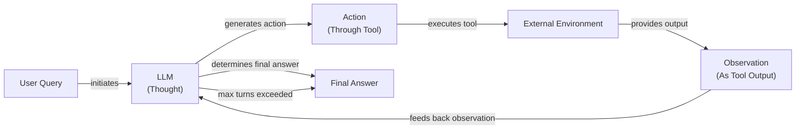

# A Minimalist's Guide to ReAct: Building an Agent From Scratch

In our previous lessons, we covered the theory behind agentic planning and reasoning, exploring the ReAct pattern in Lesson 7. The ReAct framework was introduced to overcome hallucination in reasoning-only models by grounding the agent's logic in real information from external tools, making it more reliable [[1]](https://arxiv.org/pdf/2210.03629). Now, it is time to move from theory to practice.

This lesson is 100% hands-on. We are going to build a minimal ReAct agent from the ground up using only Python and the Gemini API. Implementing the full Thought → Action → Observation loop will give you a concrete mental model of how these systems operate. This hands-on knowledge is essential for building robust AI agents that go beyond simple prototypes, following an industry best practice that favors simple, debuggable patterns over complex frameworks [[2]](https://www.anthropic.com/engineering/building-effective-agents).

We will walk through the entire process, step-by-step, following the code in the associated notebook. You will learn how to:
- Set up the environment and define a mock tool.
- Implement the "Thought" phase to generate a reasoning trace.
- Use Gemini's function calling for the "Action" phase.
- Build the control loop to orchestrate the agent's turn-based execution.
- Test the agent's success and fallback behaviors.

Let's get building.

## Setup and Environment

Before we can build our agent, we need to set up a clean and predictable environment. This ensures our code runs smoothly and the outputs match the expected traces, which is essential for debugging and validation. The objective is to create a self-contained setup that allows you to replicate the agent's behavior exactly as shown in the notebook.

1.  First, we load our environment variables. We will use a simple utility to manage API keys, ensuring our `GOOGLE_API_KEY` is available for the Gemini client.
    ```python
    from lessons.utils import env
    
    env.load(required_env_vars=["GOOGLE_API_KEY"])
    ```

2.  Next, we import the necessary libraries. We will use `google-genai` for interacting with the Gemini API, `pydantic` for creating structured data models as we covered in Lesson 4, and other utilities for type hinting and printing.
    ```python
    from google import genai
    from google.genai import types
    from pydantic import BaseModel, Field
    from enum import Enum
    from typing import List
    
    from lessons.utils import pretty_print
    ```

3.  With our dependencies imported, we initialize the Gemini client, which is our entry point for all API interactions.
    ```python
    client = genai.Client()
    ```
    It outputs:
    ```text
    Both GOOGLE_API_KEY and GEMINI_API_KEY are set. Using GOOGLE_API_KEY.
    ```

4.  Finally, we define the model we will use. For this exercise, `gemini-2.5-flash` is a great choice as it is fast, cost-effective, and powerful enough for our reasoning tasks.
    ```python
    MODEL_ID = "gemini-2.5-flash"
    ```

With the client and model in place, we can now define the external capabilities our agent will use.

## Tool Layer: Mock Search Implementation

To allow our agent to interact with the world, we need to give it tools. As we learned in Lesson 6, tools are functions the agent can call to perform actions. For this lesson, we will use a simple mock search tool instead of calling a real API. This design philosophy is intentional: it simplifies the learning process by isolating the ReAct mechanics from the complexities of external dependencies and API key management. It also provides predictable, hardcoded responses, which makes testing and debugging the agent's logic much easier.

Our mock `search` function is straightforward. It takes a query string and returns a predefined answer if the query is recognized. The function's docstring is important, as it provides the description the LLM will use to understand what the tool does and when to use it. If the query is not in its mock database, it returns a "not found" message, simulating a failed search and allowing us to test the agent's fallback behavior.

```python
def search(query: str) -> str:
    """Search for information about a specific topic or query.

    Args:
        query (str): The search query or topic to look up.
    """
    query_lower = query.lower()

    # Predefined responses for demonstration
    if all(word in query_lower for word in ["capital", "france"]):
        return "Paris is the capital of France and is known for the Eiffel Tower."
    elif "react" in query_lower:
        return "The ReAct (Reasoning and Acting) framework enables LLMs to solve complex tasks by interleaving thought generation, action execution, and observation processing."

    # Generic response for unhandled queries
    return f"Information about '{query}' was not found."
```

In a production system, you would replace this mock function with a real API call to a service like Google Search, Wikipedia, or a domain-specific knowledge base. The integration logic would remain the same, as long as the new function preserves the same signature (`query: str -> str`).

## Thought Phase: Prompt Construction and Generation

The first step in the ReAct cycle is "Thought." This is where the agent reasons about the user's query and its history to decide what to do next. We guide this process with a carefully constructed prompt. This careful construction is important, as LLMs are sensitive to prompt structure, and a well-designed template ensures reliable behavior [[3]](https://www.mdpi.com/2079-9292/13/23/4712).

1.  First, we create a helper function to dynamically generate an XML description of the available tools. This function iterates through a tool registry, extracts each tool's name and docstring, and formats them into a structured XML block.
    ```python
    def build_tools_xml_description(tools: dict[str, callable]) -> str:
        """Build a minimal XML description of tools using only their docstrings."""
        lines = []
        for tool_name, fn in tools.items():
            doc = (fn.__doc__ or "").strip()
            lines.append(f"\t<tool name=\"{tool_name}\">")
            if doc:
                lines.append(f"\t\t<description>")
                for line in doc.split("\n"):
                    lines.append(f"\t\t\t{line}")
                lines.append(f"\t\t</description>")
            lines.append("\t</tool>")
        return "\n".join(lines)
    ```

2.  Next, we define our prompt template. It instructs the agent on its role and includes placeholders for the dynamically generated tools XML and the ongoing `{conversation}`. Using XML tags is a recommended practice that helps the model distinguish instructions from conversational history [[4]](https://ai.google.dev/gemini-api/docs/prompting-strategies).
    ```python
    TOOL_REGISTRY = {
        search.__name__: search,
    }
    tools_xml = build_tools_xml_description(TOOL_REGISTRY)
    
    PROMPT_TEMPLATE_THOUGHT = f"""
    You are deciding the next best step for reaching the user goal. You have some tools available to you.
    
    Available tools:
    <tools>
    {tools_xml}
    </tools>
    
    Conversation so far:
    <conversation>
    {{conversation}}
    </conversation>
    
    State your next thought about what to do next as one short paragraph focused on the next action you intend to take and why.
    Avoid repeating the same strategies that didn't work previously. Prefer different approaches.
    """.strip()
    ```

3.  To generate a thought, we create a function that injects the current conversation history into this template and calls the LLM. The model's response is a natural language string representing its internal monologue.
    ```python
    def generate_thought(conversation: str, tool_registry: dict[str, callable]) -> str:
        """Generate a thought as plain text (no structured output)."""
        tools_xml = build_tools_xml_description(tool_registry)
        prompt = PROMPT_TEMPLATE_THOUGHT.format(conversation=conversation, tools_xml=tools_xml)
    
        response = client.models.generate_content(
            model=MODEL_ID,
            contents=prompt
        )
        return response.text.strip()
    ```

This thought is not shown to the user; it is a private reasoning step that informs the agent's next move. This explicit internal monologue makes the agent's reasoning transparent, which is essential for debugging [[5]](https://www.ibm.com/think/topics/react-agent). With a coherent thought generated, the agent must now decide whether to call a tool or conclude with a final answer.

## Action Phase: Function Calling and Parsing

The "Action" phase translates the agent's thought into a concrete action, which can be either executing a tool or providing a final answer. We will use Gemini's native function calling capabilities, which we first explored in Lesson 6, to make this decision.

Our system prompt strategy focuses on high-level decision-making. Instead of cluttering the prompt with technical tool details, we rely on Gemini's automatic tool integration. By passing the Python `search` function directly to the client's `tools` configuration, the API automatically extracts the function name, docstring, and parameters from its signature. This separates strategic guidance from technical specifications, leading to cleaner prompts and easier tool management. This approach is more robust than early ReAct implementations that relied on parsing text-based actions, a method prone to formatting errors [[6]](https://www.philschmid.de/langgraph-gemini-2-5-react-agent).

1.  We start with two prompt templates. The first guides the agent's general decision-making, while the second is a dedicated prompt used to force a final answer when the agent reaches its turn limit.
    ```python
    PROMPT_TEMPLATE_ACTION = """
    You are selecting the best next action to reach the user goal.

    Conversation so far:
    <conversation>
    {conversation}
    </conversation>

    Respond either with a tool call (with arguments) or a final answer if you can confidently conclude.
    """.strip()

    # Dedicated prompt used when we must force a final answer
    PROMPT_TEMPLATE_ACTION_FORCED = """
    You must now provide a final answer to the user.

    Conversation so far:
    <conversation>
    {conversation}
    </conversation>

    Provide a concise final answer that best addresses the user's goal.
    """.strip()
    ```

2.  We define Pydantic models to represent a `ToolCallRequest` and a `FinalAnswer`. This ensures that the agent's decisions are captured in a structured, predictable format.
    ```python
    class ToolCallRequest(BaseModel):
        """A request to call a tool with its name and arguments."""
        tool_name: str = Field(description="The name of the tool to call.")
        arguments: dict = Field(description="The arguments to pass to the tool.")


    class FinalAnswer(BaseModel):
        """A final answer to present to the user when no further action is needed."""
        text: str = Field(description="The final answer text to present to the user.")
    ```

3.  The `generate_action` function orchestrates this phase. It selects the appropriate prompt, configures the Gemini client with the available tools, and calls the model. The `automatic_function_calling={"disable": True}` setting is important; it tells the SDK to return the model's function call request to us for execution, rather than running it automatically.
    ```python
    def generate_action(conversation: str, tool_registry: dict[str, callable] | None = None, force_final: bool = False) -> (ToolCallRequest | FinalAnswer):
        """Generate an action by passing tools to the LLM and parsing function calls or final text.
    
        When force_final is True or no tools are provided, the model is instructed to produce a final answer and tool calls are disabled.
        """
        # Use a dedicated prompt when forcing a final answer or no tools are provided
        if force_final or not tool_registry:
            prompt = PROMPT_TEMPLATE_ACTION_FORCED.format(conversation=conversation)
            response = client.models.generate_content(
                model=MODEL_ID,
                contents=prompt
            )
            return FinalAnswer(text=response.text.strip())
    
        # Default action prompt
        prompt = PROMPT_TEMPLATE_ACTION.format(conversation=conversation)
    
        # Provide the available tools to the model; disable auto-calling so we can parse and run ourselves
        tools = list(tool_registry.values())
        config = types.GenerateContentConfig(
            tools=tools,
            automatic_function_calling={"disable": True}
        )
        response = client.models.generate_content(
            model=MODEL_ID,
            contents=prompt,
            config=config
        )
    
        # Extract the function call from the response (if present)
        candidate = response.candidates[0]
        parts = candidate.content.parts
        if parts and getattr(parts[0], "function_call", None):
            name = parts[0].function_call.name
            args = dict(parts[0].function_call.args) if parts[0].function_call.args is not None else {}
            return ToolCallRequest(tool_name=name, arguments=args)
        
        # Otherwise, it's a final answer
        final_answer = "".join(part.text for part in candidate.content.parts)
        return FinalAnswer(text=final_answer.strip())
    ```
    The parsing logic checks if the response contains a `function_call` object. If it does, we extract the tool's name and arguments into our `ToolCallRequest` model. If not, we treat the text response as a `FinalAnswer`. This structured approach to parsing is essential for handling the model's output reliably and avoiding errors from unexpected formats [[7]](https://medium.com/google-cloud/building-react-agents-from-scratch-a-hands-on-guide-using-gemini-ffe4621d90ae).

## Control Loop: Messages, Scratchpad, Orchestration

With the "Thought" and "Action" phases defined, we now need a control loop to orchestrate the entire process. This loop manages the agent's state, executes the Thought-Action-Observation cycle, and accumulates information in a "scratchpad" until it reaches a final answer. This iterative cycle is analogous to human problem-solving: think, act, observe, and then incorporate new information into the next thought [[8]](https://www.dailydoseofds.com/ai-agents-crash-course-part-10-with-implementation/).


Image 1: A flowchart illustrating the ReAct control loop, detailing the iterative Thought -> Action -> Observation cycle.

Our control loop architecture is built on a few key components. First, we establish a message structure foundation using a `MessageRole` enum and a `Message` Pydantic model. This categorizes every interaction, keeping our conversation history, or scratchpad, organized.

The `react_agent_loop` function implements the core logic. It initializes the scratchpad with the user's query and iterates through a set number of turns. In each turn, it generates a thought, then an action. A critical part of the loop is integrated observation processing. When the action is a `ToolCallRequest`, the loop finds the correct tool in the `TOOL_REGISTRY`, executes it, and captures the output. This output, whether a success or an error, is formatted as an `OBSERVATION` message and added to the scratchpad. This feedback mechanism allows the agent to learn from its actions and adjust its strategy. The loop terminates when a `FinalAnswer` is generated or when the maximum number of turns is reached, which prevents infinite loops and ensures a graceful exit. This process is a form of agent planning, where the agent determines a sequence of actions to achieve its goal [[9]](https://www.ibm.com/think/topics/ai-agent-planning).

```python
class MessageRole(str, Enum):
    """Enumeration for the different roles a message can have."""
    USER = "user"
    THOUGHT = "thought"
    TOOL_REQUEST = "tool request"
    OBSERVATION = "observation"
    FINAL_ANSWER = "final answer"


class Message(BaseModel):
    """A message with a role and content, used for all message types."""
    role: MessageRole = Field(description="The role of the message in the ReAct loop.")
    content: str = Field(description="The textual content of the message.")

    def __str__(self) -> str:
        """Provides a user-friendly string representation of the message."""
        return f"{self.role.value.capitalize()}: {self.content}"

class Scratchpad:
    """Container for ReAct messages with optional pretty-print on append."""

    def __init__(self, max_turns: int) -> None:
        self.messages: List[Message] = []
        self.max_turns: int = max_turns
        self.current_turn: int = 1

    def set_turn(self, turn: int) -> None:
        self.current_turn = turn

    def append(self, message: Message, verbose: bool = False, is_forced_final_answer: bool = False) -> None:
        self.messages.append(message)
        if verbose:
            role_to_color = {
                MessageRole.USER: pretty_print.Color.RESET,
                MessageRole.THOUGHT: pretty_print.Color.ORANGE,
                MessageRole.TOOL_REQUEST: pretty_print.Color.GREEN,
                MessageRole.OBSERVATION: pretty_print.Color.YELLOW,
                MessageRole.FINAL_ANSWER: pretty_print.Color.CYAN,
            }
            header_color = role_to_color.get(message.role, pretty_print.Color.YELLOW)
            pretty_print_message(
                message=message,
                turn=self.current_turn,
                max_turns=self.max_turns,
                header_color=header_color,
                is_forced_final_answer=is_forced_final_answer,
            )

    def to_string(self) -> str:
        return "\n".join(str(m) for m in self.messages)

def react_agent_loop(initial_question: str, tool_registry: dict[str, callable], max_turns: int = 5, verbose: bool = False) -> str:
    """
    Implements the main ReAct (Thought -> Action -> Observation) control loop.
    Uses a unified message class for the scratchpad.
    """
    scratchpad = Scratchpad(max_turns=max_turns)

    # Add the user's question to the scratchpad
    user_message = Message(role=MessageRole.USER, content=initial_question)
    scratchpad.append(user_message, verbose=verbose)

    for turn in range(1, max_turns + 1):
        scratchpad.set_turn(turn)

        # Generate a thought based on the current scratchpad
        thought_content = generate_thought(
            scratchpad.to_string(),
            tool_registry,
        )
        thought_message = Message(role=MessageRole.THOUGHT, content=thought_content)
        scratchpad.append(thought_message, verbose=verbose)

        # Generate an action based on the current scratchpad
        action_result = generate_action(
            scratchpad.to_string(),
            tool_registry=tool_registry,
        )

        # If the model produced a final answer, return it
        if isinstance(action_result, FinalAnswer):
            final_answer = action_result.text
            final_message = Message(role=MessageRole.FINAL_ANSWER, content=final_answer)
            scratchpad.append(final_message, verbose=verbose)
            return final_answer

        # Otherwise, it is a tool request
        if isinstance(action_result, ToolCallRequest):
            action_name = action_result.tool_name
            action_params = action_result.arguments

            # Add the action to the scratchpad
            params_str = ", ".join([f"{k}='{v}'" for k, v in action_params.items()])
            action_content = f"{action_name}({params_str})"
            action_message = Message(role=MessageRole.TOOL_REQUEST, content=action_content)
            scratchpad.append(action_message, verbose=verbose)

            # Run the action and get the observation
            observation_content = ""
            tool_function = tool_registry[action_name]
            try:
                observation_content = tool_function(**action_params)
            except Exception as e:
                observation_content = f"Error executing tool '{action_name}': {e}"

            # Add the observation to the scratchpad
            observation_message = Message(role=MessageRole.OBSERVATION, content=observation_content)
            scratchpad.append(observation_message, verbose=verbose)

        # Check if the maximum number of turns has been reached. If so, force the action selector to produce a final answer
        if turn == max_turns:
            forced_action = generate_action(
                scratchpad.to_string(),
                force_final=True,
            )
            if isinstance(forced_action, FinalAnswer):
                final_answer = forced_action.text
            else:
                final_answer = "Unable to produce a final answer within the allotted turns."
            final_message = Message(role=MessageRole.FINAL_ANSWER, content=final_answer)
            scratchpad.append(final_message, verbose=verbose, is_forced_final_answer=True)
            return final_answer
```

## Tests and Traces: Success and Graceful Fallback

Now that we have built the complete ReAct loop, it is time to validate its behavior. Analyzing the agent's traces ensures that the loop, tool integration, and termination logic work as designed. We will run two tests: a successful query and a graceful fallback.

The first test, a simple factual query for the capital of France, confirms the agent can successfully complete the ReAct cycle. It correctly identifies the need for the `search` tool, executes it, processes the observation, and provides the final answer within two turns.

```python
question = "What is the capital of France?"
final_answer = react_agent_loop(question, TOOL_REGISTRY, max_turns=2, verbose=True)
```

The second test demonstrates graceful fallback. When faced with a query its mock tool cannot answer, like the capital of Italy, the agent observes the failure. It then attempts a different strategy on the next turn. Upon reaching the turn limit, it correctly triggers the forced termination to provide a helpful "not found" message.

```python
question = "What is the capital of Italy?"
final_answer = react_agent_loop(question, TOOL_REGISTRY, max_turns=2, verbose=True)
```
These tests confirm our end-to-end loop and provide a baseline for extending the agent in later lessons.

## Conclusion

In this lesson, we have built a complete, albeit minimal, ReAct agent from scratch. By implementing the Thought-Action-Observation cycle, we have gained a practical understanding of how agentic systems reason, act, and learn. This exercise demystifies AI agents and provides a solid mental model for building more complex systems. The value of this pattern is not just theoretical; the original ReAct research showed it significantly outperformed action-only agents on complex tasks by grounding its reasoning with external tools [[1]](https://arxiv.org/pdf/2210.03629), [[10]](https://www.promptingguide.ai/techniques/react).

As you build more complex systems, remember the core principles for effective agents: design for simplicity, ensure transparency in the agent's reasoning, and carefully craft the tools it uses [[2]](https://www.anthropic.com/engineering/building-effective-agents).

Even though we used a simple mock tool, the core architecture remains the same for production-grade agents. The next steps are to enhance this foundation. In future lessons, we will explore how to equip agents with persistent memory to learn across conversations (Lesson 9) and how to connect them to vast knowledge bases using Retrieval-Augmented Generation (Lesson 10). The simple loop we built today is the engine that will power those more advanced capabilities.

## References

- [1] Yao, S., Zhao, J., Yu, D., Du, N., Shafran, I., Narasimhan, K., & Cao, Y. (2022). *ReAct: Synergizing Reasoning and Acting in Language Models*. arXiv. https://arxiv.org/pdf/2210.03629
- [2] S., E., & Zhang, B. (2024). *Building effective agents*. Anthropic. https://www.anthropic.com/engineering/building-effective-agents
- [3] D’Elia, A., et al. (2025). *Quantifying the Performance of Multitask vs. Single-Task Prompts in Large Language Models*. MDPI. https://www.mdpi.com/2079-9292/13/23/4712
- [4] Google. (n.d.). *Prompt design strategies*. Google AI for Developers. https://ai.google.dev/gemini-api/docs/prompting-strategies
- [5] Bergmann, D. (n.d.). *ReAct Agent*. IBM. https://www.ibm.com/think/topics/react-agent
- [6] Schmid, P. (n.d.). *ReAct agent from scratch with Gemini 2.5 and LangGraph*. https://www.philschmid.de/langgraph-gemini-2-5-react-agent
- [7] Shankar, A. (2024). *Building ReAct Agents from Scratch using Gemini*. Medium. https://medium.com/google-cloud/building-react-agents-from-scratch-a-hands-on-guide-using-gemini-ffe4621d90ae
- [8] Daily Dose of DS. (2024). *AI Agents Crash Course - Part 10: ReAct Framework with Implementation*. https://www.dailydoseofds.com/ai-agents-crash-course-part-10-with-implementation/
- [9] Stryker, C. (n.d.). *AI Agent Planning*. IBM. https://www.ibm.com/think/topics/ai-agent-planning
- [10] (n.d.). *ReAct*. Prompting Guide. https://www.promptingguide.ai/techniques/react