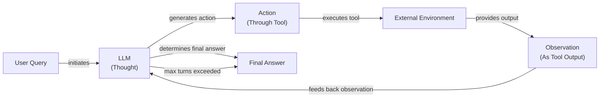

# A Minimalist's Guide to ReAct: Building an Agent From Scratch

In our previous lessons, we covered the theory behind agentic planning and reasoning, exploring the ReAct pattern in Lesson 7. The ReAct framework was introduced to overcome hallucination in reasoning-only models by grounding the agent's logic in real information from external tools, making it more reliable [[8]](https://arxiv.org/pdf/2210.03629). Now, it is time to move from theory to practice.

This lesson is 100% hands-on. We are going to build a minimal ReAct agent from the ground up using only Python and the Gemini API. Implementing the full Thought → Action → Observation loop will give you a concrete mental model of how these systems operate. This foundational understanding separates prototyping from building robust AI agents, and this from-scratch approach follows industry best practice, which favors simple, debuggable patterns over complex frameworks [[9]](https://www.anthropic.com/engineering/building-effective-agents).

We will walk through the entire process, step-by-step, following the code in the associated notebook. You will learn how to:
- Set up the environment and define a mock tool.
- Implement the "Thought" phase to generate a reasoning trace.
- Use Gemini's function calling for the "Action" phase.
- Build the control loop to orchestrate the agent's turn-based execution.
- Test the agent's success and fallback behaviors.

Let's get building.

## Setup and Environment

Before we can build our agent, we need to set up a clean and predictable environment. This ensures our code runs smoothly and the outputs match the expected traces, which is essential for debugging.

1.  First, we load our environment variables. We will use a simple utility to manage API keys, ensuring our `GOOGLE_API_KEY` is available for the Gemini client.
    ```python
    from lessons.utils import env
    
    env.load(required_env_vars=["GOOGLE_API_KEY"])
    ```

2.  Next, we import the necessary libraries. We will use `google-genai` for interacting with the Gemini API and `pydantic` for creating structured data models, which we covered in Lesson 4.
    ```python
    import google.generativeai as genai
    from pydantic import BaseModel
    from enum import Enum
    from typing import List, Dict, Any
    from lessons.utils import pretty_print
    ```

3.  With our dependencies imported, we initialize the Gemini client.
    ```python
    client = genai.Client()
    ```
    It outputs:
    ```text
    Both GOOGLE_API_KEY and GEMINI_API_KEY are set. Using GOOGLE_API_KEY.
    ```

4.  Finally, we define the model we will use. For this exercise, `gemini-2.5-flash` is a great choice as it is fast, cost-effective, and powerful enough for our reasoning tasks.
    ```python
    MODEL_ID = "gemini-2.5-flash"
    ```

With the client and model in place, we can now define the external capabilities our agent will use.

## Tool Layer: Mock Search Implementation

To allow our agent to interact with the world, we need to give it tools. As we learned in Lesson 6, tools are functions the agent can call to perform actions. For this lesson, we will use a simple mock search tool instead of calling a real API.

This approach simplifies learning by focusing on ReAct mechanics, not external APIs. It also provides predictable, hardcoded responses, which makes testing and debugging the agent's logic much easier.

Our mock `search` function is straightforward. It takes a query string and returns a predefined answer if the query is recognized. If the query is not in its mock database, it returns a "not found" message. The function's docstring is important, as it provides the description the LLM will use to understand what the tool does.

```python
def search(query: str) -> str:
    """
    Searches for information on a given topic and returns the most relevant result.

    Args:
        query: The topic to search for.

    Returns:
        A string containing the search result or an error message if not found.
    """
    if query == "capital of France":
        return "Paris is the capital of France and is known for the Eiffel Tower."
    elif query == "Python programming language":
        return "Python is a high-level, interpreted programming language known for its simple syntax."
    else:
        return f"Information about '{query}' was not found."
```

In a production system, you would replace this mock function with a real API call to a service like Google Search, Wikipedia, or a domain-specific knowledge base, but the function signature and integration logic would remain the same.

## Thought Phase: Prompt Construction and Generation

The first step in the ReAct cycle is "Thought." This is where the agent reasons about the user's query and its history to decide what to do next. We guide this process with a carefully constructed prompt. This careful construction is important, as LLMs are sensitive to prompt structure, and a well-designed template ensures reliable behavior [[10]](https://www.mdpi.com/2079-9292/13/23/4712).

1.  First, we define a prompt template. This template instructs the agent on its role and how to reason. It includes an XML block for available tools and a `{conversation}` placeholder. Using XML tags is a recommended practice that helps the model distinguish instructions from conversational history [[11]](https://ai.google.dev/gemini-api/docs/prompting-strategies).
    ```python
    PROMPT_TEMPLATE_THOUGHT = """
    You are a helpful assistant that answers questions using a search tool.

    <tools>
    <tool name="search">
    Searches for information on a given topic and returns the most relevant result.
    </tool>
    </tools>

    Here is the conversation so far:
    <conversation>
    {conversation}
    </conversation>

    Based on the conversation, what is your next thought?
    """
    ```

2.  To generate a thought, we create a function that injects the current conversation history into this template and calls the LLM. The model's response is a natural language string representing its internal monologue.
    ```python
    def generate_thought(conversation: str, tool_registry: Dict[str, Any]) -> str:
        """
        Generates a thought based on the conversation history and available tools.
        """
        prompt = PROMPT_TEMPLATE_THOUGHT.format(conversation=conversation)
        response = client.models.generate_content(model=MODEL_ID, contents=prompt)
        return response.text.strip()
    ```

This thought is not shown to the user. It is a private reasoning step that informs the agent's next move. This explicit internal monologue makes the agent's reasoning transparent, which is invaluable for debugging [[12]](https://www.ibm.com/think/topics/react-agent). With a coherent thought generated, the agent must now decide whether to call a tool or conclude with a final answer.

## Action Phase: Function Calling and Parsing

The "Action" phase translates the agent's thought into a concrete action. This can be either executing a tool or providing a final answer to the user. We will leverage Gemini's native function calling capabilities, which we first explored in Lesson 6, to make this decision.

We pass the Python function directly to the Gemini client instead of detailing tools in the prompt. The API automatically extracts the function name, docstring, and parameters. This is a more robust approach than early ReAct implementations that relied on parsing text-based actions, a method prone to formatting errors. Native function calling reduces errors and makes tool integration more reliable [[13]](https://www.philschmid.de/langgraph-gemini-2-5-react-agent).

1.  We start with a system prompt that guides the agent's decision-making. It instructs the agent to analyze the conversation and decide whether to use a tool for more information or to provide a final answer if it is confident.
    ```python
    PROMPT_TEMPLATE_ACTION = """
    You are a helpful assistant that answers questions.
    Based on the conversation so far, please decide whether to use a tool or to provide a final answer.

    <conversation>
    {conversation}
    </conversation>
    """
    ```

2.  Next, we define a function to generate the action. This function takes the conversation history and the tool registry, configures the Gemini client with the available tools, and calls the model.
    ```python
    def generate_action(conversation: str, tool_registry: Dict[str, Any]):
        """
        Generates an action (tool call or final answer) based on the conversation.
        """
        tools = list(tool_registry.values())
        response = client.models.generate_content(
            model=MODEL_ID,
            contents=PROMPT_TEMPLATE_ACTION.format(conversation=conversation),
            config=genai.types.GenerateContentConfig(tools=tools),
        )
        return response.candidates[0].content.parts[0]
    ```

3.  The model's response will either be a `function_call` object or a plain `text` response. We need to parse this to determine the agent's next step. If it is a function call, we extract the tool name and arguments. If it is a text response, we treat it as the final answer.
    ```python
    ACTION_FINISH = "finish"

    class ToolCallRequest(BaseModel):
        name: str
        args: Dict[str, Any]

    def parse_action(part: Any) -> str | ToolCallRequest:
        """
        Parses a model's response part to determine the action.
        """
        if hasattr(part, "function_call"):
            function_call = part.function_call
            return ToolCallRequest(name=function_call.name, args=dict(function_call.args))
        elif hasattr(part, "text"):
            return part.text
        else:
            raise ValueError("Unknown action format")
    ```
This separation of thought and action allows the agent to reason about its strategy before committing to an executable step. Robust parsing remains important, as handling unexpected model outputs is a common debugging challenge in agentic loops [[14]](https://medium.com/google-cloud/building-react-agents-from-scratch-a-hands-on-guide-using-gemini-ffe4621d90ae).

## Control Loop: Messages, Scratchpad, Orchestration

With the "Thought" and "Action" phases defined, we now need a control loop to orchestrate the entire process. This loop manages the agent's state, executes the Thought-Action-Observation cycle, and accumulates information in a "scratchpad" until it reaches a final answer. This iterative cycle is analogous to human problem-solving: think, act, observe, and then incorporate new information into the next thought [[15]](https://www.dailydoseofds.com/ai-agents-crash-course-part-10-with-implementation/).


Image 1: A flowchart illustrating the ReAct control loop, detailing the iterative Thought -> Action -> Observation cycle.

1.  First, we define a structured way to represent different types of interactions. We use an `Enum` for message roles and a `Pydantic` model for the messages themselves. This keeps our conversation history, or scratchpad, organized and easy to parse.
    ```python
    class MessageRole(str, Enum):
        USER = "user"
        THOUGHT = "thought"
        TOOL_REQUEST = "tool_request"
        OBSERVATION = "observation"
        FINAL_ANSWER = "final_answer"

    class Message(BaseModel):
        role: MessageRole
        content: str
    ```

2.  The scratchpad is simply a list of these `Message` objects. We create helper functions to format this list into a string for the LLM prompt and to print it in a readable format for debugging.
    ```python
    def format_scratchpad(messages: List[Message]) -> str:
        """
        Formats the scratchpad messages into a string for the LLM prompt.
        """
        return "\n".join([f"<{msg.role}>\n{msg.content}\n</{msg.role}>" for msg in messages])
    ```

3.  The core of our agent is the `react_agent_loop` function. It initializes the scratchpad with the user's query and then iterates through a set number of turns. In each turn, it:
    - Generates a thought based on the current scratchpad.
    - Generates an action (a tool call or a final answer).
    - If it is a tool call, it executes the tool, captures the output as an "Observation," and adds it to the scratchpad.
    - If it is a final answer, the loop terminates.
    
    The loop also includes error handling for failed tool executions and a maximum turn limit to prevent infinite loops. If the agent reaches the limit, it is forced to provide a final answer based on the information it has gathered.
    ```python
    def react_agent_loop(
        query: str,
        tool_registry: Dict[str, Any],
        max_turns: int = 5,
        verbose: bool = False,
    ):
        scratchpad = [Message(role=MessageRole.USER, content=query)]

        for i in range(max_turns):
            if verbose:
                print(f"--- Turn {i+1}/{max_turns} ---")

            # 1. Thought
            thought = generate_thought(format_scratchpad(scratchpad), tool_registry)
            scratchpad.append(Message(role=MessageRole.THOUGHT, content=thought))

            # 2. Action
            action_part = generate_action(format_scratchpad(scratchpad), tool_registry)
            action = parse_action(action_part)

            if isinstance(action, ToolCallRequest):
                # 3. Observation
                scratchpad.append(Message(role=MessageRole.TOOL_REQUEST, content=str(action)))
                tool_func = tool_registry.get(action.name)
                
                try:
                    observation = tool_func(**action.args)
                except Exception as e:
                    observation = f"Error executing tool {action.name}: {e}"
                
                scratchpad.append(Message(role=MessageRole.OBSERVATION, content=str(observation)))
            elif isinstance(action, str):
                scratchpad.append(Message(role=MessageRole.FINAL_ANSWER, content=action))
                return scratchpad

        # Force a final answer if max turns are reached
        scratchpad.append(Message(role=MessageRole.FINAL_ANSWER, content="I'm sorry, but I couldn't find the answer."))
        return scratchpad
    ```
This loop is the engine of our ReAct agent. This process is a form of agent planning, where the agent determines a sequence of actions by modeling its environment (the scratchpad) to achieve its goal [[16]](https://www.ibm.com/think/topics/ai-agent-planning).

## Tests and Traces: Success and Graceful Fallback

Now that we have built the complete ReAct loop, it is time to validate its behavior. We will run two tests: a successful query and a graceful fallback.

First, let's ask a simple question that our mock `search` tool can answer: *"What is the capital of France?"* We will limit the agent to two turns.

```python
TOOL_REGISTRY = {"search": search}
result = react_agent_loop(
    "What is the capital of France?",
    TOOL_REGISTRY,
    max_turns=2,
    verbose=True,
)
```

The trace shows a perfect ReAct cycle:
-   **Turn 1:** The agent thinks it needs to search for the capital of France, makes a `search(query='capital of France')` tool request, and gets the observation "Paris is the capital of France...".
-   **Turn 2:** Observing the result, the agent thinks it has found the answer and generates the final answer: "Paris is the capital of France."

The agent correctly identified the tool, executed it, and used the observation to formulate a final answer, all within the turn limit.

Next, let's test the fallback behavior with a query our mock tool does not recognize: *"What is the capital of Italy?"*

```python
result_not_found = react_agent_loop(
    "What is the capital of Italy?",
    TOOL_REGISTRY,
    max_turns=2,
    verbose=True,
)
```
The trace demonstrates the agent's resilience:
-   **Turn 1:** The agent requests `search(query='capital of Italy')` but receives the observation "Information about 'capital of Italy' was not found."
-   **Turn 2:** Realizing its first attempt failed, the agent adopts a broader strategy and thinks it should search for just "Italy." It makes a `search(query='Italy')` request but again gets a "not found" observation.
-   **Forced Exit:** Having reached the maximum of two turns without a conclusive answer, the control loop forces a final answer: "I'm sorry, but I couldn't find information about the capital of Italy."

These tests confirm that our end-to-end loop works as expected, handling both successful information retrieval and situations where it must fail gracefully.

## Conclusion

In this lesson, we have built a complete, albeit minimal, ReAct agent from scratch. By implementing the Thought-Action-Observation cycle, we have gained a practical understanding of how agentic systems reason, act, and learn. This exercise demystifies AI agents and provides a solid mental model for building more complex systems. The value of this pattern isn't just theoretical; the original ReAct research showed it significantly outperformed action-only agents on complex tasks by grounding its reasoning with external tools [[8]](https://arxiv.org/pdf/2210.03629), [[17]](https://www.promptingguide.ai/techniques/react).

As you build more complex systems, remember the core principles for effective agents: design for simplicity, ensure transparency in the agent's reasoning, and carefully craft the tools it uses [[9]](https://www.anthropic.com/engineering/building-effective-agents).

Even though we used a simple mock tool, the core architecture remains the same for production-grade agents. The next steps are to enhance this foundation. In future lessons, we will explore how to equip agents with persistent memory to learn across conversations (Lesson 9) and how to connect them to vast knowledge bases using Retrieval-Augmented Generation (Lesson 10). The simple loop we built today is the engine that will power those more advanced capabilities.

## References

- [1]  [ReAct agent from scratch with Gemini 2.5 and LangGraph](https://ai.google.dev/gemini-api/docs/langgraph-example)
- [2]  [Building a Python ReAct Agent Class: A Step-by-Step Guide](https://www.neradot.com/post/building-a-python-react-agent-class-a-step-by-step-guide)
- [3]  [Building ReAct Agents with LangGraph: A Beginner’s Guide](https://machinelearningmastery.com/building-react-agents-with-langgraph-a-beginners-guide/)
- [4]  [AI Agents Crash Course - Part 10: ReAct Framework with Implementation](https://www.dailydoseofds.com/ai-agents-crash-course-part-10-with-implementation/)
- [5]  [ReAct with OpenAI’s Function Calling Feature](https://peterroelants.github.io/posts/react-openai-function-calling/)
- [6]  [Building ReAct Agents from Scratch using Gemini](https://medium.com/google-cloud/building-react-agents-from-scratch-a-hands-on-guide-using-gemini-ffe4621d90ae)
- [7]  [Building Production ReAct Agents From Scratch Is Simple](https://www.decodingai.com/p/building-production-react-agents)
- [8]  [ReAct: Synergizing Reasoning and Acting in Language Models](https://arxiv.org/pdf/2210.03629)
- [9]  [Building effective agents - Anthropic](https://www.anthropic.com/engineering/building-effective-agents)
- [10]  [Quantifying the Performance of Multitask Prompts in Large Language Models](https://www.mdpi.com/2079-9292/13/23/4712)
- [11]  [Prompt design strategies - Google AI for Developers](https://ai.google.dev/gemini-api/docs/prompting-strategies)
- [12]  [ReAct Agent - IBM](https://www.ibm.com/think/topics/react-agent)
- [13]  [ReAct agent from scratch with Gemini 2.5 and LangGraph](https://www.philschmid.de/langgraph-gemini-2-5-react-agent)
- [14]  [Building ReAct Agents from Scratch using Gemini - Medium](https://medium.com/google-cloud/building-react-agents-from-scratch-a-hands-on-guide-using-gemini-ffe4621d90ae)
- [15]  [Implementing ReAct Agentic Pattern From Scratch](https://www.dailydoseofds.com/ai-agents-crash-course-part-10-with-implementation/)
- [16]  [AI Agent Planning - IBM](https://www.ibm.com/think/topics/ai-agent-planning)
- [17]  [ReAct - Prompting Guide](https://www.promptingguide.ai/techniques/react)