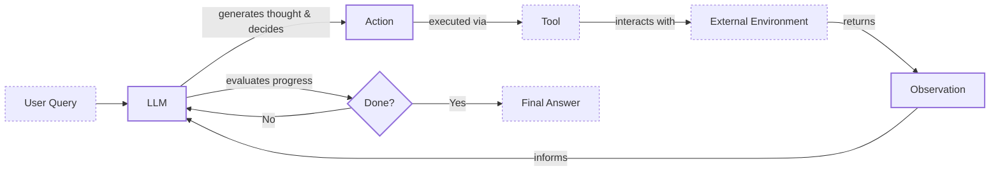

# Building a ReAct Agent From Scratch

In our previous lessons, we moved from the high-level concepts of AI agents to the practical mechanics of planning and tool use. We explored the ReAct framework, a powerful paradigm that enables an LLM to reason, act, and observe, much like a human solving a problem step-by-step [[1]](https://arxiv.org/pdf/2210.03629). While theory is essential, nothing builds engineering intuition like getting your hands dirty. Abstract diagrams of agent loops can only take you so far.

When we started building our own AI agents, we initially turned to popular frameworks like LangGraph. We thought their graph-based models would bring clarity and structure. But we quickly found ourselves fighting the framework. Simple `if-else` logic and basic loops became hours of work, forcing our Python code into an unnatural paradigm that added complexity without real value. Frustrated, we did what we always do when we are stuck: we opened the source code. Reading the implementation of the ReAct loop, we finally had the "aha!" moment. Seeing the raw mechanics of thought generation, tool execution, and state management gave us the concrete mental model we had been missing.

This lesson is where we bridge that gap. We are leaving the theory behind to build a minimal, end-to-end ReAct agent from scratch using only Python and the Gemini API. We will implement the full Thought → Action → Observation cycle: defining a mock tool, generating thoughts, selecting actions with function calling, executing those actions, and orchestrating the entire process within a control loop.


Image 1: A flowchart illustrating the core theoretical ReAct (Reasoning and Acting) agent design, showing the iterative Thought-Action-Observation cycle.

By building this system yourself, you will gain a deep understanding of how these agents work under the hood. This hands-on experience provides the foundational skill for building production-ready systems. Once you understand the core loop, you can debug, extend, and customize agents with confidence.

Throughout this lesson, we will follow the code from the associated Jupyter Notebook. We will cover:
- Setting up the Python environment.
- Implementing a mock tool layer.
- Constructing the thought and action phases.
- Building the main control loop.
- Testing the agent with success and failure cases.

## Setup and Environment

Before we can build our agent, we need to set up a clean and predictable environment. This ensures that our code runs smoothly and that the outputs match the expected traces, which is critical for debugging and validation. A well-configured environment is the first step toward a reliable AI application. It guarantees that every component, from the API client to the model itself, behaves as expected, preventing hard-to-diagnose errors down the line. We will follow the first few cells of the notebook to get everything in place.

1.  First, we load our `GOOGLE_API_KEY` from a `.env` file. This key is required to authenticate with the Gemini API. We use a custom utility for this, but you can use any method you prefer, such as `python-dotenv`. This step is fundamental for any application that interacts with a cloud-based AI service.
    ```python
    from lessons.utils import env

    env.load(required_env_vars=["GOOGLE_API_KEY"])
    ```
    It outputs:
    ```text
    Trying to load environment variables from `/path/to/your/.env`
    Environment variables loaded successfully.
    ```
2.  Next, we import the necessary packages. We will use `google-genai` to interact with the Gemini API, which provides the core LLM functionality. `Pydantic` is used for data modeling and validation, ensuring that the data flowing through our agent is structured and correct. We also import standard Python libraries like `enum` for creating structured choices and `typing` for type hints.
    ```python
    import json
    from enum import Enum
    from pydantic import BaseModel, Field
    from typing import List

    from google import genai
    from google.genai import types

    from lessons.utils import pretty_print
    ```
3.  We initialize the Gemini client. This object is our main interface to the Gemini models. If you have both `GOOGLE_API_KEY` and `GEMINI_API_KEY` set as environment variables, the client will prioritize one, which is normal behavior.
    ```python
    client = genai.Client()
    ```
    It outputs:
    ```text
    Both GOOGLE_API_KEY and GEMINI_API_KEY are set. Using GOOGLE_API_KEY.
    ```
4.  Finally, we define the model ID we will use. For this lesson, `gemini-2.5-flash` is an excellent choice because it is fast, cost-effective, and fully supports the advanced function calling features we need to build our agent. This balance of performance and cost is often a key consideration in production environments.
    ```python
    MODEL_ID = "gemini-2.5-flash"
    ```
With our client initialized and model selected, we have a stable foundation. The next step is to give our agent a capability. This tool allows it to interact with the world.

## Tool Layer: Mock Search Implementation

An agent's power comes from its ability to use tools to gather information or perform actions [[2]](https://www.anthropic.com/engineering/building-effective-agents). In a production system, these tools might be complex API calls to a search engine, a database, or an internal service. For this lesson, however, our goal is to understand the ReAct mechanics, not to wrestle with external APIs.

That is why we will implement a simple mock `search` tool. This approach offers several advantages for learning:
-   **Focus:** It keeps our attention on the agent's reasoning loop, not on API authentication or network requests. This isolates the core logic we want to learn.
-   **Simplicity:** It removes external dependencies, so you do not need extra API keys to run the code. Anyone can follow along without additional setup.
-   **Predictability:** It provides consistent, hardcoded responses, which makes testing and debugging the agent's behavior much easier. We know exactly what the tool should return for a given input.

This educational strategy allows us to build a transparent and controllable system, where we can clearly see how the agent processes information and makes decisions without the noise of external variables [[3]](https://medium.com/google-cloud/building-react-agents-from-scratch-a-hands-on-guide-using-gemini-ffe4621d90ae).

### Implementation Details

1.  Our mock `search` function simulates a real search engine. It takes a string `query` and returns a string response. The docstring is crucial here. It is not just a comment for developers; it is the primary documentation the LLM will use to understand what the tool does, what arguments it expects, and when to use it. A clear and descriptive docstring is essential for reliable tool selection.
    ```python
    def search(query: str) -> str:
        """Search for information about a specific topic or query.

        Args:
            query (str): The search query or topic to look up.
        """
        query_lower = query.lower()

        # Predefined responses for demonstration
        if all(word in query_lower for word in ["capital", "france"]):
            return "Paris is the capital of France and is known for the Eiffel Tower."
        elif "react" in query_lower:
            return "The ReAct (Reasoning and Acting) framework enables LLMs to solve complex tasks by interleaving thought generation, action execution, and observation processing."

        # Generic response for unhandled queries
        return f"Information about '{query}' was not found."
    ```
    The function checks for specific keywords in the query and returns a predefined answer. If the query does not match any of our conditions, it returns a generic "not found" message. This fallback behavior is important for testing how the agent handles situations where a tool fails to provide useful information.

2.  To manage our tools, we create a `TOOL_REGISTRY`. This dictionary maps the tool's name (as a string) to its actual Python function. This registry acts as a bridge, allowing the LLM to plan with symbolic tool names (`"search"`) while our code can safely look up and execute the corresponding function.
    ```python
    TOOL_REGISTRY = {
        search.__name__: search,
    }
    ```

### Real-World Context

In a real-world application, you could easily swap this mock `search` function with a function that calls the Google Search API, queries a private knowledge base, or interacts with any other external service [[3]](https://medium.com/google-cloud/building-react-agents-from-scratch-a-hands-on-guide-using-gemini-ffe4621d90ae). The key is to maintain the same function signature and ensure the docstring accurately describes its purpose. This modular design is a core principle of building extensible AI agents. For example, you could replace the body of the `search` function to call a real API while leaving the agent's reasoning logic completely unchanged. This separation of concerns is what makes agentic systems so flexible and powerful.

With our tool defined, the agent now has a way to "act." The next step is to implement the "reasoning" part of the cycle: the thought phase.

## Thought Phase: Prompt Construction and Generation

The first step in the ReAct cycle is "Thought." This is where the agent analyzes the user's query and its history to decide on the best next step. It is a moment of internal reasoning before any action is taken. To generate this thought, we need to provide the LLM with the right context, including a description of the tools it has available. A well-crafted prompt is essential for guiding the model's reasoning process effectively. This phase sets the stage for the entire loop, as a clear thought leads to a purposeful action.

1.  We will start by creating a function that generates a minimal XML description of our tools. This function iterates through our `TOOL_REGISTRY` and uses each tool's docstring to create a `<tool>` block. XML is a great choice for this because it provides a clear, structured format that helps the LLM distinguish tool definitions from other parts of the prompt. This practice is recommended by providers like Google for improving instruction following [[4]](https://ai.google.dev/gemini-api/docs/prompting-strategies). By wrapping tool descriptions in tags, we make it easier for the model to parse and understand the capabilities at its disposal.
    ```python
    def build_tools_xml_description(tools: dict[str, callable]) -> str:
        """Build a minimal XML description of tools using only their docstrings."""
        lines = []
        for tool_name, fn in tools.items():
            doc = (fn.__doc__ or "").strip()
            lines.append(f"\t<tool name=\"{tool_name}\">")
            if doc:
                lines.append(f"\t\t<description>")
                for line in doc.split("\n"):
                    lines.append(f"\t\t\t{line}")
                lines.append(f"\t\t</description>")
            lines.append("\t</tool>")
        return "\n".join(lines)
    ```
2.  Next, we define the prompt template for the thought phase. This template instructs the agent on its goal: to decide the next best step. It includes placeholders for the available tools (as an XML block) and the conversation history. The prompt also guides the agent to focus on the next action and to avoid repeating failed strategies, encouraging more robust problem-solving.
    ```python
    tools_xml = build_tools_xml_description(TOOL_REGISTRY)

    PROMPT_TEMPLATE_THOUGHT = f"""
    You are deciding the next best step for reaching the user goal. You have some tools available to you.

    Available tools:
    <tools>
    {tools_xml}
    </tools>

    Conversation so far:
    <conversation>
    {{conversation}}
    </conversation>

    State your next thought about what to do next as one short paragraph focused on the next action you intend to take and why.
    Avoid repeating the same strategies that didn't work previously. Prefer different approaches.
    """.strip()
    ```
3.  Printing the template reveals the full context we will send to the model. It clearly outlines the available `search` tool and its purpose, and leaves a placeholder for the ongoing conversation history. This structured context is what enables the LLM to reason effectively.
    ```python
    print(PROMPT_TEMPLATE_THOUGHT)
    ```
    It outputs:
    ```text
    You are deciding the next best step for reaching the user goal. You have some tools available to you.

    Available tools:
    <tools>
        <tool name="search">
            <description>
                Search for information about a specific topic or query.

                Args:
                    query (str): The search query or topic to look up.
            </description>
        </tool>
    </tools>

    Conversation so far:
    <conversation>
    {conversation}
    </conversation>

    State your next thought about what to do next as one short paragraph focused on the next action you intend to take and why.
    Avoid repeating the same strategies that didn't work previously. Prefer different approaches.
    ```
4.  Finally, we implement the `generate_thought` function. It takes the current conversation history, formats the prompt with the tool descriptions, and calls the Gemini API. It returns the model's response as a clean, stripped string. This string represents the agent's "thought"—its internal monologue about what to do next.
    ```python
    def generate_thought(conversation: str, tool_registry: dict[str, callable]) -> str:
        """Generate a thought as plain text (no structured output)."""
        tools_xml = build_tools_xml_description(tool_registry)
        prompt = PROMPT_TEMPLATE_THOUGHT.format(conversation=conversation, tools_xml=tools_xml)

        response = client.models.generate_content(
            model=MODEL_ID,
            contents=prompt
        )
        return response.text.strip()
    ```
With a coherent thought generated, the agent now has a plan. But a plan is useless without execution. The next phase, "Action," determines whether to call a tool or conclude with a final answer.

## Action Phase: Function Calling and Parsing

After the "Thought" phase, the agent must decide what to do next. This is the "Action" phase, where it either calls a tool to gather more information or, if it has enough context, provides a final answer to the user. We will use Gemini's native function calling capabilities to handle this decision-making process. This component is where the agent translates its internal reasoning into an external effect, making it a critical part of the ReAct loop.

### System Prompt Strategy

A key design choice here is to separate the prompts for thought and action. The thought prompt includes detailed tool descriptions to help the LLM reason about *what* tools are available and *why* one might be useful. In contrast, the action prompt is more focused on the high-level decision: *should I use a tool or answer now?* This separation of concerns makes the system more modular and easier to debug. The action prompt does not need to know the specifics of each tool; it only needs to decide whether an action is necessary at all. This keeps the prompt concise and allows the model to focus solely on the strategic choice.

### Automatic Tool Integration

We do not need to include tool signatures in the action prompt because we pass the Python tool functions directly to the Gemini API via its `tools` configuration. The API automatically inspects the function's signature (parameters and type hints) and its docstring, converting them into a schema that the model can understand and use [[5]](https://ai.google.dev/gemini-api/docs/function-calling). This powerful feature allows us to keep our prompts clean and focused on strategic guidance, while the API handles the technical details of tool integration. It is a more robust and maintainable approach than manually embedding tool schemas into every prompt.

### Function Calling Implementation

1.  We start by defining two prompt templates for the action phase. The first is the default prompt, which asks the model to choose between a tool call and a final answer. The second is a specialized version used to force a final answer. We need this forced-answer prompt to ensure the agent can terminate gracefully, for example, when it reaches a turn limit, preventing infinite loops.
    ```python
    PROMPT_TEMPLATE_ACTION = """
    You are selecting the best next action to reach the user goal.

    Conversation so far:
    <conversation>
    {conversation}
    </conversation>

    Respond either with a tool call (with arguments) or a final answer if you can confidently conclude.
    """.strip()

    # Dedicated prompt used when we must force a final answer
    PROMPT_TEMPLATE_ACTION_FORCED = """
    You must now provide a final answer to the user.

    Conversation so far:
    <conversation>
    {conversation}
    </conversation>

    Provide a concise final answer that best addresses the user's goal.
    """.strip()
    ```
2.  Next, we define two Pydantic models, `ToolCallRequest` and `FinalAnswer`, to represent the two possible outcomes of the action phase. Using Pydantic ensures our outputs are structured and validated, as we learned in Lesson 4. This creates a clear contract for what the `generate_action` function can return.
    ```python
    class ToolCallRequest(BaseModel):
        """A request to call a tool with its name and arguments."""
        tool_name: str = Field(description="The name of the tool to call.")
        arguments: dict = Field(description="The arguments to pass to the tool.")


    class FinalAnswer(BaseModel):
        """A final answer to present to the user when no further action is needed."""
        text: str = Field(description="The final answer text to present to the user.")
    ```
3.  Now we implement the `generate_action` function. This is the core of the action phase.
    ```python
    def generate_action(conversation: str, tool_registry: dict[str, callable] | None = None, force_final: bool = False) -> (ToolCallRequest | FinalAnswer):
        """Generate an action by passing tools to the LLM and parsing function calls or final text.

        When force_final is True or no tools are provided, the model is instructed to produce a final answer and tool calls are disabled.
        """
        # Use a dedicated prompt when forcing a final answer or no tools are provided
        if force_final or not tool_registry:
            prompt = PROMPT_TEMPLATE_ACTION_FORCED.format(conversation=conversation)
            response = client.models.generate_content(
                model=MODEL_ID,
                contents=prompt
            )
            return FinalAnswer(text=response.text.strip())

        # Default action prompt
        prompt = PROMPT_TEMPLATE_ACTION.format(conversation=conversation)

        # Provide the available tools to the model; disable auto-calling so we can parse and run ourselves
        tools = list(tool_registry.values())
        config = types.GenerateContentConfig(
            tools=tools,
            automatic_function_calling={"disable": True}
        )
        response = client.models.generate_content(
            model=MODEL_ID,
            contents=prompt,
            config=config,
        )

        # Extract the function call from the response (if present)
        candidate = response.candidates[0]
        parts = candidate.content.parts
        if parts and getattr(parts[0], "function_call", None):
            name = parts[0].function_call.name
            args = dict(parts[0].function_call.args) if parts[0].function_call.args is not None else {}
            return ToolCallRequest(tool_name=name, arguments=args)
        
        # Otherwise, it's a final answer
        final_answer = "".join(part.text for part in candidate.content.parts)
        return FinalAnswer(text=final_answer.strip())
    ```
    This function first checks if a final answer is being forced. If so, it uses the `PROMPT_TEMPLATE_ACTION_FORCED` and returns a `FinalAnswer`. Otherwise, it uses the default prompt and configures the Gemini client with the available tools. We set `automatic_function_calling={"disable": True}` because we want to parse the response and execute the tool ourselves, giving us full control over the execution flow.

### Response Parsing and Error Handling

The function then inspects the model's response. If it contains a `function_call` object, it extracts the tool name and arguments and returns a `ToolCallRequest`. If not, it assumes the response is a text-based final answer and returns a `FinalAnswer`. This dual-return logic is what allows the agent to decide between acting and concluding. In a production system, you would add more robust error handling here to manage cases where the model returns a malformed response or an unknown tool name. For our learning purposes, this direct parsing is sufficient to demonstrate the core mechanism.

With the thought and action phases defined, we now have all the components needed to build the main control loop that will orchestrate the entire ReAct cycle.

## Control Loop: Messages, Scratchpad, and Orchestration

The control loop is the engine of our agent, orchestrating the Thought → Action → Observation cycle and managing the flow of information turn by turn. A key component of this loop is the "scratchpad," which serves as the agent's short-term memory, recording every step of the interaction. By building this orchestration logic ourselves, we gain full control and transparency, avoiding the abstractions of frameworks that can sometimes obscure what is happening under the hood.

### Message Structure Foundation

To build a clean and traceable history, we first need a structured way to represent each message. This ensures that every piece of information—from the user's initial query to the final observation—is clearly labeled and organized. This structured logging is fundamental for both debugging and for the agent's own reasoning process.

1.  We will start by defining a `MessageRole` enum and a `Message` Pydantic model. This creates a unified structure for all types of interactions: user queries, agent thoughts, tool requests, tool outputs (observations), and final answers. This structured approach is fundamental to maintaining a coherent conversation history that the agent can reliably reason over.
    ```python
    class MessageRole(str, Enum):
        """Enumeration for the different roles a message can have."""
        USER = "user"
        THOUGHT = "thought"
        TOOL_REQUEST = "tool request"
        OBSERVATION = "observation"
        FINAL_ANSWER = "final answer"


    class Message(BaseModel):
        """A message with a role and content, used for all message types."""
        role: MessageRole = Field(description="The role of the message in the ReAct loop.")
        content: str = Field(description="The textual content of the message.")

        def __str__(self) -> str:
            """Provides a user-friendly string representation of the message."""
            return f"{self.role.value.capitalize()}: {self.content}"
    ```
2.  To make the agent's process easy to follow, we create a helper function to pretty-print messages in the notebook. This will give us a color-coded, readable trace of the agent's execution, making it much easier to debug and understand the agent's decision-making process at each step.
    ```python
    def pretty_print_message(message: Message, turn: int, max_turns: int, header_color: str = pretty_print.Color.YELLOW, is_forced_final_answer: bool = False) -> None:
        if not is_forced_final_answer:
            title = f"{message.role.value.capitalize()} (Turn {turn}/{max_turns}):"
        else:
            title = f"{message.role.value.capitalize()} (Forced):"

        pretty_print.wrapped(
            text=message.content,
            title=title,
            header_color=header_color,
        )
    ```
3.  Next, we define the `Scratchpad` class. This class manages a list of `Message` objects. Its `append` method not only stores a new message but also optionally prints it, giving us a real-time view of the agent's state. The `to_string` method serializes the entire history into a single string, which we will pass to the LLM in each turn. This serialized history is the "memory" that allows the agent to be context-aware.
    ```python
    class Scratchpad:
        """Container for ReAct messages with optional pretty-print on append."""

        def __init__(self, max_turns: int) -> None:
            self.messages: List[Message] = []
            self.max_turns: int = max_turns
            self.current_turn: int = 1

        def set_turn(self, turn: int) -> None:
            self.current_turn = turn

        def append(self, message: Message, verbose: bool = False, is_forced_final_answer: bool = False) -> None:
            self.messages.append(message)
            if verbose:
                role_to_color = {
                    MessageRole.USER: pretty_print.Color.RESET,
                    MessageRole.THOUGHT: pretty_print.Color.ORANGE,
                    MessageRole.TOOL_REQUEST: pretty_print.Color.GREEN,
                    MessageRole.OBSERVATION: pretty_print.Color.YELLOW,
                    MessageRole.FINAL_ANSWER: pretty_print.Color.CYAN,
                }
                header_color = role_to_color.get(message.role, pretty_print.Color.YELLOW)
                pretty_print_message(
                    message=message,
                    turn=self.current_turn,
                    max_turns=self.max_turns,
                    header_color=header_color,
                    is_forced_final_answer=is_forced_final_answer,
                )

        def to_string(self) -> str:
            return "\n".join(str(m) for m in self.messages)
    ```

### Control Loop Architecture

Finally, we implement the `react_agent_loop`. This function ties everything together into a coherent, stateful process. It is a simple `for` loop that iterates up to a maximum number of turns, executing the thought-action-observation sequence in each iteration.

```python
def react_agent_loop(initial_question: str, tool_registry: dict[str, callable], max_turns: int = 5, verbose: bool = False) -> str:
    """
    Implements the main ReAct (Thought -> Action -> Observation) control loop.
    Uses a unified message class for the scratchpad.
    """
    scratchpad = Scratchpad(max_turns=max_turns)

    # Add the user's question to the scratchpad
    user_message = Message(role=MessageRole.USER, content=initial_question)
    scratchpad.append(user_message, verbose=verbose)

    for turn in range(1, max_turns + 1):
        scratchpad.set_turn(turn)

        # Generate a thought based on the current scratchpad
        thought_content = generate_thought(
            scratchpad.to_string(),
            tool_registry,
        )
        thought_message = Message(role=MessageRole.THOUGHT, content=thought_content)
        scratchpad.append(thought_message, verbose=verbose)

        # Generate an action based on the current scratchpad
        action_result = generate_action(
            scratchpad.to_string(),
            tool_registry=tool_registry,
        )

        # If the model produced a final answer, return it
        if isinstance(action_result, FinalAnswer):
            final_answer = action_result.text
            final_message = Message(role=MessageRole.FINAL_ANSWER, content=final_answer)
            scratchpad.append(final_message, verbose=verbose)
            return final_answer

        # Otherwise, it is a tool request
        if isinstance(action_result, ToolCallRequest):
            action_name = action_result.tool_name
            action_params = action_result.arguments

            # Add the action to the scratchpad
            params_str = ", ".join([f"{k}='{v}'" for k, v in action_params.items()])
            action_content = f"{action_name}({params_str})"
            action_message = Message(role=MessageRole.TOOL_REQUEST, content=action_content)
            scratchpad.append(action_message, verbose=verbose)

            # Run the action and get the observation
            observation_content = ""
            tool_function = tool_registry[action_name]
            try:
                observation_content = tool_function(**action_params)
            except Exception as e:
                observation_content = f"Error executing tool '{action_name}': {e}"

            # Add the observation to the scratchpad
            observation_message = Message(role=MessageRole.OBSERVATION, content=observation_content)
            scratchpad.append(observation_message, verbose=verbose)

        # Check if the maximum number of turns has been reached. If so, force the action selector to produce a final answer
        if turn == max_turns:
            forced_action = generate_action(
                scratchpad.to_string(),
                force_final=True,
            )
            if isinstance(forced_action, FinalAnswer):
                final_answer = forced_action.text
            else:
                final_answer = "Unable to produce a final answer within the allotted turns."
            final_message = Message(role=MessageRole.FINAL_ANSWER, content=final_answer)
            scratchpad.append(final_message, verbose=verbose, is_forced_final_answer=True)
            return final_answer
```
The loop works as follows:
-   It starts by adding the user's initial question to the scratchpad.
-   In each turn, it first calls `generate_thought` to reason about the current state.
-   Then, it calls `generate_action` to decide on the next move.
-   If the action is a `FinalAnswer`, the loop terminates and returns the answer.
-   If it is a `ToolCallRequest`, the loop looks up the tool in the `tool_registry`, executes it, and captures the output as an "Observation." This observation is added to the scratchpad, and the loop continues to the next turn.
-   If the loop reaches the `max_turns` limit, it makes one final call to `generate_action` with `force_final=True` to ensure a graceful exit.

### Integrated Observation Processing

A critical part of the loop is how it handles observations. When a `ToolCallRequest` is generated, the code looks up the corresponding function in our `TOOL_REGISTRY`. It then executes this function within a `try...except` block. This is important for robustness; if the tool fails for any reason (e.g., a network error in a real application), the agent does not crash. Instead, it captures the error message as the observation. This allows the agent to "see" the failure in its next thought phase and potentially try a different tool or strategy. The result, whether successful output or an error message, is wrapped in an `OBSERVATION` message and added to the scratchpad, completing the cycle.

### Code Outputs Analysis and Extension Possibilities

The traces from our tests in the next section will reveal the agent's internal logic. We will see how it breaks down a problem, responds to new information (the observations), and adapts its strategy. For example, when a tool fails, the agent's next "Thought" will reflect this, and it will try a different approach. This iterative self-correction is a hallmark of the ReAct pattern.

While our implementation is minimal, it is designed for extension. You could easily add more sophisticated tools, such as a calculator or a database query function. You could also implement more advanced error handling, like allowing the agent to retry a failed tool call with different parameters. In later lessons, we will explore how to add a persistent memory layer, allowing the agent to learn from past interactions and build a long-term understanding of its tasks and users.

## Tests and Traces: Success and Graceful Fallback

With our agent fully implemented, it is time to test it. By analyzing the execution traces, we can validate that the complete Thought-Action-Observation cycle works as designed. We will run two tests: one straightforward query to check for a successful run, and one unsupported query to verify the agent's graceful fallback behavior. These tests are crucial for building confidence in our agent's reliability and robustness, showing how it performs in both ideal and challenging conditions.

### Successful Execution Trace

First, let's ask a simple factual question that our mock `search` tool can answer: "What is the capital of France?". We will set `max_turns=2` and `verbose=True` to see the detailed trace. This test will show us the ideal path, where the agent finds the information it needs on the first try and successfully completes its task. This is the "happy path" that confirms our core logic is sound.

1.  We call our main loop function with the question.
    ```python
    question = "What is the capital of France?"
    final_answer = react_agent_loop(question, TOOL_REGISTRY, max_turns=2, verbose=True)
    ```
2.  The output trace shows the agent's step-by-step process. Let's walk through its "mind":
    -   **User (Turn 1/2):** The agent receives the initial question.
    -   **Thought (Turn 1/2):** It thinks, "To answer this, I need to find the capital of France. The `search` tool is perfect for this kind of factual lookup."
    -   **Tool request (Turn 1/2):** It decides to act and generates a call to `search(query='capital of France')`.
    -   **Observation (Turn 1/2):** The mock tool executes and returns the predefined answer: "Paris is the capital of France and is known for the Eiffel Tower."
    -   **Thought (Turn 2/2):** The agent observes the result. It thinks, "I have the information. The observation directly answers the user's question. I can now provide the final answer."
    -   **Final Answer (Turn 2/2):** The agent synthesizes the observation into a clean response: "Paris is the capital of France."

This trace confirms that our agent can successfully follow the ReAct loop: it reasons about the query, selects and executes the correct tool, observes the result, and uses that observation to formulate a final answer, all within the specified turn limit. The process is efficient and logical.

### Graceful Fallback Trace

Now, let's test a query that our mock tool cannot handle: "What is the capital of Italy?". This will test the agent's ability to adapt when a tool fails and to terminate gracefully when it hits the turn limit. This scenario is critical for understanding how the agent handles uncertainty and failure, which is a common occurrence in real-world applications.

1.  We run the loop with the new question.
    ```python
    question = "What is the capital of Italy?"
    final_answer = react_agent_loop(question, TOOL_REGISTRY, max_turns=2, verbose=True)
    ```
2.  The trace reveals a different, more complex path:
    -   **Thought (Turn 1/2) & Tool request (Turn 1/2):** The agent starts as before, thinking it should use the search tool and calling `search(query='capital of Italy')`.
    -   **Observation (Turn 1/2):** The tool returns the fallback message: "Information about 'capital of Italy' was not found."
    -   **Thought (Turn 2/2):** The agent observes the failure. It thinks, "The specific search failed. Perhaps the query was too narrow. I will try a broader search for just 'Italy' to see if I can find the capital that way." This demonstrates adaptive reasoning, a key strength of the ReAct pattern [[3]](https://medium.com/google-cloud/building-react-agents-from-scratch-a-hands-on-guide-using-gemini-ffe4621d90ae).
    -   **Tool request (Turn 2/2):** It acts on its new plan, calling `search(query='Italy')`.
    -   **Observation (Turn 2/2):** This also fails, returning "Information about 'Italy' was not found."
    -   **Final Answer (Forced):** The agent has now reached its `max_turns` limit of 2. The control loop correctly identifies this and triggers a forced final answer. The agent concludes, "I'm sorry, but I couldn't find information about the capital of Italy."

This test demonstrates the robustness of our implementation. The agent can handle tool failures by reasoning about them and adjusting its plan. More importantly, the `max_turns` limit and the `force_final` mechanism work as an effective safety net, preventing infinite loops and ensuring the agent always provides a response, even if it is an admission of failure.

These tests confirm that our from-scratch implementation of the ReAct loop is not only functional but also resilient, providing a solid foundation for building more complex and capable agents.

## Conclusion

In this lesson, we have moved from theory to practice, building a complete, albeit minimal, ReAct agent from scratch. By implementing each component of the Thought-Action-Observation loop, we have demystified the "magic" behind agentic systems. We have seen how a structured combination of prompting, function calling, and state management allows an LLM to reason, act on its environment, and learn from the results.

This foundation provides the core skill required to build reliable, debuggable, and production-ready AI agents. You now have a working control loop that you can extend with more sophisticated tools, more complex reasoning patterns, and, as we will see in future lessons, a persistent memory.

This lesson is part of our journey through the foundations of AI agents. Having mastered the core ReAct loop, you are now prepared for the upcoming topics:
-   In Lesson 9, we will dive into **Agent Memory**, exploring how agents can retain information across sessions to provide personalized and context-aware interactions.
-   In Lesson 10, we will take a deep dive into **Retrieval-Augmented Generation (RAG)**, connecting our agents to vast external knowledge bases.

## References

- [1] ReAct: Synergizing Reasoning and Acting in Language Models. (n.d.). arXiv. https://arxiv.org/pdf/2210.03629
- [2] Building effective agents. (2024, December 19). Anthropic. https://www.anthropic.com/engineering/building-effective-agents
- [3] Building ReAct Agents from Scratch using Gemini. (n.d.). Medium. https://medium.com/google-cloud/building-react-agents-from-scratch-a-hands-on-guide-using-gemini-ffe4621d90ae
- [4] Prompt design strategies. (n.d.). Google AI for Developers. https://ai.google.dev/gemini-api/docs/prompting-strategies
- [5] Gemini Function Calling Documentation. (n.d.). Google AI for Developers. https://ai.google.dev/gemini-api/docs/function-calling