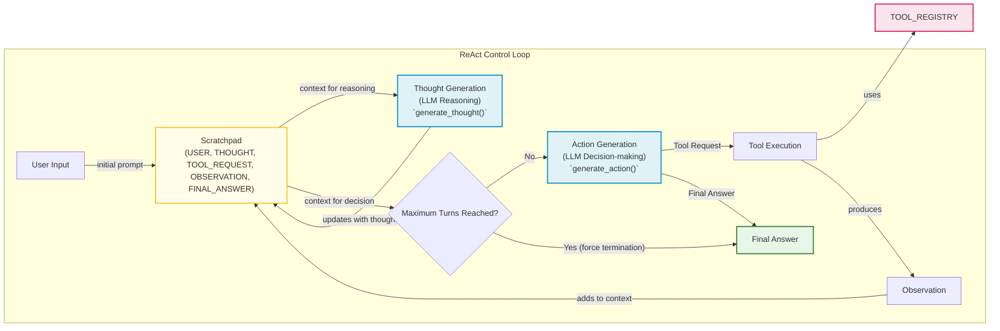

# Building a ReAct Agent From Scratch in Pure Python

In our journey from Python developer to AI Engineer, we have covered the foundational concepts of AI systems. We have explored the landscape of agents and workflows, learned the art of context engineering, and mastered how to get reliable, structured data out of LLMs. We also looked at the core patterns for building workflows and the mechanics of tool calling and planning.

Now, it is time to put it all together. This lesson is 100% practical. We will build a minimal ReAct agent from scratch, end-to-end, using only Python and the Gemini API. You will implement the full Thought → Action → Observation loop, giving you a concrete mental model of how these reasoning systems truly work.

When we started building our own AI agents, we initially turned to frameworks like LangGraph. We thought their graph-based model would make our logic cleaner. Instead, we found ourselves fighting the framework. Simple if-else statements and loops became hours of work as we tried to force our code into a paradigm that felt unnatural and added more complexity than value.

Frustrated, we did what we always do when we are stuck: we opened the source code. Reading LangGraph’s implementation of the ReAct loop was the "aha" moment. Seeing how they handled thought generation, tool execution, and state management gave us the mental model we couldn't get from the documentation. This hands-on experience is essential for building robust systems. Even if you don't use this exact implementation in production, building it yourself provides the confidence to debug, extend, and customize any agent you encounter.

In this lesson, we will walk through the core components of a ReAct agent, step by step, following the code in our accompanying notebook. We will cover setting up the environment, defining tools, implementing the thought and action phases, building the main control loop, and testing our agent to see it succeed and handle failures gracefully.

## Setup and Environment

Our first step is to set up the Python environment. This ensures that your code runs smoothly and that the outputs match the traces we will analyze later. A correct setup is the foundation for any successful project, and getting it right from the start prevents a lot of headaches down the line. This lesson is based on a notebook, and we will follow its structure closely.

1.  We start by loading our environment variables. We use a simple utility function to load the `GOOGLE_API_KEY` from a `.env` file at the root of our project. This is a standard practice for managing sensitive information like API keys, keeping them separate from the main codebase.
    ```python
    from lessons.utils import env
    
    env.load(required_env_vars=["GOOGLE_API_KEY"])
    ```
    It outputs:
    ```text
    Trying to load environment variables from `.../.env`
    Environment variables loaded successfully.
    ```
2.  Next, we import the necessary packages. We will use `google-genai` for interacting with the Gemini API, which provides the core LLM functionality. We will also use `pydantic` for data modeling, which helps us create structured and validated data classes for our agent's messages and actions. Finally, we import a few standard libraries like `enum` and `typing` for creating enumerations and type hints, which improve code readability and maintainability.
    ```python
    from enum import Enum
    from pydantic import BaseModel, Field
    from typing import List
    
    from google import genai
    from google.genai import types
    
    from lessons.utils import pretty_print
    ```
3.  We initialize the Gemini client, which will handle our API requests. This object is our gateway to the Gemini models.
    ```python
    client = genai.Client()
    ```
    It outputs:
    ```text
    Both GOOGLE_API_KEY and GEMINI_API_KEY are set. Using GOOGLE_API_KEY.
    ```
4.  Finally, we define the model we will use. For this lesson, we will use `gemini-2.5-flash`. This model is designed for speed and cost-effectiveness, making it an excellent choice for development and for tasks that require quick responses without sacrificing too much reasoning power.
    ```python
    MODEL_ID = "gemini-2.5-flash"
    ```

With the client and model ID in place, our environment is ready. This simple setup is all we need to start building the components of our ReAct agent. Now, we can define the external capabilities our agent will use.

## Tool Layer: Mock Search Implementation

A ReAct agent’s power comes from its ability to interact with the outside world through tools. For this lesson, we will create a simple mock search tool. This approach allows us to focus purely on the ReAct mechanics without getting bogged down in external dependencies or API key management. A mock tool also gives us predictable responses, which is ideal for learning and testing. This hands-on approach demystifies how frameworks operate internally and gives you full control for optimization and troubleshooting [[12]](https://www.dailydoseofds.com/ai-agents-crash-course-part-10-with-implementation/).

The educational benefit of using a mock tool is significant. It provides a transparent and controlled environment where you can observe the agent's decision-making process without the noise of real-world API variability. You can see exactly how the agent reacts to specific outputs, including failures, which is essential for learning how to build resilient systems. This focus on the core loop—Think, Act, Observe—builds a strong mental model for how agents operate, making it easier to debug and extend them later [[7]](https://medium.com/google-cloud/building-react-agents-from-scratch-a-hands-on-guide-using-gemini-ffe4621d90ae).

Our mock tool is a Python function named `search`. It takes a string `query` as input and returns a string as output.

1.  The docstring is particularly important. It is not just for human developers; it serves as the primary documentation for the LLM. The model will read this docstring to understand what the tool does and how to use it. Clear, descriptive docstrings are essential for reliable tool selection.
    ```python
    def search(query: str) -> str:
        """Search for information about a specific topic or query.
    
        Args:
            query (str): The search query or topic to look up.
        """
        query_lower = query.lower()
    
        # Predefined responses for demonstration
        if all(word in query_lower for word in ["capital", "france"]):
            return "Paris is the capital of France and is known for the Eiffel Tower."
        elif "react" in query_lower:
            return "The ReAct (Reasoning and Acting) framework enables LLMs to solve complex tasks by interleaving thought generation, action execution, and observation processing."
    
        # Generic response for unhandled queries
        return f"Information about '{query}' was not found."
    ```
    Inside the function, we have hardcoded responses for a few specific queries. For any other query, it returns a "not found" message. This fallback behavior is important for testing how the agent handles situations where a tool fails to provide the needed information. This teaches us how to build in graceful error handling, a key aspect of production-ready agents [[7]](https://medium.com/google-cloud/building-react-agents-from-scratch-a-hands-on-guide-using-gemini-ffe4621d90ae).

2.  To manage our tools, we create a `TOOL_REGISTRY`. This dictionary maps the tool's name (as a string) to its callable function. This registry allows our control loop to dynamically look up and execute the correct tool based on the name provided by the LLM.
    ```python
    TOOL_REGISTRY = {
        search.__name__: search,
    }
    ```

In a production system, you would replace this mock `search` function with a real one that calls an external API like Google Search or a domain-specific knowledge base. The beauty of this design is that the agent's core logic remains unchanged. The strategy is to replace the internal logic of the function while keeping the function signature and docstring consistent. This modular approach ensures that you can swap out implementations—from mock to real—without altering the agent's reasoning process, as the LLM's interaction is driven by the docstring and signature [[13]](https://atalupadhyay.wordpress.com/2025/11/25/building-a-real-time-web-searching-ai-agent-with-langchain-and-google-gemini/), [[5]](https://ai.google.dev/gemini-api/docs/langgraph-example). As long as the new function has the same name and a clear docstring, you can swap it in seamlessly.

## Thought Phase: Prompt Construction and Generation

The first step in the ReAct cycle is "Thought." This is where the agent reasons about the user's query and the conversation history to decide on a plan. This separation of reasoning from acting is a core principle of the ReAct framework, improving reliability and interpretability by allowing the model to form a coherent plan before committing to a tool or a final answer [[10]](https://www.promptingguide.ai/techniques/react). We guide this process with a carefully crafted prompt that provides the model with the necessary context and instructions. The reasoning traces help the model to induce, track, and update action plans, which is a central idea from the original ReAct paper [[1]](https://arxiv.org/pdf/2210.03629).

1.  To ensure the LLM knows which tools are available, we create a helper function that generates a minimal XML description of our tools from the `TOOL_REGISTRY`. This function iterates through the tools, extracts their docstrings, and formats them into an XML block. Using XML tags like `<tool>` and `<description>` helps the model clearly distinguish the tool's name from its purpose [[8]](https://help.openai.com/en/articles/6654000-best-practices-for-prompt-engineering-with-the-openai-api), [[9]](https://aws.amazon.com/blogs/machine-learning/structured-data-response-with-amazon-bedrock-prompt-engineering-and-tool-use/). This practice is also recommended in Gemini's official documentation, as using clear delimiters helps the model distinguish between instructions, context, and data [[11]](https://ai.google.dev/gemini-api/docs/prompting-strategies).
    ```python
    def build_tools_xml_description(tools: dict[str, callable]) -> str:
        """Build a minimal XML description of tools using only their docstrings."""
        lines = []
        for tool_name, fn in tools.items():
            doc = (fn.__doc__ or "").strip()
            lines.append(f"\t<tool name=\"{tool_name}\">")
            if doc:
                lines.append(f"\t\t<description>")
                for line in doc.split("\n"):
                    lines.append(f"\t\t\t{line}")
                lines.append(f"\t\t</description>")
            lines.append("\t</tool>")
        return "\n".join(lines)
    
    tools_xml = build_tools_xml_description(TOOL_REGISTRY)
    ```

2.  Next, we define the prompt template for the thought generation phase. It instructs the agent to analyze the situation, consider the available tools, and state its next thought as a short paragraph. The `{conversation}` placeholder is critical; it will be dynamically filled with the history of interactions from the agent's scratchpad, providing the necessary context for each new reasoning step.
    ```python
    PROMPT_TEMPLATE_THOUGHT = f"""
    You are deciding the next best step for reaching the user goal. You have some tools available to you.
    
    Available tools:
    <tools>
    {tools_xml}
    </tools>
    
    Conversation so far:
    <conversation>
    {{conversation}}
    </conversation>
    
    State your next thought about what to do next as one short paragraph focused on the next action you intend to take and why.
    Avoid repeating the same strategies that didn't work previously. Prefer different approaches.
    """.strip()
    ```
    Let's inspect the final prompt to see how it looks with the tool definitions injected. This transparency is key to debugging and understanding the agent's behavior.
    ```python
    print(PROMPT_TEMPLATE_THOUGHT)
    ```
    It outputs:
    ```text
    You are deciding the next best step for reaching the user goal. You have some tools available to you.
    
    Available tools:
    <tools>
        <tool name="search">
            <description>
                Search for information about a specific topic or query.
                
                Args:
                    query (str): The search query or topic to look up.
            </description>
        </tool>
    </tools>
    
    Conversation so far:
    <conversation>
    {conversation}
    </conversation>
    
    State your next thought about what to do next as one short paragraph focused on the next action you intend to take and why.
    Avoid repeating the same strategies that didn't work previously. Prefer different approaches.
    ```

3.  Finally, we implement the `generate_thought` function. It takes the current conversation history, formats the prompt, calls the Gemini model, and returns the generated thought as a clean text string. This function is the "brain" of the reasoning step, translating the accumulated context into a concrete plan.
    ```python
    def generate_thought(conversation: str, tool_registry: dict[str, callable]) -> str:
        """Generate a thought as plain text (no structured output)."""
        tools_xml = build_tools_xml_description(tool_registry)
        prompt = PROMPT_TEMPLATE_THOUGHT.format(conversation=conversation, tools_xml=tools_xml)
    
        response = client.models.generate_content(
            model=MODEL_ID,
            contents=prompt
        )
        return response.text.strip()
    ```

This function produces a natural language reasoning step, like "I need to find the capital of France, so I should use the search tool." This thought provides the rationale for the next phase: Action.

## Action Phase: Function Calling and Parsing

After the agent generates a thought, it needs to decide on a concrete action. This could be calling a tool or, if it has enough information, providing a final answer to the user. We will use Gemini's native function calling capabilities to handle this decision-making process. This feature allows the model to indicate when it wants to call an external function and provides the arguments in a structured JSON format [[9]](https://ai.google.dev/gemini-api/docs/function-calling).

### System Prompt Strategy

Our prompts for the action phase are intentionally high-level. The main prompt, `PROMPT_TEMPLATE_ACTION`, simply asks the model to decide between a tool call and a final answer based on the conversation history. It does not include technical details about the tools. This is because modern APIs like Gemini can infer tool schemas directly from the function definitions we provide in the configuration. This separation keeps our prompts clean and focused on the strategic goal, rather than getting cluttered with implementation details. We also have a `PROMPT_TEMPLATE_ACTION_FORCED` for situations where the agent must conclude, such as when it hits an iteration limit. This ensures the agent can terminate gracefully.

### Automatic Tool Integration

A key advantage of using a modern API like Gemini is that we do not need to include detailed tool schemas in our system prompt. Instead, we can pass the Python tool functions directly to the API configuration. The client automatically parses the function signatures and docstrings to create the necessary schema for the model [[9]](https://ai.google.dev/gemini-api/docs/function-calling). This separation of concerns is an effective design pattern: it keeps our prompts clean and focused on strategic guidance, while the API handles the technical details of tool integration. This makes the system more modular and easier to maintain.

1.  We start by defining the prompts for the action phase. We have two templates: one for the standard action-selection step and another to be used when we need to force the agent to provide a final answer, for example, when it reaches a maximum number of iterations. This `force_final` flag is an essential mechanism for ensuring the agent terminates gracefully instead of getting stuck in a loop.
    ```python
    PROMPT_TEMPLATE_ACTION = """
    You are selecting the best next action to reach the user goal.
    
    Conversation so far:
    <conversation>
    {conversation}
    </conversation>
    
    Respond either with a tool call (with arguments) or a final answer if you can confidently conclude.
    """.strip()
    
    # Dedicated prompt used when we must force a final answer
    PROMPT_TEMPLATE_ACTION_FORCED = """
    You must now provide a final answer to the user.
    
    Conversation so far:
    <conversation>
    {conversation}
    </conversation>
    
    Provide a concise final answer that best addresses the user's goal.
    """.strip()
    ```

2.  To handle the model's output, we define two Pydantic models: `ToolCallRequest` and `FinalAnswer`. As we learned in Lesson 4, these classes ensure that the data we parse from the model's response is structured and validated, creating a reliable contract between the LLM and our application code.
    ```python
    class ToolCallRequest(BaseModel):
        """A request to call a tool with its name and arguments."""
        tool_name: str = Field(description="The name of the tool to call.")
        arguments: dict = Field(description="The arguments to pass to the tool.")
    
    
    class FinalAnswer(BaseModel):
        """A final answer to present to the user when no further action is needed."""
        text: str = Field(description="The final answer text to present to the user.")
    ```

3.  Now, we implement the `generate_action` function. This is the core of the action phase.
    ```python
    def generate_action(conversation: str, tool_registry: dict[str, callable] | None = None, force_final: bool = False) -> (ToolCallRequest | FinalAnswer):
        """Generate an action by passing tools to the LLM and parsing function calls or final text.
    
        When force_final is True or no tools are provided, the model is instructed to produce a final answer and tool calls are disabled.
        """
        # Use a dedicated prompt when forcing a final answer or no tools are provided
        if force_final or not tool_registry:
            prompt = PROMPT_TEMPLATE_ACTION_FORCED.format(conversation=conversation)
            response = client.models.generate_content(
                model=MODEL_ID,
                contents=prompt
            )
            return FinalAnswer(text=response.text.strip())
    
        # Default action prompt
        prompt = PROMPT_TEMPLATE_ACTION.format(conversation=conversation)
    
        # Provide the available tools to the model; disable auto-calling so we can parse and run ourselves
        tools = list(tool_registry.values())
        config = types.GenerateContentConfig(
            tools=tools,
        )
        response = client.models.generate_content(
            model=MODEL_ID,
            contents=prompt,
            config=config,
        )
    
        # Extract the function call from the response (if present)
        candidate = response.candidates[0]
        if hasattr(candidate.content.parts[0], "function_call"):
            fc = candidate.content.parts[0].function_call
            name = fc.name
            args = dict(fc.args) if fc.args is not None else {}
            return ToolCallRequest(tool_name=name, arguments=args)
        
        # Otherwise, it's a final answer
        final_answer = "".join(part.text for part in candidate.content.parts)
        return FinalAnswer(text=final_answer.strip())
    ```
    This function first checks if a final answer should be forced. If so, it uses the `PROMPT_TEMPLATE_ACTION_FORCED` and returns a `FinalAnswer`. Otherwise, it sends the standard action prompt along with the list of available tools to the Gemini API. The `config` object is where the magic happens: by passing the Python functions in `tools`, we let the Gemini client handle the schema generation.

    The parsing logic then inspects the response. The `hasattr(candidate.content.parts[0], "function_call")` check is a safe way to determine if the model returned a tool call. If it did, we extract the `name` and `args` to construct a `ToolCallRequest`. If not, we concatenate the text parts of the response to form the `FinalAnswer`. This robust parsing logic is essential for handling the two possible outcomes of the action phase.

This separation of thought and action, combined with native function calling, creates a robust and maintainable agent architecture.

## Control Loop: Messages, Scratchpad, and Orchestration

With the thought and action phases defined, we can now build the control loop that orchestrates the entire ReAct cycle. This loop is the engine of our agent. It manages the conversation history, calls the thought and action generation functions, executes tools, and processes the resulting observations to feed back into the next cycle.

### Message Structure Foundation

To keep track of the conversation, we define a structured message system. The `MessageRole` enum categorizes each part of the interaction (e.g., `USER`, `THOUGHT`, `TOOL_REQUEST`). The `Message` Pydantic model holds the content and role for each message. This structured approach is far superior to simply appending raw strings to a history, as it provides a clear, machine-readable log of the agent's process, which is invaluable for debugging and maintaining state [[14]](https://www.neradot.com/post/building-a-python-react-agent-class-a-step-by-step-guide), [[15]](https://machinelearningmastery.com/building-react-agents-with-langgraph-a-beginners-guide/).

1.  First, we define the `MessageRole` and `Message` classes.
    ```python
    class MessageRole(str, Enum):
        """Enumeration for the different roles a message can have."""
        USER = "user"
        THOUGHT = "thought"
        TOOL_REQUEST = "tool request"
        OBSERVATION = "observation"
        FINAL_ANSWER = "final answer"
    
    
    class Message(BaseModel):
        """A message with a role and content, used for all message types."""
        role: MessageRole = Field(description="The role of the message in the ReAct loop.")
        content: str = Field(description="The textual content of the message.")
    
        def __str__(self) -> str:
            """Provides a user-friendly string representation of the message."""
            return f"{self.role.value.capitalize()}: {self.content}"
    ```

2.  We also create a `pretty_print_message` utility to display messages in a color-coded, readable format. This will make it easy to trace the agent's execution and understand its decision-making process at each step.
    ```python
    def pretty_print_message(message: Message, turn: int, max_turns: int, header_color: str = pretty_print.Color.YELLOW, is_forced_final_answer: bool = False) -> None:
        if not is_forced_final_answer:
            title = f"{message.role.value.capitalize()} (Turn {turn}/{max_turns}):"
        else:
            title = f"{message.role.value.capitalize()} (Forced):"
    
        pretty_print.wrapped(
            text=message.content,
            title=title,
            header_color=header_color,
        )
    ```

3.  The `Scratchpad` class acts as the agent's short-term memory. It holds a list of `Message` objects and provides methods to append new messages and convert the entire history to a string for the LLM's context.
    ```python
    class Scratchpad:
        """Container for ReAct messages with optional pretty-print on append."""
    
        def __init__(self, max_turns: int) -> None:
            self.messages: List[Message] = []
            self.max_turns: int = max_turns
            self.current_turn: int = 1
    
        def set_turn(self, turn: int) -> None:
            self.current_turn = turn
    
        def append(self, message: Message, verbose: bool = False, is_forced_final_answer: bool = False) -> None:
            self.messages.append(message)
            if verbose:
                role_to_color = {
                    MessageRole.USER: pretty_print.Color.RESET,
                    MessageRole.THOUGHT: pretty_print.Color.ORANGE,
                    MessageRole.TOOL_REQUEST: pretty_print.Color.GREEN,
                    MessageRole.OBSERVATION: pretty_print.Color.YELLOW,
                    MessageRole.FINAL_ANSWER: pretty_print.Color.CYAN,
                }
                header_color = role_to_color.get(message.role, pretty_print.Color.YELLOW)
                pretty_print_message(
                    message=message,
                    turn=self.current_turn,
                    max_turns=self.max_turns,
                    header_color=header_color,
                    is_forced_final_answer=is_forced_final_answer,
                )
    
        def to_string(self) -> str:
            return "\n".join(str(m) for m in self.messages)
    ```
    While this simple scratchpad is effective for short tasks, it has a critical limitation in long-running agents: context avalanche. With each turn, the full history is re-sent to the model, causing token consumption to grow quadratically, not linearly [[16]](https://www.zartis.com/ai-agent-cost-optimisation-why-token-cost-is-the-wrong-number-to-optimise/). In production, you would need more advanced strategies, like summarizing older turns, to manage this.

### Control Loop Architecture

This iterative cycle of sensing (observation), planning (thought), and acting (action) is not unique to AI agents. It mirrors the feedback control loops used in robotics and other self-adaptive systems, often described by models like MAPE (Monitor-Analyze-Plan-Execute) [[17]](https://www.sciencedirect.com/topics/computer-science/feedback-control-loop). This gives us a robust engineering pattern to follow as we implement the `react_agent_loop`, the heart of our agent.

We will break down the implementation of the `react_agent_loop` function into several logical steps to make it easier to understand.

1.  First, we define the function signature and initialize the `Scratchpad`. The loop starts by appending the initial user question, which kicks off the entire process.
    ```python
    def react_agent_loop(initial_question: str, tool_registry: dict[str, callable], max_turns: int = 5, verbose: bool = False) -> str:
        """
        Implements the main ReAct (Thought -> Action -> Observation) control loop.
        Uses a unified message class for the scratchpad.
        """
        scratchpad = Scratchpad(max_turns=max_turns)
    
        # Add the user's question to the scratchpad
        user_message = Message(role=MessageRole.USER, content=initial_question)
        scratchpad.append(user_message, verbose=verbose)
    ```

2.  The main control loop iterates for a maximum number of turns. At the start of each turn, we update the turn counter in the scratchpad for clear logging.
    ```python
        for turn in range(1, max_turns + 1):
            scratchpad.set_turn(turn)
    ```

3.  Inside the loop, the first step is to generate a thought based on the current state of the scratchpad. This thought is then appended back to the scratchpad to be included in the context for the next step.
    ```python
            # Generate a thought based on the current scratchpad
            thought_content = generate_thought(
                scratchpad.to_string(),
                tool_registry,
            )
            thought_message = Message(role=MessageRole.THOUGHT, content=thought_content)
            scratchpad.append(thought_message, verbose=verbose)
    ```

4.  Next, the agent generates an action. If the model returns a `FinalAnswer`, we append it to the scratchpad and terminate the loop by returning the answer. This is the primary exit condition for the agent.
    ```python
            # Generate an action based on the current scratchpad
            action_result = generate_action(
                scratchpad.to_string(),
                tool_registry=tool_registry,
            )
    
            # If the model produced a final answer, return it
            if isinstance(action_result, FinalAnswer):
                final_answer = action_result.text
                final_message = Message(role=MessageRole.FINAL_ANSWER, content=final_answer)
                scratchpad.append(final_message, verbose=verbose)
                return final_answer
    ```

5.  If the action is a `ToolCallRequest`, we move to the observation phase. We log the tool request, execute the tool, and capture the output. The `try...except` block is essential for resilience; it catches any errors during tool execution and formats them as an observation. This allows the agent to reason about the failure in its next thought phase. We also handle cases where the model hallucinates a non-existent tool.
    ```python
            # Otherwise, it is a tool request
            if isinstance(action_result, ToolCallRequest):
                action_name = action_result.tool_name
                action_params = action_result.arguments
    
                # Add the action to the scratchpad
                params_str = ", ".join([f"{k}='{v}'" for k, v in action_params.items()])
                action_content = f"{action_name}({params_str})"
                action_message = Message(role=MessageRole.TOOL_REQUEST, content=action_content)
                scratchpad.append(action_message, verbose=verbose)
    
                # Run the action and get the observation
                observation_content = ""
                if action_name in tool_registry:
                    tool_function = tool_registry[action_name]
                    try:
                        observation_content = tool_function(**action_params)
                    except Exception as e:
                        observation_content = f"Error executing tool '{action_name}': {e}"
                else:
                    observation_content = f"Error: Tool '{action_name}' not found. Available tools: {list(tool_registry.keys())}"
    
                # Add the observation to the scratchpad
                observation_message = Message(role=MessageRole.OBSERVATION, content=observation_content)
                scratchpad.append(observation_message, verbose=verbose)
    ```

6.  Finally, we have our safety net. If the loop reaches the `max_turns` limit without producing a final answer, we call `generate_action` one last time with `force_final=True`. This instructs the model to summarize its findings and provide the best possible answer with the information it has, preventing infinite loops.
    ```python
            # Check if the maximum number of turns has been reached. If so, force the action selector to produce a final answer
            if turn == max_turns:
                forced_action = generate_action(
                    scratchpad.to_string(),
                    force_final=True,
                )
                if isinstance(forced_action, FinalAnswer):
                    final_answer = forced_action.text
                else:
                    final_answer = "Unable to produce a final answer within the allotted turns."
                final_message = Message(role=MessageRole.FINAL_ANSWER, content=final_answer)
                scratchpad.append(final_message, verbose=verbose, is_forced_final_answer=True)
                return final_answer
    ```

Image 1 visualizes this entire control flow, showing how messages are passed through the `Scratchpad` and how the loop orchestrates the Thought, Action, and Observation phases until a final answer is produced.


Image 1: A flowchart illustrating the ReAct control loop with iterative Thought, Action, and Observation cycles, including termination conditions and the role of the Scratchpad and TOOL_REGISTRY.

## Tests and Traces: Success and Graceful Fallback

Now that we have built the complete ReAct agent, it is time to test it. We will run two scenarios: one where the mock tool has the answer and one where it does not. Analyzing the output traces will validate that our loop, tool integration, and termination logic work as designed. This step is important for building confidence in the agent's reliability and for understanding its behavior in different situations [[12]](https://www.dailydoseofds.com/ai-agents-crash-course-part-10-with-implementation/).

### Successful Run

First, let's ask a question that our mock `search` tool is programmed to answer: "What is the capital of France?" We will set `max_turns` to 2 and enable `verbose` to see the full trace. This allows us to inspect the agent's internal monologue and decision-making process.

1.  Here is the code to run the agent.
    ```python
    question = "What is the capital of France?"
    final_answer = react_agent_loop(question, TOOL_REGISTRY, max_turns=2, verbose=True)
    ```
    The agent executes and prints a detailed trace of its process.

2.  **Turn 1 Analysis:**
    -   **User:** The loop begins with the initial question, "What is the capital of France?".
    -   **Thought:** The agent's first thought is, "I need to find the capital of France. I can use the search tool to find this information." This shows clear intent and correct identification of the required tool.
    -   **Tool Request:** Based on its thought, it generates a `ToolCallRequest`: `search(query='capital of France')`. The action directly corresponds to the plan.
    -   **Observation:** The `TOOL_REGISTRY` executes the `search` function, which returns the predefined answer: "Paris is the capital of France and is known for the Eiffel Tower." This observation is added to the scratchpad.

3.  **Turn 2 Analysis:**
    -   **Thought:** With the new observation in its context, the agent reasons, "I have found the answer in the previous step. I can now provide the final answer to the user." The agent correctly recognizes that the task is complete.
    -   **Final Answer:** It concludes by extracting the core information and presenting it: "Paris is the capital of France."

The full trace confirms that the agent successfully follows the Thought-Action-Observation cycle, uses the tool correctly, and terminates within the turn limit once it finds the answer.

### Graceful Fallback

Next, let's test a query our mock tool cannot answer: "What is the capital of Italy?" This will test the agent's ability to handle tool failures and its forced termination logic, which are essential for building resilient agents [[7]](https://medium.com/google-cloud/building-react-agents-from-scratch-a-hands-on-guide-using-gemini-ffe4621d90ae).

1.  We run the agent with the new question.
    ```python
    question = "What is the capital of Italy?"
    final_answer = react_agent_loop(question, TOOL_REGISTRY, max_turns=2, verbose=True)
    ```

2.  **Turn 1 Analysis:**
    -   **Thought:** The agent's initial plan is the same: "I need to find the capital of Italy. I will use the search tool."
    -   **Tool Request:** It calls `search(query='capital of Italy')`.
    -   **Observation:** The tool returns the fallback message: "Information about 'capital of Italy' was not found." This negative feedback is important for the next reasoning step.

3.  **Turn 2 Analysis:**
    -   **Thought:** Observing the failure, the agent adapts its strategy. It reasons, "The previous search for 'capital of Italy' failed. I will try a broader search for just 'Italy' to see if I can find any relevant information that might lead me to the capital." This demonstrates adaptive problem-solving.
    -   **Tool Request:** It calls `search(query='Italy')`.
    -   **Observation:** This search also fails, returning "Information about 'Italy' was not found."

4.  **Forced Termination Analysis:**
    -   Having reached the `max_turns` limit of 2, the control loop triggers the forced final answer mechanism. This prevents the agent from getting stuck in an infinite loop of failed attempts.
    -   **Final Answer (Forced):** The agent generates a polite and honest response based on its final state: "I'm sorry, but I couldn't find information about the capital of Italy."

This trace demonstrates the agent's resilience. It does not crash on tool failure but instead tries a different approach. When it exhausts its attempts, the control loop ensures it terminates gracefully with a helpful message.

These tests confirm our from-scratch implementation of the ReAct loop is working correctly. We now have a solid foundation for building more complex and capable agents.

## Conclusion

By building a ReAct agent from the ground up, we have demystified the magic behind agentic frameworks. We have seen how a simple loop, combined with structured prompts and native function calling, can orchestrate a powerful Thought-Action-Observation cycle. This hands-on process provides a concrete mental model that is far more valuable than just using a high-level library. You now understand the core mechanics of how an agent reasons, acts on the world, and learns from feedback.

This foundation is critical. The principles of managing an agent's state and context will remain relevant even as the underlying technology evolves. For example, the advent of models with million-token context windows may reduce the need for complex summarization techniques, but it also introduces new challenges, as the model can "drown" in excessive information if the context is not managed carefully [[18]](https://www.linkedin.com/posts/andreashorn1_%F0%9D%97%A5%F0%9D%97%B2%F0%9D%97%B0%F0%9D%98%82%F0%9D%97%BF%F0%9D%98%80%F0%9D%97%B6%F0%9D%98%83%F0%9D%97%B2-%F0%9D%97%9F%F0%9D%97%AE%F0%9D%97%BB%F0%9D%97%B4%F0%9D%98%82%F0%9D%97%AE%F0%9D%97%B4%F0%9D%97%B2-%F0%9D%97%A0%F0%9D%97%BC%F0%9D%97%B1%F0%9D%97%B2%F0%9D%97%B9%F0%9D%98%80-activity-7427962498198290433-M4wm). Even if you use a framework like LangGraph in production for its convenience and features like parallel execution and monitoring, you now have the knowledge to look under the hood, debug effectively, and customize its behavior. You are no longer just a user of a black box; you are an AI Engineer who understands the principles.

This lesson concludes our exploration of the core building blocks of agents. In our upcoming lessons, we will build on this foundation to explore more advanced topics. In Lesson 9, we will explore Agent Memory, exploring how agents can remember information across conversations. Following that, in Lesson 10, we will do a deep dive into Retrieval-Augmented Generation (RAG) to see how agents can leverage vast external knowledge bases.

## References

- [1] [ReAct: Synergizing Reasoning and Acting in Language Models](https://arxiv.org/pdf/2210.03629)
- [2] [ReAct Agent - IBM](https://www.ibm.com/think/topics/react-agent)
- [3] [AI Agent Planning - IBM](https://www.ibm.com/think/topics/ai-agent-planning)
- [4] [Building effective agents - Anthropic](https://www.anthropic.com/engineering/building-effective-agents)
- [5] [ReAct agent from scratch with Gemini 2.5 and LangGraph](https://ai.google.dev/gemini-api/docs/langgraph-example)
- [6] [From LLM Reasoning to Autonomous AI Agents: A Comprehensive Review](https://arxiv.org/pdf/2504.19678)
- [7] [Building ReAct Agents from Scratch using Gemini](https://medium.com/google-cloud/building-react-agents-from-scratch-a-hands-on-guide-using-gemini-ffe4621d90ae)
- [8] [Best practices for prompt engineering with the OpenAI API](https://help.openai.com/en/articles/6654000-best-practices-for-prompt-engineering-with-the-openai-api)
- [9] [Gemini Function Calling Documentation](https://ai.google.dev/gemini-api/docs/function-calling)
- [10] [ReAct - Prompting Guide](https://www.promptingguide.ai/techniques/react)
- [11] [Prompt design strategies](https://ai.google.dev/gemini-api/docs/prompting-strategies)
- [12] [Implementing ReAct Agentic Pattern From Scratch](https://www.dailydoseofds.com/ai-agents-crash-course-part-10-with-implementation/)
- [13] [Building a Real-Time Web Searching AI Agent with LangChain and Google Gemini](https://atalupadhyay.wordpress.com/2025/11/25/building-a-real-time-web-searching-ai-agent-with-langchain-and-google-gemini/)
- [14] [Building a Python ReAct Agent Class: A Step-by-Step Guide](https://www.neradot.com/post/building-a-python-react-agent-class-a-step-by-step-guide)
- [15] [Building ReAct Agents with LangGraph: A Beginner’s Guide](https://machinelearningmastery.com/building-react-agents-with-langgraph-a-beginners-guide/)
- [16] [AI Agent Cost Optimisation: Why Token Cost is the Wrong Number to Optimise](https://www.zartis.com/ai-agent-cost-optimisation-why-token-cost-is-the-wrong-number-to-optimise/)
- [17] [Feedback Control Loop - an overview | ScienceDirect Topics](https://www.sciencedirect.com/topics/computer-science/feedback-control-loop)
- [18] [Andreas Horn on LinkedIn](https://www.linkedin.com/posts/andreashorn1_%F0%9D%97%A5%F0%9D%97%B2%F0%9D%97%B0%F0%9D%98%82%F0%9D%97%BF%F0%9D%98%80%F0%9D%97%B6%F0%9D%98%83%F0%9D%97%B2-%F0%9D%97%9F%F0%9D%97%AE%F0%9D%97%BB%F0%9D%97%B4%F0%9D%98%82%F0%9D%97%AE%F0%9D%97%B4%F0%9D%97%B2-%F0%9D%97%A0%F0%9D%97%BC%F0%9D%97%B1%F0%9D%97%B2%F0%9D%97%B9%F0%9D%98%80-activity-7427962498198290433-M4wm)
</article>