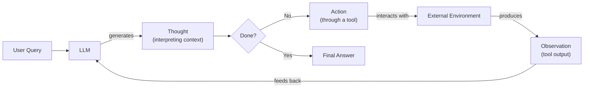

# Lesson 8: Building a ReAct Agent From Scratch

In our previous lessons, we have covered the theoretical foundations of AI engineering. We have explored the landscape of AI agents, distinguished between rule-based workflows and autonomous agents, and learned the art of context engineering. We have also covered how to get structured data from LLMs, how to give them tools through function calling, and the theory behind reasoning patterns like ReAct.

This lesson is 100% practice. We will take everything we have learned and build a minimal ReAct agent from the ground up, using only Python and the Gemini API. By implementing the full Thought → Action → Observation loop yourself, you will gain a concrete mental model of how these reasoning agents work. This architecture creates a synergy between reasoning and acting: reasoning traces help the model track and update its plan, while actions allow it to interface with external sources to gather new information [[1]](https://arxiv.org/pdf/2210.03629). This hands-on experience is what gives you the confidence to extend, debug, and customize agents for production.

We will walk through the implementation step-by-step, mirroring the code in the associated notebook. You will learn how to:
- Set up the environment and select the right model.
- Define a mock tool to simulate external interactions.
- Generate thoughts to guide the agent’s reasoning.
- Select and parse actions using function calling.
- Orchestrate the full cycle in a turn-based control loop.
- Test the agent and analyze its success and failure traces.

## Setup and Environment

Our first step is to set up a clean Python environment to ensure the code runs smoothly and the outputs match our expected traces. A well-defined environment is critical for reproducibility, as it isolates our project's dependencies from other projects on your machine. This involves loading our API keys, importing the necessary libraries, and initializing the Gemini client.

1.  We start by loading our environment variables. We use a `.env` file to store sensitive information like API keys, which should never be committed to version control. The `lessons.utils.env.load()` helper function reads this file and ensures our `GOOGLE_API_KEY` is available for the Gemini client.
    ```python
    from lessons.utils import env
    
    env.load(required_env_vars=["GOOGLE_API_KEY"])
    ```

2.  Next, we import the required libraries. We will use `google-genai` for interacting with the Gemini API, which provides the core functionality for our agent's "brain." We will also use `pydantic` for data validation, which helps us enforce a strict structure on the data flowing through our agent, a concept we covered in Lesson 4. Finally, standard typing modules like `Enum` and `Union` will help us write clean, type-safe code.
    ```python
    import json
    from enum import Enum
    from typing import Union
    
    from google import genai
    from pydantic import BaseModel, Field
    
    from lessons.utils import pretty_print
    ```

3.  We initialize the Gemini client. This object is our main interface for making API calls to the Gemini models. It uses the API key we loaded in the first step to authenticate our requests.
    ```python
    client = genai.Client()
    ```

4.  Finally, we define the model we will use. For this lesson, we will use `gemini-2.5-flash`, which is a fast and cost-effective choice for tasks that do not require intensive, multi-step reasoning. For more complex agents that need to perform deeper analysis or planning, a more powerful model like `gemini-2.5-pro` might be a better choice, though it comes at a higher cost and latency.
    ```python
    MODEL_ID = "gemini-2.5-flash"
    ```

With the client and model in place, we can now define an external capability for our agent to use.

## Tool Layer: Mock Search Implementation

To build a ReAct agent, we need to give it tools to interact with an external environment. For this lesson, we will create a simple mock search tool instead of calling a real API like Google Search. This approach offers several advantages for learning and development.

First, it simplifies our focus. By using a mock tool, we can concentrate entirely on the mechanics of the ReAct loop—thought, action, and observation—without getting sidetracked by external dependencies, network latency, or the complexities of managing API keys. This allows us to build and test the core agent logic in a controlled environment. Second, a mock tool provides predictable and consistent responses. This is essential for testing and debugging. When the tool's output is known, we can reliably verify that our agent behaves as expected in specific scenarios, making it easier to trace its reasoning and identify any issues in the control loop. This hands-on implementation provides a concrete mental model for how to debug and extend agents with confidence [[15]](https://pub.towardsai.net/beyond-the-prompt-engineering-the-thought-action-observation-loop-2e1fd99114d2).

Our mock `search` function will simulate a web search. It takes a query string and returns a hardcoded response if the query matches one of a few predefined topics. If the query is not recognized, it returns a "not found" message, which simulates a failed search. This fallback behavior is important for testing our agent's ability to handle tool failures gracefully and adapt its strategy, a key feature of robust agents [[7]](https://medium.com/google-cloud/building-react-agents-from-scratch-a-hands-on-guide-using-gemini-ffe4621d90ae).

1.  We define the `search` function with a clear signature and a descriptive docstring. As we learned in Lesson 6, the docstring is critical because modern function-calling APIs, like Gemini's, use it as the description for the tool. This documentation helps the LLM understand what the tool does, what arguments it expects, and when it should be used.
    ```python
    def search(query: str) -> str:
        """
        A mock search tool that returns predefined results for specific queries.
    
        Args:
            query: The search query.
    
        Returns:
            A string with the search result or a 'not found' message.
        """
        if "eiffel tower" in query.lower():
            return "The Eiffel Tower is a wrought-iron lattice tower on the Champ de Mars in Paris, France."
        if "capital of france" in query.lower():
            return "Paris is the capital of France and is known for the Eiffel Tower."
        return f"Information about '{query}' was not found."
    ```

2.  To make our tools manageable and accessible to the agent, we create a `TOOL_REGISTRY`. This dictionary maps the tool's string name to its handler function. This registry allows our agent's control loop to look up and execute the correct function based on the name provided by the LLM in its action step.
    ```python
    TOOL_REGISTRY = {
        "search": search,
    }
    ```

In a production system, this modular design makes it easy to swap out the mock function with a real API call to Google Search, Wikipedia, or any domain-specific knowledge base, as long as the function signature is preserved [[7]](https://medium.com/google-cloud/building-react-agents-from-scratch-a-hands-on-guide-using-gemini-ffe4621d90ae). It is good practice to invest the same effort in designing your tool definitions as you would in a human-computer interface (HCI). Think of it as creating a good "agent-computer interface" (ACI). Your tool's name, description, and parameters should be as clear as possible to the LLM. For example, the Anthropic team found that their coding agent made fewer mistakes when a file-editing tool was changed to require absolute filepaths instead of relative ones, making the agent's behavior more reliable [[4]](https://www.anthropic.com/engineering/building-effective-agents).

## Thought Phase: Prompt Construction and Generation

The first phase of the ReAct cycle is "Thought." This is where the agent interprets the user's query and its context, then formulates a plan for what to do next. This step is a form of AI agent planning, where the model breaks down a high-level goal into smaller, more manageable sub-goals—a process called task decomposition [[3]](https://www.ibm.com/think/topics/ai-agent-planning). The reasoning traces generated in this phase help the model track its progress and update its plan as it receives new information [[1]](https://arxiv.org/pdf/2210.03629).

To guide this process, we will construct a prompt that instructs the LLM to think step-by-step and decide on its next action. We will use a prompt template that includes the available tools and the conversation history. The tools are formatted using XML tags, a context engineering technique we covered in Lesson 3. This helps the LLM clearly distinguish the tool descriptions from other parts of the prompt, improving its ability to reason about which tools are available.

1.  We start by defining a helper function to format our tool registry into an XML string. Each tool is wrapped in `<tool>` tags, with its name and description (extracted from the function's docstring) included. This provides a structured, machine-readable list of capabilities for the LLM.
    ```python
    def build_tools_xml_description(tool_registry: dict) -> str:
        """Builds an XML string describing the available tools."""
        xml = "<tools>\n"
        for tool_name, tool_handler in tool_registry.items():
            xml += f'<tool name="{tool_name}">\n'
            xml += f"<description>{tool_handler.__doc__}</description>\n"
            xml += "</tool>\n"
        xml += "</tools>"
        return xml
    ```

2.  Next, we define the prompt template for the thought-generation step. It includes placeholders for the tool descriptions and the ongoing conversation history. The instructions explicitly guide the model to analyze the context and produce a `thought` explaining its reasoning for the next step, all wrapped in `<thought>` tags. This structured output makes the agent's internal reasoning explicit and easier to parse.
    ```python
    tools_xml = build_tools_xml_description(TOOL_REGISTRY)
    
    PROMPT_TEMPLATE_THOUGHT = f"""
    You are an AI assistant that answers questions by thinking step-by-step and using the available tools.
    
    {tools_xml}
    
    The conversation so far is:
    <conversation>
    {{conversation}}
    </conversation>
    
    Your task is to analyze the conversation and determine the next step.
    If you can answer the question directly, provide the final answer.
    If you need more information, think about which tool to use.
    
    Your output must be a single thought, wrapped in <thought> tags.
    For example:
    <thought>I need to search for the capital of France to answer the user's question.</thought>
    """
    ```
    The resulting prompt template, with the tool information filled in, looks like this:
    ```text
    You are an AI assistant that answers questions by thinking step-by-step and using the available tools.
    
    <tools>
    <tool name="search">
    <description>
            A mock search tool that returns predefined results for specific queries.
    
            Args:
                query: The search query.
    
            Returns:
                A string with the search result or a 'not found' message.
            
    </description>
    </tool>
    </tools>
    
    The conversation so far is:
    <conversation>
    {conversation}
    </conversation>
    
    Your task is to analyze the conversation and determine the next step.
    If you can answer the question directly, provide the final answer.
    If you need more information, think about which tool to use.
    
    Your output must be a single thought, wrapped in <thought> tags.
    For example:
    <thought>I need to search for the capital of France to answer the user's question.</thought>
    ```

3.  Finally, we create the `generate_thought` function. It takes the current conversation history, formats the prompt template, and calls the Gemini API to generate the next thought. The function then returns the cleaned text response.
    ```python
    def generate_thought(conversation: str, tool_registry: dict) -> str:
        """Generates a thought based on the conversation and available tools."""
        prompt = PROMPT_TEMPLATE_THOUGHT.format(conversation=conversation)
        response = client.models.generate_content(model=MODEL_ID, contents=prompt)
        return response.text.strip()
    ```

This function produces a short, purposeful thought that guides the agent's next step. With a coherent thought generated, the agent must now decide whether to call a tool or conclude with a final answer.

## Action Phase: Function Calling and Parsing

The "Action" phase is where the agent decides what to do based on its thought. It can either execute a tool to gather more information or provide a final answer if it has enough context. We will use Gemini's native function calling capabilities to handle this, which is a more robust and reliable method than parsing text-based actions from the LLM's output.

As we discussed in Lesson 6, instead of manually crafting prompts with tool signatures, we can pass the Python function definitions directly to the model's configuration. The Gemini SDK automatically extracts the function name, docstring (for the description), and parameter information from the function's type hints. This separation of concerns is a key advantage of modern agent frameworks: it keeps our system prompt clean and focused on high-level strategy, while the API handles the technical details of tool integration [[9]](https://ai.google.dev/gemini-api/docs/function-calling). This approach is a major improvement over first-generation ReAct agents, which relied on brittle text parsing and were prone to errors [[11]](https://www.philschmid.de/langgraph-gemini-2-5-react-agent).

Our prompt for this phase will instruct the agent to decide between using a tool or finishing the task. The model's response will either be a structured `function_call` object, which our code can parse and execute, or a plain text response that we interpret as the final answer.

1.  First, we define a Pydantic model for our tool calls. As we learned in Lesson 4, using Pydantic ensures that the output from the LLM is structured and validated, making it easy and safe to parse.
    ```python
    class ToolCallRequest(BaseModel):
        """A Pydantic model for a tool call request."""
        name: str
        args: dict
    ```

2.  Next, we define a constant for our "finish" action. Using a constant instead of a magic string makes the code more readable and less prone to typos.
    ```python
    ACTION_FINISH = "finish"
    ```

3.  The system prompt for the action phase is focused on decision-making. It provides the agent with the user's query, the full conversation history, and its most recent thought. It then instructs the agent to choose its next action: either call a tool or provide the final answer.
    ```python
    PROMPT_TEMPLATE_ACTION = """
    You are an AI assistant that answers questions by thinking step-by-step and using the available tools.
    Your task is to take the user's query, the conversation history, and your thought, and decide on the next action.
    
    You have two choices:
    1. Use a tool to get more information.
    2. Provide the final answer with the 'finish' action if you have enough information.
    
    The conversation so far is:
    <conversation>
    {conversation}
    </conversation>
    
    Your thought is:
    <thought>
    {thought}
    </thought>
    """
    ```

4.  The `generate_action` function orchestrates this phase. It constructs the prompt and configures the Gemini client with the available tools from our `TOOL_REGISTRY`. By passing the Python functions directly into the `tools` parameter of `GenerateContentConfig`, we enable Gemini's native function calling.
    ```python
    def generate_action(
        thought: str, conversation: str, tool_registry: dict
    ) -> Union[ToolCallRequest, str]:
        """Generates an action based on the thought and conversation."""
        prompt = PROMPT_TEMPLATE_ACTION.format(
            conversation=conversation, thought=thought
        )
        tools = list(tool_registry.values())
    
        response = client.models.generate_content(
            model=MODEL_ID,
            contents=prompt,
            config=genai.types.GenerateContentConfig(tools=tools),
        )
        
        # Check if the model returned a function call
        if hasattr(response.candidates[0].content.parts[0], "function_call"):
            function_call = response.candidates[0].content.parts[0].function_call
            return ToolCallRequest(name=function_call.name, args=dict(function_call.args))
        
        # Otherwise, assume it's a final answer
        return ACTION_FINISH
    ```
    The function then parses the model's response. It checks if the response contains a `function_call` attribute. If it does, it extracts the function's name and arguments and returns a `ToolCallRequest` object. If there is no function call, the agent has decided it has enough information to answer, so the function returns the `ACTION_FINISH` string. This dual-return logic is the core of the action phase, cleanly separating tool execution from task completion.

With the ability to generate thoughts and decide on actions, we now have all the pieces needed to build the main control loop that will bring our agent to life.

## Control Loop: Messages, Scratchpad, Orchestration

The control loop is the engine of our ReAct agent. It orchestrates the entire Thought-Action-Observation cycle, managing the conversation history, executing tools, and processing observations. This loop is what makes the agent autonomous, allowing it to iterate through reasoning steps until it reaches a conclusion. This iterative process is fundamental to how ReAct agents handle complex, multi-step tasks [[6]](https://arxiv.org/pdf/2504.19678).

Image 1: A flowchart illustrating the Theoretical ReAct Agent Design, showing the iterative Thought-Action-Observation loop.



At its core, this cycle mirrors a classic feedback control loop, a fundamental concept in control theory and engineering. The agent takes an action (the input), sees the result (the observation), compares this new state to its goal, and then generates a new thought to adjust its next action, continuously working to minimize the "error" between its current state and the desired outcome [[11]](https://eng.libretexts.org/Bookshelves/Industrial_and_Systems_Engineering/Chemical_Process_Dynamics_and_Controls_(Woolf)/11%3A_Control_Architectures/11.01%3A_Feedback_control-_What_is_it_When_useful_When_not_Common_usage.).

To manage the state of the conversation, we will use a "scratchpad," which is simply a list of messages that logs every step of the agent's process. This approach is inspired by the way humans use an "inner monologue" to reason through problems step-by-step [[2]](https://www.ibm.com/think/topics/react-agent). We will define a structured `Message` class using Pydantic to ensure this history is clean, organized, and easy to parse.

1.  First, we define an `Enum` for the different roles a message can have (`USER`, `THOUGHT`, `TOOL_REQUEST`, `OBSERVATION`, `FINAL_ANSWER`) and a Pydantic `BaseModel` for the `Message` structure itself. This enforces a consistent format for every entry in our scratchpad, which is crucial for both debugging and for the LLM to understand the conversation history.
    ```python
    class MessageRole(Enum):
        """Enum for the different roles in a conversation."""
        USER = "user"
        THOUGHT = "thought"
        TOOL_REQUEST = "tool_request"
        OBSERVATION = "observation"
        FINAL_ANSWER = "final_answer"
    
    class Message(BaseModel):
        """A Pydantic model for a message in the scratchpad."""
        role: MessageRole
        content: str
    ```

2.  We create a helper function, `format_scratchpad`, to convert our list of `Message` objects into a single string. This formatted string, which uses XML tags to delineate each message's role and content, will be passed to the LLM as the conversation history.
    ```python
    def format_scratchpad(scratchpad: list[Message]) -> str:
        """Formats the scratchpad into a string for the LLM."""
        formatted_string = ""
        for msg in scratchpad:
            formatted_string += f"<{msg.role.value}>\n{msg.content}\n</{msg.role.value}>\n"
        return formatted_string
    ```

3.  The core of our agent is the `react_agent_loop` function. It initializes the scratchpad with the user's query and then enters a `for` loop that runs for a predefined maximum number of turns. This turn limit is a critical safety feature that prevents the agent from running indefinitely, which helps control costs and latency [[2]](https://www.ibm.com/think/topics/react-agent).
    ```python
    def react_agent_loop(
        query: str, tool_registry: dict, max_turns: int = 5, verbose: bool = False
    ):
        """The main control loop for the ReAct agent."""
        scratchpad = [Message(role=MessageRole.USER, content=query)]
    
        for i in range(max_turns):
            turn = i + 1
            if verbose:
                print(f"--- Turn {turn}/{max_turns} ---")
    
            # 1. THOUGHT
            conversation = format_scratchpad(scratchpad)
            thought = generate_thought(conversation, tool_registry)
            scratchpad.append(Message(role=MessageRole.THOUGHT, content=thought))
            if verbose:
                pretty_print.message(scratchpad[-1])
    
            # 2. ACTION
            action = generate_action(thought, conversation, tool_registry)
    
            if isinstance(action, ToolCallRequest):
                scratchpad.append(
                    Message(
                        role=MessageRole.TOOL_REQUEST,
                        content=json.dumps(
                            {"name": action.name, "args": action.args}, indent=2
                        ),
                    )
                )
                if verbose:
                    pretty_print.message(scratchpad[-1])
    
                # 3. OBSERVATION
                tool_handler = tool_registry.get(action.name)
                if tool_handler:
                    try:
                        observation = tool_handler(**action.args)
                    except Exception as e:
                        observation = f"Error executing tool {action.name}: {e}"
                else:
                    observation = f"Tool '{action.name}' not found. Available tools: {list(tool_registry.keys())}"
    
                scratchpad.append(Message(role=MessageRole.OBSERVATION, content=observation))
                if verbose:
                    pretty_print.message(scratchpad[-1])
    
            elif action == ACTION_FINISH:
                final_answer = thought # The last thought is the final answer
                scratchpad.append(
                    Message(role=MessageRole.FINAL_ANSWER, content=final_answer)
                )
                if verbose:
                    pretty_print.message(scratchpad[-1])
                return
    
        # If the loop finishes without a final answer, force one
        final_answer = f"I'm sorry, but I couldn't find an answer after {max_turns} turns."
        scratchpad.append(Message(role=MessageRole.FINAL_ANSWER, content=final_answer))
        if verbose:
            pretty_print.message(scratchpad[-1])
    ```
    Inside the loop, the agent performs the three ReAct phases in sequence:
    - **Thought:** It calls `generate_thought` to reason about the next step based on the current scratchpad. The new thought is then appended to the scratchpad.
    - **Action:** It calls `generate_action`. If the model returns a `ToolCallRequest`, the agent records the request and proceeds to the observation phase. If the action is `ACTION_FINISH`, it means the agent has decided it can answer the question. In our simple implementation, it uses the last thought as the final answer and terminates the loop.
    - **Observation:** This is where the agent interacts with the external world. It looks up the requested tool in the `TOOL_REGISTRY` and executes it. The implementation includes robust error handling: it uses a `try-except` block to catch any exceptions during tool execution and also handles the case where the requested tool is not found. The result of the tool call (or the error message) is then formatted as an `OBSERVATION` message and added to the scratchpad, closing the loop and providing new information for the next thought phase.

    If the loop completes all its turns without reaching a `finish` action, a final message is generated to inform the user that an answer could not be found within the allotted turns. This forced termination ensures the agent always provides a concluding response.

With this control loop, we have a fully functional ReAct agent. Let's test it to see how it performs on different queries and how it handles both success and failure.

## Tests and Traces: Success and Graceful Fallback

Now that we have built the complete ReAct loop, it is time to validate its behavior. We will run two tests: a simple factual query where our mock tool has the answer, and a query where the tool will fail. Analyzing the traces will show us if the agent can successfully use its tool and how it handles failures, demonstrating its ability to adapt its strategy based on observations.

Our first test is a straightforward question: "What is the capital of France?" We expect the agent to use the `search` tool, find the answer in the mock response, and provide it within the two-turn limit.

1.  We call our `react_agent_loop` with the query and set `verbose=True` to see the full, color-coded trace of the agent's execution.
    ```python
    react_agent_loop(
        query="What is the capital of France?",
        tool_registry=TOOL_REGISTRY,
        max_turns=2,
        verbose=True,
    )
    ```
    The trace shows the agent working exactly as expected:
    ```text
    --- Turn 1/2 ---
    [THOUGHT]
    I need to find the capital of France. I can use the search tool for this.
    
    [TOOL_REQUEST]
    {
      "name": "search",
      "args": {
        "query": "capital of France"
      }
    }
    
    [OBSERVATION]
    Paris is the capital of France and is known for the Eiffel Tower.
    
    --- Turn 2/2 ---
    [THOUGHT]
    I have found the answer. The capital of France is Paris.
    
    [FINAL_ANSWER]
    I have found the answer. The capital of France is Paris.
    ```
    In **Turn 1**, the agent's thought correctly identifies the need to search for the capital of France. The action phase then generates a `ToolCallRequest` for the `search` tool with the appropriate query. The control loop executes the tool, and the `OBSERVATION` shows the successful retrieval of the information from our mock tool. In **Turn 2**, the agent's new thought reflects that it now has the answer. The action phase returns `ACTION_FINISH`, and the loop terminates by providing the final answer.

Our second test uses a query our mock tool does not recognize: "What is the capital of Italy?" This will test the agent's ability to handle a "not found" observation and adapt its strategy. This is a crucial test of the agent's resilience.

1.  We run the loop again with the new query, keeping the same settings.
    ```python
    react_agent_loop(
        query="What is the capital of Italy?",
        tool_registry=TOOL_REGISTRY,
        max_turns=2,
        verbose=True,
    )
    ```
    The trace demonstrates the agent's graceful fallback behavior:
    ```text
    --- Turn 1/2 ---
    [THOUGHT]
    I need to find the capital of Italy. I will use the search tool to find this information.
    
    [TOOL_REQUEST]
    {
      "name": "search",
      "args": {
        "query": "capital of Italy"
      }
    }
    
    [OBSERVATION]
    Information about 'capital of Italy' was not found.
    
    --- Turn 2/2 ---
    [THOUGHT]
    The first search failed. I will try a broader search for 'Italy' to see if I can find any relevant information that might lead to the capital.
    
    [TOOL_REQUEST]
    {
      "name": "search",
      "args": {
        "query": "Italy"
      }
    }
    
    [OBSERVATION]
    Information about 'Italy' was not found.
    
    [FINAL_ANSWER]
    I'm sorry, but I couldn't find an answer after 2 turns.
    ```
    In **Turn 1**, the agent attempts to search for "capital of Italy," but the `OBSERVATION` shows that the information was not found. In **Turn 2**, the agent demonstrates adaptive reasoning. Its new thought reflects a change in strategy: "The first search failed. I will try a broader search for 'Italy'..." This shows the agent reacting to the feedback from its environment. However, this second search also fails. Because the loop reaches its `max_turns` limit of 2, the forced final answer is triggered, and the agent correctly admits that it could not find the information.

This failure mode is characteristic of the trade-offs in the ReAct architecture. The original paper noted that while reasoning-only approaches like Chain-of-Thought often fail due to factual hallucination, ReAct agents are more grounded but can be derailed by non-informative search results from their tools, which is exactly what happened here [[1]](https://arxiv.org/pdf/2210.03629). These tests confirm that our from-scratch implementation of the ReAct loop is working correctly, providing a solid foundation for building more complex agents.

## Conclusion

In this lesson, we have moved from theory to practice by building a complete ReAct agent from scratch. By implementing each component—the tool layer, the thought and action phases, and the orchestrating control loop—you have gained a concrete mental model of how autonomous agents reason and interact with their environment. We have seen how a simple, turn-based loop, powered by a well-structured scratchpad, can create a powerful problem-solving engine.

The ReAct framework offers several key benefits, including versatility in tool use, adaptability to new challenges, and improved explainability due to its step-by-step reasoning trace. Most importantly, by grounding its reasoning in observations from external tools, it significantly reduces the risk of factual hallucination, making agents more accurate and trustworthy [[2]](https://www.ibm.com/think/topics/react-agent).

This hands-on experience provides the foundational skills you will use to build any advanced AI system. Even if you end up using a framework like LangGraph in production, understanding the underlying mechanics allows you to debug, customize, and extend your agents with confidence [[5]](https://ai.google.dev/gemini-api/docs/langgraph-example). The principles of state management, tool execution, and iterative reasoning are fundamental skills you will use to build any advanced AI system. As you move toward production, you will need to manage the trade-offs between reasoning depth, token usage, and latency to control costs and ensure a good user experience [[12]](https://blog.promptlayer.com/benchmarking-gemini-3-1-pro-latency-cost-and-reasoning-trade-offs/).

The simple loop we built is just the beginning. You can extend it with more advanced patterns, such as an "evaluator-optimizer" loop where one agent generates a solution and another critiques it iteratively [[4]](https://www.anthropic.com/engineering/building-effective-agents). These capabilities are powering a new generation of agents that can tackle complex, multi-step tasks in fields like customer support and automated scientific discovery [[13]](https://kempnerinstitute.harvard.edu/research/deeper-learning/from-models-to-scientists-building-ai-agents-for-scientific-discovery/).

## References

- [1] Yao, S., Zhao, J., Yu, D., Du, N., Shafran, I., Narasimhan, K., & Cao, Y. (2022). *ReAct: Synergizing Reasoning and Acting in Language Models*. arXiv. https://arxiv.org/pdf/2210.03629
- [2] *ReAct Agent*. (n.d.). IBM. https://www.ibm.com/think/topics/react-agent
- [3] *AI Agent Planning*. (n.d.). IBM. https://www.ibm.com/think/topics/ai-agent-planning
- [4] *Building effective agents*. (n.d.). Anthropic. https://www.anthropic.com/engineering/building-effective-agents
- [5] *ReAct agent from scratch with Gemini 2.5 and LangGraph*. (n.d.). Google AI for Developers. https://ai.google.dev/gemini-api/docs/langgraph-example
- [6] Schmid, P. (2025, March 31). *ReAct agent from scratch with Gemini 2.5 and LangGraph*. https://www.philschmid.de/langgraph-gemini-2-5-react-agent
- [7] *Feedback control- What is it? When useful? When not? Common usage*. (n.d.). Engineering LibreTexts. https://eng.libretexts.org/Bookshelves/Industrial_and_Systems_Engineering/Chemical_Process_Dynamics_and_Controls_(Woolf)/11%3A_Control_Architectures/11.01%3A_Feedback_control-_What_is_it_When_useful_When_not_Common_usage.
- [8] *Benchmarking Gemini 3.1 Pro: Latency, Cost, and Reasoning Trade-offs*. (n.d.). PromptLayer. https://blog.promptlayer.com/benchmarking-gemini-3-1-pro-latency-cost-and-reasoning-trade-offs/
- [9] *From Models to Scientists: Building AI Agents for Scientific Discovery*. (n.d.). Kempner Institute Harvard University. https://kempnerinstitute.harvard.edu/research/deeper-learning/from-models-to-scientists-building-ai-agents-for-scientific-discovery/
- [10] *Beyond the Prompt: Engineering the Thought-Action-Observation Loop*. (n.d.). Towards AI. https://pub.towardsai.net/beyond-the-prompt-engineering-the-thought-action-observation-loop-2e1fd99114d2
</article>