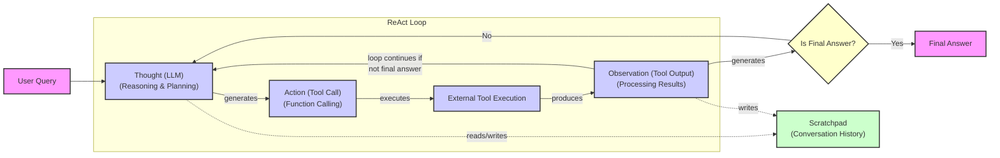

# Lesson 8: Building a ReAct Agent From Scratch

In our last lesson, we explored the theory behind agentic reasoning frameworks like ReAct, which synergize thought, action, and observation. Theory is essential, but your goal as an engineer is to ship products. Abstract concepts only become real when we translate them into working code. This lesson is where you will do just that.

We once found ourselves tangled in a popular agentic framework, trying to implement a simple ReAct loop. Basic logic became hours of work, forcing Python code into an unnatural graph paradigm that added complexity, not value. It was only when we dove into the framework's source code that everything clicked. Seeing the raw implementation of the ReAct loop gave us the concrete mental model we needed. This is why we are building from scratch; understanding the core mechanics is the fastest path to mastery [[8]](https://www.decodingai.com/p/building-production-react-agents).

We are moving from theory to practice to build a minimal ReAct agent from the ground up. Using only Python and the Gemini API, we will implement the complete Thought → Action → Observation loop. You will learn how to define a tool, generate thoughts, select actions using function calling, execute those actions, and process the resulting observations within a turn-based control loop.

This hands-on approach is not just an exercise. It provides a concrete mental model of how these agents operate. By building the core engine yourself, you will gain the confidence to debug, extend, and customize agentic systems for your own applications. In this lesson, we will walk you through setting up the environment, implementing a mock search tool, crafting prompts for the Thought and Action phases, building the main control loop, and analyzing execution traces to understand success and failure modes.

## Setup and Environment

Before we can build our agent, we need to set up a clean Python environment. This ensures that the code from our notebook runs smoothly and that you can replicate the expected outputs. This initial setup is straightforward, but getting it right is the first step toward building a reliable system. It involves loading API keys, importing necessary libraries, and initializing the client that will communicate with the Gemini models.

1. First, we load our `GOOGLE_API_KEY` from the environment. Our utility function, which you have used in previous lessons, handles this by reading from a `.env` file in your project root. This practice keeps your credentials secure and separate from your application code.
    ```python
    from lessons.utils import env
    
    env.load(required_env_vars=["GOOGLE_API_KEY"])
    ```
    It outputs:
    ```text
    Trying to load environment variables from `/path/to/your/project/.env`
    Environment variables loaded successfully.
    ```

2. Next, we import the key packages we will use throughout the lesson. This includes `google.genai` for interacting with the Gemini API, `pydantic` for data validation as we learned in Lesson 4, and some standard Python libraries like `enum` and `typing` for creating structured and type-safe code. We also import our `pretty_print` utility for visualizing the agent's traces.
    ```python
    from enum import Enum
    from pydantic import BaseModel, Field
    from typing import List
    
    from google import genai
    from google.genai import types
    
    from lessons.utils import pretty_print
    ```

3. We then initialize the Gemini client. This object is our main interface to the Gemini models, handling authentication and API requests.
    ```python
    client = genai.Client()
    ```
    It outputs:
    ```text
    Both GOOGLE_API_KEY and GEMINI_API_KEY are set. Using GOOGLE_API_KEY.
    ```

4. Finally, we define the model we will use. Gemini offers several models, but for this lesson, we will use `gemini-2.5-flash`. It is a fast and cost-effective model, perfect for the simple reasoning tasks in our minimal agent. For more complex, production-grade agents that require more advanced reasoning, you might consider a more powerful model like Gemini Pro.
    ```python
    MODEL_ID = "gemini-2.5-flash"
    ```
With our client and model ready, the next step is to give our agent a capability, a tool it can use to interact with its environment.

## Tool Layer: Mock Search Implementation

In Lesson 6, we learned how to give agents tools to perform actions. Now, we will implement a simple mock search tool to serve as our agent's connection to an external world. Instead of making real API calls to Google or Wikipedia, we will use a function with predefined, predictable responses.

### Why Use a Mock Tool?

This mock approach offers several educational benefits. It isolates the ReAct mechanics, allowing you to focus on the agent's reasoning loop without worrying about external dependencies, network issues, or API keys [[1]](https://www.dailydoseofds.com/ai-agents-crash-course-part-10-with-implementation/), [[2]](https://medium.com/google-cloud/building-react-agents-from-scratch-a-hands-on-guide-using-gemini-ffe4621d90ae). It also makes testing deterministic, as the tool's output is always the same for a given input. This predictability is invaluable when you are trying to understand and debug the agent's behavior step-by-step.

In a production system, you could easily swap this mock function with a real API call to Google Search or a domain-specific knowledge base. As long as the function signature and docstring remain consistent, the agent's core logic does not need to change. This modular design is a key principle of building maintainable AI systems [[2]](https://medium.com/google-cloud/building-react-agents-from-scratch-a-hands-on-guide-using-gemini-ffe4621d90ae), [[3]](https://atalupadhyay.wordpress.com/2025/11/25/building-a-real-time-web-searching-ai-agent-with-langchain-and-google-gemini/), [[4]](https://ai.google.dev/gemini-api/docs/langgraph-example).

### Implementation

1. Let's define our `search` function. It takes a single string argument, `query`, and returns a string with information. The function's docstring is important, as it will be used to inform the LLM about the tool's purpose and how to use it.
    ```python
    def search(query: str) -> str:
        """Search for information about a specific topic or query.
    
        Args:
            query (str): The search query or topic to look up.
        """
        query_lower = query.lower()
    
        # Predefined responses for demonstration
        if all(word in query_lower for word in ["capital", "france"]):
            return "Paris is the capital of France and is known for the Eiffel Tower."
        elif "react" in query_lower:
            return "The ReAct (Reasoning and Acting) framework enables LLMs to solve complex tasks by interleaving thought generation, action execution, and observation processing."
    
        # Generic response for unhandled queries
        return f"Information about '{query}' was not found."
    ```
    Our mock function handles two specific queries: the capital of France and information about the ReAct framework. For any other query, it returns a "not found" message. This fallback behavior is useful for testing how the agent handles situations where a tool fails to provide the needed information [[2]](https://medium.com/google-cloud/building-react-agents-from-scratch-a-hands-on-guide-using-gemini-ffe4621d90ae).

2. To make our tools manageable, we will use a tool registry. This is a simple Python dictionary that maps the tool's name to its callable function. This mapping allows the agent to plan with symbolic tool names, which our code can then resolve to the actual Python function for execution.
    ```python
    TOOL_REGISTRY = {
        search.__name__: search,
    }
    ```
Now that our agent has a tool, it needs a way to reason about when and how to use it. This brings us to the first phase of the ReAct loop: thought.

## Thought Phase: Prompt Construction and Generation

The "Thought" phase is where the agent analyzes the user's query and its progress so far, then plans its next step. As we saw in Lesson 7, this explicit reasoning step is what makes the ReAct framework so powerful [[5]](https://arxiv.org/pdf/2210.03629). It allows the agent to break down complex problems, track its plan, and handle exceptions in an interpretable way [[5]](https://arxiv.org/pdf/2210.03629). This internal monologue makes the agent's decision-making process transparent and easier to debug.

To generate a thought, we will construct a prompt that provides the LLM with all the necessary context: the available tools, the conversation history, and the user's goal. The quality of this prompt directly influences the quality of the agent's reasoning.

1. First, we create a helper function to build a minimal XML description of our available tools. As we discussed in Lesson 3 on Context Engineering, using XML tags helps the model distinguish between different types of information. This function takes our `TOOL_REGISTRY` and generates an XML block containing each tool's name and its docstring as a description.
    ```python
    def build_tools_xml_description(tools: dict[str, callable]) -> str:
        """Build a minimal XML description of tools using only their docstrings."""
        lines = []
        for tool_name, fn in tools.items():
            doc = (fn.__doc__ or "").strip()
            lines.append(f"\t<tool name=\"{tool_name}\">")
            if doc:
                lines.append(f"\t\t<description>")
                for line in doc.split("\n"):
                    lines.append(f"\t\t\t{line}")
                lines.append(f"\t\t</description>")
            lines.append("\t</tool>")
        return "\n".join(lines)
    
    tools_xml = build_tools_xml_description(TOOL_REGISTRY)
    ```

2. With the tool description ready, we define our prompt template for the thought phase. This template instructs the agent on its goal: to decide the next best step. It includes placeholders for the dynamically generated `tools_xml` and the `conversation` history. The instructions guide the agent to focus on the next action and to learn from past attempts.
    ```python
    PROMPT_TEMPLATE_THOUGHT = f"""
    You are deciding the next best step for reaching the user goal. You have some tools available to you.
    
    Available tools:
    <tools>
    {tools_xml}
    </tools>
    
    Conversation so far:
    <conversation>
    {{conversation}}
    </conversation>
    
    State your next thought about what to do next as one short paragraph focused on the next action you intend to take and why.
    Avoid repeating the same strategies that didn't work previously. Prefer different approaches.
    """.strip()
    ```

3. Let's inspect the final prompt that will be sent to the model.
    ```python
    print(PROMPT_TEMPLATE_THOUGHT)
    ```
    It outputs:
    ```text
    You are deciding the next best step for reaching the user goal. You have some tools available to you.
    
    Available tools:
    <tools>
    	<tool name="search">
    		<description>
    			Search for information about a specific topic or query.
    			
    			Args:
    			    query (str): The search query or topic to look up.
    		</description>
    	</tool>
    </tools>
    
    Conversation so far:
    <conversation>
    {conversation}
    </conversation>
    
    State your next thought about what to do next as one short paragraph focused on the next action you intend to take and why.
    Avoid repeating the same strategies that didn't work previously. Prefer different approaches.
    ```
    The output shows the complete prompt structure, with the `<tool>` block correctly populated with our `search` function's details. This structured approach, where tools are explicitly declared, also serves as a critical guardrail. By grounding the model with a clear description of its capabilities, we constrain its behavior and reduce the likelihood of it hallucinating or attempting to perform actions it cannot support [[9]](https://www.appsmith.com/blog/de-hallucinate-ai-agents).

4. Finally, we implement the `generate_thought` function. It takes the current `conversation` history, formats the prompt template, and calls the Gemini API to generate the agent's next thought. The function returns the model's response as a clean, stripped string.
    ```python
    def generate_thought(conversation: str, tool_registry: dict[str, callable]) -> str:
        """Generate a thought as plain text (no structured output)."""
        tools_xml = build_tools_xml_description(tool_registry)
        prompt = PROMPT_TEMPLATE_THOUGHT.format(conversation=conversation, tools_xml=tools_xml)
    
        response = client.models.generate_content(
            model=MODEL_ID,
            contents=prompt
        )
        return response.text.strip()
    ```
With a coherent thought in place, the agent must now decide on an action. This could be calling a tool to gather more information or, if it has enough context, providing a final answer to the user.

## Action Phase: Function Calling and Parsing

The "Action" phase is where the agent translates its thought into a concrete step. This is where we use Gemini's native function calling capabilities, which we first introduced in Lesson 6. Instead of asking the model to generate text that we then have to parse into a tool call, we provide the tool definitions directly to the API. The model then decides whether to call a function and returns a structured object that our application can execute [[6]](https://www.philschmid.de/langgraph-gemini-2-5-react-agent).

### System Prompt Strategy

This approach allows for a clean separation of concerns. The system prompt for the action phase can focus on high-level strategic guidance, instructing the model on *how* to decide, rather than getting bogged down in the technical details of each tool. We tell the model to choose between using a tool or giving a final answer, based on the conversation so far. This keeps the prompt concise and focused on the decision-making process itself.

### Automatic Tool Integration

The real power comes from how Gemini handles the tool information automatically. When we pass our Python functions to the `tools` configuration of the API call, the client inspects them. It extracts the function name, the docstring (which becomes the tool's description), and the parameter names and type hints from the function signature. This information is automatically converted into a schema that the model understands.

This separation means you can manage your tools as simple Python functions. To add a new tool, you just write a new function with a clear docstring and type hints. The system prompt for the action phase does not need to change, making the agent more modular and easier to maintain.

### Implementation

1. We start by defining two prompt templates for the action phase. The first is the default prompt, which asks the model to choose between calling a tool or providing a final answer.
    ```python
    PROMPT_TEMPLATE_ACTION = """
    You are selecting the best next action to reach the user goal.
    
    Conversation so far:
    <conversation>
    {conversation}
    </conversation>
    
    Respond either with a tool call (with arguments) or a final answer if you can confidently conclude.
    """.strip()
    ```

2. The second template is for situations where we need to force the agent to conclude. For example, if the agent reaches a maximum number of turns, we use this prompt to ensure it provides a final answer instead of getting stuck in a loop. This is a crucial mechanism for ensuring graceful termination.
    ```python
    PROMPT_TEMPLATE_ACTION_FORCED = """
    You must now provide a final answer to the user.
    
    Conversation so far:
    <conversation>
    {conversation}
    </conversation>
    
    Provide a concise final answer that best addresses the user's goal.
    """.strip()
    ```

3. Next, we define two Pydantic models, `ToolCallRequest` and `FinalAnswer`, to represent the two possible outcomes of the action phase. As we learned in Lesson 4, using Pydantic for structured outputs gives us validation and type safety.
    ```python
    class ToolCallRequest(BaseModel):
        """A request to call a tool with its name and arguments."""
        tool_name: str = Field(description="The name of the tool to call.")
        arguments: dict = Field(description="The arguments to pass to the tool.")
    
    
    class FinalAnswer(BaseModel):
        """A final answer to present to the user when no further action is needed."""
        text: str = Field(description="The final answer text to present to the user.")
    ```

4. Now we implement the `generate_action` function. This is the core of the action phase.
    ```python
    def generate_action(conversation: str, tool_registry: dict[str, callable] | None = None, force_final: bool = False) -> (ToolCallRequest | FinalAnswer):
        """Generate an action by passing tools to the LLM and parsing function calls or final text.
    
        When force_final is True or no tools are provided, the model is instructed to produce a final answer and tool calls are disabled.
        """
        # Use a dedicated prompt when forcing a final answer or no tools are provided
        if force_final or not tool_registry:
            prompt = PROMPT_TEMPLATE_ACTION_FORCED.format(conversation=conversation)
            response = client.models.generate_content(
                model=MODEL_ID,
                contents=prompt
            )
            return FinalAnswer(text=response.text.strip())
    
        # Default action prompt
        prompt = PROMPT_TEMPLATE_ACTION.format(conversation=conversation)
    
        # Provide the available tools to the model
        tools = list(tool_registry.values())
        config = types.GenerateContentConfig(
            tools=tools,
        )
        response = client.models.generate_content(
            model=MODEL_ID,
            contents=prompt,
            config=config
        )
    
        # Extract the function call from the response (if present)
        if response.function_calls:
            function_call = response.function_calls[0]
            name = function_call.name
            args = dict(function_call.args) if function_call.args is not None else {}
            return ToolCallRequest(tool_name=name, arguments=args)
        
        # Otherwise, it's a final answer
        final_answer = response.text.strip()
        return FinalAnswer(text=final_answer)
    ```
    This function first checks the `force_final` flag. If true, it uses the forced-answer prompt and returns a `FinalAnswer`. Otherwise, it sends the default prompt along with the list of available tools to the Gemini API.

    The function then inspects the `response` object. If it contains a `function_calls` attribute, it extracts the tool name and arguments and returns a `ToolCallRequest`. If not, it assumes the response is a direct text answer and returns a `FinalAnswer`. This logic creates a clean separation between tool use and final responses. If the model's response is malformed or doesn't fit either pattern, our control loop will need to handle that gracefully, which we will address next.

## Control Loop: Messages, Scratchpad, and Orchestration

We have now built the individual components for Thought and Action. The final step is to orchestrate them in a control loop that manages the end-to-end ReAct cycle: Thought → Action → Observation. This loop is the agent's engine, driving it turn by turn until it reaches a final answer.

### Message Structure and the Scratchpad

To manage the conversation history, we will use a "scratchpad". This is a simple but powerful concept: a running log of all interactions, including user queries, agent thoughts, tool calls, and observations. This concept comes directly from the original ReAct paper, which prompts the model to externalize its reasoning process in a "scratchpad" to make it more reliable and traceable [[5]](https://arxiv.org/pdf/2210.03629). At each step, the entire scratchpad is fed back to the LLM, providing the full context for its next decision [[7]](https://www.neradot.com/post/building-a-python-react-agent-class-a-step-by-step-guide). Without this running history, an agent would suffer from a form of digital amnesia, unable to connect a user's follow-up question to the previous turn and losing all conversational coherence [[11]](https://codesignal.com/learn/courses/coordinating-openai-agents-workflows-in-typescript/lessons/building-multi-turn-conversations-with-openai-agents-in-typescript).

Image 1: A flowchart illustrating the ReAct control loop, showing the iterative Thought → Action → Observation cycle, including decision points and the role of the scratchpad.


1. We start by defining data structures to represent the messages in our scratchpad. An `Enum` called `MessageRole` categorizes each message type, and a `Message` Pydantic model holds the role and content. This structured approach ensures that every piece of information in the agent's history is clearly labeled and easy to parse.
    ```python
    class MessageRole(str, Enum):
        """Enumeration for the different roles a message can have."""
        USER = "user"
        THOUGHT = "thought"
        TOOL_REQUEST = "tool request"
        OBSERVATION = "observation"
        FINAL_ANSWER = "final answer"
    
    
    class Message(BaseModel):
        """A message with a role and content, used for all message types."""
        role: MessageRole = Field(description="The role of the message in the ReAct loop.")
        content: str = Field(description="The textual content of the message.")
    
        def __str__(self) -> str:
            """Provides a user-friendly string representation of the message."""
            return f"{self.role.value.capitalize()}: {self.content}"
    ```

2. To make the agent's internal process easy to follow, we create a `pretty_print_message` helper. This function formats and prints each message with a color-coded header, allowing us to clearly trace the agent's steps.
    ```python
    def pretty_print_message(message: Message, turn: int, max_turns: int, header_color: str = pretty_print.Color.YELLOW, is_forced_final_answer: bool = False) -> None:
        if not is_forced_final_answer:
            title = f"{message.role.value.capitalize()} (Turn {turn}/{max_turns}):"
        else:
            title = f"{message.role.value.capitalize()} (Forced):"
    
        pretty_print.wrapped(
            text=message.content,
            title=title,
            header_color=header_color,
        )
    ```

3. Next, we define the `Scratchpad` class. It manages a list of `Message` objects and provides an `append` method that stores a new message and, if `verbose` is enabled, prints it using our pretty-printer.
    ```python
    class Scratchpad:
        """Container for ReAct messages with optional pretty-print on append."""
    
        def __init__(self, max_turns: int) -> None:
            self.messages: List[Message] = []
            self.max_turns: int = max_turns
            self.current_turn: int = 1
    
        def set_turn(self, turn: int) -> None:
            self.current_turn = turn
    
        def append(self, message: Message, verbose: bool = False, is_forced_final_answer: bool = False) -> None:
            self.messages.append(message)
            if verbose:
                role_to_color = {
                    MessageRole.USER: pretty_print.Color.RESET,
                    MessageRole.THOUGHT: pretty_print.Color.ORANGE,
                    MessageRole.TOOL_REQUEST: pretty_print.Color.GREEN,
                    MessageRole.OBSERVATION: pretty_print.Color.YELLOW,
                    MessageRole.FINAL_ANSWER: pretty_print.Color.CYAN,
                }
                header_color = role_to_color.get(message.role, pretty_print.Color.YELLOW)
                pretty_print_message(
                    message=message,
                    turn=self.current_turn,
                    max_turns=self.max_turns,
                    header_color=header_color,
                    is_forced_final_answer=is_forced_final_answer,
                )
    
        def to_string(self) -> str:
            return "\n".join(str(m) for m in self.messages)
    ```

### Orchestrating the ReAct Loop

Now we can implement the main control loop, `react_agent_loop`. This function orchestrates the entire process, tying together the thought, action, and observation phases into a coherent workflow.

```python
def react_agent_loop(initial_question: str, tool_registry: dict[str, callable], max_turns: int = 5, verbose: bool = False) -> str:
    """
    Implements the main ReAct (Thought -> Action -> Observation) control loop.
    Uses a unified message class for the scratchpad.
    """
    scratchpad = Scratchpad(max_turns=max_turns)

    # Add the user's question to the scratchpad
    user_message = Message(role=MessageRole.USER, content=initial_question)
    scratchpad.append(user_message, verbose=verbose)

    for turn in range(1, max_turns + 1):
        scratchpad.set_turn(turn)

        # Generate a thought based on the current scratchpad
        thought_content = generate_thought(
            scratchpad.to_string(),
            tool_registry,
        )
        thought_message = Message(role=MessageRole.THOUGHT, content=thought_content)
        scratchpad.append(thought_message, verbose=verbose)

        # Generate an action based on the current scratchpad
        action_result = generate_action(
            scratchpad.to_string(),
            tool_registry=tool_registry,
        )

        # If the model produced a final answer, return it
        if isinstance(action_result, FinalAnswer):
            final_answer = action_result.text
            final_message = Message(role=MessageRole.FINAL_ANSWER, content=final_answer)
            scratchpad.append(final_message, verbose=verbose)
            return final_answer

        # Otherwise, it is a tool request
        if isinstance(action_result, ToolCallRequest):
            action_name = action_result.tool_name
            action_params = action_result.arguments

            # Add the action to the scratchpad
            params_str = ", ".join([f"{k}='{v}'" for k, v in action_params.items()])
            action_content = f"{action_name}({params_str})"
            action_message = Message(role=MessageRole.TOOL_REQUEST, content=action_content)
            scratchpad.append(action_message, verbose=verbose)

            # Run the action and get the observation
            observation_content = ""
            tool_function = tool_registry.get(action_name)
            if tool_function:
                try:
                    observation_content = tool_function(**action_params)
                except Exception as e:
                    observation_content = f"Error executing tool '{action_name}': {e}"
            else:
                observation_content = f"Error: Tool '{action_name}' not found. Available tools: {list(tool_registry.keys())}"

            # Add the observation to the scratchpad
            observation_message = Message(role=MessageRole.OBSERVATION, content=str(observation_content))
            scratchpad.append(observation_message, verbose=verbose)

    # After max_turns, force a final answer
    forced_action = generate_action(
        scratchpad.to_string(),
        force_final=True,
    )
    if isinstance(forced_action, FinalAnswer):
        final_answer = forced_action.text
    else:
        final_answer = "Unable to produce a final answer within the allotted turns."
    
    final_message = Message(role=MessageRole.FINAL_ANSWER, content=final_answer)
    scratchpad.append(final_message, verbose=verbose, is_forced_final_answer=True)
    return final_answer
```
The loop begins by adding the user's question to the scratchpad. Then, for a maximum of `max_turns`, it performs the Thought → Action → Observation cycle. If the loop completes without a `FinalAnswer`, it calls `generate_action` one last time with `force_final=True` to produce a concluding response.

### Integrated Observation Processing

A key part of this loop is how it handles observations. When the agent decides to use a tool, the loop doesn't just call the function; it also captures the result. This result, whether it's a successful data retrieval or an error message, is formatted as an `OBSERVATION` message and added to the scratchpad.

This is the "acting" part of ReAct. The agent takes an action, observes the outcome, and this new information becomes part of the context for the next turn. This tight feedback mechanism is what allows the agent to self-correct. If a tool fails or returns unhelpful information, the agent sees this in the observation and can try a different tool or a new approach in its next thought phase.

This from-scratch loop mirrors the core logic of production frameworks like LangGraph, which manage history in a state object, often called `AgentState`. While our implementation is sequential, these frameworks can add performance optimizations, such as executing multiple independent tool calls in parallel to reduce latency. This is a key consideration for production systems [[8]](https://www.decodingai.com/p/building-production-react-agents).

## Tests and Traces: Success and Graceful Fallback

With our ReAct loop fully implemented, it is time to test it. By analyzing the execution traces, we can validate that each component—thought, action, observation, and forced termination—behaves as designed. We will run two tests: a simple factual question to demonstrate a successful run, and a query our mock tool cannot answer to test its graceful fallback behavior.

1. First, let's ask a straightforward question that our mock `search` tool can answer: `"What is the capital of France?"`. We will set `max_turns=2` and `verbose=True` to see the detailed trace.
    ```python
    question = "What is the capital of France?"
    final_answer = react_agent_loop(question, TOOL_REGISTRY, max_turns=2, verbose=True)
    ```
    It outputs:
    ```text
    User (Turn 1/2):
    What is the capital of France?
    
    Thought (Turn 1/2):
    The user is asking for the capital of France. I can use the search tool to find this information.
    
    Tool request (Turn 1/2):
    search(query='capital of France')
    
    Observation (Turn 1/2):
    Paris is the capital of France and is known for the Eiffel Tower.
    
    Thought (Turn 2/2):
    I have found the answer to the user's question. The capital of France is Paris. I can now provide the final answer.
    
    Final answer (Turn 2/2):
    Paris is the capital of France.
    ```
    The trace clearly shows the ReAct cycle in action. In the first turn, the agent thinks about the problem, correctly identifies the `search` tool, and executes it. The observation from the tool provides the answer. In the second turn, the agent's thought process recognizes that it has sufficient information, and it proceeds to generate the final answer, successfully completing the task within the two-turn limit.

2. Now, let's test the fallback behavior with a query our mock tool does not know: `"What is the capital of Italy?"`.
    ```python
    question = "What is the capital of Italy?"
    final_answer = react_agent_loop(question, TOOL_REGISTRY, max_turns=2, verbose=True)
    ```
    It outputs:
    ```text
    User (Turn 1/2):
    What is the capital of Italy?
    
    Thought (Turn 1/2):
    The user is asking for the capital of Italy. I will use the search tool to find this information.
    
    Tool request (Turn 1/2):
    search(query='capital of Italy')
    
    Observation (Turn 1/2):
    Information about 'capital of Italy' was not found.
    
    Thought (Turn 2/2):
    The search for "capital of Italy" did not return any information. I will try a broader search for "Italy" to see if I can find the capital that way.
    
    Tool request (Turn 2/2):
    search(query='Italy')
    
    Observation (Turn 2/2):
    Information about 'Italy' was not found.
    
    Final answer (Forced):
    I am sorry, I was unable to find the capital of Italy using the available tools.
    ```
    This trace demonstrates the agent's resilience and adaptive reasoning. After the first tool call fails, the observation "Information about 'capital of Italy' was not found" is added to the scratchpad. In the second turn, the agent's thought reflects on this failure and devises a new strategy: a broader search for "Italy". When this second attempt also fails, the agent reaches its `max_turns` limit. The control loop then correctly triggers the forced final answer, and the agent gracefully admits it could not find the information. This ability to react to tool failures and adjust its plan is a hallmark of a robust agent [[2]](https://medium.com/google-cloud/building-react-agents-from-scratch-a-hands-on-guide-using-gemini-ffe4621d90ae).

These tests confirm that our end-to-end ReAct loop is working correctly. While manual trace analysis is effective for debugging, production systems require more systematic evaluation. The traces we examined highlight two types of metrics: **outcome metrics**, such as whether the final answer was correct, and **process metrics**, like whether the agent chose the appropriate tool and provided valid arguments. Tracking both is essential, as a correct final answer can sometimes be reached through an inefficient or flawed process [[12]](https://www.braintrust.dev/articles/evaluate-agents-new-models-gemini-3).

## Conclusion

In this lesson, we moved from the theory of ReAct to a hands-on implementation, building a minimal yet functional agent from scratch. By constructing the Thought → Action → Observation loop, you have gained a practical understanding of how agentic systems reason, act, and learn from their environment. We have seen how to manage conversation history with a scratchpad, integrate external tools using function calling, and ensure graceful termination with a turn-based control loop.

This foundation is more than just an academic exercise. Even if you use a framework in production, understanding the underlying mechanics from scratch is a core skill for any AI engineer, allowing you to debug, customize, and move past framework limitations [[8]](https://www.decodingai.com/p/building-production-react-agents). The simple control loop you built today is the first step toward creating powerful agents that can tackle real-world problems, from automating market research reports to powering sophisticated multi-agent financial trading systems [[13]](https://www.salesforce.com/ap/agentforce/ai-agents/react-agents/), [[14]](https://tradingagents-ai.github.io/). In upcoming lessons, we will build on this foundation, exploring how to equip agents with memory in Lesson 9 and connect them to knowledge bases with RAG in Lesson 10.

## References

- [1] https://www.dailydoseofds.com/ai-agents-crash-course-part-10-with-implementation/
- [2] https://medium.com/google-cloud/building-react-agents-from-scratch-a-hands-on-guide-using-gemini-ffe4621d90ae
- [3] https://atalupadhyay.wordpress.com/2025/11/25/building-a-real-time-web-searching-ai-agent-with-langchain-and-google-gemini/
- [4] https://ai.google.dev/gemini-api/docs/langgraph-example
- [5] https://arxiv.org/pdf/2210.03629
- [6] https://www.philschmid.de/langgraph-gemini-2-5-react-agent
- [7] https://www.neradot.com/post/building-a-python-react-agent-class-a-step-by-step-guide
- [8] https://www.decodingai.com/p/building-production-react-agents
- [9] https://www.appsmith.com/blog/de-hallucinate-ai-agents
- [10] https://www.ibm.com/think/topics/react-agent
- [11] https://codesignal.com/learn/courses/coordinating-openai-agents-workflows-in-typescript/lessons/building-multi-turn-conversations-with-openai-agents-in-typescript
- [12] https://www.braintrust.dev/articles/evaluate-agents-new-models-gemini-3
- [13] https://www.salesforce.com/ap/agentforce/ai-agents/react-agents/
- [14] https://tradingagents-ai.github.io/
</article>