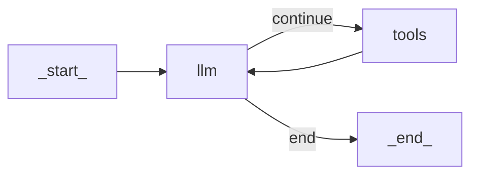

# Building a ReAct Agent From Scratch: A Step-by-Step Guide

When I started building my first complex agent, I turned to LangGraph to implement the ReAct pattern. I thought its graph-based model would make the logic clean and manageable. Instead, I found myself fighting the framework. Simple if-else conditions and loops became hours of work, forcing Python code into an unnatural graph paradigm that added complexity without real value.

Frustrated, I did what I always do when I'm stuck: I opened the source code. Reading LangGraph’s implementation of the ReAct loop was a breakthrough. Seeing how they handled thought generation, tool execution, and state management gave me the concrete mental model I couldn't get from the documentation. This is a common story for AI engineers. Frameworks are great for getting started, but they often hide the very logic that makes an agent work. Their abstractions can limit access to new features, and you eventually hit a wall where you need more control.

The solution is to build it yourself. Understanding how to implement a ReAct agent from scratch is a core skill. It demystifies what frameworks do and gives you the power to build custom, optimized, and debuggable systems.

This lesson is 100% hands-on. We will build a minimal ReAct agent from the ground up using only Python and the Gemini API. By implementing the complete Thought → Action → Observation loop yourself, you will gain a concrete mental model of how these systems work. We will walk through the entire process, step-by-step, following the code in the associated notebook. You will learn to:

-   Define a mock tool and a tool registry.
-   Generate "thoughts" to guide the agent’s reasoning.
-   Use function calling to select and parse actions.
-   Execute tools and process their observations.
-   Orchestrate the entire cycle within a turn-based control loop.

Let's get started.

## Setup and Environment

Our first step is to set up the Python environment. This ensures that the code runs smoothly and that your outputs match the traces we will analyze later. A clean and correctly configured environment is the foundation for any successful software project, and it is especially critical in AI engineering where dependencies can be complex. We will use the `google-genai` package to interact with the Gemini API, which provides the reasoning capabilities for our agent.

1.  First, we load our `GOOGLE_API_KEY` from the environment. Our custom utility function, `env.load`, searches for a `.env` file in the project root and loads the necessary credentials. This practice keeps sensitive keys out of your source code, which is essential for security.
    ```python
    from lessons.utils import env

    env.load(required_env_vars=["GOOGLE_API_KEY"])
    ```
    It outputs:
    ```text
    Trying to load environment variables from `...`
    Environment variables loaded successfully.
    ```

2.  Next, we import the necessary packages. We will use `google.genai` for the LLM, `pydantic` for creating structured data models, and our own `pretty_print` utility to visualize the agent's traces in a readable format.
    ```python
    from enum import Enum
    from pydantic import BaseModel, Field
    from typing import List

    from google import genai
    from google.genai import types

    from lessons.utils import pretty_print
    ```

3.  We initialize the Gemini client. The `genai.Client()` call automatically finds and uses the API key we loaded in the first step, handling the authentication required to communicate with Google's services.
    ```python
    client = genai.Client()
    ```
    It outputs:
    ```text
    Both GOOGLE_API_KEY and GEMINI_API_KEY are set. Using GOOGLE_API_KEY.
    ```

4.  Finally, we define the model ID we will use. We are using `gemini-2.5-flash`, a model that is both fast and cost-effective. This makes it ideal for development and iterative testing, where quick feedback cycles are more important than the raw power of a larger model. For more complex, production-level reasoning, you might switch to a `pro` model.
    ```python
    MODEL_ID = "gemini-2.5-flash"
    ```
With our client and model ready, the next step is to give our agent a capability. This comes in the form of a tool it can use to interact with an external environment.

## The Tool Layer: Mock Search Implementation

A ReAct agent’s power comes from its ability to use tools to gather information or perform actions [[2]](https://www.ibm.com/think/topics/react-agent). For this lesson, we will create a simple mock search tool. Using a mock tool instead of a real API has several advantages for learning, a philosophy that helps isolate and understand core concepts.

The primary benefit is focus. By abstracting away the complexities of network requests, authentication, and parsing real API responses, we can concentrate entirely on the agent's reasoning and control loop mechanics. This approach provides a controlled environment with predictable, consistent responses, which is essential for debugging and verifying the agent's behavior. When the tool returns a known value, you can be certain whether the agent's subsequent thought process is correct or flawed. This hands-on approach demystifies how agent frameworks operate, giving you the control to optimize and troubleshoot effectively [[4]](https://www.dailydoseofds.com/ai-agents-crash-course-part-10-with-implementation/).

1.  We start by defining the `search` function. It takes a string `query` as input and includes a detailed docstring. This docstring is crucial because, as we will see in the Action Phase, Gemini’s function calling feature uses it to understand what the tool does and how to use it. The description and arguments become part of the information the LLM uses to select the right tool for a given task.
    ```python
    def search(query: str) -> str:
        """Search for information about a specific topic or query.

        Args:
            query (str): The search query or topic to look up.
        """
        query_lower = query.lower()

        # Predefined responses for demonstration
        if all(word in query_lower for word in ["capital", "france"]):
            return "Paris is the capital of France and is known for the Eiffel Tower."
        elif "react" in query_lower:
            return "The ReAct (Reasoning and Acting) framework enables LLMs to solve complex tasks by interleaving thought generation, action execution, and observation processing."

        # Generic response for unhandled queries
        return f"Information about '{query}' was not found."
    ```
    The function simulates a search by checking for keywords. If a query doesn't match, it returns a "not found" message. This fallback behavior is vital for testing the agent's resilience and its ability to reason about failed actions.

2.  Next, we create a `TOOL_REGISTRY`. This dictionary maps the tool's name to its function object. The registry acts as a central place for the agent to look up and execute tools. While our agent only has one tool, a production system could have dozens. This mapping allows the model to plan with symbolic names (like `"search"`), while our code safely resolves those names to the actual Python functions.
    ```python
    TOOL_REGISTRY = {
        search.__name__: search,
    }
    ```
In a real-world application, you could easily swap this mock `search` function with one that calls an actual external API, like Google Search or a private knowledge base [[5]](https://medium.com/google-cloud/building-react-agents-from-scratch-a-hands-on-guide-using-gemini-ffe4621d90ae). The strategy for this is to treat the tool function as a modular component with a clear interface contract. As long as the function signature (name, arguments) and the purpose described in the docstring remain consistent, the agent's logic does not need to change. For example, you could replace our simple `if-elif` logic with a call to the SERP API or a query to a vector database. The agent, guided by the docstring, would continue to invoke `search` with a `query` string and expect a string result, completely unaware of the change in the underlying implementation [[5]](https://medium.com/google-cloud/building-react-agents-from-scratch-a-hands-on-guide-using-gemini-ffe4621d90ae). This modular design is a key principle of building robust and maintainable AI systems.

Now that our agent has a tool, we need to teach it how to think about when and why to use it.

## The Thought Phase: Prompt Construction and Generation

The first step in the ReAct cycle is "Thought." This is where the agent analyzes the user's query and the conversation history to decide on the best next step. It is the agent's internal monologue, where it reasons about its strategy. We generate this thought by prompting the LLM with a carefully constructed template that provides all the necessary context for its decision.

1.  To inform the model about its available tools, we create an XML description from our `TOOL_REGISTRY`. The `build_tools_xml_description` function iterates through the registry and uses each tool's docstring to create a `<tool>` block. Using structured formats like XML or Markdown in prompts is a best practice for Gemini models, as it helps the model clearly distinguish between different parts of the input, such as instructions, context, and data [[6]](https://ai.google.dev/gemini-api/docs/prompting-strategies). This lightweight description gives the model just enough information to reason about the tool's purpose without overwhelming it. The prompt template itself sets the stage for the model, instructing it to act as a decision-maker. It includes placeholders for the available tools (our XML string) and the conversation history.
    ```python
    def build_tools_xml_description(tools: dict[str, callable]) -> str:
        """Build a minimal XML description of tools using only their docstrings."""
        lines = []
        for tool_name, fn in tools.items():
            doc = (fn.__doc__ or "").strip()
            lines.append(f"\t<tool name=\"{tool_name}\">")
            if doc:
                lines.append(f"\t\t<description>")
                for line in doc.split("\n"):
                    lines.append(f"\t\t\t{line}")
                lines.append(f"\t\t</description>")
            lines.append("\t</tool>")
        return "\n".join(lines)

    tools_xml = build_tools_xml_description(TOOL_REGISTRY)
    ```

2.  The final instruction in our prompt is critical: it asks the model to state its next thought as a short paragraph, focusing on the intended action and the reasoning behind it. This encourages the model to produce a coherent, human-readable reasoning trace, which is the essence of the ReAct framework's "Thought" step [[1]](https://arxiv.org/pdf/2210.03629).
    ```python
    PROMPT_TEMPLATE_THOUGHT = f"""
    You are deciding the next best step for reaching the user goal. You have some tools available to you.

    Available tools:
    <tools>
    {tools_xml}
    </tools>

    Conversation so far:
    <conversation>
    {{conversation}}
    </conversation>

    State your next thought about what to do next as one short paragraph focused on the next action you intend to take and why.
    Avoid repeating the same strategies that didn't work previously. Prefer different approaches.
    """.strip()
    ```
    Here is the full prompt with the tool definition injected:
    ```text
    You are deciding the next best step for reaching the user goal. You have some tools available to you.

    Available tools:
    <tools>
        <tool name="search">
            <description>
                Search for information about a specific topic or query.
                
                Args:
                    query (str): The search query or topic to look up.
            </description>
        </tool>
    </tools>

    Conversation so far:
    <conversation>
    {conversation}
    </conversation>

    State your next thought about what to do next as one short paragraph focused on the next action you intend to take and why.
    Avoid repeating the same strategies that didn't work previously. Prefer different approaches.
    ```

3.  The `generate_thought` function is the component that executes this reasoning step. It takes the current conversation history, which acts as the agent's short-term memory, and formats the prompt template with this context. It then calls the Gemini model and returns the raw text response. This output is not just a simple reply; it represents the agent's internal monologue—its "thought." This thought serves as the reasoning trace that will guide the subsequent action phase, ensuring that the agent's next move is deliberate and informed by its understanding of the task and the conversation so far.
    ```python
    def generate_thought(conversation: str, tool_registry: dict[str, callable]) -> str:
        """Generate a thought as plain text (no structured output)."""
        tools_xml = build_tools_xml_description(tool_registry)
        prompt = PROMPT_TEMPLATE_THOUGHT.format(conversation=conversation, tools_xml=tools_xml)

        response = client.models.generate_content(
            model=MODEL_ID,
            contents=prompt
        )
        return response.text.strip()
    ```
This thought gives the agent a clear intention. The next step is to translate that intention into a concrete "Action," which could be either a tool call or a final answer to the user.

## The Action Phase: Function Calling and Parsing

After generating a thought, the agent must decide what to do next. This is the "Action" phase. The agent can either use a tool to gather more information or, if it has enough context, provide a final answer. We use Gemini's native function calling capability to handle this decision-making process, which is more reliable than parsing raw text [[7]](https://www.philschmid.de/langgraph-gemini-2-5-react-agent).

### System Prompt Strategy

The prompts for the action phase are intentionally high-level. Notice that `PROMPT_TEMPLATE_ACTION` simply instructs the model to "Respond either with a tool call... or a final answer." It does not include technical details about the tools, their arguments, or specific JSON formats. This is a deliberate design choice. By separating the strategic guidance (what to do) from the technical implementation (how to do it), we create cleaner and more maintainable prompts. The prompt guides the agent's decision-making at a conceptual level, while the underlying API handles the mechanical details of tool integration.

### Automatic Tool Integration

A key advantage of using a model's built-in function calling is that we do not need to manually include tool signatures in our prompt [[3]](https://ai.google.dev/gemini-api/docs/function-calling). When we provide Python functions in the `tools` configuration of the API call, the Gemini client automatically extracts their names, docstrings (as descriptions), and parameter type hints. This information is passed to the model in a specialized format, allowing it to reason about which tool to use without cluttering our main prompt. This separation keeps our prompts clean and focused on high-level strategy.

1.  We start by defining two prompt templates. `PROMPT_TEMPLATE_ACTION` is the default prompt, asking the model to choose between a tool call and a final answer. `PROMPT_TEMPLATE_ACTION_FORCED` is a special-purpose prompt we will use later to force the agent to conclude when it reaches its turn limit.
    ```python
    PROMPT_TEMPLATE_ACTION = """
    You are selecting the best next action to reach the user goal.

    Conversation so far:
    <conversation>
    {conversation}
    </conversation>

    Respond either with a tool call (with arguments) or a final answer if you can confidently conclude.
    """.strip()

    # Dedicated prompt used when we must force a final answer
    PROMPT_TEMPLATE_ACTION_FORCED = """
    You must now provide a final answer to the user.

    Conversation so far:
    <conversation>
    {conversation}
    </conversation>

    Provide a concise final answer that best addresses the user's goal.
    """.strip()
    ```

2.  We define two Pydantic models, `ToolCallRequest` and `FinalAnswer`, to represent the two possible outcomes of the action phase. This gives us a structured way to handle the model's decision.
    ```python
    class ToolCallRequest(BaseModel):
        """A request to call a tool with its name and arguments."""
        tool_name: str = Field(description="The name of the tool to call.")
        arguments: dict = Field(description="The arguments to pass to the tool.")


    class FinalAnswer(BaseModel):
        """A final answer to present to the user when no further action is needed."""
        text: str = Field(description="The final answer text to present to the user.")
    ```

3.  The `generate_action` function orchestrates this phase. Let’s break it down:
    - If `force_final` is `True` or no tools are provided, it uses the `PROMPT_TEMPLATE_ACTION_FORCED` and returns a `FinalAnswer`. This is our mechanism for gracefully ending the loop.
    - Otherwise, it uses the default `PROMPT_TEMPLATE_ACTION`. It passes the available tools from our `TOOL_REGISTRY` to the `tools` parameter of the `generate_content` call. We set `automatic_function_calling={"disable": True}` because we want to parse the model's decision ourselves, giving us full control over the execution loop.
    
    ```python
    def generate_action(conversation: str, tool_registry: dict[str, callable] | None = None, force_final: bool = False) -> (ToolCallRequest | FinalAnswer):
        """Generate an action by passing tools to the LLM and parsing function calls or final text.

        When force_final is True or no tools are provided, the model is instructed to produce a final answer and tool calls are disabled.
        """
        # Use a dedicated prompt when forcing a final answer or no tools are provided
        if force_final or not tool_registry:
            prompt = PROMPT_TEMPLATE_ACTION_FORCED.format(conversation=conversation)
            response = client.models.generate_content(
                model=MODEL_ID,
                contents=prompt
            )
            return FinalAnswer(text=response.text.strip())

        # Default action prompt
        prompt = PROMPT_TEMPLATE_ACTION.format(conversation=conversation)

        # Provide the available tools to the model; disable auto-calling so we can parse and run ourselves
        tools = list(tool_registry.values())
        config = types.GenerateContentConfig(
            tools=tools,
            automatic_function_calling={"disable": True}
        )
        response = client.models.generate_content(
            model=MODEL_ID,
            contents=prompt,
            config=config
        )
    ```

### Response Parsing

After calling the model, we need to parse its response to determine the next step. The `generate_action` function checks the response content to see if the model decided to call a function or provide a text answer.

-   It inspects the `response.candidates[0].content.parts`. If a part contains a `function_call` attribute, the model has decided to use a tool.
-   The code then extracts the `name` of the function and its `args` (arguments). These are used to create a `ToolCallRequest` object, which our control loop will use to execute the correct Python function.
-   If no `function_call` is found, the function concatenates the text from all parts of the response. This text is considered the final answer, which is then wrapped in a `FinalAnswer` object.

This parsing logic creates a clear separation between the two possible outcomes, allowing our control loop to handle each case appropriately.

```python
    # Extract the function call from the response (if present)
    candidate = response.candidates[0]
    parts = candidate.content.parts
    if parts and getattr(parts[0], "function_call", None):
        name = parts[0].function_call.name
        args = dict(parts[0].function_call.args) if parts[0].function_call.args is not None else {}
        return ToolCallRequest(tool_name=name, arguments=args)
    
    # Otherwise, it's a final answer
    final_answer = "".join(part.text for part in candidate.content.parts)
    return FinalAnswer(text=final_answer.strip())
```

### Error Handling

In a production system, you cannot assume the LLM will always return a perfectly formed response. Malformed outputs or unexpected tool names can break the agent's loop. For instance, if the model hallucinates a tool name that is not in our `TOOL_REGISTRY`, a `KeyError` will occur when we try to execute it. Similarly, if the tool itself fails during execution (e.g., a network error), it will raise an exception. Our control loop, which we will build next, must use a `try-except` block to catch these errors, format them as an observation message, and feed them back to the agent. This allows the agent to reason about the failure and attempt a recovery, such as trying a different tool or rephrasing its query [[5]](https://medium.com/google-cloud/building-react-agents-from-scratch-a-hands-on-guide-using-gemini-ffe4621d90ae).

With the Thought and Action phases implemented, we have all the components needed to build the main control loop that will bring our ReAct agent to life.

## The Control Loop: Messages, Scratchpad, and Orchestration

The control loop is the engine that drives the ReAct agent, orchestrating the Thought → Action → Observation cycle. It manages the conversation history, calls the thought and action generation functions, executes tools, and processes their results. This orchestration is what transforms a series of individual LLM calls into a coherent, stateful process capable of solving multi-step problems [[8]](https://www.neradot.com/post/building-a-python-react-agent-class-a-step-by-step-guide).

To manage the state of the conversation, we will treat the interaction as a sequence of messages. Each message represents a step in the dialogue, whether it is from the user, an internal thought, a tool request, the tool's observation, or the final answer. This structured approach is far more robust than simply appending raw strings to a history, as it allows us to maintain clear roles and context for each piece of information.

1.  We define `MessageRole` and `Message` Pydantic models to structure these interactions. Using an `Enum` for roles makes the code clean, readable, and less prone to typos. The `Message` model ensures that every entry in our history has a defined role and content.
    ```python
    class MessageRole(str, Enum):
        """Enumeration for the different roles a message can have."""
        USER = "user"
        THOUGHT = "thought"
        TOOL_REQUEST = "tool request"
        OBSERVATION = "observation"
        FINAL_ANSWER = "final answer"


    class Message(BaseModel):
        """A message with a role and content, used for all message types."""
        role: MessageRole = Field(description="The role of the message in the ReAct loop.")
        content: str = Field(description="The textual content of the message.")

        def __str__(self) -> str:
            """Provides a user-friendly string representation of the message."""
            return f"{self.role.value.capitalize()}: {self.content}"
    ```

2.  To make the agent's internal process easy to follow, we create a helper function to pretty-print each message. This will allow us to visualize the agent's turn-by-turn reasoning, which is invaluable for debugging and understanding its decision-making process.
    ```python
    def pretty_print_message(message: Message, turn: int, max_turns: int, header_color: str = pretty_print.Color.YELLOW, is_forced_final_answer: bool = False) -> None:
        if not is_forced_final_answer:
            title = f"{message.role.value.capitalize()} (Turn {turn}/{max_turns}):"
        else:
            title = f"{message.role.value.capitalize()} (Forced):"

        pretty_print.wrapped(
            text=message.content,
            title=title,
            header_color=header_color,
        )
    ```

3.  The `Scratchpad` class acts as the agent's short-term memory. It holds a list of `Message` objects and includes an `append` method that both stores a new message and optionally prints it. This "scratchpad" is serialized into a string each turn and fed back into the prompts, giving the model the full context of the interaction so far. This growing context is what allows the agent to build upon previous steps and maintain a coherent strategy.
    ```python
    class Scratchpad:
        """Container for ReAct messages with optional pretty-print on append."""

        def __init__(self, max_turns: int) -> None:
            self.messages: List[Message] = []
            self.max_turns: int = max_turns
            self.current_turn: int = 1

        def set_turn(self, turn: int) -> None:
            self.current_turn = turn

        def append(self, message: Message, verbose: bool = False, is_forced_final_answer: bool = False) -> None:
            self.messages.append(message)
            if verbose:
                role_to_color = {
                    MessageRole.USER: pretty_print.Color.RESET,
                    MessageRole.THOUGHT: pretty_print.Color.ORANGE,
                    MessageRole.TOOL_REQUEST: pretty_print.Color.GREEN,
                    MessageRole.OBSERVATION: pretty_print.Color.YELLOW,
                    MessageRole.FINAL_ANSWER: pretty_print.Color.CYAN,
                }
                header_color = role_to_color.get(message.role, pretty_print.Color.YELLOW)
                pretty_print_message(
                    message=message,
                    turn=self.current_turn,
                    max_turns=self.max_turns,
                    header_color=header_color,
                    is_forced_final_answer=is_forced_final_answer,
                )

        def to_string(self) -> str:
            return "\n".join(str(m) for m in self.messages)
    ```

4.  Now we can implement the main `react_agent_loop` function. This function ties everything together into a cohesive workflow.
    - It initializes the `Scratchpad` and adds the initial user question, kicking off the process.
    - It enters a `for` loop that runs for a maximum of `max_turns`. This limit acts as a crucial safety mechanism to prevent infinite loops and control costs.
    - **Thought:** In each turn, it calls `generate_thought` with the current scratchpad content. The resulting thought is appended to the scratchpad, documenting the agent's reasoning.
    - **Action:** It then calls `generate_action`. If the result is a `FinalAnswer`, the loop terminates immediately and returns the answer. This is the primary success condition.
    
    ```python
    def react_agent_loop(initial_question: str, tool_registry: dict[str, callable], max_turns: int = 5, verbose: bool = False) -> str:
        """
        Implements the main ReAct (Thought -> Action -> Observation) control loop.
        Uses a unified message class for the scratchpad.
        """
        scratchpad = Scratchpad(max_turns=max_turns)

        # Add the user's question to the scratchpad
        user_message = Message(role=MessageRole.USER, content=initial_question)
        scratchpad.append(user_message, verbose=verbose)

        for turn in range(1, max_turns + 1):
            scratchpad.set_turn(turn)

            # Generate a thought based on the current scratchpad
            thought_content = generate_thought(
                scratchpad.to_string(),
                tool_registry,
            )
            thought_message = Message(role=MessageRole.THOUGHT, content=thought_content)
            scratchpad.append(thought_message, verbose=verbose)

            # Generate an action based on the current scratchpad
            action_result = generate_action(
                scratchpad.to_string(),
                tool_registry=tool_registry,
            )

            # If the model produced a final answer, return it
            if isinstance(action_result, FinalAnswer):
                final_answer = action_result.text
                final_message = Message(role=MessageRole.FINAL_ANSWER, content=final_answer)
                scratchpad.append(final_message, verbose=verbose)
                return final_answer
    ```

### Integrated Observation Processing

The "Observation" phase is where the agent processes the outcome of its action. This step is not just about getting a result; it is about integrating that result back into the agent's reasoning process. Our control loop handles this seamlessly.

-   **Tool Execution:** If the `action_result` is a `ToolCallRequest`, the loop extracts the tool's name and parameters. It then looks up the corresponding function in our `TOOL_REGISTRY` and executes it. The `**action_params` syntax is a clean way to pass the dictionary of arguments directly to the function.
-   **Error Handling:** The entire tool execution is wrapped in a `try-except` block. This is a critical feature for production-ready agents. If the tool fails for any reason (e.g., a network timeout, invalid input, or an internal bug), the exception is caught. Instead of crashing, the agent formats the error into a descriptive string.
-   **Observation Formatting and Update:** Whether the tool succeeds or fails, its output (the result or the error message) is stored in `observation_content`. This content is then wrapped in a `Message` with the `OBSERVATION` role and appended to the scratchpad. This closes the loop for the current turn. By recording both successes and failures as observations, we allow the agent to learn from its mistakes in the next thought phase.

```python
        # Otherwise, it is a tool request
        if isinstance(action_result, ToolCallRequest):
            action_name = action_result.tool_name
            action_params = action_result.arguments

            # Add the action to the scratchpad
            params_str = ", ".join([f"{k}='{v}'" for k, v in action_params.items()])
            action_content = f"{action_name}({params_str})"
            action_message = Message(role=MessageRole.TOOL_REQUEST, content=action_content)
            scratchpad.append(action_message, verbose=verbose)

            # Run the action and get the observation
            observation_content = ""
            tool_function = tool_registry[action_name]
            try:
                observation_content = tool_function(**action_params)
            except Exception as e:
                observation_content = f"Error executing tool '{action_name}': {e}"

            # Add the observation to the scratchpad
            observation_message = Message(role=MessageRole.OBSERVATION, content=observation_content)
            scratchpad.append(observation_message, verbose=verbose)

        # Check if the maximum number of turns has been reached. If so, force the action selector to produce a final answer
        if turn == max_turns:
            forced_action = generate_action(
                scratchpad.to_string(),
                force_final=True,
            )
            if isinstance(forced_action, FinalAnswer):
                final_answer = forced_action.text
            else:
                final_answer = "Unable to produce a final answer within the allotted turns."
            final_message = Message(role=MessageRole.FINAL_ANSWER, content=final_answer)
            scratchpad.append(final_message, verbose=verbose, is_forced_final_answer=True)
            return final_answer
```
This loop directly implements the ReAct pattern. The agent iteratively thinks, acts, and observes, using the scratchpad to maintain context and learn from its interactions. The flow is simple but powerful, creating a cycle of reasoning and action that allows the agent to tackle complex problems. While this diagram is often associated with frameworks like LangGraph, the underlying principle is exactly what we have built from scratch.


Image 1: A flowchart illustrating the control flow of a ReAct agent implemented using LangGraph, showing the iterative Thought-Action-Observation cycle.

### Extension Possibilities

This from-scratch implementation provides a solid foundation, but it is just the beginning. You could extend this basic loop in several ways to build more sophisticated agents. For example, you could implement more advanced error handling, such as a retry mechanism with exponential backoff for transient network errors. You could also add a self-correction step, where if a tool fails, the agent is prompted to reflect on the error and decide whether to retry with different parameters or use an alternative tool. Furthermore, you could expand the toolset with more complex functions, such as those that interact with databases, send emails, or even call other AI agents, creating a multi-agent system.

## Tests and Traces: Success and Graceful Fallback

With the complete ReAct loop implemented, we can now test it. Analyzing the agent's traces is the best way to understand its behavior, debug issues, and verify that the logic works as expected. We will run two tests: one straightforward query to demonstrate a successful run, and one designed to fail to test our graceful fallback mechanism.

### Successful Execution Trace

First, let's ask a simple factual question that our mock `search` tool can answer: `"What is the capital of France?"` We will set `max_turns=2` and `verbose=True` to see the step-by-step trace.

1.  We call our main loop function with the question.
    ```python
    # A straightforward question requiring a search.
    question = "What is the capital of France?"
    final_answer = react_agent_loop(question, TOOL_REGISTRY, max_turns=2, verbose=True)
    ```
    It outputs:
    ```text
    User: What is the capital of France?

    Thought (Turn 1/2): I need to find the capital of France. The user's question is a straightforward factual query. I can use the search tool to find this information.

    Tool request (Turn 1/2): search(query='capital of France')

    Observation (Turn 1/2): Paris is the capital of France and is known for the Eiffel Tower.

    Thought (Turn 2/2): The observation from the search tool directly answers the user's question. I can now provide the final answer.

    Final answer (Turn 2/2): Paris is the capital of France.
    ```

2.  Let’s analyze this trace:
    -   **Turn 1:** The agent receives the user's query. Its first **Thought** correctly identifies the task as a factual lookup and decides to use the `search` tool. It generates a **Tool Request** for `search(query='capital of France')`. The tool executes and returns the **Observation**: "Paris is the capital of France...". This successful retrieval provides the necessary information.
    -   **Turn 2:** The agent processes the new observation. Its next **Thought** recognizes that the information from the tool directly answers the user's question. Based on this, it proceeds to the action phase and generates a **Final Answer**: "Paris is the capital of France." The loop then terminates successfully, having solved the problem efficiently in two turns.
    
    This trace confirms that our agent correctly follows the Thought-Action-Observation cycle. It identifies the need for a tool, executes it, processes the result, and provides a final answer, all within the turn limit.

### Graceful Fallback Trace

Now, let's test the agent's resilience. We will ask a question that our mock tool cannot answer: `"What is the capital of Italy?"` This will trigger the tool's fallback response.

1.  We run the loop with the new question.
    ```python
    # An unknown/unsupported query for the mock tool.
    question = "What is the capital of Italy?"
    final_answer = react_agent_loop(question, TOOL_REGISTRY, max_turns=2, verbose=True)
    ```
    It outputs:
    ```text
    User: What is the capital of Italy?

    Thought (Turn 1/2): The user is asking for the capital of Italy. I can use the search tool to find this information.

    Tool request (Turn 1/2): search(query='capital of Italy')

    Observation (Turn 1/2): Information about 'capital of Italy' was not found.

    Thought (Turn 2/2): The previous search for "capital of Italy" failed. I should try a broader search for just "Italy" to see if I can find any relevant information that might lead me to the capital.

    Tool request (Turn 2/2): search(query='Italy')

    Observation (Turn 2/2): Information about 'Italy' was not found.

    Final answer (Forced): I am sorry, but I was unable to find the capital of Italy using the available tools.
    ```
2.  Here is the analysis:
    -   **Turn 1:** The agent starts by trying to `search` for "capital of Italy." The tool returns the "not found" **Observation**, signaling a failure.
    -   **Turn 2:** The agent observes this failure. Its next **Thought** demonstrates an adaptive strategy: it decides to broaden the search to just "Italy," hoping to find related information. This is a good example of simple reasoning to overcome an obstacle. However, this second attempt also fails, resulting in another "not found" **Observation**.
    -   **Forced Exit:** Having reached its `max_turns` limit of 2, the control loop invokes `generate_action` with `force_final=True`. This prompts the model to synthesize a concluding response based on the failed attempts. The resulting **Final Answer (Forced)** is an honest admission that it could not find the information. This is a much better outcome than hallucinating an answer or getting stuck in an infinite loop.

This trace demonstrates the agent's ability to handle tool failures and adapt its strategy. More importantly, it shows that our `max_turns` limit and forced-answer mechanism work as a safety net, ensuring the agent terminates gracefully and communicates its limitations clearly to the user.

## Conclusion

In this lesson, we have moved from theory to practice by building a functional ReAct agent from scratch. We implemented every component of the Thought-Action-Observation loop: defining tools, generating thoughts, selecting actions via function calling, executing tools, processing observations, and orchestrating the entire flow in a control loop. By analyzing the traces, we have seen how this simple architecture enables an agent to reason, adapt to failures, and solve problems step-by-step.

The key takeaway is that agentic systems are not magic. They are the result of careful engineering, combining LLM capabilities with structured code. Building this agent yourself provides a concrete mental model that demystifies how frameworks like LangChain or CrewAI operate under the hood. This foundational knowledge is essential for any AI engineer looking to build, customize, and debug robust agentic applications.

In our next lesson, we will build on this foundation by exploring one of the most critical components of advanced agents: memory. We will learn how agents can retain information across conversations to provide more personalized and context-aware interactions.

## References

- [1] [ReAct: Synergizing Reasoning and Acting in Language Models](https://arxiv.org/pdf/2210.03629)
- [2] [ReAct Agent - IBM](https://www.ibm.com/think/topics/react-agent)
- [3] [Gemini Function Calling Documentation](https://ai.google.dev/gemini-api/docs/function-calling)
- [4] [Implementing ReAct Agentic Pattern From Scratch](https://www.dailydoseofds.com/ai-agents-crash-course-part-10-with-implementation/)
- [5] [Building ReAct Agents from Scratch using Gemini - Medium](https://medium.com/google-cloud/building-react-agents-from-scratch-a-hands-on-guide-using-gemini-ffe4621d90ae)
- [6] [Prompt design strategies](https://ai.google.dev/gemini-api/docs/prompting-strategies)
- [7] [ReAct agent from scratch with Gemini 2.5 and LangGraph](https://www.philschmid.de/langgraph-gemini-2-5-react-agent)
- [8] [Building a Python React Agent Class: A Step-by-Step Guide](https://www.neradot.com/post/building-a-python-react-agent-class-a-step-by-step-guide)