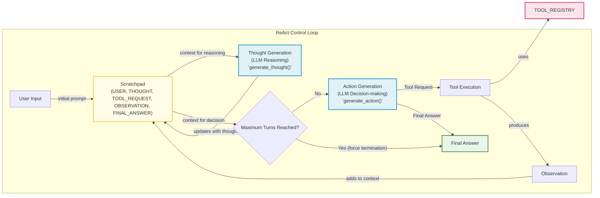

# ReAct Agents From Scratch: A Step-by-Step Guide

In our previous lessons, we covered the theory of AI agents, from context engineering and structured outputs to planning and reasoning with frameworks like ReAct. We explored how these systems think and act. But theory only gets you so far. To truly understand how an agent works, you have to build one.

When we started building Brown, our writing agent, we decided to use LangGraph to implement the ReAct pattern. We embraced their graph model with nodes and edges, thinking it would make everything cleaner. But what we discovered was frustrating: simple if-else logic and basic loops that should have taken five minutes became hours of work. We had to force our Python code to fit their graph paradigm, modeling everything through edges in ways that felt unnatural. It did not add real value, just complexity.

After struggling with this, we did what we always do when we are stuck: we opened the LangGraph source code and started reading. That is when everything clicked. Seeing how they implemented the ReAct loop, thought generation, tool execution, and control flow gave us a concrete mental model we could not get from their documentation [[1]](https://www.decodingai.com/p/building-production-react-agents).

This lesson is born from that experience. We are going to build a minimal ReAct agent from scratch, using only Python and the Gemini API. By implementing the full Thought → Action → Observation cycle yourself, you will gain the foundational understanding needed to extend, debug, and customize agents with confidence. This hands-on experience is fundamental for building robust AI systems.

We will walk through the implementation step-by-step, following the code in the accompanying notebook. By the end, you will have a working agent and a clear picture of how these reasoning systems operate under the hood.

## Setup and Environment

Before we start building, let's get our environment set up. This ensures your notebook runs smoothly and the outputs match the traces we will analyze later. This lesson is 100% practical, so having a working environment is key. A proper setup is the first step toward reproducible and reliable AI engineering.

1.  First, we load our `GOOGLE_API_KEY` from a `.env` file. This practice keeps sensitive credentials out of your code, which is essential for security. We use a simple helper function from our course utilities to handle this.

    ```python
    from lessons.utils import env
    
    env.load(required_env_vars=["GOOGLE_API_KEY"])
    ```

    It outputs:

    ```text
    Trying to load environment variables from `/path/to/your/project/.env`
    Environment variables loaded successfully.
    ```

2.  Next, we import the necessary packages. We will use `google-genai` to interact with the Gemini API, `pydantic` to define structured data models for our agent's actions, and Python's built-in `enum` and `typing` modules for creating clean and type-safe code.

    ```python
    import json
    from enum import Enum
    from typing import List, Union, Callable
    
    from google import genai
    from google.genai import types
    from pydantic import BaseModel, Field
    
    from lessons.utils import pretty_print
    ```

3.  With our imports ready, we initialize the Gemini client. This object is our gateway to the Gemini API, handling authentication and request management. Our utility script conveniently checks for both `GOOGLE_API_KEY` and `GEMINI_API_KEY` and prioritizes one if both are set.

    ```python
    client = genai.Client()
    ```

    It outputs:

    ```text
    Both GOOGLE_API_KEY and GEMINI_API_KEY are set. Using GOOGLE_API_KEY.
    ```

4.  Finally, we define the model we will use. For our examples, `gemini-2.5-flash` is a great choice. It strikes a balance between performance and cost, making it ideal for development and for tasks that require fast responses without sacrificing reasoning quality.

    ```python
    MODEL_ID = "gemini-2.5-flash"
    ```

With the client and model in place, we can now define an external capability for the agent to use.

## Tool Layer: Mock Search Implementation

A ReAct agent’s power comes from its ability to interact with the world through tools [[2]](https://arxiv.org/pdf/2210.03629). In a production system, these tools might call a Google Search API, query a database, or interact with a company’s internal services [[3]](https://medium.com/google-cloud/building-react-agents-from-scratch-a-hands-on-guide-using-gemini-ffe4621d90ae). For this lesson, however, we want to focus purely on the ReAct mechanics without adding external dependencies.

That is why we will implement a simple mock search tool. This approach is a common best practice in software engineering, as it allows us to develop and test components in isolation. This offers several advantages for learning:
- **Simplicity:** It keeps our code self-contained and removes the need for extra API keys or network requests, so you can run the code without any extra setup.
- **Focus:** It allows us to concentrate on the agent's reasoning loop—the Thought, Action, and Observation cycle—rather than the specifics of API integration. This is about understanding the agent's "brain," not the external services it connects to.
- **Predictability:** With predefined responses, we can create reliable tests and ensure our agent behaves as expected. When an agent misbehaves, we will know the problem is in its reasoning logic, not in an unpredictable API response. This makes debugging much more straightforward.

Using mock objects is a form of dependency injection, a core software engineering principle where a component's dependencies (in this case, external services) are provided from an external source rather than being created internally. This decouples our agent's logic from the specific implementation of its tools, making the system more modular, testable, and easier to maintain.

Our mock tool will be a Python function that simulates a search engine. It will have a few hardcoded responses for specific queries and a generic fallback for anything else. The function signature and its docstring are important; as we saw in Lesson 6, modern LLMs use this information to understand what a tool does and how to use it. The docstring acts as the tool's documentation for the LLM.

1.  Here is the implementation of our `search` function. The docstring clearly explains its purpose and arguments. We use `query.lower()` to make the matching case-insensitive and `all(word in ...)` to make the keyword detection more robust.

    ```python
    def search(query: str) -> str:
        """Search for information about a specific topic or query.
    
        Args:
            query (str): The search query or topic to look up.
        """
        query_lower = query.lower()
    
        # Predefined responses for demonstration
        if all(word in query_lower for word in ["capital", "france"]):
            return "Paris is the capital of France and is known for the Eiffel Tower."
        elif "react" in query_lower:
            return "The ReAct (Reasoning and Acting) framework enables LLMs to solve complex tasks by interleaving thought generation, action execution, and observation processing."
    
        # Generic response for unhandled queries
        return f"Information about '{query}' was not found."
    ```

2.  To make our tools manageable, we create a `TOOL_REGISTRY`. This dictionary maps the tool's name (the string name of the function) to the function object itself. This registry allows our agent to dynamically look up and execute the correct function based on the LLM's output.

    ```python
    TOOL_REGISTRY = {
        search.__name__: search,
    }
    ```

    It outputs:

    ```text
    {'search': <function search at 0x11d894e50>}
    ```

This simple setup is all we need. In a real-world application, you could easily swap this mock `search` function with a function that calls an actual API, like the SERP API for Google Search or a Wikipedia client [[3]](https://medium.com/google-cloud/building-react-agents-from-scratch-a-hands-on-guide-using-gemini-ffe4621d90ae). For example, you could define a `google_search` function that uses a dedicated API client, handles authentication, manages rate limits, and includes robust error handling for network failures or bad responses. As long as the new function has the same signature (`query: str -> str`) and a clear docstring, you would only need to update one line in the `TOOL_REGISTRY`. The agent's core logic would not need to change. This modular design is a key principle of building robust and maintainable AI systems.

## Thought Phase: Prompt Construction and Generation

The first step in the ReAct cycle is "Thought." This is where the agent reasons about the user's query and the conversation history to decide what to do next [[2]](https://arxiv.org/pdf/2210.03629). It is the agent's internal monologue. Our goal is to generate a short, purposeful thought that guides the subsequent action.

To do this, we need to provide the LLM with the right context. This includes the tools available to it and the history of the conversation so far. A common and effective technique is to format this information using XML tags, which helps the model distinguish between different parts of the prompt. This explicit structure is not just a matter of style; it is a recommended best practice for Gemini models. Using clear delimiters like XML tags helps the model distinguish instructions, context, and data, which improves reasoning and the reliability of its responses [[5]](https://ai.google.dev/gemini-api/docs/prompting-strategies). This practice creates clear boundaries for the model, reducing ambiguity and making it easier for it to understand its task.

1.  First, we create a helper function to convert our `TOOL_REGISTRY` into a minimal XML description. This function iterates through the tools, extracts their docstrings, and formats them into a `<tools>` block. This tells the LLM what capabilities it has.

    ```python
    def build_tools_xml_description(tools: dict[str, callable]) -> str:
        """Build a minimal XML description of tools using only their docstrings."""
        lines = []
        for tool_name, fn in tools.items():
            doc = (fn.__doc__ or "").strip()
            lines.append(f"\t<tool name=\"{tool_name}\">")
            if doc:
                lines.append(f"\t\t<description>")
                for line in doc.split("\n"):
                    lines.append(f"\t\t\t{line}")
                lines.append(f"\t\t</description>")
            lines.append("\t</tool>")
        return "\n".join(lines)
    ```

2.  Next, we define the prompt template for the thought-generation phase. It instructs the agent on its goal, provides the XML-formatted tool descriptions, and includes a placeholder for the conversation history. The instructions guide the agent's cognitive process: it must focus on the next action, justify it, and learn from past failures.

    ```python
    tools_xml = build_tools_xml_description(TOOL_REGISTRY)
    
    PROMPT_TEMPLATE_THOUGHT = f"""
    You are deciding the next best step for reaching the user goal. You have some tools available to you.
    
    Available tools:
    <tools>
    {tools_xml}
    </tools>
    
    Conversation so far:
    <conversation>
    {{conversation}}
    </conversation>
    
    State your next thought about what to do next as one short paragraph focused on the next action you intend to take and why.
    Avoid repeating the same strategies that didn't work previously. Prefer different approaches.
    """.strip()
    ```

3.  Let's inspect the final prompt to see what the LLM will receive. The `{conversation}` placeholder will be filled in dynamically during the agent's run.

    ```python
    print(PROMPT_TEMPLATE_THOUGHT)
    ```

    It outputs:

    ```text
    You are deciding the next best step for reaching the user goal. You have some tools available to you.
    
    Available tools:
    <tools>
        <tool name="search">
            <description>
                Search for information about a specific topic or query.
                
                Args:
                    query (str): The search query or topic to look up.
            </description>
        </tool>
    </tools>
    
    Conversation so far:
    <conversation>
    {conversation}
    </conversation>
    
    State your next thought about what to do next as one short paragraph focused on the next action you intend to take and why.
    Avoid repeating the same strategies that didn't work previously. Prefer different approaches.
    ```

4.  Finally, we implement the `generate_thought` function. It takes the current conversation history, formats the prompt, calls the Gemini API, and returns the model's generated thought as a clean string.

    ```python
    def generate_thought(conversation: str, tool_registry: dict[str, callable]) -> str:
        """Generate a thought as plain text (no structured output)."""
        tools_xml = build_tools_xml_description(tool_registry)
        prompt = PROMPT_TEMPLATE_THOUGHT.format(conversation=conversation, tools_xml=tools_xml)
    
        response = client.models.generate_content(
            model=MODEL_ID,
            contents=prompt
        )
        return response.text.strip()
    ```

Separating instructions (the prompt template) from dynamic data (the conversation history) is a fundamental reliability pattern. When the boundaries between them blur, the model is forced to guess, which can lead to errors. By providing a stable, structured prefix with tool definitions and a clear placeholder for the conversation, we create a more predictable and robust system [[6]](https://stevekinney.com/writing/prompt-engineering-frontier-llms).

With a coherent thought generated, the agent now has a plan. The next step is to decide whether to execute a tool based on that plan or to conclude with a final answer.

## Action Phase: Function Calling and Parsing

After the "Thought" phase, the agent moves to the "Action" phase. Here, it decides whether to use a tool or provide a final answer to the user. We will use Gemini's native function calling capabilities, which we covered in Lesson 6, to make this decision.

### System Prompt Strategy

A key design choice here is the separation of concerns. The "Thought" prompt focuses on high-level reasoning ("what should I do and why?"), while the "Action" prompt is about execution ("how do I do it?"). We do not need to include detailed tool descriptions in the action prompt. The prompt can be simple and direct, focusing on the high-level goal of selecting the best next step. This keeps our prompts clean and focused on their specific purpose.

### Automatic Tool Integration with Gemini

Instead of manually inserting tool schemas into the prompt, we pass the Python tool functions directly to the Gemini API's `tools` configuration. The API automatically inspects these functions, extracts their names, docstrings (for the description), and parameter type hints, and converts them into a JSON schema that the model can understand [[4]](https://ai.google.dev/gemini-api/docs/langgraph-example). This powerful feature allows us to manage our tools as simple Python code, and the underlying framework handles the complex work of making them available to the LLM. This separation of logic (the prompt) and capabilities (the tools) is a cornerstone of building maintainable and scalable agentic systems.

### Implementation

Let's walk through the implementation of the action phase.

1.  First, we define the prompts. `PROMPT_TEMPLATE_ACTION` guides the model to choose between a tool call and a final answer. `PROMPT_TEMPLATE_ACTION_FORCED` is a special-purpose prompt we use to ensure the agent terminates gracefully when it reaches its iteration limit.

    ```python
    PROMPT_TEMPLATE_ACTION = """
    You are selecting the best next action to reach the user goal.
    
    Conversation so far:
    <conversation>
    {conversation}
    </conversation>
    
    Respond either with a tool call (with arguments) or a final answer if you can confidently conclude.
    """.strip()
    
    # Dedicated prompt used when we must force a final answer
    PROMPT_TEMPLATE_ACTION_FORCED = """
    You must now provide a final answer to the user.
    
    Conversation so far:
    <conversation>
    {conversation}
    </conversation>
    
    Provide a concise final answer that best addresses the user's goal.
    """.strip()
    ```

2.  To handle the model's output in a structured way, we define two Pydantic models: `ToolCallRequest` for when a tool is needed, and `FinalAnswer` for when the task is complete. Using Pydantic, as we learned in Lesson 4, ensures our parsed outputs are structured and validated.

    ```python
    class ToolCallRequest(BaseModel):
        """A request to call a tool with its name and arguments."""
        tool_name: str = Field(description="The name of the tool to call.")
        arguments: dict = Field(description="The arguments to pass to the tool.")
    
    
    class FinalAnswer(BaseModel):
        """A final answer to present to the user when no further action is needed."""
        text: str = Field(description="The final answer text to present to the user.")
    ```

3.  Now, we implement the `generate_action` function. This is the core of the action phase. It formats the appropriate prompt, configures the Gemini client with the available tools, and calls the model. We set `automatic_function_calling={"disable": True}` because we want to handle the tool execution logic ourselves in the control loop. This gives us full control over the process.

    ```python
    def generate_action(conversation: str, tool_registry: dict[str, callable] | None = None, force_final: bool = False) -> (ToolCallRequest | FinalAnswer):
        """Generate an action by passing tools to the LLM and parsing function calls or final text.
    
        When force_final is True or no tools are provided, the model is instructed to produce a final answer and tool calls are disabled.
        """
        # Use a dedicated prompt when forcing a final answer or no tools are provided
        if force_final or not tool_registry:
            prompt = PROMPT_TEMPLATE_ACTION_FORCED.format(conversation=conversation)
            response = client.models.generate_content(
                model=MODEL_ID,
                contents=prompt
            )
            return FinalAnswer(text=response.text.strip())
    
        # Default action prompt
        prompt = PROMPT_TEMPLATE_ACTION.format(conversation=conversation)
    
        # Provide the available tools to the model; disable auto-calling so we can parse and run ourselves
        tools = list(tool_registry.values())
        config = types.GenerateContentConfig(
            tools=tools,
            automatic_function_calling={"disable": True}
        )
        response = client.models.generate_content(
            model=MODEL_ID,
            contents=prompt,
            config=config
        )
    
        # Extract the function call from the response (if present)
        candidate = response.candidates[0]
        parts = candidate.content.parts
        if parts and getattr(parts[0], "function_call", None):
            name = parts[0].function_call.name
            args = dict(parts[0].function_call.args) if parts[0].function_call.args is not None else {}
            return ToolCallRequest(tool_name=name, arguments=args)
        
        # Otherwise, it's a final answer
        final_answer = "".join(part.text for part in candidate.content.parts)
        return FinalAnswer(text=final_answer.strip())
    ```

    The `force_final` flag is a crucial safety mechanism. In a ReAct loop, we need to prevent infinite cycles or excessive tool use. This flag lets us instruct the model to wrap up and provide a final answer when it reaches a predefined limit, ensuring the agent terminates gracefully.

### Error Handling

The response parsing logic in `generate_action` is optimistic. It checks if the model's output contains a `function_call` object and, if not, assumes the response is a final text answer. This works for our simple case, but a production-grade system needs more robust error handling. What if the model returns a malformed response, or hallucinates a tool that does not exist?

A more resilient implementation would include explicit error handling for several scenarios:
- **Malformed Responses:** The LLM might return a response that is not valid JSON or does not conform to the expected structure. The `decide` method in a more robust agent would wrap the parsing logic in a `try-except` block. If parsing fails, it could log the error and trigger a retry by calling the `think` method again, giving the agent a chance to self-correct [[3]](https://medium.com/google-cloud/building-react-agents-from-scratch-a-hands-on-guide-using-gemini-ffe4621d90ae).
- **Unknown Actions:** The model might hallucinate a tool name that is not in our `TOOL_REGISTRY`. The control loop should handle this gracefully. Instead of crashing, it should catch the `KeyError` and return an `Observation` message like `"Error: Unknown tool 'hallucinated_tool'. Available tools are: ['search']"`. This feedback allows the agent to recognize its mistake and choose a valid tool in the next cycle.

By anticipating these failure modes, we can build agents that are not just powerful but also resilient and predictable. With the thought and action phases implemented, we have all the building blocks for our agent. The final step is to orchestrate them in a control loop.

## Control Loop: Messages, Scratchpad, and Orchestration

The control loop is the engine that drives the ReAct agent, orchestrating the Thought → Action → Observation cycle. It manages the conversation state, calls the thought and action generation functions, executes tools, and processes the results (observations) to feed back into the next cycle [[2]](https://arxiv.org/pdf/2210.03629). This cycle closely parallels the feedback control loops used in robotics and other self-adapting systems. Just as a robot uses a Sensor-Plan-Act model to navigate its environment, our agent uses an Observation-Thought-Action loop to navigate a problem space, continuously adjusting its plan based on new information [[7]](https://www.sciencedirect.com/topics/computer-science/feedback-control-loop).

### Message Structure Foundation

To keep track of the agent's multi-turn process, we need a structured way to store each step. We will define a `Message` class and a `MessageRole` enum to categorize every interaction. This creates a "scratchpad," which is the agent's short-term memory for the current task.

1.  First, we define the roles a message can have. These correspond directly to the stages of the ReAct loop.

    ```python
    class MessageRole(str, Enum):
        """Enumeration for the different roles a message can have."""
        USER = "user"
        THOUGHT = "thought"
        TOOL_REQUEST = "tool request"
        OBSERVATION = "observation"
        FINAL_ANSWER = "final answer"
    ```

2.  Next, we define the `Message` model itself using Pydantic. Each message has a `role` and `content`.

    ```python
    class Message(BaseModel):
        """A message with a role and content, used for all message types."""
        role: MessageRole = Field(description="The role of the message in the ReAct loop.")
        content: str = Field(description="The textual content of the message.")
    
        def __str__(self) -> str:
            """Provides a user-friendly string representation of the message."""
            return f"{self.role.value.capitalize()}: {self.content}"
    ```

3.  To make the agent's process easy to follow, we create a pretty-printing function. This will help us visualize the trace of thoughts, actions, and observations.

    ```python
    def pretty_print_message(message: Message, turn: int, max_turns: int, header_color: str = pretty_print.Color.YELLOW, is_forced_final_answer: bool = False) -> None:
        if not is_forced_final_answer:
            title = f"{message.role.value.capitalize()} (Turn {turn}/{max_turns}):"
        else:
            title = f"{message.role.value.capitalize()} (Forced):"
    
        pretty_print.wrapped(
            text=message.content,
            title=title,
            header_color=header_color,
        )
    ```

4.  Finally, we create a `Scratchpad` class to manage the list of messages. It provides an `append` method to add new messages and optionally print them. This class will serve as the agent's working memory.

    ```python
    class Scratchpad:
        """Container for ReAct messages with optional pretty-print on append."""
    
        def __init__(self, max_turns: int) -> None:
            self.messages: List[Message] = []
            self.max_turns: int = max_turns
            self.current_turn: int = 1
    
        def set_turn(self, turn: int) -> None:
            self.current_turn = turn
    
        def append(self, message: Message, verbose: bool = False, is_forced_final_answer: bool = False) -> None:
            self.messages.append(message)
            if verbose:
                role_to_color = {
                    MessageRole.USER: pretty_print.Color.RESET,
                    MessageRole.THOUGHT: pretty_print.Color.ORANGE,
                    MessageRole.TOOL_REQUEST: pretty_print.Color.GREEN,
                    MessageRole.OBSERVATION: pretty_print.Color.YELLOW,
                    MessageRole.FINAL_ANSWER: pretty_print.Color.CYAN,
                }
                header_color = role_to_color.get(message.role, pretty_print.Color.YELLOW)
                pretty_print_message(
                    message=message,
                    turn=self.current_turn,
                    max_turns=self.max_turns,
                    header_color=header_color,
                    is_forced_final_answer=is_forced_final_answer,
                )
    
        def to_string(self) -> str:
            return "\n".join(str(m) for m in self.messages)
    ```

### Scratchpad Limitations and the Context Avalanche

Our simple append-only `Scratchpad` is great for learning, but in a production system with many turns, it has a critical weakness: the "context avalanche" [[8]](https://www.zartis.com/ai-agent-cost-optimisation-why-token-cost-is-the-wrong-number-to-optimise/). With each cycle, the conversation history grows, and the token cost increases quadratically, not linearly. The model spends most of its processing power re-reading history it has already seen.

This ever-expanding context can also cause the agent to lose focus and "go down a rabbit hole," forgetting its original objective after a few failed tool calls [[9]](https://news.ycombinator.com/item?id=43998472). A more robust implementation would involve summarizing observations before adding them to the scratchpad or, more advanced, having the model decide what information is truly essential to keep in its working memory for the next step [[10]](https://appstekcorp.com/blog/design-patterns-for-agentic-ai-and-multi-agent-systems/), [[11]](https://www.linkedin.com/posts/andreashorn1_%F0%9D%97%A5%F0%9D%97%B2%F0%9D%97%B0%F0%9D%98%82%F0%9D%97%BF%F0%9D%98%80%F0%9D%97%B6%F0%9D%98%83%F0%9D%97%B2-%F0%9D%97%9F%F0%9D%97%AE%F0%9D%97%BB%F0%9D%97%B4%F0%9D%98%82%F0%9D%97%AE%F0%9D%97%B4%F0%9D%97%B2-%F0%9D%97%A0%F0%9D%97%BC%F0%9D%97%B1%F0%9D%97%B2%F0%9D%97%B9%F0%9D%98%80-activity-7427962498198290433-M4wm). We will explore these memory management techniques in later lessons.

### Integrated Observation Processing

The "Observation" phase is where the agent processes the results of its actions. This is not a separate node or function but an integrated part of the control loop. After the agent generates a `ToolCallRequest`, the loop is responsible for executing the tool and formatting the output into an `Observation` message.

This step is critical for closing the ReAct loop. The observation provides the new information that the agent will use in its next "Thought" phase. Our implementation handles this process robustly:
- **Tool Execution:** It looks up the requested tool in the `TOOL_REGISTRY` and executes it with the arguments provided by the LLM. The use of `**action_params` allows for flexible argument passing.
- **Error Handling:** A `try...except` block wraps the tool execution. If the tool fails for any reason (e.g., a network error, invalid input), the agent does not crash. Instead, the error message is captured and formatted as the observation. This allows the agent to "see" the error and reason about it in the next turn, potentially trying a different tool or a different approach.
- **State Update:** The result of the tool call (or the error message) is wrapped in an `Observation` message and appended to the scratchpad. This ensures the agent's memory is always up-to-date with the latest outcomes of its actions.

By integrating observation processing directly into the loop, we create a resilient system that can learn from both successful and failed actions, making it more adaptable to real-world complexities.

### Complete Implementation

With the message structure in place, we can now build the complete `react_agent_loop` function. This function orchestrates the entire process.

Image 1: A flowchart illustrating the ReAct control loop with iterative Thought, Action, and Observation cycles, including termination conditions and the role of the Scratchpad and TOOL_REGISTRY.



The diagram above illustrates the complete control flow. The user's input kicks off the loop, which cycles between thought, action, and observation, continuously updating the scratchpad until a final answer is reached or the turn limit is hit.

Here is the full implementation of the loop:

```python
def react_agent_loop(initial_question: str, tool_registry: dict[str, callable], max_turns: int = 5, verbose: bool = False) -> str:
    """
    Implements the main ReAct (Thought -> Action -> Observation) control loop.
    Uses a unified message class for the scratchpad.
    """
    scratchpad = Scratchpad(max_turns=max_turns)

    # Add the user's question to the scratchpad
    user_message = Message(role=MessageRole.USER, content=initial_question)
    scratchpad.append(user_message, verbose=verbose)

    for turn in range(1, max_turns + 1):
        scratchpad.set_turn(turn)

        # Generate a thought based on the current scratchpad
        thought_content = generate_thought(
            scratchpad.to_string(),
            tool_registry,
        )
        thought_message = Message(role=MessageRole.THOUGHT, content=thought_content)
        scratchpad.append(thought_message, verbose=verbose)

        # Generate an action based on the current scratchpad
        action_result = generate_action(
            scratchpad.to_string(),
            tool_registry=tool_registry,
        )

        # If the model produced a final answer, return it
        if isinstance(action_result, FinalAnswer):
            final_answer = action_result.text
            final_message = Message(role=MessageRole.FINAL_ANSWER, content=final_answer)
            scratchpad.append(final_message, verbose=verbose)
            return final_answer

        # Otherwise, it is a tool request
        if isinstance(action_result, ToolCallRequest):
            action_name = action_result.tool_name
            action_params = action_result.arguments

            # Add the action to the scratchpad
            params_str = ", ".join([f"{k}='{v}'" for k, v in action_params.items()])
            action_content = f"{action_name}({params_str})"
            action_message = Message(role=MessageRole.TOOL_REQUEST, content=action_content)
            scratchpad.append(action_message, verbose=verbose)

            # Run the action and get the observation
            observation_content = ""
            tool_function = tool_registry[action_name]
            try:
                observation_content = tool_function(**action_params)
            except Exception as e:
                observation_content = f"Error executing tool '{action_name}': {e}"

            # Add the observation to the scratchpad
            observation_message = Message(role=MessageRole.OBSERVATION, content=observation_content)
            scratchpad.append(observation_message, verbose=verbose)

        # Check if the maximum number of turns has been reached. If so, force the action selector to produce a final answer
        if turn == max_turns:
            forced_action = generate_action(
                scratchpad.to_string(),
                force_final=True,
            )
            if isinstance(forced_action, FinalAnswer):
                final_answer = forced_action.text
            else:
                final_answer = "Unable to produce a final answer within the allotted turns."
            final_message = Message(role=MessageRole.FINAL_ANSWER, content=final_answer)
            scratchpad.append(final_message, verbose=verbose, is_forced_final_answer=True)
            return final_answer
```

This function now encapsulates the entire ReAct logic. We have built a complete, minimal agent from scratch. Now, let's test it.

### Code Outputs Analysis

Let's analyze the outputs from our tests to see the agent's reasoning in action.

**Successful Example: "What is the capital of France?"**

```text
================================================================================
User (Turn 1/2):
--------------------------------------------------------------------------------
What is the capital of France?
================================================================================

================================================================================
Thought (Turn 1/2):
--------------------------------------------------------------------------------
The user is asking for the capital of France. I can use the search tool to find
this information.
================================================================================

================================================================================
Tool request (Turn 1/2):
--------------------------------------------------------------------------------
search(query='capital of France')
================================================================================

================================================================================
Observation (Turn 1/2):
--------------------------------------------------------------------------------
Paris is the capital of France and is known for the Eiffel Tower.
================================================================================

================================================================================
Thought (Turn 2/2):
--------------------------------------------------------------------------------
I have found the answer to the user's question. I will now provide the final
answer.
================================================================================

================================================================================
Final answer (Turn 2/2):
--------------------------------------------------------------------------------
Paris is the capital of France.
================================================================================
```

This trace clearly shows the ReAct cycle. In Turn 1, the agent reasons that it needs to search, executes the `search` tool, and gets the answer in the observation. In Turn 2, it recognizes that the task is complete and provides the final answer.

**Unsuccessful Example: "What is the capital of Italy?"**

```text
================================================================================
User (Turn 1/2):
--------------------------------------------------------------------------------
What is the capital of Italy?
================================================================================

================================================================================
Thought (Turn 1/2):
--------------------------------------------------------------------------------
The user is asking for the capital of Italy. I can use the search tool to find
this information.
================================================================================

================================================================================
Tool request (Turn 1/2):
--------------------------------------------------------------------------------
search(query='capital of Italy')
================================================================================

================================================================================
Observation (Turn 1/2):
--------------------------------------------------------------------------------
Information about 'capital of Italy' was not found.
================================================================================

================================================================================
Thought (Turn 2/2):
--------------------------------------------------------------------------------
The first search failed. I'll try a broader search for just "Italy" to see if I
can find any relevant information that might lead me to the capital.
================================================================================

================================================================================
Tool request (Turn 2/2):
--------------------------------------------------------------------------------
search(query='Italy')
================================================================================

================================================================================
Observation (Turn 2/2):
--------------------------------------------------------------------------------
Information about 'Italy' was not found.
================================================================================

================================================================================
Final answer (Forced):
--------------------------------------------------------------------------------
I'm sorry, but I couldn't find information about the capital of Italy using the
available tools.
================================================================================
```

This trace demonstrates the agent's resilience. After the first search fails, it does not give up. Instead, it observes the failure and adapts its strategy by trying a broader query. When that also fails and it hits the `max_turns` limit, the forced termination logic kicks in, providing a helpful and honest final response.

### Extension Possibilities

This minimal implementation is a solid starting point, but a production-ready agent would require several extensions. You could add more sophisticated tools, such as a calculator for math problems or a database query tool for accessing structured data. You could also implement more complex reasoning patterns. For example, a "reflection" step could be added where the agent critiques its own plan after a few turns, allowing it to identify flawed strategies and self-correct more effectively. Finally, enhancing the error handling to include more specific feedback and retry mechanisms would make the agent even more robust.

## Tests and Traces: Success and Graceful Fallback

With our `react_agent_loop` complete, it is time to validate its behavior. We will run two tests: a successful query where the mock tool has the answer, and a fallback scenario where the tool does not. Analyzing the traces will confirm that our agent can reason, act, observe, and terminate correctly.

### Successful Example

First, let's ask a question our mock `search` tool is designed to answer: "What is the capital of France?" We will set `max_turns=2` and `verbose=True` to see the agent's step-by-step process.

1.  We call our agent loop with the question.

    ```python
    # A straightforward question requiring a search.
    question = "What is the capital of France?"
    final_answer = react_agent_loop(question, TOOL_REGISTRY, max_turns=2, verbose=True)
    ```

The trace, as analyzed in the previous section, shows a perfect two-turn execution. The action phase correctly produces a `ToolCallRequest`, and the control loop executes the tool, captures the observation, and concludes with the correct final answer.

### Unsuccessful Example with Graceful Fallback

Now, let's test a scenario where our mock tool does not have the answer: "What is the capital of Italy?" This will test the agent's ability to handle "not found" observations and its forced termination logic. This demonstrates the agent's resilience, a key quality for production systems.

1.  We call the loop with the new question.

    ```python
    # An unknown/unsupported query for the mock tool.
    question = "What is the capital of Italy?"
    final_answer = react_agent_loop(question, TOOL_REGISTRY, max_turns=2, verbose=True)
    ```

As we saw in our analysis, the agent's strategy changes after the first failure, demonstrating adaptive reasoning. The forced final answer path is correctly triggered at the `max_turns` boundary, ensuring a graceful exit. These tests confirm our end-to-end loop provides a solid baseline for more advanced agentic behaviors.

## Conclusion

We have successfully built a minimal, yet functional, ReAct agent from scratch. By implementing each component—the tool layer, the thought and action phases, and the orchestrating control loop—we have demystified the engineering behind the Thought-Action-Observation cycle. This hands-on exercise provides a concrete mental model that goes beyond abstract diagrams, showing you how these systems are built in practice.

The scratchpad you built serves as the agent’s short-term memory. More advanced systems expand on this with long-term memory mechanisms, allowing agents to recall information from past tasks and improve over time, a concept we will explore further in future lessons [[12]](https://arxiv.org/html/2404.11584v1).

Even if you end up using a framework like LangGraph or CrewAI in production, this foundational knowledge is fundamental. You now understand what is happening under the hood, which empowers you to debug more effectively, customize behavior, and make informed architectural decisions. You have learned how to structure prompts for reasoning, how to integrate tools using function calling, and how to manage state in a turn-based loop.

This lesson is a critical step in your journey from Python developer to AI Engineer. In the upcoming lessons, we will build on this foundation. In Lesson 9, we will explore how to give agents long-term memory, and in Lesson 10, we will do a deep dive into Retrieval-Augmented Generation (RAG) to connect our agents to vast knowledge bases.

## References

- [1] Iusztin, P. (2024). Building Production ReAct Agents From Scratch Is Simple. *Decoding AI*. https://www.decodingai.com/p/building-production-react-agents
- [2] Yao, S., Zhao, J., Yu, D., Du, N., Shafran, I., Narasimhan, K., & Cao, Y. (2022). ReAct: Synergizing Reasoning and Acting in Language Models. *arXiv*. https://arxiv.org/pdf/2210.03629
- [3] Shankar, A. (2024, June 17). Building ReAct Agents from Scratch using Gemini. *Medium*. https://medium.com/google-cloud/building-react-agents-from-scratch-a-hands-on-guide-using-gemini-ffe4621d90ae
- [4] (n.d.). ReAct agent from scratch with Gemini 2.5 and LangGraph. *Google AI for Developers*. https://ai.google.dev/gemini-api/docs/langgraph-example
- [5] (2024). Prompt design strategies. *Google AI for Developers*. https://ai.google.dev/gemini-api/docs/prompting-strategies
- [6] Kinney, S. (n.d.). Prompt Engineering with Frontier LLMs. *Steve Kinney*. https://stevekinney.com/writing/prompt-engineering-frontier-llms
- [7] (n.d.). Feedback Control Loop. *ScienceDirect*. https://www.sciencedirect.com/topics/computer-science/feedback-control-loop
- [8] (n.d.). AI Agent Cost Optimisation: Why Token Cost is the Wrong Number to Optimise. *Zartis*. https://www.zartis.com/ai-agent-cost-optimisation-why-token-cost-is-the-wrong-number-to-optimise/
- [9] (2024). Hacker News Comment on "Show HN: OpenDevin – OSS Code-Powered Agent". *Hacker News*. https://news.ycombinator.com/item?id=43998472
- [10] (n.d.). Design Patterns for Agentic AI and Multi-Agent Systems. *Appstek Corp*. https://appstekcorp.com/blog/design-patterns-for-agentic-ai-and-multi-agent-systems/
- [11] Horn, A. (2024). LinkedIn Post on Retrieval-centric Language Models. *LinkedIn*. https://www.linkedin.com/posts/andreashorn1_%F0%9D%97%A5%F0%9D%97%B2%F0%9D%97%B0%F0%9D%98%82%F0%9D%97%BF%F0%9D%98%80%F0%9D%97%B6%F0%9D%98%83%F0%9D%97%B2-%F0%9D%97%9F%F0%9D%97%AE%F0%9D%97%BB%F0%9D%97%B4%F0%9D%98%82%F0%9D%97%AE%F0%9D%97%B4%F0%9D%97%B2-%F0%9D%97%A0%F0%9D%97%BC%F0%9D%97%B1%F0%9D%97%B2%F0%9D%97%B9%F0%9D%98%80-activity-7427962498198290433-M4wm
- [12] Zhang, T., et al. (2024). RAISE: A New Method of Large Language Model for Subjective Questions in Educational Dialogue Systems. *arXiv*. https://arxiv.org/html/2404.11584v1
</article>