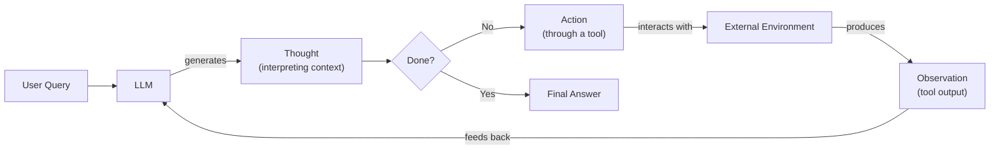

# Lesson 8: Building a ReAct Agent From Scratch

In our last lesson, we covered the theory behind agentic reasoning, exploring patterns like ReAct. We learned that ReAct agents operate in a cycle of Thought, Action, and Observation. The original ReAct paper highlights the synergy between these components: reasoning helps the model induce, track, and update action plans, while actions allow it to gather new information from external tools to inform its reasoning [[1]](https://arxiv.org/pdf/2210.03629). This allows them to reason about a problem, interact with the world, and refine their approach based on new information. Abstract theories are useful, but true understanding comes from building. This lesson is 100% practical, designed to give you a concrete mental model of how these systems work by implementing one yourself.

We will build a minimal ReAct agent from the ground up using only Python and the Gemini API. You will implement the full Thought → Action → Observation loop, from defining a mock tool to orchestrating the turn-based control flow. By the end, you will have a working agent and the confidence to debug, extend, and customize agentic systems for your own projects. This hands-on experience is what separates production-grade AI engineering from building simple prototypes.

We will walk through the implementation step-by-step, covering:
- Setting up the environment and Gemini client.
- Creating a mock search tool for predictable testing.
- Generating thoughts to guide the agent’s reasoning.
- Using function calling to select and execute actions.
- Building the control loop to manage the agent's state.
- Testing the agent to see it succeed and handle failures gracefully.

## Setup and Environment

Before we start building, our first step is to set up a clean environment. This ensures that the code from our notebook runs seamlessly and that you can reproduce the expected outputs. A consistent setup is the foundation for any reliable software project, and it is especially important when working with AI systems that have external dependencies.

1.  We start by loading our environment variables. We use a simple utility function to load the `GOOGLE_API_KEY` from our `.env` file, which is necessary to authenticate with the Gemini API.
    ```python
    from lessons.utils import env
    
    env.load(required_env_vars=["GOOGLE_API_KEY"])
    ```

2.  Next, we import the necessary libraries. We will use `google-genai` for interacting with the Gemini API, `pydantic` for data validation, and a few standard Python modules like `enum` and `typing`. We also import a `pretty_print` utility to make our output traces easier to read.
    ```python
    import json
    from enum import Enum
    from typing import Callable, Union
    
    from google import genai
    from pydantic import BaseModel, Field
    
    from lessons.utils.pretty_print import pretty_print_message
    ```

3.  With our imports in place, we initialize the Gemini client. This object will handle all our communication with the API. When you run this, you might see a warning if you have multiple API keys configured, but as long as one is valid, the client will be ready to use.
    ```python
    client = genai.Client()
    ```
    It outputs:
    ```text
    Both GOOGLE_API_KEY and GEMINI_API_KEY are set. Using GOOGLE_API_KEY.
    ```

4.  Finally, we define the model we will be using. For this lesson, we will use `gemini-2.5-flash`, a model that is both fast and cost-effective, making it ideal for the simple reasoning tasks in our agent. In production, model selection involves trade-offs between cost, latency, and reasoning quality. Newer APIs sometimes offer explicit controls for this; for instance, some Gemini models provide adjustable "thinking levels" that let you dial reasoning depth up for complex tasks or down for routine ones to manage token usage and response time [[15]](https://blog.promptlayer.com/benchmarking-gemini-3-1-pro-latency-cost-and-reasoning-trade-offs/).
    ```python
    MODEL_ID = "gemini-2.5-flash"
    ```
With the client and model configured, we are ready to define the external capabilities our agent will use. The next step is to build the tool layer.

## Tool Layer: Mock Search Implementation

An agent's power comes from its ability to interact with the outside world through tools. For this lesson, we will create a simple mock search tool instead of calling a real search API. This approach has several advantages for learning. First, it isolates our focus on the ReAct mechanics, letting us master the thought-action-observation loop without getting sidetracked by network issues or authentication. Second, it eliminates external dependencies, so you can run this code without signing up for a separate search API or managing extra keys. Finally, it gives us predictable, consistent responses, which is essential for testing and debugging the agent's behavior in a controlled environment.

Our mock `search` function simulates a real search engine. It takes a query and returns a hardcoded string if the query matches a few predefined topics. If the query is not recognized, it returns a "not found" message. This mimics how a real tool might succeed or fail, providing a realistic environment for our agent.

```python
def search(query: str) -> str:
    """
    A mock search tool that returns predefined results for specific queries.
    This function simulates an external search engine to test ReAct agent logic.
    """
    if query == "capital of France":
        return "Paris is the capital of France and is known for the Eiffel Tower."
    elif query == "latest AI research trends":
        return "Recent AI research focuses on multimodal models, agentic AI, and large-scale transformers."
    else:
        return f"Information about '{query}' was not found."
```

The function's signature and docstring are important. As we explored in Lesson 6 on function calling, modern LLMs like Gemini inspect these programmatically to understand what a tool does, what arguments it needs, and what it returns. The docstring is not just documentation for humans; it becomes the primary description for the model, guiding its decision to select this tool for a relevant task. A clear, concise docstring directly improves the agent's reliability.

In a production system, you would replace this mock function with a call to a real external API. This could be a general-purpose tool like Google Search, a specialized one like a financial data provider, or an internal knowledge base that accesses proprietary company data. The modular design of our agent makes this swap simple. As long as the new function respects the same input-output contract (a query string in, a result string out), the agent's core logic remains unchanged. This separation of concerns is a key principle of good AI engineering, allowing you to upgrade or change tools without rewriting the agent.

When designing tools, treat the function signature and docstring as a critical agent-computer interface (ACI). The goal is to make it as easy as possible for the LLM to use the tool correctly. For example, choose parameter names that are self-explanatory and design the tool's output format to be simple for the model to parse. Some teams have found success by changing tool arguments to prevent common errors, a practice known as poka-yoke in manufacturing [[4]](https://www.anthropic.com/engineering/building-effective-agents).

## Thought Phase: Prompt Construction and Generation

The first step in the ReAct cycle is "Thought." This is where the agent performs task decomposition: it analyzes the user's request and its current context to break the problem down and decide what to do next [[3]](https://www.ibm.com/think/topics/ai-agent-planning). We guide this process with a carefully crafted prompt that tells the LLM how to reason and what tools are available.

1.  To inform the model about our tools, we will format their descriptions using XML tags. We create a helper function, `build_tools_xml_description`, that takes a registry of tools and generates an XML block. Each `<tool>` tag includes the function's name and its docstring as the description. This structured format helps the LLM clearly distinguish between different tools and understand their capabilities.
    ```python
    def build_tools_xml_description(tool_registry: dict) -> str:
        """
        Builds an XML description of the available tools for the LLM prompt.
        """
        tool_descriptions = []
        for name, func in tool_registry.items():
            tool_descriptions.append(
                f'<tool name="{name}">\n'
                f'<description>{func.__doc__}</description>\n'
                f'</tool>'
            )
        return "\n".join(tool_descriptions)
    
    TOOL_REGISTRY = {"search": search}
    
    TOOLS_XML_DESCRIPTION = build_tools_xml_description(TOOL_REGISTRY)
    ```

2.  Next, we define the prompt template for the thought-generation step. This prompt instructs the model to act as a helpful assistant, analyze the conversation history, and decide on the next step. It includes the XML-formatted tool descriptions and a `{conversation}` placeholder where we will inject the current dialogue.
    ```python
    PROMPT_TEMPLATE_THOUGHT = """
    You are a helpful assistant. Your goal is to answer the user's query.
    To do so, you can use a set of tools.
    
    Here are the available tools:
    <tools>
    {tools}
    </tools>
    
    Here is the conversation history:
    <conversation>
    {conversation}
    </conversation>
    
    Based on the conversation, have you already found the answer to the user's query?
    If so, provide the final answer.
    Otherwise, what is the next step you should take?
    """
    ```

3.  Let's inspect the final prompt that will be sent to the model. We can see the tool description is neatly embedded within the `<tools>` tags, and the `{conversation}` placeholder is ready to be filled.
    ```python
    print(PROMPT_TEMPLATE_THOUGHT.format(
        tools=TOOLS_XML_DESCRIPTION,
        conversation="{conversation}"
    ))
    ```
    It outputs:
    ```text
    You are a helpful assistant. Your goal is to answer the user's query.
    To do so, you can use a set of tools.
    
    Here are the available tools:
    <tools>
    <tool name="search">
    <description>
        A mock search tool that returns predefined results for specific queries.
        This function simulates an external search engine to test ReAct agent logic.
        </description>
    </tool>
    </tools>
    
    Here is the conversation history:
    <conversation>
    {conversation}
    </conversation>
    
    Based on the conversation, have you already found the answer to the user's query?
    If so, provide the final answer.
    Otherwise, what is the next step you should take?
    ```

4.  Finally, we create a function `generate_thought` to orchestrate this step. It takes the conversation history and tool registry, formats the prompt, calls the Gemini model, and returns the model's generated thought as a clean string.
    ```python
    def generate_thought(conversation: str, tool_registry: dict) -> str:
        """
        Generates a thought for the ReAct agent based on the conversation history.
        """
        prompt = PROMPT_TEMPLATE_THOUGHT.format(
            tools=build_tools_xml_description(tool_registry),
            conversation=conversation
        )
        response = client.models.generate_content(model=MODEL_ID, contents=prompt)
        return response.text.strip()
    ```

With a coherent thought generated, the agent has a plan. The next step is to translate that plan into a concrete "Action," which involves either calling a tool or providing a final answer to the user.

## Action Phase: Function Calling and Parsing

The "Action" phase is where the agent decides what to do based on its generated thought. It can either use a tool to gather more information or, if it has enough context, provide a final answer. We will use Gemini's native function calling capability to manage this decision-making process.

A key advantage of using native function calling is that it simplifies our system prompt. We do not need to include detailed tool signatures or JSON schemas directly in the prompt text. Instead, we pass the tool definitions in the API request's configuration. The Gemini model automatically uses the function's signature and docstring to understand how and when to call it. This separation keeps our prompts clean and focused on high-level strategic guidance, making the system easier to maintain and extend.

1.  First, we define a Pydantic model to represent a tool call. This gives us a structured way to handle the agent's actions and ensures the data is validated.
    ```python
    class ToolCall(BaseModel):
        name: str = Field(description="The name of the tool to be called.")
        args: dict = Field(description="The arguments to be passed to the tool.")
    ```

2.  Next, we create the prompt for the action phase. This prompt is intentionally simpler than the thought prompt. Its sole job is to translate the high-level plan from the latest thought into a concrete, executable step. It instructs the agent to analyze the full conversation, including the thought it just generated, and decide on the next action. We also explicitly define two special actions: `finish`, which allows the agent to conclude the task and provide the final answer, and `unknown`, a fallback for situations where it gets stuck. These special actions give the agent explicit control over the loop's termination and failure states.
    ```python
    PROMPT_TEMPLATE_ACTION = """
    You are a helpful assistant. Your goal is to answer the user's query.
    You have access to a set of tools and a conversation history.
    
    Here is the conversation history:
    <conversation>
    {conversation}
    </conversation>
    
    Based on the last thought, what is the next action you should take?
    Your answer must be a tool call.
    
    You can use the following special actions:
    - finish(answer: str): returns the final answer to the user.
    - unknown(thought: str): if you don't know what to do next.
    """
    
    ACTION_FINISH = "finish"
    ACTION_UNKNOWN = "unknown"
    ```

3.  We define two simple functions to represent our special actions. These, along with our `search` tool, will be made available to the agent.
    ```python
    def finish(answer: str) -> str:
        """
        Returns the final answer to the user and finishes the conversation.
        """
        return answer
    
    def unknown(thought: str) -> str:
        """
        Expresses that the agent doesn't know what to do next.
        """
        return thought
    ```

4.  The `generate_action` function orchestrates this phase. It formats the prompt with the conversation history and configures the Gemini client with the available tools (`search`, `finish`, and `unknown`). When we call the model, its response will either be a text-based final answer or a `function_call` object.
    ```python
    def generate_action(conversation: str) -> Union[ToolCall, str]:
        """
        Generates an action for the ReAct agent based on the conversation history.
        """
        prompt = PROMPT_TEMPLATE_ACTION.format(conversation=conversation)
    
        tools = [search, finish, unknown]
    
        response = client.models.generate_content(
            model=MODEL_ID,
            contents=prompt,
            config=genai.types.GenerateContentConfig(tools=tools)
        )
    
        if hasattr(response, "function_calls"):
            function_call = response.function_calls[0]
            return ToolCall(
                name=function_call.name,
                args=dict(function_call.args)
            )
    
        return response.text.strip()
    ```

5.  Our function needs to parse the model's response to determine what to do. If the response contains a `function_call` attribute, we extract its name and arguments and package them into our `ToolCall` Pydantic model. If it is a direct text response, we treat it as the final answer. This logic allows us to handle both tool usage and conversation completion within a single, unified framework. If the model returns an action that is not in our registry, our control loop will need to handle that gracefully, a topic we will cover in the next section.

## Control Loop: Messages, Scratchpad, and Orchestration

The control loop is the heart of our ReAct agent. It orchestrates the entire Thought-Action-Observation cycle, manages the conversation history, and executes tools. This structure mirrors the feedback loops used in control theory for engineering systems, where a controller continuously measures a variable, compares it to a target, and manipulates an input to minimize the error [[16]](https://eng.libretexts.org/Bookshelves/Industrial_and_Systems_Engineering/Chemical_Process_Dynamics_and_Controls_(Woolf)/11%3A_Control_Architectures/11.01%3A_Feedback_control-_What_is_it_When_useful_When_not_Common_usage.). In our case, the agent observes the state, reasons about the goal (the target), and takes an action to move closer to a solution. This iterative process is where all the pieces we have built so far come together to create an autonomous, turn-based system.

Image 1: A flowchart illustrating the Theoretical ReAct Agent Design, showing the iterative Thought-Action-Observation loop.


### Message Structure and Scratchpad

To keep track of the conversation, we need a structured way to store each turn. We will define a `Message` class and a `MessageRole` enum to categorize different types of interactions: `USER`, `THOUGHT`, `TOOL_REQUEST`, `OBSERVATION`, and `FINAL_ANSWER`. This list of messages, which we call the "scratchpad," serves as the agent's short-term memory.

1.  We define the `MessageRole` and `Message` Pydantic models to structure our conversation history.
    ```python
    class MessageRole(str, Enum):
        USER = "user"
        THOUGHT = "thought"
        TOOL_REQUEST = "tool_request"
        OBSERVATION = "observation"
        FINAL_ANSWER = "final_answer"
    
    
    class Message(BaseModel):
        role: MessageRole
        content: str
    ```

2.  We also create helper functions to format the scratchpad into a string for the prompts and to pretty-print messages for clear, readable traces.
    ```python
    def format_scratchpad(scratchpad: list[Message]) -> str:
        """
        Formats the scratchpad into a string for the LLM prompt.
        """
        formatted_scratchpad = ""
        for message in scratchpad:
            formatted_scratchpad += f"<{message.role}>\n{message.content}\n</{message.role}>\n"
        return formatted_scratchpad
    ```

### The Main Loop

The `react_agent_loop` function implements the core orchestration logic. It runs for a fixed number of turns, iterating through the thought and action phases.

1.  Inside the loop, it first formats the current scratchpad and calls `generate_thought` to get the agent's next reasoning step. This thought is added to the scratchpad.
2.  Next, it calls `generate_action` to determine the next action.
3.  If the action is a tool call, it finds the corresponding function in our `TOOL_REGISTRY` and executes it. The result of this execution is the "Observation." We include error handling to gracefully manage cases where the tool fails or the requested tool does not exist.
4.  The observation is then added to the scratchpad as a new message.
5.  If the action is `finish`, the loop terminates, and the final answer is returned.
6.  If the loop reaches its maximum number of turns without a `finish` action, it forces a final answer to prevent infinite loops. This is a critical safety mechanism. More robust implementations often call the action generation step one last time with a dedicated instruction to conclude, ensuring a graceful summary instead of a hard cutoff. Our simple approach returns a fixed message, but the principle of bounded execution is the same.

Here is the complete implementation of the control loop:

```python
def react_agent_loop(
    user_query: str,
    tool_registry: dict,
    max_turns: int = 5,
    verbose: bool = False
) -> str:
    """
    The main ReAct agent loop.
    """
    scratchpad = [Message(role=MessageRole.USER, content=user_query)]
    
    for i in range(max_turns):
        if verbose:
            print(f"--- Turn {i+1}/{max_turns} ---")

        # 1. THOUGHT
        conversation = format_scratchpad(scratchpad)
        thought = generate_thought(conversation, tool_registry)
        scratchpad.append(Message(role=MessageRole.THOUGHT, content=thought))
        if verbose:
            pretty_print_message(scratchpad[-1])

        # 2. ACTION
        conversation = format_scratchpad(scratchpad)
        action = generate_action(conversation)

        if isinstance(action, ToolCall):
            tool_name = action.name
            tool_args = action.args

            if tool_name == ACTION_FINISH:
                # 3. FINAL ANSWER
                answer = tool_args.get("answer", "No answer found.")
                scratchpad.append(Message(role=MessageRole.FINAL_ANSWER, content=answer))
                if verbose:
                    pretty_print_message(scratchpad[-1])
                return answer

            elif tool_name == ACTION_UNKNOWN:
                # 3. UNKNOWN
                thought = tool_args.get("thought", "No thought found.")
                observation = f"I don't know what to do next. My thought is: {thought}"
                scratchpad.append(Message(role=MessageRole.OBSERVATION, content=observation))
                if verbose:
                    pretty_print_message(scratchpad[-1])
                continue

            scratchpad.append(Message(role=MessageRole.TOOL_REQUEST, content=json.dumps(action.dict())))
            if verbose:
                pretty_print_message(scratchpad[-1])

            # 3. OBSERVATION
            if tool_name in tool_registry:
                try:
                    tool_func = tool_registry[tool_name]
                    observation = tool_func(**tool_args)
                except Exception as e:
                    observation = f"Error executing tool {tool_name}: {e}"
            else:
                observation = f"Tool '{tool_name}' not found. Available tools: {list(tool_registry.keys())}"

            scratchpad.append(Message(role=MessageRole.OBSERVATION, content=observation))
            if verbose:
                pretty_print_message(scratchpad[-1])

        else:
            # 3. FINAL ANSWER (if no tool call is generated)
            scratchpad.append(Message(role=MessageRole.FINAL_ANSWER, content=action))
            if verbose:
                pretty_print_message(scratchpad[-1])
            return action

    # Force a final answer if max_turns is reached
    return "I'm sorry, but I couldn't find an answer."
```
This implementation provides a solid foundation for our ReAct agent. By extending this loop with more tools, better error handling, and more advanced reasoning patterns, you can build increasingly sophisticated agents.

## Tests and Traces: Success and Graceful Fallback

With our agent's control loop fully implemented, it is time to test it. Analyzing the agent's execution traces is the best way to understand how it reasons and acts. We will run two tests: a simple factual query to demonstrate a successful run and an unsupported query to observe its fallback behavior.

### Successful Run

First, let’s ask a question that our mock `search` tool is designed to answer: "What is the capital of France?". We will run the agent for a maximum of two turns and set `verbose=True` to see the full trace.

```python
react_agent_loop(
    user_query="What is the capital of France?",
    tool_registry=TOOL_REGISTRY,
    max_turns=2,
    verbose=True
)
```
The agent produces the following trace:

```text
--- Turn 1/2 ---
THOUGHT: I need to find the capital of France. I will use the search tool for this.

TOOL_REQUEST: {"name": "search", "args": {"query": "capital of France"}}

OBSERVATION: Paris is the capital of France and is known for the Eiffel Tower.

--- Turn 2/2 ---
THOUGHT: I have found the answer to the user's query. The capital of France is Paris. I will now provide the final answer.

FINAL_ANSWER: Paris is the capital of France.
```
This trace shows the ReAct cycle in action. In the first turn, the agent correctly identifies the need to use the `search` tool and forms the right query. After receiving the observation from the tool, it enters the second turn. It recognizes that it has the answer and generates a final thought before calling the `finish` action to deliver the answer. The loop terminates successfully within the turn limit.

### Graceful Fallback

Now, let’s test the agent with a query our mock tool does not know how to handle: "What is the capital of Italy?". This will show us how the agent adapts when a tool fails and how it behaves when it reaches its turn limit.

```python
react_agent_loop(
    user_query="What is the capital of Italy?",
    tool_registry=TOOL_REGISTRY,
    max_turns=2,
    verbose=True
)
```
The agent's trace looks like this:

```text
--- Turn 1/2 ---
THOUGHT: I need to find the capital of Italy. I will use the search tool to find this information.

TOOL_REQUEST: {"name": "search", "args": {"query": "capital of Italy"}}

OBSERVATION: Information about 'capital of Italy' was not found.

--- Turn 2/2 ---
THOUGHT: The search tool did not find information about the capital of Italy. I will try a broader search for 'Italy' to see if I can find the capital that way.

TOOL_REQUEST: {"name": "search", "args": {"query": "Italy"}}

OBSERVATION: Information about 'Italy' was not found.
```
The final output is:
```text
"I'm sorry, but I couldn't find an answer."
```
In this case, the first tool call fails, and the agent observes the "not found" message. In the second turn, it adapts its strategy by trying a broader query. This also fails. Since it has reached the `max_turns` limit of 2, the loop terminates and returns the forced final answer. This demonstrates the agent's ability to reason about failure and its built-in safety mechanism to prevent infinite loops.

These tests confirm that our end-to-end ReAct loop is working as expected. We have a functional agent that can reason, act, and learn from its observations. This simple implementation provides a strong foundation that you can build upon in later lessons by adding more complex tools and advanced memory systems.

## Conclusion

In this lesson, we moved from theory to practice by building a ReAct agent from scratch. We implemented the complete Thought-Action-Observation loop, from defining tools and generating thoughts to orchestrating the control flow that ties everything together. By constructing each component yourself, you have gained a concrete mental model of how agentic systems operate.

This hands-on approach is what AI engineering is all about. Even if you use frameworks like LangGraph in production, understanding the underlying mechanics allows you to debug, customize, and extend your agents with confidence. You now have a foundational ReAct implementation that can be enhanced with more sophisticated tools, memory systems, and reasoning patterns, topics we will explore in upcoming lessons.

As you move toward production, you will encounter challenges of scale, such as managing variable token costs and latency [[17]](https://discuss.google.dev/t/beyond-the-prototype-scaling-production-grade-agents-with-gemini/356140). Frameworks like LangGraph are designed to help manage these complexities by providing robust state management and control flow for building agentic applications [[5]](https://ai.google.dev/gemini-api/docs/langgraph-example). The principles you learned here are already being applied in demanding fields like AI-powered scientific discovery, where agents plan and execute research workflows [[18]](https://kempnerinstitute.harvard.edu/research/deeper-learning/from-models-to-scientists-building-ai-agents-for-scientific-discovery/).

## References

- [1] Yao, S., Zhao, J., Yu, D., Du, N., Shafran, I., Narasimhan, K., & Cao, Y. (2022). *ReAct: Synergizing Reasoning and Acting in Language Models*. arXiv. https://arxiv.org/pdf/2210.03629
- [2] *ReAct Agent*. (n.d.). IBM. https://www.ibm.com/think/topics/react-agent
- [3] *AI Agent Planning*. (n.d.). IBM. https://www.ibm.com/think/topics/ai-agent-planning
- [4] *Building effective agents*. (n.d.). Anthropic. https://www.anthropic.com/engineering/building-effective-agents
- [5] *ReAct agent from scratch with Gemini 2.5 and LangGraph*. (n.d.). Google AI for Developers. https://ai.google.dev/gemini-api/docs/langgraph-example
- [6] Ferrag, M. A., Tihanyi, N., & Debbah, M. (2025). *From LLM Reasoning to Autonomous AI Agents: A Comprehensive Review*. arXiv. https://arxiv.org/pdf/2504.19678
- [7] Shankar, A. (2024, May 29). *Building ReAct Agents from Scratch using Gemini*. Medium. https://medium.com/google-cloud/building-react-agents-from-scratch-a-hands-on-guide-using-gemini-ffe4621d90ae
- [8] *AI Agent Orchestration*. (n.d.). IBM. https://www.ibm.com/think/topics/ai-agent-orchestration
- [9] *Function calling*. (n.d.). Google AI for Developers. https://ai.google.dev/gemini-api/docs/function-calling
- [10] Iusztin, P. (2025, November 18). *Building Production ReAct Agents From Scratch Is Simple*. Decoding AI. https://www.decodingai.com/p/building-production-react-agents
- [11] Neradot. (2024, November 5). *Building a Python React Agent Class: A Step-by-Step Guide*. https://www.neradot.com/post/building-a-python-react-agent-class-a-step-by-step-guide
- [12] Lane, B. (2025, September 2). *How to Build an AI Coding Agent with Python and Gemini*. freeCodeCamp.org. https://www.freecodecamp.org/news/build-an-ai-coding-agent-with-python-and-gemini/
- [13] Daily Dose of DS. (2024, June 10). *Implementing ReAct Agentic Pattern From Scratch*. https://www.dailydoseofds.com/ai-agents-crash-course-part-10-with-implementation/
- [14] Lu, Y., Liu, S., & Dong, L. (2025). *OrchDAG: Complex Tool Orchestration in Multi-Turn Interactions with Plan DAGs*. arXiv. https://arxiv.org/html/2510.24663v1
- [15] *Benchmarking Gemini 3.1 Pro: Latency, Cost, and Reasoning Trade-offs*. (n.d.). PromptLayer. https://blog.promptlayer.com/benchmarking-gemini-3-1-pro-latency-cost-and-reasoning-trade-offs/
- [16] *Feedback control- What is it? When useful? When not? Common usage*. (n.d.). Engineering LibreTexts. https://eng.libretexts.org/Bookshelves/Industrial_and_Systems_Engineering/Chemical_Process_Dynamics_and_Controls_(Woolf)/11%3A_Control_Architectures/11.01%3A_Feedback_control-_What_is_it_When_useful_When_not_Common_usage.
- [17] *Beyond the prototype: Scaling production-grade agents with Gemini*. (n.d.). Google for Developers. https://discuss.google.dev/t/beyond-the-prototype-scaling-production-grade-agents-with-gemini/356140
- [18] *From Models to Scientists: Building AI Agents for Scientific Discovery*. (n.d.). Kempner Institute, Harvard University. https://kempnerinstitute.harvard.edu/research/deeper-learning/from-models-to-scientists-building-ai-agents-for-scientific-discovery/