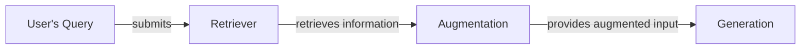
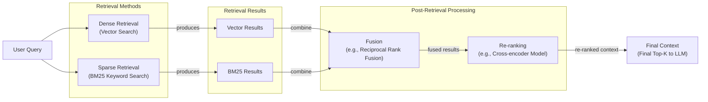
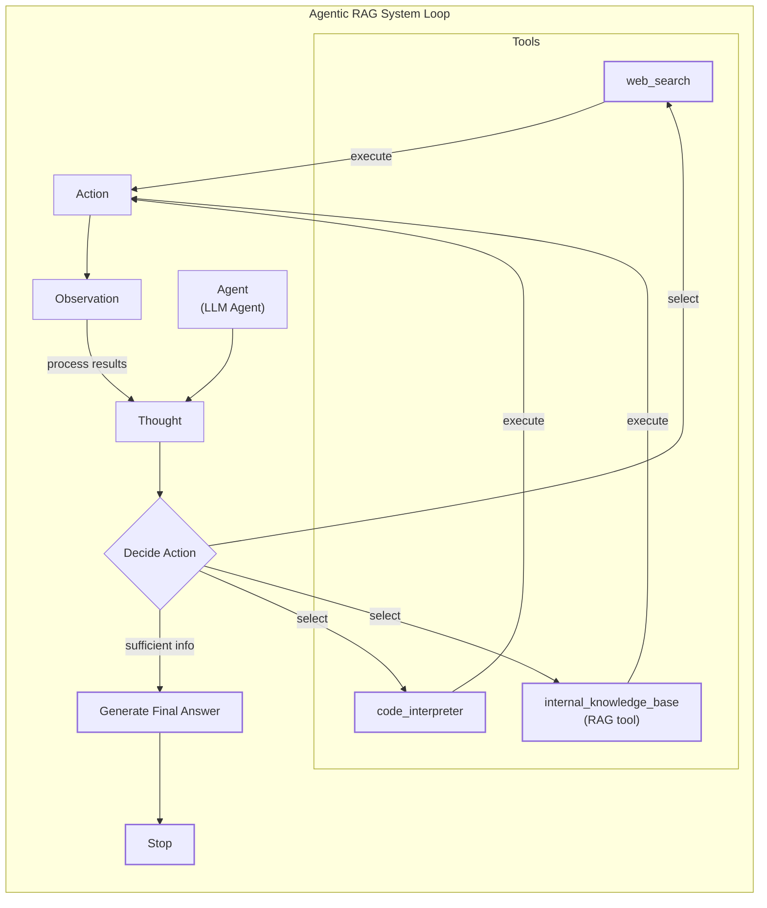

# Lesson 9: Retrieval-Augmented Generation

In our previous lessons, we’ve covered the essential building blocks of AI systems. We explored context engineering, the art of feeding the right information to an LLM, and in Lessons 7 and 8, we built a ReAct agent capable of planning and using tools. Now, we will tackle one of the most fundamental challenges in AI engineering: the knowledge problem.

LLMs are trained on a fixed snapshot of data, which means they are essentially taking a "closed-book exam" on the world's information. Their knowledge is static, unable to learn or update after deployment. This leads to two critical failures: they cannot answer questions about recent events, and they are prone to "hallucination," where they invent plausible but incorrect answers when they don’t know something.

You might think fine-tuning is the answer, but it's often not. Fine-tuning is a resource-heavy process that can take days, requires careful dataset curation, and risks "catastrophic forgetting," where the model loses previous capabilities. Similarly, while models now have massive context windows, simply stuffing them with information is not a silver bullet. It is expensive, slow, and suffers from the "lost-in-the-middle" problem, where models tend to ignore information buried in the middle of a long prompt [[3]](https://openreview.net/forum?id=5sB6cSblDR).

This is where Retrieval-Augmented Generation (RAG) comes in. RAG gives the LLM an "open-book exam" by connecting it to external, real-time knowledge sources. Instead of forcing the model to memorize facts, we give it the ability to look them up, just as a human would use notes or a search engine. RAG is a core technique in context engineering, which we introduced in Lesson 3, as it provides a reliable way to manage and inject knowledge into the LLM's context. This method allows us to build applications that are grounded, trustworthy, and always up-to-date.

In this lesson, we will explore the what and how of RAG, from its basic components to the advanced and agentic patterns that power modern AI systems. This knowledge complements what we will learn about agent memory in Lesson 10, where we will discuss how persistent memory stores work alongside on-demand retrieval.

With the problem and motivation clear, we’ll first decompose RAG into its core components so you can see where each responsibility lives.

## The RAG System: Core Components

To design effective RAG systems, you first need to understand their three conceptual pillars. This is the first step in the context engineering process we covered in Lesson 3. Each pillar has a distinct role in transforming a user's question into a factually grounded answer.

Image 1: A flowchart illustrating the core components and sequential interaction of a Retrieval Augmented Generation (RAG) system.

**Retrieval:** This is the search engine of your RAG system. Its job is to find the most relevant information from a knowledge base in response to a user's query. The dominant approach is semantic search, which finds content based on meaning rather than exact keywords. This is powered by vector embeddings—numerical representations of text that capture its semantic essence. An embedding model converts text into these vectors, which are then stored in a specialized vector database for efficient similarity search [[8]](https://qdrant.tech/articles/what-is-rag-in-ai/), [[52]](https://medium.com/@robi.tomar72/how-rag-actually-works-embeddings-vector-databases-indexing-retrieval-explained-simply-3d1ca45fe1bf). When a query comes in, it is also converted into a vector, and the database finds the stored text chunks whose vectors are closest, a process that is much more nuanced than traditional keyword matching (like BM25) [[51]](https://apxml.com/courses/prompt-engineering-llm-application-development/chapter-6-integrating-llms-external-data-rag/implementing-semantic-search-retrieval).

**Augmentation:** Once the retriever has found relevant document chunks, the augmentation step takes over. This process involves taking the retrieved information and strategically inserting it into the prompt that will be sent to the LLM. A well-constructed prompt will typically include the original user query, the retrieved context, and clear instructions for the model, such as "Answer the user's question based only on the provided context" [[56]](https://www.topquadrant.com/resources/blog-retrieval-augmented-generation-explained/). This step is where you engineer the context to guide the LLM toward a grounded response.

**Generation:** This is the final step where the LLM synthesizes an answer. The model receives the augmented prompt, which contains both the user’s question and the factual context retrieved from the knowledge base. Instead of relying on its static, internal knowledge, the LLM uses the provided information as its source of truth [[27]](https://www.aimon.ai/posts/rag_and_its_different_components/). The result is a response that is not only relevant but also verifiable, as it can be traced back to the source documents, often with citations included.

Now that you can name each moving part, let’s see how they line up across the two phases of a real system.

## The RAG Pipeline: Ingestion and Retrieval

A production-ready RAG system operates in two distinct phases: an offline ingestion pipeline that prepares the knowledge base, and an online retrieval pipeline that answers user queries in real-time. Understanding both is key to building a system that is both accurate and efficient [[32]](https://newsletter.systemdesign.one/p/how-rag-works).

```mermaid
flowchart LR
  %% Offline Ingestion & Indexing Phase
  subgraph "Offline Ingestion & Indexing"
    RD["Raw Documents"]
    DL["Document Loader<br/>(Unstructured, LangChain, LlamaIndex)"]
    TSC["Text Splitter & Chunking<br/>(RecursiveCharacterTextSplitter, SemanticSplitter)"]
    C["Chunks"]
    EM_OFF["Embedding Model<br/>(OpenAI, Google Gemini, Cohere, Voyage, bge)"]
    E["Embeddings"]
    VD["Vector Database<br/>(FAISS, Milvus, Qdrant, Pinecone, Elasticsearch/OpenSearch, Azure AI Search)"]

    RD -- "load" --> DL
    DL -- "process" --> TSC
    TSC -- "create" --> C
    C -- "embed" --> EM_OFF
    EM_OFF -- "generate" --> E
    E -- "store" --> VD
  end

  %% Online Retrieval & Generation Phase
  subgraph "Online Retrieval & Generation"
    UQ["User Query"]
    EM_ON["Embedding Model<br/>(Same as offline)"]
    QV["Query Vector"]
    SS["Similarity Search"]
    TKC["Top-K Chunks"]
    PB["Prompt Builder"]
    AP["Augmented Prompt"]
    LLM["Large Language Model (LLM)"]
    RG["Response Generation"]
    FA["Final Answer"]

    UQ -- "embed" --> EM_ON
    EM_ON -- "generate" --> QV
    QV -- "search" --> SS
    SS -- "retrieve" --> TKC
    VD -. "provides data for" .-> SS
    TKC -- "combine with query & instructions" --> PB
    UQ -. "provides query to" .-> PB
    PB -- "create" --> AP
    AP -- "send to" --> LLM
    LLM -- "perform" --> RG
    RG -- "produce" --> FA
  end

  %% Visual grouping
  classDef store stroke-dasharray:3,3
  classDef exec stroke-width:2px
  class VD store
  class DL,TSC,EM_OFF,EM_ON,SS,PB,LLM,RG exec
```

Image 2: A detailed Mermaid diagram illustrating the end-to-end RAG workflow, divided into two distinct phases: Offline Ingestion & Indexing and Online Retrieval & Generation.

### Phase 1: Offline Ingestion and Indexing

This is the preparatory phase where you build your searchable knowledge library. It runs offline, meaning it happens before any user interacts with the system [[31]](https://medium.com/@derrickryangiggs/rag-pipeline-deep-dive-ingestion-chunking-embedding-and-vector-search-abd3c8bfc177). The goal is to convert your raw documents into a structured format that enables fast and accurate retrieval.

1.  **Load:** The process begins by loading your documents from various sources. These could be PDFs, web pages, databases, or APIs. Libraries like LangChain and LlamaIndex provide document loaders that can handle a wide range of formats, while tools like Unstructured are designed to parse complex, messy files like presentations and reports.
2.  **Split:** Since LLMs have limited context windows and retrieval works best with focused pieces of text, large documents are broken down into smaller "chunks." A good chunking strategy is crucial; you want chunks that are semantically complete and avoid splitting a single idea across multiple chunks. A common starting point is the `RecursiveCharacterTextSplitter` from LangChain, which tries to split along natural boundaries like paragraphs and sentences.
3.  **Embed:** Each chunk is then passed through an embedding model, which converts the text into a high-dimensional vector. The choice of model is important and depends on your specific domain and performance needs. Popular options include models from OpenAI (e.g., `text-embedding-3-large`), Google (`text-embedding-004`), Cohere, and open-source alternatives like BGE models available on Hugging Face.
4.  **Store:** Finally, these embeddings, along with their corresponding text and any metadata, are loaded into a vector database. This database indexes the vectors for efficient similarity search. Options range from lightweight, in-memory libraries like FAISS for smaller projects to scalable, production-grade databases like Milvus, Qdrant, or Pinecone.

### Phase 2: Online Retrieval and Generation

This phase happens in real-time, triggered by a user's query. The goal is to find the right information and generate a grounded response as quickly as possible.

1.  **Embed Query:** When a user submits a query, it is converted into a vector using the *same* embedding model that was used during the ingestion phase. This ensures that the query and the document chunks are represented in the same vector space, making them comparable.
2.  **Search:** The system uses the query vector to search the vector database. It performs a similarity search (e.g., cosine similarity) to find the `top-k` document chunks whose embeddings are most similar to the query's embedding [[54]](https://towardsdatascience.com/rag-explained-understanding-embeddings-similarity-and-retrieval/). This step is the "retrieval" in RAG.
3.  **Generate:** The retrieved top-k chunks are then combined with the original user query and a set of instructions into a single prompt. This augmented prompt is fed to the LLM. As we discussed in Lesson 4, using structured outputs can help ensure the final answer is well-formatted and includes citations, tracing the information back to the source documents. The LLM then generates a response based on the context provided, grounding its answer in the retrieved facts.

With the end-to-end path in place, the next question is quality. What are the advanced techniques to make the retrieval more accurate and useful across messy, real-world data?

## Advanced RAG Techniques

A naive RAG pipeline is a great start, but production systems require more sophisticated techniques to handle the complexities of real-world data and user queries. These advanced strategies focus on improving the quality of what is retrieved and how it is used, directly impacting the final answer's accuracy and relevance.

Image 3: Mermaid diagram illustrating the hybrid retrieval flow.

### Hybrid Search

Vector search is powerful for understanding semantic meaning, but it can sometimes miss queries that rely on specific keywords, IDs, or acronyms. Hybrid search solves this by combining dense retrieval (vector search) with a sparse retrieval method like BM25, which excels at keyword matching [[38]](https://mlpills.substack.com/p/issue-76-optimize-rag-with-hybrid). For example, if a customer support user searches "my bill keeps rolling over," vector search might find articles about "carryover balances," while BM25 would pinpoint documents containing the exact term "rollover." The results from both are then fused, often using a technique like Reciprocal Rank Fusion (RRF), to create a more comprehensive set of candidates [[37]](https://www.chitika.com/hybrid-retrieval-rag/).

### Re-ranking

The initial retrieval step is optimized for speed and recall, meaning it casts a wide net to find potentially relevant documents. However, not all of these results are equally useful. A re-ranker introduces a second, more precise filtering stage. It uses a more powerful model, typically a cross-encoder, which examines the query and each retrieved document together to calculate a highly accurate relevance score [[43]](https://apxml.com/courses/optimizing-rag-for-production/chapter-2-advanced-retrieval-optimization/reranking-architectures-rag). For instance, when searching for "how to connect my account," a re-ranker can distinguish between a technical step-by-step guide, a press release announcing the feature, and a forum discussion, prioritizing the guide to the top of the list for the LLM.

### Query Transformations

Sometimes, the user's query is not in the optimal format for retrieval. Query transformation techniques rewrite or restructure the query to improve the search results.
- **Decomposition:** This method breaks down a complex, multi-part question into several simpler sub-queries. For example, the query "What’s our travel policy for conferences in Europe this year?" could be decomposed into: "What is the travel policy?", "What are the rules for conferences?", and "Are there specific rules for Europe in 2024?". The system retrieves documents for each sub-query and then synthesizes the information to provide a complete answer [[19]](https://docs.nvidia.com/rag/latest/query_decomposition.html).
- **Hypothetical Document Embeddings (HyDE):** This technique addresses the fact that queries are often phrased as questions, while documents contain answers. HyDE uses an LLM to generate a hypothetical, ideal answer to the user's query first. This hypothetical document is then converted to an embedding and used for the similarity search. By searching for a vector that looks like an answer, the system is more likely to find actual answer-containing passages [[16]](https://47billion.com/blog/rag-system-in-production-why-it-fails-and-how-to-fix-it/).

### Advanced Chunking Strategies

How you split your documents is one of the most critical decisions in a RAG pipeline. Moving beyond simple fixed-size chunking can dramatically improve retrieval quality.
- **Semantic Chunking:** Instead of splitting by a fixed number of tokens, this method groups semantically related sentences together. It analyzes the embedding similarity between consecutive sentences and creates a new chunk when the topic shifts, ensuring each chunk is thematically coherent [[17]](https://sarthakai.substack.com/p/improve-your-rag-accuracy-with-a).
- **Layout-Aware Chunking:** For documents with rich formatting like PDFs, this strategy preserves the document's structure. It identifies headers, tables, and lists, and chunks the document accordingly. For example, instead of splitting a pricing table in half, it keeps the entire table intact as a single chunk, preserving the relationship between products and their prices [[17]](https://sarthakai.substack.com/p/improve-your-rag-accuracy-with-a).
- **Context-Enriched Chunking:** Also known as Contextual Retrieval, this technique prepends a summary of the surrounding context to each chunk before embedding. For a chunk that says, "The figure improved by 34%," this method might add, "This chunk is from the Q3 earnings report, discussing operating margins." This anchors the chunk in its original context, making its embedding more precise and retrieval more accurate [[6]](https://www.anthropic.com/news/contextual-retrieval).

### GraphRAG

For queries that involve complex relationships and multi-hop reasoning, standard document retrieval can fall short. GraphRAG addresses this by first constructing a knowledge graph from the documents, where entities are nodes and relationships are edges. For a query like, "Which incidents were caused by weekend deploys that also touched the login service?", the system can traverse the graph—from change records to deploy times, to affected services, to incident tickets—to find interconnected information that would be impossible to assemble from isolated text chunks [[48]](https://webhome.cs.uvic.ca/~thomo/papers/asonam2025-graphrag.pdf), [[50]](https://arxiv.org/html/2501.00309v2).

### Metadata Filtering

One of the most practical and powerful techniques is filtering based on metadata. When each chunk is stored with metadata fields like `source`, `creation_date`, `department`, or `policy_version`, you can significantly narrow the search space before performing a vector search. Temporal filters are especially useful. For a query about policy changes between March and June 2025, you can restrict the search to only documents with an `effective_date` in that range. This not only improves relevance but also speed, as the system searches over a much smaller subset of data.

These techniques increase retrieval quality. Next, we’ll see how retrieval becomes one tool that an agent can choose to use as it reasons.

## Agentic RAG

In Lessons 7 and 8, we explored the ReAct framework, where an agent iteratively reasons (Thought), decides on an Action, observes the outcome, and repeats the cycle. Agentic RAG is the direct application of this principle, where retrieval is not just a preliminary step but a dynamic tool the agent can use as part of its reasoning loop.

It is important to clarify that agents often have access to many tools, such as web search, code interpreters, or database query engines. The RAG system, which provides access to an internal knowledge base, is just one of these tools. Labeling an entire system "agentic RAG" can be misleading; it's more accurate to think of it as an agent that is *equipped with a RAG tool* [[14]](https://airbyte.com/agentic-data/ai-agent-vs-rag).

The core distinction between standard and agentic RAG lies in their control flow. Standard RAG follows a linear, fixed pipeline: Retrieve → Augment → Generate. It is powerful but rigid [[12]](https://www.pingcap.com/article/agentic-rag-vs-traditional-rag-key-differences-benefits/). In contrast, Agentic RAG is adaptive and iterative. The agent is in control, deciding *when* to retrieve, *what* to retrieve, and *how* to use the retrieved information [[11]](https://towardsdatascience.com/agentic-rag-vs-classic-rag-from-a-pipeline-to-a-control-loop/).

Image 4: A conceptual Mermaid diagram illustrating an agent's main loop in an Agentic RAG system, highlighting its iterative reasoning and tool-use capabilities.

This agent-driven approach unlocks several advanced capabilities:
- **Iterative Refinement:** An agent can perform multiple retrieval steps. If the initial search returns vague information, the agent can reason about the gaps, formulate a more specific query, and search again. For example, after an initial retrieval on "data policy," it might refine its query to "data retention policy for EU customers, 2024 updates" [[25]](https://www.madrona.com/rag-inventor-talks-agents-grounded-ai-and-enterprise-impact/).
- **Dynamic Source Selection:** An agent with access to multiple knowledge sources can choose the most appropriate one for a given query. For an engineering question, it might use the `search_tech_docs` tool, whereas for a sales query, it might select `search_emails` [[13]](https://medium.com/@gaddam.rahul.kumar/agentic-rag-vs-traditional-rag-b1a156f72167).
- **Information Fusion:** The agent can combine information from its RAG tool with outputs from other tools. For instance, it could retrieve an internal policy on a chemical's handling, then use a web search to find the latest government safety regulations for that chemical, and finally synthesize both sources into a comprehensive safety guide.

Consider this conceptual thought process for an agent handling a complex query:
**Thought:** "The user is asking about '2024 EU data retention rules.' I know our internal policy documents cite the 2023 version. This information is likely outdated. I should first check the internal policy and then verify with an external source."
**Action:** `internal_knowledge_base.retrieve(query="EU data retention policy 2024")`
**Observation:** "The retrieved document mentions amendments are expected but does not provide specific citations for the 2024 rules."
**Thought:** "I need to find the official 2024 directive. I will use the web search tool for this."
**Action:** `web_search(query="Official EU data retention directive 2024")`
**Observation:** "Found a link to the official EU legislative portal with the updated directive."
**Thought:** "Now I have both the internal context and the official external source. I will synthesize this information, highlight the changes from the 2023 policy, and cite both sources in my final answer."

This shift from a static pipeline to an intelligent, reasoning loop is the essence of agentic RAG. It transforms the system from a simple database lookup tool into a knowledgeable research assistant capable of tackling complex, multi-step problems.

You now understand both a linear RAG pipeline and how an agent can control retrieval when needed. Let’s wrap up by situating RAG in the wider AI Engineering toolkit and previewing what comes next.

## Conclusion

We have journeyed from the fundamental problem of static LLM knowledge to the sophisticated, agent-driven systems that represent the frontier of AI engineering. RAG is the industry's primary solution to the LLM knowledge problem, but a naive implementation is just the starting point. For production-grade quality, advanced techniques like hybrid search, re-ranking, and intelligent chunking are not optional—they are essential. The future of knowledge retrieval is agentic, where RAG transforms from a fixed pipeline into a dynamic tool wielded by a reasoning agent.

The core benefits of this approach are clear. It drastically reduces hallucinations, enables deep customization with proprietary and real-time data, and builds user trust by providing verifiable, source-backed answers [[22]](https://www.mindstudio.ai/blog/what-is-rag/). For these reasons, mastering RAG is a foundational competency for any AI Engineer. It is a critical subset of context engineering, enabling the creation of AI systems that are not just powerful but also reliable and grounded in fact.

In our next lesson, we will explore Memory for Agents, and see how short-term and long-term memory systems complement RAG's on-demand retrieval capabilities. We will also touch on other critical topics, such as evaluating retrieval quality and monitoring RAG systems in production, in future parts of the course.

## References

- [1] Lewis, P., Perez, E., Piktus, A., Petroni, F., Karpukhin, V., Nogueira, G., ... & Kiela, D. (2020). Retrieval-Augmented Generation for Knowledge-Intensive NLP Tasks. *arXiv preprint arXiv:2005.11401*. https://arxiv.org/pdf/2005.11401.pdf
- [2] Gao, Y., Xiong, Y., Gao, X., Jia, K., Pan, J., Bi, Y., ... & Wang, H. (2023). Retrieval-Augmented Generation for Large Language Models: A Survey. *arXiv preprint arXiv:2312.10997*. https://arxiv.org/html/2312.05934v3
- [3] Baker, G. A., Raut, A., Shaier, S., Hunter, L. E., & Von Der Wense, K. (2024, January 1). Lost in the middle, and In-Between: Enhancing language models' ability to reason over long contexts in Multi-Hop QA. *OpenReview*. https://openreview.net/forum?id=5sB6cSblDR
- [4] Neelakantan, A., et al. (2022). Text and Code Embeddings by Contrastive Pre-Training. *arXiv preprint arXiv:2201.10005*. https://aclanthology.org/2024.emnlp-main.15.pdf
- [5] Lewis, P., et al. (2020). Retrieval-Augmented Generation for Knowledge-Intensive NLP Tasks. *arXiv:2005.11401*. https://arxiv.org/html/2312.05934v3
- [6] Anthropic. (2024, September 19). *Introducing Contextual Retrieval*. https://www.anthropic.com/news/contextual-retrieval
- [7] Gao, L., et al. (2020). REALM: Retrieval-Augmented Language Model Pre-Training. *arXiv:2002.08909*. https://arxiv.org/pdf/2002.08909.pdf
- [8] Qdrant. (n.d.). *What is RAG in AI?* https://qdrant.tech/articles/what-is-rag-in-ai/
- [9] wandb.ai. (n.d.). *Vector Embeddings in RAG Applications*. https://wandb.ai/mostafaibrahim17/ml-articles/reports/Vector-Embeddings-in-RAG-Applications--Vmlldzo3OTk1NDA5
- [10] FAISS (Facebook AI Similarity Search). (n.d.). *GitHub*. https://github.com/facebookresearch/faiss
- [11] Ibrahim, M. (2026, March 3). Agentic RAG vs Classic RAG: From a Pipeline to a Control Loop. *Towards Data Science*. https://towardsdatascience.com/agentic-rag-vs-classic-rag-from-a-pipeline-to-a-control-loop/
- [12] PingCAP. (n.d.). *Agentic RAG vs. Traditional RAG: Key Differences and Benefits*. https://www.pingcap.com/article/agentic-rag-vs-traditional-rag-key-differences-benefits/
- [13] Kumar, R. (2024, March 21). Agentic RAG vs Traditional RAG. *Medium*. https://medium.com/@gaddam.rahul.kumar/agentic-rag-vs-traditional-rag-b1a156f72167
- [14] Airbyte. (n.d.). *AI Agent vs RAG*. https://airbyte.com/agentic-data/ai-agent-vs-rag
- [15] Lewis, P., et al. (2020). Retrieval-Augmented Generation for Knowledge-Intensive NLP Tasks. *arXiv:2005.11401*. https://aclanthology.org/2024.emnlp-main.15.pdf
- [16] Singh, K., & Pathak, A. (2026, March 3). RAG System in Production: Why It Fails and How to Fix It. *47Billion*. https://47billion.com/blog/rag-system-in-production-why-it-fails-and-how-to-fix-it/
- [17] Sarthak AI. (2024, July 16). Improve Your RAG Accuracy With A Smarter Chunking Strategy. *Substack*. https://sarthakai.substack.com/p/improve-your-rag-accuracy-with-a
- [18] Cloudurable. (n.d.). *Advanced RAG Techniques That Will Transform Your LLM*. https://cloudurable.com/blog/advanced-rag-techniques-that-will-transform-your-l/
- [19] NVIDIA. (n.d.). *Query Decomposition*. https://docs.nvidia.com/rag/latest/query_decomposition.html
- [20] Bratanic, T., & Kruger, I. (2025, October 17). Advanced RAG Techniques for High-Performance LLM Applications. *Neo4j Blog*. https://neo4j.com/blog/genai/advanced-rag-techniques/
- [21] Fahey, J. (2023, November 28). Retrieval-Augmented Generation: Building Grounded AI for Enterprise Knowledge. *Medium*. https://medium.com/@fahey_james/retrieval-augmented-generation-building-grounded-ai-for-enterprise-knowledge-6bc46277fee5
- [22] MindStudio. (n.d.). *What is RAG?* https://www.mindstudio.ai/blog/what-is-rag/
- [23] InfoWorld. (2024, May 22). *Addressing AI hallucinations with retrieval-augmented generation*. https://www.infoworld.com/article/2335043/addressing-ai-hallucinations-with-retrieval-augmented-generation.html
- [24] Bratanic, T., & Harsh, K. (2024, September 11). Knowledge Graphs and LLMs: Fine-Tuning vs. Retrieval-Augmented Generation. *Neo4j Blog*. https://neo4j.com/blog/developer/fine-tuning-vs-rag/
- [25] Madrona. (2025, March 26). *RAG Inventor Talks Agents, Grounded AI, and Enterprise Impact*. https://www.madrona.com/rag-inventor-talks-agents-grounded-ai-and-enterprise-impact/
- [26] Humanloop. (n.d.). *RAG Architectures*. https://humanloop.com/blog/rag-architectures
- [27] Aimon. (n.d.). *RAG and its Different Components*. https://www.aimon.ai/posts/rag_and_its_different_components/
- [28] Toloka. (n.d.). *Grounding LLMs: Driving AI to Deliver Contextually Relevant Data*. https://toloka.ai/blog/grounding-llms-driving-ai-to-deliver-contextually-relevant-data/
- [29] IBM. (n.d.). *What is retrieval-augmented generation?* https://www.ibm.com/think/topics/retrieval-augmented-generation
- [30] Galileo. (n.d.). *RAG Architecture*. https://galileo.ai/blog/rag-architecture
- [31] Giggs, D. R. (2024, May 15). RAG Pipeline Deep Dive: Ingestion, Chunking, Embedding, and Vector Search. *Medium*. https://medium.com/@derrickryangiggs/rag-pipeline-deep-dive-ingestion-chunking-embedding-and-vector-search-abd3c8bfc177
- [32] System Design Newsletter. (n.d.). *How RAG Works*. https://newsletter.systemdesign.one/p/how-rag-works
- [33] Towards Data Science. (n.d.). *RAGOps Guide: Building and Scaling Retrieval-Augmented Generation Systems*. https://towardsdatascience.com/ragops-guide-building-and-scaling-retrieval-augmented-generation-systems-3d26b3ebd627/
- [34] APXML. (n.d.). *RAG Offline/Online Evaluation*. https://apxml.com/courses/optimizing-rag-for-production/chapter-6-advanced-rag-evaluation-monitoring/rag-offline-online-evaluation
- [35] Amazon Web Services. (n.d.). *What is Retrieval-Augmented Generation (RAG)?* https://aws.amazon.com/what-is/retrieval-augmented-generation/
- [36] Peri, P. (2026, March 5). *Hybrid Search*. https://pr-peri.github.io/blogpost/2026/03/05/blogpost-hybrid-search.html
- [37] Chitika. (n.d.). *Hybrid Retrieval for RAG*. https://www.chitika.com/hybrid-retrieval-rag/
- [38] MLPills. (2024, May 29). *Issue #76: Optimize RAG with Hybrid Search*. https://mlpills.substack.com/p/issue-76-optimize-rag-with-hybrid
- [39] Cubitrek. (n.d.). *Hybrid Search Optimization: How BM25 and Dense Vector Retrieval Work Together for Superior AI Search*. https://cubitrek.com/blog/hybrid-search-optimization-how-bm25-and-dense-vector-retrieval-work-together-for-superior-ai-search/
- [40] NetApp Community. (2024, May 20). *Hybrid RAG in the Real World: Graphs, BM25, and the End of Black-Box Retrieval*. https://community.netapp.com/t5/Tech-ONTAP-Blogs/Hybrid-RAG-in-the-Real-World-Graphs-BM25-and-the-End-of-Black-Box-Retrieval/ba-p/464834
- [41] arXiv. (2024, July 1). *A Survey on Retrieval-Augmented Generation for Large Language Models*. https://arxiv.org/html/2407.00072v5
- [42] Redis. (n.d.). *10 Techniques to Improve RAG Accuracy*. https://redis.io/blog/10-techniques-to-improve-rag-accuracy/
- [43] APXML. (n.d.). *Reranking Architectures for RAG*. https://apxml.com/courses/optimizing-rag-for-production/chapter-2-advanced-retrieval-optimization/reranking-architectures-rag
- [44] Bratanic, T., & Kruger, I. (2025, October 17). Advanced RAG Techniques for High-Performance LLM Applications. *Neo4j Blog*. https://neo4j.com/blog/genai/advanced-rag-techniques/
- [45] Towards Data Science. (n.d.). *Advanced RAG Retrieval: Cross-Encoders & Reranking*. https://towardsdatascience.com/advanced-rag-retrieval-cross-encoders-reranking/
- [46] arXiv. (2026, January 21). *GraphRAG: A Graph-Based Approach to Retrieval-Augmented Generation*. https://arxiv.org/html/2601.03014v1
- [47] Chitika. (n.d.). *Graph-Based Retrieval for RAG*. https://www.chitika.com/graph-based-retrieval-rag/
- [48] Thompson, S. (2025). *GraphRAG: A Graph-Based Approach to Retrieval-Augmented Generation*. https://webhome.cs.uvic.ca/~thomo/papers/asonam2025-graphrag.pdf
- [49] Atlan. (n.d.). *What is GraphRAG?* https://atlan.com/know/what-is-graphrag/
- [50] arXiv. (2025, January 1). *Graph-Based Retrieval for Multi-Hop Question Answering*. https://arxiv.org/html/2501.00309v2
- [51] APXML. (n.d.). *Implementing Semantic Search for Retrieval*. https://apxml.com/courses/prompt-engineering-llm-application-development/chapter-6-integrating-llms-external-data-rag/implementing-semantic-search-retrieval
- [52] Tomar, R. (2024, June 10). How RAG Actually Works: Embeddings, Vector Databases, Indexing & Retrieval Explained Simply. *Medium*. https://medium.com/@robi.tomar72/how-rag-actually-works-embeddings-vector-databases-indexing-retrieval-explained-simply-3d1ca45fe1bf
- [53] LearnOpenCV. (n.d.). *Vector DB and RAG Pipeline for Document RAG*. https://learnopencv.com/vector-db-and-rag-pipeline-for-document-rag/
- [54] Towards Data Science. (n.d.). *RAG Explained: Understanding Embeddings, Similarity, and Retrieval*. https://towardsdatascience.com/rag-explained-understanding-embeddings-similarity-and-retrieval/
- [55] Tutorials Dojo. (n.d.). *AWS Vector Databases Explained: Semantic Search and RAG Systems*. https://tutorialsdojo.com/aws-vector-databases-explained-semantic-search-and-rag-systems/
- [56] TopQuadrant. (n.d.). *Retrieval-Augmented Generation Explained*. https://www.topquadrant.com/resources/blog-retrieval-augmented-generation-explained/
- [57] Rui, H. (2024, November 11). *Building Trustworthy RAG Systems*. https://www.linkedin.com/posts/haruiz_building-trustworthy-rag-systems-with-in-activity-7310729777227669505-nd6u
- [58] Raut, R. (2023, August 28). Introduction to Augmenting LLMs Using Retrieval-Augmented Generation (RAG). *Medium*. https://medium.com/@rahulraut.techuse/introduction-to-augmenting-llms-using-retrieval-augmented-generation-rag-6530123dbb91
- [59] Prompting Guide. (n.d.). *Retrieval-Augmented Generation (RAG)*. https://www.promptingguide.ai/research/rag
- [60] Tejpal, A. (2023, October 23). Retrieval-Augmented Generation (RAG) From Basics to Advanced. *Medium*. https://medium.com/@tejpal.abhyuday/retrieval-augmented-generation-rag-from-basics-to-advanced-a2b068fd576c