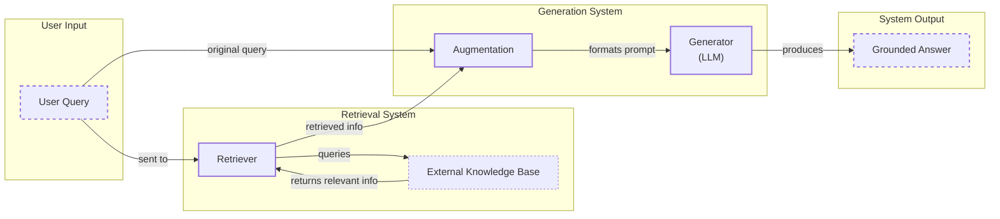
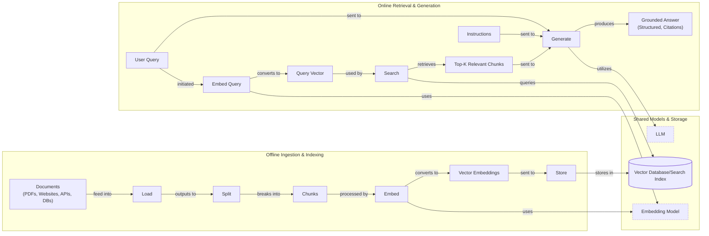
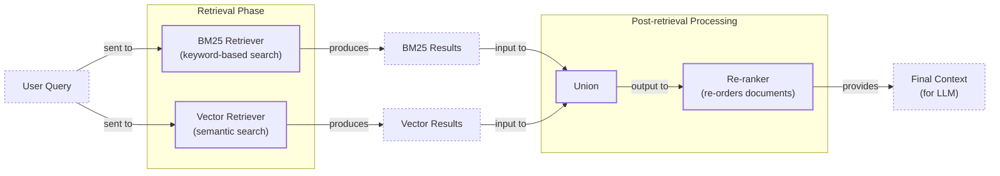
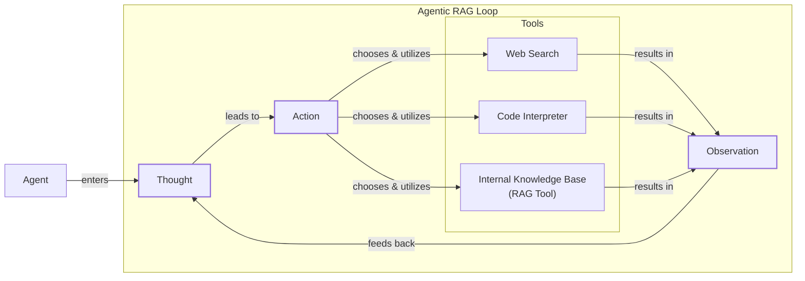

# Retrieval-Augmented Generation (RAG)

In our previous lessons, we explored the foundational concepts of AI Engineering. We started with the agent landscape, distinguished between rule-based workflows and autonomous agents, and in Lesson 3, we covered Context Engineering—the art of managing the information flow to an LLM. We have seen how to give agents tools to act (Lesson 6) and how to implement reasoning loops like ReAct (Lessons 7 and 8). Now, we will tackle one of the most important challenges in building intelligent systems: connecting LLMs to reliable, external knowledge.

LLMs are trained on fixed datasets, which means their knowledge is static. They take a "closed-book exam" on the world's information, frozen at a specific point in time. This limitation leads to two major problems: their knowledge becomes outdated, and they are prone to "hallucination"—confidently inventing facts when they do not know an answer [[1]](https://neo4j.com/blog/developer/fine-tuning-vs-rag/), [[2]](https://blogs.nvidia.com/blog/what-is-retrieval-augmented-generation/). We do not yet have techniques that allow models to continuously learn from experience after deployment.

One approach to update a model's knowledge is fine-tuning, which involves retraining it on a new, specialized dataset. However, this method is often impractical for keeping knowledge current. Fine-tuning is a resource-heavy process that demands extensive, carefully curated datasets, which can be expensive and time-consuming to create. The training process itself can take multiple days on costly hardware, making it a slow and inefficient way to incorporate new information. Furthermore, fine-tuning carries the risk of "catastrophic forgetting," a phenomenon where the model loses some of its previously learned general capabilities while adapting to the new data [[1]](https://neo4j.com/blog/developer/fine-tuning-vs-rag/).

While modern models feature increasingly large context windows, simply stuffing all available information into the prompt is not a viable solution either. This approach is expensive, as API costs are often tied to the number of tokens processed, and it adds substantial latency. More importantly, it degrades the model's performance due to the "lost-in-the-middle" problem. Research has shown that LLMs tend to recall information from the beginning and end of a long context much more effectively than information buried in the middle. This can lead to less accurate and incomplete answers, as critical details are overlooked [[3]](https://decodingml.substack.com/p/your-rag-is-wrong-heres-how-to-fix).

Retrieval-Augmented Generation (RAG) offers a reliable and scalable solution. Instead of forcing an LLM to memorize information, RAG gives it an "open-book exam." It connects the model to external, real-time knowledge sources, allowing it to retrieve relevant information on demand. Just as humans use manuals and quick-reference guides, RAG equips LLMs with the ability to look things up. As we covered in Lesson 3 on Context Engineering, RAG is a core method AI engineers use to curate the context passed to LLMs, ensuring the information is relevant and accurate.

In this lesson, we will explore the what, why, and how of RAG. We will start by breaking down its core components and detailing the end-to-end pipeline. Then, we will dive into the advanced techniques that take RAG from a simple prototype to a production-grade system. Finally, we will see how RAG evolves into a tool within agentic systems. We will also briefly touch on how retrieval complements agent memory, a topic we will explore in detail in Lesson 10.

## The RAG System: Core Components

To design effective RAG systems, you first need to understand their fundamental building blocks. As a key part of the Context Engineering process we introduced in Lesson 3, RAG can be broken down into three conceptual pillars: Retrieval, Augmentation, and Generation. Each plays a distinct role in transforming a user's query into a factually grounded answer.



Image 1: A flowchart illustrating the core components and data flow of a RAG system.

**Retrieval** is the engine responsible for finding relevant information. Given a user query, its job is to search an external knowledge base and pull out the most pertinent documents or data snippets. The dominant technique for this is semantic search, which relies on vector embeddings. Vector embeddings are high-dimensional numerical representations of text that capture its semantic meaning. An embedding model, such as BERT, processes a piece of text and outputs a vector. These vectors are then stored in a specialized vector database, which is optimized for efficient similarity search [[4]](https://qdrant.tech/articles/what-is-rag-in-ai/).

When a user asks a question, the query is also converted into a vector using the same embedding model. The system then searches the database for vectors that are "closest" in the high-dimensional space. This proximity is typically measured using distance metrics like cosine similarity or Euclidean distance [[5]](https://tutorialsdojo.com/aws-vector-databases-explained-semantic-search-and-rag-systems/), [[6]](https://towardsdatascience.com/rag-explained-understanding-embeddings-similarity-and-retrieval/). This allows the system to find documents that are conceptually related to the query, even if they do not share the exact same keywords. This paradigm evolved from decades of work in Information Retrieval, where early keyword-based methods like TF-IDF laid the groundwork for today's advanced semantic techniques [[7]](https://www.cloudthat.com/resources/blog/unveiling-the-journey-the-evolution-of-rag-systems). The multi-step pipeline used in IBM's Watson, which combined query decomposition, evidence retrieval, and answer ranking, is an early example of a system that blended retrieval and generation, influencing modern RAG architectures [[8]](https://www.iict.bas.bg/pecr/2025/83/3-PECR-MDimitrova.pdf).

**Augmentation** is the process of preparing the retrieved information for the LLM. Once the retriever has identified the most relevant data, this stage takes that information and combines it with the original user query to construct a new, "augmented" prompt. This prompt typically includes explicit instructions for the model, the retrieved context, and the user’s question. A common template might look like: `QUESTION: <user query> CONTEXT: <retrieved document excerpts> INSTRUCTIONS: Using the context above, answer the question.` Proper formatting is essential here; the context should be clearly separated from the instructions and the query to help the model distinguish between its given knowledge base and the task it needs to perform [[9]](https://www.topquadrant.com/resources/blog-retrieval-augmented-generation-explained/).

**Generation** is the final step, where the LLM produces an answer. The model receives the augmented prompt and uses the provided context as its source of truth. Its task is to synthesize the information from the retrieved documents to formulate a comprehensive and accurate response to the user's query. This grounds the LLM, forcing it to base its answer on the external data rather than relying solely on its internal, parametric knowledge. The result is a more reliable, trustworthy, and verifiable answer, often with citations pointing back to the original sources [[10]](https://humanloop.com/blog/rag-architectures), [[11]](https://www.ibm.com/think/topics/retrieval-augmented-generation).

Now that you can name each moving part, let’s see how they line up across the two phases of a real system.

## The RAG Pipeline: Ingestion and Retrieval

The end-to-end RAG workflow is split into two distinct phases: an offline ingestion pipeline that prepares the knowledge base and an online retrieval pipeline that answers queries in real-time. Understanding this separation is key to building and maintaining a production RAG system.



Image 2: A detailed flowchart depicting the two distinct phases of the RAG pipeline: "Offline Ingestion & Indexing" and "Online Retrieval & Generation".

### Phase 1: Offline Ingestion & Indexing

This phase is all about preparing your data. It runs in the background, either as a batch process or a continuous stream, to create and maintain the knowledge base your RAG system will query [[12]](https://newsletter.systemdesign.one/p/how-rag-works).

1.  **Load:** The first step is to load your documents from their sources. This could be anything from PDFs and web pages to data from APIs or databases. Handling this diversity is a challenge, as each format requires different parsing logic. For example, extracting clean text from a PDF with complex layouts, tables, and images is much harder than parsing a simple text file. Tools like LangChain's document loaders or LlamaIndex's readers are commonly used to abstract away this complexity [[13]](https://towardsdatascience.com/ragops-guide-building-and-scaling-retrieval-augmented-generation-systems-3d26b3ebd627/).
2.  **Split:** Once loaded, large documents are broken down into smaller, more manageable pieces called chunks. This is a critical step, as the quality of your chunks directly impacts retrieval performance. A good chunking strategy ensures that semantically related content stays together, avoiding splits in the middle of a coherent thought. You can use rule-based splitters, like LangChain’s `RecursiveCharacterTextSplitter`, or more advanced semantic chunkers that split text based on conceptual shifts [[14]](https://redis.io/blog/10-techniques-to-improve-rag-accuracy/).
3.  **Embed:** Each chunk is then passed through an embedding model, which converts the text into a numerical vector. The choice of embedding model is important, as it determines how semantic meaning is captured. Popular options include models from OpenAI (e.g., `text-embedding-3-large`), Google (`text-embedding-004`), and Cohere, as well as a wide range of open-source variants from Hugging Face like BGE models. The right model often depends on your specific domain, performance requirements, and budget [[15]](https://pub.towardsai.net/vector-databases-in-practice-building-a-realistic-hybrid-search-rag-system-with-qdrant-7b8f4a6e41e0).
4.  **Store:** Finally, these vector embeddings, along with the original text chunks and any relevant metadata, are loaded into a vector database or a search index. This specialized storage is optimized for fast similarity searches. Examples include local libraries like FAISS for prototyping or production-grade databases like Milvus, Qdrant, and Pinecone, which are designed for scalability and speed. Some traditional search systems like Elasticsearch and OpenSearch also offer k-Nearest Neighbor (kNN) capabilities [[4]](https://qdrant.tech/articles/what-is-rag-in-ai/).

### Phase 2: Online Retrieval & Generation

This phase happens in real-time when a user interacts with the system.

1.  **Query & Embed:** The user's question is received. It may be normalized or expanded to improve its chances of matching relevant documents. The query is then converted into a vector using the *same* embedding model that was used during the ingestion phase. This ensures that the query and the documents exist in the same vector space, making them comparable [[16]](https://decodingml.substack.com/p/rag-fundamentals-first?utm_source=publication-search).
2.  **Search:** The system uses the query vector to search the vector database. It performs a similarity search (e.g., cosine similarity) to find the top-k document chunks whose embeddings are closest to the query's embedding. These chunks are considered the most relevant context for answering the question [[5]](https://tutorialsdojo.com/aws-vector-databases-explained-semantic-search-and-rag-systems/).
3.  **Generate:** The retrieved chunks are combined with the original user query and a set of instructions into a single prompt. This augmented prompt is then sent to an LLM. As we discussed in Lesson 4, using structured outputs is a best practice here to ensure the final answer is well-formatted and includes citations, which allows users to trace the information back to its source [[17]](https://learn.microsoft.com/en-us/azure/developer/ai/advanced-retrieval-augmented-generation).

With the end-to-end path in place, the next question is quality. What advanced techniques can make retrieval more accurate and useful across messy, real-world data?

## Advanced RAG Techniques

A "naive" RAG pipeline is a great start, but production systems require more sophisticated techniques to handle the complexity and messiness of real-world data. These advanced methods focus on improving retrieval quality, ensuring the context passed to the LLM is as relevant and noise-free as possible.



Image 3: A flowchart illustrating the hybrid retrieval flow in advanced RAG techniques.

### Hybrid Search

Vector search is powerful for understanding semantic meaning, but it can miss exact keywords, acronyms, or IDs. Hybrid search solves this by combining vector search with a traditional keyword-based search algorithm like BM25. BM25 excels at finding documents with precise term matches.

By fusing the results from both methods, often using techniques like Reciprocal Rank Fusion (RRF), the system gets the best of both worlds: semantic understanding and keyword precision [[14]](https://redis.io/blog/10-techniques-to-improve-rag-accuracy/). For example, in a customer support scenario, a user might write, “my bill keeps rolling over.” Keyword search finds articles with the exact term “rollover,” while semantic search also surfaces guides about “carryover balances.” Together, they provide comprehensive coverage for different wordings of the same issue.

Here is a code example using LangChain's `EnsembleRetriever` to combine a BM25 retriever with a vector store retriever.

1.  First, we set up the individual retrievers.
    ```python
    from langchain.retrievers import BM25Retriever, EnsembleRetriever
    from langchain.vectorstores import Chroma
    from langchain.embeddings import OpenAIEmbeddings
    
    # Assume doc_list is a list of your document texts
    doc_list = ["The cat sat on the mat.", "The dog chased the cat.", "The mat was blue."]
    
    # Initialize BM25 retriever
    bm25_retriever = BM25Retriever.from_texts(doc_list)
    bm25_retriever.k = 2
    
    # Initialize vector store retriever
    embedding = OpenAIEmbeddings()
    vectorstore = Chroma.from_texts(doc_list, embedding)
    vectorstore_retriever = vectorstore.as_retriever(search_kwargs={"k": 2})
    ```
2.  Next, we combine them into an `EnsembleRetriever`. The `weights` parameter allows you to control the influence of each retriever, in this case giving slightly more weight to the vector search.
    ```python
    # Initialize the ensemble retriever
    ensemble_retriever = EnsembleRetriever(
        retrievers=[bm25_retriever, vectorstore_retriever], 
        weights=[0.4, 0.6]
    )
    
    # Retrieve documents
    docs = ensemble_retriever.get_relevant_documents("A feline on a blue rug.")
    print(docs)
    ```

### Re-ranking

The initial retrieval step is optimized for speed and recall, meaning it casts a wide net to find potentially relevant documents. However, the top-k results are not always ordered by true relevance. Re-ranking introduces a second, more precise model to re-order this initial set of candidates [[18]](https://neo4j.com/blog/genai/advanced-rag-techniques/).

A common approach is to use a cross-encoder model. It takes the user query and a candidate document together as input and outputs a relevance score. Unlike the bi-encoder used for initial retrieval, which embeds the query and documents separately, the cross-encoder allows for deeper interaction between them, leading to a much more accurate relevance assessment [[19]](https://towardsdatascience.com/advanced-rag-retrieval-cross-encoders-reranking/454238e5e11). For example, in a product help system, a query for “how to connect my account” might initially retrieve a press release and a community thread. A re-ranker would correctly push the step-by-step setup guide to the top of the list.

### Query Transformations

Sometimes the user's query is not the best input for the retrieval system. Query transformation techniques modify the original query to improve retrieval results.

-   **Decomposition:** This involves breaking down a complex, multi-part question into several simpler sub-questions. Each sub-question is then used to retrieve documents independently, and the results are merged. For a query like, “What’s our travel policy for conferences in Europe this year?” the system could generate sub-questions: (1) “Where is the travel policy located?”, (2) “What are the rules for conferences?”, (3) “Are there specific rules for Europe?”, and (4) “What has changed this year?” [[20]](https://docs.nvidia.com/rag/latest/query_decomposition.html).
-   **Hypothetical Document Embeddings (HyDE):** This technique involves using an LLM to generate a hypothetical, ideal answer to the user's query *before* searching. For example, before searching for the travel policy, the system might draft a short answer like: “Employees attending approved conferences in Europe can book economy flights and up to three hotel nights with daily meal limits.” It then embeds this generated answer and uses that embedding to search for similar documents in the vector database, which helps it find the actual policy pages [[18]](https://neo4j.com/blog/genai/advanced-rag-techniques/).

### Advanced Chunking Strategies

How you split your documents has a huge impact on retrieval quality. Moving beyond simple fixed-size chunks can improve performance.

-   **Semantic chunking** aims to split text along conceptual boundaries rather than arbitrary character counts. This ensures that complete ideas or arguments are kept within a single chunk, providing more coherent context to the LLM [[21]](https://cloudurable.com/blog/advanced-rag-techniques-that-will-transform-your-l/). For example, splitting a 20-page handbook by section headings keeps the entire "Reimbursements" section together, ensuring that rules and limits are not separated.
-   **Layout-aware chunking** is important for complex documents like PDFs with tables, forms, or multiple columns. Instead of treating the document as a flat text file, these methods parse the document's structure. For a pricing table, this means keeping each row (product, price, discount) together, rather than slicing the page by character count and separating numbers from their labels.
-   **Context-enriched chunking**, also known as contextual retrieval, involves adding a summary or other contextual information to each chunk before embedding it. For example, a chunk from a financial report might be prepended with "This chunk is from ACME Corp's Q2 2023 report" to help the retrieval system disambiguate it from similar text in other documents [[22]](https://www.anthropic.com/news/contextual-retrieval).

### GraphRAG

For questions about complex relationships and interconnected data, standard document retrieval can fall short. GraphRAG addresses this by first constructing a knowledge graph from the source documents, where entities are nodes and relationships are edges. Retrieval then happens over this graph, allowing the system to traverse connections and synthesize information across multiple nodes. This is ideal for multi-hop questions where the answer requires connecting several pieces of information [[23]](https://arxiv.org/html/2404.16130), [[24]](https://arxiv.org/html/2501.00309v2). For example, a retail system could answer, “Which shoes get the most size-related returns and were featured in last month’s ads?” by connecting returns data to product SKUs and marketing calendars. Similarly, an IT operations system could answer, “Which incidents were caused by weekend deploys that also touched the login service?” by linking incident tickets to change records and affected services.

### Metadata Filtering

One of the most practical and effective techniques in production is metadata filtering. During ingestion, each chunk can be tagged with metadata such as its source document, creation date, author, or topic. At query time, the system can use this metadata to pre-filter the search space, ensuring that retrieval only considers documents that meet specific criteria [[18]](https://neo4j.com/blog/genai/advanced-rag-techniques/).

Temporal filters are especially powerful. For a query like, “What changed between March and June 2025?” you can restrict the search to chunks with an `effective_date` within that range. You can even apply bitemporal logic, filtering by `effective_date` for what was true at a specific time, while also tracking `indexed_at` to understand data freshness. This transforms a general vector search into a precise, context-aware system. Most vector databases implement this using a two-phase approach: pre-filtering (applying the filter before the vector search) or post-filtering (applying it after) [[25]](https://oneuptime.com/blog/post/2026-01-30-metadata-filtering/view).

In regulated industries like finance, metadata is non-negotiable. A case study from a regional bank showed that implementing a RAG system with strong metadata controls reduced manual compliance review time by 68% and cut audit response time in half [[26]](https://saison-technology-intl.com/resource/compliance-intelligence-rag-financial-services/). However, a common failure mode occurs when this metadata is used only for filtering and is not passed into the final prompt. For example, a known issue in AWS Bedrock Knowledge Bases is that metadata attributes are not persisted into the model prompt, leaving the LLM unaware of crucial context like the document's source or effective date [[27]](https://repost.aws/questions/QUikNkU5ZGRTGDuf4zXkmxVg/trouble-with-aws-bedrock-metadata-filtering-for-agents-kb-retrieve-apis).

These advanced techniques transform a basic RAG pipeline into a robust, production-ready system. They provide the necessary tools to handle the nuances of real-world data and complex user queries. Next, we’ll see how retrieval becomes one tool that an agent can choose to use as it reasons.

## Agentic RAG

The techniques we have discussed so far improve the quality of a RAG pipeline. However, the pipeline itself remains a linear, pre-determined workflow. This is where Agentic RAG comes in, transforming the retrieval process from a fixed sequence into a dynamic, intelligent loop controlled by an agent. This concept ties directly back to what we learned about ReAct agents in Lessons 7 and 8. An Agentic RAG system is essentially a ReAct-style agent that is equipped with a retrieval tool.



Image 4: A conceptual flowchart illustrating an agent's main loop in Agentic RAG.

The core distinction lies in control. In standard RAG, every query follows the same path: Retrieve -> Augment -> Generate. It is a powerful but rigid system. In Agentic RAG, the agent is in the driver's seat. It uses a reasoning loop (Thought -> Action -> Observation) to decide *when* to retrieve, *what* to retrieve, and *how* to use the retrieved information [[28]](https://towardsdatascience.com/agentic-rag-vs-classic-rag-from-a-pipeline-to-a-control-loop/). This shifts RAG from an isolated process to a versatile tool within a larger problem-solving framework, moving from a static pipeline to an adaptive control loop [[29]](https://weaviate.io/blog/what-is-agentic-rag).

This agentic approach unlocks several powerful capabilities:

-   **Iterative Retrieval:** An agent can use the RAG tool multiple times in a loop. If the initial retrieval results are insufficient, it can reason about what is missing and reformulate its query. For example, after a first pass on a vague policy question, the agent might narrow its scope to "EU customers, 2024 updates" and retrieve again to find more specific details [[30]](https://domino.ai/blog/rag-vs-agentic-ai).
-   **Dynamic Source Selection:** If an agent has access to multiple knowledge sources, it can choose the most appropriate one for a given query. For an IT outage, it might decide to `search_incident_runbooks` instead of `search_marketing_pages` [[31]](https://www.llamaindex.ai/blog/rag-is-dead-long-live-agentic-retrieval).
-   **Information Fusion:** The agent is not limited to its RAG tool. It can fuse information retrieved from an internal knowledge base with data from other tools, such as a live web search. For instance, it could retrieve an internal company policy and then use a web search to check for recent regulatory changes that might affect it [[32]](https://www.ibm.com/think/topics/agentic-rag).
-   **Knowledge Base Updates:** A sophisticated agent can even decide to update the knowledge base with new information it learns. This touches on the concept of agent memory, which we will cover in detail in Lesson 10.

Let's walk through a conceptual thought process. A user asks about "2024 EU data retention rules."

1.  **Thought:** The agent thinks, "The user is asking about the 2024 rules. I should check our internal policy documents first, but I need to be aware they might be outdated."
2.  **Action:** `retrieve(internal_knowledge_base, query="EU data retention policy 2024")`.
3.  **Observation:** The agent observes that the retrieved policy was last updated in 2023 and mentions upcoming amendments but lacks specific citations.
4.  **Thought:** "The internal document is likely outdated. I need to verify this with a public, authoritative source."
5.  **Action:** `web_search(query="official EU data retention directive 2024")`.
6.  **Observation:** The web search returns a link to a new EU directive that was recently passed.
7.  **Thought:** "I have both the internal policy and the new external directive. I should synthesize these, highlight the changes from the 2023 policy, and cite both sources in my final answer."

This dynamic, multi-step process is the essence of Agentic RAG. It moves beyond a simple database lookup to a conversation with a knowledgeable research assistant who can reason, verify, and synthesize information from multiple sources. While this adds power, it also introduces engineering trade-offs. Scaling agentic systems brings challenges in latency, cost, and reliability. Each reasoning step adds another LLM call, increasing expense and response time, while a failure in any one of the chained tools can break the entire workflow [[33]](https://redis.io/blog/agentic-rag-how-enterprises-are-surmounting-the-limits-of-traditional-rag/). Moving from a simple RAG prototype to a production agentic system, like those being built at Replit or Microsoft, requires careful orchestration and error handling [[29]](https://weaviate.io/blog/what-is-agentic-rag), [[34]](https://toloka.ai/blog/agentic-rag-systems-for-enterprise-scale-information-retrieval/).

Here is a conceptual example of how you might implement an agentic retriever using LlamaIndex, where the agent can choose between different retrieval modes.

```python
from llama_index.indices.managed.llama_cloud import LlamaParseIndex

# Assume financial_index is an already created LlamaParseIndex
# with financial reports uploaded.

# The "auto_routed" mode uses a lightweight agent to decide which
# retrieval mode ('chunks', 'files_via_metadata', 'files_via_content')
# is most appropriate for the given query.
retriever = financial_index.as_retriever(retrieval_mode="auto_routed")

# For a specific question, the agent might choose 'chunks' mode.
nodes = retriever.retrieve("Where is Microsoft headquartered?")

# The chosen mode can be inspected from the metadata.
# This would print "chunks" as the query is specific.
print(nodes[0].metadata["retrieval_mode"])
```

You now understand both a linear RAG pipeline and how an agent can control retrieval when needed. Let’s wrap up by situating RAG in the wider AI Engineering toolkit and previewing what comes next.

## Conclusion

We have journeyed from the fundamental limitations of LLMs to the sophisticated, agent-driven systems that represent the future of information retrieval. The key takeaway is that RAG is the most widely adopted and practical solution to the LLM knowledge problem. While a naive implementation can get you started, production-grade quality depends on the advanced techniques we have discussed. The future of knowledge retrieval is undeniably agentic, where static pipelines give way to dynamic, reasoning-driven processes.

Mastering RAG is about more than just a technical skill; it is about building trust. By grounding LLM responses in verifiable, source-backed data, we reduce hallucinations, enable customization with proprietary information, and create AI systems that users can rely on. For this reason, RAG is not a niche topic but a foundational competency for any modern AI Engineer. It is an important component of the broader discipline of Context Engineering.

In our next lesson, we will explore Memory for Agents. We will see how short-term and long-term memory systems work alongside RAG's on-demand retrieval to create agents that can learn from past interactions and build a persistent understanding of their world. RAG provides the "what" for a single turn, while memory provides the "who" and "why" across many turns, allowing agents to build relationships and maintain context over time. We have also touched on the importance of evaluating these complex systems, a topic we will dive into later in the course when we discuss how to monitor and maintain RAG applications in production.

## References

- [1] [Knowledge Graphs and LLMs: Fine-Tuning vs. Retrieval-Augmented Generation](https://neo4j.com/blog/developer/fine-tuning-vs-rag/)
- [2] [What Is Retrieval-Augmented Generation, aka RAG?](https://blogs.nvidia.com/blog/what-is-retrieval-augmented-generation/)
- [3] [Your RAG Is Wrong, Here's How To Fix It](https://decodingml.substack.com/p/your-rag-is-wrong-heres-how-to-fix?utm_source=publication-search)
- [4] [What is RAG in AI?](https://qdrant.tech/articles/what-is-rag-in-ai/)
- [5] [AWS Vector Databases Explained: Semantic Search and RAG Systems](https://tutorialsdojo.com/aws-vector-databases-explained-semantic-search-and-rag-systems/)
- [6] [RAG Explained: Understanding Embeddings, Similarity, and Retrieval](https://towardsdatascience.com/rag-explained-understanding-embeddings-similarity-and-retrieval/)
- [7] [Unveiling the Journey: The Evolution of RAG Systems](https://www.cloudthat.com/resources/blog/unveiling-the-journey-the-evolution-of-rag-systems)
- [8] [The Evolution of Question Answering Systems: From Rule-Based to Generative AI](https://www.iict.bas.bg/pecr/2025/83/3-PECR-MDimitrova.pdf)
- [9] [Retrieval Augmented Generation Explained](https://www.topquadrant.com/resources/blog-retrieval-augmented-generation-explained/)
- [10] [A Guide to RAG Pipeline Strategies](https://humanloop.com/blog/rag-architectures)
- [11] [Grounding LLMs: Driving AI to Deliver Contextually Relevant Data](https://toloka.ai/blog/grounding-llms-driving-ai-to-deliver-contextually-relevant-data/)
- [12] [How RAG Works: The Details of the Retrieval Augmented Generation Pipeline](https://newsletter.systemdesign.one/p/how-rag-works)
- [13] [RAGOps Guide: Building and Scaling Retrieval-Augmented Generation Systems](https://towardsdatascience.com/ragops-guide-building-and-scaling-retrieval-augmented-generation-systems-3d26b3ebd627/)
- [14] [Improving RAG accuracy: 10 techniques that actually work](https://redis.io/blog/10-techniques-to-improve-rag-accuracy/)
- [15] [Vector Databases in Practice: Building a Realistic Hybrid Search RAG System with Qdrant](https://pub.towardsai.net/vector-databases-in-practice-building-a-realistic-hybrid-search-rag-system-with-qdrant-7b8f4a6e41e0)
- [16] [Retrieval-Augmented Generation (RAG) Fundamentals First](https://decodingml.substack.com/p/rag-fundamentals-first?utm_source=publication-search)
- [17] [Build advanced retrieval-augmented generation systems](https://learn.microsoft.com/en-us/azure/developer/ai/advanced-retrieval-augmented-generation)
- [18] [Advanced RAG Techniques for High-Performance LLM Applications](https://neo4j.com/blog/genai/advanced-rag-techniques/)
- [19] [Advanced RAG retrieval: Cross-Encoders Reranking](https://towardsdatascience.com/advanced-rag-retrieval-cross-encoders-reranking/454238e5e11)
- [20] [Query Decomposition](https://docs.nvidia.com/rag/latest/query_decomposition.html)
- [21] [Advanced RAG Techniques That Will Transform Your LLM Applications](https://cloudurable.com/blog/advanced-rag-techniques-that-will-transform-your-l/)
- [22] [Introducing Contextual Retrieval](https://www.anthropic.com/news/contextual-retrieval)
- [23] [From Local to Global: A GraphRAG Approach to Query-Focused Summarization](https://arxiv.org/html/2404.16130)
- [24] [Graph-Based Retrieval-Augmented Generation for Large Language Models](https://arxiv.org/html/2501.00309v2)
- [25] [Metadata Filtering in Vector Search](https://oneuptime.com/blog/post/2026-01-30-metadata-filtering/view)
- [26] [Compliance Intelligence: How Financial Institutions Use RAG](https://saison-technology-intl.com/resource/compliance-intelligence-rag-financial-services/)
- [27] [Trouble with AWS Bedrock metadata filtering for Agents KB retrieve APIs](https://repost.aws/questions/QUikNkU5ZGRTGDuf4zXkmxVg/trouble-with-aws-bedrock-metadata-filtering-for-agents-kb-retrieve-apis)
- [28] [Agentic RAG vs Classic RAG: From a Pipeline to a Control Loop](https://towardsdatascience.com/agentic-rag-vs-classic-rag-from-a-pipeline-to-a-control-loop/)
- [29] [What is Agentic RAG](https://weaviate.io/blog/what-is-agentic-rag)
- [30] [RAG vs Agentic AI: Which Is Better for Your Business?](https://domino.ai/blog/rag-vs-agentic-ai)
- [31] [RAG is dead, long live agentic retrieval](https://www.llamaindex.ai/blog/rag-is-dead-long-live-agentic-retrieval)
- [32] [What is agentic RAG?](https://www.ibm.com/think/topics/agentic-rag)
- [33] [Agentic RAG: How enterprises are surmounting the limits of traditional RAG](https://redis.io/blog/agentic-rag-how-enterprises-are-surmounting-the-limits-of-traditional-rag/)
- [34] [Agentic RAG Systems for Enterprise-Scale Information Retrieval](https://toloka.ai/blog/agentic-rag-systems-for-enterprise-scale-information-retrieval/)