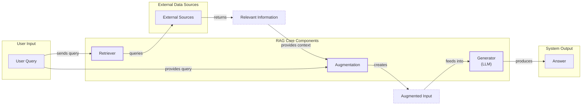
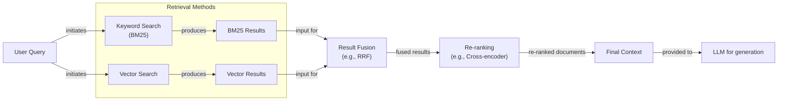
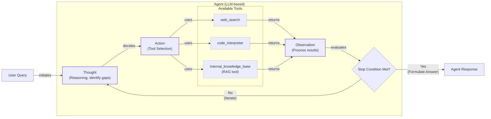

# Retrieval-Augmented Generation: The "Open-Book Exam" for LLMs

In our previous lessons, we have covered the building blocks of modern AI systems. We have explored the agent landscape, distinguished between rule-based workflows and autonomous agents, and in Lesson 3, we introduced Context Engineering—the art of managing the flow of information to an LLM. We have seen how agents can use tools to act and reason to plan. Now, we will tackle one of the most critical components in that information flow: connecting our agents to external knowledge.

LLMs are trained on a fixed dataset, which means their knowledge is static. They are essentially taking a "closed-book exam" on the world's information up to their training cutoff date. This evolution from traditional keyword-based Information Retrieval (IR) systems to modern semantic search has culminated in RAG, which combines powerful retrieval with generative models to synthesize coherent answers instead of just returning links [[81]]. Still, we do not yet have efficient techniques to enable models to continuously learn new information after deployment. We could fine-tune them, but this process is resource-heavy and slow. A fine-tuned model can take days or weeks to train, requires careful dataset curation, and is susceptible to "catastrophic forgetting," where it loses previously learned information.

Even if we could keep the model updated, we would still face the context window limitation. While models with million-token context windows exist, treating them as infinite storage is a mistake. Stuffing too much information into the prompt increases costs and latency. More importantly, it degrades performance due to the "lost-in-the-middle" problem, where models struggle to recall information buried deep within a large context [[3]].

Retrieval-Augmented Generation (RAG) offers a practical and powerful solution. Instead of forcing the model to memorize everything, RAG gives it an "open-book exam." It connects the LLM to external, real-time knowledge sources, allowing it to retrieve specific, relevant information on demand [[1]]. This is similar to how we, as humans, use manuals or cheat sheets instead of memorizing every detail. RAG is a core method within the discipline of Context Engineering we discussed in Lesson 3, focused on curating the LLM's context for optimal performance.

This lesson will guide you through the "what" and "how" of RAG, from its basic components to the advanced and agentic patterns that power production-grade AI systems. We will also see how retrieval differs from agent memory, a topic we will explore in detail in Lesson 10.

## The RAG System: Core Components

Understanding the core components of a RAG system is the first step in the Context Engineering process of designing effective AI applications. Conceptually, RAG can be broken down into three pillars: Retrieval, Augmentation, and Generation [[2]].


Image 1: A flowchart illustrating the core components of a Retrieval Augmented Generation (RAG) system.

**Retrieval** is the engine responsible for finding relevant information. When a user asks a question, the retriever searches an external knowledge base to find documents or data snippets pertinent to the query. The most common approach is semantic search, which goes beyond simple keyword matching. It uses vector embeddings—numerical representations of text—to find content that is semantically similar in meaning, even if the wording is different [[51]]. These embeddings are created by an embedding model and stored in a specialized vector database, which is optimized for fast similarity searches across millions or even billions of vectors [[6], [7]].

**Augmentation** is the process of integrating the retrieved information into the LLM's context. Once the retriever identifies the most relevant data chunks, this content is combined with the original user query and a set of instructions. This creates an "augmented prompt" that provides the LLM with the necessary background information to formulate an accurate answer [[29], [56]]. This step is where we engineer the final context that the LLM will see, ensuring it has everything it needs to perform its task.

**Generation** is the final step, where the LLM produces an answer. Using the augmented input, the model synthesizes the information from the retrieved context to generate a response that is grounded in the provided data [[26]]. This process significantly reduces the likelihood of hallucinations because the model is not relying solely on its pre-trained, parameterized knowledge. Instead, it acts as a reasoning engine, using the external data as its source of truth.

With a clear picture of these moving parts, let’s examine how they fit into the two distinct phases of a production RAG system: offline ingestion and online retrieval.

## The RAG Pipeline: Ingestion and Retrieval

An end-to-end RAG workflow is divided into two main phases. The first is an offline process for preparing your knowledge base, and the second is the online, real-time process that answers user queries [[32]].

```mermaid
flowchart LR
  %% Offline Ingestion & Indexing Phase
  subgraph "Offline Ingestion & Indexing"
    A["Documents<br/>(PDFs, websites, APIs)"] -- "processed by" --> B["Loader<br/>(Unstructured, LangChain, LlamaIndex)"]
    B -- "creates" --> C["Splitter<br/>(RecursiveCharacterTextSplitter, SemanticSplitter)"]
    C -- "creates" --> D["Document Chunks"]
    D -- "encode" --> E["Embedding Model<br/>(OpenAI, Google Gemini, Cohere, Hugging Face)"]
    E -- "generates" --> F["Vector Embeddings"]
    F -- "store" --> G["Vector Database/Search Index<br/>(FAISS, Milvus, Qdrant, Pinecone, Elasticsearch/OpenSearch, Azure AI Search)"]
    D -- "store text" .-> G
  end

  %% Online Retrieval & Generation Phase
  subgraph "Online Retrieval & Generation"
    H["User Query"] -- "processed by" --> I["Query Engine<br/>(LangChain Runnable, LlamaIndex QueryEngine)"]
    I -- "encode query" --> E
    E -- "creates" --> J["Query Embedding"]
    J -- "search" --> G
    G -- "retrieve" --> K["Top-K Relevant Chunks<br/>(cosine similarity, filtering)"]
    K -- "used to" --> L["Build Prompt"]
    H -- "include" --> L
    M["Instructions"] -- "include" --> L
    L -- "send to" --> N["LLM<br/>(Generator)"]
    N -- "produces" --> O["Grounded Answer<br/>(structured outputs, citations)"]
  end

  %% Cross-phase relationships
  E -. "shared model" .-> E
  G -. "shared index" .-> G
```
Image 2: A detailed Mermaid diagram illustrating the end-to-end RAG workflow, divided into two main phases: "Offline Ingestion & Indexing" and "Online Retrieval & Generation".

### Phase 1: Offline Ingestion & Indexing

This phase is all about preparing your data to be searchable. It happens before any user interacts with the system and typically runs as a batch or streaming pipeline [[33]].

1.  **Load:** The first step is to load your documents from their sources. These can be PDFs, web pages, APIs, or databases. Open-source libraries like Unstructured, LangChain, and LlamaIndex provide document loaders that can handle a wide variety of formats, extracting clean text from complex files.
2.  **Split:** Large documents are too big to fit into an LLM's context window and can contain multiple topics, making their embeddings less precise. We split them into smaller, semantically meaningful chunks. This can be done with simple strategies like fixed-size splitting or more advanced methods like semantic chunking, which breaks text based on conceptual shifts. Tools like LangChain's `RecursiveCharacterTextSplitter` are commonly used for this.
3.  **Embed:** Each chunk of text is then converted into a vector embedding using a specialized model. Popular choices include models from OpenAI (e.g., `text-embedding-3-large`), Google (`text-embedding-004`), Cohere, or open-source alternatives from Hugging Face like BGE models. The choice of embedding model is critical, as it determines how well semantic meaning is captured.
4.  **Store:** Finally, these embeddings and their corresponding text chunks are loaded into a vector database or a search index with vector search capabilities [[8]]. Options range from local libraries like FAISS for smaller projects to scalable, production-grade databases like Milvus, Qdrant, or Pinecone. Traditional search engines like Elasticsearch and OpenSearch also offer k-Nearest Neighbor (kNN) search functionalities.

### Phase 2: Online Retrieval & Generation

This phase happens in real-time, triggered by a user query.

1.  **Query & Embed:** When a user submits a question, the system uses the *same* embedding model from the ingestion phase to convert the query into a vector. This ensures that the query and the documents are represented in the same vector space, making them comparable [[51]].
2.  **Search:** The query vector is used to search the vector database. The database performs a similarity search—often using cosine similarity—to find the top-k most similar document chunks [[54]]. This step retrieves the chunks whose meanings are closest to the user's question.
3.  **Generate:** The retrieved chunks are then used to build the augmented prompt. This prompt typically includes the original user question, the retrieved context, and instructions for the LLM on how to use the information. The LLM then generates a final answer grounded in the provided context. As we learned in Lesson 4, using structured outputs can help ensure the answer is formatted consistently and includes citations back to the source documents, building user trust.

This end-to-end pipeline forms the basis of any RAG system. However, to achieve high-quality results on messy, real-world data, you need to go beyond this naive implementation and incorporate more advanced techniques.

## Advanced RAG Techniques

While a basic RAG pipeline is a good starting point, production systems require more sophisticated techniques to improve retrieval quality. What works in a proof-of-concept with a small dataset often fails at scale. As Shubham Maurya, Senior Data Scientist at Mastercard, notes, up to 70% of RAG systems fail in production due to unaddressed challenges like "knowledge drift," where the data sources change, and "retrieval decay," where finding relevant information becomes a needle-in-a-haystack problem as data volume grows [[60]]. Irrelevant or poorly ranked documents can lead to incorrect or incomplete answers. Here are some of the most effective advanced RAG strategies.


Image 3: A Mermaid diagram illustrating the "Hybrid Retrieval" flow, starting with a user query, branching into parallel keyword and vector searches, fusing results, re-ranking, and finally providing the context to an LLM.

### Hybrid Search

Hybrid search combines the strengths of traditional keyword-based search (like BM25) with modern vector search. Vector search excels at understanding semantic meaning and finding contextually relevant documents, even if they do not share exact keywords with the query. However, it can sometimes miss documents with specific but important terms, like product codes or acronyms. BM25, on the other hand, is excellent at precise keyword matching [[36]]. By running both searches in parallel and fusing the results using a technique like Reciprocal Rank Fusion (RRF), you get the best of both worlds: the semantic understanding of vectors and the precision of keyword search [[38]].

### Re-ranking

The initial retrieval step is optimized for speed and recall, meaning it casts a wide net to find potentially relevant documents. However, the initial ranking might not be perfect. Re-ranking introduces a second, more precise model to re-order this initial set of candidates. Cross-encoder models are commonly used for this task. Unlike bi-encoders (used for initial retrieval), which create separate embeddings for the query and document, a cross-encoder processes the query and a candidate document *together* [[43]]. This allows for a deeper interaction between their tokens, resulting in a much more accurate relevance score. Since this is computationally expensive, it is only applied to a small set of top candidates (e.g., the top 50-100) from the first stage, creating a latency-quality trade-off that must be managed in production systems [[42], [61]].

### Query Transformations

Sometimes, the user's original query is not the best one for retrieval. Query transformation techniques modify the query to improve search results.

*   **Decomposition** breaks down a complex, multi-part question into several simpler sub-queries. For instance, the question "What is our company's travel policy for international conferences compared to domestic ones?" could be split into two queries: one for the international policy and one for the domestic policy. The system retrieves documents for each sub-query and then synthesizes the results to form a comprehensive answer [[19]].
*   **Hypothetical Document Embeddings (HyDE)** is another technique where you first ask an LLM to generate a hypothetical, ideal answer to the user's query. This generated answer is then embedded and used for the similarity search. The idea is that this hypothetical document is often semantically closer to the actual answer documents than the original, often short, user query [[16]].

### Advanced Chunking Strategies

How you split your documents into chunks fundamentally impacts retrieval quality. Moving beyond simple fixed-size chunking can significantly improve performance.
*   **Semantic chunking** splits text based on topical shifts, ensuring that each chunk contains a coherent, self-contained idea. This prevents awkward breaks in the middle of a sentence or paragraph.
*   **Layout-aware chunking** is crucial for complex documents like PDFs with tables, figures, or forms. Instead of treating the document as a flat text file, these parsers understand the visual layout, keeping table rows intact or associating captions with their images. This is especially important in domains like healthcare, where information in medical records is often structured in tables and specific sections [[62]].
*   **Context-enriched chunking**, also known as contextual retrieval, involves generating a summary or contextual information for each chunk and prepending it to the chunk's content before embedding. This gives the embedding model more context, helping it create a more representative vector and improving retrieval accuracy, especially for chunks that are ambiguous on their own.

### GraphRAG

For questions that involve complex relationships and interconnected entities, standard document retrieval can fall short. GraphRAG addresses this by first constructing a knowledge graph from the source documents, where entities are nodes and relationships are edges. This is often done by parsing documents into subject-predicate-object triples (e.g., "Steve Jobs - founded - Apple") [[63]]. For example, to answer a query like "Which drugs that treat epithelioid sarcoma also affect the EZH2 gene product?", a GraphRAG system can traverse the graph, following paths from the disease to treatments and from those treatments to affected genes [[50]]. This allows it to assemble context from multiple, interconnected sources, enabling it to answer multi-hop questions that would be nearly impossible with standard vector search [[49]].

### Metadata Filtering

One of the most practical and powerful techniques in production is metadata filtering. When you index your document chunks, you can store metadata alongside them, such as the document's source, creation date, author, or topic. During retrieval, you can use these filters to narrow the search space *before* performing the vector similarity search. For example, in a travel application, user preferences for destination or activities can be used as dynamic filters to ensure retrieved documents are highly relevant [[64]]. A more advanced version of this is "Self-Query Retrieval," where an LLM is used to parse a natural language query and generate the structured metadata filters automatically [[65]]. This not only improves relevance but also speeds up the search process.

These advanced techniques turn a basic RAG pipeline into a robust, production-ready system. But what happens when retrieval itself becomes a dynamic part of a larger reasoning process? That is where agentic RAG comes in.

## Agentic RAG

As we explored in Lessons 7 and 8, a ReAct agent operates in a "Thought-Action-Observation" loop, reasoning about a problem and deciding which tool to use. Agentic RAG is the application of this pattern where one of the primary tools available to the agent is a RAG pipeline. The agent can reason about when it has a knowledge gap and decide to call its retrieval tool to find the necessary information.

This marks a fundamental shift from a static pipeline to an adaptive, iterative process. This approach is conceptually similar to neuro-symbolic AI, which blends the adaptive, pattern-matching strengths of neural models with the deterministic logic of symbolic reasoning to create more robust and auditable systems [[66]].


Image 4: A conceptual Mermaid diagram illustrating an "Agent's Main Loop" in an Agentic RAG system, detailing the iterative Thought-Action-Observation cycle and tool utilization.

### Standard RAG vs. Agentic RAG

The core distinction lies in control and adaptability.
*   **Standard RAG** is a linear, pre-determined workflow. Every query follows the same rigid path: Retrieve -> Augment -> Generate. The system cannot deviate from this sequence. If the initial retrieval fails to find the right information, the entire process fails [[11]].
*   **Agentic RAG** is an adaptive control loop. The agent decides *when* to retrieve, *what* to retrieve, and *whether to retrieve again*. It can reformulate queries, choose between different knowledge sources, and chain multiple retrieval and reasoning steps together until it is confident it has a complete answer [[12]]. However, this flexibility comes at a cost. While a simple RAG pipeline might involve 2-3 LLM calls, an agentic system with routing and validation can easily make 10-15 calls, leading to higher latency and costs that must be carefully managed [[67]]. For example, hierarchical agentic systems can improve accuracy significantly but at the cost of increased latency—one enterprise benchmark showed an 84.5% accuracy rate with a 2.1-second latency, compared to 45.2% accuracy and 0.8-second latency for standard RAG [[68]].

This agentic approach unlocks several powerful capabilities:
*   **Iterative Refinement:** If the first retrieval pass returns ambiguous or incomplete information, the agent can analyze the results, identify gaps, and formulate a new, more specific query. For example, after an initial search for "company policy," it might refine the query to "company travel policy for international trips in 2024."
*   **Dynamic Source Selection:** An agent can be equipped with multiple retrieval tools, each connected to a different knowledge base (e.g., `search_technical_docs`, `search_internal_wiki`, `search_emails`). Based on the user's query, the agent can reason which source is most likely to contain the answer. This is an emerging research area known as adaptive routing [[69]].
*   **Information Fusion:** The agent can combine information from its RAG tool with outputs from other tools, like a web search or a database query. For instance, it could retrieve an internal product specification and then use a web search to find current market pricing for competing products before synthesizing a comparative analysis.

Consider this thought process for an agent handling a complex query:
*   **User Query:** "What are the latest EU regulations on data retention, and how do they differ from our 2023 internal policy?"
*   **Thought:** The user is asking for a comparison between a public regulation and an internal document. I need to get information from both sources. My internal knowledge base might be outdated.
*   **Action:** `retrieve(source='internal_policy', query='data retention policy 2023')`
*   **Observation:** Retrieved the internal policy, which cites a 2022 EU directive.
*   **Thought:** The internal policy is likely outdated. I need to find the current external regulation.
*   **Action:** `web_search(query='EU data retention regulations 2024')`
*   **Observation:** Found a new directive passed in early 2024 with stricter requirements.
*   **Thought:** I now have both the old internal policy and the new external regulation. I can compare them and highlight the differences.
*   **Final Answer:** The agent generates a detailed response summarizing both documents and explaining the specific changes required to bring the internal policy into compliance.

This is the difference between a simple database lookup and a conversation with a knowledgeable research assistant. The agent doesn't just fetch data; it reasons about it, verifies it, and synthesizes it into a comprehensive answer.

## Conclusion

In this lesson, we have seen that Retrieval-Augmented Generation is the industry's primary solution to the LLM's inherent knowledge limitations. It transforms models from "closed-book" examinees into "open-book" reasoners, capable of providing accurate, up-to-date, and verifiable answers. We have journeyed from the core components of a basic RAG pipeline to the advanced techniques required for production-grade quality, and finally to the future of knowledge retrieval: agentic systems.

The core benefits of RAG are clear: it drastically reduces hallucinations, enables deep customization with proprietary data, and builds user trust by grounding responses in citable sources [[22]]. As you move forward in your career, you will find that RAG is not a niche skill but a foundational competency for any AI Engineer. It is a critical pillar of the broader discipline of Context Engineering, enabling you to build AI systems that are not just intelligent, but also reliable and trustworthy.

This brings us to the next step in our journey. While RAG provides an agent with knowledge on-demand, it does not account for the agent's ability to learn from interactions or remember user preferences over time. This integration of memory is an open research challenge, with key questions around how to best consolidate episodic events or store individual interactions [[70]]. In Lesson 10, we will explore Memory for Agents, and see how short-term and long-term memory systems work alongside RAG to create truly intelligent and personalized AI assistants. Further down the line, we will also cover how to build robust evaluation pipelines to measure retrieval quality and how to monitor these complex systems in production.

## References

- [1] [What Is Retrieval-Augmented Generation, aka RAG?](https://blogs.nvidia.com/blog/what-is-retrieval-augmented-generation/)
- [2] [A Complete Guide to RAG](https://towardsai.net/p/l/a-complete-guide-to-rag)
- [3] [Lost in the middle, and In-Between: Enhancing language models' ability to reason over long contexts in Multi-Hop QA](https://openreview.net/forum?id=5sB6cSblDR)
- [4] [Retrieval-Augmented Generation (RAG) Fundamentals First](https://decodingml.substack.com/p/rag-fundamentals-first?utm_source=publication-search)
- [5] [Your RAG is wrong: Here's how to fix it](https://decodingml.substack.com/p/your-rag-is-wrong-heres-how-to-fix?utm_source=publication-search)
- [6] [Vector Databases in Practice: Building a Realistic Hybrid Search RAG System with Qdrant](https://pub.towardsai.net/vector-databases-in-practice-building-a-realistic-hybrid-search-rag-system-with-qdrant-7b8f4a6e41e0)
- [7] [AWS Vector Databases Explained: Powering Semantic Search and RAG Systems](https://tutorialsdojo.com/aws-vector-databases-explained-semantic-search-and-rag-systems/)
- [8] [What is RAG: Understanding Retrieval-Augmented Generation](https://qdrant.tech/articles/what-is-rag-in-ai/)
- [9] [Vector Embeddings in RAG Applications](https://wandb.ai/mostafaibrahim17/ml-articles/reports/Vector-Embeddings-in-RAG-Applications--Vmlldzo3OTk1NDA5)
- [10] [From Local to Global: A GraphRAG Approach to Query-Focused Summarization](https://arxiv.org/html/2404.16130)
- [11] [Agentic RAG vs Classic RAG: From a Pipeline to a Control Loop](https://towardsdatascience.com/agentic-rag-vs-classic-rag-from-a-pipeline-to-a-control-loop/)
- [12] [Agentic RAG vs. Traditional RAG: Key Differences and Benefits](https://www.pingcap.com/article/agentic-rag-vs-traditional-rag-key-differences-benefits/)
- [13] [What is Agentic RAG](https://weaviate.io/blog/what-is-agentic-rag)
- [14] [AI Agent vs RAG: What’s the Difference?](https://airbyte.com/agentic-data/ai-agent-vs-rag)
- [15] [RAG vs Agentic AI: Which is Right for Your Business?](https://domino.ai/blog/rag-vs-agentic-ai)
- [16] [Why Your RAG System in Production Fails and How to Fix It](https://47billion.com/blog/rag-system-in-production-why-it-fails-and-how-to-fix-it/)
- [17] [Introducing Contextual Retrieval](https://www.anthropic.com/news/contextual-retrieval)
- [18] [Advanced RAG Techniques That Will Transform Your LLM Apps](https://cloudurable.com/blog/advanced-rag-techniques-that-will-transform-your-l/)
- [19] [Query Decomposition](https://docs.nvidia.com/rag/latest/query_decomposition.html)
- [20] [Advanced RAG Techniques: from Theory to Production](https://neo4j.com/blog/genai/advanced-rag-techniques/)
- [21] [Retrieval Augmented Generation: Building Grounded AI for Enterprise Knowledge](https://medium.com/@fahey_james/retrieval-augmented-generation-building-grounded-ai-for-enterprise-knowledge-6bc46277fee5)
- [22] [What is RAG? (Retrieval-Augmented Generation)](https://www.mindstudio.ai/blog/what-is-rag/)
- [23] [RAG is dead, long live agentic retrieval](https://www.llamaindex.ai/blog/rag-is-dead-long-live-agentic-retrieval)
- [24] [What is agentic RAG?](https://www.ibm.com/think/topics/agentic-rag)
- [25] [RAG Inventor Talks Agents, Grounded AI, and Enterprise Impact](https://www.madrona.com/rag-inventor-talks-agents-grounded-ai-and-enterprise-impact/)
- [26] [A Guide to RAG Architectures](https://humanloop.com/blog/rag-architectures)
- [27] [RAG and its different components](https://www.aimon.ai/posts/rag_and_its_different_components/)
- [28] [Grounding LLMs: Driving AI to Deliver Contextually Relevant Data](https://toloka.ai/blog/grounding-llms-driving-ai-to-deliver-contextually-relevant-data/)
- [29] [What is retrieval-augmented generation?](https://www.ibm.com/think/topics/retrieval-augmented-generation)
- [30] [RAG Architecture Explained: A Complete Guide to RAG in LLMs](https://galileo.ai/blog/rag-architecture)
- [31] [RAG Pipeline Deep Dive: Ingestion (Chunking, Embedding, and Vector Search)](https://medium.com/@derrickryangiggs/rag-pipeline-deep-dive-ingestion-chunking-embedding-and-vector-search-abd3c8bfc177)
- [32] [How RAG works](https://newsletter.systemdesign.one/p/how-rag-works)
- [33] [RAGOps Guide: Building and Scaling Retrieval-Augmented Generation Systems](https://towardsdatascience.com/ragops-guide-building-and-scaling-retrieval-augmented-generation-systems-3d26b3ebd627)
- [34] [The Rise of RAG](https://highlearningrate.substack.com/p/the-rise-of-rag)
- [35] [What is Retrieval-Augmented Generation (RAG)?](https://aws.amazon.com/what-is/retrieval-augmented-generation/)
- [36] [Hybrid Search Is a Production RAG Necessity](https://pr-peri.github.io/blogpost/2026/03/05/blogpost-hybrid-search.html)
- [37] [Build advanced retrieval-augmented generation systems](https://learn.microsoft.com/en-us/azure/developer/ai/advanced-retrieval-augmented-generation)
- [38] [Issue #76 - Optimize RAG with Hybrid search](https://mlpills.substack.com/p/issue-76-optimize-rag-with-hybrid)
- [39] [Hybrid Search Optimization: How BM25 And Dense Vector Retrieval Work Together for Superior AI Search](https://cubitrek.com/blog/hybrid-search-optimization-how-bm25-and-dense-vector-retrieval-work-together-for-superior-ai-search/)
- [40] [Hybrid RAG in the Real World: Graphs, BM25, and the End of Black Box Retrieval](https://community.netapp.com/t5/Tech-ONTAP-Blogs/Hybrid-RAG-in-the-Real-World-Graphs-BM25-and-the-End-of-Black-Box-Retrieval/ba-p/464834)
- [41] [A Survey on Retrieval-Augmented Generation for Large Language Models](https://arxiv.org/html/2407.00072v5)
- [42] [10 Techniques to Improve RAG (Retrieval-Augmented Generation) Accuracy](https://redis.io/blog/10-techniques-to-improve-rag-accuracy/)
- [43] [Reranking Architectures for RAG](https://apxml.com/courses/optimizing-rag-for-production/chapter-2-advanced-retrieval-optimization/reranking-architectures-rag)
- [44] [Knowledge Graphs and LLMs: Fine-Tuning vs. Retrieval-Augmented Generation](https://neo4j.com/blog/developer/fine-tuning-vs-rag/)
- [45] [Advanced RAG Retrieval: Cross-Encoders & Reranking](https://towardsdatascience.com/advanced-rag-retrieval-cross-encoders-reranking/)
- [46] [GraphRAG: A Graph-Based Approach to Retrieval-Augmented Generation](https://arxiv.org/html/2601.03014v1)
- [47] [Addressing AI Hallucinations With Retrieval-Augmented Generation](https://www.infoworld.com/article/2335043/addressing-ai-hallucinations-with-retrieval-augmented-generation.html)
- [48] [GraphRAG: A Graph-Based Approach to Augmenting Large Language Models with Domain Knowledge](https://webhome.cs.uvic.ca/~thomo/papers/asonam2025-graphrag.pdf)
- [49] [What Is GraphRAG? The Next Evolution in Retrieval-Augmented Generation](https://atlan.com/know/what-is-graphrag/)
- [50] [Graph-based Retrieval-Augmented Generation for Large Language Models](https://arxiv.org/html/2501.00309v2)
- [51] [Implementing Semantic Search for Retrieval](https://apxml.com/courses/prompt-engineering-llm-application-development/chapter-6-integrating-llms-external-data-rag/implementing-semantic-search-retrieval)
- [52] [How RAG Actually Works: Embeddings, Vector Databases, Indexing & Retrieval Explained Simply](https://medium.com/@robi.tomar72/how-rag-actually-works-embeddings-vector-databases-indexing-retrieval-explained-simply-3d1ca45fe1bf)
- [53] [Vector DB and RAG Pipeline for Document RAG](https://learnopencv.com/vector-db-and-rag-pipeline-for-document-rag/)
- [54] [RAG Explained: Understanding Embeddings, Similarity and Retrieval](https://towardsdatascience.com/rag-explained-understanding-embeddings-similarity-and-retrieval/)
- [55] [Retrieval-Augmented Generation for Knowledge-Intensive NLP Tasks](https://aclanthology.org/2024.emnlp-main.15.pdf)
- [56] [Retrieval-Augmented Generation Explained](https://www.topquadrant.com/resources/blog-retrieval-augmented-generation-explained/)
- [57] [Fine-tuning vs. RAG for Large Language Models](https://neo4j.com/blog/developer/fine-tuning-vs-rag/)
- [58] [Retrieval-Augmented Generation for Large Language Models: A Survey](https://arxiv.org/html/2312.05934v3)
- [59] [Retrieval-Augmented Generation (RAG)](https://www.promptingguide.ai/research/rag)
- [60] [Why RAG fails in production (And how to fix it)](https://www.aiacceleratorinstitute.com/why-rag-fails-in-production-and-how-to-fix-it/)
- [61] [Why RAG Systems Fail in Production](https://www.digitalocean.com/community/conceptual-articles/why-rag-systems-fail-in-production)
- [62] [Why is RAG hard on medical records compared to other domains?](https://www.abstractivehealth.com/article/why-is-RAG-hard-on-medical-records-compared-to-other-domains)
- [63] [How Microsoft GraphRAG works with graph databases](https://memgraph.com/blog/how-microsoft-graphrag-works-with-graph-databases)
- [64] [Dynamic metadata filtering for Amazon Bedrock Knowledge Bases with LangChain](https://aws.amazon.com/blogs/machine-learning/dynamic-metadata-filtering-for-amazon-bedrock-knowledge-bases-with-langchain/)
- [65] [Self-Query Retrieval](https://arxiv.org/html/2510.24402v1)
- [66] [From Logic to Learning: The Future of AI Lies in Neuro-Symbolic Agents](https://builder.aws.com/content/2uYUowZxjkh80uc0s2bUji0C9FP/from-logic-to-learning-the-future-of-ai-lies-in-neuro-symbolic-agents)
- [67] [Why 90% of Agentic RAG Projects Fail](https://towardsai.net/p/machine-learning/why-90-of-agentic-rag-projects-fail-and-how-to-build-one-that-actually-works-in-production)
- [68] [Building Hierarchical Agentic RAG Systems](https://www.infoq.com/articles/building-hierarchical-agentic-rag-systems/)
- [69] [Building Hierarchical Agentic RAG Systems](https://www.infoq.com/articles/building-hierarchical-agentic-rag-systems/)
- [70] [Agentic RAG: A Self-Corrective Method](https://medium.com/@bhuvaneswari.subramani/agentic-rag-a-self-corrective-method-for-implementing-retrieval-augmented-generation-d6bbd583446f)
- [71] [Journey from Traditional IR to RAG to Agentic RAG](https://medium.com/data-science-collective/journey-from-traditional-ir-to-rag-to-agentic-rag-b658210f46d4)