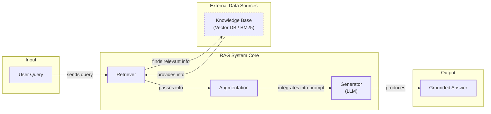
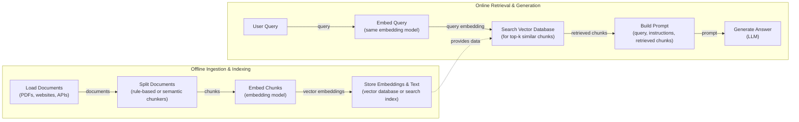
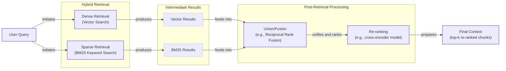
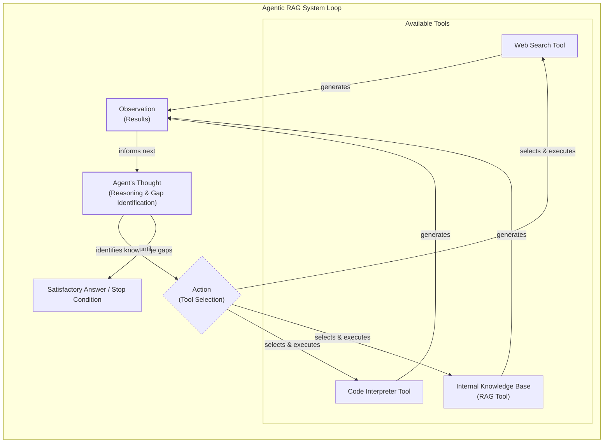

# Lesson 9: Retrieval-Augmented Generation (RAG)

In our previous lessons, we built a solid foundation in AI Engineering. We explored the agent landscape, differentiated between LLM workflows and AI agents, and, in Lesson 3, covered Context Engineering—the art of managing the information an LLM receives. We have seen how to give agents tools to act and how to implement reasoning loops with ReAct. Now, we will dive into one of the most important techniques for building knowledgeable and trustworthy AI systems: Retrieval-Augmented Generation (RAG).

LLMs are trained on a fixed dataset, which means their knowledge is static. They are essentially taking a "closed-book exam" on the world's information up to their training cutoff date. If you ask a model like GPT-4o about an event that happened after its last update, it will not know the answer [[1]](https://decodingml.substack.com/p/rag-fundamentals-first?utm_source=publication-search). This leads to two major problems: outdated or incorrect information and a tendency to "hallucinate"—confidently inventing facts when unsure [[2]](https://neo4j.com/blog/developer/fine-tuning-vs-rag/).

One might think fine-tuning is the answer, but it is often impractical. It is a resource-heavy process that requires massive, curated datasets and multi-day training jobs. Constructing the training dataset is more complex than the training itself and can get expensive. For example, while Stanford's Alpaca dataset was generated for about $500 using an LLM, this approach risks propagating falsehoods if the generating model hallucinates [[2]](https://neo4j.com/blog/developer/fine-tuning-vs-rag/). Furthermore, fine-tuning is slow and carries the risk of "catastrophic forgetting," where the model loses previous knowledge while learning new information.

Even simply stuffing more documents into an LLM's context window has its limits. Context windows are finite, and longer prompts increase cost and latency. Furthermore, models suffer from the "lost-in-the-middle" problem. Research from Stanford and Meta AI has shown that their ability to recall information follows a U-shaped performance curve: accuracy is highest for facts placed at the very beginning or end of the context window but plummets when critical details are buried in the middle [[3]](https://cs.stanford.edu/~nfliu/papers/lost-in-the-middle.arxiv2023.pdf). This is attributed to primacy and recency biases, similar to the "serial-position effect" in human psychology, where attention weights are diluted across long contexts [[4]](https://diffray.ai/blog/context-dilution/).

RAG offers a more elegant and effective solution. Instead of forcing a model to memorize everything, we give it an "open-book exam." RAG connects the LLM to external, real-time knowledge sources, allowing it to retrieve relevant information on-demand and ground its answers in verifiable facts [[5]](https://blogs.nvidia.com/blog/what-is-retrieval-augmented-generation/). This is a core method within the discipline of Context Engineering we introduced in Lesson 3, focused on curating the information an LLM sees. It complements other techniques like agent memory, which we will explore in Lesson 10.

In this lesson, we will cover the fundamentals of RAG, from its core components to the end-to-end pipeline. We will then explore advanced techniques that make RAG a production-ready solution and see how it evolves into a powerful tool within agentic systems.

## The RAG System: Core Components

To build effective RAG systems, you first need to understand their three conceptual pillars. This framework is a key part of the Context Engineering process we discussed in Lesson 3, as it allows you to deconstruct the problem of grounding an LLM into manageable parts. Each pillar has a distinct responsibility in transforming a user's question into a factually-backed answer.


Image 1: A flowchart illustrating the core components and data flow of a RAG system.

**Retrieval** is the engine that finds relevant information. When a user asks a question, the retriever's job is to search an external knowledge base for the most relevant documents or data snippets. The most common method for this is semantic search, which goes beyond simple keyword matching to find text that is contextually similar in meaning [[6]](https://apxml.com/courses/prompt-engineering-llm-application-development/chapter-6-integrating-llms-external-data-rag/implementing-semantic-search-retrieval). This is powered by vector embeddings—numerical representations of text that capture its semantic essence. An embedding model transforms text into a dense vector where each dimension represents some aspect of the content's meaning. Text with similar meanings will have embeddings that are "close" to each other in a high-dimensional space [[7]](https://tutorialsdojo.com/aws-vector-databases-explained-semantic-search-and-rag-systems/). These embeddings are stored in a specialized vector database, which is optimized for fast similarity searches using nearest-neighbor algorithms [[8]](https://pub.towardsai.net/vector-databases-in-practice-building-a-realistic-hybrid-search-rag-system-with-qdrant-7b8f4a6e41e0). Some systems also use traditional keyword-based search algorithms like **Best Matching 25 (BM25)**, which ranks documents based on term frequency and rarity, to complement semantic search [[9]](https://mlpills.substack.com/p/issue-76-optimize-rag-with-hybrid).

**Augmentation** is the process of integrating the retrieved information into the prompt that will be sent to the LLM. Once the retriever has found the top-ranking document chunks, this step constructs a new, "augmented" prompt. This prompt typically includes the original user query, the retrieved context, and a set of instructions telling the LLM how to use the information [[10]](https://www.topquadrant.com/resources/blog-retrieval-augmented-generation-explained/). For example, an instruction might be: "*Using the context above, answer the question. If the context does not contain the answer, say so*." This step is essential for guiding the LLM to ground its response in the provided facts rather than its internal knowledge.

**Generation** is the final step where the LLM produces an answer. The LLM receives the augmented prompt and synthesizes the information to generate a coherent, contextually relevant, and factually grounded response [[11]](https://www.ibm.com/think/topics/retrieval-augmented-generation). A well-designed RAG system will also prompt the LLM to cite its sources, linking claims in the generated answer back to the specific document chunks it used. This creates a transparent and verifiable output, which is essential for building user trust, a feature that companies like IBM and NVIDIA highlight as a key benefit of RAG [[5]](https://blogs.nvidia.com/blog/what-is-retrieval-augmented-generation/), [[11]](https://www.ibm.com/think/topics/retrieval-augmented-generation).

Now that you can name each moving part, let’s see how they line up across the two phases of a real-world RAG system.

## The RAG Pipeline: Ingestion and Retrieval

A production-ready RAG system operates in two distinct phases: an offline ingestion pipeline for preparing the knowledge base and an online retrieval pipeline for answering queries in real-time [[12]](https://medium.com/@derrickryangiggs/rag-pipeline-deep-dive-ingestion-chunking-embedding-and-vector-search-abd3c8bfc177). Understanding this separation is key to designing, building, and maintaining scalable RAG applications.


Image 2: A detailed flowchart illustrating the end-to-end RAG pipeline, separated into two distinct phases: 'Offline Ingestion & Indexing' and 'Online Retrieval & Generation'.

### Phase 1: Offline Ingestion & Indexing

The ingestion phase is an offline process where you prepare your knowledge base for efficient retrieval. This happens before any user interacts with the system and can be run as a batch process or a continuous pipeline [[13]](https://newsletter.systemdesign.one/p/how-rag-works). It involves four main steps.

**Load:** The first step is to load your documents from their various sources. These can be PDFs, web pages, databases, or documents accessed via an **Application Programming Interface (API)**. Tools like LangChain's document loaders or LlamaIndex's readers are commonly used to handle the diversity of data formats and sources [[14]](https://python.langchain.com/v0.2/docs/introduction/). Preprocessing is also important here to clean and standardize text, handle special characters, and extract metadata from complex formats like tables or images [[15]](https://learn.microsoft.com/en-us/azure/developer/ai/advanced-retrieval-augmented-generation).

**Split:** Since documents are often too large to fit into an embedding model's context window or an LLM's prompt, they must be broken down into smaller, meaningful pieces called chunks [[16]](https://sarthakai.substack.com/p/improve-your-rag-accuracy-with-a). This is an essential step, as the quality of your chunks directly impacts retrieval accuracy. Simple strategies involve fixed-size splits or recursive splitting by characters (like paragraphs or sentences) using tools like LangChain's `RecursiveCharacterTextSplitter`. More advanced techniques use semantic chunking to keep related ideas together, preventing context from being lost at chunk boundaries.

**Embed:** Once the documents are chunked, each chunk is passed through an embedding model to convert it into a vector embedding. This numerical representation captures the semantic meaning of the text. Popular embedding models include OpenAI's `text-embedding-3` series, Google's `text-embedding-004`, and open-source alternatives from providers like Cohere, Voyage AI, or Hugging Face. The choice of model often depends on a trade-off between performance, cost, and the specific domain of your data [[17]](https://qdrant.tech/articles/what-is-rag-in-ai/).

**Store:** Finally, the vector embeddings and their corresponding text chunks (along with any metadata) are loaded into a vector database or a search index. This specialized database is designed for efficient similarity search, allowing the system to quickly find the chunks whose embeddings are closest to a given query embedding. Popular options range from local libraries like FAISS for prototyping to scalable, production-grade databases like Milvus, Qdrant, Pinecone, or vector-enabled search engines like Elasticsearch with **k-Nearest Neighbors (kNN)** support [[18]](https://learnopencv.com/vector-db-and-rag-pipeline-for-document-rag/).

### Phase 2: Online Retrieval & Generation

The online phase happens in real-time, triggered by a user's query. This is the interactive part of the RAG system that delivers the final answer.

**Query:** The process begins when a user submits a query. This query might undergo some initial processing, such as normalization or expansion, to improve its chances of matching relevant documents.

**Embed:** The user's query is then converted into a vector embedding using the *exact same* embedding model that was used during the ingestion phase. This is important because comparing vectors generated by different models is meaningless; they must exist in the same vector space for a similarity comparison to be valid [[6]](https://apxml.com/courses/prompt-engineering-llm-application-development/chapter-6-integrating-llms-external-data-rag/implementing-semantic-search-retrieval).

**Search:** The system uses the query embedding to search the vector database. The goal is to find the "top-k" most similar document chunks, where similarity is typically measured using a distance metric like cosine similarity [[19]](https://towardsdatascience.com/rag-explained-understanding-embeddings-similarity-and-retrieval/). The database returns a ranked list of chunks that are semantically closest to the user's question.

**Generate:** The final step is to construct a prompt for the LLM. This prompt combines the original user query, the retrieved document chunks as context, and instructions on how to formulate the answer. As we discussed in Lesson 4, this is a perfect use case for structured outputs, which can ensure the answer includes citations and follows a consistent format. A key requirement for production systems is verifiability, which means claims must be traceable to their source. The format you use to mark up documents in the context (e.g., `[Document 1]: ...`) must match what you instruct the model to produce in its output [[20]](https://mbrenndoerfer.com/writing/rag-prompt-engineering-context-citations).

Here is a simple code example using LangChain to build a basic RAG pipeline that answers questions over a document.

1. First, we load a document, split it, and store it in a Qdrant vector database.
    ```python
    from langchain.vectorstores import Qdrant
    from langchain.embeddings import OpenAIEmbeddings
    from langchain_community.document_loaders import TextLoader
    from langchain.text_splitter import CharacterTextSplitter

    # Load and split the document
    loader = TextLoader("./data/state_of_the_union.txt")
    documents = loader.load()
    text_splitter = CharacterTextSplitter(chunk_size=1000, chunk_overlap=0)
    docs = text_splitter.split_documents(documents)

    # Create embeddings and store in Qdrant
    embeddings = OpenAIEmbeddings()
    doc_store = Qdrant.from_documents(
        docs,
        embeddings,
        location=":memory:",
        collection_name="docs",
    )
    ```

2. Next, we set up the retrieval and generation chain.
    ```python
    from langchain.chains import RetrievalQA
    from langchain.llms import OpenAI

    # Initialize the LLM and the QA chain
    llm = OpenAI()
    qa = RetrievalQA.from_chain_type(
        llm=llm,
        chain_type="stuff",
        retriever=doc_store.as_retriever(),
    )
    ```
    It outputs:
    ```text
    'The United States is working with other countries to release 60 million barrels of oil from reserves around the world.'
    ```

With the end-to-end path in place, the next question is quality. What are the advanced techniques to make retrieval more accurate and useful across messy, real-world data?

## Advanced RAG Techniques

The "naive" RAG pipeline is a great starting point, but production systems often require more sophisticated techniques to handle the complexities of real-world data and user queries. These advanced strategies focus on improving the quality and relevance of the retrieved context, which directly translates to better, more accurate answers.


Image 3: A flowchart illustrating the hybrid retrieval flow in advanced RAG techniques.

### Hybrid Search

Vector search is powerful for understanding semantic meaning, but it can sometimes miss queries that rely on specific keywords, acronyms, or ID numbers. Hybrid search solves this by combining dense retrieval (vector search) with sparse retrieval methods like BM25, which excel at exact keyword matching [[9]](https://mlpills.substack.com/p/issue-76-optimize-rag-with-hybrid). For example, if a user searches "my bill keeps rolling over," keyword search finds "rollover" articles, while semantic search surfaces "carryover balance" guides. By fusing the results from both methods, you get the best of both worlds: semantic relevance and keyword precision [[21]](https://cubitrek.com/blog/hybrid-search-optimization-how-bm25-and-dense-vector-retrieval-work-together-for-superior-ai-search/). This is especially true in enterprise settings, where data is often duplicated or stale, creating a low-signal environment where simple retrieval methods fail [[22]](https://gradientflow.substack.com/p/a-pragmatic-guide-to-enterprise-search).

### Re-ranking

The initial retrieval step is optimized for speed and recall, meaning it casts a wide net to find potentially relevant documents. However, the top-k results are not always ordered by true relevance. Re-ranking introduces a second, more precise scoring stage. After the initial retrieval, a more sophisticated model, typically a cross-encoder like Cohere Rerank, re-evaluates the top candidates. Unlike bi-encoder models used for initial retrieval (which embed the query and document separately), a cross-encoder processes the query and each document *together*, allowing for a deeper assessment of relevance [[23]](https://redis.io/blog/10-techniques-to-improve-rag-accuracy/). This significantly improves the ordering of the final documents passed to the LLM.

### Query Transformations

Sometimes, the user's original query is not the best one for retrieval. Query transformation techniques rewrite or expand the query to improve its chances of matching the right documents. Two popular methods are:
*   **Decomposition:** This breaks down a complex, multi-part question into several simpler sub-queries. For instance, "What’s our travel policy for conferences in Europe, and how has it changed this year?" could be split into separate queries for the travel policy, Europe-specific rules, and recent changes. The system retrieves documents for each sub-query and then synthesizes the results [[24]](https://docs.nvidia.com/rag/latest/query_decomposition.html).
*   **HyDE (Hypothetical Document Embeddings):** This technique prompts an LLM to generate a short, hypothetical answer to the user's query *before* the retrieval step. This generated answer, which is often more aligned with the language and structure of the source documents, is then embedded and used for the similarity search. This helps bridge the gap when a user's question is phrased very differently from the relevant document content [[25]](https://47billion.com/blog/rag-system-in-production-why-it-fails-and-how-to-fix-it/). However, this comes at a cost. At scale, HyDE can introduce significant latency, slowing down queries by over 40% on billion-document datasets, making it a trade-off between semantic depth and performance [[26]](https://arxiv.org/pdf/2506.21568).

### Advanced Chunking Strategies

How you chunk your documents is one of the most important decisions in a RAG system. Moving beyond naive fixed-size chunking can dramatically improve performance [[16]](https://sarthakai.substack.com/p/improve-your-rag-accuracy-with-a).
*   **Semantic Chunking:** This method splits text based on topic shifts, ensuring that each chunk contains a coherent semantic unit. It uses embeddings to measure the distance between sentences and creates a new chunk when the topic changes significantly.
*   **Layout-Aware Chunking:** For documents with complex structures like PDFs, financial reports, or technical manuals, this strategy respects visual and structural boundaries. It identifies elements like headers, tables, and lists, and chunks the document accordingly, ensuring that a table is not split from its title.
*   **Context-Enriched Chunking:** This approach, also known as contextual retrieval, addresses the problem of isolated chunks that lack context. Before embedding, it uses an LLM to generate a short, clarifying summary for each chunk, explaining its place within the larger document. For example, a chunk saying "revenue grew by 5%" might be prepended with "This chunk is from ACME Corp's Q2 2023 report." This added context makes the embedding more precise and retrieval more accurate [[27]](https://www.anthropic.com/news/contextual-retrieval).

A real-world failure mode often occurs with naive chunking. One team building a Q&A system over university presentations found that fixed-size chunking would split key concepts across different chunks. For example, the definition of the "STAR method" for interviews was separated from its explanation. When a student asked about it, the system retrieved only one part, leading to an incomplete and confusing answer. By switching to a hierarchical chunking strategy that preserved the slide structure, answer accuracy jumped from 61% to 89% [[25]](https://47billion.com/blog/rag-system-in-production-why-it-fails-and-how-to-fix-it/).

### GraphRAG

For queries that require understanding complex relationships between entities, standard document retrieval can fall short. GraphRAG addresses this by first constructing a knowledge graph from the source documents, where nodes are entities (like people, companies, or concepts) and edges represent their relationships [[28]](https://arxiv.org/html/2404.16130). Instead of just searching for similar text, the system can traverse this graph to answer multi-hop questions. For example, to answer "Which drugs treat diseases that affect the EZH2 gene?", the system can follow paths from the "EZH2 gene" node to connected "Drug" nodes via "treats" relationships, assembling a far more precise context than vector search alone could provide [[29]](https://arxiv.org/html/2501.00309v2). Microsoft's open-source GraphRAG implementation uses this approach to generate hierarchical community summaries, enabling global sensemaking over entire text corpora [[28]](https://arxiv.org/html/2404.16130).

### Metadata Filtering

One of the most practical and powerful techniques in a production environment is metadata filtering. By enriching each chunk with metadata—such as source, creation date, author, or topic—you can dramatically narrow the search space before performing a vector search [[15]](https://learn.microsoft.com/en-us/azure/developer/ai/advanced-retrieval-augmented-generation). This is especially useful for temporal queries. For example, to answer "What changed in our policy last quarter?", you can first filter for all documents with an `effective_date` within the last three months and then perform the semantic search only on that subset. For highly dynamic data, a **bitemporal model** is even more robust. This involves tracking two timestamps for each piece of information: when the event occurred in the real world (valid time) and when it was recorded in the system (transaction time). This allows for precise historical queries and conflict resolution without discarding outdated information [[30]](https://neo4j.com/blog/developer/graphiti-knowledge-graph-memory/).

These techniques increase retrieval quality. Next, we will see how retrieval becomes one tool that an agent can choose to use as it reasons.

## Agentic RAG

In Lessons 7 and 8, we explored the ReAct framework, where an agent iteratively cycles through a Thought-Action-Observation loop to solve problems. Agentic RAG is the application of this principle to information retrieval. Instead of being a fixed, linear pipeline, RAG becomes a dynamic tool that a reasoning agent can choose to use, or not use, as part of a larger plan.

The core distinction is the shift from a predetermined workflow to an adaptive, iterative process.
*   **Standard RAG** is rigid. Every query follows the same path: Retrieve -> Augment -> Generate. If the initial retrieval fails, the system has no way to recover [[31]](https://towardsdatascience.com/agentic-rag-vs-classic-rag-from-a-pipeline-to-a-control-loop/).
*   **Agentic RAG** is flexible. The agent is in control. It decides *when* to retrieve, what to search for, which knowledge base to use, and whether the results are good enough to answer the question or if it needs to try again [[32]](https://weaviate.io/blog/what-is-agentic-rag).

This agent-driven approach unlocks several powerful capabilities. The agent can iteratively refine its search. This iterative process is a form of **reflection** or **self-critique**. By evaluating its own outputs and retrieved information, the agent can identify errors or knowledge gaps and loop back to correct them, which is a key mechanism for reducing hallucinations and improving the reliability of the final answer [[33]](https://arxiv.org/html/2501.09136v2). If an initial query for "EU data policy" is too broad, the agent can analyze the results, recognize the ambiguity, and generate a more specific query like "GDPR data retention rules for customer PII 2024". It can also choose between different retrieval tools. For an internal system outage, it might decide to `search_incident_runbooks` instead of `search_marketing_docs` [[34]](https://www.ibm.com/think/topics/agentic-rag).


Image 4: A conceptual Mermaid diagram illustrating an agent's main loop in an Agentic RAG system.

Furthermore, an agent can fuse information from its RAG tool with data from other tools, like a web search or a database query, to form a more comprehensive answer. It might retrieve an internal policy document, use a web search to find the latest public regulations, and then synthesize both to highlight discrepancies or provide a complete picture.

Here is a conceptual thought process for an agent handling a complex query:
*   **Thought:** The user is asking about our "2024 EU data retention rules." My internal knowledge base (the RAG tool) has a policy document, but it is dated 2023. This might be outdated.
*   **Action:** `retrieve(internal_policy, query="EU data retention 2024")`
*   **Observation:** The retrieved document mentions upcoming amendments but lacks specific details or citations.
*   **Thought:** I need to verify this against an external, authoritative source.
*   **Action:** `web_search(query="official EU data retention directive 2024")`
*   **Observation:** The web search returns a new directive with updated timelines.
*   **Thought:** I have both the internal policy and the new external directive. I can now synthesize a complete answer, highlighting the changes from the 2023 policy and citing both sources.

This transforms the interaction from a simple database lookup into a conversation with a knowledgeable research assistant who can reason, verify, and synthesize information from multiple sources. As we move forward, we will see that an agent can even decide to update its knowledge base with new information it learns, a concept we will explore in the next lesson on Memory for Agents.

Here is a code example using LlamaIndex to create a composite retriever, which acts as a lightweight agent to route queries across multiple knowledge bases.

1. We define two separate indexes, one for financial reports and one for meeting slides.
    ```python
    from llama_index.indices.managed.llama_cloud import LlamaParseIndex

    # Assume financial_index and slides_index are already created and populated
    # financial_index = LlamaParseIndex.from_documents(...)
    # slides_index = LlamaParseIndex.from_documents(...)
    ```

2. We create a `LlamaParseCompositeRetriever` that can route queries to the appropriate index based on a description.
    ```python
    from llama_cloud import CompositeRetrievalMode
    from llama_index.indices.managed.llama_cloud import LlamaParseCompositeRetriever

    composite_retriever = LlamaParseCompositeRetriever(
        name="My App Retriever",
        project_name="My Project",
        create_if_not_exists=True,
        mode=CompositeRetrievalMode.ROUTED,
        rerank_top_n=5,
    )

    # Add the sub-indices with descriptions to guide the routing agent
    composite_retriever.add_index(
        slides_index,
        description="Information source for slide shows presented during team meetings",
    )
    composite_retriever.add_index(
        financial_index,
        description="Information source for company financial reports",
    )
    ```
    It outputs:
    ```text
    Retrieved from: chunks - ...
    ```

You now understand both a linear RAG pipeline and how an agent can control retrieval when needed. Let’s wrap up by situating RAG in the wider AI Engineering toolkit and previewing what comes next.

## Conclusion

We have journeyed from the fundamental limitations of LLMs to the sophisticated, agent-driven systems that represent the future of information retrieval. RAG stands out as the most practical and widely adopted solution to the LLM knowledge problem. It addresses hallucinations and static knowledge cutoffs by grounding models in external, verifiable data. For production-grade quality, advanced techniques like hybrid search, re-ranking, and GraphRAG are not just optimizations but necessities.

The core benefits of this approach are clear: RAG reduces hallucinations, enables deep customization with proprietary data, and, most importantly, builds user trust by providing source-backed, verifiable answers. This is especially true in high-stakes, regulated fields like healthcare and legal tech, where verifiability is non-negotiable and system outputs must comply with standards like the **Health Insurance Portability and Accountability Act (HIPAA)** [[35]](https://thescimus.com/blog/retrieval-augmented-generation-healthcare-guide/). As we have seen, the evolution of RAG is moving toward agentic systems, where retrieval is not a fixed step but a dynamic capability wielded by an intelligent agent.

For the modern AI Engineer, RAG is not a niche skill; it is a foundational competency. It is also a rapidly evolving one, with techniques like GraphRAG and advanced reranking pushing the boundaries far beyond simple document lookup [[36]](https://ragflow.io/blog/the-rise-and-evolution-of-rag-in-2024-a-year-in-review). It is a crucial part of the broader discipline of Context Engineering, ensuring that our AI systems are not just fluent but also factual.

In our next lesson, we will explore Memory for Agents. We will see how persistent short-term and long-term memory systems complement RAG's on-demand retrieval, allowing agents to learn from past interactions and build a more comprehensive understanding of their world. We will also touch on other important topics later in this course, such as robust evaluation frameworks for retrieval quality and monitoring these complex systems in production, ensuring they remain reliable and effective over time.

## References

- [1] [Retrieval-Augmented Generation (RAG) Fundamentals First](https://decodingml.substack.com/p/rag-fundamentals-first?utm_source=publication-search)
- [2] [Knowledge Graphs and LLMs: Fine-Tuning vs. Retrieval-Augmented Generation](https://neo4j.com/blog/developer/fine-tuning-vs-rag/)
- [3] [Lost in the Middle: How Language Models Use Long Contexts](https://cs.stanford.edu/~nfliu/papers/lost-in-the-middle.arxiv2023.pdf)
- [4] [Found in the Middle: Calibrating Positional Attention Bias Improves Long Context Utilization](https://diffray.ai/blog/context-dilution/)
- [5] [What Is Retrieval-Augmented Generation, aka RAG?](https://blogs.nvidia.com/blog/what-is-retrieval-augmented-generation/)
- [6] [Implementing Semantic Search for Retrieval](https://apxml.com/courses/prompt-engineering-llm-application-development/chapter-6-integrating-llms-external-data-rag/implementing-semantic-search-retrieval)
- [7] [AWS Vector Databases Explained: Semantic Search and RAG Systems](https://tutorialsdojo.com/aws-vector-databases-explained-semantic-search-and-rag-systems/)
- [8] [Vector Databases in Practice: Building a Realistic Hybrid-Search RAG System with Qdrant](https://pub.towardsai.net/vector-databases-in-practice-building-a-realistic-hybrid-search-rag-system-with-qdrant-7b8f4a6e41e0)
- [9] [Optimize RAG with Hybrid Search](https://mlpills.substack.com/p/issue-76-optimize-rag-with-hybrid)
- [10] [Retrieval Augmented Generation Explained](https://www.topquadrant.com/resources/blog-retrieval-augmented-generation-explained/)
- [11] [What is retrieval-augmented generation?](https://www.ibm.com/think/topics/retrieval-augmented-generation)
- [12] [RAG Pipeline Deep Dive: Ingestion (Chunking, Embedding) and Vector Search](https://medium.com/@derrickryangiggs/rag-pipeline-deep-dive-ingestion-chunking-embedding-and-vector-search-abd3c8bfc177)
- [13] [How RAG works](https://newsletter.systemdesign.one/p/how-rag-works)
- [14] [LangChain Introduction](https://python.langchain.com/v0.2/docs/introduction/)
- [15] [Build advanced retrieval-augmented generation systems](https://learn.microsoft.com/en-us/azure/developer/ai/advanced-retrieval-augmented-generation)
- [16] [Improve Your RAG Accuracy With A Smarter Chunking Strategy](https://sarthakai.substack.com/p/improve-your-rag-accuracy-with-a)
- [17] [What is RAG in AI?](https://qdrant.tech/articles/what-is-rag-in-ai/)
- [18] [Vector DB and RAG Pipeline for Document RAG](https://learnopencv.com/vector-db-and-rag-pipeline-for-document-rag/)
- [19] [RAG Explained: Understanding Embeddings, Similarity, and Retrieval](https://towardsdatascience.com/rag-explained-understanding-embeddings-similarity-and-retrieval/)
- [20] [Context & Citations: RAG Prompt Engineering](https://mbrenndoerfer.com/writing/rag-prompt-engineering-context-citations)
- [21] [Hybrid Search Optimization: How BM25 and Dense Vector Retrieval Work Together for Superior AI Search](https://cubitrek.com/blog/hybrid-search-optimization-how-bm25-and-dense-vector-retrieval-work-together-for-superior-ai-search/)
- [22] [A Pragmatic Guide to Enterprise Search](https://gradientflow.substack.com/p/a-pragmatic-guide-to-enterprise-search)
- [23] [10 techniques to improve RAG accuracy](https://redis.io/blog/10-techniques-to-improve-rag-accuracy/)
- [24] [Query Decomposition](https://docs.nvidia.com/rag/latest/query_decomposition.html)
- [25] [Why Your RAG System Is Lying To You And How to Fix It](https://47billion.com/blog/rag-system-in-production-why-it-fails-and-how-to-fix-it/)
- [26] [Hypothesis-Driven Query Expansion for Sparse and Ambiguous Queries in Personal-Domain RAG](https://arxiv.org/pdf/2506.21568)
- [27] [Introducing Contextual Retrieval](https://www.anthropic.com/news/contextual-retrieval)
- [28] [From Local to Global: A GraphRAG Approach to Query-Focused Summarization](https://arxiv.org/html/2404.16130)
- [29] [Retrieval-Augmented Generation with Graphs (GraphRAG)](https://arxiv.org/html/2501.00309v2)
- [30] [Graphiti: Knowledge Graph Memory for an Agentic World](https://neo4j.com/blog/developer/graphiti-knowledge-graph-memory/)
- [31] [Agentic RAG vs Classic RAG: From a Pipeline to a Control Loop](https://towardsdatascience.com/agentic-rag-vs-classic-rag-from-a-pipeline-to-a-control-loop/)
- [32] [What is Agentic RAG](https://weaviate.io/blog/what-is-agentic-rag)
- [33] [Adaptive Agentic RAG: A Framework for Building Proactive and Adaptive Retrieval-Augmented Generation Systems](https://arxiv.org/html/2501.09136v2)
- [34] [What is agentic RAG?](https://www.ibm.com/think/topics/agentic-rag)
- [35] [Retrieval-Augmented Generation in Healthcare: A Practical Guide](https://thescimus.com/blog/retrieval-augmented-generation-healthcare-guide/)
- [36] [The Rise and Evolution of RAG in 2024: A Year in Review](https://ragflow.io/blog/the-rise-and-evolution-of-rag-in-2024-a-year-in-review)
- [37] [A Complete Guide to RAG](https://towardsai.net/p/l/a-complete-guide-to-rag)
- [38] [Your RAG is wrong: Here's how to fix it](https://decodingml.substack.com/p/your-rag-is-wrong-heres-how-to-fix?utm_source=publication-search)
- [39] [RAG is dead, long live agentic retrieval](https://www.llamaindex.ai/blog/rag-is-dead-long-live-agentic-retrieval)
- [40] [The Rise of RAG](https://highlearningrate.substack.com/p/the-rise-of-rag)