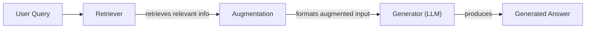
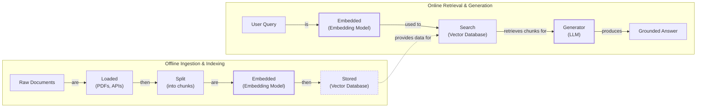
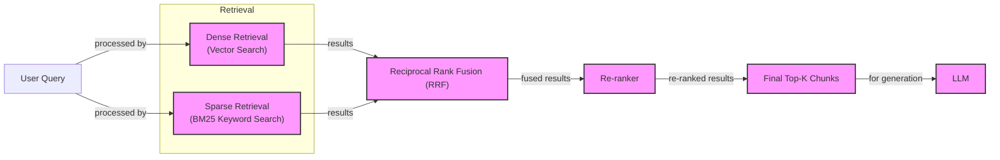

# Retrieval-Augmented Generation (RAG): Giving LLMs an Open-Book Exam

In our previous lessons, we built a solid foundation in AI Engineering. We explored the agent landscape, learned to distinguish between rigid LLM workflows and autonomous agents, and dove into context engineering—the art of managing the information we feed to LLMs. We have seen how to build agents that can reason and use tools to interact with their environment.

However, a core problem remains: LLMs are trained on a fixed dataset. Their knowledge is static, a snapshot of the world at a specific point in time. This makes them prone to hallucination and unable to access private or real-time information. When we ask an LLM a question, it is essentially taking a "closed-book exam" on its training data. We do not yet have techniques that allow models to continuously learn from experience after deployment. While we can fine-tune them, this process is often inefficient. Fine-tuning is resource-heavy, slow, and can suffer from catastrophic forgetting, where the model loses previously learned information [[1]](https://neo4j.com/blog/developer/fine-tuning-vs-rag/). Preparing the training dataset is complex, and the training jobs themselves can take days.

Simply expanding the context window is not a silver bullet either. Although modern models can handle millions of tokens, this approach has its own drawbacks. Large context windows are expensive and introduce significant latency. More importantly, they suffer from the "lost-in-the-middle" problem, where the model struggles to recall information buried deep within a long prompt [[16]](https://47billion.com/blog/rag-system-in-production-why-it-fails-and-how-to-fix-it/).

This is where Retrieval-Augmented Generation (RAG) comes in. RAG gives the LLM an "open-book exam" [[22]](https://blogs.nvidia.com/blog/what-is-retrieval-augmented-generation/). Instead of forcing the model to memorize everything, we connect it to external, real-time knowledge sources. This approach is more like how humans work; we do not rely on memorization alone but use manuals, notes, and search engines to find the information we need.

RAG is a key method AI engineers use in the context engineering process, which we introduced in Lesson 3. It allows us to curate the context we provide to LLMs, ensuring their responses are grounded in factual, up-to-date information. In this lesson, we will explore the "what" and "how" of RAG, from its basic components to the advanced and agentic patterns that power modern AI systems. We will also see how RAG complements an agent's memory, a topic we will cover in detail in Lesson 10.

With the problem and motivation clear, we’ll first decompose RAG into its core components so you can see where each responsibility lives.

## The RAG System: Core Components

Understanding the components of a RAG system is the first step in the context engineering process of designing effective AI applications. At its core, RAG can be broken down into three conceptual pillars that work together to ground an LLM's response in external data.


Image 1: A flowchart illustrating the core components and data flow of a RAG system.

**Retrieval** is the engine for finding relevant information. When a user submits a query, the retriever’s job is to search an external knowledge base and pull the most relevant documents. The most common approach is semantic search, which finds text that is contextually similar in meaning, even if the wording is different [[51]](https://apxml.com/courses/prompt-engineering-llm-application-development/chapter-6-integrating-llms-external-data-rag/implementing-semantic-search-retrieval). This is made possible by vector embeddings—numerical representations of text that capture its semantic meaning. During ingestion, documents are split into chunks, and each chunk is converted into an embedding by a model. These embeddings are then stored in a specialized vector database, which is optimized for fast similarity searches [[6]](https://pub.towardsai.net/vector-databases-in-practice-building-a-realistic-hybrid-search-rag-system-with-qdrant-7b8f4a6e41e0). At query time, the user's query is also converted into an embedding, and the database finds the chunks whose embeddings are closest to the query's embedding in the high-dimensional vector space [[51]](https://apxml.com/courses/prompt-engineering-llm-application-development/chapter-6-integrating-llms-external-data-rag/implementing-semantic-search-retrieval).

**Augmentation** is the process of taking the retrieved information and preparing it for the LLM. Once the retriever has identified the most relevant document chunks, this information is combined with the original user query to form an enriched input, often called an augmented prompt [[27]](https://www.aimon.ai/posts/rag_and_its_different_components/). This step is a form of prompt engineering, where the retrieved context is structured in a way that guides the LLM to generate a coherent and contextually informed response [[29]](https://www.ibm.com/think/topics/retrieval-augmented-generation). A well-constructed prompt will clearly separate the user's question from the provided context and instruct the model to base its answer solely on the retrieved information.

**Generation** is the final step where the LLM produces an answer. The model receives the augmented prompt, which contains both the user’s original question and the relevant context retrieved from the external knowledge base. Using this information, the LLM synthesizes a response that is grounded in the provided data, rather than relying only on its pre-trained knowledge [[28]](https://toloka.ai/blog/grounding-llms-driving-ai-to-deliver-contextually-relevant-data/). This process significantly reduces the risk of hallucinations and ensures that the answer is accurate, up-to-date, and verifiable, often including citations that trace back to the source documents [[22]](https://www.mindstudio.ai/blog/what-is-rag/).

Now that you can name each moving part, let’s see how they line up across the two phases of a real system.

## The RAG Pipeline: Ingestion and Retrieval

A complete RAG pipeline is split into two distinct phases: an offline phase for preparing the data and an online phase for answering user queries in real-time. Understanding both is essential for building a production-ready system.


Image 2: A detailed Mermaid diagram showing the two distinct phases of a RAG pipeline: Offline Ingestion & Indexing and Online Retrieval & Generation.

### Phase 1: Offline Ingestion & Indexing

This phase happens in the background, before any user interacts with the system. Its goal is to process your knowledge base and make it searchable [[32]](https://newsletter.systemdesign.one/p/how-rag-works). This is a critical step, as the quality of your indexed data directly impacts the performance of the entire RAG system.

1.  **Load:** The first step is to load raw documents from their sources. These can be PDFs, web pages, database records, or documents from APIs [[31]](https://medium.com/@derrickryangiggs/rag-pipeline-deep-dive-ingestion-chunking-embedding-and-vector-search-abd3c8bfc177). Tools like LangChain's document loaders or LlamaIndex's readers provide a unified interface for handling these diverse formats. The challenge here is to extract clean text while preserving the document's structure and metadata.

2.  **Split:** Once loaded, large documents are broken down into smaller, more manageable pieces called chunks. This is arguably the most important decision in the ingestion pipeline [[17]](https://sarthakai.substack.com/p/improve-your-rag-accuracy-with-a). If chunks are too large, they can contain multiple topics, leading to noisy and irrelevant retrieval. If they are too small, they may lack the necessary context to be useful. Strategies range from simple fixed-size splitting to more advanced methods like the `RecursiveCharacterTextSplitter` in LangChain, which tries to split along natural boundaries like paragraphs and sentences.

3.  **Embed:** Each chunk is then converted into a vector embedding using an embedding model. This numerical representation captures the semantic meaning of the text. Popular models include OpenAI’s `text-embedding-3-large/small`, Google's `text-embedding-004`, and various open-source models from Hugging Face like the BGE series [[16]](https://47billion.com/blog/rag-system-in-production-why-it-fails-and-how-to-fix-it/). The choice of model is important, as it determines the quality of the semantic search.

4.  **Store:** Finally, the embeddings and their corresponding text chunks (along with any metadata) are loaded into a vector database. This database is optimized for efficient similarity search, allowing the system to quickly find the most relevant chunks for a given query. Options range from local libraries like FAISS to scalable, production-grade databases like Milvus, Qdrant, Pinecone, or vector search capabilities in traditional databases like Elasticsearch [[52]](https://medium.com/@robi.tomar72/how-rag-actually-works-embeddings-vector-databases-indexing-retrieval-explained-simply-3d1ca45fe1bf).

### Phase 2: Online Retrieval & Generation

This phase is triggered in real-time when a user asks a question. It is responsible for finding the right context and generating a grounded answer.

1.  **Query:** The process starts with the user's query. This input may first go through a preprocessing step to normalize it or expand it with synonyms to improve retrieval accuracy.

2.  **Embed:** The user's query is converted into a vector embedding using the *same* embedding model that was used during the ingestion phase [[31]](https://medium.com/@derrickryangiggs/rag-pipeline-deep-dive-ingestion-chunking-embedding-and-vector-search-abd3c8bfc177). This ensures that the query and the document chunks exist in the same vector space, making them comparable.

3.  **Search:** The query vector is then used to search the vector database. The database performs a similarity search (often using cosine similarity) to find the top-k document chunks that are most similar to the query [[54]](https://towardsdatascience.com/rag-explained-understanding-embeddings-similarity-and-retrieval/). These chunks represent the most relevant information available in the knowledge base to answer the user's question.

4.  **Generate:** The retrieved chunks are combined with the original user query and a set of instructions into a single prompt. This augmented prompt is then passed to an LLM. The LLM synthesizes the information to produce a final answer that is grounded in the retrieved context. As we discussed in Lesson 4, using structured outputs can help ensure the answer is formatted correctly and includes citations, linking claims back to their source documents.

With the end-to-end path in place, the next question is quality: what are the advanced techniques to make the retrieval more accurate and useful across messy, real-world data?

## Advanced RAG Techniques

While a basic RAG pipeline is a good start, production systems require more sophisticated techniques to handle the complexities of real-world data and user queries. These advanced methods are designed to improve retrieval accuracy, manage context effectively, and ultimately produce more reliable answers.


Image 3: A flowchart illustrating the hybrid retrieval process from user query to LLM generation.

### Hybrid Search

Vector search is great at understanding semantic meaning, but it can sometimes miss exact keywords, product codes, or specific identifiers. Hybrid search solves this by combining dense retrieval (vector search) with sparse retrieval methods like BM25, which excel at keyword matching [[38]](https://mlpills.substack.com/p/issue-76-optimize-rag-with-hybrid). For example, if a customer support user searches for "my bill keeps rolling over," a keyword search will find articles containing the exact term "rollover." A semantic search might also surface guides that use related phrases like "carryover balance." By running both searches in parallel and fusing the results—often using a technique called Reciprocal Rank Fusion (RRF)—the system can capture both precise and conceptually related documents, providing more comprehensive coverage [[36]](https://pr-peri.github.io/blogpost/2026/03/05/blogpost-hybrid-search.html).

### Re-ranking

The initial retrieval step is optimized for speed and recall, meaning it casts a wide net to find potentially relevant documents. However, not all retrieved documents are equally useful. A re-ranker is a second, more precise model that re-orders this initial set of documents to improve relevance. Typically, a cross-encoder model is used, which processes the query and each candidate document together to produce a highly accurate relevance score [[43]](https://apxml.com/courses/optimizing-rag-for-production/chapter-2-advanced-retrieval-optimization/reranking-architectures-rag). For instance, when a user asks, "how to connect my account," a re-ranker can push the official step-by-step setup guide to the top of the list, above a less relevant press release or a tangentially related community forum thread that also happened to match the initial query [[42]](https://redis.io/blog/10-techniques-to-improve-rag-accuracy/).

### Query Transformations

Sometimes, the user's query is not in the optimal format for retrieval. Query transformation techniques rewrite the query to improve its chances of matching the right documents.
-   **Decomposition** breaks down complex, multi-faceted questions into smaller, more focused sub-queries. For a question like, “What’s our travel policy for conferences in Europe this year?” the system might generate sub-questions such as “Where is the travel policy located?”, “What are the rules for Europe?”, and “What has changed in the policy this year?” It then retrieves documents for each sub-question and merges the results to provide a complete answer [[19]](https://docs.nvidia.com/rag/latest/query_decomposition.html).
-   **Hypothetical Document Embeddings (HyDE)** addresses the "phrasing gap" between questions and answers. Instead of embedding the user's query directly, the system first uses an LLM to generate a short, hypothetical answer. It then embeds this ideal answer and uses that embedding for the vector search [[16]](https://47billion.com/blog/rag-system-in-production-why-it-fails-and-how-to-fix-it/). For a travel policy query, the system might generate a draft like, "Employees attending approved conferences in Europe can book economy flights..." and then search for documents that match this statement, leading it directly to the relevant policy pages.

### Advanced Chunking Strategies

As we discussed, how you chunk your documents is critical. Moving beyond simple fixed-size splitting can dramatically improve retrieval quality.
-   **Semantic chunking** splits text based on topic shifts rather than arbitrary token counts. It uses embeddings to measure the semantic distance between consecutive sentences and creates a new chunk when the topic changes significantly. This ensures that each chunk contains a single, coherent idea, which is ideal for precise retrieval [[17]](https://sarthakai.substack.com/p/improve-your-rag-accuracy-with-a). For example, splitting a 20-page employee handbook by topic would keep the entire "Reimbursements" section intact, ensuring that rules and spending caps are not separated.
-   **Layout-aware chunking** is designed for documents with complex structures like PDFs, tables, and forms. It parses the document's visual layout to identify headers, tables, and lists, and chunks the content accordingly [[17]](https://sarthakai.substack.com/p/improve-your-rag-accuracy-with-a). For a pricing table, this strategy would keep each row (e.g., product, price, discount) together, preventing the system from retrieving a price without its corresponding product label.
-   **Context-enriched chunking** prepends a summary of the document's context to each chunk before embedding. This technique, also known as contextual retrieval, helps the embedding capture the chunk's place within the larger document, improving retrieval accuracy [[16]](https://47billion.com/blog/rag-system-in-production-why-it-fails-and-how-to-fix-it/).

### GraphRAG

For questions about complex relationships and interconnected entities, standard document chunks often fall short. **GraphRAG** addresses this by first extracting entities and their relationships from the source documents and constructing a knowledge graph. This structured representation allows the system to answer multi-hop questions that require reasoning across different pieces of information [[46]](https://arxiv.org/html/2601.03014v1). For example, a retail system could answer, “Which shoes get the most size-related returns and were featured in last month’s ads?” by traversing the graph from return records to sizing issues, to specific product SKUs, and finally to marketing campaign data [[50]](https://arxiv.org/html/2501.00309v2).

### Metadata Filtering

One of the most effective ways to improve retrieval in a production environment is to use metadata filters. By tagging each chunk with metadata—such as `source`, `department`, `country`, `policy_version`, or `effective_date`—you can dramatically narrow the search space before performing the vector search. Temporal filters are especially powerful. For a query like, “What changed between March and June 2025?”, the system can restrict its search to chunks with an `effective_date` within that range. You can even implement bitemporal logic, filtering by `effective_date` to find what was true at a certain time, while also tracking `indexed_at` to ensure data freshness [[20]](https://neo4j.com/blog/genai/advanced-rag-techniques/).

These techniques increase retrieval quality. Next, we’ll see how retrieval becomes one tool that an agent can choose to use as it reasons.

## Agentic RAG

In Lessons 7 and 8, we explored how ReAct agents use a "Thought, Action, Observation" loop to reason and interact with their environment. **Agentic RAG** is the application of this principle, where retrieval is not a fixed step in a pipeline but a tool that an agent can choose to use. The agent reasons about its task, decides when it needs information, formulates a query, and observes the results, iterating until it has enough context to answer the user's question.

It is important to clarify that agents often have access to many tools, such as web search, code interpreters, and database query engines. Labeling an entire system as "agentic RAG" can be misleading; more accurately, the RAG system functions as one of the primary tools in the agent's toolkit [[13]](https://medium.com/@gaddam.rahul.kumar/agentic-rag-vs-traditional-rag-b1a156f72167).

The core distinction between standard and agentic RAG lies in their control flow. Standard RAG is a linear, predetermined workflow: Retrieve → Augment → Generate. It is powerful but rigid [[12]](https://www.pingcap.com/article/agentic-rag-vs-traditional-rag-key-differences-benefits/). In contrast, agentic RAG is adaptive and iterative. The agent is in control, deciding *when* to retrieve, *how* to reformulate a query, *which* knowledge source to search, and whether to chain multiple retrieval and reasoning steps together [[11]](https://towardsdatascience.com/agentic-rag-vs-classic-rag-from-a-pipeline-to-a-control-loop/).

This agentic approach unlocks several advanced capabilities:
-   The agent can **iteratively** use the RAG tool. If an initial retrieval yields a vague policy document, the agent can reason about the missing information and refine its query—for example, by adding "for EU customers, 2024 updates"—and retrieve again to find more specific details.
-   It can **choose** which part of its knowledge base to search. For an inquiry about a system outage, an agent might intelligently select its `search_incident_runbooks` tool over `search_marketing_pages`.
-   It can **fuse** information from its internal RAG tool with data from other tools, like a web search. For instance, an agent could retrieve an internal company policy on data retention, then call its `web_search` tool to check for recent changes in regulatory requirements, and finally synthesize both pieces of information into a comprehensive answer.
-   It can even decide to **update** the knowledge base with new information it learns. As we will explore in Lesson 10 on agent memory, an agent might propose writing new facts to a long-term memory store, thereby improving the knowledge base for future queries.

Let's consider a conceptual "thought process" for an agent tackling a complex query:
*   **Thought:** "The user is asking about '2024 EU data retention rules.' Our internal policy documents cite a 2023 version. This information is likely outdated."
*   **Action:** `retrieve(internal_policy, query="EU data retention 2024")`
*   **Observation:** "The retrieved document mentions recent amendments but is missing specific citations for the new directive."
*   **Thought:** "I need external verification to provide a complete and accurate answer."
*   **Action:** `web_search(query="EU data retention directive 2024 official text")`
*   **Observation:** "The web search found the official directive update from the European Commission's website."
*   **Thought:** "Now I can synthesize the information from both the internal policy and the official directive, highlight the changes from the 2023 version, and cite both sources."

This shift transforms RAG from a simple database lookup into a dynamic conversation with a knowledgeable research assistant.

```mermaid
flowchart LR
  %% Main Agent Loop
  Agent["Agent"] --> Thought["Thought"]
  Thought --> Action["Action"]

  %% Tools Subgraph
  subgraph Tools["Tools"]
    WebSearch["web_search"]
    CodeInterpreter["code_interpreter"]
    InternalKB["internal_knowledge_base<br/>(RAG tool)"]
  end

  Action -- "uses" --> WebSearch
  Action -- "uses" --> CodeInterpreter
  Action -- "uses" --> InternalKB

  WebSearch --> Observation["Observation"]
  CodeInterpreter --> Observation
  InternalKB --> Observation

  Observation --> Thought: "informs new"

  %% Visual grouping
  classDef main_step stroke-width:2px
  classDef tool_node stroke-dasharray:3,3
  class Agent,Thought,Action,Observation main_step
  class WebSearch,CodeInterpreter,InternalKB tool_node
```
Image 4: A conceptual Mermaid diagram showing an agent's main loop, including thought, action, tool usage (web_search, code_interpreter, internal_knowledge_base), and observation, leading to iterative refinement.

You now understand both a linear RAG pipeline and how an agent can control retrieval when needed. Let’s wrap up by situating RAG in the wider AI Engineering toolkit and previewing what comes next.

## Conclusion

In this lesson, we have seen that RAG is the most widely used solution to the fundamental knowledge limitations of LLMs. It provides a practical way to ground models in external, verifiable data, moving them from "closed-book" to "open-book" reasoners. We have also learned that while basic RAG is a good starting point, production-grade applications require advanced techniques like hybrid search, re-ranking, and intelligent chunking to achieve high quality. The future of knowledge retrieval is agentic, where RAG becomes a dynamic tool in an intelligent agent's toolkit.

The core benefits of RAG are clear: it reduces hallucinations, enables customization with proprietary and real-time data, and builds user trust by providing source-backed, verifiable answers. For these reasons, mastering RAG is not just an optional skill for an AI Engineer; it is a foundational competency and a crucial part of the broader discipline of context engineering.

In our next lesson, we will explore memory for agents. We will see how short-term and long-term memory systems work alongside RAG's on-demand retrieval to create agents that can learn from past interactions and build a persistent understanding of their environment. We will also touch upon other critical topics, such as retrieval quality evaluation and production monitoring, in future parts of the course to give you a complete picture of building and maintaining high-performing RAG systems.

## References

- [1] [Knowledge Graphs and LLMs: Fine-Tuning vs. Retrieval-Augmented Generation](https://neo4j.com/blog/developer/fine-tuning-vs-rag/)
- [2] [RAG System in Production: Architecture, Chunking & Evaluation Guide|47Billlion](https://47billion.com/blog/rag-system-in-production-why-it-fails-and-how-to-fix-it/)
- [3] [Retrieval-Augmented Generation (RAG) is an advanced NLP architecture that enhances the capabilities of language models by combining them with retrieval-based information.](https://wandb.ai/mostafaibrahim17/ml-articles/reports/Vector-Embeddings-in-RAG-Applications--Vmlldzo3OTk1NDA5)
- [4] [RAG (Lewis et al., 2020) expands LLM capabilities in knowledge-intensive tasks using external knowledge sources: retrieves documents resembling the query from a knowledge base and adds them to the input for context, achievable without additional training using pre-trained embeddings (Neelakantan et al., 2022).](https://aclanthology.org/2024.emnlp-main.15.pdf)
- [5] [RAG expands LLMs’ capabilities in knowledge-intensive tasks by retrieving similar documents from an external knowledge base and adding them to the query input for context, without additional training using pre-trained embeddings.](https://arxiv.org/html/2312.05934v3)
- [6] [Vector Databases in Practice: Building a Realistic Hybrid-Search RAG System with Qdrant](https://pub.towardsai.net/vector-databases-in-practice-building-a-realistic-hybrid-search-rag-system-with-qdrant-7b8f4a6e41e0)
- [7] [A Complete Guide to RAG](https://towardsai.net/p/l/a-complete-guide-to-rag)
- [8] [Vector databases store information as vector embeddings.](https://qdrant.tech/articles/what-is-rag-in-ai/)
- [9] [Your RAG Is Wrong, Here's How To Fix It](https://decodingml.substack.com/p/your-rag-is-wrong-heres-how-to-fix?utm_source=publication-search)
- [10] [Retrieval-Augmented Generation (RAG) Fundamentals First](https://decodingml.substack.com/p/rag-fundamentals-first?utm_source=publication-search)
- [11] [Agentic RAG vs Classic RAG: From a Pipeline to a Control Loop](https://towardsdatascience.com/agentic-rag-vs-classic-rag-from-a-pipeline-to-a-control-loop/)
- [12] [Agentic RAG vs Traditional RAG: Key Differences & Benefits](https://www.pingcap.com/article/agentic-rag-vs-traditional-rag-key-differences-benefits/)
- [13] [Agentic RAG vs Traditional RAG](https://medium.com/@gaddam.rahul.kumar/agentic-rag-vs-traditional-rag-b1a156f72167)
- [14] [AI Agent vs RAG: What’s the Difference?](https://airbyte.com/agentic-data/ai-agent-vs-rag)
- [15] [What is Agentic RAG](https://weaviate.io/blog/what-is-agentic-rag)
- [16] [RAG System in Production: Why It Fails and How to Fix It](https://47billion.com/blog/rag-system-in-production-why-it-fails-and-how-to-fix-it/)
- [17] [Improve Your RAG Accuracy With A Smarter Chunking Strategy](https://sarthakai.substack.com/p/improve-your-rag-accuracy-with-a)
- [18] [Semantic Chunking is a technique used to optimize text segmentation for technical documentation, research papers, and legal contracts that have a complex topic structure.](https://cloudurable.com/blog/advanced-rag-techniques-that-will-transform-your-l/)
- [19] [Query decomposition is a technique that breaks down complex, multi-faceted user queries into simpler, more focused subqueries.](https://docs.nvidia.com/rag/latest/query_decomposition.html)
- [20] [Advanced RAG Techniques for High-Performance LLM Applications](https://neo4j.com/blog/genai/advanced-rag-techniques/)
- [21] [Retrieval-Augmented Generation (RAG) is a technique for building grounded AI for enterprise knowledge by combining a retriever, a ranker, and a generator.](https://medium.com/@fahey_james/retrieval-augmented-generation-building-grounded-ai-for-enterprise-knowledge-6bc46277fee5)
- [22] [What Is Retrieval-Augmented Generation, aka RAG?](https://blogs.nvidia.com/blog/what-is-retrieval-augmented-generation/)
- [23] [RAG is dead, long live agentic retrieval](https://www.llamaindex.ai/blog/rag-is-dead-long-live-agentic-retrieval)
- [24] [What is agentic RAG?](https://www.ibm.com/think/topics/agentic-rag)
- [25] [RAG Inventor Talks Agents, Grounded AI, and Enterprise Impact](https://www.madrona.com/rag-inventor-talks-agents-grounded-ai-and-enterprise-impact/)
- [26] [Retrieval Augmented Generation (RAG) is a technique in large language models (LLMs) that enhances text generation by incorporating real-time data retrieval.](https://humanloop.com/blog/rag-architectures)
- [27] [RAG and its different components](https://www.aimon.ai/posts/rag_and_its_different_components/)
- [28] [Grounding LLMs: Driving AI to Deliver Contextually Relevant Data](https://toloka.ai/blog/grounding-llms-driving-ai-to-deliver-contextually-relevant-data/)
- [29] [What is retrieval-augmented generation (RAG)?](https://www.ibm.com/think/topics/retrieval-augmented-generation)
- [30] [What is RAG (Retrieval Augmented Generation)?](https://galileo.ai/blog/rag-architecture)
- [31] [RAG Pipeline Deep Dive: Ingestion, Chunking, Embedding, and Vector Search](https://medium.com/@derrickryangiggs/rag-pipeline-deep-dive-ingestion-chunking-embedding-and-vector-search-abd3c8bfc177)
- [32] [How RAG works](https://newsletter.systemdesign.one/p/how-rag-works)
- [33] [RAGOps Guide: Building and Scaling Retrieval-Augmented Generation Systems](https://towardsdatascience.com/ragops-guide-building-and-scaling-retrieval-augmented-generation-systems-3d26b3ebd627/)
- [34] [RAG Offline & Online Evaluation](https://apxml.com/courses/optimizing-rag-for-production/chapter-6-advanced-rag-evaluation-monitoring/rag-offline-online-evaluation)
- [35] [What is Retrieval-Augmented Generation (RAG)?](https://aws.amazon.com/what-is/retrieval-augmented-generation/)
- [36] [Hybrid Search Is a Must for Production RAG](https://pr-peri.github.io/blogpost/2026/03/05/blogpost-hybrid-search.html)
- [37] [Hybrid Retrieval for RAG](https://www.chitika.com/hybrid-retrieval-rag/)
- [38] [Optimize RAG with Hybrid Search](https://mlpills.substack.com/p/issue-76-optimize-rag-with-hybrid)
- [39] [Hybrid Search Optimization: How BM25 and Dense Vector Retrieval Work Together for Superior AI Search](https://cubitrek.com/blog/hybrid-search-optimization-how-bm25-and-dense-vector-retrieval-work-together-for-superior-ai-search/)
- [40] [Hybrid RAG in the Real World: Graphs, BM25, and the End of Black Box Retrieval](https://community.netapp.com/t5/Tech-ONTAP-Blogs/Hybrid-RAG-in-the-Real-World-Graphs-BM25-and-the-End-of-Black-Box-Retrieval/ba-p/464834)
- [41] [RAG systems have evolved through several stages.](https://arxiv.org/html/2407.00072v5)
- [42] [10 Techniques to Improve RAG Accuracy](https://redis.io/blog/10-techniques-to-improve-rag-accuracy/)
- [43] [Reranking Architectures for RAG](https://apxml.com/courses/optimizing-rag-for-production/chapter-2-advanced-retrieval-optimization/reranking-architectures-rag)
- [44] [After first-pass retrieval, rerank with cross-encoder or rerank service so top-k to LLM is optimal.](https://neo4j.com/blog/genai/advanced-rag-techniques/)
- [45] [Advanced RAG Retrieval: Cross-Encoders & ReRanking](https://towardsdatascience.com/advanced-rag-retrieval-cross-encoders-reranking/)
- [46] [From Local to Global: A GraphRAG Approach to Query-Focused Summarization](https://arxiv.org/html/2601.03014v1)
- [47] [Graph-Based Retrieval for RAG](https://www.chitika.com/graph-based-retrieval-rag/)
- [48] [GraphRAG extracts entity-relation triples with an LLM, constructs a knowledge graph, applies community detection, and retrieves both local neighbors and community summaries at inference time.](https://webhome.cs.uvic.ca/~thomo/papers/asonam2025-graphrag.pdf)
- [49] [What Is GraphRAG? How It Works, Benefits, and More](https://atlan.com/know/what-is-graphrag/)
- [50] [In conventional RAG, information is stored independently as chunks, preventing capture of chunk relations and hindering multi-hop reasoning.](https://arxiv.org/html/2501.00309v2)
- [51] [Implementing Semantic Search for Retrieval](https://apxml.com/courses/prompt-engineering-llm-application-development/chapter-6-integrating-llms-external-data-rag/implementing-semantic-search-retrieval)
- [52] [How RAG Actually Works: Embeddings, Vector Databases, Indexing & Retrieval Explained Simply](https://medium.com/@robi.tomar72/how-rag-actually-works-embeddings-vector-databases-indexing-retrieval-explained-simply-3d1ca45fe1bf)
- [53] [Vector DB and RAG Pipeline for Document RAG](https://learnopencv.com/vector-db-and-rag-pipeline-for-document-rag/)
- [54] [RAG Explained: Understanding Embeddings, Similarity, and Retrieval](https://towardsdatascience.com/rag-explained-understanding-embeddings-similarity-and-retrieval/)
- [55] [AWS Vector Databases Explained: Semantic Search and RAG Systems](https://tutorialsdojo.com/aws-vector-databases-explained-semantic-search-and-rag-systems/)
- [56] [Retrieval-Augmented Generation, Explained](https://www.topquadrant.com/resources/blog-retrieval-augmented-generation-explained/)
- [57] [Building Trustworthy RAG Systems with In-Context Learning and Grounded Generation](https://www.linkedin.com/posts/haruiz_building-trustworthy-rag-systems-with-in-activity-7310729777227669505-nd6u)
- [58] [Introduction to Augmenting LLMs Using Retrieval-Augmented Generation (RAG)](https://medium.com/@rahulraut.techuse/introduction-to-augmenting-llms-using-retrieval-augmented-generation-rag-6530123dbb91)
- [59] [Retrieval-Augmented Generation (RAG)](https://www.promptingguide.ai/research/rag)
- [60] [Retrieval Augmented Generation (RAG): From Basics to Advanced](https://medium.com/@tejpal.abhyuday/retrieval-augmented-generation-rag-from-basics-to-advanced-a2b068fd576c)