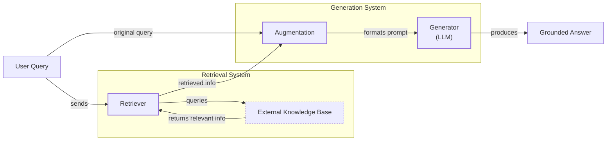
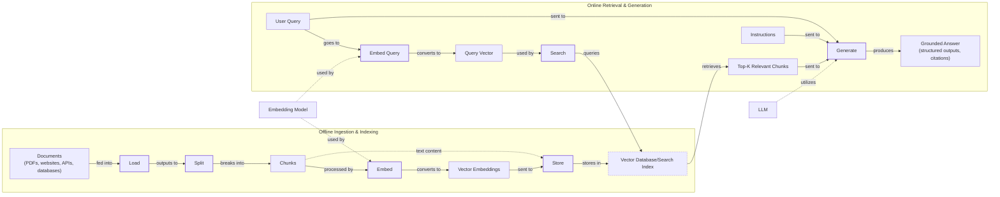
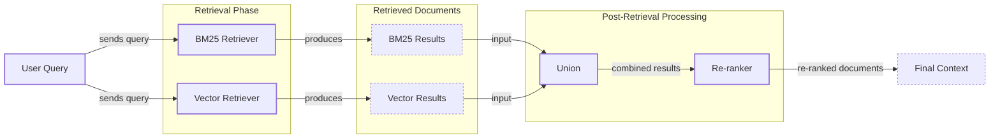
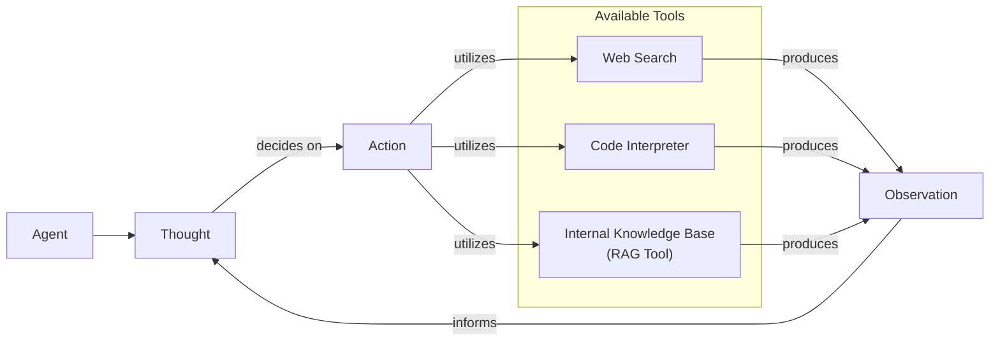

# Retrieval-Augmented Generation (RAG): The AI Engineer's Guide

In the previous lessons, we built a foundation in AI Engineering. We explored the agent landscape, distinguished between LLM workflows and autonomous agents, and introduced Context Engineering—the art of managing the information flow to an LLM. We have seen how agents can reason and use tools to act. Now, we will tackle one of the most essential skills for any AI engineer: grounding agents in reality.

LLMs are trained on fixed datasets, which means their knowledge is static. They are essentially taking a "closed-book exam" on the world's information as it existed at a specific point in time. This leads to two major problems: their knowledge becomes outdated, and they are prone to "hallucinate," or invent plausible but incorrect information when they do not know an answer. A now-infamous 2023 case saw a lawyer cite entirely fictitious legal precedents in court, all generated by an LLM, leading to sanctions and highlighting the real-world risks of unverified AI outputs [[5]](https://neo4j.com/blog/developer/fine-tuning-vs-rag/).

You might think fine-tuning is the solution. However, it is often impractical. It is a resource-heavy process that requires massive, carefully curated datasets and multi-day training jobs. It is slow, expensive, and can even cause the model to "forget" its previous knowledge in a phenomenon known as catastrophic forgetting. Furthermore, empirical studies have shown that LLMs struggle to learn new facts via fine-tuning, making it an unreliable method for knowledge injection [[20]](https://aclanthology.org/2024.emnlp-main.15.pdf).

On the other hand, while modern LLMs have vast context windows, simply stuffing them with information is not a silver bullet. This approach is expensive, increases latency, and suffers from the "lost-in-the-middle" problem, where the model struggles to recall information buried in a long prompt.

Retrieval-Augmented Generation (RAG) offers a reliable solution to this problem. RAG gives the LLM an "open-book exam" by connecting it to external, real-time knowledge sources [[1]](https://blogs.nvidia.com/blog/what-is-retrieval-augmented-generation/). Instead of relying on memorized facts, the model can access external, up-to-date knowledge to answer questions. As we covered in Lesson 3 on Context Engineering, RAG is a core technique for curating the information an LLM sees. It allows us to build applications that are accurate, trustworthy, and grounded in verifiable data.

In this lesson, we will explore RAG from the ground up. We will start by breaking down its core components and mapping out the end-to-end pipeline. Then, we will explore the advanced and agentic patterns that power modern, production-grade AI systems. This will set the stage for Lesson 10, where we will explore how agent memory systems complement RAG's on-demand retrieval.

With the problem and motivation clear, we’ll first decompose RAG into its core components so you can see where each responsibility lives.

## The RAG System: Core Components

Understanding the components of a RAG system is the first step in the Context Engineering process of designing effective AI applications. At its heart, a RAG system is built on three conceptual pillars: Retrieval, Augmentation, and Generation.

**Retrieval** is the engine that finds relevant information. When a user asks a question, the retrieval system searches an external knowledge base to find documents or data snippets that are likely to contain the answer. The most common approach is semantic search, which relies on vector embeddings to find information based on conceptual meaning rather than just keywords.

To enable this, documents are first broken down into chunks. An embedding model, often a large language model like BERT, then converts each chunk of text into a numerical representation—a vector—that captures its semantic meaning. These vectors are stored in a specialized vector database.

When a user query comes in, it is converted into a vector using the same model. The database then finds the vectors (and their corresponding text chunks) that are closest in the high-dimensional space, typically using a distance metric like cosine similarity to measure the angle between vectors [[2]](https://decodingml.substack.com/p/rag-fundamentals-first?utm_source=publication-search), [[3]](https://towardsai.net/p/l/a-complete-guide-to-rag), [[21]](https://towardsdatascience.com/rag-explained-understanding-embeddings-similarity-and-retrieval/).

**Augmentation** is the process of preparing the retrieved information for the LLM. Once the top-k relevant chunks are fetched, they are combined with the original user query and a set of instructions into a single, "augmented" prompt. This step is essential for context engineering, as it involves carefully structuring the prompt to guide the LLM effectively. A well-designed prompt template might instruct the model: "Using the context below, answer the question. If the context does not contain the answer, say so." This ensures the model gives weight to the retrieved context and handles potential conflicts or gaps in the information [[4]](https://www.topquadrant.com/resources/blog-retrieval-augmented-generation-explained/).

**Generation** is the final step. The augmented prompt is sent to an LLM, which synthesizes the information to produce a human-readable answer. Instead of relying solely on its internal, pre-trained knowledge, the model's response is now grounded in the external data provided in the prompt. This not only improves accuracy but also allows the system to cite its sources, making the answers verifiable and building user trust [[5]](https://neo4j.com/blog/developer/fine-tuning-vs-rag/). The LLM acts as a reasoning engine over the provided data, transforming raw retrieved information into a coherent and contextually relevant response [[22]](https://toloka.ai/blog/grounding-llms-driving-ai-to-deliver-contextually-relevant-data/).

Image 1: A flowchart illustrating the core components and data flow of a RAG system.

Now that you can name each moving part, let’s see how they line up across the two phases of a real system.

## The RAG Pipeline: Ingestion and Retrieval

A complete RAG workflow operates in two distinct phases: an offline phase for data preparation and an online phase for real-time query processing. Understanding both is key to building and maintaining a robust system.

### Phase 1: Offline Ingestion & Indexing

This phase is all about preparing your knowledge base so it can be searched efficiently. It runs in the background, either as a batch process or a streaming pipeline, to keep your data current [[6]](https://newsletter.systemdesign.one/p/how-rag-works).

1.  **Load:** The first step is to load your documents from various sources. These can be PDFs, web pages, database records, or content from APIs. This stage often involves extensive preprocessing to handle diverse and messy formats, such as extracting text from tables or images and removing irrelevant content. Tools like Unstructured are designed specifically for this purpose, while frameworks like LangChain and LlamaIndex offer a wide array of document loaders.

2.  **Split:** Since LLMs have limited context windows, large documents must be broken down into smaller, meaningful chunks. This is an important step. A naive split might cut a sentence or idea in half, destroying its context. More advanced strategies use rule-based splitters (like LangChain’s `RecursiveCharacterTextSplitter`, which tries to split on paragraphs, then sentences) or semantic chunkers that group related sentences together to preserve conceptual integrity.

3.  **Embed:** Each chunk of text is then passed through an embedding model to convert it into a vector. These high-dimensional vectors capture the semantic essence of the text. The choice of model is important and depends on your specific domain and budget. Popular models include OpenAI’s `text-embedding-3` series, Google's `text-embedding-004`, Cohere's `embed-v3.0`, and various open-source models from Hugging Face like the BGE (BAAI General Embedding) variants.

4.  **Store:** Finally, the vector embeddings and their corresponding text chunks (along with any metadata) are loaded into a vector database or a search index. This specialized storage is optimized for fast nearest-neighbor searches. For local development or smaller projects, an in-memory store like FAISS (Facebook AI Similarity Search) is common. For production systems, scalable solutions like Milvus, Qdrant, or Pinecone are popular, as are extensions for traditional search engines like Elasticsearch and OpenSearch that support k-Nearest Neighbors (k-NN) search [[23]](https://pub.towardsai.net/vector-databases-in-practice-building-a-realistic-hybrid-search-rag-system-with-qdrant-7b8f4a6e41e0).

### Phase 2: Online Retrieval & Generation

This phase happens in real-time, right after a user submits a query.

1.  **Query & Embed:** The user’s question is taken as input. Just like the document chunks, the query is converted into a vector using the exact same embedding model from the ingestion phase. This ensures the query and the documents exist in the same vector space, making them comparable.

2.  **Search:** The system uses the query vector to search the vector database. It calculates the similarity (often using cosine similarity) between the query vector and all the chunk vectors in the index, returning the top-k most similar chunks.

3.  **Generate:** The retrieved chunks are assembled into a prompt along with the original user query and specific instructions. This augmented prompt is then fed to an LLM. The LLM uses the provided context to generate a final, grounded answer. As we discussed in Lesson 4, this is a great place to use structured outputs to ensure the answer includes citations or follows a specific format.

Image 2: A detailed flowchart depicting the two distinct phases of the RAG pipeline: "Offline Ingestion & Indexing" and "Online Retrieval & Generation".

With the end-to-end path in place, the next question is quality. What are the advanced techniques to make retrieval more accurate and useful across messy, real-world data?

## Advanced RAG Techniques

A naive RAG pipeline is a great starting point, but production systems require more sophisticated techniques to handle the complexities of real-world data and user queries. These advanced methods focus on improving the quality and relevance of the retrieved context before it ever reaches the LLM.

### Hybrid Search

Vector search is powerful for understanding semantic meaning, but it can sometimes miss important keywords, acronyms, or specific IDs. Hybrid search solves this by combining traditional keyword-based search with vector search [[7]](https://redis.io/blog/10-techniques-to-improve-rag-accuracy/). The most common keyword-based algorithm is BM25 (Best Matching 25), which excels at finding exact matches. By fusing the results from both, often using a method called Reciprocal Rank Fusion (RRF), the system gets the best of both worlds [[8]](https://neo4j.com/blog/genai/advanced-rag-techniques/). Research has shown that this combination can improve retrieval recall by 3 to 3.5 times over using either method alone [[7]](https://redis.io/blog/10-techniques-to-improve-rag-accuracy/).

### Re-ranking

The initial retrieval step is optimized for speed and recall—casting a wide net to find potentially relevant documents. However, the initial ranking might not be perfect. A re-ranker is a second, more precise model that re-orders this initial set of documents. Cross-encoder models are often used for this. Unlike the bi-encoder models used for initial retrieval (which create separate embeddings for the query and documents), a cross-encoder takes the query and a candidate document together as a pair and outputs a direct relevance score [[9]](https://towardsdatascience.com/advanced-rag-retrieval-cross-encoders-reranking/). This is computationally more expensive but far more accurate, making it perfect for refining a small set of top candidates.

### Query Transformations

Sometimes, the user's query is not the best input for the retrieval system. Query transformation techniques rewrite or expand the query to improve retrieval results.

-   **Decomposition:** A complex, multi-faceted query is broken down into several simpler sub-questions. The system retrieves documents for each sub-question and then merges the results. For a query like, "What’s our travel policy for conferences in Europe this year?" the system might generate sub-questions like "Where is the travel policy?", "What are the rules for Europe?", and "What changed this year?" [[10]](https://docs.nvidia.com/rag/latest/query_decomposition.html).

-   **Hypothetical Document Embeddings (HyDE):** This technique prompts an LLM to generate a short, hypothetical "ideal" answer to the user's query. This hypothetical document, written in the language of the source material, is then embedded and used for the search. This often bridges the vocabulary gap between a user's question and the documents in the knowledge base [[11]](https://decodingml.substack.com/p/your-rag-is-wrong-heres-how-to-fix?utm_source=publication-search).

### Advanced Chunking Strategies

How you split your documents has a huge impact on retrieval quality. Moving beyond simple fixed-size chunks is often necessary.

-   **Semantic Chunking:** This method splits text based on topical coherence, ensuring that complete ideas or arguments are kept together in a single chunk. Instead of splitting a 20-page handbook every 500 words, which might cut a section in half, semantic chunking would keep the entire "Reimbursements" section intact.
-   **Layout-Aware Chunking:** For documents with complex structures like tables or forms, this approach preserves the layout. When processing a pricing table, it ensures that a product name, its price, and its discount stay in the same chunk, rather than being separated by an arbitrary character count.
-   **Context-Enriched Chunking:** This technique, also known as contextual retrieval, adds a summary of the surrounding document context to each chunk before embedding it. This helps the retrieval system understand chunks that are ambiguous on their own, such as a sentence like "The company's revenue grew by 3%," by adding context like "This is from ACME Corp's Q2 2023 SEC filing" [[12]](https://www.anthropic.com/news/contextual-retrieval).

### GraphRAG

For questions about complex relationships and interconnected data, standard document retrieval can fall short. GraphRAG involves building a knowledge graph from your documents, where entities are nodes and relationships are edges. Retrieval can then be performed by traversing this graph, which allows the system to answer multi-hop questions that require connecting information across different documents or data points [[13]](https://arxiv.org/html/2404.16130). For instance, a query like "Which incidents were caused by weekend deploys that also touched the login service?" would require traversing connections between incident tickets, deployment records, and service logs. A 2024 Stanford study found that this graph-augmented approach reduced factual errors by 35-45% on multi-hop question answering benchmarks [[24]](https://atlan.com/know/what-is-graphrag/).

### Metadata Filtering

One of the most effective techniques in production is to filter the search space using metadata. If each document chunk is tagged with fields like `source`, `department`, `effective_date`, or `language`, you can narrow the search before performing the vector similarity comparison.

Temporal filters are especially powerful. For a query like, "What changed between March and June 2025?", you can restrict the search to only documents with an `effective_date` within that range. You can also apply bitemporal logic—filtering by `effective_date` for what was true at a point in time, while separately tracking `indexed_at` to understand data freshness—to avoid surfacing stale guidance [[17]](https://oneuptime.com/blog/post/2026-01-30-metadata-filtering/view).

Image 3: A flowchart illustrating the hybrid retrieval flow in advanced RAG techniques.

These techniques improve the quality of what is retrieved. But what if the system could decide *when* and *how* to retrieve information? That is where agentic patterns come in.

## Agentic RAG

In Lessons 7 and 8, we explored the ReAct framework, where an agent cycles through Thought, Action, and Observation to solve problems. Agentic RAG is the application of this principle to information retrieval. It is essentially a ReAct-style agent that has a retrieval function as one of its available tools [[14]](https://weaviate.io/blog/what-is-agentic-rag). This transforms RAG from a fixed pipeline into a dynamic, intelligent process.

### The Core Distinction

The fundamental difference lies in control and adaptability.

*   **Standard RAG** is a linear, pre-determined workflow. Every query follows the same path: Retrieve → Augment → Generate. It is powerful but rigid. If the initial retrieval fails, the entire system fails [[15]](https://towardsdatascience.com/agentic-rag-vs-classic-rag-from-a-pipeline-to-a-control-loop/).
*   **Agentic RAG** is an adaptive, iterative control loop. The agent decides *when* to retrieve, what to search for, which source to use, and whether one retrieval pass is enough. It can reason about the information it has and the information it needs.

An agent’s toolkit might include web search, a code interpreter, and database query tools. The RAG system simply becomes another tool, often labeled something like `internal_knowledge_base`. The agent, guided by its reasoning process, calls this tool when it identifies a gap in its knowledge that can be filled by internal documentation.

### Capabilities of an Agentic Approach

This agent-driven model unlocks several powerful capabilities:

*   **Iterative Refinement:** The agent can use the RAG tool multiple times in a single turn. If the first retrieval returns a vague policy, the agent can generate a more specific query—for example, "EU customers, 2024 updates"—and retrieve again to find the precise details.
*   **Source Selection:** If the knowledge is spread across different sources, the agent can choose the most appropriate one. For an IT outage inquiry, it might decide to call `search_incident_runbooks` instead of `search_marketing_pages`.
*   **Information Fusion:** The agent can combine information from the RAG tool with outputs from other tools. For instance, it might retrieve an internal company policy and then use a web search tool to check if that policy aligns with current government regulations before synthesizing a final answer.
*   **Knowledge Base Updates:** An agent can even identify when the knowledge base is outdated or incomplete. It might use its other tools to find new information and then propose an update to the RAG system's knowledge store. We will explore this concept of memory more deeply in the next lesson.

However, these advanced capabilities introduce new engineering challenges. As agentic systems scale, teams often face increased latency from multi-step reasoning, higher costs due to multiple LLM calls, and lower reliability if any one tool or agent in the chain fails or enters a loop. Moving from a simple RAG pipeline to a multi-tool agent requires sophisticated orchestration to manage these trade-offs effectively [[19]](https://redis.io/blog/agentic-rag-how-enterprises-are-surmounting-the-limits-of-traditional-rag/).

### Agentic RAG in Action

Consider a simple thought process for an agent tasked with answering a complex query:

**Query:** "What are the latest EU data retention rules for 2024, and how do they differ from our internal policy?"

**Thought 1:** The user is asking about both external regulations and our internal policy. I need to check both. I'll start with the internal policy.

**Action 1:** `retrieve(internal_knowledge_base, query="EU data retention policy")`

**Observation 1:** The retrieved policy is dated 2023 and mentions upcoming amendments but lacks specific details for 2024.

**Thought 2:** The internal policy is likely outdated. I need to find the official 2024 EU regulations.

**Action 2:** `web_search(query="Official EU data retention directive 2024")`

**Observation 2:** Found the official directive text, which specifies new data minimization requirements.

**Thought 3:** I now have both the old internal policy and the new external regulation. I can compare them and synthesize an answer that highlights the changes.

This approach transforms retrieval from a simple database lookup into a conversation with a knowledgeable research assistant. The agent actively gathers, evaluates, and synthesizes information until it can provide a comprehensive and trustworthy answer.

Image 4: Conceptual flowchart of an agent's main loop in Agentic RAG.

You now understand both a linear RAG pipeline and how an agent can control retrieval when needed. Let’s wrap up by situating RAG in the wider AI Engineering toolkit and previewing what comes next.

## Conclusion

We have journeyed from the fundamental limitations of LLMs to the sophisticated, agent-driven systems that represent the future of information retrieval. RAG stands out as the most practical and widely adopted solution to the LLM knowledge problem. While a basic RAG pipeline is a good start, we have seen that advanced techniques like hybrid search, re-ranking, and GraphRAG are essential for achieving production-grade quality. Ultimately, the future of knowledge retrieval is agentic, where RAG becomes a dynamic tool in an intelligent agent's arsenal.

The core benefits of this approach are clear: it reduces hallucinations, enables deep customization with proprietary data, and builds user trust by providing verifiable, source-backed answers. These are not just technical advantages; they are the foundation for building reliable and responsible AI applications. For example, a mid-sized North American bank implemented a RAG-based compliance assistant and saw manual review times fall by 68%, with every AI-generated summary including a direct link to its source document for auditability [[25]](https://saison-technology-intl.com/resource/compliance-intelligence-rag-financial-services/).

For the modern AI Engineer, RAG is not a niche skill but a foundational competency, a crucial part of the broader discipline of Context Engineering. It is the mechanism by which we ground our agents in the real world.

This lesson sets the stage for our next topic, Lesson 10: Memory for Agents. While RAG provides on-demand access to vast external knowledge, memory gives an agent persistence and the ability to learn from past interactions. We will explore how short-term and long-term memory systems complement RAG, enabling agents to build context over time and deliver truly personalized experiences. We will also touch upon retrieval quality evaluations and production monitoring in later lessons, which are critical for maintaining high-performing RAG systems.

## References

- [1] [What Is Retrieval-Augmented Generation, aka RAG?](https://blogs.nvidia.com/blog/what-is-retrieval-augmented-generation/)
- [2] [Retrieval-Augmented Generation (RAG) Fundamentals First](https://decodingml.substack.com/p/rag-fundamentals-first?utm_source=publication-search)
- [3] [A Complete Guide to RAG](https://towardsai.net/p/l/a-complete-guide-to-rag)
- [4] [Retrieval-Augmented Generation Explained](https://www.topquadrant.com/resources/blog-retrieval-augmented-generation-explained/)
- [5] [Fine-Tuning vs. Retrieval Augmented Generation for LLMs](https://neo4j.com/blog/developer/fine-tuning-vs-rag/)
- [6] [How RAG Works](https://newsletter.systemdesign.one/p/how-rag-works)
- [7] [Improving RAG accuracy: 10 techniques that actually work](https://redis.io/blog/10-techniques-to-improve-rag-accuracy/)
- [8] [Advanced RAG Techniques for High-Performance LLM Applications](https://neo4j.com/blog/genai/advanced-rag-techniques/)
- [9] [Advanced RAG: Retrieval with Cross-Encoders and Reranking](https://towardsdatascience.com/advanced-rag-retrieval-cross-encoders-reranking/)
- [10] [Query Decomposition](https://docs.nvidia.com/rag/latest/query_decomposition.html)
- [11] [Your RAG Is Wrong, Here's How To Fix It](https://decodingml.substack.com/p/your-rag-is-wrong-heres-how-to-fix?utm_source=publication-search)
- [12] [Introducing Contextual Retrieval](https://www.anthropic.com/news/contextual-retrieval)
- [13] [From Local to Global: A GraphRAG Approach to Query-Focused Summarization](https://arxiv.org/html/2404.16130)
- [14] [What is Agentic RAG](https://weaviate.io/blog/what-is-agentic-rag)
- [15] [Agentic RAG vs Classic RAG: From a Pipeline to a Control Loop](https://towardsdatascience.com/agentic-rag-vs-classic-rag-from-a-pipeline-to-a-control-loop/)
- [16] [Unveiling the Journey: The Evolution of RAG Systems](https://www.cloudthat.com/resources/blog/unveiling-the-journey-the-evolution-of-rag-systems)
- [17] [How to Implement Metadata Filtering](https://oneuptime.com/blog/post/2026-01-30-metadata-filtering/view)
- [18] [Top 10 LLM RAG Architectures for FinTech Operations](https://www.tericsoft.com/blogs/top-10-llm-rag-architectures-for-fintech-operations)
- [19] [Agentic RAG: How enterprises are surmounting the limits of traditional RAG](https://redis.io/blog/agentic-rag-how-enterprises-are-surmounting-the-limits-of-traditional-rag/)
- [20] [Retrieval-Augmented Generation for Large Language Models: A Survey](https://aclanthology.org/2024.emnlp-main.15.pdf)
- [21] [RAG Explained: Understanding Embeddings, Similarity, and Retrieval](https://towardsdatascience.com/rag-explained-understanding-embeddings-similarity-and-retrieval/)
- [22] [Grounding LLMs: Driving AI to Deliver Contextually Relevant Data](https://toloka.ai/blog/grounding-llms-driving-ai-to-deliver-contextually-relevant-data/)
- [23] [Vector Databases in Practice: Building a Realistic Hybrid-Search RAG System with Qdrant](https://pub.towardsai.net/vector-databases-in-practice-building-a-realistic-hybrid-search-rag-system-with-qdrant-7b8f4a6e41e0)
- [24] [What is GraphRAG?](https://atlan.com/know/what-is-graphrag/)
- [25] [Compliance Intelligence: How Financial Institutions Use RAG to Reinforce Trust and Transparency](https://saison-technology-intl.com/resource/compliance-intelligence-rag-financial-services/)