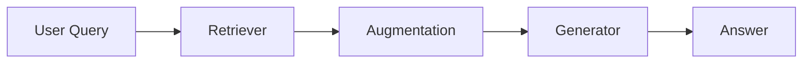
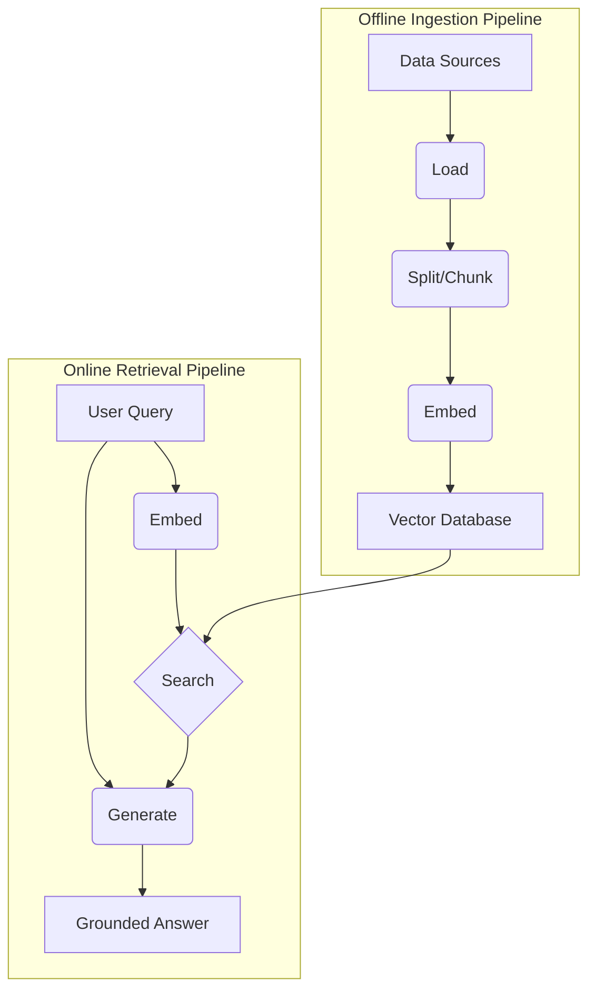

# Lesson 9: Retrieval-Augmented Generation (RAG)

In our previous lessons, we built a solid foundation in AI Engineering. We explored the agent landscape, distinguished between rule-based workflows and autonomous agents, and, in Lesson 3, covered Context Engineering—the art of managing information flow to LLMs. We have seen how to get structured data out of models (Lesson 4), how to build workflows (Lesson 5), and how to give agents tools to act on the world (Lesson 6). We even built a reasoning agent from scratch using the ReAct framework in Lessons 7 and 8.

A core problem remains: LLMs are trained on a fixed dataset, making their knowledge static. During training, they essentially take a "closed-book exam" on the world's information. Their knowledge has a cutoff date, and they are prone to making things up, a phenomenon known as hallucination [[1]](https://blogs.nvidia.com/blog/what-is-retrieval-augmented-generation/). We do not yet have techniques that allow models to continuously learn new information after deployment. We can fine-tune them, but this is often inefficient. Fine-tuning is resource-heavy, slow, and expensive, often requiring multi-day training jobs on specialized hardware [[2]](https://neo4j.com/blog/developer/fine-tuning-vs-rag/). It also requires careful dataset curation and risks "catastrophic forgetting," where the model loses previous knowledge.

Simply stuffing more information into the context window is not a scalable solution either. While context windows are growing, they have a finite limit. More importantly, large contexts increase costs and latency. They also suffer from the "lost-in-the-middle" problem, where models struggle to recall information buried deep within a long prompt [[2]](https://neo4j.com/blog/developer/fine-tuning-vs-rag/). This isn't just an anecdotal issue. Research from Stanford and UC Berkeley demonstrated that LLM performance follows a distinct U-shaped curve when retrieving information from long contexts. Accuracy is highest when relevant facts are at the very beginning or end of the prompt, but it drops significantly when the model must access information from the middle [[25]](https://cs.stanford.edu/~nfliu/papers/lost-in-the-middle.arxiv2023.pdf). This effect, analogous to the serial-position effect in human psychology, stems from attention dilution and positional biases in the model's architecture, meaning simply having a larger context window doesn't guarantee it will be used effectively [[26]](https://diffray.ai/blog/context-dilution/).

Retrieval-Augmented Generation (RAG) offers a reliable solution that gives the LLM an "open-book exam" by connecting it to external, real-time knowledge sources [[1]](https://blogs.nvidia.com/blog/what-is-retrieval-augmented-generation/). Instead of trying to memorize everything, the LLM can look up information when it needs it, much like a human using a cheat sheet or a procedures manual. RAG is a core method AI Engineers implement as part of the Context Engineering process we discussed in Lesson 3, allowing us to curate the precise information an LLM needs to perform a task.

This lesson will guide you through the world of RAG, from its fundamental components to the advanced and agentic patterns that power modern AI systems. You will learn how RAG transforms agents from relying on static knowledge to reasoning over dynamic, external data. We will also briefly touch on how RAG complements agent memory, a topic we will explore in depth in Lesson 10.

With the problem and motivation clear, we’ll first decompose RAG into its core components so you can see where each responsibility lives.

## The RAG System: Core Components

Understanding the components of a RAG system is the first step in the Context Engineering process of designing effective retrieval pipelines. At its core, RAG is built on three conceptual pillars: Retrieval, Augmentation, and Generation.



Image 1: A flowchart illustrating the core components of a RAG system.

**Retrieval** is the system's engine for finding relevant information. The goal is to search an external knowledge base and pull out the most relevant documents or data snippets related to a user's query. The most common approach is semantic search, which finds text that is contextually similar in meaning, even if the wording is different [[3]](https://apxml.com/courses/prompt-engineering-llm-application-development/chapter-6-integrating-llms-external-data-rag/implementing-semantic-search-retrieval).

This process is powered by vector embeddings. An embedding is a numerical representation—a dense vector—of a piece of data, like text or an image. It is created by passing the content through an embedding model, which has been trained to capture its semantic meaning. The key property of these embeddings is that similar concepts are mapped to nearby points in a high-dimensional vector space. For example, the vectors for "dog" and "bulldog" would be close, while the vectors for "lock" (a door mechanism) and "lock" (a castle) would be far apart [[11]](https://towardsai.net/p/l/a-complete-guide-to-rag). These embeddings are then stored in a specialized vector database, which is optimized for performing fast and scalable similarity searches using algorithms like Approximate Nearest Neighbor (ANN) [[4]](https://tutorialsdojo.com/aws-vector-databases-explained-semantic-search-and-rag-systems/). When a query comes in, it is converted into a vector using the same embedding model, and the database efficiently finds the vectors (and their corresponding text chunks) that are closest to the query vector.

**Augmentation** is the process of taking the retrieved information and preparing it for the LLM. This step involves constructing a new prompt that combines the original user query with the retrieved data snippets as additional context [[5]](https://www.ibm.com/think/topics/retrieval-augmented-generation). Effective prompt engineering is essential here to ensure the model understands how to use the provided context. The augmented prompt might include a template with specific instructions, such as: "You are a helpful assistant. Use the following retrieved context to answer the user's question. If the context does not contain the answer, state that you do not know. Do not make up information." This structured approach guides the LLM to ground its response in the provided evidence, enhancing reliability [[6]](https://www.topquadrant.com/resources/blog-retrieval-augmented-generation-explained/).

**Generation** is the final step, where the LLM uses the augmented prompt to produce an answer. Because the prompt now contains relevant, factual information from the external knowledge base, the LLM can generate a response that is grounded in that data. This significantly reduces the risk of hallucination and ensures the answer is accurate and up-to-date. In this phase, the LLM's role shifts from being a repository of memorized facts to a reasoning engine. It synthesizes the provided information, connects different pieces of context, and constructs a coherent, contextually relevant response that directly addresses the user's query [[5]](https://www.ibm.com/think/topics/retrieval-augmented-generation). This ability to reason over provided data is what makes RAG a powerful tool for building trustworthy AI systems.

Now that you can name each moving part, let’s see how they line up across the two phases of a real system.

## The RAG Pipeline: Ingestion and Retrieval

An end-to-end RAG workflow is split into two distinct phases: an offline ingestion pipeline for preparing the data and an online retrieval pipeline for answering queries at runtime [[7]](https://medium.com/@derrickryangiggs/rag-pipeline-deep-dive-ingestion-chunking-embedding-and-vector-search-abd3c8bfc177).

### Phase 1: Offline Ingestion & Indexing

The ingestion phase is an offline process where you prepare and index your knowledge base. This happens before any user queries are handled and involves loading, splitting, embedding, and storing your data [[8]](https://newsletter.systemdesign.one/p/how-rag-works).

1.  **Load:** The first step is to load documents from various sources. This could include PDFs, databases, APIs, or websites. The main challenge is extracting clean, structured text from these diverse formats, which can range from well-formatted articles to messy, unstructured data. Tools like LlamaIndex readers or LangChain document loaders are commonly used to handle this complexity, providing connectors for many different data sources [[8]](https://newsletter.systemdesign.one/p/how-rag-works).

2.  **Split:** Once loaded, large documents are broken down into smaller, more manageable pieces called chunks. This step is crucial because you want to retrieve only the most relevant information without overwhelming the LLM. Chunking strategies can be as simple as fixed-size splits or more sophisticated methods like `RecursiveCharacterTextSplitter` in LangChain, which respects natural boundaries like paragraphs and sentences. A good chunking strategy ensures that semantic context is not lost by splitting a coherent thought mid-sentence [[9]](https://sarthakai.substack.com/p/improve-your-rag-accuracy-with-a).

3.  **Embed:** Each chunk of text is then converted into a vector embedding using an embedding model. These numerical representations capture the semantic meaning of the text. There are many models to choose from, including options from OpenAI (e.g., `text-embedding-3-large`), Google (`text-embedding-004`), Cohere, and Voyage, as well as open-source variants like BGE models available on Hugging Face. The choice of model is important, as it determines the quality of the semantic search. You should consider factors like domain-specificity, cost, and performance on relevant benchmarks when selecting a model [[10]](https://decodingml.substack.com/p/your-rag-is-wrong-heres-how-to-fix).

4.  **Store:** Finally, the embeddings and their corresponding text chunks are loaded into a vector database. This database indexes the vectors for efficient similarity search. For smaller projects or local development, a library like FAISS is a good choice. For production systems that require scalability and performance, managed vector databases like Qdrant, Pinecone, and Milvus are popular options. Traditional search engines like Elasticsearch also offer vector search capabilities, which can be useful if you already have an existing search infrastructure [[11]](https://towardsai.net/p/l/a-complete-guide-to-rag).

### Phase 2: Online Retrieval & Generation

The online phase happens in real-time when a user submits a query. This is where the indexed knowledge is put to use.

1.  **Query:** The user asks a question. This query is the input to the retrieval pipeline. Sometimes, the query is pre-processed through normalization (e.g., lowercasing) or expansion (e.g., adding synonyms) to improve its effectiveness [[10]](https://decodingml.substack.com/p/your-rag-is-wrong-heres-how-to-fix).

2.  **Embed:** The user's query is converted into a vector using the *same* embedding model that was used during the ingestion phase. This is critical to ensure that the query and the document chunks are in the same vector space, making them comparable [[12]](https://decodingml.substack.com/p/rag-fundamentals-first).

3.  **Search:** The system uses the query vector to search the vector database. The database performs a similarity search, often using cosine similarity, to find the top-k most similar document chunk embeddings. These chunks represent the most semantically relevant pieces of information for answering the user's query. Many vector databases also support metadata filtering, allowing you to narrow the search space before performing the vector search, which improves both speed and relevance [[3]](https://apxml.com/courses/prompt-engineering-llm-application-development/chapter-6-integrating-llms-external-data-rag/implementing-semantic-search-retrieval).

4.  **Generate:** The retrieved chunks are then used to augment the user's query in a prompt. This final prompt, which includes the query, instructions, and the retrieved context, is sent to the LLM. The LLM generates a response grounded in the provided information. As we learned in Lesson 4, using structured outputs can help ensure the answer is well-formatted and includes citations back to the source documents, which builds user trust [[1]](https://blogs.nvidia.com/blog/what-is-retrieval-augmented-generation/). Implementing reliable citations is a critical requirement for production systems. It's not enough to list all retrieved sources; you must identify which specific passages support each claim in the answer. This requires careful prompt engineering, often instructing the model to perform analysis first and then find evidence, rather than trying to do both simultaneously. The format must be simple enough for the model to follow reliably, as complex instructions can degrade performance [[27]](https://mbrenndoerfer.com/writing/rag-prompt-engineering-context-citations). Some systems even use dedicated tool calls for citations to make the process more deterministic [[28]](https://cianfrani.dev/posts/citations-in-the-key-of-rag/).



Image 2: The end-to-end RAG pipeline, showing both the offline ingestion and online retrieval phases.

With the end-to-end path in place, the next question is quality. What are the advanced techniques to make retrieval more accurate and useful across messy, real-world data?

## Advanced RAG Techniques

A naive RAG pipeline is a good starting point, but production-grade systems require more sophisticated techniques to achieve high accuracy and relevance. Here are some advanced strategies that significantly improve retrieval performance.

### Hybrid Search

Hybrid search combines the strengths of traditional keyword-based search (like BM25) with modern vector-based semantic search. Keyword search is excellent for finding exact matches and specific terms, while vector search excels at understanding the underlying meaning and context of a query [[13]](https://mlpills.substack.com/p/issue-76-optimize-rag-with-hybrid).

For example, in a customer support scenario, a user might ask, "my bill keeps rolling over." A keyword search would find documents containing the exact term "rollover." A semantic search might also surface articles about "carryover balance," which is conceptually similar. By combining both, you cast a wider net and increase the chances of retrieving the most relevant information, regardless of the user's exact phrasing [[10]](https://decodingml.substack.com/p/your-rag-is-wrong-heres-how-to-fix). The results from both search methods are typically merged and re-ranked to produce a final, more accurate list of candidates. However, hybrid search is not a silver bullet, especially in enterprise settings. It can fail on ambiguous queries where the user's context is unclear (e.g., a sales exec and an engineer asking about "quarterly goals" have different needs). It also struggles with data duplication and staleness, where multiple versions of a document pollute the knowledge base. Furthermore, while vector search handles synonyms well, it often fails to retrieve exact identifiers like product codes or regulation names, a task where keyword search excels but can also be brittle [[30]](https://gradientflow.substack.com/p/a-pragmatic-guide-to-enterprise-search).

Here is a production example using LangChain's `EnsembleRetriever`, which combines a keyword-based BM25 retriever with a vector store retriever. This pattern is a practical way to implement hybrid search.

1.  First, we set up our retrievers. We will use a `BM25Retriever` for keyword search and a `Chroma` vector store for semantic search.
    ```python
    from langchain.retrievers import BM25Retriever, EnsembleRetriever
    from langchain.vectorstores import Chroma
    from langchain.embeddings import OpenAIEmbeddings
    
    # Assume doc_list is a list of your documents
    doc_list = ["War and Peace", "Anna Karenina", "The Death of Ivan Ilyich"]
    
    # Initialize the BM25 retriever
    bm25_retriever = BM25Retriever.from_texts(doc_list)
    bm25_retriever.k = 2
    
    # Initialize the vector store retriever
    embedding = OpenAIEmbeddings()
    vectorstore = Chroma.from_texts(doc_list, embedding)
    vectorstore_retriever = vectorstore.as_retriever(search_kwargs={"k": 2})
    ```
2.  Next, we create the `EnsembleRetriever`, assigning weights to each retriever to balance their contributions. The results are combined using Reciprocal Rank Fusion (RRF) to produce a unified ranking.
    ```python
    # Initialize the ensemble retriever
    ensemble_retriever = EnsembleRetriever(
        retrievers=[bm25_retriever, vectorstore_retriever], 
        weights=[0.4, 0.6]
    )
    
    # Retrieve relevant documents
    docs = ensemble_retriever.get_relevant_documents("What is the meaning of life?")
    ```

```mermaid
graph TD
    A[User Query] --> B{Keyword Search (BM25)};
    A --> C{Vector Search};
    B --> D[Keyword Results];
    C --> E[Vector Results];
    D & E --> F(Fusion & Re-ranking);
    F --> G[Final Context for LLM];
```

Image 3: A flowchart illustrating the hybrid retrieval process, combining keyword and vector search results.

### Re-ranking

After an initial retrieval step, which might return a large number of candidate documents, a re-ranker can be used to refine the order. Re-ranking employs a more powerful but computationally expensive model, typically a cross-encoder, to score the relevance of each retrieved document to the query [[14]](https://redis.io/blog/10-techniques-to-improve-rag-accuracy/).

Unlike bi-encoder models used for initial retrieval (which create separate embeddings for the query and documents), a cross-encoder processes the query and a candidate document together. This allows for a deeper, more fine-grained analysis of their relationship, resulting in a more accurate relevance score [[15]](https://apxml.com/courses/optimizing-rag-for-production/chapter-2-advanced-retrieval-optimization/reranking-architectures-rag). For a product help query like "how to connect my account," a re-ranker can prioritize a step-by-step setup guide over a less relevant press release or a community forum thread that was initially retrieved.

Here is a conceptual code example showing how a re-ranker fits into a production pipeline. We will use a hypothetical `CohereRerank` model to demonstrate the two-stage process.

1.  First, we perform a broad initial retrieval to gather a set of candidate documents. We retrieve a larger number of documents (e.g., top 50) to maximize recall.
    ```python
    from langchain.vectorstores import Chroma
    from langchain.embeddings import OpenAIEmbeddings
    
    # Assume vectorstore is already populated
    vectorstore = Chroma(...) 
    retriever = vectorstore.as_retriever(search_kwargs={"k": 50})
    
    query = "how to connect my account"
    initial_docs = retriever.get_relevant_documents(query)
    ```
2.  Next, we pass these initial documents to the re-ranker, which scores each one for relevance and returns a smaller, more precise set of top documents to be used as context.
    ```python
    from langchain.retrievers.document_compressors import CohereRerank
    from langchain.retrievers import ContextualCompressionRetriever
    
    # Initialize the re-ranker
    compressor = CohereRerank()
    
    # Set up the compression retriever
    compression_retriever = ContextualCompressionRetriever(
        base_compressor=compressor, 
        base_retriever=retriever
    )
    
    # Re-rank and retrieve the final documents
    final_docs = compression_retriever.get_relevant_documents(query)
    ```

### Query Transformations

Sometimes, the user's original query is not the best input for a retrieval system. Query transformation techniques rewrite or decompose the query to improve retrieval accuracy.

**Decomposition** breaks down a complex, multi-part question into several simpler sub-queries. For example, the query "What’s our travel policy for conferences in Europe this year?" could be decomposed into: (1) "What is the company travel policy?", (2) "What are the rules for conferences?", and (3) "Are there specific rules for Europe in 2024?". The system retrieves documents for each sub-query and then synthesizes the results to form a comprehensive answer [[16]](https://47billion.com/blog/rag-system-in-production-why-it-fails-and-how-to-fix-it/).

**Hypothetical Document Embeddings (HyDE)** is another technique where the LLM first generates a hypothetical, ideal answer to the user's query. This hypothetical document is then embedded and used for the similarity search. The idea is that this generated answer is likely to be semantically closer to the actual answer documents than the original, often short or ambiguous, query [[16]](https://47billion.com/blog/rag-system-in-production-why-it-fails-and-how-to-fix-it/). While effective, this technique introduces significant latency and cost, as it requires an extra LLM call before the search even begins. At billion-document scale, this can slow down retrieval by over 40%, making it a trade-off that must be carefully considered in production [[31]](https://arxiv.org/pdf/2506.21568).

### Advanced Chunking Strategies

The way you split documents into chunks has a massive impact on retrieval quality. Moving beyond naive fixed-size chunking is one of the biggest levers for improvement.

Fixed-size chunks often cut documents at arbitrary points, separating related information. For example, splitting a 20-page handbook every 500 words might cut the "Reimbursements" section in half, separating a policy rule from its corresponding spending limits.

**Semantic chunking** addresses this by splitting the text based on topic shifts, ensuring that each chunk contains a coherent semantic unit [[17]](https://sarthakai.substack.com/p/improve-your-rag-accuracy-with-a). **Layout-aware chunking** is crucial for complex documents like PDFs with tables, headers, and lists. It preserves the document's structure, preventing a pricing table from being split in a way that separates products from their prices [[17]](https://sarthakai.substack.com/p/improve-your-rag-accuracy-with-a). **Context-enriched chunking**, also known as Contextual Retrieval, involves prepending a summary or contextual information to each chunk before embedding it. This helps the embedding model better understand the chunk's relevance within the broader document [[18]](https://www.anthropic.com/news/contextual-retrieval).

A more powerful method for structured documents is **Hierarchical Chunking**, also known as Parent Document Retrieval. The idea is to create small, precise child chunks for retrieval, but link them to a larger parent chunk (like a full section or page). At query time, the system retrieves the specific child chunk but provides the larger, more context-rich parent chunk to the LLM. This gives you the precision of small chunks with the contextual completeness of large ones, a technique that is essential for navigating structured content like presentations or legal documents [[29]](https://47billion.com/blog/rag-system-in-production-why-it-fails-and-how-to-fix-it/).

For applications requiring maximum precision, such as legal or compliance systems, **Proposition-based Chunking** offers an even more granular approach. Here, an LLM is used during the ingestion phase to extract every atomic factual claim, or "proposition," from the text. Each proposition is then embedded as a separate, self-contained unit. While computationally expensive, this ensures that retrieval is extremely precise, as each chunk represents a single, verifiable fact [[29]](https://47billion.com/blog/rag-system-in-production-why-it-fails-and-how-to-fix-it/).

### GraphRAG

For queries that require understanding complex relationships between entities, GraphRAG is a powerful approach. Instead of treating documents as independent chunks, GraphRAG builds a knowledge graph where entities are nodes and relationships are edges [[19]](https://arxiv.org/html/2404.16130). This structure allows the system to traverse connections and answer multi-hop questions that would be impossible with standard RAG.

For example, to answer, "Which incidents were caused by weekend deploys that also touched the login service?", the system can traverse the graph from "incident tickets" to "change records," filtering by "deploy time" and "affected service" to find the answer [[20]](https://arxiv.org/html/2501.00309v2). This excels at surfacing interconnected information that is often lost in a sea of unstructured text. In practice, this approach involves a trade-off between the richness of the graph's context and the computational costs of summarization and retrieval, especially when dealing with LLM token limits [[33]](https://www.techment.com/blogs/rag-optimization-techniques-production-ai/).

### Metadata Filtering

One of the most effective strategies in production is to leverage metadata. You can pre-filter the search space by tagging each chunk with metadata. These tags can include fields like `source`, `department`, `creation_date`, or `policy_version`.

Temporal filters are particularly powerful. If a user asks, "What changed between March and June 2025?", you can restrict the search to chunks with an `effective_date` within that range. You can even implement bitemporal logic, which tracks both the `effective_date` (when the information is valid in the real world) and the `indexed_at` date (when the information was added to the system). This helps prevent the retrieval of stale data and ensures answers are based on the most current and relevant information [[21]](https://learn.microsoft.com/en-us/azure/developer/ai/advanced-retrieval-augmented-generation). Systems like Zep AI's Graphiti are built specifically to handle such dynamic data. They use a bi-temporal model in a knowledge graph, tracking both when an event occurred in the real world (`t_valid`) and when it was ingested into the system. When new information arrives that conflicts with existing knowledge, the system uses this temporal metadata to update or invalidate old relationships without deleting them, preserving a full historical record. This allows for incremental, real-time updates instead of costly batch re-indexing [[32]](https://neo4j.com/blog/developer/graphiti-knowledge-graph-memory/).

These advanced techniques increase retrieval quality. Next, we’ll see how retrieval becomes one tool that an agent can choose to use as it reasons.

## Agentic RAG

In Lessons 7 and 8, we learned about the ReAct framework, where an agent cycles through Thought, Action, and Observation to solve problems. Agentic RAG is the application of this framework where retrieval is one of the primary tools available to the agent. Instead of a fixed pipeline, the agent reasons about when it has a knowledge gap and decides to call its RAG tool.

It is important to clarify that agents can use many tools, such as web search, code interpreters, or database queries. Labeling an entire system "agentic RAG" can be misleading; more accurately, it is an agent that *uses* RAG as one of its capabilities [[22]](https://weaviate.io/blog/what-is-agentic-rag).

The core distinction between standard and agentic RAG is the shift from a linear workflow to an adaptive, iterative loop [[23]](https://towardsdatascience.com/agentic-rag-vs-classic-rag-from-a-pipeline-to-a-control-loop/).
- **Standard RAG** is a rigid, pre-determined process. Every query follows the same path: Retrieve -> Augment -> Generate. If the initial retrieval fails, the entire system fails.
- **Agentic RAG** is dynamic. The agent decides *when* to retrieve, *what* to retrieve, and whether one retrieval is enough. It can reformulate queries, choose between different knowledge sources, and chain multiple retrieval and reasoning steps together.

This agentic approach unlocks several powerful capabilities:
- **Iterative Refinement:** An agent can use its RAG tool multiple times. If the first retrieval returns a vague policy document, the agent can reason that it needs more specific information, refine its query to "EU customers, 2024 updates," and retrieve again to find the precise details [[23]](https://towardsdatascience.com/agentic-rag-vs-classic-rag-from-a-pipeline-to-a-control-loop/).
- **Source and Tool Selection:** The agent can choose the most appropriate knowledge base to search. For an inquiry about a server outage, it might decide to `search_incident_runbooks` instead of `search_marketing_pages`, leading to a more relevant answer [[24]](https://www.ibm.com/think/topics/agentic-rag).
- **Information Fusion:** The agent can combine information from its RAG tool with data from other tools. For instance, it might retrieve an internal company policy via RAG, then use a web search tool to check if that policy aligns with current government regulations, and finally synthesize both sources into a comprehensive answer [[22]](https://weaviate.io/blog/what-is-agentic-rag).
- **Knowledge Base Updates:** An agent can even identify gaps or outdated information in the knowledge base and propose updates. This hints at more advanced memory systems, which we will cover in Lesson 10.

This iterative process is a powerful tool for reducing hallucinations. By incorporating a reflection or self-critique step, the agent can evaluate its own retrieved information. If the data seems insufficient or irrelevant, it can rewrite the query and try again before generating a final answer. This loop of retrieval and validation ensures the agent's responses are more accurate and reliably grounded in evidence, moving beyond simple retrieval to active, critical reasoning [[34]](https://www.linkedin.com/posts/stevenouri_self-rag-and-agentic-rag-still-deliver-the-activity-7356330443182411776-Pqxb).

Here is a conceptual thought process for an agent using a RAG tool:
*   **User Query:** "What are the 2024 EU data retention rules for our product?"
*   **Thought:** The user is asking about our product's compliance with 2024 EU rules. I should first check our internal knowledge base. The internal policy I have access to is from 2023. It's likely outdated.
*   **Action:** `retrieve(internal_policy, query="EU data retention 2024")`
*   **Observation:** The retrieved document mentions amendments to the policy but lacks specific citations for the 2024 changes.
*   **Thought:** The internal document is incomplete. I need external verification from an authoritative source.
*   **Action:** `web_search(query="official EU data retention directive 2024")`
*   **Observation:** The search returns the updated official EU directive. I will review the source to confirm its authority. The source is the official EU law portal, so it is reliable.
*   **Thought:** I now have both the internal context and the official external rules. I will synthesize these, highlight the changes from the 2023 policy, and cite both sources in my final answer.

This transforms RAG from a simple database lookup into a conversation with a knowledgeable research assistant.

```mermaid
graph TD
    subgraph "Agent Loop"
        A[User Query] --> B{Reasoning (Thought)};
        B --> C{Choose Action};
        C --> D[RAG Tool: internal_knowledge_base];
        C --> E[Web Search Tool];
        C --> F[Code Interpreter Tool];
        D --> G[Observation];
        E --> G;
        F --> G;
        G --> B;
        B --> H[Final Answer];
    end
```

Image 4: An agent's reasoning loop, where it can choose between multiple tools, including a RAG tool for internal knowledge.

You now understand both a linear RAG pipeline and how an agent can control retrieval when needed. Let’s wrap up by situating RAG in the wider AI Engineering toolkit and previewing what comes next.

## Conclusion

We have journeyed from the fundamental problem of static LLM knowledge to the sophisticated, agent-driven systems that represent the future of information retrieval. RAG stands out as the most practical and widely used solution to the LLM knowledge problem. It addresses core limitations like knowledge cutoffs and hallucinations, enabling us to build more reliable and trustworthy AI applications. For production-grade quality, advanced techniques like hybrid search, re-ranking, and GraphRAG are not just options—they are essential.

The core benefits of RAG are clear: it reduces hallucinations, allows for customization with proprietary and real-time data, and builds user trust by providing verifiable, source-backed answers. As we have seen, the evolution of RAG is heading toward agentic systems, where retrieval is no longer a fixed step in a pipeline but a dynamic tool wielded by a reasoning agent.

For the modern AI Engineer, RAG is not a niche skill but a foundational competency, a crucial part of the broader discipline of Context Engineering. It is the mechanism by which we ground our agents in reality. This becomes especially important in high-stakes domains like healthcare and legal tech, where incorrect information carries serious consequences. In these fields, engineers must navigate not only technical challenges but also legal and ethical complexities like HIPAA compliance, data privacy, and liability for AI-generated recommendations, making robust, verifiable RAG systems non-negotiable [[35]](https://thescimus.com/blog/retrieval-augmented-generation-healthcare-guide/).

In our next lesson, Lesson 10, we will explore Memory for Agents. You will learn how short-term and long-term memory systems work together and complement RAG’s on-demand retrieval capabilities. While RAG provides access to vast external knowledge, memory allows agents to build a persistent understanding of their world, remember past interactions, and learn from experience.

Further on in the course, we will also cover how to build robust evaluation pipelines to measure retrieval quality and how to monitor these complex systems in production. These are critical for maintaining high-performing RAG systems, as they help detect issues like retrieval drift and ensure that generated answers remain faithful to the source data over time. The field continues to evolve rapidly, with future advancements in areas like quantum computing potentially poised to revolutionize retrieval efficiency at massive scales [[36]](https://www.mdpi.com/journal/ai/special_issues/0CNB0I33J8).

## References

- [1] What Is Retrieval-Augmented Generation, aka RAG? (https://blogs.nvidia.com/blog/what-is-retrieval-augmented-generation/)
- [2] Knowledge Graphs and LLMs: Fine-Tuning vs. Retrieval-Augmented Generation (https://neo4j.com/blog/developer/fine-tuning-vs-rag/)
- [3] Implementing Semantic Search for Retrieval (https://apxml.com/courses/prompt-engineering-llm-application-development/chapter-6-integrating-llms-external-data-rag/implementing-semantic-search-retrieval)
- [4] AWS Vector Databases Explained: Semantic Search and RAG Systems (https://tutorialsdojo.com/aws-vector-databases-explained-semantic-search-and-rag-systems/)
- [5] What is retrieval-augmented generation? (https://www.ibm.com/think/topics/retrieval-augmented-generation)
- [6] Retrieval Augmented Generation Explained (https://www.topquadrant.com/resources/blog-retrieval-augmented-generation-explained/)
- [7] RAG Pipeline Deep Dive: Ingestion, Chunking, Embedding, and Vector Search (https://medium.com/@derrickryangiggs/rag-pipeline-deep-dive-ingestion-chunking-embedding-and-vector-search-abd3c8bfc177)
- [8] How RAG Works (https://newsletter.systemdesign.one/p/how-rag-works)
- [9] Improve Your RAG Accuracy With A Smarter Chunking Strategy (https://sarthakai.substack.com/p/improve-your-rag-accuracy-with-a)
- [10] Your RAG Is Wrong, Here's How To Fix It (https://decodingml.substack.com/p/your-rag-is-wrong-heres-how-to-fix?utm_source=publication-search)
- [11] A Complete Guide to RAG (https://towardsai.net/p/l/a-complete-guide-to-rag)
- [12] Retrieval-Augmented Generation (RAG) Fundamentals First (https://decodingml.substack.com/p/rag-fundamentals-first?utm_source=publication-search)
- [13] Optimize RAG with Hybrid Search (https://mlpills.substack.com/p/issue-76-optimize-rag-with-hybrid)
- [14] 10 Techniques to Improve RAG Accuracy (https://redis.io/blog/10-techniques-to-improve-rag-accuracy/)
- [15] Reranking Architectures in RAG (https://apxml.com/courses/optimizing-rag-for-production/chapter-2-advanced-retrieval-optimization/reranking-architectures-rag)
- [16] RAG System in Production: Why It Fails and How to Fix It (https://47billion.com/blog/rag-system-in-production-why-it-fails-and-how-to-fix-it/)
- [17] Improve Your RAG Accuracy With A Smarter Chunking Strategy (https://sarthakai.substack.com/p/improve-your-rag-accuracy-with-a)
- [18] Introducing Contextual Retrieval (https://www.anthropic.com/news/contextual-retrieval)
- [19] From Local to Global: A GraphRAG Approach to Query-Focused Summarization (https://arxiv.org/html/2404.16130)
- [20] Retrieval-Augmented Generation with Graphs (GraphRAG) (https://arxiv.org/html/2501.00309v2)
- [21] Build advanced retrieval-augmented generation systems (https://learn.microsoft.com/en-us/azure/developer/ai/advanced-retrieval-augmented-generation)
- [22] What is Agentic RAG (https://weaviate.io/blog/what-is-agentic-rag)
- [23] Agentic RAG vs Classic RAG: From a Pipeline to a Control Loop (https://towardsdatascience.com/agentic-rag-vs-classic-rag-from-a-pipeline-to-a-control-loop/)
- [24] What is agentic RAG? (https://www.ibm.com/think/topics/agentic-rag)
- [25] Lost in the Middle: How Language Models Use Long Contexts (https://cs.stanford.edu/~nfliu/papers/lost-in-the-middle.arxiv2023.pdf)
- [26] Context Dilution: The Hidden Challenge of Long-Context LLMs (https://diffray.ai/blog/context-dilution/)
- [27] RAG Prompt Engineering: Context & Citations (https://mbrenndoerfer.com/writing/rag-prompt-engineering-context-citations)
- [28] Citations in the Key of RAG (https://cianfrani.dev/posts/citations-in-the-key-of-rag/)
- [29] RAG System in Production: Why It Fails and How to Fix It (https://47billion.com/blog/rag-system-in-production-why-it-fails-and-how-to-fix-it/)
- [30] A Pragmatic Guide to Enterprise Search (https://gradientflow.substack.com/p/a-pragmatic-guide-to-enterprise-search)
- [31] Evaluating the Impact of Model Scaling on RAG Pipeline Performance (https://arxiv.org/pdf/2506.21568)
- [32] Graphiti: Knowledge Graph Memory for an Agentic World (https://neo4j.com/blog/developer/graphiti-knowledge-graph-memory/)
- [33] RAG Optimization Techniques for Production-Ready AI (https://www.techment.com/blogs/rag-optimization-techniques-production-ai/)
- [34] Self-RAG and Agentic RAG (https://www.linkedin.com/posts/stevenouri_self-rag-and-agentic-rag-still-deliver-the-activity-7356330443182411776-Pqxb)
- [35] Retrieval-Augmented Generation in Healthcare: A Guide (https://thescimus.com/blog/retrieval-augmented-generation-healthcare-guide/)
- [36] Special Issue "Knowledge Graphs and Large Language Models" (https://www.mdpi.com/journal/ai/special_issues/0CNB0I33J8)