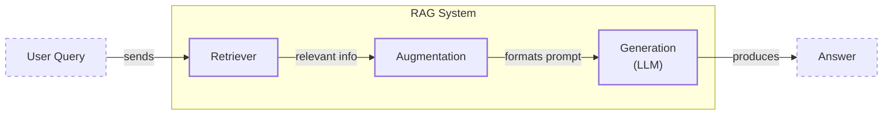
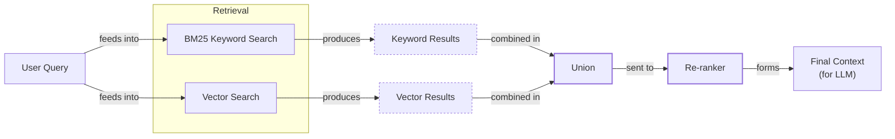
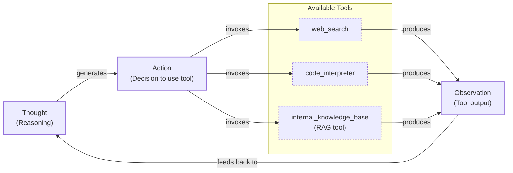

# Lesson 9: Retrieval-Augmented Generation

In our previous lessons, we built a solid foundation in AI Engineering. We explored the agent landscape, learned to distinguish between rigid workflows and autonomous agents, and, in Lesson 3, covered Context Engineering—the art of managing the information we feed to an LLM. We also saw how to get reliable data out of models using structured outputs in Lesson 4 and how to give agents the ability to act with tools and reasoning frameworks like ReAct in Lessons 6 and 7.

A core problem we still face is that LLMs are trained on fixed datasets. Their knowledge is static, making them prone to hallucination. During training, they essentially take a "closed-book exam" on the world's information. We do not yet have techniques that allow models to learn new information over time after deployment. While fine-tuning exists, it is inefficient for keeping knowledge current.

This is where Retrieval-Augmented Generation (RAG) comes in. RAG is a reliable solution that allows us to insert new knowledge into the context window at inference time. With RAG, we give the LLM an "open-book exam" by connecting it to external, real-time knowledge sources. Instead of memorizing everything, the model can look up information when needed, just like a human using a cheat sheet or a manual. As a key method within the Context Engineering discipline we covered in Lesson 3, RAG is fundamental to building grounded and trustworthy AI.

This lesson will cover the what and how of basic RAG before moving on to the advanced and agentic patterns that power modern AI systems. We will also contrast retrieval with agent memory, a topic we will explore in detail in Lesson 10. With the problem and motivation clear, we’ll first decompose RAG into its core components so you can see where each responsibility lives.

## The RAG System: Core Components

Understanding the components of RAG is the first step in the Context Engineering process of designing effective retrieval systems. At its core, RAG can be broken down into three conceptual pillars that work together to ground an LLM's response in external data.

**Retrieval:** This is the engine responsible for finding relevant information. When a user sends a query, the retriever searches an external knowledge base to find the most relevant pieces of information [[1]](https://blogs.nvidia.com/blog/what-is-retrieval-augmented-generation/), [[2]](https://decodingml.substack.com/p/rag-fundamentals-first?utm_source=publication-search). This search often relies on vector embeddings, which are numerical representations of text that capture semantic meaning. These embeddings are stored in a specialized vector database that can quickly find the most similar vectors to the query vector using techniques like cosine similarity [[3]](https://towardsai.net/p/l/a-complete-guide-to-rag), [[4]](https://qdrant.tech/articles/what-is-rag-in-ai/).

**Augmentation:** This is the process of taking the information found by the retriever and preparing it for the LLM. The retrieved text chunks are formatted and inserted into the prompt, along with the original user query and instructions, creating an augmented context that guides the model [[5]](https://neo4j.com/blog/developer/fine-tuning-vs-rag/).

**Generation:** In the final step, the LLM receives the augmented prompt and generates an answer. Because the prompt now contains specific, relevant information from the external knowledge base, the model's response is grounded in that data, making it more accurate and reliable [[2]](https://decodingml.substack.com/p/rag-fundamentals-first?utm_source=publication-search), [[6]](https://www.ibm.com/think/topics/retrieval-augmented-generation).

Image 1: A flowchart illustrating the core components and data flow of a RAG system.

Now that you can name each moving part, let’s see how they line up across the two phases of a real system.

## The RAG Pipeline: Ingestion and Retrieval

The end-to-end RAG workflow consists of two distinct phases: an offline ingestion phase to prepare the knowledge base and an online retrieval phase to answer user queries in real-time [[7]](https://medium.com/@derrickryangiggs/rag-pipeline-deep-dive-ingestion-chunking-embedding-and-vector-search-abd3c8bfc177).

### Phase 1: Offline Ingestion & Indexing

This phase happens before your users ever ask a question. It is the process of preparing your documents and populating the knowledge base [[8]](https://newsletter.systemdesign.one/p/how-rag-works).

1.  **Load:** The first step is to load your documents from various sources, such as PDFs, websites, or APIs. Tools like Unstructured or document loaders in frameworks like LangChain and LlamaIndex are commonly used for this [[8]](https://newsletter.systemdesign.one/p/how-rag-works).
2.  **Split:** Next, the content is broken down into smaller, meaningful pieces called chunks. This is a critical step, as you want to avoid splitting a coherent idea across two different chunks. You can use rule-based splitters, like LangChain’s `RecursiveCharacterTextSplitter`, or more advanced semantic chunkers [[9]](https://47billion.com/blog/rag-system-in-production-why-it-fails-and-how-to-fix-it/).
3.  **Embed:** Each chunk is then converted into a vector embedding using an embedding model. Popular models include those from OpenAI, Google, Cohere, and open-source variants like BGE, which are accessible through platforms like Hugging Face [[2]](https://decodingml.substack.com/p/rag-fundamentals-first?utm_source=publication-search).
4.  **Store:** Finally, the embeddings and their corresponding text are stored in a vector database or a search index that supports fast similarity searches. Examples include local libraries like FAISS or scalable solutions like Milvus, Qdrant, Pinecone, and Azure AI Search [[4]](https://qdrant.tech/articles/what-is-rag-in-ai/).

### Phase 2: Online Retrieval & Generation

This phase is triggered when a user submits a query to the system.

1.  **Embed:** The user's query is converted into a vector using the same embedding model used during the ingestion phase. This ensures that the query and the document chunks are in the same vector space, allowing for meaningful comparison [[4]](https://qdrant.tech/articles/what-is-rag-in-ai/).
2.  **Search:** The system uses the query vector to search the vector database and retrieve the top-k most similar document chunks. This is typically done using a vector similarity metric like cosine similarity [[10]](https://medium.com/@robi.tomar72/how-rag-actually-works-embeddings-vector-databases-indexing-retrieval-explained-simply-3d1ca45fe1bf).
3.  **Generate:** The retrieved chunks are combined with the original query and a set of instructions into a single prompt. This augmented prompt is then sent to the LLM, which generates a final, grounded answer. As we saw in Lesson 4, this is a great place to use structured outputs to ensure the answer includes citations back to the source documents [[2]](https://decodingml.substack.com/p/rag-fundamentals-first?utm_source=publication-search).

```mermaid
flowchart LR
  %% Phase 1: Offline Ingestion & Indexing
  subgraph "Offline Ingestion & Indexing"
    Documents["Documents"]
    Load["Load<br/>(Unstructured, LangChain, LlamaIndex)"]
    Split["Split<br/>(RecursiveCharacterTextSplitter, SemanticSplitter)"]
    Chunks["Chunks"]
    Embed_offline["Embed<br/>(OpenAI, Google Gemini, Cohere, Voyage, bge)"]
    VectorEmbeddings["Vector Embeddings"]
    Store["Store<br/>(FAISS, Milvus, Qdrant, Pinecone, Elasticsearch/OpenSearch)"]
    VectorDatabase["Vector Database"]

    Documents -- "processed by" --> Load
    Load -- "outputs" --> Split
    Split -- "creates" --> Chunks
    Chunks -- "sent to" --> Embed_offline
    Embed_offline -- "creates" --> VectorEmbeddings
    VectorEmbeddings -- "sent to" --> Store
    Store -- "stores in" --> VectorDatabase
  end

  %% Phase 2: Online Retrieval & Generation
  subgraph "Online Retrieval & Generation"
    UserQuery["User Query"]
    Embed_online["Embed<br/>(same model as ingestion)"]
    QueryVector["Query Vector"]
    Search["Search<br/>(vector similarity in Elasticsearch/OpenSearch, Pinecone, FAISS)"]
    TopKChunks["Top-K Chunks"]
    Generate["Generate<br/>(structured outputs, LLM call)"]
    GroundedAnswer["Grounded Answer"]

    UserQuery -- "initiated" --> Embed_online
    Embed_online -- "creates" --> QueryVector
    QueryVector -- "used to" --> Search
    Search -- "finds" --> TopKChunks
    TopKChunks -- "used by" --> Generate
    UserQuery -- "context for" --> Generate
    Generate -- "produces" --> GroundedAnswer
  end

  %% Cross-phase interaction
  VectorDatabase -- "queried by" --> Search

  %% Visual grouping
  classDef phase_header fill:#f9f,stroke:#333,stroke-width:2px
  class Documents,UserQuery phase_header
```

Image 2: A detailed flowchart showing the end-to-end RAG workflow, split into two main phases: Offline Ingestion & Indexing and Online Retrieval & Generation.

With the end-to-end path in place, the next question is quality. What are the advanced techniques to make retrieval more accurate and useful across messy, real-world data?

## Advanced RAG Techniques

A naive RAG pipeline is a good start, but production systems often require more sophisticated techniques to improve retrieval performance and handle complex queries. Here are some of the most effective advanced RAG methods.

### Hybrid Search

Vector search is great at understanding the semantic meaning of a query, but it can sometimes miss exact keywords, product codes, or specific jargon. Hybrid search solves this by combining the strengths of traditional keyword-based search (like BM25) with semantic vector search [[11]](https://mlpills.substack.com/p/issue-76-optimize-rag-with-hybrid), [[12]](https://cubitrek.com/blog/hybrid-search-optimization-how-bm25-and-dense-vector-retrieval-work-together-for-superior-ai-search/). For example, if a user asks, "my bill keeps rolling over," a keyword search will find documents with the term "rollover," while a vector search can find related concepts like "carryover balance." By fusing the results from both, you get more comprehensive coverage.

Image 3: A flowchart illustrating the hybrid retrieval flow.

### Re-ranking

The initial retrieval step is optimized for speed and recall, meaning it casts a wide net to find potentially relevant documents. However, the best match might not be at the top of the list. A re-ranker is a second, more precise model (often a cross-encoder) that re-scores the initial set of retrieved documents [[13]](https://redis.io/blog/10-techniques-to-improve-rag-accuracy/). It takes the query and each candidate document as a pair, providing a more accurate relevance score. This two-stage process—retrieve broadly, then re-rank precisely—significantly improves the quality of the context sent to the LLM [[14]](https://apxml.com/courses/optimizing-rag-for-production/chapter-2-advanced-retrieval-optimization/reranking-architectures-rag).

### Query Transformations

Sometimes the user's query is not the best input for the retrieval system. Query transformation techniques modify the original query to improve retrieval results.
*   **Decomposition:** This method breaks down a complex, multi-part question into several simpler sub-questions [[15]](https://docs.nvidia.com/rag/latest/query_decomposition.html). For example, "What’s our travel policy for conferences in Europe this year?" could be split into separate queries about the general travel policy, conference rules, Europe-specific guidelines, and recent updates. The system retrieves documents for each sub-question and then merges the results.
*   **Hypothetical Document Embeddings (HyDE):** This technique addresses the fact that user queries are often phrased differently than the answers contained in documents. HyDE prompts an LLM to generate a hypothetical, ideal answer to the user's query. This generated answer is then embedded and used for the vector search, as it is more likely to be semantically similar to the actual documents in the knowledge base [[9]](https://47billion.com/blog/rag-system-in-production-why-it-fails-and-how-to-fix-it/).

### Advanced Chunking Strategies

How you split your documents can have a huge impact on retrieval quality. Moving beyond simple fixed-size chunks is often necessary.
*   **Semantic chunking** groups text based on topical coherence, ensuring that each chunk represents a single, complete idea [[16]](https://cloudurable.com/blog/advanced-rag-techniques-that-will-transform-your-l/).
*   **Layout-aware chunking** is crucial for documents like PDFs, where visual structure is important. For example, it keeps table rows intact, preventing a product name from being separated from its price.
*   **Context-enriched chunking** (or contextual retrieval) prepends a summary or context to each chunk before embedding it, helping the embedding model better understand the chunk's place within the larger document [[17]](https://www.anthropic.com/news/contextual-retrieval).

### GraphRAG

For questions about complex relationships, standard document retrieval can fall short. GraphRAG builds a knowledge graph from your documents, with entities as nodes and relationships as edges. This allows the system to answer multi-hop questions that require connecting information across different documents or concepts [[18]](https://arxiv.org/html/2404.16130). For example, to answer, "Which incidents were caused by weekend deploys that also touched the login service?" the system can traverse the graph, linking deployment records to incident tickets via the services they affected.

These techniques increase retrieval quality. Next, we’ll see how retrieval becomes one tool that an agent can choose to use as it reasons.

## Agentic RAG

In Lessons 7 and 8, we introduced the ReAct framework, where an agent cycles through Thought, Action, and Observation to solve problems. Agentic RAG is the application of this pattern to information retrieval. Instead of a fixed pipeline, retrieval becomes a tool that a reasoning agent can choose to use, or not use, as part of a larger plan [[19]](https://towardsdatascience.com/agentic-rag-vs-classic-rag-from-a-pipeline-to-a-control-loop/), [[20]](https://weaviate.io/blog/what-is-agentic-rag).

The core distinction is the shift from a linear workflow to an adaptive, iterative process.
*   **Standard RAG** is a pre-determined workflow: Retrieve → Augment → Generate. It is powerful but rigid, following the same path for every query.
*   **Agentic RAG** allows an LLM-powered agent to decide when to retrieve, what to retrieve, and how to use the retrieved information. The agent can reformulate queries, choose between different knowledge sources, or even chain multiple retrieval steps together [[21]](https://www.pingcap.com/article/agentic-rag-vs-traditional-rag-key-differences-benefits/).

This agentic approach unlocks several new capabilities. The agent can iteratively refine its search. If the first retrieval pass returns a vague policy document, the agent can reason that it needs more specific information, formulate a new query like "EU customer data policy 2024 updates," and retrieve again. It can also choose which knowledge base to search, for instance, querying `search_incident_runbooks` for an outage instead of `search_marketing_pages` [[22]](https://www.llamaindex.ai/blog/rag-is-dead-long-live-agentic-retrieval).

Furthermore, an agent can fuse information from its RAG tool with outputs from other tools, like a web search or a code interpreter, to construct a comprehensive answer. For example, it might retrieve an internal company policy, then use a web search to verify that the policy complies with current government regulations, and finally synthesize the information from both sources.

Let's look at a conceptual thought process for an agent:
*   **Thought:** "The user is asking about our data retention policy for EU customers in 2024. My internal knowledge base has a policy from 2023, which might be outdated."
*   **Action:** `internal_knowledge_base(query="EU data retention policy 2024")`
*   **Observation:** "The retrieved document mentions recent amendments but lacks specific citations."
*   **Thought:** "I need to verify this externally."
*   **Action:** `web_search(query="Official EU data retention regulation 2024")`
*   **Observation:** "Found the official directive update."
*   **Thought:** "Now I can synthesize an answer using both the internal policy and the official directive, highlighting the changes from the 2023 version."

This transforms RAG from a simple database lookup into a dynamic conversation with a research assistant.

Image 4: Circular flowchart illustrating an agent's main loop in Agentic RAG.

You now understand both a linear RAG pipeline and how an agent can control retrieval when needed. Let’s wrap up by situating RAG in the wider AI Engineering toolkit and previewing what comes next.

## Conclusion

We have seen that RAG is the most widely used solution to the LLM knowledge problem, from its basic components to the advanced techniques required for production-grade quality. The future of knowledge retrieval is agentic, where RAG acts as a tool within a reasoning loop. This approach reduces hallucinations, enables customization with proprietary data, and builds user trust through verifiable, source-backed answers.

RAG is not a niche skill but a foundational competency for the modern AI Engineer and a core part of Context Engineering. In the next lesson, we will explore Memory for Agents, and see how short-term and long-term memory systems complement the retrieval mechanisms we have discussed here. Later in the course, we will also cover how to build robust evaluation pipelines to measure retrieval quality and monitor these systems in production.

## References

- [1] [What Is Retrieval-Augmented Generation, aka RAG?](https://blogs.nvidia.com/blog/what-is-retrieval-augmented-generation/)
- [2] [Retrieval-Augmented Generation (RAG) Fundamentals First](https://decodingml.substack.com/p/rag-fundamentals-first?utm_source=publication-search)
- [3] [A Complete Guide to RAG](https://towardsai.net/p/l/a-complete-guide-to-rag)
- [4] [What is RAG: Understanding Retrieval-Augmented Generation](https://qdrant.tech/articles/what-is-rag-in-ai/)
- [5] [Knowledge Graphs and LLMs: Fine-Tuning vs. Retrieval-Augmented Generation](https://neo4j.com/blog/developer/fine-tuning-vs-rag/)
- [6] [What Is Retrieval-Augmented Generation, aka RAG?](https://www.ibm.com/think/topics/retrieval-augmented-generation)
- [7] [RAG Pipeline Deep Dive: Ingestion (Chunking, Embedding) and Vector Search](https://medium.com/@derrickryangiggs/rag-pipeline-deep-dive-ingestion-chunking-embedding-and-vector-search-abd3c8bfc177)
- [8] [How RAG Works: The Details of the Retrieval-Augmented Generation Pipeline](https://newsletter.systemdesign.one/p/how-rag-works)
- [9] [RAG System in Production: Why It Fails and How to Fix It](https://47billion.com/blog/rag-system-in-production-why-it-fails-and-how-to-fix-it/)
- [10] [How RAG Actually Works: Embeddings, Vector Databases, Indexing & Retrieval Explained Simply](https://medium.com/@robi.tomar72/how-rag-actually-works-embeddings-vector-databases-indexing-retrieval-explained-simply-3d1ca45fe1bf)
- [11] [Issue #76 - Optimize RAG with Hybrid search](https://mlpills.substack.com/p/issue-76-optimize-rag-with-hybrid)
- [12] [Hybrid Search Optimization: How BM25 and Dense Vector Retrieval Work Together for Superior AI Search](https://cubitrek.com/blog/hybrid-search-optimization-how-bm25-and-dense-vector-retrieval-work-together-for-superior-ai-search/)
- [13] [10 techniques to improve RAG accuracy](https://redis.io/blog/10-techniques-to-improve-rag-accuracy/)
- [14] [Reranking Architectures in RAG](https://apxml.com/courses/optimizing-rag-for-production/chapter-2-advanced-retrieval-optimization/reranking-architectures-rag)
- [15] [Query Decomposition](https://docs.nvidia.com/rag/latest/query_decomposition.html)
- [16] [Advanced RAG Techniques That Will Transform Your LLM Applications](https://cloudurable.com/blog/advanced-rag-techniques-that-will-transform-your-l/)
- [17] [Introducing Contextual Retrieval](https://www.anthropic.com/news/contextual-retrieval)
- [18] [From Local to Global: A GraphRAG Approach to Query-Focused Summarization](https://arxiv.org/html/2404.16130)
- [19] [Agentic RAG vs Classic RAG: From a Pipeline to a Control Loop](https://towardsdatascience.com/agentic-rag-vs-classic-rag-from-a-pipeline-to-a-control-loop/)
- [20] [What is Agentic RAG](https://weaviate.io/blog/what-is-agentic-rag)
- [21] [Agentic RAG vs. Traditional RAG: Key Differences and Benefits](https://www.pingcap.com/article/agentic-rag-vs-traditional-rag-key-differences-benefits/)
- [22] [RAG is dead, long live agentic retrieval](https://www.llamaindex.ai/blog/rag-is-dead-long-live-agentic-retrieval)