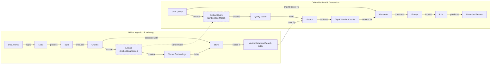
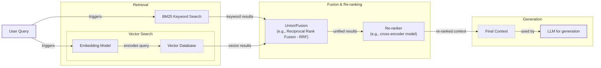
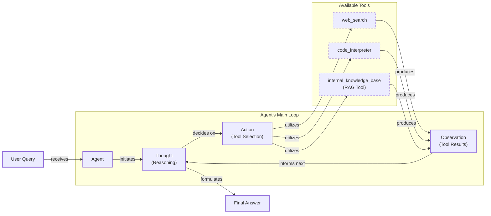

# Lesson 9: Retrieval-Augmented Generation (RAG)

In our previous lessons, we built a solid foundation in AI engineering. We explored the agent landscape, distinguished between LLM workflows and agents, and mastered context engineering—the art of feeding the right information to a model. We also learned how to give agents tools and make them reason with frameworks like ReAct. Now, we will tackle one of the most important challenges in building intelligent systems: knowledge.

LLMs are trained on a fixed dataset, which means their knowledge is static and quickly becomes outdated. They are essentially taking a "closed-book exam" on the world's information. When they encounter a question outside their training data, they often "hallucinate," inventing plausible but incorrect answers [[1]](https://neo4j.com/blog/developer/fine-tuning-vs-rag/). While fine-tuning can teach a model new things, it is slow, expensive, and inefficient for keeping knowledge current. This approach creates a new, static snapshot of knowledge, which is not scalable for dynamic data [[2]](https://newsletter.systemdesign.one/p/how-rag-works).

Retrieval-Augmented Generation (RAG) solves this problem by giving an LLM an "open-book exam." Instead of relying on memorized facts, the model is connected to external, real-time knowledge sources. As we covered in Lesson 3 on Context Engineering, RAG is a core method AI engineers use to curate the context passed to an LLM, ensuring answers are accurate and grounded in verifiable data. It allows us to provide the right information at the right time without altering the model itself.

In this lesson, we will explore the fundamentals of RAG, from its core components to the advanced and agentic patterns that power modern AI applications. We will also see how retrieval complements agent memory, a topic we will cover in our next lesson. With the problem and motivation clear, we’ll first decompose RAG into its core components so you can see where each responsibility lives.

## The RAG System: Core Components

Understanding the components of RAG is the first step in designing effective systems as part of the Context Engineering process we learned about in Lesson 3. At its core, a RAG system is built on three conceptual pillars that work together to turn a user's question into a grounded, reliable answer [[3]](https://decodingml.substack.com/p/rag-fundamentals-first?utm_source=publication-search).

The first pillar is **Retrieval**. This is the engine responsible for finding relevant information from an external knowledge base. When a user asks a question, the retriever searches through documents or databases to find chunks of information most likely to contain the answer. This search is often powered by semantic similarity, which relies on vector embeddings. Text is converted into numerical vectors (embeddings) that capture its meaning, and these are stored in a vector database. The system then finds text with similar meaning to the user's query [[4]](https://qdrant.tech/articles/what-is-rag-in-ai/).

The second pillar is **Augmentation**. Once the retriever has found the most relevant information, this step takes that data and integrates it into the prompt that will be sent to the LLM. The original user query is combined with the retrieved context, effectively giving the model the "open book" it needs to answer the question accurately [[5]](https://www.topquadrant.com/resources/blog-retrieval-augmented-generation-explained/).

The final pillar is **Generation**. The LLM receives the augmented prompt, which contains both the user's question and the retrieved context. It then generates a final answer. Because the model now has the necessary information directly in its context, it can produce a response that is grounded in the provided data, often with citations, rather than relying on its internal, static knowledge [[3]](https://decodingml.substack.com/p/rag-fundamentals-first?utm_source=publication-search).

```mermaid
flowchart LR
  %% User Input
  UserQuery["User's Query"]

  %% RAG System
  subgraph "Retrieval Augmented Generation (RAG)"
    Retriever["Retriever"]
    RetrievedInfo["Retrieved Information"]
    Augmentation["Augmentation"]
    AugmentedPrompt["Augmented Prompt"]
  end

  %% Language Model
  subgraph "Large Language Model"
    Generator["Generator<br/>(LLM)"]
  end

  %% Final Output
  FinalAnswer["Final Answer"]

  %% Flow
  UserQuery -- "sent to" --> Retriever
  Retriever -- "fetches" --> RetrievedInfo
  RetrievedInfo -- "context for" --> Augmentation
  UserQuery -- "original query for" --> Augmentation
  Augmentation -- "creates" --> AugmentedPrompt
  AugmentedPrompt -- "fed to" --> Generator
  Generator -- "produces" --> FinalAnswer

  %% Visual grouping
  classDef data stroke-dasharray:3,3
  classDef process stroke-width:2px
  class UserQuery,RetrievedInfo,AugmentedPrompt,FinalAnswer data
  class Retriever,Augmentation,Generator process
```

Image 1: Flowchart illustrating the core components and data flow of a Retrieval Augmented Generation (RAG) system.

With these moving parts identified, let’s see how they are organized across the two distinct phases of a production RAG system.

## The RAG Pipeline: Ingestion and Retrieval

A complete RAG system operates in two main phases: an offline pipeline for preparing data and an online pipeline for answering queries in real time [[6]](https://medium.com/@derrickryangiggs/rag-pipeline-deep-dive-ingestion-chunking-embedding-and-vector-search-abd3c8bfc177), [[2]](https://newsletter.systemdesign.one/p/how-rag-works). Understanding this separation is key to building and maintaining an effective RAG application.

The first phase is **Offline Ingestion & Indexing**. This is where you prepare your knowledge base so it can be searched efficiently. This pipeline runs whenever new data is available or existing documents are updated. It involves four main steps:
1.  **Load:** Documents are ingested from various sources, such as PDFs, websites, or APIs.
2.  **Split:** The raw content is broken down into smaller, semantically meaningful chunks. This is a critical step, as you want to avoid splitting a single idea across multiple chunks.
3.  **Embed:** Each chunk of text is converted into a numerical representation, called a vector embedding, using an embedding model. These vectors capture the semantic meaning of the text [[7]](https://wandb.ai/mostafaibrahim17/ml-articles/reports/Vector-Embeddings-in-RAG-Applications--Vmlldzo3OTk1NDA5).
4.  **Store:** The embeddings and their corresponding text chunks are loaded into a specialized vector database or search index, which is optimized for fast similarity lookups [[8]](https://pub.towardsai.net/vector-databases-in-practice-building-a-realistic-hybrid-search-rag-system-with-qdrant-7b8f4a6e41e0).

The second phase is **Online Retrieval & Generation**, which happens in real time when a user asks a question.
1.  **Query & Embed:** The user’s query is taken and converted into a vector embedding using the *same* embedding model from the ingestion phase. This ensures the query and the documents exist in the same vector space.
2.  **Search:** The system searches the vector database to find the document chunks whose embeddings are most similar to the query's embedding. This is often a "top-k" search, where 'k' is the number of chunks to retrieve.
3.  **Generate:** A final prompt is constructed, combining the original user query, the retrieved chunks, and a set of instructions. This augmented prompt is then fed to the LLM, which generates a grounded answer, ideally with citations pointing back to the source documents, which can be formatted using the structured output techniques we learned in Lesson 4.

Image 2: A detailed Mermaid diagram illustrating the end-to-end RAG workflow, divided into two main phases: "Offline Ingestion & Indexing" and "Online Retrieval & Generation".

With this end-to-end path in place, the next question is quality. Let's look at the advanced techniques that make retrieval more accurate and useful across messy, real-world data.

## Advanced RAG Techniques

A basic RAG pipeline is a great start, but production systems often require more sophisticated techniques to achieve high accuracy. These advanced methods focus on improving the quality of the retrieval step, ensuring the LLM gets the most relevant and precise context possible.

**Hybrid Search** combines keyword-based search (like BM25) for precision with vector search for semantic meaning. For example, in customer support, if a user writes “my bill keeps rolling over,” keyword search finds “rollover” articles, while semantic search also surfaces “carryover balance” guides. Together, they cover different wordings of the same issue [[9]](https://pr-peri.github.io/blogpost/2026/03/05/blogpost-hybrid-search.html).

**Re-ranking** uses a second, more powerful cross-encoder model to re-evaluate a smaller set of candidate documents. This model processes the query and each document *together* to produce a more accurate relevance score. For instance, in product help, a query for “how to connect my account” would have a step-by-step guide ranked higher than a press release after re-ranking [[10]](https://apxml.com/courses/optimizing-rag-for-production/chapter-2-advanced-retrieval-optimization/reranking-architectures-rag).

**Query Transformations** rewrite the user's query for better retrieval. **Decomposition** breaks a complex question like “What’s our travel policy for conferences in Europe this year?” into sub-queries about the policy, conference definitions, and Europe-specific rules [[11]](https://docs.nvidia.com/rag/latest/query_decomposition.html). **Hypothetical Document Embeddings (HyDE)** involves generating a hypothetical answer first and using its embedding for the search, which often aligns better with the source documents [[12]](https://47billion.com/blog/rag-system-in-production-why-it-fails-and-how-to-fix-it/).

**Advanced Chunking Strategies** move beyond fixed-size chunks. **Semantic chunking** groups text by topic, and **layout-aware chunking** preserves the structure of tables and forms. This ensures that related information, like a full "Reimbursements" section with its spending caps, is not split across different chunks [[13]](https://learn.microsoft.com/en-us/azure/developer/ai/advanced-retrieval-augmented-generation).

**GraphRAG** uses knowledge graphs to retrieve information, which excels at answering multi-hop questions about complex relationships. For example, it can answer, "Which shoes get the most size-related returns and were featured in last month’s ads?" by traversing connections between returns, products, and marketing data [[14]](https://arxiv.org/html/2404.16130), [[15]](https://atlan.com/know/what-is-graphrag/).

Image 3: A Mermaid diagram illustrating the hybrid retrieval flow in advanced RAG techniques.

These techniques increase retrieval quality. Next, we’ll see how retrieval becomes one of many tools that an agent can choose to use as it reasons about a problem.

## Agentic RAG

So far, we have treated RAG as a linear pipeline. However, its potential is fully realized when it becomes a dynamic tool for an AI agent. As we explored in Lessons 7 and 8, a ReAct-style agent operates in a "Thought, Action, Observation" loop. Agentic RAG is this pattern in action, where one of the available "Actions" is to retrieve from a knowledge base.

The core distinction is the shift from a fixed process to an adaptive one [[16]](https://towardsdatascience.com/agentic-rag-vs-classic-rag-from-a-pipeline-to-a-control-loop/).
-   **Standard RAG** is a rigid, one-pass workflow: Retrieve -> Augment -> Generate.
-   **Agentic RAG** is an iterative loop where the agent decides *if*, *when*, and *how* to retrieve information.

This enables advanced capabilities. The agent can iteratively refine its search, choose between knowledge sources, and fuse information from the RAG tool with other tools, like a web search, to synthesize a comprehensive answer [[17]](https://medium.com/@gaddam.rahul.kumar/agentic-rag-vs-traditional-rag-b1a156f72167). It is important to note that agents use many tools, and retrieval is just one of them. Labeling an entire system "agentic RAG" can be too narrow, as it overlooks the agent's ability to perform other actions like web searches or code execution.

Here is a conceptual example of an agent's thought process:
*   **Thought:** The user is asking about "2024 EU data retention rules." My internal knowledge base only has the 2023 policy, which is likely outdated.
*   **Action:** `retrieve(internal_policy, query="EU data retention 2024")`
*   **Observation:** The retrieved document mentions amendments but lacks specific citations.
*   **Thought:** I need external verification to confirm the latest changes.
*   **Action:** `web_search(query="EU data retention rules 2024 official directive")`
*   **Observation:** The search returns a new official directive.
*   **Thought:** I can now synthesize an answer using both the internal policy and the new directive, highlighting the changes from 2023.

This transforms retrieval from a simple lookup into a dynamic conversation with a research assistant.

Image 4: A conceptual Mermaid diagram illustrating an agent's main loop in Agentic RAG, showing the iterative Thought -> Action -> Observation cycle and dynamic tool selection.

You now understand both a linear RAG pipeline and how an agent can control retrieval when needed. Let’s wrap up by situating RAG in the wider AI Engineering toolkit and previewing what comes next.

## Conclusion

We have seen that RAG is the most used solution to the LLM knowledge problem, grounding models in external data to reduce hallucinations and work with proprietary information. For production systems, advanced techniques are key for quality, and the future of knowledge retrieval is agentic. This approach builds user trust by making answers verifiable and source-backed.

For an AI engineer, RAG is a core skill and a key part of Context Engineering. In our next lesson, we will explore memory for agents and see how it complements retrieval to give agents a persistent understanding of their world. Later in the course, we will also cover other related topics, such as evaluating retrieval quality and monitoring these systems in production.

## References

- [1] Knowledge Graphs and LLMs: Fine-Tuning vs. Retrieval-Augmented Generation(https://neo4j.com/blog/developer/fine-tuning-vs-rag/)
- [2] RAG - A Deep Dive(https://newsletter.systemdesign.one/p/how-rag-works)
- [3] Retrieval-Augmented Generation (RAG) Fundamentals First(https://decodingml.substack.com/p/rag-fundamentals-first?utm_source=publication-search)
- [4] What is RAG: Understanding Retrieval-Augmented Generation(https://qdrant.tech/articles/what-is-rag-in-ai/)
- [5] Retrieval-Augmented Generation Explained(https://www.topquadrant.com/resources/blog-retrieval-augmented-generation-explained/)
- [6] RAG Pipeline Deep Dive: Ingestion, Chunking, Embedding, and Vector Search(https://medium.com/@derrickryangiggs/rag-pipeline-deep-dive-ingestion-chunking-embedding-and-vector-search-abd3c8bfc177)
- [7] Vector Embeddings in RAG Applications(https://wandb.ai/mostafaibrahim17/ml-articles/reports/Vector-Embeddings-in-RAG-Applications--Vmlldzo3OTk1NDA5)
- [8] Vector Databases in Practice: Building a Realistic Hybrid-Search RAG System with Qdrant(https://pub.towardsai.net/vector-databases-in-practice-building-a-realistic-hybrid-search-rag-system-with-qdrant-7b8f4a6e41e0)
- [9] Hybrid Search: The secret to production-grade RAG(https://pr-peri.github.io/blogpost/2026/03/05/blogpost-hybrid-search.html)
- [10] Reranking Architectures in RAG(https://apxml.com/courses/optimizing-rag-for-production/chapter-2-advanced-retrieval-optimization/reranking-architectures-rag)
- [11] Query Decomposition(https://docs.nvidia.com/rag/latest/query_decomposition.html)
- [12] RAG System in Production: Why It Fails and How to Fix It(https://47billion.com/blog/rag-system-in-production-why-it-fails-and-how-to-fix-it/)
- [13] Build advanced retrieval-augmented generation systems(https://learn.microsoft.com/en-us/azure/developer/ai/advanced-retrieval-augmented-generation)
- [14] From Local to Global: A GraphRAG Approach to Query-Focused Summarization(https://arxiv.org/html/2404.16130)
- [15] What is GraphRAG?(https://atlan.com/know/what-is-graphrag/)
- [16] Agentic RAG vs Classic RAG: From a Pipeline to a Control Loop(https://towardsdatascience.com/agentic-rag-vs-classic-rag-from-a-pipeline-to-a-control-loop/)
- [17] Agentic RAG vs Traditional RAG(https://medium.com/@gaddam.rahul.kumar/agentic-rag-vs-traditional-rag-b1a156f72167)