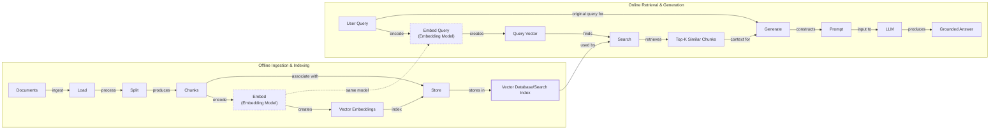
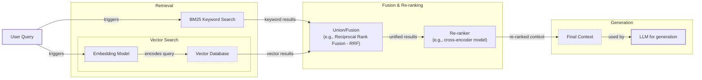
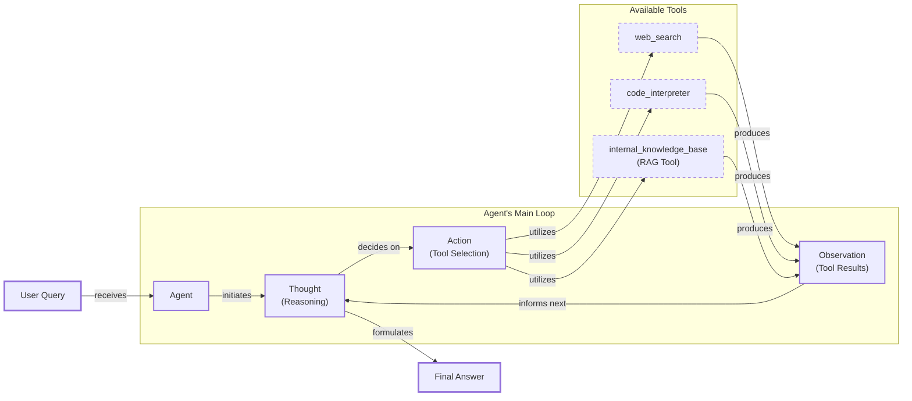

# Lesson 9: Retrieval-Augmented Generation (RAG)

In our previous lessons, we built a solid foundation in AI engineering. We explored the agent landscape, distinguished between LLM workflows and agents, and mastered context engineering—the art of feeding the right information to a model. We also learned how to give agents tools and make them reason with frameworks like ReAct. Now, we will tackle one of the most critical challenges in building intelligent systems: knowledge.

LLMs are trained on a fixed dataset, which means their knowledge is static and quickly becomes outdated. They are essentially taking a "closed-book exam" on the world's information. When they encounter a question outside their training data, they often "hallucinate," inventing plausible but incorrect answers. While fine-tuning can teach a model new things, it is slow, expensive, and inefficient for keeping knowledge current.

This is where Retrieval-Augmented Generation (RAG) comes in. RAG is a powerful and reliable solution that gives an LLM an "open-book exam." Instead of relying on memorized facts, the model is connected to external, real-time knowledge sources. As we covered in Lesson 3 on Context Engineering, RAG is a core method AI engineers use to curate the context passed to an LLM, ensuring answers are accurate and grounded in verifiable data.

In this lesson, we will explore the fundamentals of RAG, from its core components to the advanced and agentic patterns that power modern AI applications. We will also see how retrieval complements agent memory, a topic we will dive into in our next lesson. With the problem and motivation clear, we’ll first decompose RAG into its core components so you can see where each responsibility lives.

## The RAG System: Core Components

Understanding the components of RAG is the first step in designing effective systems as part of the Context Engineering process we learned about in Lesson 3. At its core, a RAG system is built on three conceptual pillars that work together to turn a user's question into a grounded, reliable answer.

The first pillar is **Retrieval**. This is the engine responsible for finding relevant information from an external knowledge base. When a user asks a question, the retriever searches through documents, databases, or other data sources to find chunks of information that are most likely to contain the answer. This search is often powered by semantic similarity, using vector embeddings and vector databases to find text with similar meaning, but it can also use traditional keyword-based search.

The second pillar is **Augmentation**. Once the retriever has found the most relevant information, this step takes that data and integrates it into the prompt that will be sent to the LLM. The original user query is combined with the retrieved context, effectively giving the model the "open book" it needs to answer the question accurately.

The final pillar is **Generation**. The LLM receives the augmented prompt—containing both the user's question and the retrieved context—and generates a final answer. Because the model now has the necessary information directly in its context, it can produce a response that is grounded in the provided data, often with citations, rather than relying on its internal, static knowledge.

```mermaid
flowchart LR
  %% User Input
  UserQuery["User's Query"]

  %% RAG System
  subgraph "Retrieval Augmented Generation (RAG)"
    Retriever["Retriever"]
    RetrievedInfo["Retrieved Information"]
    Augmentation["Augmentation"]
    AugmentedPrompt["Augmented Prompt"]
  end

  %% Language Model
  subgraph "Large Language Model"
    Generator["Generator<br/>(LLM)"]
  end

  %% Final Output
  FinalAnswer["Final Answer"]

  %% Flow
  UserQuery -- "sent to" --> Retriever
  Retriever -- "fetches" --> RetrievedInfo
  RetrievedInfo -- "context for" --> Augmentation
  UserQuery -- "original query for" --> Augmentation
  Augmentation -- "creates" --> AugmentedPrompt
  AugmentedPrompt -- "fed to" --> Generator
  Generator -- "produces" --> FinalAnswer

  %% Visual grouping
  classDef data stroke-dasharray:3,3
  classDef process stroke-width:2px
  class UserQuery,RetrievedInfo,AugmentedPrompt,FinalAnswer data
  class Retriever,Augmentation,Generator process
```

Image 1: Flowchart illustrating the core components and data flow of a Retrieval Augmented Generation (RAG) system.

With these moving parts identified, let’s see how they are organized across the two distinct phases of a production RAG system.

## The RAG Pipeline: Ingestion and Retrieval

A complete RAG system operates in two main phases: an offline pipeline for preparing data and an online pipeline for answering queries in real time [[1]](https://medium.com/@derrickryangiggs/rag-pipeline-deep-dive-ingestion-chunking-embedding-and-vector-search-abd3c8bfc177), [[2]](https://newsletter.systemdesign.one/p/how-rag-works). Understanding this separation is key to building and maintaining an effective RAG application.

The first phase is **Offline Ingestion & Indexing**. This is where you prepare your knowledge base so it can be searched efficiently. This pipeline runs whenever new data is available or existing documents are updated. It involves four main steps:
1.  **Load:** Documents are ingested from various sources, such as PDFs, websites, or APIs.
2.  **Split:** The raw content is broken down into smaller, semantically meaningful chunks. This is a critical step, as you want to avoid splitting a single idea across multiple chunks.
3.  **Embed:** Each chunk of text is converted into a numerical representation, called a vector embedding, using an embedding model. These vectors capture the semantic meaning of the text [[3]](https://wandb.ai/mostafaibrahim17/ml-articles/reports/Vector-Embeddings-in-RAG-Applications--Vmlldzo3OTk1NDA5).
4.  **Store:** The embeddings and their corresponding text chunks are loaded into a specialized vector database or search index, which is optimized for fast similarity searches [[4]](https://pub.towardsai.net/vector-databases-in-practice-building-a-realistic-hybrid-search-rag-system-with-qdrant-7b8f4a6e41e0).

The second phase is **Online Retrieval & Generation**, which happens in real time when a user asks a question.
1.  **Query & Embed:** The user’s query is taken and converted into a vector embedding using the *same* embedding model from the ingestion phase. This ensures the query and the documents exist in the same vector space.
2.  **Search:** The system searches the vector database to find the document chunks whose embeddings are most similar to the query's embedding. This is often a "top-k" search, where 'k' is the number of chunks to retrieve.
3.  **Generate:** A final prompt is constructed, combining the original user query, the retrieved chunks, and a set of instructions. This augmented prompt is then fed to the LLM, which generates a grounded answer, ideally with citations pointing back to the source documents, which can be formatted using the structured output techniques we learned in Lesson 4.

Image 2: A detailed Mermaid diagram illustrating the end-to-end RAG workflow, divided into two main phases: "Offline Ingestion & Indexing" and "Online Retrieval & Generation".

With this end-to-end path in place, the next question is quality. Let's look at the advanced techniques that make retrieval more accurate and useful across messy, real-world data.

## Advanced RAG Techniques

A basic RAG pipeline is a great start, but production systems often require more sophisticated techniques to achieve high accuracy. These advanced methods focus on improving the quality of the retrieval step, ensuring the LLM gets the most relevant and precise context possible.

**Hybrid Search** is a powerful technique that combines traditional keyword-based search (like BM25) with modern vector search. Keyword search excels at finding exact matches for specific terms, like product codes or acronyms, while vector search is better at understanding semantic meaning and finding conceptually related content [[5]](https://pr-peri.github.io/blogpost/2026/03/05/blogpost-hybrid-search.html). By fusing the results of both, you get the best of both worlds—precision and recall. For example, a query for "rollover issue" would find documents with that exact phrase (keyword) as well as articles about "carryover balances" (semantic).

**Re-ranking** adds a second layer of refinement to the retrieval process. After an initial retrieval fetches a set of candidate documents (e.g., the top 50), a more powerful but slower model, called a cross-encoder, re-evaluates them. Unlike standard embedding models that process the query and documents separately, a cross-encoder examines the query and each document *together*, producing a more accurate relevance score [[6]](https://apxml.com/courses/optimizing-rag-for-production/chapter-2-advanced-retrieval-optimization/reranking-architectures-rag). This step ensures that the highest-quality documents are prioritized before being sent to the LLM.

**Query Transformations** rewrite the user's question to improve retrieval accuracy. One method is **decomposition**, which breaks a complex, multi-part question into several simpler sub-queries. For instance, "What is our travel policy for conferences in Europe this year?" could be broken down into separate questions about the general policy, conference rules, and Europe-specific guidelines [[7]](https://docs.nvidia.com/rag/latest/query_decomposition.html). Another technique is **Hypothetical Document Embeddings (HyDE)**, where an LLM first generates a hypothetical, ideal answer to the query. The embedding of this hypothetical answer is then used for the search, which often aligns better with the content of the actual source documents [[8]](https://47billion.com/blog/rag-system-in-production-why-it-fails-and-how-to-fix-it/).

**Advanced Chunking Strategies** move beyond splitting documents into fixed-size pieces. **Semantic chunking** groups text based on topical similarity, ensuring that related sentences stay together. **Layout-aware chunking** is designed for documents with complex structures like tables or forms, preserving the relationships between elements, such as keeping a price connected to its product name.

Finally, **GraphRAG** leverages knowledge graphs to answer questions about complex relationships that are often lost in simple text chunks. Instead of retrieving disconnected text, this approach traverses a graph of entities and their connections, which is ideal for multi-hop questions like identifying products with high return rates that were also part of a recent marketing campaign. This method directly addresses a common failure where systems retrieve correct facts but cannot synthesize them, with one study showing GraphRAG achieved 86% comprehensiveness on multi-hop tasks compared to 57% for traditional RAG [[9]](https://arxiv.org/html/2404.16130), [[10]](https://atlan.com/know/what-is-graphrag/), [[11]](https://towardsai.net/p/machine-learning/why-90-of-agentic-rag-projects-fail-and-how-to-build-one-that-actually-works-in-production), [[12]](https://dev.to/kuldeep_paul/ten-failure-modes-of-rag-nobody-talks-about-and-how-to-detect-them-systematically-7i4).

Image 3: A Mermaid diagram illustrating the hybrid retrieval flow in advanced RAG techniques.

These techniques increase retrieval quality. Next, we’ll see how retrieval becomes one of many tools that an agent can choose to use as it reasons about a problem.

## Agentic RAG

So far, we have treated RAG as a linear pipeline. However, its true power is unlocked when it becomes a dynamic tool for an AI agent. As we explored in Lessons 7 and 8, a ReAct-style agent operates in a "Thought, Action, Observation" loop. Agentic RAG is this pattern in action, where one of the available "Actions" is to retrieve from a knowledge base.

The core distinction is the shift from a fixed process to an adaptive one [[13]](https://towardsdatascience.com/agentic-rag-vs-classic-rag-from-a-pipeline-to-a-control-loop/).
-   **Standard RAG** is a rigid, one-pass workflow: Retrieve -> Augment -> Generate.
-   **Agentic RAG** is an iterative loop where the agent decides *if*, *when*, and *how* to retrieve information.

This enables advanced capabilities. The agent can **iteratively refine its search** by reformulating queries based on initial results. It can **choose between knowledge sources**, like `search_internal_docs` or `search_public_web`, based on the query. It can also **fuse information** from the RAG tool with other tools, like a web search, to synthesize a comprehensive answer [[14]](https://medium.com/@gaddam.rahul.kumar/agentic-rag-vs-traditional-rag-b1a156f72167).

However, this adaptability introduces trade-offs in latency and cost, along with new failure modes. An agent can get stuck in a loop, repeatedly retrieving without converging (**retrieval thrash**), or make excessive, cascading tool calls (**tool storms**). This transforms retrieval from a simple lookup into a dynamic conversation with a research assistant, but one that requires careful management [[15]](https://towardsdatascience.com/agentic-rag-failure-modes-retrieval-thrash-tool-storms-and-context-bloat-and-how-to-spot-them-early/).

Image 4: A conceptual Mermaid diagram illustrating an agent's main loop in Agentic RAG, showing the iterative Thought -> Action -> Observation cycle and dynamic tool selection.

You now understand both a linear RAG pipeline and how an agent can control retrieval when needed. Let’s wrap up by situating RAG in the wider AI Engineering toolkit and previewing what comes next.

## Conclusion

We have seen that RAG is the most widely used solution to the fundamental knowledge problem in LLMs. It provides a practical way to ground models in external data, reducing hallucinations and enabling them to work with proprietary or up-to-date information. For production-grade systems, advanced techniques like hybrid search and re-ranking are essential for quality, while the future of intelligent information access is undeniably agentic.

Ultimately, RAG builds user trust by making AI-generated answers verifiable and source-backed. For any AI engineer, mastering RAG is not just a useful skill but a foundational competency. It is a core component of Context Engineering, enabling the creation of reliable and knowledgeable AI systems.

In our next lesson, we will explore memory for agents, and see how short-term and long-term memory systems work alongside RAG to give agents a persistent understanding of their world. Later in the course, we will also cover the critical topics of evaluating retrieval quality and monitoring these systems in production.

## References

- [1] https://medium.com/@derrickryangiggs/rag-pipeline-deep-dive-ingestion-chunking-embedding-and-vector-search-abd3c8bfc177
- [2] https://newsletter.systemdesign.one/p/how-rag-works
- [3] https://wandb.ai/mostafaibrahim17/ml-articles/reports/Vector-Embeddings-in-RAG-Applications--Vmlldzo3OTk1NDA5
- [4] https://pub.towardsai.net/vector-databases-in-practice-building-a-realistic-hybrid-search-rag-system-with-qdrant-7b8f4a6e41e0
- [5] https://pr-peri.github.io/blogpost/2026/03/05/blogpost-hybrid-search.html
- [6] https://apxml.com/courses/optimizing-rag-for-production/chapter-2-advanced-retrieval-optimization/reranking-architectures-rag
- [7] https://docs.nvidia.com/rag/latest/query_decomposition.html
- [8] https://47billion.com/blog/rag-system-in-production-why-it-fails-and-how-to-fix-it/
- [9] https://arxiv.org/html/2404.16130
- [10] https://atlan.com/know/what-is-graphrag/
- [11] https://towardsai.net/p/machine-learning/why-90-of-agentic-rag-projects-fail-and-how-to-build-one-that-actually-works-in-production
- [12] https://dev.to/kuldeep_paul/ten-failure-modes-of-rag-nobody-talks-about-and-how-to-detect-them-systematically-7i4
- [13] https://towardsdatascience.com/agentic-rag-vs-classic-rag-from-a-pipeline-to-a-control-loop/
- [14] https://medium.com/@gaddam.rahul.kumar/agentic-rag-vs-traditional-rag-b1a156f72167
- [15] https://towardsdatascience.com/agentic-rag-failure-modes-retrieval-thrash-tool-storms-and-context-bloat-and-how-to-spot-them-early/